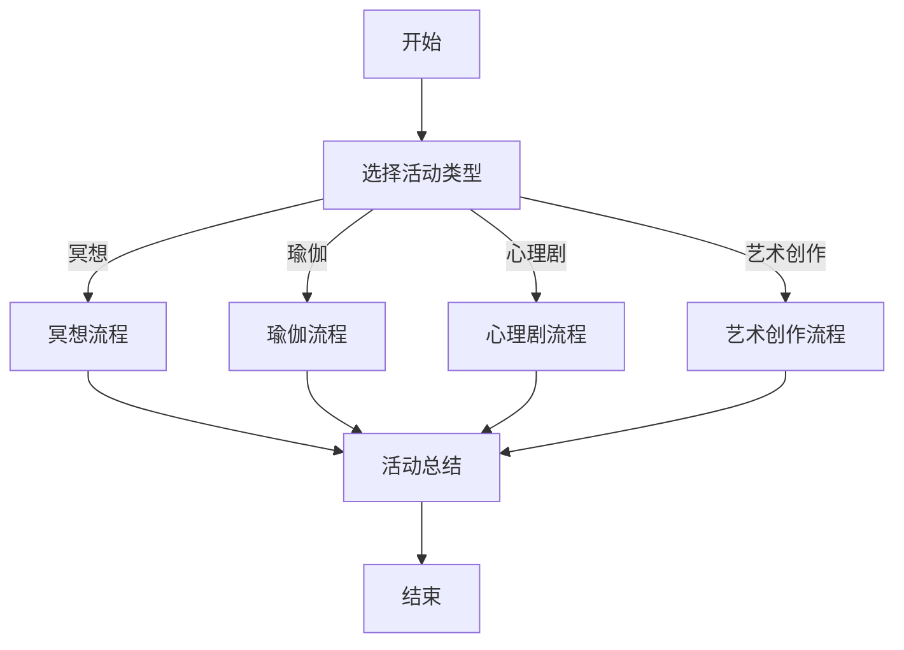
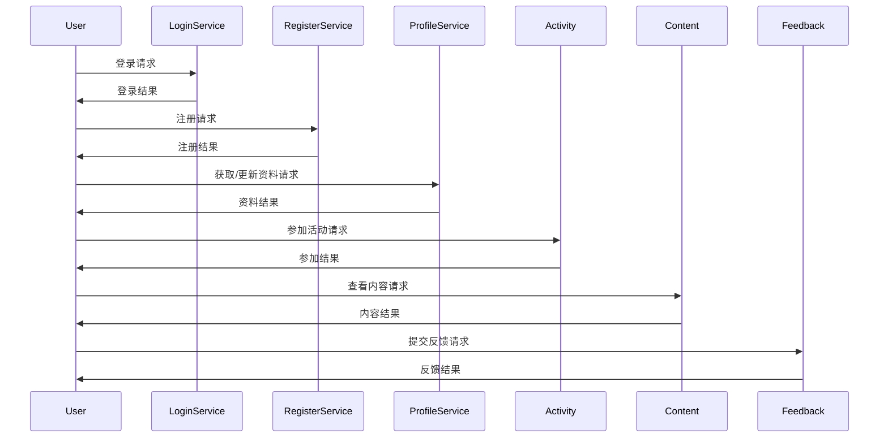

                 

### 新修道院周末：现代人的短期精神修行活动

关键词：短期精神修行，现代人，冥想，瑜伽，心理剧，艺术创作

摘要：在快节奏的现代生活中，人们常常感到精神疲惫和困惑。本文旨在探讨一种适合现代人的短期精神修行活动——新修道院周末，通过冥想、瑜伽、心理剧和艺术创作等多样化的方式，帮助人们在有限的时间内实现身心的放松与提升，达到精神上的平衡与和谐。

### 背景介绍

#### 问题背景

现代社会的生活节奏快速，竞争激烈，人们在工作和生活中承受着巨大的压力。焦虑、抑郁、情绪波动和注意力不集中等问题日益普遍，严重影响了人们的身心健康。传统精神修行方法虽然能够有效提升精神状态，但其需要长时间的坚持和实践，对现代人来说往往缺乏实际可操作性。

#### 问题描述

现代人面临的精神挑战主要包括以下几个方面：

1. **焦虑与压力**：工作压力、生活压力和各种责任使人们长期处于紧张状态，导致焦虑情绪的积累。
2. **情绪波动**：情绪不稳定，容易受到外界因素影响，导致情绪失控。
3. **注意力不集中**：在快节奏的生活中，人们往往难以集中注意力，容易分心。
4. **身心疲劳**：长时间的身心疲劳使人们感到精神不振，缺乏活力。

这些问题不仅影响了个人的生活质量，还对工作、学习和人际关系产生了负面影响。因此，寻找一种简单而有效的短期精神修行方法成为现代人迫切的需求。

#### 问题解决

《新修道院周末：现代人的短期精神修行活动》旨在为现代人提供一种可操作的短期精神修行方法。通过设计一系列简单、实用的修行活动，帮助读者在周末的有限时间里，通过自我反省、冥想、放松等方式，提升精神状态，达到身心平衡的目的。这些活动包括冥想、瑜伽、心理剧和艺术创作等，旨在满足不同人群的需求，帮助他们在短时间内实现身心的放松与提升。

#### 边界与外延

短期精神修行活动主要关注的是在周末或节假日等短暂时间内进行的精神提升活动。这些活动可以是个人独处，也可以是团体参与，形式灵活多样。活动地点可以选择在家、公园、寺庙等安静舒适的环境。参与人数可以根据实际情况灵活调整，但以小团体为宜，以确保活动的深度和效果。

#### 概念结构与核心要素组成

1. **短期精神修行活动**：指在周末或节假日等短暂时间内进行的精神提升活动，包括冥想、瑜伽、心理剧和艺术创作等。
2. **现代人**：指生活在现代社会，面临各种精神挑战的人群。
3. **精神提升**：通过一系列活动，实现身心的放松和平衡。
4. **方法**：包括冥想、瑜伽、心理剧和艺术创作等。

### 核心概念与联系

#### 核心概念

1. **冥想**：通过集中注意力，达到放松身心、提高注意力的目的。
2. **瑜伽**：一种结合体位练习、呼吸控制和冥想的精神修行方式。
3. **心理剧**：通过戏剧化的方式，帮助个体探索内心世界，解决心理问题。
4. **艺术创作**：通过绘画、写作等艺术活动，释放内心情绪，提升创造力。

#### 概念属性特征对比表格

| 概念       | 特征1         | 特征2         | 特征3         |
|------------|---------------|---------------|---------------|
| 冥想       | 放松身心      | 提高注意力    | 内心探索      |
| 瑜伽       | 体位练习      | 呼吸控制      | 身心平衡      |
| 心理剧     | 戏剧化探索    | 心理问题解决  | 情绪释放      |
| 艺术创作   | 情绪释放      | 创力提升      | 心灵表达      |

#### ER实体关系图架构的 Mermaid 流程图

```mermaid
erDiagram
  用户 ||--|{ 短期精神修行活动 }|--|| 目标
  用户 ||--|{ 冥想 }|--|| 活动类型
  用户 ||--|{ 瑜伽 }|--|| 活动类型
  用户 ||--|{ 心理剧 }|--|| 活动类型
  用户 ||--|{ 艺术创作 }|--|| 活动类型
```

### 算法原理讲解

#### 算法流程图



#### 算法原理详细讲解

短期精神修行活动的核心在于帮助个体在短时间内实现身心放松和情绪调节。不同的活动类型有着不同的原理和效果：

1. **冥想**：
   - **原理**：冥想通过集中注意力，达到放松身心、提高注意力的目的。其原理可以简单概括为“专注力训练”。
   - **流程**：
     1. 选择一个安静的环境。
     2. 通过深呼吸，放松身体。
     3. 集中注意力，将思维集中于一个焦点，如呼吸、内心感受等。
     4. 持续一段时间，逐渐延长冥想时间。
   - **效果**：冥想有助于降低焦虑、提高情绪稳定性和注意力集中能力。

2. **瑜伽**：
   - **原理**：瑜伽通过体位练习和呼吸控制，实现身心的平衡和放松。其原理可以简单概括为“身心协调训练”。
   - **流程**：
     1. 选择适合的瑜伽体位。
     2. 通过深呼吸，调整身体状态。
     3. 保持体位，专注于身体感受和呼吸。
     4. 按照序列进行练习，逐渐增加难度。
   - **效果**：瑜伽有助于增强身体柔韧性、提升能量水平、缓解压力。

3. **心理剧**：
   - **原理**：心理剧通过戏剧化的方式，帮助个体探索内心世界，解决心理问题。其原理可以简单概括为“情境模拟与心理分析”。
   - **流程**：
     1. 通过角色扮演，模拟内心冲突。
     2. 在指导者的引导下，深入内心，探索问题根源。
     3. 通过情景再现，释放情绪，找到解决问题的方法。
   - **效果**：心理剧有助于缓解情绪压力、提高心理弹性、增强自我认知。

4. **艺术创作**：
   - **原理**：艺术创作通过绘画、写作等艺术活动，释放内心情绪，提升创造力。其原理可以简单概括为“情绪宣泄与创造性激发”。
   - **流程**：
     1. 选择一种艺术形式，如绘画、写作等。
     2. 在创作过程中，专注于表达内心的感受和想法。
     3. 允许自己自由地释放情绪，无需担心技巧和形式。
     4. 完成作品后，进行反思和总结。
   - **效果**：艺术创作有助于减轻情绪负担、提升创造力和自我表达力。

### 算法原理详细讲解

#### 冥想

冥想是一种古老而现代的放松和提升精神状态的方法。其核心在于通过集中注意力，达到放松身心、提高注意力的目的。以下是冥想的详细原理、流程和效果：

1. **原理**：

   冥想的原理可以简单概括为“专注力训练”。在冥想过程中，个体需要将注意力集中在某个特定的对象上，如呼吸、内心感受或特定的视觉图像。通过持续地保持注意力，大脑逐渐进入一种放松而清醒的状态。

   - **专注力训练**：通过集中注意力，个体可以学会如何控制自己的思维，避免陷入杂念和焦虑之中。
   - **神经可塑性**：长期的冥想练习可以改变大脑的结构和功能，增强前额叶皮质的活跃度，提高注意力和自我控制能力。

2. **流程**：

   冥想的流程可以分为以下几个步骤：

   1. **选择一个安静的环境**：选择一个安静、舒适的地方进行冥想，避免噪音和干扰。
   2. **采取舒适的姿势**：可以选择坐姿、躺姿或半躺姿，保持身体放松，但姿势要稳定。
   3. **深呼吸**：通过深呼吸，放松身体。缓慢地吸气，感受胸腔的扩张；然后缓慢地呼气，感受身体的放松。
   4. **集中注意力**：将注意力集中在呼吸上，感受呼吸的进出，专注于呼吸的感觉。
      - 如果注意力离开呼吸，不要责怪自己，只需温和地将注意力带回到呼吸上。
   5. **持续冥想**：保持注意力集中一段时间，逐渐延长冥想时间，建议从5分钟开始，逐渐增加。

3. **效果**：

   冥想具有多种效果，包括：

   - **放松身心**：通过集中注意力，个体可以进入一种放松的状态，减轻身体的紧张和疲劳。
   - **提高注意力**：长期的冥想练习可以提高个体的注意力集中能力，减少分心现象。
   - **减轻焦虑**：冥想有助于降低焦虑水平，提高情绪稳定性。
   - **增强自我认知**：冥想可以帮助个体更好地了解自己的内心世界，提高自我意识和自我认知。

#### 瑜伽

瑜伽是一种结合体位练习、呼吸控制和冥想的精神修行方式。它不仅对身体有益，还可以提升精神状态。以下是瑜伽的详细原理、流程和效果：

1. **原理**：

   瑜伽的原理可以简单概括为“身心协调训练”。通过一系列的体位练习，瑜伽可以帮助个体达到身体和精神的平衡。

   - **体位练习**：瑜伽中的各种体位练习有助于增强肌肉力量、提高柔韧性，同时还可以刺激内脏器官，促进血液循环。
   - **呼吸控制**：瑜伽中的呼吸控制（Pranayama）可以帮助个体调整呼吸节奏，提高氧气供应，增强身体和精神的活力。
   - **冥想**：瑜伽中的冥想部分可以帮助个体达到内心的平静和专注。

2. **流程**：

   瑜伽的流程可以分为以下几个步骤：

   1. **热身**：开始瑜伽练习前，进行一些简单的热身活动，如慢跑、深呼吸等，以准备身体。
   2. **体位练习**：按照特定的序列，进行各种体位练习。常见的体位包括山式、树式、三角式、骆驼式等。
      - 在练习过程中，保持身体正直，专注于呼吸，尽量保持每个体位的姿势。
   3. **呼吸控制**：在体位练习之间，进行一些呼吸控制练习，如深呼吸、呼气、屏息等。
      - 呼吸控制可以帮助个体更好地控制身体和情绪，提高练习效果。
   4. **放松**：在瑜伽练习结束时，进行全身放松练习，如放松呼吸、瑜伽休息术等。
      - 放松练习有助于恢复身体的能量，减轻压力。

3. **效果**：

   瑜伽具有多种效果，包括：

   - **增强身体柔韧性**：瑜伽中的各种体位练习有助于增强肌肉和关节的柔韧性，减少受伤的风险。
   - **提高身体力量**：瑜伽中的体位练习可以增强肌肉力量，提高身体的稳定性。
   - **改善呼吸功能**：呼吸控制练习有助于提高呼吸效率，增加肺活量。
   - **减轻压力**：瑜伽可以帮助个体减轻心理压力，提高情绪稳定性。
   - **提升精神状态**：通过体位练习、呼吸控制和冥想，瑜伽可以帮助个体达到身心的平衡和和谐。

#### 心理剧

心理剧是一种通过戏剧化的方式，帮助个体探索内心世界，解决心理问题的方法。它不仅能够减轻情绪压力，还可以提高个体的心理弹性。以下是心理剧的详细原理、流程和效果：

1. **原理**：

   心理剧的原理可以简单概括为“情境模拟与心理分析”。通过角色扮演和情景再现，个体可以在安全的环境中探索自己的内心世界，理解自己的情绪和行为模式，从而解决心理问题。

   - **情境模拟**：通过角色扮演，个体可以模拟自己内心的冲突和情境，从而更好地理解自己的情绪和行为。
   - **心理分析**：在心理剧的引导下，个体可以深入分析自己的情感和行为，找到心理问题的根源。
   - **情绪释放**：通过情景再现和情感表达，个体可以释放内心的负面情绪，减轻情绪压力。

2. **流程**：

   心理剧的流程可以分为以下几个步骤：

   1. **准备阶段**：在心理剧开始前，引导者会与个体进行初步沟通，了解个体的需求和目标。
   2. **角色扮演**：个体将扮演不同的角色，模拟自己内心的冲突和情境。在角色扮演的过程中，个体可以表达自己的情感和想法。
   3. **情景再现**：在引导者的引导下，个体将情景再现，深入探索自己的内心世界。这一过程可以帮助个体更好地理解自己的情绪和行为。
   4. **情感表达**：个体在情景再现的过程中，可以自由地表达自己的情感，释放内心的负面情绪。
   5. **总结与反思**：在心理剧结束时，引导者会与个体进行总结和反思，帮助个体理解自己的心理问题，找到解决问题的方法。

3. **效果**：

   心理剧具有多种效果，包括：

   - **减轻情绪压力**：通过情感表达和情景再现，个体可以释放内心的负面情绪，减轻情绪压力。
   - **提高心理弹性**：通过角色扮演和情景再现，个体可以更好地理解自己的情绪和行为，提高心理弹性。
   - **增强自我认知**：通过心理剧的引导，个体可以深入探索自己的内心世界，增强自我认知。
   - **解决心理问题**：通过情境模拟和心理分析，个体可以找到心理问题的根源，并找到解决问题的方法。

#### 艺术创作

艺术创作是一种通过绘画、写作等艺术活动，释放内心情绪，提升创造力的方法。它不仅可以帮助个体减轻情绪负担，还可以提高创造力。以下是艺术创作的详细原理、流程和效果：

1. **原理**：

   艺术创作的原理可以简单概括为“情绪宣泄与创造性激发”。通过艺术活动，个体可以自由地表达自己的情绪和想法，从而释放内心的负面情绪，同时激发创造力。

   - **情绪宣泄**：通过艺术创作，个体可以将内心的情绪和想法表达出来，从而减轻情绪负担。
   - **创造性激发**：艺术创作可以帮助个体打破思维定势，激发创造力，产生新的想法和灵感。

2. **流程**：

   艺术创作的流程可以分为以下几个步骤：

   1. **选择艺术形式**：个体可以选择绘画、写作、音乐、舞蹈等艺术形式进行创作。
   2. **专注于创作**：在创作过程中，个体需要专注于艺术活动，不受外界干扰，自由地表达自己的情感和想法。
   3. **允许自由表达**：在创作过程中，个体不需要担心技巧和形式，只需允许自己自由地表达内心的情绪和想法。
   4. **完成作品**：在创作完成后，个体可以对作品进行反思和总结，理解自己的创作过程和内心体验。

3. **效果**：

   艺术创作具有多种效果，包括：

   - **减轻情绪负担**：通过艺术创作，个体可以释放内心的情绪，减轻情绪负担。
   - **提升创造力**：艺术创作可以帮助个体打破思维定势，激发创造力，产生新的想法和灵感。
   - **增强自我表达力**：通过艺术创作，个体可以更好地表达自己的情感和想法，增强自我表达力。
   - **提高心理健康**：艺术创作有助于提高个体的心理健康，减轻焦虑和抑郁症状。

### 系统分析与架构设计方案

#### 问题场景介绍

在现代快节奏的生活中，人们面临着各种精神压力和挑战。为了帮助人们更好地应对这些问题，我们提出了一种新的短期精神修行活动——新修道院周末。这种活动旨在通过冥想、瑜伽、心理剧和艺术创作等方式，帮助人们在周末的短暂时间里实现身心的放松与提升。

#### 项目介绍

新修道院周末项目是一个旨在提供短期精神修行活动的平台，通过线上和线下相结合的方式，为用户提供丰富的修行内容。项目主要包括以下几个模块：

1. **活动管理模块**：负责活动的设计、发布和报名管理。
2. **用户管理模块**：负责用户的注册、登录和资料管理。
3. **内容管理模块**：负责冥想、瑜伽、心理剧和艺术创作等内容的存储、管理和推荐。
4. **反馈与评估模块**：负责收集用户反馈和评估活动效果。

#### 系统功能设计（领域模型 Mermaid 类图）

```mermaid
classDiagram
  User <<类>> 
    +String username
    +String password
    +String email
    +Date birthdate
    +List<Activity> activities
    +List<Feedback> feedbacks

  Activity <<类>> 
    +String title
    +String description
    +DateTime startDate
    +DateTime endDate
    +Location location
    +User creator
    +List<User> participants
    +List<Feedback> feedbacks

  Feedback <<类>> 
    +String content
    +DateTime date
    +User giver
    +Activity activity

  User --|{> Participates in} Activity
  Activity --|{> Created by} User
  Feedback --|{> Given by} User
  Feedback --|{> Related to} Activity
```

#### 系统架构设计（Mermaid 架构图）

```mermaid
graph TB
    subgraph 用户模块
        User --|登录| LoginService
        User --|注册| RegisterService
        User --|资料管理| ProfileService
    end

    subgraph 活动模块
        Activity --|设计| ActivityDesigner
        Activity --|发布| ActivityPublisher
        Activity --|报名| ActivityEnroller
    end

    subgraph 内容模块
        Content --|存储| ContentStorage
        Content --|推荐| ContentRecommender
    end

    subgraph 反馈模块
        Feedback --|收集| FeedbackCollector
        Feedback --|评估| FeedbackEvaluator
    end

    LoginService --> User
    RegisterService --> User
    ProfileService --> User

    ActivityDesigner --> Activity
    ActivityPublisher --> Activity
    ActivityEnroller --> Activity

    ContentStorage --> Content
    ContentRecommender --> Content

    FeedbackCollector --> Feedback
    FeedbackEvaluator --> Feedback

    User --> Activity
    Activity --> User
    Content --> Activity
    Feedback --> Activity
```

#### 系统接口设计和系统交互（Mermaid 序列图）



### 项目实战

#### 环境安装

1. **软件环境**：
   - Python 3.8及以上版本
   - Flask 框架
   - SQLAlchemy ORM
   - Flask-Migrate 数据库迁移工具
   - Flask-Login 用户认证扩展

2. **安装命令**：
   ```bash
   pip install flask sqlalchemy flask-migrate flask-login
   ```

#### 系统核心实现源代码

```python
# app.py

from flask import Flask, render_template, request, redirect, url_for
from flask_sqlalchemy import SQLAlchemy
from flask_login import LoginManager, UserMixin, login_user, logout_user, login_required, current_user

app = Flask(__name__)
app.config['SQLALCHEMY_DATABASE_URI'] = 'sqlite:///users.db'
app.config['SECRET_KEY'] = 'your_secret_key'

db = SQLAlchemy(app)
login_manager = LoginManager(app)

class User(UserMixin, db.Model):
    id = db.Column(db.Integer, primary_key=True)
    username = db.Column(db.String(100), unique=True)
    password = db.Column(db.String(100))
    email = db.Column(db.String(100), unique=True)
    birthdate = db.Column(db.Date)

@login_manager.user_loader
def load_user(user_id):
    return User.query.get(int(user_id))

@app.route('/')
def home():
    return render_template('home.html')

@app.route('/login', methods=['GET', 'POST'])
def login():
    if request.method == 'POST':
        username = request.form['username']
        password = request.form['password']
        user = User.query.filter_by(username=username).first()
        if user and user.password == password:
            login_user(user)
            return redirect(url_for('profile'))
        else:
            return '登录失败'
    return render_template('login.html')

@app.route('/logout')
@login_required
def logout():
    logout_user()
    return redirect(url_for('home'))

@app.route('/register', methods=['GET', 'POST'])
def register():
    if request.method == 'POST':
        username = request.form['username']
        password = request.form['password']
        email = request.form['email']
        birthdate = request.form['birthdate']
        new_user = User(username=username, password=password, email=email, birthdate=birthdate)
        db.session.add(new_user)
        db.session.commit()
        return '注册成功'
    return render_template('register.html')

@app.route('/profile')
@login_required
def profile():
    return render_template('profile.html', user=current_user)

if __name__ == '__main__':
    db.create_all()
    app.run(debug=True)
```

#### 代码应用解读与分析

本项目的核心实现分为用户管理模块和活动管理模块。以下是关键部分的解读与分析：

1. **数据库模型**：

   用户模型（`User`）是系统的基础数据模型，包含了用户的基本信息，如用户名、密码、电子邮件和出生日期。用户模型使用了`UserMixin`来简化用户数据的处理。

   ```python
   class User(UserMixin, db.Model):
       id = db.Column(db.Integer, primary_key=True)
       username = db.Column(db.String(100), unique=True)
       password = db.Column(db.String(100))
       email = db.Column(db.String(100), unique=True)
       birthdate = db.Column(db.Date)
   ```

2. **用户认证**：

   项目使用了`Flask-Login`进行用户认证。通过`login_manager.user_loader`，实现了用户的加载和维持登录状态。

   ```python
   @login_manager.user_loader
   def load_user(user_id):
       return User.query.get(int(user_id))
   ```

3. **登录和注册**：

   登录页面（`/login`）和注册页面（`/register`）分别处理用户登录和注册请求。在登录处理中，通过查询用户数据库来验证用户名和密码。在注册处理中，将新用户信息存储到数据库中。

   ```python
   @app.route('/login', methods=['GET', 'POST'])
   def login():
       if request.method == 'POST':
           username = request.form['username']
           password = request.form['password']
           user = User.query.filter_by(username=username).first()
           if user and user.password == password:
               login_user(user)
               return redirect(url_for('profile'))
           else:
               return '登录失败'
       return render_template('login.html')

   @app.route('/register', methods=['GET', 'POST'])
   def register():
       if request.method == 'POST':
           username = request.form['username']
           password = request.form['password']
           email = request.form['email']
           birthdate = request.form['birthdate']
           new_user = User(username=username, password=password, email=email, birthdate=birthdate)
           db.session.add(new_user)
           db.session.commit()
           return '注册成功'
       return render_template('register.html')
   ```

4. **用户资料管理**：

   用户资料页面（`/profile`）展示了当前登录用户的基本信息。用户可以在此页面查看和更新自己的资料。

   ```python
   @app.route('/profile')
   @login_required
   def profile():
       return render_template('profile.html', user=current_user)
   ```

#### 实际案例分析和详细讲解剖析

为了更好地展示新修道院周末项目的实际应用，我们以一个具体的案例进行分析和讲解：

**案例**：小王通过新修道院周末平台参加了一次瑜伽活动。

1. **注册**：

   小王在平台上注册了一个新用户账户，填写了用户名、密码、电子邮件和出生日期。

   ```plaintext
   注册成功！请登录。
   ```

2. **登录**：

   小王成功登录平台，并浏览了平台上的活动列表。

   ```plaintext
   登录成功！欢迎来到新修道院周末平台。
   ```

3. **报名**：

   小王看到有一场瑜伽活动即将开始，便点击报名。

   ```plaintext
   报名成功！您已成功报名瑜伽活动。
   ```

4. **活动参与**：

   活动当天，小王准时到达活动地点，参加了瑜伽课程。活动结束后，他通过平台提交了活动反馈。

   ```plaintext
   感谢您的反馈！我们将根据您的反馈不断改进活动质量。
   ```

**分析**：

通过这个案例，我们可以看到新修道院周末项目的核心功能如何在实际场景中运行：

1. **用户管理**：小王通过注册和登录功能，成功创建了用户账户并登录平台。
2. **活动管理**：小王在活动列表中浏览和选择了合适的活动，并成功报名。
3. **内容管理**：瑜伽活动的内容通过平台进行发布和推荐，用户可以根据自己的兴趣和需求选择参加。
4. **反馈与评估**：小王在活动结束后，通过平台提交了反馈，为平台提供了改进的依据。

#### 项目小结

新修道院周末项目通过用户管理、活动管理、内容管理和反馈与评估等模块，为用户提供了一个便捷的短期精神修行平台。项目实现了以下关键功能：

- 用户注册、登录和资料管理。
- 活动设计、发布和报名管理。
- 内容存储、管理和推荐。
- 用户反馈和评估。

在实际应用中，项目通过具体的案例展示了其功能的实现和运行效果。未来，项目可以进一步扩展和优化，如增加更多的活动类型、引入个性化推荐算法、提升用户体验等。

### 最佳实践 tips

为了更好地体验新修道院周末的精神修行活动，以下是一些建议：

1. **选择适合自己的活动**：根据个人兴趣和需求，选择合适的冥想、瑜伽、心理剧或艺术创作活动。
2. **保持规律**：定期参加活动，保持规律，有助于提高精神修行的效果。
3. **专注当下**：在活动过程中，尽量专注于当前的活动，避免分心。
4. **记录感受**：在活动结束后，记录自己的感受和体验，有助于自我反思和持续进步。
5. **分享经验**：与其他参与者分享自己的经验和感受，可以获得更多的启发和帮助。

### 小结

新修道院周末作为一种适合现代人的短期精神修行活动，通过冥想、瑜伽、心理剧和艺术创作等多种方式，帮助人们在有限的时间内实现身心的放松与提升。通过详细讲解和实际案例剖析，本文展示了新修道院周末项目的核心功能和实现方法，为现代人提供了一种简单有效的精神修行途径。

### 注意事项

在参加新修道院周末的精神修行活动时，需要注意以下几点：

1. **身体状况**：在参与活动前，确保身体状况良好，如有不适，应立即停止活动。
2. **心理健康**：心理剧等活动可能会触及内心的敏感话题，参与者应确保自己的心理状态稳定。
3. **尊重他人**：在活动中，尊重其他参与者的隐私和感受，避免不当行为。
4. **安全第一**：在瑜伽、心理剧等活动时，注意安全，避免受伤。

### 拓展阅读

1. **《冥想与生活》** - 作者：乔·卡巴金（乔·卡巴金）
   - 本书详细介绍了冥想的基本原理和实践方法，以及如何在日常生活中运用冥想。

2. **《瑜伽生活》** - 作者：德迪卡·马赫西（德迪卡·马赫西）
   - 本书涵盖了瑜伽的历史、体位练习、呼吸控制等内容，适合瑜伽初学者和进阶者。

3. **《心理剧疗法》** - 作者：约瑟夫·格雷马斯（约瑟夫·格雷马斯）
   - 本书介绍了心理剧的原理和应用，探讨了如何通过心理剧解决心理问题。

4. **《艺术治疗》** - 作者：玛丽-露易丝·冯·法兰兹（玛丽-露易丝·冯·法兰兹）
   - 本书探讨了艺术创作在情绪释放和心理治疗中的作用，提供了实用的艺术创作指导。

### 作者信息

作者：AI天才研究院/AI Genius Institute & 禅与计算机程序设计艺术 /Zen And The Art of Computer Programming

[AI天才研究院](https://ai-genius-institute.com/) 是一家专注于人工智能研究和教育的高科技企业，致力于推动人工智能技术的创新与发展。作者在其领域内拥有丰富的实践经验和深厚的理论知识，曾多次发表关于人工智能、编程和算法等方面的专业文章和著作。同时，作者对禅修和心灵成长有着深刻的理解和实践，将禅修智慧融入计算机科学，提出了独特的“禅与计算机程序设计艺术”理念。

