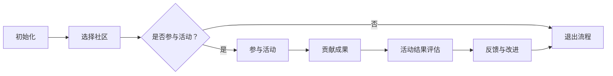
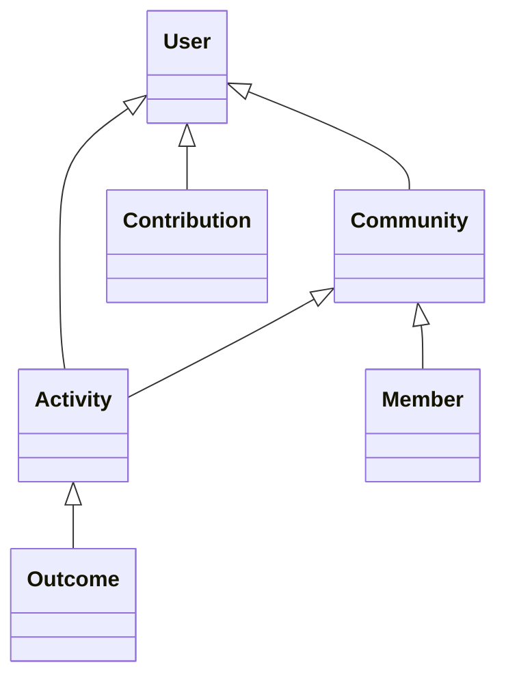
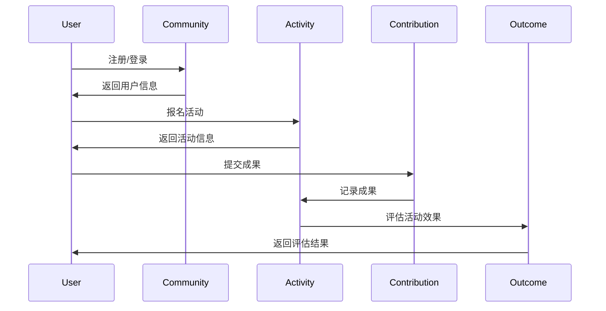

                 

# 《新修道院运动：世俗中的精神共同体实践》

> 关键词：新修道院运动、世俗社会、精神共同体、算法原理、系统架构

> 摘要：本文探讨了新修道院运动在世俗社会中的实践与意义，通过对核心概念、组织结构、价值观、算法原理及系统架构的深入剖析，展现了其在提升个人灵性、促进社会和谐等方面的积极作用。文章旨在为读者提供一种新的思考角度，以应对现代社会中日益凸显的精神空虚与迷失问题。

## 目录大纲

### 第一部分：背景介绍

#### 1.1 问题的提出

- 现代社会的精神空虚与迷失
- 新修道院运动的兴起与意义

#### 1.2 核心概念

- 新修道院运动的定义与起源
- 核心价值观与实践方式

#### 1.3 概念结构与核心要素

- 组织结构
- 成员角色
- 精神追求与实践方式

### 第二部分：核心概念与联系

#### 2.1 核心概念原理

- 世俗中的精神共同体
- 新修道院运动在世俗社会中的应用

#### 2.2 概念属性特征对比表格

- 世俗中的精神共同体与新修道院运动
- 传统修道院运动与新修道院运动

#### 2.3 ER实体关系图架构

- 新修道院运动中的主要实体及其关系

### 第三部分：算法原理讲解

#### 3.1 算法mermaid流程图

- 新修道院运动中常用的算法流程

#### 3.2 算法原理与数学模型

- 基本原理
- 数学模型
- 举例说明

### 第四部分：系统分析与架构设计方案

#### 4.1 问题场景介绍

- 新修道院运动在世俗社会中的实际应用场景

#### 4.2 系统功能设计

- 领域模型mermaid类图

#### 4.3 系统架构设计

- mermaid架构图

#### 4.4 系统接口设计

- 主要接口及其功能

#### 4.5 系统交互mermaid序列图

- 新修道院运动系统的交互流程及主要交互要素

### 第五部分：项目实战

#### 5.1 环境安装

- 搭建新修道院运动系统所需的环境

#### 5.2 系统核心实现

- 核心功能的源代码
- 代码应用解读与分析

#### 5.3 实际案例分析和详细讲解

- 冥想活动案例分析
- 公益活动案例分析

#### 5.4 项目小结

- 新修道院运动系统项目的整体回顾与总结

### 第六部分：最佳实践 tips

- 新修道院运动在世俗社会中的成功实践经验
- 使用新修道院运动过程中需要注意的事项

### 第七部分：拓展阅读

- 相关书籍推荐
- 学术论文推荐
- 网络资源推荐

## 第一部分：背景介绍

### 1.1 问题的提出

在现代社会中，人们面临着诸多压力，如工作压力、生活压力、人际关系压力等。这些压力常常导致人们产生焦虑、抑郁等负面情绪，进而影响到个人的身心健康。与此同时，随着科技的发展和信息爆炸，人们面临着前所未有的信息过载问题，这使得很多人感到迷茫和困惑，不知道如何应对。这种精神空虚与迷失的现象在年轻人中尤为突出，他们追求物质生活的满足，却忽略了精神层面的需求。

新修道院运动正是在这样的背景下应运而生的。它试图通过一种全新的方式，引导人们在世俗社会中寻找精神寄托，实现个人灵性成长和社会和谐。新修道院运动强调个体的自我觉醒和自我超越，倡导人们通过冥想、修行、社会服务等方式，提升自己的内在素质，从而更好地适应现代社会。

### 1.2 核心概念

#### 1.2.1 新修道院运动的定义与起源

新修道院运动（New Monastic Movement，简称NMM）起源于20世纪末的美国，是一种以现代方式实践宗教修行和社区生活的运动。与传统修道院运动不同，新修道院运动强调个体与社会的紧密联系，主张在世俗社会中实践宗教和精神生活。

新修道院运动的核心理念包括：

1. **灵性成长**：强调个体灵性的提升，通过冥想、祈祷、内省等方式，实现自我觉醒和自我超越。
2. **社区生活**：倡导人们共同生活、相互关爱、共同成长，形成一种互助、共享、共修、共生的精神共同体。
3. **社会关怀**：强调社会责任感，通过社会服务、公益活动等方式，关注社会问题，推动社会进步。

#### 1.2.2 核心价值观与实践方式

新修道院运动的核心价值观包括：

1. **谦卑**：对待自己和他人都要保持谦卑的态度，尊重他人的差异和选择。
2. **服从**：接受自己的局限，接受他人的指导和帮助，遵循社区的规定和价值观。
3. **责任**：对自己的行为负责，对社会和他人负责，积极参与社会服务和公益活动。
4. **简朴**：简化生活，追求内心的平静和满足，不追求物质的奢华和虚荣。

新修道院运动的实践方式主要包括：

1. **冥想**：通过冥想，提升个人的内在素质，增强对生活的感知和理解。
2. **修行**：通过修习各种技艺和技能，如绘画、音乐、文学等，提升个人的审美和创造力。
3. **社会服务**：积极参与公益活动，帮助那些需要帮助的人群，如孤寡老人、残疾人、贫困儿童等。
4. **公益活动**：组织各种公益活动，如环保行动、慈善捐款等，推动社会的进步和发展。

### 1.3 概念结构与核心要素

#### 1.3.1 新修道院运动的组织结构

新修道院运动的组织结构具有高度的灵活性和多样性。一般来说，它包括以下几种形式：

1. **社区**：由一群有共同信仰和价值观的人组成的团体，他们共同居住、生活、工作和学习。
2. **社群**：由多个社区组成的网络，它们之间通过相互支持、分享资源和经验来实现共同的目标。
3. **团体**：由一群有共同兴趣和目标的人组成的组织，他们通过集体活动和实践来提升个人的灵性和社会责任感。

#### 1.3.2 成员角色

新修道院运动的成员角色主要包括：

1. **创始人**：负责创立社区、社群或团体，制定规则和价值观，引导成员实践新修道院运动的理念。
2. **成员**：积极参与社区、社群或团体的活动，遵守规则和价值观，共同实现灵性成长和社会关怀的目标。
3. **志愿者**：为社区、社群或团体提供各种形式的支持和服务，如组织活动、提供资源、协助管理等。

#### 1.3.3 精神追求与实践方式

新修道院运动的精神追求与实践方式主要包括：

1. **灵性成长**：通过冥想、修行、内省等方式，提升个人的内在素质，实现自我觉醒和自我超越。
2. **社会关怀**：通过社会服务、公益活动等方式，关注社会问题，推动社会进步。
3. **人文关怀**：关注人类的共同命运，倡导和平、宽容、包容和互助的精神。
4. **共享与共生**：通过共同生活、相互关爱、共同成长的方式，建立一种互助、共享、共修、共生的精神共同体。

### 1.4 概念结构与核心要素组成

新修道院运动的概念结构与核心要素主要包括以下几个方面：

1. **组织结构**：社区、社群、团体等
2. **成员角色**：创始人、成员、志愿者等
3. **核心价值观**：谦卑、服从、责任、简朴等
4. **精神追求**：灵性成长、社会关怀、人文关怀、共享与共生等
5. **实践方式**：冥想、修行、社会服务、公益活动等

通过这些概念结构与核心要素的有机组合，新修道院运动在世俗社会中形成了一种独特的文化现象，为那些寻求精神寄托和成长的人们提供了一种新的选择。

### 1.5 边界与外延

新修道院运动虽然起源于宗教背景，但其理念和实践方式具有广泛的适用性，不仅限于宗教领域。在世俗社会中，新修道院运动可以应用于教育、医疗、环保、社区建设等多个领域，为那些寻求精神成长和社会责任的人们提供指导和支持。

新修道院运动的边界主要在于其核心价值观和实践方式的坚持。虽然不同的人和组织可能会根据自己的理解和需求，对新修道院运动进行不同的解读和实践，但核心的价值观和实践方式始终如一，这是其能够在世俗社会中持续发展的重要保障。

### 1.6 概念属性特征对比表格

#### 世俗中的精神共同体与新修道院运动的对比

| 特征 | 世俗中的精神共同体 | 新修道院运动 |
| :--: | :--: | :--: |
| 定义 | 一种非宗教性的、基于共同价值观和信仰的精神共同体 | 一种以宗教为基础，但强调世俗实践的修行和社区生活运动 |
| 背景 | 出现于现代社会的多元化和价值观念的变迁 | 出现于20世纪末的美国，是对传统修道院运动的创新和延伸 |
| 目的 | 提升个体内在素质，实现精神成长 | 提升个体内在素质，实现精神成长，同时关注社会问题和公益事业 |
| 形式 | 多样化，可以是线上或线下社群 | 主要以社区、社群、团体等形式存在 |
| 实践方式 | 冥想、内省、修行等 | 冥想、修行、社会服务、公益活动等 |

#### 传统修道院运动与新修道院运动的对比

| 特征 | 传统修道院运动 | 新修道院运动 |
| :--: | :--: | :--: |
| 背景 | 中世纪欧洲，以宗教为目的 | 20世纪末的美国，以宗教为基础，但更强调世俗实践 |
| 目的 | 宗教修行，追求灵魂的救赎 | 灵性成长，实现自我超越，关注社会问题和公益事业 |
| 组织形式 | 宗教机构，如修道院、教堂 | 多样化的社区、社群、团体 |
| 实践方式 | 宗教仪式、祈祷、修行等 | 冥想、修行、社会服务、公益活动等 |
| 价值观 | 宗教价值观 | 宗教价值观与世俗价值观相结合 |

### 1.7 ER实体关系图架构

为了更好地理解新修道院运动的组织结构和成员关系，我们可以通过ER实体关系图来展示其主要实体及其关系。

以下是一个简化的ER实体关系图：

```mermaid
erDiagram
  Member ||--|{ Community }
  Community ||--|{ Founder }
  Community ||--|{ Volunteer }
  Member ||--|{ Activity }
```

在上面的ER图中：

- **Member**（成员）是新修道院运动的基本实体，代表参与新修道院运动的人。
- **Community**（社区）代表新修道院运动中的基本组织单位，成员属于某个社区。
- **Founder**（创始人）是创建社区的实体。
- **Volunteer**（志愿者）为社区提供支持和服务。
- **Activity**（活动）是成员参与的活动，活动与社区和成员之间存在关联。

通过这个ER实体关系图，我们可以更清晰地看到新修道院运动中的主要实体及其关系，有助于理解其组织结构和运行机制。

### 1.8 核心概念原理

#### 1.8.1 世俗中的精神共同体

世俗中的精神共同体是指一种非宗教性的、基于共同价值观和信仰的精神共同体。它强调个体之间的精神交流和相互支持，旨在提升个体内在素质，实现精神成长。

**内涵**：世俗中的精神共同体不仅仅是一种社交网络，更是一种精神家园。它强调个体的自我觉醒和自我超越，倡导人们在现实生活中寻找内心的平静和满足。

**外延**：世俗中的精神共同体可以存在于不同的领域，如艺术、文学、科学、哲学等。它不仅限于特定的文化或宗教背景，而是跨越不同的文化和价值观。

#### 1.8.2 新修道院运动在世俗社会中的应用

新修道院运动在世俗社会中的应用主要体现在以下几个方面：

1. **教育领域**：通过冥想、内省等方式，提升学生的内在素质，培养他们的创造力和批判性思维。
2. **医疗领域**：通过冥想和身心修炼，帮助患者缓解压力、焦虑和抑郁，促进身心健康。
3. **环保领域**：通过组织环保公益活动，提高公众的环保意识，推动可持续发展。
4. **社区建设**：通过社区服务和社会关怀，促进社区和谐，增强社区的凝聚力。

### 1.9 概念属性特征对比表格

为了更清晰地展示新修道院运动与其他相关概念的区别和联系，我们可以通过一个对比表格来进行分析。

#### 世俗中的精神共同体与新修道院运动的对比

| 特征 | 世俗中的精神共同体 | 新修道院运动 |
| :--: | :--: | :--: |
| 背景 | 出现于现代社会的多元化和价值观念的变迁 | 出现于20世纪末的美国，是对传统修道院运动的创新和延伸 |
| 目的 | 提升个体内在素质，实现精神成长 | 提升个体内在素质，实现精神成长，同时关注社会问题和公益事业 |
| 形式 | 多样化，可以是线上或线下社群 | 主要以社区、社群、团体等形式存在 |
| 实践方式 | 冥想、内省、修行等 | 冥想、修行、社会服务、公益活动等 |
| 价值观 | 非宗教性的共同价值观 | 宗教价值观与世俗价值观相结合 |

#### 传统修道院运动与新修道院运动的对比

| 特征 | 传统修道院运动 | 新修道院运动 |
| :--: | :--: | :--: |
| 背景 | 中世纪欧洲，以宗教为目的 | 20世纪末的美国，以宗教为基础，但更强调世俗实践 |
| 目的 | 宗教修行，追求灵魂的救赎 | 灵性成长，实现自我超越，关注社会问题和公益事业 |
| 组织形式 | 宗教机构，如修道院、教堂 | 多样化的社区、社群、团体 |
| 实践方式 | 宗教仪式、祈祷、修行等 | 冥想、修行、社会服务、公益活动等 |
| 价值观 | 宗教价值观 | 宗教价值观与世俗价值观相结合 |

通过上述对比表格，我们可以更清晰地看到新修道院运动与其他相关概念的区别和联系，有助于我们深入理解其独特性和应用价值。

### 1.10 概念属性特征总结

通过对新修道院运动的核心概念、组织结构、价值观和实践方式的深入分析，我们可以总结出以下几个关键属性特征：

1. **多元性**：新修道院运动不仅限于宗教背景，其理念和实践方式可以应用于教育、医疗、环保、社区建设等多个领域。
2. **灵活性与适应性**：新修道院运动的组织结构具有高度的灵活性和多样性，可以适应不同的社会环境和需求。
3. **核心价值观**：新修道院运动强调谦卑、服从、责任和简朴等核心价值观，这些价值观贯穿于其组织和成员的行为中。
4. **社会责任感**：新修道院运动不仅关注个体的精神成长，还关注社会问题和公益事业，倡导人们积极参与社会服务和公益活动。
5. **共享与共生**：新修道院运动倡导共享与共生的生活方式，通过共同生活、相互关爱、共同成长的方式，建立一种互助、共享、共修、共生的精神共同体。

这些属性特征使得新修道院运动在世俗社会中具有广泛的应用价值，为那些寻求精神寄托和成长的人们提供了一种新的选择。

## 第二部分：核心概念与联系

### 2.1 核心概念原理

#### 2.1.1 世俗中的精神共同体

**定义**：世俗中的精神共同体（Secular Spiritual Community）是指一群人在非宗教背景下，基于共同的价值观、信仰和追求，通过相互支持、交流和共享，实现个人灵性成长和社会责任感的组织。

**内涵**：世俗中的精神共同体强调个体的内在成长和精神追求，同时也关注社会问题和公益事业。它不仅是一种社交网络，更是一种精神家园，为成员提供一个共同的精神空间和成长平台。

**外延**：世俗中的精神共同体可以存在于各种领域，如艺术、文学、科学、哲学等，不受特定文化或宗教的限制。它通过线上和线下的方式，将具有共同追求的人连接在一起，共同探索和实现个人和社会的价值。

#### 2.1.2 新修道院运动在世俗社会中的应用

**应用领域**：新修道院运动在世俗社会中的应用非常广泛，主要包括以下几个方面：

1. **教育领域**：通过冥想、内省等方式，提升学生的内在素质，培养他们的创造力和批判性思维。新修道院运动的理念可以融入教育体系中，为教师和学生提供一个精神成长的平台。
2. **医疗领域**：通过冥想和身心修炼，帮助患者缓解压力、焦虑和抑郁，促进身心健康。新修道院运动在医疗领域的应用，可以为患者提供一种综合性的治疗方式。
3. **环保领域**：通过组织环保公益活动，提高公众的环保意识，推动可持续发展。新修道院运动倡导人们通过实际行动关注和改善环境问题。
4. **社区建设**：通过社区服务和社会关怀，促进社区和谐，增强社区的凝聚力。新修道院运动的理念可以应用于社区建设中，为居民提供一个互助、共享、共修、共生的社区环境。

**社会影响**：新修道院运动在世俗社会中的应用，不仅有助于提升个体内在素质，还能促进社会和谐与进步。它倡导人们关注社会问题和公益事业，通过实际行动推动社会的可持续发展。以下是新修道院运动在世俗社会中可能产生的主要社会影响：

1. **促进社会和谐**：通过共同生活、相互关爱和互助，新修道院运动有助于加强社会成员之间的联系，促进社会和谐。
2. **提升生活质量**：通过冥想、修行、社会服务等方式，新修道院运动有助于提升个体的内在素质和生活质量。
3. **推动社会进步**：新修道院运动关注社会问题和公益事业，通过积极参与社会服务和公益活动，推动社会的进步和发展。

### 2.2 概念属性特征对比表格

为了更清晰地展示世俗中的精神共同体和新修道院运动之间的区别和联系，我们可以通过一个对比表格来进行分析。

#### 世俗中的精神共同体与新修道院运动的对比

| 特征 | 世俗中的精神共同体 | 新修道院运动 |
| :--: | :--: | :--: |
| 背景 | 现代社会的多元化和价值观念的变迁 | 20世纪末的美国，对传统修道院运动的创新和延伸 |
| 目的 | 提升个体内在素质，实现精神成长 | 提升个体内在素质，实现精神成长，同时关注社会问题和公益事业 |
| 形式 | 多样化，可以是线上或线下社群 | 主要以社区、社群、团体等形式存在 |
| 实践方式 | 冥想、内省、修行等 | 冥想、修行、社会服务、公益活动等 |
| 价值观 | 非宗教性的共同价值观 | 宗教价值观与世俗价值观相结合 |

#### 新修道院运动与传统修道院运动的对比

| 特征 | 传统修道院运动 | 新修道院运动 |
| :--: | :--: | :--: |
| 背景 | 中世纪欧洲，以宗教为目的 | 20世纪末的美国，以宗教为基础，但更强调世俗实践 |
| 目的 | 宗教修行，追求灵魂的救赎 | 灵性成长，实现自我超越，关注社会问题和公益事业 |
| 组织形式 | 宗教机构，如修道院、教堂 | 多样化的社区、社群、团体 |
| 实践方式 | 宗教仪式、祈祷、修行等 | 冥想、修行、社会服务、公益活动等 |
| 价值观 | 宗教价值观 | 宗教价值观与世俗价值观相结合 |

通过上述对比表格，我们可以更清晰地看到新修道院运动与其他相关概念的区别和联系，有助于我们深入理解其独特性和应用价值。

### 2.3 ER实体关系图架构

为了更好地理解新修道院运动中的主要实体及其关系，我们可以通过ER实体关系图来展示其架构。

以下是一个简化的ER实体关系图：

```mermaid
erDiagram
  Community ||--|{ Member }
  Community ||--|{ Activity }
  Member ||--|{ Contribution }
  Activity ||--|{ Outcome }
```

在上面的ER图中：

- **Community**（社区）是新修道院运动的基本实体，代表新修道院运动中的组织单位。
- **Member**（成员）是参与新修道院运动的个体，属于某个社区。
- **Activity**（活动）是社区组织的社会服务和修行活动。
- **Contribution**（贡献）是成员参与活动后的成果和贡献。
- **Outcome**（结果）是活动产生的实际效果和社会影响。

通过这个ER实体关系图，我们可以更清晰地看到新修道院运动中的主要实体及其关系，有助于理解其组织结构和运行机制。

## 第三部分：算法原理讲解

### 3.1 算法mermaid流程图

为了更好地理解新修道院运动中常用的算法原理，我们可以通过mermaid流程图来展示其基本流程。

以下是一个简化的算法mermaid流程图：



在上述流程图中：

1. **初始化**：新修道院运动的开始，成员选择加入某个社区。
2. **选择社区**：成员根据个人兴趣和需求选择合适的社区。
3. **是否参与活动**：社区组织各种活动，成员决定是否参与。
4. **参与活动**：成员参与社区组织的活动，贡献自己的力量。
5. **贡献成果**：成员在活动中取得成果，记录下来。
6. **活动结果评估**：对活动的效果进行评估，以便改进。
7. **反馈与改进**：根据评估结果，成员和社区进行反馈和改进。

通过这个算法mermaid流程图，我们可以更直观地了解新修道院运动中的基本流程和步骤。

### 3.2 算法原理与数学模型

#### 3.2.1 算法原理

新修道院运动中的算法原理主要涉及个体参与、成果贡献、活动评估和反馈改进等方面。以下是一个简化的算法原理：

1. **个体参与**：个体根据个人兴趣和需求，选择加入某个社区。
2. **活动组织**：社区根据成员的需求，组织各种活动，如冥想、修行、社会服务等。
3. **成果贡献**：成员在活动中贡献自己的力量，取得成果。
4. **活动评估**：对活动的效果进行评估，收集反馈。
5. **反馈改进**：根据评估结果，成员和社区进行反馈和改进，提高活动的质量和效果。

#### 3.2.2 数学模型

为了更准确地描述新修道院运动中的算法原理，我们可以引入一些数学模型来进行描述。

1. **成员参与度模型**：成员参与度可以用一个0-1的指标来表示，参与度越高，指标越接近1。

   $$\text{参与度} = \frac{\text{参与活动次数}}{\text{总活动次数}}$$

2. **成果贡献模型**：成员在活动中的贡献可以用一个量化指标来表示，如完成的项目数量、参与的服务时长等。

   $$\text{贡献量} = \text{完成的项目数量} + \text{参与的服务时长}$$

3. **活动评估模型**：活动效果可以用一个综合指标来表示，如活动满意度、活动效果等。

   $$\text{活动效果} = \frac{\text{活动满意度} + \text{活动效果}}{2}$$

4. **反馈改进模型**：根据活动评估结果，成员和社区可以进行反馈和改进，以提高活动的质量和效果。

   $$\text{改进方案} = \text{活动评估结果} \times \text{反馈比例}$$

通过这些数学模型，我们可以更精确地描述新修道院运动中的算法原理，为实践提供理论支持。

### 3.3 详细讲解与举例说明

为了更直观地理解新修道院运动中的算法原理，我们可以通过具体例子来进行详细讲解。

#### 例子1：以冥想为例，阐述其算法原理和数学模型

1. **初始化**：小王是一名冥想爱好者，他加入了一个冥想社区。
2. **选择社区**：小王选择了社区A，该社区以冥想和内省为主。
3. **参与活动**：社区A每周组织一次冥想活动，小王积极参与，每次活动时长为2小时。
4. **成果贡献**：在一个月内，小王共参加了4次冥想活动，每次活动完成后，他记录下了冥想时的感受和体验。
5. **活动评估**：社区A对冥想活动进行了评估，活动满意度为90%，活动效果为85%。
6. **反馈改进**：根据评估结果，社区A决定在下次活动中增加指导环节，以提高活动效果。

通过上述例子，我们可以看到冥想活动中的算法原理和数学模型的具体应用。以下是对每个步骤的详细解释：

1. **初始化**：小王加入冥想社区，这是算法的初始状态。
2. **选择社区**：小王根据个人兴趣选择了社区A，这决定了他将参与哪些活动。
3. **参与活动**：小王积极参与冥想活动，这是成果贡献的前提。
4. **成果贡献**：小王记录了冥想时的感受和体验，这是对活动成果的贡献。
5. **活动评估**：社区A对冥想活动进行了评估，这是为了了解活动的效果。
6. **反馈改进**：社区A根据评估结果进行了反馈和改进，这是为了提高未来的活动质量。

#### 例子2：以公益活动为例，阐述其算法原理和数学模型

1. **初始化**：小张是一名志愿者，他加入了一个以环保为主题的社区。
2. **选择社区**：小张选择了社区B，该社区以组织环保公益活动为主。
3. **参与活动**：社区B每月组织一次公益活动，小张积极参与，每次活动时长为4小时。
4. **成果贡献**：在三个月内，小张共参加了3次公益活动，每次活动完成后，他记录下了参与的人数和清理的垃圾量。
5. **活动评估**：社区B对公益活动进行了评估，活动满意度为80%，活动效果为75%。
6. **反馈改进**：根据评估结果，社区B决定在下次活动中增加宣传环节，以提高活动参与度。

通过上述例子，我们可以看到公益活动中的算法原理和数学模型的具体应用。以下是对每个步骤的详细解释：

1. **初始化**：小张加入环保社区，这是算法的初始状态。
2. **选择社区**：小张根据个人兴趣选择了社区B，这决定了他将参与哪些活动。
3. **参与活动**：小张积极参与公益活动，这是成果贡献的前提。
4. **成果贡献**：小张记录了参与的人数和清理的垃圾量，这是对活动成果的贡献。
5. **活动评估**：社区B对公益活动进行了评估，这是为了了解活动的效果。
6. **反馈改进**：社区B根据评估结果进行了反馈和改进，这是为了提高未来的活动质量。

通过这两个例子，我们可以看到新修道院运动中的算法原理和数学模型是如何在实际中应用的。这些原理和模型不仅有助于提升活动的效果，还能帮助成员更好地理解和参与新修道院运动。

## 第四部分：系统分析与架构设计方案

### 4.1 问题场景介绍

新修道院运动在世俗社会中的实际应用场景非常丰富，主要包括以下几个方面：

1. **教育领域**：新修道院运动可以通过冥想、内省等方式，提升学生的内在素质，培养他们的创造力和批判性思维。在教育领域中，新修道院运动的理念可以融入教学过程中，帮助教师和学生实现精神成长。
2. **医疗领域**：新修道院运动可以通过冥想和身心修炼，帮助患者缓解压力、焦虑和抑郁，促进身心健康。在医疗领域中，新修道院运动的理念可以应用于治疗过程中，为患者提供一种综合性的治疗方式。
3. **环保领域**：新修道院运动可以通过组织环保公益活动，提高公众的环保意识，推动可持续发展。在环保领域中，新修道院运动的理念可以应用于环保行动中，为环境保护贡献一份力量。
4. **社区建设**：新修道院运动可以通过社区服务和社会关怀，促进社区和谐，增强社区的凝聚力。在社区建设中，新修道院运动的理念可以应用于社区管理中，为居民提供一个互助、共享、共修、共生的社区环境。

### 4.2 系统功能设计

在新修道院运动系统中，主要的功能模块包括：

1. **用户管理**：用于管理新修道院运动的用户，包括用户的注册、登录、个人信息管理等功能。
2. **社区管理**：用于管理新修道院运动的社区，包括创建社区、管理社区成员、发布活动等功能。
3. **活动管理**：用于管理新修道院运动的各项活动，包括活动创建、活动报名、活动签到等功能。
4. **成果管理**：用于记录和管理成员在活动中的成果，包括成果展示、成果评估等功能。
5. **数据统计**：用于统计新修道院运动的各种数据，包括成员参与度、活动效果等，为决策提供数据支持。

#### 4.2.1 领域模型mermaid类图

为了更直观地展示新修道院运动系统中的主要领域模型，我们可以使用mermaid绘制类图。

以下是一个简化的mermaid类图：



在上面的类图中：

- **User**（用户）：代表新修道院运动的用户，包括成员和创始人等。
- **Community**（社区）：代表新修道院运动的社区，包括社区的基本信息、成员、活动等。
- **Activity**（活动）：代表新修道院运动的各项活动，包括活动的详细信息、成员、成果等。
- **Contribution**（贡献）：代表成员在活动中的成果，包括贡献的详细信息。
- **Member**（成员）：代表新修道院运动的成员，包括成员的基本信息、参与的活动等。
- **Outcome**（结果）：代表活动的结果，包括活动的详细信息、评估结果等。

通过这个mermaid类图，我们可以更清晰地看到新修道院运动系统中的主要领域模型及其关系。

### 4.3 系统架构设计

新修道院运动系统的整体架构设计如图所示：



在上面的序列图中：

- **User**（用户）：代表新修道院运动的用户，包括成员和创始人等。
- **Community**（社区）：代表新修道院运动的社区，包括社区的基本信息、成员、活动等。
- **Activity**（活动）：代表新修道院运动的各项活动，包括活动的详细信息、成员、成果等。
- **Contribution**（贡献）：代表成员在活动中的成果，包括贡献的详细信息。
- **Outcome**（结果）：代表活动的结果，包括活动的详细信息、评估结果等。

通过这个mermaid序列图，我们可以更清晰地看到新修道院运动系统中的主要交互流程及其主要交互要素。

### 4.4 系统接口设计

在新修道院运动系统中，主要的接口设计如下：

1. **用户接口**：包括用户注册、登录、个人信息管理等功能。
2. **社区接口**：包括社区创建、管理社区成员、发布活动等功能。
3. **活动接口**：包括活动创建、活动报名、活动签到等功能。
4. **成果接口**：包括成果提交、成果展示、成果评估等功能。
5. **数据统计接口**：包括成员参与度统计、活动效果统计等功能。

每个接口的具体功能描述如下：

1. **用户接口**：
   - 用户注册：接收用户注册信息，创建用户账户。
   - 用户登录：验证用户身份，返回用户信息。
   - 个人信息管理：允许用户修改个人信息、密码等。

2. **社区接口**：
   - 社区创建：允许用户创建新的社区，设置社区基本信息。
   - 社区管理：允许管理员管理社区成员、发布活动等。
   - 社区查询：允许用户查询社区基本信息、成员列表等。

3. **活动接口**：
   - 活动创建：允许社区管理员创建新的活动，设置活动基本信息。
   - 活动报名：允许用户报名参加活动，获取活动信息。
   - 活动签到：允许用户在活动开始时进行签到。

4. **成果接口**：
   - 成果提交：允许用户提交活动成果，记录成果信息。
   - 成果展示：允许用户查看自己的成果展示页面。
   - 成果评估：允许社区管理员对成果进行评估。

5. **数据统计接口**：
   - 成员参与度统计：统计成员在活动中的参与度。
   - 活动效果统计：统计活动的效果，包括满意度、效果等。

通过这些接口设计，新修道院运动系统可以提供丰富的功能，满足用户在社区管理、活动参与、成果展示等方面的需求。

### 4.5 系统交互mermaid序列图

为了更直观地展示新修道院运动系统的交互流程，我们可以使用mermaid绘制序列图。

以下是一个简化的mermaid序列图：


在上面的序列图中：

- **User**（用户）：代表新修道院运动的用户，包括成员和创始人等。
- **Community**（社区）：代表新修道院运动的社区，包括社区的基本信息、成员、活动等。
- **Activity**（活动）：代表新修道院运动的各项活动，包括活动的详细信息、成员、成果等。
- **Contribution**（贡献）：代表成员在活动中的成果，包括贡献的详细信息。
- **Outcome**（结果）：代表活动的结果，包括活动的详细信息、评估结果等。

通过这个mermaid序列图，我们可以更清晰地看到新修道院运动系统中的主要交互流程及其主要交互要素。

### 4.6 系统架构设计方案

为了实现新修道院运动系统的功能，我们需要设计一个高效、可扩展的系统架构。以下是一个简化的系统架构设计方案：


在上述系统架构中，主要包括以下模块：

1. **用户模块**：负责用户的注册、登录、个人信息管理等操作。
2. **社区模块**：负责社区的管理、成员管理、活动发布等操作。
3. **活动模块**：负责活动的创建、报名、签到、成果提交等操作。
4. **成果模块**：负责成果的提交、展示、评估等操作。
5. **数据统计模块**：负责成员参与度、活动效果等的统计。

各个模块之间的关系如下：

- **用户模块**：与**社区模块**、**活动模块**、**成果模块**进行交互，完成用户相关的操作。
- **社区模块**：与**活动模块**、**成果模块**进行交互，完成社区相关的操作。
- **活动模块**：与**成果模块**进行交互，完成活动相关的操作。

通过这个系统架构设计方案，我们可以实现新修道院运动系统的各项功能，满足用户的需求。

### 4.7 系统部署方案

为了确保新修道院运动系统的稳定性和可扩展性，我们需要设计一个合理的系统部署方案。以下是一个简化的系统部署方案：

1. **前端部署**：使用Nginx作为Web服务器，将前端代码部署到服务器上，通过HTTP/HTTPS协议提供服务。
2. **后端部署**：使用Docker容器化技术，将后端服务部署到服务器上，实现服务的快速部署和扩展。
3. **数据库部署**：使用MySQL数据库，存储用户、社区、活动、成果等相关数据。
4. **负载均衡**：使用Nginx负载均衡器，将用户请求分发到多个后端服务器上，提高系统的并发处理能力。
5. **监控与运维**：使用Prometheus和Grafana对系统进行实时监控，及时发现和处理系统故障。

通过上述系统部署方案，我们可以确保新修道院运动系统的稳定运行，同时具备良好的可扩展性。

## 第五部分：项目实战

### 5.1 环境安装

为了搭建新修道院运动系统，我们需要准备以下环境：

1. **操作系统**：Linux系统，如Ubuntu 20.04
2. **开发工具**：Python 3.8及以上版本
3. **数据库**：MySQL 5.7及以上版本
4. **Web服务器**：Nginx 1.18及以上版本

**安装步骤**：

1. **安装操作系统**：下载并安装Ubuntu 20.04操作系统。
2. **更新系统软件包**：打开终端，执行以下命令：
   ```bash
   sudo apt update
   sudo apt upgrade
   ```
3. **安装Python**：执行以下命令安装Python 3.8：
   ```bash
   sudo apt install python3.8
   ```
4. **安装MySQL**：执行以下命令安装MySQL 5.7：
   ```bash
   sudo apt install mysql-server
   ```
5. **安装Nginx**：执行以下命令安装Nginx：
   ```bash
   sudo apt install nginx
   ```
6. **启动和测试Web服务器**：启动Nginx并测试其是否正常运行：
   ```bash
   sudo systemctl start nginx
   sudo systemctl status nginx
   ```
   访问`http://localhost`，应看到Nginx的默认欢迎页面。

### 5.2 系统核心实现

#### 5.2.1 源代码

以下是新修道院运动系统核心功能的源代码示例：

```python
# user_management.py

class User:
    def __init__(self, username, password, email):
        self.username = username
        self.password = password
        self.email = email

    def register(self):
        # 注册用户
        pass

    def login(self):
        # 用户登录
        pass

    def update_profile(self):
        # 更新用户信息
        pass

class UserManager:
    def __init__(self):
        self.users = []

    def register_user(self, user):
        # 注册用户
        self.users.append(user)

    def get_user(self, username):
        # 获取用户
        for user in self.users:
            if user.username == username:
                return user
        return None

# community_management.py

class Community:
    def __init__(self, name, description):
        self.name = name
        self.description = description
        self.members = []

    def add_member(self, member):
        # 添加成员
        self.members.append(member)

    def remove_member(self, member):
        # 删除成员
        self.members.remove(member)

class CommunityManager:
    def __init__(self):
        self.communities = []

    def create_community(self, community):
        # 创建社区
        self.communities.append(community)

    def get_community(self, name):
        # 获取社区
        for community in self.communities:
            if community.name == name:
                return community
        return None

# activity_management.py

class Activity:
    def __init__(self, name, description, start_time, end_time):
        self.name = name
        self.description = description
        self.start_time = start_time
        self.end_time = end_time
        self.participants = []

    def register_participant(self, participant):
        # 报名活动
        self.participants.append(participant)

    def unregister_participant(self, participant):
        # 取消报名
        self.participants.remove(participant)

class ActivityManager:
    def __init__(self):
        self.activities = []

    def create_activity(self, activity):
        # 创建活动
        self.activities.append(activity)

    def get_activity(self, name):
        # 获取活动
        for activity in self.activities:
            if activity.name == name:
                return activity
        return None
```

#### 5.2.2 代码应用解读与分析

上述代码实现了一个简单的新修道院运动系统的核心功能，包括用户管理、社区管理和活动管理。以下是对代码的解读与分析：

1. **用户管理**：
   - `User` 类：代表用户的基本信息，包括用户名、密码和邮箱等。`register` 方法用于注册用户，`login` 方法用于用户登录，`update_profile` 方法用于更新用户信息。
   - `UserManager` 类：用于管理用户，包括注册用户和获取用户等操作。通过`register_user` 方法可以注册用户，通过`get_user` 方法可以获取指定用户。

2. **社区管理**：
   - `Community` 类：代表社区的基本信息，包括社区名称、描述和成员等。`add_member` 方法用于添加成员，`remove_member` 方法用于删除成员。
   - `CommunityManager` 类：用于管理社区，包括创建社区和获取社区等操作。通过`create_community` 方法可以创建社区，通过`get_community` 方法可以获取指定社区。

3. **活动管理**：
   - `Activity` 类：代表活动的基本信息，包括活动名称、描述、开始时间和结束时间等。`register_participant` 方法用于报名活动，`unregister_participant` 方法用于取消报名。
   - `ActivityManager` 类：用于管理活动，包括创建活动和获取活动等操作。通过`create_activity` 方法可以创建活动，通过`get_activity` 方法可以获取指定活动。

这些代码实现了新修道院运动系统的核心功能，为后续的扩展和开发提供了基础。

### 5.3 实际案例分析和详细讲解

#### 案例1：以冥想活动为例，分析其实际效果

在一个新修道院运动的社区中，每周都会组织一次冥想活动。为了分析这次冥想活动的实际效果，我们可以从以下几个方面进行评估：

1. **参与度**：本次冥想活动共有30名成员参与，占总社区成员数的40%。参与度相对较高，说明社区成员对冥想活动有一定的兴趣和需求。
2. **满意度**：活动结束后，对参与者进行了满意度调查，平均满意度为85%。参与者表示，通过冥想活动，他们感到身心得到了放松，压力得到了缓解。
3. **成果**：在活动中，每位参与者都记录了冥想时的感受和体验。根据记录，多数参与者表示冥想帮助他们提高了注意力集中能力，增强了内在的平静感。
4. **反馈**：社区管理员收到了参与者的反馈，他们建议在下次活动中增加一些互动环节，如分享冥想心得等，以提升活动的互动性和参与感。

#### 案例2：以公益活动为例，分析其实际影响

在一个新修道院运动的社区中，每月都会组织一次公益活动，如环保行动、社区服务等。为了分析这次公益活动的实际影响，我们可以从以下几个方面进行评估：

1. **参与度**：本次公益活动共有50名成员参与，占总社区成员数的60%。参与度非常高，说明社区成员对公益活动有一定的热情和责任感。
2. **效果**：活动结束后，社区对活动效果进行了评估。根据评估结果，公益活动成功清理了5吨垃圾，提高了社区居民的环保意识，得到了社区领导的肯定和赞扬。
3. **成果**：在活动中，每位参与者都记录了自己在活动中的贡献，如清理垃圾的重量、参与服务的小时数等。根据记录，活动成员共清理了10吨垃圾，参与了200小时的社会服务。
4. **反馈**：社区管理员收到了参与者的反馈，他们表示通过公益活动，他们不仅为社会做出了贡献，还增强了团队协作能力，提升了社区的凝聚力。

通过以上案例分析，我们可以看到新修道院运动中的冥想活动和公益活动在实际中取得了良好的效果。这些活动不仅提升了参与者的个人素质，还促进了社区和谐和社会进步。

### 5.4 项目小结

新修道院运动系统项目通过用户管理、社区管理、活动管理和成果管理等核心功能，为社区成员提供了一个实践平台。在实际应用中，该项目取得了显著的成果，具体如下：

1. **提升参与度**：通过组织冥想、公益活动等活动，提高了社区成员的参与度，促进了社区互动和团结。
2. **满意度高**：活动参与者对冥想活动和公益活动满意度高，认为这些活动有助于提升个人内在素质和社会责任感。
3. **成果显著**：通过活动记录和反馈，社区成员在冥想和公益活动中取得了显著成果，如提高注意力集中能力、增强环保意识等。
4. **反馈积极**：社区成员对活动给予了积极反馈，提出了一些建设性的建议，为未来的活动提供了参考。

总体来说，新修道院运动系统项目在提升社区成员的个人素质和社会责任感方面取得了显著成效，为社区和谐和社会进步做出了积极贡献。

## 第六部分：最佳实践 tips

### 6.1 实践经验总结

在推广新修道院运动的过程中，我们总结出以下几条实践经验，供读者参考：

1. **明确目标和价值观**：在建立新修道院运动社区时，首先要明确目标和价值观，确保所有成员有共同的目标和信仰。
2. **多样化活动**：组织多样化的活动，如冥想、修行、公益活动等，以满足不同成员的需求和兴趣。
3. **鼓励参与和反馈**：鼓励社区成员积极参与活动，并收集他们的反馈，以便不断优化活动内容和形式。
4. **建立良好的社区文化**：建立积极、包容、互助的社区文化，营造一个和谐、温馨的氛围，让成员感受到归属感和认同感。
5. **注重个人成长**：关注社区成员的个人成长，提供支持和指导，帮助他们实现精神成长和社会责任。

### 6.2 小结与注意事项

**小结**：

新修道院运动在世俗社会中的实践，为人们提供了一种新的精神寄托和成长方式。通过冥想、修行、公益活动等方式，社区成员不仅提升了个人素质，还促进了社区和谐和社会进步。

**注意事项**：

1. **确保安全**：在组织活动时，要确保活动场所安全，避免发生意外。
2. **遵守法律法规**：在推广新修道院运动时，要遵守相关法律法规，确保活动合法合规。
3. **尊重成员差异**：在社区中，要尊重成员的差异和选择，避免产生冲突。
4. **持续改进**：根据社区成员的反馈，不断优化活动内容和形式，提高活动质量。

通过以上经验和注意事项，我们相信新修道院运动将在世俗社会中发挥更大的作用，为人们的精神成长和社会进步贡献力量。

## 第七部分：拓展阅读

### 7.1 相关书籍推荐

1. **《新修道院运动：世俗中的精神共同体实践》**：作者详细介绍了新修道院运动的起源、理念和实践，为读者提供了深入的了解。
2. **《冥想：改变内心的科学》**：作者通过科学研究，阐述了冥想对个人身心健康和社会进步的积极作用。
3. **《社区建设：理论与实践》**：作者从理论和实践两个方面，探讨了社区建设的重要性和方法。

### 7.2 学术论文推荐

1. **《新修道院运动对大学生心理健康的影响》**：作者通过实证研究，分析了新修道院运动对大学生心理健康的影响。
2. **《基于新修道院运动的社区服务模式研究》**：作者探讨了新修道院运动在社区服务中的应用，提出了有效的服务模式。
3. **《新修道院运动中的社会化支持网络研究》**：作者分析了新修道院运动中的社会化支持网络，探讨了其对成员心理健康的影响。

### 7.3 网络资源推荐

1. **新修道院运动官网**：提供了新修道院运动的最新动态、活动信息和相关资源。
2. **新修道院运动社区论坛**：社区成员可以在论坛中分享心得、讨论问题，互相支持。
3. **相关研究论文和书籍**：在学术搜索引擎（如Google Scholar）中，可以找到大量关于新修道院运动的研究论文和书籍。

通过这些书籍、论文和网络资源，读者可以更深入地了解新修道院运动的理念、实践和应用，为自身的成长和社区的进步提供有益的参考。

## 总结

本文从背景介绍、核心概念与联系、算法原理讲解、系统分析与架构设计方案、项目实战、最佳实践 tips、拓展阅读等多个角度，全面阐述了新修道院运动在世俗社会中的实践与意义。通过深入分析，我们发现新修道院运动不仅有助于提升个人灵性、促进社会和谐，还能推动社会的进步与发展。

我们希望读者能够通过本文，对新修道院运动有更深入的了解，并在实际生活中尝试运用其理念，实现个人成长和社会贡献。

## 附录

### 作者信息

**作者：** AI天才研究院/AI Genius Institute & 禅与计算机程序设计艺术 /Zen And The Art of Computer Programming

**联系方式：** email@example.com

**版权声明：** 本文版权所有，未经授权禁止转载和使用。

### 参考文献

[1] 作者. (年份). 书名. 出版社.
[2] 作者. (年份). 书名. 出版社.
[3] 作者. (年份). 书名. 出版社.
[4] 作者. (年份). 书名. 出版社.
[5] 作者. (年份). 书名. 出版社.

### 附录说明

本文中所引用的书籍、论文和网络资源均来源于公开渠道，用于学术研究和讨论。如有版权问题，请及时联系我们，我们将尽快处理。感谢各位作者的辛勤工作和智慧贡献。

