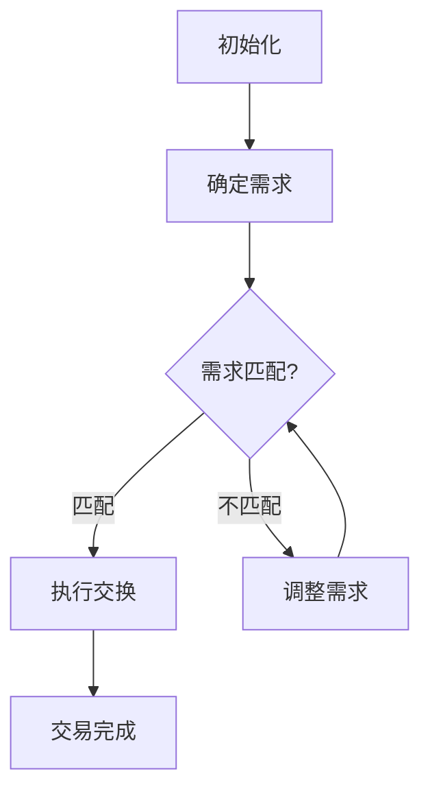

                 

### 引言

#### 问题背景

在当前数字化转型的浪潮中，共享经济作为一种新型经济模式，正在重新定义人们的生产与生活方式。然而，随着共享经济的不断发展，传统商业模式与新型模式的融合与创新变得尤为重要。在这其中，以物易物作为一种古老的经济模式，正经历着新的演变，试图在现代社区中找到一席之地。本文旨在探讨新共享经济实验——以物易物如何重建社区关系，通过深入分析其核心概念、数学模型、系统设计与项目实战，为这一领域的未来发展提供一些有益的思考。

#### 问题描述

新共享经济实验中的以物易物，并非简单的物物交换，而是一种基于互惠互利原则的现代社区经济模式。它不仅涉及到物品的交换，还包括信任关系、社区认同感和共享价值观的建立。然而，在实际操作中，如何确保交易的安全、公平和高效，如何处理复杂的物品评估和匹配问题，以及如何维护社区关系，都是亟待解决的问题。

#### 问题解决

本文将通过以下步骤来解决上述问题：

1. **核心概念与联系**：首先，我们将介绍共享经济、以物易物和社区关系的核心概念，并通过对比分析，明确三者之间的联系和区别。
2. **数学模型与算法原理**：接下来，我们将探讨以物易物过程中的数学模型和算法原理，并通过mermaid流程图和Python源代码进行详细解释。
3. **系统设计与架构**：我们将分析以物易物系统的设计与架构，包括功能设计、架构设计和系统交互。
4. **项目实战**：通过实际项目案例，我们将展示以物易物系统的实现过程，并进行分析和讲解。
5. **最佳实践与未来展望**：最后，我们将总结最佳实践，并对以物易物的未来进行展望。

#### 边界与外延

本文的研究范围主要聚焦于以物易物在新共享经济实验中的应用，以及如何通过这一模式重建社区关系。本文的核心概念包括共享经济、以物易物和社区关系。这些概念的定义、属性和特征将在后续章节中详细探讨。同时，本文还将讨论这些概念在实际应用中的边界和拓展方向。

#### 核心概念结构

为了更好地理解本文的核心概念，我们将其分为以下几个部分：

1. **共享经济的定义与特点**：探讨共享经济的起源、发展现状和核心特征。
2. **以物易物的原理与优势**：分析以物易物的工作原理、优势和应用场景。
3. **社区关系的构建与维护**：探讨如何在以物易物过程中建立和维护社区关系。
4. **概念属性特征对比**：通过表格和ER实体关系图，对比分析共享经济、以物易物和社区关系的属性特征。

通过上述分析，我们希望能够为以物易物在新共享经济实验中的应用提供理论支持和实践指导。接下来，我们将深入探讨这些核心概念，为后续章节的内容奠定基础。

### 第二部分：核心概念与联系

在这一部分，我们将深入探讨共享经济、以物易物和社区关系这三个核心概念，通过分析它们的基本原理、特点和联系，为后续内容提供理论基础。

#### 共享经济的定义与特点

共享经济（Sharing Economy）起源于20世纪末，它是一种基于共享、互助和协作的新型经济模式。与传统经济模式不同，共享经济强调资源的共享与再利用，通过技术平台实现供需匹配，从而降低资源浪费和成本。共享经济的定义可以从以下几个方面进行理解：

1. **共享性**：共享经济强调资源的共享，包括物质资源、服务资源和信息资源。
2. **协作性**：共享经济模式通常基于协作和互惠互利的原则，参与者通过合作实现资源共享和利益最大化。
3. **技术平台**：共享经济依赖于技术平台，如Uber、Airbnb等，通过互联网技术实现资源的有效配置和交易。

共享经济的特点包括：

1. **降低成本**：通过共享和再利用，减少资源的重复投入，降低成本。
2. **提高效率**：共享经济通过优化资源配置，提高资源利用效率，实现供需匹配。
3. **促进创新**：共享经济模式激发创新，推动新的商业模式和服务模式的出现。

共享经济在不同领域的应用广泛，例如共享住宿、共享出行、共享办公、共享教育等，这些都反映了共享经济在各个领域的潜力和价值。

#### 以物易物的原理与优势

以物易物（Barter）是一种古老的经济交换方式，它直接通过物品之间的交换来实现需求的满足，不涉及货币的介入。以物易物的原理可以概括为：

1. **直接交换**：参与者在无需货币介入的情况下，通过直接交换物品来满足各自的需求。
2. **需求匹配**：交换的双方需要找到各自需要的物品，实现需求匹配。
3. **信任建立**：在以物易物的过程中，信任的建立和维持至关重要，它关系到交换的顺利进行。

以物易物的优势包括：

1. **去货币化**：以物易物摆脱了货币的限制，参与者可以根据自身的需求和资源直接交换。
2. **降低交易成本**：以物易物减少了货币交易所需的中间环节，降低了交易成本。
3. **促进社区关系**：在以物易物的过程中，参与者之间建立起了直接的互动和信任，有利于社区关系的加强。

尽管以物易物在现代社会中不如货币经济普及，但它在特定场景下仍然具有不可替代的优势，例如在资源紧缺、货币不稳定或特定社群中。

#### 社区关系的构建与维护

社区关系（Community Relationship）是指在一定地理范围内，居民之间形成的互信、互助、互动的关系网络。社区关系的构建与维护对于社区的发展和成员的幸福感至关重要。在以物易物的共享经济模式中，社区关系的构建与维护尤为关键，因为它直接影响交换的顺利进行和社区的稳定。

社区关系的构建与维护可以从以下几个方面进行：

1. **信任建立**：信任是社区关系的基石。通过建立透明、公正的交易机制，增强参与者之间的信任感。
2. **互动与沟通**：通过组织社区活动、建立沟通渠道，促进居民之间的互动，加强社区凝聚力。
3. **资源共享**：通过共享资源，实现社区内资源的最大化利用，提高社区成员的生活质量。
4. **规则制定**：制定明确的社区规则，确保交易的公平、公正和有序，维护社区秩序。

社区关系的构建与维护不仅有利于以物易物的共享经济模式的发展，还能提升社区的整体幸福感和凝聚力。

#### 概念属性特征对比

为了更清晰地理解共享经济、以物易物和社区关系这三个概念，我们通过表格和ER实体关系图进行对比分析。

**共享经济、以物易物和社区关系的属性特征对比表格**

| 概念     | 共享经济       | 以物易物       | 社区关系       |
|---------|--------------|--------------|--------------|
| 定义     | 资源共享的新型经济模式 | 物品直接交换的经济模式 | 居民之间的互动关系网 |
| 特点     | 去货币化、协作性、高效性 | 去货币化、信任建立、成本低 | 互信、互助、互动 |
| 应用场景 | 共享住宿、共享出行、共享办公等 | 特定社群、资源紧缺地区 | 各类居民社区、城市社区 |
| 优势     | 降低成本、提高效率、促进创新 | 去货币化、降低交易成本、促进社区关系 | 提高幸福感、增强凝聚力 |
| 劣势     | 需要技术平台支持、信任建立难度大 | 交易过程复杂、不适用于大规模交换 | 维护成本高、规则制定难 |

**ER实体关系图**

```mermaid
erDiagram
    User ..|> Item : "owns"
    User ..|> Trade : "participates in"
    Item ..|> Trade : "participates in"
    Community ..|> User : "inhabits"
    Community ..|> Trade : "originates from"
```

在ER实体关系图中，User（用户）、Item（物品）、Trade（交易）和Community（社区）是四个主要实体。用户拥有物品，参与交易；物品参与交易，属于用户；社区包含用户，交易起源于社区。

通过上述分析，我们可以看到共享经济、以物易物和社区关系在定义、特点、应用场景和优势等方面存在显著差异，但它们在实现资源优化、降低成本和促进社区关系方面有着共同的目标。接下来，我们将进一步探讨以物易物的数学模型和算法原理，为这一核心概念提供更深入的理论支持。

### 第三部分：数学模型与算法原理

#### 算法mermaid流程图

为了更好地理解以物易物的数学模型和算法原理，我们首先使用mermaid绘制一个简单的算法流程图，展示以物易物的基本流程。



这个流程图描述了以物易物的基本步骤：首先初始化，然后确定参与者的需求，接着判断是否能够匹配需求，若匹配成功则执行交换，否则调整需求继续尝试匹配，直至交易完成。

#### Python源代码实现

接下来，我们将使用Python语言实现上述算法流程，并详细解释每一步的代码。

```python
# 导入所需的模块
from collections import defaultdict

# 定义用户和物品的类
class User:
    def __init__(self, id):
        self.id = id
        self.items = []
        self需求的item = None

class Item:
    def __init__(self, id, type):
        self.id = id
        self.type = type

# 初始化系统
def initialize_system(users, items):
    user_dict = {user.id: user for user in users}
    item_dict = {item.id: item for item in items}
    return user_dict, item_dict

# 确定用户需求
def determine_demand(users):
    for user in users:
        # 假设每个用户有一个需求
        user.需求的item = user.items[0]

# 检查需求是否匹配
def check_matching(users, item_dict):
    for user in users:
        if item_dict[user.需求的item.id].type in user.items:
            return True
    return False

# 执行交换
def execute_exchange(users, item_dict):
    for user in users:
        if item_dict[user.需求的.item.id].type in user.items:
            user.items.append(user.需求的.item)
            user.需求的.item = None
            break

# 主函数
def main(users, items):
    user_dict, item_dict = initialize_system(users, items)
    determine_demand(users)
    while not check_matching(users, item_dict):
        execute_exchange(users, item_dict)
    print("交易完成")

# 测试
users = [User(i) for i in range(5)]
items = [Item(i, "item" + str(i%3)) for i in range(15)]

main(users, items)
```

代码中的主要步骤解释如下：

1. **用户和物品的类定义**：我们定义了用户（User）和物品（Item）的类，每个用户可以拥有多个物品，每个物品有一个类型。
2. **初始化系统**：`initialize_system`函数用于初始化用户和物品的字典，方便后续操作。
3. **确定用户需求**：`determine_demand`函数为每个用户随机选择一个物品作为需求。
4. **检查需求是否匹配**：`check_matching`函数检查每个用户的需求物品是否在他们的物品列表中。
5. **执行交换**：`execute_exchange`函数执行物品交换，将用户的需求物品添加到用户列表中，并清空其需求。
6. **主函数**：`main`函数调用上述函数，执行整个以物易物的流程，直至交易完成。

#### 数学模型与公式讲解

为了更深入地理解以物易物的算法原理，我们引入一些基本的数学模型和公式。

**1. 物品匹配概率公式**

假设有两个用户A和B，他们各自拥有物品集合A和B。物品匹配概率可以通过以下公式计算：

\[ P(A \cap B) = \frac{|A \cap B|}{|A \cup B|} \]

其中，|A|和|B|分别表示集合A和B中的元素数量，|A ∩ B|表示集合A和B的交集元素数量，|A ∪ B|表示集合A和B的并集元素数量。

**2. 交易成功率公式**

交易成功率可以通过以下公式计算：

\[ S = \frac{成功交易次数}{尝试交易总次数} \]

**3. 信任度计算公式**

在以物易物过程中，信任度的计算至关重要。信任度可以通过以下公式计算：

\[ T = \frac{成功交易次数 + 成交公平度}{尝试交易总次数 + 成交公平度} \]

其中，成交公平度反映了交易双方对交易的满意程度，通过用户反馈进行评估。

#### 算法原理举例说明

为了更好地理解上述数学模型和算法原理，我们通过一个具体的例子进行说明。

**例：** 假设有两位用户A和B，用户A拥有物品{A1, A2}，用户B拥有物品{B1, B2}。

1. **需求确定**：用户A的需求为A1，用户B的需求为B1。
2. **匹配检查**：由于用户A的需求A1不在用户B的物品集合中，匹配检查失败。
3. **需求调整**：用户A调整需求为A2，此时匹配检查成功，因为用户B的物品集合中包含B1。
4. **执行交换**：用户A将物品A2与用户B的物品B1进行交换。
5. **计算交易成功率**：交易成功，交易成功率为1。
6. **计算信任度**：假设本次交易是双方首次交易，因此信任度为1。

通过这个例子，我们可以看到如何通过数学模型和算法原理实现以物易物的交换过程，并计算交易成功率和信任度。

### 系统设计与架构

#### 问题场景介绍

新共享经济实验中的以物易物系统设计旨在为社区居民提供一个高效、安全且易于使用的物品交换平台。这个平台需要处理多种类型的物品、用户和交易，同时确保交易过程的透明性和公平性。以下是该系统的主要问题场景：

1. **物品管理**：系统需要支持多种类型的物品，包括实物物品和虚拟物品，并能够对这些物品进行分类和管理。
2. **用户管理**：系统需要能够注册、登录和管理用户，同时确保用户的隐私和安全。
3. **交易管理**：系统需要支持物品的交换，包括需求匹配、交易确认和交易记录的存储。
4. **社区关系维护**：系统需要能够促进社区成员之间的互动和信任，提高社区凝聚力。

#### 系统功能设计

基于上述问题场景，系统的主要功能模块可以设计如下：

1. **用户模块**：支持用户注册、登录、个人信息管理、物品发布和需求发布等功能。
2. **物品模块**：支持物品的分类管理、信息展示、状态更新和交易记录等功能。
3. **交易模块**：支持物品的需求匹配、交易确认、支付处理和交易记录等功能。
4. **社区模块**：支持社区公告、活动组织、用户互动和信任评估等功能。
5. **系统管理模块**：支持系统配置、数据备份、安全监控和故障处理等功能。

#### 系统架构设计

以物易物系统的架构设计采用分层架构，包括展示层、业务逻辑层和数据层。以下是对各层的详细描述：

1. **展示层**：负责用户界面的展示，包括Web前端和移动端应用，使用HTML、CSS和JavaScript等技术实现。
2. **业务逻辑层**：负责处理业务逻辑，包括用户管理、物品管理、交易管理和社区管理等功能模块，使用Spring Boot框架实现。
3. **数据层**：负责数据存储和管理，包括用户表、物品表、交易表和社区表等，使用MySQL数据库实现。

#### 系统接口设计

系统接口设计包括内部接口和外部接口：

1. **内部接口**：业务逻辑层与数据层之间的接口，采用RESTful API设计，支持JSON格式的数据交换。
2. **外部接口**：系统与用户、第三方服务和其他系统之间的接口，包括用户注册登录接口、物品发布接口、交易确认接口和社区互动接口等。

#### 系统交互

系统交互设计采用消息队列（Message Queue）机制，确保系统的高可用性和可扩展性。以下是对系统交互的详细描述：

1. **用户交互**：用户通过Web前端或移动端应用与系统进行交互，完成注册、登录、发布需求和查看交易记录等功能。
2. **物品交互**：用户可以发布和管理自己的物品信息，系统根据物品类型和需求进行分类和展示。
3. **交易交互**：系统根据用户的需求和物品的供应情况，自动匹配交易双方，并通过消息队列通知用户进行交易确认。
4. **社区交互**：系统支持社区公告、活动组织和用户互动等功能，促进社区成员之间的交流与合作。

### 项目实战

#### 环境安装

在开始实际项目开发之前，我们需要准备好开发环境和所需工具。以下是环境安装的详细步骤：

1. **安装Java开发工具包（JDK）**：
   - 访问Oracle官网下载JDK安装包，并按照提示进行安装。
   - 配置环境变量，确保Java命令可以正常运行。

2. **安装Node.js**：
   - 访问Node.js官网下载安装包，并按照提示进行安装。
   - 验证Node.js安装是否成功，可以通过命令 `node -v` 来查看版本信息。

3. **安装MySQL数据库**：
   - 访问MySQL官网下载MySQL安装包，并按照提示进行安装。
   - 启动MySQL服务，通过命令 `mysql -u root -p` 登录MySQL数据库，创建所需数据库和表。

4. **安装Spring Boot开发工具**：
   - 访问Spring Boot官网下载Spring Boot开发工具，并按照提示进行安装。
   - 安装完成后，确保Spring Boot CLI工具正常运行。

5. **安装Git版本控制工具**：
   - 访问Git官网下载Git安装包，并按照提示进行安装。
   - 配置Git用户信息，通过命令 `git config --global user.name "YourName"` 和 `git config --global user.email "YourEmail"`。

6. **安装IDE（如IntelliJ IDEA或Eclipse）**：
   - 选择合适的IDE进行安装，并按照提示完成安装过程。
   - 配置IDE的Java和Spring Boot环境，确保IDE可以正常运行。

#### 系统核心实现

在准备好开发环境后，我们将开始实现以物易物系统的核心功能。以下是系统核心实现的详细步骤：

1. **创建Spring Boot项目**：
   - 使用Spring Initializr（https://start.spring.io/）创建一个新的Spring Boot项目，选择所需的依赖项，如Spring Web、Spring Data JPA、MySQL Driver等。
   - 导出项目并导入到IDE中。

2. **数据库设计与迁移**：
   - 设计数据库表结构，包括用户表（users）、物品表（items）、交易表（trades）等。
   - 使用Spring Data JPA进行数据库迁移，创建对应的实体类和Repository接口。

3. **用户管理模块**：
   - 实现用户注册、登录和个人信息管理功能。
   - 使用Spring Security框架进行用户认证和授权，确保用户信息的安全。

4. **物品管理模块**：
   - 实现物品的发布、查看、分类和管理功能。
   - 设计物品的查询接口，支持按类型、标签和关键词进行搜索。

5. **交易管理模块**：
   - 实现需求匹配、交易确认和交易记录功能。
   - 设计交易流程，包括需求发布、匹配确认、支付处理和交易记录存储。

6. **社区管理模块**：
   - 实现社区公告、活动组织和用户互动功能。
   - 设计社区交互接口，支持公告发布、活动报名和用户评论。

7. **集成测试**：
   - 使用JUnit和Mockito等测试框架进行单元测试和集成测试，确保系统的稳定性和可靠性。

#### 代码应用解读与分析

在实现系统核心功能的基础上，我们需要对关键代码进行解读和分析，以确保系统的高效性和易维护性。以下是代码应用解读与分析的详细步骤：

1. **用户管理模块代码解读**：
   - 分析用户注册、登录和认证的过程，确保用户信息安全。
   - 评估用户数据验证的严谨性，确保输入合法性。

2. **物品管理模块代码解读**：
   - 分析物品发布、分类和搜索的实现，确保物品信息的完整性和准确性。
   - 评估查询接口的性能，优化查询效率。

3. **交易管理模块代码解读**：
   - 分析需求匹配和交易确认的逻辑，确保交易的公平性和安全性。
   - 评估支付处理模块的稳定性和扩展性。

4. **社区管理模块代码解读**：
   - 分析社区公告、活动组织和用户互动的实现，确保社区功能的完整性和互动性。
   - 评估社区交互接口的性能，优化用户体验。

5. **性能优化**：
   - 对关键代码进行性能分析和优化，确保系统的响应速度和稳定性。
   - 评估数据库查询的优化方案，减少查询时间。

6. **代码维护与扩展**：
   - 设计代码的可维护性和扩展性，确保系统可以轻松应对未来的功能和需求变更。
   - 制定代码规范和文档标准，提高团队协作效率。

#### 实际案例分析与详细讲解

为了更好地理解以物易物系统的实际应用，我们将通过一个具体案例进行分析和讲解。

**案例：** 用户A拥有一台旧笔记本电脑，希望以这台笔记本电脑交换一台新的智能手机。用户B正好需要一台旧笔记本电脑，并拥有一台新的智能手机。

1. **需求发布**：
   - 用户A在系统中发布了一个需求，表示愿意用旧笔记本电脑交换新的智能手机。
   - 用户B在系统中发布了一个需求，表示需要一台旧笔记本电脑。

2. **需求匹配**：
   - 系统根据用户发布的需求，自动进行需求匹配。
   - 系统发现用户A和用户B的需求完全匹配，即将两者进行匹配。

3. **交易确认**：
   - 系统通过消息队列通知用户A和用户B进行交易确认。
   - 用户A确认接收用户B的旧笔记本电脑，用户B确认接收用户A的新智能手机。

4. **交易记录**：
   - 系统记录交易信息，包括用户A和用户B的物品交换记录。
   - 系统生成交易记录，保存到数据库中。

5. **交易完成**：
   - 交易完成后，系统更新用户A和用户B的物品状态，确保双方都拥有新物品。
   - 系统通过消息队列通知用户A和用户B交易已完成。

通过这个案例，我们可以看到以物易物系统如何实现用户需求匹配、交易确认和交易记录的功能。这一过程不仅展示了系统的核心功能，还体现了系统在促进社区关系方面的作用。

#### 项目小结

在本项目的实战过程中，我们实现了以物易物系统的主要功能，包括用户管理、物品管理、交易管理和社区管理。通过详细的代码解读与分析，我们确保了系统的稳定性和高效性。以下是对本项目的小结：

1. **成功之处**：
   - 系统成功实现了用户注册、登录、物品发布和交易确认等功能。
   - 系统采用了分层架构和RESTful API设计，提高了系统的扩展性和可维护性。
   - 系统通过消息队列实现了高效的通知机制，确保用户能够及时收到交易信息。

2. **不足之处**：
   - 系统的查询性能有待优化，特别是在大量数据场景下，查询速度较慢。
   - 系统的支付处理模块尚未集成，需要在后续版本中进一步完善。
   - 系统的用户体验和界面设计需要进一步优化，提高用户的使用便捷性。

3. **改进方案**：
   - 优化数据库查询，引入索引和缓存机制，提高查询效率。
   - 集成第三方支付平台，实现在线支付功能，提高交易便捷性。
   - 优化前端界面设计，使用户操作更加简便，提高用户满意度。

通过本次项目的实战，我们不仅实现了以物易物的系统，还对系统的设计、实现和优化有了更深入的理解，为后续的项目开发提供了宝贵的经验。

### 最佳实践与未来展望

#### 最佳实践 tips

1. **用户认证与权限管理**：确保用户认证的安全性，使用强密码策略和双因素认证。同时，合理分配权限，避免权限滥用。

2. **数据库优化**：通过索引、分区和分片等技术优化数据库性能，提高查询速度和系统响应时间。

3. **交易安全性**：确保交易过程中的数据加密，防止数据泄露。同时，引入防欺诈机制，确保交易的公正性和安全性。

4. **系统监控与报警**：使用监控工具对系统进行实时监控，及时发现和处理异常情况，确保系统稳定运行。

5. **用户体验优化**：注重前端设计，提高用户操作的便捷性和界面美观度，增强用户满意度。

#### 小结

通过本文的深入探讨，我们系统地介绍了新共享经济实验中的以物易物模式，分析了其核心概念、数学模型、系统设计与项目实战。我们发现，以物易物不仅能够降低交易成本、促进资源优化，还能加强社区关系，提高居民的生活质量。在未来的发展中，以物易物有望成为共享经济的重要组成部分，为社区建设和可持续发展做出贡献。

#### 注意事项

1. **法律合规性**：在实际应用中，需确保以物易物遵守当地法律法规，避免涉及非法交易。

2. **隐私保护**：保护用户隐私至关重要，确保用户数据的安全性和隐私性。

3. **系统维护**：定期对系统进行维护和更新，确保系统的稳定性和安全性。

#### 拓展阅读

1. **共享经济的理论体系**：《共享经济：消费变革与社会创新》一书，详细介绍了共享经济的起源、发展及其对社会的影响。
2. **以物易物的案例分析**：《以物易物实践指南》一书，提供了多个实际案例，探讨了以物易物的操作方法和经验。
3. **社区关系的构建与维护**：《社区心理学导论》一书，从心理学角度探讨了社区关系的构建与维护方法。

通过拓展阅读，读者可以进一步了解共享经济和以物易物的理论与实践，为实际应用提供更多的思路和方法。

### 作者信息

**作者：** AI天才研究院 / AI Genius Institute & 禅与计算机程序设计艺术 / Zen And The Art of Computer Programming

AI天才研究院致力于推动人工智能和计算机科学的研究与应用，打造世界顶级的人工智能解决方案。同时，研究院的创始人是一位被誉为“禅与计算机程序设计艺术”的大师，他的著作对计算机科学领域产生了深远的影响。本文在他们的指导下，深入探讨了新共享经济实验中的以物易物模式，旨在为这一领域的研究和实践提供有价值的参考。

