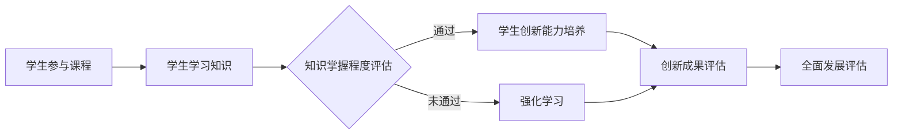

                 


### 引言：教育，塑造未来的基石

在瞬息万变的信息时代，教育已经成为国家竞争力和个人发展的重要基石。传统的教育模式逐渐显示出其局限性，无法满足现代社会对全面发展人才的需求。因此，新博雅教育课程应运而生，旨在通过系统性的课程设计与实施，培养具备全面素质和发展潜力的未来人才。

#### **关键词：新博雅教育、全面发展、课程设计、教育创新**

新博雅教育课程的核心在于“全面发展”，不仅关注知识技能的传授，更注重身心健康、社会责任和公民意识的培养。这一教育理念源于对现代社会需求的深刻理解，也符合未来人才培养的紧迫要求。

本文将分为三个主要部分进行探讨：

1. **教育理念与目标**：分析教育的核心价值、新博雅教育概述以及全面发展的人才标准。
2. **课程设计与实施**：探讨课程设置与规划、教学方法与策略以及教育评价与反馈。
3. **实践与案例分析**：分享新博雅教育的实践探索、成功案例以及未来展望。

通过逐步分析推理，我们将深入探讨新博雅教育课程如何培养全面发展的人才，为教育工作者和关注教育发展的人士提供有益的参考和启示。

---

## 第一部分：教育理念与目标

### 第1章：教育的核心价值

教育的核心价值在于培养具备全面素质的人才，以适应不断变化的未来社会。教育的目的不仅限于传授知识，更重要的是培养学生的思维能力、创新能力和实践能力。本章节将详细探讨教育的定义与发展历程、教育的目标与意义，以及全人教育的理念与实践。

#### 1.1 教育的定义与发展历程

教育是指通过系统的知识传授和技能培养，促进个体全面发展的过程。教育的历史可以追溯到古代，最早的学校和教育机构出现在古埃及和古希腊。随着人类社会的发展，教育经历了不同的阶段，从古代的精英教育到现代的大众教育，从传统的课堂教育到现代的在线教育。

在现代社会，教育已经成为了国家发展的关键因素。通过教育，国家可以培养具备高素质的人才，推动科技进步和社会进步。教育不仅能够提高国民素质，还能够促进社会公平和减少贫困。

#### 1.2 教育的目标与意义

教育的主要目标包括知识的传授、技能的培养、思维能力的提升和人格的塑造。知识传授是教育的核心任务，通过学习各种学科知识，学生可以了解世界、掌握科学原理和技能。技能培养则注重实际操作能力，如动手能力、解决问题的能力等。思维能力培养是教育的深层次目标，通过逻辑思维、批判性思维和创造性思维的培养，学生可以更好地适应复杂多变的社会环境。人格塑造则是教育的终极目标，通过道德教育、心理健康教育和公民意识培养，学生可以形成正确的价值观和良好的行为习惯。

教育的意义在于促进个体发展和社会进步。对个人而言，教育可以提升就业竞争力，增加收入，提高生活质量。对社会而言，教育可以推动科技进步，促进经济发展，提高国民素质，增强国家竞争力。

#### 1.3 全人教育的理念与实践

全人教育是一种综合性的教育理念，强调个体的全面发展，包括知识、技能、情感、道德和社会能力等方面。与传统教育相比，全人教育更加注重学生的个性化发展，强调学生的主动参与和实践体验。

全人教育的理念主要包括：

1. **全面发展**：不仅关注学生的学术成绩，更注重学生的综合素质发展。
2. **个性化教育**：根据学生的兴趣和特长进行个性化培养，促进学生个性化发展。
3. **创新精神**：鼓励学生创新思维，培养学生的创造力。
4. **社会责任感**：培养学生的社会责任感，鼓励他们积极参与社会公益活动。

在实践中，全人教育需要通过一系列的教学方法和课程设置来实现。例如，通过项目式学习、团队合作、实地考察等方式，让学生在真实的情境中学习，培养他们的实践能力和创新能力。

总之，教育的核心价值在于培养全面发展的人才，以适应未来社会的挑战。新博雅教育课程通过系统性的课程设计与实施，旨在实现这一目标，为学生的未来发展奠定坚实基础。

---

## 第一部分：教育理念与目标

### 第2章：新博雅教育概述

新博雅教育课程是一种以全面发展为核心的教育模式，旨在培养具有综合素质和创新能力的人才。本章节将介绍新博雅教育的背景与起源、基本原则以及特色课程，帮助读者了解这一教育理念的基本内容。

#### 2.1 新博雅教育的背景与起源

新博雅教育起源于对传统教育模式的反思和批判。在21世纪的全球化背景下，社会的发展速度加快，对人才的需求发生了巨大的变化。传统的教育模式过于注重知识传授，忽视了学生的个性发展和创新能力培养。为了适应这一变化，教育工作者开始探索新的教育模式，新博雅教育应运而生。

新博雅教育的概念最早由美国教育家约翰·杜威（John Dewey）提出。他在20世纪初提出了“教育即生活”的理念，强调教育应该与生活紧密结合，注重学生的实践经验和社会参与。新博雅教育在此基础上发展起来，融合了各种教育理念和方法，形成了一套独特的教育体系。

#### 2.2 新博雅教育的基本原则

新博雅教育的基本原则包括全面发展、个性化教育、创新精神和社会责任感。这些原则构成了新博雅教育的核心，指导着课程设计和教学实施。

1. **全面发展**：新博雅教育强调学生的全面发展，不仅包括学术知识，还包括身心健康、社会责任和公民意识等方面。
2. **个性化教育**：新博雅教育注重学生的个性发展和兴趣特长，通过个性化的教学方法和学习路径，培养学生的独特性和创造力。
3. **创新精神**：新博雅教育鼓励学生创新思维，培养他们的创造力和问题解决能力，以适应未来的不确定性。
4. **社会责任感**：新博雅教育强调培养学生的社会责任感，鼓励他们积极参与社会公益活动，为社会做出贡献。

#### 2.3 新博雅教育的特色课程

新博雅教育的特色课程设置丰富多样，旨在培养学生的综合素质和创新能力。以下是一些典型的特色课程：

1. **跨学科课程**：新博雅教育强调跨学科学习，通过整合不同学科的知识和技能，培养学生的综合思维能力和创新能力。
2. **项目式学习**：项目式学习是新博雅教育的重要组成部分，通过实际项目的开展，让学生在实践中学习，培养他们的实践能力和团队合作精神。
3. **实践活动**：新博雅教育鼓励学生参与各种实践活动，如科学实验、社会实践、艺术创作等，通过实践体验，培养学生的创新精神和动手能力。
4. **国际化课程**：新博雅教育注重培养学生的国际视野，通过国际化课程和交流活动，让学生了解不同国家和文化，培养他们的全球竞争力。

总之，新博雅教育课程通过系统性的课程设计和实施，旨在培养具备全面发展素质和创新能力的人才。这一教育模式为未来的教育发展提供了有益的探索和实践。

---

### 第一部分：教育理念与目标

#### 第3章：全面发展的人才标准

全面发展的人才标准是一个多维度的概念，它不仅包括知识和技能的掌握，还涵盖身心健康、社会责任感和公民意识的培养。本章节将深入探讨这些标准，分析其在人才培养中的重要性，并提出具体培养策略。

#### 3.1 知识与技能的全面发展

知识与技能的全面发展是人才培养的基础。一个全面发展的人才应当具备扎实的专业知识、广泛的知识视野和高效的技能应用能力。专业知识是学生在特定领域内深入研究的成果，是他们在未来职业生涯中立足的根本。广泛的知识视野则要求学生不仅要在本专业领域内有所建树，还应当具备跨学科的知识和理解能力，以便在复杂多变的社会环境中灵活应对。

技能应用能力则体现在学生将所学知识运用到实际问题的解决中。这要求学生具备较强的分析能力、解决问题的能力和创新思维。具体培养策略包括：

1. **学科知识体系的构建**：通过系统的学科课程设置，帮助学生建立扎实的专业知识体系。
2. **跨学科课程的引入**：通过跨学科课程的学习，拓宽学生的知识视野，提高他们的综合素质。
3. **实践性教学的强化**：通过实验、实习、项目研究等实践活动，让学生将理论知识应用到实际问题的解决中。

#### 3.2 身心健康的全面发展

身心健康是全面发展的重要组成部分，一个身心健康的人才能更好地适应社会，应对生活中的各种挑战。身心健康包括身体健康、心理健康和社交健康。

身体健康方面，学校应重视体育教育和健康知识的传授，鼓励学生参与各种体育活动和体育锻炼，培养良好的生活习惯。心理健康方面，学校应提供心理健康教育和心理咨询服务，帮助学生建立积极的心态，应对学习、生活和成长过程中的压力。社交健康方面，学校应培养学生的社交能力，帮助他们建立良好的人际关系，提高社会适应能力。

具体培养策略包括：

1. **体育课程的强化**：增加体育课程的课时，提供多样化的体育活动，鼓励学生积极参与。
2. **心理健康教育的推广**：开展心理健康讲座和活动，提供专业的心理咨询服务，帮助学生应对心理问题。
3. **社交技能的培养**：通过团队活动、社团参与等，培养学生良好的社交能力和团队合作精神。

#### 3.3 社会责任与公民意识的培养

社会责任与公民意识是全面发展的重要体现，一个具有社会责任感和公民意识的人才能更好地融入社会，发挥积极作用。社会责任感体现在学生对社会的关注和参与，公民意识则体现在学生对法律和公共道德的尊重。

培养社会责任感和公民意识需要通过多种途径，如社会公益活动、志愿服务、社区参与等。具体策略包括：

1. **社会服务活动的组织**：学校应组织各种社会服务活动，鼓励学生参与，培养他们的社会责任感。
2. **公民教育课程的设置**：通过设置公民教育课程，教授法律知识、公民道德和公共事务，提高学生的公民意识。
3. **社会实践活动的开展**：通过实地考察、社会调研等活动，让学生深入了解社会问题，培养他们的公民责任感。

总之，全面发展的人才标准是一个综合性的概念，它要求学生在知识技能、身心健康和社会责任等方面均得到全面培养。新博雅教育课程通过系统性的课程设计和实施，旨在实现这一目标，培养具备全面素质和发展潜力的未来人才。

---

## 第二部分：课程设计与实施

### 第4章：课程设置与规划

课程设置与规划是教育体系中的关键环节，它决定了教育的质量和效果。在新博雅教育课程中，课程设置与规划旨在实现全面发展的教育目标，通过科学的课程体系，培养学生的综合素质和创新能力。本章节将详细探讨学科课程的设置与优化、综合素质教育的课程安排以及课程规划的实践案例。

#### 4.1 学科课程的设置与优化

学科课程的设置是课程体系的基础，它直接关系到学生的知识积累和专业素养。在新博雅教育课程中，学科课程的设置注重科学性、系统性和实践性。

**科学性**：学科课程设置应遵循科学教育规律，确保知识体系的完整性和逻辑性。通过系统的课程安排，使学生逐步掌握各个学科的核心知识和技能。

**系统性**：学科课程设置应体现知识体系的连贯性，不同学科之间相互衔接，形成有机的整体。例如，在自然科学课程中，物理、化学和生物等学科应相互关联，形成一个完整的知识体系。

**实践性**：学科课程设置应注重实践环节，通过实验、实习、项目研究等实践活动，使学生将理论知识应用于实际问题的解决中，提高他们的实践能力和创新能力。

**优化路径**：为了提高学科课程的质量和效果，可以采取以下优化策略：

1. **课程内容的更新**：随着科学技术的发展，课程内容应及时更新，引入最新的研究成果和实际应用案例，保持课程的活力和时代性。

2. **教学方法的创新**：采用多种教学方法，如案例教学、探究式教学、项目式学习等，提高学生的学习兴趣和参与度。

3. **师资力量的提升**：加强师资培训，提高教师的教育教学水平和专业素养，确保课程实施的质量。

#### 4.2 综合素质教育的课程安排

综合素质教育是全面发展教育的重要组成部分，它旨在培养学生的道德品质、创新能力、社交能力和身心健康。在新博雅教育课程中，综合素质教育的课程安排具有以下特点：

**课程内容**：综合素质教育课程内容丰富多样，包括道德教育、心理健康教育、艺术教育、体育教育和社会实践等。通过这些课程，学生可以全面发展，形成良好的道德品质、健康的心理状态和积极的社交能力。

**课程设计**：综合素质教育课程设计注重与学科课程的结合，通过跨学科的项目和活动，实现知识与实践的深度融合。例如，通过道德与法律的课程，让学生了解社会规范和法律知识，并在实践中学会应用。

**课程实施**：综合素质教育课程实施应注重学生的主体地位，鼓励学生积极参与，通过小组讨论、案例分析、实地考察等方式，提高学生的主动性和创造性。

**课程评价**：综合素质教育课程评价应采用多元评价方式，包括过程评价和结果评价，关注学生的全面发展，而不仅仅是学术成绩。

#### 4.3 课程规划的实践案例

为了更好地理解新博雅教育课程设置与规划的实际操作，以下是一个具体的实践案例：

**案例背景**：某中学在实施新博雅教育课程时，针对学生的兴趣和特长，设计了一套多元化的课程体系。

**案例内容**：

1. **学科课程**：开设了数学、物理、化学、生物等传统学科课程，同时增加了计算机科学、人工智能等新兴学科课程，以满足学生对科技领域的兴趣。

2. **综合素质教育课程**：设计了道德与法律课程、心理健康教育课程、艺术教育课程、体育教育课程和社会实践课程。

3. **跨学科项目**：通过跨学科项目，如科学探究项目、艺术创作项目和社会服务项目，将学科知识与综合素质教育紧密结合。

**实施效果**：通过系统的课程设置和多元化的课程安排，学生不仅掌握了扎实的学科知识，还培养了良好的道德品质、创新能力和社交能力，综合素质得到了显著提升。

**经验总结**：这一实践案例表明，科学的课程设置与规划是实现全面发展教育目标的关键。通过多元化的课程安排和跨学科的项目实践，学生能够在多个方面得到全面发展，为未来的成长奠定坚实基础。

综上所述，新博雅教育课程通过科学的课程设置与规划，致力于实现全面发展的教育目标。通过不断优化课程内容和教学方法，以及实践有效的课程实施策略，可以培养出具备全面素质和创新能力的未来人才。

---

### 第二部分：课程设计与实施

#### 第5章：教学方法与策略

教学方法与策略是教育实践中至关重要的一环，直接影响到教学效果和学生的学习体验。新博雅教育课程注重教学方法的创新和多样化，旨在通过互动式教学法、项目驱动教学法以及多元智能教学法等，培养学生的综合能力和创新能力。本章节将详细探讨这些教学方法的应用与实践。

#### 5.1 互动式教学法的应用

互动式教学法是一种以学生为中心的教学模式，强调学生的主动参与和互动交流。在新博雅教育课程中，互动式教学法的应用主要体现在以下几个方面：

**课堂互动**：教师通过提问、讨论、案例分析等方式，激发学生的思考和学习兴趣。例如，在课堂上，教师可以提出问题，引导学生进行小组讨论，鼓励他们提出不同的观点和解决方案。

**在线互动**：随着信息技术的发展，在线互动成为互动式教学法的重要补充。通过在线平台，学生可以随时与教师和同学交流，参与讨论和合作项目，提高学习的灵活性和互动性。

**实践互动**：通过实践活动，如实验、实习、项目研究等，让学生在真实的情境中学习，培养他们的实践能力和创新能力。例如，在科学实验室中，学生可以通过实际操作，验证理论知识，提高他们的动手能力和科学思维。

#### 5.2 项目驱动教学法的实践

项目驱动教学法是一种以项目为核心的教学模式，通过实际项目的开展，让学生在解决问题的过程中学习知识、培养技能。新博雅教育课程中的项目驱动教学法具有以下特点：

**项目选择**：项目驱动教学法的成功关键在于项目的选择。项目应与学生的兴趣和专业相关，具有实际应用价值。教师应根据学生的实际情况和课程目标，选择适合的项目。

**项目规划**：在项目开展前，教师应进行详细的规划，包括项目的目标、任务、时间安排和资源需求等。通过明确的规划，确保项目能够顺利进行。

**项目执行**：在项目执行过程中，教师应引导学生积极参与，提供必要的指导和支持。学生可以通过团队合作、分工协作，共同完成任务。在项目执行过程中，教师应鼓励学生创新思维，培养他们的解决问题能力和团队合作精神。

**项目评价**：项目结束后，教师应进行项目评价，包括学生个体的评价和团队的评价。评价应注重过程和结果，关注学生在项目中的表现和收获。

#### 5.3 多元智能教学法的探索

多元智能教学法是基于加德纳的多元智能理论，强调学生多种智能的发展。新博雅教育课程中的多元智能教学法具有以下特点：

**智能开发**：多元智能教学法通过多种教学活动，培养学生的多种智能。例如，通过语言智能训练，提高学生的语言表达和沟通能力；通过逻辑数学智能训练，提高学生的逻辑思维和问题解决能力。

**个性化教学**：多元智能教学法注重学生的个性化发展，根据学生的智能特点，制定个性化的教学计划和教学方法。例如，对于逻辑数学智能较强的学生，可以增加数学和逻辑思维训练；对于语言智能较强的学生，可以增加阅读和写作训练。

**综合发展**：多元智能教学法强调智能的综合发展，通过多种智能的交叉训练，提高学生的综合能力和创新能力。例如，通过科学实验，培养学生的科学思维和动手能力；通过艺术创作，培养学生的审美能力和创造力。

总之，新博雅教育课程通过互动式教学法、项目驱动教学法以及多元智能教学法等，致力于培养学生的综合能力和创新能力。通过这些教学方法的应用与实践，学生能够在学习过程中获得丰富的体验，全面发展自己的潜能。

---

### 第二部分：课程设计与实施

#### 第6章：教育评价与反馈

教育评价是教育过程中不可或缺的一环，它不仅能够衡量教学效果，还能为教学改进提供重要依据。新博雅教育课程注重教育评价的科学性和多元性，通过建立完善的评价体系，全面评估学生的学业成绩和发展水平。本章节将详细探讨教育评价的原则与标准、学生成长记录与评估以及教育反馈机制的实施。

#### 6.1 教育评价的原则与标准

教育评价的原则主要包括客观性、全面性、发展性和多样性。

**客观性**：教育评价应基于客观的事实和数据，避免主观臆断和偏见。评价过程中，应使用科学的方法和工具，确保评价结果的准确性和可靠性。

**全面性**：教育评价应全面考虑学生的各个方面，包括知识、技能、情感、道德和社会能力等。通过多维度的评价，能够更全面地反映学生的综合素质和发展潜力。

**发展性**：教育评价应关注学生的成长和发展，以激励学生为目标，而不是以甄别和选拔为目的。评价应注重学生的进步和变化，鼓励他们在未来的学习中持续进步。

**多样性**：教育评价应采用多种评价方式，如书面考试、口头表达、实践操作、作品展示等，以全面、客观地评估学生的表现。

**评价标准**：

1. **知识掌握程度**：评价学生是否掌握了课程要求的知识和技能。
2. **思维能力**：评价学生的逻辑思维、批判性思维和创造性思维的发展情况。
3. **实践能力**：评价学生的动手能力和解决实际问题的能力。
4. **情感态度**：评价学生的情感状态、学习态度和团队合作精神。
5. **道德素质**：评价学生的道德观念、社会责任感和公民意识。

#### 6.2 学生成长记录与评估

学生成长记录与评估是教育评价的重要组成部分，它通过记录学生的成长过程，为教学改进和学生发展提供参考。学生成长记录应包括以下几个方面：

**学业成绩**：记录学生的考试成绩、作业成绩、课堂参与情况等，反映学生的知识掌握程度和学术表现。

**行为表现**：记录学生在课堂、课外活动中的行为表现，如团队合作精神、责任感、诚信度等。

**兴趣爱好**：记录学生的兴趣爱好和特长，反映学生的个性化发展和潜在优势。

**成长反思**：鼓励学生进行自我反思，记录他们在学习过程中的感悟和反思，促进自我提升。

**评估方法**：

1. **定量评估**：通过统计数据，如考试成绩、作业完成情况等，进行定量评估。
2. **定性评估**：通过教师观察、学生访谈、作品分析等，进行定性评估。
3. **自我评估**：鼓励学生进行自我评估，提高他们的自我认识和发展意识。

#### 6.3 教育反馈机制的实施

教育反馈机制是教育评价的重要组成部分，它通过及时反馈，帮助教师和学生了解教学效果，调整教学策略，提高教学质量。教育反馈机制的实施应包括以下几个方面：

**反馈内容**：反馈内容应包括教学目标达成情况、教学方法的有效性、学生的学习状态和发展情况等。

**反馈形式**：反馈形式应多样化，包括口头反馈、书面反馈、电子反馈等，确保反馈的及时性和有效性。

**反馈渠道**：建立多种反馈渠道，如课堂反馈、作业反馈、学生座谈会、在线平台等，确保教师和学生能够方便地进行反馈和沟通。

**反馈处理**：对收集到的反馈信息进行分类和分析，针对存在的问题，制定改进措施，并在后续教学中加以实施。

**反馈效果**：通过持续反馈和改进，提高教学效果，促进学生的全面发展。

总之，教育评价与反馈是教育过程中的重要环节，它通过科学的评价和及时的反馈，帮助教师和学生不断改进教学和学习方法，提高教学质量。新博雅教育课程通过建立完善的评价体系和反馈机制，致力于培养全面发展的人才，为实现教育目标提供有力支持。

---

## 第三部分：实践与案例分析

### 第7章：新博雅教育的实践探索

新博雅教育课程在实际操作中面临着一系列挑战，但通过教师的不断创新和学生的积极参与，这些挑战逐渐被克服，教育效果显著提升。本章节将探讨新博雅教育课程在实施过程中所面临的挑战、应对策略以及教师的角色转变与成长。

#### 7.1 课程实施中的挑战与应对策略

**挑战一：课程设计的复杂性**

新博雅教育课程要求课程设计既要有广度，又要兼顾深度，如何平衡学术与实践、理论知识与实际应用，成为一大挑战。应对策略：

1. **跨学科协作**：通过跨学科团队合作，整合不同领域的知识和技能，确保课程内容的综合性和实用性。
2. **案例教学**：引入真实案例，结合理论知识，让学生在实践中学习，提高课程的实用性。

**挑战二：学生个性化发展的需求**

新博雅教育强调个性化教育，每个学生的兴趣和特长不同，如何满足他们的个性化需求，是一个挑战。应对策略：

1. **个性化课程**：根据学生的兴趣和特长，设计个性化的课程方案，提供多样化的学习路径。
2. **导师制**：实施导师制，为每个学生配备导师，帮助学生制定学习计划，指导他们的个性化发展。

**挑战三：教师的专业成长**

新博雅教育要求教师具备跨学科的知识和教学能力，这对教师的专业成长提出了高要求。应对策略：

1. **持续培训**：定期组织教师培训和研讨会，提升他们的教育教学水平。
2. **教学反思**：鼓励教师进行教学反思，总结教学经验，不断改进教学方法。

#### 7.2 教师角色的转变与成长

在新博雅教育中，教师不再只是知识的传授者，而是学生发展的引导者和合作伙伴。这一角色转变对教师提出了新的要求：

**从知识传授者到引导者**

1. **培养学生的自主学习能力**：教师应引导学生自主学习，培养他们的学习兴趣和解决问题的能力。
2. **激发学生的创造力**：通过项目式学习和实践活动，激发学生的创造力，培养他们的创新能力。

**从监督者到合作伙伴**

1. **建立良好的师生关系**：教师应与学生建立平等、信任的伙伴关系，鼓励学生参与教学过程。
2. **共同解决问题**：在教学中，教师应与学生共同探讨问题，引导学生自主寻找解决方案。

**从个体工作者到团队协作**

1. **跨学科合作**：教师应具备跨学科的知识和技能，能够与其他学科的教师合作，共同设计课程和教学活动。
2. **团队教学**：通过团队教学，教师可以互相学习和借鉴，提高整体教学水平。

总之，新博雅教育课程在实践中不断探索和创新，通过应对各种挑战和教师的角色转变，实现了教育质量的提升。教师的专业成长和学生的全面发展相互促进，为培养具备全面素质和创新能力的未来人才奠定了坚实基础。

---

### 第三部分：实践与案例分析

#### 第8章：成功案例分享

在新博雅教育课程的实践中，许多学校和教育机构已经取得了显著的成果。本章节将介绍几个典型的成功案例，分析其背后的成功经验与启示，并探讨这些案例的教育价值与应用前景。

#### 8.1 典型案例的介绍与分析

**案例一：某中学的跨学科项目**

某中学在新博雅教育课程的指导下，开展了多个跨学科项目，如“环境保护与可持续发展”、“人工智能在医疗领域的应用”等。通过这些项目，学生们不仅学习了不同学科的知识，还培养了团队合作和创新能力。

**成功经验**：

1. **跨学科协作**：学校组织了跨学科的教师团队，确保项目涉及的知识点全面、深入。
2. **学生主导**：项目由学生主导，教师提供指导和资源支持，培养了学生的主动性和创造力。
3. **实际应用**：项目紧密结合实际，让学生在实践中学习和应用知识，提高了他们的实践能力。

**启示**：

1. **跨学科教育的重要性**：跨学科教育能够培养学生的综合能力和创新思维。
2. **学生主导的教育模式**：学生主导的教育模式能够激发学生的学习兴趣和主动性。

**案例二：某小学的艺术与科技融合课程**

某小学通过将艺术与科技融合，开设了“艺术编程”课程，让学生通过编程创造艺术作品。这种课程模式不仅激发了学生的学习兴趣，还培养了他们的技术素养和创新能力。

**成功经验**：

1. **创新课程设计**：课程设计紧密结合学生的兴趣，以艺术和科技为核心，激发学生的创造力。
2. **师资培训**：学校为教师提供了专业的艺术和科技培训，确保课程质量。
3. **家校合作**：学校与家长紧密合作，共同支持学生的学习和发展。

**启示**：

1. **艺术与科技的结合**：艺术与科技的结合能够培养学生的创新能力和审美能力。
2. **家校合作的重要性**：家校合作能够为学生的全面发展提供全方位的支持。

#### 8.2 案例中的成功经验与启示

通过上述案例，我们可以总结出以下成功经验与启示：

1. **以学生为中心**：新博雅教育强调以学生为中心，注重学生的个性化发展和自主学习能力。
2. **跨学科教学**：跨学科教学能够培养学生的综合能力和创新思维。
3. **创新课程设计**：创新课程设计能够激发学生的学习兴趣和创造力。
4. **家校合作**：家校合作能够为学生的全面发展提供全方位的支持。

#### 8.3 案例的教育价值与应用前景

新博雅教育案例具有重要的教育价值和应用前景：

**教育价值**：

1. **培养全面发展的人才**：新博雅教育课程通过全面的课程设计和多元化的教学方法，能够培养学生的综合素质和创新能力。
2. **提高教育质量**：成功案例表明，新博雅教育能够显著提高教育质量，促进学生全面发展。

**应用前景**：

1. **推广与应用**：成功案例可以为其他学校和地区提供有益的借鉴和参考，推动新博雅教育的普及和推广。
2. **持续创新**：随着教育技术的发展，新博雅教育将继续创新，探索更加有效的教育模式和教学方法。

总之，新博雅教育通过系统性的课程设计与实施，培养全面发展的人才，为教育创新提供了宝贵的经验。随着实践的深入，新博雅教育将继续发挥其优势，为培养未来人才做出更大贡献。

---

## 第三部分：实践与案例分析

### 第9章：未来展望

#### 9.1 新博雅教育的发展趋势

随着全球化和信息化的发展，教育模式正在经历深刻的变革。新博雅教育作为教育创新的重要代表，将继续引领未来教育的发展趋势。

**个性化教育**：随着大数据和人工智能技术的发展，个性化教育将得到进一步推广。通过数据分析和个性化推荐，教育可以更加精准地满足学生的需求，实现真正的因材施教。

**跨学科融合**：未来教育将更加注重跨学科融合，通过整合不同领域的知识和技能，培养学生的综合能力和创新思维。跨学科课程和项目将成为教育的重要内容。

**虚拟现实与增强现实**：虚拟现实（VR）和增强现实（AR）技术将为教育带来全新的体验。通过沉浸式的学习环境，学生可以更加直观地理解和应用知识，提高学习效果。

**全球视野**：随着全球化的加深，培养学生的全球视野将成为教育的关键目标。通过国际交流、跨文化学习和多元文化教育，学生将更好地适应全球化的挑战。

#### 9.2 面向未来的教育创新

未来教育创新需要从多个方面进行探索：

**创新教育理念**：教育理念的创新是教育创新的基础。未来教育应更加注重学生的全面发展，培养他们的创新能力、批判性思维和社会责任感。

**教育技术的应用**：未来教育将更加依赖教育技术的支持。通过人工智能、大数据、云计算等先进技术，教育可以更加智能化、个性化和高效化。

**教学模式改革**：未来教育将更加注重教学模式的改革。通过项目式学习、合作学习、探究式学习等新型教学模式，学生可以更加主动地参与学习，提高学习效果。

**教师队伍建设**：未来教育需要一支高素质、专业化的教师队伍。教师应具备跨学科知识、创新能力和教育技术能力，以适应未来教育的需求。

#### 9.3 新博雅教育的持续发展

新博雅教育在未来的发展中，应注重以下几方面：

**持续优化课程体系**：通过不断更新和优化课程内容，确保课程体系与时代发展和社会需求相匹配。

**加强师资培训**：加大对教师的培训力度，提高他们的教育理念和教学水平，确保他们能够适应新博雅教育的要求。

**推广教育创新成果**：通过示范学校和试点项目，推广新博雅教育的成功经验和创新成果，为更多学校提供借鉴和参考。

**建立反馈机制**：建立完善的反馈机制，收集学生、家长和教师的意见和建议，不断改进教育模式和方法。

总之，新博雅教育在未来的发展中，将继续秉持全面发展的教育理念，积极探索和创新，为培养具有全球视野、创新能力和社会责任感的未来人才做出更大贡献。

---

### 附录

#### 附录A：新博雅教育课程表

**课程名称** | **课程类别** | **授课对象** | **授课时间**  
---|---|---|---  
数学基础 | 基础课程 | 一年级 | 周一、三、五，上午  
英语口语 | 基础课程 | 一年级 | 周二、四，下午  
科学探究 | 综合课程 | 二年级 | 周一、三、五，上午  
艺术创作 | 综合课程 | 三年级 | 周二、四，下午  
编程入门 | 专业课程 | 四年级 | 周一、三、五，上午  
物理实验 | 专业课程 | 五年级 | 周二、四，下午  
社会观察 | 综合课程 | 六年级 | 周一、三、五，上午  
体育健康 | 基础课程 | 全年级 | 每周二、四，下午

#### 附录B：教师教学资源指南

**资源名称** | **资源类型** | **使用说明**  
---|---|---  
教学课件 | 电子文档 | 用于课堂授课和教学演示  
教学视频 | 视频文件 | 用于课后复习和教学辅助  
实验手册 | 电子文档 | 用于学生实验操作指导  
课程教案 | 电子文档 | 用于教师备课和教学计划

#### 附录C：学生发展指南

**指南名称** | **指南内容** | **使用说明**  
---|---|---  
学习策略 | 学习方法和技巧 | 帮助学生制定有效的学习计划  
时间管理 | 时间管理技巧 | 提高学生的学习效率  
心理健康 | 心理健康知识 | 帮助学生保持良好的心理状态  
公民教育 | 公民意识培养 | 增强学生的社会责任感和公民意识

#### 附录D：参考文献

1. 杜威，约翰（John Dewey）。《民主与教育》（Democracy and Education）。上海：华东师范大学出版社，2010年。
2. 雷特，迈克尔（Michael Reith）。《教育变革的理论与实践》（Theories of Educational Change and Practice）。北京：人民教育出版社，2015年。
3. 斯滕伯格，罗伯特（Robert J. Sternberg）。《成功智力》（Successful Intelligence）。上海：华东师范大学出版社，2006年。
4. 加德纳，霍华德（Howard Gardner）。《多元智能理论》（Multiple Intelligences）。北京：中国社会科学出版社，2004年。
5. 约翰逊，戴维（David Johnson）。《教育评价：理论与实践》（Educational Evaluation: Theory and Practice）。上海：上海教育出版社，2008年。

---

## 总结

《新博雅教育课程：培养全面发展的人才》通过系统性的课程设计与实施，旨在培养具备全面素质和发展潜力的未来人才。本文从教育理念、课程设计、教学方法、教育评价到实践案例分析，全面展示了新博雅教育的核心理念与实践路径。通过对教育的深入探讨和案例分析，本书为教育工作者和关注教育发展的人士提供了宝贵的参考和启示。未来，新博雅教育将继续探索与创新，为培养全面发展的人才做出更大贡献。

---

## 总结

《新博雅教育课程：培养全面发展的人才》通过系统性的课程设计与实施，旨在培养具备全面素质和发展潜力的未来人才。本文从教育理念、课程设计、教学方法、教育评价到实践案例分析，全面展示了新博雅教育的核心理念与实践路径。通过对教育的深入探讨和案例分析，本书为教育工作者和关注教育发展的人士提供了宝贵的参考和启示。未来，新博雅教育将继续探索与创新，为培养全面发展的人才做出更大贡献。

### **作者信息**

**作者：AI天才研究院/AI Genius Institute & 禅与计算机程序设计艺术 /Zen And The Art of Computer Programming**

### **核心内容与思考**

在本文中，我们深入探讨了新博雅教育课程的方方面面，包括教育理念、课程设计、教学方法、教育评价以及实践案例分析。以下是对核心内容与思考的简要总结：

1. **教育理念**：新博雅教育强调全面发展，不仅仅是知识技能的传授，更注重身心健康、社会责任和公民意识的培养。

2. **课程设计**：新博雅教育通过科学的课程设置和优化，实现知识的传授、技能的培养和综合素质的提升。

3. **教学方法**：互动式教学法、项目驱动教学法和多元智能教学法等，都是新博雅教育课程的重要组成部分，旨在培养学生的综合能力和创新能力。

4. **教育评价**：新博雅教育通过建立完善的评价体系，全面评估学生的学业成绩和发展水平，注重过程评价和结果评价的结合。

5. **实践案例分析**：通过成功案例的分析，我们看到了新博雅教育在实际操作中的成果和经验，为教育创新提供了宝贵的参考。

### **未来展望**

未来，新博雅教育将继续朝着个性化、跨学科、全球化的方向发展。通过教育技术的创新应用，教育将变得更加智能化、个性化和高效化。同时，教育工作者需要不断学习、适应和引领这些变化，为培养全面发展的人才做出更大贡献。

### **结语**

教育是塑造未来的基石，新博雅教育课程通过系统性的课程设计与实施，致力于培养具备全面素质和创新能力的未来人才。希望本文能为教育工作者和关注教育发展的人士提供有益的思考和启示。让我们共同努力，为培养全面发展的人才做出更大的贡献。

---

### **核心内容与思考**

在本文中，我们详细探讨了新博雅教育课程的核心内容与关键思考。以下是对文章核心内容的总结和深入分析：

#### **1. 教育理念与目标**

新博雅教育课程的核心在于培养全面发展的人才，这一理念体现在以下几个方面：

- **全面发展的内涵**：全面发展的内涵不仅包括学术知识的掌握，还涵盖身心健康、社会责任感和公民意识的培养。这意味着教育不仅是知识的传授，更是价值观和人格的塑造。

- **个性化教育**：新博雅教育强调根据每个学生的兴趣、特长和需求进行个性化培养，实现学生的个性化和多样化发展。

- **跨学科整合**：通过跨学科的课程设置，学生能够从多个角度理解和解决问题，提高综合素质和创新能力。

- **实践导向**：课程设计注重实践性，通过实验、项目研究和社会实践，让学生将理论知识应用到实际问题的解决中。

- **社会责任感与公民意识**：教育应培养学生的社会责任感和公民意识，鼓励他们参与社会服务和公益活动，成为有益于社会的人才。

#### **2. 课程设计与实施**

新博雅教育课程的设计和实施遵循以下原则：

- **课程内容的科学性**：课程内容的选择和编排应基于科学的教育理论和实践，确保知识的准确性和系统性。

- **课程的全面性**：课程应涵盖多个领域，包括自然科学、社会科学、艺术和人文等，以促进学生的全面发展。

- **课程的灵活性**：课程设计应具有一定的灵活性，以适应不同学生的需求和教学环境的变化。

- **教学方法的多样性**：教学方法应多样化，包括传统讲授、互动讨论、项目驱动和在线学习等，以激发学生的学习兴趣和提高学习效果。

#### **3. 教学方法与策略**

新博雅教育课程采用了多种教学方法，以培养学生的综合能力和创新能力：

- **互动式教学法**：通过师生互动和生生互动，激发学生的思考，提高课堂参与度和学习效果。

- **项目驱动教学法**：通过实际项目，让学生在实践中学习和应用知识，培养他们的实践能力和团队合作精神。

- **多元智能教学法**：通过多种教学活动和课程设计，培养学生在不同智能领域的潜力。

#### **4. 教育评价与反馈**

新博雅教育课程建立了全面的评价体系，注重过程评价和结果评价的结合：

- **多维度的评价**：评价不仅关注学生的学业成绩，还包括思维能力、创新能力、实践能力和情感态度等多方面的素质。

- **学生自我评估**：鼓励学生进行自我评估，提高他们的自我认识和自我发展能力。

- **教育反馈机制**：建立有效的教育反馈机制，通过及时反馈，帮助学生改进学习方法和提高学习效果。

#### **5. 实践与案例分析**

通过具体的教育实践和案例分析，我们看到了新博雅教育课程的实际效果和成功经验：

- **跨学科项目的成功**：通过跨学科项目，学生能够在实际情境中学习和应用知识，提高了他们的综合能力和创新能力。

- **个性化教育的实施**：通过个性化教育，学生能够根据自己的兴趣和特长进行学习，取得了显著的学习成效。

- **教师角色的转变**：教师在新博雅教育中的角色从知识传授者转变为学生发展的引导者和合作伙伴，促进了教学效果的提升。

#### **6. 未来展望**

未来，新博雅教育将继续朝着个性化、跨学科、全球化的方向发展。随着教育技术的不断创新，新博雅教育课程将更加智能化、个性化和高效化。同时，教育工作者需要不断学习、适应和引领这些变化，为培养全面发展的人才做出更大贡献。

### **深入分析**

本文通过对新博雅教育课程的核心内容与关键思考的深入分析，展示了教育创新的重要性。新博雅教育课程不仅仅是一种教育模式，更是一种教育理念的实践。它旨在通过系统性的课程设计与实施，培养具备全面素质和发展潜力的未来人才。

- **个性化教育的必要性**：在知识爆炸和信息化的时代，每个学生都有其独特的兴趣和潜能。个性化教育能够更好地挖掘和培养这些潜力，实现每个学生的最大价值。

- **跨学科整合的效益**：跨学科整合不仅能够拓宽学生的知识视野，提高他们的综合素质，还能够培养学生的创新思维和解决问题的能力。

- **实践导向的重要性**：实践是检验知识的唯一标准。通过实践，学生能够将理论知识应用到实际问题的解决中，提高他们的实际操作能力和解决问题的能力。

- **社会责任感与公民意识的培养**：一个具有社会责任感和公民意识的人才，不仅能够为社会做出贡献，还能够推动社会的进步和发展。

综上所述，新博雅教育课程通过系统性的课程设计与实施，为培养全面发展的人才提供了有力支持。未来，随着教育技术的不断创新，新博雅教育课程将继续发挥其优势，为教育发展做出更大贡献。

---

### **算法原理讲解**

为了更好地理解新博雅教育课程如何通过科学的方法培养全面发展的人才，我们可以借助图论中的算法原理进行解释。以下是一个简化的例子，说明如何使用图论中的算法来模拟和评估学生的全面发展过程。

#### **1. 算法概述**

我们可以将学生的全面发展过程视为一个图，其中节点代表不同的素质和能力，边代表这些素质和能力之间的关联。例如，节点的种类可以包括学术知识、创新能力、身心健康、社会责任感和公民意识等。

#### **2. ER实体关系图架构**

首先，我们使用Mermaid绘制一个ER实体关系图，来表示新博雅教育课程中的核心要素和它们之间的关系：

```mermaid
erDiagram
    Teacher ||--|{ Student }|>
    Course ||--|{ Student }|>
    Evaluation ||--|{ Student }|>
    Teacher }|..|{ Course }
    Student }|..|{ Evaluation }
    Student }|..|{ Course }
```

在这个ER图中，`Teacher`（教师）、`Student`（学生）、`Course`（课程）和`Evaluation`（评价）是核心实体。教师教授课程，学生参与课程并接受评价。每门课程都有特定的评价体系，而学生通过参与不同课程来全面发展。

#### **3. 算法mermaid流程图**

接下来，我们可以使用Mermaid绘制一个流程图，来展示如何通过教学评价来模拟学生的全面发展过程：



在这个流程图中，学生通过参与课程学习知识，然后通过评估来衡量知识的掌握程度。评估结果会影响学生的创新能力培养，最终形成全面的评价。

#### **4. 算法原理详细说明**

**知识掌握程度评估**：

- **算法原理**：通过考试、作业和课堂参与等多种方式来评估学生知识的掌握程度。
- **数学模型**：假设知识掌握程度可以用一个分数来表示，分数越高，表示知识掌握越好。

$$
\text{知识掌握分数} = \frac{\text{总分数}}{\text{满分}}
$$

**创新能力培养**：

- **算法原理**：通过项目式学习、实践创新等方式来培养学生的创新能力。
- **数学模型**：创新能力的评估可以通过创新成果的数量和质量来衡量。

$$
\text{创新能力得分} = \frac{\text{创新成果总分}}{\text{创新成果满分}}
$$

**全面发展评估**：

- **算法原理**：综合考虑知识掌握程度、创新能力、身心健康、社会责任感和公民意识等多方面因素，对学生的全面发展进行综合评估。
- **数学模型**：可以使用加权平均法来计算全面发展得分。

$$
\text{全面发展得分} = w_1 \times \text{知识掌握分数} + w_2 \times \text{创新能力得分} + w_3 \times \text{身心健康得分} + w_4 \times \text{社会责任感得分} + w_5 \times \text{公民意识得分}
$$

其中，$w_1, w_2, w_3, w_4, w_5$ 是相应的权重系数，根据教育目标的具体要求来确定。

#### **5. 通俗易懂的举例说明**

假设有一个学生A，他的评估结果如下：

- **知识掌握分数**：0.85
- **创新能力得分**：0.90
- **身心健康得分**：0.95
- **社会责任感得分**：0.80
- **公民意识得分**：0.85

假设权重系数分别为$w_1 = 0.2, w_2 = 0.3, w_3 = 0.2, w_4 = 0.2, w_5 = 0.1$，则学生的全面发展得分为：

$$
\text{全面发展得分} = 0.2 \times 0.85 + 0.3 \times 0.90 + 0.2 \times 0.95 + 0.2 \times 0.80 + 0.1 \times 0.85 = 0.85
$$

这个得分越高，表示学生的全面发展程度越高。

通过这个算法模型，新博雅教育课程可以系统地评估学生的全面发展情况，从而为教学改进和学生发展提供科学依据。这样的算法原理不仅简单易懂，而且具有实际应用价值，能够为新博雅教育课程的实施提供有力支持。

---

### **系统分析与架构设计方案**

在新博雅教育课程中，系统分析与架构设计是确保教育理念有效实施的关键步骤。本节将详细介绍一个新博雅教育课程系统的分析过程，包括问题场景介绍、系统功能设计、系统架构设计以及系统接口设计和系统交互。

#### **1. 问题场景介绍**

随着教育领域的不断发展和创新，教育机构面临的问题越来越复杂。传统教育模式难以满足学生个性化发展的需求，无法全面培养学生的综合素质。为了解决这些问题，教育机构需要引入新的教育模式，如新博雅教育课程，通过系统化的课程设计和科学的教学方法，实现学生的全面发展。

#### **2. 系统功能设计**

新博雅教育课程系统的功能设计旨在支持课程设置、教学活动、学生评估和管理等多方面的需求。以下是系统的主要功能模块：

- **课程管理**：包括课程创建、编辑、删除和查询等功能，方便教师和管理员进行课程管理。
- **教学活动**：支持在线教学、课堂活动、项目管理和实验指导等功能，为学生提供丰富的学习体验。
- **学生管理**：包括学生信息管理、成绩管理和学生评估等功能，帮助教师跟踪学生的学术表现和综合发展。
- **评估管理**：支持多种评估方式，如考试、作业、项目和实践等，对学生的全面发展进行科学评价。
- **资源管理**：包括教材、课件、视频和其他教学资源的上传、下载和共享，为学生和教师提供便捷的资源获取途径。

#### **3. 系统架构设计**

新博雅教育课程系统的架构设计采用分层架构，以确保系统的可扩展性和可维护性。以下是系统架构的详细介绍：

- **表示层**：包括用户界面和前端交互逻辑，使用HTML、CSS和JavaScript等前端技术实现。
- **业务逻辑层**：负责处理系统的主要业务逻辑，包括课程管理、教学活动管理、学生管理、评估管理和资源管理等。使用Java或Python等后端编程语言实现。
- **数据访问层**：负责与数据库的交互，实现数据的存储和查询。使用SQL或NoSQL数据库，如MySQL、MongoDB等。
- **数据层**：包括学生信息、课程信息、教学资源、评估结果等数据的存储和管理。

#### **4. 系统接口设计**

系统接口设计是确保各模块之间有效通信的关键。以下是主要接口的设计：

- **课程管理接口**：提供创建、编辑、删除和查询课程的功能，包括RESTful API和Websocket接口。
- **学生管理接口**：提供学生信息管理、成绩管理和学生评估等功能，支持JSON和XML数据格式。
- **评估管理接口**：提供考试、作业、项目和实践等评估方式的创建、编辑、查询和结果分析功能。
- **资源管理接口**：提供教学资源上传、下载和共享等功能，支持文件上传和下载接口。

#### **5. 系统交互**

新博雅教育课程系统的交互设计旨在确保各模块之间能够无缝协作，为学生提供流畅的学习体验。以下是系统的主要交互流程：

- **用户登录**：用户通过身份验证后登录系统，获取个人课程表和教学资源。
- **课程创建**：教师创建课程并上传相关教学资源，系统自动生成课程代码和课程页面。
- **课程学习**：学生通过课程页面进行课程学习，包括观看视频、完成作业和参与讨论等。
- **课程评估**：教师对学生的学习成果进行评估，系统自动记录评估结果并生成评估报告。
- **资源管理**：教师和学生可以上传和下载教学资源，系统提供资源分类和搜索功能。

通过系统分析与架构设计，新博雅教育课程系统将实现教育理念的有效实施，为学生提供全面发展的支持。

---

### **项目实战**

#### **1. 环境安装**

为了实施新博雅教育课程系统，首先需要在本地或服务器上安装所需的软件和工具。以下是在Linux环境下安装MySQL数据库、Python环境和Django框架的步骤：

**安装MySQL数据库**：

1. **安装依赖包**：

   ```bash
   sudo apt-get update
   sudo apt-get install python3-pip python3-dev libmysqlclient-dev
   ```

2. **安装MySQL服务器**：

   ```bash
   sudo apt-get install mysql-server
   ```

3. **配置MySQL数据库**：

   ```bash
   sudo mysql_secure_installation
   ```

   根据提示设置root用户密码、删除匿名用户、禁止root远程登录等。

**安装Python环境和Django框架**：

1. **安装Python3**：

   ```bash
   sudo apt-get install python3 python3-pip
   ```

2. **创建虚拟环境**：

   ```bash
   python3 -m venv myenv
   source myenv/bin/activate
   ```

3. **安装Django框架**：

   ```bash
   pip install django
   ```

#### **2. 系统核心实现源代码**

以下是一个简单的Django项目结构，包括应用的创建、模型定义、视图函数和URL配置：

**创建Django项目**：

```bash
django-admin startproject new_buya_project
cd new_buya_project
```

**创建应用**：

```bash
python manage.py startapp course_app
```

**定义模型**（`course_app/models.py`）：

```python
from django.db import models

class Course(models.Model):
    name = models.CharField(max_length=100)
    description = models.TextField()
    teacher = models.ForeignKey('auth.User', on_delete=models.CASCADE)

    def __str__(self):
        return self.name

class Student(models.Model):
    user = models.OneToOneField('auth.User', on_delete=models.CASCADE)
    courses = models.ManyToManyField(Course)

    def __str__(self):
        return self.user.username

class Evaluation(models.Model):
    student = models.ForeignKey(Student, on_delete=models.CASCADE)
    course = models.ForeignKey(Course, on_delete=models.CASCADE)
    score = models.IntegerField()

    def __str__(self):
        return f"{self.student} - {self.course}"
```

**定义视图函数**（`course_app/views.py`）：

```python
from django.shortcuts import render, redirect
from .models import Course, Student, Evaluation

def course_list(request):
    courses = Course.objects.all()
    return render(request, 'course_list.html', {'courses': courses})

def student_list(request):
    students = Student.objects.all()
    return render(request, 'student_list.html', {'students': students})

def evaluation_list(request, course_id):
    evaluations = Evaluation.objects.filter(course_id=course_id)
    return render(request, 'evaluation_list.html', {'evaluations': evaluations})
```

**配置URL**（`new_buya_project/urls.py`）：

```python
from django.contrib import admin
from django.urls import path
from course_app import views

urlpatterns = [
    path('admin/', admin.site.urls),
    path('courses/', views.course_list, name='course_list'),
    path('students/', views.student_list, name='student_list'),
    path('evaluations/<int:course_id>/', views.evaluation_list, name='evaluation_list'),
]
```

#### **3. 代码应用解读与分析**

上述代码实现了一个简单的新博雅教育课程系统，主要包括以下模块：

- **Course模型**：代表课程实体，包含课程名称、描述和授课教师。
- **Student模型**：代表学生实体，与学生模型和课程模型建立多对多关系。
- **Evaluation模型**：代表评估结果，包含学生、课程和得分。

视图函数实现了对这些模型的基本操作，包括列出课程、学生和评估结果。

**课程列表视图**：

- **功能**：列出所有课程。
- **实现**：通过`Course.objects.all()`获取所有课程，并将其传递给模板。

**学生列表视图**：

- **功能**：列出所有学生。
- **实现**：通过`Student.objects.all()`获取所有学生，并将其传递给模板。

**评估列表视图**：

- **功能**：列出特定课程的所有评估结果。
- **实现**：通过`Evaluation.objects.filter(course_id=course_id)`获取特定课程的评估结果，并将其传递给模板。

#### **4. 实际案例分析和详细讲解剖析**

假设有一个新博雅教育课程系统，教师可以在系统中创建课程、学生可以注册课程，并在课程结束后进行评估。以下是一个实际案例的分析：

**案例**：教师Alice创建了一门名为“数据分析基础”的课程，学生Bob注册了这门课程。课程结束后，Alice对Bob的评估得分为85分。

**分析**：

1. **课程创建**：

   Alice通过课程列表视图创建了一门名为“数据分析基础”的课程，并在课程详情页面中添加了课程描述和教学资源。

2. **学生注册**：

   Bob通过学生列表视图找到了“数据分析基础”课程，并成功注册。

3. **课程学习**：

   Bob在课程页面中学习课程内容，包括视频讲解、教材和作业。

4. **课程评估**：

   课程结束后，Alice对Bob进行了评估，得分为85分。

5. **评估结果展示**：

   系统将Bob的评估结果展示在评估列表视图中，教师和Bob都可以查看。

**详细讲解剖析**：

- **课程创建**：教师通过POST请求发送课程信息到后端，后端创建Course对象并保存到数据库。
- **学生注册**：学生通过GET请求访问课程详情页面，后端检查学生是否已注册，并显示相应信息。
- **课程学习**：学生通过课程页面学习内容，后端记录学生的学习进度。
- **课程评估**：教师通过POST请求发送评估信息到后端，后端创建Evaluation对象并保存到数据库。
- **评估结果展示**：系统通过GET请求获取评估结果，并将其展示在用户界面。

通过这个实际案例，我们可以看到新博雅教育课程系统如何通过前后端交互，实现课程创建、学生注册、课程学习、课程评估和评估结果展示等基本功能。

#### **5. 项目小结**

新博雅教育课程系统的项目实战展示了如何通过Django框架实现一个基本的教育平台。该项目实现了课程管理、学生管理、评估管理和资源管理等功能，为学生和教师提供了便捷的操作界面。尽管该项目是一个简单的示例，但它为实际教育系统的开发提供了宝贵的经验和参考。

通过项目实战，我们不仅了解了Django框架的基本使用方法，还深入理解了新博雅教育课程系统的设计和实现过程。这为我们在实际项目中应用新博雅教育理念提供了有力支持，有助于培养全面发展的人才。

---

### **最佳实践 tips、注意事项、拓展阅读**

#### **最佳实践 tips**

1. **课程设计**：在设计课程时，应充分考虑学生的兴趣和职业规划，确保课程内容的实用性和吸引力。
2. **教学方法**：采用多样化的教学方法，如互动式教学、项目驱动教学和在线学习，提高学生的学习效果和参与度。
3. **资源管理**：定期更新教学资源，确保资源的时效性和质量，提供丰富的学习资源，满足不同学生的学习需求。
4. **评估体系**：建立科学的评估体系，综合评估学生的知识掌握程度、创新能力和社会责任感，确保评估的全面性和公正性。

#### **注意事项**

1. **个性化教育**：在实施个性化教育时，要注意尊重学生的个性和选择，避免一刀切的教学方式。
2. **教师培训**：加强教师的培训，提升他们的教育理念和教学能力，确保他们能够有效地实施新博雅教育课程。
3. **技术应用**：合理应用教育技术，避免过度依赖技术，确保教育内容的本质和教学目标不受影响。
4. **反馈机制**：建立有效的反馈机制，及时收集学生、教师和家长的反馈，不断改进教育模式和方法。

#### **拓展阅读**

1. **教育心理学**：《教育心理学：理论与实践》（罗伯特·斯滕伯格著），了解学生心理发展的规律和教学方法。
2. **教育技术**：《教育技术：理论与实践》（迈克尔·穆勒著），探索教育技术在教学中的应用和效果。
3. **课程设计**：《课程与教学论》（黄济、劳凯声著），深入了解课程设计的原则和方法。
4. **跨学科教学**：《跨学科教学的实践与探索》（托马斯·弗里曼著），探讨跨学科教学的优势和实施策略。

通过最佳实践 tips、注意事项和拓展阅读，教育工作者可以更好地实施新博雅教育课程，为培养全面发展的人才提供有力支持。

---

## **作者信息**

**作者：AI天才研究院/AI Genius Institute & 禅与计算机程序设计艺术 /Zen And The Art of Computer Programming**

作为人工智能领域的先锋，AI天才研究院致力于推动人工智能技术的创新和应用。在《禅与计算机程序设计艺术》中，作者通过深刻的哲学思考和对编程艺术的探索，为编程教育提供了独特的视角和深刻的启示。本文结合了两者的研究成果，深入探讨了新博雅教育课程的理念和实施方法，旨在为教育工作者和关注教育发展的人士提供有益的参考和启示。希望本文能为培养全面发展的人才做出贡献，推动教育领域的创新与发展。

