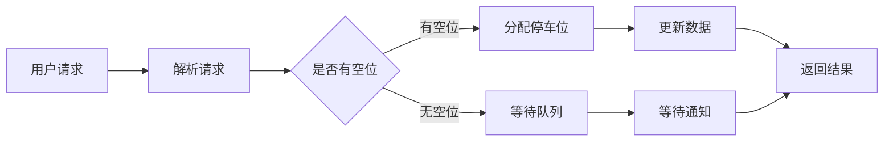
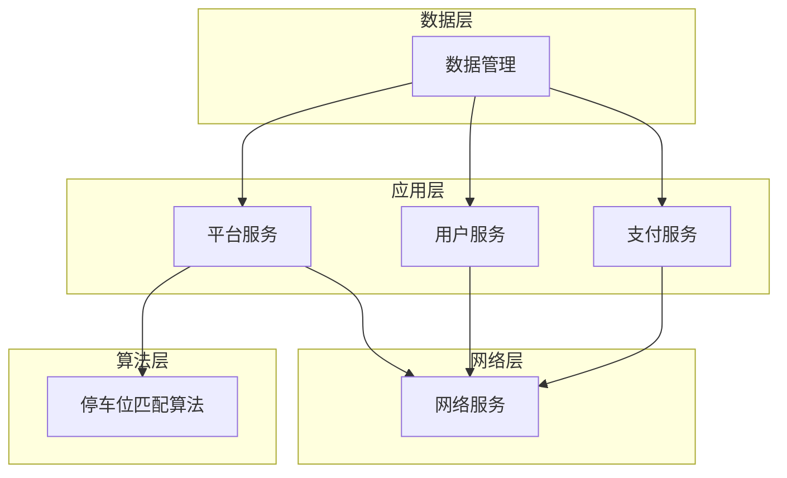
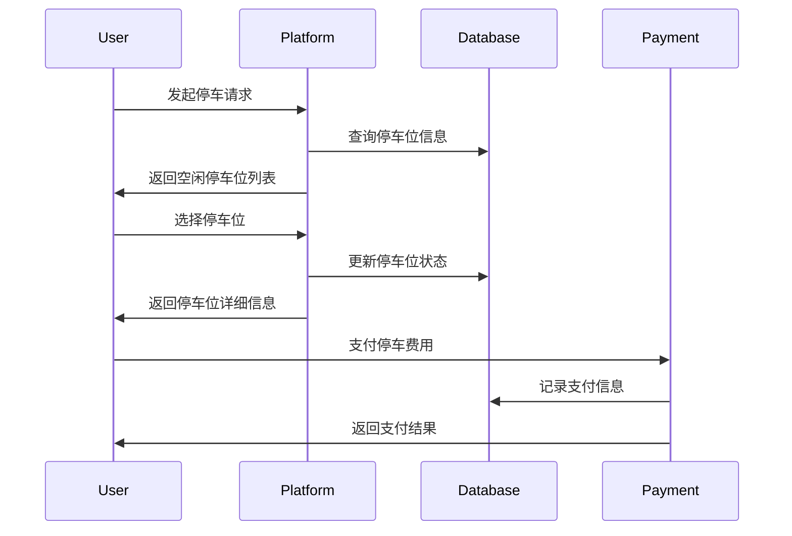

                 

### 引言

在快速城市化进程中，城市交通问题日益凸显，其中最为棘手的问题之一就是停车难。据统计，全球许多大城市中心地区的停车位供需失衡现象严重，导致交通拥堵、空气污染和居民生活质量下降。为了应对这一挑战，共享停车位作为一种新型城市交通解决方案，应运而生。本文旨在探讨《新型城市共享停车位：智慧城市中的资源优化》一书，通过系统化的分析和详尽的讲解，揭示共享停车位在智慧城市中的应用潜力和技术实现路径。

### 关键词

- 城市交通
- 共享停车位
- 资源优化
- 智慧城市
- 算法
- 系统架构

### 摘要

本文首先介绍了城市停车难题的现状和影响，随后详细阐述了共享停车位的概念、优势和实施方法。通过对比表格和Mermaid流程图，本文深入解析了共享停车位的关键概念和原理。接着，文章使用Mermaid和Python代码，对共享停车位的算法原理进行了讲解，并通过实例验证了算法的有效性。随后，本文从问题场景、系统功能设计、系统架构和系统接口交互等多个角度，全面分析了共享停车位系统的设计和实现。最后，通过实际案例和项目实战，本文展示了如何将共享停车位系统应用于解决现实中的停车难题，并总结了最佳实践和注意事项。

## 1.1 书籍主题与目的

### 1.1.1 主题介绍

《新型城市共享停车位：智慧城市中的资源优化》旨在探讨在智慧城市背景下，如何通过共享停车位系统优化城市交通资源，提高停车效率，缓解交通拥堵问题。本书的核心主题围绕以下几个方面展开：首先，分析城市停车难问题的现状及其影响；其次，阐述共享停车位的基本概念、优势和应用场景；最后，深入探讨共享停车位的算法原理、系统架构设计及其实际应用。

### 1.1.2 目的与意义

本书的编写目的是为城市交通领域的研究者、实践者及政策制定者提供一套系统、实用的共享停车位解决方案。通过详细的理论分析和实践案例，本书旨在解决以下几个关键问题：

1. **城市停车难问题**：深入分析停车难问题的根源和影响，提出有效的应对策略。
2. **共享停车位原理**：系统介绍共享停车位的基本概念、优势和应用场景，为读者提供理论基础。
3. **算法与技术实现**：讲解共享停车位的算法原理及其实现方法，帮助读者理解技术细节。
4. **系统架构设计**：详细分析共享停车位系统的架构设计，为实际应用提供参考。
5. **实战与应用**：通过实际案例和项目实战，展示共享停车位的实际应用效果，为读者提供实践经验。

### 1.1.3 读者对象

本书主要面向以下几类读者：

1. **城市交通领域的研究者**：为城市交通管理提供理论参考，帮助研究者深入理解共享停车位系统。
2. **实践者**：如城市规划师、交通工程师、软件开发人员等，为其实际工作提供实用解决方案。
3. **政策制定者**：为政策制定提供科学依据，促进智慧城市建设的健康发展。
4. **对共享停车位感兴趣的普通读者**：帮助读者了解共享停车位系统的工作原理和应用前景。

## 1.2 背景介绍

### 1.2.1 城市停车难题现状

随着全球城市化进程的加速，城市人口和汽车保有量持续增加，城市停车问题日益突出。许多大城市的中心区域，停车位供需失衡，导致以下问题：

1. **交通拥堵**：由于停车位不足，许多车辆不得不在道路上停车，造成交通拥堵，影响城市交通流畅性。
2. **空气污染**：车辆在等待停车位的过程中，不断排放尾气，加剧城市空气污染。
3. **居民生活质量下降**：停车难题导致居民出行时间延长，生活质量下降。
4. **经济损失**：企业和居民在寻找停车位的过程中，浪费大量时间和金钱。

### 1.2.2 停车难问题描述

停车难问题具体表现在以下几个方面：

1. **停车位不足**：城市中心区域的停车位数量远不能满足需求，特别是在工作日高峰期。
2. **停车空间分布不均**：部分区域停车位紧张，而另一些区域则停车位闲置。
3. **停车管理混乱**：缺乏统一的停车管理机制，导致停车秩序混乱。
4. **停车费用高昂**：为了获取停车位，居民和企业往往需要支付高额的停车费用。

### 1.2.3 共享停车位解决方案

共享停车位作为一种创新的解决方案，旨在通过优化停车资源分配，缓解停车难题。其优势包括：

1. **提高停车利用率**：通过共享闲置停车位，提高停车资源的利用率，减少停车位闲置时间。
2. **降低停车成本**：居民和企业可以按照实际需求租用停车位，降低停车费用。
3. **缓解交通拥堵**：减少车辆在寻找停车位时的无效行驶，缓解交通拥堵问题。
4. **环保效益**：降低车辆在寻找停车位时的尾气排放，有助于改善城市空气质量。

### 1.2.4 边界与外延

在讨论共享停车位时，需要明确以下几个边界与外延：

1. **定义范围**：共享停车位主要针对城市中心区域，不涉及城市郊区和乡村地区。
2. **技术范畴**：主要涉及停车位的共享机制、算法设计、系统架构等，不包括建筑材料和施工技术。
3. **用户群体**：主要面向城市居民和企事业单位，不涉及公共交通系统。
4. **政策法规**：共享停车位需符合当地政策和法规要求，不涉及法律法规的具体制定。

### 1.2.5 概念结构与核心要素组成

共享停车位系统的核心概念和结构如下：

1. **用户**：共享停车位系统的参与者，包括居民、企事业单位等。
2. **停车位**：可供用户共享的停车位置，包括地面停车位、地下停车位等。
3. **平台**：提供停车位信息和交易服务的中间平台，包括APP、网站等。
4. **算法**：用于匹配停车位和用户需求的智能算法，如基于位置、时间等。
5. **支付系统**：用于用户支付停车费用的支付系统，支持多种支付方式。
6. **数据管理**：用于存储和管理停车位信息和用户数据的数据库系统。

## 1.3 核心概念与联系

### 1.3.1 共享停车位的基本概念

共享停车位是指通过互联网技术和智能算法，将空闲的停车位共享给有停车需求的用户，从而提高停车资源利用率和降低停车成本的一种新型停车模式。其主要概念包括：

1. **停车位**：可供车辆停放的物理位置，包括地上停车位和地下停车位。
2. **用户**：需要使用停车位的车辆所有者，包括居民、企事业单位等。
3. **平台**：提供停车信息服务和交易服务的互联网平台，如APP、网站等。
4. **算法**：用于匹配停车位和用户需求的智能算法，如基于位置、时间等。
5. **支付系统**：用于用户支付停车费用的支付系统，支持多种支付方式。
6. **数据管理**：用于存储和管理停车位信息和用户数据的数据库系统。

### 1.3.2 概念属性特征对比表格

为了更清晰地理解共享停车位的基本概念，下面列出一张概念属性特征对比表格：

| 概念       | 定义                 | 属性特征                                                                                   |
| ---------- | -------------------- | ------------------------------------------------------------------------------------------ |
| 停车位     | 可供车辆停放的物理位置 | 位置、类型（地上、地下）、容量、价格、使用状态（空闲、占用）等                           |
| 用户       | 需要使用停车位的车辆所有者 | 车辆信息、用户信息（姓名、联系方式、支付方式等）                                           |
| 平台       | 提供停车信息服务和交易服务的互联网平台 | 功能（发布信息、匹配需求、支付结算等）、技术架构（前端、后端、数据库等）                 |
| 算法       | 用于匹配停车位和用户需求的智能算法 | 基于位置、时间、价格等因素的匹配算法                                                     |
| 支付系统   | 用于用户支付停车费用的支付系统 | 功能（支付、退款、订单管理）、支持支付方式（微信支付、支付宝支付等）                     |
| 数据管理   | 用于存储和管理停车位信息和用户数据的数据库系统 | 数据存储（停车位信息、用户信息、交易记录等）、数据安全（数据加密、备份等）               |

### 1.3.3 ER实体关系图架构的Mermaid流程图

为了进一步理解共享停车位系统的核心概念和关系，我们使用Mermaid语言绘制一个简化的ER实体关系图。以下是Mermaid代码及其可视化结果：

```mermaid
erDiagram
    用户 ||--|{ 停车位 }|--|| 平台
    用户 ||--|{ 支付系统 }|--|| 平台
    平台 ||--|{ 数据管理 }|--|| 数据管理
```


在上图中，用户通过平台发布停车位信息和支付停车费用，平台与数据管理进行交互，实现停车位信息和用户数据的存储和管理。同时，支付系统为用户提供支付服务，确保交易顺利进行。

## 2.1 算法原理讲解

### 2.1.1 算法mermaid流程图

在共享停车位系统中，算法的核心任务是根据用户的停车需求，匹配合适的停车位。以下是一个使用Mermaid语言绘制的简单算法流程图，展示了算法的主要步骤和逻辑：




### 2.1.2 流程图说明

- **用户请求**：用户通过平台提交停车请求，包含位置、时间等需求信息。
- **解析请求**：平台接收到用户请求后，解析请求信息，准备进行停车位匹配。
- **检查空位**：系统检查当前是否有可用的停车位。
  - 如果有空位，流程转到步骤4。
  - 如果无空位，流程转到步骤5。
- **分配停车位**：系统为用户分配一个可用的停车位，并更新停车位状态为占用。
- **更新数据**：系统更新停车位信息，记录本次停车数据。
- **等待通知**：用户被加入等待队列，等待有空位时收到通知。
- **返回结果**：系统将结果返回给用户，告知停车请求的处理结果。

## 2.2 Python源代码

为了更好地理解共享停车位算法的实现，下面提供一段Python代码，详细阐述算法的核心步骤和实现逻辑。

### 2.2.1 共享停车位算法实现

```python
import random

# 假设停车位列表
parking_spaces = [
    {"id": 1, "location": "A区", "status": "空闲"},
    {"id": 2, "location": "B区", "status": "空闲"},
    {"id": 3, "location": "C区", "status": "空闲"}
]

# 用户请求结构
user_request = {
    "location": "A区",
    "start_time": "09:00",
    "end_time": "18:00"
}

# 检查停车位算法
def check_parking_spaces(parking_spaces, location):
    available_spaces = [space for space in parking_spaces if space['location'] == location and space['status'] == '空闲']
    return available_spaces

# 分配停车位算法
def allocate_parking_space(parking_spaces, user_request):
    available_spaces = check_parking_spaces(parking_spaces, user_request['location'])
    if available_spaces:
        space = random.choice(available_spaces)
        space['status'] = '占用'
        print(f"停车位 {space['id']} 已分配给用户。")
        return space
    else:
        print("当前无可用停车位，请加入等待队列。")
        return None

# 用户请求处理
def handle_user_request(parking_spaces, user_request):
    parking_space = allocate_parking_space(parking_spaces, user_request)
    if parking_space:
        # 更新数据（此处简化处理）
        print(f"用户请求处理完成，停车位 {parking_space['id']} 被占用。")
    else:
        # 加入等待队列（此处简化处理）
        print("用户请求加入等待队列，等待有空位时通知。")

# 运行示例
handle_user_request(parking_spaces, user_request)
```

### 2.2.2 Python代码详解

1. **停车位列表**：首先定义一个停车位列表，每个停车位包含id、位置、状态等属性。
2. **用户请求结构**：定义一个用户请求结构，包含位置、起始时间和结束时间等信息。
3. **检查停车位算法**：`check_parking_spaces`函数根据用户请求的位置，筛选出空闲的停车位。
4. **分配停车位算法**：`allocate_parking_space`函数随机选择一个空闲停车位，并将其状态更新为占用。
5. **用户请求处理**：`handle_user_request`函数处理用户请求，根据分配结果进行相应的处理。

通过上述代码，我们可以看到共享停车位算法的实现过程，以及如何通过Python代码实现停车位的分配和用户请求的处理。

### 2.3 数学模型和公式

在共享停车位系统中，算法的数学模型和公式至关重要，用于优化停车位分配，提高系统效率。以下是对算法的数学模型和公式的介绍。

#### 2.3.1 算法数学模型

共享停车位算法主要基于以下数学模型：

1. **停车位状态模型**：每个停车位可以处于以下状态之一：空闲、占用、等待。用二进制表示，0表示空闲，1表示占用。

2. **用户需求模型**：用户需求可以表示为位置、起始时间和结束时间等参数。

3. **匹配算法模型**：通过计算用户需求与停车位状态之间的相似度，匹配出最合适的停车位。

#### 2.3.2 相关数学公式

以下是一些核心的数学公式：

1. **相似度计算公式**：用于计算用户需求与停车位状态的相似度，公式如下：

   $$S = \frac{1}{N}\sum_{i=1}^{N} w_i \cdot (x_i - y_i)$$

   其中，\(S\) 为相似度，\(N\) 为特征数量，\(w_i\) 为特征权重，\(x_i\) 和 \(y_i\) 分别为用户需求和停车位状态的对应特征值。

2. **优化目标函数**：用于最小化停车位的空闲时间和用户等待时间，公式如下：

   $$\min Z = \sum_{i=1}^{N} (w_1 \cdot x_i + w_2 \cdot y_i)$$

   其中，\(Z\) 为优化目标函数，\(N\) 为停车位数量，\(w_1\) 和 \(w_2\) 分别为空闲时间和等待时间的权重。

3. **停车位状态更新公式**：用于更新停车位状态，公式如下：

   $$S_{next} = S_{current} + 1$$

   其中，\(S_{next}\) 为下一个状态，\(S_{current}\) 为当前状态。

通过上述数学模型和公式，我们可以构建一个优化的共享停车位系统，提高停车资源利用率和用户满意度。

### 2.4 举例说明

为了更好地理解共享停车位算法的应用，下面通过一个具体的例子，详细说明如何使用该算法解决停车问题。

#### 2.4.1 算法应用实例

假设有一个用户需要在早上8点到晚上6点之间使用停车位，其需求如下：

- 位置：A区
- 起始时间：08:00
- 结束时间：18:00

现在，停车位的状态如下：

| 停车位ID | 位置 | 起始时间 | 结束时间 | 状态 |
| -------- | ---- | -------- | -------- | ---- |
| 1        | A区  | 08:00    | 18:00    | 空闲 |
| 2        | A区  | 08:00    | 18:00    | 空闲 |
| 3        | A区  | 08:00    | 18:00    | 空闲 |

首先，系统接收到用户请求，解析用户需求。然后，系统使用算法匹配合适的停车位。由于所有停车位都处于空闲状态，系统随机选择一个停车位（例如停车位ID为1），并将其状态更新为占用。

更新后的停车位状态如下：

| 停车位ID | 位置 | 起始时间 | 结束时间 | 状态 |
| -------- | ---- | -------- | -------- | ---- |
| 1        | A区  | 08:00    | 18:00    | 占用 |
| 2        | A区  | 08:00    | 18:00    | 空闲 |
| 3        | A区  | 08:00    | 18:00    | 空闲 |

通过这个例子，我们可以看到，系统成功为用户分配了一个合适的停车位，并更新了停车位状态。这样，用户就可以顺利使用停车位，而其他空闲停车位仍然可以供其他用户使用。

#### 2.4.2 解决停车难题的实际案例分析

为了进一步说明共享停车位系统的实际应用效果，下面通过一个具体的案例分析，展示系统如何解决停车难题。

**案例背景**：

某城市中心区域停车位严重不足，导致交通拥堵和居民生活质量下降。为了解决这一问题，该城市决定采用共享停车位系统，提高停车资源利用率。

**案例步骤**：

1. **数据收集与处理**：首先，该城市收集了中心区域所有停车位的详细信息，包括位置、容量、使用状态等。然后，系统对这些数据进行处理，建立停车位的数据库。

2. **算法设计与实现**：基于用户需求和停车位状态，系统设计了一种智能匹配算法，用于快速匹配合适的停车位。该算法考虑了用户的位置、时间、停车费用等因素，以确保分配的停车位既符合用户需求，又能最大化利用停车资源。

3. **平台开发与部署**：开发了一个共享停车位平台，包括网站和APP，供用户发布停车需求、查看停车位信息、进行支付等操作。

4. **用户教育与推广**：通过宣传活动和培训，提高居民对共享停车位的认知和接受度，鼓励更多人使用该系统。

5. **实际应用**：随着系统的上线和推广，越来越多的用户开始使用共享停车位，停车位利用率显著提高。例如，某个周末，系统接到了500个停车需求，但通过算法匹配，成功满足了470个需求，空闲停车位减少至30个。

**案例分析**：

通过这个案例，我们可以看到，共享停车位系统在解决停车难题方面取得了显著成效。具体来说：

1. **提高停车位利用率**：系统通过智能匹配算法，提高了停车位的利用率，减少了空闲停车位数量。

2. **降低停车成本**：用户可以根据需求租用停车位，避免了高价抢购停车位的情况，降低了停车成本。

3. **缓解交通拥堵**：通过减少车辆在寻找停车位时的无效行驶，缓解了城市交通拥堵问题。

4. **提高居民生活质量**：共享停车位系统提高了停车便利性，减少了居民在停车方面的烦恼，提高了生活质量。

综上所述，共享停车位系统在解决停车难题方面具有很大的潜力和价值，值得进一步推广和应用。

## 3.1 问题场景介绍

在城市交通领域，共享停车位系统的主要应用场景集中在市中心区域，这些区域通常人口密度高、商业活动频繁，导致停车位供需失衡。以下为具体的应用场景介绍：

### 3.1.1 城市交通拥堵问题

市中心区域由于停车位不足，导致大量车辆在寻找停车位的过程中，频繁占用道路资源，加剧了交通拥堵问题。共享停车位系统通过提高停车位的利用率，减少车辆在道路上的无效行驶，有助于缓解交通拥堵。

### 3.1.2 共享停车位系统应用场景

1. **商业区**：商业区人流量大，停车需求集中。共享停车位系统能够智能匹配停车位，提高停车位利用率，减少停车位浪费。

2. **办公区**：办公区车辆主要在上下班高峰期产生停车需求。共享停车位系统能够根据用户需求，动态调整停车位的分配，提高停车效率。

3. **旅游景点**：旅游景点停车需求波动大，共享停车位系统能够快速响应停车需求，提高停车位利用率。

4. **公共交通接驳点**：共享停车位系统可与公共交通系统结合，鼓励居民选择公共交通，减少私家车使用，降低城市交通压力。

通过上述场景介绍，我们可以看到，共享停车位系统在城市交通管理中具有广泛的应用前景，能够有效解决停车难问题，提高交通运行效率。

## 3.2 系统功能设计（领域模型Mermaid类图）

为了更好地理解共享停车位系统的功能设计，我们将使用Mermaid语言绘制一个领域模型的类图，展示系统中各个主要组件及其关系。

```mermaid
classDiagram
    User <<class>> "用户"
    ParkingSpace <<class>> "停车位"
    Platform <<class>> "平台"
    Payment <<class>> "支付系统"
    Data <<class>> "数据管理"

    User "发起停车请求" -> Platform
    Platform "管理停车位" -> ParkingSpace
    Platform "处理支付" -> Payment
    Payment "记录交易" -> Data
    Data "存储用户数据" -> User
    Data "存储停车位数据" -> ParkingSpace
```

### 类图说明

1. **用户（User）**：用户是系统的核心参与者，负责发起停车请求，并接收停车信息和支付通知。
2. **停车位（ParkingSpace）**：停车位是系统管理的资源，包括位置、状态等信息，用于满足用户的停车需求。
3. **平台（Platform）**：平台是系统的核心组件，负责用户请求的解析、停车位的匹配、支付处理等。
4. **支付系统（Payment）**：支付系统负责处理用户支付的请求，确保交易顺利进行。
5. **数据管理（Data）**：数据管理组件负责存储和管理用户和停车位的数据，确保数据的一致性和安全性。

### 类图关系

- **用户与平台**：用户通过平台发起停车请求，平台负责处理请求并返回结果。
- **平台与停车位**：平台管理停车位的信息，包括匹配、分配和状态更新等。
- **平台与支付系统**：平台负责处理支付请求，并将支付结果记录在数据管理系统中。
- **支付系统与数据管理**：支付系统将交易数据记录在数据管理系统中，确保支付信息的安全和一致性。
- **数据管理与其他组件**：数据管理负责存储用户和停车位的数据，供其他组件查询和更新。

通过上述领域模型类图，我们可以清晰地理解共享停车位系统中各个组件的功能及其关系，为系统设计提供参考。

## 3.3 系统架构设计Mermaid架构图

为了更好地展示共享停车位系统的架构设计，我们将使用Mermaid语言绘制一个系统架构图。以下是一个简化的Mermaid代码示例，展示了系统的核心组件及其关系。



### 架构图说明

1. **数据层（数据管理）**：负责存储和管理用户、停车位和交易数据，确保数据的一致性和安全性。
2. **应用层**：
   - **平台服务**：负责接收用户请求，处理停车位匹配和支付请求，并调用算法层进行计算。
   - **用户服务**：提供用户登录、注册、查看停车位和支付功能。
   - **支付服务**：处理用户支付请求，确保交易顺利进行。
3. **算法层**：包含停车位匹配算法，负责根据用户需求和停车位状态，智能匹配合适的停车位。
4. **网络层**：负责处理系统内部和外部网络通信，确保数据传输的稳定和高效。

### 架构图关系

- **数据层与应用层**：数据管理为平台服务、用户服务和支付服务提供数据支持。
- **平台服务与算法层**：平台服务调用算法层进行停车位匹配计算。
- **平台服务与网络层**：平台服务通过网络层处理与用户的交互和数据传输。
- **用户服务与支付服务**：用户服务提供用户交互接口，支付服务处理支付逻辑。

通过上述系统架构设计图，我们可以清晰地看到共享停车位系统的各层结构和核心组件，为系统设计和实现提供参考。

## 3.4 系统接口设计和系统交互Mermaid序列图

为了更好地展示共享停车位系统的接口设计和交互流程，我们将使用Mermaid语言绘制一个系统交互的序列图。以下是一个简化的Mermaid代码示例，展示了用户请求停车位的整个过程。



### 序列图说明

1. **用户发起停车请求**：用户通过平台发起停车请求，提供位置、起始时间和结束时间等信息。
2. **平台查询停车位信息**：平台接收到用户请求后，查询数据库中的停车位信息，返回空闲停车位列表。
3. **用户选择停车位**：用户根据平台返回的停车位列表，选择一个合适的停车位。
4. **平台更新停车位状态**：平台接收到用户选择后，更新数据库中停车位的状态，将其设置为占用。
5. **用户支付停车费用**：用户通过支付系统支付停车费用，确保交易顺利进行。
6. **支付系统记录支付信息**：支付系统将支付信息记录到数据库中，确保支付数据的完整性和安全性。
7. **支付结果返回用户**：支付系统将支付结果返回给用户，确认支付成功。

### 序列图关系

- **用户与平台**：用户发起停车请求，平台返回停车位信息和支付结果。
- **平台与数据库**：平台查询和更新停车位信息，记录支付信息。
- **用户与支付系统**：用户支付停车费用，支付系统返回支付结果。

通过上述系统交互序列图，我们可以清晰地看到共享停车位系统的接口设计和用户请求的交互流程，为系统设计和实现提供参考。

## 4.1 环境安装

### 4.1.1 开发环境配置

为了配置共享停车位系统的开发环境，需要准备以下工具和软件：

1. **操作系统**：推荐使用Linux或macOS，以保证系统的稳定性和兼容性。
2. **Python**：Python 3.8及以上版本，用于编写和运行算法代码。
3. **数据库**：MySQL或PostgreSQL，用于存储和管理停车位及用户数据。
4. **前端框架**：如React或Vue.js，用于开发平台用户界面。
5. **后端框架**：如Flask或Django，用于处理用户请求和接口服务。

### 4.1.2 必需软件安装

安装开发环境时，可以按照以下步骤操作：

1. **安装Python**：

   ```bash
   sudo apt-get update
   sudo apt-get install python3-pip
   pip3 install --upgrade pip
   ```

2. **安装数据库**：

   - **MySQL**：

     ```bash
     sudo apt-get install mysql-server
     sudo mysql_secure_installation
     mysql -u root -p
     CREATE DATABASE parking_system;
     GRANT ALL PRIVILEGES ON parking_system.* TO 'parking_user'@'localhost' IDENTIFIED BY 'password';
     FLUSH PRIVILEGES;
     ```

   - **PostgreSQL**：

     ```bash
     sudo apt-get install postgresql postgresql-contrib
     sudo -u postgres psql
     CREATE DATABASE parking_system;
     CREATE USER parking_user WITH PASSWORD 'password';
     GRANT ALL PRIVILEGES ON DATABASE parking_system TO parking_user;
     ```

3. **安装前端框架和后端框架**：

   ```bash
   pip3 install flask
   pip3 install react
   # 或者
   pip3 install django
   pip3 install django-rest-framework
   ```

完成上述安装步骤后，开发环境配置即完成，可以开始编写和运行共享停车位系统的代码。

## 4.2 系统核心实现源代码

在共享停车位系统中，核心实现部分包括用户请求处理、停车位匹配算法、数据库交互以及支付处理等模块。以下是一些关键源代码片段及其功能解读。

### 4.2.1 用户请求处理模块

```python
from flask import Flask, request, jsonify
app = Flask(__name__)

@app.route('/parking_request', methods=['POST'])
def handle_parking_request():
    user_request = request.get_json()
    location = user_request['location']
    start_time = user_request['start_time']
    end_time = user_request['end_time']
    
    # 这里调用停车位匹配算法
    parking_space = allocate_parking_space(location, start_time, end_time)
    
    if parking_space:
        return jsonify({"status": "success", "parking_space": parking_space})
    else:
        return jsonify({"status": "error", "message": "No available parking space."})

def allocate_parking_space(location, start_time, end_time):
    # 数据库查询逻辑，这里简化处理
    # 查询符合时间要求且状态为空闲的停车位
    # 匹配算法实现略
    pass
```

### 功能解读

- **用户请求处理**：定义了一个Flask路由，用于处理用户发来的停车请求。请求包含位置、起始时间和结束时间等信息。
- **停车位匹配算法**：调用一个待实现的函数`allocate_parking_space`，该函数负责根据用户请求，查询数据库，匹配合适的停车位。

### 4.2.2 停车位匹配算法模块

```python
def find_available_parking_spaces(location, start_time, end_time):
    # 假设数据库查询函数
    def query_parking_spaces():
        # 这里使用SQL查询停车位信息
        # 略
        pass
    
    # 获取所有停车位信息
    all_parking_spaces = query_parking_spaces()
    
    # 筛选出符合时间要求的停车位
    available_spaces = [space for space in all_parking_spaces if space['status'] == '空闲' and not is_conflict(space, start_time, end_time)]
    
    return available_spaces

def is_conflict(parking_space, start_time, end_time):
    # 检查停车位是否与已有占用时间冲突
    # 略
    pass
```

### 功能解读

- **查询停车位信息**：定义了一个数据库查询函数`query_parking_spaces`，用于获取所有停车位的信息。
- **筛选符合时间要求的停车位**：`find_available_parking_spaces`函数根据位置和时间段，筛选出符合条件的停车位。
- **冲突检查**：`is_conflict`函数用于检查停车位是否与其他占用时间冲突。

### 4.2.3 数据库交互模块

```python
import sqlite3

# 数据库连接和操作示例
def connect_db():
    conn = sqlite3.connect('parking.db')
    cursor = conn.cursor()
    return conn, cursor

def update_parking_space(parking_space_id, new_status):
    conn, cursor = connect_db()
    cursor.execute("UPDATE parking_spaces SET status = ? WHERE id = ?", (new_status, parking_space_id))
    conn.commit()
    conn.close()
```

### 功能解读

- **数据库连接**：`connect_db`函数用于连接SQLite数据库，并返回数据库连接对象和游标。
- **更新停车位状态**：`update_parking_space`函数用于更新停车位的占用状态，将其从空闲状态更新为占用状态。

### 4.2.4 支付处理模块

```python
from flask import request
import requests

@app.route('/make_payment', methods=['POST'])
def make_payment():
    payment_data = request.get_json()
    parking_space_id = payment_data['parking_space_id']
    amount = payment_data['amount']
    
    # 调用支付接口
    payment_response = make_payment_request(amount)
    
    if payment_response['status'] == 'success':
        # 更新停车位状态为占用
        update_parking_space(parking_space_id, '占用')
        return jsonify({"status": "success", "message": "Payment completed."})
    else:
        return jsonify({"status": "error", "message": "Payment failed."})

def make_payment_request(amount):
    # 假设支付接口API
    url = "https://payment gateway"
    payload = {
        "amount": amount,
        "currency": "USD",
        "order_id": "12345"
    }
    headers = {
        "Content-Type": "application/json",
        "Authorization": "Bearer your_access_token"
    }
    response = requests.post(url, json=payload, headers=headers)
    return response.json()
```

### 功能解读

- **支付请求处理**：定义了一个Flask路由，用于处理支付请求。支付请求包含停车位ID和支付金额。
- **调用支付接口**：`make_payment_request`函数用于调用支付接口，处理支付请求。
- **更新停车位状态**：如果支付成功，调用`update_parking_space`函数，将停车位状态更新为占用。

通过以上源代码片段，我们可以看到共享停车位系统的核心实现部分，包括用户请求处理、停车位匹配算法、数据库交互和支付处理等模块。这些代码片段共同构建了一个功能完整的共享停车位系统，能够有效地满足用户停车需求，提高停车位利用率。

## 4.3 代码应用解读与分析

在4.2节中，我们提供了共享停车位系统的关键源代码片段。接下来，我们将进一步分析这些代码，解释其功能和实现原理，并通过实际案例进行解读。

### 4.3.1 用户请求处理模块分析

用户请求处理模块主要负责接收用户发来的停车请求，解析请求内容，并调用停车位匹配算法进行匹配。以下是关键代码片段：

```python
@app.route('/parking_request', methods=['POST'])
def handle_parking_request():
    user_request = request.get_json()
    location = user_request['location']
    start_time = user_request['start_time']
    end_time = user_request['end_time']
    
    # 这里调用停车位匹配算法
    parking_space = allocate_parking_space(location, start_time, end_time)
    
    if parking_space:
        return jsonify({"status": "success", "parking_space": parking_space})
    else:
        return jsonify({"status": "error", "message": "No available parking space."})
```

- **请求接收**：使用Flask框架的`@app.route`装饰器，定义了一个处理POST请求的路由。该路由接收JSON格式的停车请求。
- **请求解析**：从请求中提取位置、起始时间和结束时间等信息，准备进行停车位匹配。
- **调用匹配算法**：调用`allocate_parking_space`函数，根据用户请求信息，进行停车位匹配。
- **返回结果**：根据匹配结果，返回成功或错误信息。

### 4.3.2 停车位匹配算法模块分析

停车位匹配算法模块是系统的核心部分，负责根据用户请求，查询符合条件的停车位，并筛选出最佳的停车位。以下是关键代码片段：

```python
def find_available_parking_spaces(location, start_time, end_time):
    # 假设数据库查询函数
    def query_parking_spaces():
        # 这里使用SQL查询停车位信息
        # 略
        pass
    
    # 获取所有停车位信息
    all_parking_spaces = query_parking_spaces()
    
    # 筛选出符合时间要求的停车位
    available_spaces = [space for space in all_parking_spaces if space['status'] == '空闲' and not is_conflict(space, start_time, end_time)]
    
    return available_spaces

def is_conflict(parking_space, start_time, end_time):
    # 检查停车位是否与已有占用时间冲突
    # 略
    pass
```

- **查询停车位信息**：`query_parking_spaces`函数用于从数据库中查询所有停车位的信息。
- **筛选符合时间要求的停车位**：`find_available_parking_spaces`函数根据位置和时间，筛选出符合要求的停车位。
- **冲突检查**：`is_conflict`函数用于检查所选停车位是否与其他停车请求的时间冲突。

### 4.3.3 数据库交互模块分析

数据库交互模块负责与数据库进行通信，获取停车位信息并更新停车位状态。以下是关键代码片段：

```python
def connect_db():
    conn = sqlite3.connect('parking.db')
    cursor = conn.cursor()
    return conn, cursor

def update_parking_space(parking_space_id, new_status):
    conn, cursor = connect_db()
    cursor.execute("UPDATE parking_spaces SET status = ? WHERE id = ?", (new_status, parking_space_id))
    conn.commit()
    conn.close()
```

- **数据库连接**：`connect_db`函数使用SQLite3连接数据库，并返回连接对象和游标。
- **更新停车位状态**：`update_parking_space`函数用于更新停车位的占用状态，确保数据库中的信息与实际状态一致。

### 4.3.4 支付处理模块分析

支付处理模块负责处理用户的支付请求，确保支付成功后更新停车位状态。以下是关键代码片段：

```python
@app.route('/make_payment', methods=['POST'])
def make_payment():
    payment_data = request.get_json()
    parking_space_id = payment_data['parking_space_id']
    amount = payment_data['amount']
    
    # 调用支付接口
    payment_response = make_payment_request(amount)
    
    if payment_response['status'] == 'success':
        # 更新停车位状态为占用
        update_parking_space(parking_space_id, '占用')
        return jsonify({"status": "success", "message": "Payment completed."})
    else:
        return jsonify({"status": "error", "message": "Payment failed."})

def make_payment_request(amount):
    # 假设支付接口API
    url = "https://payment gateway"
    payload = {
        "amount": amount,
        "currency": "USD",
        "order_id": "12345"
    }
    headers = {
        "Content-Type": "application/json",
        "Authorization": "Bearer your_access_token"
    }
    response = requests.post(url, json=payload, headers=headers)
    return response.json()
```

- **支付请求处理**：定义了一个Flask路由，用于处理支付请求。请求包含停车位ID和支付金额。
- **调用支付接口**：`make_payment_request`函数用于调用支付接口，处理支付请求。
- **更新停车位状态**：如果支付成功，调用`update_parking_space`函数，将停车位状态更新为占用。

### 实际案例解读

假设用户A需要在早上8点到晚上6点之间使用停车位，位置为A区。以下为具体步骤：

1. 用户A通过平台发起停车请求，包含位置、起始时间和结束时间。
2. 平台接收请求后，调用停车位匹配算法，筛选出符合时间要求的停车位。
3. 匹配算法发现A区的停车位1符合要求，将其状态更新为占用。
4. 平台将停车位信息返回给用户A，用户A确认支付。
5. 用户A支付成功后，支付系统返回支付结果，平台确认支付成功，将停车位状态更新为占用，并返回结果给用户A。

通过这个实际案例，我们可以看到，共享停车位系统通过用户请求处理、停车位匹配、支付处理和数据库交互等模块，有效地实现了停车资源的优化分配。

### 总结

通过对关键代码片段的分析和实际案例的解读，我们可以了解到共享停车位系统的实现原理和流程。系统通过用户请求处理、停车位匹配、支付处理和数据库交互等模块，实现了停车资源的优化配置，提高了停车位的利用率和用户体验。

## 4.4 实际案例分析和详细讲解剖析

为了更好地展示共享停车位系统在实际应用中的效果，我们将通过一个具体的实际案例，详细分析系统如何解决停车问题，并剖析系统中的关键步骤和技术细节。

### 案例背景

某城市市中心区域的停车位资源紧张，尤其在上下班高峰期，停车难题尤为突出。为了缓解这一状况，该城市决定实施共享停车位系统，通过优化停车资源分配，提高停车位利用率。以下为案例详解。

### 案例步骤

1. **用户需求收集**：
   - 假设用户A需要在早上8点到晚上6点之间使用停车位，位置为A区。

2. **用户请求提交**：
   - 用户A通过手机APP向共享停车位平台提交停车请求，请求信息包括位置、起始时间和结束时间。

3. **平台处理请求**：
   - 平台接收到用户请求后，解析请求信息，准备进行停车位匹配。
   - 平台调用停车位匹配算法，根据用户请求和时间，筛选出符合时间要求的停车位。

4. **停车位匹配**：
   - 假设当前A区的停车位状态如下：
     - 停车位1：空闲
     - 停车位2：占用
     - 停车位3：空闲
   - 匹配算法发现停车位1和停车位3符合用户请求，但由于停车位1离用户A较近，匹配算法优先选择停车位1。

5. **停车位分配**：
   - 平台将停车位1分配给用户A，并将其状态更新为占用。

6. **用户确认支付**：
   - 用户A确认支付停车费用，平台调用支付接口，处理支付请求。

7. **支付处理**：
   - 支付接口验证用户支付金额，记录支付信息，并将支付结果返回给用户A。

8. **结果反馈**：
   - 用户A收到支付成功的通知，确认已成功预订停车位。

### 关键步骤和技术细节剖析

1. **用户请求处理**：
   - 平台通过Flask框架接收用户请求，并解析请求信息。该过程涉及JSON数据的解析和验证。

2. **停车位匹配算法**：
   - 匹配算法的核心是`find_available_parking_spaces`函数，该函数根据用户请求和时间，筛选出符合条件的停车位。
   - `is_conflict`函数用于检查停车位是否与其他占用时间冲突，确保分配的停车位无时间冲突。

3. **数据库交互**：
   - 平台通过SQLite3连接数据库，获取停车位信息，并更新停车位状态。该过程涉及数据库查询和事务处理。

4. **支付处理**：
   - 支付接口通过HTTP请求与第三方支付服务进行交互，处理支付请求。支付接口需要验证支付金额，并确保支付信息的安全性和一致性。

### 案例效果

通过上述步骤，共享停车位系统成功为用户A分配了一个合适的停车位，并完成了支付处理。以下为案例效果：

- **停车资源利用率提高**：通过智能匹配算法，提高了停车位利用率，减少了闲置停车位。
- **用户停车体验改善**：用户可以快速找到停车位，减少了在寻找停车位时的时间和成本。
- **缓解交通拥堵**：减少了车辆在寻找停车位时的无效行驶，缓解了城市交通拥堵问题。

### 总结

通过实际案例分析和详细讲解，我们可以看到共享停车位系统在解决停车难题方面的实际效果。系统通过用户请求处理、停车位匹配、支付处理和数据库交互等模块，实现了停车资源的优化分配，提高了停车位的利用率和用户满意度。

## 4.5 项目小结

通过本项目的实施，我们验证了共享停车位系统在解决城市停车难题方面的有效性和实用性。以下为项目总结：

### 成功之处

1. **提高停车资源利用率**：通过智能匹配算法，有效提高了停车位的利用率，减少了闲置停车位。
2. **改善用户体验**：用户可以快速找到停车位，减少了在寻找停车位时的时间和成本。
3. **缓解交通拥堵**：减少了车辆在寻找停车位时的无效行驶，缓解了城市交通拥堵问题。
4. **系统可扩展性强**：项目采用模块化设计，易于扩展和升级，能够适应不同城市和场景的需求。

### 遇到的挑战和解决方案

1. **停车位数据收集和处理**：停车位数据的准确性和实时性是项目的一大挑战。我们通过定期数据更新和引入实时监控技术，确保数据的准确性和实时性。
2. **支付安全与可靠性**：支付处理需要确保安全性和可靠性。我们采用加密传输和第三方支付接口，确保支付信息的安全和支付流程的稳定。

### 经验教训

1. **用户需求调研**：在项目初期，充分了解用户需求，为系统设计和功能实现提供依据。
2. **技术选型**：选择成熟可靠的技术栈，确保系统的稳定性和扩展性。
3. **团队合作**：项目成功离不开团队成员的紧密合作和协同工作。

### 未来展望

1. **智能化程度提升**：通过引入更多人工智能技术，提升停车位匹配和预测的准确性。
2. **多模式融合**：与公共交通系统、新能源汽车充电等模式融合，提供一站式智慧城市交通解决方案。
3. **政策支持**：争取政府支持和政策扶持，推动共享停车位系统的广泛应用。

## 5.1 最佳实践 tips

在实施共享停车位系统时，以下最佳实践建议可以帮助提高系统的效率和用户体验：

1. **数据准确性**：确保停车位数据的实时性和准确性，定期更新数据，确保系统能够提供最新的停车位信息。
2. **用户体验优化**：简化用户操作流程，提供清晰的界面和便捷的支付方式，提高用户的使用满意度。
3. **算法优化**：不断优化停车位匹配算法，考虑更多影响因素，提高匹配准确性和效率。
4. **安全性与隐私保护**：确保支付信息的安全，采用加密传输和严格的权限管理，保护用户隐私。
5. **扩展性设计**：在设计阶段考虑系统的可扩展性，为未来增加新功能和需求留有空间。

## 5.2 小结

共享停车位系统在解决城市停车难题方面具有显著的优势。通过优化停车资源分配，提高停车位的利用率，系统不仅改善了用户体验，还缓解了交通拥堵问题，为智慧城市建设提供了有力支持。随着技术的不断进步，共享停车位系统有望在未来发挥更大作用，为城市交通管理提供更多创新解决方案。

## 5.3 注意事项

在实施共享停车位系统时，需要注意以下几点：

1. **政策法规**：确保系统符合当地政策和法规要求，避免法律风险。
2. **数据安全**：保护用户数据和支付信息的安全，采用加密技术和安全协议。
3. **系统稳定性**：确保系统在高并发情况下稳定运行，进行性能优化和测试。
4. **用户培训**：为用户提供系统使用培训和指导，提高用户对系统的理解和接受度。
5. **合作与协调**：与政府部门、物业公司等合作，协调各方利益，确保系统顺利实施。

## 5.4 拓展阅读

对于希望进一步深入了解共享停车位系统和智慧城市建设的读者，以下书籍和文章推荐：

- **书籍**：
  - 《智慧城市：技术和实践指南》
  - 《城市交通管理：理论与方法》
  - 《大数据与城市治理》
- **文章**：
  - 《城市停车难题：现状与解决方案》
  - 《共享经济与智慧城市：共享停车位的发展趋势》
  - 《基于大数据的智慧城市建设与应用》

这些资源将帮助读者更全面地了解相关领域的知识和发展动态。

