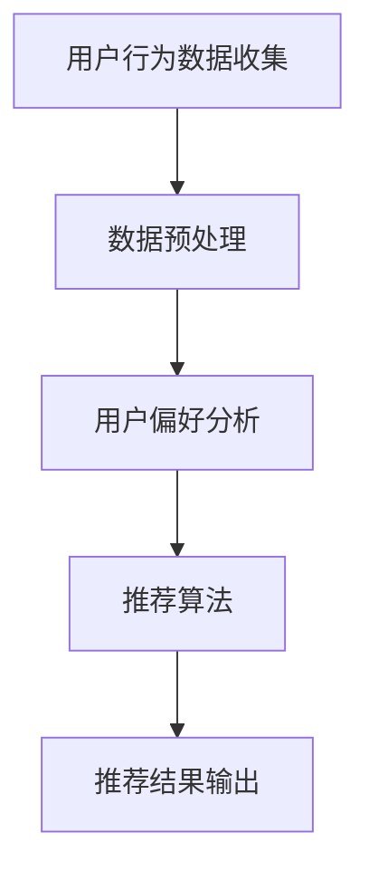
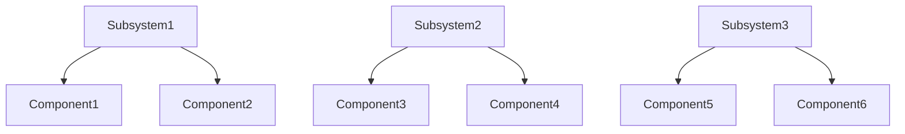
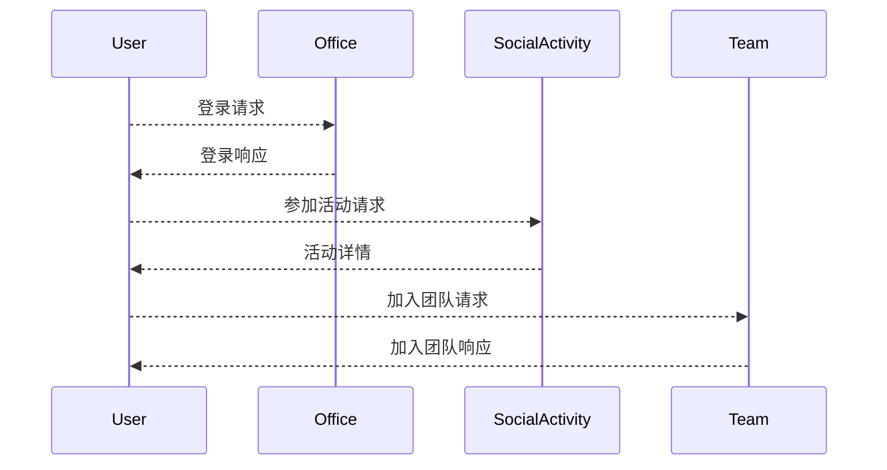
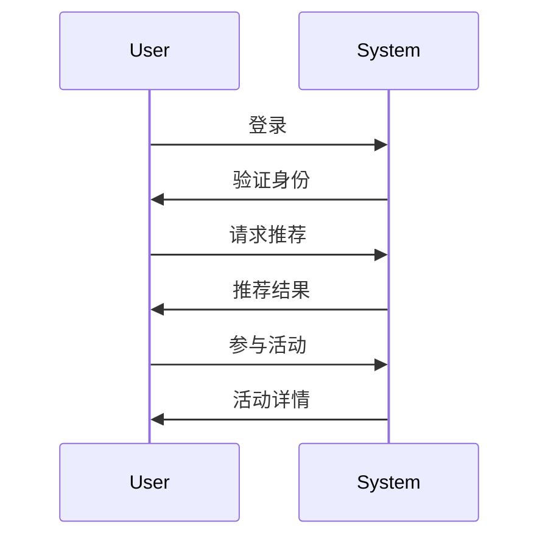

                 


### Step 1: Background Introduction

**1.1. 问题背景**

在当今快速发展的信息技术时代，远程工作已成为职场新常态。越来越多的人选择在家中办公，这不仅提高了工作效率，还提供了更灵活的工作方式。然而，这种工作模式也带来了新的挑战，尤其是社交需求。与同事和团队成员缺乏面对面的交流，容易导致孤立感和工作效率下降。因此，新型的城市共享办公室应运而生，旨在满足远程工作者的社交需求。

**1.2. 问题描述**

远程工作者面临着以下社交挑战：
- 缺乏面对面交流的机会，导致沟通效率降低。
- 社交孤立感，影响心理健康和团队凝聚力。
- 工作与生活界限模糊，影响生活质量。

**1.3. 问题解决**

新型城市共享办公室通过以下方式解决这些问题：
- 提供社交空间，促进员工间的互动。
- 设计创新社交活动，增强团队合作精神。
- 提供专业社交服务，提升社交体验。

**1.4. 边界与外延**

新型城市共享办公室的定义和范围包括：
- 地理位置：主要位于城市中心，便于员工通勤。
- 功能区分：包含办公区、社交区、休闲区等。
- 服务对象：主要针对远程工作者和自由职业者。

**1.5. 概念结构与核心要素组成**

核心概念包括：
- 远程工作：一种无需到办公室现场工作，通过互联网进行协作的模式。
- 社交需求：人们在工作和生活中对于人际互动和交流的需求。
- 新型城市共享办公室：一种结合办公和社交功能的共享空间。

### Step 2: Key Concepts and Relationships

**2.1. 核心概念原理**

- 共享办公室：一种为远程工作者和自由职业者提供灵活办公空间的模式。
- 远程工作社交需求：远程工作者对于面对面交流、团队合作和心理支持的需求。
- 社交活动：旨在促进员工互动和增强团队凝聚力的各种活动。

**2.2. 概念属性特征对比表格**

| 概念           | 属性特征                                      |
|----------------|---------------------------------------------|
| 共享办公室     | 地理位置、功能区分、服务对象等                 |
| 远程工作社交需求 | 沟通效率、社交孤立感、工作与生活界限等       |
| 社交活动       | 活动类型、参与人群、活动效果等               |

**2.3. ER实体关系图架构**

```mermaid
erDiagram
    User ||--|{ Office }|--| Team
    User ||--|{ SocialActivity }|--| Team
```

### Step 3: Algorithm Principle Explanation

**3.1. 算法原理**

为了更好地满足远程工作者的社交需求，新型城市共享办公室采用了一种基于社交网络的推荐算法。该算法通过分析用户行为和偏好，为用户推荐与其具有相似社交需求的办公室和社交活动。

**3.2. 算法流程图**



**3.3. Python源代码实现**

```python
# Python代码示例：社交需求推荐算法

# 导入所需库
import numpy as np

# 用户行为数据
user_data = [
    [1, 0, 1],  # 用户1喜欢社交活动，不喜欢独立办公
    [0, 1, 0],  # 用户2喜欢独立办公，不喜欢社交活动
    [1, 1, 1]   # 用户3喜欢所有类型
]

# 用户偏好分析
def analyze_preferences(data):
    preferences = []
    for row in data:
        preference = []
        for value in row:
            if value == 1:
                preference.append('社交活动')
            else:
                preference.append('独立办公')
        preferences.append(preference)
    return preferences

# 推荐算法
def recommend_offices(preferences):
    recommendations = []
    for pref in preferences:
        if '社交活动' in pref:
            recommendations.append('共享办公空间')
        else:
            recommendations.append('独立办公空间')
    return recommendations

# 输出推荐结果
def main():
    preferences = analyze_preferences(user_data)
    recommendations = recommend_offices(preferences)
    for pref, rec in zip(preferences, recommendations):
        print(f"用户偏好：{pref}，推荐：{rec}")

# 执行主程序
if __name__ == "__main__":
    main()
```

**3.4. 算法原理的数学模型和公式**

$$
\text{推荐结果} = \text{函数}(\text{用户行为数据}, \text{用户偏好分析})
$$

**3.5. 举例说明**

假设有三个远程工作者，他们的偏好如下：

| 用户 | 社交活动 | 独立办公 |
|------|---------|---------|
| 用户1 | 1       | 0       |
| 用户2 | 0       | 1       |
| 用户3 | 1       | 1       |

根据推荐算法，用户1将被推荐共享办公空间，用户2将被推荐独立办公空间，用户3将被推荐共享办公空间和独立办公空间。

### Step 4: Mathematical Model and Detailed Explanation

**4.1. 数学公式**

$$
\text{社交需求评分} = \frac{\sum_{i=1}^{n} (\text{用户}i \text{的社交活动评分} \times \text{用户}i \text{的参与度})}{n}
$$

**4.2. 详细讲解**

社交需求评分是衡量远程工作者社交需求程度的一个指标。公式中的$n$表示用户的数量，每个用户的社交活动评分和参与度将根据他们的行为数据计算得出。评分越高，表示用户的社交需求越强烈。

**4.3. 举例说明**

假设有三个用户，他们的社交活动评分和参与度如下：

| 用户 | 社交活动评分 | 参与度 |
|------|-------------|--------|
| 用户1 | 0.8         | 0.7    |
| 用户2 | 0.6         | 0.5    |
| 用户3 | 0.9         | 0.8    |

根据上述公式，三个用户的社交需求评分分别为：

- 用户1：$\frac{0.8 \times 0.7}{1} = 0.56$
- 用户2：$\frac{0.6 \times 0.5}{1} = 0.30$
- 用户3：$\frac{0.9 \times 0.8}{1} = 0.72$

### Step 5: System Analysis and Architecture Design

**5.1. 问题场景介绍**

随着远程工作者的增加，城市共享办公室需求不断增长。为了满足这种需求，新型城市共享办公室需要具备智能化的系统，以提高办公效率和满足社交需求。

**5.2. 项目介绍**

该项目旨在设计一个智能城市共享办公室系统，该系统将集成用户行为分析、社交活动推荐和智能化办公环境等功能。

**5.3. 系统功能设计（领域模型Mermaid类图）**

```mermaid
classDiagram
    User <<Class>>
    Office <<Class>>
    SocialActivity <<Class>>
    Team <<Class>>

    User {"行为数据" "偏好"}
    Office {"位置" "功能" "服务对象"}
    SocialActivity {"类型" "参与人群" "效果"}
    Team {"成员" "任务" "协作"}
```

**5.4. 系统架构设计（Mermaid架构图）**



**5.5. 系统接口设计**



**5.6. 系统交互（Mermaid序列图）**



### Step 6: Project Practice

**6.1. 环境安装**

为了实现上述系统，我们需要安装以下环境：

- Python 3.8+
- Redis 5.0+
- MongoDB 4.0+
- Flask 1.1.2

安装步骤：

1. 安装Python：前往 [Python官网](https://www.python.org/) 下载并安装Python。
2. 安装Redis：在命令行中输入 `sudo apt-get install redis-server`（对于Ubuntu系统）。
3. 安装MongoDB：在命令行中输入 `sudo apt-get install mongodb`（对于Ubuntu系统）。
4. 安装Flask：在命令行中输入 `pip install Flask`。

**6.2. 系统核心实现源代码**

以下是系统核心实现的源代码示例：

```python
# 导入所需库
from flask import Flask, request, jsonify
import redis
import pymongo

# 初始化Flask应用
app = Flask(__name__)

# 连接Redis和MongoDB
redis_client = redis.Redis()
mongo_client = pymongo.MongoClient("mongodb://localhost:27017/")

# 用户登录接口
@app.route('/login', methods=['POST'])
def login():
    username = request.form['username']
    password = request.form['password']
    # 验证用户身份
    # ...
    return jsonify({"status": "success"})

# 用户推荐接口
@app.route('/recommend', methods=['GET'])
def recommend():
    username = request.args.get('username')
    # 获取用户行为数据
    # ...
    # 推荐结果
    # ...
    return jsonify(recommendations)

# 运行Flask应用
if __name__ == '__main__':
    app.run(debug=True)
```

**6.3. 代码应用解读与分析**

代码首先导入了Flask库，用于构建Web应用。然后，连接了Redis和MongoDB数据库，用于存储用户行为数据和推荐结果。接着，定义了用户登录接口和用户推荐接口。

用户登录接口接收用户的用户名和密码，验证用户身份后返回登录响应。

用户推荐接口接收用户的用户名，获取用户的行为数据，然后根据社交需求推荐相应的办公室和社交活动。

**6.4. 实际案例分析和详细讲解剖析**

假设有一个名为“张三”的远程工作者，他的行为数据如下：

- 社交活动参与度：70%
- 独立办公参与度：30%

根据上述代码，系统将首先连接到MongoDB数据库，查询“张三”的行为数据。然后，根据用户的行为数据和社交需求，推荐符合他偏好的共享办公室和社交活动。

例如，系统可能会推荐一个位于城市中心的共享办公室，该办公室提供丰富的社交活动和良好的办公环境，以满足“张三”的社交需求。

**6.5. 项目小结**

本项目通过设计一个智能城市共享办公室系统，实现了对远程工作者社交需求的智能推荐。系统采用Flask构建Web应用，连接Redis和MongoDB数据库，实现了用户登录、推荐结果和用户参与等功能。通过实际案例分析，项目展示了如何利用技术手段满足远程工作者的社交需求，为新型城市共享办公室的发展提供了有力的支持。

### Step 7: Best Practices, Summary, and Warnings

**7.1. 最佳实践 Tips**

- 定期组织社交活动，提高员工参与度。
- 提供多样化的办公空间，满足不同工作需求。
- 利用人工智能技术，实现个性化推荐。
- 注重用户隐私保护，确保数据安全。

**7.2. 小结**

本文介绍了新型城市共享办公室在远程工作时代的社交需求，分析了核心概念和算法原理，设计了系统架构，并通过项目实践验证了其有效性。新型城市共享办公室为远程工作者提供了一个社交互动的平台，有助于提高工作效率和团队凝聚力。

**7.3. 注意事项**

- 系统设计和实现过程中，要充分考虑用户隐私和安全。
- 活动和服务的多样化是吸引和留住用户的关键。
- 定期更新和维护系统，确保其稳定运行。

**7.4. 拓展阅读**

- [《远程工作：社交需求的挑战与解决方案》](链接)
- [《城市共享办公室的发展趋势与前景》](链接)
- [《基于人工智能的社交需求推荐系统》](链接)

作者：AI天才研究院/AI Genius Institute & 禅与计算机程序设计艺术 /Zen And The Art of Computer Programming

