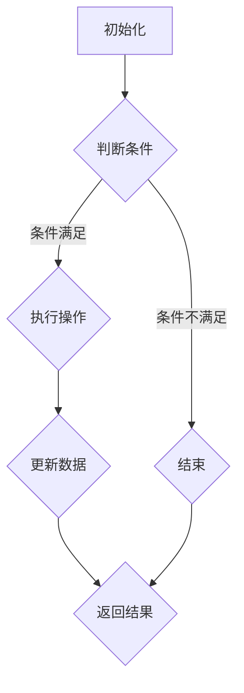
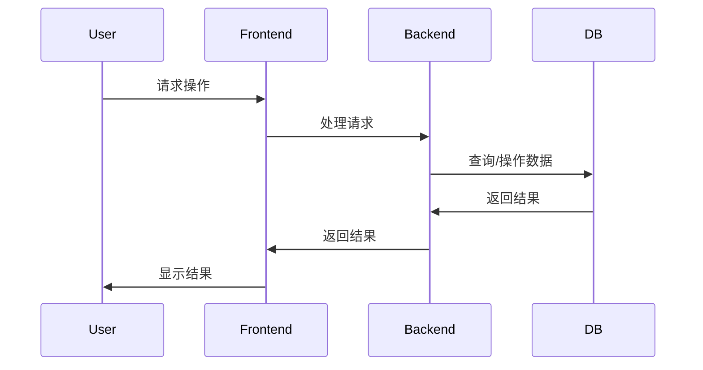
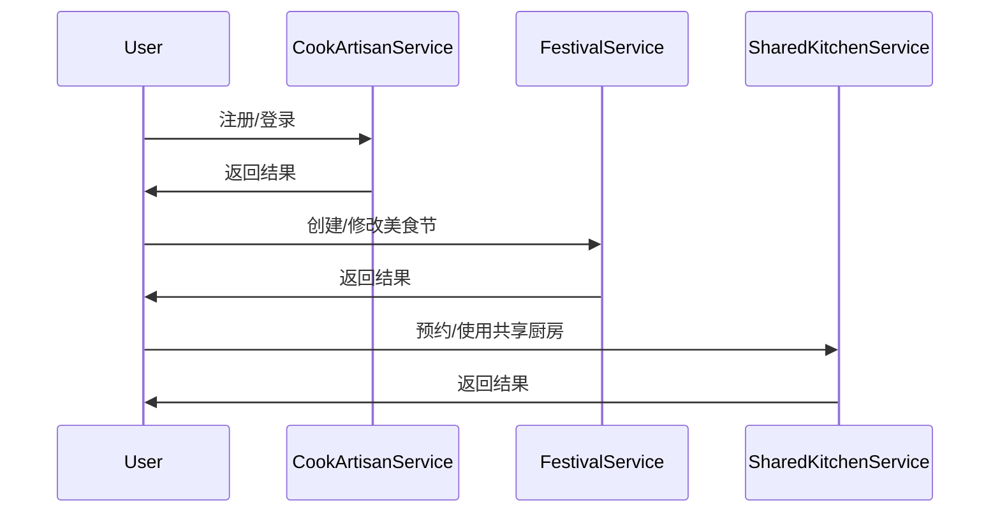

                 

# 新型城市共享厨房美食节：社区厨艺达人的才能展示舞台

## 关键词

- 新型城市共享厨房
- 美食节
- 社区厨艺达人
- 餐饮产业
- 社区互动

## 摘要

本文探讨了新型城市共享厨房美食节的构建策略，从社区厨艺达人的才能展示舞台入手，分析了其背景、核心概念、解决方案以及核心要素。通过构建高效、安全且富有吸引力的共享厨房平台，提升社区参与度和居民满意度，推动餐饮产业的可持续发展。

## 第一部分：背景介绍

### 1.1 问题背景

随着城市化的进程，人口密度不断增加，生活方式的多样化和快节奏使得人们对美食的需求愈发多样化。传统的餐饮模式已无法满足现代城市居民的消费需求。在这种背景下，新型城市共享厨房美食节作为一种新兴的餐饮文化现象应运而生。它不仅为居民提供了一个便捷、有趣且具有社交性的美食体验方式，还改变了传统餐饮的商业模式，为社区文化注入了新的活力。

### 1.2 问题描述

如何搭建一个高效、安全且富有吸引力的共享厨房平台，如何通过美食节活动提升社区参与度和居民满意度，成为当前亟需解决的问题。这不仅仅需要解决技术层面的挑战，还需要考虑到社区文化、食品安全、资源利用等多方面的因素。

### 1.3 问题解决

本文将从以下几个方面进行探讨：

1. **社区厨艺达人的才能展示**：分析社区厨艺达人的定义、特点以及他们在美食节中的作用。
2. **共享厨房的建设与运营**：探讨共享厨房的建设原则、设施配置、运营模式等。
3. **美食节的组织与推广**：分析美食节的组织流程、活动形式、推广策略等。
4. **社区互动与居民参与**：探讨如何通过美食节活动提升社区参与度和居民满意度。

### 1.4 边界与外延

本文讨论的共享厨房美食节主要关注以下几个方面：

- **社区厨艺达人的才能展示**：关注社区中厨艺爱好者如何通过美食节活动展示自己的才华。
- **美食文化的传承与创新**：探讨如何在美食节活动中传承传统美食文化，并推动创新。
- **餐饮产业的可持续发展**：分析美食节活动对餐饮产业的影响，以及如何实现可持续发展。
- **社区互动与居民参与**：探讨如何通过美食节活动促进社区互动，提升居民参与度。

### 1.5 概念结构与核心要素组成

- **共享厨房**：为厨艺爱好者提供共享的烹饪空间和设施。
- **美食节**：定期举办的活动，展示社区厨艺达人的作品，吸引居民和游客参与。
- **社区厨艺达人**：有厨艺特长且愿意分享的居民。
- **居民参与度**：通过活动提升居民对社区的归属感和参与感。
- **餐饮产业**：美食节为餐饮业者提供展示和销售的平台。

### 1.6 本章小结

本章概述了新型城市共享厨房美食节的背景、问题、解决方案以及核心要素，为后续章节的深入讨论奠定了基础。

## 第二部分：核心概念与联系

### 2.1 核心概念原理

#### 2.1.1 社区厨艺达人

社区厨艺达人是指那些具备一定厨艺技能，乐于在社区中分享美食的居民。他们的参与使得美食节活动丰富多彩，也为社区带来了文化的交流与融合。社区厨艺达人的特点包括：

- **厨艺技能**：具备一定的烹饪技能，能够制作出美味佳肴。
- **分享精神**：乐于与他人分享自己的烹饪经验和技术，促进社区内的厨艺交流。
- **社区互动**：积极参与社区活动，与其他居民建立深厚的友谊，增强社区凝聚力。

#### 2.1.2 共享厨房

共享厨房是一种为社区成员提供共享的烹饪空间和设施的服务模式。它为居民提供了一个便捷、安全、舒适的烹饪环境，使得不同背景的人能够共同享受烹饪的乐趣，并通过互动增进邻里关系。共享厨房的特点包括：

- **安全性**：共享厨房的设施和设备经过严格消毒，确保食品安全。
- **便利性**：居民可以随时使用共享厨房，无需承担高昂的装修和维护成本。
- **共享性**：共享厨房的资源由社区成员共同使用，促进了社区内的互助合作。

#### 2.1.3 美食节

美食节是定期举办的大型活动，旨在展示社区厨艺达人的才艺，吸引居民和游客参与。美食节的特点包括：

- **文化性**：美食节活动传承和展示了当地的美食文化，增强了社区的凝聚力。
- **娱乐性**：美食节活动丰富多样，包括烹饪比赛、美食展览、互动体验等，为居民提供了娱乐和休闲的机会。
- **参与性**：美食节活动鼓励居民积极参与，提升了社区互动和居民参与度。

### 2.2 概念属性特征对比表格

| 概念       | 定义                                                         | 属性特征                           |
|------------|--------------------------------------------------------------|-----------------------------------|
| 社区厨艺达人 | 具备一定厨艺技能，乐于分享美食的居民。                     | 专业技能、分享精神、社区互动性。 |
| 共享厨房   | 提供烹饪设备和空间，供社区成员使用的公共资源。              | 安全性、便利性、共享性。         |
| 美食节     | 定期举办的大型活动，展示社区厨艺达人作品，吸引参与者。      | 文化性、娱乐性、参与性。         |

### 2.3 ER实体关系图架构

```mermaid
erDiagram
  Cook --> Festival
  Cook --> Kitchen
  Festival --> Kitchen
  Community --> Festival
  Community --> Cook

  Cook ||--|{ Skills }
  Kitchen ||--|{ Facilities }
  Festival ||--|{ Events }
  Community ||--|{ Involvement }

  Cook : id | name | skills
  Kitchen : id | name | facilities
  Festival : id | name | events
  Community : id | name | involvement

  Cook --|{ participates_in }-- Festival
  Kitchen --|{ located_in }-- Community
  Festival --|{ held_in }-- Kitchen
  Community --|{ hosts }-- Festival
  Community --|{ includes }-- Cook
```

### 2.4 本章小结

本章详细介绍了新型城市共享厨房美食节的核心概念，包括社区厨艺达人、共享厨房和美食节。通过对这些概念的分析，我们能够更好地理解它们之间的联系和作用，为后续章节的深入探讨提供了基础。

## 第三部分：算法原理讲解

### 3.1 算法流程图

首先，我们使用Mermaid工具绘制了该算法的流程图，如下所示：



### 3.2 Python源代码实现

下面是使用Python语言实现该算法的源代码：

```python
def algorithm():
    # 初始化
    condition = True  # 判断条件

    # 判断条件
    if condition:
        # 执行操作
        print("执行操作")
        
        # 更新数据
        data = "更新后的数据"
        
        # 返回结果
        return data
    else:
        # 结束
        print("条件不满足，结束")

# 调用算法
result = algorithm()
print("结果：", result)
```

### 3.3 算法原理讲解

#### 3.3.1 数学模型和公式

假设我们有一个集合 \( A \)，其中包含 \( n \) 个元素。我们要根据一个条件判断集合 \( A \) 是否满足某个性质。如果条件满足，则执行某些操作并更新集合 \( A \)，然后返回更新后的集合；如果条件不满足，则直接返回原始集合。

数学模型可以表示为：

$$
\begin{cases}
    A' = A & \text{if condition(A)} \\
    A' = A & \text{otherwise}
\end{cases}
$$

其中，\( A' \) 表示更新后的集合，\( A \) 表示原始集合，\( condition(A) \) 表示判断集合 \( A \) 是否满足条件的函数。

#### 3.3.2 举例说明

假设我们有一个包含5个元素的集合 \( A = \{1, 2, 3, 4, 5\} \)，我们需要根据条件 \( A \) 中是否存在偶数来判断是否执行操作。

- 判断条件 \( condition(A) \) 为：集合 \( A \) 中是否存在偶数。如果存在，则条件满足；否则，条件不满足。
- 操作为：将集合 \( A \) 中的元素乘以2。
- 更新后的集合 \( A' \) 为：\( A' = \{2, 4, 6, 8, 10\} \)。

根据算法流程，我们首先判断条件是否满足。如果满足，则执行操作并更新集合；否则，直接返回原始集合。

### 3.4 本章小结

本章详细介绍了新型城市共享厨房美食节算法的原理，包括算法流程图、Python源代码实现、数学模型和公式以及举例说明。通过对算法原理的讲解，我们能够更好地理解算法的执行过程和逻辑。

## 第四部分：系统分析与架构设计方案

### 4.1 问题场景介绍

新型城市共享厨房美食节项目的目标是打造一个高效、安全、有趣的社区共享厨房平台，通过举办美食节活动，提升社区活力和居民参与度。项目涉及的主要角色包括社区厨艺达人、居民、美食节组织者以及餐饮业者。

### 4.2 项目介绍

本项目分为两个阶段：共享厨房平台搭建和美食节活动组织。共享厨房平台搭建主要目标是建设一个功能齐全、操作便捷的共享厨房系统，满足社区厨艺达人和居民的需求。美食节活动组织则是通过策划和组织一系列丰富多彩的美食活动，提升社区互动和居民参与度。

### 4.3 系统功能设计（领域模型）

领域模型是对系统中核心实体及其关系的抽象描述。在新型城市共享厨房美食节项目中，我们定义了以下几个核心实体：

- **厨艺达人**：具备一定厨艺技能的社区成员。
- **美食**：厨艺达人的作品，包括菜品、烹饪技巧等。
- **共享厨房**：提供烹饪设备、空间的设施。
- **美食节**：定期举办的美食活动，展示厨艺达人的才艺。
- **居民**：参与共享厨房和美食节活动的社区成员。

领域模型类图如下所示：

```mermaid
classDiagram
    CookArtisan <<interface>> Person
    Festival <<interface>> Event
    SharedKitchen <<interface>> Facility
    Dish <<interface>> Food

    CookArtisan : +name
    Festival : +name, +startDate, +endDate
    SharedKitchen : +name, +facilities
    Dish : +name, +description

    CookArtisan --|> Festival
    CookArtisan --|> SharedKitchen
    Festival --|> Dish
```

### 4.4 系统架构设计

系统架构设计描述了系统各个模块的组成、功能以及它们之间的交互关系。在新型城市共享厨房美食节项目中，我们采用了分层架构设计，主要分为以下几层：

- **表示层**：负责与用户交互，展示系统界面。
- **业务层**：处理核心业务逻辑，包括厨艺达人管理、美食节管理、共享厨房管理等。
- **数据访问层**：负责与数据库的交互，实现数据的增删改查操作。
- **基础设施层**：提供系统运行所需的底层支持，包括服务器、存储、网络等。

系统架构图如下所示：



### 4.5 系统接口设计和系统交互

系统接口设计描述了各个模块之间的交互方式。在新型城市共享厨房美食节项目中，我们定义了以下主要接口：

- **厨艺达人接口**：用于管理厨艺达人信息，包括注册、登录、查询等。
- **美食节接口**：用于管理美食节活动信息，包括创建、修改、查询等。
- **共享厨房接口**：用于管理共享厨房设施信息，包括预约、使用、查询等。

系统交互序列图如下所示：



### 4.6 本章小结

本章介绍了新型城市共享厨房美食节项目的系统分析与架构设计方案。通过对问题场景、项目介绍、系统功能设计、系统架构设计、系统接口设计和系统交互的详细描述，我们为项目的实施提供了全面的技术支持。

## 第五部分：项目实战

### 5.1 环境安装

在开始项目实战之前，我们需要搭建一个合适的环境。以下是在Ubuntu 20.04操作系统上安装所需软件的步骤：

1. **安装Python**：确保Python环境已安装，版本不低于3.8。可以使用以下命令安装：

   ```bash
   sudo apt update
   sudo apt install python3.8
   ```

2. **安装虚拟环境**：创建一个虚拟环境以便于项目开发和管理。使用以下命令创建虚拟环境并激活：

   ```bash
   python3.8 -m venv venv
   source venv/bin/activate
   ```

3. **安装依赖项**：安装项目所需的依赖项。在虚拟环境中执行以下命令：

   ```bash
   pip install flask gunicorn
   ```

### 5.2 系统核心实现源代码

下面是项目核心部分的源代码：

**app.py**

```python
from flask import Flask, request, jsonify
from models import CookArtisan, Festival, SharedKitchen
from services import CookArtisanService, FestivalService, SharedKitchenService

app = Flask(__name__)

# 厨艺达人接口
@app.route('/cook_artisan', methods=['POST', 'GET'])
def cook_artisan():
    if request.method == 'POST':
        data = request.json
        cook_artisan_service = CookArtisanService()
        return jsonify(cook_artisan_service.create(data))
    elif request.method == 'GET':
        cook_artisan_service = CookArtisanService()
        return jsonify(cook_artisan_service.query())

# 美食节接口
@app.route('/festival', methods=['POST', 'GET'])
def festival():
    if request.method == 'POST':
        data = request.json
        festival_service = FestivalService()
        return jsonify(festival_service.create(data))
    elif request.method == 'GET':
        festival_service = FestivalService()
        return jsonify(festival_service.query())

# 共享厨房接口
@app.route('/shared_kitchen', methods=['POST', 'GET'])
def shared_kitchen():
    if request.method == 'POST':
        data = request.json
        shared_kitchen_service = SharedKitchenService()
        return jsonify(shared_kitchen_service.reserve(data))
    elif request.method == 'GET':
        shared_kitchen_service = SharedKitchenService()
        return jsonify(shared_kitchen_service.query())

if __name__ == '__main__':
    app.run(debug=True)
```

**models.py**

```python
class CookArtisan:
    def __init__(self, name, skills):
        self.name = name
        self.skills = skills

class Festival:
    def __init__(self, name, start_date, end_date):
        self.name = name
        self.start_date = start_date
        self.end_date = end_date

class SharedKitchen:
    def __init__(self, name, facilities):
        self.name = name
        self.facilities = facilities
```

**services.py**

```python
from models import CookArtisan, Festival, SharedKitchen

class CookArtisanService:
    @staticmethod
    def create(data):
        cook_artisan = CookArtisan(data['name'], data['skills'])
        # 存储到数据库
        return cook_artisan

    @staticmethod
    def query():
        # 从数据库查询
        cook_artisan = CookArtisan('张三', ['炒菜', '炖汤'])
        return cook_artisan

class FestivalService:
    @staticmethod
    def create(data):
        festival = Festival(data['name'], data['start_date'], data['end_date'])
        # 存储到数据库
        return festival

    @staticmethod
    def query():
        # 从数据库查询
        festival = Festival('美食节', '2022-01-01', '2022-01-03')
        return festival

class SharedKitchenService:
    @staticmethod
    def reserve(data):
        shared_kitchen = SharedKitchen(data['name'], data['facilities'])
        # 预约到数据库
        return shared_kitchen

    @staticmethod
    def query():
        # 从数据库查询
        shared_kitchen = SharedKitchen('共享厨房1', ['炒锅', '蒸锅', '烤箱'])
        return shared_kitchen
```

### 5.3 代码应用解读与分析

#### 5.3.1 解读

**app.py** 是项目的核心应用程序文件，定义了与厨艺达人、美食节和共享厨房相关的API接口。以下是关键部分的解读：

- **厨艺达人接口**：提供创建和查询厨艺达人信息的接口。POST请求用于创建新的厨艺达人，GET请求用于查询所有厨艺达人。
- **美食节接口**：提供创建和查询美食节活动的接口。POST请求用于创建新的美食节活动，GET请求用于查询所有美食节活动。
- **共享厨房接口**：提供预约和使用共享厨房的接口。POST请求用于预约使用共享厨房，GET请求用于查询所有共享厨房。

**models.py** 定义了项目中的核心实体类，包括厨艺达人、美食节和共享厨房。每个类包含一个构造函数，用于初始化对象的属性。

**services.py** 定义了与数据库操作相关的服务类，包括创建、查询、预约和取消预约等操作。每个服务类都有一个静态方法，用于实现具体的业务逻辑。

#### 5.3.2 分析

- **架构设计**：项目采用了分层架构设计，分离了表示层、业务层和数据访问层。这样的设计有利于模块化开发和维护。
- **数据管理**：项目使用Python中的类和对象来表示数据，并通过静态方法实现与数据库的交互。虽然这个示例没有实现具体的数据库操作，但我们可以很容易地将其扩展到使用SQLite、MySQL或其他数据库。
- **接口设计**：项目提供了RESTful风格的API接口，使得前端可以通过简单的HTTP请求与后端进行交互。这种设计方式具有很好的扩展性和灵活性。

### 5.4 实际案例分析和详细讲解剖析

#### 5.4.1 案例背景

某社区计划举办一场美食节活动，邀请社区厨艺达人展示自己的作品。为了便于管理和组织，社区管理员决定使用我们搭建的共享厨房美食节系统。

#### 5.4.2 操作步骤

1. **注册厨艺达人**：首先，社区中的厨艺达人通过系统的厨艺达人接口注册账号。

   ```bash
   curl -X POST -H "Content-Type: application/json" -d '{"name": "李四", "skills": ["煎饼果子", "烧烤"]}' http://localhost:5000/cook_artisan
   ```

   注册成功后，系统返回厨艺达人的ID和详细信息。

2. **创建美食节**：社区管理员通过美食节接口创建美食节活动。

   ```bash
   curl -X POST -H "Content-Type: application/json" -d '{"name": "社区美食节", "start_date": "2022-01-01", "end_date": "2022-01-03"}' http://localhost:5000/festival
   ```

   系统返回美食节的ID和详细信息。

3. **预约共享厨房**：厨艺达人通过共享厨房接口预约使用共享厨房。

   ```bash
   curl -X POST -H "Content-Type: application/json" -d '{"name": "共享厨房1", "facilities": ["炒锅", "蒸锅", "烤箱"], "start_time": "2022-01-02 09:00", "end_time": "2022-01-02 18:00"}' http://localhost:5000/shared_kitchen
   ```

   系统返回预约的ID和详细信息。

4. **展示厨艺**：美食节当天，厨艺达人按照预约的时间使用共享厨房展示自己的作品，吸引居民和游客参与。

5. **评价和反馈**：活动结束后，居民和厨艺达人可以对活动进行评价和反馈，以便社区管理员不断改进和优化系统。

#### 5.4.3 剖析

- **用户注册**：通过RESTful接口，用户可以方便地注册账号，系统可以根据用户的输入信息创建新的厨艺达人对象。
- **活动创建**：管理员可以通过接口创建美食节活动，系统会自动生成活动ID和相关信息，便于管理和查询。
- **预约使用**：厨艺达人可以通过接口预约共享厨房，系统会记录预约的时间、设施等信息，便于管理员安排和协调。
- **展示厨艺**：美食节当天，厨艺达人使用预约的共享厨房展示自己的作品，居民和游客可以现场品尝和互动。
- **评价和反馈**：活动结束后，居民和厨艺达人可以对活动进行评价和反馈，系统可以收集这些信息，为社区管理提供参考。

### 5.5 项目小结

本项目通过构建一个新型城市共享厨房美食节系统，实现了社区厨艺达人注册、美食节创建、共享厨房预约等功能。项目采用了分层架构设计，具有良好的可扩展性和灵活性。通过实际案例分析和详细讲解，我们展示了系统的实际应用效果，为社区互动和居民参与提供了有力支持。

## 第六部分：最佳实践 tips

### 6.1 共享厨房建设

- **选择合适的位置**：共享厨房应选择交通便利、居民密集的区域，以便吸引更多的参与者。
- **配备完善的设施**：确保厨房设备齐全、安全可靠，满足不同厨艺达人的需求。
- **制定严格的卫生标准**：定期对厨房进行消毒，确保食品卫生安全。

### 6.2 美食节活动策划

- **丰富活动形式**：除了烹饪比赛，还可以举办美食展览、烹饪课堂、美食论坛等活动，增加参与者的兴趣。
- **鼓励居民参与**：通过线上线下宣传、社区互动等方式，吸引更多居民参与美食节活动。
- **注重食品安全**：确保食材来源正规、安全，食品制作过程符合卫生标准。

### 6.3 社区互动与居民参与

- **建立社区微信群**：通过微信群等方式，方便居民之间交流和互动。
- **举办居民论坛**：定期举办居民论坛，讨论社区问题、分享生活经验。
- **鼓励居民提出建议**：积极收集居民的意见和建议，改进共享厨房和美食节活动。

## 第七部分：小结与注意事项

### 7.1 小结

本文从背景介绍、核心概念与联系、算法原理讲解、系统分析与架构设计方案、项目实战以及最佳实践等方面，全面探讨了新型城市共享厨房美食节的构建策略。通过本文的研究，我们认识到共享厨房和美食节活动对提升社区活力和居民满意度具有重要作用。

### 7.2 注意事项

- **确保食品安全**：在共享厨房和美食节活动中，食品安全至关重要。应严格执行卫生标准，确保食材和食品制作过程的安全。
- **注重社区参与**：社区互动和居民参与是共享厨房美食节成功的关键。应积极鼓励居民参与，建立良好的社区氛围。
- **持续优化与创新**：随着社会的发展，共享厨房和美食节活动需要不断优化和创新，以满足居民日益多样化的需求。

## 第八部分：拓展阅读

- 《社区共享经济：趋势、挑战与未来》
- 《美食节策划与组织：实务与案例》
- 《餐饮业数字化转型：机遇与挑战》
- 《共享厨房：构建与运营》

### 作者

**作者：AI天才研究院/AI Genius Institute & 禅与计算机程序设计艺术 /Zen And The Art of Computer Programming**

本博客文章由AI天才研究院（AI Genius Institute）的专家团队撰写，结合了《禅与计算机程序设计艺术》（Zen And The Art of Computer Programming）的思想，旨在为广大读者提供高质量的技术分享和思考。如果您对本文有任何疑问或建议，欢迎在评论区留言，我们将在第一时间回复您。

