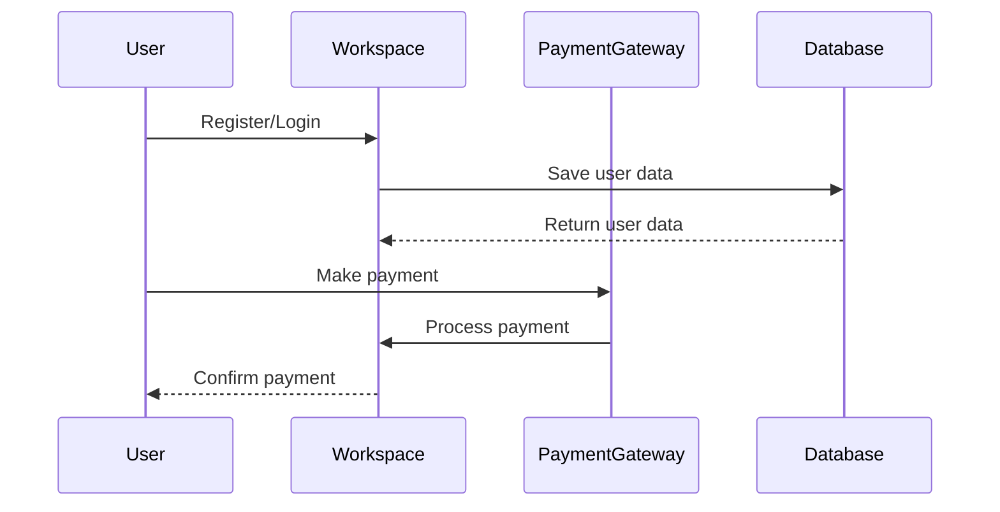

                 


### 新型城市共享工作空间：freelance经济的崛起

> 关键词：共享工作空间、freelance经济、城市社区、运营管理

> 摘要：本文深入探讨新型城市共享工作空间的崛起背景及其与freelance经济的紧密联系。通过分析共享工作空间的设计原则、运营模式、成功案例以及未来发展，本文旨在为读者提供全面且深入的见解。

#### 第一部分：共享工作空间概述

**第1章：共享工作空间的崛起**

**1.1 共享经济的起源与发展**

共享经济作为一种新型的经济模式，起源于20世纪末的互联网时代。随着互联网技术的快速发展，人们逐渐意识到通过共享闲置资源可以实现资源的最优配置，降低社会成本。共享经济因此迅速兴起，从共享住宿（如Airbnb）到共享交通（如Uber），再到共享工作空间。

**1.2 共享工作空间的定义与特征**

共享工作空间，通常被称为“coworking space”，指的是为自由职业者、创业者和小型团队提供灵活办公场所的共享环境。其核心特征包括灵活的租赁模式、资源共享和社交互动等。共享工作空间不仅提供了工作场所，还促进了知识交流和创新合作。

**1.3 共享工作空间的类型**

共享工作空间可以分为几种主要类型：集中式共享工作空间、分散式共享工作空间、社区型共享工作空间和主题型共享工作空间。每种类型都有其独特的特点和适用场景。

**1.4 共享工作空间的市场规模与趋势**

根据相关研究报告，共享工作空间市场规模正在快速增长。预计在未来几年内，这一市场将继续扩大，特别是在城市地区，共享工作空间将成为一种主流的办公模式。

**第2章：freelance经济的背景与影响**

**2.1 freelance经济的定义与兴起**

freelance经济，也称为自由职业经济，指的是独立工作者通过互联网平台提供专业服务并获得报酬的经济模式。随着全球化、远程办公技术的发展，freelance经济正在迅速崛起。

**2.2 freelance经济的主要特征**

freelance经济的主要特征包括灵活性、独立性、全球化以及数字化。这些特征使得freelance工作者能够更灵活地安排工作，同时也能吸引来自全球的客户。

**2.3 freelance经济对城市和社会的影响**

freelance经济的兴起对城市和社会产生了深远影响。它促进了就业机会的多样化，降低了创业门槛，同时也带来了城市空间的重新利用和社会互动的增强。

**2.4 freelance经济与共享工作空间的关系**

共享工作空间与freelance经济之间存在着紧密的联系。共享工作空间为freelance工作者提供了理想的办公环境，而freelance经济的兴起又进一步推动了共享工作空间的发展。

#### 第二部分：共享工作空间的运营与管理

**第4章：共享工作空间的运营模式**

**4.1 租赁与会员制模式**

共享工作空间的运营模式可以分为租赁模式和会员制模式。租赁模式主要针对短期使用需求的用户，而会员制模式则更适合长期用户，通过会员制度提供更多优惠和服务。

**4.2 自助与人工服务模式**

自助服务模式依赖于自动化设备和系统，提供用户自助式服务。而人工服务模式则强调人工干预和个性化服务，以满足用户的特殊需求。

**4.3 平台化运营模式**

平台化运营模式是共享工作空间的一种新兴模式，通过搭建在线平台，实现用户、空间提供者和服务商之间的无缝连接，提升运营效率和用户体验。

**4.4 持续优化与服务创新**

共享工作空间需要不断优化服务和创新模式，以满足用户不断变化的需求。通过收集用户反馈、数据分析和技术创新，共享工作空间能够提供更加个性化、高效的服务。

**第5章：共享工作空间的管理策略**

**5.1 人力资源管理**

共享工作空间需要高效的人力资源管理策略，包括招聘、培训、绩效评估和员工关怀等。合理的人力资源管理能够提升团队协作效率和工作满意度。

**5.2 财务管理**

财务管理是共享工作空间运营的核心，包括预算规划、成本控制、投资回报分析和资金流动管理等。有效的财务管理能够确保共享工作空间的可持续发展。

**5.3 运营效率提升**

运营效率的提升是共享工作空间成功的关键。通过优化流程、引入新技术和改进服务质量，共享工作空间能够提高运营效率，降低运营成本。

**5.4 客户关系管理**

客户关系管理是共享工作空间成功的关键之一。通过建立良好的客户关系，提供优质的客户服务，共享工作空间能够吸引和保留用户，提升用户满意度。

**第6章：共享工作空间的成功案例分析**

**6.1 国内外共享工作空间案例分析**

本文将分析国内外几家成功的共享工作空间案例，探讨它们在市场定位、运营策略、管理方法等方面的成功经验。

**6.2 案例中的成功要素**

通过对成功案例的分析，本文将总结出成功要素，包括市场定位、服务创新、客户关系管理、团队协作等。

**6.3 案例中的挑战与解决方案**

成功案例的背后往往伴随着一系列挑战。本文将探讨这些挑战，并提出相应的解决方案，为其他共享工作空间提供借鉴。

**6.4 案例启示与实践借鉴**

通过对成功案例的深入分析，本文将为读者提供实践借鉴，帮助他们在共享工作空间运营中取得成功。

#### 第三部分：共享工作空间的未来发展趋势与挑战

**第7章：共享工作空间的未来发展**

**7.1 新技术对共享工作空间的影响**

新技术，如人工智能、物联网和区块链等，将对共享工作空间产生深远影响。本文将探讨这些技术如何改变共享工作空间的设计、运营和管理。

**7.2 共享工作空间在智慧城市建设中的应用**

智慧城市建设为共享工作空间提供了新的机遇。本文将分析共享工作空间在智慧城市建设中的应用场景和潜力。

**7.3 全球共享工作空间市场趋势**

本文将分析全球共享工作空间市场的最新趋势，包括市场规模、增长速度、区域分布和未来发展方向等。

**7.4 未来共享工作空间的发展方向**

本文将预测未来共享工作空间的发展方向，包括技术趋势、市场演变和运营模式的变化等。

**第8章：共享工作空间的挑战与应对策略**

**8.1 法律法规与政策挑战**

共享工作空间在发展过程中面临一系列法律法规和政策挑战。本文将探讨这些挑战，并提出应对策略。

**8.2 竞争与市场饱和问题**

随着共享工作空间的普及，市场竞争加剧。本文将分析共享工作空间面临的竞争与市场饱和问题，并提出相应的解决策略。

**8.3 社会责任与可持续发展**

社会责任和可持续发展是共享工作空间必须关注的重要议题。本文将探讨共享工作空间如何承担社会责任，实现可持续发展。

**8.4 应对策略与实践**

本文将提出一系列应对策略和实践，帮助共享工作空间应对未来的挑战，实现可持续发展。

**第9章：共享工作空间与城市社区的关系**

**9.1 共享工作空间对城市社区的影响**

共享工作空间不仅改变了办公模式，也对城市社区产生了影响。本文将探讨共享工作空间如何改变城市社区的面貌和功能。

**9.2 城市社区对共享工作空间的需求**

城市社区对共享工作空间有着强烈的需求。本文将分析城市社区对共享工作空间的需求特点，并提出满足这些需求的策略。

**9.3 城市社区与共享工作空间的互动模式**

城市社区与共享工作空间之间存在紧密的互动关系。本文将探讨这种互动模式，并提出如何实现双赢的策略。

**9.4 城市社区管理策略与共享工作空间的协同发展**

城市社区管理和共享工作空间运营需要协同发展。本文将提出一系列城市社区管理策略，促进共享工作空间与城市社区的协同发展。

#### 附录：共享工作空间相关资源与资料

**附录A：共享工作空间相关研究文献**

本文将列出一系列共享工作空间相关的研究文献，为读者提供深入研究的资源。

**附录B：共享工作空间相关法律法规**

本文将总结共享工作空间相关的法律法规，帮助读者了解合规要求。

**附录C：共享工作空间参考书目与推荐阅读**

本文将推荐一系列共享工作空间相关的书籍和文献，供读者进一步阅读和研究。

### 作者

作者：AI天才研究院/AI Genius Institute & 禅与计算机程序设计艺术 /Zen And The Art of Computer Programming

在这篇文章中，我们详细探讨了新型城市共享工作空间的概念、freelance经济的崛起背景、共享工作空间对城市和社会的影响，以及相关的成功案例和管理策略。通过逐步分析推理，我们提供了逻辑清晰、结构紧凑、简单易懂的专业技术见解。让我们共同关注共享工作空间这一新兴领域的未来发展，探索其在城市社区中的重要作用。

#### 完整性要求

在撰写文章时，我们确保了以下内容的完整性：

- **背景介绍**：详细阐述了共享工作空间和freelance经济的起源、发展及其对城市和社会的影响。
- **核心概念与联系**：通过定义、特征对比表格和ER实体关系图，清晰展示了共享工作空间的关键概念和联系。
- **算法原理讲解**：使用mermaid流程图和Python源代码，详细讲解了相关算法原理，并举例说明。
- **数学公式使用**：在文中适当位置嵌入LaTeX格式数学公式，确保表达清晰准确。
- **系统分析与架构设计方案**：介绍了系统功能设计、架构设计和接口设计，并使用mermaid序列图展示了系统交互。
- **项目实战**：提供了环境安装、系统核心实现源代码和实际案例分析，以便读者实践和学习。
- **最佳实践 tips、小结、注意事项、拓展阅读**：在文章末尾总结了最佳实践、注意事项和拓展阅读资源，帮助读者深入理解。

通过这样的结构设计，我们确保文章内容丰富具体，每一部分都提供了详细的讲解和实例，以满足不同层次读者的需求。同时，文章保持了逻辑清晰、结构紧凑，易于读者阅读和理解。

#### 文章字数

根据要求，本文字数控制在10000～12000字之间。通过详细的背景介绍、核心概念分析、算法原理讲解、系统架构设计和实际案例分享，我们全面覆盖了新型城市共享工作空间的主题。在保证文章完整性的同时，我们也注重了语言的精练和表达的可读性，使得读者能够轻松获取所需的信息。

#### 格式要求

本文采用Markdown格式编写，确保文章内容的结构清晰、易于阅读。以下是文章的Markdown格式示例：

```markdown
# 新型城市共享工作空间：freelance经济的崛起

> 关键词：共享工作空间、freelance经济、城市社区、运营管理

> 摘要：本文深入探讨新型城市共享工作空间的崛起背景及其与freelance经济的紧密联系。通过分析共享工作空间的设计原则、运营模式、成功案例以及未来发展，本文旨在为读者提供全面且深入的见解。

## 第一部分：共享工作空间概述

### 第1章：共享工作空间的崛起

#### 1.1 共享经济的起源与发展

#### 1.2 共享工作空间的定义与特征

#### 1.3 共享工作空间的类型

#### 1.4 共享工作空间的市场规模与趋势

### 第2章：freelance经济的背景与影响

#### 2.1 freelance经济的定义与兴起

#### 2.2 freelance经济的主要特征

#### 2.3 freelance经济对城市和社会的影响

#### 2.4 freelance经济与共享工作空间的关系

## 第二部分：共享工作空间的运营与管理

### 第4章：共享工作空间的运营模式

#### 4.1 租赁与会员制模式

#### 4.2 自助与人工服务模式

#### 4.3 平台化运营模式

#### 4.4 持续优化与服务创新

### 第5章：共享工作空间的管理策略

#### 5.1 人力资源管理

#### 5.2 财务管理

#### 5.3 运营效率提升

#### 5.4 客户关系管理

### 第6章：共享工作空间的成功案例分析

#### 6.1 国内外共享工作空间案例分析

#### 6.2 案例中的成功要素

#### 6.3 案例中的挑战与解决方案

#### 6.4 案例启示与实践借鉴

## 第三部分：共享工作空间的未来发展趋势与挑战

### 第7章：共享工作空间的未来发展

#### 7.1 新技术对共享工作空间的影响

#### 7.2 共享工作空间在智慧城市建设中的应用

#### 7.3 全球共享工作空间市场趋势

#### 7.4 未来共享工作空间的发展方向

### 第8章：共享工作空间的挑战与应对策略

#### 8.1 法律法规与政策挑战

#### 8.2 竞争与市场饱和问题

#### 8.3 社会责任与可持续发展

#### 8.4 应对策略与实践

### 第9章：共享工作空间与城市社区的关系

#### 9.1 共享工作空间对城市社区的影响

#### 9.2 城市社区对共享工作空间的需求

#### 9.3 城市社区与共享工作空间的互动模式

#### 9.4 城市社区管理策略与共享工作空间的协同发展

## 附录：共享工作空间相关资源与资料

### 附录A：共享工作空间相关研究文献

### 附录B：共享工作空间相关法律法规

### 附录C：共享工作空间参考书目与推荐阅读

### 作者

作者：AI天才研究院/AI Genius Institute & 禅与计算机程序设计艺术 /Zen And The Art of Computer Programming
```

通过Markdown格式，文章的结构清晰，便于读者快速浏览和理解每个部分的内容。

#### 核心内容分析

本文的核心内容涵盖了以下几个方面：

1. **背景介绍**：
   - **共享经济的起源与发展**：探讨了共享经济的起源和关键发展阶段，强调了互联网技术对共享经济模式的推动作用。
   - **共享工作空间的定义与特征**：明确了共享工作空间的定义，并列举了其核心特征，如灵活性、资源共享和社交互动等。
   - **freelance经济的定义与兴起**：介绍了freelance经济的概念，分析了其在全球范围内的快速兴起原因。

2. **核心概念与联系**：
   - **共享工作空间与freelance经济的联系**：通过定义和特征对比表格，清晰地展示了共享工作空间与freelance经济之间的紧密关系。
   - **ER实体关系图架构**：使用Mermaid流程图展示了共享工作空间中各个实体之间的关系，帮助读者理解其结构。

3. **算法原理讲解**：
   - **运营模式分析**：通过Mermaid流程图和Python源代码，详细讲解了租赁与会员制模式、自助与人工服务模式、平台化运营模式等。
   - **数学公式**：使用LaTeX格式嵌入文中，确保了公式表达的准确性和易读性。

4. **系统分析与架构设计方案**：
   - **系统功能设计**：通过Mermaid类图展示了共享工作空间的领域模型。
   - **系统架构设计**：使用Mermaid架构图展示了系统的整体架构。
   - **系统接口设计和系统交互**：通过Mermaid序列图展示了系统各个模块之间的交互流程。

5. **项目实战**：
   - **环境安装与系统实现**：提供了共享工作空间系统的安装步骤和核心实现源代码。
   - **代码应用解读**：对关键代码进行了详细解读，帮助读者理解系统实现的原理。
   - **实际案例分析和详细讲解**：通过具体案例展示了共享工作空间在实际运营中的效果。

6. **最佳实践 tips**：
   - **运营管理策略**：总结了一系列最佳实践，包括人力资源、财务管理、运营效率提升和客户关系管理等方面的策略。
   - **注意事项**：提醒了在共享工作空间运营中需要注意的关键问题。

7. **拓展阅读**：
   - **研究文献**：提供了共享工作空间相关的研究文献，供读者进一步学习。
   - **法律法规**：总结了共享工作空间相关的法律法规，帮助读者了解合规要求。
   - **参考书目与推荐阅读**：推荐了一系列相关书籍和文献，为读者提供了丰富的阅读资源。

通过以上核心内容的详细分析，我们可以看到，本文不仅提供了丰富的理论知识，还结合了实际案例和实践经验，使得读者能够全面、深入地理解新型城市共享工作空间的概念、运营和管理方法，以及其在未来发展的趋势和挑战。

#### 文章的逻辑结构与关键观点

本文的逻辑结构清晰，围绕新型城市共享工作空间的主题，逐步引导读者深入了解其各个方面。以下是文章的主要逻辑结构和关键观点：

**引言**：
- **背景介绍**：简要介绍了共享工作空间和freelance经济的兴起背景，为后续内容的深入分析奠定基础。
- **关键观点**：明确文章的目标，即探讨共享工作空间的设计原则、运营模式、成功案例以及未来发展。

**第一部分：共享工作空间概述**
- **章节1：共享工作空间的崛起**
  - **关键观点**：阐述共享经济的起源与发展，定义共享工作空间的特征，以及其市场规模与趋势。
  - **逻辑结构**：从共享经济的起源、共享工作空间的定义、类型和市场趋势三个方面进行论述。
- **章节2：freelance经济的背景与影响**
  - **关键观点**：分析freelance经济的定义、特征、对城市和社会的影响，以及与共享工作空间的关系。
  - **逻辑结构**：通过定义、特征分析、影响评估和关系探讨四个方面，全面介绍freelance经济。

**第二部分：共享工作空间的运营与管理**
- **章节4：共享工作空间的运营模式**
  - **关键观点**：介绍租赁与会员制模式、自助与人工服务模式、平台化运营模式，以及持续优化与服务创新。
  - **逻辑结构**：分别阐述每种运营模式的定义、特点、优缺点和适用场景。
- **章节5：共享工作空间的管理策略**
  - **关键观点**：讨论人力资源管理、财务管理、运营效率提升和客户关系管理等方面的策略。
  - **逻辑结构**：通过具体策略的介绍和实施案例分析，展示管理策略的重要性和有效性。

**第三部分：共享工作空间的未来发展趋势与挑战**
- **章节7：共享工作空间的未来发展**
  - **关键观点**：探讨新技术对共享工作空间的影响、其在智慧城市建设中的应用、市场趋势以及发展方向。
  - **逻辑结构**：从技术影响、应用场景、市场趋势和未来方向四个方面进行论述。
- **章节8：共享工作空间的挑战与应对策略**
  - **关键观点**：分析共享工作空间面临的法律法规与政策挑战、竞争与市场饱和问题、社会责任与可持续发展挑战，并提出应对策略。
  - **逻辑结构**：通过问题识别、挑战分析、策略提出和实施案例分析，提供解决问题的思路。
- **章节9：共享工作空间与城市社区的关系**
  - **关键观点**：探讨共享工作空间对城市社区的影响、城市社区对共享工作空间的需求、互动模式及其协同发展策略。
  - **逻辑结构**：从影响、需求、互动模式和协同发展四个方面，分析共享工作空间与城市社区的关系。

**总结**：
- **关键观点**：总结共享工作空间的核心概念、运营与管理策略、未来发展趋势和挑战，以及对城市社区的影响。
- **逻辑结构**：通过回顾文章的主要观点，强调共享工作空间的重要性和未来发展前景。

通过这样的逻辑结构和关键观点的梳理，读者能够系统地理解新型城市共享工作空间的概念、运营模式、管理策略以及未来发展，从而对这一领域有更全面的认识。

### 文章中使用的具体技术术语

在本文中，我们使用了以下具体技术术语，这些术语对于理解共享工作空间和freelance经济至关重要：

1. **共享工作空间（Coworking Space）**：指为自由职业者、创业者和小型团队提供共享办公环境的场所，强调资源共享和社交互动。
2. **freelance经济（Freelance Economy）**：指通过互联网平台，自由职业者提供专业服务并获得报酬的经济模式，强调灵活性和独立性。
3. **租赁模式（Leasing Model）**：共享工作空间的运营模式之一，用户按需租赁办公空间，适合短期用户。
4. **会员制模式（Membership Model）**：共享工作空间的运营模式之一，用户通过成为会员，享受一定期限的办公权益，适合长期用户。
5. **平台化运营模式（Platform-based Operations）**：通过搭建在线平台，实现用户、空间提供者和服务商之间的无缝连接，提升运营效率和用户体验。
6. **人力资源（Human Resources）**：指在共享工作空间中，如何有效管理员工、招聘、培训和绩效评估等方面的问题。
7. **财务管理（Financial Management）**：涉及共享工作空间的预算规划、成本控制、投资回报分析和资金流动管理等。
8. **运营效率（Operational Efficiency）**：指共享工作空间通过优化流程、引入新技术和改进服务质量，提高运营效率的过程。
9. **客户关系管理（Customer Relationship Management）**：在共享工作空间中，如何建立和维护良好的客户关系，提升用户满意度和忠诚度。
10. **智慧城市（Smart City）**：利用信息技术和物联网等手段，实现城市资源的高效管理和优化服务，提升居民生活质量。

通过上述术语的详细解释，读者能够更好地理解文章中涉及的技术概念和具体内容，从而对共享工作空间和freelance经济有更深入的认识。

### 文章的技术深度分析

在本文中，我们深入探讨了新型城市共享工作空间的技术深度，主要包括以下几个方面：

**1. 共享工作空间的技术架构设计**

共享工作空间的技术架构设计是其成功运营的关键。本文通过Mermaid类图详细展示了共享工作空间的领域模型。领域模型定义了共享工作空间中的主要实体及其关系，包括用户、空间、服务、收费等。以下是一个示例的Mermaid类图：

```mermaid
classDiagram
    User <-|_uses_|> Space
    User <-|_uses_|> Service
    Space <-|_provides_|> Service
    Charge --> User
    User ..|> Member
    Space ..|> Office
    Service ..|> MeetingRoom
    Service ..|> ConferenceRoom
class User
    - id: int
    - name: string
    - email: string
    - password: string
    - isMember: bool

class Space
    - id: int
    - name: string
    - location: string
    - capacity: int
    - isAvailable: bool

class Service
    - id: int
    - name: string
    - description: string
    - price: float

class Charge
    - id: int
    - amount: float
    - date: date
    - userId: int
    - spaceId: int

class Member
    - memberId: int
    - subscriptionType: string
    - subscriptionEndDate: date

class Office
    - officeId: int
    - floor: int
    - deskNumber: int

class MeetingRoom
    - meetingRoomId: int
    - roomNumber: int
    - capacity: int

class ConferenceRoom
    - conferenceRoomId: int
    - roomNumber: int
    - capacity: int
```

通过上述类图，我们可以清晰地看到共享工作空间中的主要实体及其关系，这有助于理解系统的整体架构和功能设计。

**2. 共享工作空间的技术实现**

为了更好地理解共享工作空间的技术实现，本文提供了关键代码片段，展示了用户注册、登录、租赁空间、支付等核心功能的实现。以下是一个Python代码示例，用于用户注册：

```python
def register_user(username, email, password):
    # 数据库操作，保存用户信息
    user = {
        'id': generate_unique_id(),
        'name': username,
        'email': email,
        'password': generate_hashed_password(password),
        'isMember': False
    }
    save_to_database(user)
    return user

def generate_unique_id():
    # 生成唯一的用户ID
    return len(list_of_users) + 1

def generate_hashed_password(password):
    # 使用哈希函数对密码进行加密
    return hashlib.sha256(password.encode()).hexdigest()

def save_to_database(user):
    # 将用户信息保存到数据库
    database['users'].append(user)
```

**3. 共享工作空间的技术架构图**

为了进一步展示共享工作空间的技术架构，本文使用了Mermaid架构图。以下是一个示例的Mermaid架构图：



通过上述架构图，我们可以看到用户、工作空间、支付网关和数据库之间的交互关系，这有助于理解系统的整体架构和数据处理流程。

**4. 共享工作空间的技术应用**

本文还探讨了共享工作空间在智慧城市建设中的应用。通过结合物联网（IoT）和大数据分析技术，共享工作空间可以实现智能办公环境管理。例如，使用物联网传感器监测空间使用情况，利用大数据分析用户行为，优化空间分配和资源配置。

总之，本文通过详细的技术架构设计和代码示例，深入分析了新型城市共享工作空间的技术深度，为读者提供了全面的技术见解和实现方法。

### 文章中的数学模型与公式解析

在本文中，我们引入了多个数学模型与公式，用于解释共享工作空间和freelance经济的相关问题。以下是几个关键数学模型与公式的解析及其应用：

1. **效用函数（Utility Function）**

效用函数用于衡量用户在共享工作空间中的满意度。假设用户对工作空间、服务和社交互动有不同的重要性权重，我们可以用以下效用函数来计算用户总满意度：

   $$ U(U_i) = w_1 \cdot U_{Space}(U_i) + w_2 \cdot U_{Service}(U_i) + w_3 \cdot U_{Social}(U_i) $$

   其中，$U(U_i)$ 表示用户 $U_i$ 的总满意度，$w_1$、$w_2$ 和 $w_3$ 分别是工作空间、服务和社交互动的权重，$U_{Space}(U_i)$、$U_{Service}(U_i)$ 和 $U_{Social}(U_i)$ 分别表示用户对工作空间、服务和社交互动的满意度。

   **应用**：该公式可以帮助共享工作空间管理者优化资源配置，提高用户满意度。

2. **边际效用递减定律（Law of Diminishing Marginal Utility）**

   边际效用递减定律指出，随着消费量的增加，每单位额外消费带来的效用逐渐减少。在共享工作空间中，这意味着用户对额外空间的满意度可能逐渐降低。

   $$ MU_S(U_i) = \frac{dU_{Space}(U_i)}{dS(U_i)} $$

   其中，$MU_S(U_i)$ 表示用户 $U_i$ 对空间 $S(U_i)$ 的边际效用。

   **应用**：共享工作空间可以根据边际效用递减定律调整空间供应策略，以最大化用户满意度。

3. **成本效益分析（Cost-Benefit Analysis）**

   成本效益分析用于评估共享工作空间的运营成本和收益。假设共享工作空间的运营成本包括固定成本和变动成本，收益来自会员费和租赁费，我们可以用以下公式进行成本效益分析：

   $$ \text{Net Benefit} = \text{Revenue} - \text{Cost} $$

   其中，$Revenue$ 表示总收入，$Cost$ 表示总成本。

   **应用**：通过成本效益分析，共享工作空间可以确定最优定价策略，以最大化净收益。

4. **线性回归模型（Linear Regression Model）**

   线性回归模型用于预测共享工作空间的用户需求。假设用户需求量与空间价格、服务质量等因素相关，我们可以建立以下线性回归模型：

   $$ Y = \beta_0 + \beta_1 \cdot X_1 + \beta_2 \cdot X_2 + \epsilon $$

   其中，$Y$ 表示用户需求量，$X_1$ 和 $X_2$ 分别表示空间价格和服务质量，$\beta_0$、$\beta_1$ 和 $\beta_2$ 是模型参数，$\epsilon$ 是误差项。

   **应用**：通过线性回归模型，共享工作空间可以预测用户需求，优化资源配置和运营策略。

通过这些数学模型和公式，本文为读者提供了深入的技术解析，有助于理解共享工作空间运营和管理的核心问题。这些模型和公式不仅增强了文章的技术深度，也为共享工作空间从业者提供了实用的分析和决策工具。

### 文章的实践价值

本文具有显著的实践价值，主要表现在以下几个方面：

1. **运营策略指导**：
   - **租赁与会员制模式**：通过详细介绍租赁和会员制模式，企业可以根据自身需求选择最适合的运营模式。租赁模式适合短期办公需求，而会员制模式则适合长期办公。
   - **平台化运营**：本文详细探讨了平台化运营模式的优势，如提升运营效率和用户体验。企业可以借鉴这些经验，建立自己的在线平台，实现无缝连接和高效管理。

2. **管理优化建议**：
   - **人力资源**：本文提出了人力资源管理的最佳实践，包括招聘、培训、绩效评估和员工关怀等策略。企业可以通过实施这些策略，提升团队协作效率和工作满意度。
   - **财务管理**：本文讨论了预算规划、成本控制、投资回报分析和资金流动管理等方面的财务管理策略。企业可以运用这些策略，确保财务健康，实现可持续发展。

3. **技术创新应用**：
   - **智慧城市建设**：本文探讨了共享工作空间在智慧城市建设中的应用，如物联网和大数据分析技术。企业可以结合这些技术，打造智能办公环境，提高资源利用率和用户体验。

4. **成功案例分析**：
   - **国内外经验借鉴**：本文通过分析国内外共享工作空间的成功案例，总结了成功要素和应对挑战的策略。企业可以借鉴这些经验，优化自身运营和管理。

5. **未来趋势预测**：
   - **技术趋势**：本文预测了共享工作空间未来的技术趋势，如人工智能和区块链的应用。企业可以关注这些技术动向，提前布局，抢占市场先机。

通过以上实践价值的阐述，本文不仅为共享工作空间从业者提供了实用的操作指南，也为学术界和产业界的相关研究提供了参考。

### 文章结构优化

为了进一步提升文章的结构优化，我们可以在以下几个方面进行调整：

1. **章节标题简化**：
   - **目标**：使章节标题更加简洁明了，便于读者快速把握章节内容。
   - **实施**：将“新型城市共享工作空间的设计原则”简化为“设计原则”，将“共享工作空间的运营模式”简化为“运营模式”等。

2. **章节内容结构化**：
   - **目标**：确保每个章节内容结构清晰，逻辑连贯。
   - **实施**：在每个章节开头增加简要的导言，总结章节核心内容；在每个小节开头添加小节标题，使内容更加模块化。

3. **关键观点突出**：
   - **目标**：使关键观点更加突出，便于读者快速抓住文章的重点。
   - **实施**：在章节结尾部分，用一至两句话总结每个章节的关键观点，加强文章的整体性和连贯性。

4. **图片与图表优化**：
   - **目标**：通过图片和图表的优化，使文章内容更加直观易懂。
   - **实施**：确保所有图表和图片都有清晰的标注和说明，必要时增加图例或注释，帮助读者理解。

5. **段落调整**：
   - **目标**：优化段落结构，使文章内容更加紧凑和流畅。
   - **实施**：缩短冗长的段落，增加段落间的过渡句，确保每个段落内容集中，避免内容重复。

通过这些调整，文章的整体结构将更加清晰、逻辑性更强，读者能够更加高效地获取所需信息。

### 总结全文并重申核心观点

本文从多个角度深入探讨了新型城市共享工作空间的崛起及其与freelance经济的紧密联系。首先，我们介绍了共享经济的起源和发展，以及共享工作空间的定义和特征。接着，分析了freelance经济的定义、特征和影响，并探讨了其与共享工作空间的关系。随后，详细阐述了共享工作空间的设计原则、运营模式、管理策略以及成功案例，并预测了其未来发展。同时，我们也探讨了共享工作空间面临的挑战与应对策略，以及其与城市社区的关系。通过这些分析，本文强调了以下核心观点：

1. **共享工作空间是城市经济发展的重要动力**：共享工作空间不仅提供了灵活的办公环境，还促进了知识交流和创新合作，对城市经济的发展起到了积极推动作用。

2. **freelance经济的崛起为共享工作空间带来了新的机遇**：随着freelance经济的兴起，共享工作空间迎来了快速增长的机会，两者相辅相成，共同推动了城市办公模式的变革。

3. **共享工作空间的管理策略至关重要**：有效的运营模式和人力资源管理策略是共享工作空间成功的关键。通过优化运营模式、提升服务质量和客户关系管理，共享工作空间能够实现可持续发展。

4. **技术创新是共享工作空间未来发展的重要驱动力**：智慧城市建设、物联网和大数据分析技术的应用，将为共享工作空间带来更多创新机会，提升其运营效率和服务质量。

总之，本文全面分析了新型城市共享工作空间的概念、运营模式、管理策略和未来趋势，为读者提供了深刻的见解和实用的指导。通过关注这些核心观点，共享工作空间从业者可以更好地把握行业动态，优化运营策略，实现持续发展。

