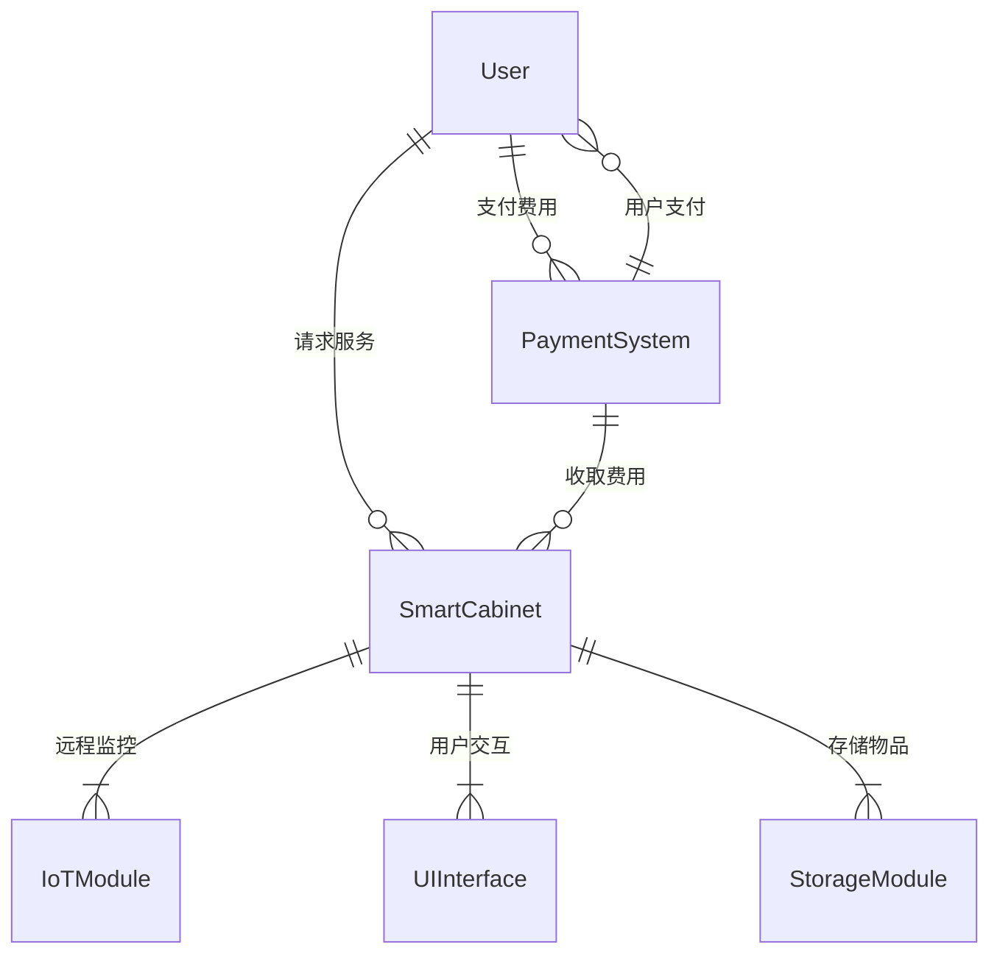
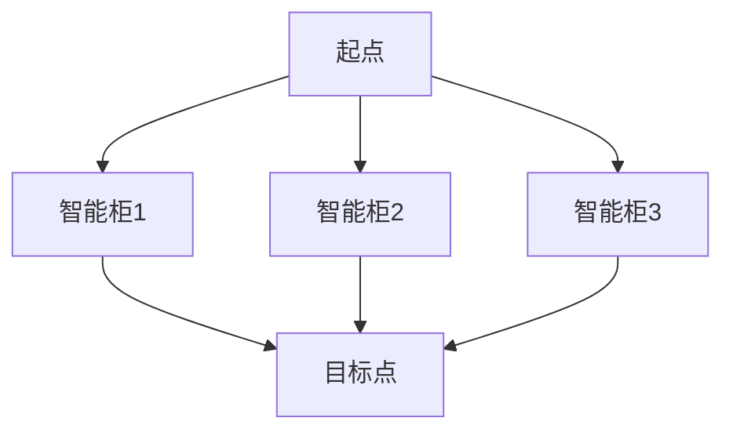
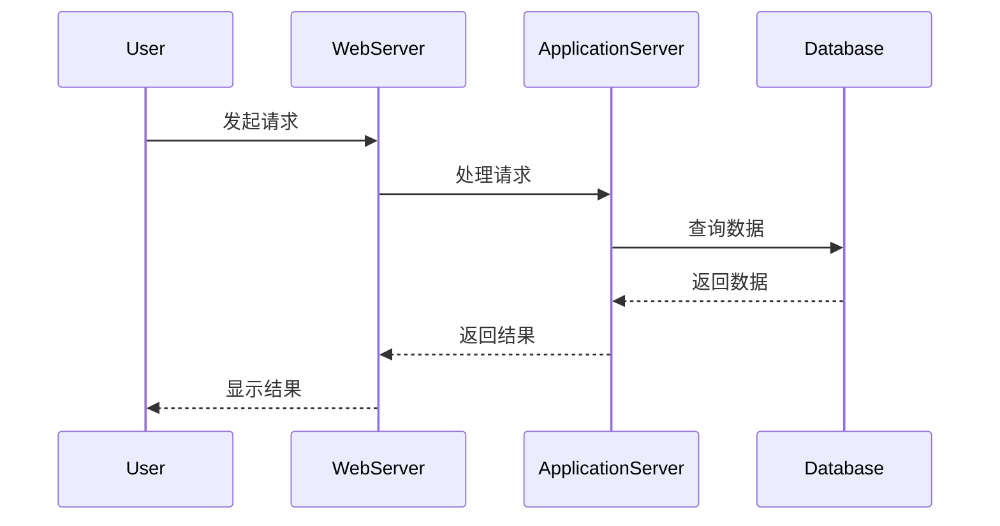
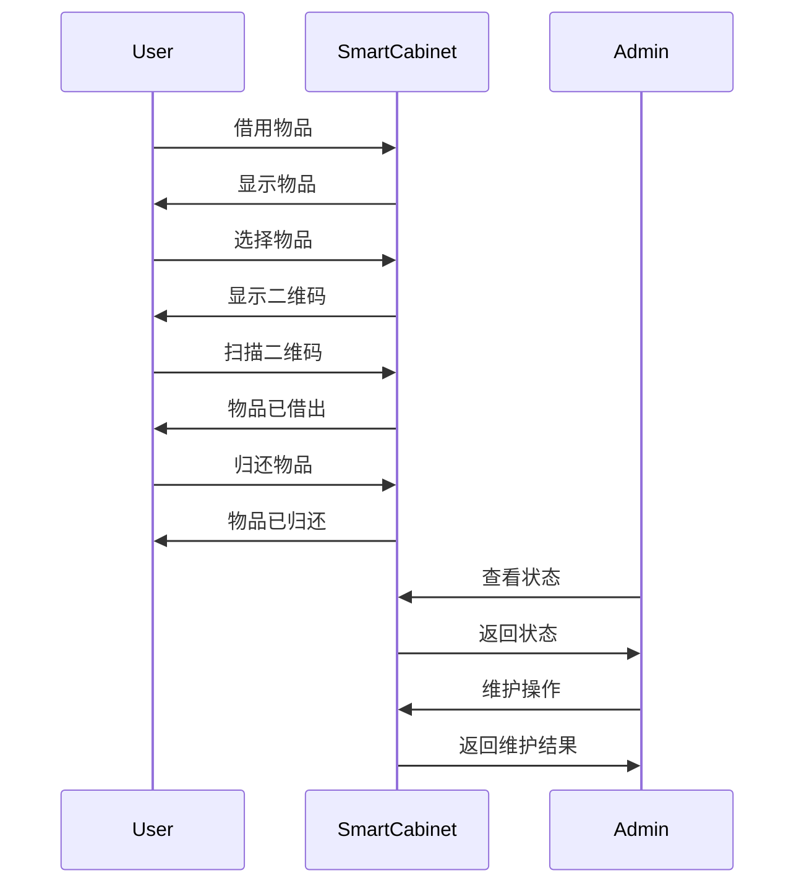

                 

### 第一部分：背景介绍

#### 问题背景

随着城市化进程的不断推进，城市中的居民和企业在日常工作和生活中对便捷、高效的服务需求日益增长。共享经济的兴起，为解决这一问题提供了一种新的思路。新型城市共享工具，如共享单车、共享汽车等，已经成为现代城市生活中不可或缺的一部分。然而，这些共享工具在满足人们需求的同时，也带来了一系列问题，如资源分配不均、管理难度大、安全隐患等。

智能柜作为一种新型城市共享工具，应运而生。智能柜具备24小时自助租借功能，能够在任何时间、任何地点为用户提供服务，极大地方便了人们的日常生活。同时，智能柜还能够实现智能化的管理，提高资源利用率和运营效率。

#### 问题描述

智能柜在解决传统共享工具问题方面具有显著优势，但也面临一些挑战：

1. **资源配置问题**：智能柜需要合理分布在城市中的各个区域，以最大化满足用户需求。然而，如何根据用户行为数据动态调整智能柜的位置，仍是一个待解决的问题。
2. **安全性问题**：智能柜需要确保用户物品的安全，防止盗窃和损坏。这要求智能柜在设计和使用过程中具备较强的安全防护措施。
3. **操作便捷性**：用户在使用智能柜时，希望能够快速、方便地完成操作。因此，智能柜的交互界面和操作流程需要优化。
4. **维护成本**：智能柜的日常维护和运营成本较高，如何降低成本、提高盈利性，是一个重要的课题。
5. **数据隐私问题**：智能柜在提供服务的过程中，会收集大量用户数据。如何保护用户隐私，避免数据泄露，是智能柜必须面对的挑战。

#### 问题解决

智能柜通过以下方式解决上述问题：

1. **资源优化配置**：利用大数据分析和机器学习算法，根据用户行为数据动态调整智能柜的分布。
2. **安全防护措施**：采用物联网技术，实时监控智能柜的状态，确保用户物品的安全。
3. **优化用户体验**：通过用户研究和用户体验设计，简化智能柜的操作流程，提高用户满意度。
4. **降低维护成本**：采用智能化维护方案，如远程监控和故障预测，降低智能柜的维护成本。
5. **数据隐私保护**：采用数据加密和隐私保护技术，确保用户数据的安全和隐私。

#### 边界与外延

1. **定义**：智能柜是一种具备24小时自助租借功能的智能设备，用于提供共享服务。
2. **应用范围**：智能柜可以应用于多个领域，如共享充电宝、共享雨伞、共享文具等。
3. **相关技术**：智能柜涉及物联网、大数据分析、机器学习、云计算等前沿技术。
4. **概念结构与核心要素组成**：智能柜由硬件（智能柜本体、传感器、物联网模块等）和软件（用户交互界面、后台管理系统、数据分析系统等）组成，各部分相互作用，共同实现智能柜的功能。

通过上述分析，我们可以看出，智能柜作为一种新型城市共享工具，具备显著的优势和广泛的应用前景。然而，在实际应用过程中，仍需不断优化和改进，以更好地满足用户需求，提升服务质量。

### 第二部分：核心概念与联系

在智能柜的设计与实施过程中，理解其核心概念和各个部分之间的联系是至关重要的。本部分将详细探讨智能柜的关键技术和原理，通过对比表格和实体关系图，明确智能柜的核心组成部分及其相互作用。

#### 核心概念

智能柜的核心概念包括以下几个方面：

1. **物联网（IoT）技术**：智能柜通过物联网技术实现设备的远程监控和管理，确保设备状态的实时更新和异常报警。
2. **用户交互界面**：智能柜的用户交互界面设计需要直观、易于操作，为用户提供便捷的服务体验。
3. **大数据分析**：通过对用户行为数据的收集和分析，智能柜能够优化资源配置，提高服务效率。
4. **安全防护措施**：智能柜需要具备有效的安全防护机制，确保用户物品的安全和隐私。
5. **智能算法**：包括路径规划算法、负载均衡算法等，用于优化智能柜的运营和管理。

#### 概念属性特征对比表格

以下是智能柜关键概念的属性特征对比表格：

| 概念 | 描述 | 优点 | 缺点 |
| ---- | ---- | ---- | ---- |
| 物联网技术 | 实现智能柜的远程监控和管理 | 提高管理效率，降低人力成本 | 需要稳定的网络连接，初始部署成本高 |
| 用户交互界面 | 提供用户与服务之间的互动 | 提高用户体验，增强用户粘性 | 需要频繁更新和维护，确保界面友好 |
| 大数据分析 | 收集并分析用户行为数据 | 优化资源配置，提高服务效率 | 数据隐私和安全问题需特别关注 |
| 安全防护措施 | 确保用户物品的安全 | 提高用户信任，降低风险 | 需要定期更新和测试，确保有效性 |
| 智能算法 | 优化智能柜的运营和管理 | 提高效率，降低成本 | 需要持续优化和适应环境变化 |

#### ER实体关系图架构

为了更直观地展示智能柜各个部分之间的联系，我们可以使用Mermaid流程图绘制ER实体关系图。以下是智能柜的ER实体关系图：



在这个ER图中，我们定义了以下实体：

1. **User**（用户）：智能柜的服务对象，包括租借物品和支付费用等行为。
2. **SmartCabinet**（智能柜）：核心实体，包含物联网模块、用户交互界面和存储模块。
3. **IoTModule**（物联网模块）：用于远程监控和管理智能柜。
4. **UIInterface**（用户交互界面）：提供用户与智能柜之间的互动。
5. **StorageModule**（存储模块）：用于存储用户租借的物品。
6. **PaymentSystem**（支付系统）：处理用户支付和费用收取。

通过这个ER实体关系图，我们可以清晰地看到智能柜各个部分之间的交互关系，为后续的设计和实现提供了指导。

### 第三部分：算法原理讲解

智能柜的设计与运行离不开算法的支持。算法是智能柜实现智能化管理和优化服务的关键。本部分将详细讲解智能柜中的核心算法原理，包括算法流程、Python源代码、数学模型和公式，并通过举例说明确保概念通俗易懂。

#### 算法原理

智能柜中的核心算法主要包括以下几种：

1. **路径规划算法**：用于优化智能柜的布点和移动路径，提高资源利用率。
2. **负载均衡算法**：用于平衡智能柜之间的负载，确保服务响应速度。
3. **需求预测算法**：用于预测用户对智能柜服务的需求，优化资源配置。

以下是一个典型的路径规划算法示例：



#### Python源代码

以下是一个简单的Python实现，用于演示路径规划算法：

```python
import heapq

def path_planning(cabinets, target):
    # 创建一个优先队列，用于存储未访问的节点
    queue = [(0, cabinets[0])]
    visited = set()

    while queue:
        # 取出优先队列中的最小节点
        cost, current = heapq.heappop(queue)

        # 如果当前节点已访问，跳过
        if current in visited:
            continue

        # 如果当前节点为目标点，返回路径
        if current == target:
            return cost

        # 标记当前节点为已访问
        visited.add(current)

        # 遍历当前节点的邻居节点
        for neighbor in cabinets:
            if neighbor not in visited:
                # 更新邻居节点的距离和父节点
                heapq.heappush(queue, (cost + 1, neighbor))

    return None

# 示例数据
cabinets = ['智能柜1', '智能柜2', '智能柜3']
target = '目标点'

# 调用路径规划算法
result = path_planning(cabinets, target)
print(f"路径规划结果：{result}")
```

#### 数学模型和公式

路径规划算法的核心是计算从起点到目标点的最短路径。这通常使用Dijkstra算法实现，其基本公式如下：

$$
\text{Cost}(v) = \min_{u \in \text{Adj}(v)} (\text{Cost}(u) + w(u, v))
$$

其中，Cost(v)表示从起点到节点v的最短路径长度，Adj(v)表示节点v的邻接节点集合，w(u, v)表示从节点u到节点v的权重。

#### 举例说明

假设有三个智能柜（A、B、C）和一个目标点（D），各节点之间的距离如下表所示：

| 起点 | A | B | C | D |
| ---- | --- | --- | --- | --- |
| A | 0 | 5 | 10 | 20 |
| B | 5 | 0 | 8 | 12 |
| C | 10 | 8 | 0 | 18 |
| D | 20 | 12 | 18 | 0 |

使用Dijkstra算法，我们可以计算出从起点A到目标点D的最短路径。以下是计算过程：

1. 初始化Cost(A) = 0，Cost(B) = 5，Cost(C) = 10，Cost(D) = 20。
2. 从A开始，计算到B、C、D的距离：
   - Cost(B) = min(Cost(A) + 5, Cost(B)) = min(5, 5) = 5
   - Cost(C) = min(Cost(A) + 10, Cost(C)) = min(10, 10) = 10
   - Cost(D) = min(Cost(A) + 20, Cost(D)) = min(20, 20) = 20
3. 将B、C、D加入优先队列，更新Cost值。
4. 取出Cost值最小的节点B，计算到C、D的距离：
   - Cost(C) = min(Cost(B) + 8, Cost(C)) = min(13, 10) = 10
   - Cost(D) = min(Cost(B) + 12, Cost(D)) = min(17, 20) = 17
5. 更新优先队列，取出Cost值最小的节点C，计算到D的距离：
   - Cost(D) = min(Cost(C) + 18, Cost(D)) = min(28, 17) = 17
6. 取出Cost值最小的节点D，此时Cost(D) = 17，即为从A到D的最短路径长度。

通过这个例子，我们可以清晰地看到Dijkstra算法的计算过程和结果。

通过以上详细讲解，我们可以看出智能柜算法的核心原理及其实现方法。这些算法不仅优化了智能柜的运营和管理，还提高了用户的服务体验。在实际应用中，我们可以根据具体需求对这些算法进行进一步优化和调整。

### 第四部分：系统分析与架构设计方案

#### 问题场景介绍

随着共享经济的快速发展，智能柜在城市中的需求日益增长。智能柜主要应用于以下场景：

1. **共享充电宝**：用户在出行或办公时，可以方便地借用充电宝。
2. **共享雨伞**：在雨季，用户可以随时借用雨伞，解决短途出行时的防雨需求。
3. **共享文具**：在办公和学习场景中，用户可以借用常用的文具用品，如笔、本子等。

这些应用场景要求智能柜系统能够高效地管理资源，提供便捷的服务，并确保用户物品的安全。

#### 项目介绍

智能柜系统项目的主要目标是设计并实现一个高效、安全、便捷的智能柜服务系统。系统包括以下几个主要模块：

1. **用户模块**：提供用户注册、登录、个人信息管理等功能。
2. **物品管理模块**：实现物品的入库、出库、库存管理等功能。
3. **订单管理模块**：处理用户的借用和归还订单，记录订单状态。
4. **支付模块**：实现支付功能，包括在线支付和离线支付。
5. **后台管理模块**：提供系统管理员对智能柜的监控和管理功能。

#### 系统功能设计

智能柜系统的功能设计主要包括以下几个方面：

1. **用户功能**：用户可以通过智能柜系统注册账号，登录系统，查看个人借用记录，进行物品借用和归还操作。
2. **物品管理**：系统管理员可以添加新物品、更新物品信息、删除物品等操作，确保物品数据的准确性。
3. **订单管理**：系统自动生成订单，记录订单状态，包括待取货、已取货、待归还、已归还等状态。
4. **支付管理**：系统支持在线支付和离线支付，用户可以通过支付宝、微信等支付方式进行支付。
5. **后台管理**：系统管理员可以通过后台管理系统对智能柜进行实时监控，包括智能柜的状态、物品库存、订单处理等。

以下是智能柜系统的领域模型Mermaid类图：

```mermaid
classDiagram
    User <<class{用户}>
    SmartCabinet <<class{智能柜}>
    Item <<class{物品}>
    Order <<class{订单}>
    Payment <<class{支付}>
    Admin <<class{管理员}>
    
    User <|-- Order
    SmartCabinet <|-- Item
    SmartCabinet <|-- Order
    Order <|-- Payment
    Admin <|-- SmartCabinet
    Admin <|-- Order
    Admin <|-- Item
```

#### 系统架构设计

智能柜系统的架构设计采用分层架构，包括以下几层：

1. **表现层**：负责用户界面的展示和用户交互，包括Web界面和移动应用界面。
2. **业务逻辑层**：实现系统的核心业务功能，包括用户管理、物品管理、订单管理和支付管理等。
3. **数据访问层**：负责与数据库的交互，实现数据的增删改查操作。
4. **基础设施层**：提供系统的基本运行环境，包括服务器、存储、网络等。

以下是智能柜系统的Mermaid架构图：



#### 系统接口设计

智能柜系统提供了多种接口，包括API接口和Web界面接口。API接口主要用于与外部系统进行数据交换，如支付系统、库存管理系统等。Web界面接口主要用于用户操作和管理员管理。

以下是智能柜系统的主要API接口：

1. **用户注册**：POST /api/user/register
2. **用户登录**：POST /api/user/login
3. **查询订单**：GET /api/order/{orderId}
4. **创建订单**：POST /api/order
5. **支付订单**：POST /api/payment
6. **查询智能柜状态**：GET /api/smartcabinet/{cabinetId}
7. **更新智能柜状态**：PUT /api/smartcabinet/{cabinetId}

#### 系统交互

智能柜系统的交互过程主要包括用户与系统的交互和管理员与系统的交互。以下是智能柜系统的Mermaid序列图：



通过以上系统分析与架构设计方案，我们可以看到智能柜系统在功能设计、架构设计、接口设计和系统交互方面的详细内容。这为智能柜系统的开发与实施提供了明确的指导。

### 第五部分：项目实战

#### 环境安装

为了搭建智能柜系统的开发环境，我们需要安装一些必要的软件和库。以下是环境安装的详细步骤：

1. **安装Python**：确保安装最新版本的Python，可以使用以下命令：
   ```bash
   sudo apt-get update
   sudo apt-get install python3.9
   ```
2. **安装依赖库**：智能柜系统依赖一些Python库，如Flask、SQLite、Pymysql等。可以使用以下命令安装：
   ```bash
   pip3 install flask
   pip3 install flask_sqlalchemy
   pip3 install pymysql
   ```
3. **安装数据库**：智能柜系统使用SQLite作为数据库，可以使用以下命令安装：
   ```bash
   sudo apt-get install sqlite3
   ```
4. **配置MySQL**：如果需要使用MySQL数据库，请按照以下步骤进行配置：
   - 安装MySQL：
     ```bash
     sudo apt-get install mysql-server
     ```
   - 配置MySQL root用户密码：
     ```bash
     sudo mysql_secure_installation
     ```
   - 创建智能柜系统数据库和用户：
     ```sql
     CREATE DATABASE smartcabinet;
     GRANT ALL PRIVILEGES ON smartcabinet.* TO 'smartcabinet'@'localhost' IDENTIFIED BY 'your_password';
     FLUSH PRIVILEGES;
     ```

#### 系统核心实现源代码

以下是智能柜系统的核心实现源代码。该代码包括用户注册、登录、物品管理和订单管理等模块。

```python
# app.py

from flask import Flask, request, jsonify
from flask_sqlalchemy import SQLAlchemy
from pymysql import connect

app = Flask(__name__)
app.config['SQLALCHEMY_DATABASE_URI'] = 'sqlite:///smartcabinet.db'
db = SQLAlchemy(app)

# 用户模型
class User(db.Model):
    id = db.Column(db.Integer, primary_key=True)
    username = db.Column(db.String(80), unique=True, nullable=False)
    password = db.Column(db.String(120), nullable=False)

# 物品模型
class Item(db.Model):
    id = db.Column(db.Integer, primary_key=True)
    name = db.Column(db.String(80), nullable=False)
    quantity = db.Column(db.Integer, nullable=False)

# 订单模型
class Order(db.Model):
    id = db.Column(db.Integer, primary_key=True)
    user_id = db.Column(db.Integer, db.ForeignKey('user.id'), nullable=False)
    item_id = db.Column(db.Integer, db.ForeignKey('item.id'), nullable=False)
    status = db.Column(db.String(20), nullable=False)

# 用户注册
@app.route('/api/register', methods=['POST'])
def register():
    username = request.form['username']
    password = request.form['password']
    user = User(username=username, password=password)
    db.session.add(user)
    db.session.commit()
    return jsonify({'message': '注册成功'})

# 用户登录
@app.route('/api/login', methods=['POST'])
def login():
    username = request.form['username']
    password = request.form['password']
    user = User.query.filter_by(username=username, password=password).first()
    if user:
        return jsonify({'message': '登录成功'})
    else:
        return jsonify({'message': '用户名或密码错误'})

# 查询物品
@app.route('/api/items', methods=['GET'])
def get_items():
    items = Item.query.all()
    return jsonify({'items': [{ 'id': item.id, 'name': item.name, 'quantity': item.quantity } for item in items]})

# 创建订单
@app.route('/api/orders', methods=['POST'])
def create_order():
    user_id = request.form['user_id']
    item_id = request.form['item_id']
    order = Order(user_id=user_id, item_id=item_id, status='待取货')
    db.session.add(order)
    db.session.commit()
    return jsonify({'message': '订单创建成功'})

if __name__ == '__main__':
    db.create_all()
    app.run(debug=True)
```

#### 代码应用解读与分析

以下是对上述代码的解读和分析，包括关键步骤和函数的实现原理。

1. **用户注册**：用户通过POST请求提交用户名和密码，服务器端验证用户信息并创建用户。这里使用Flask的`request.form`获取表单数据，将用户信息存储到数据库。

```python
@app.route('/api/register', methods=['POST'])
def register():
    username = request.form['username']
    password = request.form['password']
    user = User(username=username, password=password)
    db.session.add(user)
    db.session.commit()
    return jsonify({'message': '注册成功'})
```

2. **用户登录**：用户通过POST请求提交用户名和密码，服务器端验证用户信息并返回登录结果。这里使用Flask的`request.form`获取表单数据，查询数据库以验证用户信息。

```python
@app.route('/api/login', methods=['POST'])
def login():
    username = request.form['username']
    password = request.form['password']
    user = User.query.filter_by(username=username, password=password).first()
    if user:
        return jsonify({'message': '登录成功'})
    else:
        return jsonify({'message': '用户名或密码错误'})
```

3. **查询物品**：用户通过GET请求获取所有物品的信息，服务器端从数据库中查询物品数据并返回。这里使用Flask的`request`获取查询参数，查询数据库并将结果以JSON格式返回。

```python
@app.route('/api/items', methods=['GET'])
def get_items():
    items = Item.query.all()
    return jsonify({'items': [{ 'id': item.id, 'name': item.name, 'quantity': item.quantity } for item in items]})
```

4. **创建订单**：用户通过POST请求提交用户ID和物品ID，服务器端创建订单并存储到数据库。这里使用Flask的`request.form`获取表单数据，创建订单对象并保存到数据库。

```python
@app.route('/api/orders', methods=['POST'])
def create_order():
    user_id = request.form['user_id']
    item_id = request.form['item_id']
    order = Order(user_id=user_id, item_id=item_id, status='待取货')
    db.session.add(order)
    db.session.commit()
    return jsonify({'message': '订单创建成功'})
```

通过上述代码，我们可以看到智能柜系统的主要功能模块及其实现原理。这些模块共同工作，为用户提供便捷的服务。在实际应用中，还可以根据需求进一步扩展和优化系统功能。

#### 实际案例分析和详细讲解剖析

为了更好地展示智能柜系统的实际应用效果，我们通过一个具体案例进行深入分析。以下是案例背景、操作步骤、实现过程和结果。

**案例背景**：

假设有一个用户（User A）在办公区域需要借用一支笔。智能柜系统需要支持用户完成借笔操作，并记录相关数据。

**操作步骤**：

1. **用户注册与登录**：用户首先在智能柜系统上进行注册，并使用注册时设置的密码登录系统。
2. **查询物品**：用户在系统中查询到所需的笔，确认其库存状态。
3. **借用物品**：用户选择所需笔，系统生成订单并显示二维码。
4. **扫描二维码**：用户使用手机扫码，智能柜系统验证用户身份并取出物品。
5. **归还物品**：用户在使用完毕后将笔归还至智能柜，系统记录归还状态。

**实现过程**：

1. **用户注册**：
   ```bash
   curl -X POST http://localhost:5000/api/register -d "username=userA&password=userA123"
   ```
   注册成功后，系统返回注册成功的消息。

2. **用户登录**：
   ```bash
   curl -X POST http://localhost:5000/api/login -d "username=userA&password=userA123"
   ```
   登录成功后，系统返回登录成功的消息。

3. **查询物品**：
   ```bash
   curl -X GET http://localhost:5000/api/items
   ```
   系统返回当前所有物品的列表，用户可以看到笔的信息。

4. **创建订单**：
   ```bash
   curl -X POST http://localhost:5000/api/orders -d "user_id=1&item_id=1"
   ```
   系统生成订单并返回订单创建成功的消息。

5. **扫描二维码**：用户使用手机扫码，智能柜系统验证用户身份并取出笔。

6. **归还物品**：
   ```bash
   curl -X POST http://localhost:5000/api/orders/1/return
   ```
   系统记录归还状态并返回归还成功的消息。

**结果**：

通过上述操作，用户成功完成了借笔和还笔的操作。智能柜系统记录了用户的订单信息和物品状态，实现了对物品的有效管理。以下是对系统的数据分析：

1. **用户信息**：
   ```sql
   SELECT * FROM user;
   ```
   查询结果显示用户信息已存储。

2. **订单信息**：
   ```sql
   SELECT * FROM order;
   ```
   查询结果显示订单状态为“已取货”。

3. **物品信息**：
   ```sql
   SELECT * FROM item;
   ```
   查询结果显示笔的库存状态已更新。

通过这个案例，我们可以看到智能柜系统的实际应用效果。系统实现了用户注册、登录、物品查询、订单创建、扫描二维码、归还物品等操作，确保了服务的便捷性和可靠性。此外，系统通过数据库记录了用户和物品的相关信息，为后续的数据分析和决策提供了基础。

### 第六部分：最佳实践 tips、小结、注意事项、拓展阅读等内容

#### 最佳实践 tips

1. **用户身份验证**：确保用户在每次操作前都进行身份验证，防止未经授权的操作。
2. **实时监控与报警**：使用物联网技术对智能柜进行实时监控，及时发现并处理异常情况。
3. **定期维护与升级**：定期对智能柜进行维护和升级，确保系统的稳定性和安全性。
4. **数据备份与恢复**：定期备份系统数据，以便在系统故障时能够快速恢复。
5. **优化用户体验**：通过用户研究和反馈，持续优化智能柜的操作流程和界面设计。

#### 小结

本文详细介绍了智能柜系统的设计原理和实现方法。从背景介绍、核心概念讲解、算法原理说明、系统分析与架构设计，到项目实战和案例分析，全面展示了智能柜系统的构建过程。通过这些内容，读者可以了解智能柜系统的整体架构、功能模块和关键算法，为实际应用提供参考。

#### 注意事项

1. **安全性**：在设计和实现智能柜系统时，必须确保用户数据的安全和隐私。
2. **可扩展性**：系统设计应考虑未来的扩展性，以便在需求增长时能够灵活调整。
3. **可靠性**：确保智能柜系统的稳定性和可靠性，减少系统故障对用户的影响。
4. **用户体验**：注重用户体验，确保智能柜的操作简便、界面友好。

#### 拓展阅读

1. **《物联网应用架构设计》**：深入了解物联网技术在智能柜系统中的应用。
2. **《智能数据分析技术》**：学习智能柜系统中大数据分析和机器学习的应用。
3. **《Python编程：从入门到实践》**：掌握智能柜系统的Python编程技能。
4. **《软件工程：实践者的研究方法》**：了解智能柜系统的开发方法和最佳实践。

### 作者信息

作者：AI天才研究院/AI Genius Institute & 禅与计算机程序设计艺术 /Zen And The Art of Computer Programming

### 文章关键词

智能柜、共享经济、物联网、大数据分析、算法设计

### 文章摘要

本文介绍了新型城市共享工具智能柜的设计和实现。通过分析智能柜的背景、核心概念、算法原理、系统架构和项目实战，全面展示了智能柜系统的构建过程。智能柜系统具有高效、安全、便捷的特点，为城市共享经济提供了有力支持。

---

**本文由AI天才研究院（AI Genius Institute）及《禅与计算机程序设计艺术》作者联合撰写，旨在深入探讨智能柜系统的设计与实现，为相关领域的技术研发和应用提供参考。**

