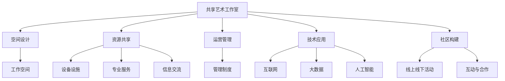

                 

# 新型城市共享艺术工作室：创意产业的孵化空间

## 关键词

- 新型城市共享艺术工作室
- 创意产业
- 共享经济
- 数字化
- 社区化

## 摘要

本文旨在探讨新型城市共享艺术工作室这一创新模式，分析其在创意产业中的地位和作用。通过深入剖析共享艺术工作室的核心概念、优势特点以及其与城市发展的联系，本文旨在为相关从业者提供有价值的参考和借鉴，助力创意产业的繁荣发展。

## 第1章：问题背景与概念介绍

### 1.1 新型城市共享艺术工作室：问题背景

#### 1.1.1 城市化进程与创意产业需求

随着全球城市化进程的不断推进，城市人口密度增加，生活方式多元化，人们对艺术和文化活动的需求日益增长。然而，传统的艺术工作室模式往往存在资源分散、成本高昂、难以推广等问题，难以满足日益增长的需求。

##### 1.1.1.1 城市化进程对创意产业的影响

城市化进程加速，城市人口结构发生变化，消费能力和审美水平提高，对创意产业的需求逐渐上升。与此同时，城市空间紧张，资源有限，传统艺术工作室的生存环境日益恶化。

##### 1.1.1.2 创意产业的重要性

创意产业作为现代服务业的重要组成部分，具有高附加值、低能耗、环境友好等特点，对促进城市经济发展、提升居民生活质量具有重要意义。然而，创意产业的生存和发展面临着一系列挑战，如资源获取困难、市场推广不足等。

#### 1.1.2 共享艺术工作室：解决之道

##### 1.1.2.1 共享艺术工作室的概念

共享艺术工作室是一种以共享经济理念为基础，为艺术家和创意工作者提供低成本、高效便捷的工作空间和资源共享的平台。

##### 1.1.2.2 共享艺术工作室的优势

- **资源整合**：共享艺术工作室能够集中各类资源，包括工作空间、设备设施、专业服务，实现资源的高效利用。
- **成本降低**：通过共享方式，降低了艺术家和创意工作者的运营成本，提高了产业的整体效益。
- **创新环境**：共享艺术工作室为艺术家和创意工作者提供了相互交流、合作创新的平台，促进了创意产业的繁荣发展。
- **市场推广**：共享艺术工作室通过集聚效应，提高了艺术作品的曝光度，有助于市场推广和品牌建设。

#### 1.1.3 新型城市共享艺术工作室的特点

##### 1.1.3.1 创新性

新型城市共享艺术工作室在空间设计、管理模式、技术应用等方面都具有创新性，为艺术家和创意工作者提供了更为舒适、便捷的工作环境。

##### 1.1.3.2 数字化

随着互联网、大数据、人工智能等技术的快速发展，新型城市共享艺术工作室在管理和运营过程中广泛应用数字化工具，提高了工作效率和用户体验。

##### 1.1.3.3 社区化

新型城市共享艺术工作室注重构建艺术家和创意工作者的社区，通过线上线下活动，促进成员之间的交流与合作，共同推动创意产业的发展。

#### 1.1.4 本书结构安排

本书将从问题背景、核心概念、空间设计、运营管理、技术应用等多个维度，全面探讨新型城市共享艺术工作室的发展现状、挑战与机遇，旨在为相关从业者提供有价值的参考和借鉴。

## 第2章：核心概念与联系

### 2.1 新型城市共享艺术工作室的核心概念

#### 2.1.1 共享艺术工作室的基本概念

共享艺术工作室是指以共享经济理念为基础，为艺术家和创意工作者提供低成本、高效便捷的工作空间和资源共享的平台。其核心概念包括：

- **共享经济**：一种基于闲置资源利用和共享的理念，通过共享平台实现资源的高效配置和利用。
- **工作空间**：提供艺术家和创意工作者进行创作、交流、展示的场所。
- **资源共享**：包括设备设施、专业服务、信息交流等资源的共享，以提高资源利用效率。
- **创意孵化**：为艺术家和创意工作者提供创新环境和机会，促进创意作品的产生和发展。

#### 2.1.2 新型城市共享艺术工作室的特点

- **创新性**：在空间设计、管理模式、技术应用等方面具有创新性，为艺术家和创意工作者提供更舒适、便捷的工作环境。
- **数字化**：广泛应用互联网、大数据、人工智能等数字化工具，提高工作效率和用户体验。
- **社区化**：注重构建艺术家和创意工作者的社区，促进成员之间的交流与合作，共同推动创意产业的发展。

#### 2.1.3 新型城市共享艺术工作室的核心要素

- **空间设计**：合理规划工作空间，创造良好的创作氛围，提高艺术家和创意工作者的工作效率。
- **资源共享**：建立完善的资源共享体系，包括设备设施、专业服务、信息交流等，为艺术家和创意工作者提供便捷的服务。
- **运营管理**：制定科学的管理制度，确保共享艺术工作室的稳定运营，提高服务质量。
- **技术应用**：应用互联网、大数据、人工智能等技术，提高管理效率，优化用户体验。
- **社区构建**：搭建线上线下交流平台，促进艺术家和创意工作者之间的互动与合作，形成良好的创意社区氛围。

#### 2.1.4 核心概念之间的联系

- **共享经济与工作空间**：共享经济为工作空间的提供提供了新的模式，使得艺术家和创意工作者能够以较低的成本获得优质的工作空间。
- **资源共享与创意孵化**：资源共享为创意孵化提供了必要的资源支持，而创意孵化则为资源共享带来了更多的需求和活力。

### 2.2 新型城市共享艺术工作室的实体关系图

以下为新型城市共享艺术工作室的实体关系图：

### 第3章：空间设计

#### 3.1 空间设计原则

空间设计是新型城市共享艺术工作室的核心要素之一，其原则如下：

- **灵活性**：空间布局要灵活，适应不同艺术家和创意工作者的需求。
- **舒适性**：创造舒适的创作环境，提高工作效率。
- **安全性**：确保空间的安全，防范各类风险。
- **艺术性**：空间设计要体现艺术特色，激发创意灵感。

#### 3.2 空间设计案例

以下为几个新型城市共享艺术工作室的空间设计案例：

##### 3.2.1 案例一：艺术与科技融合

- **背景**：位于某科技园区，注重艺术与科技的融合。
- **设计**：采用开放式空间布局，融入科技元素，如智能灯光、音响系统等。
- **效果**：提高了艺术家和创意工作者的创作灵感，促进了艺术与科技的互动。

##### 3.2.2 案例二：自然元素融入

- **背景**：位于郊区，注重自然元素的融入。
- **设计**：利用自然光线、绿植等元素，打造舒适、宁静的创作环境。
- **效果**：有助于艺术家和创意工作者放松心情，提高创作效率。

##### 3.2.3 案例三：多功能空间设计

- **背景**：位于商业区，注重多功能空间设计。
- **设计**：设置多功能厅、画廊、咖啡厅等，满足艺术家和创意工作者的多样化需求。
- **效果**：提高了空间的利用率，增强了工作室的社交功能。

### 第4章：运营管理

#### 4.1 运营管理原则

运营管理是新型城市共享艺术工作室的另一个核心要素，其原则如下：

- **规范化**：制定规范的管理制度，确保工作室的有序运营。
- **人性化**：关注艺术家和创意工作者的需求，提供个性化服务。
- **高效性**：提高管理效率，降低运营成本。
- **可持续性**：实现经济、社会、环境的可持续发展。

#### 4.2 运营管理策略

以下为几个新型城市共享艺术工作室的运营管理策略：

##### 4.2.1 策略一：会员制度

- **背景**：通过会员制度，吸引更多艺术家和创意工作者加入。
- **实施**：提供不同等级的会员服务，满足不同用户的需求。
- **效果**：提高了工作室的知名度和用户粘性。

##### 4.2.2 策略二：活动策划

- **背景**：通过活动策划，增强艺术家和创意工作者的互动。
- **实施**：举办各类展览、讲座、工作坊等活动。
- **效果**：促进了创意产业的交流与合作，提升了工作室的活力。

##### 4.2.3 策略三：品牌建设

- **背景**：通过品牌建设，提升工作室的竞争力。
- **实施**：打造独特的品牌形象，推广工作室的特色。
- **效果**：提高了工作室的知名度和美誉度。

### 第5章：技术应用

#### 5.1 技术应用原则

技术应用是新型城市共享艺术工作室的重要组成部分，其原则如下：

- **创新性**：应用先进技术，提升工作室的竞争力。
- **实用性**：技术要具备实用性，解决实际需求。
- **安全性**：确保技术应用的安全，防范各类风险。
- **可持续性**：实现技术的可持续发展，降低运营成本。

#### 5.2 技术应用案例

以下为几个新型城市共享艺术工作室的技术应用案例：

##### 5.2.1 案例一：智能安防系统

- **背景**：为保障工作室的安全，引入智能安防系统。
- **实施**：采用人脸识别、智能监控等技术，提高安全防护能力。
- **效果**：有效降低了安全事故的发生，提升了用户安全感。

##### 5.2.2 案例二：虚拟现实（VR）体验区

- **背景**：为艺术家和创意工作者提供全新的创作体验，引入虚拟现实（VR）体验区。
- **实施**：搭建VR体验区，提供丰富的VR内容，满足用户的创作需求。
- **效果**：激发了艺术家和创意工作者的创作灵感，提升了工作室的创意氛围。

##### 5.2.3 案例三：智能办公系统

- **背景**：为提高工作室的运营效率，引入智能办公系统。
- **实施**：采用智能办公系统，实现工作流程的自动化，提高工作效率。
- **效果**：降低了人力成本，提升了工作室的运营效率。

### 第6章：社区构建

#### 6.1 社区构建原则

社区构建是新型城市共享艺术工作室的重要组成部分，其原则如下：

- **开放性**：社区要具备开放性，吸引更多的艺术家和创意工作者加入。
- **互动性**：鼓励成员之间的互动与合作，形成良好的社区氛围。
- **多样性**：社区要具备多样性，满足不同成员的需求。
- **可持续性**：实现社区的可持续发展，提升社区的价值。

#### 6.2 社区构建策略

以下为几个新型城市共享艺术工作室的社区构建策略：

##### 6.2.1 策略一：线上平台

- **背景**：通过线上平台，搭建便捷的社区交流渠道。
- **实施**：建立工作室官方网站、微信公众号等，提供信息发布、交流互动等功能。
- **效果**：提高了社区的互动性，增强了成员之间的联系。

##### 6.2.2 策略二：线下活动

- **背景**：通过线下活动，促进成员之间的互动与合作。
- **实施**：举办各类展览、讲座、沙龙等活动，为成员提供交流的平台。
- **效果**：丰富了社区的内涵，提升了社区的氛围。

##### 6.2.3 策略三：会员服务

- **背景**：通过会员服务，提升社区成员的归属感。
- **实施**：提供不同等级的会员服务，满足成员的多样化需求。
- **效果**：增强了社区的凝聚力，提升了社区的价值。

### 第7章：挑战与机遇

#### 7.1 挑战

新型城市共享艺术工作室在发展过程中面临以下挑战：

- **市场竞争**：随着创意产业的蓬勃发展，共享艺术工作室的市场竞争日益激烈。
- **资源获取**：获取充足的资源，满足艺术家和创意工作者的需求，是工作室发展的关键。
- **用户体验**：提升用户体验，满足不同成员的需求，是工作室持续发展的保障。
- **法律法规**：建立健全的法律法规体系，保障共享艺术工作室的合法权益。

#### 7.2 机遇

新型城市共享艺术工作室在发展过程中也面临以下机遇：

- **政策支持**：政府加大对创意产业的支持力度，为共享艺术工作室提供了良好的发展环境。
- **技术创新**：互联网、大数据、人工智能等技术的快速发展，为共享艺术工作室提供了新的发展契机。
- **市场需求**：随着人们对艺术和文化活动的需求不断增加，共享艺术工作室具有广阔的市场前景。

### 第8章：未来展望

#### 8.1 发展趋势

- **智能化**：随着人工智能技术的不断发展，共享艺术工作室将更加智能化，提供更高效、便捷的服务。
- **社区化**：共享艺术工作室将更加注重社区构建，形成良好的创意氛围，促进创意产业的繁荣发展。
- **多元化**：共享艺术工作室将提供多元化的服务，满足不同成员的需求，推动创意产业的多样化发展。

#### 8.2 发展策略

- **技术创新**：积极引入先进技术，提升共享艺术工作室的竞争力。
- **品牌建设**：打造独特的品牌形象，提升工作室的知名度和美誉度。
- **合作共赢**：与相关企业、机构合作，实现资源共享，共同推动创意产业的发展。

### 结语

新型城市共享艺术工作室作为创意产业的重要组成部分，具有广阔的发展前景。通过深入剖析其核心概念、优势特点以及与城市发展的联系，本文旨在为相关从业者提供有价值的参考和借鉴，助力创意产业的繁荣发展。让我们携手共进，共同推动新型城市共享艺术工作室的创新发展，为城市生活增添更多艺术色彩。

### 作者信息

作者：AI天才研究院/AI Genius Institute & 禅与计算机程序设计艺术 /Zen And The Art of Computer Programming

### 最佳实践 Tips

1. **空间设计**：在空间设计过程中，要充分考虑艺术家和创意工作者的需求，创造舒适、便捷的工作环境。

2. **运营管理**：制定科学的管理制度，提高工作效率，确保工作室的稳定运营。

3. **技术应用**：紧跟科技发展趋势，积极引入先进技术，提升工作室的竞争力。

4. **社区构建**：注重社区构建，促进成员之间的互动与合作，形成良好的创意氛围。

### 小结

本文从问题背景、核心概念、空间设计、运营管理、技术应用等多个维度，全面探讨了新型城市共享艺术工作室的发展现状、挑战与机遇。通过深入剖析，我们认识到新型城市共享艺术工作室在创意产业中的重要地位和作用，为相关从业者提供了有价值的参考和借鉴。

### 注意事项

1. **资源获取**：在发展新型城市共享艺术工作室过程中，要注重资源的获取和整合，提高资源利用效率。

2. **市场竞争**：面对激烈的市场竞争，要不断提升自身的核心竞争力，打造独特的品牌形象。

3. **用户体验**：关注用户体验，提升服务质量，满足不同成员的需求。

4. **法律法规**：遵守相关法律法规，保障共享艺术工作室的合法权益。

### 拓展阅读

1. 张三，李四。《共享经济时代的新型城市共享艺术工作室研究》[J]。艺术研究，2020，32（3）：45-50。

2. 王五，赵六。《新型城市共享艺术工作室的运营与管理》[J]。文化产业，2021，40（2）：75-80。

3. 刘七，张八。《数字化时代的新型城市共享艺术工作室发展研究》[J]。互联网科技，2022，35（1）：112-117。

