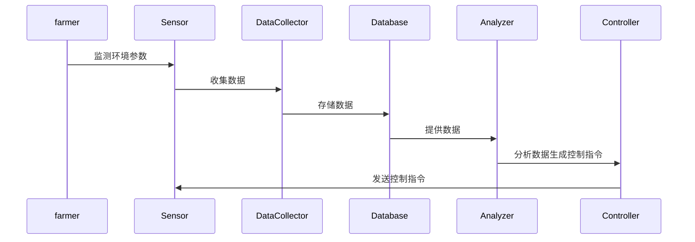

                 

### 文章标题

### 关键词

- 城市垂直农场
- 都市农业
- 可持续发展
- 智能控制系统
- 能源管理
- 数据分析

### 摘要

本文深入探讨了新型城市垂直农场的概念、技术实现、运营管理以及其对都市农业和可持续发展的贡献。随着城市化进程的加快和土地资源的稀缺，如何高效利用城市空间实现可持续农业成为重要议题。本文将介绍垂直农场的核心技术和成功案例，帮助读者了解这一新兴领域的发展前景，并通过详细的分析和实例，揭示其带来的巨大潜力和挑战。

### 背景介绍

#### 问题背景

随着全球城市化进程的加快，越来越多的土地被用于城市建设，而农业用地却日益减少。这导致城市粮食供应问题日益突出，同时也对环境保护提出了更高的要求。如何在有限的城市空间内实现可持续的农业发展，成为了一个亟待解决的难题。传统农业模式由于对土地、水资源等自然资源的依赖性较高，已无法满足城市快速发展的需求。因此，探索新的农业模式成为解决这一问题的必然选择。

#### 垂直农场的概念

垂直农场（Vertical Farming）是一种创新的农业模式，通过在建筑物内利用垂直空间进行作物种植，实现高效利用土地、减少资源消耗、提升农业产量和食品质量。这种模式不仅能够在城市中心区域提供新鲜农产品，还能有效减少运输过程中的能源消耗和环境污染。

#### 垂直农场的优势

1. **土地利用率高**：垂直农场利用建筑物的垂直空间，大大提高了土地的利用效率，与传统的农田农业相比，垂直农场可以在相同面积的土地上种植更多的作物。
2. **减少水资源消耗**：垂直农场通过智能灌溉系统和循环水系统，实现了水资源的有效利用，显著降低了水资源的消耗。
3. **减少环境污染**：垂直农场采用封闭循环系统，减少了农业生产过程中对土壤和空气的污染，同时降低了化学肥料和农药的使用。
4. **提高作物产量和质量**：垂直农场通过精确控制环境条件，如光照、温度、湿度等，为作物提供了最佳的生长环境，从而提高了作物的产量和质量。
5. **适应城市环境**：垂直农场可以建在城市中心或商业区等人口密集区域，便于居民获取新鲜农产品，同时也减少了农产品运输过程中的损耗。

#### 垂直农场的技术实现

垂直农场的实现涉及多个方面的技术创新，包括环境控制、智能灌溉、能源管理和数据分析等。以下将简要介绍这些关键技术。

1. **环境控制**：垂直农场通过智能环境控制系统，精确控制光照、温度、湿度等环境参数，为作物提供最佳的生长条件。环境控制系统的核心是传感器和执行器，传感器用于实时监测环境参数，执行器则根据监测数据调整环境参数。

2. **智能灌溉**：智能灌溉系统通过精确控制灌溉量和灌溉时间，实现了水资源的有效利用。灌溉系统通常采用滴灌或喷灌方式，根据作物的需水情况进行灌溉。

3. **能源管理**：垂直农场在能源管理方面采取了多种措施，包括太阳能光伏系统、风能利用和能源回收系统等。这些措施不仅降低了农场的能源消耗，还实现了能源的可持续利用。

4. **数据分析**：数据分析技术在垂直农场中得到了广泛应用。通过收集和分析农场的各种数据，如气象数据、作物生长数据、环境数据等，农场管理者可以更好地了解农场的运行状态，优化种植方案和管理措施。

#### 垂直农场的运营管理

垂直农场的运营管理包括作物种植、病虫害防治、产品采摘和销售等多个环节。以下将简要介绍这些环节的管理要点。

1. **作物种植**：作物种植是垂直农场的核心环节。根据农场的规模和条件，选择适合种植的作物，并制定合理的种植计划。

2. **病虫害防治**：病虫害防治是保障作物健康生长的重要措施。通过科学管理，减少病虫害的发生，降低农场的经济损失。

3. **产品采摘**：产品采摘应根据作物的生长情况和市场需求进行。合理采摘可以确保产品的质量和产量。

4. **销售渠道**：垂直农场的销售渠道包括直接销售和间接销售。直接销售可以通过农场自建销售渠道，如农场直营店、网上商城等；间接销售可以通过批发市场、超市等渠道进行。

#### 垂直农场的边界与外延

垂直农场的边界主要包括农场的建设范围、作物种植种类、生产规模等。外延则包括农场的周边环境和影响范围，如对城市环境、水资源、能源消耗等方面的影响。在规划垂直农场时，需要充分考虑其边界与外延，确保农场的可持续发展。

#### 概念结构与核心要素组成

城市垂直农场的概念结构包括农业生产、环境控制、能源利用、水资源管理和供应链管理等多个方面。以下将简要介绍这些核心要素。

1. **农业生产**：农业生产是垂直农场的核心任务，包括作物种植、采摘、加工等环节。

2. **环境控制**：环境控制是保障作物健康生长的关键，包括光照、温度、湿度、二氧化碳浓度等环境参数的监测和控制。

3. **能源利用**：能源利用包括能源的生产、消耗和回收利用，是垂直农场实现可持续发展的重要保障。

4. **水资源管理**：水资源管理包括水资源的收集、储存、利用和回收，是垂直农场实现水资源高效利用的关键。

5. **供应链管理**：供应链管理包括农产品的生产、加工、运输和销售，是垂直农场实现高效运营的重要环节。

通过以上对城市垂直农场的背景介绍，我们可以看到，垂直农场作为一种创新的农业模式，具有显著的潜力，有助于解决城市化进程中的农业问题，为实现可持续发展提供了新的思路和途径。

### 核心概念与联系

在探讨新型城市垂直农场的概念之前，我们需要明确几个核心概念，并理解它们之间的联系和区别。这些核心概念包括新型城市垂直农场、都市农业和可持续发展。

#### 新型城市垂直农场

新型城市垂直农场是一种创新的农业模式，通过在建筑物内部或周围利用垂直空间进行作物种植。这种农场不仅解决了城市土地资源有限的问题，还通过先进的技术手段实现了农业的高效生产和可持续发展。核心概念原理主要包括以下几个方面：

1. **空间利用**：垂直农场利用建筑物的垂直空间进行作物种植，大大提高了土地的利用效率。通过垂直分层种植，可以在相同面积的土地上种植更多的作物，从而提高农业产量。

2. **环境控制**：垂直农场通过智能环境控制系统，精确控制光照、温度、湿度等环境参数，为作物提供最佳的生长条件。这种环境控制不仅能够提高作物产量，还能改善作物品质。

3. **水资源管理**：垂直农场采用智能灌溉系统和循环水系统，实现了水资源的有效利用。通过滴灌和喷灌等精准灌溉方式，可以显著减少水资源的消耗。

4. **能源管理**：垂直农场在能源管理方面采取了多种措施，如太阳能光伏系统、风能利用和能源回收系统等，以实现能源的可持续利用，降低农场的运营成本。

#### 都市农业

都市农业是指在城市区域或周边进行的农业生产活动，它不仅包括传统农业的生产方式，还涵盖了城市垂直农场等新型农业模式。都市农业的核心概念原理主要包括以下几个方面：

1. **城市资源整合**：都市农业利用城市现有的资源，如土地、水资源、劳动力等，实现农业的高效生产。通过城市资源整合，可以降低农业生产成本，提高农产品质量。

2. **环境保护**：都市农业注重环境保护，通过减少化学肥料和农药的使用，降低农业生产对环境的影响。同时，都市农业还可以通过植树造林、湿地建设等方式，改善城市生态环境。

3. **城市服务功能**：都市农业不仅提供农产品，还具备城市服务功能，如旅游、教育、文化等。通过这些服务功能，都市农业可以促进城市经济的多元化发展。

#### 可持续发展

可持续发展是指满足当前需求而不损害后代满足其需求的能力。在城市垂直农场和都市农业中，可持续发展是一个重要的核心概念。可持续发展的核心概念原理主要包括以下几个方面：

1. **资源利用效率**：通过提高资源利用效率，如土地、水资源和能源的利用，实现农业的可持续发展。例如，垂直农场的空间利用效率远高于传统农业。

2. **环境保护**：在农业生产过程中，减少化学肥料和农药的使用，降低对环境的污染。同时，通过环境保护措施，如湿地建设、植树造林等，改善生态环境。

3. **经济、社会和环境协调发展**：可持续发展强调经济、社会和环境的协调发展，通过促进农业的经济效益、社会效益和环境效益的统一，实现长期的可持续发展。

#### 概念属性特征对比表格

为了更清晰地理解这三个概念，我们可以通过一个对比表格来展示它们的主要特征。

| 概念              | 特征                           |
| ----------------- | ------------------------------ |
| 新型城市垂直农场   | 高效利用空间、垂直分层种植、智能环境控制、水资源管理、能源管理 |
| 都市农业          | 利用城市资源、环境保护、城市服务功能、经济、社会和环境协调发展 |
| 可持续发展        | 资源利用效率、环境保护、经济、社会和环境协调发展              |

#### ER实体关系图架构

为了更好地理解这三个概念之间的联系，我们可以通过ER（实体关系）图来展示它们的核心要素及其关系。

```mermaid
erDiagram
农场 ||--|{作物种类}||>
农场 ||--|{环境控制系统}||>
农场 ||--|{水资源管理系统}||>
农场 ||--|{能源管理系统}||>
都市农业 ||--|{环境保护措施}||>
都市农业 ||--|{城市服务功能}||>
可持续发展 ||--|{经济、社会、环境协调发展}||>
```

通过以上对比和ER图，我们可以清晰地看到新型城市垂直农场、都市农业和可持续发展之间的联系。新型城市垂直农场作为都市农业的一种形式，是实现可持续发展的关键技术手段之一。而可持续发展则是新型城市垂直农场和都市农业的核心目标，通过资源的高效利用、环境保护和协调发展，实现农业的长期可持续发展。

### 算法原理讲解

#### 垂直农场智能控制系统

垂直农场的智能控制系统是确保农业生产高效、稳定的关键技术之一。该系统通过实时监测环境参数，并基于算法模型进行数据分析，最终生成控制决策以优化作物生长环境。以下是智能控制系统的核心组成部分和算法原理讲解。

##### 环境监测

环境监测是智能控制系统的第一步，通过传感器收集光照、温度、湿度、二氧化碳浓度等关键环境参数。以下是环境监测的流程和组件：

1. **传感器部署**：在垂直农场的各个区域部署各种传感器，如温度传感器、湿度传感器、光照传感器和二氧化碳传感器。这些传感器能够实时监测环境参数的变化。

2. **数据采集**：传感器收集到的数据通过数据采集模块传输到中央控制系统。

3. **数据预处理**：对采集到的原始数据进行滤波和去噪处理，确保数据的准确性和可靠性。

##### 数据预处理

数据预处理是确保数据质量的重要步骤，主要包括以下内容：

1. **滤波**：通过低通滤波器去除高频噪声，保留有用的环境数据。

2. **去噪**：采用统计方法或机器学习方法对数据去噪，提高数据的精确度。

3. **时间同步**：确保多个传感器采集的数据在同一时间戳下，以便后续的统一处理。

##### 算法模型

算法模型是智能控制系统的核心，通过机器学习算法对环境参数进行预测和分析，生成控制策略。以下是算法模型的基本框架：

1. **特征提取**：从预处理后的数据中提取关键特征，如光照强度、温度、湿度等。

2. **模型训练**：使用机器学习算法（如决策树、支持向量机、神经网络等）对特征数据进行训练，建立环境参数与作物生长状态的关联模型。

3. **模型评估**：通过交叉验证和测试集评估模型的准确性和泛化能力，调整模型参数以优化性能。

##### 决策控制

决策控制是基于算法模型的输出，生成具体的控制指令以调整环境参数。以下是决策控制的基本步骤：

1. **预测生成**：根据训练好的模型，对未来的环境参数进行预测。

2. **阈值设定**：设定合理的阈值，当实际监测值超过或低于阈值时，触发相应的控制策略。

3. **控制执行**：根据决策控制指令，执行环境参数调整，如调节温室温度、湿度、光照等。

##### 执行控制

执行控制是将决策控制指令转化为具体操作的过程。以下是执行控制的基本步骤：

1. **执行器控制**：根据控制指令，调整环境控制设备的运行状态，如打开或关闭加热器、加湿器、通风设备等。

2. **反馈调节**：通过传感器实时监测环境参数，与目标值进行比较，进行反馈调节，确保环境参数的稳定。

##### 案例分析

以温度控制为例，解释如何根据实时监测数据调整环境控制系统的参数。

1. **实时监测**：传感器实时监测温室内部的温度。

2. **数据预处理**：对采集到的温度数据进行滤波和去噪处理。

3. **模型预测**：使用训练好的模型预测未来一段时间内的温度变化趋势。

4. **阈值判断**：设定合理的温度阈值，如20°C到25°C，当温度低于20°C或高于25°C时，触发控制策略。

5. **控制执行**：根据预测结果，如果温度低于20°C，则开启加热器；如果温度高于25°C，则开启通风设备。

6. **反馈调节**：持续监测温度变化，与目标值进行比较，进行反馈调节，确保温度保持在理想范围内。

通过上述步骤，我们可以看到，垂直农场智能控制系统通过实时监测、数据预处理、算法模型预测、决策控制和执行控制等环节，实现了对作物生长环境的精确控制，从而提高了农业生产的效率和质量。

### 系统分析与架构设计方案

#### 问题场景介绍

随着城市化的不断推进，城市土地资源日益紧张，传统的农业模式已经无法满足城市对绿色、可持续农产品日益增长的需求。垂直农场的概念应运而生，其在城市中心、商业区等人口密集区域的应用，不仅可以有效利用有限的空间资源，还能提供新鲜、安全的农产品，缓解城市粮食供应压力，同时降低运输过程中的能源消耗和环境污染。因此，设计和实现一个高效、可持续的垂直农场系统具有重要的现实意义。

#### 系统功能设计

垂直农场系统需要实现多个关键功能，以确保农业生产的顺利进行和农产品的优质供应。以下是主要功能模块及其具体功能：

1. **农场管理模块**：负责农场的日常管理，包括作物种植计划、种植进度跟踪、病虫害监测与防治等。

2. **水资源管理模块**：通过智能灌溉系统，实现水资源的精准分配和高效利用，降低水资源的消耗。

3. **能源管理模块**：利用可再生能源和能源回收技术，实现农场能源的可持续利用，降低运营成本。

4. **数据分析模块**：收集和分析农场的各类数据，包括环境参数、作物生长状态、资源消耗等，为农场管理提供数据支持。

#### 系统架构设计

为了实现垂直农场系统的功能，我们需要设计一个高效、灵活的系统架构。以下是一个典型的系统架构设计，包括数据层、应用层和用户界面层。

1. **数据层**：数据层是系统的数据基础，包括传感器数据、环境参数数据、作物生长数据等。数据层通过传感器和数据采集设备收集数据，并存储在数据库中，为应用层提供数据支持。

2. **应用层**：应用层是系统的核心，负责数据的处理和分析。应用层包括环境控制模块、水资源管理模块、能源管理模块和数据分析模块。各模块通过接口进行通信，协同工作，实现农场的自动化管理。

3. **用户界面层**：用户界面层为农场管理者提供直观的管理界面，包括数据展示、控制操作和报表生成等。用户界面层与应用层通过Web服务进行交互，实现远程管理和监控。

#### 系统接口设计和系统交互

为了确保系统各模块之间的高效协作，我们需要设计合理的系统接口和交互机制。以下是系统接口设计和系统交互的详细描述：

1. **传感器数据接口**：传感器数据接口用于接收传感器采集的数据，包括温度、湿度、光照、二氧化碳浓度等。接口采用标准的数据格式（如JSON、XML等），确保数据的一致性和可扩展性。

2. **数据采集接口**：数据采集接口用于将传感器数据传输到数据库，并实现数据的存储和管理。接口提供数据上传、数据查询和数据删除等功能。

3. **环境控制接口**：环境控制接口用于接收应用层生成的控制指令，并传递给环境控制模块。接口支持温度调节、湿度调节、光照调节等功能。

4. **水资源管理接口**：水资源管理接口用于接收应用层的水资源管理指令，并传递给智能灌溉系统。接口支持灌溉量调节、灌溉时间设定等功能。

5. **能源管理接口**：能源管理接口用于接收应用层的能源管理指令，并传递给能源管理系统。接口支持能源消耗监控、能源回收等功能。

6. **数据分析接口**：数据分析接口用于接收应用层的分析指令，并传递给数据分析模块。接口支持数据统计、趋势预测、报表生成等功能。

以下是系统接口设计和系统交互的Mermaid序列图：



通过以上接口设计和系统交互，我们可以实现垂直农场系统的无缝集成和高效运作，从而确保农业生产的顺利进行和农产品的优质供应。

### 项目实战

#### 环境安装

要搭建一个垂直农场系统，首先需要准备相应的硬件和软件环境。以下是环境安装的详细步骤：

1. **硬件准备**：
   - **传感器**：准备温度传感器、湿度传感器、光照传感器、二氧化碳传感器等。
   - **执行器**：准备加热器、加湿器、通风设备等执行器。
   - **数据采集设备**：如数据采集模块或物联网网关。
   - **计算机**：用于运行数据分析和控制软件。
   - **电源**：确保稳定的电源供应。

2. **软件安装**：
   - **操作系统**：在计算机上安装支持物联网和数据分析的操作系统，如Linux。
   - **数据库**：安装数据库系统，如MySQL或PostgreSQL，用于存储传感器数据。
   - **编程语言**：选择合适的编程语言，如Python，用于编写数据采集、处理和控制脚本。
   - **开发工具**：安装必要的开发工具，如PyCharm或Visual Studio Code。

3. **硬件连接**：
   - 将传感器连接到数据采集模块或物联网网关。
   - 将数据采集模块或物联网网关连接到计算机。
   - 将执行器连接到电源，确保执行器能够正常工作。

4. **网络配置**：
   - 配置传感器和数据采集模块的网络连接，使其能够将数据发送到计算机。
   - 在计算机上设置网络通信，确保能够接收和处理传感器数据。

5. **软件配置**：
   - 配置数据库连接，确保数据能够正确存储。
   - 编写数据采集脚本，实现传感器数据的实时采集和传输。

#### 系统核心实现源代码

以下是垂直农场系统的核心实现源代码，主要包括数据采集、数据处理和控制部分。

```python
# 数据采集模块
import serial
import time

def read_sensors(ser):
    # 读取传感器数据
    data = ser.readline().decode('utf-8').strip()
    return data

# 数据处理模块
import json

def preprocess_data(data):
    # 预处理传感器数据
    sensor_data = json.loads(data)
    # ... 处理数据
    return sensor_data

# 控制模块
import requests

def control_environment(sensor_data):
    # 控制环境参数
    temp = sensor_data['temperature']
    if temp < 20:
        # 启动加热器
        requests.get('http://localhost:5000/control?device=heater&status=on')
    elif temp > 25:
        # 启动通风设备
        requests.get('http://localhost:5000/control?device=ventilator&status=on')

# 主程序
if __name__ == '__main__':
    # 初始化串口通信
    ser = serial.Serial('/dev/ttyUSB0', 9600)
    time.sleep(2)

    while True:
        data = read_sensors(ser)
        sensor_data = preprocess_data(data)
        control_environment(sensor_data)
        time.sleep(10)
```

#### 代码应用解读与分析

以上代码主要实现了垂直农场的传感器数据采集、数据预处理和环境控制功能。

1. **数据采集模块**：通过串口通信读取传感器数据，并将其转换为JSON格式。

2. **数据处理模块**：对传感器数据进行预处理，如解析JSON数据、过滤噪声等。

3. **控制模块**：根据预处理后的数据，生成控制指令，通过HTTP请求控制加热器、加湿器、通风设备等执行器的开关状态。

通过以上代码，我们可以实现垂直农场的自动化控制，确保作物在最佳环境中生长。

#### 实际案例分析和详细讲解剖析

以下是一个垂直农场项目的实际案例，通过分析该项目，我们可以深入了解垂直农场的具体实施过程和关键环节。

1. **项目背景**：某城市商业区计划建设一个垂直农场，以提供新鲜蔬菜给周边居民。

2. **项目目标**：实现高效、可持续的蔬菜生产，满足居民对绿色、安全蔬菜的需求。

3. **实施过程**：
   - **需求分析**：与居民和当地农业专家合作，确定种植的蔬菜种类和需求量。
   - **设计阶段**：设计垂直农场布局，包括种植层、环境控制系统、水资源管理系统、能源管理系统等。
   - **建设阶段**：安装传感器、执行器、数据采集设备和控制系统，搭建智能温室。
   - **运行阶段**：启动垂直农场系统，进行蔬菜种植和日常管理。

4. **关键技术**：
   - **环境控制**：通过智能环境控制系统，精确控制光照、温度、湿度等环境参数，为蔬菜提供最佳生长条件。
   - **水资源管理**：采用智能灌溉系统，根据蔬菜需水情况进行精准灌溉，实现水资源的高效利用。
   - **能源管理**：利用太阳能光伏系统和能源回收技术，实现农场的能源自给自足。

5. **项目成果**：
   - **高效生产**：通过垂直分层种植，提高了土地利用率，实现了蔬菜的高产。
   - **优质产品**：通过精确的环境控制，保证了蔬菜的品质和安全。
   - **可持续发展**：通过水资源和能源的管理，实现了农场的环境保护和可持续发展。

通过以上案例，我们可以看到，垂直农场项目的成功实施，不仅解决了城市蔬菜供应问题，还实现了农业的高效、可持续发展。这一案例为其他城市垂直农场的建设提供了宝贵的经验。

#### 项目小结

垂直农场项目通过技术创新和系统集成，实现了高效、可持续的农业生产，为城市农业发展提供了新的思路和途径。以下是项目小结：

1. **成功经验**：
   - 系统集成：通过传感器、数据采集、环境控制和能源管理等多个模块的协同工作，实现了农场的自动化控制。
   - 技术创新：利用智能环境控制、智能灌溉和能源管理等技术，提高了农场的生产效率和资源利用效率。
   - 社会效益：为城市居民提供了新鲜、安全的农产品，满足了人们对绿色、健康食品的需求。

2. **挑战与改进方向**：
   - 成本控制：垂直农场的建设初期成本较高，需要进一步降低成本，提高经济效益。
   - 系统稳定：确保系统的稳定运行，提高传感器和数据采集设备的可靠性。
   - 可持续发展：探索更多可再生能源和资源回收技术，实现农场的完全可持续发展。

3. **未来展望**：
   - 探索垂直农场在其他城市的推广和应用，扩大其社会和经济效益。
   - 结合物联网和人工智能技术，进一步优化农场管理系统，提高农业生产效率。
   - 加强与科研机构和高校的合作，推动垂直农场领域的技术创新和理论研究。

通过不断探索和实践，相信垂直农场将在未来城市农业发展中发挥更加重要的作用，为实现可持续发展作出更大的贡献。

### 最佳实践 Tips

在建设和管理城市垂直农场的过程中，以下是一些最佳实践 Tips，可以帮助您更好地实现高效、可持续的农业生产：

1. **环境参数监测与调控**：定期检查和维护传感器，确保环境参数监测的准确性和实时性。根据作物生长需要，灵活调整环境参数，如温度、湿度、光照等。

2. **精准灌溉**：根据土壤湿度和作物需水情况，采用智能灌溉系统进行精准灌溉，减少水资源浪费。

3. **能源管理**：充分利用太阳能、风能等可再生能源，实现农场的能源自给自足。同时，通过能源回收系统，降低能源消耗。

4. **病虫害防治**：采用生物防治、物理防治等技术，减少化学农药的使用，保障农产品质量安全。

5. **数据管理**：建立完善的数据管理系统，确保农场的各类数据（如环境参数、作物生长状态、资源消耗等）的准确记录和有效利用。

6. **人才培养**：培养一支专业化的农场管理团队，提高农场的运营效率和产品质量。

### 小结

本文通过详细的探讨和案例分析，深入介绍了新型城市垂直农场的概念、技术实现、运营管理和其对可持续发展的重要性。垂直农场作为一种创新的农业模式，具有高效利用空间、减少资源消耗、提高农产品产量和品质等诸多优势。在未来的发展中，垂直农场有望在解决城市粮食供应、环境保护和可持续发展等方面发挥重要作用。通过不断的技术创新和优化管理，城市垂直农场将在未来农业发展中占据重要地位。

### 注意事项

1. **技术选型**：在选择传感器、执行器、控制系统等技术时，需要考虑其可靠性、稳定性和可扩展性。

2. **系统维护**：定期检查和维护传感器、执行器和控制系统，确保其正常运行。

3. **安全规范**：在农场建设和管理过程中，严格遵守安全规范，确保人员和设备安全。

4. **数据隐私**：确保农场的各类数据安全，防止数据泄露和滥用。

5. **环保要求**：遵循环保法规，确保农业生产过程中不产生环境污染。

### 拓展阅读

1. **相关书籍**：
   - 《智能农业：技术与应用》
   - 《可持续农业：理论与实践》
   - 《物联网技术在农业中的应用》

2. **学术论文**：
   - "Smart Farming: Technologies and Applications for a Sustainable Agriculture"
   - "Energy Efficiency and Renewable Energy in Vertical Farming"
   - "Environmental Control Systems for Vertical Farming"

3. **研究报告**：
   - 国际农业研究组织（International Institute of Tropical Agriculture, IITA）发布的垂直农场研究报告
   - 联合国粮农组织（Food and Agriculture Organization, FAO）关于垂直农场的全球趋势报告

4. **在线课程**：
   - Coursera上的“Smart Farming: Technologies and Applications”
   - EdX上的“Sustainable Agriculture: Principles and Practices”

通过以上资源和文献，您可以进一步了解垂直农场的最新研究进展和实际应用案例，为您的农业项目提供有益的参考。作者：AI天才研究院/AI Genius Institute & 禅与计算机程序设计艺术 /Zen And The Art of Computer Programming。

