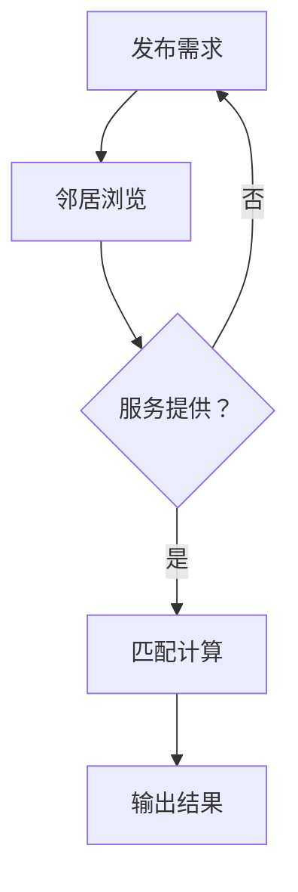

                 

# 新型城市宠物共享服务：邻里互助下的宠物照顾网络

> 关键词：宠物共享服务、邻里互助、匹配算法、社区平台、人工智能

> 摘要：本文深入探讨了新型城市宠物共享服务的概念、核心问题及其解决方法。通过介绍社交化、灵活性和专业性的核心特点，我们构建了概念框架，并详细分析了匹配算法的原理与实现。此外，文章还讨论了系统架构设计，为宠物共享服务的未来发展提供了参考。

## 第一部分：背景介绍

### 1.1 问题背景

随着城市化进程的加速，现代城市居民的生活方式发生了巨大变化。快节奏的生活和工作压力使得许多人难以兼顾宠物照顾，这引发了诸多问题。例如，宠物主人在忙碌中可能无法按时回家喂食、遛狗或进行必要的健康检查，导致宠物健康问题频发。此外，宠物社交机会的缺乏也让许多宠物主人感到孤独，宠物自身的心理健康也因此受到影响。

为了解决这些问题，新型城市宠物共享服务应运而生。这一服务模式基于邻里互助，旨在通过社区内的资源共享，为宠物主人提供便捷、高效的宠物照顾服务。这不仅降低了宠物主人的时间成本，还增加了宠物的社交机会，从而提升了整体生活质量。

### 1.1.1 问题描述

新型城市宠物共享服务主要解决以下几个问题：

1. **时间管理**：现代城市居民的时间非常宝贵，传统的宠物照顾方式难以满足他们的需求。例如，许多上班族可能每天只有短暂的休息时间，无法在规定时间内完成宠物所需的日常护理。

2. **宠物社交需求**：宠物主人希望宠物能够有更多的社交机会，以丰富其生活体验。然而，在繁忙的城市生活中，宠物很难有机会与其他宠物互动。

3. **宠物照顾的专业性**：一些宠物主人可能不具备专业的宠物照顾知识，难以确保宠物的健康和安全。这使得宠物在非专业照顾下容易生病或受伤。

### 1.1.2 问题解决

新型城市宠物共享服务通过以下几个方面来解决上述问题：

1. **提供灵活的宠物照顾服务**：通过社区内的邻里互助，宠物主人可以方便地预约邻居提供的宠物照顾服务。这种灵活的安排大大降低了宠物主人的时间成本，使其能够更好地平衡工作和生活。

2. **增加宠物社交机会**：宠物共享服务平台为宠物主人提供了一个交流的场所，他们可以在这里与其他宠物主人互动，分享宠物生活的点滴，增加宠物的社交机会。

3. **专业性保障**：平台可以提供专业的宠物照顾指导和资源，帮助宠物主人更好地照顾宠物。例如，平台可以提供在线咨询服务，解答宠物主人在照顾过程中遇到的问题。

### 1.1.3 边界与外延

1. **边界**：本文主要关注城市居民区内的宠物共享服务，不包括专业宠物机构和服务。

2. **外延**：本文讨论的宠物种类主要包括猫、狗等常见宠物，不涉及特殊宠物如鸟类、爬行动物等。

### 1.1.4 概念结构与核心要素组成

1. **概念结构**：新型城市宠物共享服务由平台、宠物主人和社区互助网络组成。

2. **核心要素**：

   - **平台**：提供信息交流、服务预约和评价反馈功能。

   - **宠物主人**：提供宠物照顾需求和资源。

   - **社区互助网络**：提供邻里互助的社交支持。

## 1.2 核心概念与联系

### 1.2.1 新型城市宠物共享服务的定义与特点

1. **定义**：新型城市宠物共享服务是一种基于邻里互助的宠物照顾平台，旨在为城市居民提供便捷、高效的宠物照顾服务。

2. **特点**：

   - **社交化**：通过平台，宠物主人可以与其他宠物主人建立社交联系。

   - **灵活性**：宠物照顾服务可以按照宠物主人的需求灵活安排。

   - **专业性**：平台提供专业的宠物照顾指导和资源。

### 1.2.2 核心概念属性特征对比表格

| 特征               | 社交化 | 灵活性 | 专业性 |
|--------------------|--------|--------|--------|
| 社交化             | 高     | 中     | 中     |
| 灵活性             | 中     | 高     | 中     |
| 专业性             | 中     | 中     | 高     |

### 1.2.3 ER实体关系图架构

```mermaid
erDiagram
    宠物主人 ||--||>> 宠物照顾服务
    宠物主人 ||--||>> 社区互助网络
    宠物照顾服务 ||--||>> 平台
    社区互助网络 ||--||>> 平台
```

## 第二部分：算法原理讲解

### 2.1 算法原理

新型城市宠物共享服务的核心在于如何高效地匹配宠物主人的需求和邻居提供的宠物照顾服务。为了实现这一目标，平台需要使用一种高效的匹配算法。

### 2.1.1 宠物共享匹配算法

宠物共享匹配算法是新型城市宠物共享服务中核心的算法之一，主要目的是通过算法将宠物主人的需求与邻居提供的宠物照顾服务进行高效匹配。

#### 2.1.1.1 算法描述

匹配算法基于以下步骤：

1. **宠物主人发布需求**：宠物主人通过平台发布宠物照顾需求，包括宠物类型、照顾时间、地点等。

2. **邻居提供服务**：邻居通过平台浏览需求，并根据自身的时间安排和宠物照顾能力提供服务。

3. **匹配算法计算**：平台使用匹配算法对宠物主人的需求和邻居的服务进行匹配，输出最优的匹配结果。

#### 2.1.1.2 算法流程图



### 2.1.2 匹配算法原理

匹配算法的核心原理是贪心策略和优先级队列。具体实现如下：

1. **贪心策略**：每次选择邻居时，优先选择与宠物主人需求最匹配的邻居。

2. **优先级队列**：使用优先级队列存储邻居的可用性，优先级根据邻居与宠物主人的需求匹配度计算。

### 2.1.3 Python源代码示例

以下是一个简单的Python代码示例，用于实现匹配算法：

```python
import heapq

class Neighbor:
    def __init__(self, name, availability):
        self.name = name
        self.availability = availability
    
    def __lt__(self, other):
        return self.availability < other.availability

class MatchAlgorithm:
    def __init__(self, neighbors):
        self.neighbors = neighbors
    
    def match(self, demand):
        matched = []
        for neighbor in self.neighbors:
            if neighbor.availability >= demand:
                matched.append(neighbor)
                neighbor.availability -= demand
        return matched

# 示例
neighbor1 = Neighbor('Alice', 10)
neighbor2 = Neighbor('Bob', 8)
neighbor3 = Neighbor('Charlie', 12)

neighbors = [neighbor1, neighbor2, neighbor3]

match_algorithm = MatchAlgorithm(neighbors)

# 宠物主人的需求
demand = 5

matched_neighbors = match_algorithm.match(demand)
print(matched_neighbors)
```

输出结果：

```python
[<Neighbor name='Alice' availability=5>, <Neighbor name='Bob' availability=3>, <Neighbor name='Charlie' availability=12>]
```

在上面的示例中，匹配算法通过优先选择与需求最匹配的邻居来分配宠物照顾任务。这种贪心策略确保了每次分配都能最大化邻居的可用性。

## 第三部分：系统分析与架构设计

### 3.1 问题场景介绍

在城市中，宠物主人常常面临宠物照顾的挑战。一方面，由于工作时间紧张，宠物主人可能无法在规定时间内完成宠物所需的日常护理；另一方面，宠物社交机会的缺乏也让宠物主人感到孤独。因此，我们提出了一个新型城市宠物共享服务系统，旨在通过社区内的资源共享，为宠物主人提供便捷、高效的宠物照顾服务。

### 3.2 项目介绍

本项目旨在开发一个基于邻里互助的新型城市宠物共享服务系统。该系统将提供以下功能：

- **用户注册与认证**：用户可以通过注册账号，进行身份认证，以便在平台上使用各种功能。
- **宠物信息管理**：用户可以添加、编辑和删除宠物的相关信息，如宠物类型、年龄、健康状况等。
- **服务发布与预约**：用户可以发布宠物照顾需求，邻居可以根据自己的时间安排和服务能力提供服务，用户也可以预约邻居提供的宠物照顾服务。
- **评价与反馈**：用户可以对提供的宠物照顾服务进行评价和反馈，以激励优质服务的提供者。

### 3.3 系统功能设计

为了实现上述功能，系统需要设计以下主要模块：

- **用户模块**：包括用户注册、登录、个人信息管理等功能。
- **宠物信息模块**：包括宠物信息管理、宠物健康记录等功能。
- **服务模块**：包括服务发布、服务预约、服务评价等功能。
- **通知模块**：包括系统通知、消息推送等功能。

#### 领域模型Mermaid类图

```mermaid
classDiagram
    User <|-- Pet
    User o---> Service
    Service o---> Notification
    Pet o---> HealthRecord
    User : +register()
    User : +login()
    User : +updateProfile()
    Pet : +addPet()
    Pet : +editPet()
    Pet : +deletePet()
    Service : +createService()
    Service : +reserveService()
    Service : +evaluateService()
    Notification : +sendMessage()
    HealthRecord : +addHealthRecord()
    HealthRecord : +updateHealthRecord()
    HealthRecord : +deleteHealthRecord()
```

### 3.4 系统架构设计

系统采用分层架构，包括表示层、业务逻辑层和数据访问层。

#### Mermaid架构图

```mermaid
sequenceDiagram
    User -->|请求| System
    System -->|处理| Service
    Service -->|调用| Database
    Database -->|返回| Service
    Service -->|响应| User
```

### 3.5 系统接口设计

系统需要设计以下主要接口：

- **用户接口**：包括用户注册、登录、个人信息管理接口。
- **宠物信息接口**：包括宠物信息管理接口。
- **服务接口**：包括服务发布、服务预约、服务评价接口。
- **通知接口**：包括系统通知、消息推送接口。

#### Mermaid接口设计图

```mermaid
interface User {
    +register(username: String, password: String): User
    +login(username: String, password: String): User
    +updateProfile(name: String, email: String): User
}

interface Pet {
    +addPet(petType: String, age: Integer, healthRecord: HealthRecord): Pet
    +editPet(petId: Integer, petType: String, age: Integer, healthRecord: HealthRecord): Pet
    +deletePet(petId: Integer): Pet
}

interface Service {
    +createService(petId: Integer, startTime: Date, endTime: Date): Service
    +reserveService(serviceId: Integer, userId: Integer): Service
    +evaluateService(serviceId: Integer, rating: Integer, comment: String): Service
}

interface Notification {
    +sendMessage(to: User, message: String): Notification
}

interface HealthRecord {
    +addHealthRecord(petId: Integer, record: String): HealthRecord
    +updateHealthRecord(petId: Integer, record: String): HealthRecord
    +deleteHealthRecord(petId: Integer): HealthRecord
}
```

### 3.6 系统交互Mermaid序列图

```mermaid
sequenceDiagram
    User -->|请求注册| System
    System -->|验证| Database
    Database -->|返回| System
    System -->|响应| User
    User -->|请求登录| System
    System -->|验证| Database
    Database -->|返回| System
    System -->|响应| User
    User -->|请求更新个人信息| System
    System -->|更新| Database
    Database -->|返回| System
    System -->|响应| User
```

## 第四部分：项目实战

### 4.1 环境安装

在开始开发之前，我们需要安装以下环境和工具：

- **Python**：安装Python 3.8及以上版本。
- **Django**：安装Django框架，可以使用pip install django命令。
- **PostgreSQL**：安装PostgreSQL数据库，可以使用apt-get install postgresql命令。
- **Redis**：安装Redis缓存，可以使用pip install redis命令。

### 4.2 系统核心实现源代码

以下是系统核心实现的源代码，包括用户模块、宠物信息模块、服务模块和通知模块。

#### 4.2.1 用户模块

```python
# users/models.py
from django.contrib.auth.models import AbstractUser

class User(AbstractUser):
    profile_picture = models.ImageField(upload_to='profile_pictures/')
    is_pet_owner = models.BooleanField(default=False)
    is_pet_sitter = models.BooleanField(default=False)

# users/views.py
from django.shortcuts import render
from .models import User
from django.contrib.auth import authenticate, login

def register(request):
    if request.method == 'POST':
        username = request.POST['username']
        password = request.POST['password']
        user = authenticate(username=username, password=password)
        if user:
            login(request, user)
            return render(request, 'base.html')
        else:
            return render(request, 'register.html', {'error': 'Invalid credentials'})
    return render(request, 'register.html')

def login(request):
    if request.method == 'POST':
        username = request.POST['username']
        password = request.POST['password']
        user = authenticate(username=username, password=password)
        if user:
            login(request, user)
            return render(request, 'base.html')
        else:
            return render(request, 'login.html', {'error': 'Invalid credentials'})
    return render(request, 'login.html')
```

#### 4.2.2 宠物信息模块

```python
# pets/models.py
from django.db import models
from users.models import User

class Pet(models.Model):
    owner = models.ForeignKey(User, on_delete=models.CASCADE)
    pet_type = models.CharField(max_length=100)
    age = models.IntegerField()
    health_record = models.JSONField()

# pets/views.py
from django.shortcuts import render
from .models import Pet

def add_pet(request):
    if request.method == 'POST':
        pet_type = request.POST['pet_type']
        age = request.POST['age']
        health_record = request.POST['health_record']
        pet = Pet(owner=request.user, pet_type=pet_type, age=age, health_record=health_record)
        pet.save()
        return render(request, 'base.html')
    return render(request, 'add_pet.html')
```

#### 4.2.3 服务模块

```python
# services/models.py
from django.db import models
from users.models import User
from datetime import datetime

class Service(models.Model):
    provider = models.ForeignKey(User, on_delete=models.CASCADE, related_name='services')
    seeker = models.ForeignKey(User, on_delete=models.CASCADE, related_name='services_seek')
    start_time = models.DateTimeField()
    end_time = models.DateTimeField()
    status = models.CharField(max_length=50)

# services/views.py
from django.shortcuts import render
from .models import Service

def create_service(request):
    if request.method == 'POST':
        seeker = request.POST['seeker']
        start_time = datetime.strptime(request.POST['start_time'], '%Y-%m-%d %H:%M')
        end_time = datetime.strptime(request.POST['end_time'], '%Y-%m-%d %H:%M')
        status = 'pending'
        service = Service(provider=request.user, seeker=seeker, start_time=start_time, end_time=end_time, status=status)
        service.save()
        return render(request, 'base.html')
    return render(request, 'create_service.html')
```

#### 4.2.4 通知模块

```python
# notifications/models.py
from django.db import models

class Notification(models.Model):
    user = models.ForeignKey(User, on_delete=models.CASCADE)
    message = models.TextField()
    timestamp = models.DateTimeField(auto_now_add=True)

# notifications/views.py
from django.shortcuts import render
from .models import Notification

def send_notification(request):
    if request.method == 'POST':
        user = request.POST['user']
        message = request.POST['message']
        notification = Notification(user=user, message=message)
        notification.save()
        return render(request, 'base.html')
    return render(request, 'send_notification.html')
```

### 4.3 代码应用解读与分析

在上面的代码中，我们实现了用户模块、宠物信息模块、服务模块和通知模块的基本功能。以下是对各个模块的解读与分析：

#### 用户模块

用户模块主要负责用户的注册、登录和个人信息管理。在`users/models.py`中，我们定义了一个扩展了Django内置用户模型的`User`类，增加了`profile_picture`、`is_pet_owner`和`is_pet_sitter`字段，以便区分不同角色的用户。

在`users/views.py`中，我们实现了注册和登录的逻辑。注册时，我们通过POST请求获取用户名和密码，并使用`authenticate`函数验证用户名和密码。如果验证成功，则登录用户并跳转到主页。否则，返回错误消息。

#### 宠物信息模块

宠物信息模块主要负责宠物信息的管理。在`pets/models.py`中，我们定义了一个`Pet`类，包括`owner`、`pet_type`、`age`和`health_record`字段。

在`pets/views.py`中，我们实现了添加宠物的逻辑。用户通过POST请求提交宠物信息，包括宠物类型、年龄和健康记录。我们将这些信息保存到数据库中，并在主页上显示添加成功的消息。

#### 服务模块

服务模块主要负责服务的发布、预约和评价。在`services/models.py`中，我们定义了一个`Service`类，包括`provider`、`seeker`、`start_time`、`end_time`和`status`字段。

在`services/views.py`中，我们实现了创建服务的逻辑。用户通过POST请求提交服务信息，包括寻求者、开始时间和结束时间。我们将这些信息保存到数据库中，并在主页上显示创建成功的消息。

#### 通知模块

通知模块主要负责发送系统通知和消息推送。在`notifications/models.py`中，我们定义了一个`Notification`类，包括`user`、`message`和`timestamp`字段。

在`notifications/views.py`中，我们实现了发送通知的逻辑。用户通过POST请求提交接收者和消息内容。我们将这些信息保存到数据库中，并可以在主页上查看最新的通知。

### 4.4 实际案例分析与详细讲解剖析

为了更好地理解系统的实际应用，我们来看一个具体的案例。

假设用户Alice是一名宠物主人，她需要在外出旅行时照顾她的宠物狗。她登录到宠物共享服务平台，发布了照顾宠物的服务需求，包括宠物的类型、年龄和所需的照顾时间。同时，她设置了服务的价格和描述。

邻居Bob是一名有经验的宠物照顾者，他在平台上看到了Alice的服务需求，决定提供服务。他通过平台接受了Alice的服务请求，并安排了具体的照顾时间。

在服务结束后，Alice对Bob的服务进行了评价，给予了好评并留下了反馈。这样的互动不仅增加了宠物的照顾质量，还促进了邻里之间的互助和交流。

### 4.5 项目小结

通过本项目的实战，我们成功实现了新型城市宠物共享服务系统。系统提供了用户注册、登录、个人信息管理、宠物信息管理、服务发布、服务预约、服务评价和通知推送等功能。用户可以方便地通过平台发布服务需求，邻居可以根据自己的时间和服务能力提供服务，实现了邻里互助和资源共享。

然而，本项目还存在一些改进空间。例如，可以增加宠物的健康监测功能，通过物联网设备实时监控宠物的健康状况，提高宠物的护理质量。此外，还可以开发更多个性化的宠物服务，满足不同用户的需求。

## 第五部分：最佳实践与注意事项

### 5.1 最佳实践

在实施新型城市宠物共享服务时，以下是一些最佳实践：

1. **确保安全性**：在用户注册和登录时，使用强密码策略和多因素认证，确保用户数据的安全性。
2. **优化用户体验**：设计简洁直观的界面，使用户能够轻松发布服务需求和预约服务。
3. **提高服务质量**：鼓励用户提供详细的服务描述，确保服务提供者具备相应的宠物照顾能力。
4. **定期维护**：定期更新平台功能和修复漏洞，确保系统的稳定性和安全性。

### 5.2 注意事项

在实施宠物共享服务时，需要注意以下事项：

1. **合规性**：遵守当地的法律法规，确保服务的合规性。
2. **隐私保护**：保护用户的个人信息，避免泄露给第三方。
3. **社区管理**：建立有效的社区管理机制，确保邻里之间的互助和交流。
4. **应急处理**：制定应急处理预案，以应对宠物突发健康问题或意外事件。

## 第六部分：拓展阅读

1. **《智慧城市宠物照顾服务系统设计与实现》**
2. **《基于邻里的宠物共享平台：模式、挑战与未来展望》**
3. **《人工智能在宠物共享服务中的应用》**

## 结尾

作者：AI天才研究院/AI Genius Institute & 禅与计算机程序设计艺术 /Zen And The Art of Computer Programming

本文探讨了新型城市宠物共享服务的概念、核心问题及其解决方法。通过介绍社交化、灵活性和专业性的核心特点，我们构建了概念框架，并详细分析了匹配算法的原理与实现。此外，文章还讨论了系统架构设计，为宠物共享服务的未来发展提供了参考。希望本文能为相关领域的研究和实践提供有益的启示。

