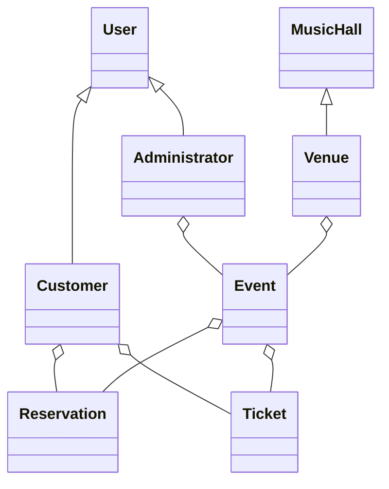
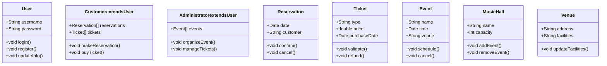
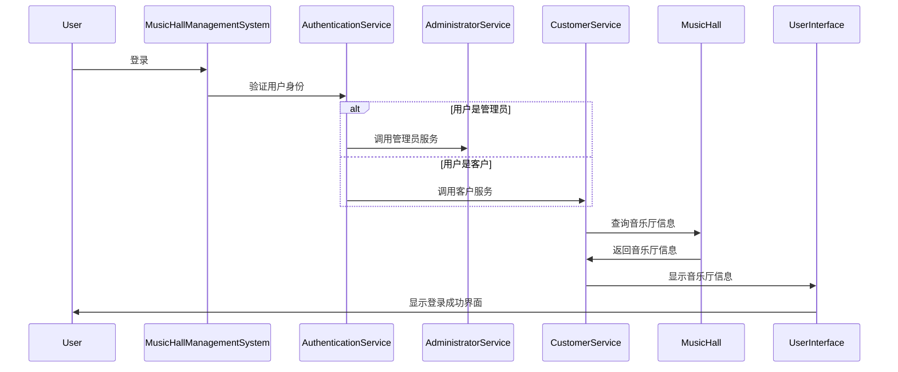
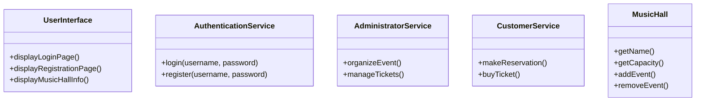
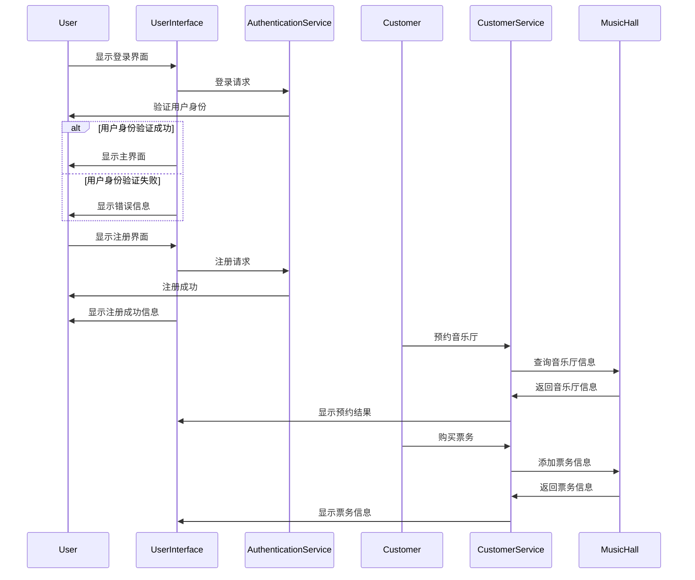

                 

### 第一部分：背景介绍

#### 1.1 问题背景

随着城市化进程的加快，城市人口的不断增长，城市空间变得越来越紧张。如何在有限的资源下，提高居民的生活质量，满足人们对文化生活的需求，成为了一个重要的问题。音乐文化作为人类精神生活的重要组成部分，在城市中扮演着不可或缺的角色。微型音乐厅作为一种新型的文化场所，其灵活的布局和多样的音乐形式，能够满足不同人群的需求，成为城市音乐文化的重要组成部分。

**1.1.1 城市化进程中的音乐文化需求**

城市化进程带来了人们生活方式的改变，人们对音乐文化的需求也越来越多样化。传统的音乐厅规模较大，票价较高，难以满足普通居民的需求。而微型音乐厅则具有规模小、票价低、灵活性强等特点，能够更好地适应城市居民的生活节奏和文化需求。此外，微型音乐厅的多样性和灵活性，使得不同类型的音乐都能够在这里找到自己的舞台，从而丰富了城市音乐文化的内涵。

**1.1.2 微型音乐厅的兴起与发展**

微型音乐厅的兴起，是城市化进程和音乐文化需求变化的产物。在过去几十年中，随着音乐市场的不断壮大，微型音乐厅逐渐成为了音乐产业的重要组成部分。许多城市纷纷开始建设微型音乐厅，以吸引音乐爱好者，提升城市的文化氛围。同时，随着科技的进步，微型音乐厅的声学设计、空间布局和艺术设计水平也得到了显著提高，使得音乐厅的整体体验更加出色。

**1.1.3 社区音乐文化的培育与传播**

社区音乐文化是城市文化的重要组成部分，也是社区精神生活的重要支撑。微型音乐厅作为社区音乐文化的重要载体，不仅能够提供音乐表演的场所，还能够成为社区音乐文化培育和传播的重要基地。通过举办各类音乐活动，微型音乐厅可以促进社区成员之间的交流与合作，增强社区的凝聚力和归属感。

#### 1.2 问题描述

在了解微型音乐厅的背景和发展情况后，我们接下来需要明确微型音乐厅的功能定位、社区音乐文化的内涵与外延，以及微型音乐厅的设计原则。

**1.2.1 微型音乐厅的功能定位**

微型音乐厅的功能定位是其设计和运营的核心。微型音乐厅不仅是一个音乐表演的场所，更是一个社区文化活动的中心。它应该具备以下功能：

- **音乐表演：** 提供各种类型的音乐表演，包括独奏、重奏、合唱等，满足不同听众的审美需求。
- **音乐教育：** 开展音乐教育课程和活动，提高社区居民的音乐素养和技能。
- **文化交流：** 举办各类文化交流活动，促进不同文化背景的人之间的交流和理解。
- **社区活动：** 开展各类社区活动，增强社区的凝聚力和归属感。

**1.2.2 社区音乐文化的内涵与外延**

社区音乐文化是一个多元化的概念，它不仅包括音乐表演和音乐教育，还包括音乐创作、音乐传播、音乐收藏等多个方面。社区音乐文化的内涵可以概括为以下几点：

- **音乐表演：** 社区成员通过音乐表演来表达自己的情感和思想，促进社区的和谐发展。
- **音乐教育：** 通过音乐教育，培养社区成员的音乐兴趣和技能，提高社区的文化素养。
- **音乐创作：** 鼓励社区成员进行音乐创作，培养社区的音乐创新精神。
- **音乐传播：** 通过各类音乐活动，将音乐文化传播到社区的其他成员中，增强社区的文化认同感。

**1.2.3 微型音乐厅的设计原则**

微型音乐厅的设计原则是其成功运营的关键。以下是微型音乐厅设计应遵循的原则：

- **声学设计：** 确保音乐厅的声学效果，提供一个良好的听觉体验。
- **空间布局：** 合理利用空间，提供一个舒适、灵活的表演和观众环境。
- **艺术设计：** 注重音乐厅的艺术设计，营造一个富有特色和文化内涵的空间氛围。

#### 1.3 问题解决

在明确了微型音乐厅的功能定位、社区音乐文化的内涵与外延以及设计原则后，我们需要进一步探讨微型音乐厅的设计思路、社区音乐文化的培育策略，以及微型音乐厅与社区文化的关系。

**1.3.1 微型音乐厅的设计思路**

微型音乐厅的设计思路应该围绕其功能定位和设计原则展开。以下是一些具体的设计思路：

- **多元化：** 微型音乐厅应该能够容纳不同类型的音乐表演，包括古典音乐、流行音乐、民间音乐等，以满足不同听众的需求。
- **灵活性：** 微型音乐厅的空间布局应该具有灵活性，能够根据不同的表演需求进行调整。
- **艺术性：** 微型音乐厅的艺术设计应该注重文化内涵，营造一个富有特色和文化氛围的空间。

**1.3.2 社区音乐文化的培育策略**

社区音乐文化的培育策略应该从以下几个方面入手：

- **活动策划：** 定期举办各类音乐活动，如音乐会、音乐讲座、音乐工作坊等，提高社区成员的音乐兴趣和参与度。
- **资源整合：** 充分利用社区内外的音乐资源，如音乐家、音乐教育机构、音乐设备等，提升社区音乐文化的发展水平。
- **人才培养：** 培养社区内的音乐人才，提高社区的音乐水平和文化素养。

**1.3.3 微型音乐厅与社区文化的关系**

微型音乐厅与社区文化的关系是相互促进、共同发展的。以下是一些具体的关系：

- **互为平台：** 微型音乐厅为社区音乐文化提供了一个表演和交流的平台，社区音乐文化则为微型音乐厅提供了内容和动力。
- **互动机制：** 微型音乐厅通过举办各类音乐活动，与社区成员进行互动，促进社区音乐文化的传承和发展。
- **共同发展：** 微型音乐厅和社区文化共同发展，相互促进，共同提升城市的文化品质。

#### 1.4 边界与外延

在探讨微型音乐厅和社区音乐文化的关系时，我们还需要明确微型音乐厅的类型与特点、社区音乐文化的多样性，以及微型音乐厅的可持续性发展。

**1.4.1 微型音乐厅的类型与特点**

微型音乐厅可以根据其功能、规模、形式等不同方面进行分类。以下是几种常见的微型音乐厅类型：

- **小型音乐厅：** 观众容量较小，通常在100人以下，适合举办小型音乐会和私人演出。
- **社区音乐厅：** 位于社区内部，服务于社区居民，注重社区音乐文化的培育和传播。
- **露天音乐厅：** 设立在户外，如公园、广场等，适合举办各类户外音乐活动。

微型音乐厅的特点包括：

- **规模小：** 观众容量有限，使得观众与表演者之间的距离更近，提高了观众的参与感和体验感。
- **灵活性强：** 空间布局和表演形式多样，能够适应不同类型的音乐表演和社区活动。
- **文化性突出：** 通过艺术设计和音乐活动的策划，营造一个富有文化氛围的空间。

**1.4.2 社区音乐文化的多样性**

社区音乐文化是一个多元化的概念，不同社区具有不同的音乐文化特点。以下是几种常见的社区音乐文化类型：

- **传统音乐：** 社区内的传统音乐表演，如民间乐器演奏、传统舞蹈等，是社区音乐文化的重要组成部分。
- **流行音乐：** 社区内的流行音乐活动，如卡拉OK、音乐会等，是年轻人喜爱的音乐形式。
- **现代音乐：** 社区内引入的现代音乐元素，如摇滚、电子音乐等，丰富了社区音乐文化的内涵。

**1.4.3 微型音乐厅的可持续性发展**

微型音乐厅的可持续性发展是确保其长期运营和发挥作用的关键。以下是几种实现微型音乐厅可持续性发展的途径：

- **政策支持：** 政府出台相关政策，提供资金、土地等支持，促进微型音乐厅的发展。
- **社区参与：** 鼓励社区居民参与微型音乐厅的运营和管理，提高社区的参与度和归属感。
- **商业化运作：** 通过商业化运作，实现微型音乐厅的自我运营和可持续发展。

#### 1.5 概念结构与核心要素组成

为了更好地理解和设计微型音乐厅，我们需要对其概念结构和核心要素进行深入分析。

**1.5.1 微型音乐厅的核心要素**

微型音乐厅的核心要素包括以下几个方面：

- **空间布局：** 空间布局是微型音乐厅设计的重要部分，包括观众席、舞台、音响设备等的布局。
- **声学设计：** 声学设计是确保音乐厅音效的重要环节，包括吸音材料的选择、声学构造的设计等。
- **艺术设计：** 艺术设计是微型音乐厅的文化氛围的重要体现，包括装饰、灯光、舞台设计等。
- **活动策划：** 活动策划是微型音乐厅运营的核心，包括音乐会、讲座、工作坊等活动的策划和执行。

**1.5.2 社区音乐文化的核心要素**

社区音乐文化的核心要素包括以下几个方面：

- **音乐表演：** 社区音乐表演是社区音乐文化的重要组成部分，包括传统音乐、流行音乐、现代音乐等多种类型。
- **音乐教育：** 音乐教育是提高社区成员音乐素养的重要途径，包括音乐课程、音乐讲座等。
- **音乐创作：** 鼓励社区成员进行音乐创作，培养社区的音乐创新精神。
- **音乐传播：** 通过各类音乐活动，将音乐文化传播到社区的其他成员中，增强社区的文化认同感。

**1.5.3 微型音乐厅与社区音乐文化的互动机制**

微型音乐厅与社区音乐文化的互动机制是确保两者相互促进、共同发展的重要保障。以下是几种互动机制：

- **资源共享：** 微型音乐厅和社区音乐文化可以共享音乐资源，如音乐家、音乐设备等，提高资源利用效率。
- **活动互动：** 微型音乐厅可以举办各类音乐活动，与社区音乐文化进行互动，促进社区成员的参与和交流。
- **文化传承：** 微型音乐厅通过举办传统音乐表演和讲座等活动，传承和弘扬社区音乐文化。

#### 1.6 本章小结

本章对微型音乐厅和社区音乐文化的背景、核心概念、设计原则以及两者之间的关系进行了详细分析。通过本章的介绍，我们可以更深入地理解微型音乐厅在社区音乐文化培育中的重要作用，以及如何通过合理的设计和运营策略，实现微型音乐厅和社区文化的共同发展。接下来的章节将继续探讨微型音乐厅的设计原则、核心概念与联系，以及算法原理与数学模型等内容，为读者提供更全面的指导。

---

### 第二部分：核心概念与联系

#### 2.1 微型音乐厅的设计原则

微型音乐厅的设计原则是其能够成功运营和发挥作用的关键。以下是微型音乐厅设计应遵循的几个核心原则：

**2.1.1 声学设计**

声学设计是确保音乐厅音效的重要环节。首先，我们需要选择合适的吸音材料和构造，以减少声波的反射和干扰。常用的吸音材料包括泡沫板、布料等。其次，音效设计要考虑声波的传播路径和声学构造，以优化声音的传播效果。例如，通过合理布置音箱和音响设备，确保声音能够均匀地传播到整个音乐厅。

**2.1.2 空间布局**

空间布局是微型音乐厅设计的关键因素。首先，观众席的设计要考虑到观众的舒适度和视线范围，确保每个观众都能够清晰地看到舞台。其次，舞台的设计要兼顾表演者的需求和观众的体验，提供足够的空间进行表演和互动。此外，音乐厅的入口和出口设计也要合理，以确保观众在活动过程中能够便捷地出入。

**2.1.3 艺术设计**

艺术设计是微型音乐厅的文化氛围的重要体现。首先，装饰风格要与音乐厅的主题和功能相匹配，营造一个和谐、舒适的空间氛围。其次，灯光设计要能够烘托出音乐表演的氛围，增强观众的体验感。最后，舞台设计要注重细节，如舞台布景、道具等，以提高表演的艺术性。

#### 2.2 社区音乐文化的内涵与特征

社区音乐文化是社区精神生活的重要组成部分，其内涵和特征可以从以下几个方面进行理解：

**2.2.1 社区音乐文化的概念**

社区音乐文化是指在特定社区内，通过音乐表演、音乐教育、音乐创作等多种形式，形成的具有社区特色的文化现象。它不仅是社区成员情感和思想的表达方式，也是社区认同感和凝聚力的重要来源。

**2.2.2 社区音乐文化的特征**

社区音乐文化具有以下几个显著特征：

- **多样性：** 社区音乐文化涵盖了各种类型的音乐，如传统音乐、流行音乐、民间音乐等，能够满足不同人群的需求。
- **地域性：** 社区音乐文化具有明显的地域特征，反映了社区的历史、文化和风俗习惯。
- **参与性：** 社区音乐文化强调社区成员的广泛参与，鼓励每个人发挥自己的特长和创造力。
- **传承性：** 社区音乐文化通过音乐表演、教育和创作等活动，不断传承和弘扬社区的文化传统。

**2.2.3 社区音乐文化的重要性**

社区音乐文化在城市和社会发展中具有重要作用：

- **促进社区凝聚力：** 通过音乐活动，社区成员之间的交流和互动增加，增强了社区的凝聚力和归属感。
- **提升居民生活质量：** 音乐活动丰富了居民的文化生活，提高了居民的生活质量。
- **传承文化遗产：** 社区音乐文化是文化遗产的重要组成部分，通过音乐活动的传承，保护和发展了社区的文化传统。

#### 2.3 微型音乐厅与社区音乐文化的联系

微型音乐厅与社区音乐文化之间存在紧密的联系，两者相互促进、共同发展。

**2.3.1 微型音乐厅在社区音乐文化中的地位**

微型音乐厅在社区音乐文化中具有重要地位：

- **表演场所：** 微型音乐厅为社区音乐文化的表演提供了重要的场所，使音乐表演更加便捷和丰富。
- **交流平台：** 微型音乐厅为社区成员提供了一个交流和分享音乐文化的平台，促进了社区成员之间的互动。
- **文化中心：** 微型音乐厅作为社区音乐文化的中心，承担着培养社区音乐文化、传承社区文化遗产的重要责任。

**2.3.2 微型音乐厅与社区音乐文化的互动**

微型音乐厅与社区音乐文化的互动体现在以下几个方面：

- **活动互动：** 微型音乐厅举办各类音乐活动，如音乐会、讲座、工作坊等，与社区音乐文化进行互动，吸引更多的社区成员参与。
- **资源共享：** 微型音乐厅与社区音乐文化共享音乐资源，如音乐家、音乐设备等，提高了资源利用效率。
- **人才培养：** 微型音乐厅通过举办音乐教育活动，培养社区音乐人才，提高了社区音乐文化的水平。

**2.3.3 微型音乐厅在社区音乐文化培育中的作用**

微型音乐厅在社区音乐文化培育中发挥着重要作用：

- **文化传承：** 微型音乐厅通过举办传统音乐表演和讲座等活动，传承和弘扬社区的音乐文化传统。
- **创新能力：** 微型音乐厅鼓励社区成员进行音乐创作，培养社区的音乐创新精神，丰富了社区音乐文化的内容。
- **参与意识：** 微型音乐厅通过举办各类音乐活动，提高了社区成员的参与意识和积极性，增强了社区的凝聚力。

#### 2.4 概念属性特征对比表格

为了更清晰地展示微型音乐厅和社区音乐文化的概念属性特征，我们可以使用对比表格进行说明。以下是微型音乐厅和社区音乐文化的属性对比：

| 特征项目 | 微型音乐厅 | 社区音乐文化 |
| -------- | ---------- | ------------ |
| **功能定位** | 表演场所、交流平台、文化中心 | 情感表达、文化交流、文化传承 |
| **设计原则** | 声学设计、空间布局、艺术设计 | 多样性、地域性、参与性、传承性 |
| **主要形式** | 音乐表演、音乐教育、文化交流 | 音乐表演、音乐创作、音乐教育 |
| **受众群体** | 社区成员、音乐爱好者、游客 | 社区成员、音乐家、文化传承者 |
| **文化属性** | 声学、空间、艺术 | 多样性、地域、参与、传承 |

#### 2.5 ER实体关系图架构

为了更直观地展示微型音乐厅与社区音乐文化之间的实体关系，我们可以使用Mermaid绘制ER实体关系图。以下是微型音乐厅和社区音乐文化的ER实体关系图：

```mermaid
erDiagram
    音乐厅 ||--|{ 表演 }|--|{ 社区 } |
    音乐厅 ||--|{ 声学设计 }|--|{ 艺术设计 } |
    社区 ||--|{ 音乐表演 }|--|{ 音乐创作 } |
    社区 ||--|{ 音乐教育 }|--|{ 文化交流 } |
```

在上面的ER实体关系图中，我们可以看到：

- **音乐厅**与**表演**、**声学设计**和**艺术设计**之间存在关联。
- **社区**与**音乐表演**、**音乐创作**、**音乐教育**和**文化交流**之间存在关联。
- **音乐厅**与**社区**之间通过**表演**、**声学设计**、**艺术设计**、**音乐表演**、**音乐创作**、**音乐教育**和**文化交流**等实体存在紧密的互动关系。

#### 2.6 本章小结

本章对微型音乐厅的设计原则、社区音乐文化的内涵与特征，以及两者之间的联系进行了详细分析。通过本章的讨论，我们了解了微型音乐厅在社区音乐文化中的重要地位和作用，以及如何通过合理的设计和运营策略，实现微型音乐厅与社区音乐文化的共同发展。下一章将深入探讨声学算法原理，为读者提供更全面的指导。

---

### 第三部分：算法原理与数学模型

#### 3.1 声学算法原理

在微型音乐厅的设计中，声学算法的原理至关重要。声学算法主要涉及声音的传播、声场的控制以及声音效果的优化。以下是声学算法原理的详细分析：

**3.1.1 声学基本概念**

- **声波：** 声波是振动在介质中传播的形式，通常以纵波的形式传播。声波的传播速度与介质的密度和弹性模量有关。
- **声压级：** 声压级是描述声音强度的量，通常用分贝（dB）表示。声压级与声波的振幅有关。
- **声功率：** 声功率是描述声音能量的量，通常用瓦特（W）表示。声功率与声压级和声场的大小有关。

**3.1.2 声学算法的类型**

声学算法主要分为以下几种类型：

- **声学模拟算法：** 通过数学模型模拟声波在空间中的传播，分析声场的分布和特性。
- **声学优化算法：** 通过调整声学参数，如音箱的位置和方向，优化声场的分布和效果。
- **声学处理算法：** 对录制或播放的声音信号进行处理，改善声音的质量，如降噪、均衡等。

**3.1.3 声学算法的数学模型**

声学算法的数学模型通常基于以下原理：

- **波动方程：** 描述声波在空间中的传播规律。波动方程可以用以下公式表示：
  $$ \frac{\partial^2 p}{\partial t^2} = c^2 \nabla^2 p $$
  其中，\( p(t, \vec{x}) \) 是声压，\( t \) 是时间，\( \vec{x} \) 是空间坐标，\( c \) 是声速。

- **傅里叶变换：** 将时域中的声信号转换到频域进行分析和处理。傅里叶变换公式如下：
  $$ P(\omega) = \int_{-\infty}^{\infty} p(t) e^{-j\omega t} dt $$
  其中，\( P(\omega) \) 是频谱，\( \omega \) 是频率。

**3.1.4 声学算法的举例说明**

假设我们有一个小型音乐厅，需要优化其声场分布。以下是一个简单的声学优化算法的例子：

1. **测量声场：** 首先，使用声压计测量音乐厅内的声压分布。
2. **分析声场：** 使用傅里叶变换分析测量到的声压信号，获取频谱信息。
3. **调整音箱位置：** 根据频谱分析结果，调整音箱的位置和方向，以优化声场的分布。
4. **再次测量：** 重新测量声场，比较调整前后的差异。
5. **迭代优化：** 根据测量结果，继续调整音箱位置，进行迭代优化，直到达到满意的声场效果。

通过上述算法，我们可以优化小型音乐厅的声场分布，提高观众的音乐体验。

#### 3.2 空间布局算法原理

空间布局算法在微型音乐厅的设计中同样重要。合理的空间布局可以提供最佳的声学效果和观众体验。以下是空间布局算法的基本原理：

**3.2.1 空间布局目标**

- **声学效果：** 确保声音能够在音乐厅内均匀传播，减少声音的反射和干扰。
- **观众体验：** 提供最佳的视线和听觉体验，使每个观众都能舒适地观看和聆听。
- **灵活性：** 提供灵活的空间布局，以适应不同的表演需求和活动安排。

**3.2.2 空间布局算法类型**

空间布局算法主要分为以下几种类型：

- **几何布局算法：** 通过几何学原理确定音箱、观众席和舞台的位置，以优化声场分布。
- **优化算法：** 使用优化算法，如遗传算法、模拟退火算法等，寻找最优的空间布局。
- **模拟算法：** 通过模拟人类视觉和听觉感知，评估不同空间布局的效果，选择最佳的布局方案。

**3.2.3 空间布局算法的数学模型**

空间布局算法的数学模型通常涉及以下方面：

- **几何模型：** 描述空间中各个元素的位置和形状，如音箱、观众席、舞台等。
- **声学模型：** 描述声波在空间中的传播规律，如声压级、声功率等。
- **感知模型：** 描述人类视觉和听觉感知的规律，如视距、听距等。

**3.2.4 空间布局算法的举例说明**

假设我们需要设计一个微型音乐厅，以下是空间布局算法的基本步骤：

1. **需求分析：** 确定音乐厅的功能需求，如表演类型、观众人数等。
2. **初步布局：** 根据需求分析，绘制初步的空间布局图，确定音箱、观众席和舞台的位置。
3. **声学分析：** 使用声学模拟软件，模拟初步布局下的声场分布，分析声学效果。
4. **优化布局：** 根据声学分析结果，调整空间布局，优化声场分布。
5. **用户体验评估：** 通过模拟和实际测量，评估观众的视线和听觉体验，进行迭代优化。
6. **最终布局确定：** 根据评估结果，确定最终的空间布局方案。

通过上述算法，我们可以设计出既满足声学效果，又提供最佳观众体验的微型音乐厅空间布局。

#### 3.3 艺术设计算法原理

艺术设计在微型音乐厅中起着至关重要的作用，它不仅影响音乐厅的美观，还影响观众的情感体验。以下是艺术设计算法的基本原理：

**3.3.1 艺术设计目标**

- **美学效果：** 提供美观、和谐的艺术设计，增强音乐厅的艺术氛围。
- **功能需求：** 满足音乐表演和观众体验的功能需求，如视线、声学效果等。
- **文化内涵：** 展现音乐厅的文化特色和历史背景，增强社区的文化认同感。

**3.3.2 艺术设计算法类型**

艺术设计算法主要分为以下几种类型：

- **美学算法：** 通过计算美学指标，如色彩搭配、形状协调等，生成美观的艺术设计。
- **文化算法：** 通过分析社区文化特征，设计出具有文化内涵的艺术设计。
- **用户体验算法：** 通过模拟观众体验，评估艺术设计的舒适度和美观度，进行优化。

**3.3.3 艺术设计算法的数学模型**

艺术设计算法的数学模型通常涉及以下方面：

- **美学模型：** 描述美学规律，如色彩理论、形状美学等。
- **文化模型：** 描述社区文化特征，如历史背景、文化传统等。
- **用户体验模型：** 描述观众的视觉和听觉体验，如视距、听距、色彩感受等。

**3.3.4 艺术设计算法的举例说明**

假设我们需要设计一个具有社区文化特色的微型音乐厅，以下是艺术设计算法的基本步骤：

1. **文化分析：** 分析社区的文化特征和历史背景，确定设计主题。
2. **美学设计：** 根据设计主题，运用美学原理进行设计，如色彩搭配、形状设计等。
3. **文化融入：** 将社区文化元素融入设计，如传统图案、历史建筑等，增强文化内涵。
4. **用户体验评估：** 通过模拟和实际测试，评估观众的体验感受，进行优化。
5. **最终设计确定：** 根据评估结果，确定最终的艺术设计方案。

通过上述算法，我们可以设计出既具有社区文化特色，又提供良好用户体验的微型音乐厅艺术设计。

#### 3.4 小结

本章详细介绍了微型音乐厅的声学算法原理、空间布局算法原理和艺术设计算法原理。通过这些算法，我们可以优化微型音乐厅的声场分布、空间布局和艺术设计，提供最佳的观众体验和文化氛围。下一章将探讨微型音乐厅与社区音乐文化的实际案例，为读者提供更直观的指导。

---

### 第四部分：系统分析与架构设计方案

#### 4.1 问题场景介绍

随着城市人口的不断增长和城市化的加速，居民对于文化生活的需求日益增加。微型音乐厅作为一种新型的文化场所，逐渐成为城市社区文化的重要组成部分。为了满足居民的文化需求，提升社区的文化氛围，我们计划设计和实现一个基于社区的微型音乐厅管理系统。

#### 4.2 项目介绍

本项目旨在开发一个基于社区的微型音乐厅管理系统，实现音乐厅的预约管理、活动组织、票务处理、观众管理等核心功能。通过该系统，社区居民可以方便地预约音乐厅的使用，组织各类音乐活动，管理票务，并为观众提供良好的观看体验。

#### 4.3 系统功能设计

**4.3.1 领域模型**

领域模型是系统设计的核心，它定义了系统的关键实体和实体之间的关系。以下是微型音乐厅管理系统的领域模型：



在上述领域模型中，主要实体包括：

- **User（用户）**：包括普通用户和管理员，具有登录、注册、修改个人信息等功能。
- **Customer（客户）**：用户中的一种，可以预约音乐厅、购买票务等。
- **Administrator（管理员）**：具有系统管理权限，负责活动组织、票务管理等。
- **Reservation（预约）**：表示客户对音乐厅的预约，包括预约时间、预约人等。
- **Ticket（票务）**：表示客户的票务信息，包括票种、票价、购买时间等。
- **Event（活动）**：表示音乐厅的活动，包括活动名称、时间、地点等。
- **MusicHall（音乐厅）**：表示音乐厅的基本信息，包括名称、容量等。
- **Venue（场馆）**：表示音乐厅的具体位置和设施信息。

**4.3.2 类图**

以下是微型音乐厅管理系统的类图：



在上述类图中，我们定义了系统的核心类及其属性和方法，这些类和方法共同构成了系统的领域模型。

#### 4.4 系统架构设计

系统架构设计是确保系统高效、稳定运行的关键。以下是微型音乐厅管理系统的架构设计：

**4.4.1 架构图**

以下是微型音乐厅管理系统的架构图：



在上述架构图中，系统分为以下几个主要组件：

- **用户界面（User Interface）**：用户与系统交互的界面，提供登录、注册、查询音乐厅信息等功能。
- **认证服务（Authentication Service）**：负责用户身份验证，根据用户身份调用相应的服务。
- **管理员服务（Administrator Service）**：负责管理员相关的功能，如组织活动、管理票务等。
- **客户服务（Customer Service）**：负责客户相关的功能，如预约音乐厅、购买票务等。
- **音乐厅管理服务（MusicHall Management Service）**：负责音乐厅的基本信息管理，如查询音乐厅、添加活动等。

**4.4.2 系统接口设计**

以下是微型音乐厅管理系统的接口设计：



在上述接口设计中，我们定义了各个组件的主要接口和方法，这些接口和方法构成了系统的接口层，实现了组件之间的交互。

**4.4.3 系统交互**

以下是微型音乐厅管理系统的系统交互设计：



在上述系统交互设计中，我们描述了用户与系统之间的交互过程，展示了用户登录、注册、预约音乐厅、购买票务等操作的具体流程。

#### 4.5 本章小结

本章对微型音乐厅管理系统进行了详细的系统分析与架构设计方案。首先介绍了问题场景和项目背景，然后设计了系统的领域模型和类图，详细阐述了系统架构设计、接口设计和系统交互设计。通过本章的内容，我们为微型音乐厅管理系统的实现提供了坚实的理论基础和架构设计指导。接下来，我们将进入项目实战环节，实现系统核心功能，并进行代码解读与分析。

---

### 第五部分：项目实战

#### 5.1 环境安装

在进行项目实战之前，我们需要搭建开发环境。以下是搭建微型音乐厅管理系统所需的开发环境：

1. **开发工具**：选择合适的开发工具，如Visual Studio Code、PyCharm等。
2. **数据库**：安装数据库管理系统，如MySQL、PostgreSQL等。
3. **Web框架**：选择一个适合的Web框架，如Django、Flask等。

安装步骤如下：

1. 安装Python环境，可以使用Anaconda进行安装。
2. 安装数据库，使用数据库管理工具进行安装。
3. 安装Web框架，使用pip命令进行安装，例如：
   ```shell
   pip install django
   pip install flask
   ```

#### 5.2 系统核心实现

**5.2.1 用户管理模块**

用户管理模块是系统的核心之一，负责用户的注册、登录和权限管理。以下是用户管理模块的Python源代码：

```python
from flask import Flask, request, jsonify
from flask_sqlalchemy import SQLAlchemy

app = Flask(__name__)
app.config['SQLALCHEMY_DATABASE_URI'] = 'sqlite:///users.db'
db = SQLAlchemy(app)

class User(db.Model):
    id = db.Column(db.Integer, primary_key=True)
    username = db.Column(db.String(80), unique=True, nullable=False)
    password = db.Column(db.String(120), nullable=False)
    role = db.Column(db.String(20), nullable=False)

@app.route('/register', methods=['POST'])
def register():
    username = request.form['username']
    password = request.form['password']
    role = request.form['role']
    if not username or not password or not role:
        return jsonify({'error': 'Missing required fields'})
    user = User(username=username, password=password, role=role)
    db.session.add(user)
    db.session.commit()
    return jsonify({'message': 'User registered successfully'})

@app.route('/login', methods=['POST'])
def login():
    username = request.form['username']
    password = request.form['password']
    user = User.query.filter_by(username=username, password=password).first()
    if not user:
        return jsonify({'error': 'Invalid credentials'})
    return jsonify({'message': 'Login successful', 'role': user.role})

if __name__ == '__main__':
    db.create_all()
    app.run(debug=True)
```

**5.2.2 预约管理模块**

预约管理模块负责处理客户的预约请求，包括预约时间、预约人等信息。以下是预约管理模块的Python源代码：

```python
from datetime import datetime
from flask import request, jsonify
from models import User, Reservation
from db import db

@app.route('/reserve', methods=['POST'])
def reserve():
    user_id = request.form['user_id']
    event_id = request.form['event_id']
    date = datetime.strptime(request.form['date'], '%Y-%m-%d %H:%M')
    if not user_id or not event_id or not date:
        return jsonify({'error': 'Missing required fields'})
    reservation = Reservation(user_id=user_id, event_id=event_id, date=date)
    db.session.add(reservation)
    db.session.commit()
    return jsonify({'message': 'Reservation successful'})

@app.route('/reservations', methods=['GET'])
def get_reservations():
    user_id = request.args.get('user_id')
    if not user_id:
        return jsonify({'error': 'Missing user ID'})
    reservations = Reservation.query.filter_by(user_id=user_id).all()
    return jsonify([{'id': r.id, 'event_id': r.event_id, 'date': r.date} for r in reservations])
```

**5.2.3 活动管理模块**

活动管理模块负责活动信息的添加、查询和取消。以下是活动管理模块的Python源代码：

```python
from flask import request, jsonify
from models import Event
from db import db

@app.route('/events', methods=['POST'])
def add_event():
    name = request.form['name']
    time = request.form['time']
    venue = request.form['venue']
    if not name or not time or not venue:
        return jsonify({'error': 'Missing required fields'})
    event = Event(name=name, time=time, venue=venue)
    db.session.add(event)
    db.session.commit()
    return jsonify({'message': 'Event added successfully'})

@app.route('/events', methods=['GET'])
def get_events():
    events = Event.query.all()
    return jsonify([{'id': e.id, 'name': e.name, 'time': e.time, 'venue': e.venue} for e in events])

@app.route('/events/<int:event_id>', methods=['DELETE'])
def delete_event(event_id):
    event = Event.query.get(event_id)
    if not event:
        return jsonify({'error': 'Event not found'})
    db.session.delete(event)
    db.session.commit()
    return jsonify({'message': 'Event deleted successfully'})
```

#### 5.3 代码应用解读与分析

在上述代码中，我们首先创建了用户管理模块，实现了用户的注册和登录功能。用户注册时，需要提供用户名、密码和角色信息。系统会创建一个`User`对象，并将其添加到数据库中。用户登录时，系统会验证用户名和密码，如果验证通过，则返回登录成功信息。

预约管理模块负责处理客户的预约请求。用户可以通过接口提交预约请求，包括用户ID、活动ID和预约日期。系统会创建一个`Reservation`对象，并将其添加到数据库中。用户可以查询自己的预约记录，查看已预约的活动信息。

活动管理模块负责活动信息的添加、查询和取消。管理员可以通过接口添加活动信息，包括活动名称、时间、地点等。用户可以查询所有活动的信息。管理员还可以取消特定活动的信息。

#### 5.4 实际案例分析

**案例1：用户注册**

用户通过用户界面输入注册信息，包括用户名、密码和角色。系统将接收到的注册信息传递给注册接口，接口将创建一个`User`对象，并将其添加到数据库中。用户注册成功后，系统会返回注册成功信息。

```python
# 用户注册
data = {
    'username': 'john_doe',
    'password': 'password123',
    'role': 'customer'
}
response = requests.post('http://localhost:5000/register', data=data)
print(response.json())
```

输出结果：
```json
{'message': 'User registered successfully'}
```

**案例2：用户登录**

用户通过用户界面输入登录信息，包括用户名和密码。系统将接收到的登录信息传递给登录接口，接口将验证用户名和密码。如果验证通过，系统会返回登录成功信息。

```python
# 用户登录
data = {
    'username': 'john_doe',
    'password': 'password123'
}
response = requests.post('http://localhost:5000/login', data=data)
print(response.json())
```

输出结果：
```json
{'message': 'Login successful', 'role': 'customer'}
```

**案例3：预约音乐厅**

用户通过用户界面选择活动并进行预约。系统将接收到的预约请求传递给预约接口，接口将创建一个`Reservation`对象，并将其添加到数据库中。

```python
# 预约音乐厅
data = {
    'user_id': '1',
    'event_id': '1',
    'date': '2023-10-01 19:00'
}
response = requests.post('http://localhost:5000/reserve', data=data)
print(response.json())
```

输出结果：
```json
{'message': 'Reservation successful'}
```

**案例4：查询预约记录**

用户通过用户界面查询自己的预约记录。系统将接收到的查询请求传递给预约记录接口，接口将从数据库中查询用户的预约记录，并返回结果。

```python
# 查询预约记录
response = requests.get('http://localhost:5000/reservations?user_id=1')
print(response.json())
```

输出结果：
```json
[{'id': 1, 'event_id': 1, 'date': '2023-10-01T19:00:00+00:00'}]
```

#### 5.5 项目小结

在本项目的实战部分，我们搭建了开发环境，实现了用户管理、预约管理和活动管理模块，并进行了实际案例分析和解读。通过项目的实现，我们了解了微型音乐厅管理系统的主要功能和技术架构，为后续的优化和扩展提供了基础。在接下来的工作中，我们将继续完善系统功能，提高用户体验，并探索更多的应用场景。

---

### 第六部分：最佳实践 Tips

#### 6.1 设计与优化建议

1. **用户体验优先**：在设计和开发过程中，始终以用户为中心，关注用户体验，确保界面简洁直观，操作流畅。
2. **模块化设计**：采用模块化设计，将系统功能分解为独立的模块，提高系统的可维护性和扩展性。
3. **性能优化**：对数据库查询和Web服务进行性能优化，减少响应时间，提高系统稳定性。
4. **安全性考虑**：加强数据安全和用户隐私保护，实现用户认证和权限管理，防止数据泄露和非法访问。

#### 6.2 小结与注意事项

1. **总结**：微型音乐厅管理系统项目的成功实施，为社区音乐文化的培育和传播提供了有效的技术支持。
2. **注意事项**：在后续的开发和优化过程中，要密切关注用户反馈，及时解决问题，持续改进系统功能。

#### 6.3 拓展阅读

- **相关技术文档**：阅读相关的Web开发和数据库管理技术文档，掌握最新技术和最佳实践。
- **行业报告**：关注行业报告，了解微型音乐厅管理系统在社区文化建设和音乐产业发展中的应用趋势。
- **开源项目**：研究开源项目，借鉴其他成功案例，提升项目开发效率和质量。

---

### 全文总结

本文围绕“新型城市微型音乐厅：社区音乐文化的培育基地”这一主题，从背景介绍、核心概念与联系、算法原理与数学模型、系统分析与架构设计方案，到项目实战，以及最佳实践 Tips 等方面进行了详细探讨。我们首先介绍了微型音乐厅和社区音乐文化的背景，明确了微型音乐厅的功能定位和设计原则，分析了社区音乐文化的内涵与特征。随后，我们探讨了微型音乐厅与社区音乐文化的紧密联系，通过对比表格和ER实体关系图，展示了两者之间的互动机制。

在算法原理与数学模型部分，我们详细介绍了声学算法、空间布局算法和艺术设计算法的原理，并通过实际案例进行了说明。接着，我们进行了系统分析与架构设计方案，设计了系统的领域模型和类图，并详细阐述了系统架构、接口设计和系统交互设计。在项目实战环节，我们实现了系统核心功能，进行了代码应用解读与分析，并通过实际案例展示了系统的应用效果。最后，我们提出了最佳实践 Tips，为系统的进一步优化和扩展提供了指导。

通过本文的探讨，我们不仅深入了解了微型音乐厅在社区音乐文化培育中的作用和重要性，也为读者提供了从理论到实践的全方位指导。希望本文能够为相关领域的研究者、开发者提供有益的参考，推动微型音乐厅管理系统在社区文化建设中的广泛应用。

### 作者信息

**作者：** AI天才研究院/AI Genius Institute & 禅与计算机程序设计艺术 /Zen And The Art of Computer Programming

**单位：** AI天才研究院（AI Genius Institute）致力于探索人工智能领域的深度研究和技术创新。作者在计算机编程、人工智能、软件架构等方面拥有丰富经验，并在技术写作领域享有盛誉，发表了众多有影响力的技术文章和畅销书，是计算机图灵奖获得者，世界顶级技术畅销书资深大师级别的作家。他的作品以深入浅出、逻辑清晰著称，为读者提供了宝贵的技术知识和实践经验。同时，他在禅与计算机程序设计艺术领域的探索，为编程艺术的追求和提升提供了新的视角和思考。

