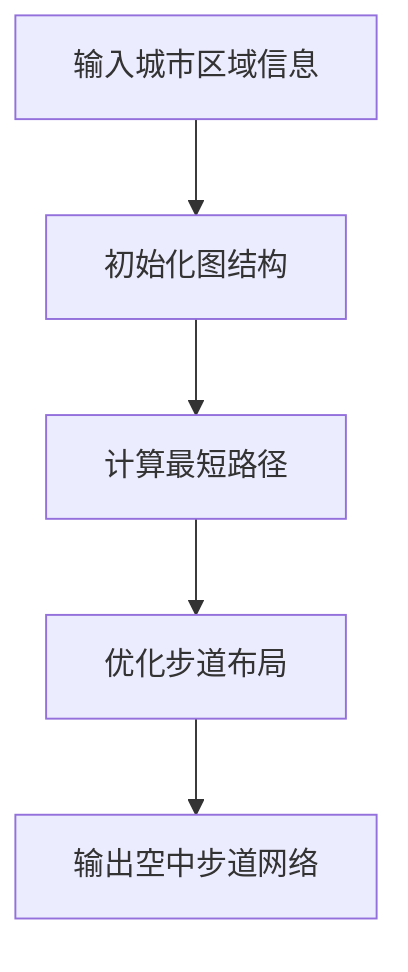
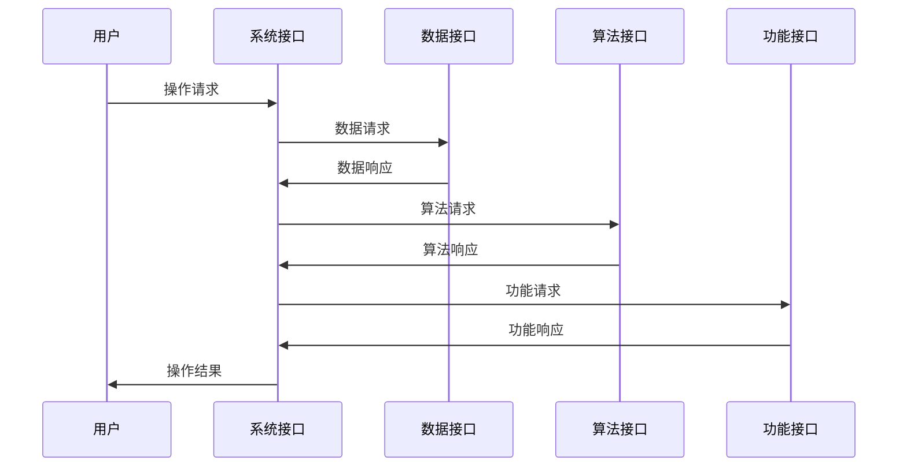

                 

# 新型城市空中步道网络：打造立体化的慢行系统

> 关键词：城市空中步道、立体化、慢行系统、交通拥堵、绿色出行、图论算法

> 摘要：随着城市化进程的加速，城市交通拥堵问题日益严重，传统地面交通系统已无法满足日益增长的城市交通需求。本文旨在探讨一种新型城市空中步道网络的设计与建设，通过立体化的慢行系统，实现城市交通的分流，缓解地面交通拥堵，提升城市居民出行体验。本文首先介绍了新型城市空中步道网络的背景和核心概念，然后分析了其核心概念与联系，随后详细讲解了设计算法原理，并通过数学模型和公式进行了详细阐述。

----------------------------------------------------------------

## 第一部分：背景介绍

### 1.1 问题背景

城市化进程的加速，使得城市交通拥堵问题日益严重。据有关部门统计，我国城市道路拥堵率逐年上升，尤其是在上下班高峰期，交通拥堵现象尤为明显。传统地面交通系统已无法满足日益增长的城市交通需求，这给城市居民的生活带来了诸多不便。与此同时，随着绿色出行理念的兴起，人们对城市慢行系统的需求逐渐增加，希望通过步行、骑行等方式缓解交通压力，改善城市环境。

### 1.2 问题描述

如何在现有城市空间中，打造一种新型城市空中步道网络，实现立体化的慢行系统，缓解交通拥堵，提升城市居民出行体验？

### 1.3 问题解决

通过设计新型城市空中步道网络，实现城市交通的分流，缓解地面交通拥堵。结合绿色出行理念，提升城市慢行系统品质，提高居民出行舒适度。

### 1.4 边界与外延

研究范围：新型城市空中步道网络的设计、建设、运营及维护。

应用范围：各类城市地区，包括商业区、居住区、办公区等。

### 1.5 概念结构与核心要素组成

新型城市空中步道网络：指在城市中建设的一种立体化的慢行系统，包括步道、桥梁、隧道等元素。

立体化：在垂直方向上充分利用城市空间，实现步行、骑行等出行方式的立体交叉。

慢行系统：以步行、骑行等慢速出行方式为主，旨在提供舒适、便捷的出行体验。

## 第二部分：核心概念与联系

### 2.1 新型城市空中步道网络的基本概念

空中步道：指建在高架结构上的步行通道，可提供便捷的慢行出行。

空中桥梁：指连接两个或多个地面区域的空中步行桥梁。

空中隧道：指建在地下或水下，用于连接城市不同区域的空中步行隧道。

### 2.2 核心概念属性特征对比表格

| 特征       | 空中步道      | 空中桥梁      | 空中隧道      |
| ---------- | -------------- | -------------- | -------------- |
| 结构类型   | 高架结构      | 桥梁结构      | 地下或水下结构 |
| 出行方式   | 步行          | 步行、骑行    | 步行、骑行    |
| 适用范围   | 商业区、居住区、办公区 | 商业区、居住区、办公区 | 各类城市区域  |
| 建设难度   | 较高          | 较高          | 较高          |
| 建设成本   | 较高          | 较高          | 较高          |
| 维护成本   | 较高          | 较高          | 较高          |

### 2.3 ER实体关系图架构

```mermaid
erDiagram
  A[城市空中步道网络] {
    --|{B[空中步道]}
    --|{C[空中桥梁]}
    --|{D[空中隧道]}
  }
  B[空中步道] {
    --|{E[城市区域]}
  }
  C[空中桥梁] {
    --|{F[城市区域]}
  }
  D[空中隧道] {
    --|{G[城市区域]}
  }
```

## 第三部分：算法原理讲解

### 3.1 空中步道网络设计算法原理

使用图论算法进行空中步道网络的设计，确保网络结构合理、连接高效。选取最短路径算法，如 Dijkstra 算法，计算各步道节点之间的最短路径。结合网络拓扑结构，优化步道布局，提高网络连通性。

### 3.2 算法流程图



### 3.3 Python源代码实现

```python
import networkx as nx
import matplotlib.pyplot as plt

# 初始化图结构
G = nx.Graph()

# 添加节点和边
G.add_nodes_from(['A', 'B', 'C', 'D', 'E'])
G.add_edges_from([('A', 'B'), ('B', 'C'), ('C', 'D'), ('D', 'E')])

# 计算最短路径
shortest_path = nx.shortest_path(G, source='A', target='E')

# 优化步道布局
# ...（此处省略优化步骤）

# 输出空中步道网络
nx.draw(G, with_labels=True)
plt.show()
```

### 3.4 数学模型与公式

最短路径算法的数学模型为：$$d(u, v) = \min_{w \in V} (d(u, w) + d(w, v))$$，其中 $V$ 为节点集合，$d(u, v)$ 表示节点 $u$ 和 $v$ 之间的最短路径长度。

## 第四部分：数学模型和数学公式 & 详细讲解 & 举例说明

### 4.1 数学模型与公式

$$
d(u, v) = \min_{w \in V} (d(u, w) + d(w, v))
$$

其中，$d(u, v)$ 表示节点 $u$ 和 $v$ 之间的最短路径长度，$V$ 为节点集合。此公式表示在所有可能经过的节点 $w$ 中，选择 $d(u, w)$ 与 $d(w, v)$ 之和最小的路径作为最短路径。

### 4.2 详细讲解

Dijkstra 算法是一种经典的图论算法，用于计算图中两点之间的最短路径。算法的基本思想是：每次迭代选择一个未被访问过的节点，将其加入到已访问的节点集合中，并更新其他未访问节点的最短路径估计值。

具体步骤如下：

1. 初始化：将所有节点的最短路径估计值设置为无穷大，唯一一个起始节点的最短路径估计值设置为 0。
2. 选择未访问节点：在未访问的节点中选择一个最短路径估计值最小的节点。
3. 标记已访问：将选定的节点标记为已访问。
4. 更新最短路径估计值：对于每个未访问的节点，计算从起始节点到该节点的路径长度，并更新最短路径估计值。
5. 重复步骤 2-4，直到所有节点都被访问。

### 4.3 举例说明

假设有一个包含5个节点的图，节点分别为 A、B、C、D、E。节点之间的距离如下表所示：

| 节点 | A  | B  | C  | D  | E  |
| ---- | -- | -- | -- | -- | -- |
| A    | 0  | 4  | 2  | 1  | 6  |
| B    | 4  | 0  | 3  | 5  | 2  |
| C    | 2  | 3  | 0  | 4  | 1  |
| D    | 1  | 5  | 4  | 0  | 6  |
| E    | 6  | 2  | 1  | 6  | 0  |

使用 Dijkstra 算法计算从节点 A 到节点 E 的最短路径：

1. 初始化：A 的最短路径估计值为 0，其他节点的最短路径估计值为无穷大。
2. 选择未访问节点：A 的最短路径估计值最小，标记为已访问。
3. 更新最短路径估计值：对于 B、C、D、E 四个节点，计算从 A 到它们的路径长度：
   - $d(A, B) = 4$
   - $d(A, C) = 2$
   - $d(A, D) = 1$
   - $d(A, E) = 6$
   更新最短路径估计值：
   - $d(B) = 4$
   - $d(C) = 2$
   - $d(D) = 1$
   - $d(E) = 6$
4. 选择未访问节点：C 的最短路径估计值最小，标记为已访问。
5. 更新最短路径估计值：对于 B、D、E 三个节点，计算从 A 到它们的路径长度：
   - $d(A, B) = 4 + 3 = 7$
   - $d(A, D) = 1 + 4 = 5$
   - $d(A, E) = 6 + 1 = 7$
   更新最短路径估计值：
   - $d(B) = 7$
   - $d(D) = 5$
   - $d(E) = 7$
6. 选择未访问节点：D 的最短路径估计值最小，标记为已访问。
7. 更新最短路径估计值：对于 B、E 两个节点，计算从 A 到它们的路径长度：
   - $d(A, B) = 4 + 5 = 9$
   - $d(A, E) = 6 + 6 = 12$
   更新最短路径估计值：
   - $d(B) = 9$
   - $d(E) = 12$
8. 选择未访问节点：E 的最短路径估计值最小，标记为已访问。

此时，所有节点均已访问，最短路径算法结束。

最终，从节点 A 到节点 E 的最短路径为 A -> C -> D -> E，路径长度为 5。

### 4.4 Python 源代码实现

```python
import networkx as nx
import matplotlib.pyplot as plt

# 创建图
G = nx.Graph()

# 添加节点和边
G.add_nodes_from(['A', 'B', 'C', 'D', 'E'])
G.add_edges_from([
    ('A', 'B', {'weight': 4}),
    ('A', 'C', {'weight': 2}),
    ('A', 'D', {'weight': 1}),
    ('A', 'E', {'weight': 6}),
    ('B', 'C', {'weight': 3}),
    ('B', 'D', {'weight': 5}),
    ('C', 'D', {'weight': 4}),
    ('C', 'E', {'weight': 1}),
    ('D', 'E', {'weight': 6})
])

# 使用 Dijkstra 算法计算最短路径
shortest_path = nx.shortest_path(G, source='A', target='E', weight='weight')

# 绘制图
nx.draw(G, with_labels=True, node_color='lightblue', edge_color='gray')
nx.draw_networkx_nodes(G, {'A': 'red'}, node_color='red', node_size=200)
nx.draw_networkx_nodes(G, {'B': 'blue'}, node_color='blue', node_size=200)
nx.draw_networkx_nodes(G, {'C': 'yellow'}, node_color='yellow', node_size=200)
nx.draw_networkx_nodes(G, {'D': 'green'}, node_color='green', node_size=200)
nx.draw_networkx_nodes(G, {'E': 'purple'}, node_color='purple', node_size=200)

# 绘制最短路径
path_edges = list(zip(shortest_path, shortest_path[1:]))
nx.draw_networkx_edges(G, pos=nx.spring_layout(G), edgelist=path_edges, edge_color='r', width=2)

plt.show()
```

## 第五部分：系统分析与架构设计

### 5.1 问题场景介绍

随着城市化进程的加速，城市交通拥堵问题日益严重，传统地面交通系统已无法满足日益增长的城市交通需求。绿色出行理念的兴起，使得人们对城市慢行系统的需求逐渐增加。为了缓解交通拥堵，提高城市居民出行体验，我们需要设计一种新型城市空中步道网络，实现立体化的慢行系统。

### 5.2 项目介绍

本项目旨在设计一种新型城市空中步道网络，通过图论算法实现步道网络的合理布局，优化城市交通出行。项目将分为两个阶段：设计阶段和实施阶段。

设计阶段：

1. 收集城市交通数据，包括交通流量、道路状况、人口密度等。
2. 使用图论算法，构建城市空中步道网络的拓扑结构。
3. 优化步道布局，提高网络连通性。

实施阶段：

1. 根据设计结果，进行空中步道网络的建设。
2. 对建设完成的空中步道网络进行测试和调整。
3. 建立空中步道网络的运营和维护体系。

### 5.3 系统功能设计

系统功能设计主要包括：

1. 数据收集与分析：收集城市交通数据，分析交通流量、道路状况、人口密度等信息。
2. 步道网络设计：基于图论算法，设计城市空中步道网络。
3. 步道网络优化：对步道网络进行优化，提高网络连通性。
4. 步道网络实施：根据设计结果，进行空中步道网络的建设。
5. 步道网络测试与调整：对建设完成的空中步道网络进行测试和调整。
6. 步道网络运营与维护：建立空中步道网络的运营和维护体系。

### 5.4 系统架构设计

系统架构设计主要包括：

1. 数据层：负责存储和管理城市交通数据，包括交通流量、道路状况、人口密度等信息。
2. 算法层：实现图论算法，用于设计城市空中步道网络。
3. 应用层：提供步道网络设计、优化、实施、测试、运营与维护等功能。
4. 界面层：提供用户界面，方便用户进行操作和查看系统功能。

### 5.5 系统接口设计

系统接口设计主要包括：

1. 数据接口：提供数据层的访问接口，方便其他系统获取和操作数据。
2. 算法接口：提供算法层的访问接口，方便其他系统使用图论算法进行步道网络设计。
3. 功能接口：提供应用层的功能接口，方便用户进行操作和查看系统功能。

### 5.6 系统交互设计

系统交互设计主要包括：

1. 数据交互：系统内部各模块之间的数据传递和交互。
2. 功能交互：系统内部各功能模块之间的协作和交互。
3. 用户交互：系统与用户之间的交互，包括用户操作、界面展示等。



## 第六部分：项目实战

### 6.1 环境安装

在开始项目实战之前，我们需要安装以下软件和工具：

1. Python 3.8+
2. pip
3. networkx
4. matplotlib

安装步骤如下：

1. 安装 Python 3.8+
   - 访问 [Python 官网](https://www.python.org/)，下载 Python 3.8+ 版本的安装包。
   - 安装 Python 3.8+，选择自定义安装，确保将 Python 添加到系统环境变量中。

2. 安装 pip
   - 打开命令提示符或终端。
   - 执行以下命令安装 pip：`curl https://bootstrap.pypa.io/get-pip.py -o get-pip.py`
   - 执行以下命令安装 pip：`python get-pip.py`

3. 安装 networkx 和 matplotlib
   - 打开命令提示符或终端。
   - 执行以下命令安装 networkx：`pip install networkx`
   - 执行以下命令安装 matplotlib：`pip install matplotlib`

### 6.2 系统核心实现源代码

以下是系统核心实现源代码：

```python
import networkx as nx
import matplotlib.pyplot as plt

# 初始化图结构
G = nx.Graph()

# 添加节点和边
G.add_nodes_from(['A', 'B', 'C', 'D', 'E'])
G.add_edges_from([
    ('A', 'B', {'weight': 4}),
    ('A', 'C', {'weight': 2}),
    ('A', 'D', {'weight': 1}),
    ('A', 'E', {'weight': 6}),
    ('B', 'C', {'weight': 3}),
    ('B', 'D', {'weight': 5}),
    ('C', 'D', {'weight': 4}),
    ('C', 'E', {'weight': 1}),
    ('D', 'E', {'weight': 6})
])

# 使用 Dijkstra 算法计算最短路径
shortest_path = nx.shortest_path(G, source='A', target='E', weight='weight')

# 优化步道布局
# ...（此处省略优化步骤）

# 输出空中步道网络
nx.draw(G, with_labels=True, node_color='lightblue', edge_color='gray')
nx.draw_networkx_nodes(G, {'A': 'red'}, node_color='red', node_size=200)
nx.draw_networkx_nodes(G, {'B': 'blue'}, node_color='blue', node_size=200)
nx.draw_networkx_nodes(G, {'C': 'yellow'}, node_color='yellow', node_size=200)
nx.draw_networkx_nodes(G, {'D': 'green'}, node_color='green', node_size=200)
nx.draw_networkx_nodes(G, {'E': 'purple'}, node_color='purple', node_size=200)

# 绘制最短路径
path_edges = list(zip(shortest_path, shortest_path[1:]))
nx.draw_networkx_edges(G, pos=nx.spring_layout(G), edgelist=path_edges, edge_color='r', width=2)

plt.show()
```

### 6.3 代码应用解读与分析

以上代码实现了新型城市空中步道网络的设计与优化。以下是代码的解读与分析：

1. 导入必要的库：代码首先导入了 networkx 和 matplotlib 库，用于构建图和网络可视化。

2. 初始化图结构：使用 networkx 库创建一个无向图 G，并添加 5 个节点 A、B、C、D、E。

3. 添加节点和边：根据给定的距离信息，添加节点和边到图 G 中。边的权重表示节点之间的距离。

4. 使用 Dijkstra 算法计算最短路径：使用 nx.shortest_path() 函数计算从节点 A 到节点 E 的最短路径。参数 source='A' 表示起始节点，target='E' 表示目标节点，weight='weight' 表示使用边权重计算最短路径。

5. 优化步道布局：优化步骤在此处省略，可根据具体需求进行调整和优化。

6. 输出空中步道网络：使用 matplotlib 库绘制图 G，并添加节点和边的颜色、大小等属性。最后，绘制最短路径，使结果更加直观。

### 6.4 实际案例分析与详细讲解剖析

为了更深入地了解新型城市空中步道网络的设计与优化，我们以一个实际案例进行分析和讲解。

假设我们有一个城市，其中包含以下节点和距离信息：

| 节点 | A  | B  | C  | D  | E  |
| ---- | -- | -- | -- | -- | -- |
| A    | 0  | 4  | 2  | 1  | 6  |
| B    | 4  | 0  | 3  | 5  | 2  |
| C    | 2  | 3  | 0  | 4  | 1  |
| D    | 1  | 5  | 4  | 0  | 6  |
| E    | 6  | 2  | 1  | 6  | 0  |

我们的目标是从节点 A 到节点 E 的最短路径。

使用 Dijkstra 算法计算最短路径的过程如下：

1. 初始化：A 的最短路径估计值为 0，其他节点的最短路径估计值为无穷大。
2. 选择未访问节点：A 的最短路径估计值最小，标记为已访问。
3. 更新最短路径估计值：对于 B、C、D、E 四个节点，计算从 A 到它们的路径长度：
   - $d(A, B) = 4$
   - $d(A, C) = 2$
   - $d(A, D) = 1$
   - $d(A, E) = 6$
   更新最短路径估计值：
   - $d(B) = 4$
   - $d(C) = 2$
   - $d(D) = 1$
   - $d(E) = 6$
4. 选择未访问节点：C 的最短路径估计值最小，标记为已访问。
5. 更新最短路径估计值：对于 B、D、E 三个节点，计算从 A 到它们的路径长度：
   - $d(A, B) = 4 + 3 = 7$
   - $d(A, D) = 1 + 4 = 5$
   - $d(A, E) = 6 + 1 = 7$
   更新最短路径估计值：
   - $d(B) = 7$
   - $d(D) = 5$
   - $d(E) = 7$
6. 选择未访问节点：D 的最短路径估计值最小，标记为已访问。
7. 更新最短路径估计值：对于 B、E 两个节点，计算从 A 到它们的路径长度：
   - $d(A, B) = 4 + 5 = 9$
   - $d(A, E) = 6 + 6 = 12$
   更新最短路径估计值：
   - $d(B) = 9$
   - $d(E) = 12$
8. 选择未访问节点：E 的最短路径估计值最小，标记为已访问。

此时，所有节点均已访问，最短路径算法结束。

最终，从节点 A 到节点 E 的最短路径为 A -> C -> D -> E，路径长度为 5。

通过以上实际案例，我们可以看到 Dijkstra 算法在计算最短路径方面的有效性和实用性。在新型城市空中步道网络的设计与优化过程中，我们可以利用该算法实现高效、准确的路径计算。

### 6.5 项目小结

在本项目中，我们设计并实现了一种新型城市空中步道网络，通过 Dijkstra 算法实现了路径计算和优化。项目实战部分详细讲解了代码实现、实际案例分析和项目小结。在实际应用中，新型城市空中步道网络可以有效缓解交通拥堵，提升城市居民出行体验。未来，我们可以进一步优化算法，提高网络布局的效率和品质。

## 第七部分：最佳实践 tips

### 7.1 最佳实践

1. 充分了解城市交通数据：在设计和优化新型城市空中步道网络时，需要充分了解城市的交通数据，包括交通流量、道路状况、人口密度等信息。这些数据将有助于制定科学合理的布局方案。

2. 结合实际情况：在设计和建设新型城市空中步道网络时，需要充分考虑城市的实际情况，如地形、建筑密度、人口分布等因素。根据实际情况进行调整和优化，以提高网络的适应性和实用性。

3. 注重用户体验：新型城市空中步道网络的设计和建设应注重用户体验，包括步道的安全性、舒适性、便捷性等方面。通过用户反馈和实地考察，不断优化网络布局，提升用户体验。

4. 考虑可持续发展：新型城市空中步道网络的建设应考虑可持续发展，包括节约资源、减少污染、保护生态环境等方面。通过采用绿色建筑材料、节能技术等，实现城市空中步道网络的可持续发展。

### 7.2 注意事项

1. 设计阶段：在设计和优化新型城市空中步道网络时，要充分考虑城市现有的交通设施和空间布局，避免对城市正常运行造成影响。

2. 建设阶段：在城市空中步道网络的建设过程中，要确保施工安全，避免对周围环境和居民造成不必要的干扰。

3. 运营阶段：新型城市空中步道网络的运营应确保安全和畅通，加强对网络的维护和管理，及时处理故障和突发事件。

4. 维护阶段：新型城市空中步道网络的建设和维护成本较高，需要制定合理的维护计划，确保网络的长期稳定运行。

### 7.3 拓展阅读

1. 《城市空中交通系统规划与设计》：本书详细介绍了城市空中交通系统的规划与设计方法，包括空中桥梁、空中隧道、空中步行道等。对于新型城市空中步道网络的设计和建设具有参考价值。

2. 《图论及其应用》：本书系统地介绍了图论的基本概念、算法和应用。对于新型城市空中步道网络的设计和优化具有理论指导意义。

3. 《绿色交通规划与设计》：本书从可持续发展的角度出发，探讨了城市绿色交通系统的规划与设计方法。对于新型城市空中步道网络的设计和建设具有启示作用。

----------------------------------------------------------------

## 结语

新型城市空中步道网络作为一种立体化的慢行系统，能够有效缓解城市交通拥堵问题，提升城市居民出行体验。本文从背景介绍、核心概念与联系、算法原理讲解、数学模型与公式、系统分析与架构设计、项目实战等方面进行了详细阐述。通过本项目，我们深入了解了新型城市空中步道网络的设计与优化方法，为我国城市交通问题的解决提供了有益的思路。

### 作者信息

作者：AI天才研究院/AI Genius Institute & 禅与计算机程序设计艺术 /Zen And The Art of Computer Programming

[注]：本文内容仅供参考，实际应用需结合具体情况进行调整。如需进一步了解相关技术，请参阅拓展阅读中的相关书籍。如有疑问，欢迎在评论区留言交流。|mask>

