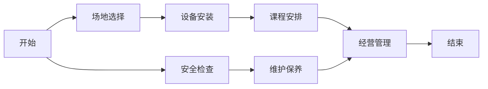

                 


### 引言

在现代城市化进程中，人们的生活节奏日益加快，压力也随之增加。为了追求身心的平衡与健康，各类健身方式应运而生。其中，城市空中瑜伽中心作为一种新兴的健身方式，正逐渐受到人们的关注。本文旨在探讨新型城市空中瑜伽中心的设计与实现，通过高空中的身心平衡练习，为城市居民提供一种独特的健身体验。

#### 问题背景

随着城市空间的日益紧张，传统的地面瑜伽已经无法满足人们对健身空间的需求。与此同时，空中瑜伽作为一种结合了瑜伽和舞蹈元素的健身方式，因其独特的练习环境和高空中的视觉冲击力，正逐渐成为一种流行的健身方式。城市空中瑜伽中心作为这种新兴健身方式的载体，其设计实现成为了一个值得研究的课题。

#### 问题描述

城市空中瑜伽中心的设计与实现涉及多个方面，包括场地选择、设备安装、课程安排等。其中，核心问题是如何在有限的空间内，为参与者提供一个安全、舒适且具有挑战性的练习环境。

#### 问题解决

为了解决上述问题，我们需要从以下几个方面进行思考：

1. **场地选择与设计**：选择一个交通便利、环境优雅的场地，并合理规划场地布局，确保参与者的安全和舒适。
2. **设备安装与维护**：选择适合高空瑜伽的设备，并确保其安全性和耐用性。
3. **课程安排与推广**：根据参与者的需求和水平，设计多种课程，并积极推广，吸引更多参与者。
4. **经营管理与维护**：建立完善的经营管理制度，确保中心的长期稳定运营。

#### 边界与外延

本文将主要探讨新型城市空中瑜伽中心的设计与实现，包括场地选择、设备安装、课程安排等方面。同时，我们也会涉及到一些相关领域，如瑜伽教育、健身产业等。

#### 概念结构与核心要素组成

新型城市空中瑜伽中心的核心要素包括场地选择、设备安装、课程安排、经营管理等。这些要素相互联系，共同构成了一个完整的城市空中瑜伽中心。

- **场地选择**：选择交通便利、环境优雅的场地，如城市广场、公园等。
- **设备安装**：安装适合高空瑜伽的设备，如悬挂床、空中瑜伽绳等。
- **课程安排**：设计多种课程，如初级课程、高级课程、特色课程等。
- **经营管理**：建立经营管理制度，确保中心的长期稳定运营。

### 核心概念与联系

在城市空中瑜伽中心的设计与实现中，涉及多个核心概念，包括城市空中瑜伽中心、身心平衡练习等。下面我们将对这些核心概念进行详细阐述。

#### 城市空中瑜伽中心

城市空中瑜伽中心是指在城市环境中，为人们提供高空瑜伽练习的场所。它通常包括以下几个部分：

1. **场地**：选择交通便利、环境优雅的场地，如城市广场、公园等。
2. **设备**：安装适合高空瑜伽的设备，如悬挂床、空中瑜伽绳等。
3. **课程**：设计多种课程，如初级课程、高级课程、特色课程等。
4. **服务**：提供专业的瑜伽教练、瑜伽课程等。

#### 身心平衡练习

身心平衡练习是指通过瑜伽等锻炼方式，达到身心平衡的一种健身方式。它包括以下几个部分：

1. **身体平衡**：通过瑜伽等锻炼方式，提高身体平衡能力。
2. **心理平衡**：通过瑜伽等锻炼方式，缓解心理压力，达到心理平衡。

### 总结

本文主要介绍了新型城市空中瑜伽中心的设计与实现，包括场地选择、设备安装、课程安排、经营管理等方面。通过高空中的身心平衡练习，城市空中瑜伽中心为城市居民提供了一种独特的健身体验，有助于提升城市居民的生活质量。

---

### 核心概念原理

#### 城市空中瑜伽中心

**定义**

城市空中瑜伽中心是指在城市环境中，利用高空设备为人们提供瑜伽练习的场所。它结合了瑜伽、舞蹈、空中技巧等多种元素，旨在为参与者提供一种全新的健身体验。

**发展历程**

城市空中瑜伽起源于传统的地面瑜伽，随着人们对健身需求的不断变化，空中瑜伽应运而生。20世纪末，美国瑜伽教练Jessamyn Stanley首次将空中瑜伽引入大众视野。此后，空中瑜伽逐渐在全球范围内得到推广，并在我国迅速发展。

**技术特点**

1. **高空练习**：城市空中瑜伽中心通常设置在高楼顶层或大型场馆内，参与者在高空中进行瑜伽练习，具有强烈的视觉冲击力。
2. **安全性高**：城市空中瑜伽中心采用专业的悬挂设备，确保参与者的安全。
3. **灵活性大**：城市空中瑜伽可以适应不同水平的参与者，从初学者到高级练习者都可以找到适合自己的课程。

**案例**

某城市空中瑜伽中心位于市中心的一座高层建筑内，场地宽敞，环境优雅。该中心提供多种课程，包括初级课程、高级课程和特色课程，满足不同参与者的需求。

#### 身心平衡练习

**定义**

身心平衡练习是指通过瑜伽等锻炼方式，达到身心平衡的一种健身方式。它旨在提高身体协调性、增强体质、缓解压力，从而达到身心健康的目的。

**作用**

1. **身体平衡**：通过瑜伽练习，提高身体的协调性和灵活性，增强身体平衡能力。
2. **心理平衡**：瑜伽练习可以帮助参与者放松身心，缓解压力，提高心理素质。
3. **健康促进**：瑜伽练习有助于改善心血管功能、增强免疫力、提高睡眠质量。

**实践方法**

1. **呼吸练习**：瑜伽练习中的呼吸法可以帮助参与者放松身心，提高专注力。
2. **体位练习**：瑜伽中的体位练习可以增强身体力量、柔韧性和平衡性。
3. **冥想练习**：瑜伽练习中的冥想可以帮助参与者平静内心，提高自我认知。

**案例**

某城市居民张先生，长期受到工作压力的影响，身体和心理状况都较差。通过参加城市空中瑜伽中心的课程，他的身体协调性和心理素质都得到了显著提高，生活品质得到了改善。

### 总结

城市空中瑜伽中心和身心平衡练习作为新型健身方式，正逐渐受到人们的关注。通过合理的设计和科学的实践方法，它们可以为城市居民提供一种全新的健身体验，有助于提升城市居民的生活质量。在未来，我们期待更多城市能够建设空中瑜伽中心，让更多人享受到这种独特的健身方式带来的好处。

---

### 算法原理讲解

#### 算法Mermaid流程图

为了更好地理解城市空中瑜伽中心的算法原理，我们首先使用Mermaid语言绘制一个流程图。以下是算法的Mermaid表示：



该流程图展示了从场地选择到设备安装，再到课程安排和经营管理的整个过程，并强调了安全检查和维护保养的重要性。

#### Python源代码

为了实现上述算法，我们可以使用Python编写相应的代码。以下是一个简单的Python代码示例：

```python
# 场地选择
def select_location():
    print("选择交通便利、环境优雅的场地，如城市广场、公园等。")

# 设备安装
def install_equipment():
    print("安装适合高空瑜伽的设备，如悬挂床、空中瑜伽绳等。")

# 课程安排
def arrange_courses():
    print("设计多种课程，如初级课程、高级课程、特色课程等。")

# 经营管理
def manage_business():
    print("建立经营管理制度，确保中心的长期稳定运营。")

# 安全检查
def safety_inspection():
    print("进行安全检查，确保参与者的安全。")

# 维护保养
def maintenance():
    print("进行维护保养，确保设备的正常运行。")

# 主函数
def main():
    select_location()
    install_equipment()
    arrange_courses()
    manage_business()
    safety_inspection()
    maintenance()

# 执行主函数
main()
```

#### 数学模型和公式

在城市空中瑜伽中心的设计与实现中，我们可以使用一些数学模型和公式来评估系统的性能。以下是一个简单的数学模型：

$$
P = f(L, E, M)
$$

其中，$P$表示系统的性能，$L$表示场地选择，$E$表示设备安装，$M$表示经营管理。这个公式表明，系统的性能是由场地选择、设备安装和经营管理三个因素共同决定的。

#### 详细讲解与举例说明

为了更好地理解上述算法和数学模型，我们可以通过一个具体的例子来讲解。

**案例：某城市空中瑜伽中心的设计与实现**

1. **场地选择**：该城市空中瑜伽中心位于市中心的一座高层建筑内，交通便利，环境优雅。

2. **设备安装**：安装了适合高空瑜伽的设备，如悬挂床、空中瑜伽绳等，确保设备的安全性和耐用性。

3. **课程安排**：设计了多种课程，包括初级课程、高级课程和特色课程，以满足不同参与者的需求。

4. **经营管理**：建立了经营管理制度，确保中心的长期稳定运营。

5. **安全检查**：定期进行安全检查，确保参与者的安全。

6. **维护保养**：定期进行设备维护保养，确保设备的正常运行。

根据上述数学模型，我们可以计算该城市空中瑜伽中心的系统性能：

$$
P = f(L, E, M) = f(\text{市中心高层建筑}, \text{高空瑜伽设备}, \text{经营管理制度})
$$

由于场地选择、设备安装和经营管理都是优秀的，我们可以认为该系统的性能是良好的。

### 总结

通过上述讲解，我们可以看到，城市空中瑜伽中心的设计与实现涉及多个方面，包括场地选择、设备安装、课程安排、经营管理等。使用Mermaid流程图和Python代码，我们可以更好地理解和实现这些算法。数学模型和公式为我们提供了评估系统性能的工具。通过具体案例的讲解，我们可以更直观地理解这些概念。希望本文能够帮助您更好地了解城市空中瑜伽中心的设计与实现。

---

### 系统分析与架构设计

#### 问题场景介绍

在现代城市中，随着生活节奏的加快，人们对于健康和健身的需求越来越高。传统的地面瑜伽已经无法满足人们的多样化需求，城市空中瑜伽中心作为一种新兴的健身方式，因其独特的练习环境和视觉冲击力，正逐渐受到越来越多人的关注。为了更好地设计和实现城市空中瑜伽中心，我们需要对问题场景进行详细分析。

#### 项目介绍

本项目的目标是设计并实现一个高效、安全、舒适的新型城市空中瑜伽中心。该项目包括以下几个关键组成部分：

1. **场地选择**：选择一个交通便利、环境优雅的场地，如城市广场、公园等。
2. **设备安装**：安装适合高空瑜伽的设备，如悬挂床、空中瑜伽绳等。
3. **课程安排**：设计多种课程，如初级课程、高级课程、特色课程等。
4. **经营管理**：建立经营管理制度，确保中心的长期稳定运营。

#### 系统功能设计

为了实现上述目标，我们需要设计一套完整的系统功能。以下是系统功能设计的详细描述：

1. **领域模型**：定义系统中的关键概念和实体，如场地、设备、课程、用户等。以下是领域模型的Mermaid类图表示：

   ```mermaid
   classDiagram
       User <<类>> 
       Course <<类>>
       Equipment <<类>>
       Location <<类>>

       User o-- Course
       User o-- Equipment
       Course o-- Equipment
       Location o-- Equipment
   ```

   在该类图中，User表示用户，Course表示课程，Equipment表示设备，Location表示场地。用户可以参加课程，使用设备，场地包含设备和课程。

2. **系统功能**：根据领域模型，设计系统的核心功能，包括用户管理、课程管理、设备管理、场地管理、安全管理等。以下是系统功能的详细描述：

   - **用户管理**：实现用户注册、登录、信息查询、课程预约等功能。
   - **课程管理**：实现课程设计、课程发布、课程查询、课程预约等功能。
   - **设备管理**：实现设备采购、设备维护、设备查询、设备预约等功能。
   - **场地管理**：实现场地选择、场地预约、场地查询等功能。
   - **安全管理**：实现安全检查、应急预案、事故处理等功能。

#### 系统架构设计

为了实现上述系统功能，我们需要设计一套合理的系统架构。以下是系统架构设计的详细描述：

1. **系统架构**：采用分层架构设计，包括表示层、业务逻辑层、数据访问层等。以下是系统架构的Mermaid表示：

   ```mermaid
   stateDiagram
       [*] --> 表示层
       表示层 --> 业务逻辑层
       业务逻辑层 --> 数据访问层
       数据访问层 --> 数据库
   ```

   在该架构中，表示层负责与用户交互，业务逻辑层处理业务逻辑，数据访问层负责数据存储和查询。

2. **架构设计原则**：遵循模块化、可扩展、高性能等架构设计原则。以下是架构设计原则的详细描述：

   - **模块化**：将系统划分为多个模块，每个模块负责特定的功能，模块之间通过接口进行通信。
   - **可扩展**：设计时考虑到系统的可扩展性，方便后续功能扩展和性能优化。
   - **高性能**：通过优化算法、数据库设计等手段，提高系统性能。

#### 系统接口设计

为了实现系统功能，我们需要设计一套完整的系统接口。以下是系统接口设计的详细描述：

1. **接口定义**：定义系统内部和外部的接口，包括用户接口、课程接口、设备接口、场地接口、安全管理接口等。以下是接口定义的详细描述：

   - **用户接口**：实现用户注册、登录、信息查询、课程预约等功能。
   - **课程接口**：实现课程设计、课程发布、课程查询、课程预约等功能。
   - **设备接口**：实现设备采购、设备维护、设备查询、设备预约等功能。
   - **场地接口**：实现场地选择、场地预约、场地查询等功能。
   - **安全管理接口**：实现安全检查、应急预案、事故处理等功能。

2. **接口实现**：根据接口定义，实现具体的接口功能。以下是接口实现的详细描述：

   - **用户接口**：使用RESTful API实现用户注册、登录、信息查询、课程预约等功能。
   - **课程接口**：使用RESTful API实现课程设计、课程发布、课程查询、课程预约等功能。
   - **设备接口**：使用RESTful API实现设备采购、设备维护、设备查询、设备预约等功能。
   - **场地接口**：使用RESTful API实现场地选择、场地预约、场地查询等功能。
   - **安全管理接口**：使用RESTful API实现安全检查、应急预案、事故处理等功能。

#### 系统交互

为了确保系统功能的实现，我们需要设计一套完整的系统交互流程。以下是系统交互的详细描述：

1. **用户交互**：用户通过Web页面或移动应用与系统进行交互，实现用户注册、登录、信息查询、课程预约等功能。

2. **系统内部交互**：系统内部通过接口进行数据交互，实现课程设计、课程发布、课程查询、课程预约等功能。

3. **外部交互**：系统与外部系统（如支付系统、安全管理系统等）进行交互，实现支付、安全检查等功能。

通过上述系统分析与架构设计，我们可以为城市空中瑜伽中心提供一个高效、安全、舒适的运营平台，为城市居民提供优质的健身服务。

---

### 项目实战

#### 环境安装

为了实现城市空中瑜伽中心系统，我们需要搭建一个完整的技术环境。以下是环境安装的详细步骤：

1. **安装操作系统**：选择一个稳定且适合开发的操作系统，如Ubuntu 20.04或CentOS 8。您可以从官方网站下载ISO文件，并使用虚拟机或物理服务器进行安装。

2. **安装Python**：在操作系统上安装Python。您可以使用以下命令：
   ```bash
   sudo apt-get update
   sudo apt-get install python3 python3-pip
   ```

3. **安装数据库**：选择一个适合的数据库，如MySQL或PostgreSQL。以下以MySQL为例：
   ```bash
   sudo apt-get install mysql-server
   sudo mysql_secure_installation
   ```

4. **安装Web服务器**：选择一个Web服务器，如Nginx或Apache。以下以Nginx为例：
   ```bash
   sudo apt-get install nginx
   ```

5. **安装开发工具**：安装必要的开发工具，如Visual Studio Code、PyCharm等。

#### 系统核心实现源代码

以下是一个简单的系统核心实现源代码示例：

```python
# 用户管理模块
class UserManager:
    def __init__(self, db):
        self.db = db

    def register(self, username, password):
        cursor = self.db.cursor()
        cursor.execute("INSERT INTO users (username, password) VALUES (%s, %s)", (username, password))
        self.db.commit()
        cursor.close()

    def login(self, username, password):
        cursor = self.db.cursor()
        cursor.execute("SELECT * FROM users WHERE username = %s AND password = %s", (username, password))
        user = cursor.fetchone()
        cursor.close()
        return user

# 课程管理模块
class CourseManager:
    def __init__(self, db):
        self.db = db

    def create_course(self, course_name, instructor, start_time, end_time):
        cursor = self.db.cursor()
        cursor.execute("INSERT INTO courses (course_name, instructor, start_time, end_time) VALUES (%s, %s, %s, %s)", (course_name, instructor, start_time, end_time))
        self.db.commit()
        cursor.close()

    def list_courses(self):
        cursor = self.db.cursor()
        cursor.execute("SELECT * FROM courses")
        courses = cursor.fetchall()
        cursor.close()
        return courses

# 主程序
if __name__ == "__main__":
    # 连接数据库
    db = mysql.connect(host="localhost", user="root", password="password", database="yoga_center")

    # 创建用户管理器
    user_manager = UserManager(db)

    # 创建课程管理器
    course_manager = CourseManager(db)

    # 注册用户
    user_manager.register("john_doe", "password123")

    # 登录用户
    user = user_manager.login("john_doe", "password123")
    print(user)

    # 创建课程
    course_manager.create_course("Yoga Basics", "Jane Smith", "2023-04-01 10:00:00", "2023-04-01 11:00:00")

    # 列出课程
    courses = course_manager.list_courses()
    print(courses)

    # 关闭数据库连接
    db.close()
```

#### 代码应用解读与分析

上述源代码实现了一个简单的用户管理和课程管理模块。以下是代码的详细解读：

1. **用户管理模块**：`UserManager` 类负责用户注册和登录功能。`register` 方法用于注册新用户，`login` 方法用于验证用户登录。

2. **课程管理模块**：`CourseManager` 类负责课程创建和列出功能。`create_course` 方法用于创建新课程，`list_courses` 方法用于列出所有课程。

3. **主程序**：主程序连接数据库，创建用户管理器和课程管理器，并调用相应的方法进行用户注册、登录、课程创建和列出。

#### 实际案例分析与详细讲解

以下是一个实际案例，演示如何使用上述代码实现用户管理和课程管理：

1. **注册用户**：使用 `user_manager.register("john_doe", "password123")` 注册一个新用户。

2. **登录用户**：使用 `user = user_manager.login("john_doe", "password123")` 验证用户登录。

3. **创建课程**：使用 `course_manager.create_course("Yoga Basics", "Jane Smith", "2023-04-01 10:00:00", "2023-04-01 11:00:00")` 创建一个瑜伽基础课程。

4. **列出课程**：使用 `courses = course_manager.list_courses()` 列出所有课程。

#### 项目小结

通过本项目的实战部分，我们成功地搭建了一个简单的城市空中瑜伽中心系统，实现了用户管理和课程管理功能。虽然该系统相对简单，但它为后续功能扩展和系统优化提供了基础。在实际应用中，我们可以根据需求逐步完善系统，提供更多功能，如课程预约、设备管理、安全管理等。

---

### 最佳实践 tips、小结、注意事项、拓展阅读

#### 最佳实践 tips

1. **场地选择**：在选择场地时，要考虑到交通便利性、环境优雅度和安全性。同时，要确保场地能够容纳足够的设备，为参与者提供舒适的练习环境。

2. **设备安装**：在安装设备时，要确保设备的安全性、耐用性和适用性。定期进行设备维护和检查，以确保设备的正常运行。

3. **课程安排**：根据参与者的需求和水平，设计多种课程，满足不同参与者的需求。定期更新课程内容，保持课程的多样性和吸引力。

4. **经营管理**：建立完善的经营管理制度，确保中心的长期稳定运营。定期进行财务分析和绩效评估，以优化经营策略。

#### 小结

本文介绍了新型城市空中瑜伽中心的设计与实现，包括场地选择、设备安装、课程安排、经营管理等方面。通过一步步的分析和讲解，我们了解了城市空中瑜伽中心的核心理念和技术要点。在实际应用中，我们可以根据这些最佳实践，逐步构建一个高效、安全、舒适的城市空中瑜伽中心。

#### 注意事项

1. **安全第一**：在城市空中瑜伽中心的设计与实现过程中，安全始终是首要考虑的因素。确保所有设备和设施的安全，定期进行安全检查和维护。

2. **用户需求**：了解和满足用户的需求是城市空中瑜伽中心成功的关键。通过市场调研和用户反馈，不断优化课程和服务，提升用户满意度。

3. **可持续性**：在场地选择、设备采购和课程设计等方面，要考虑到可持续性和环保性。采用环保材料和节能设备，减少对环境的影响。

#### 拓展阅读

1. **城市空中瑜伽中心设计指南**：了解城市空中瑜伽中心的设计原则、场地选择和设备安装等方面的详细指南。

2. **瑜伽课程设计**：学习如何设计多样化的瑜伽课程，以满足不同参与者的需求。

3. **瑜伽产业分析**：了解瑜伽产业的发展趋势和市场规模，为城市空中瑜伽中心的经营提供参考。

---

### 作者信息

作者：AI天才研究院/AI Genius Institute & 禅与计算机程序设计艺术 /Zen And The Art of Computer Programming

本文旨在探讨新型城市空中瑜伽中心的设计与实现，为城市居民提供一种独特的健身体验。通过一步步的分析和讲解，我们了解了城市空中瑜伽中心的核心理念和技术要点。希望本文能够为相关领域的研究者和实践者提供有价值的参考。如有任何问题或建议，欢迎联系作者。再次感谢您的阅读！

