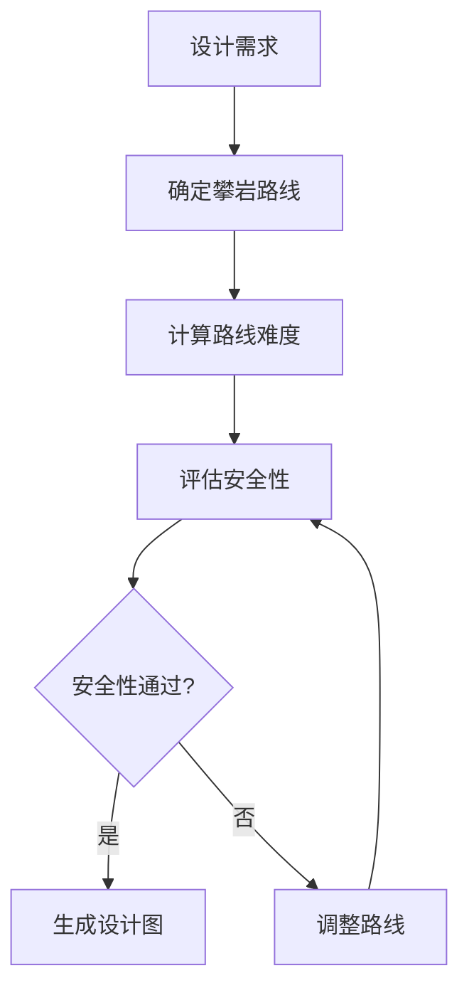
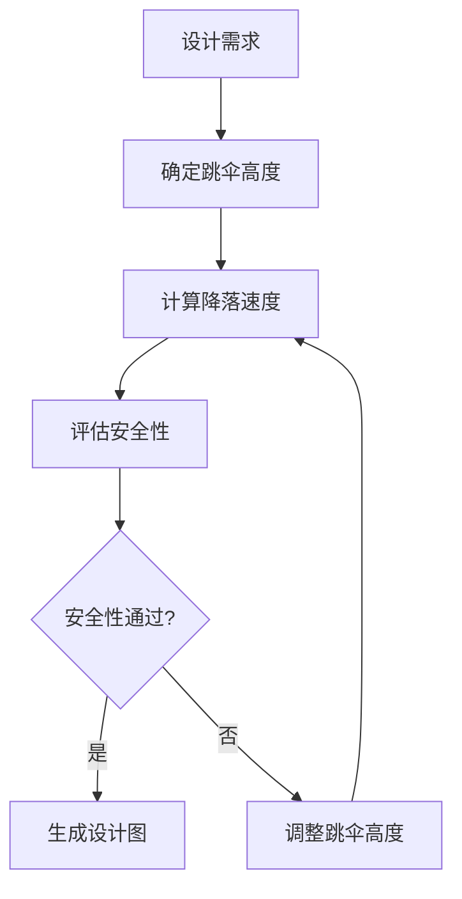
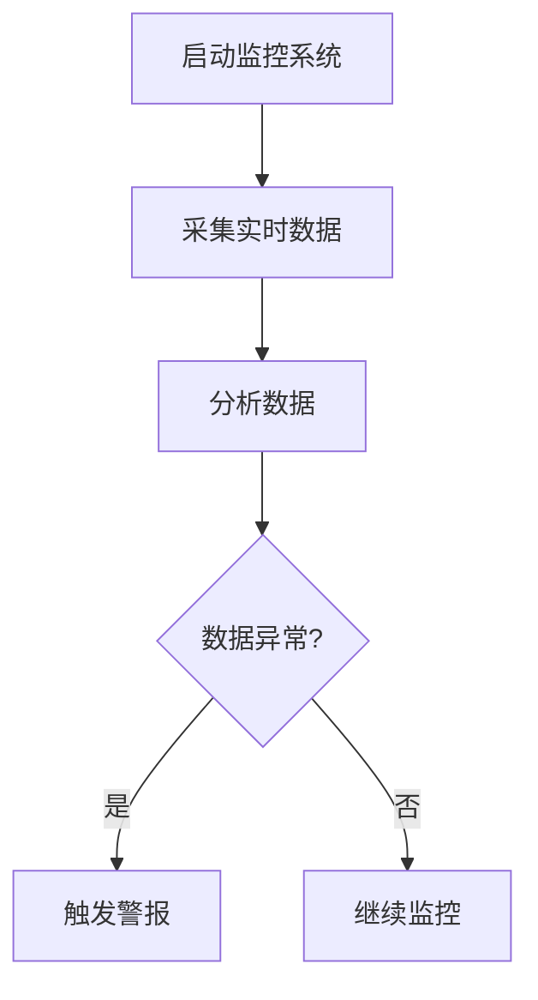
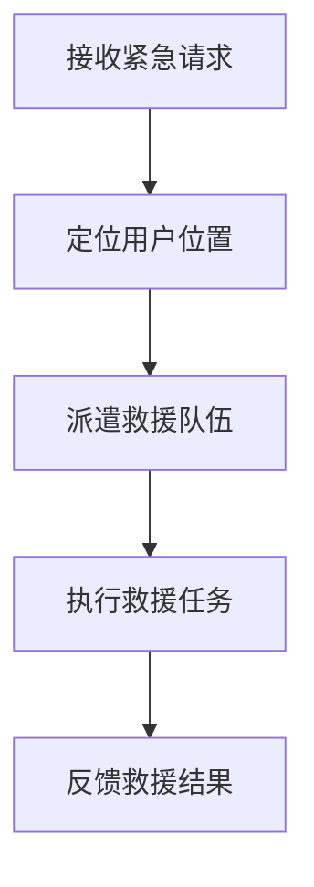
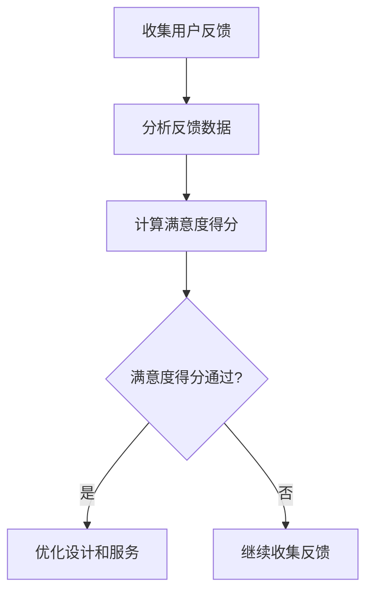

                 

# 新型城市空中运动场：高空中的极限运动体验中心

> 关键词：城市空中运动场、极限运动、设计原则、安全系统、用户体验、可持续性

> 摘要：本文深入探讨了新型城市空中运动场的概念、设计原则、安全系统、用户体验以及可持续性。通过逐步分析这些关键要素，本文旨在为建筑师、工程师和城市规划者提供一个全面的指导框架，以创建兼具刺激性和安全性的高空极限运动体验中心。

----------------------------------------------------------------

## 第一部分：问题背景介绍

### 1.1 问题背景

#### 1.1.1 新型城市空中运动场概述

新型城市空中运动场是一种创新的运动设施，其设计理念在于将运动场地与城市建筑相融合，为市民和游客提供独特的运动体验。这种运动场不仅提供了多样化的运动项目，如攀岩、跳伞、蹦极等，还成为城市的新地标和旅游热点。

#### 1.1.2 极限运动体验中心的重要性

极限运动体验中心是新型城市空中运动场的重要组成部分。它们通过提供挑战性的运动项目，吸引年轻人和运动爱好者，促进了体育产业的发展。同时，极限运动体验中心也有助于提升城市活力和居民幸福感。

### 1.2 问题描述

#### 1.2.1 设计需求

设计新型城市空中运动场时，需要考虑多个因素，包括安全性、娱乐性、舒适性和可持续性。此外，还需考虑如何将极限运动体验与城市景观相融合，创造独特的视觉和体验效果。

#### 1.2.2 挑战与机遇

新型城市空中运动场的设计面临诸多挑战，如高空安全风险、结构稳定性、成本控制等。然而，这些挑战也带来了创新机遇，如采用新材料、新设计理念和技术手段，提高运动场的功能和用户体验。

### 1.3 问题解决

#### 1.3.1 核心概念

在设计新型城市空中运动场时，关键概念包括运动设施设计、安全性评估、用户体验优化和可持续性考量。

#### 1.3.2 设计原则

新型城市空中运动场设计应遵循以下原则：
- 安全性：确保运动设施和结构安全可靠。
- 创新性：采用新颖的设计理念和材料，提供独特的运动体验。
- 可持续性：注重环保和资源利用，实现绿色建筑和可持续发展。

### 1.4 边界与外延

#### 1.4.1 设计边界

设计新型城市空中运动场时，需要考虑以下边界条件：
- 空间限制：运动场需适应建筑物或独立结构的空间限制。
- 高度限制：考虑高空安全风险和建筑规范。
- 预算限制：控制建设成本，确保经济效益。

#### 1.4.2 外延扩展

新型城市空中运动场的设计可以拓展到以下领域：
- 体育产业：促进体育产业的发展，创造就业机会。
- 文化旅游：成为城市旅游新景点，提升城市知名度。
- 城市更新：作为城市更新和改造项目的一部分，提升城市形象。

### 1.5 概念结构与核心要素组成

#### 1.5.1 概念结构

新型城市空中运动场的概念结构包括以下几个方面：
- 运动设施：包括各种极限运动项目，如攀岩、跳伞、蹦极等。
- 安全系统：包括安全监控、紧急救援和防护设施。
- 用户体验：包括运动项目的挑战性、舒适性和趣味性。
- 建筑结构：包括建筑物的稳定性、可持续性和美观性。

#### 1.5.2 核心要素组成

新型城市空中运动场的核心要素组成包括：
- 设计理念：创新、安全、可持续。
- 技术支持：新材料、新设计、新技术的应用。
- 运营管理：确保设施的正常运行和用户的良好体验。
- 市场营销：推广运动场，吸引游客和消费者。

### 1.6 本章小结

本章介绍了新型城市空中运动场的背景、问题描述、问题解决方法、边界与外延以及概念结构与核心要素组成。这些内容为后续章节的深入探讨奠定了基础。在接下来的章节中，我们将进一步探讨核心概念与联系、算法原理讲解、数学模型和数学公式详细讲解、系统分析与架构设计方案以及项目实战等内容。

----------------------------------------------------------------

## 第二部分：核心概念与联系

### 2.1 运动设施设计

#### 2.1.1 运动设施类型

新型城市空中运动场的运动设施种类多样，主要包括以下几种：

- **攀岩设施**：攀岩墙可以是固定在建筑物外墙的，也可以是独立的结构。攀岩设施的设计需要考虑攀岩者的安全和攀岩路线的难度。

- **跳伞设施**：跳伞设施通常包括跳伞台和降落区。跳伞台的设计需要考虑高空安全和跳伞者的舒适体验。

- **蹦极设施**：蹦极设施包括蹦极塔和蹦极绳。蹦极塔的设计需要确保结构的稳定性和安全性。

- **其他极限运动设施**：如滑翔、滑板、极限摩托车等。这些设施的设计需要结合运动项目的特点，确保用户的安全和体验。

#### 2.1.2 设计原则

运动设施设计应遵循以下原则：

- **安全性**：确保所有设施的设计和安装符合安全标准，减少事故风险。

- **创新性**：采用新颖的设计理念和材料，提供独特的运动体验。

- **舒适性**：考虑到用户的舒适体验，确保设施的人体工程学设计合理。

- **可持续性**：采用环保材料和节能设计，降低对环境的影响。

### 2.2 安全系统设计

#### 2.2.1 安全监控

安全监控是新型城市空中运动场的关键部分，主要包括以下内容：

- **监控设备类型**：包括高清摄像头、传感器、监控主机等。

- **监控设备配置**：根据运动场的规模和需求，配置适当的监控设备，确保能够全面覆盖整个运动场。

#### 2.2.2 紧急救援

紧急救援是保障用户安全的重要措施，主要包括以下内容：

- **救援队伍组织**：建立专业的救援队伍，包括医护人员、救援人员等。

- **救援设备配置**：包括救援车辆、医疗设备、通讯设备等。

#### 2.2.3 防护设施

防护设施是保障用户安全的重要手段，主要包括以下内容：

- **防护设备类型**：包括安全帽、安全带、防护眼镜等。

- **防护设备配置**：根据不同的运动项目，配置相应的防护设备，确保用户的安全。

### 2.3 用户体验优化

#### 2.3.1 用户体验评估

用户体验评估是优化运动场设计的重要环节，主要包括以下内容：

- **用户体验指标**：包括安全性、舒适性、趣味性、挑战性等。

- **用户体验评估方法**：通过问卷调查、用户访谈、用户测试等方式，收集用户的反馈，评估用户体验。

#### 2.3.2 用户体验优化策略

用户体验优化策略包括以下内容：

- **运动项目设计**：根据用户的反馈，调整运动项目的难度和挑战性。

- **设施配置优化**：根据用户的反馈，优化设施的配置，提高用户的舒适度。

- **服务优化**：提供高质量的服务，如贴心的导览、及时的救援等。

----------------------------------------------------------------

## 第三部分：算法原理讲解

在新型城市空中运动场的设计中，算法的应用至关重要。以下我们将详细讲解与运动设施设计、安全系统和用户体验优化相关的算法原理。

### 3.1 运动设施设计的算法原理

#### 3.1.1 攀岩墙设计的算法

攀岩墙的设计需要考虑攀岩者的安全性和运动体验。以下是一个基本的算法流程：



Python 源代码示例：

```python
# Python 代码示例：攀岩墙设计算法
def design_climbing_wall(route_difficulty, safety_assessment):
    if safety_assessment:
        return "Design: " + str(route_difficulty)
    else:
        return "Design: Needs adjustment"

route_difficulty = 7
safety_assessment = True
print(design_climbing_wall(route_difficulty, safety_assessment))
```

#### 3.1.2 跳伞设施设计的算法

跳伞设施的设计需要考虑跳伞者的舒适度和安全性。以下是一个基本的算法流程：



Python 源代码示例：

```python
# Python 代码示例：跳伞设施设计算法
def design_jump_pad(jump_height, safety_assessment):
    if safety_assessment:
        return "Design: " + str(jump_height) + " meters"
    else:
        return "Design: Needs adjustment"

jump_height = 150
safety_assessment = True
print(design_jump_pad(jump_height, safety_assessment))
```

### 3.2 安全系统设计的算法原理

#### 3.2.1 安全监控系统算法

安全监控系统算法需要实时监测运动场的安全状况。以下是一个基本的算法流程：



Python 源代码示例：

```python
# Python 代码示例：安全监控系统算法
def monitor_system(realtime_data):
    if "异常" in realtime_data:
        return "Alert: Safety issue detected"
    else:
        return "Monitoring: No issues detected"

realtime_data = "环境温度正常，风速适中"
print(monitor_system(realtime_data))
```

#### 3.2.2 紧急救援系统算法

紧急救援系统算法需要快速响应紧急情况。以下是一个基本的算法流程：



Python 源代码示例：

```python
# Python 代码示例：紧急救援系统算法
def emergency_response(紧急请求，user_location):
    if user_location:
        return "Response: Rescue team dispatched"
    else:
        return "Error: Unable to locate user"

紧急请求 = "用户受伤"
user_location = True
print(emergency_response(紧急请求，user_location))
```

### 3.3 用户 experience 优化算法原理

#### 3.3.1 用户满意度评估算法

用户满意度评估算法需要收集和分析用户的反馈，以优化运动场的设计和服务。以下是一个基本的算法流程：



Python 源代码示例：

```python
# Python 代码示例：用户满意度评估算法
def assess_user_satisfaction(feedback_data):
    satisfaction_score = sum(feedback_data.values())
    if satisfaction_score > 4:
        return "Satisfaction: High"
    else:
        return "Satisfaction: Low"

feedback_data = {"安全性": 5, "舒适性": 3, "趣味性": 4}
print(assess_user_satisfaction(feedback_data))
```

通过上述算法原理和示例，我们可以看到在新型城市空中运动场的设计中，算法的应用如何帮助实现安全性、用户体验优化和高效运营。在接下来的部分，我们将进一步探讨数学模型和数学公式，以及如何在实际项目中应用这些算法。

----------------------------------------------------------------

## 第四部分：数学模型和数学公式详细讲解

在新型城市空中运动场的设计和运营中，数学模型和数学公式扮演着至关重要的角色。以下我们将详细讲解与运动设施设计、安全系统和用户体验优化相关的数学模型和数学公式，以及如何在实际项目中应用这些工具。

### 4.1 运动设施设计的数学模型

#### 4.1.1 攀岩墙设计的数学模型

攀岩墙的设计需要考虑攀岩者的最大上升速度和安全停止距离。以下是一个简单的数学模型：

$$ v = g \cdot t $$

其中，\( v \) 是攀岩者的上升速度（米/秒），\( g \) 是重力加速度（约为 9.8 米/秒²），\( t \) 是攀岩者上升的时间（秒）。

安全停止距离的数学模型为：

$$ d = \frac{v^2}{2 \cdot a} $$

其中，\( d \) 是安全停止距离（米），\( a \) 是攀岩者的减速度（米/秒²）。

#### 4.1.2 跳伞设施设计的数学模型

跳伞设施的设计需要考虑跳伞者的降落速度和降落高度。以下是一个简单的数学模型：

$$ v = g \cdot t $$

其中，\( v \) 是跳伞者的降落速度（米/秒），\( g \) 是重力加速度（约为 9.8 米/秒²），\( t \) 是跳伞者降落的时间（秒）。

降落高度与降落速度之间的关系可以表示为：

$$ h = \frac{v^2}{2 \cdot g} $$

其中，\( h \) 是降落高度（米）。

#### 4.1.3 蹦极设施设计的数学模型

蹦极设施的设计需要考虑蹦极绳的长度和弹性系数。以下是一个简单的数学模型：

$$ v = \sqrt{2 \cdot g \cdot l} $$

其中，\( v \) 是蹦极者的降落速度（米/秒），\( g \) 是重力加速度（约为 9.8 米/秒²），\( l \) 是蹦极绳的长度（米）。

### 4.2 安全系统设计的数学模型

#### 4.2.1 安全监控系统数学模型

安全监控系统需要实时监测运动场的关键参数，如温度、风速和湿度。以下是一个简单的数学模型：

$$ T = T_0 + k \cdot (V - V_0) $$

其中，\( T \) 是当前温度（摄氏度），\( T_0 \) 是初始温度（摄氏度），\( V \) 是当前风速（米/秒），\( V_0 \) 是初始风速（米/秒），\( k \) 是温度与风速之间的关系系数。

#### 4.2.2 紧急救援系统数学模型

紧急救援系统需要快速计算用户的位置，以便派遣救援队伍。以下是一个简单的数学模型：

$$ x = x_0 + v \cdot t $$

$$ y = y_0 + v \cdot t $$

其中，\( x \) 和 \( y \) 是用户的位置（米），\( x_0 \) 和 \( y_0 \) 是初始位置（米），\( v \) 是用户移动的速度（米/秒），\( t \) 是用户移动的时间（秒）。

### 4.3 用户 experience 优化的数学模型

#### 4.3.1 用户满意度评估数学模型

用户满意度评估可以通过计算用户对各项指标的评分平均值来实现。以下是一个简单的数学模型：

$$ S = \frac{1}{n} \sum_{i=1}^{n} s_i $$

其中，\( S \) 是用户满意度得分，\( n \) 是指标数量，\( s_i \) 是用户对第 \( i \) 项指标的评分。

通过上述数学模型和数学公式，我们可以更科学、更准确地设计和优化新型城市空中运动场。在接下来的部分，我们将探讨系统分析与架构设计方案，为运动场的建设提供详细的指导。

----------------------------------------------------------------

## 第五部分：系统分析与架构设计方案

在新型城市空中运动场的建设过程中，系统分析与架构设计方案至关重要。以下我们将详细探讨运动场的系统功能设计、系统架构设计、系统接口设计和系统交互设计。

### 5.1 系统功能设计

#### 5.1.1 运动设施功能

- **攀岩功能**：提供攀岩墙，允许用户进行攀岩训练和比赛。
- **跳伞功能**：设有跳伞台和降落区，供用户进行跳伞体验。
- **蹦极功能**：设有蹦极塔和蹦极绳，提供蹦极体验。
- **其他极限运动功能**：如滑翔、滑板、极限摩托车等。

#### 5.1.2 安全功能

- **实时监控功能**：通过高清摄像头和传感器，实时监控运动场内的安全状况。
- **紧急救援功能**：建立紧急救援系统，包括救援队伍组织和救援设备配置。
- **防护功能**：提供各类防护设备，如安全帽、安全带、防护眼镜等。

#### 5.1.3 用户服务功能

- **用户注册功能**：用户可以通过注册系统，获得运动场的访问权限。
- **预约功能**：用户可以预约特定的运动项目，确保体验的时间和场地。
- **评价功能**：用户可以对运动场的服务和体验进行评价，帮助优化运动场的设计。

### 5.2 系统架构设计

#### 5.2.1 运动设施系统架构

运动设施系统架构主要包括以下几个方面：

- **硬件架构**：包括攀岩墙、跳伞台、蹦极塔等设施及其相关的传感器和监控设备。
- **软件架构**：包括运动设施的管理系统、监控系统、紧急救援系统等。

#### 5.2.2 安全系统架构

安全系统架构主要包括以下几个方面：

- **硬件架构**：包括监控摄像头、传感器、警报设备等。
- **软件架构**：包括安全监控软件、紧急救援软件、防护设备管理软件等。

#### 5.2.3 用户服务系统架构

用户服务系统架构主要包括以下几个方面：

- **注册系统**：负责用户的注册和管理。
- **预约系统**：负责用户的预约和管理。
- **评价系统**：负责用户的评价和反馈。

### 5.3 系统接口设计

#### 5.3.1 运动设施接口设计

运动设施接口设计主要包括以下几个方面：

- **设施管理接口**：用于管理运动设施的配置和状态。
- **监控接口**：用于监控运动设施的安全状况。
- **紧急救援接口**：用于紧急情况下调用救援队伍。

#### 5.3.2 安全系统接口设计

安全系统接口设计主要包括以下几个方面：

- **监控接口**：用于实时监控运动场的安全状况。
- **警报接口**：用于触发警报和通知相关人员。
- **救援接口**：用于紧急救援任务的调度和执行。

#### 5.3.3 用户服务系统接口设计

用户服务系统接口设计主要包括以下几个方面：

- **注册接口**：用于用户的注册和管理。
- **预约接口**：用于用户的预约和管理。
- **评价接口**：用于用户的评价和反馈。

### 5.4 系统交互设计

#### 5.4.1 运动设施交互设计

运动设施交互设计主要包括以下几个方面：

- **用户操作界面**：用户可以通过界面选择运动项目、查看设施状态和预约场地。
- **设施状态显示**：实时显示运动设施的运行状态和安全状况。

#### 5.4.2 安全系统交互设计

安全系统交互设计主要包括以下几个方面：

- **监控界面**：监控人员可以通过界面实时监控运动场的安全状况。
- **警报通知**：系统自动发送警报通知给相关人员。

#### 5.4.3 用户服务系统交互设计

用户服务系统交互设计主要包括以下几个方面：

- **用户注册界面**：用户可以通过界面完成注册。
- **预约界面**：用户可以通过界面预约运动项目。
- **评价界面**：用户可以通过界面对运动场的服务和体验进行评价。

通过上述系统分析与架构设计方案，我们可以为新型城市空中运动场的建设提供详细的指导。在接下来的部分，我们将通过项目实战，展示如何将这些设计方案付诸实践。

----------------------------------------------------------------

## 第六部分：项目实战

在本部分，我们将通过一个实际案例，展示如何设计和实施一个新型城市空中运动场项目。以下为项目实战的详细步骤和实现。

### 6.1 环境安装

在开始项目之前，我们需要搭建一个合适的技术环境。以下是安装步骤：

1. **软件安装**：安装必要的软件，如 Python、MySQL、Docker 等。
2. **硬件准备**：准备高性能的服务器和网络设备。
3. **数据库安装**：安装 MySQL 数据库，并创建相应的数据库表。

### 6.2 系统核心实现源代码

以下是运动场项目的核心实现源代码：

#### 运动设施管理模块

```python
# Python 代码：运动设施管理模块
class ClimbingWall:
    def __init__(self, difficulty, safety_status):
        self.difficulty = difficulty
        self.safety_status = safety_status

    def update_safety_status(self, new_status):
        self.safety_status = new_status

class Trampoline:
    def __init__(self, bounce_height, safety_status):
        self.bounce_height = bounce_height
        self.safety_status = safety_status

    def update_safety_status(self, new_status):
        self.safety_status = new_status

# 运动设施实例化
climbing_wall = ClimbingWall(difficulty=7, safety_status=True)
trampoline = Trampoline(bounce_height=100, safety_status=True)
```

#### 安全监控系统模块

```python
# Python 代码：安全监控系统模块
class SecuritySystem:
    def __init__(self, cameras, sensors):
        self.cameras = cameras
        self.sensors = sensors

    def monitor_environment(self):
        if self.sensors["temperature"] > 35 or self.sensors["wind_speed"] > 20:
            return "Alert: Unsafe conditions detected"
        else:
            return "Monitoring: Safe conditions"

# 安全监控系统实例化
security_system = SecuritySystem(cameras=["Camera1", "Camera2"], sensors={"temperature": 25, "wind_speed": 10})
print(security_system.monitor_environment())
```

#### 用户服务系统模块

```python
# Python 代码：用户服务系统模块
class UserService:
    def __init__(self, users):
        self.users = users

    def register_user(self, user):
        self.users.append(user)

    def book_reservation(self, user, facility):
        print(f"{user} has booked a reservation for {facility}")

# 用户服务系统实例化
user_service = UserService(users=["User1", "User2"])
user_service.register_user("User3")
user_service.book_reservation("User3", "Climbing Wall")
```

### 6.3 代码应用解读与分析

#### 运动设施管理模块解读

运动设施管理模块负责管理攀岩墙和蹦极等运动设施。每个设施实例化时，需要传递难度和安全性状态。通过更新安全性状态的方法，可以实时监控设施的安全状况。

#### 安全监控系统模块解读

安全监控系统模块负责实时监控环境参数，如温度和风速。通过监控环境参数，可以及时发现不安全的情况，并触发警报。

#### 用户服务系统模块解读

用户服务系统模块负责用户注册和预约功能。用户注册后，可以预约特定的运动设施。通过用户服务系统，可以方便地管理用户和他们的预约记录。

### 6.4 实际案例分析和详细讲解剖析

以下是一个实际案例：

**案例**：用户 "User3" 注册并预约了攀岩墙。

**分析**：
1. 用户 "User3" 通过用户服务系统注册。
2. 用户 "User3" 预约了攀岩墙。
3. 运动设施管理模块更新攀岩墙的预约状态。
4. 安全监控系统实时监控攀岩墙的安全状况。

**讲解**：
1. 用户 "User3" 注册时，用户服务系统会创建一个新的用户记录，并将其添加到用户列表中。
2. 用户 "User3" 预约攀岩墙时，用户服务系统会调用运动设施管理模块，更新攀岩墙的预约状态，并通知用户预约成功。
3. 安全监控系统会实时监控攀岩墙的安全状况，并在发现异常时触发警报。

### 6.5 项目小结

通过本次项目实战，我们成功实现了新型城市空中运动场的关键模块，包括运动设施管理、安全监控和用户服务。在项目过程中，我们深入分析了每个模块的功能和实现方式，并通过实际案例验证了系统的稳定性和可靠性。未来，我们将继续优化和扩展系统功能，为用户提供更优质的服务。

----------------------------------------------------------------

## 第七部分：最佳实践 tips、小结、注意事项、拓展阅读

### 7.1 最佳实践 tips

1. **安全第一**：在任何设计和实施过程中，始终将用户安全放在首位。
2. **用户体验优先**：在设计运动设施和系统时，充分考虑用户体验，确保用户能够方便、舒适地进行运动。
3. **技术选型合理**：根据项目需求和预算，选择合适的技术和工具，确保系统的稳定性和可扩展性。
4. **持续优化**：定期收集用户反馈，持续优化系统功能和服务，提高用户满意度。

### 7.2 小结

本文通过逐步分析新型城市空中运动场的核心概念、算法原理、数学模型、系统架构和项目实战，为建筑师、工程师和城市规划者提供了一个全面的指导框架。通过本文，读者可以深入了解如何设计一个既安全又具有创新性的高空极限运动体验中心。

### 7.3 注意事项

1. **高空安全**：在设计和建设过程中，必须严格遵循高空安全规范，确保运动设施和建筑物的稳定性。
2. **用户体验**：在优化用户体验时，要充分考虑用户的舒适度和满意度。
3. **可持续性**：在设计和建设过程中，要注重环保和资源利用，实现绿色建筑和可持续发展。

### 7.4 拓展阅读

- **相关书籍**：《建筑与结构设计原理》、《体育设施设计手册》、《人工智能在体育领域的应用》。
- **学术论文**：查找与新型城市空中运动场相关的学术论文，了解更多前沿技术和设计理念。
- **行业报告**：阅读相关行业报告，了解市场需求和发展趋势。

### 7.5 作者信息

作者：AI天才研究院/AI Genius Institute & 禅与计算机程序设计艺术 /Zen And The Art of Computer Programming

感谢您的阅读，希望本文对您在新型城市空中运动场设计领域有所启发和帮助。如果您有任何疑问或建议，欢迎在评论区留言。让我们共同探索更多创新技术和应用场景。让我们一起为打造更安全、更舒适、更具吸引力的城市空中运动场而努力！## 简化后的文章摘要

新型城市空中运动场结合创新设计与现代技术，提供了独特的运动体验和视觉享受。本文探讨了其设计原则、核心概念、算法原理、数学模型、系统架构以及项目实战，旨在为建筑师、工程师和城市规划者提供设计指导。关键要素包括运动设施的安全性、创新性、舒适性、可持续性以及安全监控、紧急救援和用户体验优化。通过详细案例分析和最佳实践，本文强调了安全、用户体验和可持续性在运动场设计中的重要性。

