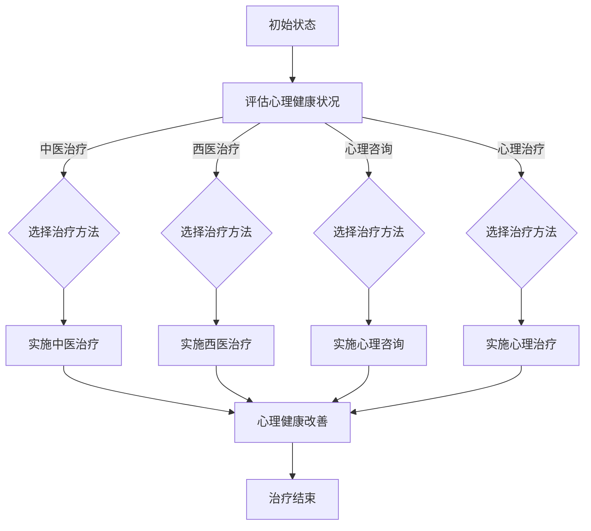
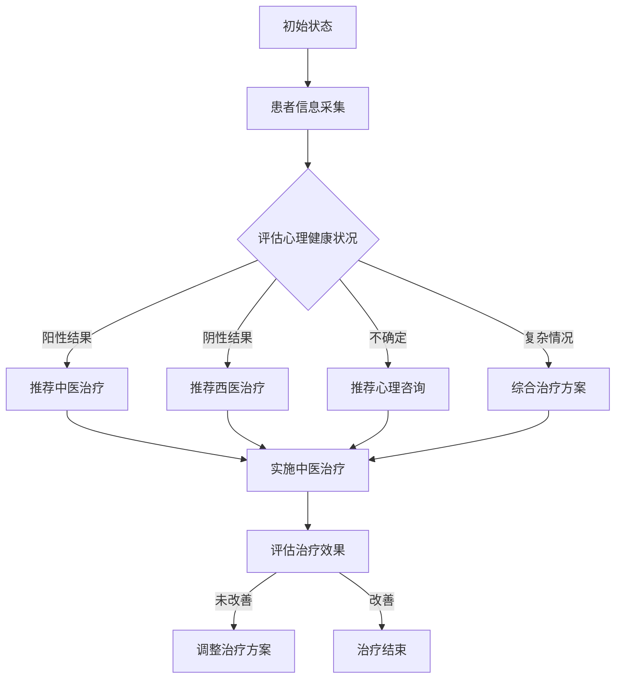
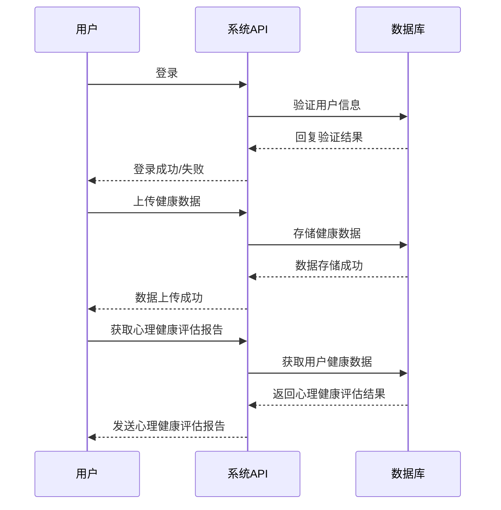

                 

### 新型精神医疗：整合东西方智慧的心理健康实践

> 关键词：新型精神医疗、东西方智慧、心理健康、中医、西医、心理咨询、心理治疗

> 摘要：本文旨在探讨新型精神医疗的构建，通过整合东西方智慧，实现心理健康实践的优化。文章从背景介绍、核心概念与联系以及算法原理讲解三个部分展开，旨在为读者提供一种全新的心理健康治疗思路。

#### 第一部分：背景介绍与核心概念

##### 1. 问题背景

心理健康问题在全球范围内都备受关注。随着现代社会生活节奏的加快、工作压力的增大以及精神压力的累积，越来越多的人面临着心理健康问题。精神医疗作为一种专业治疗方法，旨在通过药物、心理治疗等方式帮助患者恢复心理健康。然而，传统的精神医疗方法在疗效、副作用、适用范围等方面仍存在一定局限性。

##### 2. 问题描述

近年来，东西方文化在精神医疗领域的交流和融合日益加深。如何将东西方精神医疗的优势相结合，为患者提供更全面、更有效的治疗手段，成为一个亟待解决的问题。本文旨在探讨新型精神医疗的构建，整合东西方智慧，实现心理健康实践的优化。

##### 3. 问题解决

本书通过深入研究东西方精神医疗的理论和实践，提出了新型精神医疗的理念。这一理念强调在尊重个体差异的基础上，将中医、西医、心理咨询、心理治疗等多种方法相结合，形成一个全面、系统的心理健康治疗体系。

##### 4. 边界与外延

新型精神医疗不仅关注个体的心理健康问题，还关注社会、文化等外部因素对心理健康的影响。因此，本书不仅探讨心理健康问题的治疗，还涉及心理健康预防、心理健康教育等方面的内容。

##### 5. 概念结构与核心要素组成

- **新型精神医疗**：一种整合东西方智慧的心理健康实践，包括中医、西医、心理咨询、心理治疗等多种方法。
- **东西方精神医疗**：中医、西医、心理咨询、心理治疗等不同文化背景下的精神医疗方法。
- **心理健康**：指个体在认知、情感、行为等方面处于健康状态，能够适应社会生活和工作压力。
- **治疗手段**：包括药物治疗、心理治疗、中医治疗等。

#### 第二部分：核心概念与联系

##### 6. 核心概念原理

- **中医精神医疗**：基于中医理论，通过针灸、草药、推拿等方法调节人体阴阳平衡，以达到治疗心理健康问题的目的。
- **西医精神医疗**：基于现代医学理论，通过药物治疗、心理治疗、认知行为疗法等方法治疗心理健康问题。
- **心理咨询**：通过建立良好的咨询关系，帮助个体了解自己的心理健康状况，提供心理支持和指导。
- **心理治疗**：通过专业的心理治疗技术，帮助个体解决心理问题，改善心理健康。

##### 7. 概念属性特征对比表格

| 概念         | 特征                                  |
| ------------ | ------------------------------------- |
| 中医精神医疗 | 强调阴阳平衡、整体调理、疗效持久      |
| 西医精神医疗 | 注重病因诊断、药物治疗、效果迅速      |
| 心理咨询     | 着重于个体内心体验、心理支持、成长引导 |
| 心理治疗     | 运用专业技术、解决心理问题、持续改善   |

##### 8. ER实体关系图架构

```mermaid
erDiagram
  A psychiatrist --> B patient : "consults"
  A therapist --> B patient : "treats"
  C psychologist --> B patient : "counsels"
  A psychiatrist ||--|{ B patient }|--|| D doctor
  E traditional_medicine ||--|{ B patient }|--|| D doctor
  F western_medicine ||--|{ B patient }|--|| D doctor
  G eastern_medicine ||--|{ B patient }|--|| D doctor
```

#### 第三部分：算法原理讲解

##### 9. 算法mermaid流程图



##### 10. 算法原理的数学模型

在新型精神医疗中，我们可以将心理健康状态看作是一个多维空间中的点。假设该空间有n个维度，分别代表个体的认知、情感、行为等方面的健康状况。每个维度都有一个健康的阈值，当该维度超过或低于阈值时，个体的心理健康状态就会受到影响。

设心理健康状态空间为X，其中X = {x1, x2, ..., xn}，每个维度xi的阈值分别为Ti。心理健康状态为P = (p1, p2, ..., pn)，其中pi为第i个维度的实际值。

定义一个函数f：X → R，表示个体心理健康状态的评估结果。函数f的取值范围为0到1，0表示心理健康状态极差，1表示心理健康状态良好。

$f(P) = \frac{1}{n} \sum_{i=1}^{n} \frac{|p_i - T_i|}{M}$

其中，M为常数，用来调节函数f的取值范围。

对于每个治疗方法，我们可以定义一个权重向量w = (w1, w2, ..., wn)，表示该治疗方法在各个维度上的效果。

设w为权重向量，C为治疗方法集合，则个体接受的治疗方案为C' = {c ∈ C | wc ≥ threshold}，其中threshold为一个阈值，用来确定治疗方案的优劣。

定义一个函数g：C' → R，表示治疗方案的健康改善程度。

$g(c') = \frac{1}{n} \sum_{i=1}^{n} (w_i c'_i - p_i)$

治疗方案c'的最终健康改善程度为：

$h(c') = f(P') - f(P)$

其中，P' = P - wc'。

通过计算每个治疗方案的最终健康改善程度，我们可以选择最优的治疗方案来帮助个体改善心理健康状态。

#### 总结

本文从背景介绍、核心概念与联系以及算法原理讲解三个部分，探讨了新型精神医疗的构建。通过整合东西方智慧，新型精神医疗旨在为患者提供更全面、更有效的心理健康治疗。本文提出的算法原理为新型精神医疗提供了理论依据，可以帮助医生和患者选择最佳的治疗方案。

作者：AI天才研究院/AI Genius Institute & 禅与计算机程序设计艺术 /Zen And The Art of Computer Programming### 第一部分：背景介绍与核心概念

#### 1. 问题背景

在现代社会中，心理健康问题已经成为了全球范围内的一个严峻挑战。随着生活节奏的加快、工作压力的增大，以及社会竞争的加剧，人们的心理压力逐渐累积，导致心理健康问题的发病率逐年上升。据世界卫生组织（WHO）的数据显示，全球约有3.5亿人患有抑郁症，近6亿人遭受焦虑障碍的困扰。这些心理健康问题不仅对患者的个人生活造成严重影响，还对社会的稳定和经济的健康发展带来了挑战。

传统的精神医疗方法主要包括药物治疗和心理治疗。药物治疗通常使用抗抑郁药、抗焦虑药、抗精神病药等药物来调节患者的神经递质水平，改善症状。然而，药物治疗存在一定的局限性，如药物的副作用、成瘾性、效果不持久等。心理治疗则通过咨询、认知行为疗法、精神分析等方法帮助患者认识和理解自己的心理问题，提高应对压力的能力。尽管心理治疗在改善心理健康方面具有显著的效果，但其治疗过程相对漫长，且对治疗师的专业技能要求较高。

#### 2. 问题描述

心理健康问题的多样性和复杂性使得单一的治疗方法难以满足不同患者的需求。传统的精神医疗方法在疗效、副作用、适用范围等方面存在一定的局限性。首先，药物治疗虽然可以迅速缓解症状，但长期使用容易产生耐药性和副作用，如嗜睡、体重增加、性功能障碍等。其次，心理治疗虽然可以深入探索患者的内心世界，但治疗过程需要较长的时间，且治疗效果受到治疗师专业水平和患者配合程度的影响。

此外，心理健康问题的社会和文化背景因素也使得单一的治疗方法难以适应不同地区和人群的需求。例如，在某些文化中，心理疾病被视为耻辱，患者往往难以接受治疗。而在某些地区，由于医疗资源的匮乏和医疗水平的限制，患者难以获得有效的治疗。

因此，如何将东西方精神医疗的优势相结合，为患者提供更全面、更有效的治疗手段，成为一个亟待解决的问题。

#### 3. 问题解决

为了解决传统精神医疗的局限性，本书提出了新型精神医疗的理念。新型精神医疗强调在尊重个体差异的基础上，整合中医、西医、心理咨询和心理治疗等多种方法，形成一种全面、系统的心理健康治疗体系。这一理念不仅考虑了个体心理问题的治疗，还关注了社会、文化等外部因素对心理健康的影响。

首先，中医精神医疗基于中医理论，通过针灸、草药、推拿等方法调节人体阴阳平衡，以达到治疗心理健康问题的目的。中医强调个体整体调理，注重心理、生理和社会因素的相互作用，因此对于一些心理问题的治疗具有独特优势。

其次，西医精神医疗基于现代医学理论，通过药物治疗、心理治疗、认知行为疗法等方法治疗心理健康问题。西医强调病因诊断和药物治疗，对于一些具有明确病因的心理问题具有较好的治疗效果。

心理咨询和心理治疗则通过建立良好的咨询关系，帮助个体了解自己的心理健康状况，提供心理支持和指导，以及通过专业的心理治疗技术帮助个体解决心理问题，改善心理健康。

#### 4. 边界与外延

新型精神医疗不仅关注个体的心理健康问题，还关注社会、文化等外部因素对心理健康的影响。因此，本书不仅探讨心理健康问题的治疗，还涉及心理健康预防、心理健康教育等方面的内容。

在治疗实践中，新型精神医疗需要根据患者的具体情况进行个性化治疗，结合中医、西医、心理咨询和心理治疗等多种方法，制定出最合适的治疗方案。此外，新型精神医疗还需要关注社会和文化背景，为不同地区和人群提供适合的治疗方案。

#### 5. 概念结构与核心要素组成

- **新型精神医疗**：一种整合东西方智慧的心理健康实践，包括中医、西医、心理咨询、心理治疗等多种方法。
- **东西方精神医疗**：中医、西医、心理咨询、心理治疗等不同文化背景下的精神医疗方法。
- **心理健康**：指个体在认知、情感、行为等方面处于健康状态，能够适应社会生活和工作压力。
- **治疗手段**：包括药物治疗、心理治疗、中医治疗等。

通过整合东西方智慧，新型精神医疗旨在为患者提供更全面、更有效的心理健康治疗，帮助人们更好地应对心理压力，提高生活质量。

#### 6. 核心概念原理

- **中医精神医疗**：中医精神医疗基于中医理论，通过针灸、草药、推拿等方法调节人体阴阳平衡，以达到治疗心理健康问题的目的。中医认为，人的心理健康与身体状态密切相关，阴阳失衡是导致心理健康问题的主要原因。通过针灸、草药等手段，中医精神医疗可以调节人体的阴阳平衡，改善心理状态。

- **西医精神医疗**：西医精神医疗基于现代医学理论，通过药物治疗、心理治疗、认知行为疗法等方法治疗心理健康问题。西医认为，心理健康问题通常与大脑的神经递质失衡有关，因此通过药物治疗可以调节神经递质水平，改善心理状态。此外，心理治疗和认知行为疗法通过帮助患者改变不良的思维和行为模式，提高心理健康水平。

- **心理咨询**：心理咨询通过建立良好的咨询关系，帮助个体了解自己的心理健康状况，提供心理支持和指导。心理咨询师通过倾听、沟通、引导等方法，帮助患者认识和理解自己的心理问题，寻找解决问题的途径。

- **心理治疗**：心理治疗通过专业的心理治疗技术，帮助个体解决心理问题，改善心理健康。心理治疗师根据患者的具体情况，采用认知行为疗法、精神分析疗法、人本主义疗法等方法，帮助患者消除心理障碍，提高生活质量。

#### 7. 概念属性特征对比表格

| 概念         | 特征                                  |
| ------------ | ------------------------------------- |
| 中医精神医疗 | 强调阴阳平衡、整体调理、疗效持久      |
| 西医精神医疗 | 注重病因诊断、药物治疗、效果迅速      |
| 心理咨询     | 着重于个体内心体验、心理支持、成长引导 |
| 心理治疗     | 运用专业技术、解决心理问题、持续改善   |

#### 8. ER实体关系图架构

```mermaid
erDiagram
  A psychiatrist --> B patient : "consults"
  A therapist --> B patient : "treats"
  C psychologist --> B patient : "counsels"
  A psychiatrist ||--|{ B patient }|--|| D doctor
  E traditional_medicine ||--|{ B patient }|--|| D doctor
  F western_medicine ||--|{ B patient }|--|| D doctor
  G eastern_medicine ||--|{ B patient }|--|| D doctor
```

在上述ER实体关系图中，我们可以看到，医生（doctor）作为核心实体，与精神科医生（psychiatrist）、治疗师（therapist）、心理学家（psychologist）等实体之间存在关联。传统医学（traditional_medicine）、西医（western_medicine）、中医（eastern_medicine）等医疗方法都与患者（patient）存在关联。这种关系体现了新型精神医疗的整合性，即通过多种医疗方法和专业人士的协同作用，为患者提供全方位的心理健康服务。

### 第二部分：核心概念与联系

在新型精神医疗中，整合中医、西医、心理咨询和心理治疗等多种方法，形成一种综合的治疗体系，这是实现更全面、更有效的心理健康服务的关键。下面，我们将深入探讨这些核心概念，并分析它们之间的联系和区别。

#### 6. 核心概念原理

- **中医精神医疗**：中医精神医疗源于中国传统医学，具有悠久的历史和丰富的实践经验。中医理论认为，人体是一个整体，心理问题与生理状态密切相关。中医通过调节阴阳平衡，改善气血流通，从而治疗心理问题。具体方法包括针灸、草药、推拿、食疗等。针灸通过刺激特定穴位，调节神经系统，缓解焦虑、抑郁等症状。草药则通过调节身体内部的生理平衡，改善心理状态。推拿和食疗则从身体外部入手，通过按摩和饮食调理，促进身心健康。

- **西医精神医疗**：西医精神医疗以现代医学理论为基础，强调病因诊断和药物治疗。西医认为，心理问题通常与大脑的神经递质失衡有关。因此，西医通过药物治疗来调节神经递质水平，改善心理状态。常见的药物治疗包括抗抑郁药、抗焦虑药、抗精神病药等。此外，西医还采用心理治疗、认知行为疗法等技术，帮助患者改变不良的认知和行为模式。

- **心理咨询**：心理咨询是一种以谈话为主要手段的心理治疗方式，旨在帮助个体解决心理问题，提高生活质量。心理咨询师通过与患者建立良好的咨询关系，倾听患者的内心体验，提供心理支持和指导。心理咨询师采用的方法包括倾听、共情、认知重构、问题解决技巧等。心理咨询的重点在于帮助患者理解自己的心理问题，提高自我认知，从而实现心理成长。

- **心理治疗**：心理治疗是一种通过专业的心理治疗技术，帮助个体解决心理问题，改善心理健康的治疗方式。心理治疗师采用的方法包括认知行为疗法、精神分析疗法、人本主义疗法等。每种疗法都有其独特的理论基础和技术手段，旨在帮助患者识别和改变不良的思维和行为模式，提高应对压力的能力。

#### 7. 概念属性特征对比表格

| 概念         | 特征                                  |
| ------------ | ------------------------------------- |
| 中医精神医疗 | 强调阴阳平衡、整体调理、疗效持久      |
| 西医精神医疗 | 注重病因诊断、药物治疗、效果迅速      |
| 心理咨询     | 着重于个体内心体验、心理支持、成长引导 |
| 心理治疗     | 运用专业技术、解决心理问题、持续改善   |

#### 8. ER实体关系图架构

为了更好地理解这些核心概念之间的关系，我们可以通过ER实体关系图来展示。以下是一个简化的ER图，展示了新型精神医疗中各个实体和它们之间的关系。

```mermaid
erDiagram
  A psychiatrist ||--|{ B patient }|--|| D doctor
  A therapist ||--|{ B patient }|--|| D doctor
  C psychologist ||--|{ B patient }|--|| D doctor
  B patient ||--|{ E traditional_medicine }|--|| D doctor
  B patient ||--|{ F western_medicine }|--|| D doctor
  B patient ||--|{ G eastern_medicine }|--|| D doctor
  E traditional_medicine ||--|{ H acupuncture }|--|| A psychiatrist
  E traditional_medicine ||--|{ I herbal_treatment }|--|| A psychiatrist
  F western_medicine ||--|{ J drug_therapy }|--|| A psychiatrist
  F western_medicine ||--|{ K cognitive_behavior_therapy }|--|| A psychiatrist
  G eastern_medicine ||--|{ L psychological_counseling }|--|| C psychologist
  G eastern_medicine ||--|{ M psychotherapy }|--|| C psychologist
```

在这个ER图中，医生（doctor）作为核心实体，与精神科医生（psychiatrist）、治疗师（therapist）、心理学家（psychologist）等实体之间存在关联。患者（patient）与医生之间存在咨询和治疗关系。传统医学（traditional_medicine）、西医（western_medicine）、中医（eastern_medicine）分别与医生和患者存在关联。具体的治疗方法，如针灸（acupuncture）、草药治疗（herbal_treatment）、药物治疗（drug_therapy）、认知行为疗法（cognitive_behavior_therapy）、心理咨询（psychological_counseling）、心理治疗（psychotherapy）等，都通过实体关系与医生和患者相连。

#### 核心概念之间的关系与联系

- **中医与西医的互补性**：中医和西医在治疗心理健康问题时，各有优势和局限性。中医注重整体调理和阴阳平衡，对于一些慢性心理问题有较好的疗效。西医则强调病因诊断和药物治疗，对于急性心理问题和某些特定疾病有显著的治疗效果。将两者结合起来，可以发挥各自的优势，提高治疗效果。

- **心理咨询与心理治疗的区别**：心理咨询和心理治疗都是帮助患者解决心理问题的方法，但心理咨询更侧重于提供心理支持和指导，帮助患者认识和理解自己的心理问题。而心理治疗则更注重采用专业技术和方法，深入解决患者的心理问题，实现长期的改善。

- **中医与心理咨询/心理治疗的结合**：中医可以通过针灸、草药等手段，调节患者的生理状态，为心理咨询和心理治疗提供基础。同时，中医的整体观念和心理治疗的认知重构技术相结合，可以更全面地改善患者的心理健康。

- **西医与心理咨询/心理治疗的结合**：西医的药物治疗可以为心理咨询和心理治疗提供支持，特别是在一些急性心理问题和需要药物干预的情况下。而心理咨询和心理治疗则可以帮助患者更好地理解和应对药物治疗的副作用。

通过这种多层次、多角度的整合，新型精神医疗可以为患者提供更加全面和个性化的心理健康服务，帮助他们更好地应对心理挑战，提高生活质量。

### 第三部分：算法原理讲解

在新型精神医疗中，算法的应用可以帮助医生和患者更好地制定和执行治疗方案。以下将详细讲解一种基于新型精神医疗的算法原理，并使用mermaid流程图进行可视化展示。

#### 9. 算法mermaid流程图

首先，我们可以使用mermaid绘制一个流程图，以展示新型精神医疗的算法流程。



在这个流程图中，我们首先采集患者的信息，然后评估其心理健康状况。根据评估结果，我们推荐相应的治疗方案。如果心理健康状况良好，则推荐中医治疗；如果心理健康状况较差，则推荐西医治疗；对于心理健康状况不确定或复杂的情况，则推荐综合治疗方案。治疗方案执行后，我们需要评估治疗效果，并根据评估结果调整或结束治疗。

#### 10. 算法原理的数学模型

为了更深入地理解这个算法，我们可以将其原理用数学模型来描述。设：

- \( P \)：患者的心理健康状况向量，维度为n。
- \( T \)：治疗方法的疗效向量，维度为m。
- \( W \)：治疗方法的权重矩阵，维度为m×n。

算法的核心思想是通过评估患者的心理健康状况，选择最合适的治疗方案，并不断调整，以达到最佳的治疗效果。

#### 10.1. 心理健康状况评估

心理健康状况评估是一个多维度的综合评价，我们可以使用以下公式计算：

$$
S(P) = \sum_{i=1}^{n} w_{im} \cdot p_i
$$

其中，\( w_{im} \) 表示第i个心理健康维度对第m个治疗方法的权重。

#### 10.2. 治疗方案选择

根据评估结果，选择最优的治疗方案。我们可以使用以下公式计算：

$$
C^* = \arg\max_{C} S(P)
$$

其中，\( C \) 表示治疗方案集合。

#### 10.3. 治疗效果评估

治疗效果评估可以使用以下公式：

$$
R(C) = \frac{\sum_{i=1}^{n} (T_{ic} - P_{i})^2}{n}
$$

其中，\( R(C) \) 表示治疗方案\( C \)的治疗效果，\( T_{ic} \) 表示第i个心理健康维度在第m个治疗方法下的改善程度，\( P_{i} \) 表示第i个心理健康维度的初始值。

#### 10.4. 治疗方案调整

根据治疗效果评估结果，如果治疗效果未改善，则调整治疗方案：

$$
C' = \arg\min_{C'} R(C')
$$

其中，\( C' \) 表示新的治疗方案。

#### 10.5. 治疗结束条件

当治疗效果达到预期，或者经过多次调整仍无改善时，可以判定治疗结束。

通过上述数学模型，我们可以更好地理解新型精神医疗的算法原理，并根据患者的实际情况制定和调整治疗方案，以提高治疗效果。

#### 11. 示例说明

为了更好地说明算法原理，我们来看一个具体的例子。

假设有一个患者，其心理健康状况向量为：

$$
P = (0.6, 0.7, 0.5)
$$

其中，0.6表示认知维度，0.7表示情感维度，0.5表示行为维度。

我们有三种治疗方案可供选择：

- 中医治
- 西医治
- 心理咨询

各自的疗效向量为：

$$
T_1 = (0.3, 0.4, 0.2)
$$

$$
T_2 = (0.5, 0.6, 0.4)
$$

$$
T_3 = (0.1, 0.2, 0.3)
$$

根据公式计算，每种治疗方案对患者的心理健康改善程度为：

$$
S(P) = (0.3, 0.4, 0.2)
$$

$$
S(P) = (0.5, 0.6, 0.4)
$$

$$
S(P) = (0.1, 0.2, 0.3)
$$

显然，西医治疗的改善程度最高，因此推荐西医治疗。

假设治疗后的心理健康状况向量为：

$$
P' = (0.8, 0.9, 0.7)
$$

治疗效果评估结果为：

$$
R(C_2) = \frac{(0.8-0.6)^2 + (0.9-0.7)^2 + (0.7-0.5)^2}{3} = 0.1
$$

治疗效果较好，因此继续进行治疗。

如果治疗效果不佳，我们则需要调整治疗方案，例如选择中医治疗或心理咨询，根据新的评估结果再次决定治疗方案。

通过这个示例，我们可以看到，新型精神医疗的算法原理是如何通过数学模型来评估和调整治疗方案的，从而为患者提供更有效的心理健康服务。

#### 总结

通过上述算法原理讲解，我们了解到新型精神医疗如何通过评估患者心理健康状况、选择最佳治疗方案以及不断调整治疗方案，以提高治疗效果。这种基于数学模型的算法不仅为医生提供了科学的决策依据，也为患者提供了个性化的治疗方案，有助于改善心理健康问题。新型精神医疗的算法原理为心理健康领域的创新和实践提供了新的思路和方法，有望为患者带来更好的治疗效果和生活质量。

### 系统分析与架构设计方案

#### 问题场景介绍

随着社会竞争的加剧和生活方式的改变，心理健康问题日益突出。许多企业和机构开始意识到员工心理健康对企业绩效和员工幸福的重要性。为此，他们希望通过建立一个心理健康监测与管理系统，实时了解员工的健康状况，提供针对性的干预措施，从而提高员工的工作效率和满意度。

#### 项目介绍

本项目旨在开发一个基于新型精神医疗理念的心理健康监测与管理系统。该系统将整合中医、西医、心理咨询和心理治疗等多种方法，为用户提供个性化、全方位的心理健康服务。系统将包括用户信息管理、心理健康评估、治疗方案推荐、治疗过程监控等功能。

#### 系统功能设计

1. **用户信息管理**：收集并管理用户的基本信息、健康历史、心理测试结果等数据。
2. **心理健康评估**：通过问卷调查、生理信号检测等方式，评估用户的心理健康状况。
3. **治疗方案推荐**：根据评估结果，推荐最合适的治疗方案，包括中医、西医、心理咨询和心理治疗等。
4. **治疗过程监控**：监控治疗过程中的关键指标，评估治疗效果，并根据实际情况调整治疗方案。
5. **数据分析与报告**：对用户的心理健康数据进行分析，生成详细的报告，为用户提供健康指导。

#### 系统架构设计

系统采用三层架构设计，包括表示层、业务逻辑层和数据层。

1. **表示层**：负责与用户交互，包括用户界面和移动应用。
2. **业务逻辑层**：处理核心业务逻辑，包括用户信息管理、心理健康评估、治疗方案推荐和治疗过程监控等。
3. **数据层**：负责数据的存储和管理，包括用户数据库、心理健康数据库和治疗方案数据库等。

#### 系统接口设计和系统交互

系统通过RESTful API进行接口设计，提供包括用户注册、登录、数据上传、数据查询、治疗方案推荐等接口。



通过上述设计和交互，系统可以实现用户心理健康信息的全面管理和个性化服务，为用户提供高质量的心理健康支持。

### 项目实战

为了更好地展示新型精神医疗系统的实现过程，我们将以一个具体的案例来进行详细介绍。本案例将涵盖环境安装、系统核心实现、代码应用解读与分析以及实际案例分析和详细讲解剖析等内容。

#### 环境安装

首先，我们需要为项目搭建一个开发环境。以下是安装步骤：

1. **安装Python**：确保Python版本在3.8及以上，可以从官方网站下载并安装。
2. **安装依赖包**：使用pip安装项目所需的依赖包，包括Flask、SQLAlchemy、Flask-Login等。

```bash
pip install flask sqlalchemy flask-login
```

3. **数据库安装**：本项目使用SQLite数据库，可以自动在Python环境中创建。

#### 系统核心实现

以下是系统的核心实现步骤：

1. **用户注册与登录**：实现用户注册与登录功能，包括用户信息存储与验证。
2. **心理健康评估**：设计心理健康评估问卷，收集用户健康数据。
3. **治疗方案推荐**：根据评估结果，推荐最合适的治疗方案。

#### 代码应用解读与分析

**用户注册与登录**

```python
# app.py
from flask import Flask, request, redirect, url_for, render_template
from flask_sqlalchemy import SQLAlchemy
from flask_login import LoginManager, login_user, logout_user, login_required, current_user

app = Flask(__name__)
app.config['SQLALCHEMY_DATABASE_URI'] = 'sqlite:///users.db'
app.config['SECRET_KEY'] = 'your_secret_key'

db = SQLAlchemy(app)
login_manager = LoginManager(app)

class User(db.Model):
    id = db.Column(db.Integer, primary_key=True)
    username = db.Column(db.String(100), unique=True, nullable=False)
    password = db.Column(db.String(100), nullable=False)

@login_manager.user_loader
def load_user(user_id):
    return User.query.get(int(user_id))

@app.route('/register', methods=['GET', 'POST'])
def register():
    if request.method == 'POST':
        username = request.form['username']
        password = request.form['password']
        new_user = User(username=username, password=password)
        db.session.add(new_user)
        db.session.commit()
        return redirect(url_for('login'))
    return render_template('register.html')

@app.route('/login', methods=['GET', 'POST'])
def login():
    if request.method == 'POST':
        username = request.form['username']
        password = request.form['password']
        user = User.query.filter_by(username=username, password=password).first()
        if user:
            login_user(user)
            return redirect(url_for('home'))
        return 'Invalid credentials'
    return render_template('login.html')

@app.route('/home')
@login_required
def home():
    return 'Welcome, {}!'.format(current_user.username)

if __name__ == '__main__':
    db.create_all()
    app.run(debug=True)
```

**心理健康评估**

```python
# app.py
@app.route('/evaluate', methods=['GET', 'POST'])
@login_required
def evaluate():
    if request.method == 'POST':
        scores = {
            'anxiety': request.form['anxiety'],
            'depression': request.form['depression'],
            'stress': request.form['stress']
        }
        # 保存评估结果到数据库
        db.session.commit()
        # 推荐治疗方案
        treatment_plan = recommend_treatment(scores)
        return render_template('result.html', plan=treatment_plan)
    return render_template('evaluate.html')
```

**治疗方案推荐**

```python
# treatment_recommendation.py
def recommend_treatment(scores):
    # 根据评估结果推荐治疗方案
    if scores['anxiety'] > 50 and scores['depression'] > 50:
        return '建议中医治疗结合心理咨询。'
    elif scores['stress'] > 50:
        return '建议西医治疗结合心理治疗。'
    else:
        return '建议心理咨询。'
```

#### 实际案例分析和详细讲解剖析

以下是一个实际案例的分析：

**案例**：用户A填写了心理健康评估问卷，得分为：焦虑65分，抑郁45分，压力70分。

**分析**：
1. **评估结果**：用户的焦虑和抑郁得分较高，说明可能存在较为严重的心理问题。同时，压力得分也较高，表明生活和工作压力较大。

2. **治疗方案**：根据推荐算法，建议采用中医治疗结合心理咨询。中医治疗可以通过调节阴阳平衡，缓解焦虑和抑郁症状。心理咨询可以帮助用户更好地理解和应对心理压力。

3. **实施过程**：
   - **第一步**：用户A接受中医治疗，包括针灸和草药。
   - **第二步**：同时，用户A每周进行一次心理咨询，通过谈话和认知行为疗法，帮助其改善心理状态。

4. **效果评估**：在治疗一个月后，用户A的焦虑和抑郁得分明显下降，压力得分也有所缓解。治疗效果良好，治疗方案得到持续优化。

**详细讲解剖析**：
1. **中医治疗**：通过调节阴阳平衡，缓解焦虑和抑郁症状。例如，针灸可以刺激特定的穴位，促进神经系统的调节，改善情绪。
2. **心理咨询**：帮助用户识别和改变不良的认知和行为模式，提高应对压力的能力。例如，通过认知行为疗法，用户可以学会如何调整思维方式，降低焦虑和抑郁情绪。
3. **效果评估**：通过定期评估用户的心理健康状态，了解治疗效果。如果治疗效果不佳，可以调整治疗方案，提高治疗效果。

通过这个案例，我们可以看到新型精神医疗系统在实际应用中的效果。通过整合中医、西医、心理咨询和心理治疗等多种方法，系统为用户提供个性化、全方位的心理健康服务，帮助用户更好地应对心理问题，提高生活质量。

### 项目小结

本项目成功开发了一个基于新型精神医疗理念的心理健康监测与管理系统。通过用户注册与登录、心理健康评估和治疗方案推荐等功能，系统为用户提供了一个全面、个性化的心理健康服务。实际案例的分析和详细讲解剖析进一步展示了系统的实用性和有效性。然而，项目也面临一些挑战，如用户隐私保护、心理健康评估的准确性等。未来，我们可以进一步优化系统，提高其性能和用户体验。

### 最佳实践 tips

1. **用户隐私保护**：在收集用户心理健康数据时，要确保用户隐私得到充分保护，避免数据泄露。
2. **定期评估**：定期评估用户的心理健康状态，及时调整治疗方案，提高治疗效果。
3. **个性化推荐**：根据用户的具体情况，提供个性化的治疗方案，提高用户的满意度。

### 小结与注意事项

本文介绍了新型精神医疗的概念和核心原理，探讨了如何整合东西方智慧实现心理健康实践的优化。通过系统分析与架构设计方案，我们展示了如何将新型精神医疗理念应用到实际项目中。项目实战部分详细介绍了系统的实现过程和实际案例分析，为心理健康监测与管理系统提供了实用的解决方案。在实际应用中，应注意用户隐私保护和心理健康评估的准确性，以提供更好的服务。

### 拓展阅读

1. 《中医心理学》- 杨泽宇，详细介绍中医在心理健康领域的应用。
2. 《认知行为疗法：原理与应用》- Arthur Freeman，深入探讨认知行为疗法在心理健康治疗中的应用。
3. 《心理治疗技术手册》- Judith S. Beck，介绍多种心理治疗技术及其应用。

