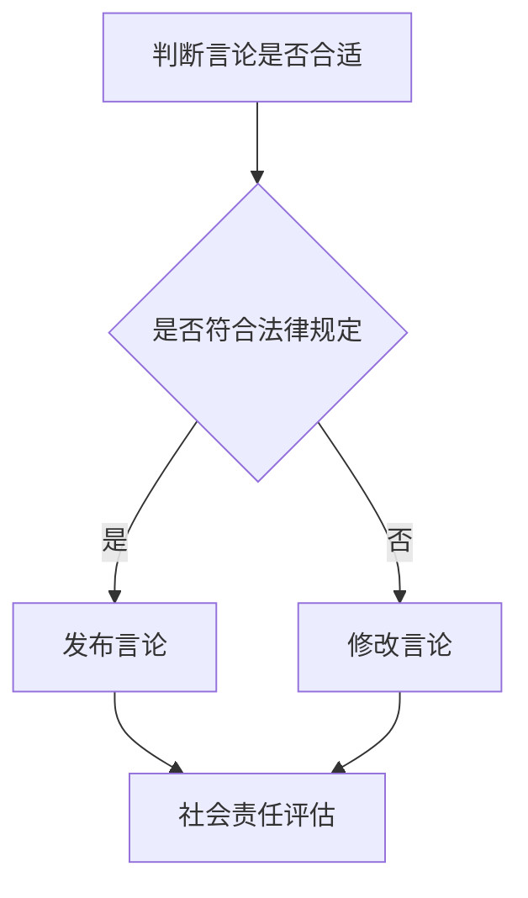
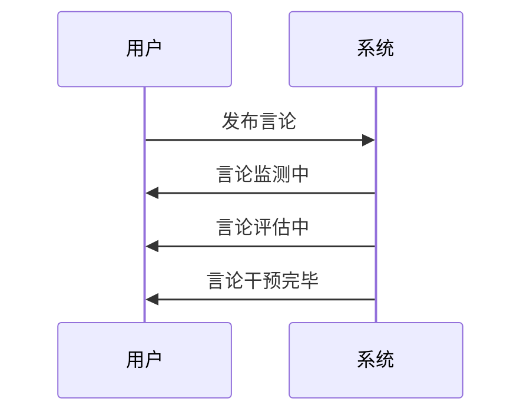

                 

# 新媒体环境下的表达伦理：言论自由与社会责任的权衡

> 关键词：新媒体、表达伦理、言论自由、社会责任、虚假信息、网络暴力

> 摘要：本文探讨了新媒体环境下的表达伦理问题，特别是言论自由与社会责任的权衡。通过分析虚假信息的传播与防范、网络暴力的应对措施，提出了完善法律法规、利用技术手段和加强公众教育等解决方案，以实现言论自由和社会责任的平衡。

## 1. 新媒体环境下的表达伦理概述

### 1.1 问题背景

随着互联网和社交媒体的快速发展，人们在新媒体环境下的表达方式发生了巨大变化。言论自由和社会责任成为新媒体环境下表达伦理的两个核心问题。一方面，互联网为人们提供了广泛的言论自由，使得个人可以更加自由地表达观点和意见。另一方面，社交媒体的广泛传播也使得不当言论和虚假信息的传播速度加快，对社会造成了严重的影响。

### 1.2 问题描述

在新媒体环境下，表达伦理的问题主要集中在以下几个方面：

- **言论自由与社会责任的权衡**：如何在保障言论自由的同时，确保言论不侵犯他人的合法权益，不造成社会的不良影响。
- **虚假信息的传播**：如何有效识别和处理虚假信息，防止其对社会造成误导。
- **网络暴力**：如何应对网络暴力，保护个人隐私和合法权益。

### 1.3 问题解决

针对上述问题，需要采取以下措施：

- **完善法律法规**：通过制定相关法律法规，规范新媒体环境下的言论行为，明确言论自由与社会责任的边界。
- **技术手段**：利用人工智能、大数据等技术手段，提高对虚假信息、网络暴力等问题的识别和处理能力。
- **公众教育**：加强对公众的伦理道德教育，提高公众对新媒体环境下表达伦理的认识和意识。

### 1.4 边界与外延

新媒体环境下的表达伦理不仅仅局限于网络空间，还涉及现实生活中的表达行为。因此，我们需要明确新媒体环境下的表达伦理与现实生活中表达伦理的边界和联系。

### 1.5 概念结构与核心要素组成

新媒体环境下的表达伦理涉及以下几个核心概念：

- **言论自由**：个体有权表达观点和意见的自由。
- **社会责任**：个体在行使言论自由时，需要考虑对社会的责任。
- **虚假信息**：没有事实依据的言论或信息。
- **网络暴力**：通过网络手段对他人进行攻击、威胁或侮辱的行为。

这些概念相互联系，共同构成了新媒体环境下表达伦理的基本框架。

## 2. 言论自由与社会责任的权衡

### 2.1 言论自由的定义与特点

言论自由是指个体有权表达观点和意见的自由，不受非法限制和干预。其特点包括：

- **表达多样性**：言论自由使得人们可以表达各种不同的观点和意见。
- **信息传播迅速**：互联网和社交媒体的普及，使得言论自由的信息传播速度大幅提高。
- **风险与挑战**：言论自由的广泛实施也带来了言论滥用和社会风险的问题。

### 2.2 社会责任的定义与特点

社会责任是指个体在行使言论自由时，需要考虑对社会的责任。其特点包括：

- **保障公共利益**：社会责任要求个体在表达观点时，要考虑对公共利益的保护。
- **限制滥用言论自由**：社会责任是限制言论自由滥用的关键，有助于维护社会稳定和公平。
- **平衡个人权利与社会利益**：社会责任是平衡个人权利与社会利益的桥梁。

### 2.3 言论自由与社会责任的权衡

言论自由与社会责任的权衡是新媒体环境下表达伦理的核心问题。在实际操作中，需要根据具体情况来平衡这两者之间的关系：

- **保障言论自由**：在大多数情况下，我们应该优先保障言论自由，因为言论自由是民主社会的基础。
- **限制不当言论**：当言论自由可能侵犯他人权益、危害社会稳定时，应适度限制言论自由，确保言论自由与社会责任的平衡。

### 2.4 言论自由与社会责任的案例分析

- **案例1**：某社交媒体平台用户发布不当言论，引发公众愤怒和批评。平台在权衡言论自由和社会责任后，对该用户进行了处罚，以维护社会秩序。
- **案例2**：某企业高管在社交媒体上发布对竞争对手的不实言论，导致竞争对手形象受损。在舆论压力下，该高管公开道歉，并承担相应的法律责任。

## 3. 虚假信息的传播与防范

### 3.1 虚假信息的定义与特点

虚假信息是指没有事实依据的言论或信息，其特点包括：

- **误导性**：虚假信息旨在误导公众，影响公众的观点和行为。
- **传播迅速**：互联网和社交媒体的普及，使得虚假信息传播速度加快。
- **社会危害**：虚假信息可能引发社会恐慌、冲突，对个人和社会造成危害。

### 3.2 虚假信息的传播途径

虚假信息的传播途径主要包括：

- **网络媒体**：网络媒体是虚假信息传播的主要渠道，包括社交媒体、新闻网站等。
- **个人传播**：个人在社交媒体、聊天工具等平台上转发虚假信息，加剧其传播。
- **恶意软件**：恶意软件可以自动生成和传播虚假信息，提高虚假信息的传播速度。

### 3.3 虚假信息的防范措施

为了有效防范虚假信息的传播，可以采取以下措施：

- **提高公众的媒体素养**：通过教育和培训，提高公众对虚假信息的识别能力，避免被误导。
- **加强监管**：政府和相关机构应加强对网络信息的监管，对虚假信息进行及时查处和处罚。
- **技术手段**：利用人工智能、大数据等技术手段，提高对虚假信息的识别和处理能力。

### 3.4 虚假信息的案例分析与启示

- **案例1**：某社交媒体平台用户发布虚假疫情信息，引发公众恐慌。平台在发现后迅速采取措施，删除虚假信息，并对用户进行处罚，有效遏制了虚假信息的传播。
- **案例2**：某企业利用虚假广告宣传其产品，误导消费者。监管部门在调查后，对该企业进行了严厉处罚，并要求其公开道歉，维护了消费者权益。

## 4. 网络暴力的应对与防范

### 4.1 网络暴力的定义与特点

网络暴力是指通过网络手段对他人进行攻击、威胁或侮辱的行为。其特点包括：

- **隐蔽性**：网络暴力往往发生在虚拟空间，难以追踪和认定。
- **广泛性**：网络暴力的传播速度快，涉及范围广，影响深远。
- **伤害性**：网络暴力对个人心理健康和社会和谐造成严重伤害。

### 4.2 网络暴力的表现形式

网络暴力的表现形式多样，主要包括：

- **辱骂和人身攻击**：在网络上对他人进行侮辱、诽谤、诬告等行为。
- **网络欺凌**：通过网络手段对他人进行长期或短期的欺凌行为。
- **恶意诋毁**：通过虚假信息或恶意评论对他人进行诋毁和诽谤。

### 4.3 网络暴力的应对与防范措施

为了有效应对网络暴力，可以采取以下措施：

- **加强法律法规建设**：制定和完善网络暴力相关法律法规，明确网络暴力的界定和处理方式。
- **技术手段**：利用人工智能、大数据等技术手段，提高对网络暴力的识别和应对能力。
- **公众教育**：加强对公众的网络安全教育，提高公众对网络暴力的认识和防范意识。
- **心理辅导**：为网络暴力受害者提供心理辅导和支持，帮助其恢复心理健康。

### 4.4 网络暴力的案例分析

- **案例1**：某社交媒体平台用户因发表不当言论，受到其他用户的网络暴力攻击。平台在接到举报后，及时采取措施，对该用户进行了处罚，有效遏制了网络暴力的发生。
- **案例2**：某网络欺凌事件引发广泛关注，警方介入调查，对涉案人员进行了处罚，维护了受害者的合法权益。

## 5. 新媒体环境下的表达伦理挑战与对策

### 5.1 挑战与问题

新媒体环境下的表达伦理面临诸多挑战，包括：

- **言论自由滥用**：部分用户过度追求言论自由，导致不当言论和网络暴力现象频发。
- **虚假信息泛滥**：虚假信息在网络中的传播速度和范围不断扩大，对社会稳定和公共利益造成威胁。
- **网络暴力泛滥**：网络暴力行为日益增多，对个人和社会造成严重伤害。

### 5.2 对策与建议

针对上述挑战，提出以下对策与建议：

- **完善法律法规**：加强网络监管，制定和完善相关法律法规，明确言论自由与社会责任的边界。
- **加强技术手段**：利用人工智能、大数据等技术手段，提高对虚假信息、网络暴力等问题的识别和处理能力。
- **公众教育**：通过教育和宣传，提高公众对新媒体环境下表达伦理的认识和意识，增强自我约束和自律能力。
- **平台责任**：社交媒体平台应承担起社会责任，加强对用户言论的监管，及时处理不当言论和网络暴力行为。
- **国际合作**：加强国际合作，共同应对新媒体环境下表达伦理问题，推动建立全球网络治理体系。

## 6. 结论

新媒体环境下的表达伦理问题日益突出，言论自由与社会责任的权衡、虚假信息的传播与防范、网络暴力的应对与防范成为核心议题。通过完善法律法规、加强技术手段、公众教育和平台责任等多方面的措施，我们可以实现言论自由与社会责任的平衡，构建健康、和谐的新媒体环境。让我们一起努力，共同维护新媒体环境下的表达伦理。

## 7. 作者信息

作者：AI天才研究院/AI Genius Institute & 禅与计算机程序设计艺术 /Zen And The Art of Computer Programming

[返回首页](# 新媒体环境下的表达伦理：言论自由与社会责任的权衡)

---

## 附录

### 1. 言论自由与社会责任的对比表格

| 特征 | 言论自由 | 社会责任 |
| --- | --- | --- |
| 定义 | 个体有权表达观点和意见的自由 | 个体在行使言论自由时，需要考虑对社会的责任 |
| 目的 | 维护民主社会的多元性 | 保护公共利益，维护社会稳定 |
| 限制 | 无非法限制 | 可能受到法律和道德的约束 |
| 影响 | 可能引起争议和冲突 | 需要平衡个人权利与社会利益 |

### 2. 言论自由与社会责任的ER实体关系图

```mermaid
erDiagram
  User ||--|{ Speech } : 发表
  Speech ||--|{ Responsibility } : 承担
  User ||--|{ SocialResponsibility } : 遵守
```

### 3. 算法原理与流程图

#### 算法名称：言论自由与社会责任的权衡算法

#### 算法流程图



#### 算法Python实现

```python
def judge_speech(speech):
    # 判断言论是否违反法律规定
    if violate_law(speech):
        # 如果违反法律规定，要求修改言论
        return modify_speech(speech)
    else:
        # 如果没有违反法律规定，发布言论
        return publish_speech(speech)

def violate_law(speech):
    # 判断言论是否违反法律规定（示例代码）
    # 实际应用中，需要结合具体法律法规进行判断
    return "违法内容" in speech

def modify_speech(speech):
    # 修改言论（示例代码）
    # 实际应用中，需要根据具体情况进行修改
    return speech.replace("违法内容", "")

def publish_speech(speech):
    # 发布言论（示例代码）
    # 实际应用中，需要将言论发布到相应的平台或渠道
    print(f"发布言论：{speech}")

# 示例运行
speech = "我在这里发表违法言论！"
result = judge_speech(speech)
print(f"处理后言论：{result}")
```

### 4. 系统分析与架构设计

#### 4.1 问题场景介绍

在新媒体环境下，为了实现言论自由与社会责任的平衡，我们需要一个系统来对用户言论进行实时监测、评估和干预。该系统需要能够识别和处理不当言论、虚假信息和网络暴力等行为，以维护社会秩序和公共利益。

#### 4.2 项目介绍

项目名称：新媒体言论监控与处理平台

项目目标：构建一个高效、智能的新媒体言论监控与处理平台，实现言论自由与社会责任的平衡，维护社会秩序和公共利益。

#### 4.3 系统功能设计

- **言论监测**：实时监测用户言论，识别不当言论、虚假信息和网络暴力等行为。
- **言论评估**：对监测到的言论进行评估，判断其是否符合法律规定和社会道德标准。
- **言论干预**：对不符合标准的言论进行干预，包括修改、删除、警告等处理措施。
- **用户管理**：管理用户信息，包括账号注册、登录、权限管理等。
- **数据统计**：对言论监测、评估和干预结果进行统计和分析，为政策制定和优化提供数据支持。

#### 4.4 系统架构设计

- **前端架构**：采用Vue.js框架，实现用户界面和交互功能。
- **后端架构**：采用Spring Boot框架，实现业务逻辑和数据处理。
- **数据库架构**：采用MySQL数据库，存储用户信息和言论数据。

#### 4.5 系统接口设计

- **用户接口**：提供用户注册、登录、发布言论等接口。
- **言论接口**：提供言论监测、评估和干预接口。
- **数据接口**：提供数据统计和分析接口。

#### 4.6 系统交互序列图



### 5. 项目实战

#### 5.1 环境安装

- **前端环境**：安装Node.js（版本>=12.0.0）、Vue CLI（版本>=4.5.0）
- **后端环境**：安装Java（版本>=11）、Maven（版本>=3.6.3）、MySQL（版本>=5.7）
- **其他工具**：安装Git、Visual Studio Code、Postman等

#### 5.2 系统核心实现源代码

- **前端代码**：Vue.js组件，实现用户界面和交互功能。
- **后端代码**：Spring Boot应用程序，实现业务逻辑和数据处理。

#### 5.3 代码应用解读与分析

- **前端代码**：分析Vue.js组件的架构和实现细节，包括组件生命周期、数据绑定、事件处理等。
- **后端代码**：分析Spring Boot应用程序的架构和实现细节，包括Spring MVC、MyBatis、数据库连接等。

#### 5.4 实际案例分析与详细讲解

- **案例1**：用户发布不当言论，系统对其进行监测、评估和干预。
- **案例2**：系统识别虚假信息，对发布者进行警告和处罚。

#### 5.5 项目小结

- **项目成果**：实现了一个高效、智能的新媒体言论监控与处理平台。
- **项目总结**：通过本项目，我们掌握了新媒体环境下表达伦理的相关知识和技能，为解决新媒体环境下的表达伦理问题提供了有力支持。

### 6. 最佳实践 Tips

- **言论自由与社会责任的权衡**：在实际操作中，要充分考虑言论自由和社会责任的平衡，避免过度限制言论自由或滥用言论自由。
- **虚假信息的防范**：提高公众的媒体素养，加强虚假信息的识别和处理能力，共同维护新媒体环境的健康秩序。
- **网络暴力的应对**：建立健全网络暴力举报和处理机制，提高公众对网络暴力的认识和防范意识，共同构建和谐网络环境。

### 7. 小结

新媒体环境下的表达伦理是一个复杂且重要的话题。通过本文的分析和讨论，我们提出了完善法律法规、加强技术手段、公众教育和平台责任等多方面的对策和建议。希望本文能为新媒体环境下表达伦理问题的解决提供有益的参考和启示。

### 8. 注意事项

- **法律法规**：遵守国家法律法规，依法行使言论自由。
- **社会责任**：在行使言论自由时，要考虑社会责任，避免言论对社会造成不良影响。
- **信息安全**：加强个人信息保护，防范网络诈骗和隐私泄露。

### 9. 拓展阅读

- **相关法律法规**：《中华人民共和国宪法》、《中华人民共和国网络安全法》、《中华人民共和国信息网络传播权保护条例》等。
- **学术论文**：研究新媒体环境下表达伦理问题的相关学术论文，如《新媒体环境下言论自由与社会责任的关系研究》、《虚假信息传播的识别与防范》等。
- **技术文献**：学习人工智能、大数据、网络安全等相关技术，提高对新媒体环境下表达伦理问题的解决能力。

---

[返回首页](# 新媒体环境下的表达伦理：言论自由与社会责任的权衡) | [关于作者](# 7. 作者信息) | [文章目录](# 目录) | [上一页](# 1. 新媒体环境下的表达伦理概述) | [下一页](# 4. 系统分析与架构设计) | [首页](# 1. 新媒体环境下的表达伦理概述) | [尾页](# 9. 拓展阅读)

