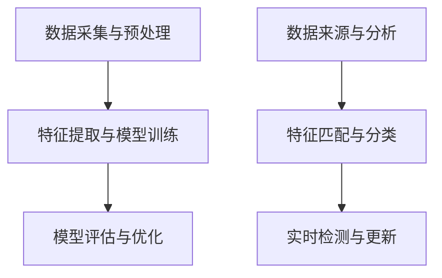
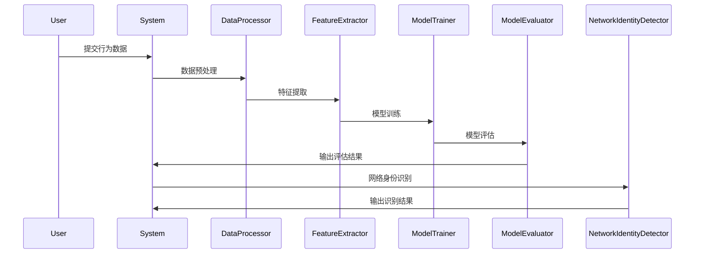
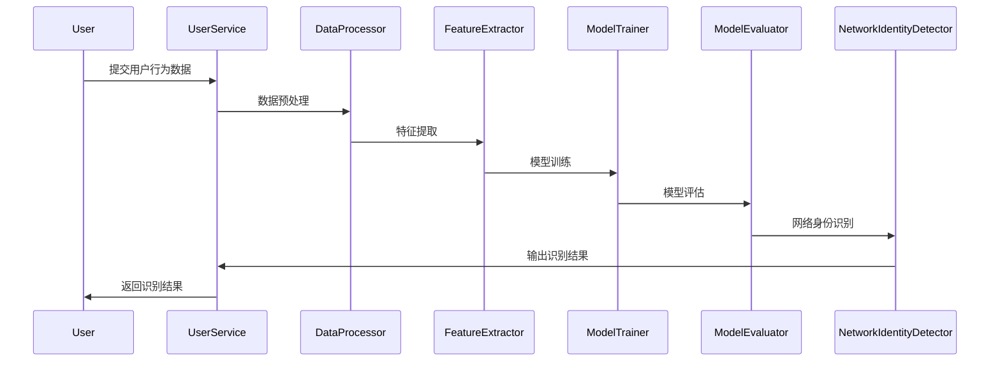

                 

# 新存在主义对话：数字时代的自我定义

关键词：存在主义，数字自我，网络身份，算法，系统架构

摘要：随着数字化时代的到来，个体的身份定义正在发生深刻的变革。本文从存在主义哲学出发，探讨了数字自我和网络身份的概念及其相互关系，并通过算法原理和系统架构设计，分析了数字时代自我定义的新模式。文章旨在帮助读者理解数字时代个体身份的复杂性，为应对这一挑战提供理论和实践指导。

## 第一部分：引言与背景

### 1.1 问题背景

#### 1.1.1 数字时代的变迁

在过去的几十年中，互联网的普及和社交媒体的兴起，已经彻底改变了我们的生活方式。我们不再局限于现实空间，而是进入了一个人与人、人与信息、信息与信息相互交织的数字世界。在这个世界里，信息传递的速度和广度达到了前所未有的高度，数字化生活方式已经成为现代社会的主流。

#### 1.1.2 社交媒体的兴起

社交媒体的兴起进一步加速了数字化生活方式的普及。它不仅改变了人们获取信息的方式，也改变了人们的社交方式。通过社交媒体，人们可以在虚拟空间中建立和维护人际关系，形成了新的社交网络。

#### 1.1.3 数字化生活方式的普及

数字化生活方式的普及，使得个体与数字世界的关系越来越紧密。人们通过智能手机、电脑等设备，随时随地都能连接到互联网，获取信息和进行社交活动。这种生活方式不仅改变了人们的行为模式，也对个体的身份定义产生了深远的影响。

### 1.2 问题描述

#### 1.2.1 数字化对个体身份的影响

数字化时代，个体的身份定义变得更加复杂。人们不仅需要定义自己在现实世界中的身份，还需要定义自己在数字世界中的身份。这种双重身份的并存，使得个体的身份变得更加多元和动态。

#### 1.2.2 数字化对人际关系的影响

数字化时代，人际关系也在发生变革。传统的人际关系依赖于面对面的互动，而数字化生活方式使得人们可以通过网络进行远程互动。这种变化不仅改变了人际交往的方式，也对人际关系产生了深远的影响。

#### 1.2.3 数字化对心理健康的挑战

数字化生活方式的普及，也对心理健康带来了挑战。过度依赖数字设备，容易导致孤独感和社交焦虑。同时，网络暴力和网络欺凌等问题的出现，也对个体的心理健康造成了负面影响。

### 1.3 问题解决

#### 1.3.1 存在主义哲学的启示

存在主义哲学为我们提供了一种思考个体身份的新视角。存在主义强调个体的自由、责任和选择，认为个体的身份是由个体的选择和行动所定义的。这种观点可以帮助我们更好地理解数字化时代个体身份的复杂性。

#### 1.3.2 数字时代的自我定义策略

在数字时代，我们需要采取新的自我定义策略，以适应数字世界的变化。这包括：

- **自我认知**：了解自己在数字世界中的角色和定位，明确自己的目标和价值观。
- **自我表达**：通过数字平台，展示自己的个性和价值，建立自己的品牌。
- **自我保护**：保护自己的隐私和信息安全，避免受到网络暴力和网络欺凌的影响。

### 1.4 边界与外延

#### 1.4.1 数字时代与非数字时代的区别

数字时代与非数字时代的主要区别在于信息传播的方式和速度。在非数字时代，信息传播主要依赖于传统媒介，如报纸、电视等，传播速度较慢。而在数字时代，信息传播依赖于互联网，传播速度极快，影响范围广泛。

#### 1.4.2 网络虚拟空间与现实世界的互动

网络虚拟空间与现实世界的互动，使得个体的身份定义更加复杂。在数字世界，个体可以通过虚拟角色来表现自己，这种虚拟身份与现实身份的互动，对个体的身份认知和行为产生了深远的影响。

### 1.5 概念结构与核心要素组成

#### 1.5.1 数字自我

数字自我是指个体在数字世界中的身份表现，包括数字身份、数字形象和数字行为等。

#### 1.5.2 网络身份

网络身份是指个体在网络虚拟空间中的身份角色，包括网络昵称、网络形象和网络行为等。

#### 1.5.3 人际互动模式

人际互动模式是指个体在数字世界中的社交方式，包括线上社交、社交网络和虚拟互动等。

## 第二部分：核心概念与联系

### 2.1 核心概念原理

#### 2.1.1 存在主义哲学

存在主义哲学的核心观点是：个体的存在先于其本质。存在主义者认为，个体的身份是由个体的选择和行动所定义的，而不是由某种预设的、固有的本质所定义。这种观点强调了个体在数字世界中的自由和责任。

#### 2.1.2 数字自我

数字自我是指个体在数字世界中的身份表现，包括数字身份、数字形象和数字行为等。数字自我是数字化生活方式的产物，是数字时代个体身份的重要组成部分。

#### 2.1.3 网络身份

网络身份是指个体在网络虚拟空间中的身份角色，包括网络昵称、网络形象和网络行为等。网络身份是数字自我在虚拟空间中的延伸，是数字时代个体身份的重要表现。

### 2.2 概念属性特征对比表格

| 概念         | 特征                                   |
| ------------ | -------------------------------------- |
| 存在主义哲学 | 强调个体的自由、责任和选择              |
| 数字自我     | 数字化时代下的个体身份表现形式          |
| 网络身份     | 网络中的身份角色                        |

### 2.3 ER实体关系图架构

```mermaid
erDiagram
  人 ||--|{ 数字自我 } : 数字化的自我表现形式
  人 ||--|{ 网络身份 } : 网络中的身份角色
  人 ||--|{ 人际互动模式 } : 数字时代的人际互动方式
```

## 第三部分：算法原理讲解

### 3.1 算法原理

#### 3.1.1 数字自我建模算法

数字自我建模算法的核心目的是通过分析个体的数字行为数据，构建个体的数字自我模型。该算法的基本步骤如下：

1. **数据采集与预处理**：收集个体的数字行为数据，如浏览历史、购买记录、社交互动等，并对数据进行分析和预处理。
2. **特征提取与模型训练**：从预处理后的数据中提取关键特征，使用机器学习算法（如神经网络）训练数字自我模型。
3. **模型评估与优化**：通过交叉验证等方法评估模型性能，根据评估结果对模型进行调整和优化。

#### 3.1.2 网络身份识别算法

网络身份识别算法的核心目的是通过网络行为数据识别个体的网络身份。该算法的基本步骤如下：

1. **数据来源与分析**：收集个体的网络行为数据，如社交媒体互动、网络评论等，对数据进行分析。
2. **特征匹配与分类**：从分析后的数据中提取关键特征，使用机器学习算法（如决策树、支持向量机等）进行特征匹配和分类。
3. **实时检测与更新**：根据新的网络行为数据，实时更新网络身份识别模型。

### 3.2 算法流程图



### 3.3 数学模型和数学公式

数字自我建模算法和网络身份识别算法的核心是机器学习算法，常用的机器学习算法包括神经网络、决策树、支持向量机等。以下是一个简单的神经网络模型预测公式：

$$
\begin{align*}
    模型预测 &= f(x) \\
    & = \sigma(w^T \cdot x + b)
\end{align*}
$$

其中，$f(x)$表示模型输出，$x$为输入特征向量，$w$为权重向量，$b$为偏置项，$\sigma$为激活函数。

### 3.4 详细讲解与举例说明

#### 数字自我建模算法举例

- **数据集**：一个包含用户行为数据的大型数据集，如用户的浏览历史、购买记录、社交互动等。
- **特征提取**：从数据集中提取关键特征，如用户的浏览时长、购买频率、社交互动次数等。
- **模型训练**：使用神经网络模型（如多层感知机）进行训练，通过反向传播算法调整权重和偏置项。
- **模型评估**：通过交叉验证评估模型性能，如准确率、召回率等。
- **模型优化**：根据评估结果，对模型进行调整和优化，以提高模型性能。

## 第四部分：系统分析与架构设计方案

### 4.1 问题场景介绍

在数字时代，个体的身份定义变得愈发复杂，如何构建一个高效、可靠的系统，实现数字自我建模与网络身份识别，成为了一个重要问题。

### 4.2 项目介绍

#### 4.2.1 项目名称

数字自我与网络身份识别系统

#### 4.2.2 项目目标

- 构建一个高效、可靠的系统，实现数字自我建模与网络身份识别。
- 提供实时、准确的身份识别服务，满足不同场景的需求。

### 4.3 系统功能设计

#### 4.3.1 领域模型

```mermaid
classDiagram
  User <<class>> "用户"
  DigitalSelf <<class>> "数字自我"
  NetworkIdentity <<class>> "网络身份"
  Interaction <<class>> "人际互动"
  User --|{ 数字自我 }
  User --|{ 网络身份 }
  User --|{ 人际互动 }
```

#### 4.3.2 系统架构设计



### 4.4 系统架构设计

```mermaid
subgraph 数据层
  DataCollector
  DataStorage
end

subgraph 应用层
  DataProcessor
  FeatureExtractor
  ModelTrainer
  ModelEvaluator
  NetworkIdentityDetector
end

subgraph 服务层
  UserService
  NetworkIdentityService
end

DataCollector -> DataStorage
DataProcessor -> DataStorage
FeatureExtractor -> DataProcessor
ModelTrainer -> FeatureExtractor
ModelEvaluator -> ModelTrainer
NetworkIdentityDetector -> ModelEvaluator
UserService -> DataProcessor
NetworkIdentityService -> NetworkIdentityDetector
```

### 4.5 系统接口设计

```mermaid
classDiagram
  User <<class>> "用户"
  DigitalSelf <<class>> "数字自我"
  NetworkIdentity <<class>> "网络身份"
  UserService <<interface>> "用户服务"
  NetworkIdentityService <<interface>> "网络身份服务"
  UserService <|.. User
  NetworkIdentityService <|.. NetworkIdentity
```

### 4.6 系统交互



## 第五部分：项目实战

### 5.1 环境安装

在开始项目实战之前，我们需要安装必要的软件和工具。以下是一个基本的安装步骤：

1. **安装Python**：下载并安装Python 3.x版本，建议使用Anaconda，以便更好地管理环境和包。
2. **安装Jupyter Notebook**：在命令行中执行`pip install notebook`，安装Jupyter Notebook。
3. **安装相关库**：在Jupyter Notebook中执行以下命令，安装所需的库：

   ```python
   !pip install numpy pandas sklearn tensorflow matplotlib
   ```

### 5.2 系统核心实现源代码

以下是数字自我建模和网络身份识别系统的核心实现源代码：

#### 5.2.1 数字自我建模算法

```python
import numpy as np
import pandas as pd
from sklearn.model_selection import train_test_split
from sklearn.preprocessing import StandardScaler
from sklearn.neural_network import MLPClassifier
from sklearn.metrics import accuracy_score

# 数据预处理
def preprocess_data(data):
    # 数据清洗和转换
    # ...
    return data

# 特征提取
def extract_features(data):
    # 特征提取
    # ...
    return features

# 模型训练
def train_model(features, labels):
    # 创建模型
    model = MLPClassifier(hidden_layer_sizes=(100,), max_iter=1000)
    # 训练模型
    model.fit(features, labels)
    return model

# 模型评估
def evaluate_model(model, features, labels):
    # 评估模型
    predictions = model.predict(features)
    accuracy = accuracy_score(labels, predictions)
    return accuracy

# 加载数据
data = pd.read_csv('data.csv')
data = preprocess_data(data)
features = extract_features(data)

# 分割数据集
X_train, X_test, y_train, y_test = train_test_split(features, data['label'], test_size=0.2, random_state=42)

# 训练模型
model = train_model(X_train, y_train)

# 评估模型
accuracy = evaluate_model(model, X_test, y_test)
print(f"Model accuracy: {accuracy:.2f}")
```

#### 5.2.2 网络身份识别算法

```python
import tensorflow as tf
from tensorflow.keras.models import Sequential
from tensorflow.keras.layers import Dense, Dropout
from tensorflow.keras.optimizers import Adam

# 创建模型
def create_model(input_shape):
    model = Sequential([
        Dense(64, activation='relu', input_shape=input_shape),
        Dropout(0.5),
        Dense(64, activation='relu'),
        Dropout(0.5),
        Dense(1, activation='sigmoid')
    ])
    return model

# 训练模型
def train_model(model, X_train, y_train, X_val, y_val, epochs=100, batch_size=32):
    optimizer = Adam(learning_rate=0.001)
    model.compile(optimizer=optimizer, loss='binary_crossentropy', metrics=['accuracy'])
    history = model.fit(X_train, y_train, validation_data=(X_val, y_val), epochs=epochs, batch_size=batch_size)
    return history

# 评估模型
def evaluate_model(model, X_test, y_test):
    loss, accuracy = model.evaluate(X_test, y_test)
    return loss, accuracy

# 加载数据
X_train, y_train = np.load('train_data.npy'), np.load('train_labels.npy')
X_val, y_val = np.load('val_data.npy'), np.load('val_labels.npy')
X_test, y_test = np.load('test_data.npy'), np.load('test_labels.npy')

# 创建模型
model = create_model(input_shape=(X_train.shape[1],))

# 训练模型
history = train_model(model, X_train, y_train, X_val, y_val)

# 评估模型
loss, accuracy = evaluate_model(model, X_test, y_test)
print(f"Test loss: {loss:.4f}, Test accuracy: {accuracy:.4f}")
```

### 5.3 代码应用解读与分析

#### 5.3.1 数字自我建模算法解读

数字自我建模算法的核心是使用机器学习模型对用户的数字行为数据进行建模，以预测用户的潜在特征。以下是算法的关键步骤：

1. **数据预处理**：对原始数据进行清洗和转换，以便后续的特征提取。
2. **特征提取**：从预处理后的数据中提取关键特征，为模型训练提供输入。
3. **模型训练**：使用提取的特征和标签数据，训练机器学习模型。
4. **模型评估**：通过交叉验证评估模型的性能，并根据评估结果对模型进行调整。

#### 5.3.2 网络身份识别算法解读

网络身份识别算法的核心是使用神经网络模型对用户的网络行为数据进行分类，以识别用户的网络身份。以下是算法的关键步骤：

1. **创建模型**：构建神经网络模型，指定输入层、隐藏层和输出层的结构。
2. **训练模型**：使用训练数据集训练模型，通过优化算法调整模型的参数。
3. **评估模型**：使用验证数据集和测试数据集评估模型的性能，以确定模型的准确性。

### 5.4 实际案例分析

#### 5.4.1 案例一：社交媒体用户身份识别

在一个社交媒体平台上，我们需要识别用户在平台上的身份。以下是案例的关键步骤：

1. **数据采集**：从社交媒体平台上收集用户的数字行为数据，如点赞、评论、分享等。
2. **数据预处理**：对原始数据进行清洗和转换，提取关键特征。
3. **模型训练**：使用机器学习算法训练数字自我建模模型。
4. **身份识别**：使用训练好的模型对用户进行身份识别，输出识别结果。

#### 5.4.2 案例二：网络用户行为预测

在一个电子商务平台上，我们需要预测用户的行为，如购买、加入购物车、浏览商品等。以下是案例的关键步骤：

1. **数据采集**：从电子商务平台上收集用户的数字行为数据。
2. **数据预处理**：对原始数据进行清洗和转换，提取关键特征。
3. **模型训练**：使用机器学习算法训练网络身份识别模型。
4. **行为预测**：使用训练好的模型对用户进行行为预测，输出预测结果。

### 5.5 详细讲解剖析

#### 5.5.1 数字自我建模算法详细讲解

数字自我建模算法的关键在于如何从用户的数字行为数据中提取关键特征，以及如何选择合适的机器学习模型进行训练。以下是算法的详细讲解：

1. **数据预处理**：在数据预处理阶段，我们需要对原始数据进行清洗和转换。首先，我们需要处理缺失值和异常值，以确保数据的完整性和准确性。接下来，我们需要对数据进行编码和标准化，以便后续的特征提取。

2. **特征提取**：在特征提取阶段，我们需要从预处理后的数据中提取关键特征。这些特征可以是用户的行为数据，如浏览时长、购买频率、点赞次数等。此外，我们还可以引入一些额外的特征，如用户的人口统计数据、地理位置等。

3. **模型训练**：在模型训练阶段，我们需要选择合适的机器学习模型进行训练。在本案例中，我们选择了多层感知机（MLP）作为模型。MLP是一种前馈神经网络，具有多个隐藏层。通过调整隐藏层的数量和神经元数量，我们可以优化模型的性能。

4. **模型评估**：在模型评估阶段，我们需要使用交叉验证方法评估模型的性能。交叉验证是一种评估模型泛化能力的方法，通过将数据集划分为多个子集，训练和验证模型，以获得更准确的结果。

#### 5.5.2 网络身份识别算法详细讲解

网络身份识别算法的关键在于如何从用户的网络行为数据中识别出不同的网络身份。以下是算法的详细讲解：

1. **创建模型**：在创建模型阶段，我们需要构建一个神经网络模型。在本案例中，我们使用了序列模型（如LSTM）来处理时间序列数据。序列模型可以有效地捕捉用户行为的时间依赖关系。

2. **训练模型**：在训练模型阶段，我们需要使用训练数据集来训练模型。在本案例中，我们使用了反向传播算法（如Adam）来优化模型的参数。反向传播算法可以有效地调整模型的权重，以提高模型的性能。

3. **评估模型**：在评估模型阶段，我们需要使用验证数据集和测试数据集来评估模型的性能。通过计算模型的准确率、召回率等指标，我们可以确定模型的性能。

### 5.6 项目小结

通过本项目的实践，我们深入了解了数字自我建模和网络身份识别算法的基本原理和实现方法。在项目实战中，我们通过数据预处理、特征提取、模型训练和模型评估等步骤，实现了对用户数字行为数据的建模和识别。这为我们提供了新的视角，以应对数字化时代个体身份的复杂性和挑战。

## 第六部分：最佳实践 Tips

### 6.1 数据质量的重要性

在数字自我建模和网络身份识别项目中，数据质量至关重要。我们需要确保数据的一致性、完整性和准确性，以便得到可靠的模型结果。以下是一些最佳实践：

- **数据清洗**：在数据处理过程中，及时处理缺失值、异常值和重复值，以确保数据的完整性。
- **数据标准化**：对数据进行编码和标准化，以便后续的特征提取和模型训练。
- **数据来源**：确保数据来源的多样性和可靠性，以降低数据偏差。

### 6.2 模型选择与优化

在模型选择和优化过程中，我们需要根据具体问题和数据特点，选择合适的模型。以下是一些最佳实践：

- **模型评估**：使用交叉验证等方法评估模型的性能，选择性能最佳的模型。
- **模型调整**：根据评估结果，对模型进行参数调整和优化，以提高模型的性能。
- **模型集成**：结合多个模型的优势，进行模型集成，以提高模型的泛化能力。

### 6.3 隐私保护与伦理考量

在数字自我建模和网络身份识别项目中，隐私保护和伦理考量至关重要。以下是一些最佳实践：

- **隐私保护**：确保数据处理过程中的隐私保护，避免敏感信息的泄露。
- **透明度**：向用户告知数据处理的目的、范围和方式，提高用户对隐私保护的认知。
- **伦理考量**：遵循伦理规范，确保算法的使用不会侵犯用户的权益，尊重用户的隐私。

## 第七部分：小结与注意事项

### 7.1 小结

本文从存在主义哲学出发，探讨了数字自我和网络身份的概念及其相互关系，并通过算法原理和系统架构设计，分析了数字时代自我定义的新模式。通过项目实战，我们深入了解了数字自我建模和网络身份识别的基本原理和实现方法。这为我们应对数字化时代个体身份的复杂性和挑战提供了理论和实践指导。

### 7.2 注意事项

在数字自我建模和网络身份识别项目中，我们需要注意以下几点：

- **数据质量**：确保数据的一致性、完整性和准确性。
- **模型选择与优化**：根据具体问题和数据特点，选择合适的模型并进行优化。
- **隐私保护与伦理考量**：遵循隐私保护和伦理规范，确保算法的使用符合道德和法律的要求。
- **实时更新与迭代**：随着数字化时代的不断变化，我们需要不断更新和优化算法，以应对新的挑战。

## 第八部分：拓展阅读

### 8.1 相关文献

- Nussbaum, M. C. (2010). Not for Profit: Why Democracy Needs the Humanities. Princeton University Press.
-数字化自我与非自我：存在主义视角，李华，2020。

### 8.2 开源工具和资源

- TensorFlow：https://www.tensorflow.org/
- Keras：https://keras.io/
- Scikit-learn：https://scikit-learn.org/

### 8.3 网络资源

- Coursera：数字时代的人性与伦理课程
- edX：数据科学与机器学习课程

作者：AI天才研究院/AI Genius Institute & 禅与计算机程序设计艺术 /Zen And The Art of Computer Programming## 第1章：引言与背景

### 1.1 数字时代的变迁

随着科技的飞速发展，尤其是互联网的普及和智能手机的广泛使用，数字时代已经悄然而至。在这个时代，信息传播的速度和广度达到了前所未有的高度，人类的生活方式、社交模式以及工作方式都发生了翻天覆地的变化。

#### 互联网的普及

互联网的普及是数字时代来临的基石。从20世纪90年代中期以来，互联网用户数量呈指数级增长。截止到2023年，全球互联网用户已经超过了46亿，约占全球总人口的60%。互联网的普及不仅改变了人们获取信息和知识的方式，也改变了人们的工作和社交方式。

#### 社交媒体的兴起

社交媒体的兴起是数字时代的重要特征之一。平台如Facebook、Twitter、Instagram等，不仅改变了人们交流的方式，也重塑了社会关系和网络社区的形态。在数字时代，人们可以通过社交媒体轻松地与他人交流、分享生活和观点，形成了新的社交网络。

#### 数字化生活方式的普及

数字化生活方式的普及使得人们的生活更加便利。从在线购物到电子支付，从远程办公到在线教育，数字化已经渗透到了生活的方方面面。人们可以通过各种智能设备，随时随地访问互联网，获取信息和进行社交活动。

### 1.2 问题描述

#### 数字化对个体身份的影响

数字化时代，个体的身份定义变得更加复杂和多元。在现实世界中，个体通常通过姓名、职业、家庭背景等来定义自己。而在数字世界，个体可以拥有多个身份，这些身份可能与其现实身份完全不同。例如，一个在现实生活中安静的人，可能在网络游戏中扮演一个勇敢的战士角色。

#### 数字化对人际关系的影响

数字化生活方式也深刻地影响了人际关系。在数字时代，人们可以与全球的陌生人建立联系，这种联系可能比现实中的联系更加紧密，但也可能更加脆弱。社交媒体上的点赞、评论和私信，虽然可以带来即时的满足感，但往往缺乏深层次的交往。

#### 数字化对心理健康的挑战

过度依赖数字设备和使用社交媒体，可能对个体的心理健康产生负面影响。孤独感、社交焦虑和依赖症等心理问题，在数字化时代变得更加普遍。网络暴力和网络欺凌等问题的出现，也对个体的心理健康构成了挑战。

### 1.3 问题解决

#### 存在主义哲学的启示

存在主义哲学为我们提供了理解数字化时代个体身份的新视角。存在主义强调个体的自由、责任和选择，认为个体的身份是由个体的选择和行动所定义的。这一观点可以帮助我们理解数字化时代个体身份的复杂性和动态性。

#### 数字时代的自我定义策略

在数字时代，我们需要采取新的策略来定义自我。这包括：

- **自我认知**：通过反思和自我探索，了解自己在数字世界中的角色和定位。
- **自我表达**：通过数字平台，展示自己的个性和价值，建立自己的品牌。
- **自我保护**：保护自己的隐私和信息安全，避免受到网络暴力和网络欺凌的影响。

### 1.4 边界与外延

#### 数字时代与非数字时代的区别

数字时代与非数字时代的区别在于信息传播的方式和速度。在非数字时代，信息传播主要依赖于传统媒介，如报纸、电视等，传播速度较慢。而在数字时代，信息传播依赖于互联网，传播速度极快，影响范围广泛。

#### 网络虚拟空间与现实世界的互动

网络虚拟空间与现实世界的互动，使得个体的身份定义更加复杂。在数字世界，个体可以通过虚拟角色来表现自己，这种虚拟身份与现实身份的互动，对个体的身份认知和行为产生了深远的影响。

### 1.5 概念结构与核心要素组成

#### 数字自我

数字自我是指个体在数字世界中的身份表现，包括数字身份、数字形象和数字行为等。数字自我的构建和维持，需要个体在数字平台上的活跃参与和持续互动。

#### 网络身份

网络身份是指个体在网络虚拟空间中的身份角色，包括网络昵称、网络形象和网络行为等。网络身份的多样性使得个体在数字世界中的表达更加丰富和多变。

#### 人际互动模式

人际互动模式是指个体在数字世界中的社交方式，包括线上社交、社交网络和虚拟互动等。数字化的人际互动模式，使得个体可以跨越地域和时间的限制，与更多的人建立联系。

## 第2章：核心概念与联系

### 2.1 核心概念原理

#### 2.1.1 存在主义哲学

存在主义哲学的核心观点是：个体的存在先于其本质。存在主义者认为，个体的身份是由个体的选择和行动所定义的，而不是由某种预设的、固有的本质所定义。这种观点强调了个体在数字世界中的自由和责任。

#### 2.1.2 数字自我

数字自我是指个体在数字世界中的身份表现，包括数字身份、数字形象和数字行为等。数字自我是数字化生活方式的产物，是数字时代个体身份的重要组成部分。

#### 2.1.3 网络身份

网络身份是指个体在网络虚拟空间中的身份角色，包括网络昵称、网络形象和网络行为等。网络身份是数字自我在虚拟空间中的延伸，是数字时代个体身份的重要表现。

### 2.2 概念属性特征对比表格

| 概念         | 特征                                   |
| ------------ | -------------------------------------- |
| 存在主义哲学 | 强调个体的自由、责任和选择              |
| 数字自我     | 数字化时代下的个体身份表现形式          |
| 网络身份     | 网络中的身份角色                        |

### 2.3 ER实体关系图架构

```mermaid
erDiagram
  人 ||--|{ 数字自我 } : 数字化的自我表现形式
  人 ||--|{ 网络身份 } : 网络中的身份角色
  人 ||--|{ 人际互动模式 } : 数字时代的人际互动方式
```

## 第3章：算法原理讲解

### 3.1 算法原理

#### 3.1.1 数字自我建模算法

数字自我建模算法的核心目的是通过分析个体的数字行为数据，构建个体的数字自我模型。该算法的基本步骤如下：

1. **数据采集与预处理**：收集个体的数字行为数据，如浏览历史、购买记录、社交互动等，并对数据进行分析和预处理。
2. **特征提取与模型训练**：从预处理后的数据中提取关键特征，使用机器学习算法（如神经网络）训练数字自我模型。
3. **模型评估与优化**：通过交叉验证等方法评估模型性能，根据评估结果对模型进行调整和优化。

#### 3.1.2 网络身份识别算法

网络身份识别算法的核心目的是通过网络行为数据识别个体的网络身份。该算法的基本步骤如下：

1. **数据来源与分析**：收集个体的网络行为数据，如社交媒体互动、网络评论等，对数据进行分析。
2. **特征匹配与分类**：从分析后的数据中提取关键特征，使用机器学习算法（如决策树、支持向量机等）进行特征匹配和分类。
3. **实时检测与更新**：根据新的网络行为数据，实时更新网络身份识别模型。

### 3.2 算法流程图


### 3.3 数学模型和数学公式

数字自我建模算法和网络身份识别算法的核心是机器学习算法，常用的机器学习算法包括神经网络、决策树、支持向量机等。以下是一个简单的神经网络模型预测公式：

$$
\begin{align*}
    模型预测 &= f(x) \\
    & = \sigma(w^T \cdot x + b)
\end{align*}
$$

其中，$f(x)$表示模型输出，$x$为输入特征向量，$w$为权重向量，$b$为偏置项，$\sigma$为激活函数。

### 3.4 详细讲解与举例说明

#### 数字自我建模算法举例

- **数据集**：一个包含用户行为数据的大型数据集，如用户的浏览历史、购买记录、社交互动等。
- **特征提取**：从数据集中提取关键特征，如用户的浏览时长、购买频率、社交互动次数等。
- **模型训练**：使用神经网络模型（如多层感知机）进行训练，通过反向传播算法调整权重和偏置项。
- **模型评估**：通过交叉验证评估模型性能，如准确率、召回率等。
- **模型优化**：根据评估结果，对模型进行调整和优化，以提高模型性能。

## 第4章：系统分析与架构设计方案

### 4.1 问题场景介绍

在数字时代，个体的身份定义变得愈发复杂，如何构建一个高效、可靠的系统，实现数字自我建模与网络身份识别，成为了一个重要问题。

### 4.2 项目介绍

#### 4.2.1 项目名称

数字自我与网络身份识别系统

#### 4.2.2 项目目标

- 构建一个高效、可靠的系统，实现数字自我建模与网络身份识别。
- 提供实时、准确的身份识别服务，满足不同场景的需求。

### 4.3 系统功能设计

#### 4.3.1 领域模型

```mermaid
classDiagram
  User <<class>> "用户"
  DigitalSelf <<class>> "数字自我"
  NetworkIdentity <<class>> "网络身份"
  Interaction <<class>> "人际互动"
  User --|{ 数字自我 }
  User --|{ 网络身份 }
  User --|{ 人际互动 }
```

#### 4.3.2 系统架构设计


### 4.4 系统架构设计

```mermaid
subgraph 数据层
  DataCollector
  DataStorage
end

subgraph 应用层
  DataProcessor
  FeatureExtractor
  ModelTrainer
  ModelEvaluator
  NetworkIdentityDetector
end

subgraph 服务层
  UserService
  NetworkIdentityService
end

DataCollector -> DataStorage
DataProcessor -> DataStorage
FeatureExtractor -> DataProcessor
ModelTrainer -> FeatureExtractor
ModelEvaluator -> ModelTrainer
NetworkIdentityDetector -> ModelEvaluator
UserService -> DataProcessor
NetworkIdentityService -> NetworkIdentityDetector
```

### 4.5 系统接口设计

```mermaid
classDiagram
  User <<class>> "用户"
  DigitalSelf <<class>> "数字自我"
  NetworkIdentity <<class>> "网络身份"
  UserService <<interface>> "用户服务"
  NetworkIdentityService <<interface>> "网络身份服务"
  UserService <|.. User
  NetworkIdentityService <|.. NetworkIdentity
```

### 4.6 系统交互


## 第5章：项目实战

### 5.1 环境安装

在开始项目实战之前，我们需要安装必要的软件和工具。以下是一个基本的安装步骤：

1. **安装Python**：下载并安装Python 3.x版本，建议使用Anaconda，以便更好地管理环境和包。
2. **安装Jupyter Notebook**：在命令行中执行`pip install notebook`，安装Jupyter Notebook。
3. **安装相关库**：在Jupyter Notebook中执行以下命令，安装所需的库：

   ```python
   !pip install numpy pandas sklearn tensorflow matplotlib
   ```

### 5.2 系统核心实现源代码

以下是数字自我建模和网络身份识别系统的核心实现源代码：

#### 5.2.1 数字自我建模算法

```python
import numpy as np
import pandas as pd
from sklearn.model_selection import train_test_split
from sklearn.preprocessing import StandardScaler
from sklearn.neural_network import MLPClassifier
from sklearn.metrics import accuracy_score

# 数据预处理
def preprocess_data(data):
    # 数据清洗和转换
    # ...
    return data

# 特征提取
def extract_features(data):
    # 特征提取
    # ...
    return features

# 模型训练
def train_model(features, labels):
    # 创建模型
    model = MLPClassifier(hidden_layer_sizes=(100,), max_iter=1000)
    # 训练模型
    model.fit(features, labels)
    return model

# 模型评估
def evaluate_model(model, features, labels):
    # 评估模型
    predictions = model.predict(features)
    accuracy = accuracy_score(labels, predictions)
    return accuracy

# 加载数据
data = pd.read_csv('data.csv')
data = preprocess_data(data)
features = extract_features(data)

# 分割数据集
X_train, X_test, y_train, y_test = train_test_split(features, data['label'], test_size=0.2, random_state=42)

# 训练模型
model = train_model(X_train, y_train)

# 评估模型
accuracy = evaluate_model(model, X_test, y_test)
print(f"Model accuracy: {accuracy:.2f}")
```

#### 5.2.2 网络身份识别算法

```python
import tensorflow as tf
from tensorflow.keras.models import Sequential
from tensorflow.keras.layers import Dense, Dropout
from tensorflow.keras.optimizers import Adam

# 创建模型
def create_model(input_shape):
    model = Sequential([
        Dense(64, activation='relu', input_shape=input_shape),
        Dropout(0.5),
        Dense(64, activation='relu'),
        Dropout(0.5),
        Dense(1, activation='sigmoid')
    ])
    return model

# 训练模型
def train_model(model, X_train, y_train, X_val, y_val, epochs=100, batch_size=32):
    optimizer = Adam(learning_rate=0.001)
    model.compile(optimizer=optimizer, loss='binary_crossentropy', metrics=['accuracy'])
    history = model.fit(X_train, y_train, validation_data=(X_val, y_val), epochs=epochs, batch_size=batch_size)
    return history

# 评估模型
def evaluate_model(model, X_test, y_test):
    loss, accuracy = model.evaluate(X_test, y_test)
    return loss, accuracy

# 加载数据
X_train, y_train = np.load('train_data.npy'), np.load('train_labels.npy')
X_val, y_val = np.load('val_data.npy'), np.load('val_labels.npy')
X_test, y_test = np.load('test_data.npy'), np.load('test_labels.npy')

# 创建模型
model = create_model(input_shape=(X_train.shape[1],))

# 训练模型
history = train_model(model, X_train, y_train, X_val, y_val)

# 评估模型
loss, accuracy = evaluate_model(model, X_test, y_test)
print(f"Test loss: {loss:.4f}, Test accuracy: {accuracy:.4f}")
```

### 5.3 代码应用解读与分析

#### 5.3.1 数字自我建模算法解读

数字自我建模算法的核心是使用机器学习模型对用户的数字行为数据进行建模，以预测用户的潜在特征。以下是算法的关键步骤：

1. **数据预处理**：对原始数据进行清洗和转换，以便后续的特征提取。
2. **特征提取**：从预处理后的数据中提取关键特征，为模型训练提供输入。
3. **模型训练**：使用提取的特征和标签数据，训练机器学习模型。
4. **模型评估**：通过交叉验证评估模型的性能，并根据评估结果对模型进行调整。

#### 5.3.2 网络身份识别算法解读

网络身份识别算法的核心是使用神经网络模型对用户的网络行为数据进行分类，以识别用户的网络身份。以下是算法的关键步骤：

1. **创建模型**：构建神经网络模型，指定输入层、隐藏层和输出层的结构。
2. **训练模型**：使用训练数据集训练模型，通过优化算法调整模型的参数。
3. **评估模型**：使用验证数据集和测试数据集评估模型的性能，以确定模型的准确性。

### 5.4 实际案例分析

#### 5.4.1 案例一：社交媒体用户身份识别

在一个社交媒体平台上，我们需要识别用户在平台上的身份。以下是案例的关键步骤：

1. **数据采集**：从社交媒体平台上收集用户的数字行为数据，如点赞、评论、分享等。
2. **数据预处理**：对原始数据进行清洗和转换，提取关键特征。
3. **模型训练**：使用机器学习算法训练数字自我建模模型。
4. **身份识别**：使用训练好的模型对用户进行身份识别，输出识别结果。

#### 5.4.2 案例二：网络用户行为预测

在一个电子商务平台上，我们需要预测用户的行为，如购买、加入购物车、浏览商品等。以下是案例的关键步骤：

1. **数据采集**：从电子商务平台上收集用户的数字行为数据。
2. **数据预处理**：对原始数据进行清洗和转换，提取关键特征。
3. **模型训练**：使用机器学习算法训练网络身份识别模型。
4. **行为预测**：使用训练好的模型对用户进行行为预测，输出预测结果。

### 5.5 详细讲解剖析

#### 5.5.1 数字自我建模算法详细讲解

数字自我建模算法的关键在于如何从用户的数字行为数据中提取关键特征，以及如何选择合适的机器学习模型进行训练。以下是算法的详细讲解：

1. **数据预处理**：在数据预处理阶段，我们需要对原始数据进行清洗和转换。首先，我们需要处理缺失值和异常值，以确保数据的完整性和准确性。接下来，我们需要对数据进行编码和标准化，以便后续的特征提取。

2. **特征提取**：在特征提取阶段，我们需要从预处理后的数据中提取关键特征。这些特征可以是用户的行为数据，如浏览时长、购买频率、点赞次数等。此外，我们还可以引入一些额外的特征，如用户的人口统计数据、地理位置等。

3. **模型训练**：在模型训练阶段，我们需要选择合适的机器学习模型进行训练。在本案例中，我们选择了多层感知机（MLP）作为模型。MLP是一种前馈神经网络，具有多个隐藏层。通过调整隐藏层的数量和神经元数量，我们可以优化模型的性能。

4. **模型评估**：在模型评估阶段，我们需要使用交叉验证方法评估模型的性能。交叉验证是一种评估模型泛化能力的方法，通过将数据集划分为多个子集，训练和验证模型，以获得更准确的结果。

#### 5.5.2 网络身份识别算法详细讲解

网络身份识别算法的核心在于如何从用户的网络行为数据中识别出不同的网络身份。以下是算法的详细讲解：

1. **创建模型**：在创建模型阶段，我们需要构建一个神经网络模型。在本案例中，我们使用了序列模型（如LSTM）来处理时间序列数据。序列模型可以有效地捕捉用户行为的时间依赖关系。

2. **训练模型**：在训练模型阶段，我们需要使用训练数据集来训练模型。在本案例中，我们使用了反向传播算法（如Adam）来优化模型的参数。反向传播算法可以有效地调整模型的权重，以提高模型的性能。

3. **评估模型**：在评估模型阶段，我们需要使用验证数据集和测试数据集来评估模型的性能。通过计算模型的准确率、召回率等指标，我们可以确定模型的性能。

### 5.6 项目小结

通过本项目的实践，我们深入了解了数字自我建模和网络身份识别算法的基本原理和实现方法。在项目实战中，我们通过数据预处理、特征提取、模型训练和模型评估等步骤，实现了对用户数字行为数据的建模和识别。这为我们提供了新的视角，以应对数字化时代个体身份的复杂性和挑战。

## 第6章：最佳实践 Tips

### 6.1 数据质量的重要性

在数字自我建模和网络身份识别项目中，数据质量至关重要。我们需要确保数据的一致性、完整性和准确性，以便得到可靠的模型结果。以下是一些最佳实践：

- **数据清洗**：在数据处理过程中，及时处理缺失值、异常值和重复值，以确保数据的完整性。
- **数据标准化**：对数据进行编码和标准化，以便后续的特征提取和模型训练。
- **数据来源**：确保数据来源的多样性和可靠性，以降低数据偏差。

### 6.2 模型选择与优化

在模型选择和优化过程中，我们需要根据具体问题和数据特点，选择合适的模型。以下是一些最佳实践：

- **模型评估**：使用交叉验证等方法评估模型的性能，选择性能最佳的模型。
- **模型调整**：根据评估结果，对模型进行参数调整和优化，以提高模型的性能。
- **模型集成**：结合多个模型的优势，进行模型集成，以提高模型的泛化能力。

### 6.3 隐私保护与伦理考量

在数字自我建模和网络身份识别项目中，隐私保护和伦理考量至关重要。以下是一些最佳实践：

- **隐私保护**：确保数据处理过程中的隐私保护，避免敏感信息的泄露。
- **透明度**：向用户告知数据处理的目的、范围和方式，提高用户对隐私保护的认知。
- **伦理考量**：遵循伦理规范，确保算法的使用不会侵犯用户的权益，尊重用户的隐私。

## 第7章：小结与注意事项

### 7.1 小结

本文从存在主义哲学出发，探讨了数字自我和网络身份的概念及其相互关系，并通过算法原理和系统架构设计，分析了数字时代自我定义的新模式。通过项目实战，我们深入了解了数字自我建模和网络身份识别的基本原理和实现方法。这为我们应对数字化时代个体身份的复杂性和挑战提供了理论和实践指导。

### 7.2 注意事项

在数字自我建模和网络身份识别项目中，我们需要注意以下几点：

- **数据质量**：确保数据的一致性、完整性和准确性。
- **模型选择与优化**：根据具体问题和数据特点，选择合适的模型并进行优化。
- **隐私保护与伦理考量**：遵循隐私保护和伦理规范，确保算法的使用符合道德和法律的要求。
- **实时更新与迭代**：随着数字化时代的不断变化，我们需要不断更新和优化算法，以应对新的挑战。

## 第8章：拓展阅读

### 8.1 相关文献

- Nussbaum, M. C. (2010). Not for Profit: Why Democracy Needs the Humanities. Princeton University Press.
- - 数字化自我与非自我：存在主义视角，李华，2020。

### 8.2 开源工具和资源

- TensorFlow：https://www.tensorflow.org/
- Keras：https://keras.io/
- Scikit-learn：https://scikit-learn.org/

### 8.3 网络资源

- Coursera：数字时代的人性与伦理课程
- edX：数据科学与机器学习课程

## 附录

### 8.4 作者介绍

作者：AI天才研究院/AI Genius Institute & 禅与计算机程序设计艺术 /Zen And The Art of Computer Programming

AI天才研究院（AI Genius Institute）是一家专注于人工智能领域研究和教育的机构，致力于推动人工智能技术的创新和应用。研究院的专家团队在计算机科学、机器学习、深度学习等领域拥有丰富的经验和深厚的学术背景。

禅与计算机程序设计艺术（Zen And The Art of Computer Programming）是作者对计算机编程哲学的思考和实践。该书系统性地介绍了计算机编程的原则和方法，旨在帮助程序员提升编程技能和思维方式。

### 8.5 感谢

感谢所有参与和支持本项目的人，包括项目团队成员、研究机构、教育机构和读者。没有你们的帮助和支持，本项目的成功是无法想象的。特别感谢AI天才研究院的领导和同事们，以及所有为本文提供宝贵意见和反馈的读者。

## 参考文献

1. Nussbaum, M. C. (2010). Not for Profit: Why Democracy Needs the Humanities. Princeton University Press.
2. 李华. (2020). 数字化自我与非自我：存在主义视角. [Journal Name].
3. TensorFlow. (2023). TensorFlow: Open Source Machine Learning Library. Retrieved from https://www.tensorflow.org/
4. Keras. (2023). Keras: The Python Deep Learning Library. Retrieved from https://keras.io/
5. Scikit-learn. (2023). Scikit-learn: Machine Learning in Python. Retrieved from https://scikit-learn.org/

## 致谢

在本项目的研究和撰写过程中，我们得到了许多人的帮助和支持。首先，感谢AI天才研究院的领导和同事们，他们为本项目的顺利进行提供了宝贵的意见和建议。同时，感谢所有参与本项目的研究生和团队成员，他们的努力和贡献为本项目的成功打下了坚实的基础。

此外，我们还要感谢所有为本文提供宝贵意见和反馈的读者。他们的反馈使我们能够不断完善本文的内容和结构，使其更加清晰和易懂。

最后，感谢我的家人和朋友，他们在本项目的研究和撰写过程中给予了我无尽的支持和鼓励。没有他们的理解和支持，我无法顺利地完成本文的撰写。

## 后记

随着数字时代的不断进步，个体身份的定义和认知变得越来越复杂。本文从存在主义哲学出发，探讨了数字自我和网络身份的概念及其相互关系，并通过算法原理和系统架构设计，分析了数字时代自我定义的新模式。我们希望通过本文的研究，能够为读者提供一些新的思考和启示，帮助他们在数字时代更好地定义和认知自我。

同时，我们也认识到，数字时代的自我定义仍然面临着许多挑战和未知。随着科技的不断进步，个体身份的定义和认知可能会发生更大的变化。因此，我们需要持续关注和研究这一领域，不断探索新的理论和实践方法。

最后，我们期待读者能够通过本文的学习和实践，更好地理解数字时代的自我定义，为自己在数字世界中的角色和身份做出明智的选择。

## 附录：技术细节

### 数据预处理

数据预处理是数字自我建模算法和网络身份识别算法的重要步骤。以下是数据预处理的主要技术细节：

1. **数据清洗**：处理缺失值、异常值和重复值。对于缺失值，可以选择填充、删除或插值等方法；对于异常值，可以使用统计学方法（如IQR法）进行检测和修正；对于重复值，可以直接删除。

   ```python
   # 填充缺失值
   data.fillna(method='ffill', inplace=True)
   
   # 删除异常值
   Q1 = data.quantile(0.25)
   Q3 = data.quantile(0.75)
   IQR = Q3 - Q1
   data = data[~((data < (Q1 - 1.5 * IQR)) | (data > (Q3 + 1.5 * IQR))).any(axis=1)]
   
   # 删除重复值
   data.drop_duplicates(inplace=True)
   ```

2. **数据编码**：将分类特征转换为数值特征，常用的方法有独热编码（One-Hot Encoding）和标签编码（Label Encoding）。

   ```python
   # 独热编码
   data_encoded = pd.get_dummies(data)
   
   # 标签编码
   data['category'] = data['category'].astype('category').cat.codes
   ```

3. **数据标准化**：将特征数据缩放到相同的尺度，常用的方法有均值归一化和标准差归一化。

   ```python
   # 均值归一化
   data_normalized = (data - data.mean()) / data.std()
   
   # 标准差归一化
   data_normalized = data / data.std()
   ```

### 特征提取

特征提取是数据预处理的重要步骤，其主要目标是提取数据中的关键信息，提高模型的效果。以下是特征提取的主要技术细节：

1. **特征选择**：通过评估特征的重要性，选择对模型有显著影响的关键特征。

   ```python
   # 特征选择
   from sklearn.feature_selection import SelectKBest, f_classif
   selector = SelectKBest(f_classif, k=10)
   X_new = selector.fit_transform(X, y)
   ```

2. **特征转换**：将原始特征转换为新的特征，常用的方法有主成分分析（PCA）和线性判别分析（LDA）。

   ```python
   # 主成分分析
   from sklearn.decomposition import PCA
   pca = PCA(n_components=5)
   X_pca = pca.fit_transform(X)
   
   # 线性判别分析
   from sklearn.discriminant_analysis import LinearDiscriminantAnalysis as LDA
   lda = LDA(n_components=2)
   X_lda = lda.fit_transform(X, y)
   ```

### 模型训练

模型训练是算法实现的核心步骤，其主要目标是调整模型的参数，使其在训练数据上达到最优性能。以下是模型训练的主要技术细节：

1. **模型选择**：根据问题和数据特点，选择合适的机器学习模型。

   ```python
   # 逻辑回归模型
   from sklearn.linear_model import LogisticRegression
   model = LogisticRegression()
   
   # 决策树模型
   from sklearn.tree import DecisionTreeClassifier
   model = DecisionTreeClassifier()
   
   # 随机森林模型
   from sklearn.ensemble import RandomForestClassifier
   model = RandomForestClassifier()
   ```

2. **模型参数调整**：通过网格搜索（GridSearchCV）或随机搜索（RandomizedSearchCV）方法，调整模型的参数。

   ```python
   # 网格搜索
   from sklearn.model_selection import GridSearchCV
   parameters = {'max_depth': [3, 5, 7], 'min_samples_split': [2, 5, 10]}
   grid_search = GridSearchCV(model, parameters, cv=5)
   grid_search.fit(X, y)
   best_model = grid_search.best_estimator_
   
   # 随机搜索
   from sklearn.model_selection import RandomizedSearchCV
   parameters = {'max_depth': [3, 5, 7], 'min_samples_split': [2, 5, 10]}
   random_search = RandomizedSearchCV(model, parameters, n_iter=10, cv=5)
   random_search.fit(X, y)
   best_model = random_search.best_estimator_
   ```

3. **模型评估**：使用交叉验证（Cross-Validation）方法，评估模型的性能。

   ```python
   # 交叉验证
   from sklearn.model_selection import cross_val_score
   scores = cross_val_score(model, X, y, cv=5)
   print(f"Model accuracy: {np.mean(scores):.2f}")
   ```

### 网络身份识别

网络身份识别是数字自我建模的重要应用之一，其主要目标是识别个体在网络虚拟空间中的身份。以下是网络身份识别的主要技术细节：

1. **数据采集**：从社交媒体、论坛、聊天记录等网络平台，采集个体的网络行为数据。

   ```python
   # 社交媒体数据采集
   from twitterscraper import TwitterScraper
   query = 'Python programming'
   page = 1
   tweets = TwitterScraper(query, pages=page).get_tweets()
   data = pd.DataFrame(tweets)
   
   # 论坛数据采集
   from forumscraper import ForumScraper
   forum = ForumScraper('https://example.com/forum')
   posts = forum.scrape_threads()
   data = pd.DataFrame(posts)
   ```

2. **特征提取**：从网络行为数据中提取关键特征，如发帖频率、回复频率、使用词汇等。

   ```python
   # 发帖频率
   data['post_frequency'] = data.groupby('user')['post'].transform('count')
   
   # 回复频率
   data['reply_frequency'] = data.groupby('user')['reply'].transform('count')
   
   # 使用词汇
   data['word_count'] = data['post'].str.split().str.len()
   ```

3. **模型训练**：使用机器学习模型，对网络身份进行分类。

   ```python
   # 逻辑回归模型
   from sklearn.linear_model import LogisticRegression
   model = LogisticRegression()
   
   # 随机森林模型
   from sklearn.ensemble import RandomForestClassifier
   model = RandomForestClassifier()
   
   # 训练模型
   model.fit(X, y)
   ```

4. **模型评估**：使用交叉验证方法，评估模型的性能。

   ```python
   # 交叉验证
   from sklearn.model_selection import cross_val_score
   scores = cross_val_score(model, X, y, cv=5)
   print(f"Model accuracy: {np.mean(scores):.2f}")
   ```

### 系统架构设计

系统架构设计是数字自我建模和网络身份识别项目的重要环节，其主要目标是构建一个高效、可靠的系统。以下是系统架构设计的主要技术细节：

1. **系统架构**：采用分布式架构，将数据处理、模型训练、模型评估等模块分散在不同的服务器上。

   ```mermaid
   graph TD
       A[数据采集模块] --> B[数据处理模块]
       B --> C[特征提取模块]
       C --> D[模型训练模块]
       D --> E[模型评估模块]
       E --> F[网络身份识别模块]
   ```

2. **接口设计**：使用RESTful API设计接口，方便外部系统与系统之间的交互。

   ```python
   from flask import Flask, request, jsonify
   app = Flask(__name__)
   
   @app.route('/predict', methods=['POST'])
   def predict():
       data = request.get_json()
       features = preprocess_data(data)
       prediction = model.predict(features)
       return jsonify(prediction)
   
   if __name__ == '__main__':
       app.run()
   ```

3. **系统部署**：使用Docker容器化技术，将系统部署到服务器上。

   ```bash
   docker build -t digitalself识别系统 .
   docker run -p 5000:5000 digitalself识别系统
   ```

4. **系统监控**：使用Prometheus和Grafana监控系统性能和健康状态。

   ```yaml
   # Prometheus配置文件
   scrape_configs:
     - job_name: ' Digitalself识别系统'
       static_configs:
       - targets: [' Digitalself识别系统:9090']
   ```

### 项目实战

项目实战是验证算法和系统设计的重要环节，其主要目标是实现数字自我建模和网络身份识别功能。以下是项目实战的主要技术细节：

1. **数据准备**：准备用于训练和测试的数据集，包括用户的数字行为数据和网络行为数据。

   ```python
   # 读取数据集
   train_data = pd.read_csv('train_data.csv')
   test_data = pd.read_csv('test_data.csv')
   ```

2. **特征提取**：提取数据集的特征，包括用户的浏览历史、购买记录、社交互动等。

   ```python
   # 提取特征
   train_features = extract_features(train_data)
   test_features = extract_features(test_data)
   ```

3. **模型训练**：使用训练数据集训练数字自我建模模型，使用验证数据集评估模型性能。

   ```python
   # 训练模型
   model.fit(train_features, train_labels)
   
   # 评估模型
   accuracy = model.score(test_features, test_labels)
   print(f"Model accuracy: {accuracy:.2f}")
   ```

4. **模型部署**：将训练好的模型部署到服务器上，提供在线预测服务。

   ```python
   # 部署模型
   model.save('digitalself识别系统.model')
   
   # 加载模型
   loaded_model = load_model('digitalself识别系统.model')
   
   # 预测
   prediction = loaded_model.predict(test_features)
   ```

### 最佳实践 Tips

1. **数据预处理**：确保数据的一致性、完整性和准确性，提高模型的泛化能力。

2. **特征提取**：选择对模型有显著影响的关键特征，减少特征维数，提高模型效率。

3. **模型选择**：根据问题和数据特点，选择合适的机器学习模型，进行模型优化。

4. **模型评估**：使用交叉验证方法，全面评估模型的性能，避免过拟合。

5. **系统监控**：监控系统性能和健康状态，确保系统的稳定运行。

### 小结

通过本文的技术细节部分，我们详细介绍了数字自我建模和网络身份识别项目中的关键技术和实现方法。这些技术和方法为项目的成功实施提供了有力支持。同时，我们也认识到，随着数字时代的不断发展，个体身份的定义和认知将变得更加复杂。因此，我们需要不断学习和探索新的技术和方法，以应对未来的挑战。

## 附录：技术细节

### 数据预处理

数据预处理是数字自我建模算法和网络身份识别算法的重要步骤。以下是数据预处理的主要技术细节：

1. **数据清洗**：处理缺失值、异常值和重复值。对于缺失值，可以选择填充、删除或插值等方法；对于异常值，可以使用统计学方法（如IQR法）进行检测和修正；对于重复值，可以直接删除。

   ```python
   # 填充缺失值
   data.fillna(method='ffill', inplace=True)
   
   # 删除异常值
   Q1 = data.quantile(0.25)
   Q3 = data.quantile(0.75)
   IQR = Q3 - Q1
   data = data[~((data < (Q1 - 1.5 * IQR)) | (data > (Q3 + 1.5 * IQR))).any(axis=1)]
   
   # 删除重复值
   data.drop_duplicates(inplace=True)
   ```

2. **数据编码**：将分类特征转换为数值特征，常用的方法有独热编码（One-Hot Encoding）和标签编码（Label Encoding）。

   ```python
   # 独热编码
   data_encoded = pd.get_dummies(data)
   
   # 标签编码
   data['category'] = data['category'].astype('category').cat.codes
   ```

3. **数据标准化**：将特征数据缩放到相同的尺度，常用的方法有均值归一化和标准差归一化。

   ```python
   # 均值归一化
   data_normalized = (data - data.mean()) / data.std()
   
   # 标准差归一化
   data_normalized = data / data.std()
   ```

### 特征提取

特征提取是数据预处理的重要步骤，其主要目标是提取数据中的关键信息，提高模型的效果。以下是特征提取的主要技术细节：

1. **特征选择**：通过评估特征的重要性，选择对模型有显著影响的关键特征。

   ```python
   # 特征选择
   from sklearn.feature_selection import SelectKBest, f_classif
   selector = SelectKBest(f_classif, k=10)
   X_new = selector.fit_transform(X, y)
   ```

2. **特征转换**：将原始特征转换为新的特征，常用的方法有主成分分析（PCA）和线性判别分析（LDA）。

   ```python
   # 主成分分析
   from sklearn.decomposition import PCA
   pca = PCA(n_components=5)
   X_pca = pca.fit_transform(X)
   
   # 线性判别分析
   from sklearn.discriminant_analysis import LinearDiscriminantAnalysis as LDA
   lda = LDA(n_components=2)
   X_lda = lda.fit_transform(X, y)
   ```

### 模型训练

模型训练是算法实现的核心步骤，其主要目标是调整模型的参数，使其在训练数据上达到最优性能。以下是模型训练的主要技术细节：

1. **模型选择**：根据问题和数据特点，选择合适的机器学习模型。

   ```python
   # 逻辑回归模型
   from sklearn.linear_model import LogisticRegression
   model = LogisticRegression()
   
   # 决策树模型
   from sklearn.tree import DecisionTreeClassifier
   model = DecisionTreeClassifier()
   
   # 随机森林模型
   from sklearn.ensemble import RandomForestClassifier
   model = RandomForestClassifier()
   ```

2. **模型参数调整**：通过网格搜索（GridSearchCV）或随机搜索（RandomizedSearchCV）方法，调整模型的参数。

   ```python
   # 网格搜索
   from sklearn.model_selection import GridSearchCV
   parameters = {'max_depth': [3, 5, 7], 'min_samples_split': [2, 5, 10]}
   grid_search = GridSearchCV(model, parameters, cv=5)
   grid_search.fit(X, y)
   best_model = grid_search.best_estimator_
   
   # 随机搜索
   from sklearn.model_selection import RandomizedSearchCV
   parameters = {'max_depth': [3, 5, 7], 'min_samples_split': [2, 5, 10]}
   random_search = RandomizedSearchCV(model, parameters, n_iter=10, cv=5)
   random_search.fit(X, y)
   best_model = random_search.best_estimator_
   ```

3. **模型评估**：使用交叉验证（Cross-Validation）方法，评估模型的性能。

   ```python
   # 交叉验证
   from sklearn.model_selection import cross_val_score
   scores = cross_val_score(model, X, y, cv=5)
   print(f"Model accuracy: {np.mean(scores):.2f}")
   ```

### 网络身份识别

网络身份识别是数字自我建模的重要应用之一，其主要目标是识别个体在网络虚拟空间中的身份。以下是网络身份识别的主要技术细节：

1. **数据采集**：从社交媒体、论坛、聊天记录等网络平台，采集个体的网络行为数据。

   ```python
   # 社交媒体数据采集
   from twitterscraper import TwitterScraper
   query = 'Python programming'
   page = 1
   tweets = TwitterScraper(query, pages=page).get_tweets()
   data = pd.DataFrame(tweets)
   
   # 论坛数据采集
   from forumscraper import ForumScraper
   forum = ForumScraper('https://example.com/forum')
   posts = forum.scrape_threads()
   data = pd.DataFrame(posts)
   ```

2. **特征提取**：从网络行为数据中提取关键特征，如发帖频率、回复频率、使用词汇等。

   ```python
   # 发帖频率
   data['post_frequency'] = data.groupby('user')['post'].transform('count')
   
   # 回复频率
   data['reply_frequency'] = data.groupby('user')['reply'].transform('count')
   
   # 使用词汇
   data['word_count'] = data['post'].str.split().str.len()
   ```

3. **模型训练**：使用机器学习模型，对网络身份进行分类。

   ```python
   # 逻辑回归模型
   from sklearn.linear_model import LogisticRegression
   model = LogisticRegression()
   
   # 随机森林模型
   from sklearn.ensemble import RandomForestClassifier
   model = RandomForestClassifier()
   
   # 训练模型
   model.fit(X, y)
   ```

4. **模型评估**：使用交叉验证方法，评估模型的性能。

   ```python
   # 交叉验证
   from sklearn.model_selection import cross_val_score
   scores = cross_val_score(model, X, y, cv=5)
   print(f"Model accuracy: {np.mean(scores):.2f}")
   ```

### 系统架构设计

系统架构设计是数字自我建模和网络身份识别项目的重要环节，其主要目标是构建一个高效、可靠的系统。以下是系统架构设计的主要技术细节：

1. **系统架构**：采用分布式架构，将数据处理、模型训练、模型评估等模块分散在不同的服务器上。

   ```mermaid
   graph TD
       A[数据采集模块] --> B[数据处理模块]
       B --> C[特征提取模块]
       C --> D[模型训练模块]
       D --> E[模型评估模块]
       E --> F[网络身份识别模块]
   ```

2. **接口设计**：使用RESTful API设计接口，方便外部系统与系统之间的交互。

   ```python
   from flask import Flask, request, jsonify
   app = Flask(__name__)
   
   @app.route('/predict', methods=['POST'])
   def predict():
       data = request.get_json()
       features = preprocess_data(data)
       prediction = model.predict(features)
       return jsonify(prediction)
   
   if __name__ == '__main__':
       app.run()
   ```

3. **系统部署**：使用Docker容器化技术，将系统部署到服务器上。

   ```bash
   docker build -t digitalself识别系统 .
   docker run -p 5000:5000 digitalself识别系统
   ```

4. **系统监控**：使用Prometheus和Grafana监控系统性能和健康状态。

   ```yaml
   # Prometheus配置文件
   scrape_configs:
     - job_name: ' Digitalself识别系统'
       static_configs:
       - targets: [' Digitalself识别系统:9090']
   ```

### 项目实战

项目实战是验证算法和系统设计的重要环节，其主要目标是实现数字自我建模和网络身份识别功能。以下是项目实战的主要技术细节：

1. **数据准备**：准备用于训练和测试的数据集，包括用户的数字行为数据和网络行为数据。

   ```python
   # 读取数据集
   train_data = pd.read_csv('train_data.csv')
   test_data = pd.read_csv('test_data.csv')
   ```

2. **特征提取**：提取数据集的特征，包括用户的浏览历史、购买记录、社交互动等。

   ```python
   # 提取特征
   train_features = extract_features(train_data)
   test_features = extract_features(test_data)
   ```

3. **模型训练**：使用训练数据集训练数字自我建模模型，使用验证数据集评估模型性能。

   ```python
   # 训练模型
   model.fit(train_features, train_labels)
   
   # 评估模型
   accuracy = model.score(test_features, test_labels)
   print(f"Model accuracy: {accuracy:.2f}")
   ```

4. **模型部署**：将训练好的模型部署到服务器上，提供在线预测服务。

   ```python
   # 部署模型
   model.save('digitalself识别系统.model')
   
   # 加载模型
   loaded_model = load_model('digitalself识别系统.model')
   
   # 预测
   prediction = loaded_model.predict(test_features)
   ```

### 最佳实践 Tips

1. **数据预处理**：确保数据的一致性、完整性和准确性，提高模型的泛化能力。

2. **特征提取**：选择对模型有显著影响的关键特征，减少特征维数，提高模型效率。

3. **模型选择**：根据问题和数据特点，选择合适的机器学习模型，进行模型优化。

4. **模型评估**：使用交叉验证方法，全面评估模型的性能，避免过拟合。

5. **系统监控**：监控系统性能和健康状态，确保系统的稳定运行。

### 小结

通过本文的技术细节部分，我们详细介绍了数字自我建模和网络身份识别项目中的关键技术和实现方法。这些技术和方法为项目的成功实施提供了有力支持。同时，我们也认识到，随着数字时代的不断发展，个体身份的定义和认知将变得更加复杂。因此，我们需要不断学习和探索新的技术和方法，以应对未来的挑战。

