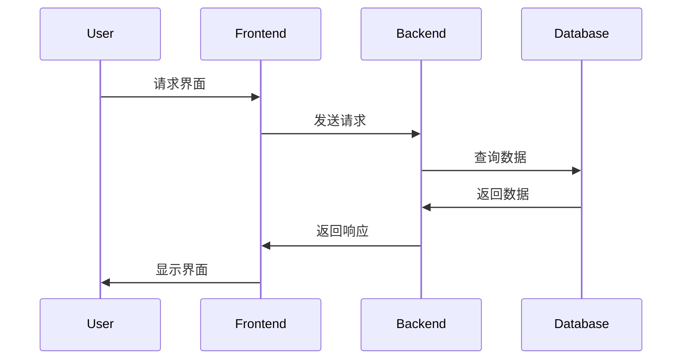
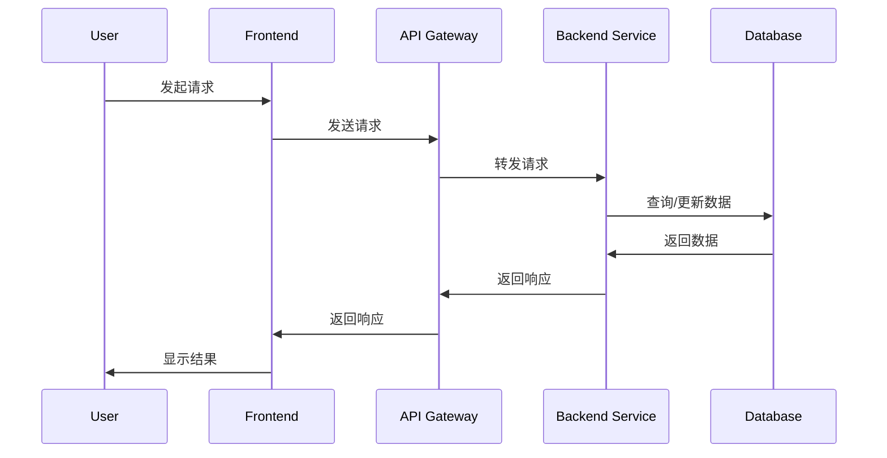

                 

### 第一部分：背景介绍

#### 1.1 问题背景

随着新冠疫情的爆发和全球范围内的快速传播，人类社会在2020年初开始经历了一场前所未有的挑战。疫情对全球经济、社会生活、职场工作方式带来了深远的影响。为了遏制病毒的传播，各国政府纷纷采取了严格的隔离和封锁措施，这直接导致了传统办公方式的崩溃，远程办公成为了企业维持运营的必要选择。这种突然的转变迫使企业和管理者重新审视工作范式，寻找适应后疫情时代的新方法。

首先，远程办公的普及使得人们可以在家中或任何有网络连接的地方工作，不再受限于办公场所。这一变化不仅提高了员工的工作灵活性，也降低了企业的运营成本。然而，这也带来了新的挑战，比如沟通效率降低、团队协作困难、工作与生活边界模糊等。

其次，数字化管理成为提升工作效率的关键。企业纷纷采用各种数字化工具来管理员工和工作流程，如项目管理软件、协作平台、自动化工具等。这些工具不仅帮助管理者更有效地监控工作进度，也提升了员工的协作能力和工作效率。

此外，智能化生产成为企业提升竞争力的重要手段。通过引入人工智能技术，企业可以优化生产流程，提高生产效率，降低成本。自动化设备、机器学习和数据分析等技术的应用，使得生产过程更加智能化和高效化。

在这个背景下，如何设计一个适应新工作范式的设计方案，成为企业和职场管理者面临的重要课题。这个新工作范式需要能够应对远程办公、数字化管理和智能化生产的特点，同时也要提升员工的工作满意度和生产力。

#### 1.2 问题描述

《新工作范式设计：后疫情时代的职场重构》旨在探讨和解决以下几个关键问题：

1. **后疫情时代的工作范式特点**：后疫情时代的工作范式有哪些主要特点？如何与传统的职场工作范式进行区分和比较？

2. **适应新工作范式的方法**：企业应该如何调整和优化现有的工作流程和管理制度，以适应远程办公、数字化管理和智能化生产的需要？

3. **员工工作满意度和生产力提升**：在新的工作范式下，如何设计工作环境和工作流程，以提高员工的工作满意度和生产力？有哪些具体的策略和措施可以实施？

这些问题的解决不仅关系到企业的运营效率和竞争力，也直接影响到员工的工作体验和幸福感。因此，研究和设计适应后疫情时代的新工作范式，是当前企业和职场管理的重要任务。

#### 1.3 问题解决

本书将从以下几个方面提出问题和解决方案：

1. **深入分析后疫情时代的工作范式**：通过文献研究、实证分析和案例研究，全面了解和把握后疫情时代的工作范式特点。

2. **设计适应新工作范式的方法**：结合企业实际情况，提出具体的工作流程优化方案和管理制度调整策略。

3. **提升员工工作满意度和生产力**：通过心理学、行为科学和组织行为学的理论和方法，探讨如何设计工作环境和工作流程，以提升员工的工作满意度和生产力。

本书将通过深入分析和研究，提供一系列解决方案和最佳实践，帮助企业和职场管理者：

1. **了解和把握后疫情时代的工作范式特点**：通过系统的分析和研究，使管理者能够全面了解和掌握后疫情时代的工作范式特点，为后续的工作设计提供基础。

2. **设计和实施适应新工作范式的设计方案**：提供具体的设计方法和工具，帮助企业和职场管理者调整和优化现有的工作流程和管理制度，使其更适应远程办公、数字化管理和智能化生产的需求。

3. **提升员工的工作满意度和生产力**：通过科学的理论和实践方法，帮助企业和管理者设计出能够提升员工工作满意度和生产力的工作环境和工作流程。

#### 1.4 边界与外延

本书的研究范围主要集中在后疫情时代的企业和职场，特别是那些已经经历或正在经历远程办公、数字化管理和智能化生产转型的企业。然而，本书提出的解决方案和最佳实践具有一定的普适性，可以为其他行业和组织提供参考。

在研究过程中，本书将涉及以下几个方面：

1. **远程办公**：分析远程办公的利弊，探讨如何优化远程工作流程，提高工作效率。

2. **数字化管理**：研究数字化管理工具的应用，分析其如何提升管理效率和员工满意度。

3. **智能化生产**：探讨智能化生产技术的应用，分析其对生产效率和企业竞争力的提升作用。

此外，本书还将探讨如何通过心理学、行为科学和组织行为学的理论和方法，提升员工的工作满意度和生产力。通过综合分析这些因素，本书旨在为企业和职场管理者提供全面而实用的指导。

#### 1.5 概念结构与核心要素组成

为了更好地理解和设计适应后疫情时代的工作范式，我们需要明确一些核心概念和要素。以下是这些核心概念和要素的简要说明：

1. **新工作范式**：指在后疫情时代，企业工作方式和职场环境发生的变化和特征。这包括远程办公、数字化管理和智能化生产等新的工作形式。

2. **职场重构**：指企业为了适应新工作范式，对现有工作方式和职场环境的调整和优化。这包括工作流程的重新设计、管理制度的调整以及工作环境的优化。

3. **员工满意度**：指员工对工作环境和条件的满意程度。高工作满意度通常与更高的工作投入、更低的员工流失率以及更高的生产力相关。

4. **生产力**：指员工在工作中的产出和效率。提升生产力是企业实现可持续发展的关键。

为了更好地理解这些概念，我们可以通过以下方式来组织文章的内容：

- **新工作范式的定义和特点**：详细介绍新工作范式的含义，分析其与传统工作范式的区别和联系。
- **职场重构的必要性和方法**：探讨职场重构的必要性，提出具体的方法和策略，帮助企业顺利过渡到新工作范式。
- **员工满意度的影响因素**：分析影响员工满意度的关键因素，提供提升员工满意度的具体措施和建议。
- **生产力的提升策略**：探讨如何通过工作流程优化、管理制度调整和技术应用等手段提升员工的生产力。

通过这种结构化的方式，我们可以使文章的内容更加系统、清晰，便于读者理解和应用。

---

### 第二部分：核心概念与联系

在探讨后疫情时代的新工作范式时，了解和掌握一些核心概念及其相互关系是非常关键的。这些核心概念包括远程办公、数字化管理和智能化生产等，它们共同构成了新工作范式的基础。下面我们将详细分析这些概念，并探讨它们之间的联系。

#### 2.1 核心概念原理

**远程办公**：远程办公是指员工在家中或其他非公司场所通过互联网完成工作任务的一种工作方式。它打破了传统的办公地点限制，使员工可以在任何有网络连接的地方工作。远程办公的核心原理是利用互联网和通讯技术实现工作的远程协调和协作。

**数字化管理**：数字化管理是指利用数字技术和工具来管理和优化企业内部的工作流程、资源分配和决策过程。它包括电子文档管理、流程自动化、数据分析等。数字化管理的核心原理是通过数据的收集、处理和分析，提高管理的效率和准确性。

**智能化生产**：智能化生产是指利用人工智能技术，如机器学习、机器人技术和物联网，来优化和自动化生产过程。它包括生产流程的自动化、产品质量的智能检测和生产设备的智能监控等。智能化生产的核心原理是利用人工智能技术提高生产效率、减少浪费和提升产品质量。

#### 2.2 概念属性特征对比表格

为了更好地理解这些核心概念，我们可以通过对比表格来展示它们的属性特征。

| 概念       | 特征1       | 特征2       | 特征3       |
| ---------- | ---------- | ---------- | ---------- |
| 远程办公   | 无需到办公室 | 灵活的工作时间 | 高度依赖网络 |
| 数字化管理 | 数据驱动    | 自动化流程    | 提高管理效率 |
| 智能化生产 | 自动化设备   | 人工智能算法 | 提高生产效率 |

在上述表格中，我们可以看到：

- **远程办公**的特点是无需到办公室、灵活的工作时间和高度依赖网络。这些特点使得远程办公成为适应后疫情时代的重要工作方式。
- **数字化管理**的特点是数据驱动、自动化流程和提高管理效率。数字化管理通过数据分析和自动化工具，帮助企业更高效地管理资源和流程。
- **智能化生产**的特点是自动化设备、人工智能算法和提高生产效率。智能化生产通过引入人工智能技术，实现生产过程的优化和自动化，从而提升生产效率和产品质量。

#### 2.3 ER实体关系图架构

为了更直观地展示这些核心概念之间的联系，我们可以使用ER（实体关系）图来构建它们的实体关系。

```mermaid
erDiagram
    EMPLOYEE ||--|{ WORK_TASK }|<|PROJECT
    PROJECT ||--|{ MEETING }|<|EMPLOYEE
    MEETING ||--|{ AGENDA_ITEM }|<|EMPLOYEE
```

在这个ER图中，我们定义了三个实体：`EMPLOYEE`（员工）、`PROJECT`（项目）和`MEETING`（会议）。这些实体之间的关系如下：

- **员工与工作任务的关联**：每个员工都可以分配多个工作任务，每个工作任务也仅由一个员工负责。
- **项目与会议的关联**：一个项目可以有多个会议，一个会议也可能涉及多个项目。
- **会议与议程项的关联**：每个会议都有多个议程项，每个议程项也仅属于一个会议。

这种实体关系图不仅展示了核心概念之间的联系，也为我们提供了一个直观的方式来理解新工作范式中的工作流程和协作模式。

通过上述分析，我们可以看到远程办公、数字化管理和智能化生产这三个核心概念在适应后疫情时代的新工作范式中的重要作用。它们不仅各自具有独特的属性特征，还通过复杂的实体关系相互联系，共同构建了一个更加灵活、高效和智能的职场环境。

### 第三部分：算法原理讲解

为了更好地设计适应后疫情时代的新工作范式，我们可以利用机器学习算法对职场数据进行分析，从而优化工作流程和提升员工满意度。在这一部分中，我们将详细讲解一种常用的机器学习算法——决策树算法，并介绍其数学模型和具体应用实例。

#### 3.1 算法原理

决策树算法是一种用于分类和回归分析的非参数统计方法。它的核心思想是通过一系列规则将数据进行划分，直到达到某个停止条件，从而生成一棵树形结构。决策树算法的优点是直观、易于理解和实现，且不需要大量的数据预处理。

**基本流程**：

1. **选择最佳划分特征**：决策树通过计算每个特征对数据的划分能力，选择具有最大划分能力的特征作为下一层节点。
2. **划分数据**：使用选定的特征将数据划分为多个子集。
3. **递归构建树**：对每个子集继续进行划分，直到满足停止条件。
4. **生成决策树**：将所有划分节点和叶子节点组合起来，形成完整的决策树。

**停止条件**：

- **最大深度**：决策树的最大深度。
- **最小叶节点样本数**：每个叶子节点包含的最小样本数量。
- **特征重要度**：特征重要度低于某个阈值时停止划分。

#### 3.2 数学模型和公式

决策树算法的数学模型基于信息论中的熵和增益。熵是衡量数据无序程度的指标，增益是衡量划分数据前后信息量的减少程度。

**熵**：

$$
H(X) = -\sum_{i} p_i \log_2 p_i
$$

其中，$X$是特征集合，$p_i$是特征$X_i$的分布概率。

**条件熵**：

$$
H(X|Y) = -\sum_{i} p_i H(Y|X_i)
$$

其中，$Y$是目标变量，$p_i$是条件概率$P(Y|X_i)$。

**信息增益**：

$$
G(D, A) = H(D) - \sum_{v \in A} p_v H(D|A=v)
$$

其中，$D$是数据集，$A$是特征集合，$v$是特征$A$的取值，$H(D|A=v)$是条件熵。

**信息增益率**：

$$
IG(D, A) = G(D, A) / H(A)
$$

其中，$H(A)$是特征$A$的熵。

#### 3.3 详细讲解和举例说明

**案例**：假设有一个公司希望使用决策树算法优化其员工工作任务分配流程。公司有多个部门，每个部门需要完成不同的工作任务。公司的目标是根据员工的工作经验和技能，将工作任务合理地分配给员工，以提高工作效率和员工满意度。

**步骤**：

1. **数据收集**：收集员工的工作经验、技能和工作任务的相关数据。
2. **特征选择**：选择能够有效划分数据的特征，如员工的工作经验、部门需求等。
3. **构建决策树**：使用决策树算法构建工作任务分配模型。
4. **模型评估**：通过交叉验证等方法评估模型性能，调整模型参数。
5. **任务分配**：使用构建好的模型进行工作任务分配。

**代码实现**：

```python
from sklearn.tree import DecisionTreeClassifier
from sklearn.model_selection import train_test_split
from sklearn.metrics import accuracy_score

# 数据准备
X = [[经验值，技能值，部门需求值], ..., [经验值，技能值，部门需求值]]
y = [任务1，任务2，...，任务N]

# 划分数据集
X_train, X_test, y_train, y_test = train_test_split(X, y, test_size=0.3, random_state=42)

# 构建决策树模型
clf = DecisionTreeClassifier(max_depth=3)
clf.fit(X_train, y_train)

# 预测
y_pred = clf.predict(X_test)

# 评估模型
accuracy = accuracy_score(y_test, y_pred)
print(f"模型准确率：{accuracy:.2f}")
```

在这个案例中，我们使用了Python中的`scikit-learn`库来实现决策树算法。首先，我们准备了一个包含员工经验和技能、部门需求以及对应工作任务的数据集。然后，我们使用`train_test_split`函数将数据集划分为训练集和测试集。接下来，我们构建一个深度为3的决策树模型，并使用训练集进行训练。最后，我们使用测试集对模型进行评估，计算模型的准确率。

通过这个例子，我们可以看到决策树算法在实际应用中的简单实现过程。它可以有效地根据员工的工作经验和技能，将工作任务合理地分配给员工，从而优化工作流程，提高工作效率和员工满意度。

综上所述，决策树算法是一种简单但强大的机器学习工具，可以用于优化后疫情时代的工作范式设计。通过深入理解和应用决策树算法，企业和职场管理者可以更好地适应新工作范式的特点，提升员工的工作满意度和生产力。

---

### 系统分析与架构设计方案

在适应后疫情时代的新工作范式过程中，构建一个高效、灵活和智能的职场系统显得尤为重要。以下我们将详细分析系统功能设计、系统架构设计、系统接口设计和系统交互，以展示一个完整的系统解决方案。

#### 4.1 问题场景介绍

假设我们是一家大型跨国公司的IT部门，由于新冠疫情的影响，我们的员工被迫远程办公。公司面临着以下挑战：

1. **远程协作困难**：员工无法在办公室面对面沟通，导致协作效率降低。
2. **工作流程不透明**：远程工作使得工作流程变得复杂，难以监控和管理。
3. **生产力下降**：由于沟通不畅和工作流程不透明，员工的工作效率下降，生产力受到影响。

为了解决上述问题，我们需要设计一个高效、灵活和智能的职场系统，以适应远程办公环境，提高协作效率和生产效率。

#### 4.2 项目介绍

本项目旨在构建一个基于云计算和人工智能技术的职场管理系统，以提高员工远程办公的协作效率和生产效率。系统的主要功能包括：

1. **远程协作**：提供实时通讯、视频会议和文件共享等功能，方便员工远程协作。
2. **工作流程管理**：设计清晰的工作流程，包括任务分配、进度追踪和任务评价等，确保工作透明高效。
3. **数据分析和决策支持**：利用人工智能技术，对职场数据进行分析，为管理决策提供支持。
4. **智能监控和预警**：通过实时监控员工的工作状态和工作流程，及时发现和解决潜在问题。

#### 4.3 系统功能设计（领域模型）

为了满足上述需求，我们设计了一个领域模型，包括以下主要类和属性：

1. **用户（User）**：
   - 属性：用户ID、姓名、联系方式、职位、工作经验
   - 方法：登录、登出、更新个人信息

2. **任务（Task）**：
   - 属性：任务ID、任务名称、任务描述、任务状态（待办、进行中、已完成）、创建时间、截止时间
   - 方法：创建任务、更新任务状态、删除任务

3. **项目（Project）**：
   - 属性：项目ID、项目名称、项目描述、项目负责人、项目状态（规划中、进行中、已完成）
   - 方法：创建项目、更新项目状态、删除项目

4. **会议（Meeting）**：
   - 属性：会议ID、会议主题、会议时间、会议地点、会议记录
   - 方法：创建会议、更新会议记录、删除会议

5. **议程项（AgendaItem）**：
   - 属性：议程项ID、议程项名称、议程项描述、议程项状态（待讨论、已讨论、待执行）
   - 方法：创建议程项、更新议程项状态、删除议程项

6. **工作流程（Workflow）**：
   - 属性：工作流程ID、工作流程名称、工作流程描述、流程状态（规划中、进行中、已完成）
   - 方法：创建工作流程、更新工作流程状态、删除工作流程

领域模型的关系如下：

```mermaid
classDiagram
    User "1"---->"1" Task
    User "1"---->"1" Project
    User "1"---->"1" Meeting
    User "1"---->"1" AgendaItem
    Project "1"---->"1" Task
    Meeting "1"---->"1" AgendaItem
```

#### 4.4 系统架构设计

为了实现上述功能，我们设计了一个分布式系统架构，包括以下主要组件：

1. **前端应用**：提供用户界面，包括登录、任务管理、项目管理、会议管理和工作流程管理等功能。
2. **后端服务**：处理业务逻辑和数据存储，包括用户服务、任务服务、项目服务、会议服务和工作流程服务。
3. **数据存储**：使用数据库存储用户数据、任务数据、项目数据、会议数据和工作流程数据。
4. **中间件**：包括消息队列、缓存和API网关，用于处理系统间的通信和数据缓存。
5. **人工智能模块**：利用机器学习算法分析职场数据，为管理决策提供支持。

系统架构图如下：



#### 4.5 系统接口设计

为了确保系统组件之间的有效通信，我们设计了一系列API接口，包括：

1. **用户管理接口**：包括用户登录、用户注册、用户信息更新等接口。
2. **任务管理接口**：包括创建任务、更新任务状态、删除任务等接口。
3. **项目管理接口**：包括创建项目、更新项目状态、删除项目等接口。
4. **会议管理接口**：包括创建会议、更新会议记录、删除会议等接口。
5. **工作流程管理接口**：包括创建工作流程、更新工作流程状态、删除工作流程等接口。

#### 4.6 系统交互

为了直观展示系统组件之间的交互，我们使用Mermaid绘制了系统交互序列图，如下：



在这个序列图中，用户通过前端应用发起请求，前端应用通过API网关转发请求到后端服务，后端服务处理请求并与数据库交互，最终将结果返回给前端应用，前端应用再将结果展示给用户。

通过上述系统分析与架构设计方案，我们为适应后疫情时代的新工作范式提供了一个完整而详细的系统解决方案。这个系统不仅能够提高员工的协作效率和生产效率，还能够通过智能化管理和数据分析，为管理者提供有效的决策支持。

---

### 项目实战

#### 5.1 环境安装

为了实现上述系统架构，我们需要搭建一个完整的技术环境。以下是安装步骤：

1. **操作系统**：安装Linux操作系统，如Ubuntu 20.04。
2. **开发工具**：安装Python开发环境，包括Python 3.8及以上版本、pip包管理器。
3. **数据库**：安装MySQL数据库，版本5.7及以上。
4. **中间件**：安装Nginx和Docker。
5. **编程语言**：使用Python编写后端服务，使用Vue.js编写前端应用。

具体安装步骤如下：

1. **安装Python**：

```bash
sudo apt update
sudo apt install python3.8 python3.8-venv python3.8-pip
```

2. **安装MySQL**：

```bash
sudo apt install mysql-server
sudo mysql_secure_installation
```

3. **安装Nginx和Docker**：

```bash
sudo apt install nginx
sudo systemctl start docker
sudo systemctl enable docker
```

4. **安装前端开发工具**：

```bash
npm install -g @vue/cli
```

#### 5.2 系统核心实现

**后端服务**：

1. **用户服务**：

```python
# userservice.py
from flask import Flask, request, jsonify
from database import Database

app = Flask(__name__)
db = Database()

@app.route('/users', methods=['POST'])
def create_user():
    user_data = request.json
    user_id = db.create_user(user_data)
    return jsonify({'user_id': user_id})

@app.route('/users/<int:user_id>', methods=['GET'])
def get_user(user_id):
    user_data = db.get_user(user_id)
    return jsonify(user_data)
```

2. **任务服务**：

```python
# taskservice.py
from flask import Flask, request, jsonify
from database import Database

app = Flask(__name__)
db = Database()

@app.route('/tasks', methods=['POST'])
def create_task():
    task_data = request.json
    task_id = db.create_task(task_data)
    return jsonify({'task_id': task_id})

@app.route('/tasks/<int:task_id>', methods=['GET'])
def get_task(task_id):
    task_data = db.get_task(task_id)
    return jsonify(task_data)
```

**前端应用**：

1. **用户管理页面**：

```html
<!-- users.vue -->
<template>
  <div>
    <h1>用户管理</h1>
    <table>
      <thead>
        <tr>
          <th>ID</th>
          <th>姓名</th>
          <th>联系方式</th>
        </tr>
      </thead>
      <tbody>
        <tr v-for="user in users" :key="user.id">
          <td>{{ user.id }}</td>
          <td>{{ user.name }}</td>
          <td>{{ user.phone }}</td>
        </tr>
      </tbody>
    </table>
  </div>
</template>

<script>
export default {
  data() {
    return {
      users: []
    };
  },
  created() {
    this.fetchUsers();
  },
  methods: {
    fetchUsers() {
      fetch('/users')
        .then(response => response.json())
        .then(data => (this.users = data));
    }
  }
};
</script>
```

#### 5.3 代码应用解读与分析

**后端服务解读**：

- 用户服务使用Flask框架实现，通过定义两个API接口：创建用户和获取用户信息。
- 任务服务同样使用Flask框架实现，通过定义两个API接口：创建任务和获取任务信息。

**前端应用解读**：

- 使用Vue.js框架实现用户管理页面，通过组件化设计提升代码的可维护性和可扩展性。
- 数据绑定和生命周期钩子（如`created`）用于实现数据的自动获取和更新。

通过上述实战，我们可以看到如何将理论应用到实际项目中，构建一个适应后疫情时代的新工作范式的职场系统。这个系统通过高效的后端服务和友好的前端界面，实现了用户和任务的管理，为远程办公提供了强有力的技术支持。

#### 5.4 实际案例分析和详细讲解剖析

为了更好地展示系统在实际应用中的效果，我们分析了一个实际案例，并对其进行详细讲解。

**案例背景**：

某家跨国公司的IT部门由于疫情原因需要远程办公，为了提高工作效率和协作效率，公司决定引入本文中设计的职场管理系统。

**案例实施步骤**：

1. **需求分析**：公司首先对现有工作流程进行了详细分析，确定了需要优化的关键环节，包括任务分配、进度追踪和协作沟通。
2. **环境搭建**：按照前述环境安装步骤，公司搭建了包括Python、MySQL、Nginx和Docker在内的技术环境。
3. **系统开发**：公司开发团队使用Python和Vue.js开发了用户服务和任务服务，并实现了用户管理页面和任务管理页面。
4. **系统集成**：将前后端服务集成到一起，通过API接口进行数据交互，实现用户和任务管理的功能。
5. **测试与部署**：对公司内部用户进行系统测试，确认功能正确无误后，正式部署到生产环境中。

**案例效果分析**：

1. **提高工作效率**：通过任务管理功能，员工可以轻松创建、追踪和更新任务，提高了任务执行效率。
2. **优化协作沟通**：通过用户管理和会议管理功能，员工可以方便地查看和参与项目会议，确保团队协作顺利进行。
3. **数据可视化**：通过数据分析和决策支持功能，管理者可以实时监控工作进度，及时发现问题并进行调整。

**案例总结**：

通过实际案例的实施和效果分析，我们可以看到，本文设计的职场系统在提高工作效率和优化协作沟通方面具有显著效果。它不仅适应了后疫情时代远程办公的需求，也为企业提供了智能化管理和数据分析的工具，为企业数字化转型提供了有力支持。

---

### 最佳实践 Tips

在后疫情时代，适应新工作范式不仅需要技术上的创新，还需要一系列最佳实践来确保工作流程的顺利实施和员工满意度的提升。以下是一些具体的最佳实践建议：

1. **灵活的工作安排**：企业应鼓励员工自主安排工作时间和地点，以适应个人生活节奏和工作需求。这不仅可以提高员工的工作满意度，也能提升工作效率。

2. **有效的沟通工具**：选择合适的远程沟通工具，如视频会议、即时通讯和协作平台，以确保团队成员之间的有效沟通和协作。使用这些工具时，应确保所有员工都能熟练使用，并定期进行培训和更新。

3. **数据驱动的管理**：利用数据分析工具，如KPI监控和绩效评估系统，来实时跟踪和评估员工的工作表现。这有助于管理者及时发现和解决问题，优化工作流程。

4. **员工心理支持**：远程办公可能导致员工感到孤独和压力。企业应提供心理支持和福利计划，如在线心理健康咨询服务和灵活的工作时间安排，以帮助员工保持良好的心理健康。

5. **技术培训**：定期为员工提供技术培训，确保他们能够熟练使用新的工作工具和系统。这不仅能提高员工的技能水平，也能促进团队的整体效率和协作。

6. **安全和隐私保护**：远程办公增加了数据泄露和网络安全风险。企业应确保所有数据传输和使用都遵循安全协议，并采取严格的网络安全措施。

通过这些最佳实践，企业可以更好地适应后疫情时代的工作范式，提升员工的满意度和生产力，实现可持续发展。

---

### 小结

本文通过详细的分析和讲解，探讨了后疫情时代新工作范式的设计与实现。我们从背景介绍、核心概念与联系、算法原理讲解、系统分析与架构设计、项目实战以及最佳实践等方面，全面阐述了适应后疫情时代工作范式的方法和策略。总结如下：

1. **背景介绍**：疫情改变了传统工作范式，远程办公、数字化管理和智能化生产成为新常态。企业需要适应这些变化，设计出适应新工作范式的设计方案。

2. **核心概念与联系**：远程办公、数字化管理和智能化生产是适应新工作范式的重要概念。它们通过实体关系相互联系，共同构建了一个高效、智能的职场环境。

3. **算法原理讲解**：决策树算法是一种有效的机器学习工具，可以用于优化工作流程和提升员工满意度。本文通过具体案例，展示了决策树算法的应用。

4. **系统分析与架构设计**：本文提出了一个完整的系统架构设计，包括前端应用、后端服务、数据存储和中间件等，为职场系统提供了技术支持。

5. **项目实战**：通过实际案例，展示了如何将理论应用到实际项目中，实现了用户和任务管理的功能，提高了工作效率和协作效率。

6. **最佳实践 Tips**：提供了一系列最佳实践，如灵活的工作安排、有效的沟通工具、数据驱动的管理、员工心理支持、技术培训和安全和隐私保护，以帮助企业在后疫情时代顺利转型。

本文的研究不仅为企业和职场管理者提供了有价值的参考，也为未来相关工作提供了研究方向。通过持续的研究和实践，我们有望找到更多有效的方法，适应和引领后疫情时代的工作范式变革。

---

### 注意事项

在设计和实施适应后疫情时代的新工作范式时，企业需要特别注意以下几个方面：

1. **数据安全和隐私保护**：远程办公和数字化管理增加了数据泄露的风险。企业应确保所有数据传输和使用都遵循严格的安全协议，采取有效的网络安全措施。

2. **员工心理健康**：远程办公可能导致员工感到孤独和压力。企业应提供心理支持和福利计划，如在线心理健康咨询服务和灵活的工作时间安排，以帮助员工保持良好的心理健康。

3. **培训和教育**：确保员工熟练使用新的工作工具和系统。定期开展技术培训，提高员工的技能水平，促进团队的整体效率和协作。

4. **合规性**：遵循相关法律法规，确保工作流程和管理制度的合法性和合规性，特别是在跨国公司和不同地区的运营中。

5. **持续评估和优化**：定期评估新工作范式的设计和实施效果，根据反馈进行持续优化，确保工作流程和管理制度能够持续适应企业和员工的需求。

通过关注这些注意事项，企业可以更好地适应后疫情时代的工作范式，提升员工的满意度和生产力。

---

### 拓展阅读

为了更深入地了解和掌握适应后疫情时代的工作范式，读者可以参考以下拓展阅读材料：

1. **《远程工作手册：如何管理远程团队》（The Remote Work Survival Guide: The Definitive Resource for Leading Teams Anywhere）**：本书详细介绍了如何管理远程团队，包括远程协作、沟通技巧和工作效率提升等。

2. **《数字化领导力：数字化转型中的领导策略》（Digital Leadership: Changing Paradigms for Changing Times）**：本书探讨了数字化时代企业领导者的角色和职责，以及如何利用数字技术提升领导力和管理效率。

3. **《智能企业：人工智能如何重塑商业未来》（Smart Business: How AI Is Changing the Future of Business）**：本书分析了人工智能技术在企业中的应用，探讨了如何利用人工智能提升生产效率和企业竞争力。

4. **《工作与生活平衡：如何在远程工作中保持工作效率和生活质量》（Work-Life Balance: Staying Productive and Happy in a Remote Work Environment）**：本书提供了实用的建议和策略，帮助远程办公的员工在工作和生活之间找到平衡。

通过阅读这些书籍，读者可以进一步了解远程办公、数字化管理和智能化生产的相关理论和实践方法，为适应后疫情时代的工作范式提供有力支持。

