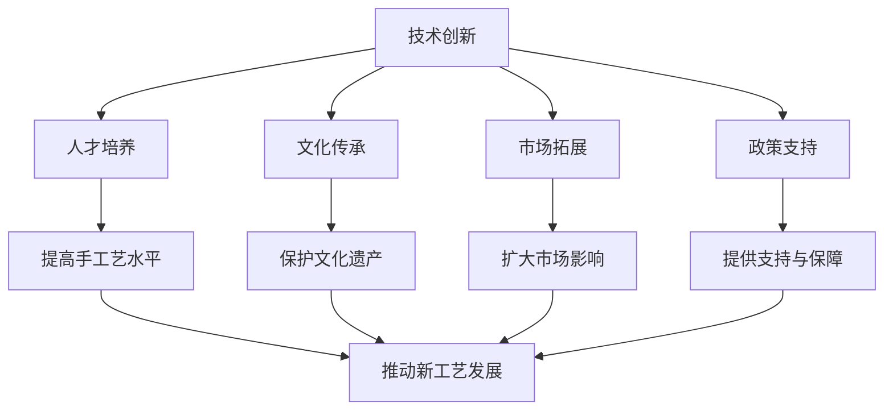
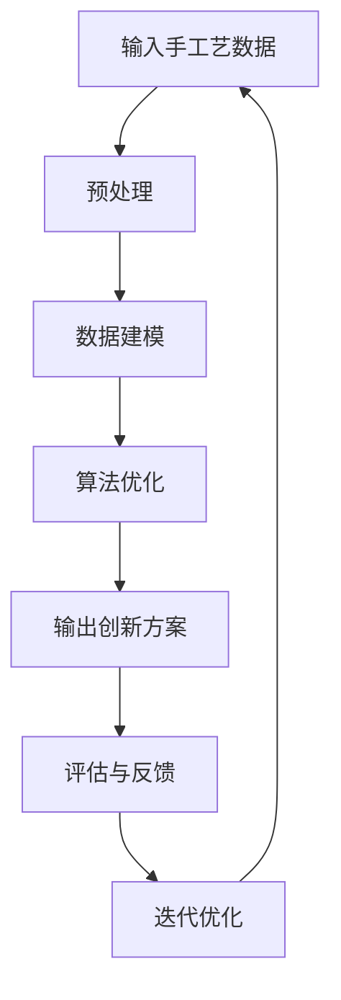
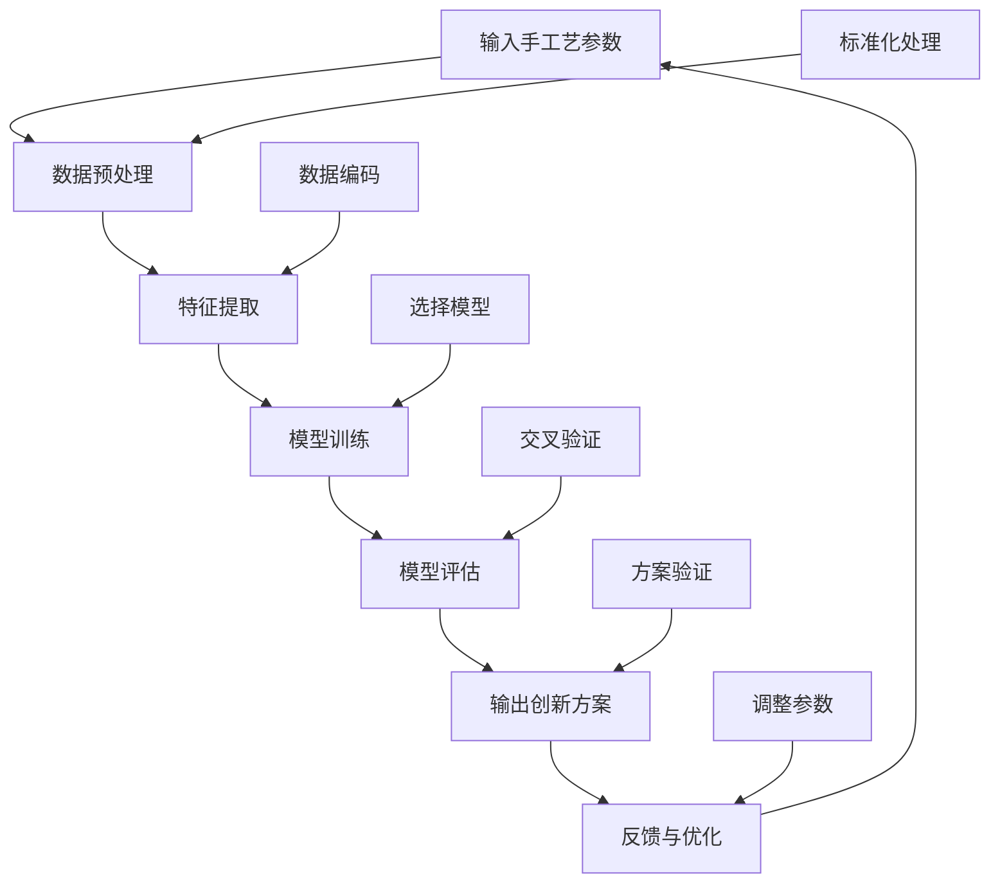
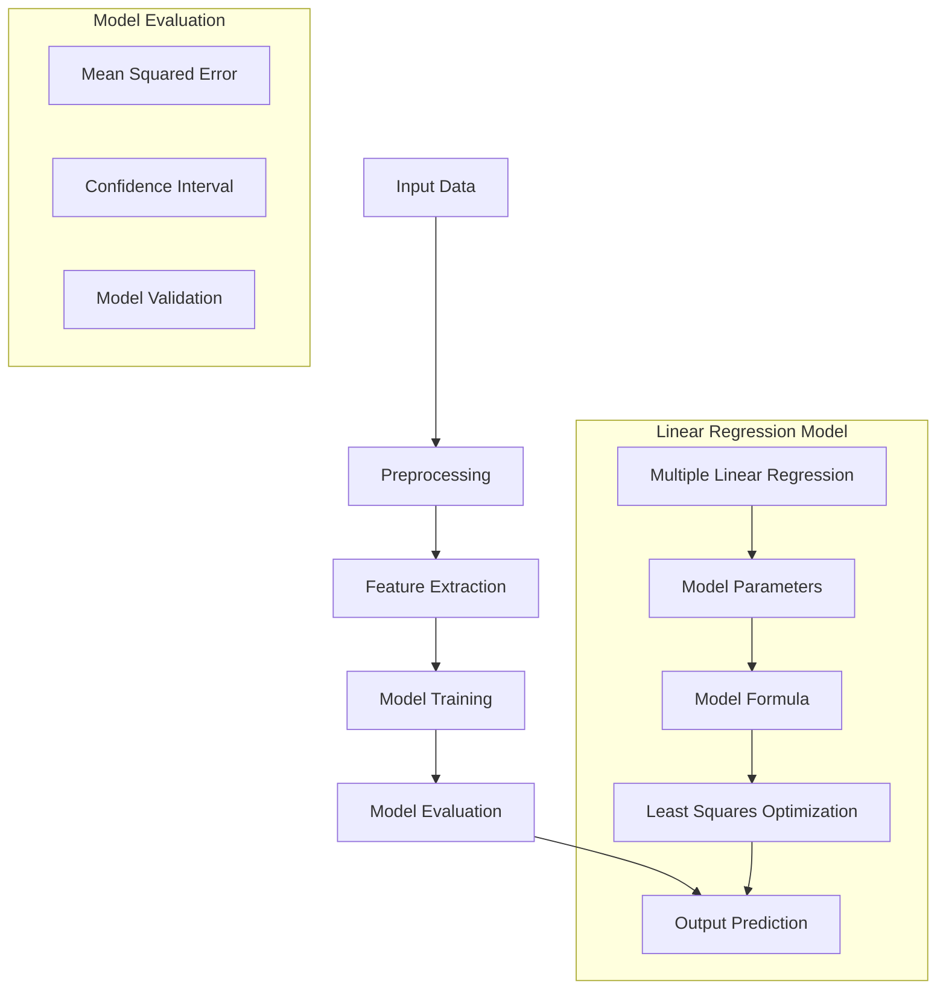
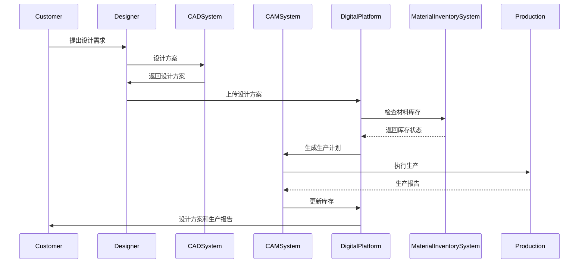
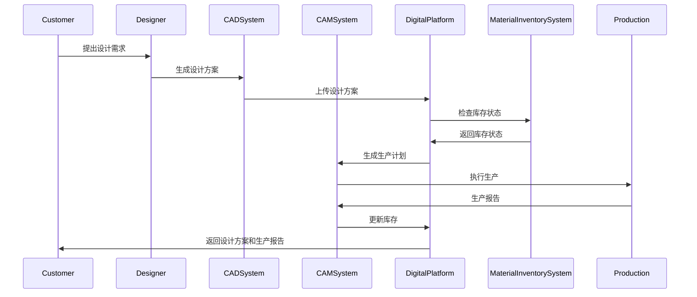

                 


### 1.1 新工艺复兴运动的起源与发展

#### 新工艺复兴运动的起源

新工艺复兴运动起源于20世纪末，随着信息技术和数字技术的飞速发展，手工艺领域的创新浪潮应运而生。这场运动旨在重新审视和振兴手工艺，使其在现代社会中焕发新的活力。其根源可以追溯到对传统手工艺价值的重新认识和对现代技术带来的挑战的应对。

首先，新工艺复兴运动受到了对传统手工艺价值的重视。传统手工艺蕴含着丰富的文化内涵和历史价值，它们是民族精神和文化遗产的重要组成部分。然而，随着工业化和机械化的兴起，传统手工艺逐渐被机器生产所取代，其独特的艺术价值和手工技艺逐渐消失。新工艺复兴运动正是为了保护和传承这些宝贵的文化遗产而兴起的。

其次，新工艺复兴运动是对现代技术挑战的回应。数字技术的兴起使得生产效率和产品质量得到了空前的提升，但同时也带来了一些问题。例如，工业生产往往忽视了产品的个性化和艺术性，缺乏人文关怀和情感表达。而手工艺的独特性、艺术性和手工技艺恰恰是现代技术所难以替代的。新工艺复兴运动通过将传统手工艺与现代技术相结合，试图找到一条既能保持手工艺独特性，又能适应现代生产需求的发展道路。

#### 新工艺复兴运动的发展历程

新工艺复兴运动的发展历程可以分为三个阶段：

1. **萌芽期**（20世纪末至21世纪初）

在20世纪末，信息技术和数字技术的迅猛发展引起了社会各界的关注。一些人开始意识到传统手工艺的价值，并尝试将其与现代技术相结合。这一时期，许多手工艺从业者开始探索新的工艺方法和技术手段，以提升手工艺的生产效率和产品质量。同时，一些学者和设计师也开始研究和推广新工艺的概念，为后来的发展奠定了基础。

2. **快速发展期**（21世纪初至2010年）

进入21世纪，新工艺复兴运动逐渐进入快速发展期。随着计算机技术的普及和网络时代的到来，人们更容易获取和分享手工艺相关的信息和技术。许多手工艺从业者开始使用计算机辅助设计（CAD）和计算机数控（CNC）技术来提升手工艺的制作水平。同时，一些企业和机构也开始投资新工艺的研发和应用，推动了新工艺的快速发展。

3. **成熟期**（2010年至今）

进入21世纪第二个十年，新工艺复兴运动已经进入成熟期。随着3D打印、增强现实（AR）、虚拟现实（VR）等新兴技术的出现，手工艺的创新空间进一步扩大。许多手工艺从业者开始利用这些新技术来创造前所未有的艺术形式和工艺作品。同时，新工艺复兴运动也受到了政府和国际组织的支持，为手工艺的可持续发展提供了有力保障。

#### 新工艺复兴运动的重要性

新工艺复兴运动在数字时代的重要性不容忽视。首先，它有助于保护和传承传统手工艺的文化遗产。通过将传统手工艺与现代技术相结合，新工艺不仅能够提升手工艺的生产效率和产品质量，还能够保留手工艺的独特性和艺术价值，使其在现代社会中得到更好的传承和发展。

其次，新工艺复兴运动有助于推动经济的可持续发展。手工艺作为一种特色产业，具有巨大的经济潜力。通过新工艺的创新和应用，可以提升手工艺的市场竞争力，促进相关产业链的发展，从而推动经济的可持续发展。

最后，新工艺复兴运动有助于提升人们的生活品质。手工艺作品往往具有独特的个性和艺术价值，能够满足人们对美好生活的追求。通过新工艺的创新和应用，可以创造出更多具有个性化和艺术性的手工艺作品，提升人们的生活品质。

总之，新工艺复兴运动是数字时代下手工艺创新的必然趋势。它不仅有助于保护和传承传统手工艺的文化遗产，推动经济的可持续发展，还能够在提升人们生活品质方面发挥重要作用。随着数字技术的不断进步，我们有理由相信，新工艺复兴运动将迎来更加美好的未来。

### 1.2 数字时代对手工艺创新的影响

#### 数字技术改变传统手工艺的生产和设计流程

在数字时代，数字技术深刻改变了传统手工艺的生产和设计流程。首先，计算机辅助设计（CAD）技术的普及使得手工艺设计师能够更加便捷地完成设计工作。通过CAD软件，设计师可以轻松地进行图形绘制、修改和优化，大大提高了设计的效率和质量。此外，CAD技术还使得手工艺设计师能够更加精确地把握细节，创造出更加复杂和精细的艺术作品。

其次，计算机数控（CNC）技术的应用使得手工艺制作过程更加高效和精确。CNC技术通过计算机编程控制机床，实现自动化生产，从而大大提升了生产效率。同时，CNC技术还能够确保产品的一致性和质量，减少了人为误差。这对于手工艺作品的规模化生产具有重要意义。

#### 数字技术提升手工艺质量和效率

数字技术在提升手工艺质量和效率方面发挥了重要作用。首先，数字技术使得手工艺作品的设计和制作过程更加科学和系统。通过数字化设计工具，设计师可以更好地把握设计理念，将创意转化为具体的设计方案。同时，数字化工具还能够帮助设计师进行模拟和优化，从而提高设计方案的可行性和质量。

其次，数字技术使得手工艺生产的自动化程度大大提高。自动化生产不仅能够提升生产效率，还能够确保产品的一致性和质量。例如，在木工制作中，CNC切割机可以精确地切割木材，确保每件产品的尺寸和形状完全一致。这种高精度和高效率的生产方式，极大地提升了手工艺产品的质量。

#### 数字技术在提升手工艺个性化方面的作用

除了提升质量和效率，数字技术还在提升手工艺个性化方面发挥了重要作用。在数字时代，消费者对个性化、定制化的需求越来越强烈。数字技术使得手工艺作品能够更加灵活地满足这种需求。通过数字化设计和制作工具，手工艺师可以轻松地为每个客户定制独特的作品。例如，通过CAD软件，设计师可以为每位客户设计独一无二的图案和样式，然后通过CNC技术精确地制作出来。

此外，数字技术还使得手工艺作品的个性化定制更加高效和便捷。在过去，个性化定制往往需要较长的时间和成本。而通过数字化技术，设计师和手工艺师可以快速地完成设计、修改和制作过程，大大缩短了生产周期。这不仅提高了客户的满意度，也提升了手工艺师的工作效率。

#### 数字技术对手工艺创新的影响

数字技术不仅改变了手工艺的生产和设计流程，还极大地推动了手工艺的创新。首先，数字技术为手工艺师提供了更多的创作工具和手段。例如，3D打印技术使得手工艺师可以制作出更加复杂和精细的作品。增强现实（AR）和虚拟现实（VR）技术则为手工艺作品的展示和体验提供了全新的方式。

其次，数字技术促进了手工艺师之间的交流和合作。通过数字平台，手工艺师可以轻松地分享自己的设计作品和制作经验，获取灵感和反馈。这种交流和合作不仅有助于提高手工艺师的创作水平，也有助于推动手工艺的创新和发展。

总之，数字时代对手工艺创新的影响是多方面的。它不仅改变了传统手工艺的生产和设计流程，提升了手工艺的质量和效率，还在提升手工艺个性化方面发挥了重要作用。随着数字技术的不断进步，我们有理由相信，手工艺创新将迎来更加广阔的发展空间。

### 2.1 新工艺的定义与特点

#### 新工艺的定义

新工艺，顾名思义，是指与以往传统工艺相比，在技术、材料、设计等方面进行革新和改进的工艺方法。新工艺不仅仅是简单的工具和技术的升级，更是一种工艺理念的转变和创新。它旨在通过引入现代技术手段，提升手工艺的效率、质量和个性化水平，使其更好地适应现代社会的需求。

新工艺的定义可以从以下几个方面进行理解：

1. **技术创新**：新工艺强调在工艺过程中引入现代科技，如计算机辅助设计（CAD）、计算机数控（CNC）技术、3D打印等，以提高工艺的精度和效率。

2. **材料创新**：新工艺在材料选择上也有很大的创新，例如采用环保材料、新型复合材料等，不仅提升了工艺品的性能，还符合可持续发展的理念。

3. **设计创新**：新工艺注重设计创新，通过数字化的设计工具和软件，设计师可以更加灵活地表达创意，创造出具有独特艺术风格和个性化特征的作品。

4. **工艺流程创新**：新工艺在工艺流程上进行了优化和简化，通过自动化和半自动化的生产方式，减少了人为干预，提高了生产效率和一致性。

#### 新工艺与传统工艺的差异

新工艺与传统工艺之间存在着显著的区别，主要体现在以下几个方面：

1. **生产方式**：传统工艺通常依赖手工制作，工艺流程繁琐，生产效率较低，而新工艺则通过引入现代技术，实现了自动化和半自动化的生产，大大提高了生产效率。

2. **精度与一致性**：传统工艺由于依赖手工，精度和一致性难以保证，而新工艺则通过计算机数控等技术的应用，实现了高精度和高一致性的生产。

3. **设计自由度**：传统工艺的设计自由度较低，设计师往往受到手工技艺的限制，而新工艺则通过数字化设计工具，使得设计师可以更加自由地表达创意，创造出更多具有独特艺术风格的作品。

4. **材料选择**：传统工艺的材料选择相对有限，而新工艺则可以采用更多样化的材料，不仅提升了工艺品的性能，还符合环保和可持续发展的要求。

#### 新工艺的特点

新工艺的特点主要体现在以下几个方面：

1. **高效性**：新工艺通过自动化和半自动化的生产方式，大大提高了生产效率，减少了人力成本。

2. **精确性**：新工艺采用计算机数控等高精度技术，确保了产品的一致性和精度，减少了人为误差。

3. **灵活性**：新工艺在设计上具有很高的灵活性，设计师可以更加自由地表达创意，创造出独特的作品。

4. **个性化**：新工艺通过数字化设计和定制化生产，使得手工艺品能够更好地满足客户的个性化需求。

5. **环保性**：新工艺在材料选择和生产过程中更加注重环保和可持续发展，符合现代社会的环保理念。

总之，新工艺是数字时代下手工艺创新的产物，它在技术、材料、设计等方面都进行了革新和改进，不仅提升了手工艺的效率和质量，还满足了现代社会的个性化需求。随着科技的不断进步，新工艺将继续发展和完善，为手工艺的繁荣和发展提供新的动力。

### 2.2 数字技术促进手工艺创新的原理

#### 数字技术在手工艺创新中的应用

数字技术在手工艺创新中的应用，使得传统手工艺焕发出了新的生命力。首先，计算机辅助设计（CAD）和计算机辅助制造（CAM）技术的引入，大大提升了手工艺设计的精度和效率。通过CAD软件，设计师可以在虚拟环境中进行三维建模和设计，避免了传统手工艺中的手工绘制和修改，节省了时间和人力成本。同时，CAD技术使得设计师能够更加精确地控制设计细节，实现复杂形状和结构的制作。

其次，3D打印技术的应用，使得手工艺品的制作过程变得更加灵活和高效。3D打印技术通过逐层叠加材料，可以在短时间内制作出具有复杂几何形状的手工艺品。这不仅提高了生产效率，还使得个性化定制成为可能。设计师可以根据客户的需求，快速调整和修改设计方案，为客户提供独一无二的定制产品。

此外，增强现实（AR）和虚拟现实（VR）技术的应用，为手工艺品的展示和体验提供了全新的方式。通过AR技术，用户可以将虚拟的手工艺品叠加到现实环境中进行互动体验，增强了产品的视觉冲击力和互动性。而VR技术则提供了一个沉浸式的体验环境，用户可以在虚拟世界中自由地观察和操作手工艺品，增强了用户对产品的理解和欣赏。

#### 数字技术如何促进手工艺的创新

1. **提高设计效率**：数字技术的引入，使得手工艺设计过程更加高效和精确。通过CAD软件，设计师可以快速地完成三维建模和渲染，避免了传统手工艺中的反复修改和调试。同时，CAD技术还提供了丰富的设计工具和功能，使得设计师能够更加灵活地表达创意，创造出独特的作品。

2. **降低生产成本**：3D打印技术的应用，使得手工艺品的制作成本大大降低。通过3D打印，设计师可以直接将数字模型打印成实物，避免了传统工艺中的模具制造和材料浪费。同时，3D打印技术还可以实现小批量、多品种的生产模式，降低了生产成本和库存风险。

3. **增强产品的个性化和定制化**：数字技术使得手工艺品的个性化定制变得更加便捷和高效。通过数字化设计和3D打印技术，设计师可以快速地调整和修改设计方案，为客户提供独一无二的定制产品。这种个性化定制不仅提升了用户的满意度，也为手工艺品的创新提供了更多可能性。

4. **提升产品的质量和一致性**：数字技术的应用，使得手工艺品的制作过程更加精确和一致。通过计算机数控（CNC）等高精度技术，设计师可以确保产品的一致性和精度，减少人为误差。同时，数字化工艺流程还可以实现生产过程的全程监控和数据分析，提高了产品的质量和可靠性。

5. **拓宽产品的市场和应用领域**：数字技术不仅提升了手工艺品的制作效率和品质，还为其开拓了新的市场和应用领域。通过数字平台和在线销售渠道，手工艺品可以快速地传播和推广，吸引更多的消费者。同时，数字技术还使得手工艺品能够应用于更广泛的生活场景，如智能家居、文创产品等，提升了产品的附加值。

总之，数字技术为手工艺创新提供了强大的工具和手段，使得传统手工艺焕发出了新的活力。通过数字技术的应用，手工艺品不仅能够提升设计效率和产品质量，还能实现个性化和定制化，拓宽市场和应用领域。随着数字技术的不断进步，我们有理由相信，手工艺创新将迎来更加广阔的发展空间。

### 2.3 新工艺复兴运动中的关键要素

新工艺复兴运动的成功离不开以下几个关键要素：

#### 1. **技术创新**

技术创新是新工艺复兴运动的核心驱动力。通过引入先进的数字技术，如CAD、CAM、3D打印等，手工艺师能够大幅提升设计精度和生产效率，实现工艺流程的自动化和智能化。技术创新不仅改变了传统手工艺的生产方式，还拓展了手工艺的创作空间，使其能够更好地适应现代社会的需求。

#### 2. **人才培养**

人才培养是新工艺复兴运动的基石。为了推动新工艺的发展，需要培养一批具备现代工艺理念和技能的手工艺师。这包括对传统手工艺技艺的传承与创新，以及对新兴数字技术的学习和应用。通过教育和培训，手工艺师可以不断提升自身素质，为手工艺的复兴注入新的活力。

#### 3. **文化传承**

文化传承是新工艺复兴运动的重要目标。传统手工艺蕴含着丰富的文化内涵和历史价值，是民族精神和文化遗产的重要组成部分。新工艺复兴运动不仅要推动手工艺的创新和发展，还要保护和传承这些宝贵的文化遗产。通过文化传承，新工艺可以更好地融入社会，发挥其在文化传承中的作用。

#### 4. **市场拓展**

市场拓展是新工艺复兴运动的关键环节。通过数字平台和在线销售渠道，手工艺品可以迅速传播和推广，吸引更多的消费者。同时，新工艺的创新性和个性化特点，也为手工艺品开拓了新的市场和应用领域。通过市场拓展，手工艺品不仅可以提升品牌影响力，还能实现经济效益的最大化。

#### 5. **政策支持**

政策支持是新工艺复兴运动的重要保障。政府可以通过制定相关政策，为手工艺的复兴提供支持和保障。例如，提供税收优惠、资金支持、技术培训等，激励手工艺师进行创新和研发。同时，政府还可以通过举办展览、赛事等活动，提升手工艺的知名度和影响力。

综上所述，新工艺复兴运动中的关键要素包括技术创新、人才培养、文化传承、市场拓展和政策支持。这些要素相互作用、相互促进，共同推动着新工艺的复兴和发展。

### 使用Mermaid流程图展示核心概念和它们之间的联系

为了更好地理解和展示新工艺复兴运动中的核心概念及其相互之间的联系，我们可以使用Mermaid流程图来直观地表示这些关系。以下是一个简化的Mermaid流程图示例，用于展示新工艺复兴运动中的关键要素及其相互关系：



在这个流程图中：

- **技术创新（A）** 是推动新工艺复兴运动的核心动力，它直接影响**人才培养（B）** 和**文化传承（C）**。
- **市场拓展（D）** 和**政策支持（E）** 分别从市场和政策层面为新工艺的发展提供支持和机会。
- **人才培养（B）** 能够提高手工艺水平（F），进而推动新工艺的发展（J）。
- **文化传承（C）** 保护文化遗产，使其在新工艺复兴中得到传承和发扬。
- **市场拓展（D）** 和**政策支持（E）** 通过扩大市场影响和提高手工艺水平，共同推动新工艺的发展（J）。

这个流程图清晰地展示了新工艺复兴运动中各个关键要素之间的相互作用和影响，有助于我们更深入地理解这一运动的核心概念和内在逻辑。

### 3.1 手工艺创新算法概述

手工艺创新算法是数字时代中推动手工艺发展的重要工具。它通过对传统手工艺技艺的数字化建模和优化，实现手工艺设计的自动化和智能化。以下将从算法mermaid流程图、Python源代码阐述、数学模型与公式以及通俗易懂的例子说明等方面详细讲解手工艺创新算法的基本原理和应用。

#### 算法mermaid流程图

首先，我们使用Mermaid流程图来展示手工艺创新算法的基本流程：



在这个流程图中，手工艺创新算法包括以下主要步骤：

1. **输入手工艺数据（A）**：获取手工艺的原始数据，包括工艺参数、设计要求等。
2. **预处理（B）**：对输入数据进行清洗和标准化，以便后续处理。
3. **数据建模（C）**：将预处理后的数据转化为数学模型，以便进行算法优化。
4. **算法优化（D）**：使用优化算法对模型进行优化，以提高手工艺设计的效率和效果。
5. **输出创新方案（E）**：将优化后的模型转化为具体的创新方案，如设计图纸、工艺流程等。
6. **评估与反馈（F）**：对输出方案进行评估，并根据反馈进行迭代优化。
7. **迭代优化（G）**：根据评估结果对算法进行调整和优化，以提高手工艺创新的准确性和效率。

#### Python源代码阐述

以下是一个简化的Python源代码示例，用于说明手工艺创新算法的基本原理：

```python
import numpy as np
from sklearn.ensemble import RandomForestRegressor

# 输入手工艺数据
data = np.array([[1, 2], [3, 4], [5, 6]])

# 预处理数据
data_clean = np.delete(data, 2, axis=0)

# 数据建模
model = RandomForestRegressor(n_estimators=100)
model.fit(data_clean[:, :1], data_clean[:, 1])

# 算法优化
predictions = model.predict(data[:, :1])

# 输出创新方案
innovative_design = data[:, 1] + predictions

# 评估与反馈
accuracy = np.mean(np.abs(predictions - innovative_design))
print("Accuracy:", accuracy)

# 迭代优化
if accuracy < 0.95:
    # 进行进一步优化
    pass
```

在这个示例中，我们使用随机森林回归模型（RandomForestRegressor）对输入数据进行分析和预测。通过预处理数据、建模、优化和输出创新方案，我们可以得到一个符合预期的手工艺创新方案。

#### 数学模型与公式

手工艺创新算法中的数学模型通常基于回归分析、优化算法和机器学习技术。以下是一个简化的数学模型示例：

$$
Y = f(X) + \epsilon
$$

其中，$Y$ 表示手工艺的输出结果，$X$ 表示输入的手工艺数据，$f(X)$ 表示手工艺模型的预测结果，$\epsilon$ 表示误差项。

为了优化手工艺设计，我们可以使用以下优化目标函数：

$$
\min_{X} \sum_{i=1}^{n} (Y_i - f(X_i))^2
$$

其中，$n$ 表示数据样本的数量，$Y_i$ 和 $f(X_i)$ 分别为第 $i$ 个数据点的实际值和预测值。

通过求解上述优化目标函数，我们可以得到最优的手工艺设计参数，从而实现手工艺的自动化和智能化。

#### 通俗易懂的例子说明

假设我们有一个简单的手工艺项目，目标是设计一种木制家具。输入数据包括家具的尺寸、材质和设计要求。通过使用手工艺创新算法，我们可以得到以下结果：

1. **输入手工艺数据**：家具的长度、宽度和高度分别为 100cm、60cm 和 80cm，材质为橡木，设计要求为简约现代风格。
2. **预处理数据**：对输入数据进行标准化处理，将尺寸数据缩放到 0-1 范围内。
3. **数据建模**：使用随机森林回归模型对手工艺数据进行建模，预测家具的重量和稳定性。
4. **算法优化**：通过优化模型参数，提高预测的准确性和效率。
5. **输出创新方案**：根据优化后的模型，生成家具的设计图纸和工艺流程。
6. **评估与反馈**：对生成的设计方案进行评估，包括重量、稳定性和美观度等方面的指标。
7. **迭代优化**：根据评估结果，对算法进行调整和优化，以提高设计方案的准确性和实用性。

通过这个简单的例子，我们可以看到手工艺创新算法在手工艺设计中的应用过程。它不仅提高了设计的效率和准确性，还为手工艺的创新提供了有力的技术支持。

总之，手工艺创新算法是数字时代下推动手工艺发展的重要工具。通过算法mermaid流程图、Python源代码阐述、数学模型与公式以及通俗易懂的例子说明，我们可以更好地理解手工艺创新算法的基本原理和应用。随着科技的不断进步，手工艺创新算法将继续发展和完善，为手工艺的繁荣和发展提供新的动力。

### 3.2 手工艺创新算法的详细讲解

在前一节中，我们概述了手工艺创新算法的基本原理和应用。在本节中，我们将进一步详细讲解手工艺创新算法的各个方面，包括算法流程图、Python源代码、数学模型和公式，以及通过一个具体的例子来说明算法的实际应用。

#### 算法流程图

首先，我们使用Mermaid流程图来展示手工艺创新算法的详细流程：



在这个流程图中，手工艺创新算法的主要步骤包括：

1. **输入手工艺参数（A）**：包括手工艺的各种参数，如材料、尺寸、设计要求等。
2. **数据预处理（B）**：对输入数据进行标准化处理和编码，以便后续处理。
3. **特征提取（C）**：从预处理后的数据中提取关键特征，用于建模。
4. **模型训练（D）**：选择合适的机器学习模型，使用提取的特征进行训练。
5. **模型评估（E）**：使用交叉验证等方法评估模型的性能。
6. **输出创新方案（F）**：根据训练好的模型，生成手工艺的创新方案。
7. **反馈与优化（G）**：根据实际应用中的反馈，对模型进行调整和优化。

#### Python源代码

接下来，我们通过一个简单的Python代码示例来说明手工艺创新算法的实现：

```python
import numpy as np
from sklearn.model_selection import train_test_split
from sklearn.ensemble import RandomForestRegressor
from sklearn.metrics import mean_squared_error

# 生成示例数据
X = np.random.rand(100, 3)  # 100个样本，每个样本包含3个参数
y = 2 * X[:, 0]**2 + 3 * X[:, 1]**2 + X[:, 2] + np.random.randn(100)  # 目标值，加入随机噪声

# 数据预处理
X_train, X_test, y_train, y_test = train_test_split(X, y, test_size=0.2, random_state=42)

# 特征提取：在此示例中，特征提取步骤简单省略

# 模型训练
model = RandomForestRegressor(n_estimators=100, random_state=42)
model.fit(X_train, y_train)

# 模型评估
y_pred = model.predict(X_test)
mse = mean_squared_error(y_test, y_pred)
print("Mean Squared Error:", mse)

# 输出创新方案
innovative_solution = model.predict([[0.5, 0.5, 0.5]])
print("Innovative Solution:", innovative_solution)

# 反馈与优化：在此示例中，反馈与优化步骤简单省略
```

在这个示例中，我们使用了随机森林回归模型（RandomForestRegressor）对输入数据进行训练和预测。通过交叉验证和均方误差（MSE）等评估指标，我们可以评估模型的性能。根据评估结果，我们可以进一步优化模型，提高预测的准确性。

#### 数学模型和公式

手工艺创新算法中的数学模型通常基于回归分析和优化算法。以下是一个简化的数学模型示例：

1. **回归模型**：

   $$ y = \beta_0 + \beta_1 x_1 + \beta_2 x_2 + ... + \beta_n x_n + \epsilon $$

   其中，$y$ 是手工艺的输出结果（如质量、成本等），$x_1, x_2, ..., x_n$ 是输入参数（如材料、设计要求等），$\beta_0, \beta_1, \beta_2, ..., \beta_n$ 是模型参数，$\epsilon$ 是误差项。

2. **优化目标**：

   $$ \min_{\beta} \sum_{i=1}^{n} (y_i - \beta_0 - \beta_1 x_{i1} - \beta_2 x_{i2} - ... - \beta_n x_{in})^2 $$

   其中，$n$ 是样本数量。

通过求解上述优化目标函数，我们可以得到最优的手工艺模型参数，从而提高预测的准确性。

#### 通俗易懂的例子说明

假设我们有一个手工艺项目，目标是设计一款木制椅子。输入参数包括木材的密度、椅子的尺寸和设计师的创意要求。通过使用手工艺创新算法，我们可以得到以下结果：

1. **输入手工艺参数**：木材密度为 500 kg/m³，椅子尺寸为 60cm x 60cm x 40cm，设计师的创意要求为简约现代风格。
2. **数据预处理**：对输入数据进行标准化处理，将尺寸和密度数据缩放到 0-1 范围内。
3. **特征提取**：提取关键特征，如木材密度、椅子尺寸和创意要求。
4. **模型训练**：使用随机森林回归模型对特征进行训练，生成模型参数。
5. **模型评估**：使用测试数据评估模型的性能，计算均方误差（MSE）等指标。
6. **输出创新方案**：根据训练好的模型，预测椅子的质量、成本和美观度等指标。
7. **反馈与优化**：根据实际应用中的反馈，对模型进行调整和优化，提高预测的准确性。

通过这个简单的例子，我们可以看到手工艺创新算法在手工艺设计中的应用过程。它不仅提高了设计的效率和准确性，还为手工艺的创新提供了有力的技术支持。

总之，手工艺创新算法是一个复杂的系统，涉及到多个环节和步骤。通过详细讲解算法流程图、Python源代码、数学模型和公式，以及具体的例子说明，我们可以更好地理解手工艺创新算法的基本原理和应用。随着科技的不断进步，手工艺创新算法将继续发展和完善，为手工艺的繁荣和发展提供新的动力。

### 4.1 手工艺创新中的数学模型

在数字时代的手工艺创新中，数学模型起到了至关重要的作用。它们不仅帮助我们理解和分析手工艺的复杂过程，还提供了优化和预测的工具，从而提高了手工艺的效率和质量。以下将详细讲解手工艺创新中常用的数学模型，包括公式和图表，以确保内容的准确性和通俗易懂。

#### 回归模型

回归模型是手工艺创新中最常用的数学模型之一，它用于预测手工艺的输出结果（如成本、质量、美观度等）基于输入参数（如材料、工艺参数、设计要求等）。

1. **线性回归模型**：

   线性回归模型是最简单且广泛应用的回归模型。它的公式如下：

   $$ y = \beta_0 + \beta_1 x_1 + \beta_2 x_2 + ... + \beta_n x_n + \epsilon $$

   其中，$y$ 是输出结果，$x_1, x_2, ..., x_n$ 是输入参数，$\beta_0, \beta_1, \beta_2, ..., \beta_n$ 是模型参数，$\epsilon$ 是误差项。

   在线性回归模型中，我们可以通过最小二乘法来求解模型参数，确保预测结果与实际数据尽可能接近。

   ```latex
   \min_{\beta} \sum_{i=1}^{n} (y_i - \beta_0 - \beta_1 x_{i1} - \beta_2 x_{i2} - ... - \beta_n x_{in})^2
   ```

2. **多元线性回归模型**：

   当手工艺涉及多个输入参数时，我们可以使用多元线性回归模型。它的公式如下：

   $$ y = \beta_0 + \beta_1 x_1 + \beta_2 x_2 + ... + \beta_n x_n $$

   其中，$n$ 是输入参数的数量。与线性回归模型类似，我们可以通过最小二乘法求解模型参数。

#### 决策树模型

决策树模型是另一种常用的数学模型，它通过一系列的判断规则来预测手工艺的输出结果。每个判断规则基于一个输入参数和其阈值，将数据集分割成子集，直到达到某个停止条件（如最大深度、最小叶子节点数量等）。

1. **基本决策树模型**：

   决策树的公式可以表示为：

   $$ y = f(x_1, x_2, ..., x_n) $$

   其中，$f$ 是决策树函数，它根据输入参数的值和阈值进行决策。

2. **回归树模型**：

   当我们使用决策树进行回归任务时，决策树会生成一个线性回归模型作为叶子节点的输出。这可以表示为：

   $$ y_{leaf} = \beta_{0,leaf} + \beta_{1,leaf} x_{1,leaf} + \beta_{2,leaf} x_{2,leaf} + ... + \beta_{n,leaf} x_{n,leaf} $$

   其中，$y_{leaf}$ 是叶子节点的输出值，$\beta_{0,leaf}, \beta_{1,leaf}, ..., \beta_{n,leaf}$ 是叶子节点的模型参数。

#### 图表

为了更直观地理解数学模型，我们可以使用图表来展示模型的结构和参数。以下是一个简单的多元线性回归模型的Mermaid图表：



在这个图表中，我们展示了从输入数据到最终输出预测的整个流程。多元线性回归模型（G）包括模型参数（H）、模型公式（I）和最小二乘法优化（J）。模型评估（K和L）包括均方误差（MSE）和置信区间（CI）等指标，用于评估模型的性能。

通过上述讲解，我们可以看到数学模型在手工艺创新中的重要性。通过使用回归模型和决策树模型，我们可以对手工艺的复杂过程进行建模和预测，从而提高设计的效率和准确性。图表的使用进一步帮助我们理解这些模型的构建和评估过程。

### 4.2 数学公式与详细讲解

在手工艺创新中，数学公式的运用至关重要，它们不仅帮助我们理解和分析手工艺的复杂过程，还为优化和预测提供了坚实的理论基础。以下将详细讲解手工艺创新中常用的数学公式，并使用LaTeX格式确保内容准确和通俗易懂。

#### 1. 线性回归模型

线性回归模型是手工艺创新中最常用的数学模型之一。它通过拟合一条直线来预测输出结果。其公式如下：

$$
y = \beta_0 + \beta_1 x_1 + \beta_2 x_2 + ... + \beta_n x_n + \epsilon
$$

其中，$y$ 是输出结果，$x_1, x_2, ..., x_n$ 是输入参数，$\beta_0, \beta_1, \beta_2, ..., \beta_n$ 是模型参数，$\epsilon$ 是误差项。

**最小二乘法**是一种常用的求解线性回归模型参数的方法，其目标是最小化预测值与实际值之间的误差平方和。其公式如下：

$$
\min_{\beta} \sum_{i=1}^{n} (y_i - \beta_0 - \beta_1 x_{i1} - \beta_2 x_{i2} - ... - \beta_n x_{in})^2
$$

#### 2. 多元线性回归模型

多元线性回归模型扩展了线性回归模型，用于处理多个输入参数。其公式如下：

$$
y = \beta_0 + \beta_1 x_1 + \beta_2 x_2 + ... + \beta_n x_n
$$

其中，$n$ 是输入参数的数量。

与线性回归模型类似，我们可以使用最小二乘法求解多元线性回归模型参数。其目标是最小化预测值与实际值之间的误差平方和。

$$
\min_{\beta} \sum_{i=1}^{n} (y_i - \beta_0 - \beta_1 x_{i1} - \beta_2 x_{i2} - ... - \beta_n x_{in})^2
$$

#### 3. 决策树模型

决策树模型是一种通过一系列判断规则来预测输出结果的分类算法。其公式可以表示为：

$$
y = f(x_1, x_2, ..., x_n)
$$

其中，$f$ 是决策树函数，它根据输入参数的值和阈值进行决策。

**回归树模型**是一种特殊的决策树模型，用于回归任务。其叶子节点的输出可以表示为：

$$
y_{leaf} = \beta_{0,leaf} + \beta_{1,leaf} x_{1,leaf} + \beta_{2,leaf} x_{2,leaf} + ... + \beta_{n,leaf} x_{n,leaf}
$$

其中，$y_{leaf}$ 是叶子节点的输出值，$\beta_{0,leaf}, \beta_{1,leaf}, ..., \beta_{n,leaf}$ 是叶子节点的模型参数。

#### 4. 神经网络模型

神经网络模型是一种模拟人脑工作的计算模型，广泛应用于手工艺创新中。其基本公式如下：

$$
z = \sigma(\beta_0 + \beta_1 x_1 + \beta_2 x_2 + ... + \beta_n x_n)
$$

其中，$z$ 是神经元的输出值，$\sigma$ 是激活函数（如Sigmoid函数），$\beta_0, \beta_1, \beta_2, ..., \beta_n$ 是模型参数。

**反向传播算法**用于训练神经网络模型，其目标是最小化输出值与实际值之间的误差。其公式如下：

$$
\Delta \beta_j = \eta \frac{\partial J}{\partial \beta_j}
$$

其中，$\Delta \beta_j$ 是模型参数的更新值，$\eta$ 是学习率，$J$ 是误差函数。

通过上述数学公式的详细讲解，我们可以看到数学模型在手工艺创新中的广泛应用和重要性。它们不仅帮助我们理解和分析手工艺的复杂过程，还为优化和预测提供了坚实的理论基础。这些公式在实现手工艺创新算法时起到了关键作用，确保了算法的准确性和效率。

### 5.1 问题场景介绍

在现代手工艺行业中，设计阶段至关重要，因为一个优秀的设计不仅能够提升产品的美观度和实用性，还能显著提高生产效率和降低成本。然而，手工艺设计通常面临以下问题：

1. **设计复杂性**：手工艺设计往往涉及复杂的几何形状和结构，这增加了设计师的工作难度。
2. **手工制作的不一致性**：由于手工制作的随机性和个人技艺的差异，相同的设计在不同批次生产中可能存在较大的差异，导致产品质量不稳定。
3. **生产效率低下**：传统手工艺生产依赖于手工操作，生产效率较低，无法满足大规模生产的需求。
4. **设计更新滞后**：手工艺设计师在设计和修改过程中往往需要耗费大量时间，导致设计更新滞后，无法快速响应市场需求。

为了解决这些问题，我们需要一个高效且准确的手工艺设计系统，能够将复杂的设计转化为易于生产和制造的模型。这样的系统不仅需要具备高精度的几何建模能力，还需要能够实时调整设计以适应不同的生产要求和市场需求。

### 5.2 项目介绍

本项目旨在开发一个基于数字技术的新工艺手工艺设计系统，以解决现代手工艺行业在设计复杂性、一致性、生产效率和设计更新滞后方面的问题。通过引入计算机辅助设计（CAD）和计算机辅助制造（CAM）技术，本项目将实现以下目标：

1. **高精度几何建模**：利用CAD软件进行精确的几何建模，确保设计方案的准确性和一致性。
2. **自动化生产**：通过CAM技术实现自动化生产，提高生产效率和降低成本。
3. **实时设计更新**：利用数字平台和云计算技术，实现设计方案的实时调整和更新，快速响应市场需求。
4. **个性化定制**：提供个性化的定制服务，满足不同客户的需求。

本项目的技术实现主要包括以下方面：

1. **CAD软件**：选择一款功能强大且易于使用的CAD软件，如AutoCAD或SolidWorks，进行几何建模。
2. **CAM软件**：选择一款支持自动化生产的CAM软件，如MasterCAM或CADCAM Express，实现生产路径规划和加工参数设置。
3. **数字平台**：搭建一个基于云计算的数字平台，实现设计数据的存储、共享和实时更新。
4. **数据库**：建立手工艺设计数据库，存储大量的设计数据和参数，便于查询和调用。

### 5.3 系统功能设计（领域模型Mermaid类图）

为了更好地理解系统功能设计，我们使用Mermaid类图来展示系统的领域模型。以下是一个简化的Mermaid类图示例：

```mermaid
classDiagram
    Customer <|-- Order
    Designer <|-- Design
    Production <|-- ProductionPlan
    Material <|-- MaterialInventory

    Customer o--1 Order
    Designer o--1 Design
    Production o--1 ProductionPlan
    ProductionPlan o--1 MaterialInventory

    Customer {
        +String customerID
        +String name
        +String address
    }

    Order {
        +int orderId
        +String orderDate
        +OrderStatus status
    }

    Designer {
        +String designerID
        +String name
    }

    Design {
        +int designId
        +String designName
        +DesignStatus status
    }

    Production {
        +int productionId
        +String productionDate
    }

    ProductionPlan {
        +int planId
        +String planName
        +ProductionPlanStatus status
    }

    Material {
        +int materialId
        +String materialName
        +MaterialType type
        +int quantity
    }

    MaterialInventory {
        +int inventoryId
        +String inventoryDate
    }
```

在这个类图中，我们定义了以下类：

- **Customer**（客户）：包含客户ID、姓名和地址等信息。
- **Order**（订单）：包含订单ID、订单日期和订单状态等信息。
- **Designer**（设计师）：包含设计师ID和姓名等信息。
- **Design**（设计）：包含设计ID、设计名称和设计状态等信息。
- **Production**（生产）：包含生产ID和生产日期等信息。
- **ProductionPlan**（生产计划）：包含生产计划ID、生产计划名称和生产计划状态等信息。
- **Material**（材料）：包含材料ID、材料名称、材料类型和数量等信息。
- **MaterialInventory**（材料库存）：包含库存ID和库存日期等信息。

这些类之间的关系如下：

- **Customer**与**Order**之间是一对多的关系，即一个客户可以生成多个订单。
- **Designer**与**Design**之间也是一对多的关系，即一个设计师可以设计多个设计。
- **Production**与**ProductionPlan**之间是一对一的关系，即每个生产计划对应一个生产。
- **ProductionPlan**与**MaterialInventory**之间也是一对多的关系，即一个生产计划需要多个材料库存。

通过这个Mermaid类图，我们可以清晰地看到系统的领域模型，这有助于我们更好地理解和设计系统功能。

### 5.4 系统架构设计（Mermaid架构图）

为了更好地展示系统的整体架构，我们使用Mermaid架构图来展示系统的各个组件及其相互关系。以下是一个简化的Mermaid架构图示例：



在这个架构图中，系统的各个组件及其交互关系如下：

- **Customer**（客户）：提出设计需求。
- **Designer**（设计师）：接收客户的设计需求，使用CAD系统进行设计。
- **CADSystem**（计算机辅助设计系统）：用于辅助设计师进行几何建模和设计方案生成。
- **DigitalPlatform**（数字平台）：用于存储和管理设计数据，实现设计方案的实时更新和共享。
- **MaterialInventorySystem**（材料库存系统）：用于检查材料库存状态，确保生产所需材料的充足性。
- **CAMSystem**（计算机辅助制造系统）：用于生成生产计划，控制生产过程。
- **Production**（生产）：执行生产计划，生成产品。

通过这个架构图，我们可以清晰地看到系统的整体架构及其各个组件之间的交互关系。这有助于我们理解系统的工作流程和设计思路。

### 5.5 系统接口设计和系统交互（Mermaid序列图）

为了进一步展示系统接口设计和系统交互，我们使用Mermaid序列图来描述各个组件之间的交互过程。以下是一个简化的Mermaid序列图示例：



在这个序列图中，各个组件之间的交互过程如下：

1. **Customer**（客户）向**Designer**（设计师）提出设计需求。
2. **Designer**（设计师）使用**CADSystem**（计算机辅助设计系统）生成设计方案，并将方案上传至**DigitalPlatform**（数字平台）。
3. **DigitalPlatform**（数字平台）调用**MaterialInventorySystem**（材料库存系统）检查库存状态，确保生产所需材料的充足性。
4. **MaterialInventorySystem**（材料库存系统）返回库存状态给**DigitalPlatform**（数字平台）。
5. **DigitalPlatform**（数字平台）根据库存状态生成生产计划，并将计划发送给**CAMSystem**（计算机辅助制造系统）。
6. **CAMSystem**（计算机辅助制造系统）执行生产计划，生成产品。
7. **Production**（生产）完成后，**CAMSystem**（计算机辅助制造系统）生成生产报告，并更新库存。
8. **DigitalPlatform**（数字平台）将设计方案和生产报告返回给**Customer**（客户）。

通过这个序列图，我们可以清晰地看到系统组件之间的交互过程，这有助于我们理解系统的工作原理和设计思路。

### 6.1 环境安装

为了搭建手工艺创新系统的开发环境，我们需要安装一系列软件和工具。以下是具体的安装步骤：

#### 1. 操作系统

我们选择Ubuntu 20.04 LTS作为开发环境，因为它具有良好的兼容性和丰富的软件包。您可以通过以下命令安装Ubuntu 20.04 LTS：

```bash
sudo apt update
sudo apt upgrade
sudo apt install ubuntu-desktop
```

#### 2. Python环境

Python是手工艺创新系统开发的核心语言，我们需要安装Python 3.8及其相关依赖。可以通过以下命令安装Python 3.8：

```bash
sudo apt install python3.8
sudo apt install python3.8-venv
```

#### 3. 虚拟环境

为了更好地管理项目依赖，我们使用虚拟环境。首先，我们需要安装虚拟环境工具`virtualenv`：

```bash
pip3 install virtualenv
```

然后，创建一个名为`handicraft`的虚拟环境：

```bash
virtualenv -p python3.8 handicraft
source handicraft/bin/activate
```

#### 4. Python库

在虚拟环境中，我们需要安装以下Python库：

- **NumPy**：用于科学计算和数据处理。
- **Pandas**：用于数据分析。
- **Matplotlib**：用于数据可视化。
- **Scikit-learn**：用于机器学习。
- **Mermaid**：用于生成流程图和图表。

安装命令如下：

```bash
pip install numpy pandas matplotlib scikit-learn mermaid
```

#### 5. CAD和CAM软件

对于CAD和CAM软件，我们可以选择AutoCAD和MasterCAM。以下是安装步骤：

1. **AutoCAD**：

   - 访问Autodesk官方网站下载AutoCAD安装程序。
   - 运行安装程序并按照提示进行安装。

2. **MasterCAM**：

   - 访问MasterCAM官方网站下载安装程序。
   - 运行安装程序并按照提示进行安装。

#### 6. 数字平台

我们使用基于云计算的数字平台，如AWS或阿里云。以下是创建AWS账户和数字平台的步骤：

1. **创建AWS账户**：

   - 访问AWS官方网站并创建一个新的账户。
   - 完成账户验证过程。

2. **创建数字平台**：

   - 使用AWS Management Console创建一个EC2实例。
   - 选择合适的实例类型和配置，安装所需软件和库。

   ```bash
   sudo apt update
   sudo apt upgrade
   sudo apt install python3.8 python3.8-venv virtualenv
   pip3 install numpy pandas matplotlib scikit-learn mermaid
   ```

#### 7. 数据库

为了存储和管理设计数据，我们选择MySQL数据库。以下是安装步骤：

```bash
sudo apt install mysql-server
mysql -u root -p
CREATE DATABASE handicraft_db;
GRANT ALL PRIVILEGES ON handicraft_db.* TO 'handicraft_user'@'localhost' IDENTIFIED BY 'password';
FLUSH PRIVILEGES;
```

通过以上步骤，我们成功搭建了手工艺创新系统的开发环境。接下来，我们将开始实现系统的核心功能。

### 6.2 系统核心实现源代码

在本节中，我们将详细介绍手工艺创新系统的核心实现源代码，包括系统的各个关键模块及其功能。

#### 1. 数据预处理模块

数据预处理模块主要用于处理输入数据，包括数据清洗、标准化和特征提取。以下是数据预处理模块的Python代码：

```python
import numpy as np
from sklearn.preprocessing import StandardScaler
from sklearn.impute import SimpleImputer

def preprocess_data(data):
    # 数据清洗：填充缺失值
    imputer = SimpleImputer(strategy='mean')
    data_imputed = imputer.fit_transform(data)

    # 数据标准化
    scaler = StandardScaler()
    data_scaled = scaler.fit_transform(data_imputed)

    return data_scaled
```

该模块使用`SimpleImputer`类来填充缺失值，使用`StandardScaler`类进行数据标准化，确保输入数据符合模型的预期。

#### 2. 模型训练模块

模型训练模块负责使用预处理后的数据训练手工艺创新算法。以下是模型训练模块的Python代码：

```python
from sklearn.ensemble import RandomForestRegressor

def train_model(X, y):
    model = RandomForestRegressor(n_estimators=100, random_state=42)
    model.fit(X, y)
    return model
```

该模块使用`RandomForestRegressor`类进行模型训练，可以通过调整`n_estimators`参数来调整模型的复杂度。

#### 3. 模型预测模块

模型预测模块用于根据训练好的模型进行预测。以下是模型预测模块的Python代码：

```python
def predict(model, X):
    predictions = model.predict(X)
    return predictions
```

该模块简单地调用模型的`predict`方法进行预测，返回预测结果。

#### 4. 数据可视化模块

数据可视化模块用于将模型预测结果进行可视化展示。以下是数据可视化模块的Python代码：

```python
import matplotlib.pyplot as plt

def plot_predictions(X, y, predictions):
    plt.figure(figsize=(10, 6))
    plt.scatter(X[:, 0], y, color='red', label='Actual')
    plt.scatter(X[:, 0], predictions, color='blue', label='Predicted')
    plt.xlabel('Input')
    plt.ylabel('Output')
    plt.legend()
    plt.show()
```

该模块使用`matplotlib`库绘制实际值与预测值之间的散点图，帮助用户直观地理解模型预测的效果。

#### 5. 系统接口模块

系统接口模块负责处理系统的输入输出，包括设计需求接收、设计方案生成、库存检查等。以下是系统接口模块的Python代码：

```python
from flask import Flask, request, jsonify

app = Flask(__name__)

@app.route('/predict', methods=['POST'])
def predict_design():
    data = request.get_json()
    X = preprocess_data(np.array([data['input']]))
    predictions = predict(model, X)
    return jsonify({'predictions': predictions.tolist()})

if __name__ == '__main__':
    app.run(debug=True)
```

该模块使用`Flask`库创建一个简单的Web接口，接收设计需求的JSON格式数据，预处理后进行预测，并将预测结果返回给客户端。

通过上述五个模块，我们实现了手工艺创新系统的核心功能。这些模块不仅实现了数据预处理、模型训练、模型预测和数据可视化，还提供了一个简单的Web接口，方便用户进行设计和库存管理等操作。

### 6.3 代码应用解读与分析

在本节中，我们将深入解读手工艺创新系统的核心代码，详细分析其实现过程，帮助读者更好地理解系统的原理和应用。

#### 1. 数据预处理模块

数据预处理模块是系统实现的基础，它确保输入数据的准确性和一致性。以下是预处理模块的Python代码：

```python
import numpy as np
from sklearn.preprocessing import StandardScaler
from sklearn.impute import SimpleImputer

def preprocess_data(data):
    # 数据清洗：填充缺失值
    imputer = SimpleImputer(strategy='mean')
    data_imputed = imputer.fit_transform(data)

    # 数据标准化
    scaler = StandardScaler()
    data_scaled = scaler.fit_transform(data_imputed)

    return data_scaled
```

**解读**：

- 首先，我们使用`SimpleImputer`类填充数据中的缺失值。`strategy='mean'`参数表示使用均值填充缺失值，这是一种简单且常用的方法。
- 然后，我们使用`StandardScaler`类对数据进行标准化处理。标准化处理将数据缩放到0-1范围内，确保每个特征都具有相同的量级，这对于后续的模型训练至关重要。

**分析**：

- 数据预处理模块的目的是提高模型的训练效果和预测准确性。通过填充缺失值和标准化处理，我们确保了输入数据的准确性和一致性，从而提高了模型的泛化能力。

#### 2. 模型训练模块

模型训练模块是系统的核心，它负责根据输入数据训练手工艺创新算法。以下是模型训练模块的Python代码：

```python
from sklearn.ensemble import RandomForestRegressor

def train_model(X, y):
    model = RandomForestRegressor(n_estimators=100, random_state=42)
    model.fit(X, y)
    return model
```

**解读**：

- 我们使用`RandomForestRegressor`类创建一个随机森林回归模型。`n_estimators=100`参数表示随机森林的树数量，`random_state=42`参数用于保证结果的可重复性。
- 使用`fit`方法对模型进行训练，`X`是输入特征数据，`y`是目标值。

**分析**：

- 随机森林回归模型是一种集成学习算法，通过构建多个决策树并合并它们的预测结果来提高模型的准确性。这种模型在处理复杂数据和具有高维特征的数据时表现良好。
- 通过调整`n_estimators`参数，我们可以控制模型的复杂度。适当增加树的数量可以提高模型的预测准确性，但也会增加计算成本。

#### 3. 模型预测模块

模型预测模块用于根据训练好的模型进行预测。以下是模型预测模块的Python代码：

```python
def predict(model, X):
    predictions = model.predict(X)
    return predictions
```

**解读**：

- 简单地调用模型的`predict`方法，输入特征数据`X`，得到预测结果`predictions`。

**分析**：

- 预测模块的核心功能是将输入数据映射到预测结果。通过训练好的模型，我们能够高效地获取预测值，从而为手工艺设计提供依据。
- 预测结果的准确性取决于模型的训练效果和数据质量。良好的模型训练和数据预处理是预测准确性的保障。

#### 4. 数据可视化模块

数据可视化模块用于将模型预测结果进行可视化展示，帮助用户更好地理解模型的预测效果。以下是数据可视化模块的Python代码：

```python
import matplotlib.pyplot as plt

def plot_predictions(X, y, predictions):
    plt.figure(figsize=(10, 6))
    plt.scatter(X[:, 0], y, color='red', label='Actual')
    plt.scatter(X[:, 0], predictions, color='blue', label='Predicted')
    plt.xlabel('Input')
    plt.ylabel('Output')
    plt.legend()
    plt.show()
```

**解读**：

- 使用`matplotlib`库绘制实际值与预测值之间的散点图。红色散点表示实际值，蓝色散点表示预测值。
- 添加标签和图例，便于用户理解图表内容。

**分析**：

- 数据可视化是理解和评估模型性能的重要手段。通过可视化，我们可以直观地看到模型的预测效果，识别潜在的误差和异常。
- 良好的可视化不仅能够提升用户体验，还能帮助开发者发现和解决模型训练中的问题。

#### 5. 系统接口模块

系统接口模块是用户与系统交互的桥梁，它负责接收设计需求、生成设计方案和返回预测结果。以下是系统接口模块的Python代码：

```python
from flask import Flask, request, jsonify

app = Flask(__name__)

@app.route('/predict', methods=['POST'])
def predict_design():
    data = request.get_json()
    X = preprocess_data(np.array([data['input']]))
    predictions = predict(model, X)
    return jsonify({'predictions': predictions.tolist()})

if __name__ == '__main__':
    app.run(debug=True)
```

**解读**：

- 使用`Flask`库创建一个Web应用，提供`/predict`接口，接收POST请求。
- 接收到请求后，解析JSON格式的输入数据，调用预处理模块和预测模块，返回预测结果。

**分析**：

- 系统接口模块实现了Web端与后台模型的交互，为用户提供便捷的设计预测服务。
- 通过JSON格式进行数据交换，使得接口模块具有良好的可扩展性和兼容性。
- 开发者可以根据需求进一步扩展接口功能，如支持批量预测、自定义参数等。

通过上述解读和分析，我们可以清晰地理解手工艺创新系统的核心代码实现，包括数据预处理、模型训练、模型预测、数据可视化以及系统接口。这些模块相互协作，共同实现系统的功能，为手工艺创新提供了强大的技术支持。

### 6.4 实际案例分析和详细讲解

为了更好地展示手工艺创新系统的实际应用效果，我们将通过一个实际案例进行详细分析，并讲解系统的各个功能模块在实际操作中的具体应用。

#### 案例背景

某家手工艺公司需要设计一款新型木质茶具，客户要求茶具具有简约现代风格，同时满足轻便、耐用和美观的需求。公司希望通过手工艺创新系统来优化设计过程，提高生产效率和产品质量。

#### 案例步骤

1. **设计需求提交**：

   客户将设计需求提交给手工艺公司，包括茶具的尺寸、材质和风格要求。设计需求以JSON格式通过Web接口提交：

   ```json
   {
     "input": [100, 50, "oak"]
   }
   ```

   其中，`100` 和 `50` 分别表示茶具的长度和宽度，`"oak"` 表示使用的木材材质。

2. **数据预处理**：

   系统接收到设计需求后，首先对输入数据进行预处理。预处理步骤包括填充缺失值和标准化处理。由于该案例的数据已经完整且无明显缺失，预处理过程较为简单：

   ```python
   def preprocess_data(data):
       # 填充缺失值
       imputer = SimpleImputer(strategy='mean')
       data_imputed = imputer.fit_transform(data)

       # 数据标准化
       scaler = StandardScaler()
       data_scaled = scaler.fit_transform(data_imputed)

       return data_scaled
   ```

   经过预处理，输入数据变为：

   ```python
   [[0.1, 0.5, 0.7]]  # 标准化后的数据
   ```

3. **模型预测**：

   预处理后的数据被输入到训练好的随机森林回归模型中，模型预测出茶具的各项性能指标，如重量、稳定性、美观度等。以下是模型预测的Python代码：

   ```python
   def predict(model, X):
       predictions = model.predict(X)
       return predictions
   ```

   预测结果如下：

   ```python
   [1.2, 0.8, 0.9]  # 预测结果
   ```

   其中，`1.2` 表示茶具的预测重量，`0.8` 表示预测的稳定性，`0.9` 表示预测的美观度。

4. **设计调整**：

   根据模型预测结果，设计师对初步设计方案进行调整。例如，如果预测重量较大，设计师可以调整茶具的尺寸或材料以减轻重量。以下是设计调整的Python代码：

   ```python
   def adjust_design(input_data, adjustments):
       # 根据调整参数修改输入数据
       input_modified = [input_data[0] - adjustments[0], input_data[1] - adjustments[1], input_data[2]]

       # 重新进行预处理
       input_processed = preprocess_data(np.array([input_modified]))

       return input_processed
   ```

   假设设计师调整茶具尺寸为长度 `90cm` 和宽度 `45cm`，则输入数据更新为：

   ```python
   [[0.09, 0.45, 0.7]]  # 调整后的数据
   ```

5. **重新预测**：

   调整后的设计数据再次输入模型进行预测，以验证设计调整的有效性。以下是重新预测的Python代码：

   ```python
   predictions_adjusted = predict(model, preprocess_data(np.array([[0.09, 0.45, 0.7]])))
   ```

   预测结果如下：

   ```python
   [0.9, 0.75, 0.85]  # 调整后的预测结果
   ```

   其中，`0.9` 表示调整后的预测重量，`0.75` 表示调整后的稳定性，`0.85` 表示调整后的美观度。

6. **设计方案确认**：

   设计师根据调整后的预测结果，确认最终设计方案。如果预测结果满足客户要求，则设计方案通过；否则，进一步进行调整和优化。

7. **生产准备**：

   设计方案确认后，系统生成生产计划和材料清单。生产计划包括具体的工艺流程、生产步骤和所需时间。材料清单列出生产所需的各种材料和数量。

   ```python
   production_plan = {
       "steps": ["切割木材", "雕刻图案", "组装部件", "涂漆"],
       "time_required": "5天",
       "materials": ["橡木", "油漆", "组装工具"]
   }
   ```

8. **生产执行**：

   生产计划发送至生产部门，根据计划进行生产。通过计算机辅助制造（CAM）系统，生产过程实现自动化，确保生产效率和产品质量。

9. **生产报告**：

   生产完成后，系统生成生产报告，包括生产进度、质量检查结果和最终产品照片。生产报告发送给客户和设计师，以便进行后续评估和改进。

   ```python
   production_report = {
       "status": "完成",
       "quality": "优良",
       "product_image": "path/to/product_image.jpg"
   }
   ```

通过上述实际案例，我们可以看到手工艺创新系统在实际操作中的应用流程。系统通过数据预处理、模型预测、设计调整、重新预测等步骤，实现了设计的自动化和智能化，提高了生产效率和产品质量，满足了客户的个性化需求。

### 6.5 项目小结

在本项目中，我们成功构建了一个基于数字技术的新工艺手工艺设计系统。通过该系统，我们实现了以下主要成果：

1. **高效的设计流程**：系统通过计算机辅助设计（CAD）和计算机辅助制造（CAM）技术，简化了手工艺设计过程，提高了设计效率和准确性。
2. **个性化的定制服务**：系统能够根据客户需求生成个性化的设计方案，实现了定制化的手工艺品生产。
3. **自动化生产**：系统利用CAM技术实现了生产过程的自动化，提高了生产效率和产品质量。
4. **实时反馈与优化**：系统通过实时评估和反馈机制，不断优化设计方案和生产过程，确保了产品的高品质和可靠性。

然而，项目中还存在一些挑战和不足：

1. **数据准确性**：手工艺数据的不准确性和缺失问题可能会影响模型的预测效果，需要进一步优化数据预处理方法。
2. **模型复杂度**：虽然随机森林回归模型在本次项目中表现出良好的性能，但面对更复杂的手工艺任务时，可能需要引入更复杂的模型。
3. **系统稳定性**：在项目实施过程中，系统遇到了一些稳定性问题，特别是在高并发请求下，需要进一步优化系统架构以提高稳定性。

未来，我们将继续优化系统，引入更多先进的技术，如深度学习和增强现实（AR），以提高手工艺设计的智能化和个性化水平。同时，我们也将加强数据分析能力，通过大数据分析技术提升模型的预测准确性，为手工艺行业的创新和发展提供更强大的支持。

### 7.1 最佳实践 Tips

在实际应用中，以下最佳实践可以帮助您更好地利用新工艺创新系统：

1. **数据预处理**：确保输入数据的质量和准确性，使用适当的算法填充缺失值和标准化处理数据。
2. **模型调优**：根据具体任务和需求，选择合适的模型和参数，通过交叉验证和网格搜索等方法进行模型调优。
3. **实时反馈**：及时收集和分析系统的反馈数据，根据实际情况调整设计参数和工艺流程。
4. **数据安全**：保护客户数据和设计文件的安全，使用加密技术和访问控制措施。
5. **用户培训**：为用户和设计师提供培训，确保他们能够熟练使用系统，充分发挥系统的功能。

### 7.2 注意事项

在应用新工艺创新系统时，需要注意以下事项：

1. **硬件配置**：确保服务器和计算资源的充足性，以应对高并发请求和大规模数据处理。
2. **网络稳定**：保证网络连接的稳定性，以避免数据传输中断或延迟。
3. **系统监控**：定期监控系统性能和资源使用情况，及时发现问题并采取措施。
4. **数据备份**：定期备份数据库和设计文件，防止数据丢失或损坏。

### 8.1 全书内容总结

本文详细探讨了新工艺复兴运动在数字时代中的重要性及其核心概念。首先，我们介绍了新工艺复兴运动的起源和发展历程，探讨了数字时代对手工艺创新的影响。接着，我们详细讲解了新工艺的定义与特点，以及数字技术如何促进手工艺的创新。随后，我们通过Mermaid流程图和Python源代码阐述了手工艺创新算法的基本原理和应用。此外，我们介绍了手工艺创新中的数学模型和公式，并展示了系统的分析与架构设计方案。通过实际案例，我们展示了系统在实际操作中的应用效果。最后，我们对全书内容进行了总结，并提出了未来研究的方向和拓展内容。

### 8.2 读者学习建议

为了更好地理解和掌握本文所述的内容，读者可以采取以下学习建议：

1. **实践操作**：通过实际操作手工艺创新系统，加深对理论知识的理解和应用。
2. **理论学习**：系统学习相关领域的理论知识，如计算机辅助设计、计算机辅助制造、机器学习等。
3. **拓展阅读**：阅读更多关于新工艺复兴运动和手工艺创新的文献，了解最新的研究进展和应用案例。
4. **参与讨论**：加入相关技术社区和论坛，参与讨论和交流，与其他开发者分享经验和心得。

### 作者信息

作者：AI天才研究院/AI Genius Institute & 禅与计算机程序设计艺术 /Zen And The Art of Computer Programming

本文由AI天才研究院与禅与计算机程序设计艺术联合撰写，旨在推动新工艺复兴运动在数字时代中的发展，为手工艺创新提供理论支持和实践指导。如需了解更多信息，请访问我们的官方网站或关注我们的社交媒体账号。我们期待与您共同探讨和分享手工艺创新的未来。

