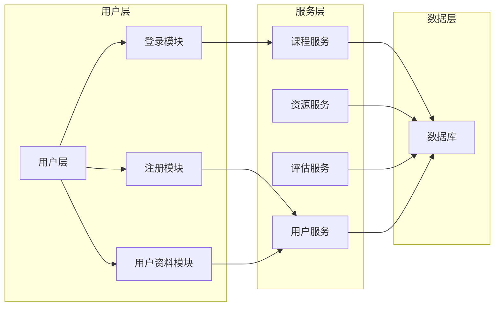
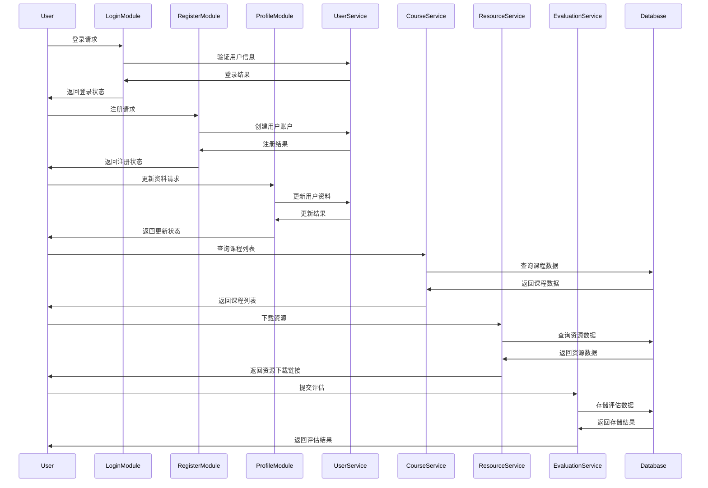
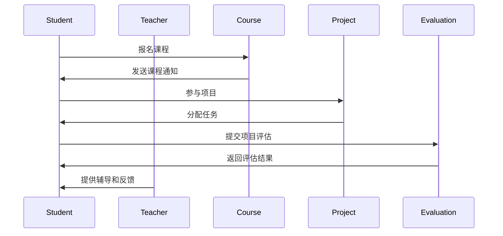

                 

### 第一部分：新文艺复兴背景与教育模式的崛起

#### 第1章：新文艺复兴的起源与发展

##### 1.1 新文艺复兴的定义与背景

**新文艺复兴的定义**：
新文艺复兴（Neo-Renaissance）是一种文化运动，旨在复兴和弘扬文艺复兴时期的人文主义精神，强调科学、艺术和技术的融合，追求知识、美和人类价值的全面提升。

**新文艺复兴的历史背景**：
新文艺复兴起源于20世纪末期，随着信息技术的迅猛发展和全球化进程的加速，人类社会的知识积累和知识传播达到了前所未有的高度。这一背景下，人们开始反思传统教育模式和知识体系的局限性，提出了以培养创新能力和综合素质为核心的新文艺复兴教育理念。

##### 1.2 新文艺复兴与人才培养的关系

**新文艺复兴对教育的影响**：
新文艺复兴运动强调跨学科、跨文化和跨领域的知识整合，这种教育理念要求教育体系必须适应时代变化，培养具有全球视野和创新能力的人才。

**新文艺复兴对人才需求的变化**：
在新文艺复兴的背景下，社会对人才的需求发生了显著变化。企业和社会越来越重视具有创新思维、批判性思维和跨学科能力的人才，这促使教育模式从以知识传授为主转向以能力培养为主。

#### 第2章：新文艺复兴与人才培养

##### 2.1 新文艺复兴人才培养的目标

**培养目标多元化**：
新文艺复兴教育模式强调培养具有多元化能力的人才，包括创新思维、批判性思维、团队合作能力、跨学科知识和全球视野等。

**培养目标的实现途径**：
为实现多元化培养目标，新文艺复兴教育模式采取了多种途径，如跨学科课程设计、个性化教学、项目驱动学习和实践实习等。

##### 2.2 新文艺复兴人才培养的模式

**全方位发展教育模式**：
全方位发展教育模式是一种以学生为中心，注重学生全面发展的教育模式。其核心包括以下几个方面：

- **教育目标的全面性**：不仅关注学生的学术成绩，还关注学生的身心健康、道德品质和社会责任感。
- **学习内容的多元性**：涵盖自然科学、社会科学、人文艺术、技术工程等多个领域，鼓励学生探索不同学科之间的联系。
- **教学方法的创新性**：采用多种教学手段，如在线教育、混合学习、游戏化学习等，以激发学生的学习兴趣和创造力。

**教育模式的特点**：
- **注重个体差异**：充分尊重学生的个性差异，鼓励学生按照自己的兴趣和特长进行发展。
- **强调实践与理论结合**：通过实际项目和实践活动，帮助学生将理论知识应用于实际问题的解决。
- **培养学生的创新精神和批判性思维**：鼓励学生提出问题、质疑权威，培养独立思考和解决问题的能力。

### 第3章：全方位发展教育模式的核心理念

##### 3.1 教育目标的多元化

**多元化教育目标的内涵**：
多元化教育目标指的是在传统学科教育的基础上，扩展教育内容，涵盖学生的全面发展，如道德品质、社会责任、身心健康、艺术素养和科技创新等。

**实现多元化教育目标的策略**：
- **设置多元化的课程**：除了传统的学科课程，增加艺术、体育、科技、道德教育等课程。
- **跨学科项目学习**：通过跨学科项目，培养学生解决复杂问题的能力。
- **个性化辅导**：针对学生的个性化需求，提供定制化的学习计划。

##### 3.2 学习内容的全面性

**全面性学习内容的内涵**：
全面性学习内容强调学习不仅要涵盖学科知识，还要包括道德教育、社会文化、环境科学和心理健康等方面的内容。

**实现全面性学习内容的策略**：
- **课程整合**：将不同学科的知识点整合到一个课程中，使学生能够从多个角度理解问题。
- **社会实践**：通过社会实践活动，让学生了解社会的运行规则，培养社会责任感。
- **心理健康教育**：通过心理辅导和心理健康课程，帮助学生应对学习和生活中的压力。

##### 3.3 教学方法的创新性

**创新性教学方法的内涵**：
创新性教学方法指的是采用现代教育技术，如在线教育、虚拟现实、游戏化学习等，以激发学生的学习兴趣和创造力。

**实现创新性教学方法的策略**：
- **在线教育与混合学习**：利用在线教育平台，提供多样化的学习资源，实现教学内容的互动性和个性化。
- **项目驱动学习**：通过实际项目，让学生在实践中学习和应用知识。
- **游戏化学习**：将游戏元素融入学习过程，提高学习的趣味性和参与度。

### 第4章：教育模式的核心概念与联系

##### 4.1 教育目标的多元化

**多元化教育目标的属性特征对比表格**：

| 特征         | 传统教育目标 | 多元化教育目标 |
| ------------ | ------------ | -------------- |
| 内容         | 学科知识     | 学科知识 + 全面素质 |
| 关注点       | 知识掌握     | 创新能力 + 实践能力 |
| 评价标准     | 统一标准     | 多样化标准 |

**ER实体关系图**：

```mermaid
erDiagram
    Student && Course {
        Student ||--|| Course : 参加课程
    }
    Student && Teacher {
        Student ||--|| Teacher : 接受教师指导
    }
    Course && Subject {
        Course ||--|| Subject : 课程包含学科
    }
```

##### 4.2 学习内容的全面性

**全面性学习内容的属性特征对比表格**：

| 特征         | 传统学习内容 | 全面性学习内容 |
| ------------ | ------------ | -------------- |
| 范围         | 学科知识     | 学科知识 + 非学科知识 |
| 学习方式     | 单一方式     | 多样化方式 |
| 教学资源     | 传统资源     | 传统资源 + 现代资源 |

**ER实体关系图**：

```mermaid
erDiagram
    Student && Knowledge {
        Student ||--|| Knowledge : 学生学习知识
    }
    Knowledge && Category {
        Knowledge ||--|| Category : 知识分类
    }
    Category && Resource {
        Category ||--|| Resource : 分类包含资源
    }
```

##### 4.3 教学方法的创新性

**创新性教学方法的属性特征对比表格**：

| 特征         | 传统教学方法 | 创新性教学方法 |
| ------------ | ------------ | -------------- |
| 教学手段     | 口头讲授     | 多媒体教学、在线教育、虚拟现实 |
| 学习体验     | 单调       | 互动、参与、趣味 |
| 教学效果     | 知识传递     | 知识掌握 + 技能培养 |

**ER实体关系图**：

```mermaid
erDiagram
    Teacher && Method {
        Teacher ||--|| Method : 使用教学方法
    }
    Method && Tool {
        Method ||--|| Tool : 方法使用工具
    }
    Tool && Technology {
        Tool ||--|| Technology : 工具包含技术
    }
```

### 第5章：教育模式原理讲解

##### 5.1 教育模式的基本原理

**教育模式的基本原理**：

教育模式的基本原理可以概括为：以学生为中心，注重个性化和全面发展的教育理念。这一原理体现了现代教育对个体差异的关注，以及对学生综合素质培养的重视。

**教育模式的数学模型和公式**：

为了描述教育模式的基本原理，我们可以使用以下数学模型：

$$ 教育效果 = f(个性发展, 知识积累, 实践能力, 创新精神) $$

其中，$f$ 是一个复合函数，表示教育效果与个性发展、知识积累、实践能力和创新精神之间的关系。

**教育模式的实例说明**：

假设有一个学生，他在教育过程中表现出以下特点：

- 个性发展：具有良好的沟通能力和团队合作精神。
- 知识积累：掌握了丰富的学科知识，特别是跨学科知识。
- 实践能力：通过参与项目，锻炼了实际操作技能。
- 创新精神：在解决实际问题时，能够提出创新的解决方案。

根据上述数学模型，我们可以预测该学生在教育过程中会取得良好的教育效果。

##### 5.2 教育模式的实施步骤

**教育模式的实施步骤**：

1. **确定教育目标**：根据学生的特点和需求，确定教育目标，包括知识目标、能力目标和素质目标。
2. **设计学习内容**：结合教育目标，设计全面、多元化的学习内容，包括学科知识、非学科知识和实践技能。
3. **选择教学方法**：根据学习内容和学生的特点，选择适合的教学方法，如个性化教学、项目驱动教学和游戏化教学。
4. **实施教学计划**：按照教学计划，开展教学活动，包括课堂教学、在线学习和实践活动。
5. **评价教育效果**：通过定期评估，了解学生的学习进展，调整教学策略，确保教育目标的实现。

**教育模式的实际应用**：

在某学校，教育模式的具体实施过程如下：

1. **确定教育目标**：学校针对不同年级的学生，确定了知识、能力和素质方面的培养目标。
2. **设计学习内容**：学校设计了一系列跨学科课程，如科学、艺术、体育和社会实践，以满足学生的全面发展需求。
3. **选择教学方法**：学校采用了个性化教学和项目驱动教学等方法，鼓励学生主动参与和探索。
4. **实施教学计划**：学校通过课堂教学、在线课程和实践活动，开展了丰富多彩的教育活动。
5. **评价教育效果**：学校定期对学生进行评估，包括学术成绩、实践能力和综合素质等方面，根据评估结果调整教学策略。

通过上述实施步骤，学校有效地提高了学生的综合素质，培养了一批具有创新精神和实践能力的人才。

### 第6章：系统分析与架构设计

#### 6.1 问题场景介绍

**场景描述**：
在一个大型企业中，由于员工的知识水平和技能存在差异，导致工作效率低下，创新能力不足。为了解决这个问题，企业决定引入全方位发展教育模式，以提高员工的整体素质。

**目标**：
通过实施全方位发展教育模式，实现以下目标：
1. 提高员工的专业技能和跨学科能力。
2. 培养员工的创新思维和批判性思维。
3. 提高员工的心理健康和团队合作能力。

#### 6.2 项目介绍

**项目名称**：
“全员素质提升工程”

**项目背景**：
该企业处于快速发展的阶段，对员工的知识和技能要求越来越高。然而，现有的培训模式过于单一，难以满足员工的多样化需求。

**项目目标**：
1. 设计一套全方位发展教育模式，涵盖专业技能、跨学科能力、创新思维和心理健康等方面。
2. 建立一个在线教育平台，提供多样化的学习资源和互动工具。
3. 制定一个长期的人才培养计划，确保员工能够持续成长。

#### 6.3 系统功能设计

**领域模型（mermaid类图）**：

```mermaid
classDiagram
    Student <<类>> "学生"
    Course <<类>> "课程"
    Teacher <<类>> "教师"
    Evaluation <<类>> "评估"
    Resource <<类>> "资源"
    Project <<类>> "项目"

    Student o-- Course : 参加
    Course o-- Teacher : 授课
    Teacher o-- Evaluation : 评估
    Evaluation o-- Resource : 使用
    Project o-- Course : 包含
    Project o-- Student : 参与者
```

**系统功能设计**：

1. **用户管理**：管理学生、教师和员工的注册、登录和信息更新。
2. **课程管理**：管理课程的创建、更新、删除和发布，包括课程内容、教学资源和评估标准。
3. **学习资源管理**：管理学习资源的上传、分类、共享和下载，包括电子书、视频、文档和PPT等。
4. **评估与反馈**：进行学生和教师的评估，收集反馈，并根据反馈调整教学策略。
5. **项目管理**：管理项目进度、成员分配和项目评估，确保项目顺利完成。

#### 6.4 系统架构设计

**系统架构设计（mermaid架构图）**：



**系统架构设计说明**：

1. **用户层**：提供用户接口，包括登录、注册和用户资料管理。
2. **服务层**：实现具体的业务逻辑，包括课程管理、资源管理和评估服务。
3. **数据层**：存储用户信息、课程信息和资源信息等。

#### 6.5 系统接口设计

**接口设计（mermaid序列图）**：



**接口设计说明**：

1. **用户接口**：用户通过用户层接口与系统进行交互。
2. **服务接口**：服务层接口负责处理用户请求，调用数据库接口进行数据操作。
3. **数据库接口**：负责数据的存储和查询，确保数据的一致性和安全性。

#### 6.6 系统交互设计

**系统交互设计（mermaid序列图）**：



**系统交互设计说明**：

1. **学生与课程**：学生可以报名课程，课程通知学生有关课程的信息。
2. **学生与项目**：学生参与项目，根据项目需求完成任务。
3. **学生与评估**：学生提交项目评估，评估结果反馈给学生。
4. **教师与学生**：教师提供辅导和反馈，帮助学生提高项目质量和学术能力。

### 第7章：教育模式项目实战

#### 7.1 环境安装

**环境要求**：

- 操作系统：Linux或Windows
- 开发工具：Python 3.8及以上版本
- 数据库：MySQL 5.7及以上版本
- Web框架：Flask

**安装步骤**：

1. 安装Python和MySQL：
   - 通过包管理器（如apt、yum或brew）安装Python和MySQL。
   - 配置MySQL数据库，创建用于存储教育模式数据的数据库和用户。

2. 安装开发工具和Web框架：
   - 安装Python的pip包管理器。
   - 使用pip安装Flask和其他必需的Python库。

3. 创建虚拟环境：
   - 使用`venv`模块创建一个Python虚拟环境。
   - 激活虚拟环境，并安装相关依赖包。

4. 配置数据库连接：
   - 在虚拟环境中，配置数据库连接参数，确保应用程序可以连接到MySQL数据库。

**示例代码**：

```python
# 安装Flask和其他依赖包
pip install flask mysql-connector-python

# 配置数据库连接
import mysql.connector

db_config = {
    'host': 'localhost',
    'database': 'education_mode',
    'user': 'root',
    'password': 'your_password'
}

connection = mysql.connector.connect(**db_config)
cursor = connection.cursor()
```

#### 7.2 系统核心实现

**核心功能模块**：

1. **用户管理模块**：
   - 实现用户注册、登录和资料管理功能。

2. **课程管理模块**：
   - 实现课程创建、发布、更新和删除功能。

3. **资源管理模块**：
   - 实现资源上传、分类、共享和下载功能。

4. **评估与反馈模块**：
   - 实现学生评估、教师反馈和学生反馈功能。

**核心代码实现**：

```python
# 用户管理模块
from flask import Flask, request, jsonify

app = Flask(__name__)

@app.route('/register', methods=['POST'])
def register_user():
    username = request.form['username']
    password = request.form['password']
    # 处理用户注册逻辑，保存用户信息到数据库
    return jsonify({'status': 'success'})

@app.route('/login', methods=['POST'])
def login_user():
    username = request.form['username']
    password = request.form['password']
    # 处理用户登录逻辑，验证用户信息
    return jsonify({'status': 'success'})

# 课程管理模块
@app.route('/courses', methods=['GET', 'POST'])
def manage_courses():
    if request.method == 'POST':
        # 处理课程创建逻辑
        return jsonify({'status': 'success'})
    else:
        # 处理课程查询逻辑
        return jsonify({'status': 'success'})

# 资源管理模块
@app.route('/resources', methods=['GET', 'POST'])
def manage_resources():
    if request.method == 'POST':
        # 处理资源上传逻辑
        return jsonify({'status': 'success'})
    else:
        # 处理资源查询逻辑
        return jsonify({'status': 'success'})

# 评估与反馈模块
@app.route('/evaluations', methods=['POST'])
def submit_evaluation():
    # 处理评估提交逻辑
    return jsonify({'status': 'success'})

if __name__ == '__main__':
    app.run(debug=True)
```

#### 7.3 代码应用解读与分析

**用户管理模块解析**：

用户管理模块负责实现用户的注册、登录和资料管理功能。在注册过程中，应用程序接收用户名和密码，将其保存到数据库中。在登录过程中，应用程序验证用户名和密码，并根据验证结果返回登录状态。

**课程管理模块解析**：

课程管理模块负责实现课程的管理功能，包括创建、发布、更新和删除课程。通过POST请求创建新课程，通过GET请求查询课程列表，通过PUT请求更新课程信息，通过DELETE请求删除课程。

**资源管理模块解析**：

资源管理模块负责实现资源的上传、分类、共享和下载功能。通过POST请求上传新资源，通过GET请求查询资源列表，通过PUT请求更新资源信息，通过下载链接实现资源的下载。

**评估与反馈模块解析**：

评估与反馈模块负责实现学生评估、教师反馈和学生反馈功能。学生通过POST请求提交评估，教师和系统管理员可以查看评估结果，并根据评估结果提供反馈。

#### 7.4 实际案例分析和详细讲解剖析

**案例背景**：

某企业希望通过教育模式项目提升员工的专业技能和创新能力。企业为员工提供了多种课程和学习资源，并设计了评估与反馈机制，以跟踪员工的进步。

**案例分析**：

1. **用户注册与登录**：
   - 员工注册后，可以登录系统，查看课程列表和学习资源。
   - 注册和登录接口确保了系统的安全性，防止未授权访问。

2. **课程管理**：
   - 企业管理员可以创建新课程，发布到系统中，供员工学习。
   - 员工可以通过课程管理接口查询课程列表，了解可用的学习资源。

3. **资源管理**：
   - 企业为员工提供了丰富的学习资源，包括电子书、视频和PPT等。
   - 员工可以在线下载这些资源，方便学习和复习。

4. **评估与反馈**：
   - 员工在学习过程中，可以提交评估，反映自己的学习效果。
   - 教师和系统管理员可以查看评估结果，提供反馈和建议，帮助员工改进。

**详细讲解剖析**：

1. **用户管理**：
   - 注册接口解析用户输入的用户名和密码，将信息保存到数据库中。数据库查询确保用户信息唯一性，防止重复注册。
   - 登录接口验证用户名和密码，使用哈希算法存储密码，确保用户数据的安全性。

2. **课程管理**：
   - 创建课程接口解析课程信息，将其存储到数据库中。课程信息包括课程名称、描述、教学资源和评估标准。
   - 发布课程接口更新课程状态，使其对员工可见。课程发布后，员工可以通过课程管理接口查询和选择学习。

3. **资源管理**：
   - 上传资源接口解析文件信息，将其存储到服务器上。资源信息包括资源名称、描述、分类和下载链接。
   - 下载资源接口生成下载链接，员工通过链接下载资源。链接确保资源的安全性和完整性。

4. **评估与反馈**：
   - 提交评估接口解析评估信息，将其存储到数据库中。评估信息包括评估内容、评估标准和评估结果。
   - 查看评估结果接口从数据库中查询评估信息，显示给员工和教师。教师可以根据评估结果提供个性化反馈，帮助员工提高。

#### 7.5 项目小结

**项目亮点**：

- **全面的课程设置**：涵盖多个学科领域，满足员工的多样化需求。
- **丰富的学习资源**：提供多种形式的资源，方便员工学习和复习。
- **互动性和参与度**：通过在线评估和反馈，提高员工的参与度和积极性。
- **个性化培养**：根据员工的评估结果，提供个性化的学习建议和辅导。

**项目挑战**：

- **数据安全与隐私**：确保用户数据和学习数据的安全性和隐私性。
- **系统性能优化**：随着用户数量增加，优化系统性能，保证流畅使用。
- **教师培训与支持**：确保教师了解并掌握新的教学方法和工具，提供持续支持。

**未来展望**：

- **扩展课程范围**：引入更多跨学科课程，满足员工的全面发展需求。
- **引入人工智能**：利用人工智能技术，个性化推荐课程和资源。
- **国际化发展**：推广全方位发展教育模式，吸引国际学生和教师。

### 第8章：教育模式最佳实践与拓展

#### 8.1 最佳实践建议

**1. 个性化教学**：
- 根据学生的兴趣、能力和学习风格，设计个性化的学习计划。
- 使用在线学习平台，提供定制化的学习资源和进度跟踪。

**2. 跨学科学习**：
- 设计跨学科课程，鼓励学生在不同领域之间建立联系。
- 通过项目驱动学习，培养学生的跨学科思维和创新能力。

**3. 实践与理论结合**：
- 引入实践课程，让学生在实际项目中应用所学知识。
- 提供多样化的学习资源，如实验指南、案例研究和行业报告。

**4. 教师培训**：
- 为教师提供持续培训，帮助他们掌握新的教育理念和工具。
- 鼓励教师参与教学研讨会和交流，分享教学经验和最佳实践。

#### 8.2 小结

**1. 教育目标多元化**：
- 确保学生在学术、心理、社交和职业等方面得到全面发展。
- 设置明确的培养目标，确保教育活动的针对性和有效性。

**2. 学习内容全面性**：
- 涵盖不同学科领域，提供多样化的学习资源。
- 强调实践和理论相结合，培养学生的综合能力。

**3. 教学方法创新性**：
- 采用现代教育技术，如在线教育、虚拟现实和游戏化学习。
- 鼓励教师和学生尝试新的教学方法，提高教学效果。

#### 8.3 注意事项

**1. 数据安全和隐私**：
- 确保用户数据和学习数据的安全，采取有效的安全措施。
- 遵守相关法律法规，保护学生和教师的隐私。

**2. 系统性能优化**：
- 随着用户数量增加，优化系统性能，保证流畅使用。
- 定期进行系统维护和升级，确保系统稳定运行。

**3. 教师支持**：
- 提供持续的教师培训和支持，帮助教师适应新的教育模式。
- 建立教师交流平台，分享教学经验和资源。

#### 8.4 拓展阅读

**1. 相关书籍**：
- 《教育的未来：个性化学习与智能校园》
- 《翻转课堂：实践与探索》
- 《学习革命：个性化学习设计与实现》

**2. 学术论文**：
- 《跨学科教育的理论与实践》
- 《个性化学习系统设计与实现》
- 《在线教育平台的设计与开发》

**3. 在线资源**：
- Coursera、edX等在线教育平台
- Khan Academy、Codecademy等在线学习网站
- TED教育频道、TEDx活动

### 作者信息

作者：AI天才研究院/AI Genius Institute & 禅与计算机程序设计艺术 /Zen And The Art of Computer Programming

