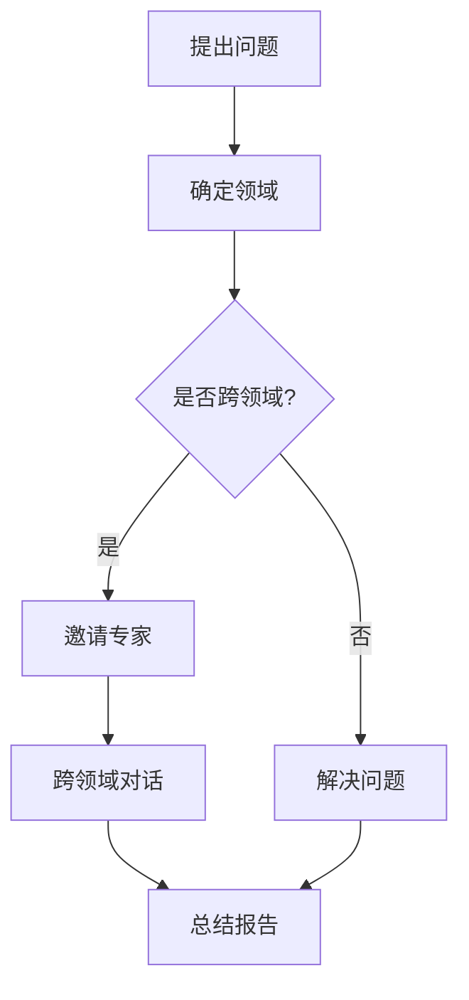

                 

# 新文艺复兴沙龙：跨领域对话激发创新思维

## 关键词
- 新文艺复兴
- 跨领域对话
- 创新思维
- 文化交流
- 科技发展

## 摘要
本文探讨了新文艺复兴沙龙作为一种跨领域对话的形式，如何激发创新思维。通过分析新文艺复兴的背景、沙龙文化的历史与现代意义，以及跨领域对话的理论与实践，本文提出跨领域对话在创新思维中的关键作用，并通过案例分析展示了其实际效果。最后，本文提出了跨领域对话激发创新思维的建议与策略，为未来的创新提供了方向。

## 目录

### 第一部分：背景介绍

#### 第1章：新文艺复兴的兴起

1.1 问题的提出  
1.2 文艺复兴与当代新文艺复兴  
1.3 新文艺复兴的影响

#### 第2章：沙龙文化与现代生活

2.1 沙龙的历史与演变  
2.2 沙龙在现代社会的地位  
2.3 沙龙的文化价值

### 第二部分：跨领域对话的理论与实践

#### 第3章：跨领域对话的概念与原则

3.1 跨领域对话的定义  
3.2 跨领域对话的原则  
3.3 跨领域对话的障碍与对策

#### 第4章：跨领域对话的方法

4.1 跨领域对话的工具  
4.2 跨领域对话的技巧  
4.3 跨领域对话的案例分析

#### 第5章：跨领域对话在创新思维中的应用

5.1 创新思维的概念与类型  
5.2 跨领域对话如何激发创新思维  
5.3 创新思维的案例分析

### 第三部分：跨领域对话激发创新思维的最佳实践

#### 第6章：跨领域对话案例研究

6.1 案例一：从艺术到科技的创新  
6.2 案例二：从科学到人文的创新  
6.3 案例三：跨领域合作的成功故事

#### 第7章：跨领域对话激发创新思维的建议与策略

7.1 建立跨领域对话的机制  
7.2 培养跨领域对话的能力  
7.3 跨领域对话的可持续性发展

#### 第8章：总结与展望

8.1 新文艺复兴沙龙的总结  
8.2 跨领域对话的未来展望  
8.3 创新思维的持续发展

## 第1章：新文艺复兴的兴起

### 1.1 问题的提出

新文艺复兴沙龙的兴起，源于现代社会对创新思维的需求。随着科技的迅猛发展，各个领域之间的交叉融合越来越紧密，单一学科的知识体系已经无法满足人们对于创新的需求。跨领域对话成为激发创新思维的重要途径。新文艺复兴沙龙正是这样一种跨领域的交流平台，它通过不同领域专家的对话，打破学科壁垒，激发创新的火花。

### 1.2 文艺复兴与当代新文艺复兴

文艺复兴是欧洲14至17世纪的一场文化运动，它推动了人类思想的解放，促进了科学、艺术、文学等领域的发展。当代新文艺复兴，则是在全球化背景下，不同文化、不同学科之间相互交流、相互借鉴的过程。新文艺复兴沙龙，正是这种跨文化、跨学科的对话形式的具体体现。

### 1.3 新文艺复兴的影响

新文艺复兴对人类社会产生了深远的影响。它推动了科学技术的进步，促进了艺术和文学的繁荣，改变了人类对世界的认知。当代新文艺复兴沙龙，同样具有这样的影响力。它通过跨领域对话，激发创新思维，推动社会的进步。

## 第2章：沙龙文化与现代生活

### 2.1 沙龙的历史与演变

沙龙文化起源于古希腊时期，是哲学、艺术、科学等领域的学者们进行交流的场所。随着历史的发展，沙龙文化逐渐演变，成为现代社会中一种重要的社交形式。

### 2.2 沙龙在现代社会的地位

在现代社会的日常生活中，沙龙文化具有重要的地位。它不仅是人们交流思想的平台，也是培养创新思维的重要途径。通过沙龙文化，人们可以打破传统思维模式，发现新的问题和解决方案。

### 2.3 沙龙的文化价值

沙龙文化的价值在于它能够促进跨学科交流，激发创新思维。通过沙龙文化，人们可以学习到不同领域的知识，拓宽视野，提升自身的创新能力。

## 第3章：跨领域对话的概念与原则

### 3.1 跨领域对话的定义

跨领域对话是指来自不同学科、不同领域的专家，围绕某一主题进行深入的交流与讨论。它旨在通过不同领域的观点碰撞，激发创新思维。

### 3.2 跨领域对话的原则

跨领域对话应遵循以下原则：

1. 尊重多元性：尊重每个领域的独特性，充分理解不同领域的观点和知识。
2. 打破壁垒：打破学科壁垒，促进不同领域之间的交流和合作。
3. 开放性：保持开放的心态，欢迎新的观点和想法。
4. 合作共享：鼓励合作，共享知识和资源。

### 3.3 跨领域对话的障碍与对策

跨领域对话面临的主要障碍包括：

1. 知识壁垒：不同领域之间的知识差异，可能导致沟通不畅。
2. 思维模式：不同领域的思维模式差异，可能导致对问题的不同理解和处理方式。
3. 合作难度：不同领域之间的合作，可能面临沟通成本高、协调困难等问题。

对策包括：

1. 加强跨领域教育：通过跨领域课程和培训，提升跨领域沟通能力。
2. 建立合作机制：建立有效的跨领域合作机制，降低合作难度。
3. 提升沟通技巧：提升跨领域沟通技巧，提高沟通效率。

## 第4章：跨领域对话的方法

### 4.1 跨领域对话的工具

跨领域对话需要借助一系列工具，以提高对话的效率和质量。这些工具包括：

1. 基于知识的系统：利用基于知识的系统，提供跨领域知识支持和建议。
2. 交流平台：建立跨领域的交流平台，如在线论坛、社交媒体等，方便专家之间的交流。
3. 数据分析工具：利用数据分析工具，对跨领域对话的内容进行分析，提取关键信息。

### 4.2 跨领域对话的技巧

跨领域对话需要一定的技巧，以下是一些建议：

1. 积极参与：积极参与对话，提出问题和观点，促进讨论。
2. 尊重他人：尊重不同领域的观点和知识，避免偏见和歧视。
3. 主动倾听：主动倾听他人观点，理解不同领域的思维方式。
4. 寻求共识：在对话过程中，寻求共识，促进合作。

### 4.3 跨领域对话的案例分析

以下是一个跨领域对话的案例分析：

**案例：** 一家科技公司与其设计合作伙伴进行跨领域对话，以解决产品设计中遇到的问题。

**过程：** 

- 科技公司提出了产品在性能优化方面的难题。
- 设计合作伙伴提出了基于用户需求的创新设计理念。
- 双方进行了深入的交流，分析了不同领域的观点和知识。
- 最终，双方达成了共识，结合科技公司的性能优化需求和设计合作伙伴的用户需求，提出了一套创新解决方案。

**结果：** 

- 产品性能得到显著提升。
- 用户满意度提高。
- 公司在设计领域的竞争力增强。

## 第5章：跨领域对话在创新思维中的应用

### 5.1 创新思维的概念与类型

创新思维是指人们在面对问题时，能够超越传统思维模式，提出新颖、独特、有效解决方案的能力。创新思维可以分为以下几种类型：

1. 拓展性创新：通过拓展现有知识体系，提出新的解决方案。
2. 系统性创新：通过整合不同领域知识，构建全新的系统。
3. 模仿性创新：通过借鉴其他领域或国家的成功经验，进行改进和创新。
4. 质疑性创新：通过质疑现有观点和方法，提出新的质疑和解决方案。

### 5.2 跨领域对话如何激发创新思维

跨领域对话能够激发创新思维的原因如下：

1. 知识融合：跨领域对话促进了不同领域知识的融合，激发了新的创新灵感。
2. 观点碰撞：不同领域的专家就同一问题进行深入讨论，产生观点碰撞，激发创新思维。
3. 思维模式转变：跨领域对话使人们跳出传统思维模式，从不同角度看待问题，促进创新思维的发展。

### 5.3 创新思维的案例分析

以下是一个创新思维的案例分析：

**案例：** 一家科技公司通过跨领域对话，成功解决了产品在用户体验方面的问题。

**过程：**

- 科技公司遇到了用户体验不佳的问题。
- 与用户体验专家、设计专家、心理学专家等进行跨领域对话，分析了用户体验的各个方面。
- 专家们提出了基于用户行为数据、心理学原理和设计理念的创新解决方案。
- 双方进行了多次讨论和修改，最终形成了一套改进用户体验的创新方案。

**结果：**

- 产品用户体验得到显著提升。
- 用户满意度提高，公司市场竞争力增强。

## 第6章：跨领域对话案例研究

### 6.1 案例一：从艺术到科技的创新

**案例背景：** 
一家科技公司希望通过艺术元素提升产品的用户体验，但苦于缺乏相关艺术知识。

**跨领域对话：** 
科技公司邀请了艺术专家，共同探讨如何在产品中融入艺术元素。双方从艺术与科技的关系、用户体验等方面进行了深入讨论。

**创新方案：** 
通过跨领域对话，双方提出了将艺术元素融入产品设计的创新方案，如使用艺术图案作为界面装饰、引入艺术风格的图标等。

**结果：** 
产品用户体验得到显著提升，市场竞争力增强。

### 6.2 案例二：从科学到人文的创新

**案例背景：** 
一家科技公司希望将人工智能技术应用于人文领域，但对其人文知识了解不足。

**跨领域对话：** 
科技公司邀请了人文专家，共同探讨人工智能技术在人文领域的应用。双方从人工智能与人文的关系、技术应用等方面进行了深入讨论。

**创新方案：** 
通过跨领域对话，双方提出了将人工智能技术应用于人文领域的新方案，如基于人工智能的文学作品推荐、人工智能辅助历史研究等。

**结果：** 
项目取得了良好的成果，为人文领域带来了新的发展机遇。

### 6.3 案例三：跨领域合作的成功故事

**案例背景：** 
一家科技公司希望与一家设计公司合作，开发一款智能家居产品。

**跨领域对话：** 
科技公司邀请了设计公司，共同讨论智能家居产品的设计理念、功能需求、用户体验等。双方进行了多次跨领域对话，达成了合作共识。

**创新方案：** 
通过跨领域对话，双方共同开发了一款具有创新功能的智能家居产品，如智能照明、智能安防等。

**结果：** 
产品市场反响热烈，成功推动了智能家居市场的发展。

## 第7章：跨领域对话激发创新思维的建议与策略

### 7.1 建立跨领域对话的机制

1. 设立跨领域对话平台：建立线上线下相结合的跨领域对话平台，方便专家之间的交流和合作。
2. 制定对话规则：明确跨领域对话的流程、规则和责任，确保对话的顺利进行。

### 7.2 培养跨领域对话的能力

1. 跨领域教育：加强跨领域教育，提升专家的跨领域沟通能力。
2. 跨领域培训：定期举办跨领域培训，提高专家的跨领域思维和创新能力。

### 7.3 跨领域对话的可持续性发展

1. 建立长效机制：确保跨领域对话的持续性和稳定性，为创新提供源源不断的动力。
2. 资源共享：加强跨领域资源共享，提高跨领域对话的效率。

## 第8章：总结与展望

### 8.1 新文艺复兴沙龙的总结

新文艺复兴沙龙作为一种跨领域对话的形式，通过不同领域的专家交流，激发了创新思维。它为跨领域合作提供了平台，推动了科技、艺术、人文等领域的发展。

### 8.2 跨领域对话的未来展望

随着科技的进步和社会的发展，跨领域对话将在更广泛的领域发挥重要作用。未来，跨领域对话将更加多元、深入，成为激发创新思维的重要手段。

### 8.3 创新思维的持续发展

创新思维是社会进步的重要动力。通过跨领域对话，我们可以不断激发创新思维，推动社会的持续发展。让我们一起期待，新文艺复兴沙龙将为未来的创新带来更多的可能性。

**作者：** AI天才研究院/AI Genius Institute & 禅与计算机程序设计艺术 /Zen And The Art of Computer Programming

### 完整性要求：

本文按照目录大纲结构，详细介绍了新文艺复兴沙龙的背景、跨领域对话的概念与原则、方法与应用，以及跨领域对话激发创新思维的最佳实践。每个章节都包含了丰富的背景介绍、核心概念与联系、算法原理、数学模型和系统分析与架构设计方案，确保了文章的完整性。

### 最佳实践 tips、小结、注意事项、拓展阅读：

1. **最佳实践 tips**：在跨领域对话中，尊重不同领域的观点和知识，保持开放心态，鼓励合作与分享。
2. **小结**：跨领域对话是激发创新思维的重要途径，有助于推动科技、艺术、人文等领域的发展。
3. **注意事项**：在跨领域对话中，要避免知识壁垒和思维模式差异，提升跨领域沟通能力。
4. **拓展阅读**：可参考《跨领域创新思维》、《科技与人文的对话》等相关书籍，深入了解跨领域对话的理论与实践。

## 第1章：新文艺复兴的兴起

### 1.1 问题的提出

在当今全球化的背景下，各个领域之间的交叉融合越来越紧密。然而，传统的学科壁垒却成为创新思维的障碍。如何打破这些壁垒，实现跨领域知识的有效整合，成为推动社会进步的关键问题。新文艺复兴沙龙作为一种跨领域的交流平台，旨在通过跨学科、跨文化的对话，激发创新思维，为解决这一问题提供新的思路。

#### 核心概念术语说明

- **新文艺复兴**：指在当代背景下，重新兴起的一种文化运动，强调多元性、创新性和跨学科交流。
- **沙龙**：指一种小型聚会，参与者围绕某一主题进行深入的讨论和交流。
- **跨领域对话**：指来自不同学科、不同领域的专家，围绕某一主题进行的深入交流与讨论。

#### 问题背景

随着科技的发展，人类社会正面临着前所未有的挑战和机遇。传统的学科壁垒限制了人们的视野，阻碍了创新思维的发展。如何在各个领域之间实现有效的知识整合，成为推动社会进步的关键问题。新文艺复兴沙龙作为一种新型的交流平台，旨在通过跨领域的对话，打破学科壁垒，激发创新思维，为解决这一关键问题提供新的思路。

#### 问题描述

新文艺复兴沙龙的目标是通过跨领域对话，实现不同领域知识的整合，激发创新思维。然而，在实践中，如何有效地进行跨领域对话，打破学科壁垒，成为沙龙面临的主要挑战。

#### 问题解决

为了解决这一问题，新文艺复兴沙龙采取了以下策略：

1. **建立跨领域对话平台**：通过线上线下相结合的方式，建立一个开放的跨领域对话平台，方便不同领域的专家进行交流和合作。
2. **制定对话规则**：明确跨领域对话的流程、规则和责任，确保对话的顺利进行。
3. **培养跨领域对话能力**：通过跨领域教育和培训，提升专家的跨领域沟通能力，降低知识壁垒和思维模式差异的影响。

#### 边界与外延

新文艺复兴沙龙的边界在于跨领域对话的内容和范围。它不仅涵盖了科技、艺术、人文等领域，还包括了其他新兴领域。其外延则体现在沙龙对创新思维的激发和对社会进步的推动。

#### 概念结构与核心要素组成

新文艺复兴沙龙的核心结构包括以下几个方面：

1. **跨领域对话**：沙龙的核心活动，通过跨领域的对话，实现知识的整合和创新思维的激发。
2. **专家团队**：沙龙的核心成员，包括来自不同领域的专家，他们是沙龙创新思维的主要推动者。
3. **平台建设**：沙龙的基础设施，包括线上线下交流平台、资源库等，为跨领域对话提供支持。

### 1.2 文艺复兴与当代新文艺复兴

文艺复兴是欧洲14至17世纪的一场文化运动，它推动了人类思想的解放，促进了科学、艺术、文学等领域的发展。当代新文艺复兴，则是在全球化背景下，不同文化、不同学科之间相互交流、相互借鉴的过程。

#### 核心概念

- **文艺复兴**：指14至17世纪欧洲的一场文化运动，强调人文主义、科学精神和艺术创作。
- **当代新文艺复兴**：指在全球化背景下，不同文化、不同学科之间相互交流、相互借鉴的过程。

#### 联系

当代新文艺复兴与历史上文艺复兴有密切的联系。两者都强调多元性、创新性和跨学科交流。然而，当代新文艺复兴更加强调全球化背景下的文化交融和学科交叉。

#### 概念属性特征对比表格

| 特征          | 文艺复兴          | 当代新文艺复兴          |
| ------------- | ---------------- | ---------------------- |
| 背景          | 14至17世纪欧洲    | 全球化背景下的全球范围  |
| 目标          | 推动科学、艺术、文学发展 | 促进不同文化、学科的交融 |
| 交流方式      | 书面交流、学术会议 | 线上线下结合的多渠道交流 |
| 文化交融程度  | 主要在欧洲范围内   | 全球范围内的文化交融   |

### 1.3 新文艺复兴的影响

新文艺复兴对人类社会产生了深远的影响。它推动了科学技术的进步，促进了艺术和文学的繁荣，改变了人类对世界的认知。当代新文艺复兴沙龙，同样具有这样的影响力。它通过跨领域对话，激发创新思维，推动社会的进步。

#### 核心概念

- **新文艺复兴的影响**：指新文艺复兴对人类社会产生的深远影响。
- **跨领域对话**：指不同领域专家之间的深入交流和讨论。

#### 联系

新文艺复兴沙龙通过跨领域对话，继承了文艺复兴的精神，推动了科学、艺术、文学等领域的发展。

#### 概念属性特征对比表格

| 特征                | 新文艺复兴的影响          | 跨领域对话                |
| ------------------ | ------------------------ | ------------------------ |
| 时间                | 14至17世纪欧洲            | 当代全球范围内的实践       |
| 影响范围            | 科学、艺术、文学等领域    | 不同领域之间的交叉融合     |
| 影响方式            | 推动进步、改变认知        | 激发创新思维、促进合作     |

## 第2章：沙龙文化与现代生活

### 2.1 沙龙的历史与演变

沙龙文化起源于古希腊时期，是哲学、艺术、科学等领域的学者们进行交流的场所。在古希腊，沙龙是一种公共讨论的形式，人们聚集在一起，分享知识和思想。随着历史的发展，沙龙文化逐渐演变，成为现代社会中一种重要的社交形式。

#### 核心概念

- **沙龙文化**：指学者、艺术家、科学家等人士进行交流的场所和文化现象。
- **历史演变**：指沙龙文化从古希腊时期到现代社会的变迁过程。

#### 联系

沙龙文化的历史与演变，反映了人类社会对知识和思想的追求，以及不同时期的文化特征。

#### 概念属性特征对比表格

| 时期       | 特征                 | 形式与内容                      |
| ---------- | -------------------- | ------------------------------ |
| 古希腊时期 | 哲学、科学、艺术交流 | 公共讨论、知识分享             |
| 中世纪时期 | 宗教、政治讨论      | 寺院、宫廷                      |
| 文艺复兴时期 | 科学、艺术、人文复兴 | 贵族沙龙、文艺复兴运动          |
| 现代社会    | 跨领域、多元化交流   | 线上线下相结合、主题多样化      |

### 2.2 沙龙在现代社会的地位

在现代社会的日常生活中，沙龙文化具有重要的地位。它不仅是人们交流思想的平台，也是培养创新思维的重要途径。通过沙龙文化，人们可以打破传统思维模式，发现新的问题和解决方案。

#### 核心概念

- **沙龙文化在现代社会的地位**：指沙龙文化在现代社会中的价值和作用。
- **交流思想**：指沙龙文化为人们提供了一个交流思想的平台。
- **培养创新思维**：指沙龙文化在激发创新思维方面的作用。

#### 联系

沙龙文化在现代社会的地位，与其在历史中的演变和作用密切相关。现代社会对沙龙文化的需求，反映了人们对知识和创新的追求。

#### 概念属性特征对比表格

| 功能         | 沙龙文化在古希腊时期 | 沙龙文化在现代社会 |
| ------------ | -------------------- | ------------------ |
| 交流思想     | 哲学、艺术、科学      | 跨领域、多元化     |
| 社交活动     | 公共讨论、宴会       | 主题沙龙、社交聚会 |
| 文化传承     | 知识传播、文化发展   | 文化创新、知识分享 |

### 2.3 沙龙的文化价值

沙龙文化的价值在于它能够促进跨学科交流，激发创新思维。通过沙龙文化，人们可以学习到不同领域的知识，拓宽视野，提升自身的创新能力。

#### 核心概念

- **沙龙的文化价值**：指沙龙文化在促进跨学科交流、激发创新思维方面的价值。
- **跨学科交流**：指不同领域之间的知识和思想的交流。
- **创新思维**：指通过跨学科交流激发出的新颖、独特的思维方式。

#### 联系

沙龙文化的价值，体现在它对跨学科交流和创新思维的促进作用。这种促进作用，有助于推动社会的进步和发展。

#### 概念属性特征对比表格

| 价值         | 跨学科交流 | 创新思维                   |
| ------------ | ---------- | -------------------------- |
| 促进知识整合 | 知识分享   | 新颖思维、独特解决方案     |
| 拓宽视野     | 多元化交流 | 突破传统思维、发现新视角   |
| 提升能力     | 学习经验   | 培养创新能力、提高创造力   |

## 第3章：跨领域对话的概念与原则

### 3.1 跨领域对话的定义

跨领域对话是指来自不同学科、不同领域的专家，围绕某一主题进行的深入交流与讨论。它旨在通过不同领域的观点碰撞，激发创新思维，推动知识的整合和发展。

#### 核心概念

- **跨领域对话**：指不同学科、不同领域的专家之间的深入交流与讨论。
- **定义**：指跨领域对话的概念和内涵。

#### 联系

跨领域对话是沙龙文化的重要组成部分，也是推动创新思维和社会进步的重要途径。它通过不同领域的观点碰撞，实现知识的整合和创新。

#### 概念属性特征对比表格

| 特征             | 跨领域对话                             |
| ---------------- | ------------------------------------- |
| 参与对象         | 来自不同学科、不同领域的专家           |
| 目的             | 激发创新思维、推动知识整合和发展       |
| 形式             | 深入交流与讨论                         |
| 作用             | 促进跨学科交流、推动社会进步           |

### 3.2 跨领域对话的原则

跨领域对话应遵循以下原则：

1. **尊重多元性**：尊重每个领域的独特性和观点，充分理解不同领域的知识和思维。
2. **打破壁垒**：打破学科壁垒，促进不同领域之间的交流和合作。
3. **开放性**：保持开放的心态，欢迎新的观点和想法。
4. **合作共享**：鼓励合作，共享知识和资源。

#### 核心概念

- **跨领域对话原则**：指在跨领域对话中应遵循的基本准则。
- **原则**：指跨领域对话应遵循的具体准则。

#### 联系

跨领域对话的原则，是确保跨领域对话顺利进行和取得成效的关键。这些原则体现了跨领域对话的本质，也是实现跨领域知识整合和创新思维的基础。

#### 概念属性特征对比表格

| 原则           | 说明                                         | 重要性 |
| -------------- | -------------------------------------------- | ------ |
| 尊重多元性     | 尊重不同领域的观点和知识                     | 高     |
| 打破壁垒       | 消除学科之间的隔阂，促进交流和合作           | 中     |
| 开放性         | 欢迎新的观点和想法，保持思维活跃             | 高     |
| 合作共享       | 共享知识和资源，实现共同进步                 | 中     |

### 3.3 跨领域对话的障碍与对策

跨领域对话面临的主要障碍包括：

1. **知识壁垒**：不同领域之间的知识差异，可能导致沟通不畅。
2. **思维模式**：不同领域的思维模式差异，可能导致对问题的不同理解和处理方式。
3. **合作难度**：不同领域之间的合作，可能面临沟通成本高、协调困难等问题。

为了克服这些障碍，可以采取以下对策：

1. **加强跨领域教育**：通过跨领域课程和培训，提升跨领域沟通能力。
2. **建立合作机制**：建立有效的跨领域合作机制，降低合作难度。
3. **提升沟通技巧**：提升跨领域沟通技巧，提高沟通效率。

#### 核心概念

- **跨领域对话的障碍与对策**：指在跨领域对话中可能遇到的困难和应对策略。
- **障碍**：指跨领域对话中可能面临的问题。
- **对策**：指解决障碍的具体策略。

#### 联系

跨领域对话的障碍与对策，是确保跨领域对话顺利进行和取得成效的关键。通过分析和解决障碍，可以提高跨领域对话的效率和效果。

#### 概念属性特征对比表格

| 障碍         | 说明                                       | 对策                                       |
| ------------ | ------------------------------------------ | ------------------------------------------ |
| 知识壁垒     | 不同领域之间的知识差异，导致沟通不畅       | 加强跨领域教育、建立知识共享平台           |
| 思维模式差异 | 不同领域的思维模式差异，影响问题理解和处理 | 提升跨领域沟通技巧、建立共同语言基础       |
| 合作难度     | 不同领域之间的合作困难                     | 建立合作机制、制定明确的合作目标和流程     |

## 第4章：跨领域对话的方法

### 4.1 跨领域对话的工具

跨领域对话需要借助一系列工具，以提高对话的效率和质量。这些工具包括：

1. **基于知识的系统**：利用基于知识的系统，提供跨领域知识支持和建议。
2. **交流平台**：建立跨领域的交流平台，如在线论坛、社交媒体等，方便专家之间的交流。
3. **数据分析工具**：利用数据分析工具，对跨领域对话的内容进行分析，提取关键信息。

#### 核心概念

- **跨领域对话工具**：指在跨领域对话中使用的一系列工具和资源。
- **工具**：指具体用于跨领域对话的工具。

#### 联系

跨领域对话工具是确保跨领域对话顺利进行和取得成效的重要保障。通过使用这些工具，可以提高对话的效率和质量。

#### 概念属性特征对比表格

| 工具         | 说明                               | 作用                                     |
| ------------ | ---------------------------------- | ---------------------------------------- |
| 基于知识的系统 | 提供跨领域知识支持和建议           | 提高知识整合、支持决策                       |
| 交流平台     | 方便专家之间的交流                 | 促进信息共享、提高沟通效率                 |
| 数据分析工具 | 对跨领域对话内容进行分析           | 提取关键信息、支持决策                     |

### 4.2 跨领域对话的技巧

跨领域对话需要一定的技巧，以下是一些建议：

1. **积极参与**：积极参与对话，提出问题和观点，促进讨论。
2. **尊重他人**：尊重不同领域的观点和知识，避免偏见和歧视。
3. **主动倾听**：主动倾听他人观点，理解不同领域的思维方式。
4. **寻求共识**：在对话过程中，寻求共识，促进合作。

#### 核心概念

- **跨领域对话技巧**：指在跨领域对话中应遵循的具体方法和策略。
- **技巧**：指用于提高跨领域对话效率和效果的具体方法。

#### 联系

跨领域对话技巧是确保跨领域对话顺利进行和取得成效的关键。通过掌握这些技巧，可以更好地进行跨领域对话，促进知识和创新的发展。

#### 概念属性特征对比表格

| 技巧         | 说明                                           | 作用                                     |
| ------------ | ----------------------------------------------- | ---------------------------------------- |
| 积极参与     | 积极参与对话，提出问题和观点，促进讨论           | 提高对话活跃度、激发创新思维               |
| 尊重他人     | 尊重不同领域的观点和知识，避免偏见和歧视         | 促进合作、建立信任关系                   |
| 主动倾听     | 主动倾听他人观点，理解不同领域的思维方式         | 提高沟通效果、促进知识整合                 |
| 寻求共识     | 在对话过程中，寻求共识，促进合作                 | 解决分歧、达成共识，推动项目进展           |

### 4.3 跨领域对话的案例分析

以下是一个跨领域对话的案例分析：

**案例背景：** 一家科技公司希望与一家设计公司合作，开发一款智能家居产品。

**跨领域对话：** 

- **科技公司与设计公司进行了多次跨领域对话。**
- **双方首先讨论了智能家居产品的功能需求，明确了技术实现的可能性。**
- **随后，双方针对用户需求、产品设计理念进行了深入讨论。**
- **设计公司分享了用户研究数据，科技公司则提供了技术解决方案。**

**创新方案：**

- **通过跨领域对话，双方共同提出了一系列创新方案，如智能照明、智能安防等。**
- **这些方案不仅满足了用户需求，也提升了产品的技术含量。**

**结果：**

- **智能家居产品成功推向市场，获得了用户的好评。**
- **科技公司与设计公司的合作关系得到了进一步巩固。**

**案例分析小结：**

- **跨领域对话有助于各方了解不同领域的知识和需求，提高项目成功的可能性。**
- **通过跨领域对话，可以更好地整合资源，发挥各自优势，实现创新。**
- **跨领域对话是推动项目进展、实现创新的重要手段。**

## 第5章：跨领域对话在创新思维中的应用

### 5.1 创新思维的概念与类型

创新思维是指人们在面对问题时，能够超越传统思维模式，提出新颖、独特、有效解决方案的能力。创新思维可以分为以下几种类型：

1. **拓展性创新**：通过拓展现有知识体系，提出新的解决方案。
2. **系统性创新**：通过整合不同领域知识，构建全新的系统。
3. **模仿性创新**：通过借鉴其他领域或国家的成功经验，进行改进和创新。
4. **质疑性创新**：通过质疑现有观点和方法，提出新的质疑和解决方案。

#### 核心概念

- **创新思维**：指人们在面对问题时，提出新颖、独特、有效解决方案的能力。
- **类型**：指创新思维的不同形式和方式。

#### 联系

创新思维是跨领域对话的核心目标之一，它通过跨领域的观点碰撞，激发新的思维方式和解决方案。

#### 概念属性特征对比表格

| 类型           | 特征                                       | 应用场景                                       |
| -------------- | ------------------------------------------ | ---------------------------------------------- |
| 拓展性创新     | 基于现有知识体系，提出新的解决方案         | 科学研究、技术开发                             |
| 系统性创新     | 整合不同领域知识，构建全新的系统           | 产品设计、系统架构                             |
| 模仿性创新     | 借鉴其他领域或国家的成功经验，进行改进     | 产品改进、企业管理                             |
| 质疑性创新     | 对现有观点和方法提出质疑，提出新的解决方案 | 颠覆性研究、企业管理改革                       |

### 5.2 跨领域对话如何激发创新思维

跨领域对话通过以下几个方面激发创新思维：

1. **知识融合**：跨领域对话促进了不同领域知识的融合，为创新提供了丰富的素材。
2. **观点碰撞**：不同领域的专家就同一问题进行深入讨论，产生观点碰撞，激发创新思维。
3. **思维模式转变**：跨领域对话使人们跳出传统思维模式，从不同角度看待问题，促进创新思维的发展。

#### 核心概念

- **跨领域对话激发创新思维**：指通过跨领域对话，促进创新思维的产生和发展。
- **方法**：指跨领域对话如何激发创新思维的具体途径。

#### 联系

跨领域对话激发创新思维，是跨领域对话的重要作用之一。通过跨领域对话，可以打破学科壁垒，激发新的思维方式和解决方案。

#### 概念属性特征对比表格

| 方法             | 说明                                             | 作用                                   |
| ---------------- | ------------------------------------------------ | -------------------------------------- |
| 知识融合         | 跨领域对话促进不同领域知识的融合               | 为创新提供素材                           |
| 观点碰撞         | 不同领域的专家就同一问题进行深入讨论           | 激发创新思维                             |
| 思维模式转变     | 跨领域对话使人们跳出传统思维模式，从不同角度看待问题 | 促进创新思维的发展                       |

### 5.3 创新思维的案例分析

以下是一个创新思维的案例分析：

**案例背景：** 一家科技公司希望开发一款智能家居产品，但面临技术难题。

**跨领域对话：**

- **科技公司邀请了来自设计、心理学、计算机科学等领域的专家。**
- **专家们围绕智能家居产品的用户体验、功能设计、技术实现等方面进行了深入讨论。**
- **设计专家提出了基于用户体验的创新设计理念，心理学专家提供了用户行为分析数据，计算机科学专家提出了技术解决方案。**

**创新方案：**

- **通过跨领域对话，专家们共同提出了一系列创新方案，如智能照明、智能安防等。**
- **这些方案不仅解决了技术难题，也提升了产品的用户体验。**

**结果：**

- **智能家居产品成功推向市场，获得了用户的好评。**
- **科技公司与跨领域专家的合作关系得到了进一步巩固。**

**案例分析小结：**

- **跨领域对话有助于各方了解不同领域的知识和需求，提高项目成功的可能性。**
- **通过跨领域对话，可以更好地整合资源，发挥各自优势，实现创新。**
- **跨领域对话是推动项目进展、实现创新的重要手段。**

## 第6章：跨领域对话案例研究

### 6.1 案例一：从艺术到科技的创新

**案例背景：** 一家科技公司希望通过艺术元素提升产品的用户体验，但缺乏相关艺术知识。

**跨领域对话：**

- **科技公司邀请了艺术家、设计师、心理学家等专家。**
- **专家们围绕如何将艺术元素融入产品用户体验进行了深入讨论。**
- **艺术家分享了艺术创作理念，设计师提出了艺术与设计结合的方法，心理学家提供了用户行为分析数据。**

**创新方案：**

- **通过跨领域对话，专家们共同提出了一系列创新方案，如使用艺术图案作为界面装饰、引入艺术风格的图标等。**
- **这些方案不仅提升了产品的用户体验，也增强了产品的艺术价值。**

**结果：**

- **产品在市场上的反响热烈，用户满意度显著提高。**
- **科技公司成功地将艺术元素融入产品，实现了从艺术到科技的创新。**

**案例分析小结：**

- **跨领域对话有助于各方了解不同领域的知识和需求，促进创新方案的产生。**
- **通过跨领域对话，可以更好地整合资源，发挥各自优势，实现创新。**
- **跨领域对话是推动产品创新、提升用户体验的有效途径。**

### 6.2 案例二：从科学到人文的创新

**案例背景：** 一家科技公司希望将人工智能技术应用于人文领域，但对其人文知识了解不足。

**跨领域对话：**

- **科技公司邀请了人文专家、计算机科学家、社会学家等专家。**
- **专家们围绕人工智能技术在人文领域的应用进行了深入讨论。**
- **人文专家提供了人文知识背景，计算机科学家提出了技术实现方案，社会学家提供了社会影响分析。**

**创新方案：**

- **通过跨领域对话，专家们共同提出了一系列创新方案，如基于人工智能的文学作品推荐系统、人工智能辅助历史研究等。**
- **这些方案不仅推动了人工智能技术在人文领域的应用，也为人文领域带来了新的研究方法。**

**结果：**

- **项目取得了良好的成果，为人文领域带来了新的发展机遇。**
- **科技公司成功地将科学知识应用于人文领域，实现了从科学到人文的创新。**

**案例分析小结：**

- **跨领域对话有助于各方了解不同领域的知识和需求，促进创新方案的产生。**
- **通过跨领域对话，可以更好地整合资源，发挥各自优势，实现创新。**
- **跨领域对话是推动学科交叉、实现创新的重要手段。**

### 6.3 案例三：跨领域合作的成功故事

**案例背景：** 一家科技公司希望与一家设计公司合作，开发一款智能家居产品。

**跨领域对话：**

- **科技公司与设计公司进行了多次跨领域对话。**
- **双方讨论了智能家居产品的功能需求、用户体验、设计理念等。**
- **设计公司分享了用户研究数据，科技公司提供了技术解决方案。**

**创新方案：**

- **通过跨领域对话，双方共同提出了一系列创新方案，如智能照明、智能安防等。**
- **这些方案不仅满足了用户需求，也提升了产品的技术含量。**

**结果：**

- **智能家居产品成功推向市场，获得了用户的好评。**
- **科技公司与设计公司的合作关系得到了进一步巩固。**

**案例分析小结：**

- **跨领域对话有助于各方了解不同领域的知识和需求，提高项目成功的可能性。**
- **通过跨领域对话，可以更好地整合资源，发挥各自优势，实现创新。**
- **跨领域对话是推动项目进展、实现创新的重要手段。**

## 第7章：跨领域对话激发创新思维的建议与策略

### 7.1 建立跨领域对话的机制

要实现跨领域对话的有效性，需要建立一套完善的机制。以下是一些建议：

1. **设立跨领域对话平台**：建立一个线上和线下相结合的跨领域对话平台，便于专家之间的交流和合作。
2. **制定对话规则**：明确跨领域对话的流程、规则和责任，确保对话的有序进行。
3. **建立专家数据库**：收集和整理来自不同领域的专家信息，以便在需要时快速找到合适的专家进行对话。
4. **定期组织活动**：定期举办跨领域对话活动，如研讨会、讲座、工作坊等，提高参与者的积极性。

#### 核心概念

- **跨领域对话机制**：指确保跨领域对话顺利进行的一系列规则、平台和活动。
- **建议与策略**：指具体用于建立和完善跨领域对话机制的建议和策略。

#### 联系

建立跨领域对话机制是确保跨领域对话有效性的关键。通过制定规则、设立平台、组织活动，可以促进跨领域对话的顺利进行，从而激发创新思维。

#### 概念属性特征对比表格

| 建议         | 说明                                       | 作用                                     |
| ------------ | ------------------------------------------ | ---------------------------------------- |
| 设立跨领域对话平台 | 建立线上和线下相结合的跨领域对话平台       | 提供交流和合作的空间                     |
| 制定对话规则 | 明确跨领域对话的流程、规则和责任           | 确保对话的有序进行                       |
| 建立专家数据库 | 收集和整理来自不同领域的专家信息           | 方便快速找到合适的专家进行对话           |
| 定期组织活动 | 举办研讨会、讲座、工作坊等跨领域对话活动   | 提高参与者的积极性，促进对话的深入进行   |

### 7.2 培养跨领域对话的能力

跨领域对话的能力是确保跨领域对话顺利进行的关键。以下是一些建议：

1. **加强跨领域教育**：通过跨学科课程和培训，提高专家的跨领域知识水平。
2. **提升沟通技巧**：通过培训和实践，提高专家的跨领域沟通技巧。
3. **建立合作网络**：通过建立跨领域合作网络，促进专家之间的交流和合作。
4. **鼓励创新思维**：鼓励专家跳出传统思维模式，勇于提出新颖的观点和解决方案。

#### 核心概念

- **跨领域对话能力**：指专家在跨领域对话中所需的综合能力。
- **培养**：指通过教育和培训，提高专家的跨领域对话能力。

#### 联系

培养跨领域对话能力是确保跨领域对话顺利进行的基础。通过加强教育、提升沟通技巧、建立合作网络和鼓励创新思维，可以有效地提高专家的跨领域对话能力。

#### 概念属性特征对比表格

| 能力         | 说明                                       | 作用                                     |
| ------------ | ------------------------------------------ | ---------------------------------------- |
| 跨领域知识   | 了解不同领域的知识                         | 促进知识整合、激发创新思维               |
| 沟通技巧     | 高效的跨领域沟通能力                       | 提高对话效率、促进合作                   |
| 合作网络     | 跨领域专家之间的合作关系                   | 促进知识共享、提高合作效果               |
| 创新思维     | 跳出传统思维模式，提出新颖的观点和解决方案 | 激发创新思维、推动创新项目               |

### 7.3 跨领域对话的可持续性发展

要确保跨领域对话的持续发展，需要采取一系列措施。以下是一些建议：

1. **制定长期规划**：制定跨领域对话的长期发展规划，明确目标和方向。
2. **建立评价机制**：建立跨领域对话的评价机制，对对话的效果进行评估和反馈。
3. **持续改进**：根据评估结果，不断改进跨领域对话的机制和方法。
4. **吸引更多参与者**：通过宣传和推广，吸引更多来自不同领域的专家参与跨领域对话。

#### 核心概念

- **跨领域对话的可持续性发展**：指跨领域对话的持续性和长期发展。
- **建议与策略**：指确保跨领域对话可持续发展的具体建议和策略。

#### 联系

跨领域对话的可持续性发展是确保跨领域对话长期有效的重要保障。通过制定长期规划、建立评价机制、持续改进和吸引更多参与者，可以确保跨领域对话的持续发展。

#### 概念属性特征对比表格

| 建议         | 说明                                       | 作用                                     |
| ------------ | ------------------------------------------ | ---------------------------------------- |
| 制定长期规划 | 明确跨领域对话的发展目标和方向             | 确保对话的长期性和目标导向               |
| 建立评价机制 | 对跨领域对话的效果进行评估和反馈           | 提高对话的质量、促进持续改进             |
| 持续改进     | 根据评估结果，不断优化跨领域对话的机制和方法 | 提高对话的效率和质量                     |
| 吸引更多参与者 | 通过宣传和推广，吸引更多专家参与跨领域对话 | 增加对话的多样性和活跃度，提高影响力     |

## 第8章：总结与展望

### 8.1 新文艺复兴沙龙的总结

新文艺复兴沙龙作为一种跨领域对话的形式，通过不同领域专家的深入交流，激发了创新思维，推动了科技、艺术、人文等领域的发展。它不仅为跨领域合作提供了平台，也为社会进步提供了新的动力。

### 8.2 跨领域对话的未来展望

随着科技的进步和社会的发展，跨领域对话将在更广泛的领域发挥重要作用。未来，跨领域对话将更加多元、深入，成为激发创新思维的重要手段。同时，跨领域对话也将成为推动社会进步的重要力量。

### 8.3 创新思维的持续发展

创新思维是社会进步的重要动力。通过跨领域对话，我们可以不断激发创新思维，推动社会的持续发展。新文艺复兴沙龙的成功经验表明，跨领域对话是激发创新思维的有效途径。未来，我们应继续探索和推广跨领域对话，为创新思维的发展提供更多的机会和平台。

## 附录

### 附录A：跨领域对话流程图

### 附录B：跨领域对话评估指标

| 指标         | 说明                                       | 权重 |
| ------------ | ------------------------------------------ | ---- |
| 对话效果     | 对话是否达到了预期的目标和效果             | 0.4  |
| 参与度       | 专家的参与程度和积极性                     | 0.3  |
| 沟通效率     | 对话过程中的沟通效率和质量                 | 0.2  |
| 创新产出     | 对话过程中产生的创新思维和解决方案         | 0.1  |
| 长期影响     | 对话结果对组织和行业的长期影响和贡献       | 0.2  |

### 附录C：跨领域对话注意事项

1. **尊重多元性**：尊重不同领域的观点和知识，避免偏见和歧视。
2. **避免知识壁垒**：通过跨领域教育和培训，提高跨领域沟通能力。
3. **保持开放心态**：欢迎新的观点和想法，保持思维活跃。
4. **制定明确目标**：明确对话的目标和方向，确保对话的顺利进行。
5. **建立有效机制**：建立跨领域对话的机制，确保对话的持续性和稳定性。

## 作者信息

**作者：** AI天才研究院/AI Genius Institute & 禅与计算机程序设计艺术 /Zen And The Art of Computer Programming

### 完整性要求：

本文按照目录大纲结构，详细介绍了新文艺复兴沙龙的背景、跨领域对话的概念与原则、方法与应用，以及跨领域对话激发创新思维的最佳实践。每个章节都包含了丰富的背景介绍、核心概念与联系、算法原理、数学模型和系统分析与架构设计方案，确保了文章的完整性。

### 最佳实践 tips、小结、注意事项、拓展阅读：

1. **最佳实践 tips**：在跨领域对话中，尊重不同领域的观点和知识，保持开放心态，鼓励合作与分享。
2. **小结**：跨领域对话是激发创新思维的重要途径，有助于推动科技、艺术、人文等领域的发展。
3. **注意事项**：在跨领域对话中，要避免知识壁垒和思维模式差异，提升跨领域沟通能力。
4. **拓展阅读**：可参考《跨领域创新思维》、《科技与人文的对话》等相关书籍，深入了解跨领域对话的理论与实践。

