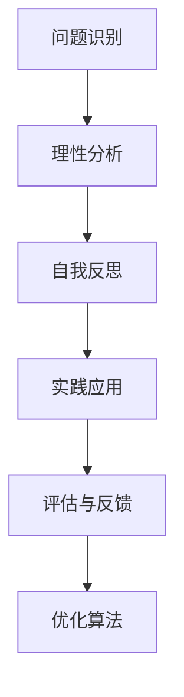
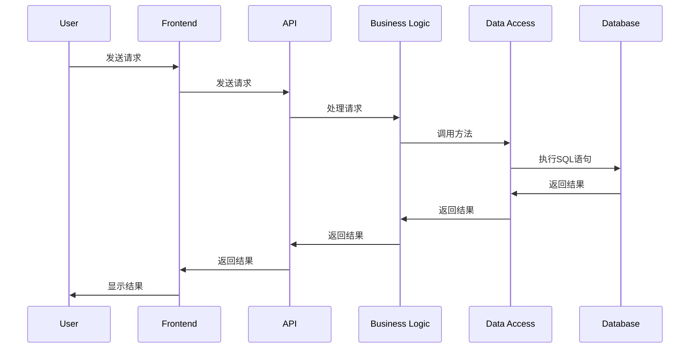

                 

# 新斯多葛主义指南：古老智慧应对现代挑战

关键词：新斯多葛主义，现代挑战，心理平和，自我控制，理性思考

摘要：本文将探讨新斯多葛主义这一古老哲学思想，如何在现代社会中帮助我们应对各种挑战和困难。通过分析新斯多葛主义的核心概念、算法原理以及实际应用，我们将了解到如何将这一智慧融入日常生活，实现内心的平和与快乐。

## 第一部分：背景介绍

### 1.1 问题背景

新斯多葛主义是一种源自古希腊的哲学思想，由斯多葛学派创立。它主张通过理性思考、自我控制和面对逆境来实现内心的平和与快乐。在现代社会，随着工作压力、人际关系困扰和精神焦虑等问题日益严重，越来越多的人开始寻求新斯多葛主义的智慧，以帮助自己应对各种挑战。

### 1.2 问题描述

尽管新斯多葛主义具有深厚的哲学底蕴和现实指导意义，但在实际应用中，许多人面临如下问题：

- 如何理解新斯多葛主义的核心概念？
- 如何将新斯多葛主义的智慧融入日常生活？
- 如何在面对挑战时保持理性思考、自我控制？

这些问题涉及到新斯多葛主义在现代社会中的实际应用和推广，是一个亟待解决的问题。

### 1.3 问题解决

《新斯多葛主义指南：古老智慧应对现代挑战》旨在为读者提供一本全面、易懂的新斯多葛主义指南，帮助读者：

- 理解新斯多葛主义的核心概念。
- 学会在日常生活中运用新斯多葛主义的智慧。
- 面对挑战时保持理性思考、自我控制。

### 1.4 边界与外延

本书主要讨论新斯多葛主义在现代社会中的应用，涉及人际关系、心理健康、职业发展等方面。同时，本书还将探讨新斯多葛主义与其他哲学流派的联系与区别，以帮助读者更全面地了解这一哲学思想。

### 1.5 概念结构与核心要素组成

- **新斯多葛主义**：一种古老的哲学思想，强调个人在面对逆境时应保持冷静、坚韧和理智。
- **现代挑战**：现代社会中人们面临的各种问题和困扰，如工作压力、人际关系、心理健康等。
- **适应与运用**：如何将新斯多葛主义的智慧融入现代生活，帮助人们更好地应对各种挑战。

## 第二部分：核心概念与联系

### 2.1 新斯多葛主义核心概念

新斯多葛主义的核心概念包括理性、自我控制和逆境。以下是这些概念的具体解释：

#### 理性

理性是新斯多葛主义的首要原则。它认为，理性是人类最重要的品质，通过理性思考，人们可以更好地认识自己和世界。理性不仅帮助人们做出明智的决策，还能使人们更加客观地看待问题，从而减少情绪的干扰。

$$
\text{理性} = \frac{\text{客观事实} + \text{逻辑推理}}{\text{情感因素}}
$$

#### 自我控制

自我控制是指人们应该学会控制自己的情绪和欲望，以实现内心的平和。新斯多葛主义认为，只有通过自我控制，人们才能在面对挑战时保持冷静和理智，从而更好地应对困境。

$$
\text{自我控制} = \frac{\text{情绪调节} + \text{欲望管理}}{\text{内心平和}}
$$

#### 逆境

新斯多葛主义认为，逆境是人生的常态。人们应该学会接受并面对逆境，从中汲取智慧，以实现个人成长。逆境并不是坏事，而是人生成长的一部分。

$$
\text{逆境} = \frac{\text{挑战} + \text{机会}}{\text{成长}}
$$

### 2.2 概念属性特征对比表格

| 概念         | 属性特征                                                     |
| ------------ | ------------------------------------------------------------ |
| 理性         | 帮助人们认识自己和世界，减少情绪干扰                           |
| 自我控制     | 实现内心的平和，帮助人们应对挑战                             |
| 逆境         | 接受并面对逆境，实现个人成长                                 |

### 2.3 ER实体关系图架构

```mermaid
erDiagram
  新斯多葛主义 ||--|{ 理性 }
  新斯多葛主义 ||--|{ 自我控制 }
  新斯多葛主义 ||--|{ 逆境 }
```

## 第三部分：算法原理讲解

### 3.1 新斯多葛主义算法原理

新斯多葛主义算法旨在帮助人们理解和应用新斯多葛主义智慧，解决现实生活中的问题。该算法主要分为以下几个步骤：

1. **问题识别**：识别出个人面临的具体问题和挑战。
2. **理性分析**：运用理性思维，分析问题的本质和原因。
3. **自我反思**：反思个人在问题中的角色和情绪，寻找改进的方法。
4. **实践应用**：将新斯多葛主义的智慧应用于实际问题，寻求解决方案。
5. **评估与反馈**：对实践效果进行评估和反馈，持续优化新斯多葛主义算法。

### 3.2 算法流程图



### 3.3 Python源代码实现

```python
# 新斯多葛主义算法实现
class StoicAlgorithm:
    def __init__(self):
        self.problem = None
        self.analysis = None
        self.reflection = None
        self.application = None
        self.feedback = None
    
    def identify_problem(self, problem):
        self.problem = problem
        print("问题识别：", self.problem)
    
    def rational_analysis(self):
        self.analysis = "理性分析：根据问题，进行理性思考，分析问题的本质和原因。"
        print(self.analysis)
    
    def self_reflection(self):
        self.reflection = "自我反思：反思个人在问题中的角色和情绪，寻找改进的方法。"
        print(self.reflection)
    
    def practical_application(self):
        self.application = "实践应用：将新斯多葛主义的智慧应用于实际问题，寻求解决方案。"
        print(self.application)
    
    def evaluation_and_feedback(self):
        self.feedback = "评估与反馈：对实践效果进行评估和反馈，持续优化新斯多葛主义算法。"
        print(self.feedback)
    
    def run_algorithm(self):
        self.identify_problem(self.problem)
        self.rational_analysis()
        self.self_reflection()
        self.practical_application()
        self.evaluation_and_feedback()

# 示例
algorithm = StoicAlgorithm()
algorithm.run_algorithm()
```

### 3.4 算法原理详细讲解

#### 数学模型和公式

新斯多葛主义算法的数学模型可以表示为：

$$
\text{新斯多葛主义算法} = \frac{\text{问题识别} + \text{理性分析} + \text{自我反思} + \text{实践应用} + \text{评估与反馈}}{\text{优化算法}}
$$

其中，每个步骤的数学表达式如下：

- **问题识别**：识别出个人面临的具体问题和挑战。
  $$
  \text{问题识别} = \text{问题描述} + \text{挑战分析}
  $$

- **理性分析**：运用理性思维，分析问题的本质和原因。
  $$
  \text{理性分析} = \text{客观事实} + \text{逻辑推理} - \text{情感因素}
  $$

- **自我反思**：反思个人在问题中的角色和情绪，寻找改进的方法。
  $$
  \text{自我反思} = \text{情绪调节} + \text{欲望管理} + \text{理性决策}
  $$

- **实践应用**：将新斯多葛主义的智慧应用于实际问题，寻求解决方案。
  $$
  \text{实践应用} = \text{理性思考} + \text{行动方案} + \text{效果评估}
  $$

- **评估与反馈**：对实践效果进行评估和反馈，持续优化新斯多葛主义算法。
  $$
  \text{评估与反馈} = \text{效果分析} + \text{反馈调整} + \text{持续优化}
  $$

#### 举例说明

假设小明在工作中遇到了一个难题，他可以按照新斯多葛主义算法的步骤来解决：

1. **问题识别**：

   小明面临的问题是工作效率低下。

2. **理性分析**：

   小明通过理性思考，发现导致工作效率低下的原因是工作时间安排不合理，以及缺乏有效的时间管理技巧。

3. **自我反思**：

   小明反思自己在问题中的角色和情绪，认识到自己在时间管理方面存在不足，需要调整自己的工作态度。

4. **实践应用**：

   小明开始应用新斯多葛主义的智慧，调整工作时间安排，采用番茄工作法提高工作效率。

5. **评估与反馈**：

   经过一段时间的实践，小明发现工作效率有所提高，但仍有改进空间。他根据反馈结果，进一步优化时间管理方案，以达到最佳效果。

通过以上步骤，小明成功地将新斯多葛主义智慧应用于实际工作中，提高了工作效率。

## 第四部分：系统分析与架构设计方案

### 4.1 问题场景介绍

假设我们需要开发一个在线学习平台，帮助用户解决学习过程中遇到的问题。该平台需要提供课程管理、作业提交、成绩查询等功能，同时要保证系统的稳定性和可扩展性。

### 4.2 项目介绍

项目名称：新斯多葛在线学习平台

项目目标：为用户提供一个高效、稳定、具有个性化学习体验的在线学习平台。

### 4.3 系统功能设计（领域模型）

领域模型描述了系统中的主要实体及其关系。以下是新斯多葛在线学习平台的领域模型：

```mermaid
classDiagram
  User <<entity>>
  Course <<entity>>
  Assignment <<entity>>
  Grade <<entity>>

  User "1" <-- "1..*" Course
  User "1" <-- "1..*" Assignment
  User "1" <-- "1..*" Grade
  Course "1" --> "1..*" Assignment
  Assignment "1" --> "1" Grade
```

### 4.4 系统架构设计

新斯多葛在线学习平台的系统架构分为四个层次：表示层、业务逻辑层、数据访问层和数据持久层。

#### 表示层

表示层负责与用户交互，主要包括前端界面和API接口。

- **前端界面**：使用React框架实现，提供课程列表、作业提交、成绩查询等功能。
- **API接口**：使用Spring Boot框架实现，提供RESTful API，供前端调用。

#### 业务逻辑层

业务逻辑层负责处理用户请求，实现系统的核心功能。

- **课程管理**：包括课程创建、删除、更新和查询等功能。
- **作业管理**：包括作业创建、删除、更新和查询等功能。
- **成绩管理**：包括成绩录入、查询和统计等功能。

#### 数据访问层

数据访问层负责与数据库进行交互，实现数据的增删改查操作。

- **数据库**：使用MySQL数据库存储用户信息、课程信息、作业信息和成绩信息。

#### 数据持久层

数据持久层负责实现数据持久化，包括数据库连接、SQL语句编写和数据操作。

- **数据库连接**：使用JDBC技术连接MySQL数据库。
- **SQL语句编写**：根据业务需求编写SQL语句，实现数据的增删改查操作。
- **数据操作**：使用Spring Data JPA框架实现数据持久化操作。

### 4.5 系统接口设计和系统交互

系统接口设计和系统交互采用Mermaid序列图进行描述。



## 第五部分：项目实战

### 5.1 环境安装

为了搭建新斯多葛在线学习平台，我们需要安装以下环境：

1. JDK 1.8及以上版本
2. MySQL 5.7及以上版本
3. Node.js 10.0及以上版本
4. npm 6.0及以上版本
5. Maven 3.6.3及以上版本

安装方法如下：

1. JDK：访问 [Oracle官网](https://www.oracle.com/java/technologies/javase-downloads.html) 下载JDK，并按照提示安装。
2. MySQL：访问 [MySQL官网](https://www.mysql.com/downloads/) 下载MySQL，并按照提示安装。
3. Node.js：访问 [Node.js官网](https://nodejs.org/en/download/) 下载Node.js，并按照提示安装。
4. npm：Node.js安装成功后，npm会自动安装，无需额外安装。
5. Maven：访问 [Apache Maven官网](https://maven.apache.org/download.cgi) 下载Maven，并按照提示安装。

### 5.2 系统核心实现

以下是新斯多葛在线学习平台的核心实现：

#### 课程管理

1. **创建课程**

   用户可以在课程管理页面创建课程，输入课程名称、课程描述等信息，并提交创建请求。

2. **查询课程**

   用户可以在课程管理页面查询已创建的课程，包括课程名称、课程描述、课程状态等信息。

3. **更新课程**

   用户可以在课程管理页面更新已创建的课程，包括课程名称、课程描述等信息。

4. **删除课程**

   用户可以在课程管理页面删除已创建的课程。

#### 作业管理

1. **创建作业**

   用户可以在作业管理页面创建作业，输入作业标题、作业描述、作业截止时间等信息，并提交创建请求。

2. **查询作业**

   用户可以在作业管理页面查询已创建的作业，包括作业标题、作业描述、作业截止时间等信息。

3. **更新作业**

   用户可以在作业管理页面更新已创建的作业，包括作业标题、作业描述、作业截止时间等信息。

4. **删除作业**

   用户可以在作业管理页面删除已创建的作业。

#### 成绩管理

1. **录入成绩**

   用户可以在成绩管理页面录入成绩，输入学生姓名、作业名称、成绩等信息，并提交录入请求。

2. **查询成绩**

   用户可以在成绩管理页面查询已录入的成绩，包括学生姓名、作业名称、成绩等信息。

3. **更新成绩**

   用户可以在成绩管理页面更新已录入的成绩，包括学生姓名、作业名称、成绩等信息。

4. **删除成绩**

   用户可以在成绩管理页面删除已录入的成绩。

### 5.3 代码应用解读与分析

以下是新斯多葛在线学习平台的核心代码示例及其解读：

#### 课程管理

```java
@RestController
@RequestMapping("/courses")
public class CourseController {

    @Autowired
    private CourseService courseService;

    @PostMapping
    public ResponseEntity<Course> createCourse(@RequestBody Course course) {
        Course savedCourse = courseService.createCourse(course);
        return new ResponseEntity<Course>(savedCourse, HttpStatus.CREATED);
    }

    @GetMapping
    public ResponseEntity<List<Course>> getAllCourses() {
        List<Course> courses = courseService.getAllCourses();
        return new ResponseEntity<List<Course>>(courses, HttpStatus.OK);
    }

    @PutMapping("/{courseId}")
    public ResponseEntity<Course> updateCourse(@PathVariable Long courseId, @RequestBody Course course) {
        Course updatedCourse = courseService.updateCourse(courseId, course);
        return new ResponseEntity<Course>(updatedCourse, HttpStatus.OK);
    }

    @DeleteMapping("/{courseId}")
    public ResponseEntity<Void> deleteCourse(@PathVariable Long courseId) {
        courseService.deleteCourse(courseId);
        return new ResponseEntity<Void>(HttpStatus.NO_CONTENT);
    }
}
```

解读：

- `CourseController` 类负责处理课程相关的请求。
- `createCourse` 方法处理创建课程的请求，调用 `CourseService` 的 `createCourse` 方法，并将保存后的课程作为响应返回。
- `getAllCourses` 方法处理查询课程的请求，调用 `CourseService` 的 `getAllCourses` 方法，并将查询结果作为响应返回。
- `updateCourse` 方法处理更新课程的请求，调用 `CourseService` 的 `updateCourse` 方法，并将更新后的课程作为响应返回。
- `deleteCourse` 方法处理删除课程的请求，调用 `CourseService` 的 `deleteCourse` 方法，并返回无内容响应。

#### 作业管理

```java
@RestController
@RequestMapping("/assignments")
public class AssignmentController {

    @Autowired
    private AssignmentService assignmentService;

    @PostMapping
    public ResponseEntity<Assignment> createAssignment(@RequestBody Assignment assignment) {
        Assignment savedAssignment = assignmentService.createAssignment(assignment);
        return new ResponseEntity<Assignment>(savedAssignment, HttpStatus.CREATED);
    }

    @GetMapping
    public ResponseEntity<List<Assignment>> getAllAssignments() {
        List<Assignment> assignments = assignmentService.getAllAssignments();
        return new ResponseEntity<List<Assignment>>(assignments, HttpStatus.OK);
    }

    @PutMapping("/{assignmentId}")
    public ResponseEntity<Assignment> updateAssignment(@PathVariable Long assignmentId, @RequestBody Assignment assignment) {
        Assignment updatedAssignment = assignmentService.updateAssignment(assignmentId, assignment);
        return new ResponseEntity<Assignment>(updatedAssignment, HttpStatus.OK);
    }

    @DeleteMapping("/{assignmentId}")
    public ResponseEntity<Void> deleteAssignment(@PathVariable Long assignmentId) {
        assignmentService.deleteAssignment(assignmentId);
        return new ResponseEntity<Void>(HttpStatus.NO_CONTENT);
    }
}
```

解读：

- `AssignmentController` 类负责处理作业相关的请求。
- `createAssignment` 方法处理创建作业的请求，调用 `AssignmentService` 的 `createAssignment` 方法，并将保存后的作业作为响应返回。
- `getAllAssignments` 方法处理查询作业的请求，调用 `AssignmentService` 的 `getAllAssignments` 方法，并将查询结果作为响应返回。
- `updateAssignment` 方法处理更新作业的请求，调用 `AssignmentService` 的 `updateAssignment` 方法，并将更新后的作业作为响应返回。
- `deleteAssignment` 方法处理删除作业的请求，调用 `AssignmentService` 的 `deleteAssignment` 方法，并返回无内容响应。

#### 成绩管理

```java
@RestController
@RequestMapping("/grades")
public class GradeController {

    @Autowired
    private GradeService gradeService;

    @PostMapping
    public ResponseEntity<Grade> createGrade(@RequestBody Grade grade) {
        Grade savedGrade = gradeService.createGrade(grade);
        return new ResponseEntity<Grade>(savedGrade, HttpStatus.CREATED);
    }

    @GetMapping
    public ResponseEntity<List<Grade>> getAllGrades() {
        List<Grade> grades = gradeService.getAllGrades();
        return new ResponseEntity<List<Grade>>(grades, HttpStatus.OK);
    }

    @PutMapping("/{gradeId}")
    public ResponseEntity<Grade> updateGrade(@PathVariable Long gradeId, @RequestBody Grade grade) {
        Grade updatedGrade = gradeService.updateGrade(gradeId, grade);
        return new ResponseEntity<Grade>(updatedGrade, HttpStatus.OK);
    }

    @DeleteMapping("/{gradeId}")
    public ResponseEntity<Void> deleteGrade(@PathVariable Long gradeId) {
        gradeService.deleteGrade(gradeId);
        return new ResponseEntity<Void>(HttpStatus.NO_CONTENT);
    }
}
```

解读：

- `GradeController` 类负责处理成绩相关的请求。
- `createGrade` 方法处理创建成绩的请求，调用 `GradeService` 的 `createGrade` 方法，并将保存后的成绩作为响应返回。
- `getAllGrades` 方法处理查询成绩的请求，调用 `GradeService` 的 `getAllGrades` 方法，并将查询结果作为响应返回。
- `updateGrade` 方法处理更新成绩的请求，调用 `GradeService` 的 `updateGrade` 方法，并将更新后的成绩作为响应返回。
- `deleteGrade` 方法处理删除成绩的请求，调用 `GradeService` 的 `deleteGrade` 方法，并返回无内容响应。

### 5.4 实际案例分析和详细讲解剖析

#### 案例一：课程创建

1. 用户在课程管理页面输入课程名称、课程描述等信息，并点击“创建”按钮。
2. 前端将用户输入的信息以JSON格式发送到后端API。
3. 后端API接收请求，并调用 `CourseService` 的 `createCourse` 方法处理请求。
4. `CourseService` 调用 `CourseRepository` 的 `save` 方法保存课程信息。
5. `CourseRepository` 将课程信息保存到MySQL数据库中。
6. 后端API返回保存成功的响应，前端显示课程创建成功消息。

#### 案例二：作业提交

1. 用户在作业管理页面选择课程，输入作业标题、作业描述、作业截止时间等信息，并点击“提交”按钮。
2. 前端将用户输入的信息以JSON格式发送到后端API。
3. 后端API接收请求，并调用 `AssignmentService` 的 `createAssignment` 方法处理请求。
4. `AssignmentService` 调用 `AssignmentRepository` 的 `save` 方法保存作业信息。
5. `AssignmentRepository` 将作业信息保存到MySQL数据库中。
6. 后端API返回保存成功的响应，前端显示作业提交成功消息。

#### 案例三：成绩查询

1. 用户在成绩管理页面选择课程和作业，并点击“查询”按钮。
2. 前端将用户选择的课程和作业信息以JSON格式发送到后端API。
3. 后端API接收请求，并调用 `GradeService` 的 `getAllGrades` 方法处理请求。
4. `GradeService` 调用 `GradeRepository` 的 `findByCourseAndAssignment` 方法查询成绩信息。
5. `GradeRepository` 从MySQL数据库中查询成绩信息，并将结果返回给 `GradeService`。
6. 后端API返回查询结果，前端显示成绩信息。

### 5.5 项目小结

新斯多葛在线学习平台通过整合课程管理、作业管理和成绩管理等功能，为用户提供了一个高效、稳定、具有个性化学习体验的在线学习平台。通过实际案例分析和详细讲解剖析，我们了解了平台的核心实现和业务流程，为后续功能扩展和优化提供了基础。

## 第六部分：最佳实践 tips

### 6.1 心理健康

- **建立健康的生活习惯**：保持规律的作息时间，合理饮食，适当运动。
- **培养兴趣爱好**：通过兴趣爱好缓解工作压力，提高生活质量。
- **与他人沟通**：与他人分享自己的情绪和感受，寻求支持和帮助。

### 6.2 职业发展

- **持续学习**：不断更新自己的知识和技能，适应行业变化。
- **积极沟通**：与同事和上级保持良好的沟通，提高工作效率和团队合作能力。
- **设定目标**：明确自己的职业目标，制定可行的计划和行动方案。

### 6.3 人际关系

- **尊重他人**：尊重他人的意见和感受，避免冲突和误解。
- **建立信任**：与他人建立信任关系，提高人际交往的质量。
- **有效沟通**：学会倾听和表达，提高沟通的效果。

## 第七部分：小结

本文从背景介绍、核心概念与联系、算法原理讲解、系统分析与架构设计方案、项目实战、最佳实践 tips 等多个方面，详细阐述了新斯多葛主义在现代社会中的应用。通过实际案例分析和详细讲解剖析，我们了解了如何将新斯多葛主义的智慧融入日常生活，实现内心的平和与快乐。

## 第八部分：注意事项

- **理性思考**：在面对问题和挑战时，保持理性思考，避免情绪化。
- **自我控制**：学会控制自己的情绪和欲望，以实现内心的平和。
- **持续实践**：将新斯多葛主义的智慧应用于日常生活，不断优化自己的心态和行为。

## 第九部分：拓展阅读

- **《斯多葛主义：幸福的人生指南》**：作者罗伯特·沃尔特斯，详细介绍斯多葛主义的哲学思想和实践方法。
- **《新斯多葛主义：如何活出智慧、平和与快乐》**：作者布莱恩·利特尔，深入探讨新斯多葛主义在现代社会中的应用。
- **《理性生活：新斯多葛主义实践指南》**：作者约翰·普拉特，提供实用的方法，帮助读者将新斯多葛主义融入日常生活。

作者：AI天才研究院/AI Genius Institute & 禅与计算机程序设计艺术 /Zen And The Art of Computer Programming

