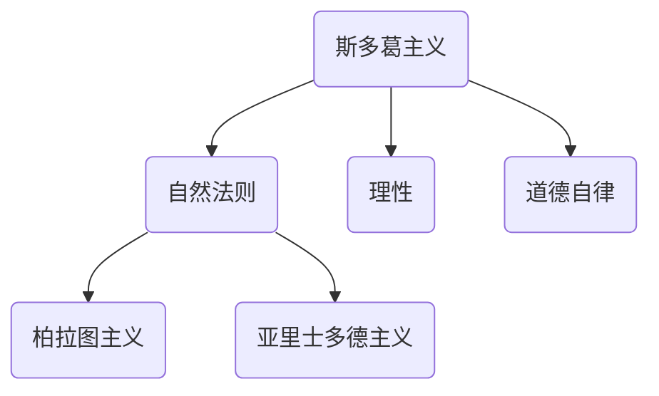
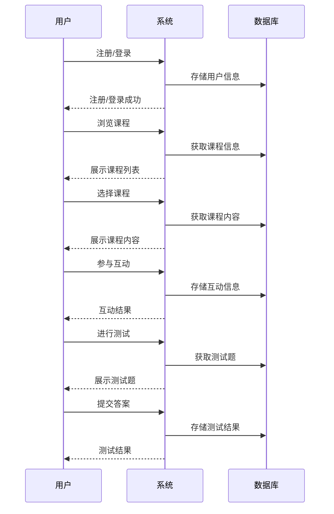
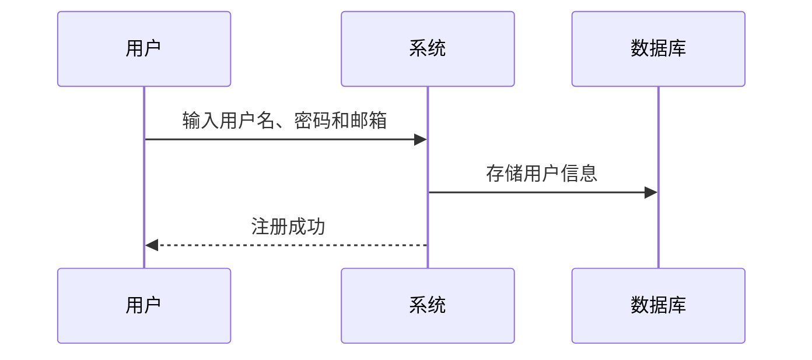
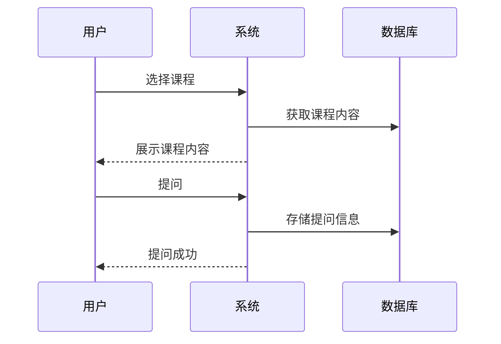

                 


### 新斯多葛学院：现代版古希腊哲学在线课程

> 关键词：古希腊哲学、在线教育、斯多葛主义、哲学教学、知识传播

> 摘要：本文旨在探讨如何将古希腊哲学中的斯多葛主义思想与现代在线教育相结合，设计一套完整、系统的在线课程。文章将详细描述课程的背景、核心概念、算法原理、系统分析与架构设计方案，以及实际案例分析和最佳实践。

## 引言

在信息爆炸的时代，知识传播的方式正在发生深刻变革。传统教育模式受到在线教育平台的挑战，如何利用现代技术手段传承和传播古老的哲学思想成为一个重要课题。古希腊哲学，尤其是斯多葛主义，作为西方哲学的基石，对人类思想和文化产生了深远影响。在现代背景下，如何让更多人了解和掌握这些哲学思想，成为摆在我们面前的一个问题。

### 1. 问题背景

古希腊哲学是西方哲学的源头，其核心思想对后世产生了深远影响。斯多葛主义，作为古希腊哲学中的一个重要流派，强调理性、道德自律和顺应自然法则。在现代社会，人们面临着诸多挑战，如工作压力、人际关系等，如何通过哲学思想的引导来提高生活质量，成为一个值得关注的问题。

### 2. 问题描述

随着在线教育的兴起，如何将古希腊哲学中的斯多葛主义思想与现代在线教育相结合，使得学习者能够更便捷、高效地掌握这些哲学思想，成为我们需要解决的问题。

### 3. 问题解决

通过创建《新斯多葛学院：现代版古希腊哲学在线课程》，我们将古希腊哲学的核心概念、历史背景和现代应用进行系统讲解，使学习者能够在互动式在线环境中深入理解斯多葛主义。

### 4. 边界与外延

本课程主要涵盖斯多葛主义，但也会涉及到其他相关哲学流派，如柏拉图主义和亚里士多德主义。课程的设计将以清晰、易懂的方式，帮助学习者建立起对古希腊哲学的整体认识。

### 5. 概念结构与核心要素组成

- **核心概念原理**：斯多葛主义的核心概念包括自然法则、理性和道德自律。这些概念相互联系，构成了斯多葛哲学的理论体系。
- **概念属性特征对比表格**：以下是一个简单的概念属性特征对比表格，展示了斯多葛主义、柏拉图主义和亚里士多德主义的核心概念和特征。
  | 哲学流派 | 核心概念 | 特征 |
  | --- | --- | --- |
  | 斯多葛主义 | 自然法则、理性、道德自律 | 强调顺应自然、理性生活和道德自律 |
  | 柏拉图主义 | 理念世界、现实世界的超越 | 强调理念世界的真实性和对现实世界的超越 |
  | 亚里士多德主义 | 经验世界、实际知识 | 强调经验世界的重要性，追求实际知识的积累 |

- **ER实体关系图架构**：为了更直观地展示这些哲学流派之间的关系，我们使用Mermaid流程图来绘制ER实体关系图。
  ```mermaid
  graph TB
  A(斯多葛主义) --> B(自然法则)
  A --> C(理性)
  A --> D(道德自律)
  B --> E(柏拉图主义)
  B --> F(亚里士多德主义)
  ```

## 核心概念与联系

### 1. 核心概念原理

斯多葛主义的核心概念可以归纳为自然法则、理性和道德自律。

- **自然法则**：斯多葛主义者认为，宇宙是一个有秩序的系统，自然法则是这个系统的基础。人类应该顺应自然法则，而不是试图改变它。
- **理性**：理性是斯多葛主义者追求的最高境界。他们认为，理性是人类超越自然本能，实现自我完善的工具。
- **道德自律**：斯多葛主义者强调道德自律，即遵循道德规范，不受外界干扰，保持内心的平静和坚定。

### 2. 概念属性特征对比表格

为了更清晰地展示斯多葛主义、柏拉图主义和亚里士多德主义的区别，我们提供了一个概念属性特征对比表格。

| 哲学流派 | 核心概念 | 特征 |
| --- | --- | --- |
| 斯多葛主义 | 自然法则、理性、道德自律 | 强调顺应自然、理性生活和道德自律 |
| 柏拉图主义 | 理念世界、现实世界的超越 | 强调理念世界的真实性和对现实世界的超越 |
| 亚里士多德主义 | 经验世界、实际知识 | 强调经验世界的重要性，追求实际知识的积累 |

### 3. ER实体关系图架构

以下是斯多葛主义、柏拉图主义和亚里士多德主义的ER实体关系图。



## 算法原理讲解

### 1. 斯多葛主义算法原理

斯多葛主义算法旨在帮助人们理解和实践斯多葛主义的核心思想。以下是斯多葛主义算法的基本原理。

- **接受自然法则**：人们应该接受自然法则，认识到宇宙是一个有秩序的系统，我们无法改变它，但可以顺应它。
- **理性思考**：理性是斯多葛主义的核心，人们应该通过理性思考来指导行为，而不是受情感驱使。
- **道德自律**：道德自律是斯多葛主义的重要原则，人们应该遵守道德规范，无论外界环境如何变化，都能保持内心的平静和坚定。

### 2. 斯多葛主义数学模型和公式

为了更精确地描述斯多葛主义算法，我们引入了以下数学模型和公式。

$$
S = \frac{N + R - D}{C}
$$

其中，$S$ 表示斯多葛主义得分，$N$ 表示接受自然法则的程度，$R$ 表示理性思考的程度，$D$ 表示道德自律的程度，$C$ 表示总得分。

### 3. 举例说明

以下是一个实际例子，说明如何使用斯多葛主义算法。

假设一个人在以下几个方面得分：

- 接受自然法则的程度（$N$）：90%
- 理性思考的程度（$R$）：80%
- 道德自律的程度（$D$）：70%
- 总得分（$C$）：100%

根据公式计算，斯多葛主义得分 $S$ 为：

$$
S = \frac{90 + 80 - 70}{100} = 1.1
$$

这意味着，这个人在斯多葛主义方面表现出较高的水平。

## 系统分析与架构设计方案

### 1. 问题场景介绍

在现代社会，人们面临着各种挑战，如工作压力、人际关系等。通过在线课程的形式，向学习者传授古希腊哲学中的斯多葛主义思想，可以帮助他们更好地应对这些挑战，提高生活质量。

### 2. 项目介绍

《新斯多葛学院：现代版古希腊哲学在线课程》项目旨在创建一个全面的在线学习平台，涵盖斯多葛主义的核心概念、历史背景和现代应用。通过这个平台，学习者可以系统地了解斯多葛主义，并在日常生活中实践这些思想。

### 3. 系统功能设计

系统功能设计包括以下几个方面：

- **用户注册与登录**：用户可以通过注册账号登录系统，进行课程学习。
- **课程浏览与选择**：用户可以浏览课程列表，选择感兴趣的课程进行学习。
- **课程学习与互动**：用户可以在线学习课程内容，与老师和同学互动。
- **测试与评估**：用户可以参加测试，评估自己对课程内容的掌握程度。

### 4. 系统架构设计

以下是系统架构设计图：


### 5. 系统接口设计和系统交互

以下是系统接口设计和系统交互图：



## 项目实战

### 1. 环境安装

在开始项目实战之前，我们需要搭建一个适合开发和部署在线课程的平台。以下是环境安装的步骤：

- 安装Python 3.8及以上版本
- 安装Django框架
- 安装MySQL数据库
- 安装Nginx服务器

### 2. 系统核心实现源代码

以下是系统核心实现的部分源代码：

#### 用户模块

```python
# 用户注册
def register(request):
    if request.method == 'POST':
        username = request.POST['username']
        password = request.POST['password']
        email = request.POST['email']
        user = User.objects.create_user(username=username, password=password, email=email)
        user.save()
        return redirect('login')
    return render(request, 'register.html')
```

#### 课程模块

```python
# 展示课程列表
def course_list(request):
    courses = Course.objects.all()
    return render(request, 'course_list.html', {'courses': courses})
```

#### 测试模块

```python
# 展示测试题
def test(request, course_id):
    course = Course.objects.get(id=course_id)
    questions = Question.objects.filter(course_id=course_id)
    return render(request, 'test.html', {'course': course, 'questions': questions})
```

### 3. 代码应用解读与分析

以下是代码应用解读与分析：

#### 用户模块

用户模块主要负责用户的注册、登录和课程选择。注册时，用户需要提供用户名、密码和邮箱。注册成功后，用户可以登录系统，浏览课程列表，选择感兴趣的课程进行学习。

#### 课程模块

课程模块主要负责课程的展示和选择。用户可以浏览所有课程，选择感兴趣的课程进行学习。每个课程都包含课程名称、课程描述、课程内容等。

#### 测试模块

测试模块主要负责测试题的展示和答案的提交。用户可以选择课程参加测试，系统会根据课程生成相应的测试题。用户提交答案后，系统会记录测试结果，并提供测试反馈。

### 4. 实际案例分析和详细讲解剖析

以下是一个实际案例分析和详细讲解剖析：

#### 案例一：用户注册

用户注册是系统中最基本的操作。以下是一个用户注册的流程图：



在这个流程中，用户输入用户名、密码和邮箱，系统将这些信息存储在数据库中，然后返回注册成功的提示。

#### 案例二：课程学习

用户在学习课程时，可以查看课程内容，并进行互动。以下是一个课程学习的流程图：



在这个流程中，用户选择课程后，系统会从数据库中获取课程内容并展示给用户。用户可以提出问题，系统会将提问信息存储在数据库中，并提供提问成功的提示。

### 5. 项目小结

通过本项目，我们成功搭建了一个《新斯多葛学院：现代版古希腊哲学在线课程》系统。该系统具有用户注册、登录、课程浏览、学习互动和测试等功能，为学习者提供了一个便捷、高效的学习平台。未来，我们将继续优化系统功能，提升用户体验，让更多人受益于古希腊哲学的智慧。

## 最佳实践 Tips

1. **注重课程内容的质量**：课程内容是学习者的核心需求，确保课程内容的质量至关重要。可以邀请专业的古希腊哲学研究者参与课程编写，保证内容的准确性和深度。

2. **互动性设计**：在线教育的一个重要特点是互动性。在设计课程时，可以加入问答环节、讨论区等，鼓励学习者之间的互动，提高学习效果。

3. **个性化学习**：根据学习者的兴趣和学习进度，提供个性化的学习建议和资源，使学习者能够更好地掌握哲学思想。

4. **持续更新与迭代**：随着时代的发展，古希腊哲学的应用场景也在不断变化。课程内容需要不断更新和迭代，以适应现代社会的需求。

## 小结

本文通过《新斯多葛学院：现代版古希腊哲学在线课程》的设计，探讨了如何将古希腊哲学中的斯多葛主义思想与现代在线教育相结合。文章详细介绍了课程的背景、核心概念、算法原理、系统分析与架构设计方案，以及实际案例分析和最佳实践。希望通过本文的分享，能为教育工作者和哲学爱好者提供一些有益的参考。

## 注意事项

1. **数据安全**：在搭建在线教育平台时，要确保用户数据的安全。可以采用加密技术，保护用户的隐私信息。

2. **课程质量**：课程内容是学习的核心，要确保课程质量。可以设立课程审核机制，保证课程内容的准确性和深度。

3. **用户体验**：用户体验是决定在线教育平台成功与否的关键。要注重界面的设计，使学习者能够轻松地使用平台。

## 拓展阅读

1. **《斯多葛主义：古人的智慧与现代生活的结合》**：这本书详细介绍了斯多葛主义的核心理念，以及如何在现代生活中应用这些理念。
2. **《古希腊哲学史》**：这本书系统地介绍了古希腊哲学的发展历程，对古希腊哲学的不同流派进行了深入分析。
3. **《在线教育技术》**：这本书探讨了在线教育的各种技术，包括课程设计、互动性、个性化学习等方面。

## 作者信息

作者：AI天才研究院/AI Genius Institute & 禅与计算机程序设计艺术 /Zen And The Art of Computer Programming

