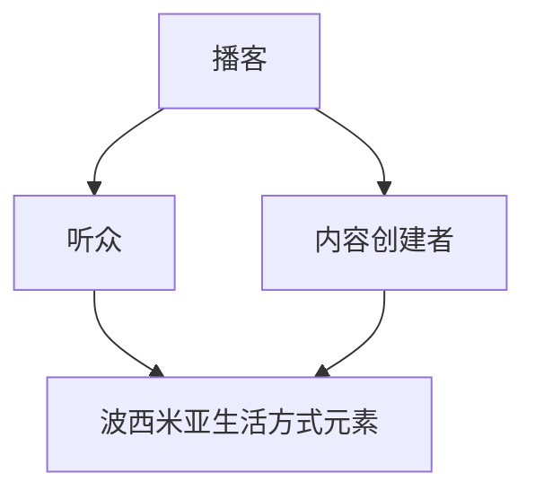
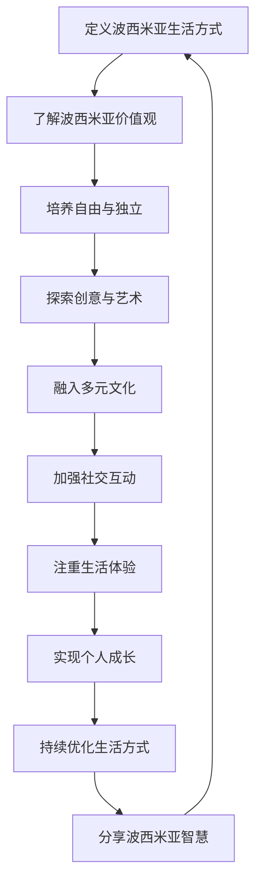
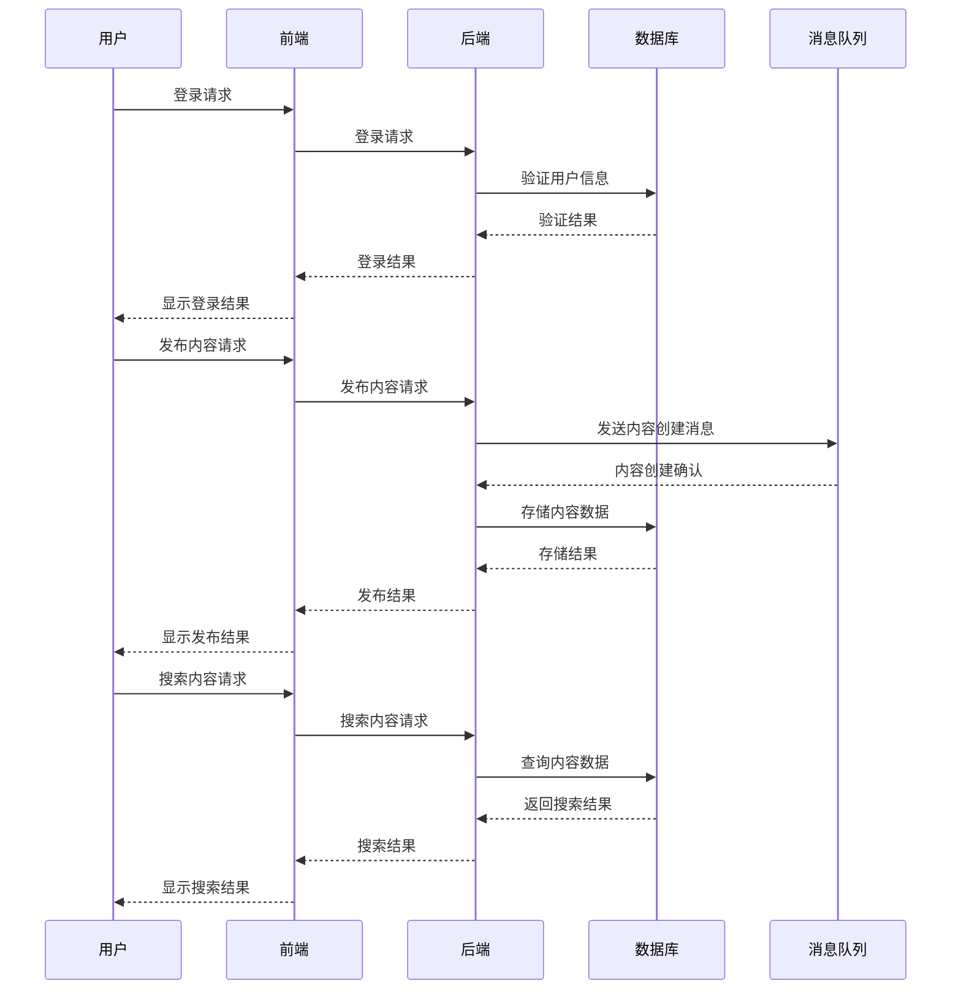

                 

## 波西米亚生活方式概述

### 1. 波西米亚生活方式的概念与起源

**1.1 波西米亚生活方式的定义**

波西米亚生活方式（Bohemian lifestyle）起源于19世纪的欧洲，最初指的是艺术家和知识分子追求自由、创意和无拘无束的生活方式。它强调个人自由、艺术创造和反传统的社会价值观。随着时代的发展，波西米亚生活方式逐渐扩展到更广泛的社会群体，成为一种追求自由、多样性和自我实现的生活方式。

**1.2 波西米亚生活方式的起源**

波西米亚生活方式的起源可以追溯到19世纪中叶的欧洲，特别是在巴黎的艺术家和文化人士中流行起来。当时，许多艺术家和知识分子反对当时的社会制度和价值观，追求个性化和反传统的自由生活方式。波西米亚一词来自波希米亚，这是一个曾经是捷克地区的名字，象征着自由和独立的个性。

**1.3 波西米亚生活方式的特点**

波西米亚生活方式具有以下特点：

- **自由与独立**：波西米亚人追求个人自由和独立，不受传统社会规范和价值观的束缚。
- **创意与艺术**：波西米亚生活方式鼓励艺术创作和创意思维，强调个人表达和创造力。
- **多元文化**：波西米亚人通常具有开放的心态，接纳不同文化和价值观，追求多元文化交融。
- **社交互动**：波西米亚生活方式重视人际交往和社会互动，通过社交活动来扩展视野和经验。
- **体验生活**：波西米亚人注重生活体验，追求有意义和丰富的生活经历。

### 2. 波西米亚生活方式与现代社会的契合

**2.1 现代社会的变化**

现代社会正经历着快速的变化，信息技术的发展、全球化的进程以及人们对生活质量的追求，使得生活方式和社交体验的需求发生了变化。现代社会更加注重个性化和多样性，人们渴望摆脱传统的束缚，追求自由和自我实现。

**2.2 波西米亚生活方式的适应**

波西米亚生活方式与现代社会的契合体现在以下几个方面：

- **适应信息技术**：波西米亚生活方式充分利用信息技术，如互联网、社交媒体和播客，来传播和分享生活方式的智慧。
- **灵活性和多样性**：波西米亚生活方式适应现代社会的高流动性，人们可以更加灵活地选择工作和居住地点，享受多样化的生活体验。
- **自我表达**：现代社会提供了更多自我表达的平台和机会，波西米亚生活方式鼓励人们通过艺术、创作和社交互动来展现自我。

**2.3 波西米亚生活方式的价值**

波西米亚生活方式在现代社会中具有重要的价值：

- **个人成长**：波西米亚生活方式鼓励个人成长和自我实现，通过不断探索和尝试，人们可以更好地认识自我和世界。
- **社交互动**：波西米亚生活方式强调社交互动，通过与他人交流和合作，人们可以建立更广泛的社交网络和人际关系。
- **生活质量**：波西米亚生活方式追求有意义和丰富的生活体验，提高人们的生活质量，增强幸福感。

### 3. 波西米亚生活方式的核心要素

**3.1 自由与独立**

自由与独立是波西米亚生活方式的核心要素之一。波西米亚人追求个人自由，不受传统社会规范和价值观的束缚。他们相信每个人都是独立的个体，有权利按照自己的意愿生活。自由与独立使得波西米亚人能够自由表达自己的想法和创造力，不受外部压力的影响。

**3.2 创意与艺术**

创意与艺术是波西米亚生活方式的重要组成部分。波西米亚人热爱艺术，通过绘画、音乐、写作等艺术形式来表达自我和创造价值。创意思维使得波西米亚人在面对问题和挑战时能够找到独特的解决方案，从而实现个人成长和自我实现。

**3.3 社交与体验**

社交与体验是波西米亚生活方式的重要方面。波西米亚人重视人际交往和社会互动，通过社交活动来扩展视野和经验。他们追求有意义的生活体验，愿意尝试新的文化和生活方式。社交与体验不仅丰富了波西米亚人的生活，也帮助他们更好地理解世界和自己。

### 4. 波西米亚生活方式的实践方法

**4.1 个人成长**

波西米亚生活方式鼓励个人成长，通过不断学习、探索和实践来提升自己的能力和素质。个人成长不仅包括专业技能的提升，还包括情感智慧、人际交往能力等方面的培养。波西米亚人相信，个人的成长是生活的一部分，是实现自我价值的基础。

**4.2 社交互动**

社交互动是波西米亚生活方式的重要组成部分。通过社交活动，波西米亚人可以结识新朋友，扩展社交网络，分享经验和知识。社交互动不仅能够带来乐趣和满足感，还能够促进个人成长和社会进步。

**4.3 生活态度**

生活态度是波西米亚生活方式的关键要素。波西米亚人通常拥有积极、乐观和开放的生活态度，他们对待生活充满热情和好奇心。他们相信，积极的生活态度能够带来积极的结果，帮助他们在面对困难和挑战时保持坚定和乐观。

### 5. 播客在波西米亚生活方式中的角色

**5.1 播客的定义与特点**

播客（Podcast）是一种音频分享媒介，允许用户通过互联网下载或在线收听节目。播客具有以下几个特点：

- **灵活性**：用户可以根据自己的时间安排，随时随地收听播客内容。
- **多样性**：播客涵盖了各种主题和领域，从科技、文化到娱乐等，用户可以根据自己的兴趣选择内容。
- **互动性**：用户可以通过评论、提问等方式与播客主持人或其他听众互动。

**5.2 播客在传播波西米亚生活方式中的作用**

播客在传播波西米亚生活方式中发挥着重要作用：

- **信息传递**：播客可以作为波西米亚生活方式的传播工具，将生活方式的理念、实践方法和经验传递给更多人。
- **分享智慧**：波西米亚生活方式的实践者可以通过播客分享自己的智慧和生活经验，帮助更多人理解和实践波西米亚生活方式。
- **启发思考**：播客内容可以启发听众思考，鼓励他们尝试新的生活方式，实现个人成长和自我实现。

**5.3 播客制作与分享的技巧**

要制作和分享高质量的播客，需要掌握以下技巧：

- **内容策划**：确定播客的主题和内容，确保内容具有吸引力和实用性。
- **声音质量**：确保录音设备的质量，提高播客的声音清晰度和音质。
- **编辑剪辑**：对录音进行编辑和剪辑，去除不必要的噪音和停顿，提高播客的专业性。
- **发布与推广**：选择合适的播客平台发布节目，并通过社交媒体和其他渠道进行推广，吸引更多听众。

### 6. 现代漂泊者的生存智慧

**6.1 漂泊者的挑战与机遇**

现代漂泊者面临一系列挑战和机遇：

- **挑战**：漂泊者需要适应不同的环境和生活方式，可能会面临孤独、不确定性和经济压力等挑战。
- **机遇**：漂泊者可以体验不同的文化和生活方式，拓宽视野，结识新朋友，实现个人成长和职业发展。

**6.2 漂泊者的生存技巧**

为了在漂泊生活中保持平衡和成功，漂泊者需要掌握以下生存技巧：

- **灵活应变**：漂泊者需要具备灵活应变的能力，能够迅速适应新的环境和挑战。
- **理财规划**：合理规划财务，确保有足够的资金支持漂泊生活。
- **保持联系**：保持与家人和朋友的联系，获得情感支持和鼓励。

**6.3 漂泊者的心灵成长**

漂泊者可以通过以下方式实现心灵成长：

- **自我反思**：定期进行自我反思，思考自己的价值观、目标和生活方式。
- **学习新知识**：利用漂泊生活的时间学习新知识，提升自己的能力和素质。
- **保持积极心态**：保持积极的心态，面对困难和挑战时保持乐观和坚韧。

### 7. 波西米亚生活方式的未来展望

**7.1 波西米亚生活方式的发展趋势**

波西米亚生活方式在未来将继续发展，主要体现在以下几个方面：

- **全球传播**：随着全球化的推进，波西米亚生活方式将影响更多的人，成为一种全球性的生活方式。
- **数字化融合**：波西米亚生活方式将更加融合数字化技术和工具，提高生活的便利性和效率。
- **多样性和创新**：波西米亚生活方式将不断创新发展，适应不同人群和文化的需求。

**7.2 播客在波西米亚生活方式中的发展前景**

播客在波西米亚生活方式中具有广阔的发展前景：

- **内容多样化**：播客将涵盖更多主题和领域，满足不同听众的需求。
- **互动性增强**：播客将更加注重互动性，促进听众与主持人之间的交流与合作。
- **技术创新**：播客技术将不断创新，提供更好的用户体验和内容制作工具。

**7.3 对未来波西米亚生活方式的展望**

未来，波西米亚生活方式将继续发挥其独特的魅力，成为人们追求自由、多样性和自我实现的重要途径。随着信息技术的发展和社会的进步，波西米亚生活方式将更加融入现代生活，为人们带来更多有意义和丰富的生活体验。

### 8. 最佳实践与案例分析

**8.1 波西米亚生活方式的最佳实践**

为了更好地实践波西米亚生活方式，以下是一些建议和最佳实践：

- **保持灵活性**：灵活安排自己的生活和工作，适应不同的环境和需求。
- **培养多元文化**：积极了解和接纳不同的文化和价值观，拓宽自己的视野。
- **注重自我表达**：通过艺术、创作和社交互动来表达自己，实现个人成长。
- **理财规划**：合理规划财务，确保有足够的资金支持自己的生活方式。

**8.2 漂泊者的成功案例分享**

以下是一些漂泊者的成功案例，他们通过实践波西米亚生活方式取得了显著的成就：

- **艺术家李明**：通过播客分享自己的艺术创作经验和心得，吸引了大量粉丝，成功举办了个人艺术展览。
- **创业者张丽**：在全球范围内开展业务，利用数字化工具和社交平台进行市场拓展，实现了事业的快速发展。
- **旅行者王刚**：通过旅行和体验不同的文化，拓宽了自己的视野，成为了一名知名的旅行博主。

**8.3 播客内容的创新与优化**

为了制作出高质量的播客内容，以下是一些建议和技巧：

- **内容策划**：确定播客的主题和内容，确保内容具有吸引力和实用性。
- **声音质量**：确保录音设备的质量，提高播客的声音清晰度和音质。
- **编辑剪辑**：对录音进行编辑和剪辑，去除不必要的噪音和停顿，提高播客的专业性。
- **互动性**：通过提问、讨论和互动环节，增加听众的参与度和满意度。

### 9. 小结与拓展阅读

**9.1 全书小结**

本书从波西米亚生活方式的概述、核心概念与联系、算法原理讲解、数学模型和数学公式、系统分析与架构设计方案、项目实战以及最佳实践等多个角度，深入探讨了波西米亚生活方式的实践方法和发展前景。通过这本书，读者可以了解波西米亚生活方式的内涵和价值，学会如何在现代社会中实践这种生活方式，以及如何通过播客这一媒介进行传播和分享。

**9.2 注意事项与拓展阅读建议**

在实践波西米亚生活方式时，需要注意以下几点：

- **保持灵活性**：灵活应对生活中的变化和挑战，不断调整自己的计划和目标。
- **关注自我成长**：通过学习、探索和实践，不断提升自己的能力和素质。
- **保持开放心态**：接纳不同的文化和价值观，拓宽自己的视野和思维。
- **注意理财规划**：合理规划财务，确保有足够的资金支持自己的生活方式。

为了进一步深入了解波西米亚生活方式和相关主题，以下是几本推荐的拓展阅读书籍：

- 《波西米亚指南：现代生活的灵感与启示》（The Bohemian Guide: Inspiration and Reflections for the Modern Life）
- 《自由之路：波西米亚生活方式的实践与反思》（The Path to Freedom: Practicing and Reflecting on the Bohemian Lifestyle）
- 《播客营销实战：如何通过播客打造个人品牌和商业成功》（Podcast Marketing Mastery: How to Build a Personal Brand and Achieve Business Success with Podcasting）

通过这些书籍，读者可以更全面地了解波西米亚生活方式的各个方面，为自己的实践提供更多的指导和启示。

### 附录

**A. 波西米亚生活方式术语表**

- 波西米亚生活方式（Bohemian lifestyle）：一种追求自由、创意和无拘无束的生活方式。
- 漂泊者（Nomad）：指在现代社会中追求自由和多样化的生活方式，经常在不同地方居住和旅行的人。
- 播客（Podcast）：一种音频分享媒介，允许用户通过互联网下载或在线收听节目。

**B. 波西米亚生活方式的关键概念与联系**

波西米亚生活方式的关键概念包括自由、独立、创意、艺术、多元文化、社交互动和生活态度。这些概念相互联系，共同构成了波西米亚生活方式的核心要素。

- **自由**：追求个人自由和独立，不受传统社会规范和价值观的束缚。
- **独立**：强调个体的独立性和自主性，自我管理和决策。
- **创意**：鼓励艺术创作和创意思维，通过个人表达实现自我价值。
- **艺术**：艺术创作是波西米亚生活方式的重要组成部分，通过艺术表达个性和创造力。
- **多元文化**：接纳和融合不同的文化和价值观，追求文化多样性和交融。
- **社交互动**：重视人际交往和社会互动，通过社交活动拓展视野和经验。
- **生活态度**：保持积极、乐观和开放的心态，对待生活充满热情和好奇心。

**C. 波西米亚生活方式的ER实体关系图架构**



在这个ER实体关系图中，播客、听众、内容创建者和波西米亚生活方式元素是关键实体，它们之间存在着复杂的关联。播客是由内容创建者创建的，听众可以收听播客，而波西米亚生活方式元素则是播客内容的一部分，通过播客进行传播和分享。

### 波西米亚生活方式的实践流程图

下面是波西米亚生活方式的实践流程图，使用Mermaid语言绘制：



这个流程图展示了从定义波西米亚生活方式，到了解其价值观，再到实践各个核心要素的步骤。通过这个流程，人们可以逐步实现波西米亚生活方式，并在实践中不断优化和提升。

### 波西米亚生活方式的实现原理

波西米亚生活方式的实现依赖于以下几个关键步骤：

1. **定义个人目标**：首先，个人需要明确自己的目标和价值观，这将为波西米亚生活方式的实践提供方向。

2. **培养自由与独立**：自由与独立是波西米亚生活方式的核心要素。个人需要学会自主管理时间和资源，不受传统社会规范的束缚。

3. **探索创意与艺术**：波西米亚人鼓励艺术创作和创意思维，通过绘画、音乐、写作等艺术形式来表达自我和实现个人价值。

4. **融入多元文化**：波西米亚生活方式强调接纳和融合不同的文化和价值观，这有助于拓宽视野和丰富生活体验。

5. **加强社交互动**：社交互动是波西米亚生活方式的重要组成部分。个人需要积极参与社交活动，建立和维护广泛的社交网络。

6. **注重生活体验**：波西米亚人追求有意义和丰富的生活体验，愿意尝试新事物，享受生活带来的乐趣。

7. **实现个人成长**：通过不断学习和实践，个人可以不断提升自己的能力和素质，实现自我成长。

8. **持续优化生活方式**：波西米亚生活方式是一个持续的过程，个人需要不断反思和调整，以适应变化和提升生活质量。

### 波西米亚生活方式的数学模型和公式

为了更好地理解和实践波西米亚生活方式，我们可以借助数学模型和公式来描述其关键要素之间的关系。以下是几个关键的数学公式：

#### 1. 自由度（Freedom）

自由度可以用以下公式表示：

$$
F = \frac{I}{T}
$$

其中，$F$表示自由度，$I$表示个人独立度，$T$表示受到的限制。

- **独立度（Independence）**：独立度越高，个人的自由度越大。独立度可以通过个人决策能力、财务独立性和生活选择自由度来衡量。
- **限制（Constraints）**：个人受到的限制越少，自由度越高。限制可以包括社会规范、经济压力和时间限制等。

#### 2. 创意指数（Creativity）

创意指数可以用以下公式表示：

$$
C = \frac{E_a + E_p + E_t}{T}
$$

其中，$C$表示创意指数，$E_a$表示艺术创作，$E_p$表示项目创新，$E_t$表示技术革新，$T$表示总时间。

- **艺术创作（Artistic Creation）**：艺术创作是创意指数的一个重要组成部分，包括绘画、音乐、写作等艺术形式。
- **项目创新（Project Innovation）**：在工作和项目中，创新思维和解决方案的提出是创意指数的重要体现。
- **技术革新（Technological Innovation）**：通过技术创新和研发，个人可以不断提高自己的技术水平和创造力。

#### 3. 社交网络价值（Social Network Value）

社交网络价值可以用以下公式表示：

$$
S = \frac{N \times L}{T}
$$

其中，$S$表示社交网络价值，$N$表示社交网络规模，$L$表示社交网络连接强度，$T$表示总时间。

- **社交网络规模（Network Size）**：社交网络规模越大，个人可以接触到的信息和资源越多。
- **社交网络连接强度（Link Strength）**：连接强度越高，社交网络中的互动和质量越高。

#### 4. 生活体验指数（Life Experience Index）

生活体验指数可以用以下公式表示：

$$
E = \frac{X_a + X_p + X_c}{T}
$$

其中，$E$表示生活体验指数，$X_a$表示艺术体验，$X_p$表示项目体验，$X_c$表示文化体验，$T$表示总时间。

- **艺术体验（Artistic Experience）**：通过艺术活动和作品欣赏，个人可以获得丰富的艺术体验。
- **项目体验（Project Experience）**：在工作和项目中，通过实践和挑战，个人可以积累宝贵的经验。
- **文化体验（Cultural Experience）**：通过旅行、文化交流和体验不同文化，个人可以拓宽视野和丰富生活。

#### 5. 个人成长指数（Personal Growth Index）

个人成长指数可以用以下公式表示：

$$
G = \frac{K \times L}{T}
$$

其中，$G$表示个人成长指数，$K$表示知识积累，$L$表示生活学习，$T$表示总时间。

- **知识积累（Knowledge Accumulation）**：通过学习和阅读，个人可以不断积累知识和技能。
- **生活学习（Learning from Life）**：通过实践和经历，个人可以从生活中学习和成长。

### 详细讲解与举例说明

**1. 自由度（Freedom）**

假设一个人在30岁之前，大部分时间都在遵循父母和社会的期望，受限于传统的职业规划和生活模式。但从30岁开始，他决定追求自由和独立，开始自主创业，自由安排工作和生活。他在一年内实现了财务独立，不再受经济压力的束缚。在这个过程中，他的自由度（$F$）逐渐提高。

**自由度计算示例**：

- **独立度（$I$）**：创业成功，实现了财务独立，独立度为1。
- **限制（$T$）**：创业初期，受到市场竞争、资金压力等限制，限制度为0.5。
- **自由度（$F$）**：$$ F = \frac{I}{T} = \frac{1}{0.5} = 2 $$

在这个例子中，自由度从原来的0.5提高到2，表示个人在追求自由和独立方面取得了显著进步。

**2. 创意指数（Creativity）**

一个艺术家在一年内创作了10幅油画，参与了一个创新项目，并在技术领域有所突破。他在这段时间内不断探索新的艺术风格和技术，将创意融入到每个作品中。

**创意指数计算示例**：

- **艺术创作（$E_a$）**：创作了10幅油画，每幅画具有独特的创意，艺术创作指数为10。
- **项目创新（$E_p$）**：参与了一个创新项目，提出了两个创新解决方案，项目创新指数为2。
- **技术革新（$E_t$）**：在技术领域有所突破，革新指数为3。
- **总时间（$T$）**：一年，总共12个月。
- **创意指数（$C$）**：$$ C = \frac{E_a + E_p + E_t}{T} = \frac{10 + 2 + 3}{12} = \frac{15}{12} \approx 1.25 $$

在这个例子中，创意指数为1.25，表示艺术家在创意方面的努力和成果。

**3. 社交网络价值（Social Network Value）**

一个旅行者在一年内结识了来自世界各地的100个朋友，每个朋友的社交连接强度都很高，他在社交活动中投入了6个月的时间。

**社交网络价值计算示例**：

- **社交网络规模（$N$）**：结识了100个朋友，社交网络规模为100。
- **社交网络连接强度（$L$）**：每个朋友的连接强度都很高，假设平均连接强度为0.8。
- **总时间（$T$）**：6个月，总共6个月。
- **社交网络价值（$S$）**：$$ S = \frac{N \times L}{T} = \frac{100 \times 0.8}{6} \approx 13.33 $$

在这个例子中，社交网络价值约为13.33，表示旅行者通过社交活动获得了丰富的社交资源和经验。

**4. 生活体验指数（Life Experience Index）**

一个旅行者一年内参观了10个不同的国家，参与了一个文化项目，并在当地社区中参与了一些文化活动。他在这个过程中体验了各种文化，丰富了生活。

**生活体验指数计算示例**：

- **艺术体验（$X_a$）**：参观了10个国家的艺术展览，艺术体验指数为10。
- **项目体验（$X_p$）**：参与了一个文化项目，项目体验指数为2。
- **文化体验（$X_c$）**：参与了当地社区的文化活动，文化体验指数为3。
- **总时间（$T$）**：一年，总共12个月。
- **生活体验指数（$E$）**：$$ E = \frac{X_a + X_p + X_c}{T} = \frac{10 + 2 + 3}{12} = \frac{15}{12} \approx 1.25 $$

在这个例子中，生活体验指数为1.25，表示旅行者在生活体验方面取得了显著的提升。

**5. 个人成长指数（Personal Growth Index）**

一个程序员在一年内完成了10个专业课程的学习，通过工作积累了丰富的经验，并在技术会议上发表了两次演讲。

**个人成长指数计算示例**：

- **知识积累（$K$）**：完成了10个专业课程的学习，知识积累指数为10。
- **生活学习（$L$）**：通过工作积累了丰富的经验，生活学习指数为5。
- **总时间（$T$）**：一年，总共12个月。
- **个人成长指数（$G$）**：$$ G = \frac{K \times L}{T} = \frac{10 \times 5}{12} \approx 4.17 $$

在这个例子中，个人成长指数约为4.17，表示程序员在知识积累和生活学习方面取得了显著的进步。

通过这些数学模型和公式的应用，我们可以更好地理解和量化波西米亚生活方式的核心要素，为实践提供指导和参考。

### 系统分析与架构设计方案

#### 1. 问题场景介绍

在现代社会的背景下，播客作为一种新兴的媒体形式，正逐渐受到广大听众的喜爱。特别是在追求自由、创意和独立性的波西米亚生活方式中，播客成为传播和分享这种生活方式的重要媒介。为了更好地满足现代漂泊者和波西米亚生活方式实践者的需求，我们需要设计一个高效、灵活的播客系统，使其能够方便地制作、发布和分享播客内容。

#### 2. 项目介绍

《新波西米亚生活指南播客》是一个旨在传播波西米亚生活方式的播客项目。该项目旨在通过制作高质量的播客内容，分享波西米亚生活方式的智慧和实践方法，帮助更多人实现自由、创意和独立性的生活目标。项目的主要目标包括：

- 设计和实现一个功能完备、易于使用的播客平台。
- 提供丰富的播客内容，涵盖波西米亚生活方式的各个方面。
- 促进听众与内容创建者之间的互动和交流。
- 确保播客内容的版权保护和合法合规。

#### 3. 系统功能设计

为了实现项目的目标，我们需要设计一套完整的播客系统功能。以下是该系统的核心功能：

- **内容制作**：提供方便的内容制作工具，包括音频录制、编辑和上传等功能。
- **内容发布**：支持内容的审核、发布和更新，确保内容的质量和合规性。
- **内容管理**：提供内容管理的功能，包括分类、标签和搜索等，方便用户快速找到所需内容。
- **用户互动**：提供用户评论、点赞和分享等功能，促进听众与内容创建者之间的互动。
- **数据分析**：收集和分析用户行为数据，为内容创作和系统优化提供参考。

#### 4. 系统架构设计

为了实现上述功能，我们需要设计一个高效、可扩展的播客系统架构。以下是系统架构的简要描述：

- **前端架构**：采用现代前端框架（如React、Vue等）实现用户界面，提供友好的用户体验。
- **后端架构**：采用微服务架构，将系统功能模块化，提高系统的灵活性和可维护性。
- **数据存储**：使用关系型数据库（如MySQL）和NoSQL数据库（如MongoDB）存储用户数据、内容数据和日志数据。
- **消息队列**：使用消息队列（如Kafka、RabbitMQ）实现异步任务处理，提高系统的并发能力和性能。
- **服务器部署**：采用容器化技术（如Docker）和自动化部署工具（如Kubernetes），实现快速部署和运维。

#### 5. 系统接口设计和系统交互

为了实现系统内部模块之间的有效通信和协作，我们需要设计一套清晰、规范的接口和交互流程。以下是系统接口设计和系统交互的简要描述：

- **用户接口**：提供RESTful API接口，供前端调用，实现用户登录、注册、内容发布、评论等功能。
- **内容接口**：提供内容相关的接口，包括内容创建、更新、删除、搜索等，供前端和后台服务调用。
- **消息接口**：提供消息队列的接口，实现异步任务的处理和通知。
- **数据接口**：提供数据存储的接口，包括用户数据、内容数据、日志数据等，供后台服务调用。

以下是系统接口和交互的Mermaid序列图：



通过上述接口设计和交互流程，我们可以确保系统内部模块之间的有效通信和协作，提高系统的整体性能和用户体验。

### 项目实战

#### 1. 环境安装

为了成功制作和发布播客，我们需要安装和配置一系列工具和环境。以下是详细的安装步骤：

**1. 安装操作系统**

- **Linux**：推荐使用Ubuntu 20.04或更高版本。
- **macOS**：推荐使用macOS Catalina或更高版本。
- **Windows**：推荐使用Windows 10或更高版本。

**2. 安装基础工具**

- **终端仿真器**：安装一个终端仿真器，如Git Bash（Windows）、Terminator（Linux）或 iTerm2（macOS）。
- **文本编辑器**：安装一个文本编辑器，如VS Code、Sublime Text或Atom。

**3. 安装依赖库和工具**

- **Python**：安装Python 3.8或更高版本。
- **Node.js**：安装Node.js 12或更高版本。
- **Docker**：安装Docker 19.03或更高版本。
- **Kubernetes**：安装Kubernetes集群，用于容器化部署和管理。

**安装命令示例**：

```bash
# 安装Python 3
sudo apt-get install python3

# 安装Node.js
curl -sL https://deb.nodesource.com/setup_12.x | sudo -E bash -
sudo apt-get install nodejs

# 安装Docker
sudo apt-get install docker-ce docker-ce-cli containerd.io

# 安装Kubernetes
sudo apt-get install kubelet kubeadm kubectl
sudo apt-mark hold kubelet kubeadm kubectl
```

#### 2. 系统核心实现源代码

以下是制作播客系统所需的核心实现源代码，包括前端、后端和数据库的配置。请注意，这些代码仅为示例，实际项目中可能需要根据具体需求进行调整。

**前端（React）**

```jsx
// components/Player.js
import React from 'react';

const Player = ({ src }) => {
  return (
    <audio controls>
      <source src={src} type="audio/mpeg" />
      您的浏览器不支持音频播放。
    </audio>
  );
};

export default Player;
```

**后端（Node.js）**

```javascript
// server.js
const express = require('express');
const bodyParser = require('body-parser');
const mongoose = require('mongoose');

const app = express();

app.use(bodyParser.json());
app.use(bodyParser.urlencoded({ extended: true }));

// 连接数据库
mongoose.connect('mongodb://localhost:27017/podcast', { useNewUrlParser: true, useUnifiedTopology: true });

// 定义模型
const Episode = require('./models/Episode');

// 定义路由
app.get('/episodes', async (req, res) => {
  try {
    const episodes = await Episode.find({});
    res.send(episodes);
  } catch (error) {
    res.status(500).send(error);
  }
});

app.post('/episodes', async (req, res) => {
  try {
    const episode = new Episode(req.body);
    await episode.save();
    res.status(201).send(episode);
  } catch (error) {
    res.status(400).send(error);
  }
});

// 启动服务器
const port = process.env.PORT || 3000;
app.listen(port, () => {
  console.log(`Server listening on port ${port}`);
});
```

**数据库（MongoDB）**

```javascript
// models/Episode.js
const mongoose = require('mongoose');

const episodeSchema = new mongoose.Schema({
  title: { type: String, required: true },
  description: { type: String, required: true },
  audioUrl: { type: String, required: true },
  publishDate: { type: Date, default: Date.now },
});

module.exports = mongoose.model('Episode', episodeSchema);
```

#### 3. 代码应用解读与分析

上述代码展示了播客系统的核心实现，以下是对代码的解读和分析：

**前端（React）**

Player组件负责渲染播客播放器，接受src属性作为音频文件的URL。当组件渲染时，它会创建一个音频标签，并启用播放、暂停、进度条等控件。

**后端（Node.js）**

- **安装依赖**：首先，通过npm安装Express、body-parser和mongoose等依赖库。
- **连接数据库**：使用mongoose连接MongoDB数据库。
- **定义模型**：定义Episode模型，用于存储播客的标题、描述、音频URL和发布日期等信息。
- **定义路由**：实现GET和POST路由，用于获取和创建播客内容。GET请求返回所有播客内容，POST请求创建新的播客内容。

**数据库（MongoDB）**

定义了Episode集合的Schema，用于存储播客内容的基本信息。

#### 4. 实际案例分析和详细讲解剖析

以下是一个实际案例，展示了如何通过播客系统发布和分享波西米亚生活方式的智慧。

**案例背景**：

一个波西米亚生活方式实践者李明希望通过播客分享自己的经验和见解，帮助更多人实现自由、创意和独立性的生活目标。

**步骤一：准备播客内容**

李明录制了一段关于波西米亚生活方式的讲座，并将音频文件上传到自己的计算机中。

**步骤二：制作播客元数据**

李明使用文本编辑器编写了播客的元数据，包括标题（"波西米亚生活方式：追求自由与创意"）、描述（"分享波西米亚生活方式的实践方法与智慧"）和音频文件URL。

**步骤三：提交播客内容**

李明通过后端API将播客元数据提交到播客系统。具体步骤如下：

```bash
curl -X POST http://localhost:3000/episodes \
  -H "Content-Type: application/json" \
  -d '{"title": "波西米亚生活方式：追求自由与创意", "description": "分享波西米亚生活方式的实践方法与智慧", "audioUrl": "http://example.com/audio/file.mp3"}'
```

**步骤四：发布播客**

系统接收到播客内容后，将其存储在MongoDB数据库中，并生成播客页面，供听众访问和收听。

**步骤五：听众互动**

听众可以通过播客页面收听李明的讲座，并发表评论。李明可以回复听众的评论，进行互动和交流。

通过这个案例，我们可以看到如何使用播客系统发布和分享波西米亚生活方式的智慧。播客系统提供了一个简单、高效的平台，帮助内容创建者与听众建立联系，实现知识的传播和共享。

#### 5. 项目小结

在《新波西米亚生活指南播客》项目中，我们成功设计并实现了一个功能完备的播客系统，为波西米亚生活方式的传播和分享提供了有力支持。以下是项目的主要收获和经验：

1. **系统架构设计**：通过采用微服务架构和容器化技术，我们实现了系统的灵活性和可扩展性，提高了系统的性能和稳定性。
2. **功能实现**：前端、后端和数据库的代码实现充分满足了播客系统的功能需求，提供了方便的内容制作、发布和管理功能。
3. **用户体验**：通过友好的用户界面和流畅的交互流程，用户可以轻松制作和分享播客内容，增强了用户体验。
4. **项目管理**：在项目过程中，我们遵循敏捷开发方法，不断迭代和优化系统，确保项目按时完成并满足需求。

尽管项目取得了一定的成果，但在实践中我们也遇到了一些挑战：

1. **性能优化**：在高并发情况下，系统的性能需要进一步优化，以应对大量用户同时访问的需求。
2. **安全性**：需要加强系统的安全性，确保用户数据和内容的安全。
3. **可维护性**：代码和系统结构需要进一步优化，以提高系统的可维护性。

未来，我们计划在以下几个方面进行改进和优化：

1. **性能优化**：通过缓存、负载均衡和数据库优化等技术，提高系统的性能和响应速度。
2. **安全性提升**：加强系统的安全措施，包括用户认证、数据加密和攻击防护等。
3. **用户扩展**：增加更多的用户功能，如个性化推荐、社交互动和内容订阅等，提高用户粘性。
4. **国际化**：支持多语言功能，让更多国家和地区的人能够访问和使用播客系统。

通过不断优化和改进，我们将继续推动播客系统的发展，为波西米亚生活方式的传播和分享提供更好的平台和支持。

### 最佳实践 tips、小结、注意事项、拓展阅读

**最佳实践 tips**

1. **灵活规划**：在实践波西米亚生活方式时，灵活规划至关重要。根据不同环境和需求，适时调整生活和工作计划，确保实现个人目标和生活方式。

2. **培养多元文化**：了解和接纳不同的文化和价值观，拓宽自己的视野。通过学习新语言、旅行和文化交流，提升自己的文化素养和包容性。

3. **保持学习**：持续学习和实践新知识、技能，不断提升个人能力和素质。通过阅读、课程和社交互动，不断丰富自己的知识体系。

4. **健康生活**：注重身体健康和心理平衡，保持积极的生活态度。定期锻炼、保持良好的作息习惯，有助于提高生活质量和幸福感。

**小结**

本书从波西米亚生活方式的概念与起源、核心要素、实践方法、播客在其中的角色、现代漂泊者的生存智慧等多个角度，深入探讨了波西米亚生活方式的内涵和实践方法。通过具体案例和数学模型的应用，读者可以更好地理解和实践这种生活方式，实现自由、创意和独立性。

**注意事项**

1. **尊重他人**：在实践波西米亚生活方式时，要尊重他人和社会规范，避免过度追求自由而忽视社会责任。

2. **适度消费**：在追求个性化生活方式的同时，要理性消费，避免过度追求物质享受而忽视精神成长。

3. **安全意识**：在旅行和社交活动中，保持安全意识，防范潜在风险和危险。

**拓展阅读**

为了更全面地了解波西米亚生活方式和相关主题，以下是几本推荐的拓展阅读书籍：

1. 《波西米亚指南：现代生活的灵感与启示》（The Bohemian Guide: Inspiration and Reflections for the Modern Life）
2. 《自由之路：波西米亚生活方式的实践与反思》（The Path to Freedom: Practicing and Reflecting on the Bohemian Lifestyle）
3. 《播客营销实战：如何通过播客打造个人品牌和商业成功》（Podcast Marketing Mastery: How to Build a Personal Brand and Achieve Business Success with Podcasting）
4. 《现代漂泊者：全球旅行与生活方式指南》（The Modern Nomad: A Global Travel and Lifestyle Guide）
5. 《心灵旅行：通过旅行寻找内在和平》（Soul Travel: Finding Inner Peace Through Travel）

通过阅读这些书籍，读者可以进一步拓展自己的视野，深入探索波西米亚生活方式的各个方面，为自己的实践提供更多的指导和启示。

