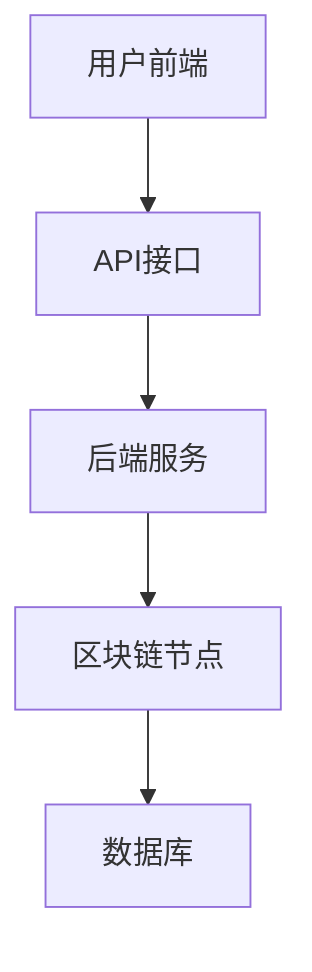

                 

# 新物物交换经济平台：以物易物的全球交易网络

关键词：物物交换，全球交易网络，平台设计，区块链，智能合约，数据隐私，系统架构

摘要：本文深入探讨了新物物交换经济平台的设计理念、技术实现和关键挑战。通过分析传统交易模式的局限性，我们提出了一种基于区块链技术的全球交易网络，以实现去中心化的、安全可靠的物物交换。本文将逐步介绍平台的核心概念、架构设计、算法原理和数学模型，并通过实际案例展示平台的运作机制和应用价值。

## 引言

物物交换，即直接用物品交换其他物品，而非使用货币，是人类历史上最早的交易形式。随着货币的出现和普及，物物交换逐渐退居次要地位，但其在特定场景下仍有广泛应用，如小型社区、手工艺品市场等。然而，传统的物物交换存在诸多局限性，如交易效率低下、信任问题、流通范围受限等。

随着区块链技术的发展，我们有机会重新思考物物交换的方式。区块链的分布式账本、智能合约和加密技术提供了实现去中心化、安全可靠的物物交换的基础。本文将探讨如何设计一个新物物交换经济平台，以实现全球范围内的以物易物交易网络。

### 核心概念

#### 物物交换

物物交换是指直接用物品交换其他物品，而非使用货币。其基本原理是供需匹配，即需要者提供自己拥有的物品，以换取所需的物品。

#### 全球交易网络

全球交易网络是指跨越国家和地区的交易网络，实现全球范围内的商品和服务交换。该网络需要解决跨境支付、信任建立、数据隐私等问题。

#### 区块链

区块链是一种分布式数据库技术，通过加密算法确保数据的安全性和不可篡改性。它由多个区块组成，每个区块包含一定数量的交易记录，并通过加密链接形成链式结构。

#### 智能合约

智能合约是运行在区块链上的程序，其执行逻辑由代码定义。智能合约在满足特定条件时自动执行，无需人工干预，提高了交易的安全性和效率。

#### 数据隐私

数据隐私是指在数据传输和存储过程中保护用户隐私不被泄露。对于物物交换平台，数据隐私尤为重要，因为它涉及到用户个人信息和交易记录。

### 解决方案

#### 平台设计

新物物交换经济平台的设计遵循去中心化、安全可靠、高效透明的原则。平台的核心组成部分包括：

1. **用户身份认证**：通过加密技术确保用户身份的匿名性和唯一性。
2. **物品信息登记**：用户可以登记自己的物品信息，包括物品名称、描述、数量等。
3. **交易流程**：基于智能合约的自动化交易流程，实现物品交换的信任和执行。
4. **数据分析**：对交易数据进行分析，为用户提供个性化推荐和交易策略。

#### 技术实现

新物物交换经济平台的技术实现涉及以下关键部分：

1. **区块链**：使用区块链技术确保交易数据的不可篡改性和分布式存储。
2. **智能合约**：使用智能合约实现交易流程的自动化和可信执行。
3. **加密技术**：使用加密技术保护用户身份和交易隐私。
4. **数据分析**：使用数据分析技术为用户提供个性化服务和交易优化。

### 关键挑战

#### 跨境支付

跨境支付是物物交换经济平台面临的一个关键挑战。不同国家和地区的货币政策和支付系统差异较大，需要设计一种灵活的跨境支付解决方案。

#### 信任建立

物物交换经济平台需要建立用户之间的信任，以确保交易的顺利进行。这可以通过智能合约和加密技术来实现，但仍需要进一步研究和优化。

#### 数据隐私

数据隐私是物物交换平台的一大挑战。如何在保证交易数据公开透明的同时，保护用户隐私不被泄露，需要深入探讨和解决。

### 平台应用价值

新物物交换经济平台具有以下应用价值：

1. **提高交易效率**：通过自动化交易流程和智能合约，大幅提高交易效率。
2. **降低交易成本**：去中心化的交易模式降低了交易成本，特别是跨境交易成本。
3. **增强数据透明度**：区块链技术确保交易数据的不可篡改性和透明性，提高了交易的信任度。
4. **促进全球贸易**：全球交易网络有助于促进全球贸易和跨国合作。

### 结论

新物物交换经济平台为传统物物交换提供了一种创新的解决方案，通过区块链和智能合约技术，实现了去中心化、安全可靠的全球交易网络。尽管面临诸多挑战，但该平台有望在未来发挥重要作用，推动全球贸易和经济的发展。

## 平台架构设计

### 物品信息登记

物品信息登记是物物交换经济平台的核心功能之一。用户可以在平台上登记自己的物品信息，包括物品名称、描述、数量、所有者等信息。物品信息登记的目的是确保物品的可追溯性和真实性，同时为后续的交易提供基础数据。

### 交易流程

交易流程是物物交换经济平台的另一重要功能。用户可以在平台上发布求购信息或出售信息，其他用户可以根据这些信息进行匹配和交易。交易流程基于智能合约实现，确保交易的安全性和自动执行。

### 数据分析

数据分析是物物交换经济平台的附加功能。通过对交易数据进行深入分析，平台可以为用户提供个性化推荐、交易策略优化等服务，提高交易效率和用户满意度。

### 平台架构

物物交换经济平台的架构采用分布式设计，包括前端、后端和区块链三个主要部分。前端负责用户界面展示，后端负责业务逻辑处理，区块链负责数据存储和交易验证。平台架构如下图所示：

## 算法原理

### 物品匹配算法

物品匹配算法是实现物物交换的核心算法之一。该算法的主要目的是在大量物品信息中快速找到符合条件的匹配物品。物品匹配算法采用基于关键词匹配和相似度计算的方法。

#### 关键词匹配

关键词匹配是物品匹配算法的基础。用户在发布求购信息或出售信息时，可以输入关键词，如物品名称、描述等。系统会根据这些关键词在数据库中查找符合条件的物品。

#### 相似度计算

相似度计算用于提高匹配的准确性。系统会根据物品的属性特征，如价格、数量、新旧程度等，计算物品之间的相似度。相似度越高的物品，越可能匹配成功。

### 交易验证算法

交易验证算法用于确保交易的合法性和安全性。该算法通过智能合约实现，主要包括以下步骤：

1. **身份验证**：验证交易双方的合法身份。
2. **物品验证**：验证交易的物品信息是否真实有效。
3. **资金验证**：验证交易双方的资金是否充足。
4. **合同签订**：签订智能合约，确保交易双方遵守合同条款。
5. **交易执行**：根据智能合约执行交易。

### 安全算法

安全算法用于保护用户隐私和数据安全。主要包括以下措施：

1. **加密技术**：对用户身份信息和交易数据使用加密技术进行加密存储和传输。
2. **权限管理**：对平台用户进行权限管理，确保用户只能访问自己的数据。
3. **访问控制**：设置访问控制策略，防止未授权访问平台数据和功能。
4. **安全审计**：定期进行安全审计，发现和修复安全漏洞。

## 数学模型

### 物品匹配概率模型

物品匹配概率模型用于预测物品匹配的成功概率。该模型基于物品属性特征和用户偏好，计算物品匹配的概率。模型主要包括以下部分：

1. **物品属性特征**：包括物品名称、描述、价格、数量等。
2. **用户偏好**：包括用户对物品的偏好，如颜色、品牌、新旧程度等。
3. **匹配概率**：根据物品属性特征和用户偏好，计算物品匹配的概率。

### 交易风险模型

交易风险模型用于评估交易的风险程度。该模型考虑以下因素：

1. **物品风险**：根据物品的属性特征，评估物品的风险程度。
2. **用户信用度**：根据用户的交易历史和信用评分，评估用户的信用度。
3. **交易风险**：综合考虑物品风险和用户信用度，计算交易的风险程度。

### 数据隐私保护模型

数据隐私保护模型用于保护用户隐私。该模型采用加密技术和匿名化技术，确保用户数据在传输和存储过程中的安全。模型主要包括以下部分：

1. **数据加密**：对用户数据进行加密存储和传输。
2. **匿名化处理**：对用户数据进行匿名化处理，去除个人身份信息。
3. **访问控制**：设置访问控制策略，确保用户数据只被授权用户访问。

## 项目实施

### 环境安装

在开始项目实施之前，需要安装以下软件和工具：

1. **Go语言环境**：用于开发后端服务。
2. **Node.js环境**：用于开发前端界面。
3. **区块链平台**：如Ethereum或Hyperledger Fabric，用于实现区块链功能。
4. **数据库**：如MongoDB或PostgreSQL，用于存储用户数据和交易记录。

### 系统实现

系统实现包括以下关键模块：

1. **用户模块**：负责用户注册、登录、身份验证等功能。
2. **物品模块**：负责物品信息登记、查询、更新等功能。
3. **交易模块**：负责交易流程管理、交易验证、合同签订等功能。
4. **数据分析模块**：负责数据分析、推荐、策略优化等功能。

### 代码分析

代码分析是项目实施的重要环节。通过代码分析，可以发现潜在的问题和漏洞，优化系统性能和可靠性。以下是对代码的几个关键分析点：

1. **安全性**：检查代码中是否存在安全漏洞，如SQL注入、XSS攻击等。
2. **性能**：检查代码中的性能瓶颈，如数据库查询效率、网络传输速度等。
3. **可维护性**：检查代码的结构和风格，确保易于理解和维护。

### 实际案例

以下是一个实际案例，展示了物物交换经济平台的运作机制：

1. **用户小明**在平台上登记一辆二手车，并设置了价格。
2. **用户小红**在平台上发布了求购二手车的需求，并设置了预算。
3. **系统**根据小明的物品信息和小红的需求信息，计算出匹配概率，并将结果推送给用户。
4. **用户小明和小红**进行沟通，确认交易细节，并在智能合约中签订合同。
5. **系统**根据智能合约执行交易，小明将车辆交给小红，小红支付合同金额。
6. **系统**记录交易数据，并进行数据分析，为用户提供个性化推荐和交易策略。

### 项目小结

通过实际案例，我们可以看到物物交换经济平台的运作机制和优势。平台采用区块链和智能合约技术，实现了去中心化、安全可靠的物物交换。在未来，随着技术的不断发展和应用的拓展，物物交换经济平台有望在更广泛的领域发挥重要作用。

## 最佳实践与注意事项

### 最佳实践

1. **用户身份验证**：确保用户身份的匿名性和唯一性，提高交易的安全性。
2. **物品信息登记**：要求用户详细登记物品信息，确保交易的可追溯性和真实性。
3. **智能合约设计**：合理设计智能合约，确保交易流程的自动化和可信执行。
4. **数据分析**：充分利用交易数据，为用户提供个性化推荐和交易策略。
5. **数据隐私保护**：采用加密技术和匿名化处理，保护用户隐私。

### 注意事项

1. **跨境支付**：考虑不同国家和地区的货币政策和支付系统差异，设计灵活的跨境支付解决方案。
2. **信任建立**：通过智能合约和加密技术建立用户之间的信任，但还需进一步优化和完善。
3. **数据隐私**：在保证交易数据公开透明的同时，注意保护用户隐私，防止数据泄露。
4. **系统稳定性**：定期进行系统维护和升级，确保平台的稳定运行。

## 拓展阅读

1. 《区块链技术指南》
2. 《智能合约设计与开发》
3. 《数据隐私保护技术》
4. 《分布式系统设计与实践》
5. 《物物交换经济平台案例分析》

### 作者

作者：AI天才研究院/AI Genius Institute & 禅与计算机程序设计艺术 /Zen And The Art of Computer Programming

