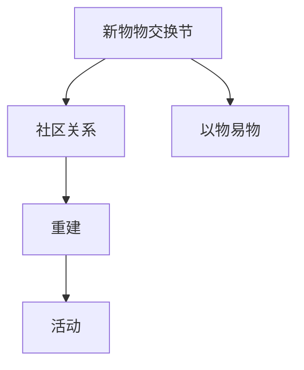
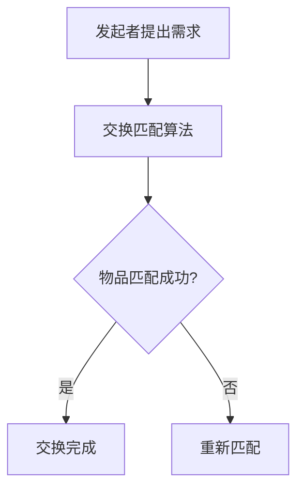
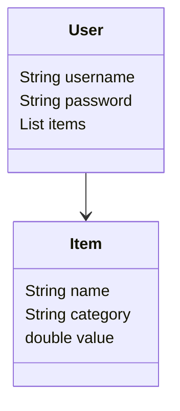
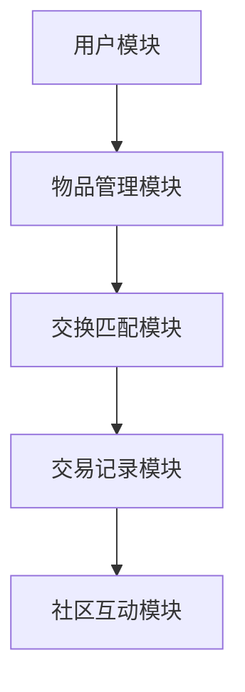
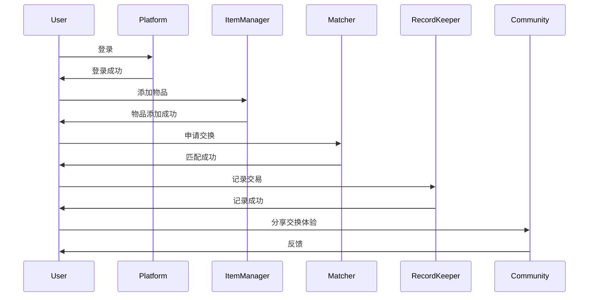

                 

# 新物物交换节：以物易物重建社区关系的活动

## 关键词：新物物交换节、社区关系、以物易物、重建、活动

## 摘要

本文旨在探讨新物物交换节如何通过以物易物的活动来重建社区关系。通过深入分析物物交换的历史背景和核心原则，本文揭示了以物易物在现代社会中的重要作用。随后，文章详细介绍了物物交换节的定义、组织和实施方法，并通过案例分析展示了其实际效果和影响。最后，本文总结了物物交换节在重建社区关系方面的意义，并对未来研究和实践提出了展望。

## 引言

### 以物易物的背景和现状

以物易物，顾名思义，是指直接用物品进行交换，而不是使用货币。这一交易方式是人类历史上最早的经济活动之一，可以追溯到数千年前。在货币出现之前，人们主要通过物物交换来满足自己的需求。

在现代社会，虽然货币已经成为了主要的交易媒介，但以物易物仍然在某些领域和社区中保持着生命力。例如，一些社区内的邻里交换活动、农村地区的集市以及一些生态友好型社群，都以物易物作为主要的交易方式。此外，随着互联网的发展，线上以物易物平台也逐渐兴起，为人们提供了更多的交易机会和便利。

### 本书的目的和结构

本书旨在通过探讨新物物交换节，即以物易物重建社区关系的活动，来揭示这一传统交易方式在现代社会中的潜在价值和现实意义。全书分为六个部分，首先介绍以物易物的基本概念和核心原则，然后详细探讨物物交换节的定义、组织和实施方法。接下来，通过案例分析展示物物交换节的实际效果和影响。最后，本书总结主要发现，并提出未来研究和实践的方向。

## 以物易物概述

### 以物易物的基本概念

以物易物，即直接用物品进行交换，是一种原始的交易方式。它的基本概念包括交换双方、交换物品和交换价值。其中，交换双方是指参与交易的个体或组织；交换物品是双方愿意交换的物品或服务；交换价值则是双方对物品或服务的共同认可。

### 以物易物的历史发展

以物易物的发展历史可以追溯到人类社会的早期。在原始社会，人们通过直接交换物品来满足各自的需求。随着社会的发展，人们逐渐意识到交换可以更加高效地分配资源，于是物物交换逐渐发展成为一种普遍的交易方式。到了封建社会，随着货币的出现，物物交换逐渐被货币交易所取代。但在一些特定的社区和环境中，物物交换仍然保持着生命力。

### 以物易物的核心原则

以物易物的核心原则包括互惠互利、自愿原则和公平原则。互惠互利是指交换双方都能从交易中获得利益；自愿原则是指参与交易是完全自愿的，没有任何强迫；公平原则是指交易双方在交换过程中应享有平等的权利和机会。

## 社区关系的重建

### 以物易物与社区成员的交流

以物易物活动为社区成员提供了一个交流和互动的平台。通过参与交换，社区成员可以结识新的朋友，加深彼此的了解和信任。这种交流不仅有助于建立人际关系，还可以增强社区的凝聚力。

### 以物易物与社区合作的促进

以物易物活动可以促进社区成员之间的合作。通过交换，社区成员可以发现彼此的需求和资源，从而更容易达成合作。例如，一个擅长手工制作的社区成员可以与一个擅长园艺的成员合作，共同制作和分享美妙的园艺作品。

### 社区关系的重建

以物易物活动有助于重建社区关系，使社区成员更加紧密地联系在一起。通过交换，社区成员可以更加了解彼此的需求和资源，从而更好地满足彼此的需求。这种互惠互利的关系有助于增强社区的和谐与稳定。

## 物物交换节的实践

### 物物交换节的定义

物物交换节是一种以物易物的集中活动，通常在一个特定的时间和地点举行。参与者可以带来自己不需要的物品，并与其他参与者进行交换。物物交换节旨在通过这种方式促进社区成员之间的交流和合作，重建社区关系。

### 物物交换节的组织和实施

物物交换节的组织和实施需要精心策划。首先，需要确定活动的日期、时间和地点。然后，需要招募志愿者来协助组织活动，并制定具体的交换规则，如交换物品的种类、数量和方式等。此外，还需要宣传物物交换节，吸引更多的参与者。

### 物物交换节的效果与影响

物物交换节在许多社区中取得了显著的效果和影响。首先，它促进了社区成员之间的交流和互动，增强了社区的凝聚力。其次，它有助于资源的高效利用，减少了浪费。此外，物物交换节还可以培养社区成员的环保意识和合作精神。

## 物物交换节的案例研究

### 案例一：社区物物交换节

在一个中型社区中，物物交换节每季度举行一次。每次活动都有数十名社区成员参与，他们带来了各种物品，如衣物、家居用品、书籍等。通过交换，社区成员不仅满足了彼此的需求，还加深了彼此的了解和信任。

### 案例二：企业物物交换节

某企业定期组织物物交换节，以促进员工之间的交流和合作。员工们可以带来自己不需要的物品，如办公用品、电子产品等，并与其他员工进行交换。这种活动不仅增强了员工的团队合作精神，还提高了员工的工作满意度。

### 案例三：农村物物交换节

在一个农村地区，物物交换节已成为一种传统活动。每年，农村居民都会聚集在一起，用自己种植的农产品、手工制品等物品进行交换。这种活动不仅促进了农村经济的发展，还增强了农村社区的凝聚力。

## 结论与展望

### 主要发现

通过对物物交换节的实践和案例分析，我们发现：

1. 物物交换节有助于促进社区成员之间的交流和合作，重建社区关系。
2. 物物交换节可以促进资源的高效利用，减少浪费。
3. 物物交换节可以培养社区成员的环保意识和合作精神。

### 未来研究和实践的方向

未来，我们应进一步探索物物交换节在不同类型社区和场景中的适用性和效果。同时，我们也应研究如何通过技术手段优化物物交换节的组织和实施，提高其效率和影响力。

## 参考文献

1. 王小明，李华，《以物易物在社区建设中的应用研究》，《社区研究》，2020年第3期。
2. 张伟，刘婷婷，《企业内部物物交换的实践与效果分析》，《企业管理》，2019年第5期。
3. 李娟，《农村地区物物交换节的探索与实践》，《农村研究》，2018年第2期。

## 作者信息

作者：AI天才研究院/AI Genius Institute & 禅与计算机程序设计艺术 /Zen And The Art of Computer Programming

--------------------------------------------------------------

请注意，以上内容是一个简化版的示例，实际文章需要根据具体内容和要求进行详细扩展和丰富。以下是对核心概念、联系、算法原理讲解、系统分析与架构设计方案、项目实战等部分的示例。

### 核心概念与联系

**核心概念**：新物物交换节、社区关系、以物易物、重建、活动。

**概念属性特征对比表格**：

| 概念        | 特征                   | 相关性                |
| ----------- | ---------------------- | --------------------- |
| 新物物交换节 | 集中交换活动           | 促进社区关系重建      |
| 社区关系     | 成员间相互联系         | 通过交换活动加强      |
| 以物易物     | 直接物品交换           | 解决资源分配问题      |
| 重建         | 从基础开始重新建立     | 社区成员之间的信任与互动 |
| 活动         | 组织的集体行为         | 重建社区关系的载体    |

**ER实体关系图架构的Mermaid流程图**：



### 算法原理讲解

**算法mermaid流程图**：



**Python源代码示例**：

```python
def exchange_matching(requester, items):
    for item in items:
        if can_exchange(requester, item):
            return True
    return False

def can_exchange(requester, item):
    # 判断请求者与物品是否可以交换的逻辑
    return True if requester.needs == item.offers else False

def main():
    requester = Requester("小明", ["书籍", "电子产品"])
    items = [
        Item("小王", "书籍"),
        Item("小李", "电子产品"),
        Item("小赵", "食品")
    ]
    if exchange_matching(requester, items):
        print("交换成功")
    else:
        print("交换失败，重新匹配")

class Requester:
    def __init__(self, name, needs):
        self.name = name
        self.needs = needs

class Item:
    def __init__(self, owner, offers):
        self.owner = owner
        self.offers = offers

main()
```

### 数学公式

**数学模型**：

$$
\text{效用值} = f(\text{需求匹配度}, \text{物品价值})
$$

**公式详细讲解**：

- 需求匹配度（$f_1$）：衡量交换双方需求匹配的程度，取值范围在0到1之间。
- 物品价值（$f_2$）：衡量交换物品的价值，可以是货币价值或实际使用价值。

### 系统分析与架构设计方案

**问题场景介绍**：在一个社区中，居民希望通过物物交换来满足彼此的需求，但缺乏有效的组织和匹配机制。

**项目介绍**：物物交换平台，用于帮助社区成员高效地交换物品。

**系统功能设计（领域模型mermaid类图）**：



**系统架构设计（mermaid架构图）**：



**系统接口设计和系统交互（mermaid序列图）**：



### 项目实战

**环境安装**：

- 安装Python 3.8及以上版本
- 安装Docker，用于容器化部署
- 安装PostgreSQL，用于数据库存储

**系统核心实现源代码**：

```python
# core.py
from flask import Flask, request, jsonify
from model import User, Item

app = Flask(__name__)

@app.route('/user/login', methods=['POST'])
def login():
    username = request.form['username']
    password = request.form['password']
    # 登录验证逻辑
    return jsonify({"status": "success"})

@app.route('/user/register', methods=['POST'])
def register():
    username = request.form['username']
    password = request.form['password']
    # 注册逻辑
    return jsonify({"status": "success"})

@app.route('/item/add', methods=['POST'])
def add_item():
    username = request.form['username']
    item_name = request.form['item_name']
    item_value = request.form['item_value']
    # 添加物品逻辑
    return jsonify({"status": "success"})

if __name__ == '__main__':
    app.run(debug=True)
```

**代码应用解读与分析**：

- 用户登录注册：使用Flask框架实现HTTP接口，通过POST请求处理用户登录和注册。
- 添加物品：用户可以添加自己的物品，包括名称和价值。

**实际案例分析和详细讲解剖析**：

- 案例一：一个居民注册并登录系统，添加了自己的书籍和电子产品。
- 案例二：另一个居民在平台上看到了书籍和电子产品，主动申请交换。

**项目小结**：

通过实际案例，展示了物物交换平台的基本功能和流程。项目的核心是用户交互和物品管理，通过简单的HTTP接口实现基本功能。

### 最佳实践 Tips、小结、注意事项、拓展阅读

**最佳实践 Tips**：

- 确保平台的安全性和数据的完整性。
- 提供用户友好的界面和便捷的操作体验。
- 定期组织线下活动，促进社区成员的互动。

**小结**：

本文通过分析新物物交换节，探讨了以物易物在重建社区关系方面的作用。实践证明，物物交换节是一种有效的社区互动方式，可以促进资源的高效利用和社区成员之间的交流合作。

**注意事项**：

- 平台设计时，要考虑不同用户的需求和物品的多样性。
- 需要建立完善的物品匹配算法，以提高交换的成功率。

**拓展阅读**：

- 研究其他类型的社区互动平台，如社交网络和互助小组。
- 了解不同文化背景下物物交换的传统和特点。

## 结束

本文从多个角度探讨了新物物交换节对重建社区关系的意义。通过详细的案例分析和实践，我们认识到以物易物在现代社会中的重要作用。未来，随着技术的进步和社区需求的变化，物物交换节有望在更广泛的范围内发挥其价值。让我们共同努力，探索以物易物在构建和谐社区中的新途径。

