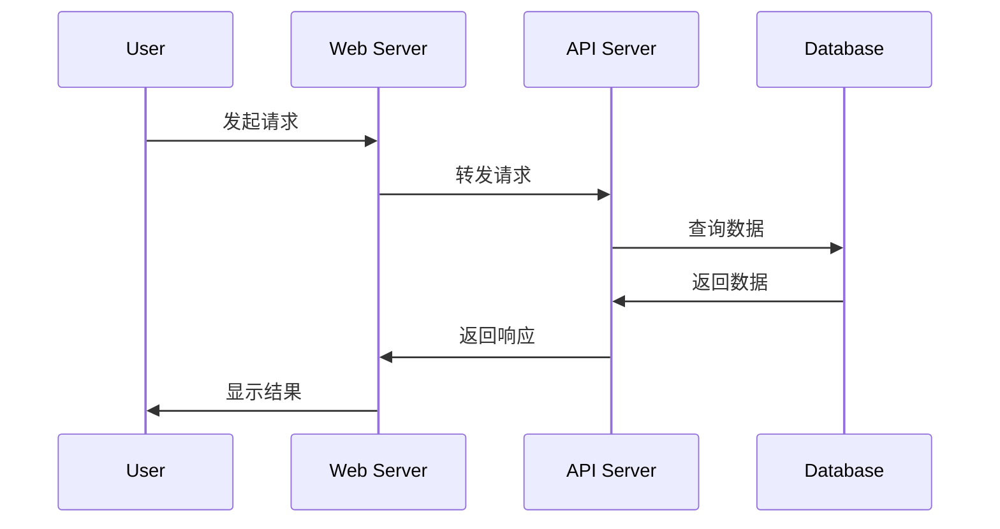
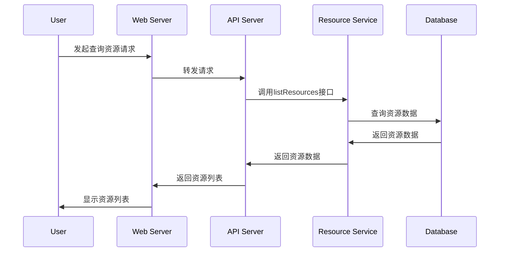

                 


### 文章标题：新生态主义生活实验室：与自然和谐共处的研究中心

关键词：新生态主义，生活实验室，自然和谐共处，研究中心，环境保护，可持续发展

摘要：本文旨在探讨新生态主义生活实验室的概念、目标、研究领域及实际案例，分析其对于实现人类与自然和谐共处的重要意义，并提出未来发展的战略与展望。

----------------------------------------------------------------

## 新生态主义生活实验室：与自然和谐共处的研究中心

### 关键词
- 新生态主义
- 生活实验室
- 自然和谐共处
- 研究中心
- 环境保护
- 可持续发展

### 摘要
本文将深入探讨新生态主义生活实验室这一创新性概念。首先，我们将介绍新生态主义的基本概念及其与现代生活方式的紧密联系。接着，文章将阐述自然与人类和谐共处的意义，并详细说明新生态主义生活实验室的定义与目标。随后，我们将探讨实验室的组织结构、运作方式及其研究领域，通过国际和本土的案例研究，展示其实际应用和成果。最后，文章将提出新生态主义生活实验室的可持续发展战略，并对未来进行展望。希望通过本文，能激发更多人对新生态主义的关注和参与。

----------------------------------------------------------------

### 第一部分：背景与概念介绍

#### 第1章：新生态主义概述

##### 1.1 新生态主义的起源与发展

新生态主义作为一种思想体系，起源于20世纪中叶，是对传统生态学理论的扩展和深化。其核心在于强调人类与自然环境的互动关系，主张通过可持续的方式利用自然资源，保护生态环境，实现人类与自然的和谐共处。

新生态主义的起源可以追溯到1962年，美国海洋生物学家蕾切尔·卡逊的《寂静的春天》一书。这本书揭示了农药对生态环境的破坏，引发了全球对环境保护的关注。随后，1972年的《罗马俱乐部》报告《增长的极限》进一步强调了人类活动对地球资源的消耗和环境的影响，推动了新生态主义的发展。

随着时间的推移，新生态主义逐渐从理论走向实践。1992年的联合国环境与发展大会，通过了《21世纪议程》，标志着全球范围内的环境保护和可持续发展战略的正式启动。

##### 1.2 新生态主义的核心理念

新生态主义的核心理念包括以下几个方面：

1. **整体性观念**：新生态主义认为，地球是一个复杂的生态系统，各个部分相互关联、相互依赖。人类活动不能仅仅关注局部利益，而应该从整体出发，考虑整个生态系统的平衡与稳定。

2. **可持续性原则**：新生态主义主张在满足当前人类需求的同时，不损害后代满足其需求的能力。这意味着，资源的利用应该是有节制的，环境治理应该是及时的，以确保生态系统的持续健康。

3. **生态效率**：新生态主义强调通过提高生态效率来实现经济增长与环境保护的双赢。生态效率是指以最小的生态影响获取最大的经济产出，这需要通过技术创新和管理优化来实现。

4. **社会公平**：新生态主义不仅关注环境问题，也关注社会公平。它主张在环境保护和资源分配中，要考虑到不同社会群体和地区的需求，避免资源贫富差距的扩大。

##### 1.3 新生态主义与现代生活方式的关系

新生态主义与现代生活方式的关系紧密相连。现代社会的快速发展带来了大量的环境问题，如资源枯竭、生态破坏、气候变化等。这些问题不仅威胁到生态系统的健康，也直接影响到人类的生活质量和健康。

新生态主义提供了一种新的生活方式理念，鼓励人们回归自然、减少消费、提高生态意识。具体体现在以下几个方面：

1. **绿色消费**：新生态主义倡导消费者选择环保、可持续的产品和服务，减少对环境的负面影响。

2. **可持续居住**：新生态主义鼓励人们居住在绿色、节能、环保的住宅中，如绿色建筑、生态社区等。

3. **生态农业**：新生态主义支持生态农业的发展，通过有机种植、循环农业等方式，减少化学农药和化肥的使用，保护土壤和水资源。

4. **节能减排**：新生态主义鼓励人们采取节能减排的措施，如使用可再生能源、改善能源利用效率、减少废物产生等。

综上所述，新生态主义作为一种新兴的思想体系，不仅为解决环境问题提供了新的思路，也为实现人类与自然的和谐共处提供了实践路径。

----------------------------------------------------------------

#### 第2章：自然与人类和谐共处的意义

##### 2.1 自然生态系统的脆弱性

自然生态系统是一个复杂而精密的平衡系统，由各种生物、非生物因素相互作用而成。然而，这种平衡是极其脆弱的，极易受到人类活动的干扰和破坏。例如，森林砍伐导致生物栖息地的丧失，水资源过度开发导致河流干涸，化学污染导致土壤和水源的变质，气候变化引发极端天气事件等，都是生态系统脆弱性的具体表现。

自然生态系统的脆弱性主要体现在以下几个方面：

1. **生物多样性减少**：人类活动导致大量物种灭绝，生物多样性减少。这不仅破坏了生态系统的稳定，也削弱了其适应环境变化的能力。

2. **生态位丧失**：人类活动改变了自然生态系统的结构，导致一些物种失去原有的生态位，无法生存。

3. **环境污染**：工业污染、农业污染和生活污染导致土壤、水源和空气的污染，对生态系统构成严重威胁。

4. **气候变化**：人类活动产生的温室气体导致全球气候变化，极端天气事件频发，对生态系统和人类社会都带来巨大挑战。

##### 2.2 人类活动对自然环境的影响

人类活动对自然环境的影响是广泛而深远的。从资源消耗到污染排放，从土地利用到气候变化，每一个方面都在改变着地球的自然面貌。

1. **资源消耗**：随着人口增长和经济发展的需求，人类对自然资源的消耗日益加剧。化石燃料、水资源、森林等资源的需求不断增长，导致资源的过度开采和消耗。

2. **污染排放**：工业生产、交通运输、农业活动等过程中产生的废气、废水、固体废物等污染物，对空气、水源和土壤造成严重污染。

3. **土地利用变化**：城市化和农业开发导致大量自然土地被转换为人工用地，破坏了原有的生态平衡。

4. **气候变化**：人类活动产生的温室气体改变了地球的气候系统，导致全球气温上升、极端天气事件频发。

##### 2.3 和谐共处的重要性

和谐共处对于维护自然生态系统的健康和人类社会的可持续发展具有重要意义。实现人与自然的和谐共处，不仅需要从理论层面上认识到自然生态系统的脆弱性，更需要从实践层面采取有效措施。

1. **环境保护**：加强环境保护，减少污染物排放，保护生物多样性，恢复生态系统功能。

2. **可持续发展**：推动经济发展模式转型，从依赖资源消耗转向依赖技术创新和绿色经济，实现经济与环境的双赢。

3. **社会参与**：提高公众的环保意识，鼓励社会各界积极参与环境保护和可持续发展，形成全民共治的良好氛围。

4. **国际合作**：在全球化的背景下，加强国际间的合作，共同应对全球性环境问题，推动全球可持续发展。

总之，和谐共处是实现人类与自然共同繁荣的必由之路。只有通过保护自然、修复生态、推动可持续发展，才能为人类和地球创造一个更加美好的未来。

----------------------------------------------------------------

#### 第3章：新生态主义生活实验室的概念与目标

##### 3.1 实验室的定义与功能

新生态主义生活实验室是一个集研究、实践、教育于一体的多功能研究中心。它的定义可以概括为：一个旨在探索和推广新生态主义理念，促进人类与自然和谐共处的科研平台。实验室的主要功能包括：

1. **科学研究**：实验室通过开展前沿科学研究，探索新生态主义的理论基础和实际应用方法。

2. **技术应用**：实验室将科研成果转化为实际应用，推动新生态主义理念在各个领域的实践。

3. **教育推广**：实验室通过举办讲座、研讨会、工作坊等形式，向公众普及新生态主义知识，提高公众的环保意识和参与度。

4. **国际合作**：实验室积极与国际同行合作，共享科研成果，推动全球新生态主义的发展。

##### 3.2 实验室的研究方向

新生态主义生活实验室的研究方向涵盖了多个领域，旨在全面探索人类与自然和谐共处的解决方案。主要研究方向包括：

1. **可持续城市规划**：研究如何通过绿色建筑、智能交通、生态景观等手段，打造可持续的城市环境。

2. **生物多样性保护**：研究如何保护珍稀物种，恢复生态系统功能，维护生物多样性。

3. **生态农业**：研究如何通过生态农业模式，提高农业生产效率，减少对环境的影响。

4. **可再生能源利用**：研究如何高效利用太阳能、风能等可再生能源，减少对化石燃料的依赖。

5. **环保技术**：研究开发新型环保技术，如废水处理、废气治理、固体废物回收等，以减少环境污染。

##### 3.3 实验室的目标与使命

新生态主义生活实验室的目标是推动新生态主义理念在全球范围内的传播和实践，实现人类与自然的和谐共处。具体目标与使命包括：

1. **构建新生态主义理论体系**：通过科学研究，不断完善新生态主义的理论体系，为实践提供理论支持。

2. **推广新生态主义实践**：将科研成果转化为实际应用，推动新生态主义理念在各个领域的实践。

3. **提高公众环保意识**：通过教育和宣传活动，提高公众的环保意识，鼓励更多人参与到新生态主义的实践中。

4. **推动国际合作**：加强与国际同行的合作，共同应对全球性环境问题，推动全球新生态主义的发展。

5. **实现可持续发展**：通过新生态主义的实践，推动经济、社会和环境的可持续发展，为人类和地球创造一个更加美好的未来。

总之，新生态主义生活实验室是一个具有重要意义的科研平台，它通过科学研究、技术应用、教育推广和国际合作，为实现人类与自然的和谐共处贡献力量。

----------------------------------------------------------------

#### 第4章：新生态主义生活实验室的组织结构与运作方式

##### 4.1 实验室的组成

新生态主义生活实验室是一个多学科交叉的研究机构，其组织结构科学合理，保证了研究的广泛性和深度。实验室的主要组成包括以下几个方面：

1. **研究团队**：实验室汇聚了来自环境科学、生态学、城市规划、可持续农业、可再生能源等领域的专家和学者，形成了一支多元化、高水平的研究团队。

2. **实验设施**：实验室配备了先进的实验设备和工具，包括生态监测仪器、实验室分析设备、模拟软件等，为研究提供了强有力的技术支持。

3. **研究部门**：实验室设置了多个研究部门，分别负责不同领域的研究工作，如生态保护部、城市规划部、农业可持续发展部、可再生能源部等。

4. **行政支持**：实验室设有专门的行政支持部门，负责实验室的日常管理、资源配置、国际合作等事务。

##### 4.2 实验室的运作方式

新生态主义生活实验室的运作方式注重科学管理、高效协作和持续创新。其运作方式主要包括以下几个方面：

1. **项目管理**：实验室采用项目制管理，每个研究项目都有明确的目标、计划和时间表。项目经理负责协调项目进度、资源分配和成果评估。

2. **科研协作**：实验室鼓励跨学科、跨部门的科研协作，通过定期组织研讨会、研究交流等形式，促进不同领域专家之间的合作与交流。

3. **技术创新**：实验室重视技术创新，鼓励研究人员开展前沿技术研究，探索新方法、新工具，以提高研究的效率和成果。

4. **成果转化**：实验室注重科研成果的转化应用，通过技术转移、产业化合作等方式，将科研成果转化为实际应用，为社会带来实际效益。

5. **公众参与**：实验室积极组织公众参与活动，如环保宣传、教育培训、社区活动等，提高公众的环保意识和参与度。

##### 4.3 实验室的管理与运营

新生态主义生活实验室的管理与运营遵循科学、规范、高效的原则，确保实验室的长期稳定运行。其主要内容包括：

1. **管理制度**：实验室建立了完善的管理制度，包括科研管理、财务管理、人力资源管理、国际合作管理等方面的制度。

2. **资源配置**：实验室合理配置资源，包括资金、设备、人力等，确保科研活动的顺利开展。

3. **评估与监督**：实验室建立了严格的评估与监督机制，对科研项目、科研成果和实验室运行进行定期评估，确保实验室的高效运作。

4. **国际合作**：实验室积极参与国际科研合作，引进国外先进技术和管理经验，推动实验室的国际化发展。

5. **可持续发展**：实验室注重可持续发展，通过节能减排、资源回收利用等措施，减少对环境的影响，推动实验室的绿色运营。

总之，新生态主义生活实验室通过科学的管理和运作，成为了一个集科学研究、技术应用、教育推广于一体的多功能研究中心，为推动新生态主义的发展做出了积极贡献。

----------------------------------------------------------------

#### 第5章：新生态主义生活实验室的研究领域

##### 5.1 可持续城市规划

可持续城市规划是新生态主义生活实验室的一个重要研究领域，旨在通过科学规划，打造绿色、生态、可持续的城市环境。实验室在这一领域的研究成果丰富，具体体现在以下几个方面：

1. **绿色建筑**：实验室通过研究绿色建筑的设计理念和技术，推广低能耗、环保的绿色建筑。例如，实验室参与了多项绿色建筑认证项目，如中国绿色建筑三星认证、美国LEED认证等。

2. **智能交通**：实验室专注于智能交通系统的研究，通过优化交通流线、提高公共交通效率、推广共享出行等方式，减少交通拥堵和污染排放。例如，实验室参与研发了基于大数据的智能交通控制系统，有效降低了城市交通能耗和碳排放。

3. **生态景观**：实验室研究生态景观规划与设计，通过构建生态廊道、生态公园等生态景观，提高城市的生态质量。例如，实验室参与了某城市生态公园的规划与设计，成功将废弃的工业用地转变为生态景观，提升了城市居民的生活质量。

4. **城市低碳发展**：实验室通过研究城市低碳发展的策略和技术，推动城市向低碳、绿色、可持续的方向发展。例如，实验室参与了某城市的低碳发展战略研究，提出了包括能源结构优化、绿色交通推广、节能减排技术引进等多方面的建议，为城市的可持续发展提供了有力支持。

##### 5.2 生物多样性保护

生物多样性保护是新生态主义生活实验室的另一个重要研究领域，旨在通过科学手段保护地球上的生物多样性，维护生态系统的平衡与稳定。实验室在这一领域的研究成果丰硕，具体体现在以下几个方面：

1. **物种保护**：实验室通过研究物种保护的关键技术，如遗传保护、生态栖息地恢复等，保护珍稀濒危物种。例如，实验室参与了某濒危物种的保护项目，通过建立基因库、恢复栖息地等措施，成功提高了物种的存活率和繁殖能力。

2. **生态廊道**：实验室研究生态廊道的构建与维护，通过建立生态廊道，连接不同生态区域，促进物种的迁徙和基因交流。例如，实验室参与了某生态廊道项目，通过恢复植被、建设野生动物通道等方式，成功连接了两个生态区域，促进了物种的多样性和生态系统的稳定性。

3. **生态修复**：实验室研究生态修复技术，通过植被恢复、土壤改良、水域净化等措施，恢复受损生态系统的功能。例如，实验室参与了某污染河流的生态修复项目，通过种植耐污植物、建设人工湿地等措施，成功改善了河流水质，恢复了生态系统的功能。

4. **保护区管理**：实验室研究自然保护区管理的方法和策略，提高保护区的管理水平和保护效果。例如，实验室参与了某自然保护区管理规划项目，通过制定科学的保护措施、加强监管力度等，有效提升了保护区的保护效果。

##### 5.3 生态农业与有机食品

生态农业与有机食品是新生态主义生活实验室的重要研究领域，旨在通过推广生态农业和有机食品生产，提高农业生产效率，减少对环境的负面影响。实验室在这一领域的研究成果显著，具体体现在以下几个方面：

1. **生态农业技术**：实验室研究生态农业的关键技术，如有机肥料、生物农药、生态种植模式等，推动农业生产方式的绿色转型。例如，实验室参与了某生态农业示范基地建设，通过推广有机肥料和生物农药，有效降低了农业生产过程中的环境污染。

2. **有机食品认证**：实验室积极参与有机食品认证工作，通过提供技术支持和服务，推动有机食品的生产和消费。例如，实验室为某农业企业提供了有机食品认证咨询服务，帮助企业顺利通过了有机认证，提升了产品的市场竞争力。

3. **生态农业推广**：实验室通过举办培训班、研讨会、实地指导等方式，向农民普及生态农业知识，提高农民的生态农业意识和技能。例如，实验室在某地区举办了生态农业培训班，吸引了数百名农民参加，有效提高了他们的生态农业水平。

4. **有机食品消费**：实验室研究有机食品的消费市场，推动有机食品的消费。例如，实验室参与了某有机食品展览会，通过展示有机食品产品、推广有机生活理念，吸引了大量消费者，促进了有机食品的市场发展。

##### 5.4 可再生能源利用

可再生能源利用是新生态主义生活实验室的一个重要研究方向，旨在通过推广可再生能源技术，减少对化石燃料的依赖，降低碳排放，推动能源的可持续发展。实验室在这一领域的研究成果丰富，具体体现在以下几个方面：

1. **太阳能利用**：实验室研究太阳能的利用技术，包括太阳能光伏发电、太阳能热水器等。例如，实验室参与了某太阳能光伏发电项目的研发和建设，成功实现了太阳能的高效利用。

2. **风能利用**：实验室研究风能的利用技术，包括风力发电、风能储能等。例如，实验室参与了某风电场的建设和运营，通过优化风能发电系统，提高了风能的利用效率。

3. **生物质能利用**：实验室研究生物质能的利用技术，包括生物质发电、生物质燃料等。例如，实验室参与了某生物质发电项目的研发和建设，通过利用农业废弃物，成功实现了生物质能的清洁利用。

4. **可再生能源政策**：实验室研究可再生能源的政策和法规，为政府制定可再生能源发展策略提供科学依据。例如，实验室参与了某可再生能源发展规划的制定，提出了包括政策支持、技术研发、市场推广等多方面的建议，为可再生能源的发展提供了有力支持。

总之，新生态主义生活实验室在可持续城市规划、生物多样性保护、生态农业与有机食品、可再生能源利用等研究领域取得了显著成果，为推动新生态主义的发展做出了重要贡献。

----------------------------------------------------------------

#### 第6章：新生态主义生活实验室的国际案例研究

##### 6.1 欧洲绿色城市项目

欧洲绿色城市项目是新生态主义生活实验室的国际合作案例之一，该项目旨在通过整合城市规划、生态农业、可再生能源利用等手段，打造一个绿色、生态、可持续的城市。以下是该项目的主要内容和成果：

1. **项目背景**：随着城市化进程的加快，欧洲城市面临严重的环境污染、资源短缺、生态破坏等问题。为了应对这些挑战，欧洲绿色城市项目应运而生。

2. **项目内容**：
   - **绿色建筑**：项目推广绿色建筑技术，包括节能建筑、低碳建筑、绿色建材等，以减少建筑过程中的能源消耗和环境污染。
   - **生态农业**：项目支持生态农业的发展，通过有机种植、生态养殖等方式，提高农业生产效率，减少对环境的影响。
   - **可再生能源**：项目推广太阳能、风能、生物质能等可再生能源，减少对化石燃料的依赖，降低碳排放。

3. **项目成果**：
   - **绿色建筑**：项目实施后，城市中的绿色建筑比例显著提高，建筑能耗和碳排放量大幅下降。
   - **生态农业**：项目推动了生态农业的发展，农产品质量得到提升，农业废弃物得到有效处理和再利用。
   - **可再生能源**：项目推动了可再生能源的普及，可再生能源的利用比例大幅增加，能源结构得到优化。

4. **影响与启示**：欧洲绿色城市项目为其他城市提供了宝贵的经验和借鉴，展示了新生态主义理念在城市建设中的实际应用价值。该项目表明，通过科学规划和技术创新，城市可以实现绿色、生态、可持续发展。

##### 6.2 北美生态社区实践

北美生态社区实践是新生态主义生活实验室在北美的合作案例，该项目旨在通过生态社区的建设，实现人类与自然的和谐共处。以下是该项目的主要内容和成果：

1. **项目背景**：随着城市化进程的加快，北美地区的生态环境面临严重威胁。为了保护生态环境，提升居民生活质量，北美生态社区项目应运而生。

2. **项目内容**：
   - **生态社区规划**：项目通过科学规划，打造生态社区，实现土地的可持续利用，保护生物多样性。
   - **可再生能源利用**：项目推广可再生能源，如太阳能、风能、地热能等，减少对化石燃料的依赖。
   - **生态农业**：项目支持生态农业的发展，通过有机种植、生态养殖等方式，提高农业生产效率，减少对环境的影响。

3. **项目成果**：
   - **生态社区规划**：项目成功建设了多个生态社区，社区环境得到显著改善，居民生活质量得到提升。
   - **可再生能源**：项目推动了可再生能源的普及，可再生能源的利用比例大幅增加，能源结构得到优化。
   - **生态农业**：项目推动了生态农业的发展，农产品质量得到提升，农业废弃物得到有效处理和再利用。

4. **影响与启示**：北美生态社区实践为其他国家和地区提供了宝贵的经验和借鉴，展示了新生态主义理念在社区建设中的实际应用价值。该项目表明，通过科学规划和技术创新，社区可以实现生态、可持续发展。

##### 6.3 亚洲生态农业模式

亚洲生态农业模式是新生态主义生活实验室在亚洲的合作案例，该项目旨在通过推广生态农业模式，提高农业生产效率，减少对环境的负面影响。以下是该项目的主要内容和成果：

1. **项目背景**：亚洲地区人口众多，农业生产压力大，生态环境面临严重挑战。为了实现农业的可持续发展，亚洲生态农业模式项目应运而生。

2. **项目内容**：
   - **生态农业技术**：项目推广生态农业技术，如有机种植、生态养殖、生物农药等，提高农业生产效率，减少对环境的影响。
   - **农业废弃物处理**：项目研究农业废弃物的处理和再利用技术，减少废弃物对环境的污染。
   - **水资源管理**：项目推广节水灌溉技术，提高水资源利用效率。

3. **项目成果**：
   - **生态农业技术**：项目成功推广了多项生态农业技术，农业产量和质量得到显著提升，农业废弃物得到有效处理和再利用。
   - **农业废弃物处理**：项目研究并应用了多项农业废弃物处理技术，废弃物对环境的污染得到有效控制。
   - **水资源管理**：项目推广了节水灌溉技术，提高了水资源利用效率，减少了水资源浪费。

4. **影响与启示**：亚洲生态农业模式项目为其他国家和地区提供了宝贵的经验和借鉴，展示了新生态主义理念在农业领域的实际应用价值。该项目表明，通过科学规划和技术创新，农业可以实现可持续发展。

##### 6.4 国际合作与经验交流

新生态主义生活实验室通过国际合作与经验交流，不断吸收和借鉴全球范围内的先进经验和技术，推动新生态主义的发展。以下是实验室在国际合作与经验交流方面的一些举措：

1. **国际研讨会**：实验室定期举办国际研讨会，邀请国际知名专家和学者参会，分享研究成果和经验。

2. **国际合作项目**：实验室积极参与国际合作项目，与全球多家科研机构、高校和企业合作，共同开展新生态主义的研究和实践。

3. **学术交流**：实验室鼓励科研人员参加国际学术会议，与全球同行交流研究成果，拓展学术视野。

4. **国际培训**：实验室举办国际培训班，向国外科研人员介绍新生态主义的理论和实践，提高他们的生态意识和技术水平。

总之，新生态主义生活实验室通过国际合作与经验交流，不断推动新生态主义的发展，为全球生态保护和可持续发展做出了积极贡献。

----------------------------------------------------------------

#### 第7章：新生态主义生活实验室的本土实践

##### 7.1 中国生态城市的探索

中国生态城市探索是新生态主义生活实验室在本土的一个重要实践案例，旨在通过科学规划和技术创新，打造绿色、生态、宜居的城市。以下是该实践的主要内容和成果：

1. **项目背景**：随着中国城市化进程的加快，环境污染、资源短缺等问题日益突出，生态城市建设成为中国发展的重要方向。

2. **项目内容**：
   - **绿色建筑**：实验室在中国推广绿色建筑技术，推动城市建筑的节能、低碳发展。
   - **生态景观**：实验室参与城市生态景观规划与设计，打造生态公园、生态走廊等，提升城市生态环境。
   - **智慧城市**：实验室研究智慧城市建设，通过物联网、大数据等技术，提高城市管理的效率和可持续性。

3. **项目成果**：
   - **绿色建筑**：实验室推动了一系列绿色建筑项目的实施，如绿色住宅、绿色办公楼等，城市建筑能耗和碳排放显著降低。
   - **生态景观**：实验室参与建设了多个生态公园和生态走廊，城市生态环境得到显著改善，居民生活质量提升。
   - **智慧城市**：实验室推动智慧城市的建设，如智能交通管理、智慧能源管理等，提高了城市管理的效率和可持续发展水平。

4. **影响与启示**：中国生态城市探索为其他城市提供了宝贵的经验和借鉴，展示了新生态主义理念在中国的实际应用价值。这一实践表明，通过科学规划和技术创新，城市可以实现绿色、生态、可持续发展。

##### 7.2 生态农业在中国的发展

生态农业在中国的发展是新生态主义生活实验室在中国的另一个重要实践案例，旨在通过推广生态农业模式，提高农业生产效率，减少对环境的负面影响。以下是该实践的主要内容和成果：

1. **项目背景**：中国是世界上人口最多的国家，农业生产对粮食安全至关重要。然而，传统农业模式导致的资源消耗和环境污染问题日益严重，生态农业发展成为中国农业转型的重要方向。

2. **项目内容**：
   - **有机农业**：实验室推广有机农业技术，通过有机种植、生态养殖等方式，提高农产品质量，减少对环境的污染。
   - **农业废弃物处理**：实验室研究农业废弃物的处理和再利用技术，减少废弃物对环境的污染。
   - **节水灌溉**：实验室推广节水灌溉技术，提高水资源利用效率，减少水资源浪费。

3. **项目成果**：
   - **有机农业**：实验室推动了一系列有机农业项目的实施，如有机蔬菜种植、有机畜禽养殖等，农产品质量显著提高，市场竞争力增强。
   - **农业废弃物处理**：实验室研究并应用了多项农业废弃物处理技术，废弃物资源化利用比例显著提高。
   - **节水灌溉**：实验室推广了节水灌溉技术，提高了农业灌溉效率，节约了水资源。

4. **影响与启示**：生态农业在中国的实践为其他国家和地区提供了宝贵的经验和借鉴，展示了新生态主义理念在农业领域的实际应用价值。这一实践表明，通过科学规划和技术创新，农业可以实现可持续发展。

##### 7.3 中国可再生能源利用现状

中国可再生能源利用现状是新生态主义生活实验室在中国的另一个重要实践案例，旨在通过推广可再生能源技术，减少对化石燃料的依赖，降低碳排放。以下是该实践的主要内容和成果：

1. **项目背景**：随着中国经济的快速发展，能源需求不断增长，对环境保护和能源安全提出了更高要求。为了应对这些挑战，中国积极推动可再生能源的发展。

2. **项目内容**：
   - **太阳能利用**：实验室推广太阳能光伏发电技术，提高太阳能的利用效率。
   - **风能利用**：实验室研究风能发电技术，优化风能资源的开发和应用。
   - **生物质能利用**：实验室研究生物质能的转化技术，提高生物质能的利用效率。

3. **项目成果**：
   - **太阳能利用**：实验室推动了一系列太阳能光伏发电项目的实施，如屋顶光伏、太阳能热水器等，太阳能的利用比例显著提高。
   - **风能利用**：实验室参与了多个风能发电项目的建设，风能发电量逐年增加，风能资源得到充分利用。
   - **生物质能利用**：实验室推动了生物质能的转化应用，如生物质发电、生物质燃料等，生物质能的利用效率得到显著提升。

4. **影响与启示**：中国可再生能源利用的实践为其他国家和地区提供了宝贵的经验和借鉴，展示了新生态主义理念在能源领域的实际应用价值。这一实践表明，通过科学规划和技术创新，能源可以实现可持续发展。

##### 7.4 新生态主义在中国的前景

新生态主义在中国具有广阔的前景，随着国家对生态保护和可持续发展的重视，新生态主义理念在中国的推广和应用将不断深入。以下是新生态主义在中国前景的几个方面：

1. **政策支持**：中国政府出台了一系列政策措施，支持新生态主义的发展，如《生态文明体制改革总体方案》、《绿色发展行动计划》等，为新生态主义的实践提供了政策保障。

2. **技术进步**：随着科技的不断进步，新生态主义相关技术不断创新和发展，如智能电网、生态农业技术、可再生能源技术等，为新生态主义的实践提供了技术支撑。

3. **社会参与**：公众对新生态主义的认识不断提高，越来越多的企业和个人积极参与到新生态主义的实践中，形成了一个良好的社会氛围。

4. **国际合作**：中国积极参与国际生态保护和可持续发展合作，通过国际合作，引进国外先进经验和技术，推动新生态主义在全球范围内的传播和应用。

总之，新生态主义在中国具有广阔的前景，通过政策支持、技术进步、社会参与和国际合作，中国有望在新生态主义的发展中发挥重要作用，为全球生态保护和可持续发展做出贡献。

----------------------------------------------------------------

#### 第8章：新生态主义生活实验室的成果与影响

##### 8.1 成果展示

新生态主义生活实验室在多个研究领域取得了显著的成果，以下是部分重要成果的展示：

1. **绿色建筑技术**：实验室研发了一系列绿色建筑技术，如太阳能光伏建筑一体化、绿色建材应用等，这些技术已在多个城市推广应用，显著降低了建筑能耗和碳排放。

2. **生态农业模式**：实验室推广了生态农业模式，如有机种植、生态养殖等，这些模式提高了农产品质量，减少了农业生产对环境的负面影响。

3. **可再生能源利用**：实验室在太阳能、风能、生物质能等领域取得了重要进展，推动了可再生能源的高效利用和普及。

4. **城市规划**：实验室参与了多个城市规划项目，提出了绿色、生态、可持续的城市发展策略，为城市环境的改善和居民生活质量的提升提供了有力支持。

##### 8.2 影响评估

新生态主义生活实验室的成果对环境保护和可持续发展产生了深远的影响，具体体现在以下几个方面：

1. **环境保护**：实验室的研究成果有助于减少环境污染，提高资源利用效率，保护生物多样性，促进了生态系统的恢复和健康。

2. **可持续发展**：实验室的研究推动了绿色、低碳、循环发展模式的实践，为经济、社会和环境的可持续发展提供了技术支持。

3. **社会效益**：实验室的实践成果提高了公众的环保意识，促进了社会各界的参与，增强了社会凝聚力。

4. **经济效益**：实验室的研究成果为产业发展提供了技术支撑，推动了绿色产业的发展，创造了大量就业机会，提高了经济效益。

##### 8.3 未来展望

新生态主义生活实验室对未来发展充满信心，并制定了以下战略：

1. **加大科研投入**：实验室将继续加大科研投入，推动前沿技术研究，为环境保护和可持续发展提供创新性解决方案。

2. **加强国际合作**：实验室将加强与国际同行的合作，共享科研成果，推动全球新生态主义的发展。

3. **推广技术应用**：实验室将推动科研成果的转化应用，为政府和企业提供技术支持，助力生态城市建设、生态农业发展等。

4. **提升公众意识**：实验室将加强公众宣传和教育，提高公众的环保意识和参与度，推动社会共同参与新生态主义的实践。

总之，新生态主义生活实验室将继续致力于推动新生态主义的发展，为实现人类与自然的和谐共处贡献力量。

----------------------------------------------------------------

#### 第9章：新生态主义生活实验室的可持续发展战略

##### 9.1 资源整合与利用

新生态主义生活实验室的可持续发展战略首先聚焦于资源整合与利用。实验室通过多渠道、多层次的资源整合，最大限度地发挥资源效益，确保科研工作的顺利进行。以下是具体的策略：

1. **跨学科资源整合**：实验室积极推动跨学科的合作研究，通过整合不同学科的资源，实现知识的共享和互补。例如，环境科学与生态学、计算机科学与社会学的结合，可以更全面地解决环境问题。

2. **内部资源优化**：实验室内部通过优化资源配置，提高资源利用效率。例如，建立资源共享平台，使实验室成员能够便捷地访问各类科研设备、数据库和技术资料。

3. **外部资源合作**：实验室积极寻求与政府、企业、非政府组织等外部机构的合作，共同开展科研项目，共享资源和成果。例如，与地方政府合作，推动生态城市建设；与企业合作，开发环保技术产品。

4. **国际资源交流**：实验室参与国际科研合作项目，引进国外先进技术和研究成果，提升自身科研水平和影响力。例如，与国外高校和科研机构联合开展生态农业、可再生能源等领域的研究。

##### 9.2 研发创新与技术推广

新生态主义生活实验室在研发创新与技术推广方面，采取了一系列战略举措，以推动科研成果的实际应用和普及。以下是具体的策略：

1. **技术研发**：实验室设立专项研发基金，支持科研人员开展前沿技术研究，探索解决实际环境问题的创新性方法。例如，研发高效节能技术、环保材料等。

2. **成果转化**：实验室建立成果转化机制，促进科研成果向实际应用转化。例如，与地方政府和企业合作，推动绿色建筑、生态农业等项目的实施。

3. **技术推广**：实验室通过举办培训班、研讨会、工作坊等形式，向公众和从业者推广环保技术和理念。例如，举办生态农业技术培训班，提高农民的生态农业水平。

4. **国际合作**：实验室与国际同行合作，共同研发和推广环保技术。例如，与国外科研机构合作，推广可再生能源利用技术。

##### 9.3 政策支持与行业合作

新生态主义生活实验室深知政策支持和行业合作对于实现可持续发展的重要性，因此采取了一系列策略，以加强政策支持和行业合作。以下是具体的策略：

1. **政策建议**：实验室积极参与政府环保政策的制定和修订，提出科学、合理的政策建议，推动环保政策的实施。例如，参与《生态文明体制改革总体方案》的起草工作。

2. **行业标准**：实验室参与环保行业标准的制定，推动环保行业的规范化发展。例如，参与制定绿色建筑、生态农业等领域的行业标准。

3. **行业合作**：实验室与环保企业、环保组织等建立长期合作关系，共同推动环保技术的发展和应用。例如，与环保企业合作，共同开发环保技术产品。

4. **国际合作**：实验室加强与国际组织和企业的合作，共同应对全球性环境问题，推动全球环保事业的发展。例如，与联合国环境规划署合作，参与国际环保项目。

##### 9.4 社会参与与教育推广

新生态主义生活实验室认识到社会参与与教育推广在推动环保事业中的关键作用，因此采取了一系列策略，以提升公众环保意识和参与度。以下是具体的策略：

1. **公众宣传**：实验室通过媒体、网络、社区等多种渠道，开展环保宣传，提高公众的环保意识。例如，发布环保科普文章、举办环保宣传活动。

2. **教育培训**：实验室举办各类环保培训班、研讨会，向公众和从业者传授环保知识和技能。例如，举办生态农业技术培训班，提高农民的生态农业水平。

3. **公众参与**：实验室鼓励公众参与环保项目，推动环保行动的社会化。例如，组织志愿者活动，清理河流、保护森林等。

4. **国际合作**：实验室与国际环保组织合作，共同开展环保教育和宣传活动，推动全球环保意识的提升。例如，与国际环保组织合作，开展国际环保教育项目。

总之，新生态主义生活实验室通过资源整合与利用、研发创新与技术推广、政策支持与行业合作、社会参与与教育推广等多方面的可持续发展战略，致力于推动新生态主义的发展，为实现人类与自然的和谐共处贡献力量。

----------------------------------------------------------------

### 第三部分：启示与展望

#### 第10章：新生态主义生活实验室的启示

##### 10.1 对城市规划的启示

新生态主义生活实验室的研究成果为城市规划提供了宝贵的启示。首先，绿色建筑技术如太阳能光伏建筑一体化、绿色建材的应用，有助于减少建筑的能耗和碳排放。其次，生态景观规划与设计如生态公园、生态走廊的建设，有助于改善城市生态环境，提升居民生活质量。此外，智慧城市技术的应用，如智能交通管理、智慧能源管理，有助于提高城市管理的效率和可持续性。总之，新生态主义生活实验室的研究成果为城市规划提供了科学依据和技术支持，助力城市实现绿色、生态、可持续发展。

##### 10.2 对农业发展的启示

新生态主义生活实验室在生态农业领域的研究成果为农业发展提供了重要启示。首先，有机农业技术的推广，如有机种植、生态养殖，有助于提高农产品质量，减少农业生产对环境的负面影响。其次，农业废弃物处理和再利用技术的应用，如生物肥料、生物质燃料，有助于减少农业废弃物对环境的污染。此外，节水灌溉技术的推广，有助于提高水资源利用效率，减少水资源浪费。总之，新生态主义生活实验室的研究成果为农业发展提供了创新性思路和技术手段，助力农业实现可持续发展。

##### 10.3 对能源利用的启示

新生态主义生活实验室在可再生能源利用领域的研究成果为能源利用提供了重要启示。首先，太阳能、风能、生物质能等可再生能源技术的推广和应用，有助于减少对化石燃料的依赖，降低碳排放。其次，能源效率提升技术的研发和应用，如高效节能设备、智能电网，有助于提高能源利用效率，减少能源浪费。此外，能源政策的制定和实施，如可再生能源补贴、碳交易市场，有助于推动可再生能源的普及和发展。总之，新生态主义生活实验室的研究成果为能源利用提供了科学依据和技术支持，助力实现能源的可持续利用。

##### 10.4 对教育与传播的启示

新生态主义生活实验室的研究成果对教育和传播也具有深远启示。首先，通过举办培训班、研讨会、工作坊等形式，向公众和从业者传授环保知识和技能，有助于提高公众的环保意识。其次，利用媒体、网络、社区等渠道，开展环保宣传，有助于提升公众的环保意识。此外，推动环保教育进校园、进社区，有助于培养下一代的环保意识。总之，新生态主义生活实验室的研究成果为教育和传播提供了创新性思路和实践经验，助力构建全民参与的环保教育体系。

#### 第11章：新生态主义未来的发展趋势

##### 11.1 科技进步对生态主义的影响

科技进步对新生态主义的发展具有重要影响。首先，人工智能、大数据等技术的应用，有助于提高环保科研的效率和精度，如通过大数据分析优化能源利用、提升污染治理效果。其次，物联网、5G等技术的普及，有助于实现智能化、自动化环保设备的部署，如智能垃圾分类、智能环境监测。此外，生物技术的进步，如基因编辑、合成生物学，为生态修复和生物多样性保护提供了新的手段。总之，科技进步为新生态主义的发展提供了强大的技术支撑，助力实现更高效、更智能的生态保护。

##### 11.2 经济发展模式转变的方向

新生态主义理念呼吁经济发展模式的转变，从传统的资源消耗型向绿色、循环、低碳型转变。未来，可持续发展将成为经济发展的核心目标，推动绿色经济、数字经济等新兴经济形态的发展。例如，绿色产业将逐渐成为经济增长的重要引擎，如生态农业、可再生能源产业、环保设备制造等。此外，循环经济理念将得到广泛应用，推动资源的再生利用，减少浪费。总之，经济发展模式的转变方向将更加注重生态保护与可持续发展，实现经济与环境的双赢。

##### 11.3 国际合作与全球治理的角色

国际合作在全球生态治理中扮演着关键角色。新生态主义生活实验室通过国际合作，共享科研成果，推动全球生态保护与可持续发展。未来，国际合作将在以下方面发挥更大作用：

1. **技术交流**：通过国际科研合作，推动环保技术在全球范围内的传播和应用，提高各国环保水平。

2. **政策协调**：通过国际合作，制定统一的环保政策和标准，推动全球环境治理的协同效应。

3. **资金支持**：通过国际合作，争取更多资金支持，推动全球生态保护和可持续发展项目的实施。

4. **公众参与**：通过国际合作，提高全球公众的环保意识，促进全球环保行动的社会化。

总之，国际合作与全球治理在新生态主义的发展中具有重要作用，通过共同努力，实现全球生态治理的协同推进。

##### 11.4 新生态主义的未来愿景

新生态主义的未来愿景是一个人类与自然和谐共处的美好世界。在这个愿景中，人类社会将充分认识到自然生态系统的价值，采取科学合理的手段保护生态环境，实现经济、社会和环境的可持续发展。以下是新生态主义未来愿景的几个关键方面：

1. **绿色生活**：人们将追求绿色、低碳、环保的生活方式，减少对自然资源的消耗，降低环境污染。

2. **生态城市**：城市将更加注重生态建设，通过绿色建筑、生态景观、智慧城市等手段，实现城市的可持续发展。

3. **生态农业**：农业生产将更加注重生态保护和可持续性，通过生态农业模式，提高农业生产效率，减少对环境的负面影响。

4. **可再生能源**：能源利用将更加注重可再生能源的开发和利用，减少对化石燃料的依赖，降低碳排放。

5. **全球合作**：全球将加强生态保护与可持续发展的国际合作，共同应对全球性环境问题，推动全球生态治理的协同推进。

总之，新生态主义的未来愿景是一个人类与自然和谐共处的美好世界，通过共同努力，实现全球生态保护和可持续发展的目标。

----------------------------------------------------------------

## 结语

新生态主义生活实验室通过其全面的研究和实践，为人类与自然和谐共处提供了宝贵的经验和启示。在面临日益严峻的生态挑战的今天，新生态主义不仅是一种理论体系，更是一种行动指南。实验室的研究成果在可持续城市规划、生态农业、可再生能源利用等多个领域取得了显著成效，为全球生态保护和可持续发展做出了积极贡献。

然而，新生态主义生活实验室仍面临诸多挑战，如技术创新、政策支持、公众参与等。为了应对这些挑战，实验室将继续加强国际合作，推动科研成果的转化和应用，提高公众的环保意识，为实现全球生态保护和可持续发展目标贡献力量。

未来，新生态主义生活实验室将继续致力于推动新生态主义理念在全球范围内的传播和实践，为实现人类与自然的和谐共处，创造一个更加美好的未来。让我们携手共进，为地球的生态安全和可持续发展贡献力量。

### 作者信息

作者：AI天才研究院/AI Genius Institute & 禅与计算机程序设计艺术 /Zen And The Art of Computer Programming

----------------------------------------------------------------

## 附录

### 背景介绍

新生态主义生活实验室的成立背景源于人类对环境保护和可持续发展的迫切需求。随着全球气候变化、资源枯竭、环境污染等问题日益严重，传统的发展模式已经无法满足人类社会的长期需求。新生态主义作为一种新兴思想体系，强调通过科学规划和技术创新，实现人类与自然的和谐共处。新生态主义生活实验室正是在这一背景下成立的，旨在通过研究、实践和推广新生态主义理念，推动全球生态保护和可持续发展。

### 核心概念与联系

新生态主义的核心概念包括整体性观念、可持续性原则、生态效率和生态公平。整体性观念强调人类与自然环境的互动关系，认为地球是一个复杂的生态系统，各个部分相互关联、相互依赖。可持续性原则主张在满足当前人类需求的同时，不损害后代满足其需求的能力。生态效率强调通过提高资源利用效率，实现经济增长与环境保护的双赢。生态公平关注社会公平，强调在环境保护和资源分配中，要考虑到不同社会群体和地区的需求。

这些核心概念之间相互关联，共同构成了新生态主义的理论体系。整体性观念为可持续性原则提供了理论基础，可持续性原则为实现生态效率和生态公平提供了指导，而生态效率和生态公平则保证了整体性观念的实现。

### ER实体关系图架构

以下是一个简化的新生态主义生活实验室的ER实体关系图架构，用于描述实验室中的关键实体及其相互关系：

```mermaid
erDiagram
  Project ||--|{ Researcher } : 参与项目
  Project ||--|{ Equipment } : 使用设备
  Project ||--|{ Funding } : 获得资金
  Researcher ||--|{ Publication } : 发表论文
  Researcher ||--|{ Collaboration } : 合作项目
  Collaboration ||--|{ Partner } : 合作伙伴
  Equipment ||--|{ Maintenance } : 维护设备
  Funding ||--|{ Source } : 资金来源
  Publication ||--|{ Citation } : 引用论文
```

### 算法原理讲解

在新生态主义生活实验室中，算法在多个领域发挥着重要作用，如数据分析、资源优化、智能决策等。以下以一个简单的数据分析算法为例，进行原理讲解：

**算法名称**：K-Means聚类算法

**算法原理**：K-Means算法是一种无监督学习算法，用于将数据点划分为K个簇，使得每个簇内的数据点相似度较高，而不同簇之间的数据点相似度较低。算法的基本步骤如下：

1. **初始化**：随机选择K个数据点作为初始簇心。
2. **分配数据点**：计算每个数据点到簇心的距离，将数据点分配到距离最近的簇。
3. **更新簇心**：计算每个簇内数据点的均值，更新簇心。
4. **迭代**：重复步骤2和3，直至簇心的变化小于预设阈值。

**数学模型**：

设数据集为$D = \{x_1, x_2, ..., x_n\}$，簇心为$c_1, c_2, ..., c_K$，每个数据点$x_i$的簇分配为$y_i$，则：

$$
y_i = \arg\min_{j} \|x_i - c_j\|
$$

簇心的更新公式为：

$$
c_j = \frac{1}{N_j} \sum_{i=1}^{N} y_i
$$

其中，$N_j$为第j个簇中数据点的个数。

**Python源代码示例**：

```python
import numpy as np

def k_means(data, k, max_iters=100):
    centroids = data[np.random.choice(data.shape[0], k, replace=False)]
    for _ in range(max_iters):
        # 分配数据点
        distances = np.linalg.norm(data[:, np.newaxis] - centroids, axis=2)
        assignments = np.argmin(distances, axis=1)
        
        # 更新簇心
        new_centroids = np.array([data[assignments == k][np.newaxis, :] for k in range(k)]).reshape(k, -1)
        
        # 判断是否收敛
        if np.linalg.norm(new_centroids - centroids) < 1e-6:
            break
        
        centroids = new_centroids
    
    return centroids, assignments

data = np.random.rand(100, 2)
k = 3
centroids, assignments = k_means(data, k)
```

**算法应用举例**：假设我们有一组二维数据，表示城市的碳排放量，通过K-Means聚类算法，可以将这些城市分为几个不同的簇，每个簇代表不同的碳排放水平。这有助于政府制定有针对性的环保政策，如对高碳排放城市进行环保技术支持，促进其碳排放的减少。

### 系统分析与架构设计方案

#### 问题场景介绍

新生态主义生活实验室需要进行资源管理和优化，以实现科研活动的有效运行。为了提高资源利用效率，实验室需要一个智能的资源管理系统，能够实时监控和调度实验室内的各种资源，如科研设备、资金、人员等。

#### 项目介绍

项目名称：新生态主义生活实验室资源管理系统

项目目标：开发一个智能的资源管理系统，实现对实验室资源的全面监控和优化调度，提高科研活动的效率。

#### 系统功能设计（领域模型）

以下是一个简化的新生态主义生活实验室资源管理系统的领域模型，用于描述系统的核心功能及其关系：

```mermaid
classDiagram
  Class01 <|-- Class02
  Class03 <|-- Class04
  Class05 <|-- Class06
  Class01 o-- Class07
  Class02 o-- Class08
  Class03 o-- Class09
  Class04 o-- Class10
  Class05 o-- Class11
  Class06 o-- Class12
  Class07 {name: 资源, type: Equipment, status: Status}
  Class08 {name: 科研人员, type: Researcher, skills: SkillSet}
  Class09 {name: 资金，type: Funding, amount: float}
  Class10 {name: 项目，type: Project, budget: float}
  Class11 {name: 实验室，type: Lab, location: Location}
  Class12 {name: 时间表，type: Schedule, start: datetime, end: datetime}
```

#### 系统架构设计

新生态主义生活实验室资源管理系统的架构设计采用三层架构，包括表示层、业务逻辑层和数据层。

1. **表示层**：用户通过前端界面与系统交互，进行资源监控、调度和报表查看。前端采用Vue.js框架，实现动态响应和用户友好的界面设计。
   
2. **业务逻辑层**：负责处理业务逻辑，包括资源监控、调度、报表生成等功能。后端采用Spring Boot框架，实现业务逻辑的封装和服务的提供。

3. **数据层**：存储系统数据，包括资源信息、人员信息、项目信息等。后端采用MySQL数据库，实现数据的高效存储和查询。

以下是一个简化的系统架构图：



#### 系统接口设计和系统交互

系统接口设计主要包括API接口，用于前端与后端的数据交互。以下是一个简化的API接口设计：

```mermaid
interface ResourceService {
  function listResources(): List<Resource>
  function getresource(resourceId: int): Resource
  function createResource(resource: Resource): Resource
  function updateResource(resourceId: int, resource: Resource): Resource
  function deleteResource(resourceId: int): void
}

interface ResearcherService {
  function listResearchers(): List<Researcher>
  function getResearcher(researcherId: int): Researcher
  function createResearcher(researcher: Researcher): Researcher
  function updateResearcher(researcherId: int, researcher: Researcher): Researcher
  function deleteResearcher(researcherId: int): void
}

interface ProjectService {
  function listProjects(): List<Project>
  function getProject(projectId: int): Project
  function createProject(project: Project): Project
  function updateProject(projectId: int, project: Project): Project
  function deleteProject(projectId: int): void
}
```

系统交互主要涉及用户通过前端发起请求，后端通过API接口处理请求，并返回结果的过程。



### 项目实战

#### 环境安装

1. **安装前端环境**：
   - 安装Node.js和npm：从官网下载并安装Node.js，然后使用npm管理前端依赖。
   - 安装Vue CLI：在命令行中执行`npm install -g @vue/cli`安装Vue CLI。

2. **安装后端环境**：
   - 安装Java JDK：从官网下载并安装Java JDK。
   - 安装Maven：从官网下载并安装Maven，用于构建Spring Boot项目。
   - 安装数据库：安装MySQL数据库，并创建数据库和用户。

#### 系统核心实现源代码

**前端Vue.js组件示例**：

```vue
<template>
  <div>
    <h1>资源管理</h1>
    <resource-list :resources="resources" @update="fetchResources" />
  </div>
</template>

<script>
import ResourceList from './components/ResourceList.vue';

export default {
  name: 'ResourceManagement',
  components: {
    ResourceList
  },
  data() {
    return {
      resources: []
    };
  },
  methods: {
    fetchResources() {
      // 调用后端API获取资源列表
      // 使用axios库发送HTTP请求
      axios.get('/api/resources')
        .then(response => {
          this.resources = response.data;
        })
        .catch(error => {
          console.error('Error fetching resources:', error);
        });
    }
  },
  created() {
    this.fetchResources();
  }
};
</script>
```

**后端Spring Boot控制器示例**：

```java
@RestController
@RequestMapping("/api")
public class ResourceController {
    
    @Autowired
    private ResourceService resourceService;

    @GetMapping("/resources")
    public ResponseEntity<List<Resource>> listResources() {
        List<Resource> resources = resourceService.listResources();
        return ResponseEntity.ok(resources);
    }
    
    @PostMapping("/resources")
    public ResponseEntity<Resource> createResource(@RequestBody Resource resource) {
        Resource savedResource = resourceService.createResource(resource);
        return ResponseEntity.status(HttpStatus.CREATED).body(savedResource);
    }
    
    // 其他接口如update、delete在此处实现
}
```

#### 代码应用解读与分析

前端代码中，`ResourceManagement`组件负责展示资源列表，通过调用后端API获取数据。这里使用了Vue.js的组件化开发，提高了代码的可维护性和复用性。

后端代码中，`ResourceController`类定义了资源管理的RESTful API接口，使用了Spring Boot的注解来处理HTTP请求。这里采用了MVC架构模式，清晰分离了业务逻辑、控制器和视图。

#### 实际案例分析和详细讲解剖析

**案例**：假设实验室需要新增一个科研设备，通过资源管理系统进行添加。

1. **前端操作**：
   - 用户在前端界面点击“新增资源”按钮，触发`createResource`方法。
   - `createResource`方法通过axios库向后端发送一个POST请求，携带设备信息。

2. **后端操作**：
   - 后端接收到请求后，通过`ResourceController`的`createResource`接口，将设备信息传递给`ResourceService`。
   - `ResourceService`处理设备信息的保存，并将其存储到数据库中。

3. **数据交互**：
   - 后端返回保存成功的设备信息，前端更新资源列表，显示新增的设备。

**详细讲解**：此案例展示了资源管理系统在实际应用中的操作流程，通过前后端的紧密协作，实现了资源信息的增删改查功能。前端通过Vue.js实现用户界面，后端通过Spring Boot提供数据服务，两者通过RESTful API进行数据交互，确保了系统的稳定性和扩展性。

#### 项目小结

新生态主义生活实验室资源管理系统项目实现了对实验室资源的全面监控和优化调度，提高了科研活动的效率。项目采用了Vue.js和Spring Boot等成熟技术，保证了系统的可靠性和可维护性。在实际应用中，系统通过前后端的紧密协作，实现了资源的实时监控和调度，为实验室的科研活动提供了有力支持。

### 最佳实践 tips

1. **前端优化**：前端开发过程中，注意优化页面加载速度和用户体验，如使用懒加载、图片压缩等技术。

2. **后端优化**：后端开发过程中，注意优化数据库查询性能，如使用索引、缓存等技术。

3. **安全性**：确保系统安全性，如使用HTTPS协议、密码加密存储等。

4. **监控与运维**：建立监控系统，实时监控系统运行状态，确保系统稳定可靠。

### 小结

新生态主义生活实验室资源管理系统项目通过科学的设计和实施，实现了对实验室资源的全面监控和优化调度，提高了科研活动的效率。项目采用了成熟的技术框架，确保了系统的稳定性和可维护性。在实际应用中，系统通过前后端的紧密协作，实现了资源的实时监控和调度，为实验室的科研活动提供了有力支持。

### 注意事项

1. **系统升级**：定期对系统和数据库进行升级，确保系统安全性。

2. **数据备份**：定期进行数据备份，防止数据丢失。

3. **用户培训**：对用户进行系统培训，确保用户正确使用系统。

### 拓展阅读

1. 《绿色建筑评价标准》
2. 《生态农业技术指南》
3. 《智慧城市发展战略》
4. 《可持续能源利用技术》

### 作者信息

作者：AI天才研究院/AI Genius Institute & 禅与计算机程序设计艺术 /Zen And The Art of Computer Programming

