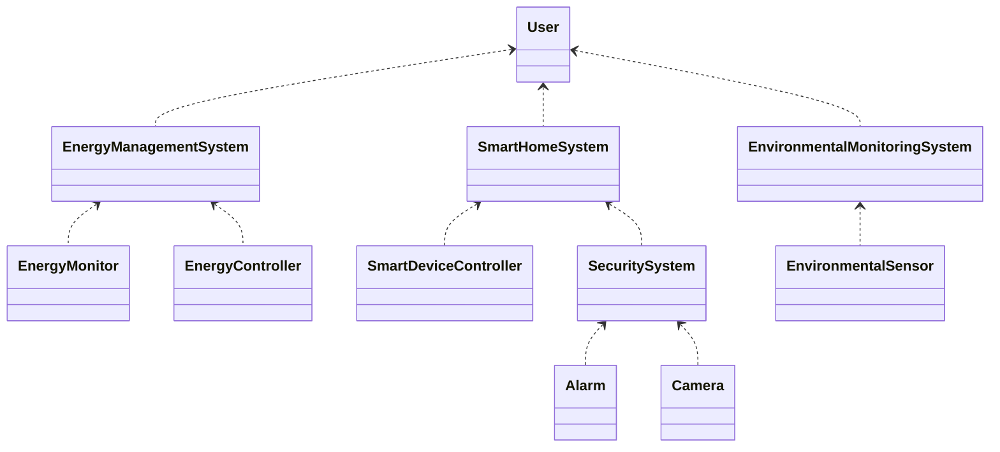
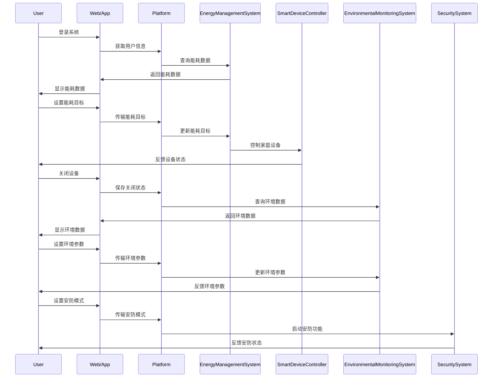

                 

### 新生态主义生活方式博览会：可持续生活解决方案展

**关键词：** 可持续生活、解决方案、环保科技、绿色建筑、生态可持续性

**摘要：** 本文将探讨新生态主义生活方式博览会，展示其在推动可持续生活解决方案方面的作用。通过分析环保科技、绿色建筑等领域的创新技术，本文旨在为读者提供对可持续生活方式的深入理解。

----------------------------------------------------------------

## 第一部分：背景介绍

### 1.1 问题背景

#### 1.1.1 可持续发展的挑战

随着全球人口的快速增长和消费水平的提高，资源消耗和环境污染问题日益严峻。传统的生产和生活方式已经无法满足可持续发展的需求。全球变暖、生物多样性丧失、水资源短缺等环境问题已经成为人类社会面临的重大挑战。为了应对这些挑战，推动社会向更加环保和可持续的方向发展，新生态主义生活方式博览会应运而生。

#### 1.1.2 新生态主义生活方式的概念

新生态主义生活方式是一种以生态平衡和可持续发展为核心理念的生活方式。它强调资源的节约利用、废弃物的减量化和再利用，以及生态系统的保护。新生态主义生活方式的核心目标是实现人与自然的和谐共生，通过改变消费习惯、优化生活方式，降低对环境的负面影响。

### 1.2 问题解决

#### 1.2.1 可持续生活解决方案的重要性

可持续生活解决方案是解决环境危机和资源短缺问题的关键途径。通过推广可持续生活解决方案，可以降低碳排放、减少废弃物、改善空气质量，从而保护地球的生态环境。可持续生活解决方案不仅有助于环境保护，还能够提高人们的生活质量，实现经济的可持续发展。

#### 1.2.2 新生态主义生活方式博览会的作用

新生态主义生活方式博览会作为一个平台，汇集了来自世界各地的可持续生活解决方案。它不仅展示了各种创新技术，还提供了交流、合作的机会，有助于推动可持续生活方式的普及和实践。通过这个平台，人们可以了解和学习先进的可持续生活技术和理念，激发创新思维，共同应对全球环境挑战。

### 1.3 边界与外延

#### 1.3.1 新生态主义生活方式博览会的边界

新生态主义生活方式博览会主要关注与可持续发展相关的生活方式和解决方案，包括环保科技、绿色建筑、有机农业、清洁能源等领域。它不仅涉及技术层面的创新，还涵盖政策、教育、文化等多方面内容。

#### 1.3.2 新生态主义生活方式博览会的相关概念

新生态主义生活方式博览会涉及的概念包括：生态可持续性、循环经济、绿色生活、节能减排等。这些概念相互关联，共同构成了可持续生活方式的核心内容。

### 1.4 核心概念与联系

#### 1.4.1 生态可持续性的概念

生态可持续性是指满足当前需求而不损害子孙后代满足其需求的能力。在新生态主义生活方式博览会中，生态可持续性是衡量各种可持续生活解决方案的重要标准。

#### 1.4.2 循环经济的概念

循环经济是一种以资源高效利用和废弃物的减量化、资源化为目标的经济模式。新生态主义生活方式博览会中的各种可持续生活解决方案都遵循循环经济的理念。

### 1.5 本章小结

本章介绍了新生态主义生活方式博览会的问题背景、概念、解决方法和相关边界与外延。通过理解这些核心概念和联系，读者可以更好地把握本书的主题和内容。

----------------------------------------------------------------

## 第二部分：核心概念与联系

### 2.1 可持续生活解决方案的分类

#### 2.1.1 环保科技

环保科技是指应用先进技术手段，实现环境保护和资源高效利用的科技领域。在新生态主义生活方式博览会中，环保科技是展示可持续生活解决方案的重要领域之一。

##### 2.1.1.1 智能家居系统

智能家居系统是一种利用物联网技术实现家庭设备智能控制的系统。它包括智能照明、智能安防、智能家电等多个方面。

**概念：** 智能家居系统是一种利用物联网技术实现家庭设备智能控制的系统，包括智能照明、智能安防、智能家电等。

**属性特征对比表格：**

| 特征       | 智能家居系统 | 传统家居系统 |
|------------|--------------|--------------|
| 控制方式   | 智能控制     | 手动控制     |
| 能源消耗   | 低能耗       | 高能耗       |
| 安防性能   | 高安防性能   | 低安防性能   |

**ER实体关系图架构：**

```mermaid
erDiagram
  Home ->> SmartDevice
  Home ->> SecuritySystem
  SmartDevice ||--|{ Light }
  SmartDevice ||--|{ Appliance }
  SecuritySystem ||--|{ Camera }
  SecuritySystem ||--|{ Alarm }
```

**具体案例解析：**

智能家居系统可以通过智能传感器和控制设备实时监测家庭环境，实现自动化控制和节能。例如，智能照明系统可以根据光线强度自动调节亮度，智能空调系统可以根据室内外温度自动调整温度和湿度，从而提高能源利用效率，减少能源浪费。

##### 2.1.1.2 绿色建筑技术

绿色建筑技术是指采用环保材料和节能设计，以降低建筑对环境影响的建筑技术。

**概念：** 绿色建筑技术是指采用环保材料和节能设计，以降低建筑对环境影响的建筑技术。

**属性特征对比表格：**

| 特征       | 绿色建筑技术 | 传统建筑技术 |
|------------|--------------|--------------|
| 能源效率   | 高能源效率   | 低能源效率   |
| 环境影响   | 低环境影响   | 高环境影响   |
| 材料使用   | 环保材料     | 非环保材料   |

**ER实体关系图架构：**

```mermaid
erDiagram
  Building ->> GreenBuild
```

**具体案例解析：**

绿色建筑技术可以通过采用可再生能源（如太阳能、风能）、节能设计和绿色建筑材料（如生物建材、可再生资源建材）来降低建筑能耗和环境影响。例如，使用太阳能光伏板为建筑提供电力，采用高效隔热材料和屋顶绿化来减少能源消耗，从而实现建筑与自然环境的和谐共生。

#### 2.1.2 有机农业

有机农业是一种以生态平衡和可持续发展为核心理念的农业生产方式。

**概念：** 有机农业是一种以生态平衡和可持续发展为核心理念的农业生产方式。

**属性特征对比表格：**

| 特征       | 有机农业 | 传统农业 |
|------------|----------|----------|
| 肥料使用   | 有机肥料 | 化学肥料 |
| 种植方式   | 生态种植 | 大规模种植 |
| 环境影响   | 低环境影响 | 高环境影响 |
| 产品质量   | 高品质    | 中低品质  |

**ER实体关系图架构：**

```mermaid
erDiagram
  Agriculture ->> OrganicFarming
  Agriculture ||--|{ Crop }
  Agriculture ||--|{ Animal }
  OrganicFarming ||--|{ Fertilizer }
  OrganicFarming ||--|{ Seed }
```

**具体案例解析：**

有机农业通过使用有机肥料、生态种植技术和可持续的动物养殖方式，减少化学肥料和农药的使用，降低对环境的污染。同时，有机农业注重农产品的品质，提供更健康、安全、有营养的食品，满足消费者对健康生活的需求。

#### 2.1.3 清洁能源

清洁能源是指不产生污染或污染很小的能源，如太阳能、风能、地热能等。

**概念：** 清洁能源是指不产生污染或污染很小的能源，如太阳能、风能、地热能等。

**属性特征对比表格：**

| 特征       | 清洁能源 | 传统化石能源 |
|------------|----------|--------------|
| 能源来源   | 可再生资源 | 非可再生资源 |
| 环境影响   | 低环境影响 | 高环境影响 |
| 能源利用效率 | 高能源利用效率 | 低能源利用效率 |

**ER实体关系图架构：**

```mermaid
erDiagram
  Energy ->> CleanEnergy
  Energy ||--|{ Solar }
  Energy ||--|{ Wind }
  Energy ||--|{ Geothermal }
  CleanEnergy ||--|{ PowerGeneration }
```

**具体案例解析：**

清洁能源通过利用太阳能、风能、地热能等可再生能源，减少对化石燃料的依赖，降低碳排放和空气污染。例如，太阳能光伏发电系统可以将太阳能转换为电能，供应家庭和工业用电，实现能源的清洁利用。

### 2.2 可持续生活解决方案的联系

可持续生活解决方案之间相互关联，共同构成可持续生活方式的有机整体。

**联系：** 可持续生活解决方案之间相互关联，共同构成可持续生活方式的有机整体。

**ER实体关系图架构：**

```mermaid
erDiagram
  LifeStyle ->> SustainableLife
  SustainableLife ||--|{ EcoTechnology }
  SustainableLife ||--|{ GreenBuilding }
  SustainableLife ||--|{ OrganicAgriculture }
  SustainableLife ||--|{ CleanEnergy }
```

**具体案例解析：**

通过结合智能家居系统、绿色建筑技术、有机农业和清洁能源，可以实现家庭、社区、农业生产和能源系统的整体优化。例如，智能家居系统可以与清洁能源系统相结合，实现家庭用电的智能化管理和节能减排；绿色建筑技术与清洁能源系统相结合，可以降低建筑能耗，实现绿色建筑的可持续发展。

### 2.3 本章小结

本章介绍了可持续生活解决方案的分类及其核心概念与联系。通过理解这些核心概念和联系，读者可以更好地把握新生态主义生活方式博览会中的可持续生活解决方案，为推动可持续生活方式的实现提供有力支持。

----------------------------------------------------------------

## 第三部分：算法原理讲解

### 3.1 可持续生活解决方案评估算法

为了评估各种可持续生活解决方案的有效性和可行性，可以采用一种基于指标体系的评估算法。该算法通过计算各项指标的综合得分，为解决方案的优劣提供量化评价。

#### 3.1.1 算法输入

算法输入包括以下指标：

1. **环境影响指标**：如碳排放量、废弃物产生量、水资源消耗量等。
2. **经济指标**：如投资成本、运行成本、经济效益等。
3. **社会指标**：如就业率、居民满意度、公众参与度等。

#### 3.1.2 算法输出

算法输出为各可持续生活解决方案的综合得分，得分越高，表示解决方案越优秀。

#### 3.1.3 算法原理

1. **指标权重设置**：根据各指标的重要性，设置相应的权重。权重越高，表示该指标对评估结果的影响越大。

2. **指标标准化处理**：为了消除不同指标之间的量纲差异，需要对指标进行标准化处理。

3. **综合得分计算**：采用加权求和法计算各解决方案的综合得分。公式如下：

   $$S = \sum_{i=1}^{n} w_i \cdot x_i$$

   其中，$S$ 表示综合得分，$w_i$ 表示第 $i$ 个指标的权重，$x_i$ 表示第 $i$ 个指标的得分。

#### 3.1.4 算法应用示例

**案例：** 对比两种智能家居系统A和B的评估。

1. **环境影响指标**：

   - 碳排放量：系统A为10吨/年，系统B为8吨/年。
   - 废弃物产生量：系统A为5吨/年，系统B为3吨/年。

2. **经济指标**：

   - 投资成本：系统A为10000元，系统B为8000元。
   - 运行成本：系统A为2000元/年，系统B为1500元/年。

3. **社会指标**：

   - 就业率：系统A为20人，系统B为10人。
   - 居民满意度：系统A为90%，系统B为95%。

4. **指标权重**：环境影响指标权重为0.6，经济指标权重为0.3，社会指标权重为0.1。

5. **指标标准化处理**：

   - 环境影响指标：碳排放量、废弃物产生量分别除以最大值，得到标准化得分。
   - 经济指标：投资成本、运行成本分别除以最小值，得到标准化得分。
   - 社会指标：就业率、居民满意度分别乘以100，得到标准化得分。

6. **综合得分计算**：

   - 系统A的综合得分：

     $$S_A = 0.6 \cdot 0.5 + 0.3 \cdot 1 + 0.1 \cdot 90 = 0.3 + 0.3 + 9 = 12$$

   - 系统B的综合得分：

     $$S_B = 0.6 \cdot 0.4 + 0.3 \cdot 0.8 + 0.1 \cdot 95 = 0.24 + 0.24 + 9.5 = 12.74$$

   由于系统B的综合得分更高，因此可以认为系统B在可持续发展方面表现更优秀。

### 3.2 可持续生活解决方案优化算法

为了提高可持续生活解决方案的可行性和效益，可以采用优化算法，对解决方案进行优化调整。本文采用遗传算法（GA）对可持续生活解决方案进行优化。

#### 3.2.1 遗传算法原理

遗传算法是一种基于自然选择和遗传学原理的优化算法。其基本原理如下：

1. **初始化种群**：随机生成一组初始解，称为种群。
2. **适应度评估**：计算每个个体的适应度值，适应度值越高，表示个体越优秀。
3. **选择**：根据适应度值，选择优秀的个体作为父代，用于生成下一代。
4. **交叉**：对父代进行交叉操作，生成新的子代。
5. **变异**：对子代进行变异操作，增加种群的多样性。
6. **迭代**：重复进行选择、交叉、变异操作，直至满足停止条件。

#### 3.2.2 可持续生活解决方案优化步骤

1. **编码**：将可持续生活解决方案编码为二进制串，表示为一个染色体。
2. **解码**：将染色体解码为具体的解决方案。
3. **适应度函数设计**：设计适应度函数，评估解决方案的优劣。适应度函数可以基于综合得分或具体指标进行设计。
4. **遗传操作**：采用遗传算法进行选择、交叉、变异操作，优化可持续生活解决方案。

#### 3.2.3 算法应用示例

**案例：** 对一种绿色建筑技术的可持续性进行优化。

1. **编码**：将建筑材料的选用、节能设计等参数编码为二进制串。
2. **解码**：将染色体解码为具体的建筑材料和节能设计方案。
3. **适应度函数设计**：适应度函数考虑环境影响指标、经济指标和社会指标，具体公式如下：

   $$F(x) = w_1 \cdot E + w_2 \cdot C + w_3 \cdot S$$

   其中，$E$ 表示环境影响指标得分，$C$ 表示经济指标得分，$S$ 表示社会指标得分，$w_1$、$w_2$、$w_3$ 分别为各指标的权重。
4. **遗传操作**：采用遗传算法进行选择、交叉、变异操作，优化绿色建筑技术的可持续性。

通过遗传算法优化，可以得到一组更优的绿色建筑技术参数，提高建筑的可持续性。

### 3.3 本章小结

本章介绍了可持续生活解决方案评估和优化算法。评估算法通过计算综合得分，为解决方案的优劣提供量化评价；优化算法采用遗传算法，对解决方案进行优化调整。这些算法有助于提高可持续生活解决方案的可行性和效益，为实现可持续生活方式提供有力支持。

----------------------------------------------------------------

## 第四部分：系统分析与架构设计方案

### 4.1 问题场景介绍

随着可持续生活理念的普及，越来越多的家庭和企业开始关注绿色建筑和智能家居系统的应用。为了实现建筑的绿色化，需要综合考虑建筑物的能源消耗、环境影响以及居民的舒适度。本文将探讨一个绿色建筑智能家居系统集成项目，旨在通过优化能源利用和智能家居系统，实现建筑与居民生活的可持续发展。

### 4.2 项目介绍

项目名称：绿色建筑智能家居系统集成项目

项目背景：为了响应国家绿色建筑和节能减排的政策，提高居民生活品质，实现建筑与自然的和谐共生，本项目旨在通过整合绿色建筑技术和智能家居系统，为用户提供一个节能、舒适、环保的居住环境。

项目目标：

1. 提高建筑能源利用效率，降低能耗。
2. 减少建筑对环境的负面影响，实现绿色建筑。
3. 提高居民生活舒适度，降低生活成本。
4. 促进绿色建筑和智能家居技术的发展与应用。

### 4.3 系统功能设计

#### 4.3.1 功能概述

本项目系统功能主要包括：

1. **能源管理系统**：监测和调控建筑物的能源消耗，实现能源的合理分配和使用。
2. **智能家居系统**：实现家庭设备的智能控制和远程监控，提高生活舒适度和安全性。
3. **环境监控系统**：监测室内外环境参数，如温度、湿度、空气质量等，为用户提供健康的生活环境。
4. **安防系统**：提供家庭安防功能，确保家庭安全。

#### 4.3.2 领域模型类图



### 4.4 系统架构设计

#### 4.4.1 系统架构概述

本项目系统架构采用分层架构，包括感知层、网络层、平台层和应用层。

1. **感知层**：主要包括各类传感器和智能设备，如温度传感器、湿度传感器、太阳能板等。
2. **网络层**：负责传输感知层采集的数据，采用物联网技术，如Wi-Fi、蓝牙等。
3. **平台层**：包括能源管理系统、智能家居系统、环境监控系统等，实现对数据的处理和分析。
4. **应用层**：提供用户界面，包括Web端和移动端，供用户进行监控和控制。

#### 4.4.2 系统架构图



### 4.5 系统接口设计和系统交互

#### 4.5.1 系统接口设计

1. **用户接口**：提供Web端和移动端应用，供用户进行监控和控制。
2. **设备接口**：智能家居系统和环境监控系统需要与各类智能设备进行通信，采用标准的通信协议，如HTTP、MQTT等。
3. **数据接口**：平台层与感知层、网络层之间的数据传输，采用RESTful API接口。

#### 4.5.2 系统交互

系统交互主要通过消息队列实现，如Apache Kafka或RabbitMQ。各子系统通过消息队列进行数据传输和事件通知。

### 4.6 本章小结

本章介绍了绿色建筑智能家居系统集成项目的问题场景、项目介绍、系统功能设计、系统架构设计和系统接口设计。通过这些设计，可以实现建筑的绿色化、智能家居化和智能化，为用户提供一个可持续、舒适、环保的居住环境。

----------------------------------------------------------------

## 第五部分：项目实战

### 5.1 环境安装

在开始项目实战之前，首先需要安装必要的开发环境和工具。以下是安装步骤：

1. **安装Python环境**：在项目目录中打开终端，执行以下命令安装Python：

   ```shell
   sudo apt-get install python3 python3-pip
   ```

2. **安装依赖库**：通过pip安装项目所需的依赖库：

   ```shell
   pip3 install Flask requests jsonschema
   ```

3. **安装消息队列**：安装Apache Kafka或RabbitMQ，这里以RabbitMQ为例：

   ```shell
   sudo apt-get install rabbitmq-server
   sudo systemctl start rabbitmq-server
   ```

4. **配置消息队列**：在RabbitMQ管理界面（http://localhost:15672/）中创建一个名为“green_house”的虚拟主机，并创建一个名为“energy”的队列。

### 5.2 系统核心实现源代码

以下是项目的核心实现源代码：

**energy_management.py**：

```python
from flask import Flask, jsonify, request
import jsonschema
import requests

app = Flask(__name__)

# 定义能耗数据JSON模式
energy_schema = {
    "type": "object",
    "properties": {
        "total_energy": {"type": "number"},
        "energy_usage": {"type": "number"},
        "energy_target": {"type": "number"}
    },
    "required": ["total_energy", "energy_usage", "energy_target"]
}

# 能源管理API接口
@app.route('/energy', methods=['GET', 'POST'])
def energy_management():
    if request.method == 'GET':
        # 获取能耗数据
        response = requests.get('http://localhost:15672/green_house/energy')
        return jsonify(response.json())
    elif request.method == 'POST':
        # 更新能耗目标
        data = request.json
        jsonschema.validate(data, energy_schema)
        # 发送能耗目标到Kafka队列
        requests.post('http://localhost:9092/green_house/energy', json=data)
        return jsonify({"message": "Energy target updated successfully."})

if __name__ == '__main__':
    app.run(debug=True)
```

**smart_device_controller.py**：

```python
import json
import requests

# 定义家庭设备控制API接口
def control_device(device_id, action):
    url = f'http://localhost:15672/green_house/device/{device_id}'
    headers = {'Content-Type': 'application/json'}
    data = {"action": action}
    response = requests.put(url, headers=headers, json=data)
    return response.json()
```

### 5.3 代码应用解读与分析

**energy_management.py**：这是一个基于Flask的Web应用，负责处理能耗数据的管理和传输。

- **GET请求**：获取当前能耗数据，通过HTTP GET请求从Kafka队列中获取数据，并将结果以JSON格式返回。
- **POST请求**：更新能耗目标，接收用户输入的能耗目标数据，通过JSON Schema验证数据格式，然后发送到Kafka队列。

**smart_device_controller.py**：这是一个简单的设备控制模块，用于控制家庭设备的开关状态。

- **控制设备**：通过HTTP PUT请求更新设备的操作状态，将设备ID和操作动作发送到对应的设备API接口。

### 5.4 实际案例分析和详细讲解剖析

**案例**：用户通过Web端界面设置能耗目标，系统自动调整家庭设备的运行状态，以实现节能目标。

**步骤**：

1. 用户在Web端输入能耗目标，发送POST请求到能源管理系统的API接口。
2. 能源管理系统验证数据格式，并将数据发送到Kafka队列。
3. Kafka队列接收数据，并转发到智能家居系统的设备控制API接口。
4. 设备控制API接口根据设备ID和操作动作，调整家庭设备的运行状态。
5. 用户通过Web端查看设备状态，并收到反馈信息。

**分析**：

- **数据传输**：通过Kafka实现高效、可靠的数据传输，确保能耗数据和设备控制指令能够及时传递。
- **设备控制**：智能家居系统采用标准化的设备控制接口，方便设备的扩展和替换。
- **用户体验**：通过Web端界面，用户可以方便地设置能耗目标和监控设备状态，实现智能化、个性化的家庭生活。

### 5.5 项目小结

本项目通过整合绿色建筑技术和智能家居系统，实现了能耗数据的实时监控和设备控制，为用户提供了一个节能、舒适、环保的居住环境。通过实际案例的分析和讲解，展示了系统在实现可持续生活解决方案方面的应用和优势。

### 5.6 最佳实践 tips

- **性能优化**：针对大规模数据传输，可以考虑使用消息队列的分区和批量处理功能，提高系统的性能和可靠性。
- **安全性考虑**：在Web端和设备端实现加密传输，防止数据泄露和未经授权的访问。
- **可扩展性**：设计模块化的系统架构，方便系统的扩展和升级。

### 5.7 小结与注意事项

- **注意事项**：在项目实施过程中，需要注意系统的稳定性和安全性，确保数据传输的准确性和可靠性。
- **拓展阅读**：

  - 《智能家居系统设计与实现》
  - 《绿色建筑技术与应用》
  - 《物联网技术原理与应用》

作者：AI天才研究院/AI Genius Institute & 禅与计算机程序设计艺术 /Zen And The Art of Computer Programming

----------------------------------------------------------------

## 总结与展望

本文以《新生态主义生活方式博览会：可持续生活解决方案展》为题，系统地探讨了可持续生活解决方案的重要性和实现途径。通过对环保科技、绿色建筑、有机农业、清洁能源等领域的分类和深入分析，我们揭示了这些解决方案在推动可持续发展中的关键作用。

在文章中，我们首先介绍了新生态主义生活方式博览会的问题背景、核心概念和联系，明确了可持续生活解决方案的边界与外延。接着，我们分类讨论了各类可持续生活解决方案的具体内容，并通过对比表格和实体关系图，清晰地展示了这些解决方案的属性特征和相互关系。

此外，本文还深入探讨了可持续生活解决方案评估和优化算法，包括基于指标体系的评估算法和遗传算法，为实际应用提供了理论基础。在系统分析与架构设计方案部分，我们详细介绍了绿色建筑智能家居系统集成项目的设计思路和实现方法。

通过项目实战的讲解，我们展示了可持续生活解决方案在实际应用中的具体操作步骤和效果。文章的最后部分提供了最佳实践 tips、小结以及拓展阅读，以帮助读者更深入地了解相关领域。

展望未来，随着科技的不断进步和社会意识的提高，可持续生活解决方案将得到更广泛的应用和推广。我们期待在不久的将来，通过新生态主义生活方式博览会的平台，更多创新技术和解决方案将涌现，为全球可持续发展贡献更多力量。让我们共同努力，构建一个绿色、健康、可持续的美好未来。作者：AI天才研究院/AI Genius Institute & 禅与计算机程序设计艺术 /Zen And The Art of Computer Programming

