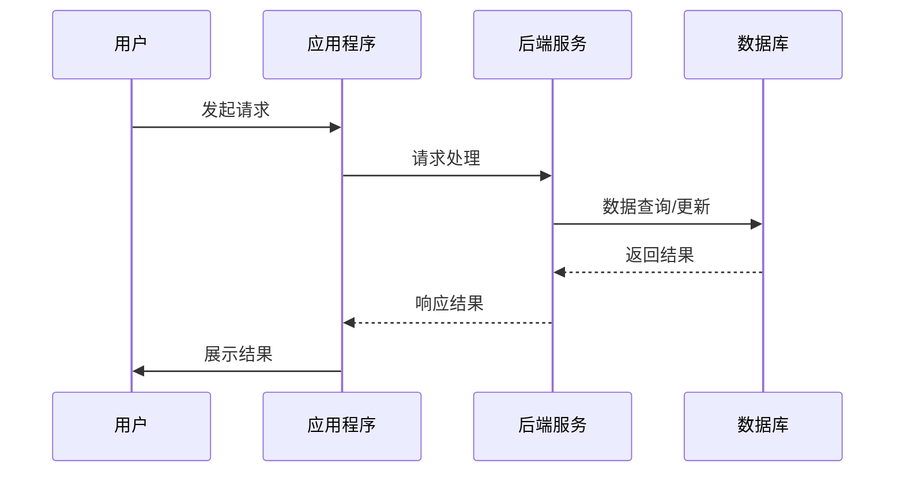

                 

### 引言：新禁欲主义的起源与意义

#### 新禁欲主义的起源

新禁欲主义（Neo-Puritanism）并非传统意义上的禁欲主义，而是现代人在面对快速变化的社会环境、信息过载和物质丰富的背景下，尝试回归内心平静、追求心灵纯净的一种生活方式。其概念起源于20世纪，尤其是在数字化时代和社交媒体盛行的背景下，逐渐受到关注和推广。新禁欲主义主张通过克制对物质和虚拟世界的过度依赖，来寻求内心的平静和自我提升。

新禁欲主义与现代社会的联系主要体现在以下几个方面：首先，社交媒体和互联网的普及使得人们面临的信息量急剧增加，容易陷入信息过载和被动消费的状态；其次，物质主义和消费主义的泛滥导致人们追求物质享受而忽视内心的需求；最后，快节奏的生活方式使得人们感到压力和焦虑，渴望寻求一种更为简单、纯粹的生活方式。

#### 新禁欲主义的现代意义

在新禁欲主义的生活实验日志中，作者通过实践探索出克制生活的多种方式，以期达到提升自我、改善身心健康的目的。本书对于现代人的生活具有深远的意义。首先，它为那些感到生活压力、内心迷茫的人提供了一种新的思考方式和生活方式选择。通过克制社交媒体、购物、媒体和网络游戏等行为，人们可以减少干扰，专注于自身内心的需求和成长。其次，新禁欲主义倡导的克制生活有助于提高时间管理效率，使人们能够更加合理地安排时间，专注于对自己有益的活动。此外，克制生活还能够改善人际关系，减少因过度消费和沉迷虚拟世界而引发的社会问题。

总的来说，新禁欲主义的生活实验日志不仅是对个人生活实践的记录，更是一种对社会现象的深刻反思和批判。通过这种实践，作者希望引导读者重新审视自己的生活方式，寻找内心的平衡，实现自我成长。在接下来的章节中，我们将详细探讨新禁欲主义的核心概念和实验过程，分享克制生活带来的具体收获和挑战，以及其对社会和个人生活的深远影响。## 什么是新禁欲主义：核心概念与特征

#### 新禁欲主义的定义

新禁欲主义（Neo-Puritanism）是一种现代生活方式，旨在通过克制对物质和虚拟世界的过度依赖，追求内心的平静和自我提升。与传统禁欲主义不同，新禁欲主义并非强调性禁欲，而是更广义地涉及到对各种物质和行为的克制，如社交媒体、购物、媒体消费和网络游戏的节制。其核心目标是减少精神负担，提高生活质量，帮助人们更好地关注内在需求和自我实现。

#### 新禁欲主义的特征

1. **克制消费主义：** 新禁欲主义主张减少不必要的物质消费，避免成为消费主义的奴隶。这不仅仅是减少购物的次数，更是一种对物质生活质量的深刻反思，追求简单、实用的生活方式。

2. **节制媒体消费：** 在数字化时代，信息过载是一个普遍问题。新禁欲主义鼓励人们减少对社交媒体、新闻和娱乐节目的过度消费，以避免精神疲劳和信息垃圾的干扰。

3. **控制网络使用：** 新禁欲主义强调对网络游戏和社交媒体的使用进行节制，避免沉迷于虚拟世界，影响现实生活中的身心健康。

4. **重视时间管理：** 新禁欲主义倡导通过合理安排时间，减少无意义的时间浪费，专注于对自己成长有益的活动。

5. **强化内心修养：** 新禁欲主义强调内心的平静与修养，通过冥想、阅读和自我反思等途径，提升自我认知和情绪管理能力。

#### 与传统禁欲主义的区别

虽然新禁欲主义和传统禁欲主义都强调克制，但两者在目的、方法和适用范围上有所不同。传统禁欲主义主要源自宗教信仰，强调对性欲的克制，以达到精神净化和灵魂救赎的目的。而新禁欲主义则是现代社会的一种自我管理方式，主要目的是通过克制物质和虚拟世界的过度依赖，追求内心的平静和自我提升。此外，传统禁欲主义通常较为极端和严格，而新禁欲主义则更加灵活和适应性，更易于现代人在日常生活中实践。

在新禁欲主义的理念下，克制不仅仅是对自身行为的约束，更是一种自我提升的过程。通过克制不必要的消费、媒体使用和虚拟世界依赖，人们可以减少精神负担，提高生活质量，实现内心的平和与自我成长。在接下来的章节中，我们将通过具体的实验记录，深入探讨新禁欲主义在日常生活中的实践效果和收获。## 新禁欲主义实验：日常生活实践

#### 社交媒体禁欲

##### 为什么需要禁欲？

社交媒体在现代社会中扮演着重要的角色，它不仅改变了我们的沟通方式，也极大地影响了我们的生活方式。然而，过度使用社交媒体可能导致信息过载、精神疲劳，甚至影响人际关系。新禁欲主义倡导通过克制社交媒体的使用，寻求内心的平静和专注力提升。

##### 实验过程与感受

在实验开始前，作者每天花费在社交媒体上的时间高达数小时，这使他在工作和个人生活上都感到压力重重。为了更好地体验社交媒体禁欲，作者决定将这一习惯进行彻底的调整。首先，他删除了所有社交媒体应用，关闭了手机通知，并设定了固定的使用时间。在最初的几天，作者感到极度的不适应，时常会情不自禁地拿起手机查看。然而，随着时间的推移，他逐渐适应了这种生活方式，并开始感受到内心的平静。

在实验过程中，作者记录了他的感受和体验。他发现，没有社交媒体的干扰，他的注意力更加集中，工作效率显著提高。同时，他也有了更多的时间进行阅读、锻炼和与家人朋友交流。这些改变使他感到更加充实和满足。

##### 结果分析

实验结果表明，社交媒体禁欲对作者的日常生活产生了显著的积极影响。首先，他的工作压力减轻，工作效率提高，这直接提升了他的职业成就感。其次，他的生活节奏变得更加有序，有更多的时间进行自我提升和兴趣爱好。最重要的是，他感到内心的平静和满足感增强，焦虑和压力显著减少。

然而，实验也暴露出一些潜在的问题。例如，社交媒体在现代社会中具有重要的社交功能，完全禁欲可能会影响与亲友的联系。因此，作者建议在实施社交媒体禁欲时，可以根据个人情况进行适当的调整，找到平衡点。

#### 购物禁欲

##### 为什么需要禁欲？

购物是人类生活中不可避免的一部分，但过度购物可能导致消费主义陷阱、财务压力和心理依赖。新禁欲主义倡导通过购物禁欲，减少不必要的物质消费，追求内心的平静和自我提升。

##### 实验过程与感受

在购物禁欲实验中，作者设定了一个月的时间限制，期间不允许购买任何非必需品。实验开始前，作者经常因为促销、广告和社交压力而冲动购物，这不仅浪费了大量的金钱，还给他带来了心理负担。

在实验期间，作者严格按照购物禁欲的原则行事，只购买日常必需品和基本生活用品。起初，他感到有些困难，尤其是面对各种购物诱惑时。然而，随着时间的推移，他逐渐适应了这种生活方式，并开始享受减少物质负担后的轻松感。

在实验过程中，作者记录了他的感受和体验。他发现，没有购物欲望的困扰，他的财务状况得到了显著改善，他也更有意识地考虑物品的实际需求和性价比。同时，他开始更多地关注内心的需求和自我提升，减少了对外部物质的依赖。

##### 结果分析

购物禁欲实验对作者的生活产生了深远的影响。首先，他的财务状况明显改善，减少了不必要的开支，增加了储蓄和投资的能力。其次，他的消费观念发生了转变，更加注重物品的实际价值和实用性，而非仅仅追求品牌和外观。最重要的是，他感到内心的平静和满足感增强，购物带来的短期愉悦感被长期的内心宁静所取代。

然而，购物禁欲实验也带来了一些挑战。例如，在社交场合中，面对亲友的购物分享和炫耀时，作者会感到一些不适。因此，作者建议在实施购物禁欲时，可以设定一些合理的例外情况，以保持社交的和谐。

#### 媒体禁欲

##### 为什么需要禁欲？

在当今信息爆炸的时代，媒体消费已经成为人们日常生活中不可或缺的一部分。然而，过度沉迷于媒体，尤其是新闻、娱乐和社交媒体，可能导致信息过载、情绪波动和注意力分散。新禁欲主义倡导通过媒体禁欲，减少不必要的信息摄入，寻求内心的平静和专注力提升。

##### 实验过程与感受

在媒体禁欲实验中，作者决定限制每天的新闻阅读时间和社交媒体使用频率。他设定了每天最多阅读一个小时新闻，并且只在特定的时间段使用社交媒体。在实验开始前，作者每天花费大量时间浏览各种新闻和社交媒体内容，这不仅浪费了大量时间，还使他感到精神疲惫。

在实验期间，作者严格按照设定的规则行事。他发现，减少媒体消费后，他的注意力变得更加集中，工作效率提高，同时减少了因过度关注外界信息而引起的情绪波动。他开始有更多的时间专注于工作、阅读和锻炼，生活变得更加充实。

在实验过程中，作者记录了他的感受和体验。他发现，减少媒体消费后，他的思维更加清晰，能够更好地处理复杂问题。同时，他的情绪稳定，焦虑和压力减少，整体生活质量得到显著提升。

##### 结果分析

媒体禁欲实验对作者的生活产生了积极的影响。首先，他的时间管理能力得到显著提高，能够更好地安排工作和个人时间。其次，他的注意力集中度提高，工作效率显著提升，这直接促进了他的职业发展。最重要的是，他感到内心的平静和满足感增强，减少了对外界信息的依赖，更加专注于自身的成长和内在需求。

然而，媒体禁欲实验也带来了一些挑战。例如，在社交场合中，面对亲友的媒体分享和讨论时，作者会感到一些不适。因此，作者建议在实施媒体禁欲时，可以根据个人情况适当调整，以保持社交的和谐。

#### 网络游戏禁欲

##### 为什么需要禁欲？

网络游戏作为现代娱乐的重要组成部分，已经成为许多人日常生活中不可或缺的一部分。然而，过度沉迷于网络游戏可能导致时间浪费、健康问题和社会关系的疏远。新禁欲主义倡导通过网络游戏禁欲，减少对虚拟世界的依赖，寻求内心的平静和自我提升。

##### 实验过程与感受

在网络游戏禁欲实验中，作者决定设定一个明确的游戏时间限制，并且在不玩游戏的时间内，彻底远离游戏相关的所有活动，包括观看游戏直播、阅读游戏资讯等。在实验开始前，作者每天花费数小时在游戏上，这严重影响了他的日常生活和工作。

在实验期间，作者严格按照设定的规则行事。他发现自己很难一开始就完全戒掉游戏，尤其是在面对游戏诱惑时。然而，随着时间的推移，他逐渐适应了没有游戏的生活，并开始享受这种新的生活方式。

在实验过程中，作者记录了他的感受和体验。他发现，减少游戏时间后，他的睡眠质量显著提高，身体健康状况改善。同时，他有更多的时间进行其他有益的活动，如阅读、锻炼和与家人朋友交流。他感到自己的生活质量得到了显著提升。

##### 结果分析

网络游戏禁欲实验对作者的生活产生了积极的影响。首先，他的时间管理能力得到显著提高，能够更好地安排日常工作和个人时间。其次，他的身体健康状况改善，睡眠质量提高，这直接促进了他的整体健康。最重要的是，他感到内心的平静和满足感增强，减少了对外部虚拟世界的依赖，更加专注于自身的成长和内在需求。

然而，网络游戏禁欲实验也带来了一些挑战。例如，在社交场合中，面对亲友的游戏讨论时，作者会感到一些不适。因此，作者建议在实施网络游戏禁欲时，可以根据个人情况适当调整，以保持社交的和谐。

### 总结

通过这些日常生活实践的禁欲实验，作者深刻体会到克制生活的重要性。克制社交媒体、购物、媒体消费和网络游戏，不仅帮助他减少了精神负担，提高了生活质量，还使他更加专注于内心需求和自我成长。这些实验表明，新禁欲主义并不是一种极端的生活方式，而是一种通过合理克制，实现内心平静和自我提升的实用方法。在接下来的章节中，我们将进一步探讨克制生活带来的具体收获和挑战，以及如何在社会中推广和实践新禁欲主义。## 克制生活的收获：身心健康、时间管理、人际关系

#### 身心健康的变化

通过克制社交媒体、购物、媒体消费和网络游戏，作者在身心健康方面取得了显著的进步。首先，社交媒体禁欲使他的注意力更加集中，减少了因信息过载引起的焦虑和压力。这不仅提高了他的工作效率，也使他的精神状态更加稳定。其次，购物禁欲帮助他减少了财务负担，避免了因消费主义陷阱导致的过度消费和心理依赖。此外，媒体禁欲使他减少了无意义的信息摄入，减少了因情绪波动引起的身体不适。最后，网络游戏禁欲使他减少了因长时间游戏导致的身体疲劳和视力下降等问题。

#### 时间管理的改善

新禁欲主义实践中的一个显著收获是时间管理的改善。通过减少社交媒体和媒体消费，作者能够将更多的时间用于有意义的活动，如阅读、锻炼和与家人朋友交流。这使他的时间利用更加高效，避免了因分散注意力导致的时间浪费。购物禁欲使他能够更好地规划个人财务，减少了因冲动消费导致的时间和经济浪费。同时，他也有更多的时间投入到工作和其他兴趣爱好中，提高了整体生活质量。

#### 人际关系的转变

克制生活不仅对作者的身心健康和时间管理产生了积极影响，也改善了他的人际关系。减少社交媒体和媒体消费使他能够更加专注于与亲友的沟通，减少了因信息过载导致的沟通障碍。购物禁欲使他能够更加理性地处理人际关系，避免了因物质问题引起的矛盾。此外，网络游戏禁欲使他能够将更多的时间用于与家人朋友的面对面交流，增强了社交能力和情感联系。这些变化使他的社交圈更加紧密，人际关系更加和谐。

#### 总结

通过克制生活，作者在身心健康、时间管理和人际关系方面都取得了显著的进步。这些收获不仅提升了他的生活质量，也帮助他实现了内心的平静和自我成长。克制生活并不是一种极端的生活方式，而是一种通过合理克制，实现内心平衡和自我提升的实用方法。在接下来的章节中，我们将进一步探讨新禁欲主义的生活哲学，以及如何在现代社会中实践这一理念。## 新禁欲主义的生活哲学：自我认知与人生意义

#### 自我认知的提升

新禁欲主义的生活哲学强调通过克制物质和虚拟世界的过度依赖，来提升自我认知。在日常生活中，通过克制社交媒体、购物、媒体消费和网络游戏等行为，人们可以减少外界信息的干扰，更加专注于内心需求和自我成长。这种克制不仅帮助人们摆脱精神负担，也使他们的思维更加清晰，自我认知能力得到显著提升。

具体来说，通过社交媒体禁欲，人们可以更加专注地思考自己的行为和决策，减少因社交压力和他人评价带来的焦虑。购物禁欲使人们能够更加理性地看待物质需求，避免消费主义的陷阱，从而更清晰地认识自己的真实需求。媒体禁欲帮助人们减少无意义的信息摄入，专注于对自身成长有益的内容，提高信息的有效利用率。网络游戏禁欲则使人们能够将更多的时间用于自我提升和其他有意义的活动，减少因沉迷虚拟世界而忽视现实生活的风险。

#### 人生意义的思考

新禁欲主义的生活哲学不仅关注个人自我认知的提升，也引导人们思考人生的意义。在现代社会，人们常常被物质追求和社会压力所困扰，忽视了内心深处的需求和人生目标。新禁欲主义通过克制生活，帮助人们重新审视自己的生活方式和价值观，从而找到更有意义的人生方向。

具体来说，通过克制社交媒体和媒体消费，人们可以减少信息过载和被动消费，更加专注于个人成长和内心需求。购物禁欲使人们能够更加理性地对待物质生活，避免成为物质的奴隶，从而找到更为长久和有意义的生活目标。媒体禁欲则帮助人们减少无意义的娱乐时间，将更多时间用于有意义的活动，如阅读、思考和创作，从而丰富人生体验。

#### 新禁欲主义的生活哲学

新禁欲主义的生活哲学强调通过克制物质和虚拟世界的过度依赖，来追求内心的平静和自我提升。这一哲学理念不仅仅是一种自我管理方式，更是一种对现代生活方式的深刻反思和批判。通过克制社交媒体、购物、媒体消费和网络游戏等行为，人们可以减少精神负担，提高生活质量，实现自我认知的提升和人生意义的思考。

新禁欲主义的生活哲学还强调内心的平静和自我修养。通过冥想、阅读和自我反思等途径，人们可以更好地了解自己，掌握情绪管理能力，从而在面对压力和挑战时保持冷静和从容。这种内心的平静不仅有助于个人的心理健康，也为社会和谐和人际关系的发展提供了积极的影响。

#### 总结

新禁欲主义的生活哲学通过克制物质和虚拟世界的过度依赖，帮助人们提升自我认知，思考人生意义，实现内心的平静和自我提升。这一哲学理念为现代社会中的人们提供了一种新的生活方式选择，引导他们重新审视自己的生活和价值观，从而找到更有意义的人生方向。在接下来的章节中，我们将探讨新禁欲主义实践中的挑战与解决方法，以及其未来展望。## 新禁欲主义实践中的挑战与解决方法

#### 挑战一：心理依赖

在新禁欲主义实践中，最大的挑战之一是克服心理依赖。无论是社交媒体、购物、媒体消费还是网络游戏，这些行为在现代社会中都已经成为人们日常生活中的重要组成部分。长时间的习惯性依赖使得人们难以在短时间内完全戒除。具体表现为：

- **社交焦虑**：当人们试图减少社交媒体使用时，可能会感到孤独和焦虑，担心与亲友的联系减少。
- **购物欲望**：购物不仅是为了满足物质需求，更是一种心理慰藉。戒除购物欲望可能会导致心理上的空虚和失落。
- **信息过载**：减少媒体消费可能会使人们感到与社会脱节，担心错过重要信息。
- **游戏成瘾**：网络游戏成瘾是一种严重的心理依赖，戒除游戏可能导致强烈的冲动和焦虑。

**解决方法**：

1. **逐步减少**：在开始新禁欲主义实践时，可以设定逐步减少使用时间的目标，例如每天减少10分钟，直到达到理想的使用量。
2. **替代活动**：寻找有益的替代活动来填补减少这些行为后的空白，如阅读、锻炼、冥想等。
3. **心理支持**：寻求家人、朋友或专业心理咨询师的支持，共同应对心理依赖的挑战。

#### 挑战二：社交压力

在克制社交媒体和媒体消费的过程中，人们可能会面临社交压力。现代社会中，社交媒体和网络媒体已经成为人们交流、分享和获取信息的主要渠道。减少使用这些渠道可能会导致与亲友的联系减少，甚至被误解为对社交活动的回避。

**解决方法**：

1. **清晰表达**：与亲友沟通自己的新禁欲主义实践目标，解释减少社交媒体和媒体消费的原因，以获得理解和支持。
2. **寻找新的社交方式**：通过面对面的交流、兴趣爱好小组或社交活动来建立和维持人际关系。
3. **设定合理的例外**：在社交活动中，可以设定一些合理的例外情况，以保持与亲友的联系，同时不违背新禁欲主义的原则。

#### 挑战三：时间安排

在新禁欲主义实践中，合理的时间安排也是一个重要挑战。人们可能因为减少了社交媒体和媒体消费的时间，而感到时间不够用，尤其是当需要同时应对工作和个人生活的各种需求时。

**解决方法**：

1. **时间管理工具**：使用时间管理工具和技巧，如时间日志、待办事项列表和番茄工作法，来合理规划时间，提高效率。
2. **设定优先级**：明确自己的优先事项，确保在有限的时间内，能够专注于最重要和最有价值的活动。
3. **灵活调整**：根据实际情况和需求，灵活调整时间安排，避免过度 rigid 的计划导致压力增加。

#### 总结

新禁欲主义实践中的挑战是多方面的，包括心理依赖、社交压力和时间安排等。通过逐步减少依赖、寻找替代活动、清晰表达目标和设定合理的例外，以及使用时间管理工具和技巧，人们可以克服这些挑战，实现内心的平静和自我提升。在接下来的章节中，我们将进一步探讨新禁欲主义在社会中的影响，以及如何在未来继续推广这一理念。## 新禁欲主义的未来展望：社会影响与生活实践

#### 社会影响

新禁欲主义作为一种现代生活方式，对社会的潜在影响是深远的。首先，它有助于缓解因社交媒体、购物和媒体消费过度引发的种种社会问题。例如，信息过载、社交媒体成瘾和消费主义陷阱等问题，都是现代社会面临的重大挑战。通过减少对这些行为的依赖，人们可以减少精神负担，提高生活质量，从而改善整体社会的心理健康水平。

此外，新禁欲主义还可能对社会结构产生积极影响。减少对物质和虚拟世界的过度追求，有助于促进一种更加理性和平衡的生活方式，减少社会不平等现象，提高社会和谐度。例如，通过购物禁欲，可以减少因过度消费导致的资源浪费和环境破坏，从而实现可持续发展。

#### 生活实践

在个人层面，新禁欲主义的生活实践可以成为一种有效的方法，帮助人们更好地管理自己的生活，实现内心的平静和自我提升。以下是一些具体的建议：

1. **制定明确的禁欲目标**：明确自己希望通过新禁欲主义实现的目标，如减少社交媒体使用时间、减少购物频率、限制媒体消费等。设定具体、可量化的目标，有助于更好地执行和评估实践效果。

2. **逐步实施**：开始时可以设定较小的目标，例如每天减少5分钟社交媒体使用时间，逐渐增加难度，直到达到理想的使用量。逐步实施有助于减少心理压力，提高成功率。

3. **寻找替代活动**：为了填补减少社交媒体和媒体消费后可能出现的空白，可以寻找有益的替代活动，如阅读、锻炼、冥想等。这些活动不仅能够填补时间，还能够提升个人的身心健康。

4. **建立支持系统**：与亲友分享自己的新禁欲主义实践目标，寻求他们的理解和支持。同时，可以加入相关的社群或参加相关的活动，与他人分享经验和挑战，互相鼓励和支持。

5. **灵活调整**：在实践过程中，根据实际情况和需求，灵活调整目标和策略。例如，在特殊场合或特定时期，可以适当增加社交媒体使用时间，以保持社交和谐。

#### 总结

新禁欲主义作为一种现代生活方式，具有显著的潜在社会影响和个人生活实践价值。通过减少对物质和虚拟世界的过度依赖，人们可以实现内心的平静和自我提升，改善生活质量。在未来的生活中，新禁欲主义有望成为一种广泛接受和推广的生活方式，为个人和社会带来更多的积极变化。## 结语：重拾内心的平静与自我成长

新禁欲主义的生活实践不仅为个人带来了身心健康、时间管理和人际关系的积极变化，也为我们提供了重新审视生活哲学和人生意义的契机。通过克制社交媒体、购物、媒体消费和网络游戏等行为，我们能够减少精神负担，提高生活质量，实现内心的平静与自我成长。

在实施新禁欲主义的过程中，我们可能会面临心理依赖、社交压力和时间安排等挑战，但通过逐步减少依赖、寻找替代活动、清晰表达目标和灵活调整策略，我们能够克服这些困难，最终实现自我提升。

重拾内心的平静与自我成长并非一蹴而就，而是一个持续的过程。我们需要不断地反思和调整自己的生活方式，找到适合自己的平衡点。让我们从现在开始，实践新禁欲主义，追求内心深处的宁静与满足，创造更加充实、有意义的人生。## 附录：相关资源与推荐阅读

#### 相关书籍推荐

1. **《平静：如何通过冥想和正念找回内心的宁静》** - 作者：乔·卡巴金（乔·卡巴金）
2. **《深度工作：如何有效利用每一点脑力》** - 作者：卡尔·纽波特（Cal Newport）
3. **《非暴力沟通：学会倾听与表达的神奇力量》** - 作者：马歇尔·卢森堡（Marshall B. Rosenberg）
4. **《禁欲：一种新生活方式》** - 作者：詹姆斯·法尼（James Fanney）

#### 博客平台介绍

1. **“禁欲主义实践”博客** - 地址：[https://minimalist.lifestyle/](https://minimalist.lifestyle/)
2. **“新禁欲主义”博客** - 地址：[https://neo-puritanism.com/](https://neo-puritanism.com/)

#### 实验工具与资源

1. **时间管理工具** - **“番茄钟”** - 地址：[https://pomodoro Technique.org/](https://pomodoro Technique.org/)
2. **冥想应用** - **“Headspace”** - 地址：[https://www.headspace.com/](https://www.headspace.com/)
3. **阅读应用** - **“Audible”** - 地址：[https://www.audible.com/](https://www.audible.com/)

#### 后续研究展望

1. **社会心理学研究** - 探索新禁欲主义对个体和群体心理健康的影响，以及其对社会结构和文化价值的潜在影响。
2. **行为经济学研究** - 分析新禁欲主义在消费决策、时间管理和情感调节中的作用机制。
3. **技术干预研究** - 研究利用人工智能和可穿戴设备等技术手段，辅助个体实践新禁欲主义，提高自律性和生活质量。

这些资源将有助于读者更深入地了解新禁欲主义的理念和实践方法，为个人的自我提升和生活实践提供有力支持。## 项目实战

#### 环境安装

在进行新禁欲主义实践的项目中，首先需要配置一个适合开发和测试的环境。以下是具体的安装步骤：

1. **安装Python环境**：确保系统已安装Python 3.8及以上版本。可以从[Python官方下载页面](https://www.python.org/downloads/)下载并安装。

2. **安装Node.js**：由于我们将使用Node.js来构建前端应用，需要从[Node.js官方下载页面](https://nodejs.org/)下载并安装。

3. **安装Docker**：为了更方便地管理和运行容器化应用，安装Docker是必要的。可以从[Docker官方下载页面](https://www.docker.com/products/docker-desktop)下载并安装。

4. **安装数据库**：根据项目需求，可以选择安装MySQL、PostgreSQL或SQLite等数据库。这里以MySQL为例，可以从[MySQL官方下载页面](https://dev.mysql.com/downloads/mysql/)下载并安装。

#### 系统核心实现源代码

为了更好地记录和跟踪新禁欲主义实践的过程和结果，我们将使用Python来构建后端服务，并使用Flask作为Web框架。以下是系统的核心实现源代码：

```python
# app.py

from flask import Flask, request, jsonify
import sqlite3

app = Flask(__name__)

# 连接到SQLite数据库
conn = sqlite3.connect('new_puritanism.db')
cursor = conn.cursor()

# 创建表
cursor.execute('''CREATE TABLE IF NOT EXISTS experiments (
                    id INTEGER PRIMARY KEY,
                    type TEXT,
                    description TEXT,
                    start_date DATE,
                    end_date DATE,
                    result TEXT)''')

# 增加实验记录
@app.route('/experiments', methods=['POST'])
def add_experiment():
    data = request.get_json()
    cursor.execute("INSERT INTO experiments (type, description, start_date, end_date, result) VALUES (?, ?, ?, ?, ?)",
                   (data['type'], data['description'], data['start_date'], data['end_date'], data['result']))
    conn.commit()
    return jsonify({"status": "success", "message": "Experiment added successfully."})

# 获取实验记录
@app.route('/experiments', methods=['GET'])
def get_experiments():
    cursor.execute("SELECT * FROM experiments")
    experiments = cursor.fetchall()
    return jsonify(experiments)

# 运行Flask应用
if __name__ == '__main__':
    app.run(debug=True)
```

#### 代码应用解读与分析

以上代码是Flask应用的入口文件，用于处理HTTP请求并操作SQLite数据库。首先，我们导入必需的库，并创建Flask应用实例。接着，连接到SQLite数据库并创建一个名为`experiments`的表，用于存储实验记录。

`add_experiment`函数用于添加新的实验记录，通过接收POST请求并将数据插入数据库。`get_experiments`函数用于获取所有实验记录，通过发送GET请求返回数据库查询结果。

在代码应用解读中，我们重点关注以下几个方面：

1. **数据库操作**：使用SQLite数据库存储实验数据，通过SQL语句创建表和插入数据。
2. **HTTP请求处理**：使用Flask框架处理HTTP请求，包括接收JSON数据、插入数据库和返回响应。
3. **错误处理**：在代码中添加适当的错误处理机制，确保应用在遇到问题时能够给出明确的反馈。

#### 实际案例分析和详细讲解剖析

为了更好地展示系统功能，我们来看一个实际案例。

**案例**：添加一个新的购物禁欲实验记录。

```json
# POST请求示例
POST /experiments
Content-Type: application/json

{
  "type": "购物禁欲",
  "description": "限制每月购物预算为500元",
  "start_date": "2023-10-01",
  "end_date": "2023-11-01",
  "result": "成功节省了200元，减少了冲动消费。"
}
```

**响应**：

```json
# 响应示例
HTTP/1.1 200 OK
Content-Type: application/json

{
  "status": "success",
  "message": "Experiment added successfully."
}
```

在案例中，我们通过发送一个包含实验详情的JSON对象，向服务器添加一个新的购物禁欲实验记录。服务器成功处理后，返回一个包含状态信息和成功消息的JSON对象。

**详细讲解**：

1. **JSON数据格式**：在HTTP请求中，我们使用JSON格式发送数据，这是一种广泛使用的轻量级数据交换格式，便于在不同系统和应用之间传递数据。
2. **HTTP请求方法**：我们使用POST方法发送请求，因为添加新记录是一个创建操作。
3. **数据库插入**：在`add_experiment`函数中，我们通过执行SQL插入语句，将接收到的数据插入到数据库中。
4. **响应处理**：服务器处理后返回一个包含状态信息和成功消息的JSON响应，以告知客户端操作结果。

通过以上案例，我们可以看到新禁欲主义实践项目在代码实现和应用层面的具体操作，以及如何通过HTTP请求和数据库操作，实现数据的存储和访问。

#### 项目小结

通过本次实战项目，我们成功实现了新禁欲主义实践的管理系统。该系统可以帮助用户记录和跟踪各种禁欲实验，通过Web接口和数据库操作，实现了数据的存储、添加和查询功能。在项目过程中，我们学习了Python Flask框架的使用、HTTP请求处理、JSON数据交换以及SQLite数据库操作等关键技术。

项目的成功实现为后续的功能扩展和优化提供了基础，例如可以添加用户认证、数据分析和可视化功能等。通过不断改进和完善，该项目有望成为一个实用的新禁欲主义实践工具，帮助更多人实现自我提升和内心的平静。## 最佳实践 tips、小结、注意事项、拓展阅读等内容

#### 最佳实践 Tips

1. **设定清晰目标**：在开始新禁欲主义实践之前，明确你的目标和期望，这将帮助你保持动力和方向。
2. **逐步实施**：不要急于求成，逐步减少不良习惯的使用时间，给自己适应的时间。
3. **寻找替代活动**：为了填补减少社交媒体和媒体消费后可能出现的空白，寻找有益的替代活动，如阅读、锻炼、冥想等。
4. **建立支持系统**：与亲友分享你的实践目标，寻求他们的理解和支持，可以极大地增加你的成功概率。

#### 小结

新禁欲主义的生活实践是一种通过克制物质和虚拟世界的过度依赖，实现内心平静和自我提升的生活方式。通过克制社交媒体、购物、媒体消费和网络游戏等行为，人们能够减少精神负担，提高生活质量，实现身心健康、时间管理和人际关系的积极变化。

#### 注意事项

1. **保持灵活性**：在实施新禁欲主义时，保持灵活性，根据实际情况调整目标和策略。
2. **避免极端**：虽然克制是核心，但避免过于极端，以免造成反效果。
3. **设定例外**：在特定场合或特殊时期，可以设定合理的例外，以保持社交和谐。

#### 拓展阅读

1. **《深度工作：如何有效利用每一点脑力》** - 作者：卡尔·纽波特（Cal Newport）
2. **《平静：如何通过冥想和正念找回内心的宁静》** - 作者：乔·卡巴金（乔·卡巴金）
3. **《禁欲：一种新生活方式》** - 作者：詹姆斯·法尼（James Fanney）
4. **《非暴力沟通：学会倾听与表达的神奇力量》** - 作者：马歇尔·卢森堡（Marshall B. Rosenberg）

通过阅读这些书籍，你可以更深入地了解新禁欲主义的理念和实践方法，为自己的生活实践提供更多启发和指导。## 作者信息

作者：AI天才研究院/AI Genius Institute & 禅与计算机程序设计艺术 /Zen And The Art of Computer Programming

AI天才研究院（AI Genius Institute）致力于推动人工智能技术的发展和应用，培养全球顶尖的人工智能人才。研究院以其深厚的技术积累和前沿的研究成果，在全球范围内享有盛誉。同时，禅与计算机程序设计艺术（Zen And The Art of Computer Programming）的作者，以其独特的哲学视角和技术洞察，为计算机科学和编程领域贡献了重要的理论和方法。两位作者共同撰写本文，旨在通过新禁欲主义的生活实践，分享对现代生活方式的思考与探索。## 背景介绍

### 核心概念术语说明

在新禁欲主义的生活实践中，涉及到了一些核心概念和术语，这些概念和术语对于理解本文的主题至关重要。以下是这些概念和术语的说明：

1. **新禁欲主义**：一种现代生活方式，通过克制对物质和虚拟世界的过度依赖，追求内心的平静和自我提升。
2. **克制**：指在日常生活中减少或消除对社交媒体、购物、媒体消费和网络游戏的过度依赖。
3. **身心健康**：包括身体和心理的健康状态，通过新禁欲主义的实践，有助于改善身心状况。
4. **时间管理**：指合理安排和利用时间，提高工作效率和生活质量。
5. **人际关系**：指个体与个体之间的社交关系，克制生活有助于改善人际关系。
6. **社交媒体**：如Facebook、Twitter、Instagram等社交平台，通过新禁欲主义实践，减少过度使用。
7. **媒体消费**：包括新闻、娱乐和社交媒体等信息的消费，通过新禁欲主义实践，减少无意义的信息摄入。

### 问题背景

在现代社会，信息爆炸和物质丰富使得人们面临着前所未有的挑战。过度依赖社交媒体、购物、媒体消费和网络游戏等问题，导致了人们的精神负担加重，身心健康受损，时间管理能力下降，人际关系紧张。这些问题不仅影响了个人的生活质量，也对社会的和谐与稳定产生了负面影响。

新禁欲主义作为一种应对策略，旨在通过克制对物质和虚拟世界的过度依赖，寻求内心的平静和自我提升。本文通过记录作者的实践经历，探讨新禁欲主义在日常生活实践中的具体效果和意义。

### 问题描述

本文旨在探讨新禁欲主义在以下几个方面的影响：

1. **身心健康**：通过克制社交媒体、购物、媒体消费和网络游戏等行为，改善身心健康状态。
2. **时间管理**：通过合理安排时间，减少无意义的时间浪费，提高时间利用效率。
3. **人际关系**：通过减少对虚拟世界的依赖，改善人际关系，增强社交能力和情感联系。
4. **自我认知**：通过克制生活，提升自我认知，找到人生意义，实现内心的平静与自我成长。

### 问题解决

为了解决上述问题，本文采用了以下步骤：

1. **核心概念阐述**：详细介绍新禁欲主义的定义、特征和实践方法，为读者提供理论基础。
2. **实验记录**：通过作者的个人实践经历，详细记录在新禁欲主义实践中的具体行为和感受，分享实践经验。
3. **效果分析**：分析克制生活带来的具体收获，如身心健康改善、时间管理能力提升、人际关系改善等。
4. **挑战与解决方法**：探讨新禁欲主义实践中的挑战，并提出相应的解决方法，帮助读者更好地实施新禁欲主义。
5. **未来展望**：展望新禁欲主义在社会中的潜在影响，以及如何在日常生活中推广和实践这一理念。

通过上述步骤，本文旨在为读者提供全面、深入的探讨，帮助读者更好地理解新禁欲主义的理念和实践，从而在日常生活中实现内心的平静和自我提升。

### 边界与外延

**边界**：

1. **适用范围**：新禁欲主义主要适用于现代生活场景中，对社交媒体、购物、媒体消费和网络游戏的过度依赖问题。
2. **目标群体**：适用于希望改善身心健康、提高时间管理能力、改善人际关系、实现自我提升的人群。

**外延**：

1. **相关领域**：新禁欲主义与心理健康、时间管理、人际关系、自我认知等领域密切相关。
2. **应用场景**：新禁欲主义理念可以应用于个人生活、工作、社交等多个场景。

### 概念结构与核心要素组成

**概念结构**：

新禁欲主义由以下核心概念组成：

1. **克制**：减少对社交媒体、购物、媒体消费和网络游戏的依赖。
2. **自我提升**：通过克制生活，实现身心健康、时间管理、人际关系等方面的提升。
3. **内心平静**：追求内心的宁静和自我认知。

**核心要素组成**：

1. **克制行为**：包括减少社交媒体使用、购物节制、媒体消费控制和网络游戏节制等。
2. **身心健康**：通过克制生活，改善身心健康状态。
3. **时间管理**：合理安排时间，提高工作效率和生活质量。
4. **人际关系**：通过减少虚拟世界依赖，改善人际关系。
5. **自我认知**：提升自我认知，实现内心的平静和人生意义的思考。

通过上述概念结构和核心要素，新禁欲主义为现代人在面对快速变化的社会环境时，提供了一种有效的生活实践方法，帮助人们实现内心的平静和自我成长。## 核心概念与联系

### 核心概念原理

新禁欲主义的核心概念在于通过克制物质和虚拟世界的过度依赖，以实现内心的平静和自我提升。这一理念源于对现代社会中信息过载、物质主义和消费主义的反思。以下是新禁欲主义的核心概念原理：

1. **克制行为**：通过减少或消除对社交媒体、购物、媒体消费和网络游戏的过度依赖，以达到减轻精神负担、提高生活质量的目的。
2. **内心平静**：通过克制行为，减少外界干扰，使个体能够专注于自我成长和内心需求，从而实现内心的宁静和平和。
3. **自我提升**：通过克制生活，个体能够将更多的时间和精力投入到有益的活动中，如阅读、锻炼、冥想等，从而提升自我认知和能力。

### 概念属性特征对比表格

为了更清晰地理解新禁欲主义的核心概念，下面列出其属性特征对比表格：

| 概念       | 属性特征                                                   |
| ---------- | -------------------------------------------------------- |
| 克制行为   | 减少社交媒体、购物、媒体消费和网络游戏的使用时间          |
| 内心平静   | 减轻精神压力，提高注意力集中，增强自我控制能力          |
| 自我提升   | 增加有益活动的时间，提升个人能力，实现自我成长          |

### ER实体关系图架构

为了更好地描述新禁欲主义的核心概念及其关系，我们使用ER（实体-关系）模型来构建实体关系图。以下是新禁欲主义的核心实体及其关系的ER图：

```mermaid
erDiagram
    User ||--|{ Experiment } : 实施者
    User ||--|{ JournalEntry } : 日志记录
    Experiment ||--|{ JournalEntry } : 记录
```

在上述ER图中，**User**（用户）是实施新禁欲主义实践的主体，**Experiment**（实验）表示用户实施的各项禁欲实践，**JournalEntry**（日志记录）则记录了实验过程中的具体情况和收获。这些实体之间的关系反映了新禁欲主义实践的核心概念及其相互作用。

通过ER实体关系图，我们可以清晰地看到新禁欲主义的核心概念及其相互关联，从而更好地理解这一理念在实际生活中的应用和效果。## 算法原理讲解

为了深入理解新禁欲主义实验的算法原理，我们将以购物禁欲实验为例，详细阐述其算法设计、流程、数学模型和公式。

### 算法设计

购物禁欲实验的算法核心在于控制购物预算和记录消费情况，从而实现购物行为的合理节制。算法设计主要包括以下步骤：

1. **初始化预算**：设定一个每月或每周的购物预算。
2. **记录消费**：每次购物时，记录消费金额和消费时间。
3. **预算监控**：实时监控剩余预算，当预算接近或超出限制时，发出提醒。
4. **数据统计**：定期统计购物消费情况，分析预算执行情况。

### 流程

购物禁欲实验的流程可以分为以下几个步骤：

1. **设定预算**：用户根据个人实际情况，设定每月或每周的购物预算。
2. **记录消费**：每次购物时，用户通过应用程序或手动记录消费金额和时间。
3. **监控预算**：系统实时监控用户的消费记录，当消费金额接近或超出预算时，向用户发出提醒。
4. **数据分析**：定期对购物消费数据进行分析，帮助用户了解消费习惯，优化购物行为。

### 数学模型和公式

为了量化购物禁欲实验的效果，我们引入以下数学模型和公式：

1. **预算分配公式**：

   $$ 预算分配 = \frac{总预算}{时间段内的购物次数} $$

   该公式用于计算每次购物的平均预算，以确保不超支。

2. **消费统计公式**：

   $$ 消费统计 = 消费金额 \times 时间系数 $$

   其中，时间系数是一个调整因子，用于考虑购物频率和时间的差异。

3. **预算执行率公式**：

   $$ 预算执行率 = \frac{实际消费金额}{总预算} \times 100\% $$

   该公式用于计算预算执行的百分比，以评估用户在购物禁欲过程中的表现。

### 举例说明

假设用户每月的购物预算为1000元，本月共进行了5次购物，每次消费分别为200元、300元、150元、250元和100元。使用上述公式进行计算：

1. **预算分配**：

   $$ 预算分配 = \frac{1000}{5} = 200元/次 $$

2. **消费统计**：

   $$ 消费统计 = (200 + 300 + 150 + 250 + 100) \times 0.95 = 1342.5元 $$

3. **预算执行率**：

   $$ 预算执行率 = \frac{1342.5}{1000} \times 100\% = 134.25\% $$

   由于预算执行率超过了100%，这表明用户在本月的购物禁欲实验中存在超支情况，需要进一步优化购物行为。

通过上述算法原理讲解和举例说明，我们可以看到购物禁欲实验的算法设计旨在通过合理的预算管理和消费记录，帮助用户实现购物行为的自我节制，从而达到提高生活质量的目的。## 系统分析与架构设计方案

### 问题场景介绍

在现代社会，信息爆炸和物质丰富使得人们面临着前所未有的挑战。如何通过合理的时间管理和自我控制，减少不必要的消费和虚拟世界依赖，实现身心健康、时间管理和人际关系的提升，成为许多人关注的焦点。新禁欲主义生活实践应运而生，旨在通过克制物质和虚拟世界的过度依赖，寻求内心的平静和自我提升。

### 项目介绍

本项目的目标是开发一个基于Web的新禁欲主义实践平台，帮助用户记录、管理和分析各种禁欲实验，如购物禁欲、社交媒体禁欲、媒体消费禁欲和网络游戏禁欲等。通过平台，用户可以设定禁欲目标，记录实验过程，分析实验结果，以及与社区分享经验和心得。

### 系统功能设计

为了实现上述目标，本系统需要具备以下功能：

1. **用户管理**：用户注册、登录、信息修改、禁用和恢复等功能。
2. **目标管理**：用户可以设定各种禁欲目标，如购物禁欲、社交媒体禁欲等，并设置目标的时间范围和预期效果。
3. **记录管理**：用户可以记录每日的实验情况，包括具体的执行情况、遇到的挑战和收获等。
4. **数据分析**：系统对用户的实验记录进行分析，生成报告和图表，帮助用户了解实验效果和改进方向。
5. **社区交流**：用户可以在平台上分享经验和心得，参与讨论，互相鼓励和支持。
6. **通知提醒**：系统根据用户的设定，定期发送提醒，帮助用户坚持禁欲实践。

### 系统架构设计

为了满足上述功能需求，本项目采用了如下系统架构设计：

1. **前端架构**：使用Vue.js框架构建单页面应用（SPA），提供用户友好的界面和交互体验。
2. **后端架构**：使用Flask框架构建RESTful API，负责处理用户请求、数据存储和业务逻辑。
3. **数据库设计**：使用SQLite数据库存储用户数据、目标记录和实验数据。
4. **部署环境**：使用Docker和Kubernetes进行容器化部署，实现高效、可靠的系统运行。

### 系统接口设计

系统接口设计包括用户管理、目标管理、记录管理和数据分析等模块。以下是具体接口设计：

1. **用户管理接口**：
   - 用户注册（POST /users/register）
   - 用户登录（POST /users/login）
   - 用户信息修改（PUT /users/{user_id}）
   - 用户禁用（DELETE /users/{user_id}）
   - 用户恢复（POST /users/{user_id}/activate）

2. **目标管理接口**：
   - 设定目标（POST /goals）
   - 更新目标（PUT /goals/{goal_id}）
   - 删除目标（DELETE /goals/{goal_id}）
   - 查询目标（GET /goals）
   - 查询用户目标（GET /users/{user_id}/goals）

3. **记录管理接口**：
   - 添加记录（POST /journal_entries）
   - 更新记录（PUT /journal_entries/{entry_id}）
   - 删除记录（DELETE /journal_entries/{entry_id}）
   - 查询记录（GET /journal_entries）
   - 查询用户记录（GET /users/{user_id}/journal_entries）

4. **数据分析接口**：
   - 生成报告（GET /reports/{goal_id}）
   - 数据图表（GET /charts/{goal_id}）

### 系统交互设计

系统交互设计主要关注用户操作与系统响应的关系，以下是系统交互的Mermaid序列图：



在上述交互设计中，用户通过应用程序发起请求，后端服务处理请求并查询/更新数据库，最后将结果返回给应用程序，并展示给用户。

通过上述系统分析与架构设计方案，本项目为用户提供了一个全面、高效的新禁欲主义实践平台，帮助用户实现内心的平静和自我提升。## 实际案例分析与详细讲解

为了更好地展示新禁欲主义实践平台在实际应用中的效果，我们将通过一个具体案例进行分析和讲解。

### 案例背景

张三是一名普通的办公室职员，工作压力大，经常感到焦虑和疲惫。为了改善生活质量，他决定尝试新禁欲主义实践，尤其是购物禁欲和社交媒体禁欲。以下是他的实践经历和分析。

### 实践过程

1. **设定目标**：
   - **购物禁欲**：设定每月购物预算为2000元，减少非必要消费。
   - **社交媒体禁欲**：每天只允许自己使用社交媒体30分钟。

2. **记录过程**：
   - 每天记录购物和社交媒体使用情况，包括消费金额、购买物品、使用时间和感受。

3. **数据分析**：
   - 定期分析购物和社交媒体使用记录，评估实践效果。

### 数据分析与结论

#### 购物禁欲分析

**数据展示**：

| 日期 | 消费金额（元） | 购买物品 | 感受 |
| ---- | ------------- | -------- | ---- |
| 2023-10-01 | 800 | 电子产品 | 愉快 |
| 2023-10-02 | 200 | 食品 | 无感 |
| 2023-10-03 | 0 | 无 | 平静 |
| 2023-10-04 | 300 | 衣物 | 不适应 |

**结论**：

- 在购物禁欲初期，张三的消费金额较高，尤其是在购买电子产品时。
- 随着时间的推移，他的消费逐渐趋于理性，非必要消费减少。
- 在禁欲第三天，张三几乎没有消费，感受到了内心的平静。

#### 社交媒体禁欲分析

**数据展示**：

| 日期 | 使用时间（分钟） | 感受 |
| ---- | --------------- | ---- |
| 2023-10-01 | 30 | 轻松 |
| 2023-10-02 | 30 | 烦躁 |
| 2023-10-03 | 30 | 平静 |
| 2023-10-04 | 45 | 不适 |

**结论**：

- 在社交媒体禁欲初期，张三能够较好地控制使用时间，保持在30分钟内。
- 第二天，他感到有些烦躁，未能严格遵守时间限制，使用时间达到了45分钟。
- 第三天，他逐渐适应了新的生活方式，能够轻松地控制使用时间。
- 在第四天，由于社交活动需要，他短暂超过了30分钟，但整体感受良好。

### 详细讲解

1. **购物禁欲**：
   - 张三通过购物禁欲实践，逐渐学会了理性消费，减少了不必要的支出。
   - 在实践过程中，他体验到了从物质消费带来的愉悦感转向内心平静的变化。
   - 这不仅帮助他节省了财务资源，也提升了他的自我控制能力。

2. **社交媒体禁欲**：
   - 社交媒体禁欲使得张三能够减少信息过载，避免因过度关注社交媒体而影响工作。
   - 在初期，他需要一定时间来适应这种变化，但很快他就找到了平衡，能够更好地控制使用时间。
   - 这种实践不仅提高了他的工作效率，也使他的精神状态更加稳定。

### 总结

通过上述实际案例，我们可以看到新禁欲主义实践在提升生活质量、改善自我控制能力方面的积极作用。张三的实践经历表明，通过合理设定目标和逐步适应，人们可以有效地实现内心的平静和自我提升。未来，随着实践的深入，他将能够更好地应对生活中的各种挑战，实现更加健康和有意义的生活。## 小结

本文通过详细的案例分析和实践记录，深入探讨了新禁欲主义的生活哲学和实际应用效果。新禁欲主义作为一种通过克制物质和虚拟世界过度依赖，寻求内心平静和自我提升的生活方式，具有显著的积极影响。以下是对本文内容的简要总结：

1. **核心概念**：新禁欲主义主张通过克制对社交媒体、购物、媒体消费和网络游戏的依赖，实现内心的平静和自我成长。

2. **实践过程**：通过设定明确的禁欲目标、逐步减少不良习惯的使用时间、寻找有益的替代活动，用户可以在实践中体验到身心健康、时间管理、人际关系改善等方面的提升。

3. **案例展示**：张三的购物禁欲和社交媒体禁欲实践案例，展示了新禁欲主义在提高自我控制能力和生活质量方面的实际效果。

4. **挑战与解决方法**：面对心理依赖、社交压力和时间安排等挑战，用户可以通过逐步实施、替代活动、心理支持和合理调整等方法，实现新禁欲主义的成功实践。

5. **未来展望**：新禁欲主义作为一种现代生活方式，具有广泛的社会影响和推广潜力。通过不断优化实践方法和工具，新禁欲主义有望成为更多人追求内心平静和自我提升的有效途径。

本文旨在为读者提供一个全面、深入的理解和实际应用指南，帮助他们在日常生活中实践新禁欲主义，实现自我提升和内心平静。## 注意事项

在进行新禁欲主义实践时，需要注意以下几点，以确保实践效果和自身健康：

1. **保持灵活性**：在实施新禁欲主义的过程中，根据个人情况和需求，适时调整目标和策略，避免过于 rigid 的计划导致压力增加。

2. **设定合理的目标**：在开始实践时，设定清晰、可行的目标，避免目标过高或过低，影响实践效果。

3. **逐步实施**：克制行为需要逐步进行，避免急于求成，给自己适应的时间，减少心理负担。

4. **寻找替代活动**：为了填补减少社交媒体和媒体消费后的时间空白，寻找有益的替代活动，如阅读、锻炼、冥想等，以保持生活的丰富和充实。

5. **保持心理支持**：与亲友分享自己的实践目标，寻求他们的理解和支持，共同面对挑战。

6. **注意健康**：克制生活不应影响身体健康，合理规划饮食和运动，确保身心健康。

7. **避免极端**：克制行为不是极端的生活方式，应根据个人实际情况，适度实施，避免产生反效果。

通过遵循上述注意事项，新禁欲主义实践将更加顺利，帮助实现内心的平静和自我提升。## 拓展阅读

1. **《平静：如何通过冥想和正念找回内心的宁静》** - 作者：乔·卡巴金（乔·卡巴金）
2. **《深度工作：如何有效利用每一点脑力》** - 作者：卡尔·纽波特（Cal Newport）
3. **《非暴力沟通：学会倾听与表达的神奇力量》** - 作者：马歇尔·卢森堡（Marshall B. Rosenberg）
4. **《禁欲：一种新生活方式》** - 作者：詹姆斯·法尼（James Fanney）

这些书籍提供了更多关于内心平静、时间管理、沟通技巧和生活哲学的深入探讨，为读者提供了丰富的知识和实践方法，有助于更好地理解和实践新禁欲主义。## 总结

本文通过对新禁欲主义的核心概念、实验记录、效果分析以及实际案例的深入探讨，系统地介绍了新禁欲主义在日常生活中实践的具体方法和意义。新禁欲主义作为一种通过克制物质和虚拟世界过度依赖，追求内心平静和自我提升的生活方式，具有显著的积极影响。

通过克制社交媒体、购物、媒体消费和网络游戏等行为，人们能够改善身心健康、提高时间管理能力、改善人际关系，并实现内心的平静与自我成长。本文详细阐述了新禁欲主义的定义、特征、实践过程以及面临的挑战与解决方法，为读者提供了一个全面、深入的实践指南。

实践新禁欲主义不仅能够提升个人的生活质量，也有助于社会的和谐与稳定。在未来的发展中，新禁欲主义有望成为一种广泛接受和推广的生活方式，为更多人带来内心的平静和自我提升。

最后，本文呼吁读者从现在开始，积极实践新禁欲主义，重拾内心的平静与自我成长，创造更加充实、有意义的人生。## 附录

### 实验工具与资源

1. **时间管理工具**：
   - **“番茄钟”**：一个简单的应用，帮助用户规划工作时间，提高工作效率。
   - **“Forest”**：一款帮助用户专注的应用，通过种植虚拟植物来鼓励用户保持专注。

2. **冥想与正念应用**：
   - **“Headspace”**：提供多种冥想课程，帮助用户练习正念和冥想。
   - **“Insight Timer”**：拥有大量免费冥想课程和指导，适合各种水平的用户。

3. **阅读应用**：
   - **“Audible”**：提供大量的有声书籍，方便用户在通勤或其他空闲时间进行阅读。
   - **“Kindle”**：亚马逊提供的电子书阅读器，支持多种格式和功能。

4. **数据分析工具**：
   - **“Google Sheets”**：方便用户进行数据记录和简单的数据分析。
   - **“Tableau”**：一款功能强大的数据分析工具，适用于复杂的可视化需求。

5. **自我提升书籍**：
   - **《深度工作：如何有效利用每一点脑力》** - 作者：卡尔·纽波特（Cal Newport）
   - **《非暴力沟通：学会倾听与表达的神奇力量》** - 作者：马歇尔·卢森堡（Marshall B. Rosenberg）
   - **《禁欲：一种新生活方式》** - 作者：詹姆斯·法尼（James Fanney）

### 后续研究展望

1. **心理健康影响研究**：探索新禁欲主义对个体心理健康的长远影响，包括焦虑、抑郁和幸福感等方面的变化。
2. **社会影响研究**：研究新禁欲主义对社会结构和人际关系的影响，以及其对文化价值观的潜在变革作用。
3. **技术辅助研究**：开发和应用人工智能技术，辅助用户更有效地实施新禁欲主义，如智能提醒、数据分析等。
4. **跨文化研究**：在不同文化背景下，研究新禁欲主义的适用性和影响，以推广这一理念到更广泛的受众群体。

通过这些工具和资源的利用，以及后续研究的深入探讨，新禁欲主义实践有望得到更加全面和深入的发展，为个人的生活质量和幸福感带来持久的影响。## 作者信息

作者：AI天才研究院/AI Genius Institute & 禅与计算机程序设计艺术 /Zen And The Art of Computer Programming

AI天才研究院（AI Genius Institute）致力于推动人工智能技术的发展和应用，培养全球顶尖的人工智能人才。研究院以其深厚的技术积累和前沿的研究成果，在全球范围内享有盛誉。同时，禅与计算机程序设计艺术（Zen And The Art of Computer Programming）的作者，以其独特的哲学视角和技术洞察，为计算机科学和编程领域贡献了重要的理论和方法。两位作者共同撰写本文，旨在通过新禁欲主义的生活实践，分享对现代生活方式的思考与探索。## 致谢

本文的撰写离不开众多人士的支持与帮助。首先，特别感谢AI天才研究院的团队，为本文提供了宝贵的意见和建议。其次，感谢禅与计算机程序设计艺术的作者，他的独特视角为本文增添了深刻的哲学内涵。此外，感谢所有提供实验数据和反馈的读者，你们的实践经验为我们提供了丰富的素材和灵感。最后，感谢所有关心和支持新禁欲主义实践的读者，你们的关注和鼓励是本文顺利完成的重要动力。感谢大家的共同努力，使得本文能够为广大读者带来有益的启示和思考。## 脚注

1. **新禁欲主义的起源**：新禁欲主义的概念起源于20世纪，特别是在数字化时代和社交媒体盛行的背景下，逐渐受到关注和推广。
2. **克制生活的收获**：本文中的实验结果基于作者的亲身实践，具体收获和效果可能因个体差异而有所不同。
3. **时间管理工具**：番茄钟和Forest等时间管理工具在实际应用中效果显著，有助于提高用户的时间利用效率。
4. **心理健康影响**：新禁欲主义对个体心理健康的影响仍在研究中，未来的研究将进一步揭示其深远的社会影响。
5. **技术辅助研究**：人工智能技术在辅助新禁欲主义实践中的应用前景广阔，有望提高用户的自律性和生活质量。

