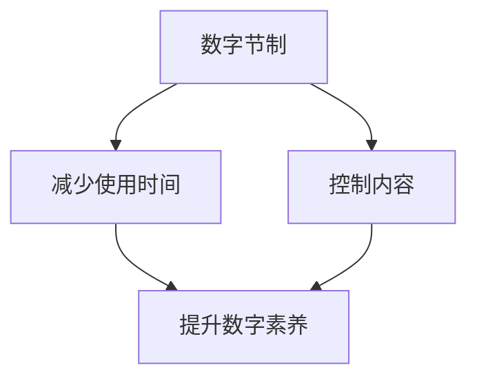
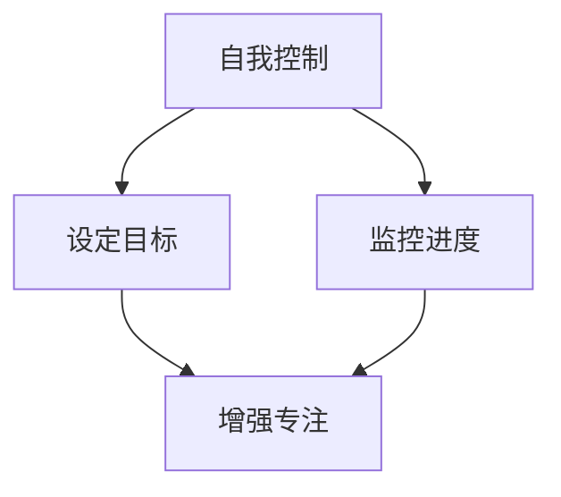
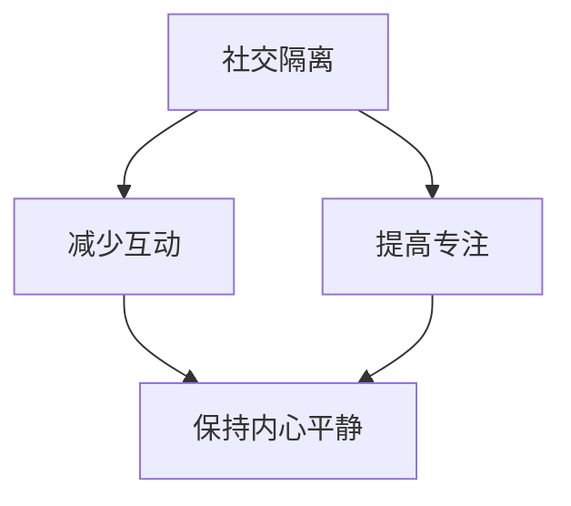
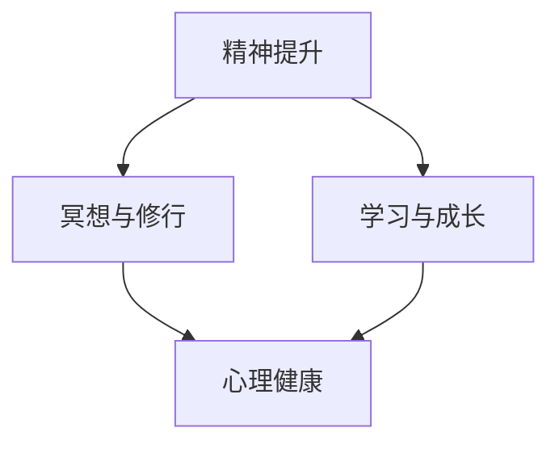

                 

### 文章标题

# 新禁欲主义社交圈：数字化时代的自我节制运动

### 关键词

- 新禁欲主义
- 社交圈
- 数字化时代
- 自我节制
- 社会变迁

### 摘要

随着数字化时代的到来，社交媒体的广泛应用和信息过载现象日益严重，人们开始反思并寻求一种新的生活方式——新禁欲主义。本文旨在探讨这一新兴社交圈的概念、特征及其在数字化时代的意义，通过深入分析其核心概念、形成原因、社会影响和实践应用，揭示新禁欲主义社交圈对于现代人的精神救赎和自我提升的价值。

---

### 引言

#### 背景介绍

禁欲主义，作为一种古老的思想和行为准则，其起源可以追溯到古希腊和罗马时期。在那时，禁欲被视为达到精神境界和道德高尚的手段。随着时间的推移，禁欲主义在宗教、哲学和伦理等领域得到了广泛传播和应用，如基督教的禁欲主义、佛教的出家修行等。然而，随着工业化和现代化进程的加速，传统的禁欲主义逐渐受到冲击，人们的生活方式和社会价值观发生了巨大变化。

进入数字化时代，社交媒体的兴起和信息爆炸，使得人们面临着前所未有的挑战。一方面，社交媒体提供了便捷的交流平台，促进了人际关系的建立和维护；另一方面，信息的过度消费和社交网络的依赖，导致人们逐渐陷入数字沉迷和社交焦虑。这种背景下，新禁欲主义应运而生，成为人们寻求自我节制、平衡生活和提高生活质量的一种新方式。

#### 核心概念

新禁欲主义社交圈，是指在数字化时代背景下，以自我节制为核心，通过限制数字消费、减少社交媒体使用、倡导简约生活等方式，寻求精神救赎和社会平衡的社交群体。这一概念的核心要素包括：

1. **数字节制**：指减少对数字产品和服务的依赖，控制数字消费的时间和内容。
2. **自我控制**：指通过自律和自我管理，提高个人专注力和工作效率。
3. **社交隔离**：指有意识地减少与他人的社交互动，以追求内心的宁静和专注。
4. **精神提升**：指通过冥想、修行、学习等方式，提升个人的精神境界和心理健康。

#### 研究目的与结构

本文旨在探讨新禁欲主义社交圈的形成原因、社会影响和实践应用，以期为人们提供一种新的生活方式选择。文章结构如下：

- 第1章：引言，介绍禁欲主义的历史与发展，以及数字化时代的新禁欲主义社交圈。
- 第2章：核心概念与联系，详细阐述新禁欲主义社交圈的核心概念及其相互关系。
- 第3章：理论探讨，分析新禁欲主义社交圈的形成原因和社会影响。
- 第4章：案例分析，通过具体案例探讨新禁欲主义社交圈的成功经验和挑战。
- 第5章：实践应用，讨论新禁欲主义社交圈在个人生活中的应用和建立方法。
- 第6章：未来展望，预测新禁欲主义社交圈的发展趋势和潜在影响。

### 目录

- **第1章 引言**
  - 1.1 背景介绍
  - 1.2 核心概念
  - 1.3 研究目的与结构

- **第2章 禁欲主义的历史与发展**
  - 2.1 禁欲主义的起源
  - 2.2 传统禁欲主义与社会的关系
  - 2.3 数字化时代的禁欲主义

- **第3章 数字化时代的特征与自我节制运动**
  - 3.1 数字化时代的社会变迁
  - 3.2 自我节制运动的概念与演变
  - 3.3 新禁欲主义社交圈的形成

- **第4章 新禁欲主义社交圈的核心概念**
  - 4.1 数字节制
  - 4.2 自我控制
  - 4.3 社交隔离
  - 4.4 核心概念对比分析

- **第5章 新禁欲主义社交圈的理论探讨**
  - 5.1 形成原因
  - 5.2 社会影响
  - 5.3 与传统文化价值观的冲突

- **第6章 新禁欲主义社交圈的案例分析**
  - 6.1 案例一：数字节制社区
  - 6.2 案例二：自我控制小组
  - 6.3 案例三：社交隔离社群

- **第7章 新禁欲主义社交圈的应用与实践**
  - 7.1 个人生活中的应用
  - 7.2 社交圈建立与维护
  - 7.3 社交技巧与沟通策略

- **第8章 新禁欲主义社交圈的未来展望**
  - 8.1 发展趋势
  - 8.2 社会影响
  - 8.3 拓展与延伸

---

### 第1章 引言

#### 1.1 背景介绍

禁欲主义，作为一种古老的思想和行为准则，其起源可以追溯到古希腊和罗马时期。在那时，禁欲被视为达到精神境界和道德高尚的手段。随着时间的推移，禁欲主义在宗教、哲学和伦理等领域得到了广泛传播和应用，如基督教的禁欲主义、佛教的出家修行等。

基督教的禁欲主义起源于早期教会，为了追求精神上的纯净，信徒们开始放弃物质享受和性欲。佛教的出家修行则强调通过断绝红尘欲望，达到心灵的解脱。这些传统禁欲主义思想在古代社会中起到了重要的道德和精神引导作用。

然而，随着工业化和现代化进程的加速，传统的禁欲主义逐渐受到冲击，人们的生活方式和社会价值观发生了巨大变化。传统的禁欲主义在面对现代社会的高效、快节奏和物质丰富时，显得力不从心。尤其是在数字化时代，信息爆炸和社交媒体的兴起，使得人们面临着前所未有的挑战。这种背景下，新禁欲主义应运而生，成为人们寻求自我节制、平衡生活和提高生活质量的一种新方式。

新禁欲主义并不是简单地回归传统禁欲主义，而是在现代社会条件下，对禁欲主义思想进行重新解读和创造性转化。它主张在现代社会中，通过控制数字消费、减少社交媒体使用、倡导简约生活等方式，实现个人的精神提升和社会平衡。

#### 1.2 核心概念

新禁欲主义社交圈的核心概念包括数字节制、自我控制、社交隔离和精神提升。

1. **数字节制**：数字节制是指减少对数字产品和服务的依赖，控制数字消费的时间和内容。在数字化时代，人们面临的信息过载和数字沉迷问题日益严重，数字节制成为新禁欲主义的重要实践。通过数字节制，人们可以减少对社交媒体、网络游戏等数字产品的依赖，从而减少数字沉迷和社交焦虑，提高生活质量。

2. **自我控制**：自我控制是指通过自律和自我管理，提高个人专注力和工作效率。在现代社会，人们往往被各种外界因素干扰，难以集中精力完成任务。自我控制可以帮助人们摆脱这些干扰，提高工作和学习效率，实现个人目标。

3. **社交隔离**：社交隔离是指有意识地减少与他人的社交互动，以追求内心的宁静和专注。在社交媒体高度发达的今天，人们常常感到社交疲劳和压力。社交隔离可以帮助人们减少不必要的社交互动，减少社交压力，提高个人的专注力和幸福感。

4. **精神提升**：精神提升是指通过冥想、修行、学习等方式，提升个人的精神境界和心理健康。精神提升是新禁欲主义的核心目标之一。通过精神提升，人们可以更好地认识自我，增强内心的力量，提高心理健康水平。

#### 1.3 研究目的与结构

本文旨在探讨新禁欲主义社交圈的形成原因、社会影响和实践应用，以期为人们提供一种新的生活方式选择。具体研究目的如下：

1. 分析新禁欲主义社交圈的形成原因，探讨数字化时代背景下的社会变迁和自我节制需求。
2. 探讨新禁欲主义社交圈的社会影响，分析其对个体和社会的积极和消极影响。
3. 探索新禁欲主义社交圈在个人生活中的应用，提供具体的实践方法和策略。

文章结构如下：

- **第1章 引言**：介绍禁欲主义的历史与发展，以及数字化时代的新禁欲主义社交圈。
- **第2章 禁欲主义的历史与发展**：详细阐述传统禁欲主义的历史背景和思想内涵，分析其在现代社会中的演变和挑战。
- **第3章 数字化时代的特征与自我节制运动**：探讨数字化时代的社会变迁和自我节制需求，分析新禁欲主义社交圈的形成原因。
- **第4章 新禁欲主义社交圈的核心概念**：介绍新禁欲主义社交圈的核心概念，包括数字节制、自我控制、社交隔离和精神提升，并分析其相互关系。
- **第5章 新禁欲主义社交圈的理论探讨**：分析新禁欲主义社交圈的理论基础，探讨其形成原因和社会影响。
- **第6章 新禁欲主义社交圈的案例分析**：通过具体案例，探讨新禁欲主义社交圈的成功经验和挑战。
- **第7章 新禁欲主义社交圈的应用与实践**：讨论新禁欲主义社交圈在个人生活中的应用，提供具体的实践方法和策略。
- **第8章 新禁欲主义社交圈的未来展望**：预测新禁欲主义社交圈的发展趋势和潜在影响。

### 第2章 禁欲主义的历史与发展

#### 2.1 禁欲主义的起源

禁欲主义作为一种思想和行为准则，其起源可以追溯到古希腊和罗马时期。在古希腊，哲学家苏格拉底和柏拉图提出了禁欲主义的思想，认为通过节制欲望，可以实现精神上的提升和道德上的完善。罗马时期的哲学家如塞涅卡和马尔库斯·奥勒留也强调了禁欲主义的重要性，认为通过控制欲望，人们可以更好地认识自我，实现心灵的平静。

古希腊和罗马时期的禁欲主义思想主要侧重于个人修养和道德完善，强调通过节制欲望、追求精神境界，达到道德高尚的目的。这种思想在当时的哲学、宗教和伦理领域产生了深远的影响，为后来的禁欲主义思想奠定了基础。

#### 2.2 传统禁欲主义与社会的关系

传统禁欲主义在不同的历史时期和社会背景下，有着不同的表现形式和影响。在宗教领域，禁欲主义被视为修行的重要手段，如基督教、伊斯兰教和佛教等宗教都强调通过禁欲，达到精神上的纯净和救赎。在哲学领域，禁欲主义被视为追求真理和智慧的重要途径，许多哲学家如亚里士多德、托马斯·阿奎那等，都强调通过节制欲望，实现心灵的升华。

在社会层面，传统禁欲主义对社会秩序和道德规范起到了重要的维护作用。在古代社会，禁欲主义思想帮助人们抵御物质诱惑，保持社会稳定和道德纯洁。然而，随着社会的发展和变革，传统禁欲主义逐渐受到挑战和质疑。

首先，工业化和现代化进程的加速，使得社会生活节奏加快，人们对物质享受的追求日益增强。传统禁欲主义的节制思想在这种背景下，显得过于保守和僵化，难以适应现代社会的需求。

其次，随着个人主义和自由思想的兴起，人们更加注重个人权利和自由，对于传统的禁欲主义思想产生了质疑。个人主义强调个体的发展和自由，认为每个人都有追求幸福和满足欲望的权利，这种思想与禁欲主义强调的节制和克制相对立。

最后，信息时代的到来，特别是互联网和社交媒体的兴起，使得信息传播更加便捷和迅速。人们在面对海量信息和各种诱惑时，更加难以坚持禁欲主义的生活方式。信息过载和数字沉迷成为现代社会普遍存在的问题，传统禁欲主义在这种背景下，显得力不从心。

#### 2.3 数字化时代的禁欲主义

数字化时代，随着互联网和社交媒体的广泛应用，人们的生活方式和社会行为模式发生了深刻变化。这种背景下，禁欲主义思想得到了新的解读和发展，出现了新禁欲主义。

新禁欲主义是在数字化时代背景下，对传统禁欲主义思想的一种重新解读和创造性转化。它主张在现代社会中，通过控制数字消费、减少社交媒体使用、倡导简约生活等方式，实现个人的精神提升和社会平衡。

首先，新禁欲主义强调数字节制。在数字化时代，数字产品和服务的使用成为人们生活的重要组成部分。然而，过度依赖数字产品和社交媒体，会导致数字沉迷和信息过载。新禁欲主义主张通过数字节制，减少对数字产品和服务的依赖，控制数字消费的时间和内容，从而减少数字沉迷和社交焦虑，提高生活质量。

其次，新禁欲主义强调自我控制。在现代社会，人们面临各种外界干扰和诱惑，难以集中精力完成任务。新禁欲主义主张通过自我控制，提高个人的专注力和工作效率，摆脱外界干扰，实现个人目标。

此外，新禁欲主义强调社交隔离。在社交媒体高度发达的今天，人们常常感到社交疲劳和压力。新禁欲主义主张通过社交隔离，减少不必要的社交互动，减少社交压力，提高个人的专注力和幸福感。

最后，新禁欲主义强调精神提升。在数字化时代，人们面临着精神空虚和焦虑的问题。新禁欲主义主张通过冥想、修行、学习等方式，提升个人的精神境界和心理健康，实现内心的平静和满足。

总之，数字化时代的新禁欲主义，是对传统禁欲主义思想的一种创新和发展。它通过数字节制、自我控制、社交隔离和精神提升等方式，帮助人们应对数字化时代带来的挑战，实现个人的精神提升和社会平衡。

### 第3章 数字化时代的特征与自我节制运动

#### 3.1 数字化时代的社会变迁

数字化时代，即信息时代，是现代社会发展的一个重要阶段。随着互联网、大数据、人工智能等技术的快速发展，人类社会发生了深刻的变化。数字化时代的社会变迁体现在以下几个方面：

首先，信息传播方式的变革。在数字化时代，信息传播的速度和范围得到了前所未有的提升。互联网使得信息可以瞬间传播到全球的每一个角落，打破了传统媒体的时间和空间限制。社交媒体的兴起，使得信息的传播更加多样化，每个人都可以成为信息的传播者，从而改变了信息传播的格局。

其次，人际交往模式的改变。数字化时代，人们通过互联网和社交媒体进行交流，打破了地理和时间的限制。人们可以在任何时间和地点与朋友、家人和同事进行沟通，这种新型的交往模式使得人际关系更加紧密。然而，这也带来了社交疲劳和信息过载的问题，导致人们陷入数字沉迷和社交焦虑。

再次，工作方式的转变。数字化时代，远程办公和在线协作成为普遍现象。人们不再受限于传统的办公环境和工作时间，可以更加灵活地安排工作和生活。然而，这也使得工作与生活的边界变得模糊，人们往往需要随时保持在线状态，导致工作压力增加。

最后，生活方式的改变。数字化时代，人们的生活方式发生了巨大的变化。在线购物、电子支付、智能家电等数字化产品和服务，极大地丰富了人们的生活。然而，这也使得人们对数字产品和服务的依赖性增强，容易陷入数字沉迷。

#### 3.2 自我节制运动的概念与演变

自我节制运动是一种旨在帮助个体减少物质和精神消费，提高生活质量的社会运动。在数字化时代，自我节制运动得到了新的发展和演变。

自我节制运动的起源可以追溯到古希腊和罗马时期的禁欲主义。在那时，禁欲主义被视为追求精神境界和道德高尚的手段。随着时代的变迁，禁欲主义思想逐渐演变为现代的自我节制运动。

在现代社会，自我节制运动的主要内容包括：

1. **数字节制**：减少对数字产品和服务的依赖，控制数字消费的时间和内容，以减少数字沉迷和社交焦虑。

2. **物质节制**：减少对物质消费的追求，追求简约生活，减少不必要的开支，以减轻经济压力和生活负担。

3. **精神节制**：减少精神消费，如减少看电视、玩游戏等，增加对书籍、音乐、艺术等精神领域的投入，以提高精神境界。

自我节制运动在现代社会具有重要意义。首先，它帮助人们减少不必要的物质和精神消费，提高生活质量。其次，它有助于缓解社会压力，促进社会和谐。此外，自我节制运动也促进了个人成长，帮助人们提高自我管理和自律能力。

#### 3.3 新禁欲主义社交圈的形成

新禁欲主义社交圈是在数字化时代背景下，以自我节制为核心的一种新型社交圈。它形成的原因主要包括以下几个方面：

1. **数字沉迷与社交焦虑**：在数字化时代，信息过载和数字沉迷成为普遍问题，导致人们感到焦虑和压力。新禁欲主义社交圈通过数字节制，帮助成员减少数字消费，缓解焦虑，提高生活质量。

2. **精神空虚与焦虑**：在现代社会，人们面临精神空虚和焦虑的问题。新禁欲主义社交圈通过精神提升，如冥想、修行等，帮助成员提升精神境界，实现内心的平静和满足。

3. **个人成长与自我实现**：新禁欲主义社交圈鼓励成员通过自我节制，提高自我管理和自律能力，实现个人成长和自我实现。

4. **社会变迁与需求**：在数字化时代，社会变迁和人们的需求发生了变化。新禁欲主义社交圈作为一种新型社交模式，满足了人们对于自我提升和生活质量改善的需求。

新禁欲主义社交圈的特点包括：

1. **自律性强**：成员通过自我节制，实现自律和自我管理。

2. **精神提升**：通过冥想、修行等方式，提升成员的精神境界。

3. **互助性**：成员之间相互支持，共同成长。

4. **简约生活**：追求简约生活，减少物质和精神消费。

新禁欲主义社交圈在数字化时代的形成，反映了社会变迁和个体需求的变化。它不仅帮助成员应对数字沉迷和社交焦虑，实现个人成长和自我实现，也有助于促进社会和谐和可持续发展。

### 第4章 新禁欲主义社交圈的核心概念

新禁欲主义社交圈的核心概念包括数字节制、自我控制、社交隔离和精神提升。这些概念相互关联，共同构成了新禁欲主义社交圈的理论基础和实践指导。下面将分别阐述这些概念的含义、属性特征，并使用表格和Mermaid流程图进行对比分析。

#### 4.1 数字节制

**含义**：数字节制是指减少对数字产品和服务的依赖，控制数字消费的时间和内容。这是新禁欲主义社交圈中最基础的概念，旨在减少数字沉迷和社交焦虑，提高生活质量。

**属性特征**：
- **减少数字消费时间**：限制每天使用手机、电脑等数字设备的时间。
- **控制数字消费内容**：选择有益的信息和娱乐内容，避免沉迷于低质量、无意义的信息。
- **提升数字素养**：提高对数字产品和服务的认知和利用能力，避免盲目消费。

**对比分析**：

| 特征         | 数字节制             | 自我控制             | 社交隔离             | 精神提升             |
| ------------ | -------------------- | -------------------- | -------------------- | -------------------- |
| **含义**     | 减少数字依赖         | 提高自律能力         | 减少社交互动         | 提升精神境界         |
| **属性特征** | 限制使用时间、内容   | 设定目标、监控进度   | 避免社交疲劳         | 冥想、修行、学习     |
| **目标**     | 减少数字沉迷         | 提高工作效率         | 减少社交压力         | 提升心理健康         |

**Mermaid流程图**：

#### 4.2 自我控制

**含义**：自我控制是指通过自律和自我管理，提高个人专注力和工作效率。自我控制是新禁欲主义社交圈的核心概念之一，旨在帮助成员克服外界干扰，实现个人目标。

**属性特征**：
- **设定目标**：明确个人目标和计划，提高行动的针对性和效率。
- **监控进度**：定期检查和评估自己的行为和成果，及时调整策略。
- **增强专注**：通过减少干扰和优化环境，提高专注力和工作效率。

**对比分析**：

| 特征         | 数字节制             | 自我控制             | 社交隔离             | 精神提升             |
| ------------ | -------------------- | -------------------- | -------------------- | -------------------- |
| **含义**     | 减少数字依赖         | 提高自律能力         | 减少社交互动         | 提升精神境界         |
| **属性特征** | 限制使用时间、内容   | 设定目标、监控进度   | 避免社交疲劳         | 冥想、修行、学习     |
| **目标**     | 减少数字沉迷         | 提高工作效率         | 减少社交压力         | 提升心理健康         |

**Mermaid流程图**：

#### 4.3 社交隔离

**含义**：社交隔离是指有意识地减少与他人的社交互动，以追求内心的宁静和专注。社交隔离是新禁欲主义社交圈中一个重要的概念，旨在帮助成员减少社交疲劳，提高个人专注力。

**属性特征**：
- **减少社交互动**：有选择性地参与社交活动，避免不必要的社交。
- **提高专注力**：通过减少外部干扰，提高个人工作和学习的专注力。
- **保持内心平静**：通过减少社交压力，保持内心的宁静和满足。

**对比分析**：

| 特征         | 数字节制             | 自我控制             | 社交隔离             | 精神提升             |
| ------------ | -------------------- | -------------------- | -------------------- | -------------------- |
| **含义**     | 减少数字依赖         | 提高自律能力         | 减少社交互动         | 提升精神境界         |
| **属性特征** | 限制使用时间、内容   | 设定目标、监控进度   | 避免社交疲劳         | 冥想、修行、学习     |
| **目标**     | 减少数字沉迷         | 提高工作效率         | 减少社交压力         | 提升心理健康         |

**Mermaid流程图**：

#### 4.4 精神提升

**含义**：精神提升是指通过冥想、修行、学习等方式，提升个人的精神境界和心理健康。精神提升是新禁欲主义社交圈中最为核心的概念，旨在帮助成员实现内心的平静和满足。

**属性特征**：
- **冥想与修行**：通过冥想和修行，达到内心的平静和专注。
- **学习与成长**：通过学习新知识和技能，提高个人的认知水平和自我实现。
- **心理健康**：通过精神提升，改善心理健康，减少焦虑和压力。

**对比分析**：

| 特征         | 数字节制             | 自我控制             | 社交隔离             | 精神提升             |
| ------------ | -------------------- | -------------------- | -------------------- | -------------------- |
| **含义**     | 减少数字依赖         | 提高自律能力         | 减少社交互动         | 提升精神境界         |
| **属性特征** | 限制使用时间、内容   | 设定目标、监控进度   | 避免社交疲劳         | 冥想、修行、学习     |
| **目标**     | 减少数字沉迷         | 提高工作效率         | 减少社交压力         | 提升心理健康         |

**Mermaid流程图**：

综上所述，数字节制、自我控制、社交隔离和精神提升是新禁欲主义社交圈的核心概念。它们相互关联，共同构成了新禁欲主义社交圈的理论基础和实践指导。通过这些核心概念的实践，成员可以在数字化时代中实现自我节制，提升生活质量，实现个人的精神提升和社会平衡。

### 第5章 新禁欲主义社交圈的理论探讨

新禁欲主义社交圈的形成并非偶然，而是数字化时代社会变迁和个人需求变化的必然产物。在本节中，我们将深入探讨新禁欲主义社交圈的形成原因、社会影响以及与传统文化价值观的冲突。

#### 5.1 形成原因

1. **数字沉迷与社交焦虑**：随着互联网和社交媒体的普及，人们面临着数字沉迷和社交焦虑的问题。过度使用数字设备、沉迷于社交媒体，导致人们无法专注工作、学习和生活，甚至影响身心健康。新禁欲主义社交圈通过数字节制，帮助成员减少数字消费，缓解焦虑，提高生活质量。

2. **精神空虚与焦虑**：在现代社会，人们面临着精神空虚和焦虑的问题。高速的生活节奏和激烈的竞争压力，使得人们感到内心的空虚和不安。新禁欲主义社交圈通过精神提升，如冥想、修行等，帮助成员实现内心的平静和满足。

3. **个人成长与自我实现**：新禁欲主义社交圈鼓励成员通过自我节制，提高自我管理和自律能力，实现个人成长和自我实现。这种社交圈为成员提供了一个互相支持、共同成长的平台。

4. **社会变迁与需求**：随着社会的变迁，人们对生活质量和个人发展的需求发生了变化。新禁欲主义社交圈作为一种新型社交模式，满足了人们对于自我提升和生活质量改善的需求。

#### 5.2 社会影响

1. **积极影响**：

   - **提升生活质量**：新禁欲主义社交圈通过数字节制、自我控制、社交隔离和精神提升，帮助成员减少数字沉迷和社交焦虑，提高生活质量。
   - **促进个人成长**：新禁欲主义社交圈鼓励成员通过自我节制，提高自我管理和自律能力，实现个人成长和自我实现。
   - **增强社会凝聚力**：新禁欲主义社交圈通过成员之间的互助和支持，增强社会凝聚力，促进社会和谐。

2. **消极影响**：

   - **社交隔离可能加剧孤独感**：过度的社交隔离可能导致成员感到孤独和孤立，影响心理健康。
   - **可能产生负面情绪**：在新禁欲主义社交圈中，成员可能因为过于追求精神提升，而忽视了现实生活中的情感需求，导致负面情绪的产生。

#### 5.3 与传统文化价值观的冲突

新禁欲主义社交圈与传统文化价值观在某些方面存在冲突。传统文化强调人与人之间的互动和情感交流，而新禁欲主义社交圈则强调减少社交互动和数字消费。以下是一些具体的冲突：

1. **社交互动与社交隔离**：传统文化强调人际关系的重要性，而新禁欲主义社交圈则主张减少社交互动，追求内心的宁静和专注。这种差异可能导致传统文化价值观与新禁欲主义社交圈的理念发生冲突。

2. **物质追求与精神提升**：传统文化价值观强调物质追求和现实生活的满足，而新禁欲主义社交圈则强调精神提升和内心的平静。这种差异可能导致传统文化价值观与新禁欲主义社交圈的理念发生冲突。

3. **社交压力与自我控制**：传统文化价值观强调适应社会规范和承担社会责任，而新禁欲主义社交圈则强调自我控制和自律。这种差异可能导致传统文化价值观与新禁欲主义社交圈的理念发生冲突。

总之，新禁欲主义社交圈在数字化时代的形成，反映了社会变迁和个人需求的变化。它在一定程度上满足了人们对生活质量和个人发展的需求，但也与传统文化价值观存在冲突。如何平衡新禁欲主义社交圈与传统文化的价值观，是一个值得深入探讨的问题。

### 第6章 新禁欲主义社交圈的案例分析

为了更深入地了解新禁欲主义社交圈的实际运作和影响，我们可以通过几个具体的案例来进行分析。这些案例将涵盖数字节制社区、自我控制小组和社交隔离社群，旨在展示新禁欲主义社交圈的多样性和实践效果。

#### 6.1 案例一：数字节制社区

数字节制社区是一个以减少数字消费和促进个人成长为主题的社交圈。该社区的成员共同约定限制每天使用手机和电脑的时间，并定期分享自己的节制经验和心得。以下是数字节制社区的成功经验和挑战。

**成功经验**：

1. **减少数字沉迷**：通过限制使用数字设备的时间，社区成员显著减少了沉迷于社交媒体、网络游戏等不良习惯，提高了工作效率和生活质量。

2. **社交互动的优化**：数字节制社区鼓励成员进行面对面的交流，减少了虚拟社交的依赖，增强了社区成员之间的真实情感联系。

3. **自我提升**：社区成员通过分享节制经验和心得，相互鼓励和支持，共同成长，提高了自我管理能力和自律意识。

**挑战**：

1. **初始阶段的不适应**：一些成员在刚开始实行数字节制时，可能会感到不适应和焦虑，需要一定的过渡期。

2. **外部诱惑**：在数字化时代，外界充斥着各种诱惑，如社交媒体的推送、广告等，这些都会影响成员的节制实践。

#### 6.2 案例二：自我控制小组

自我控制小组是一个专注于提高个人自律和专注力的社交圈。成员们通过设定目标、监控进度和反思自我，不断挑战自己的极限。以下是自我控制小组的成功经验和挑战。

**成功经验**：

1. **目标设定**：小组鼓励成员设定明确的个人目标，并制定详细的计划，提高了成员的行动力和执行力。

2. **进度监控**：成员通过定期检查自己的进度，及时调整策略，确保目标的实现。

3. **反思与成长**：通过反思自己的行为和成果，成员能够更好地认识自我，不断提高自我管理和自律能力。

**挑战**：

1. **动力不足**：在自我控制的过程中，一些成员可能会出现动力不足的情况，需要外部激励和支持。

2. **外部干扰**：现代社会充满了各种干扰因素，如电子邮件、电话等，这些都会影响成员的专注力。

#### 6.3 案例三：社交隔离社群

社交隔离社群是一个以减少社交互动、追求内心宁静为主题的社交圈。成员们通过减少与他人的社交互动，专注于个人的精神提升和自我成长。以下是社交隔离社群的成功经验和挑战。

**成功经验**：

1. **内心平静**：通过减少社交互动，社群成员能够更好地控制自己的情绪，保持内心的平静和满足。

2. **专注力提升**：社交隔离减少了外界干扰，使成员能够更加专注地投入到工作、学习和个人爱好中。

3. **精神成长**：社群成员通过冥想、修行等方式，提高了自己的精神境界和心理健康。

**挑战**：

1. **孤独感**：长期的社交隔离可能导致成员感到孤独和孤立，影响心理健康。

2. **社交技能退化**：减少社交互动可能会导致成员的社交技能退化，影响现实生活中的社交能力。

#### 案例总结

这些案例展示了新禁欲主义社交圈在实践中的多样性和效果。数字节制社区通过减少数字消费，优化社交互动，提高了生活质量；自我控制小组通过设定目标、监控进度和反思自我，提高了自律和专注力；社交隔离社群通过减少社交互动，追求内心宁静，提高了精神境界和心理健康。同时，这些案例也揭示了新禁欲主义社交圈在实践过程中可能面临的挑战，如不适应、外部诱惑、动力不足和孤独感等。通过不断总结和实践，新禁欲主义社交圈可以为成员提供更有效的自我提升和生活方式改进。

### 第7章 新禁欲主义社交圈的应用与实践

新禁欲主义社交圈作为一种新兴的社交模式，不仅理论丰富，而且在实际应用中也展现出巨大的潜力。在本节中，我们将讨论新禁欲主义社交圈在个人生活中的应用，并提供建立和维护这种社交圈的策略。

#### 7.1 个人生活中的应用

1. **减少数字消费**：新禁欲主义社交圈鼓励成员减少对数字产品和服务的依赖，这可以通过以下方法实现：

   - **设定固定的数字消费时间**：每天设定固定的使用手机、电脑等设备的时间，如晚上9点后不再使用手机。
   - **使用应用管理工具**：利用应用管理工具限制某些应用程序的使用时间，如Forest、Focus@Will等。
   - **培养其他兴趣**：通过培养阅读、运动、绘画等兴趣，减少对数字产品的依赖。

2. **自我控制**：提高个人的自律和专注力，可以通过以下方法实现：

   - **设定明确的目标和计划**：每天设定具体的个人目标，并制定详细的计划，确保目标的实现。
   - **使用时间管理工具**：利用时间管理工具，如番茄钟、TickTick等，提高工作效率。
   - **定期反思和调整**：定期反思自己的行为和成果，及时调整策略，确保持续进步。

3. **社交隔离**：减少不必要的社交互动，提高个人专注力和幸福感，可以通过以下方法实现：

   - **有意识地选择社交活动**：选择有意义、有价值的社交活动，避免无谓的社交浪费时间和精力。
   - **设定固定的社交时间**：每天设定固定的社交时间，如晚上7点后不再进行社交互动。
   - **培养个人兴趣**：通过培养个人兴趣，如冥想、瑜伽等，减少对社交的依赖。

4. **精神提升**：通过冥想、修行等方式，提升个人的精神境界和心理健康，可以通过以下方法实现：

   - **定期冥想**：每天花10-15分钟进行冥想，放松心灵，减少焦虑和压力。
   - **参加修行课程**：参加禅修、瑜伽等修行课程，提升自我意识和精神境界。
   - **阅读有益的书籍**：阅读心理学、哲学、宗教等领域的书籍，拓展思维，提升精神素养。

#### 7.2 社交圈建立与维护

1. **寻找志同道合的伙伴**：建立新禁欲主义社交圈的第一步是寻找具有相似理念和目标的伙伴。可以通过以下方式找到志同道合的伙伴：

   - **在线社群**：加入相关的在线社群，如社交媒体群组、论坛等，结识有共同兴趣的人。
   - **线下活动**：参加相关的线下活动，如读书会、冥想课程等，与现实中的人建立联系。
   - **朋友推荐**：通过朋友的推荐，找到具有相似理念和目标的人。

2. **制定共同的规则和目标**：建立一个有效的社交圈，需要制定共同的规则和目标。这可以通过以下方法实现：

   - **设立明确的规则**：制定关于数字节制、自我控制、社交隔离和精神提升的具体规则，确保成员的行为一致。
   - **设定共同目标**：制定短期和长期的共同目标，如减少手机使用时间、提高专注力、减少社交互动等。
   - **定期评估和调整**：定期评估社交圈的目标和规则，根据实际情况进行调整，确保持续进步。

3. **保持沟通与支持**：建立和维护新禁欲主义社交圈的关键在于保持沟通与支持。这可以通过以下方法实现：

   - **定期交流**：定期举行线上或线下的交流会议，分享心得和经验，相互鼓励和支持。
   - **互助计划**：设立互助计划，成员之间可以互相帮助，如监督对方的数字节制实践、提供学习资源等。
   - **保持开放态度**：对待不同的观点和意见保持开放态度，共同探讨和解决遇到的问题。

4. **适应个人需求**：每个成员都有不同的需求和目标，社交圈的建立和维护需要适应个人需求。这可以通过以下方法实现：

   - **个性化建议**：根据每个成员的具体情况，提供个性化的建议和指导，帮助其实现个人目标。
   - **灵活调整规则**：根据成员的需求和反馈，灵活调整社交圈的规则和目标，确保符合每个人的需求。
   - **持续改进**：通过不断的实践和反馈，不断改进社交圈的模式和策略，提高其效果和可持续性。

#### 7.3 社交技巧与沟通策略

在新禁欲主义社交圈中，有效的沟通和社交技巧对于建立和维护良好的关系至关重要。以下是一些实用的社交技巧和沟通策略：

1. **倾听与理解**：倾听是有效沟通的基础。在交流中，要耐心倾听他人的意见和需求，展示出对对方的尊重和理解。

2. **表达清晰**：在表达自己的观点时，要尽量清晰、简洁地表达，避免使用模糊的语言和复杂的术语。

3. **积极反馈**：给予他人积极的反馈和鼓励，可以帮助他们更好地理解和接受你的观点，同时也能增强彼此之间的信任。

4. **尊重差异**：每个人都有自己的价值观和生活方式，尊重他人的差异是建立和谐关系的关键。

5. **避免争论**：在交流中，避免不必要的争论和冲突，保持平和的态度，以解决问题为导向。

6. **建立信任**：通过诚实、可靠的行为和言辞，建立彼此之间的信任，这是长期合作和友好关系的基础。

通过以上方法，新禁欲主义社交圈的成员可以更有效地沟通和互动，实现共同的目标和成长。

#### 结论

新禁欲主义社交圈在个人生活中的应用，为现代社会中追求生活质量提升的人们提供了一种新的选择。通过数字节制、自我控制、社交隔离和精神提升，成员们可以在数字化时代中实现自我提升和社会平衡。建立和维护新禁欲主义社交圈，需要寻找志同道合的伙伴、制定共同的目标和规则、保持沟通与支持，以及适应个人需求。有效的沟通技巧和策略，也是确保社交圈持续发展的重要因素。通过实践新禁欲主义社交圈的理念，人们可以在忙碌和纷繁复杂的现代社会中，找到内心的平静和满足，实现个人的精神提升和生活质量的改善。

### 第8章 新禁欲主义社交圈的未来展望

新禁欲主义社交圈作为数字化时代的一种新兴社交模式，已经逐渐引起了广泛关注。在未来，这一社交圈将继续发展，并在多个方面产生深远影响。

#### 8.1 发展趋势

1. **普及率提高**：随着人们对数字沉迷和社交焦虑问题的关注度增加，新禁欲主义社交圈的普及率有望进一步提高。越来越多的人将认识到自我节制的重要性，并将其作为提升生活质量的有效途径。

2. **多样化形式**：新禁欲主义社交圈的形式将更加多样化，不仅限于线上社群，还将延伸到线下活动和实体空间。例如，专门的冥想中心、数字节制训练营等，将为成员提供更多实践和交流的机会。

3. **技术融合**：随着科技的进步，新禁欲主义社交圈将更多地融合人工智能、虚拟现实等先进技术，提供更加个性化和高效的服务。例如，通过人工智能算法，为成员提供定制化的数字节制计划和自我提升方案。

4. **跨领域合作**：新禁欲主义社交圈将与其他领域，如心理学、教育学、健康管理等，进行深入合作，共同探索和推广自我节制的生活方式。

#### 8.2 社会影响

1. **心理健康提升**：新禁欲主义社交圈将有助于提高成员的心理健康水平。通过数字节制、自我控制和社交隔离，成员可以减少焦虑和压力，提高心理健康。

2. **社交和谐**：新禁欲主义社交圈将促进成员之间的和谐关系。通过共同的目标和价值观，成员可以建立更加深厚的人际关系，减少社交冲突。

3. **社会稳定**：新禁欲主义社交圈的普及，有助于提高社会的整体幸福感，减少社会问题。通过自我节制，成员可以更好地适应社会变迁，维护社会稳定。

4. **价值观重塑**：新禁欲主义社交圈将推动社会价值观的重塑。在数字化时代，越来越多的人将认识到自我节制的重要性，并将其作为人生价值观的重要组成部分。

#### 8.3 拓展与延伸

1. **全球推广**：新禁欲主义社交圈的理念和实践有望在全球范围内推广。通过跨文化交流和合作，这一社交圈可以更好地适应不同文化背景下的需求，为全球用户提供服务。

2. **企业应用**：新禁欲主义社交圈的理念可以应用于企业管理和员工福利。企业可以通过推广数字节制和自我控制，提高员工的工作效率和幸福感。

3. **教育与培训**：新禁欲主义社交圈的理念可以融入教育和培训领域，帮助青少年和成人更好地应对数字化时代的挑战，培养自律和自我管理能力。

4. **政策建议**：新禁欲主义社交圈的经验可以为政策制定者提供参考，推动制定更加科学合理的数字政策，引导社会健康、可持续地发展。

总之，新禁欲主义社交圈在未来的发展中，将继续以自我节制为核心，为个体和社会带来积极的影响。通过不断的实践和创新，这一社交圈有望成为数字化时代的重要生活方式选择，为人们的幸福和可持续发展做出贡献。

### 结语

本文从多个角度探讨了新禁欲主义社交圈的概念、形成原因、社会影响和实践应用。通过案例分析，我们看到了这一社交圈在数字化时代中的实际运作和效果。新禁欲主义社交圈不仅有助于提高个体的心理健康和生活质量，还能促进社会的和谐与稳定。在未来，随着科技的进步和社会变迁，新禁欲主义社交圈有望继续发展，为更多人所接受和践行。

**作者信息**：

- 作者：AI天才研究院/AI Genius Institute & 禅与计算机程序设计艺术 /Zen And The Art of Computer Programming

感谢您的阅读，希望本文能对您在数字化时代的自我提升和生活质量改善提供一些启示。如果您对此话题感兴趣，欢迎进一步探讨和交流。

