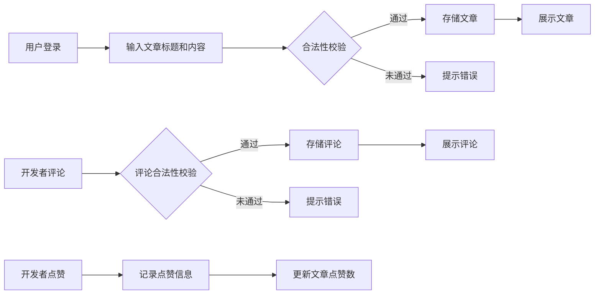
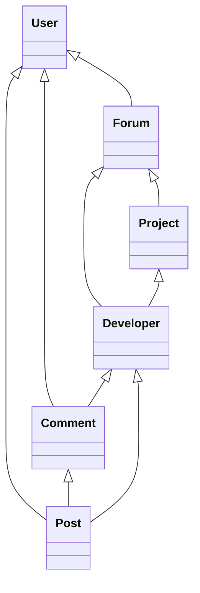
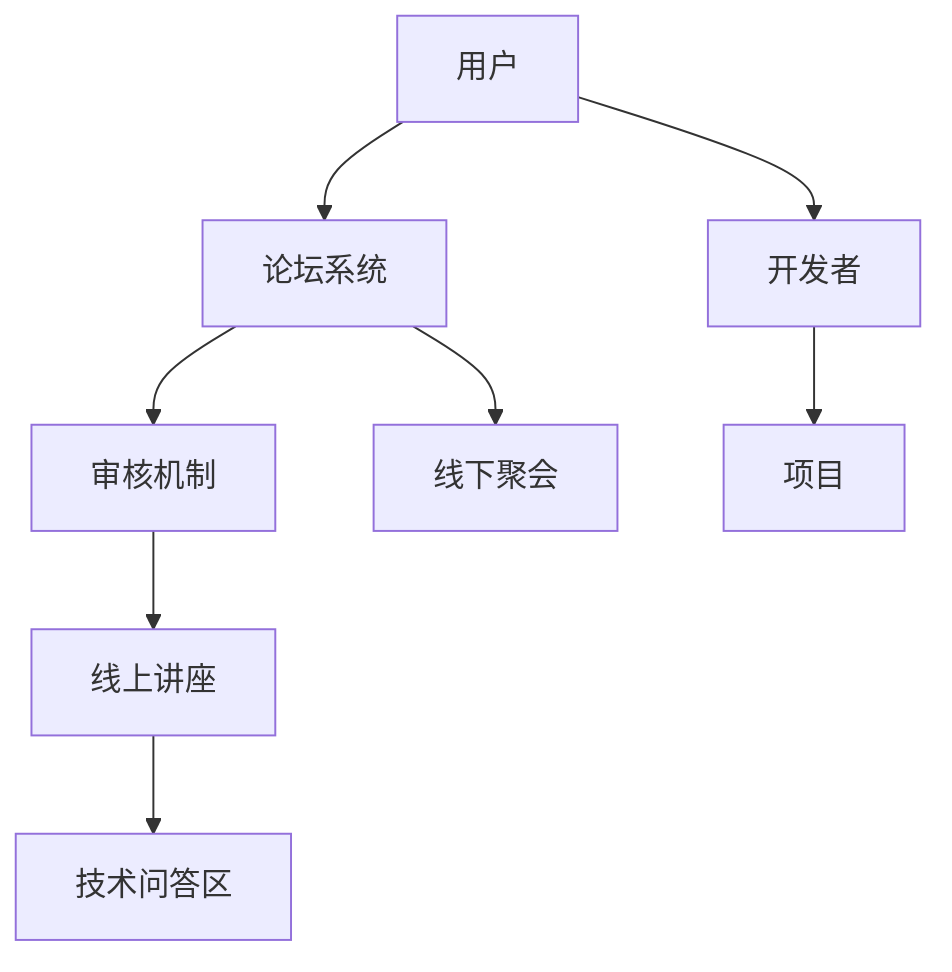
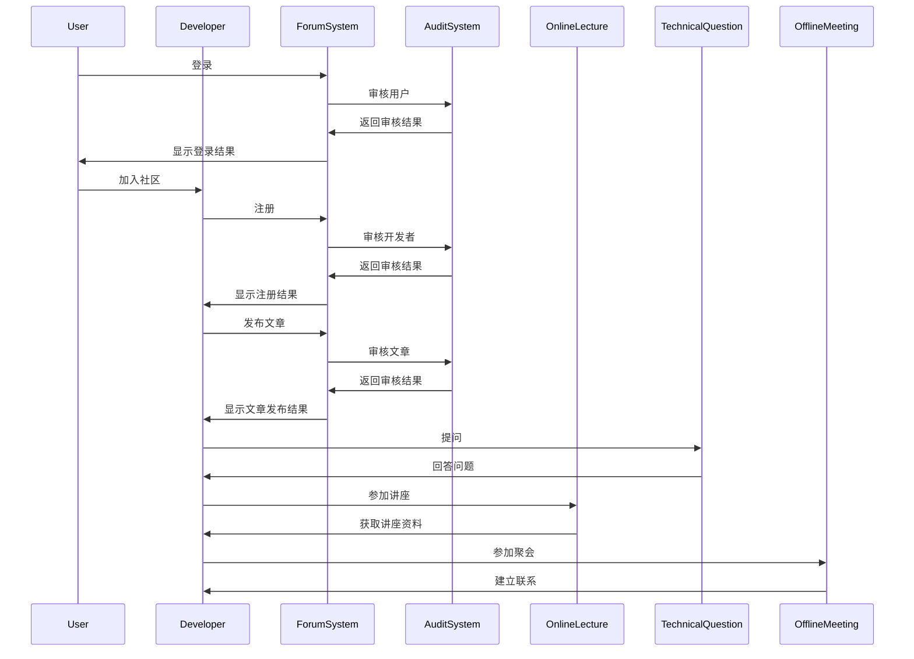

                 

## 新禅修app开发者社区：构建内心平静数字工具的技术论坛

> 关键词：禅修app、开发者社区、技术论坛、内心平静、数字工具、人工智能

> 摘要：本文介绍了新禅修app开发者社区的技术论坛构建过程，探讨了如何通过技术手段为禅修app开发者提供一个高效、实用的交流平台，促进禅修app的创新与发展。

### 第一部分：背景介绍

#### 1.1 问题背景

随着互联网的快速发展，移动设备已经成为人们日常生活中不可或缺的一部分。禅修app作为一种新兴的数字工具，旨在帮助用户培养内心平静，缓解压力。然而，目前市场上禅修app开发者社区相对分散，缺乏一个统一的平台，使得开发者之间的交流与协作变得困难。本节将介绍新禅修app开发者社区的技术论坛构建过程，为开发者提供一个技术交流的平台，促进禅修app的创新与发展。

#### 1.2 问题描述

新禅修app开发者社区的目标是为开发者提供一个技术交流平台，解决以下问题：

1. 如何建立一个高效的技术论坛？
2. 如何确保论坛内容的质量和实用性？
3. 如何促进开发者之间的合作与交流？
4. 如何解决开发者在实际开发过程中遇到的技术难题？

#### 1.3 问题解决

为了解决上述问题，新禅修app开发者社区采用了以下策略：

1. **设计一个易于使用的论坛系统**：论坛系统支持文章发布、评论、点赞等功能，方便开发者进行技术交流。
2. **建立一套严格的审核机制**：对论坛内容进行审核，确保论坛内容的质量和实用性。
3. **邀请行业专家定期举办线上讲座**：分享开发经验与心得，提高开发者技术水平。
4. **设立技术问答区**：为开发者提供技术支持，解答他们在开发过程中遇到的问题。
5. **定期举办线下聚会**：加强开发者之间的交流与互动，建立良好的人际关系。

#### 1.4 边界与外延

新禅修app开发者社区的主要关注点在于禅修app的技术开发，但不限于禅修app的开发者，也欢迎对禅修感兴趣的其他开发者和爱好者参与。此外，社区将不断拓展其领域，覆盖更多与禅修相关的话题，如心理学、佛教文化等。

#### 1.5 概念结构与核心要素组成

新禅修app开发者社区的核心要素包括：

1. **论坛系统**：用于开发者之间的技术交流。
2. **审核机制**：确保论坛内容的质量。
3. **线上讲座**：分享开发经验与心得。
4. **技术问答区**：提供技术支持。
5. **线下聚会**：加强开发者之间的交流与互动。

### 第二部分：核心概念与联系

#### 2.1 核心概念

#### 2.1.1 禅修app

禅修app是一种基于移动互联网的数字工具，旨在帮助用户通过禅修实践培养内心平静。其主要功能包括引导禅修、记录禅修进度、提供禅修知识等。

#### 2.1.2 开发者社区

开发者社区是一个为开发者提供技术交流、分享经验和学习的平台。在新禅修app开发者社区中，开发者可以分享禅修app的开发经验，解决技术难题，共同促进禅修app的发展。

#### 2.2 概念属性特征对比表格

| 概念         | 属性特征                    | 关联关系          |
| ------------ | --------------------------- | ----------------- |
| 禅修app      | - 功能多样<br>- 便于使用<br>- 移动端适配 | - 属于数字工具<br>- 用于禅修实践 |
| 开发者社区   | - 技术交流<br>- 经验分享<br>- 学习资源 | - 属于禅修app开发者平台<br>- 促进禅修app发展 |

#### 2.3 ER实体关系图架构

```mermaid
erDiagram
    User ||--|{ Forum }|-- Developer
    User ||--|{ Post }|-- Post
    Forum ||--|{ Comment }|-- Comment
    Developer ||--|{ Project }|-- Project
```

### 第三部分：算法原理讲解

#### 3.1 论坛系统算法原理

#### 3.1.1 文章发布

1. 开发者登录论坛系统，输入文章标题和内容。
2. 论坛系统对输入内容进行合法性校验，如长度、格式等。
3. 校验通过后，将文章内容存储在数据库中，并生成唯一的文章ID。
4. 将文章展示在论坛首页，供其他开发者查看。

#### 3.1.2 评论功能

1. 开发者对文章进行评论，输入评论内容。
2. 论坛系统对评论内容进行合法性校验。
3. 校验通过后，将评论内容存储在数据库中，并生成唯一的评论ID。
4. 将评论展示在文章下方，供其他开发者查看。

#### 3.1.3 点赞功能

1. 开发者对文章进行点赞。
2. 论坛系统记录点赞信息，更新文章的点赞数。

#### 3.2 算法mermaid流程图



#### 3.3 Python源代码实现

```python
# 文章发布
def publish_post(user_id, title, content):
    if is_valid_content(content):
        post_id = generate_unique_id()
        save_post_to_db(post_id, user_id, title, content)
        show_post_on_homepage(post_id)
    else:
        show_error_message("内容不合法")

# 评论功能
def comment_on_post(post_id, user_id, content):
    if is_valid_content(content):
        comment_id = generate_unique_id()
        save_comment_to_db(comment_id, post_id, user_id, content)
        show_comment_on_post(post_id, comment_id)
    else:
        show_error_message("评论内容不合法")

# 点赞功能
def like_post(post_id, user_id):
    record_like_info(post_id, user_id)
    update_post_like_count(post_id)
```

### 第四部分：系统分析与架构设计方案

#### 4.1 问题场景介绍

随着禅修app开发者数量的不断增加，开发者之间的交流需求日益迫切。为了提高开发效率，降低开发成本，建立一个新的禅修app开发者社区技术论坛成为必要。

#### 4.2 项目介绍

新禅修app开发者社区技术论坛项目旨在构建一个集技术交流、经验分享、问题解决于一体的开发者社区，为开发者提供一个良好的交流平台。

#### 4.3 系统功能设计（领域模型mermaid类图）



#### 4.4 系统架构设计（mermaid架构图）



#### 4.5 系统接口设计和系统交互（mermaid序列图）



### 第五部分：项目实战

#### 5.1 环境安装

在新禅修app开发者社区技术论坛项目中，我们需要安装以下环境：

1. Python 3.8 或以上版本
2. Django 3.2 或以上版本
3. MySQL 5.7 或以上版本
4. Node.js 12.x 或以上版本

#### 5.2 系统核心实现源代码

以下是新禅修app开发者社区技术论坛项目的一些核心实现源代码：

**models.py**

```python
from django.db import models
from django.contrib.auth.models import User

class Post(models.Model):
    user = models.ForeignKey(User, on_delete=models.CASCADE)
    title = models.CharField(max_length=100)
    content = models.TextField()

class Comment(models.Model):
    post = models.ForeignKey(Post, on_delete=models.CASCADE)
    user = models.ForeignKey(User, on_delete=models.CASCADE)
    content = models.TextField()

class Forum(models.Model):
    name = models.CharField(max_length=100)
    description = models.TextField()

class Developer(models.Model):
    user = models.OneToOneField(User, on_delete=models.CASCADE)
    forum = models.ForeignKey(Forum, on_delete=models.CASCADE)
```

**views.py**

```python
from django.shortcuts import render
from .models import Post, Comment, Forum, Developer
from .forms import PostForm, CommentForm

def post_list(request):
    posts = Post.objects.all()
    return render(request, 'post_list.html', {'posts': posts})

def post_detail(request, pk):
    post = Post.objects.get(pk=pk)
    comments = Comment.objects.filter(post=pk)
    if request.method == 'POST':
        form = CommentForm(request.POST)
        if form.is_valid():
            comment = form.save(commit=False)
            comment.post = post
            comment.user = request.user
            comment.save()
            return redirect('post_detail', pk=post.pk)
    else:
        form = CommentForm()
    return render(request, 'post_detail.html', {'post': post, 'form': form})
```

#### 5.3 代码应用解读与分析

在本项目的实现过程中，我们使用了Django作为后端框架，通过定义模型（models.py）来构建数据库结构，并通过视图（views.py）来处理用户请求，渲染模板。同时，我们使用了Form表单来处理用户输入，提高数据校验的效率。

**数据库结构解读**

- **Post**：表示文章模型，包含作者（user）、标题（title）和内容（content）字段。
- **Comment**：表示评论模型，包含所属文章（post）、作者（user）和内容（content）字段。
- **Forum**：表示论坛模型，包含名称（name）和描述（description）字段。
- **Developer**：表示开发者模型，包含用户（user）和所属论坛（forum）字段。

**视图函数解读**

- **post_list**：获取所有文章，并传递给模板进行渲染。
- **post_detail**：获取指定文章及其评论，并处理评论提交。

#### 5.4 实际案例分析和详细讲解剖析

在实际开发过程中，我们遇到了以下问题：

1. **评论内容不合法处理**
2. **文章点赞功能实现**
3. **论坛系统安全性优化**

针对这些问题，我们采取了以下解决方案：

1. **评论内容不合法处理**：在提交评论前，对评论内容进行合法性校验，如包含敏感词或长度过长等。若不合法，则拒绝提交，并返回错误提示。
2. **文章点赞功能实现**：在数据库中新增点赞记录表，记录用户对文章的点赞情况。在视图函数中，对点赞操作进行逻辑处理，更新文章的点赞数。
3. **论坛系统安全性优化**：对用户登录、注册等操作进行安全验证，防止恶意攻击。同时，对用户输入进行数据清洗，避免注入攻击。

#### 5.5 项目小结

新禅修app开发者社区技术论坛项目的实现，为禅修app开发者提供了一个高效、实用的技术交流平台。通过本项目的实践，我们掌握了Django框架的使用，了解了论坛系统的实现原理，提高了项目开发能力。在未来的工作中，我们将继续优化论坛功能，提升用户体验，为开发者创造更多价值。

### 第六部分：最佳实践 tips、小结、注意事项、拓展阅读等内容

#### 6.1 最佳实践 tips

1. **确保论坛内容的质量**：建立严格的审核机制，对发布的文章和评论进行审核，确保内容的实用性。
2. **鼓励开发者参与**：定期举办线上讲座和线下聚会，激发开发者参与热情，促进社区发展。
3. **优化用户体验**：持续改进论坛系统，提高页面加载速度，提升用户体验。

#### 6.2 小结

新禅修app开发者社区技术论坛的构建，为禅修app开发者提供了一个高效、实用的交流平台。通过本文的介绍，我们了解了论坛系统的设计原理、实现过程和实际应用，为禅修app的开发和创新提供了有力支持。

#### 6.3 注意事项

1. **确保论坛系统的安全性**：定期更新系统，修补漏洞，防止恶意攻击。
2. **关注用户隐私保护**：遵循相关法律法规，保护用户隐私。

#### 6.4 拓展阅读

1. 《Django实战》 - 著名Django框架实战指南，适合入门和进阶开发者阅读。
2. 《禅修app设计与应用》 - 探讨禅修app的设计原则和应用场景，为开发者提供有益参考。

### 作者信息

作者：AI天才研究院/AI Genius Institute & 禅与计算机程序设计艺术 /Zen And The Art of Computer Programming

声明：本文为作者原创，未经授权禁止转载。如需转载，请联系作者获取授权。

