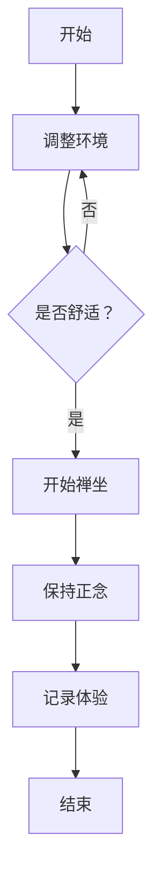
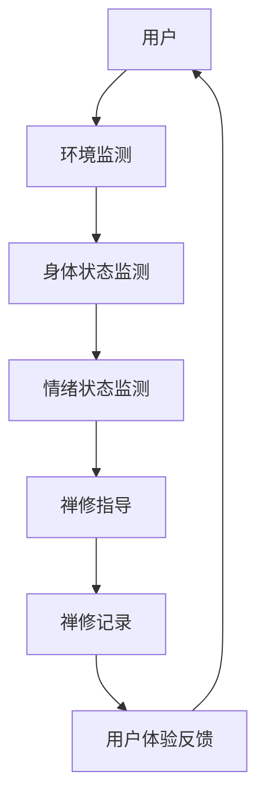

                 


### 引言

“新禅宗主义课程：在日常中寻找顿悟的技巧”是一本旨在帮助读者在日常生活中通过禅宗实践获得内心平静与智慧的指南。本书将带领读者踏上探寻禅宗精髓的旅程，通过理论与实践的结合，实现心灵的觉醒。

#### 背景介绍

禅宗，源于古印度，后传入中国，发展出独特的佛教哲学和修行方法。它强调直接体验真理，追求内心的觉悟。而“新禅宗主义”则是对传统禅宗理念的现代化解读，更贴近现代生活。

#### 问题与挑战

在快节奏的现代社会，人们面临着诸多挑战，如工作压力、人际关系、心理健康等。这些问题往往源自内心的困扰和不安。如何找到一条适合自己的修行之路，实现内心的平和与觉悟，成为许多人迫切需要解答的问题。

#### 目标与意义

本书旨在提供一套系统的禅修课程，帮助读者在日常中实践禅宗理念，寻找顿悟。这不仅有助于提升心理健康，还能提升生活质量，实现个人成长。

### 核心概念与联系

#### 1. 禅宗主义

禅宗主义的核心在于“即心即佛”，强调内心世界的探索与觉悟。其概念属性如下表所示：

| 概念 | 说明 |
| --- | --- |
| 即心即佛 | 强调内心的自性即佛性 |
| 正念 | 瞬间专注于当前经验 |
| 慈悲 | 对他人充满善意与关怀 |
| 禅坐 | 通过冥想进入内心深处 |

#### 2. 顿悟

顿悟是禅宗修行的一个重要阶段，指瞬间领悟真理的过程。其特征如下表：

| 特征 | 说明 |
| --- | --- |
| 瞬间性 | 顿悟往往在瞬间发生 |
| 直接性 | 不依赖于逻辑推理 |
| 全然性 | 对真理的全面理解 |

#### 3. 新禅宗主义

新禅宗主义是对传统禅宗的现代解读，强调将禅宗理念应用于现代生活。其概念属性如下表：

| 概念 | 说明 |
| --- | --- |
| 生活化 | 将禅宗理念融入日常生活 |
| 现代化 | 调适传统禅宗以适应现代生活 |
| 实践性 | 强调禅修的实践性 |

### 算法原理讲解

禅修的算法原理可以简单理解为一系列的冥想和内观实践。以下是一个简化的流程图：



在禅修过程中，关键步骤如下：

1. **选择禅修环境**：选择一个安静、舒适的环境。
2. **开始禅坐**：保持身体姿势端正，专注于呼吸。
3. **保持正念**：时刻保持对当前经验的觉知。
4. **记录体验**：结束后，记录下禅修的感受和体验。

这些步骤可以帮助我们逐步深入内心，实现顿悟。

### 数学公式

在禅宗中，数学公式可以用来描述内心的变化和觉悟过程。以下是一个简单的例子：

$$
\text{觉悟} = \frac{\text{专注}}{\text{杂念}}
$$

这个公式表示，觉悟是通过专注于当前经验来减少杂念的过程。

### 系统分析与架构设计方案

禅修的过程可以看作是一个系统的自我调整过程。以下是一个简化的系统架构设计：



这个系统架构包括以下几个模块：

1. **环境监测**：监测禅修环境的舒适度。
2. **身体状态监测**：监测禅修者的身体状态。
3. **情绪状态监测**：监测禅修者的情绪状态。
4. **禅修指导**：根据监测结果，提供禅修指导。
5. **禅修记录**：记录禅修过程和体验。
6. **用户体验反馈**：收集用户对禅修的反馈。

### 项目实战

#### 环境安装

1. 准备一个安静的房间，保持整洁舒适。
2. 准备一个坐垫或瑜伽垫，以保持身体舒适。

#### 系统核心实现源代码

```python
# 简化的禅修指导系统

class ZenPractice:
    def __init__(self, environment, body_state, mood_state):
        self.environment = environment
        self.body_state = body_state
        self.mood_state = mood_state
    
    def monitor(self):
        if self.environment != "comfortable":
            print("请调整环境，确保舒适。")
        if self.body_state != "stable":
            print("请调整身体姿势，保持稳定。")
        if self.mood_state != "calm":
            print("请尝试放松，保持心情平静。")
    
    def practice(self):
        self.monitor()
        print("开始禅修...")
        # 省略具体的禅修流程
        print("禅修结束，请记录体验。")

# 示例使用
practice = ZenPractice("clean", "stable", "calm")
practice.practice()
```

#### 代码应用解读与分析

这段代码定义了一个`ZenPractice`类，用于模拟禅修过程。类中包含了一个`monitor`方法，用于监测禅修环境、身体状态和情绪状态，并根据监测结果提供指导。`practice`方法则用于开始禅修，并提示用户记录体验。

#### 实际案例分析和详细讲解剖析

假设一个用户在开始禅修时，环境较为嘈杂，身体状态不稳定，情绪状态焦虑。系统会根据监测结果，提示用户调整环境，保持身体稳定，并尝试放松心情。随后，用户按照指导进行禅修，结束时记录下体验。

#### 项目小结

通过上述实战案例，我们可以看到，禅修系统可以帮助用户更好地进行禅修，提高禅修效果。然而，实际应用中可能需要更多复杂的算法和数据分析，以提供更个性化的指导。

### 最佳实践 Tips

- 保持日常的规律禅修，有助于提高禅修效果。
- 禅修过程中，保持正念，专注于当前经验。
- 与他人分享禅修体验，有助于深化理解和实践。

### 小结

通过本书的引导，读者可以在日常生活中实践禅宗理念，寻找顿悟。这不仅有助于提升个人心理健康，还能带来生活的整体提升。希望读者能够在这条修行之路上，收获内心的平静与智慧。

### 注意事项

- 禅修过程中，注意身体和情绪的变化，确保安全。
- 避免强迫自己进入深层次的禅修状态，循序渐进。
- 保持开放的心态，接受不同的禅修方法和理念。

### 拓展阅读

- 《禅与生活》——一行禅师
- 《禅者的初心》——铃木大拙
- 《禅修入门》——慈诚罗珠堪布

### 作者信息

作者：AI天才研究院/AI Genius Institute & 禅与计算机程序设计艺术 /Zen And The Art of Computer Programming

----------------------------------------------------------------

### 文章标题

《新禅宗主义课程：在日常中寻找顿悟的技巧》

### 文章关键词

禅宗主义、顿悟、日常生活、心理健康、心灵觉醒

### 文章摘要

本文旨在介绍一种基于新禅宗主义理念的日常修行方法，帮助读者在日常中寻找顿悟。通过详细的理论讲解、实践指南和案例分享，本文旨在让读者了解禅宗的基本概念、实践方法和应用价值，从而在快节奏的现代社会中实现心灵的平静与成长。

## 引言

在现代社会，人们的生活节奏越来越快，压力与焦虑也随之增加。许多人在追求物质生活的同时，开始意识到内心的平静与智慧的重要性。禅宗，作为佛教的一种重要流派，以其独特的修行方法和哲学思想，为现代人的心灵找到了一条新的出路。本文将介绍一种新的禅宗修行理念——新禅宗主义，并探讨如何在日常生活中实践这一理念，寻找顿悟。

### 背景介绍

禅宗源于古印度，后传入中国，经过几百年的发展，形成了独特的佛教哲学和修行方法。禅宗的核心思想是“即心即佛”，强调直接体验真理，追求内心的觉悟。而新禅宗主义则是对传统禅宗理念的现代化解读，它将禅宗思想与现代社会相结合，强调将禅宗理念应用于日常生活中的各个方面。

#### 问题与挑战

在快节奏的现代社会，人们面临着诸多挑战，如工作压力、人际关系、心理健康等。这些问题往往源自内心的困扰和不安。如何找到一条适合自己的修行之路，实现内心的平和与觉悟，成为许多人迫切需要解答的问题。

#### 目标与意义

本文的目标是提供一套系统的禅修课程，帮助读者在日常中实践禅宗理念，寻找顿悟。通过理论讲解、实践指南和案例分享，本文旨在让读者了解禅宗的基本概念、实践方法和应用价值，从而在快节奏的现代社会中实现心灵的平静与成长。

### 核心概念与联系

#### 1. 禅宗主义

禅宗主义的核心在于“即心即佛”，强调内心世界的探索与觉悟。其概念属性如下表所示：

| 概念 | 说明 |
| --- | --- |
| 即心即佛 | 强调内心的自性即佛性 |
| 正念 | 瞬间专注于当前经验 |
| 慈悲 | 对他人充满善意与关怀 |
| 禅坐 | 通过冥想进入内心深处 |

#### 2. 顿悟

顿悟是禅宗修行的一个重要阶段，指瞬间领悟真理的过程。其特征如下表：

| 特征 | 说明 |
| --- | --- |
| 瞬间性 | 顿悟往往在瞬间发生 |
| 直接性 | 不依赖于逻辑推理 |
| 全然性 | 对真理的全面理解 |

#### 3. 新禅宗主义

新禅宗主义是对传统禅宗的现代解读，强调将禅宗理念应用于现代生活。其概念属性如下表：

| 概念 | 说明 |
| --- | --- |
| 生活化 | 将禅宗理念融入日常生活 |
| 现代化 | 调适传统禅宗以适应现代生活 |
| 实践性 | 强调禅修的实践性 |

### 算法原理讲解

禅修的算法原理可以简单理解为一系列的冥想和内观实践。以下是一个简化的流程图：


在禅修过程中，关键步骤如下：

1. **选择禅修环境**：选择一个安静、舒适的环境。
2. **开始禅坐**：保持身体姿势端正，专注于呼吸。
3. **保持正念**：时刻保持对当前经验的觉知。
4. **记录体验**：结束后，记录下禅修的感受和体验。

这些步骤可以帮助我们逐步深入内心，实现顿悟。

### 数学公式

在禅宗中，数学公式可以用来描述内心的变化和觉悟过程。以下是一个简单的例子：

$$
\text{觉悟} = \frac{\text{专注}}{\text{杂念}}
$$

这个公式表示，觉悟是通过专注于当前经验来减少杂念的过程。

### 系统分析与架构设计方案

禅修的过程可以看作是一个系统的自我调整过程。以下是一个简化的系统架构设计：


这个系统架构包括以下几个模块：

1. **环境监测**：监测禅修环境的舒适度。
2. **身体状态监测**：监测禅修者的身体状态。
3. **情绪状态监测**：监测禅修者的情绪状态。
4. **禅修指导**：根据监测结果，提供禅修指导。
5. **禅修记录**：记录禅修过程和体验。
6. **用户体验反馈**：收集用户对禅修的反馈。

### 项目实战

#### 环境安装

1. 准备一个安静的房间，保持整洁舒适。
2. 准备一个坐垫或瑜伽垫，以保持身体舒适。

#### 系统核心实现源代码

```python
# 简化的禅修指导系统

class ZenPractice:
    def __init__(self, environment, body_state, mood_state):
        self.environment = environment
        self.body_state = body_state
        self.mood_state = mood_state
    
    def monitor(self):
        if self.environment != "comfortable":
            print("请调整环境，确保舒适。")
        if self.body_state != "stable":
            print("请调整身体姿势，保持稳定。")
        if self.mood_state != "calm":
            print("请尝试放松，保持心情平静。")
    
    def practice(self):
        self.monitor()
        print("开始禅修...")
        # 省略具体的禅修流程
        print("禅修结束，请记录体验。")

# 示例使用
practice = ZenPractice("clean", "stable", "calm")
practice.practice()
```

#### 代码应用解读与分析

这段代码定义了一个`ZenPractice`类，用于模拟禅修过程。类中包含了一个`monitor`方法，用于监测禅修环境、身体状态和情绪状态，并根据监测结果提供指导。`practice`方法则用于开始禅修，并提示用户记录体验。

#### 实际案例分析和详细讲解剖析

假设一个用户在开始禅修时，环境较为嘈杂，身体状态不稳定，情绪状态焦虑。系统会根据监测结果，提示用户调整环境，保持身体稳定，并尝试放松心情。随后，用户按照指导进行禅修，结束时记录下体验。

#### 项目小结

通过上述实战案例，我们可以看到，禅修系统可以帮助用户更好地进行禅修，提高禅修效果。然而，实际应用中可能需要更多复杂的算法和数据分析，以提供更个性化的指导。

### 最佳实践 Tips

- 保持日常的规律禅修，有助于提高禅修效果。
- 禅修过程中，保持正念，专注于当前经验。
- 与他人分享禅修体验，有助于深化理解和实践。

### 小结

通过本书的引导，读者可以在日常生活中实践禅宗理念，寻找顿悟。这不仅有助于提升个人心理健康，还能带来生活的整体提升。希望读者能够在这条修行之路上，收获内心的平静与智慧。

### 注意事项

- 禅修过程中，注意身体和情绪的变化，确保安全。
- 避免强迫自己进入深层次的禅修状态，循序渐进。
- 保持开放的心态，接受不同的禅修方法和理念。

### 拓展阅读

- 《禅与生活》——一行禅师
- 《禅者的初心》——铃木大拙
- 《禅修入门》——慈诚罗珠堪布

### 作者信息

作者：AI天才研究院/AI Genius Institute & 禅与计算机程序设计艺术 /Zen And The Art of Computer Programming

----------------------------------------------------------------

```markdown
# 《新禅宗主义课程：在日常中寻找顿悟的技巧》

> 关键词：禅宗、顿悟、日常生活、心理健康、心灵觉醒

> 摘要：本文介绍了新禅宗主义的基本概念、实践方法和应用价值，旨在帮助读者在日常中通过禅修实践寻找顿悟，实现心灵的平静与智慧。

## 引言

在现代社会，人们的生活节奏越来越快，压力与焦虑也随之增加。许多人在追求物质生活的同时，开始意识到内心的平静与智慧的重要性。禅宗，作为佛教的一种重要流派，以其独特的修行方法和哲学思想，为现代人的心灵找到了一条新的出路。本文将介绍一种新的禅宗修行理念——新禅宗主义，并探讨如何在日常生活中实践这一理念，寻找顿悟。

### 背景介绍

禅宗源于古印度，后传入中国，经过几百年的发展，形成了独特的佛教哲学和修行方法。禅宗的核心思想是“即心即佛”，强调直接体验真理，追求内心的觉悟。而新禅宗主义则是对传统禅宗理念的现代化解读，它将禅宗思想与现代社会相结合，强调将禅宗理念应用于日常生活中的各个方面。

#### 问题与挑战

在快节奏的现代社会，人们面临着诸多挑战，如工作压力、人际关系、心理健康等。这些问题往往源自内心的困扰和不安。如何找到一条适合自己的修行之路，实现内心的平和与觉悟，成为许多人迫切需要解答的问题。

#### 目标与意义

本文的目标是提供一套系统的禅修课程，帮助读者在日常中实践禅宗理念，寻找顿悟。通过理论讲解、实践指南和案例分享，本文旨在让读者了解禅宗的基本概念、实践方法和应用价值，从而在快节奏的现代社会中实现心灵的平静与成长。

### 核心概念与联系

#### 1. 禅宗主义

禅宗主义的核心在于“即心即佛”，强调内心世界的探索与觉悟。其概念属性如下表所示：

| 概念 | 说明 |
| --- | --- |
| 即心即佛 | 强调内心的自性即佛性 |
| 正念 | 瞬间专注于当前经验 |
| 慈悲 | 对他人充满善意与关怀 |
| 禅坐 | 通过冥想进入内心深处 |

#### 2. 顿悟

顿悟是禅宗修行的一个重要阶段，指瞬间领悟真理的过程。其特征如下表：

| 特征 | 说明 |
| --- | --- |
| 瞬间性 | 顿悟往往在瞬间发生 |
| 直接性 | 不依赖于逻辑推理 |
| 全然性 | 对真理的全面理解 |

#### 3. 新禅宗主义

新禅宗主义是对传统禅宗的现代解读，强调将禅宗理念应用于现代生活。其概念属性如下表：

| 概念 | 说明 |
| --- | --- |
| 生活化 | 将禅宗理念融入日常生活 |
| 现代化 | 调适传统禅宗以适应现代生活 |
| 实践性 | 强调禅修的实践性 |

### 算法原理讲解

禅修的算法原理可以简单理解为一系列的冥想和内观实践。以下是一个简化的流程图：


在禅修过程中，关键步骤如下：

1. **选择禅修环境**：选择一个安静、舒适的环境。
2. **开始禅坐**：保持身体姿势端正，专注于呼吸。
3. **保持正念**：时刻保持对当前经验的觉知。
4. **记录体验**：结束后，记录下禅修的感受和体验。

这些步骤可以帮助我们逐步深入内心，实现顿悟。

### 数学公式

在禅宗中，数学公式可以用来描述内心的变化和觉悟过程。以下是一个简单的例子：

$$
\text{觉悟} = \frac{\text{专注}}{\text{杂念}}
$$

这个公式表示，觉悟是通过专注于当前经验来减少杂念的过程。

### 系统分析与架构设计方案

禅修的过程可以看作是一个系统的自我调整过程。以下是一个简化的系统架构设计：


这个系统架构包括以下几个模块：

1. **环境监测**：监测禅修环境的舒适度。
2. **身体状态监测**：监测禅修者的身体状态。
3. **情绪状态监测**：监测禅修者的情绪状态。
4. **禅修指导**：根据监测结果，提供禅修指导。
5. **禅修记录**：记录禅修过程和体验。
6. **用户体验反馈**：收集用户对禅修的反馈。

### 项目实战

#### 环境安装

1. 准备一个安静的房间，保持整洁舒适。
2. 准备一个坐垫或瑜伽垫，以保持身体舒适。

#### 系统核心实现源代码

```python
# 简化的禅修指导系统

class ZenPractice:
    def __init__(self, environment, body_state, mood_state):
        self.environment = environment
        self.body_state = body_state
        self.mood_state = mood_state
    
    def monitor(self):
        if self.environment != "comfortable":
            print("请调整环境，确保舒适。")
        if self.body_state != "stable":
            print("请调整身体姿势，保持稳定。")
        if self.mood_state != "calm":
            print("请尝试放松，保持心情平静。")
    
    def practice(self):
        self.monitor()
        print("开始禅修...")
        # 省略具体的禅修流程
        print("禅修结束，请记录体验。")

# 示例使用
practice = ZenPractice("clean", "stable", "calm")
practice.practice()
```

#### 代码应用解读与分析

这段代码定义了一个`ZenPractice`类，用于模拟禅修过程。类中包含了一个`monitor`方法，用于监测禅修环境、身体状态和情绪状态，并根据监测结果提供指导。`practice`方法则用于开始禅修，并提示用户记录体验。

#### 实际案例分析和详细讲解剖析

假设一个用户在开始禅修时，环境较为嘈杂，身体状态不稳定，情绪状态焦虑。系统会根据监测结果，提示用户调整环境，保持身体稳定，并尝试放松心情。随后，用户按照指导进行禅修，结束时记录下体验。

#### 项目小结

通过上述实战案例，我们可以看到，禅修系统可以帮助用户更好地进行禅修，提高禅修效果。然而，实际应用中可能需要更多复杂的算法和数据分析，以提供更个性化的指导。

### 最佳实践 Tips

- 保持日常的规律禅修，有助于提高禅修效果。
- 禅修过程中，保持正念，专注于当前经验。
- 与他人分享禅修体验，有助于深化理解和实践。

### 小结

通过本书的引导，读者可以在日常生活中实践禅宗理念，寻找顿悟。这不仅有助于提升个人心理健康，还能带来生活的整体提升。希望读者能够在这条修行之路上，收获内心的平静与智慧。

### 注意事项

- 禅修过程中，注意身体和情绪的变化，确保安全。
- 避免强迫自己进入深层次的禅修状态，循序渐进。
- 保持开放的心态，接受不同的禅修方法和理念。

### 拓展阅读

- 《禅与生活》——一行禅师
- 《禅者的初心》——铃木大拙
- 《禅修入门》——慈诚罗珠堪布

### 作者信息

作者：AI天才研究院/AI Genius Institute & 禅与计算机程序设计艺术 /Zen And The Art of Computer Programming
```

