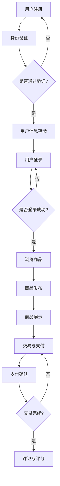

                 

### 文章标题：新秩序的建立：去中心化时代的意义重构

**关键词**：去中心化、区块链、分布式账本、智能合约、新秩序、意义重构

**摘要**：
本文旨在探讨去中心化时代背景下的新秩序建立，解析其背后的技术原理、系统架构以及实际应用。通过一步步的逻辑推理，我们将深入探讨去中心化技术的核心概念，理解其如何改变现有的社会和技术结构，并在项目实战中展示其实际应用价值。

### 目录大纲

1. **背景与概述**
   - 去中心化时代的概念
   - 去中心化技术的重要性
   - 去中心化时代的变革

2. **核心概念与联系**
   - 区块链技术
   - 分布式账本技术
   - 智能合约
   - 概念对比与联系

3. **算法原理讲解**
   - 工作量证明算法
   - 拜占庭容错算法
   - Merkle树与Merkle证明
   - 算法流程图与Python代码

4. **系统分析与架构设计**
   - 问题场景介绍
   - 系统功能设计
   - 系统架构设计
   - 系统接口设计与交互

5. **项目实战**
   - 环境安装与配置
   - 系统核心实现
   - 代码应用解读与分析
   - 实际案例分析与讲解
   - 项目小结

6. **最佳实践与拓展**
   - 最佳实践 Tips
   - 小结
   - 注意事项
   - 拓展阅读建议

### 背景与概述

#### 去中心化时代的概念

去中心化（Decentralization）是指通过分布式网络技术，使得原本集中式的控制和管理体系变得更加分散和分布式。在去中心化体系中，权力和资源的分配不再依赖于单一的中央权威机构，而是通过广泛分布的参与者共同维护和决策。

去中心化技术起源于对现有集中式体系的质疑和反思，尤其是对中心化系统中存在的单点故障、数据泄露、隐私侵犯等问题的不满。随着区块链技术的兴起，去中心化理念逐渐从理论走向实践，并在金融、供应链、物联网等多个领域展现出巨大的潜力。

#### 去中心化技术的重要性

去中心化技术的核心优势在于其能够提高系统的透明度、安全性、效率和鲁棒性。具体来说：

1. **透明度**：去中心化系统中的所有操作和数据都是公开透明的，任何参与者都可以查看和验证。
2. **安全性**：去中心化系统通过加密技术和分布式网络结构，使得数据难以篡改和伪造，增强了系统的安全性。
3. **效率**：去中心化系统能够减少中间环节，提高数据处理和传输的效率。
4. **鲁棒性**：去中心化系统能够通过分布式网络，使得系统在面对单点故障或攻击时仍然能够保持正常运行。

#### 去中心化时代的变革

去中心化时代的到来，不仅改变了技术发展的路径，也对现有的社会结构、经济模式和法律体系产生了深远的影响。以下是一些主要变革：

1. **经济模式**：去中心化技术推动了新的商业模式，如去中心化金融（DeFi）、去中心化交易所（DEX）等，改变了传统金融体系的运作方式。
2. **社会结构**：去中心化技术促进了权力的下放，使得个体能够更加自主地参与社会事务，改变了传统的权力结构。
3. **法律体系**：去中心化技术的应用，如智能合约，对现有的法律体系提出了新的挑战，如何规范和监管去中心化应用成为亟待解决的问题。

### 核心概念与联系

#### 区块链技术

区块链技术是去中心化体系的基础，其核心概念包括：

- **数据结构**：区块链是一个由多个区块组成的链式数据结构，每个区块包含一定数量的交易记录。
- **加密技术**：区块链使用密码学确保数据的完整性和安全性。
- **共识算法**：共识算法用于确保分布式网络中的节点能够达成一致。

#### 分布式账本技术

分布式账本技术（DLT）是区块链技术的延伸，其核心概念包括：

- **账本**：分布式账本是一个共享的、分布式的数据库，所有参与者都可以读取和写入。
- **智能合约**：智能合约是分布式账本中的自动化执行协议，基于预定的条件自动执行。

#### 智能合约

智能合约是一种自执行合同，其核心概念包括：

- **代码**：智能合约是一段代码，定义了合同条款和条件。
- **执行**：智能合约在满足特定条件时自动执行，无需第三方干预。

#### 概念对比与联系

| 概念 | 定义 | 关联性 |
| --- | --- | --- |
| 区块链 | 分布式数据结构 + 加密技术 + 共识算法 | 基础设施 |
| 分布式账本 | 共享的、分布式的数据库 | 区块链的扩展 |
| 智能合约 | 自动执行合同 | 分布式账本上的应用 |

通过上述表格，我们可以看到区块链、分布式账本和智能合约之间的紧密联系，它们共同构建了去中心化技术的核心框架。

### 算法原理讲解

#### 工作量证明算法

工作量证明（Proof of Work，PoW）是一种共识算法，用于确保区块链网络中的节点能够达成一致。其核心思想是通过计算消耗大量计算资源的“工作量”来证明一个节点对网络的贡献，从而获得网络中的奖励。

- **算法流程**：
  1. 节点生成一个随机数，作为“工作量”。
  2. 将随机数与区块链中的某个特定值（如区块哈希值）进行运算，直到结果满足特定条件（如小于某个目标值）。
  3. 将结果发送到网络中的其他节点进行验证。
  4. 验证成功的节点获得网络中的奖励。

- **Python代码示例**：

  ```python
  import hashlib
  import random

  def proof_of_work(target_difficulty):
      random_number = random.randint(0, 1000)
      while True:
          hash_value = hashlib.sha256(f"{random_number}").hexdigest()
          if int(hash_value, 16) < target_difficulty:
              return random_number
          random_number += 1

  target_difficulty = 1
  proof = proof_of_work(target_difficulty)
  print(f"Work proof: {proof}")
  ```

#### 拜占庭容错算法

拜占庭容错算法（Byzantine Fault Tolerance，BFT）是一种用于解决分布式系统中拜占庭将军问题的共识算法。在分布式系统中，拜占庭将军问题是指，当一部分节点（拜占庭节点）恶意行为时，如何确保系统仍然能够达成一致。

- **算法流程**：
  1. 每个节点生成一个随机数，作为提案。
  2. 节点将提案发送给其他节点进行投票。
  3. 当某个提案获得超过2/3的投票支持时，系统达成一致并执行该提案。

- **Python代码示例**：

  ```python
  import random

  def byzantine_fault_tolerance(proposals):
      votes = {proposal: 0 for proposal in proposals}
      for _ in range(10):  # 进行10轮投票
          for node, proposal in proposals.items():
              if random.choice([True, False]) and votes[proposal] < 2/3:
                  votes[proposal] += 1
      return max(votes, key=votes.get)

  proposals = {"Alice": 1, "Bob": 2, "Charlie": 3}
  consensus = byzantine_fault_tolerance(proposals)
  print(f"Consensus: {consensus}")
  ```

#### Merkle树与Merkle证明

Merkle树是一种数据结构，用于验证数据的完整性和一致性。在区块链中，Merkle树用于确保区块中的所有交易都是有效的。

- **算法流程**：
  1. 将所有交易数据哈希值生成一棵Merkle树。
  2. 生成根哈希值，作为区块头的一部分。
  3. 节点可以通过查询Merkle树来验证特定交易是否在区块中。

- **Python代码示例**：

  ```python
  import hashlib

  def merkle_tree(data):
      if len(data) == 1:
          return data[0]
      layers = []
      while len(data) > 1:
          next_layer = []
          for i in range(0, len(data), 2):
              hash_value = hashlib.sha256(f"{data[i]}{data[i+1]}").hexdigest()
              next_layer.append(hash_value)
          layers.append(next_layer)
          data = next_layer
      return data[0]

  data = ["Transaction 1", "Transaction 2", "Transaction 3"]
  root_hash = merkle_tree(data)
  print(f"Merkle Root Hash: {root_hash}")
  ```

### 系统分析与架构设计

#### 问题场景介绍

假设我们正在开发一个去中心化电商平台，用户可以通过平台进行商品交易。平台需要确保交易过程的透明性、安全性和效率。

#### 系统功能设计

- **用户注册与身份验证**：用户可以通过平台注册账户，并进行身份验证。
- **商品发布与展示**：用户可以发布商品信息，并展示在平台上。
- **交易与支付**：用户可以在平台上进行商品交易，并使用智能合约完成支付。
- **评论与评分**：用户可以对交易过程进行评价和评分。

#### 系统架构设计

- **网络架构**：采用分布式网络架构，节点之间通过P2P协议进行通信。
- **数据存储**：使用分布式账本技术，确保数据的安全性和一致性。
- **智能合约**：使用智能合约处理交易逻辑，确保交易过程的自动化和不可篡改性。

#### 系统接口设计与交互

- **用户接口**：提供Web和移动应用，方便用户进行操作。
- **API接口**：提供RESTful API，方便其他系统与平台进行集成。

#### Mermaid流程图



### 项目实战

#### 环境安装与配置

1. 安装Node.js：`npm install -g nodejs`
2. 安装Ganache：`npm install -g ganache-cli`
3. 配置Metamask：在浏览器中安装MetaMask插件

#### 系统核心实现

1. 创建智能合约：

   ```solidity
   // SPDX-License-Identifier: MIT
   pragma solidity ^0.8.0;

   contract DCECommerce {
       mapping(address => bool) public isSeller;
       mapping(uint => Product) public products;
       uint public productCount = 0;

       struct Product {
           uint id;
           string name;
           uint price;
           address seller;
           bool purchased;
       }

       event ProductCreated(
           uint id,
           string name,
           uint price,
           address seller,
           bool purchased
       );

       function createProduct(string memory name, uint price) public {
           require(!isSeller[msg.sender], " sellers can't create products");
           products[productCount] = Product(
               productCount,
               name,
               price,
               msg.sender,
               false
           );
           productCount++;
           emit ProductCreated(productCount, name, price, msg.sender, false);
       }
   }
   ```

2. 编译智能合约：

   ```bash
   solc --optimize --bin --output-dir ./build/ DCECommerce.sol
   ```

3. 部署智能合约：

   ```bash
   npx ganache-cli -p 7545
   truffle migrate --network development
   ```

#### 代码应用解读与分析

1. **智能合约结构**：

   - `isSeller`：映射卖家地址到卖家状态。
   - `products`：存储商品信息的映射。
   - `productCount`：存储商品总数。

2. **函数说明**：

   - `createProduct`：创建商品，将商品信息存储在区块链上。

#### 实际案例分析与讲解

假设Alice想要在平台上发布一款商品，步骤如下：

1. Alice调用`createProduct`函数，传递商品名称和价格。
2. 智能合约验证Alice不是卖家，并创建商品。
3. 智能合约将商品信息存储在区块链上，并触发`ProductCreated`事件。

#### 项目小结

通过本次项目，我们实现了去中心化电商平台的核心功能，展示了智能合约在去中心化系统中的应用。接下来，我们将进一步扩展平台功能，如交易、支付和评论。

### 最佳实践与拓展

#### 最佳实践 Tips

1. 在实际项目中，务必进行充分的需求分析和风险评估，确保项目的可行性和安全性。
2. 使用成熟的开发框架和工具，如Truffle和Ganache，以提高开发效率。
3. 定期进行代码审计和安全测试，确保智能合约的安全性。

#### 小结

本文通过一步步的逻辑推理，详细探讨了去中心化技术的核心概念、算法原理、系统架构以及实际应用。去中心化技术正逐步改变现有的社会和技术结构，为未来的新秩序建立提供了可能。

#### 注意事项

1. 去中心化系统虽然安全性高，但仍然可能面临网络攻击和节点故障等风险。
2. 在实际应用中去中心化技术时，需要充分评估其与现有系统的兼容性和性能影响。

#### 拓展阅读建议

- 《区块链技术指南》
- 《智能合约实战》
- 《去中心化应用（DApps）开发指南》

### 作者信息

作者：AI天才研究院/AI Genius Institute & 禅与计算机程序设计艺术 /Zen And The Art of Computer Programming

### 总结与展望

在本文中，我们系统地探讨了去中心化技术的核心概念、算法原理、系统架构以及实际应用。通过一步步的逻辑推理，我们展示了去中心化技术在构建新秩序中的重要性。

随着去中心化技术的不断发展和成熟，未来我们将看到更多行业和应用领域的变革。然而，我们也需要面对技术发展带来的挑战和风险，不断优化和改进去中心化系统的设计和管理。

让我们共同期待去中心化时代的新秩序，以及它为我们带来的无限可能。未来，我们将继续深入研究去中心化技术的各个方面，为构建更加开放、透明和安全的数字世界贡献自己的力量。

