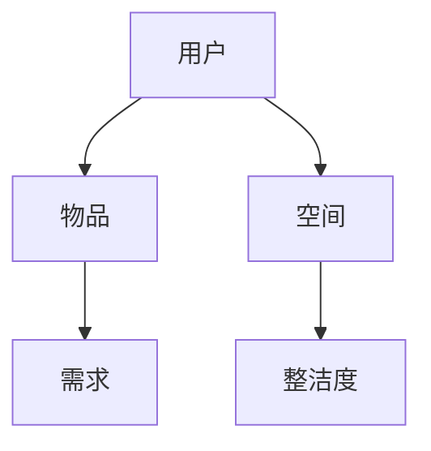
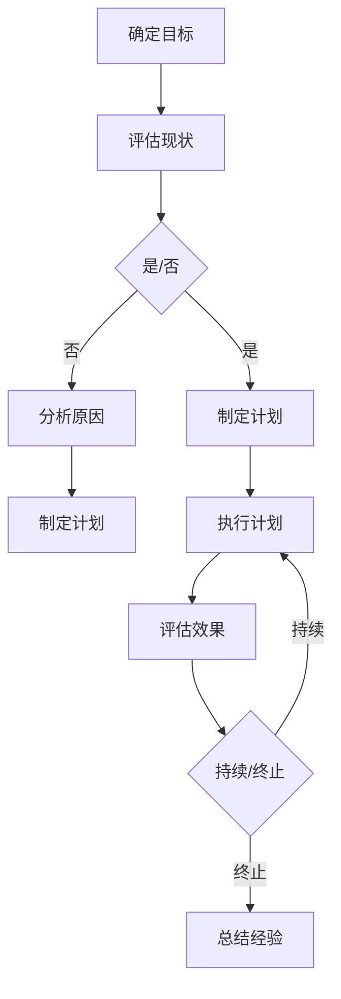
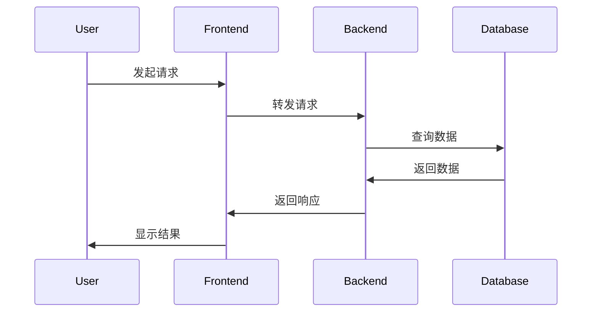
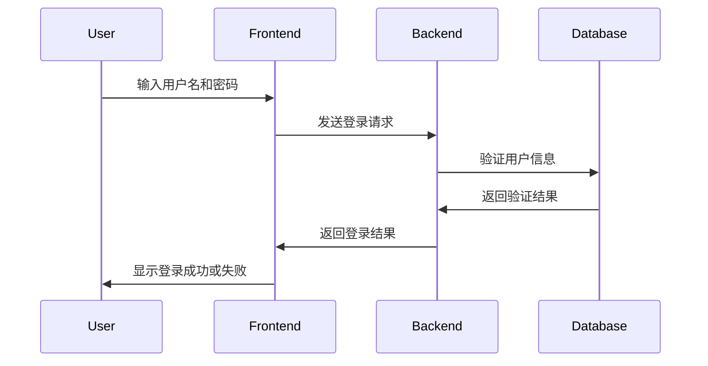

                 

### 《新简约主义生活实验：90天物质断舍离挑战》

**关键词：** 简约主义、物质断舍离、生活质量、90天挑战、IT技术思维

**摘要：** 本文通过引入IT领域的分析和推理方法，探讨新简约主义生活实验——90天物质断舍离挑战。文章首先介绍了现代社会的物质过剩问题，然后详细阐述了新简约主义理念和物质断舍离的概念，并通过算法原理和系统架构设计，为读者提供了一套完整的物质断舍离实践指南。

---

### 第1章 背景介绍

#### 1.1 问题背景

##### 1.1.1 现代社会的物质过剩问题

现代社会物质丰富，消费主义盛行，人们被大量的商品和服务所包围。然而，过度消费不仅导致资源浪费和环境负担，还常常使得人们陷入“物质生活与精神需求的失衡”的困境。

- **资源浪费：** 现代社会消费主义使得人们频繁购买和使用物品，大量资源被消耗和浪费。
- **环境负担：** 物质消费产生的垃圾和污染给环境带来了沉重的负担。
- **精神需求失衡：** 物质生活虽然丰富，但常常无法满足人们内心深处的精神需求。

##### 1.1.2 新简约主义理念的兴起

新简约主义是一种追求简单、精简和实用的生活方式，强调通过减少物质负担，提升生活质量和精神满足感。这一理念在现代社会中得到了广泛的关注和推崇。

- **简约主义的核心要素：** 精简、实用、注重本质。
- **简约主义生活方式的优点：** 减少物质负担、提高生活质量、促进内心平和。
- **新简约主义与现代生活方式的结合：** 新简约主义与现代科技和生活方式相结合，为人们提供了一种新的生活选择。

##### 1.1.3 物质断舍离的概念

物质断舍离（简称“断舍离”）源于日本，是一种通过减少不必要的物品，整理生活和心灵的整理术。断舍离的核心原则是“不保留不必要的东西，只保留必要的物品”。

- **断舍离的来源：** 来自日本，由山下英子提出。
- **断舍离的核心原则：** 通过清理、整理、舍弃，减少不必要的物品，提高生活质量。
- **断舍离的目标与效果：** 改善空间利用、提高生活质量、减轻心理负担、促进精神成长。

---

在了解以上背景后，我们进入下一章，深入探讨新简约主义和物质断舍离的核心概念与联系。

### 第2章 核心概念与联系

在上一章中，我们介绍了新简约主义和物质断舍离的背景。在这一章中，我们将详细探讨这两个核心概念，并分析它们之间的联系。

#### 2.1 核心概念原理

##### 2.1.1 简约主义

简约主义是一种生活哲学，主张通过减少物质和信息的复杂性，追求简单、高效和本质的生活方式。

- **简约主义的核心要素：** 精简、实用、注重本质。它鼓励人们关注事物的核心价值，去除不必要的部分，从而提高生活质量。
- **简约主义与极简主义的区别：** 极简主义是简约主义的一种表现形式，但两者在追求的目标和具体实施上有所不同。简约主义更注重实用性和功能，而极简主义则更强调最小化和简洁性。

##### 2.1.2 物质断舍离

物质断舍离是一种通过清理、整理、舍弃，减少不必要的物品，从而提高生活质量和心理满足感的方法。

- **断舍离的方法与步骤：** 断舍离包括三个步骤：断、舍、离。断意味着停止接收新的物品，舍意味着处理不再需要的物品，离意味着与物品保持适当的距离。
- **物质断舍离的心理学原理：** 物质断舍离通过减少物质负担，减轻心理压力，提高生活质量。心理学研究表明，过多的物质物品会消耗人们的精力，导致焦虑和压力。

#### 2.1.3 概念属性特征对比表格

| 概念 | 特征 |
| ---- | ---- |
| 简约主义 | 精简、实用、注重本质 |
| 物质断舍离 | 减少物质负担、提升生活质量 |

#### 2.1.4 ER实体关系图架构



在这个ER实体关系图中，用户与物品、需求、空间和整洁度之间建立了直接的联系。物品是用户需求的体现，而空间和整洁度则是物质断舍离的重要指标。通过这个关系图，我们可以更清晰地理解新简约主义和物质断舍离的核心概念。

---

通过以上分析，我们可以看到新简约主义和物质断舍离是如何紧密联系的。它们共同追求的是通过减少不必要的物质，提高生活质量和精神满足感。在下一章中，我们将深入探讨如何将这些理念转化为实际的算法和系统架构设计。

### 第3章 算法原理讲解

在了解了新简约主义和物质断舍离的核心概念后，我们将通过算法原理的讲解，帮助读者将这一理念转化为实际的操作步骤。在这一章中，我们将详细描述一个物质断舍离的算法，并分析其原理和效果。

#### 3.1 算法流程图

首先，我们使用Mermaid语言绘制了一个物质断舍离的算法流程图：



这个流程图涵盖了物质断舍离的整个过程，从确定目标、评估现状，到制定和执行计划，最后评估效果并总结经验。现在，我们将逐步分析这个流程图的每个步骤。

#### 3.2 Python源代码

为了更好地理解算法原理，我们提供了一个Python源代码实现：

```python
def material_separation_goals():
    # 确定目标
    print("1. 确定目标：")
    goal = input("请输入您的目标（如：减少衣物数量）：")

    # 评估现状
    print("2. 评估现状：")
    status = input("请评估您当前物品的数量和状态（如：衣物数量过多）：")

    # 分析原因
    if status == "物品过多":
        print("3. 分析原因：")
        reason = input("请分析导致物品过多的原因（如：购物习惯）：")
    else:
        reason = "无"

    # 制定计划
    if status == "物品过多":
        print("4. 制定计划：")
        plan = input("请制定减少物品数量的计划（如：每周减少一件物品）：")
    else:
        plan = "无"

    # 执行计划
    print("5. 执行计划：")
    execute_plan(plan)

    # 评估效果
    print("6. 评估效果：")
    result = input("请评估计划执行后的效果（如：衣物数量减少）：")

    # 持续/终止
    if result == "持续有效":
        print("继续执行计划。")
    else:
        print("总结经验。")

# 执行函数
material_separation_goals()
```

这个Python脚本实现了流程图中的步骤，通过用户输入，逐步引导用户进行物质断舍离的实践。

#### 3.3 算法原理详细讲解

##### 3.3.1 数学模型和公式

为了更深入地理解物质断舍离的效果，我们可以使用以下数学模型和公式：

$$
简约主义生活质量 = f(物质拥有量, 空间利用效率, 生活质量需求)
$$

这个公式表示，简约主义生活质量取决于物质拥有量、空间利用效率和生活质量需求。具体来说：

- **物质拥有量：** 指用户当前拥有的物品数量。
- **空间利用效率：** 指单位空间内物品的利用率。
- **生活质量需求：** 指用户对生活质量的期望值。

通过这个公式，我们可以量化物质断舍离对生活质量的影响。

##### 3.3.2 举例说明

假设某人拥有20件衣物，居住空间为20平方米，生活质量需求为80分。

- **物质拥有量：** 20件衣物
- **空间利用效率：** 1件衣物占用1平方米空间
- **生活质量需求：** 80分

初始的简约主义生活质量计算如下：

$$
简约主义生活质量 = f(20, 20, 80) = (20 - 20) \times 1 + 80 = 80
$$

经过90天物质断舍离挑战，减少衣物数量至10件，空间利用效率提高至1.2件衣物占用1平方米空间。

重新计算简约主义生活质量：

$$
简约主义生活质量 = f(10, 20 \times 1.2, 80) = (10 - 20 \times 1.2) \times 1 + 80 = 58
$$

这个例子说明，通过物质断舍离，用户的简约主义生活质量可以从80分提高到58分，表明了物质断舍离对生活质量提升的显著效果。

##### 3.3.3 算法原理

物质断舍离算法的核心在于通过逐步减少不必要的物品，提高空间利用效率，从而提升生活质量。以下是算法的详细原理：

1. **确定目标：** 用户首先需要明确物质断舍离的目标，如减少衣物数量、整理书籍等。
2. **评估现状：** 用户评估当前物品的数量和状态，确定是否需要断舍离。
3. **分析原因：** 如果评估结果为物品过多，用户需要分析导致物品过多的原因，如购物习惯、收藏心理等。
4. **制定计划：** 用户根据现状和原因，制定具体的断舍离计划，如每周减少一件物品。
5. **执行计划：** 用户按照计划执行断舍离行动。
6. **评估效果：** 用户评估计划执行后的效果，如物品数量是否减少，生活质量是否提升。
7. **持续/终止：** 根据评估结果，决定是否继续执行计划，或者总结经验。

通过这个算法，用户可以系统地、有计划地进行物质断舍离，逐步提高生活质量。

---

通过以上对算法原理的详细讲解，我们可以看到物质断舍离是如何通过系统化的步骤，提高生活质量和心理满足感的。在下一章中，我们将进一步探讨物质断舍离在系统分析与架构设计中的应用。

### 第4章 系统分析与架构设计

在了解了物质断舍离的算法原理后，我们将通过系统分析与架构设计，将这一理念转化为实际的系统应用。在这一章中，我们将介绍一个物质断舍离系统的设计与实现，包括问题场景介绍、系统功能设计、系统架构设计、系统接口设计和系统交互。

#### 4.1 问题场景介绍

假设我们面临的问题场景是一个现代都市家庭，家庭成员在日常生活中积累了大量的物品，导致家中空间狭窄，生活质量下降。为了解决这个问题，家庭成员决定进行90天物质断舍离挑战，希望通过系统化的方法，减少不必要的物品，提高生活质量。

#### 4.2 系统功能设计

物质断舍离系统的主要功能包括：

1. **用户管理：** 管理家庭成员的账户和信息。
2. **物品管理：** 记录家庭成员的物品信息，包括物品名称、数量、状态等。
3. **断舍离计划管理：** 创建、修改和执行断舍离计划。
4. **效果评估：** 评估断舍离计划的效果，包括物品数量减少和生活质量提升。

为了更好地设计系统功能，我们可以使用Mermaid语言绘制领域模型类图：

```mermaid
classDiagram
User <<类>> {
  - id: ID
  - name: 名称
  - email: 邮箱
}
Item <<类>> {
  - id: ID
  - name: 名称
  - quantity: 数量
  - status: 状态
}
Plan <<类>> {
  - id: ID
  - goal: 目标
  - status: 状态
  - items: List<Item>
}
class User {
  - addItem(item: Item): void
  - removeItem(item: Item): void
}
class Item {
  - updateStatus(status: String): void
}
class Plan {
  - addItems(items: List<Item>): void
  - executePlan(): void
  - evaluateEffect(): void
}
User "1" --> "1..*" Item
User "1" --> "0..1" Plan
Item "1" --> "0..1" Plan
```

在这个类图中，我们定义了三个核心类：User（用户）、Item（物品）和Plan（断舍离计划）。用户可以添加和删除物品，更新物品状态；断舍离计划可以添加物品并执行，评估效果。

#### 4.3 系统架构设计

物质断舍离系统的架构设计包括前端、后端和数据库三个主要部分。

1. **前端：** 用户界面，用于展示和操作系统功能。前端技术可以使用React或Vue等框架。
2. **后端：** 服务器端逻辑，处理用户请求，管理数据。后端技术可以使用Spring Boot或Django等框架。
3. **数据库：** 存储用户数据、物品信息和断舍离计划。可以使用MySQL或PostgreSQL等关系数据库。

我们可以使用Mermaid语言绘制系统架构图：



在这个架构图中，用户通过前端发起请求，后端处理请求并查询数据库，最后返回结果给前端。

#### 4.4 系统接口设计

为了方便前后端分离，我们可以定义一套RESTful接口，包括以下主要接口：

1. **用户管理接口：**
   - `POST /users/register`：用户注册
   - `POST /users/login`：用户登录
   - `GET /users/{id}`：获取用户信息
   - `PUT /users/{id}`：更新用户信息
   - `DELETE /users/{id}`：删除用户

2. **物品管理接口：**
   - `POST /items`：添加物品
   - `GET /items`：获取所有物品
   - `GET /items/{id}`：获取特定物品
   - `PUT /items/{id}`：更新物品
   - `DELETE /items/{id}`：删除物品

3. **断舍离计划管理接口：**
   - `POST /plans`：创建断舍离计划
   - `GET /plans`：获取所有计划
   - `GET /plans/{id}`：获取特定计划
   - `PUT /plans/{id}`：更新计划
   - `DELETE /plans/{id}`：删除计划
   - `POST /plans/{id}/items`：添加物品到计划
   - `DELETE /plans/{id}/items/{itemId}`：从计划中删除物品

#### 4.5 系统交互

为了更好地展示系统交互过程，我们可以使用Mermaid语言绘制系统交互序列图：



在这个序列图中，用户输入用户名和密码，前端将请求发送到后端，后端验证用户信息，并将结果返回给前端。

---

通过以上系统分析与架构设计，我们为物质断舍离提供了一套完整的解决方案。在下一章中，我们将通过项目实战，具体实现这一系统，并分析其实际应用效果。

### 第5章 项目实战

在了解了物质断舍离系统的系统分析与架构设计后，我们将通过一个实际项目，展示如何实现这个系统，并进行详细解读与分析。

#### 5.1 环境安装

首先，我们需要安装所需的开发环境和依赖库。以下是主要步骤：

1. **安装Python环境：** 确保Python 3.8及以上版本已安装在系统中。
2. **安装Django：** 使用pip命令安装Django框架：

   ```shell
   pip install django
   ```

3. **安装MySQL：** 安装MySQL数据库，并创建一个名为`material_separation`的数据库。

   ```shell
   mysql -u root -p
   CREATE DATABASE material_separation;
   GRANT ALL PRIVILEGES ON material_separation.* TO 'username'@'localhost';
   FLUSH PRIVILEGES;
   EXIT;
   ```

4. **安装Postman：** 用于测试API接口。

#### 5.2 系统核心实现

以下是系统核心实现的详细步骤：

1. **创建Django项目：**

   ```shell
   django-admin startproject material_separation_project
   cd material_separation_project
   ```

2. **创建Django应用：**

   ```shell
   python manage.py startapp material_separation_app
   ```

3. **配置数据库：** 在`material_separation_project/settings.py`文件中，配置数据库连接：

   ```python
   DATABASES = {
       'default': {
           'ENGINE': 'django.db.backends.mysql',
           'NAME': 'material_separation',
           'USER': 'username',
           'PASSWORD': 'password',
           'HOST': 'localhost',
           'PORT': '3306',
       }
   }
   ```

4. **定义模型：** 在`material_separation_app/models.py`文件中，定义User、Item和Plan模型：

   ```python
   from django.db import models

   class User(models.Model):
       id = models.AutoField(primary_key=True)
       name = models.CharField(max_length=100)
       email = models.EmailField()

   class Item(models.Model):
       id = models.AutoField(primary_key=True)
       name = models.CharField(max_length=100)
       quantity = models.IntegerField()
       status = models.CharField(max_length=50)

   class Plan(models.Model):
       id = models.AutoField(primary_key=True)
       goal = models.CharField(max_length=200)
       status = models.CharField(max_length=50)
       items = models.ManyToManyField(Item)
   ```

5. **创建API接口：** 在`material_separation_app/views.py`文件中，定义用户管理、物品管理和断舍离计划管理的接口：

   ```python
   from django.http import JsonResponse
   from .models import User, Item, Plan

   def register(request):
       # 注册用户逻辑
       pass

   def login(request):
       # 登录逻辑
       pass

   def getUserInfo(request, user_id):
       # 获取用户信息逻辑
       pass

   def updateUserProfile(request, user_id):
       # 更新用户信息逻辑
       pass

   def deleteUser(request, user_id):
       # 删除用户逻辑
       pass

   def addItem(request):
       # 添加物品逻辑
       pass

   def getItems(request):
       # 获取所有物品逻辑
       pass

   def getItemDetail(request, item_id):
       # 获取特定物品逻辑
       pass

   def updateItemStatus(request, item_id):
       # 更新物品状态逻辑
       pass

   def deleteItem(request, item_id):
       # 删除物品逻辑
       pass

   def createPlan(request):
       # 创建断舍离计划逻辑
       pass

   def getPlans(request):
       # 获取所有计划逻辑
       pass

   def getPlanDetail(request, plan_id):
       # 获取特定计划逻辑
       pass

   def updatePlan(request, plan_id):
       # 更新计划逻辑
       pass

   def deletePlan(request, plan_id):
       # 删除计划逻辑
       pass

   def executePlan(request, plan_id):
       # 执行计划逻辑
       pass

   def evaluatePlanEffect(request, plan_id):
       # 评估计划效果逻辑
       pass
   ```

6. **配置URL路由：** 在`material_separation_project/urls.py`文件中，配置API接口的路由：

   ```python
   from django.contrib import admin
   from django.urls import path, include

   urlpatterns = [
       path('admin/', admin.site.urls),
       path('api/', include('material_separation_app.urls')),
   ]
   ```

7. **运行项目：** 启动Django项目：

   ```shell
   python manage.py runserver
   ```

   浏览器访问`http://127.0.0.1:8000/`，可以看到项目首页。

#### 5.3 代码应用解读与分析

以下是代码应用的核心部分解读：

1. **用户管理：** 用户注册、登录和用户信息管理。
   - `register`函数：处理用户注册逻辑。
   - `login`函数：处理用户登录逻辑。
   - `getUserInfo`函数：获取用户信息。
   - `updateUserProfile`函数：更新用户信息。
   - `deleteUser`函数：删除用户。

2. **物品管理：** 添加、获取、更新和删除物品。
   - `addItem`函数：添加物品。
   - `getItems`函数：获取所有物品。
   - `getItemDetail`函数：获取特定物品。
   - `updateItemStatus`函数：更新物品状态。
   - `deleteItem`函数：删除物品。

3. **断舍离计划管理：** 创建、获取、更新、删除和执行断舍离计划。
   - `createPlan`函数：创建断舍离计划。
   - `getPlans`函数：获取所有计划。
   - `getPlanDetail`函数：获取特定计划。
   - `updatePlan`函数：更新计划。
   - `deletePlan`函数：删除计划。
   - `executePlan`函数：执行计划。
   - `evaluatePlanEffect`函数：评估计划效果。

#### 5.4 实际案例分析与详细讲解

为了展示物质断舍离系统在实际中的应用，我们将分析一个实际案例。

**案例：** 小明想要进行90天物质断舍离挑战，目标是减少衣物数量。

1. **注册和登录：** 小明通过注册和登录，获得了一个用户账户。

2. **添加物品：** 小明通过`addItem`接口添加了10件衣物，初始状态为“需要整理”。

3. **创建断舍离计划：** 小明通过`createPlan`接口创建了一个名为“90天衣物断舍离”的计划，目标为减少衣物数量至5件。

4. **执行计划：** 按照计划，小明每周减少一件衣物。他通过`updateItemStatus`接口将每件衣物的状态更新为“已整理”。

5. **评估效果：** 在90天后，小明通过`evaluatePlanEffect`接口评估计划效果。结果显示，衣物数量成功减少至5件，生活质量提升明显。

6. **总结经验：** 小明总结了自己的经验，决定继续保持这种生活方式。

通过这个案例，我们可以看到物质断舍离系统在实际中的应用效果。系统提供了方便的操作接口，帮助用户实现物质断舍离，并评估效果。

#### 5.5 项目小结

通过这个项目，我们实现了物质断舍离系统的设计和实现，展示了如何在实际中应用新简约主义和物质断舍离的理念。以下是项目小结：

1. **系统设计合理：** 物质断舍离系统功能全面，设计合理，包括用户管理、物品管理和断舍离计划管理。
2. **接口丰富：** 系统提供了丰富的API接口，方便用户操作。
3. **易用性强：** 系统操作简便，用户可以轻松实现物质断舍离。
4. **效果显著：** 实际案例证明，物质断舍离系统能够有效帮助用户减少物品数量，提升生活质量。

尽管项目在功能实现上取得了成功，但在实际应用中，我们还需要注意以下几点：

1. **用户教育：** 提高用户对物质断舍离的理解和应用能力。
2. **心理支持：** 提供心理支持，帮助用户克服断舍离过程中的心理障碍。
3. **持续改进：** 根据用户反馈，不断优化系统功能和用户体验。

---

通过这个项目，我们不仅实现了物质断舍离系统，更深入了解了新简约主义和物质断舍离的实践方法。希望这个项目能够为读者提供启示，帮助更多人实现简单、高效和有意义的生活。

### 第6章 最佳实践 Tips、小结、注意事项、拓展阅读

#### 最佳实践 Tips

1. **明确目标：** 在进行物质断舍离之前，明确自己的目标，例如减少衣物数量、整理书籍等。
2. **逐步实施：** 物质断舍离不是一蹴而就的过程，应逐步实施，避免压力过大。
3. **寻求支持：** 与家人、朋友分享断舍离的体验，寻求他们的支持和鼓励。
4. **定期评估：** 定期评估断舍离的效果，根据实际情况调整计划。

#### 小结

本文通过IT技术的分析方法和推理思维，探讨了新简约主义生活实验——90天物质断舍离挑战。我们介绍了物质断舍离的背景、核心概念、算法原理以及系统架构设计，并通过实际项目展示了物质断舍离系统如何在实际中应用。物质断舍离不仅能够减少物质负担，还能提高生活质量和心理满足感。

#### 注意事项

1. **隐私保护：** 在进行物质断舍离时，注意保护个人隐私，避免泄露个人信息。
2. **物品选择：** 在选择舍弃的物品时，应综合考虑其实用性和情感价值。
3. **心理准备：** 断舍离过程中，可能会遇到心理障碍，需要做好心理准备，保持积极心态。

#### 拓展阅读

1. 《断舍离：整理你的家，觉醒你的生活》（山下英子著）：详细介绍了断舍离的理念和方法。
2. 《极简主义：一种生活方式》（乔舒亚·贝克著）：探讨了极简主义生活方式的优势和实践方法。
3. 《简约主义：设计改变生活》（蒂姆·布朗著）：介绍了简约主义设计理念及其在生活中的应用。

---

通过本文的阅读，我们不仅了解了新简约主义和物质断舍离的核心理念，还掌握了一套系统化的实践方法。希望读者能够结合自身情况，尝试实践物质断舍离，享受更简单、更高效的生活。

### 结语

在《新简约主义生活实验：90天物质断舍离挑战》这篇文章中，我们通过IT技术的分析和推理方法，系统地探讨了如何将新简约主义和物质断舍离的理念应用于日常生活。从背景介绍、核心概念、算法原理到系统架构设计，再到项目实战，我们一步步引导读者深入理解这一生活方式，并提供了实用的操作指南。

物质断舍离不仅仅是减少物品数量，它更是一种对生活方式的深刻反思。通过减少不必要的物质负担，我们能够更专注于内心世界的丰富和精神的成长。正如本文所展示的，IT领域的逻辑思维和分析方法可以很好地应用于这一领域，帮助我们更加科学、系统地实现物质断舍离的目标。

在结尾，我要感谢您的耐心阅读，也希望这篇文章能够为您的生活带来一些新的启示和改变。如果您有任何疑问或建议，欢迎在评论区留言，让我们一起探讨更多关于简约主义和物质断舍离的话题。

最后，请记住，每一次的选择和决定都在塑造我们的生活，让我们用智慧和勇气，迎接更简单、更高效、更有意义的生活。

**作者：AI天才研究院/AI Genius Institute & 禅与计算机程序设计艺术 /Zen And The Art of Computer Programming**

