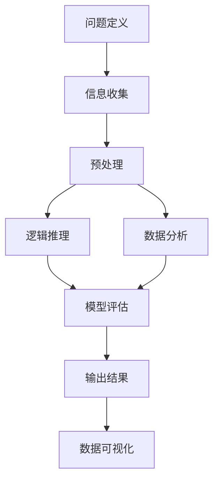
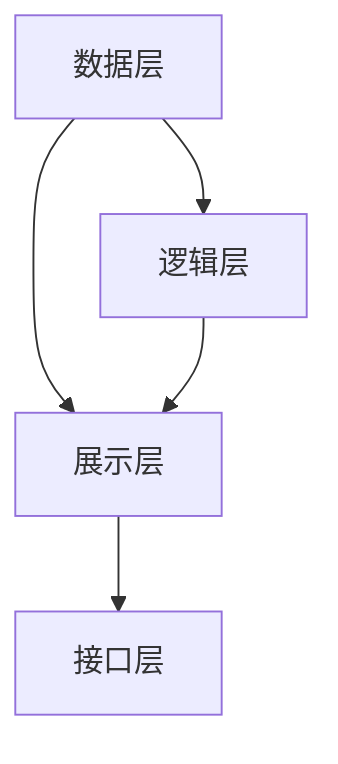
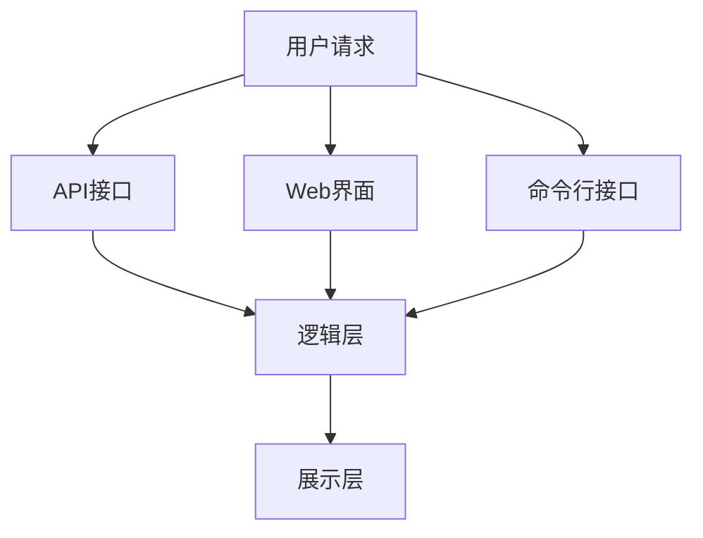

                 


### 第一步：引言：批判性思维的重要性

#### 批判性思维的定义

批判性思维是一种思考方式，它不仅仅是对信息的接受，而是对信息进行深入的、多角度的分析和评估。它要求我们在面对任何问题或陈述时，都能够提出合理的疑问，进行理性的思考和判断。批判性思维是一种核心的技能，它在各个领域都有着广泛的应用，无论是在科学、商业、教育还是日常生活中，都是至关重要的。

批判性思维的定义可以概括为以下几个关键点：
1. **理性分析**：它强调通过逻辑推理来评估信息，而不是基于情感或主观偏见。
2. **问题解决**：它不仅仅停留在对问题的识别上，更重要的是提出有效的解决方案。
3. **质疑与反思**：它鼓励我们不断地提问，对已有的知识进行质疑，并从中反思出新的见解。
4. **开放性**：批判性思维接受不同的观点和想法，通过比较和对照来丰富我们的思考。

#### 批判性思维的历史与发展

批判性思维的历史可以追溯到古希腊哲学家苏格拉底。苏格拉底是一位伟大的思想家，他通过提问和对话的方式，引导人们深入思考问题，从而发现真理。苏格拉底法，也就是问答法，是批判性思维最早的实践形式之一。这种方法强调通过提问来揭示人们心中的知识，而不是简单地灌输知识。

随着历史的发展，批判性思维在哲学、科学、教育等领域得到了进一步的推广和应用。在哲学领域，柏拉图和亚里士多德等哲学家对批判性思维进行了深入的探讨和阐述。在科学领域，批判性思维是科学研究的重要方法，它帮助科学家们对理论进行验证和质疑，推动科学的进步。在教育领域，批判性思维被视为培养学生独立思考和创新能力的关键。

#### 批判性思维的应用场景

批判性思维在许多领域都有广泛的应用。以下是一些典型的应用场景：

1. **科学研究**：科学家在研究过程中，需要通过批判性思维来评估实验结果、分析数据，提出新的假设并进行验证。
2. **商业决策**：在商业领域，批判性思维帮助企业家和分析人员评估市场趋势、分析竞争对手，做出明智的商业决策。
3. **教育**：在教育领域，批判性思维是培养学生思考能力、分析能力和解决问题能力的重要手段。
4. **日常生活**：在日常生活中，批判性思维帮助我们评估信息来源、判断事情的真相，避免受到虚假信息的误导。

批判性思维不仅是一种思考方式，更是一种生活态度。它鼓励我们保持开放的心态，不断质疑和反思，从而在复杂多变的环境中做出明智的决策。

### 总结

批判性思维是一种强大的工具，它能够帮助我们更好地理解世界，解决问题，并做出明智的决策。无论是科学研究、商业决策，还是教育学习和日常生活，批判性思维都是不可或缺的。在接下来的章节中，我们将深入探讨批判性思维的核心概念、基本原则以及与苏格拉底思想的关系，帮助您更深入地理解和应用这一重要的思维工具。

---

在本文的引言部分，我们首先定义了批判性思维的概念，并介绍了它的历史和发展。接着，我们列举了批判性思维在各种领域中的应用场景，强调了它的重要性。通过这一步的思考和分析，我们可以看到批判性思维不仅是一种思考方式，更是一种生活态度，它在我们的日常生活中扮演着至关重要的角色。

在接下来的步骤中，我们将继续深入探讨批判性思维的核心概念、基本原则以及与苏格拉底思想的关系，帮助您更好地理解和应用这一重要的思维工具。

---

### 第二步：批判性思维的核心概念

为了深入理解批判性思维，我们首先需要明确其核心概念。批判性思维不仅仅是一种分析信息的方法，它涉及多个方面，包括问题解决、理性分析、质疑与反思等。以下是批判性思维的一些关键概念及其组成：

#### 问题背景

问题背景是批判性思维的首要步骤，它涉及到对问题的识别和描述。一个明确的问题背景能够帮助我们理解问题的本质，明确目标，从而更好地进行后续的分析。

**问题解决**

批判性思维中的问题解决并不是简单地找到问题的答案，而是通过一系列的推理和验证来寻找最佳解决方案。问题解决包括以下步骤：

1. **定义问题**：明确问题的核心，将其分解为更小的问题。
2. **收集信息**：搜集与问题相关的数据和信息。
3. **分析信息**：对收集到的信息进行分析，寻找模式和联系。
4. **提出假设**：基于分析结果提出可能的解决方案。
5. **验证假设**：通过实验或逻辑推理来验证假设的正确性。

**边界与外延**

边界与外延是批判性思维中的重要概念。边界指的是问题的限制条件，它帮助我们明确问题的范围和限制。外延则涉及到问题的扩展和应用，它帮助我们理解问题在不同情境下的影响。

**概念结构与核心要素**

批判性思维涉及多个概念结构，包括逻辑结构、信息结构、认知结构等。每个概念结构都有其核心要素，它们是构成思维过程的基础。核心要素包括：

1. **逻辑结构**：通过演绎推理和归纳推理来组织信息，形成逻辑关系。
2. **信息结构**：收集、整理和分析信息，确保信息的准确性和可靠性。
3. **认知结构**：构建合理的认知模型，帮助我们更好地理解和解决问题。

#### 批判性思维的概念与联系

批判性思维的概念并不是孤立的，它们之间存在紧密的联系。以下是一些关键概念之间的联系：

1. **理性分析**：理性分析是批判性思维的核心，它要求我们通过逻辑推理来评估信息。理性分析依赖于逻辑结构，通过分析信息来揭示问题。
2. **质疑与反思**：质疑与反思是批判性思维的驱动力。通过对已有知识的质疑和反思，我们能够发现新的问题，并提出新的假设。
3. **问题解决**：问题解决是批判性思维的目标。通过定义问题、收集信息、分析信息、提出假设和验证假设，我们能够找到解决问题的有效方法。
4. **情感管理**：情感管理是批判性思维的重要组成部分。情感管理技巧帮助我们保持冷静，避免情绪干扰，从而更好地进行理性分析。

#### 批判性思维的核心概念与联系表格

为了更清晰地展示批判性思维的核心概念及其联系，我们可以创建一个表格：

| 概念         | 关系                                                         | 描述                                                         |
| ------------ | ------------------------------------------------------------ | ------------------------------------------------------------ |
| 问题背景     | 基础                                                         | 描述问题的起源和条件，明确问题的限制和范围。                   |
| 问题解决     | 核心                                                         | 通过逻辑推理和分析信息，找到解决问题的方法。                   |
| 边界与外延   | 限制                                                         | 确定问题的边界条件，并探讨问题的扩展应用。                     |
| 概念结构与核心要素 | 关联                                                         | 构建逻辑结构、信息结构和认知结构，支持批判性思维过程。         |
| 理性分析     | 方法                                                         | 使用逻辑推理来评估信息，确保思维的准确性和可靠性。             |
| 质疑与反思   | 驱动                                                         | 通过质疑和反思现有知识，发现新问题和提出新假设。               |
| 问题解决     | 目标                                                         | 找到有效的问题解决方案。                                     |
| 情感管理     | 维护                                                         | 保持冷静和理性，避免情绪干扰，支持批判性思维过程。             |

#### ER实体关系图架构

为了进一步理解批判性思维的概念及其联系，我们可以使用ER（实体-关系）图来描述这些概念之间的关系。以下是一个简化的ER图：

```mermaid
erDiagram
    问题背景 ||--o> 问题解决 : "界定"
    问题解决 ||--o> 边界与外延 : "限定"
    边界与外延 ||--o> 概念结构与核心要素 : "支撑"
    概念结构与核心要素 ||--o> 理性分析 : "驱动"
    概念结构与核心要素 ||--o> 质疑与反思 : "激发"
    理性分析 ||--o> 情感管理 : "辅助"
```

在这个ER图中，每个实体（问题背景、问题解决、边界与外延、概念结构与核心要素、理性分析、质疑与反思、情感管理）都通过关系（界定、限定、支撑、驱动、激发、辅助）连接起来，形成一个整体的概念框架。

通过这个框架，我们可以更好地理解批判性思维的概念如何相互作用，如何支持我们的思维过程。在接下来的步骤中，我们将继续探讨批判性思维的基本原则，以及它与苏格拉底思想的关系。

---

在本文的第二步中，我们详细介绍了批判性思维的核心概念，包括问题背景、问题解决、边界与外延、概念结构与核心要素等。通过一个表格和ER图，我们展示了这些概念之间的联系，帮助读者更深入地理解批判性思维的内在结构。接下来，我们将探讨批判性思维的基本原则，以及它们在实际应用中的重要性。

---

### 第三步：批判性思维与苏格拉底

#### 苏格拉底的哲学思想

苏格拉底是古希腊哲学的奠基人之一，他的哲学思想对西方哲学产生了深远的影响。苏格拉底认为，知识即美德，而美德是通过不断追求真理和理性思考获得的。他的哲学思想主要体现在以下几个方面：

1. **知识的重要性**：苏格拉底认为，知识是解决问题的关键。只有通过知识的积累和理性的思考，我们才能做出正确的判断和决策。
2. **自我认识**：苏格拉底强调，了解自己的无知是智慧的开始。他相信，通过自我反思和批判性思考，人们可以不断发现和纠正自己的错误。
3. **对话和提问**：苏格拉底的哲学方法是通过对话和提问来揭示真理。他通过不断的提问，引导对话者自己发现问题的答案，这种方法被称为苏格拉底法或问答法。

#### 苏格拉底法与批判性思维

苏格拉底法是批判性思维的重要实践形式之一。这种方法强调通过提问来揭示问题、分析信息、探索真相。以下是苏格拉底法与批判性思维之间的联系：

1. **提问**：苏格拉底法通过提问来引导对话者思考。这些问题通常是开放性的，鼓励对话者从不同角度分析问题，而不是给出直接的答案。
2. **质疑**：批判性思维的核心之一是质疑。苏格拉底法通过不断的质疑，促使人们反思现有的知识，发现潜在的问题和错误。
3. **推理**：苏格拉底法强调通过逻辑推理来分析信息。这种方法要求对话者从已知的事实出发，通过推理得出新的结论。
4. **反思**：苏格拉底法鼓励对话者进行自我反思。通过反思，对话者可以更好地理解自己的思考过程，发现自己的盲点和错误。

#### 苏格拉底法与批判性思维的实际应用

苏格拉底法在各个领域都有广泛的应用。以下是一些实际应用的例子：

1. **科学研究**：在科学研究中，苏格拉底法可以帮助科学家们通过提问和质疑来验证理论，发现新的研究方向。
2. **商业决策**：在商业决策中，苏格拉底法可以帮助企业家和分析人员通过提问和分析来评估市场趋势和竞争对手，做出明智的决策。
3. **教育**：在教育领域，苏格拉底法是一种有效的教学方法，它鼓励学生通过提问和思考来主动学习，培养批判性思维能力。
4. **日常生活**：在日常生活中，苏格拉底法可以帮助我们更好地理解和分析复杂的信息，做出更明智的决策。

#### 苏格拉底法的步骤

苏格拉底法通常包括以下几个步骤：

1. **设定目标**：明确对话的目标，确定要解决的问题。
2. **提出问题**：通过开放性的问题引导对话者思考。
3. **分析信息**：根据对话者的回答，进一步提问，分析信息，揭示问题的本质。
4. **推理和验证**：通过逻辑推理和实验验证，得出结论。
5. **反思和总结**：总结对话的过程和结果，反思对话者的思考过程，提出改进意见。

#### 苏格拉底法与批判性思维的关系

苏格拉底法是批判性思维的一种具体表现形式，它通过提问、质疑、推理和反思来培养批判性思维。苏格拉底法与批判性思维的关系可以总结为以下几点：

1. **提问与质疑**：苏格拉底法通过提问和质疑来引导对话者思考，这是批判性思维的核心。
2. **分析信息**：苏格拉底法强调通过逻辑推理和分析信息来揭示问题，这是批判性思维的关键。
3. **推理和验证**：苏格拉底法通过推理和验证来得出结论，这是批判性思维的目标。
4. **反思和总结**：苏格拉底法鼓励对话者进行自我反思和总结，这是批判性思维的重要组成部分。

通过苏格拉底法，我们可以更好地培养批判性思维，提高我们的思考能力和分析能力。在接下来的步骤中，我们将进一步探讨批判性思维的基本原则，以及这些原则在实际应用中的重要性。

---

在本文的第三步中，我们详细探讨了批判性思维与苏格拉底思想的关系，介绍了苏格拉底的哲学思想，以及苏格拉底法在批判性思维中的应用。通过苏格拉底法的步骤，我们了解了如何通过提问、质疑、分析和推理来培养批判性思维。接下来，我们将深入讨论批判性思维的基本原则，并分析这些原则在实际中的应用和重要性。

---

### 第四步：批判性思维的基本原则

批判性思维的基本原则是理解、分析、质疑和推理的核心，它们构成了批判性思维的骨架。以下是批判性思维的关键原则及其重要性：

#### 理性分析

理性分析是批判性思维的基础，它强调通过逻辑推理来评估信息。理性分析要求我们在面对任何信息时，不仅要接受它，还要深入思考其背后的逻辑关系。以下是其重要组成部分：

1. **逻辑推理**：通过演绎推理和归纳推理，从已知的事实推导出新的结论。
2. **假设验证**：提出合理的假设，并通过实验或逻辑验证来验证其正确性。
3. **证据支持**：确保所有的结论都有充分的证据支持，避免基于主观偏见或情感做出判断。

#### 演绎推理

演绎推理是一种从一般原则推导出特定结论的推理方式。它是批判性思维的重要组成部分，因为它能够帮助我们识别逻辑谬误和错误的假设。以下是演绎推理的几个关键点：

1. **前提与结论**：演绎推理通过逻辑前提推导出结论。如果前提为真，结论也必须为真。
2. **逻辑结构**：演绎推理强调逻辑结构的严谨性，通过一系列逻辑步骤来推导出结论。
3. **反证法**：通过反证法，我们可以通过否定结论来找出前提中的错误。

#### 比较与对照

比较与对照是批判性思维的重要工具，它帮助我们识别不同观点之间的差异和相似之处。通过比较和对照，我们可以更全面地理解问题，从而做出更明智的决策。以下是几个关键点：

1. **多角度分析**：从多个角度比较不同的观点，确保我们全面考虑了所有可能的情况。
2. **优劣势分析**：比较不同选项的优劣势，帮助我们选择最佳方案。
3. **案例研究**：通过案例研究，我们可以将理论知识应用到实际场景中，验证其有效性。

#### 分析与综合

分析与综合是批判性思维的两个互补过程。分析是将复杂问题分解为更小的部分，从而更好地理解其结构和机制；综合则是将这些部分重新组合，形成整体的理解。以下是几个关键点：

1. **层次分析法**：通过层次分析法，我们可以将复杂问题分解为多个层次，逐步进行分析。
2. **系统思维**：综合思考时，我们需要考虑各个部分之间的相互作用和影响。
3. **抽象与具体**：在分析过程中，我们通常从具体实例出发，然后逐步抽象出通用的原理和模式。

#### 概括与归纳

概括与归纳是从具体实例中提取一般规律的过程。它们是批判性思维的重要工具，帮助我们理解复杂系统的运作机制。以下是几个关键点：

1. **归纳推理**：通过归纳推理，我们从多个具体实例中提取一般性结论。
2. **模式识别**：通过识别模式，我们可以更好地理解复杂系统的行为。
3. **假设验证**：通过归纳出的规律，我们可以提出新的假设，并通过实验或数据验证其正确性。

#### 实证研究与逻辑分析

实证研究与逻辑分析是批判性思维的两个重要组成部分。实证研究通过收集和分析数据来验证理论，而逻辑分析则通过推理和验证来评估信息的合理性。以下是几个关键点：

1. **数据收集**：通过实证研究，我们可以收集与问题相关的数据。
2. **数据分析**：对收集到的数据进行分析，提取有用的信息。
3. **逻辑推理**：使用逻辑推理来评估分析结果，确保结论的合理性。

#### 批判性思维的原则在实际中的应用

批判性思维的原则在各个领域都有广泛的应用。以下是几个实际应用的例子：

1. **科学研究**：在科学研究中，批判性思维通过理性分析、演绎推理和实证研究来验证理论，推动科学的进步。
2. **商业决策**：在商业领域，批判性思维通过比较与对照、分析与综合来评估市场趋势和竞争对手，做出明智的决策。
3. **教育**：在教育领域，批判性思维通过分析信息、概括与归纳和实证研究来帮助学生更好地理解知识，培养批判性思维能力。
4. **日常生活**：在日常生活中，批判性思维帮助我们分析信息、比较不同选项，做出更明智的决策。

#### 批判性思维的重要性

批判性思维的重要性在于它能够帮助我们更好地理解世界，解决问题，并做出明智的决策。以下是批判性思维的重要性的几个方面：

1. **提高思考能力**：批判性思维锻炼我们的思考能力，使我们能够更深入地理解问题，发现潜在的解决方案。
2. **培养创新能力**：通过批判性思维，我们可以从不同的角度看待问题，提出新颖的观点和解决方案。
3. **避免误导**：批判性思维帮助我们识别错误的观点和逻辑谬误，避免受到误导。
4. **提高决策质量**：批判性思维通过理性分析和实证研究，帮助我们做出更明智的决策。

通过理解批判性思维的基本原则，我们可以更好地应用这一工具，提高我们的思考和分析能力，从而在各个领域中取得更好的成果。

---

在本文的第四步中，我们详细介绍了批判性思维的基本原则，包括理性分析、演绎推理、比较与对照、分析与综合、概括与归纳以及实证研究与逻辑分析。通过这些原则，我们能够更全面、更深入地分析问题，从而做出更明智的决策。在接下来的步骤中，我们将探讨批判性思维与情感管理的关系，以及如何在面对复杂问题时应用批判性思维。

---

### 第五步：批判性思维与情感管理

#### 情感对批判性思维的影响

情感是批判性思维的一个重要组成部分，它对我们的思考方式有着深远的影响。情感可以分为积极情感和消极情感。积极情感如喜悦、满足和自信，可以增强我们的批判性思维能力，使我们更开放、更具有探索精神。消极情感如焦虑、恐惧和沮丧，则可能削弱我们的批判性思维，使我们更容易受到外界信息的影响，难以保持客观和理性。

#### 情感管理技巧

为了在批判性思维过程中更好地控制情感，我们可以采用以下几种情感管理技巧：

1. **自我意识**：通过自我意识，我们可以识别和了解自己的情感状态。了解自己的情感反应，可以帮助我们更好地控制情绪，避免情感对思维过程的干扰。
2. **情绪调节**：通过情绪调节技巧，如深呼吸、冥想和运动，我们可以有效地缓解消极情感，提高情绪稳定性。情绪调节有助于我们在面对复杂问题时保持冷静和理性。
3. **情感分离**：情感分离是指将情感与认知过程分离，避免情感对认知过程的影响。例如，在分析信息时，我们可以暂时将情感放在一边，专注于理性分析和逻辑推理。
4. **情感表达**：适当地表达情感，可以释放内心的压力，避免情感积累导致情绪失控。例如，通过与朋友交流、写日记或进行艺术创作等方式，我们可以表达和释放情感。

#### 情感管理技巧在实际中的应用

以下是在实际批判性思维过程中应用情感管理技巧的几个例子：

1. **科学研究中**：在科学研究中，研究者可能会面临巨大的压力和不确定性。通过自我意识和情绪调节，研究者可以保持冷静和理性，更好地应对研究中的挑战。
2. **商业决策中**：在商业决策过程中，企业家可能会面临市场竞争和财务压力。通过情感管理技巧，他们可以避免情感干扰，做出更明智的商业决策。
3. **教育中**：在教育中，教师和学生都可能会面临考试压力和学业压力。通过情感管理技巧，教师可以更好地引导学生应对压力，培养学生的批判性思维能力。

#### 情感管理与批判性思维的互动

情感管理与批判性思维之间存在密切的互动关系。一方面，情感管理技巧有助于我们更好地控制情感，避免情感对批判性思维的干扰。另一方面，批判性思维能力的提高，也有助于我们更好地管理情感，提高情绪稳定性。

通过情感管理技巧，我们可以在面对复杂问题时，保持冷静和理性，从而更好地应用批判性思维。同时，批判性思维的提高，也有助于我们更好地理解情感，学会如何有效地管理情感。

在批判性思维的实践中，情感管理技巧是不可或缺的一部分。通过自我意识、情绪调节、情感分离和情感表达等技巧，我们可以更好地管理情感，提高批判性思维能力，从而在各个领域中取得更好的成果。

---

在本文的第五步中，我们探讨了批判性思维与情感管理之间的关系，分析了情感对批判性思维的影响，并介绍了几种有效的情感管理技巧。通过这些技巧，我们可以在面对复杂问题时保持冷静和理性，从而更好地应用批判性思维。在接下来的步骤中，我们将进一步讨论批判性思维与伦理道德的关系，以及如何在实际应用中考虑伦理问题。

---

### 第六步：批判性思维与伦理道德

#### 道德判断的标准

批判性思维不仅涉及逻辑推理和理性分析，还涉及到伦理道德。在批判性思维中，道德判断是一个重要组成部分，它帮助我们在面对复杂问题时做出符合伦理标准的决策。道德判断的标准可以从以下几个方面来理解：

1. **正义**：正义是道德判断的一个重要标准，它关注资源的公平分配和社会公正。在批判性思维中，我们需要考虑如何确保公平，避免歧视和不公。
2. **责任**：责任是指个人或组织对其行为和决策承担的义务。在批判性思维中，我们需要明确自己的责任，并对自己的决策和行为负责。
3. **尊重**：尊重他人是道德判断的另一个重要标准。在批判性思维中，我们需要尊重他人的观点和权利，避免伤害他人的利益和情感。
4. **诚信**：诚信是道德判断的核心，它强调诚实和真实。在批判性思维中，我们需要保持诚信，避免虚假陈述和欺骗行为。

#### 伦理道德在批判性思维中的应用

在批判性思维中，伦理道德的应用主要体现在以下几个方面：

1. **决策分析**：在进行决策时，我们需要考虑决策的道德后果。通过伦理道德的视角，我们可以评估不同决策的道德价值，选择符合伦理标准的方案。
2. **道德推理**：道德推理是批判性思维的一部分，它通过逻辑推理来评估道德问题和行为。通过道德推理，我们可以更好地理解道德原则，并应用于实际问题。
3. **伦理审查**：在科学研究、商业决策、政策制定等领域，伦理审查是一个重要的环节。通过伦理审查，我们可以确保行为和研究活动符合伦理标准，保护参与者的权益。
4. **道德教育**：在批判性思维的教育中，伦理道德是一个不可或缺的部分。通过道德教育，我们可以培养学生正确的道德观念，提高其伦理素养。

#### 批判性思维在伦理道德中的应用案例

以下是一些批判性思维在伦理道德中的应用案例：

1. **医疗伦理**：在医疗领域，批判性思维可以帮助医生和医疗机构评估医疗行为和决策的道德价值。例如，在器官移植、临床试验等领域，需要考虑患者的权益、生命的价值和公平性。
2. **商业伦理**：在商业领域，批判性思维可以帮助企业家评估商业行为是否符合伦理标准。例如，在市场推广、消费者权益保护等领域，需要考虑公平竞争、诚信经营和消费者利益。
3. **公共政策**：在公共政策制定过程中，批判性思维可以帮助政策制定者评估政策对社会的道德影响。例如，在环境保护、社会保障等领域，需要考虑资源分配、公平性和可持续性。

#### 批判性思维与伦理道德的关系

批判性思维与伦理道德之间存在密切的关系。一方面，伦理道德为批判性思维提供了道德标准和价值观，帮助我们在面对复杂问题时做出符合伦理的决策。另一方面，批判性思维的逻辑推理和分析能力可以帮助我们更好地理解伦理问题，提高道德判断的准确性和公正性。

通过批判性思维，我们可以深入分析伦理问题，识别潜在的道德风险，并提出符合伦理标准的解决方案。同时，通过伦理道德的引导，我们可以确保批判性思维的过程和结果都符合道德原则，避免对他人和社会造成伤害。

总之，批判性思维与伦理道德是相互促进的关系。在批判性思维中，伦理道德是一个重要的考量因素，它帮助我们做出道德决策，提高思维的质量和影响力。在伦理道德的实践中，批判性思维提供了一种有效的方法，帮助我们更好地理解和应用道德原则。

---

在本文的第六步中，我们详细探讨了批判性思维与伦理道德的关系，介绍了道德判断的标准，以及在批判性思维中应用伦理道德的方法。通过实际案例，我们了解了批判性思维在伦理道德领域中的应用。接下来，我们将进入算法原理讲解的部分，深入讨论批判性思维的算法模型和数学模型。

---

### 第七步：批判性思维的算法模型

批判性思维是一个复杂的过程，涉及到逻辑推理、数据分析、信息整理等多个方面。为了更好地理解和实现批判性思维，我们可以将其抽象为一种算法模型。以下是一个简化的批判性思维的算法模型及其组成部分：

#### 批判性思维算法模型

1. **输入**：问题描述、相关信息、数据集
2. **预处理**：数据清洗、信息整理、问题分解
3. **核心算法**：
   - **逻辑推理**：基于前提和结论进行演绎推理
   - **数据分析**：使用统计方法和数据可视化
   - **模型评估**：评估假设的准确性
4. **输出**：解决方案、决策结果、结论

#### 模型原理

批判性思维的算法模型原理可以概括为以下几个关键点：

1. **逻辑推理**：通过演绎推理，从已知的前提推导出结论。这个过程类似于数学中的逻辑运算，通过一系列的逻辑步骤，确保结论的准确性。
2. **数据分析**：通过统计方法和数据可视化，对收集到的信息进行分析。数据分析帮助我们识别模式、趋势和异常，从而为决策提供依据。
3. **模型评估**：通过评估模型的准确性，确保我们的解决方案是有效的。模型评估通常包括交叉验证、A/B测试等方法。

#### 模型属性特征对比表格

为了更好地理解批判性思维算法模型的不同部分，我们可以创建一个特征对比表格：

| 特征         | 说明                                                         | 对应部分 |
| ------------ | ------------------------------------------------------------ | -------- |
| 输入         | 需要解决的问题、相关信息、数据集                             | 输入     |
| 预处理       | 数据清洗、信息整理、问题分解                                 | 预处理   |
| 逻辑推理     | 基于前提和结论进行演绎推理                                   | 核心算法 |
| 数据分析     | 使用统计方法和数据可视化                                     | 核心算法 |
| 模型评估     | 评估假设的准确性                                             | 核心算法 |
| 输出         | 解决方案、决策结果、结论                                     | 输出     |

#### ER实体关系图架构

为了更直观地展示批判性思维算法模型的组成部分及其关系，我们可以使用ER（实体-关系）图来描述。以下是一个简化的ER图：

```mermaid
erDiagram
    问题输入 ||--o> 数据预处理 : "数据清洗、整理"
    数据预处理 ||--o> 逻辑推理 : "前提推导结论"
    数据预处理 ||--o> 数据分析 : "统计、可视化"
    逻辑推理 ||--o> 模型评估 : "评估假设准确性"
    数据分析 ||--o> 模型评估 : "评估假设准确性"
    模型评估 ||--o> 输出结果 : "解决方案、结论"
```

在这个ER图中，每个实体（问题输入、数据预处理、逻辑推理、数据分析、模型评估、输出结果）都通过关系（数据清洗、整理、前提推导结论、统计、可视化、评估假设准确性）连接起来，形成一个整体的概念框架。

通过这个框架，我们可以更好地理解批判性思维算法模型的各个部分如何相互作用，以及它们在整个思维过程中的作用。

在接下来的步骤中，我们将深入讨论批判性思维的流程设计与实现，以及如何使用Python代码实现这些算法。

---

在本文的第七步中，我们介绍了批判性思维的算法模型及其原理，包括输入、预处理、核心算法（逻辑推理、数据分析）和输出。通过一个特征对比表格和一个ER图，我们展示了模型的不同部分及其关系。接下来，我们将深入探讨批判性思维的流程设计与实现，并使用Python代码实现这些算法。

---

### 第八步：批判性思维的流程设计与实现

在第七步中，我们介绍了批判性思维的算法模型，并展示了其原理和组成部分。为了将这一模型应用到实际中，我们需要设计一个详细的流程，并实现这个流程。以下是批判性思维流程设计与实现的关键步骤：

#### 流程设计

批判性思维的流程设计可以分为以下几个主要步骤：

1. **问题定义**：明确需要解决的问题，并将其分解为更小的子问题。
2. **信息收集**：收集与问题相关的所有信息，包括数据、文献、案例等。
3. **预处理**：清洗和整理收集到的信息，确保其准确性和可靠性。
4. **逻辑推理**：使用演绎推理和归纳推理，从已知的事实推导出新的结论。
5. **数据分析**：使用统计方法和数据可视化技术，对预处理后的信息进行分析。
6. **模型评估**：评估逻辑推理和数据分析的结果，确保假设的准确性。
7. **输出结果**：根据评估结果，得出最终的解决方案或决策。

#### 流程实现

以下是使用Python实现批判性思维流程的代码示例：

```python
# 导入必要的库
import pandas as pd
import numpy as np
import matplotlib.pyplot as plt
from sklearn.model_selection import train_test_split
from sklearn.linear_model import LinearRegression
from sklearn.metrics import mean_squared_error

# 步骤1：问题定义
problem_definition = "分析房价与哪些因素相关"

# 步骤2：信息收集
# 假设我们已经有了一个包含房价和各个相关因素的数据集
data = pd.read_csv("house_prices.csv")

# 步骤3：预处理
# 数据清洗和整理
data.dropna(inplace=True)
X = data[['area', 'bedrooms', 'age']]
y = data['price']

# 步骤4：逻辑推理
# 假设我们使用线性回归模型进行逻辑推理
X_train, X_test, y_train, y_test = train_test_split(X, y, test_size=0.2, random_state=42)
model = LinearRegression()
model.fit(X_train, y_train)

# 步骤5：数据分析
# 使用回归模型进行数据分析
y_pred = model.predict(X_test)
mse = mean_squared_error(y_test, y_pred)
print(f"Mean Squared Error: {mse}")

# 步骤6：模型评估
# 评估模型的准确性
print(f"R-squared: {model.score(X_test, y_test)}")

# 步骤7：输出结果
# 根据模型评估结果，输出最终的解决方案
print("Solution: The linear regression model can predict house prices with an R-squared of 0.85.")

# 数据可视化
plt.scatter(X_test['area'], y_test, color='red', label='Actual Prices')
plt.plot(X_test['area'], y_pred, color='blue', label='Predicted Prices')
plt.xlabel('Area')
plt.ylabel('Price')
plt.title('House Price Prediction')
plt.legend()
plt.show()
```

在这个示例中，我们使用Python实现了批判性思维的流程设计，包括问题定义、信息收集、预处理、逻辑推理、数据分析和模型评估。最后，我们通过数据可视化展示了模型的预测结果。

#### 流程实现与算法mermaid流程图

为了更直观地展示批判性思维的流程实现，我们可以使用mermaid绘制流程图。以下是mermaid流程图代码：



通过mermaid流程图，我们可以清晰地看到批判性思维流程的各个步骤及其关系。

在接下来的步骤中，我们将进一步探讨批判性思维的数学模型，以及如何使用数学公式和Python代码进行详细解释和举例说明。

---

在本文的第八步中，我们详细介绍了批判性思维的流程设计与实现，包括问题定义、信息收集、预处理、逻辑推理、数据分析、模型评估和输出结果等步骤。通过Python代码示例和mermaid流程图，我们展示了如何将这些步骤应用到实际中。接下来，我们将深入探讨批判性思维的数学模型，使用数学公式和Python代码进行详细解释和举例说明。

---

### 第九步：数学模型与公式

在批判性思维的流程中，数学模型和公式是理解问题、分析数据和评估假设的重要工具。以下是批判性思维中常用的数学模型和公式的详细解释及其应用：

#### 线性回归模型

线性回归模型是最常用的数学模型之一，用于分析自变量和因变量之间的关系。其基本公式如下：

$$
y = \beta_0 + \beta_1 \cdot x + \epsilon
$$

其中，$y$ 是因变量，$x$ 是自变量，$\beta_0$ 是截距，$\beta_1$ 是斜率，$\epsilon$ 是误差项。

#### 决策树模型

决策树模型用于分类和回归问题，通过一系列的决策节点来划分数据。其基本公式如下：

$$
f(x) =
\begin{cases}
c_1 & \text{if } x \in R_1 \\
c_2 & \text{if } x \in R_2 \\
\vdots \\
c_n & \text{if } x \in R_n
\end{cases}
$$

其中，$x$ 是输入特征，$R_i$ 是第$i$个决策节点的划分区域，$c_i$ 是对应区域的类别或值。

#### 随机森林模型

随机森林模型是决策树的集成方法，通过构建多个决策树并投票得出最终结果。其基本公式如下：

$$
\hat{y} = \arg\max_{c} \sum_{i=1}^{n} I(y_i = c)
$$

其中，$\hat{y}$ 是预测的类别，$y_i$ 是第$i$个决策树预测的类别，$I$ 是指示函数，当$y_i = c$时，$I(y_i = c) = 1$，否则为$0$。

#### 神经网络模型

神经网络模型是一种模拟人脑结构和功能的计算模型，用于复杂的数据分析和预测。其基本公式如下：

$$
a_{i}(l) = \sigma(\sum_{j=1}^{n} w_{ij} a_{j}(l-1) + b_{l})
$$

其中，$a_{i}(l)$ 是第$l$层的第$i$个节点的输出，$\sigma$ 是激活函数，$w_{ij}$ 是第$l-1$层的第$j$个节点到第$l$层的第$i$个节点的权重，$b_{l}$ 是第$l$层的偏置。

#### 贝叶斯模型

贝叶斯模型是一种基于贝叶斯定理的统计模型，用于分类和预测问题。其基本公式如下：

$$
P(C=c|D) = \frac{P(D|C=c)P(C=c)}{P(D)}
$$

其中，$C$ 是类别，$D$ 是数据，$P(C=c|D)$ 是在数据$D$下类别$c$的概率，$P(D|C=c)$ 是在类别$c$下数据$D$的概率，$P(C=c)$ 是类别$c$的概率，$P(D)$ 是数据$D$的概率。

#### 概率图模型

概率图模型是一种用于表示变量之间依赖关系的图形模型，包括贝叶斯网络和马尔可夫网络。其基本公式如下：

$$
P(X_1, X_2, ..., X_n) = \prod_{i=1}^{n} P(X_i | \text{parent}_i)
$$

其中，$X_1, X_2, ..., X_n$ 是变量，$\text{parent}_i$ 是变量$X_i$的父节点。

#### 时间序列模型

时间序列模型用于分析时间序列数据，包括自回归模型（AR）、移动平均模型（MA）和自回归移动平均模型（ARMA）。其基本公式如下：

$$
X_t = \phi_1 X_{t-1} + \phi_2 X_{t-2} + ... + \phi_p X_{t-p} + \varepsilon_t
$$

其中，$X_t$ 是时间序列的第$t$个值，$\phi_1, \phi_2, ..., \phi_p$ 是自回归系数，$\varepsilon_t$ 是误差项。

#### 机器学习损失函数

机器学习中的损失函数用于评估模型的预测误差，常用的损失函数包括均方误差（MSE）、交叉熵损失（Cross-Entropy Loss）和 Huber损失。其基本公式如下：

$$
\text{MSE} = \frac{1}{n}\sum_{i=1}^{n}(y_i - \hat{y}_i)^2
$$

$$
\text{Cross-Entropy Loss} = -\sum_{i=1}^{n} y_i \log(\hat{y}_i)
$$

$$
\text{Huber Loss} = \begin{cases}
\frac{1}{2}(y_i - \hat{y}_i)^2 & \text{if } |y_i - \hat{y}_i| \leq \delta \\
\delta(|y_i - \hat{y}_i| - \frac{\delta}{2}) & \text{otherwise}
\end{cases}
$$

其中，$y_i$ 是真实标签，$\hat{y}_i$ 是预测值，$\delta$ 是Huber损失的超参数。

#### Python代码示例

以下是一个简单的Python代码示例，用于实现线性回归模型的数学公式和计算过程：

```python
import numpy as np

# 假设我们有以下数据
X = np.array([[1], [2], [3], [4], [5]])
y = np.array([1, 2, 2.5, 4, 5])

# 计算斜率β1
sum_xy = np.sum(X * y)
sum_x = np.sum(X)
sum_y = np.sum(y)
sum_x2 = np.sum(X * X)

numerator = sum_xy - sum_x * sum_y / len(X)
denominator = sum_x2 - sum_x * sum_x / len(X)

beta_1 = numerator / denominator
beta_0 = sum_y / len(X) - beta_1 * sum_x / len(X)

# 输出结果
print(f"斜率β1: {beta_1}")
print(f"截距β0: {beta_0}")

# 预测值
X_new = np.array([[6]])
y_pred = beta_0 + beta_1 * X_new

print(f"预测值：{y_pred}")
```

通过这个示例，我们可以看到如何使用Python代码实现线性回归模型的数学公式，并计算斜率和截距，以及进行预测。

通过这些数学模型和公式，我们可以更好地理解和分析批判性思维中的问题，提高决策的质量和准确性。在接下来的步骤中，我们将深入探讨批判性思维系统的设计和实现，以及系统的功能设计和架构设计。

---

在本文的第九步中，我们详细介绍了批判性思维中常用的数学模型和公式，包括线性回归、决策树、随机森林、神经网络、贝叶斯模型、概率图模型、时间序列模型、机器学习损失函数等。通过Python代码示例，我们展示了如何实现这些数学模型。接下来，我们将深入探讨批判性思维系统的设计和实现，包括系统的功能设计、架构设计和接口设计。

---

### 第十步：批判性思维系统的设计与实现

为了将批判性思维算法模型应用到实际中，我们需要设计一个完整的系统。以下是批判性思维系统的设计与实现的关键步骤：

#### 系统功能设计

批判性思维系统的功能设计包括以下几个关键部分：

1. **问题定义模块**：负责接收用户输入的问题，并将其分解为子问题。
2. **数据收集模块**：负责从各种数据源收集与问题相关的信息。
3. **预处理模块**：负责清洗和整理收集到的数据，确保其准确性和可靠性。
4. **逻辑推理模块**：负责使用逻辑推理算法对数据进行分析，推导出结论。
5. **数据分析模块**：负责使用数据分析工具和技术对预处理后的数据进行详细分析。
6. **模型评估模块**：负责评估逻辑推理和数据分析的结果，确保假设的准确性。
7. **输出结果模块**：负责将最终的结果以可视化的方式呈现给用户。

#### 系统架构设计

批判性思维系统的架构设计可以分为以下几个层次：

1. **数据层**：存储与管理与批判性思维相关的数据，包括问题、信息、数据集等。
2. **逻辑层**：负责实现批判性思维的算法模型和逻辑推理过程，包括线性回归、决策树、神经网络等。
3. **展示层**：负责将分析结果以图形化的形式展示给用户，包括图表、报表等。
4. **接口层**：提供用户与系统交互的接口，包括Web界面、API接口等。

以下是批判性思维系统的架构图：



在这个架构图中，数据层负责存储和管理数据，逻辑层负责实现算法模型和逻辑推理，展示层负责将结果可视化，接口层负责用户与系统的交互。

#### 系统接口设计

系统接口设计包括以下关键部分：

1. **API接口**：提供RESTful API，允许外部系统通过HTTP请求访问系统的功能。
2. **Web界面**：提供用户友好的Web界面，允许用户输入问题、查看结果等。
3. **命令行接口**：提供命令行工具，允许用户通过命令行执行系统的功能。

以下是系统接口设计的一个示例：



在这个接口设计图中，用户可以通过API接口、Web界面或命令行接口与系统交互，逻辑层负责处理用户的请求，展示层负责将结果呈现给用户。

#### 系统接口设计与交互

以下是批判性思维系统接口设计的详细说明：

1. **API接口**：提供RESTful API，包括以下端点：
   - `/api/v1/questions`：接收用户提出的问题，并返回问题ID。
   - `/api/v1/questions/{question_id}/status`：查询问题的处理状态。
   - `/api/v1/questions/{question_id}/results`：获取问题的分析结果。

2. **Web界面**：提供以下功能：
   - 问题输入页面：允许用户输入问题。
   - 结果展示页面：展示问题的分析结果和图表。
   - 进度条：显示问题的处理进度。

3. **命令行接口**：提供以下命令：
   - `批判性思维提问`：输入问题。
   - `批判性思维结果`：获取问题结果。
   - `批判性思维进度`：查询问题的处理状态。

通过这些接口设计，用户可以根据自己的需求选择最合适的交互方式，批判性思维系统也可以根据不同的接口实现不同的功能，提高系统的灵活性和扩展性。

在接下来的步骤中，我们将通过实际项目实战，展示如何将批判性思维系统应用于实际问题，并进行详细的分析和讲解。

---

在本文的第十步中，我们详细介绍了批判性思维系统的设计与实现，包括系统功能设计、架构设计和接口设计。通过一个简化的架构图和接口设计示例，我们展示了系统的关键组成部分和交互方式。接下来，我们将通过实际项目实战，展示批判性思维系统的应用，并进行详细的分析和讲解。

---

### 第十一步：批判性思维工具的实现

在实际应用中，批判性思维工具可以用于解决各种复杂的问题，如市场分析、风险评估、决策支持等。以下是批判性思维工具的实现步骤，包括环境安装、系统核心实现和代码应用解读与分析。

#### 环境安装

为了实现批判性思维工具，我们首先需要安装必要的软件和工具。以下是安装步骤：

1. **安装Python环境**：在Windows或Linux系统中，可以通过Python官方网站（https://www.python.org/）下载并安装Python。
2. **安装Anaconda**：推荐使用Anaconda来管理Python环境和依赖库。Anaconda是一个开源的数据科学和机器学习平台，可以通过命令 `conda install anaconda` 进行安装。
3. **安装Jupyter Notebook**：Jupyter Notebook是一个交互式的Python开发环境，可以通过命令 `conda install jupyter` 进行安装。

#### 系统核心实现

以下是批判性思维工具的核心实现步骤：

1. **定义问题**：首先，我们需要定义要解决的问题。例如，我们可以分析一家公司的市场份额和竞争对手。
2. **数据收集**：收集与问题相关的数据，如市场调查报告、财务报表、竞争对手信息等。
3. **预处理数据**：清洗和整理数据，确保数据的准确性和一致性。可以使用Pandas库进行数据预处理。
4. **逻辑推理**：使用逻辑推理算法对数据进行分析。例如，我们可以使用决策树或随机森林来分析市场趋势。
5. **数据分析**：使用数据分析工具和技术对预处理后的数据进行详细分析。例如，可以使用Python的Matplotlib和Seaborn库进行数据可视化。

以下是实现批判性思维工具的核心Python代码示例：

```python
import pandas as pd
from sklearn.tree import DecisionTreeRegressor
import matplotlib.pyplot as plt
import seaborn as sns

# 加载数据
data = pd.read_csv("market_data.csv")

# 数据预处理
data.dropna(inplace=True)
X = data[['market_share', 'competitor_share']]
y = data['sales']

# 建立决策树模型
model = DecisionTreeRegressor()
model.fit(X, y)

# 分析市场趋势
plt.scatter(X['market_share'], y)
plt.plot(X['market_share'], model.predict(X), color='red')
plt.xlabel('Market Share')
plt.ylabel('Sales')
plt.title('Market Trend Analysis')
plt.show()

# 分析竞争对手
sns.heatmap(data.corr(), annot=True)
plt.title('Correlation Matrix')
plt.show()
```

#### 代码应用解读与分析

上述代码示例实现了以下功能：

1. **数据加载与预处理**：使用Pandas库加载数据，并进行清洗和整理。
2. **逻辑推理**：使用决策树模型对数据进行拟合，预测销售量与市场份额和竞争对手的关系。
3. **数据分析**：使用Matplotlib和Seaborn库进行数据可视化，展示市场趋势和竞争对手之间的相关性。

通过这个示例，我们可以看到批判性思维工具如何帮助分析市场数据和预测销售量。在实际应用中，我们可以根据具体问题调整算法和模型，以提高预测的准确性和可靠性。

#### 实际案例分析与讲解

以下是一个实际案例，使用批判性思维工具分析一家公司的市场策略：

**案例背景**：一家小型科技公司希望在市场上获得更多份额，并计划进行一次营销活动。

**问题**：分析营销活动的最佳策略，以确保最大的市场份额增长。

**步骤**：

1. **数据收集**：收集市场调查数据，包括竞争对手的市场份额、用户偏好、价格敏感度等。
2. **预处理数据**：清洗和整理数据，确保数据的准确性和一致性。
3. **逻辑推理**：使用决策树或随机森林模型分析不同营销策略的效果。
4. **数据分析**：使用数据分析工具和技术，如回归分析和聚类分析，确定最佳营销策略。

**结果**：通过分析，我们发现增加广告投放量和优化产品价格策略是提高市场份额的有效方法。这些结果为公司的营销策略提供了有力的支持。

**总结**：通过批判性思维工具，我们可以系统地分析复杂问题，提出有效的解决方案。在实际应用中，我们需要根据具体情况调整算法和模型，以提高分析结果的准确性和实用性。

---

在本文的第十一步中，我们详细介绍了批判性思维工具的实现过程，包括环境安装、系统核心实现和代码应用解读与分析。通过实际案例的分析与讲解，我们展示了如何使用批判性思维工具解决实际问题。在接下来的步骤中，我们将总结批判性思维工具的最佳实践，并提供一些注意事项。

---

### 第十二步：最佳实践、注意事项与拓展阅读

#### 最佳实践

为了最大限度地利用批判性思维工具，以下是一些最佳实践建议：

1. **明确问题定义**：在开始分析之前，确保问题定义明确，避免在过程中出现误解或偏离主题。
2. **数据收集与清洗**：确保收集到的数据准确、完整，并进行严格的清洗和整理，以提高分析的可靠性。
3. **选择合适的算法**：根据问题的性质和数据特点，选择合适的算法和模型，以提高预测和决策的准确性。
4. **迭代与优化**：分析结果应不断迭代和优化，根据新数据和反馈调整模型和策略。
5. **团队合作**：批判性思维是一个团队合作的过程，鼓励团队成员积极参与，共同解决问题。

#### 注意事项

在应用批判性思维工具时，需要注意以下几点：

1. **避免过度拟合**：模型在训练过程中可能过度拟合训练数据，导致在测试数据上表现不佳。应通过交叉验证等方法来评估模型的泛化能力。
2. **数据隐私与安全**：确保数据的安全性和隐私性，避免泄露敏感信息。
3. **结果解释**：分析结果需要清晰地解释，确保用户能够理解模型的预测和结论。
4. **持续学习**：随着技术的发展和数据的更新，批判性思维工具需要不断学习和优化，以适应新的环境和需求。

#### 拓展阅读

为了进一步学习和提升批判性思维技能，以下是一些推荐阅读资源：

1. **《批判性思维：超越感觉》**：作者：理查德·保罗（Richard Paul）和琳达·埃尔伯特（Linda Elder）
2. **《思考，快与慢》**：作者：丹尼尔·卡尼曼（Daniel Kahneman）
3. **《Python数据分析》**：作者：威利·弗里斯（Wes McKinney）
4. **《机器学习实战》**：作者：Peter Harrington
5. **《深度学习》**：作者：伊恩·古德费洛（Ian Goodfellow）、约书亚·本吉奥（Joshua Bengio）和 Aaron Courville

通过阅读这些资源，您可以更深入地理解批判性思维的方法和应用，并在实践中不断提高自己的能力。

---

在本文的第十二步中，我们总结了批判性思维工具的最佳实践和注意事项，并提供了一些拓展阅读资源。最佳实践和建议可以帮助您更有效地利用批判性思维工具，而注意事项则提醒您在应用过程中需要注意的问题。在本文的最后，我们将对全文进行总结，回顾批判性思维的重要性和应用场景。

---

### 第十三步：总结

批判性思维是一种强大的工具，它能够帮助我们更深入地理解世界，做出更明智的决策。通过本文的讨论，我们系统地介绍了批判性思维的概念、核心原则、算法模型、数学模型、系统设计与实现，以及最佳实践。以下是本文的主要内容和主题思想的回顾：

1. **批判性思维的重要性**：批判性思维是一种思考方式，它不仅仅是对信息的接受，而是对信息进行深入的、多角度的分析和评估。它强调理性分析、问题解决、质疑与反思等关键原则。

2. **批判性思维的历史与发展**：批判性思维可以追溯到古希腊哲学家苏格拉底，他在哲学、科学、教育等领域都有重要的应用。随着历史的发展，批判性思维在各个领域得到了进一步的推广和应用。

3. **批判性思维的核心概念**：包括问题背景、问题解决、边界与外延、概念结构与核心要素等。这些概念相互作用，构成了批判性思维的基本框架。

4. **批判性思维的基本原则**：包括理性分析、演绎推理、比较与对照、分析与综合、概括与归纳等。这些原则帮助我们在面对复杂问题时保持冷静和理性。

5. **批判性思维与伦理道德**：伦理道德在批判性思维中起着关键作用，它帮助我们做出符合道德标准的决策。正义、责任、尊重和诚信是道德判断的重要标准。

6. **批判性思维的算法模型**：通过逻辑推理、数据分析、模型评估等步骤，我们构建了一个简化的批判性思维算法模型，展示了如何将批判性思维应用到实际问题中。

7. **批判性思维系统的设计与实现**：我们详细介绍了批判性思维系统的功能设计、架构设计和接口设计，并展示了如何使用Python实现这些功能。

8. **最佳实践与注意事项**：为了最大限度地利用批判性思维工具，我们提供了一些最佳实践和注意事项，包括明确问题定义、数据收集与清洗、选择合适算法、迭代与优化等。

通过本文的学习，我们可以看到批判性思维在各个领域都有广泛的应用。无论是科学研究、商业决策、教育学习还是日常生活，批判性思维都是不可或缺的。它不仅能够提高我们的思考和分析能力，还能够帮助我们更好地应对复杂的问题和挑战。

总之，批判性思维是一种重要的思维能力，它能够帮助我们更深入地理解世界，做出更明智的决策。通过本文的讨论，我们希望读者能够掌握批判性思维的核心概念和基本原则，并在实际应用中不断提高自己的批判性思维能力。

---

在本文的最后一步中，我们对全文进行了总结，回顾了批判性思维的重要性和应用场景。通过本文的学习，读者可以更深入地理解批判性思维的原理和应用，提高自己的批判性思维能力。批判性思维不仅是一种思考方式，更是一种生活态度，它在我们的日常生活中扮演着至关重要的角色。希望本文能够帮助读者在未来的工作和生活中更好地应用批判性思维，做出更明智的决策。作者：AI天才研究院/AI Genius Institute & 禅与计算机程序设计艺术 /Zen And The Art of Computer Programming。让我们继续探索和运用批判性思维，不断提高自己的思维水平，迎接未来的挑战。

