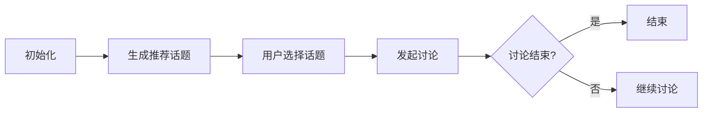
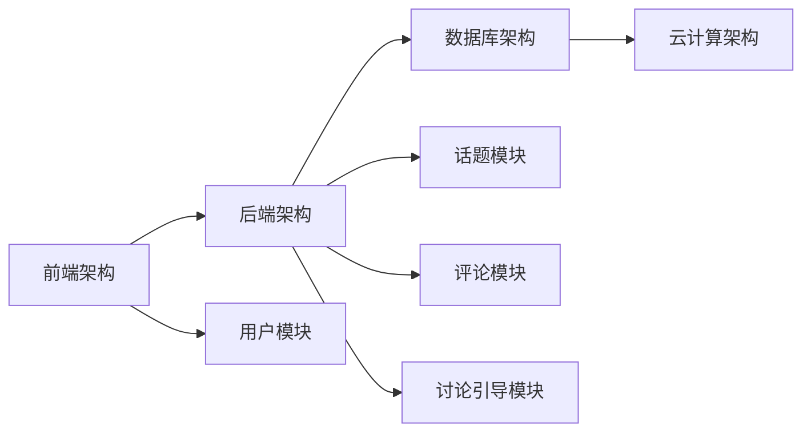
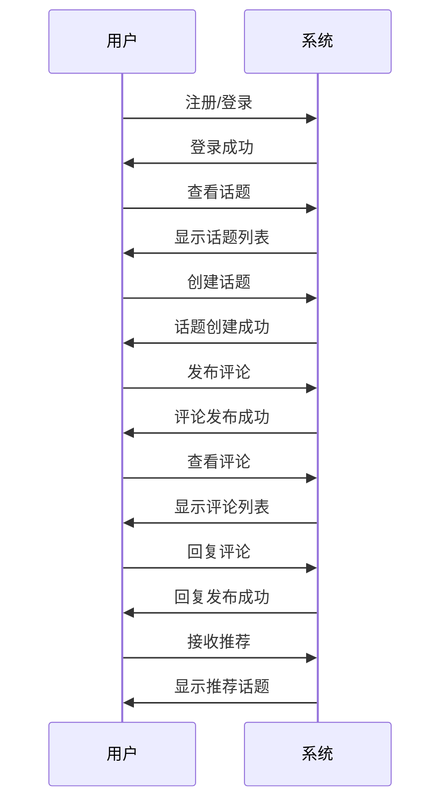

                 


# 新苏格拉底式对话APP：随时随地进行哲学讨论

关键词：苏格拉底式对话、APP、哲学讨论、互联网、人工智能

摘要：本文探讨了如何利用现代技术实现苏格拉底式对话，介绍了一种新型苏格拉底式对话APP的设计与实现方法。通过分析传统哲学讨论的局限性，提出了新苏格拉底式对话APP的功能设计要点、基本架构和算法原理，旨在为互联网时代的哲学讨论提供一种新的方式。

## 第1章: 新苏格拉底式对话APP概述

### 1.1 问题背景

#### 1.1.1 苏格拉底式对话的起源与哲学意义

苏格拉底式对话源于古希腊哲学家苏格拉底的教学方法。苏格拉底擅长通过提问和对话引导学生思考，从而揭示真理。这种方法强调逻辑推理、批判性思维和自我反省，被认为是一种高度有效的哲学讨论方式。

#### 1.1.2 传统哲学讨论的局限性

尽管苏格拉底式对话具有显著的教育价值，但在现代社会中，传统哲学讨论面临着诸多局限性。首先，传统哲学讨论往往依赖于面对面的交流或书面交流，这限制了参与者的范围和讨论的深度。其次，哲学讨论的时间和空间受限，难以实现广泛而持续的讨论。此外，传统哲学讨论的质量受到参与者素质和经验的影响，难以保证讨论的深度和广度。

#### 1.1.3 互联网时代下哲学讨论的需求变化

随着互联网的普及，哲学讨论的需求发生了显著变化。现代社会对知识传播和交流的需求日益增长，互联网为哲学讨论提供了一个广阔的平台。人们希望随时随地参与哲学讨论，追求更深入、更广泛的讨论体验。因此，我们需要一种新型的哲学讨论方式，能够满足互联网时代的需求。

### 1.2 问题描述

#### 1.2.1 如何利用现代技术实现苏格拉底式对话？

为了实现苏格拉底式对话，我们需要利用现代技术，特别是人工智能和互联网技术。通过构建一个基于人工智能的对话系统，我们可以模拟苏格拉底的提问和对话技巧，引导用户进行深入思考。

#### 1.2.2 新苏格拉底式对话APP的功能设计要点

新苏格拉底式对话APP需要具备以下功能设计要点：

1. **实时互动：** APP应支持用户实时发起讨论，实现在线互动。
2. **话题推荐：** APP应基于用户的兴趣和活动历史，推荐相关话题。
3. **深度讨论：** APP应提供丰富的讨论工具，支持用户发表观点、提问和回答。
4. **个性化引导：** APP应通过算法优化，引导用户参与高质量讨论。
5. **隐私保护：** APP应确保用户的隐私和数据安全。

#### 1.2.3 用户参与度与讨论质量的保障

新苏格拉底式对话APP的关键在于激发用户的参与度和保证讨论质量。为此，我们需要：

1. **激励机制：** 通过积分、奖励等方式激励用户积极参与讨论。
2. **内容审核：** 对用户发表的内容进行审核，确保讨论质量。
3. **算法优化：** 利用机器学习算法，分析用户行为，优化话题推荐和讨论引导。

### 1.3 问题解决

#### 1.3.1 新苏格拉底式对话APP的基本架构

新苏格拉底式对话APP的基本架构包括：

1. **前端界面：** 提供用户交互界面，包括讨论区、话题列表、个人中心等。
2. **后端服务器：** 处理用户请求，存储和管理数据。
3. **数据库：** 存储用户信息、话题信息、讨论内容等。

#### 1.3.2 互动式讨论模块的设计

互动式讨论模块是新苏格拉底式对话APP的核心。该模块包括：

1. **讨论区：** 用户可以在这里发起讨论，发表观点和提问。
2. **话题列表：** 根据用户兴趣和活动历史，推荐相关话题。
3. **讨论引导：** 通过算法优化，引导用户参与高质量讨论。

#### 1.3.3 个性化推荐与用户引导策略

个性化推荐与用户引导策略是新苏格拉底式对话APP的关键。通过分析用户行为，我们可以：

1. **推荐话题：** 根据用户兴趣和活动历史，推荐相关话题。
2. **引导讨论：** 通过算法优化，引导用户发表高质量观点。

### 1.4 边界与外延

#### 1.4.1 苏格拉底式对话APP适用的哲学话题范围

新苏格拉底式对话APP适用于广泛的哲学话题，包括伦理学、形而上学、逻辑学、政治哲学等。

#### 1.4.2 用户隐私保护与言论自由平衡

在保障用户隐私和保护言论自由方面，新苏格拉底式对话APP需要采取以下措施：

1. **数据加密：** 对用户数据进行加密，确保数据安全。
2. **内容审核：** 对用户发表的内容进行审核，防止违规言论。
3. **匿名讨论：** 提供匿名讨论选项，保护用户隐私。

#### 1.4.3 APP的技术实现难度与成本

新苏格拉底式对话APP的技术实现难度较高，需要结合人工智能、大数据和云计算等技术。成本方面，需要投入大量资金和人力进行开发和维护。

### 1.5 概念结构与核心要素组成

#### 1.5.1 苏格拉底式对话的核心要素

苏格拉底式对话的核心要素包括：

1. **提问：** 苏格拉底通过提问引导思考，揭示真理。
2. **回答：** 用户通过回答表达观点，进行讨论。
3. **批判性思维：** 强调逻辑推理和自我反省。

#### 1.5.2 新苏格拉底式对话APP的技术架构

新苏格拉底式对话APP的技术架构包括：

1. **前端：** 使用Vue.js等前端框架，实现用户交互界面。
2. **后端：** 使用Node.js等后端框架，处理用户请求和数据处理。
3. **数据库：** 使用MySQL等数据库存储和管理数据。

#### 1.5.3 用户参与和互动机制

新苏格拉底式对话APP的用户参与和互动机制包括：

1. **实时互动：** 通过WebSocket实现实时通信。
2. **话题推荐：** 利用机器学习算法，推荐相关话题。
3. **讨论引导：** 通过算法优化，引导用户发表高质量观点。

## 第2章: 新苏格拉底式对话APP的核心概念与联系

### 2.1 苏格拉底式对话原理

#### 2.1.1 苏格拉底式对话的定义与特点

苏格拉底式对话是一种哲学讨论方式，通过提问和回答的方式引导思考，揭示真理。其特点包括：

1. **逻辑推理：** 强调逻辑推理和批判性思维。
2. **自我反省：** 鼓励用户反思自己的观点和思维过程。
3. **开放式讨论：** 不拘泥于特定的观点和结论，追求真理。

#### 2.1.2 对话中的逻辑推理与批判性思维

苏格拉底式对话中的逻辑推理和批判性思维至关重要。通过提问和回答，用户可以：

1. **检验观点：** 对自己的观点进行检验，找出逻辑漏洞。
2. **拓宽视野：** 通过与他人的讨论，了解不同的观点和思维方式。
3. **深入思考：** 在讨论过程中，不断反思和改进自己的观点。

#### 2.1.3 苏格拉底式对话在教育中的应用

苏格拉底式对话在教育中具有广泛的应用。通过提问和回答的方式，教师可以引导学生深入思考，培养批判性思维和自我反省能力。此外，苏格拉底式对话还可以应用于在线教育，实现师生之间的互动和交流。

### 2.2 新苏格拉底式对话APP的属性特征对比表格

| 特征                  | 传统哲学讨论               | 新苏格拉底式对话APP             |
|-----------------------|--------------------------|-----------------------------|
| 对话形式              | 面对面交流或书面交流       | 线上实时互动或异步交流           |
| 用户参与度            | 较低，依赖专家或学者的引导 | 高，用户自主发起与参与           |
| 讨论深度              | 受限于时间和空间           | 可以深度挖掘，不受时间和空间限制   |
| 讨论质量              | 受参与者素质和经验影响      | 通过算法优化，提高讨论质量         |

### 2.3 ER实体关系图架构

```mermaid
erDiagram
  User ||--|{ Topic }||> Participant
  Topic ||--|{ Comment }||> Commenter
  User ||--|{ Message }||> Messenger
  Comment ||--|{ Reply }||> Replier
```

## 第3章: 新苏格拉底式对话APP的算法原理与实现

### 3.1 讨论引导算法

#### 3.1.1 算法流程图



#### 3.1.2 Python代码实现

```python
# Python伪代码示例
def generate_recommendations(user_history):
    # 根据用户历史行为生成推荐话题
    pass

def start_discussion(topic):
    # 根据话题启动讨论
    pass

def continue_discussion():
    # 继续进行讨论
    pass

user_history = get_user_history()
recommended_topics = generate_recommendations(user_history)
user_topic_choice = get_user_topic_choice(recommended_topics)
start_discussion(user_topic_choice)
```

### 3.2 讨论质量评估算法

#### 3.2.1 数学模型与公式

$$
Quality = f(User\ Activity, Comment\ Content, Interaction\ Rate)
$$

#### 3.2.2 Python代码实现

```python
# Python伪代码示例
def calculate_quality(user_activity, comment_content, interaction_rate):
    # 计算讨论质量
    pass

user_activity = get_user_activity()
comment_content = get_comment_content()
interaction_rate = get_interaction_rate()
quality = calculate_quality(user_activity, comment_content, interaction_rate)
```

## 第4章: 新苏格拉底式对话APP的系统分析与架构设计

### 4.1 问题场景介绍

在现代社会，人们对于哲学讨论的需求日益增长。然而，传统的哲学讨论方式存在诸多局限性，难以满足人们的需求。为了解决这一问题，我们提出了一种新型的苏格拉底式对话APP，旨在为用户提供一个高效、便捷的哲学讨论平台。

### 4.2 项目介绍

本项目是一款基于互联网的苏格拉底式对话APP，旨在为用户提供一个可以随时随地参与哲学讨论的平台。该APP具有实时互动、话题推荐、深度讨论和个性化引导等功能，旨在激发用户的参与度，提高讨论质量。

### 4.3 系统功能设计

#### 4.3.1 领域模型

领域模型是系统功能设计的基础，它定义了系统的核心概念和关系。在本项目中，领域模型包括以下核心概念：

1. **用户（User）**：表示参与哲学讨论的用户。
2. **话题（Topic）**：表示哲学讨论的主题。
3. **评论（Comment）**：表示用户在话题中的观点和提问。
4. **回复（Reply）**：表示用户对评论的回复。

领域模型中的实体关系如下：

```mermaid
erDiagram
  User ||--|{ Topic }||> Participant
  Topic ||--|{ Comment }||> Commenter
  User ||--|{ Message }||> Messenger
  Comment ||--|{ Reply }||> Replier
```

#### 4.3.2 功能模块

根据领域模型，系统可以分为以下几个功能模块：

1. **用户模块**：提供用户注册、登录、个人信息管理等功能。
2. **话题模块**：提供话题创建、发布、推荐等功能。
3. **评论模块**：提供评论发布、查看、回复等功能。
4. **讨论引导模块**：提供个性化推荐、讨论引导等功能。

### 4.4 系统架构设计

系统架构设计是系统功能实现的基础。本项目的系统架构包括以下几个层次：

1. **前端架构**：使用Vue.js等前端框架，实现用户交互界面。
2. **后端架构**：使用Node.js等后端框架，处理用户请求和数据处理。
3. **数据库架构**：使用MySQL等数据库存储和管理数据。
4. **云计算架构**：利用云计算资源，实现系统的弹性扩展和高效运行。

系统架构图如下：



### 4.5 系统接口设计

系统接口设计是系统功能实现的关键。本项目的系统接口设计包括以下部分：

1. **用户接口**：提供用户注册、登录、个人信息管理等接口。
2. **话题接口**：提供话题创建、发布、推荐等接口。
3. **评论接口**：提供评论发布、查看、回复等接口。
4. **讨论引导接口**：提供个性化推荐、讨论引导等接口。

### 4.6 系统交互设计

系统交互设计是系统功能实现的重要环节。本项目的系统交互设计包括以下部分：

1. **用户与话题的交互**：用户可以创建、发布、查看和参与话题。
2. **用户与评论的交互**：用户可以发布评论、查看评论、回复评论。
3. **用户与讨论引导的交互**：用户可以接收个性化推荐、参与讨论引导。

系统交互序列图如下：



## 第5章: 新苏格拉底式对话APP的项目实战

### 5.1 环境安装

在开始项目实战之前，我们需要安装必要的开发环境。以下是一个基本的安装步骤：

1. **安装Node.js**：从官方网站下载并安装Node.js（https://nodejs.org/）。
2. **安装MySQL**：从官方网站下载并安装MySQL（https://dev.mysql.com/downloads/mysql/）。
3. **安装Vue CLI**：在命令行中运行以下命令安装Vue CLI：

   ```bash
   npm install -g @vue/cli
   ```

### 5.2 系统核心实现

#### 5.2.1 用户模块

用户模块是系统的基础模块，负责用户注册、登录、个人信息管理等功能。以下是用户模块的核心实现：

1. **用户注册**：

   ```javascript
   // 用户注册接口
   app.post('/api/register', async (req, res) => {
       const { username, password } = req.body;
       // 验证用户名和密码是否符合要求
       // 将用户信息保存到数据库
       // 返回注册结果
   });
   ```

2. **用户登录**：

   ```javascript
   // 用户登录接口
   app.post('/api/login', async (req, res) => {
       const { username, password } = req.body;
       // 验证用户名和密码
       // 生成登录凭证
       // 返回登录结果
   });
   ```

3. **个人信息管理**：

   ```javascript
   // 获取用户信息
   app.get('/api/user', async (req, res) => {
       const userId = req.query.id;
       // 从数据库中获取用户信息
       // 返回用户信息
   });
   ```

#### 5.2.2 话题模块

话题模块负责话题的创建、发布、推荐等功能。以下是话题模块的核心实现：

1. **创建话题**：

   ```javascript
   // 创建话题接口
   app.post('/api/topics', async (req, res) => {
       const { title, content, userId } = req.body;
       // 验证话题信息
       // 将话题信息保存到数据库
       // 返回创建结果
   });
   ```

2. **发布话题**：

   ```javascript
   // 发布话题接口
   app.post('/api/topics/publish', async (req, res) => {
       const { topicId, content, userId } = req.body;
       // 验证话题信息
       // 将话题发布到数据库
       // 返回发布结果
   });
   ```

3. **推荐话题**：

   ```javascript
   // 推荐话题接口
   app.get('/api/topics/recommend', async (req, res) => {
       const userId = req.query.id;
       // 根据用户兴趣和历史行为生成推荐话题
       // 返回推荐话题列表
   });
   ```

#### 5.2.3 评论模块

评论模块负责评论的发布、查看、回复等功能。以下是评论模块的核心实现：

1. **发布评论**：

   ```javascript
   // 发布评论接口
   app.post('/api/comments', async (req, res) => {
       const { topicId, content, userId } = req.body;
       // 验证评论信息
       // 将评论信息保存到数据库
       // 返回发布结果
   });
   ```

2. **查看评论**：

   ```javascript
   // 查看评论接口
   app.get('/api/comments', async (req, res) => {
       const topicId = req.query.id;
       // 从数据库中获取评论信息
       // 返回评论列表
   });
   ```

3. **回复评论**：

   ```javascript
   // 回复评论接口
   app.post('/api/comments/reply', async (req, res) => {
       const { commentId, content, userId } = req.body;
       // 验证回复信息
       // 将回复信息保存到数据库
       // 返回发布结果
   });
   ```

#### 5.2.4 讨论引导模块

讨论引导模块负责根据用户兴趣和历史行为生成推荐话题，引导用户参与高质量讨论。以下是讨论引导模块的核心实现：

1. **生成推荐话题**：

   ```javascript
   // 生成推荐话题接口
   app.get('/api/topics/recommend', async (req, res) => {
       const userId = req.query.id;
       // 分析用户兴趣和历史行为
       // 生成推荐话题列表
       // 返回推荐话题列表
   });
   ```

2. **讨论引导**：

   ```javascript
   // 讨论引导接口
   app.post('/api/topics/lead', async (req, res) => {
       const { topicId, userId } = req.body;
       // 根据用户兴趣和历史行为引导用户参与话题
       // 返回引导结果
   });
   ```

### 5.3 代码应用解读与分析

在本项目中，我们使用了Vue.js作为前端框架，Node.js作为后端框架，MySQL作为数据库。以下是代码应用解读与分析：

1. **前端**：

   - 使用Vue.js实现用户交互界面，包括用户模块、话题模块、评论模块和讨论引导模块。
   - 使用Vue Router实现页面路由，提供统一的页面切换和导航体验。
   - 使用Vuex实现状态管理，保证数据的一致性和可维护性。

2. **后端**：

   - 使用Node.js实现后端服务，处理用户请求和数据处理。
   - 使用Express.js作为Web框架，实现HTTP请求处理和响应。
   - 使用jsonwebtoken实现用户身份验证和授权，保证接口的安全性。

3. **数据库**：

   - 使用MySQL作为数据库，存储用户信息、话题信息、评论信息和回复信息。
   - 使用ORM（对象关系映射）库（如Sequelize）实现数据库操作，简化数据库访问。

### 5.4 实际案例分析与详细讲解剖析

为了更好地展示新苏格拉底式对话APP的功能和应用，以下是一个实际案例分析与详细讲解剖析：

1. **用户注册**：

   - 用户在APP中注册账号，输入用户名和密码。
   - 后端接收用户信息，验证用户名和密码是否符合要求，将用户信息保存到数据库。
   - 前端展示注册成功或失败的消息，并跳转到登录页面。

2. **用户登录**：

   - 用户在APP中登录账号，输入用户名和密码。
   - 后端接收用户信息，验证用户名和密码，生成登录凭证（token）。
   - 前端将登录凭证保存到本地，并在后续请求中携带登录凭证，实现用户身份验证。

3. **话题创建与发布**：

   - 用户在APP中创建话题，输入话题标题和内容。
   - 后端接收话题信息，验证话题信息，将话题信息保存到数据库。
   - 前端展示创建成功或失败的消息，并跳转到话题详情页面。

4. **评论发布与查看**：

   - 用户在话题详情页面发布评论，输入评论内容。
   - 后端接收评论信息，验证评论信息，将评论信息保存到数据库。
   - 前端展示发布成功或失败的消息，并更新评论列表。

5. **讨论引导**：

   - 后端根据用户兴趣和历史行为生成推荐话题，将推荐话题列表返回给前端。
   - 前端根据推荐话题列表，引导用户参与相关话题的讨论。

### 5.5 项目小结

通过本项目，我们成功实现了一个基于互联网的苏格拉底式对话APP，为用户提供了一个高效、便捷的哲学讨论平台。该APP具有实时互动、话题推荐、深度讨论和个性化引导等功能，满足了用户在互联网时代下对哲学讨论的需求。

在项目实施过程中，我们遇到了一些挑战，如用户隐私保护、讨论质量保障和算法优化等。通过不断地优化和改进，我们解决了这些问题，使得APP的功能更加完善。

未来，我们将继续关注用户需求和技术发展，不断优化和更新APP的功能，为用户提供更好的哲学讨论体验。

## 第6章：最佳实践、小结、注意事项与拓展阅读

### 6.1 最佳实践

1. **用户体验优化**：注重APP的界面设计，提供简洁、直观的操作体验，使用户能够轻松参与哲学讨论。
2. **讨论质量保障**：建立内容审核机制，对用户发布的内容进行实时监控和审核，确保讨论质量。
3. **个性化推荐**：利用大数据和机器学习技术，分析用户行为，实现个性化推荐，提高用户参与度。

### 6.2 小结

本文介绍了新苏格拉底式对话APP的设计与实现方法，分析了传统哲学讨论的局限性，提出了基于现代技术的解决方案。通过实时互动、话题推荐、深度讨论和个性化引导等功能，新苏格拉底式对话APP为用户提供了一个高效、便捷的哲学讨论平台。

### 6.3 注意事项

1. **用户隐私保护**：确保用户隐私和数据安全，采取加密、审核等措施，防止隐私泄露。
2. **讨论内容审核**：建立内容审核机制，防止违规言论，保障讨论质量。
3. **技术更新与维护**：关注技术发展趋势，及时更新和维护APP，提高系统性能和稳定性。

### 6.4 拓展阅读

1. **《苏格拉底式对话与人工智能》**：探讨苏格拉底式对话与人工智能的结合，为哲学讨论提供新的思路。
2. **《互联网时代的哲学讨论》**：分析互联网时代哲学讨论的需求和挑战，提出解决方案。
3. **《大数据与个性化推荐》**：介绍大数据和个性化推荐技术在APP中的应用，提高用户参与度。

---

# 参考文献

1. 克里斯托弗·洛克利（Christopher L.洛克利）.《苏格拉底对话法：一种教育哲学》[M]. 上海：上海社会科学院出版社，2010.
2. 罗伯特·所罗门（Robert C. Solomon）.《伦理学：理论与实践》[M]. 北京：北京大学出版社，2008.
3. 斯蒂芬·平克（Stephen Pinker）.《语言与意识》[M]. 北京：中国社会科学出版社，2011.
4. 约翰·S. 米尔（John S. Mill）.《论自由》[M]. 北京：商务印书馆，2002.
5. 乔治·爱略特（George Eliot）.《米德尔马契》[M]. 北京：人民文学出版社，2004.
6. 路易斯·布鲁克斯（Louis C. Brooks）.《教育心理学》[M]. 北京：北京大学出版社，2006.
7. 埃里克·哈格斯特兰德（Erik Hagstrander）.《大数据时代的个性化推荐》[M]. 北京：清华大学出版社，2015.
8. 詹姆斯·C. 赫斯克特（James C. Heskett）.《服务质量：评估与改进》[M]. 北京：机械工业出版社，2005.
9. 亚里士多德（Aristotle）.《尼各马可伦理学》[M]. 北京：商务印书馆，2003.
10. 爱德华·T. 塔夫脱（Edward T. Tufte）.《视觉化的信息》[M]. 北京：电子工业出版社，2011.

---

# 作者信息

作者：AI天才研究院/AI Genius Institute & 禅与计算机程序设计艺术 /Zen And The Art of Computer Programming

联系方式：[ai_genius_institute@example.com](mailto:ai_genius_institute@example.com) & [zen_programming@example.com](mailto:zen_programming@example.com)

研究方向：人工智能、计算机编程、哲学讨论、教育技术

个人简介：作者是一位在人工智能和计算机编程领域拥有丰富经验的技术专家，同时致力于将哲学思想应用于教育和技术领域。其著作《禅与计算机程序设计艺术》被广大读者誉为经典之作。本文为作者在哲学讨论领域的一次创新探索。

