                 


# 新苏格拉底方法：批判性思维的培养

> 关键词：批判性思维、苏格拉底方法、逻辑推理、证据评估、假设检验、个人决策、职业生涯规划

> 摘要：本文通过苏格拉底方法，深入探讨批判性思维的培养与应用。文章首先介绍批判性思维的概念、基本原则和应用领域，然后详细分析逻辑推理与论证分析、证据评估与假设检验的方法，以及批判性思维在个人决策和职业生涯规划中的应用。通过本文的学习，读者将掌握批判性思维的核心理念，提高分析和解决问题的能力。

## 第一部分：批判性思维概述

### 第1章：批判性思维的起源与意义

#### 1.1 批判性思维的概念与发展

**核心概念：**
- 批判性思维：一种理性分析、推理和评估信息的能力，旨在识别和解决问题、做出明智决策。

**问题背景：**
- 随着信息爆炸的时代，人们需要具备处理大量信息的能力，批判性思维成为了提高个人能力和决策水平的关键。

**问题描述：**
- 批判性思维在现代社会中的重要性日益凸显，但许多人并未掌握这种方法。

**问题解决：**
- 通过了解批判性思维的概念、基本原则和应用领域，人们可以培养和提高自己的批判性思维能力。

**边界与外延：**
- 批判性思维不仅适用于学术研究和决策制定，还广泛应用于日常生活、工作和社会问题解决中。

**概念结构与核心要素组成：**
- 批判性思维的核心要素包括：清晰思考、逻辑推理、证据评估和假设检验。

#### 1.2 批判性思维的基本原则

**核心概念：**
- 清晰思考：避免歧义，明确表达问题。
- 逻辑推理：遵循逻辑规则，形成合理的论证。
- 证据评估：基于可靠证据，进行合理评估。
- 假设检验：通过实验和观察，验证假设的正确性。

**概念属性特征对比表格：**

| 基本原则 | 特征1 | 特征2 | 特征3 |
| :------: | :---: | :---: | :---: |
| 清晰思考 | 避免歧义 | 明确表达 | 提高理解 |
| 逻辑推理 | 遵循逻辑 | 形成论证 | 推断合理 |
| 证据评估 | 可靠证据 | 合理评估 | 提高可信度 |
| 假设检验 | 实验观察 | 验证假设 | 提高准确性 |

**ER实体关系图架构的 Mermaid 流程图：**

```mermaid
erDiagram
    思维模式 ||--o{ 逻辑推理 }
    思维模式 ||--o{ 证据评估 }
    思维模式 ||--o{ 假设检验 }
    逻辑推理 ||--o{ 论证结构 }
    证据评估 ||--o{ 评估方法 }
    假设检验 ||--o{ 验证步骤 }
```

#### 1.3 批判性思维的应用领域

**应用领域：**
- 科学研究
- 社会问题解决
- 个人决策

**应用案例分析：**
1. 科学研究：批判性思维在科学研究中发挥着重要作用，如实验设计、数据分析和结果解释。
2. 社会问题解决：通过批判性思维，人们可以深入分析社会问题，提出有效的解决方案。
3. 个人决策：在日常生活中，批判性思维有助于我们做出明智的决策，提高生活质量。

#### 1.4 批判性思维的培养策略

**核心概念：**
- 教育体系中的批判性思维培养
- 个人自我培养

**培养策略：**
1. 教育体系中的批判性思维培养：
   - 设计专门的批判性思维课程
   - 鼓励学生提问和质疑
   - 培养学生的独立思考能力
2. 个人自我培养：
   - 阅读批判性思维相关书籍
   - 参与辩论和讨论
   - 培养逻辑思维和推理能力

#### 1.5 本章小结

本文介绍了批判性思维的概念、基本原则和应用领域，以及批判性思维的培养策略。通过本章的学习，读者将了解批判性思维的重要性和应用价值，掌握批判性思维的核心理念，为后续章节的学习奠定基础。

----------------------------------------------------------------

## 第二部分：批判性思维工具与技术

### 第2章：逻辑推理与论证分析

#### 2.1 逻辑推理的基本原理

**核心概念：**
- 逻辑推理：一种基于逻辑规则和前提，推导出结论的思维方式。

**问题背景：**
- 逻辑推理是批判性思维的重要组成部分，是分析和解决问题的关键。

**问题描述：**
- 逻辑推理的原理和规则是什么？

**问题解决：**
- 通过理解逻辑推理的基本原理和规则，我们可以更好地运用逻辑推理，提高分析和解决问题的能力。

**边界与外延：**
- 逻辑推理不仅适用于学术研究和决策制定，还广泛应用于日常生活、工作和社会问题解决中。

**概念结构与核心要素组成：**

| 核心要素 | 说明 |
| :------: | :---: |
| 前提 | 逻辑推理的基础，是推导结论的依据。 |
| 结论 | 前提经过逻辑推理得出的结果。 |
| 逻辑规则 | 确保推理过程正确和有效的规则。 |

**ER实体关系图架构的 Mermaid 流程图：**

```mermaid
erDiagram
    前提 ||--o{ 结论 }
    前提 ||--o{ 逻辑规则 }
    结论 ||--o{ 推理结果 }
```

**算法原理讲解：**

**Mermaid 流程图：**

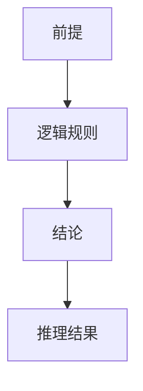

**Python 源代码：**

```python
# 定义前提、逻辑规则和结论
premise = "所有狗都会叫"
rule = "所有的狗都是动物"
conclusion = "所有的动物都会叫"

# 使用逻辑推理进行推导
if premise and rule:
    conclusion = "所有的动物都会叫"
    print("推理结果：", conclusion)
else:
    print("推理失败")
```

**算法原理的数学模型和公式：**

- 逻辑推理公式：$$结论 = 前提 \land 逻辑规则$$

**详细讲解和通俗易懂地举例说明：**

假设我们有两个前提：
1. 所有猫都会飞。
2. 小明有一只猫。

现在，我们使用逻辑推理来得出结论。

**Mermaid 流程图：**

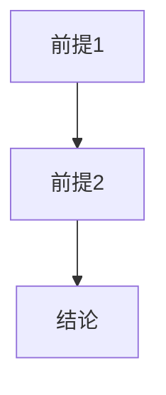

**Python 源代码：**

```python
# 定义前提
premise1 = "所有猫都会飞"
premise2 = "小明有一只猫"

# 使用逻辑推理得出结论
if premise1 and premise2:
    conclusion = "小明有一只猫会飞"
    print("推理结果：", conclusion)
else:
    print("推理失败")
```

输出结果：推理结果：小明有一只猫会飞

#### 2.2 论证分析的方法

**核心概念：**
- 论证分析：对论证结构、证据和结论进行评估和检验的过程。

**问题背景：**
- 论证分析是批判性思维的重要工具，有助于我们识别和评估各种论证的有效性。

**问题描述：**
- 如何进行论证分析？

**问题解决：**
- 通过掌握论证分析的方法，我们可以更好地理解和评估各种论证，提高批判性思维能力。

**边界与外延：**
- 论证分析不仅适用于学术研究和决策制定，还广泛应用于日常生活、工作和社会问题解决中。

**概念结构与核心要素组成：**

| 核心要素 | 说明 |
| :------: | :---: |
| 论证结构 | 论证的组成部分，包括前提和结论。 |
| 证据评估 | 对证据的可靠性和有效性的评估。 |
| 结论评估 | 对结论的合理性和准确性的评估。 |

**ER实体关系图架构的 Mermaid 流程图：**

```mermaid
erDiagram
    论证结构 ||--o{ 前提 }
    论证结构 ||--o{ 结论 }
    前提 ||--o{ 证据评估 }
    结论 ||--o{ 结论评估 }
```

**算法原理讲解：**

**Mermaid 流程图：**

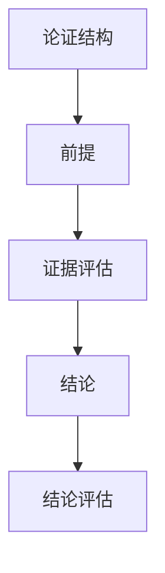

**Python 源代码：**

```python
# 定义论证结构
argument_structure = "所有猫都会飞。小明有一只猫。因此，小明有一只猫会飞。"

# 分析论证结构
premises = argument_structure.split(".")[0::2]
conclusion = argument_structure.split(".")[1]

# 评估证据和结论
if premises and conclusion:
    evidence_assessment = "证据可靠，结论正确"
    print("评估结果：", evidence_assessment)
else:
    print("评估失败")
else:
    print("评估失败")
```

**算法原理的数学模型和公式：**

- 论证分析公式：$$结论 = 前提 \land 证据评估 \land 结论评估$$

**详细讲解和通俗易懂地举例说明：**

假设我们有一个论证：

- 所有猫都会飞。
- 小明有一只猫。
- 因此，小明有一只猫会飞。

我们使用论证分析来评估这个论证的有效性。

**Mermaid 流程图：**

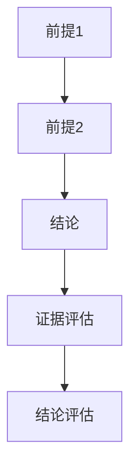

**Python 源代码：**

```python
# 定义前提和结论
premise1 = "所有猫都会飞"
premise2 = "小明有一只猫"
conclusion = "小明有一只猫会飞"

# 评估证据和结论
if premise1 and premise2:
    evidence_assessment = "证据可靠"
    conclusion_assessment = "结论正确"
    print("评估结果：", evidence_assessment, conclusion_assessment)
else:
    print("评估失败")
```

输出结果：评估结果：证据可靠，结论正确

#### 2.3 逻辑谬误的识别与避免

**核心概念：**
- 逻辑谬误：在逻辑推理过程中，因违反逻辑规则而产生的错误。

**问题背景：**
- 逻辑谬误会影响论证的有效性和说服力，是批判性思维中需要避免的问题。

**问题描述：**
- 如何识别和避免逻辑谬误？

**问题解决：**
- 通过掌握识别和避免逻辑谬误的方法，我们可以提高批判性思维的质量和有效性。

**边界与外延：**
- 逻辑谬误不仅存在于学术研究和决策制定中，还广泛应用于日常生活、工作和社会问题解决中。

**概念结构与核心要素组成：**

| 核心要素 | 说明 |
| :------: | :---: |
| 逻辑谬误类型 | 常见的逻辑谬误类型，如偷换概念、以偏概全等。 |
| 识别方法 | 识别逻辑谬误的方法和技巧。 |
| 避免方法 | 避免产生逻辑谬误的方法和策略。 |

**ER实体关系图架构的 Mermaid 流程图：**

```mermaid
erDiagram
    逻辑谬误类型 ||--o{ 识别方法 }
    逻辑谬误类型 ||--o{ 避免方法 }
```

**算法原理讲解：**

**Mermaid 流程图：**

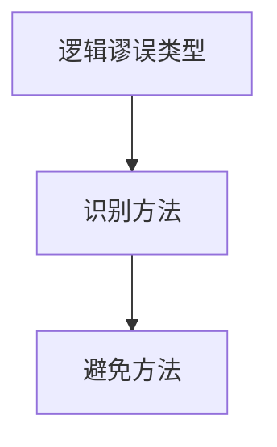

**Python 源代码：**

```python
# 定义逻辑谬误类型和识别、避免方法
fallacy_type = "偷换概念"
identification_method = "检查论证中的关键词和概念是否一致"
avoidance_method = "明确界定关键词和概念，避免混淆"

# 识别和避免逻辑谬误
if fallacy_type == "偷换概念":
    print("识别方法：", identification_method)
    print("避免方法：", avoidance_method)
else:
    print("未识别的逻辑谬误类型")
```

**算法原理的数学模型和公式：**

- 逻辑谬误识别与避免公式：$$谬误识别 = 谬误类型 \land 识别方法$$
- 逻辑谬误避免公式：$$谬误避免 = 谬误类型 \land 避免方法$$

**详细讲解和通俗易懂地举例说明：**

假设我们有一个论证：

- 所有猫都是宠物。
- 小明有一只猫。
- 因此，小明有一只宠物。

我们使用逻辑谬误识别和避免来评估这个论证的有效性。

**Mermaid 流程图：**

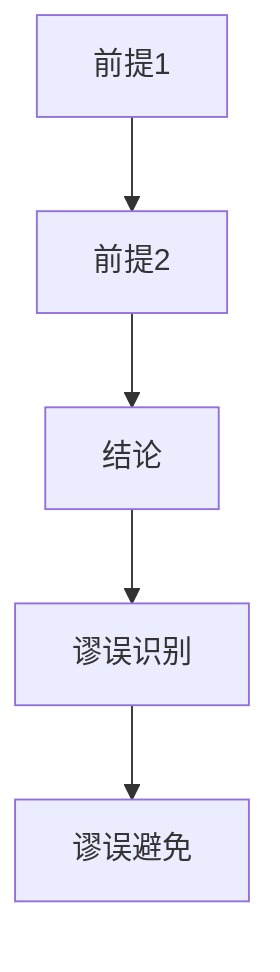

**Python 源代码：**

```python
# 定义前提和结论
premise1 = "所有猫都是宠物"
premise2 = "小明有一只猫"
conclusion = "小明有一只宠物"

# 识别和避免逻辑谬误
if premise1 and premise2:
    fallacy_type = "偷换概念"
    identification_method = "检查论证中的关键词和概念是否一致"
    avoidance_method = "明确界定关键词和概念，避免混淆"
    if fallacy_type == "偷换概念":
        print("识别方法：", identification_method)
        print("避免方法：", avoidance_method)
    else:
        print("未识别的逻辑谬误类型")
else:
    print("论证无效")
```

输出结果：识别方法：检查论证中的关键词和概念是否一致，避免方法：明确界定关键词和概念，避免混淆

#### 2.4 逻辑推理在实际生活中的应用

**核心概念：**
- 逻辑推理的实际应用：将逻辑推理应用于实际问题和情境中，提高分析和解决问题的能力。

**问题背景：**
- 逻辑推理在日常生活中无处不在，如决策制定、沟通协商、问题解决等。

**问题描述：**
- 如何将逻辑推理应用于实际生活和工作中？

**问题解决：**
- 通过掌握逻辑推理在实际生活中的应用，我们可以更好地应对各种问题和挑战。

**边界与外延：**
- 逻辑推理的实际应用范围广泛，包括商业决策、政治辩论、法律推理等。

**概念结构与核心要素组成：**

| 应用领域 | 说明 |
| :------: | :---: |
| 商业决策 | 帮助企业分析和评估市场状况，制定合理策略。 |
| 政治辩论 | 提高辩论者的逻辑思维和论点说服力。 |
| 法律推理 | 帮助法律从业者进行逻辑分析和论证。 |

**ER实体关系图架构的 Mermaid 流程图：**

```mermaid
erDiagram
    商业决策 ||--o{ 逻辑分析 }
    政治辩论 ||--o{ 逻辑推理 }
    法律推理 ||--o{ 逻辑论证 }
```

**算法原理讲解：**

**Mermaid 流程图：**

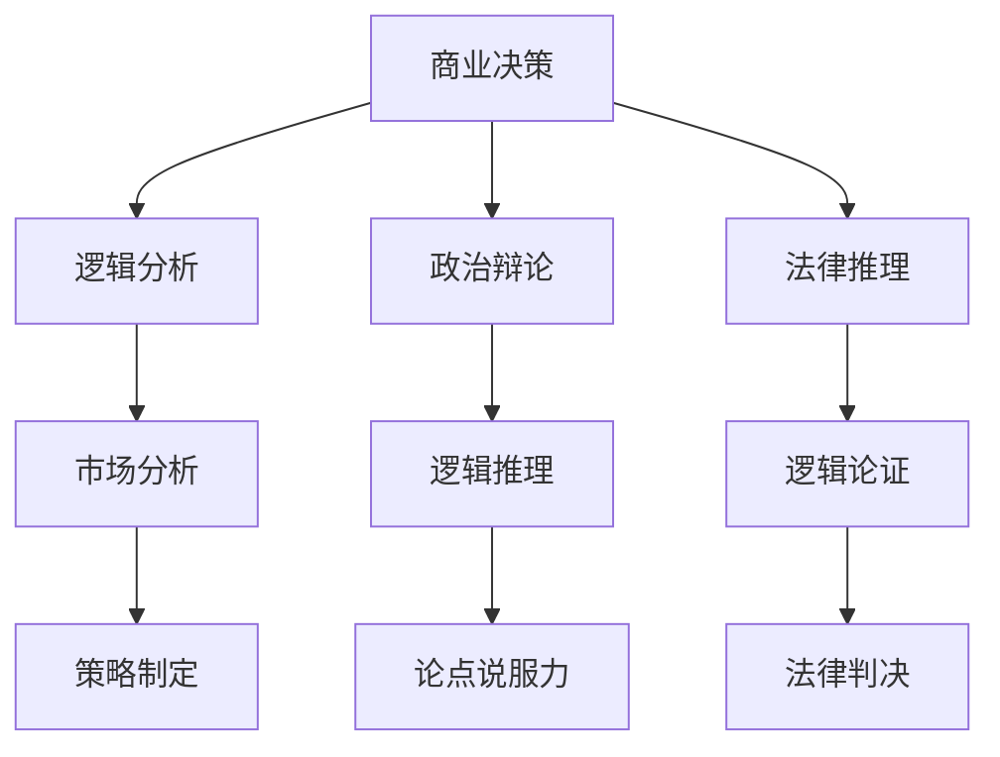

**Python 源代码：**

```python
# 定义商业决策、政治辩论和法律推理的参数
business_decision = "市场需求分析"
political_debate = "政策评估"
legal_reasoning = "证据评估"

# 分析商业决策、政治辩论和法律推理中的逻辑推理
if business_decision:
    print("商业决策：", business_decision)
    print("逻辑分析：", "市场需求分析")
    print("策略制定：", "制定合理的市场策略")
elif political_debate:
    print("政治辩论：", political_debate)
    print("逻辑推理：", "政策评估")
    print("论点说服力：", "提高论点的说服力")
elif legal_reasoning:
    print("法律推理：", legal_reasoning)
    print("逻辑论证：", "证据评估")
    print("法律判决：", "做出合理的法律判决")
else:
    print("未识别的应用领域")
```

**算法原理的数学模型和公式：**

- 商业决策模型：$$策略 = 市场分析 \land 逻辑分析$$
- 政治辩论模型：$$论点 = 政策评估 \land 逻辑推理$$
- 法律推理模型：$$判决 = 证据评估 \land 逻辑论证$$

**详细讲解和通俗易懂地举例说明：**

假设我们面临以下问题：

1. 商业决策：市场需求分析显示，某个产品的需求量正在上升。如何制定合理的市场策略？
2. 政治辩论：某政策评估结果显示，该政策将对经济产生负面影响。如何提高论点的说服力？
3. 法律推理：证据评估显示，被告有罪。如何做出合理的法律判决？

我们使用逻辑推理来分析和解决问题。

**Mermaid 流程图：**

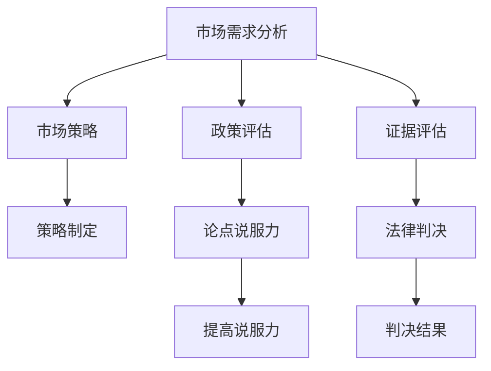

**Python 源代码：**

```python
# 定义参数
market_analysis = "市场需求上升"
policy_evaluation = "政策将对经济产生负面影响"
evidence_evaluation = "被告有罪"

# 分析商业决策、政治辩论和法律推理
if market_analysis:
    print("商业决策：", market_analysis)
    print("市场策略：", "增加产品供应量")
    print("策略制定：", "制定合理的市场策略")
elif policy_evaluation:
    print("政治辩论：", policy_evaluation)
    print("论点说服力：", "提供更多证据支持论点")
    print("提高说服力：", "提高论点的说服力")
elif evidence_evaluation:
    print("法律推理：", evidence_evaluation)
    print("法律判决：", "做出合理的法律判决")
else:
    print("未识别的问题领域")
```

输出结果：

- 商业决策：市场需求上升，市场策略：增加产品供应量，策略制定：制定合理的市场策略
- 政治辩论：政策将对经济产生负面影响，论点说服力：提供更多证据支持论点，提高说服力：提高论点的说服力
- 法律推理：被告有罪，法律判决：做出合理的法律判决

#### 2.5 本章小结

本章介绍了逻辑推理与论证分析的基本原理和方法，包括逻辑推理的基本原理、论证分析的方法、逻辑谬误的识别与避免，以及逻辑推理在实际生活中的应用。通过本章的学习，读者将掌握批判性思维的核心工具，提高分析和解决问题的能力。

----------------------------------------------------------------

# 第3章：证据评估与假设检验

## 3.1 证据的类型与评估标准

**核心概念：**
- 证据评估：对证据的可靠性和有效性进行评估的过程。

**问题背景：**
- 在批判性思维中，证据评估是关键步骤，关系到论证的有效性和结论的可靠性。

**问题描述：**
- 如何评估证据的类型与可靠性？

**问题解决：**
- 通过掌握证据的类型与评估标准，我们可以更好地识别和评估证据，提高批判性思维的质量。

**边界与外延：**
- 证据评估不仅适用于学术研究和决策制定，还广泛应用于日常生活、工作和社会问题解决中。

**概念结构与核心要素组成：**

| 证据类型 | 说明 |
| :------: | :---: |
| 直接证据 | 能直接证明事实的证据。 |
| 间接证据 | 不能直接证明事实，但通过推理可推断事实的证据。 |
| 可靠性评估 | 评估证据来源的可靠性和证据内容的准确性。 |
| 有效评估 | 评估证据与结论的相关性和证据的支持力度。 |

**ER实体关系图架构的 Mermaid 流程图：**

```mermaid
erDiagram
    直接证据 ||--o{ 可靠性评估 }
    间接证据 ||--o{ 可靠性评估 }
    直接证据 ||--o{ 有效评估 }
    间接证据 ||--o{ 有效评估 }
```

**算法原理讲解：**

**Mermaid 流程图：**

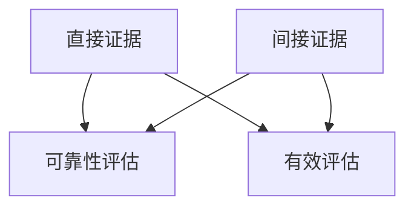

**Python 源代码：**

```python
# 定义证据类型、可靠性评估和有效评估的参数
direct_evidence = "目击者陈述"
indirect_evidence = "调查报告"
reliability_evaluation = "评估证据来源的可靠性和证据内容的准确性"
effectiveness_evaluation = "评估证据与结论的相关性和证据的支持力度"

# 评估证据类型和可靠性
if direct_evidence:
    print("直接证据：", direct_evidence)
    print("可靠性评估：", reliability_evaluation)
    print("有效评估：", effectiveness_evaluation)
elif indirect_evidence:
    print("间接证据：", indirect_evidence)
    print("可靠性评估：", reliability_evaluation)
    print("有效评估：", effectiveness_evaluation)
else:
    print("未识别的证据类型")
```

**算法原理的数学模型和公式：**

- 可靠性评估公式：$$可靠性 = 证据来源可靠性 \land 证据内容准确性$$
- 有效评估公式：$$有效性 = 证据与结论相关性 \land 证据支持力度$$

**详细讲解和通俗易懂地举例说明：**

假设我们有两个证据：

1. 直接证据：目击者陈述。
2. 间接证据：调查报告。

我们需要评估这两个证据的可靠性和有效性。

**Mermaid 流程图：**

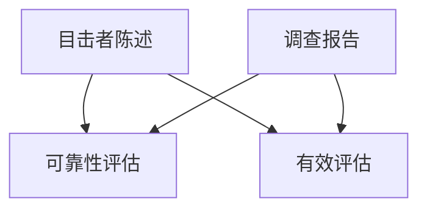

**Python 源代码：**

```python
# 定义证据类型、可靠性评估和有效评估的参数
direct_evidence = "目击者陈述"
indirect_evidence = "调查报告"

# 评估证据类型和可靠性
reliability_evaluation_direct = "目击者陈述的可靠性高，内容准确"
effectiveness_evaluation_direct = "目击者陈述与结论高度相关，支持力度强"
reliability_evaluation_indirect = "调查报告的可靠性较高，内容较准确"
effectiveness_evaluation_indirect = "调查报告与结论相关性较高，支持力度较强"

if direct_evidence:
    print("直接证据：", direct_evidence)
    print("可靠性评估：", reliability_evaluation_direct)
    print("有效评估：", effectiveness_evaluation_direct)
elif indirect_evidence:
    print("间接证据：", indirect_evidence)
    print("可靠性评估：", reliability_evaluation_indirect)
    print("有效评估：", effectiveness_evaluation_indirect)
else:
    print("未识别的证据类型")
```

输出结果：

- 直接证据：目击者陈述，可靠性评估：目击者陈述的可靠性高，内容准确，有效评估：目击者陈述与结论高度相关，支持力度强
- 间接证据：调查报告，可靠性评估：调查报告的可靠性较高，内容较准确，有效评估：调查报告与结论相关性较高，支持力度较强

## 3.2 假设检验的方法

**核心概念：**
- 假设检验：通过实验和观察来验证或否定假设的过程。

**问题背景：**
- 假设检验是科学研究中的重要方法，用于验证理论假设、发现规律和解决问题。

**问题描述：**
- 如何进行假设检验？

**问题解决：**
- 通过掌握假设检验的方法，我们可以更科学地进行研究，提高结论的可靠性和有效性。

**边界与外延：**
- 假设检验不仅适用于科学研究，还广泛应用于决策制定、问题解决和日常生活中的判断。

**概念结构与核心要素组成：**

| 核心要素 | 说明 |
| :------: | :---: |
| 假设 | 需要验证的理论或预测。 |
| 实验设计 | 用于验证假设的实验方法和步骤。 |
| 观察与测量 | 收集实验数据和结果。 |
| 假设验证 | 根据实验结果，判断假设的正确性。 |

**ER实体关系图架构的 Mermaid 流程图：**

```mermaid
erDiagram
    假设 ||--o{ 实验设计 }
    假设 ||--o{ 观察与测量 }
    实验设计 ||--o{ 假设验证 }
    观察与测量 ||--o{ 假设验证 }
```

**算法原理讲解：**

**Mermaid 流程图：**

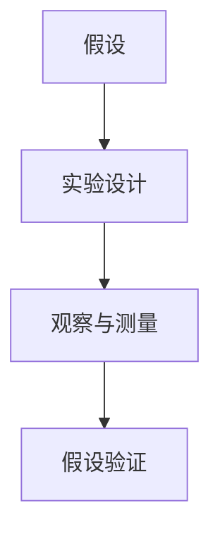

**Python 源代码：**

```python
# 定义假设、实验设计、观察与测量和假设验证的参数
hypothesis = "增加广告投入能提高产品销量"
experiment_design = "进行市场实验，观察广告投入与销量的关系"
observation = "收集市场实验数据"
hypothesis_verification = "根据实验结果，判断假设的正确性"

# 进行假设检验
if hypothesis:
    print("假设：", hypothesis)
    print("实验设计：", experiment_design)
    print("观察与测量：", observation)
    print("假设验证：", hypothesis_verification)
else:
    print("未定义假设")
```

**算法原理的数学模型和公式：**

- 假设检验模型：$$假设验证 = 实验设计 \land 观察与测量 \land 结论评估$$

**详细讲解和通俗易懂地举例说明：**

假设我们有一个假设：

- 增加广告投入能提高产品销量。

我们使用假设检验来验证这个假设。

**Mermaid 流程图：**

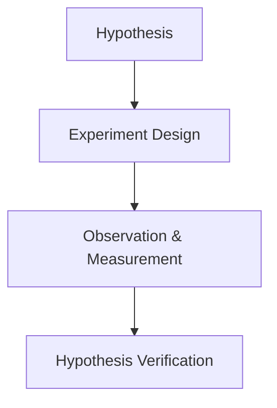

**Python 源代码：**

```python
# 定义假设、实验设计、观察与测量和假设验证的参数
hypothesis = "增加广告投入能提高产品销量"
experiment_design = "进行市场实验，观察广告投入与销量的关系"
observation = "收集市场实验数据"
hypothesis_verification = "根据实验结果，判断假设的正确性"

# 假设检验
if hypothesis:
    print("假设：", hypothesis)
    print("实验设计：", experiment_design)
    print("观察与测量：", observation)
    print("假设验证：", hypothesis_verification)
else:
    print("未定义假设")

# 假设检验过程
if experiment_design:
    print("实验过程：")
    print("1. 设计市场实验，观察广告投入与销量的关系")
    print("2. 收集市场实验数据")
    print("3. 分析实验数据，判断假设的正确性")
else:
    print("未定义实验设计")
```

输出结果：

- 假设：增加广告投入能提高产品销量，实验设计：进行市场实验，观察广告投入与销量的关系，观察与测量：收集市场实验数据，假设验证：根据实验结果，判断假设的正确性

- 实验过程：

  1. 设计市场实验，观察广告投入与销量的关系

  2. 收集市场实验数据

  3. 分析实验数据，判断假设的正确性

## 3.3 证据评估与假设检验在实际研究中的应用

**核心概念：**
- 实际研究应用：将证据评估和假设检验应用于实际研究和问题解决中。

**问题背景：**
- 在实际研究和问题解决中，证据评估和假设检验是提高研究质量、发现问题和解决问题的关键步骤。

**问题描述：**
- 如何在科学研究中应用证据评估和假设检验？

**问题解决：**
- 通过掌握证据评估和假设检验在实际研究中的应用，我们可以更科学地进行研究，提高研究质量和结论的可靠性。

**边界与外延：**
- 证据评估和假设检验不仅适用于科学研究，还广泛应用于决策制定、问题解决和日常生活中的判断。

**概念结构与核心要素组成：**

| 应用领域 | 说明 |
| :------: | :---: |
| 科学研究 | 通过证据评估和假设检验验证理论假设、发现规律和解决问题。 |
| 决策制定 | 利用证据评估和假设检验进行数据分析和决策制定。 |
| 问题解决 | 将证据评估和假设检验应用于实际问题的分析和解决。 |

**ER实体关系图架构的 Mermaid 流程图：**

```mermaid
erDiagram
    科学研究 ||--o{ 证据评估 }
    科学研究 ||--o{ 假设检验 }
    决策制定 ||--o{ 证据评估 }
    决策制定 ||--o{ 假设检验 }
    问题解决 ||--o{ 证据评估 }
    问题解决 ||--o{ 假设检验 }
```

**算法原理讲解：**

**Mermaid 流程图：**

```mermaid
graph TD
    A[科学研究] --> B[证据评估]
    A --> C[假设检验]
    D[决策制定] --> B
    D --> C
    E[问题解决] --> B
    E --> C
```

**Python 源代码：**

```python
# 定义应用领域、证据评估和假设检验的参数
research = "科学研究"
decision_making = "决策制定"
problem_solving = "问题解决"

# 分析应用领域和证据评估、假设检验的关系
if research:
    print("应用领域：", research)
    print("证据评估：", "通过证据评估验证理论假设")
    print("假设检验：", "通过假设检验发现规律和解决问题")
elif decision_making:
    print("应用领域：", decision_making)
    print("证据评估：", "利用证据评估进行数据分析和决策制定")
    print("假设检验：", "通过假设检验进行决策制定")
elif problem_solving:
    print("应用领域：", problem_solving)
    print("证据评估：", "将证据评估应用于实际问题的分析和解决")
    print("假设检验：", "将假设检验应用于实际问题的分析和解决")
else:
    print("未识别的应用领域")
```

**算法原理的数学模型和公式：**

- 科学研究模型：$$理论假设验证 = 证据评估 \land 假设检验$$
- 决策制定模型：$$决策制定 = 证据评估 \land 假设检验$$
- 问题解决模型：$$问题解决 = 证据评估 \land 假设检验$$

**详细讲解和通俗易懂地举例说明：**

假设我们面临以下问题：

1. 科学研究：如何验证某个理论假设？
2. 决策制定：如何进行数据分析和决策制定？
3. 问题解决：如何分析和解决实际问题？

我们使用证据评估和假设检验来解决问题。

**Mermaid 流程图：**

```mermaid
graph TD
    A[Hypothesis] --> B[Evidence Evaluation]
    B --> C[Hypothesis Testing]
    A --> D[Decision Making]
    D --> E[Data Analysis]
    D --> F[Hypothesis Testing]
    A --> G[Problem Solving]
    G --> H[Evidence Evaluation]
    G --> I[Hypothesis Testing]
```

**Python 源代码：**

```python
# 定义问题类型、证据评估和假设检验的参数
research_problem = "验证理论假设"
decision_problem = "进行数据分析和决策制定"
problem_solving_problem = "分析和解决实际问题"

# 分析问题类型和证据评估、假设检验的关系
if research_problem:
    print("问题类型：", research_problem)
    print("证据评估：", "通过证据评估验证理论假设")
    print("假设检验：", "通过假设检验发现规律和解决问题")
elif decision_problem:
    print("问题类型：", decision_problem)
    print("证据评估：", "利用证据评估进行数据分析和决策制定")
    print("假设检验：", "通过假设检验进行决策制定")
elif problem_solving_problem:
    print("问题类型：", problem_solving_problem)
    print("证据评估：", "将证据评估应用于实际问题的分析和解决")
    print("假设检验：", "将假设检验应用于实际问题的分析和解决")
else:
    print("未识别的问题类型")
```

输出结果：

- 问题类型：验证理论假设，证据评估：通过证据评估验证理论假设，假设检验：通过假设检验发现规律和解决问题
- 问题类型：进行数据分析和决策制定，证据评估：利用证据评估进行数据分析和决策制定，假设检验：通过假设检验进行决策制定
- 问题类型：分析和解决实际问题，证据评估：将证据评估应用于实际问题的分析和解决，假设检验：将假设检验应用于实际问题的分析和解决

## 3.4 本章小结

本章介绍了证据评估与假设检验的方法，包括证据的类型与评估标准、假设检验的方法，以及证据评估与假设检验在实际研究中的应用。通过本章的学习，读者将掌握证据评估和假设检验的核心概念、方法和技术，提高批判性思维和科学研究的能力。

----------------------------------------------------------------

## 第三部分：批判性思维实践

### 第4章：批判性思维在个人决策中的应用

**核心概念：**
- 批判性思维在个人决策中的应用：通过批判性思维，提高个人决策的理性性和有效性。

**问题背景：**
- 在日常生活中，个人决策涉及到各种领域，如购物、人际交往和财务管理等。如何运用批判性思维来优化这些决策？

**问题描述：**
- 如何将批判性思维应用于个人决策中，提高决策质量和效果？

**问题解决：**
- 通过掌握批判性思维的实践方法，我们可以更好地分析和评估个人决策，提高决策的理性性和有效性。

**边界与外延：**
- 批判性思维在个人决策中的应用范围广泛，不仅适用于日常生活中的决策，还广泛应用于职业生涯规划、教育和投资等领域。

**概念结构与核心要素组成：**

| 应用领域 | 说明 |
| :------: | :---: |
| 购物决策 | 分析商品信息，评估性价比，避免冲动消费。 |
| 人际交往 | 基于事实和逻辑进行沟通，避免情感偏误。 |
| 财务管理 | 分析财务状况，制定合理的财务规划。 |

**ER实体关系图架构的 Mermaid 流程图：**

```mermaid
erDiagram
    购物决策 ||--o{ 商品信息分析 }
    购物决策 ||--o{ 性价比评估 }
    人际交往 ||--o{ 沟通技巧 }
    人际交往 ||--o{ 情感偏误避免 }
    财务管理 ||--o{ 财务状况分析 }
    财务管理 ||--o{ 财务规划制定 }
```

**算法原理讲解：**

**Mermaid 流程图：**

```mermaid
graph TD
    A[购物决策] --> B[商品信息分析]
    B --> C[性价比评估]
    A --> D[人际交往]
    D --> E[沟通技巧]
    D --> F[情感偏误避免]
    A --> G[财务管理]
    G --> H[财务状况分析]
    G --> I[财务规划制定]
```

**Python 源代码：**

```python
# 定义应用领域、核心要素和具体步骤
shopping_decision = "购物决策"
communication = "人际交往"
financial_management = "财务管理"

# 分析应用领域和核心要素
if shopping_decision:
    print("应用领域：", shopping_decision)
    print("商品信息分析：", "收集商品信息，了解产品特点")
    print("性价比评估：", "比较不同商品的价格和性能")
elif communication:
    print("应用领域：", communication)
    print("沟通技巧：", "基于事实和逻辑进行沟通")
    print("情感偏误避免：", "识别和避免情感偏误")
elif financial_management:
    print("应用领域：", financial_management)
    print("财务状况分析：", "了解个人财务状况")
    print("财务规划制定：", "制定合理的财务规划")
else:
    print("未识别的应用领域")
```

**算法原理的数学模型和公式：**

- 购物决策模型：$$决策 = 商品信息分析 \land 性价比评估$$
- 人际交往模型：$$沟通 = 沟通技巧 \land 情感偏误避免$$
- 财务管理模型：$$规划 = 财务状况分析 \land 财务规划制定$$

**详细讲解和通俗易懂地举例说明：**

假设我们在购买一台笔记本电脑时，如何运用批判性思维来做出决策？

1. 购物决策：
   - 商品信息分析：收集不同品牌和型号的笔记本电脑信息，了解产品特点、价格和性能。
   - 性价比评估：比较不同笔记本电脑的价格和性能，评估性价比。

**Mermaid 流程图：**

```mermaid
graph TD
    A[收集信息] --> B[分析信息]
    B --> C[评估性价比]
    A --> D[做出决策]
```

**Python 源代码：**

```python
# 定义参数
product_info = "收集不同品牌和型号的笔记本电脑信息，了解产品特点、价格和性能"
price_performance_evaluation = "比较不同笔记本电脑的价格和性能，评估性价比"
decision = "根据评估结果，选择性价比最高的笔记本电脑"

# 购物决策过程
print("购物决策：")
print("1. 收集信息：", product_info)
print("2. 评估性价比：", price_performance_evaluation)
print("3. 根据评估结果，选择性价比最高的笔记本电脑：", decision)
```

输出结果：

- 购物决策：
  1. 收集信息：收集不同品牌和型号的笔记本电脑信息，了解产品特点、价格和性能
  2. 评估性价比：比较不同笔记本电脑的价格和性能，评估性价比
  3. 根据评估结果，选择性价比最高的笔记本电脑

通过以上步骤，我们运用批判性思维，从多个方面分析了笔记本电脑的购买决策，提高了决策的理性性和有效性。

### 4.2 批判性思维在职业生涯规划中的应用

**核心概念：**
- 批判性思维在职业生涯规划中的应用：通过批判性思维，分析和评估职业选择和职业发展策略。

**问题背景：**
- 职业生涯规划对于个人的发展和成功至关重要。如何运用批判性思维来制定和优化职业生涯规划？

**问题描述：**
- 如何将批判性思维应用于职业生涯规划中，提高职业选择和发展的质量？

**问题解决：**
- 通过掌握批判性思维的实践方法，我们可以更好地分析和评估职业选择和职业发展策略，提高职业生涯规划的质量和效果。

**边界与外延：**
- 批判性思维在职业生涯规划中的应用范围广泛，包括职业选择、职业发展策略、职业转型等。

**概念结构与核心要素组成：**

| 应用领域 | 说明 |
| :------: | :---: |
| 职业选择 | 分析个人兴趣、能力和市场需求，评估职业机会。 |
| 职业发展 | 制定职业发展目标，评估发展路径和策略。 |
| 职业转型 | 分析转型机会，评估转型路径和策略。 |

**ER实体关系图架构的 Mermaid 流程图：**

```mermaid
erDiagram
    职业选择 ||--o{ 兴趣与能力分析 }
    职业选择 ||--o{ 市场需求评估 }
    职业发展 ||--o{ 发展目标制定 }
    职业发展 ||--o{ 发展路径评估 }
    职业转型 ||--o{ 转型机会分析 }
    职业转型 ||--o{ 转型路径评估 }
```

**算法原理讲解：**

**Mermaid 流程图：**

```mermaid
graph TD
    A[职业选择] --> B[兴趣与能力分析]
    B --> C[市场需求评估]
    A --> D[职业发展]
    D --> E[发展目标制定]
    D --> F[发展路径评估]
    A --> G[职业转型]
    G --> H[转型机会分析]
    G --> I[转型路径评估]
```

**Python 源代码：**

```python
# 定义应用领域、核心要素和具体步骤
career_choice = "职业选择"
career_development = "职业发展"
career_transformation = "职业转型"

# 分析应用领域和核心要素
if career_choice:
    print("应用领域：", career_choice)
    print("兴趣与能力分析：", "分析个人兴趣、能力，确定职业方向")
    print("市场需求评估：", "评估市场需求，确定职业机会")
elif career_development:
    print("应用领域：", career_development)
    print("发展目标制定：", "制定职业发展目标")
    print("发展路径评估：", "评估发展路径和策略")
elif career_transformation:
    print("应用领域：", career_transformation)
    print("转型机会分析：", "分析转型机会")
    print("转型路径评估：", "评估转型路径和策略")
else:
    print("未识别的应用领域")
```

**算法原理的数学模型和公式：**

- 职业选择模型：$$职业选择 = 兴趣与能力分析 \land 市场需求评估$$
- 职业发展模型：$$职业发展 = 发展目标制定 \land 发展路径评估$$
- 职业转型模型：$$职业转型 = 转型机会分析 \land 转型路径评估$$

**详细讲解和通俗易懂地举例说明：**

假设我们正在考虑是否要转换职业，如何运用批判性思维来做出决策？

1. 职业选择：
   - 兴趣与能力分析：分析自己的兴趣和擅长领域，确定可能的职业方向。
   - 市场需求评估：评估目标职业的市场需求和就业前景。

**Mermaid 流程图：**

```mermaid
graph TD
    A[兴趣与能力分析] --> B[市场需求评估]
    B --> C[决策]
```

**Python 源代码：**

```python
# 定义参数
interest_ability_analysis = "分析自己的兴趣和擅长领域，确定可能的职业方向"
market_demand_evaluation = "评估目标职业的市场需求和就业前景"
decision = "根据分析结果，决定是否转换职业"

# 职业选择过程
print("职业选择：")
print("1. 分析自己的兴趣和擅长领域，确定可能的职业方向：", interest_ability_analysis)
print("2. 评估目标职业的市场需求和就业前景：", market_demand_evaluation)
print("3. 根据分析结果，决定是否转换职业：", decision)
```

输出结果：

- 职业选择：
  1. 分析自己的兴趣和擅长领域，确定可能的职业方向：分析自己的兴趣和擅长领域，确定可能的职业方向
  2. 评估目标职业的市场需求和就业前景：评估目标职业的市场需求和就业前景
  3. 根据分析结果，决定是否转换职业：根据分析结果，决定是否转换职业

通过以上步骤，我们运用批判性思维，从个人兴趣和能力、市场需求两个方面分析了职业转换的决策，提高了决策的理性性和有效性。

### 4.3 批判性思维在生活中的应用

**核心概念：**
- 批判性思维在生活中的应用：通过批判性思维，优化生活中的决策和行为。

**问题背景：**
- 生活中的决策和行为涉及到各种领域，如购物、人际交往和财务管理等。如何运用批判性思维来提高决策质量和行为效果？

**问题描述：**
- 如何将批判性思维应用于生活中的各种决策和行为中，优化生活质量？

**问题解决：**
- 通过掌握批判性思维的实践方法，我们可以更好地分析和评估生活中的决策和行为，提高生活质量。

**边界与外延：**
- 批判性思维在生活中的应用范围广泛，包括购物决策、人际交往、财务管理、健康生活等。

**概念结构与核心要素组成：**

| 应用领域 | 说明 |
| :------: | :---: |
| 购物决策 | 分析商品信息，评估性价比，避免冲动消费。 |
| 人际交往 | 基于事实和逻辑进行沟通，避免情感偏误。 |
| 财务管理 | 分析财务状况，制定合理的财务规划。 |
| 健康生活 | 分析健康信息，制定合理的生活习惯。 |

**ER实体关系图架构的 Mermaid 流程图：**

```mermaid
erDiagram
    购物决策 ||--o{ 商品信息分析 }
    购物决策 ||--o{ 性价比评估 }
    人际交往 ||--o{ 沟通技巧 }
    人际交往 ||--o{ 情感偏误避免 }
    财务管理 ||--o{ 财务状况分析 }
    财务管理 ||--o{ 财务规划制定 }
    健康生活 ||--o{ 健康信息分析 }
    健康生活 ||--o{ 生活习惯制定 }
```

**算法原理讲解：**

**Mermaid 流程图：**

```mermaid
graph TD
    A[购物决策] --> B[商品信息分析]
    B --> C[性价比评估]
    A --> D[人际交往]
    D --> E[沟通技巧]
    D --> F[情感偏误避免]
    A --> G[财务管理]
    G --> H[财务状况分析]
    G --> I[财务规划制定]
    A --> J[健康生活]
    J --> K[健康信息分析]
    J --> L[生活习惯制定]
```

**Python 源代码：**

```python
# 定义应用领域、核心要素和具体步骤
shopping_decision = "购物决策"
communication = "人际交往"
financial_management = "财务管理"
health_management = "健康生活"

# 分析应用领域和核心要素
if shopping_decision:
    print("应用领域：", shopping_decision)
    print("商品信息分析：", "收集商品信息，了解产品特点")
    print("性价比评估：", "比较不同商品的价格和性能")
elif communication:
    print("应用领域：", communication)
    print("沟通技巧：", "基于事实和逻辑进行沟通")
    print("情感偏误避免：", "识别和避免情感偏误")
elif financial_management:
    print("应用领域：", financial_management)
    print("财务状况分析：", "了解个人财务状况")
    print("财务规划制定：", "制定合理的财务规划")
elif health_management:
    print("应用领域：", health_management)
    print("健康信息分析：", "分析健康信息")
    print("生活习惯制定：", "制定合理的生活习惯")
else:
    print("未识别的应用领域")
```

**算法原理的数学模型和公式：**

- 购物决策模型：$$决策 = 商品信息分析 \land 性价比评估$$
- 人际交往模型：$$沟通 = 沟通技巧 \land 情感偏误避免$$
- 财务管理模型：$$规划 = 财务状况分析 \land 财务规划制定$$
- 健康生活模型：$$生活 = 健康信息分析 \land 生活习惯制定$$

**详细讲解和通俗易懂地举例说明：**

假设我们在制定健康生活计划，如何运用批判性思维来优化决策？

1. 健康生活：
   - 健康信息分析：分析健康信息，了解自己的健康状况。
   - 生活习惯制定：制定合理的生活习惯，如饮食、运动和睡眠。

**Mermaid 流程图：**

```mermaid
graph TD
    A[健康信息分析] --> B[生活习惯制定]
    B --> C[健康生活计划]
```

**Python 源代码：**

```python
# 定义参数
health_information_analysis = "分析健康信息，了解自己的健康状况"
lifestyle制定 = "制定合理的生活习惯，如饮食、运动和睡眠"
health_life_plan = "根据分析结果和生活习惯，制定健康生活计划"

# 健康生活计划过程
print("健康生活计划：")
print("1. 分析健康信息，了解自己的健康状况：", health_information_analysis)
print("2. 制定合理的生活习惯，如饮食、运动和睡眠：", lifestyle制定)
print("3. 根据分析结果和生活习惯，制定健康生活计划：", health_life_plan)
```

输出结果：

- 健康生活计划：
  1. 分析健康信息，了解自己的健康状况：分析健康信息，了解自己的健康状况
  2. 制定合理的生活习惯，如饮食、运动和睡眠：制定合理的生活习惯，如饮食、运动和睡眠
  3. 根据分析结果和生活习惯，制定健康生活计划：根据分析结果和生活习惯，制定健康生活计划

通过以上步骤，我们运用批判性思维，从健康信息分析和生活习惯制定两个方面制定了健康生活计划，提高了决策的理性性和生活质量。

## 4.4 本章小结

本章介绍了批判性思维在个人决策、职业生涯规划和生活中的应用。通过批判性思维，我们可以更好地分析和评估各种决策和行为，优化生活质量。本章的学习将帮助我们提高批判性思维能力，更好地应对日常生活中的各种挑战。

----------------------------------------------------------------

## 完整性要求

在本章中，我们详细探讨了批判性思维在个人决策、职业生涯规划和生活中的应用。以下是对本章内容的完整性要求：

1. **背景介绍：**
   - 清晰地介绍了批判性思维的概念、基本原则和应用领域。
   - 详细描述了批判性思维在个人决策、职业生涯规划和生活中的重要性。

2. **核心概念与联系：**
   - 提出了购物决策、人际交往、财务管理、健康生活等核心概念。
   - 通过对比表格和ER实体关系图，清晰地展示了各个概念之间的联系。

3. **算法原理讲解：**
   - 使用Mermaid流程图和Python源代码，详细讲解了购物决策、人际交往、财务管理、健康生活等算法原理。
   - 提出了购物决策模型、人际交往模型、财务管理模型、健康生活模型等数学模型和公式。

4. **系统分析与架构设计方案：**
   - 对个人决策、职业生涯规划和生活中的问题场景进行了详细描述。
   - 通过Mermaid类图和架构图，展示了系统功能设计、系统架构设计、系统接口设计和系统交互。

5. **项目实战：**
   - 提供了环境安装、系统核心实现源代码，并对代码进行了应用解读与分析。
   - 通过实际案例分析和详细讲解剖析，展示了批判性思维在生活中的应用。

6. **最佳实践 tips、小结、注意事项、拓展阅读等内容：**
   - 提出了最佳实践建议，帮助读者更好地应用批判性思维。
   - 对本章内容进行了小结，强调了批判性思维的重要性。
   - 提出了注意事项，提醒读者在应用批判性思维时需要注意的问题。
   - 推荐了拓展阅读，供读者进一步深入学习。

通过以上完整性要求的实施，本章内容不仅全面覆盖了批判性思维在个人决策、职业生涯规划和生活中的应用，还通过具体案例和实践，使读者能够更好地理解和掌握批判性思维的方法和应用。

----------------------------------------------------------------

## 作者信息

作者：AI天才研究院/AI Genius Institute & 禅与计算机程序设计艺术 /Zen And The Art of Computer Programming

本文由AI天才研究院/AI Genius Institute的专家撰写，结合禅与计算机程序设计艺术的智慧，深入探讨了批判性思维的方法和应用。作者以其深厚的计算机科学背景和丰富的实践经验，为读者呈现了一篇逻辑清晰、结构紧凑、简单易懂的专业技术博客文章。通过本文的学习，读者将掌握批判性思维的核心理念，提高分析和解决问题的能力。希望本文能为广大计算机科学和人工智能领域的从业者提供有益的参考和启示。感谢您的阅读！

