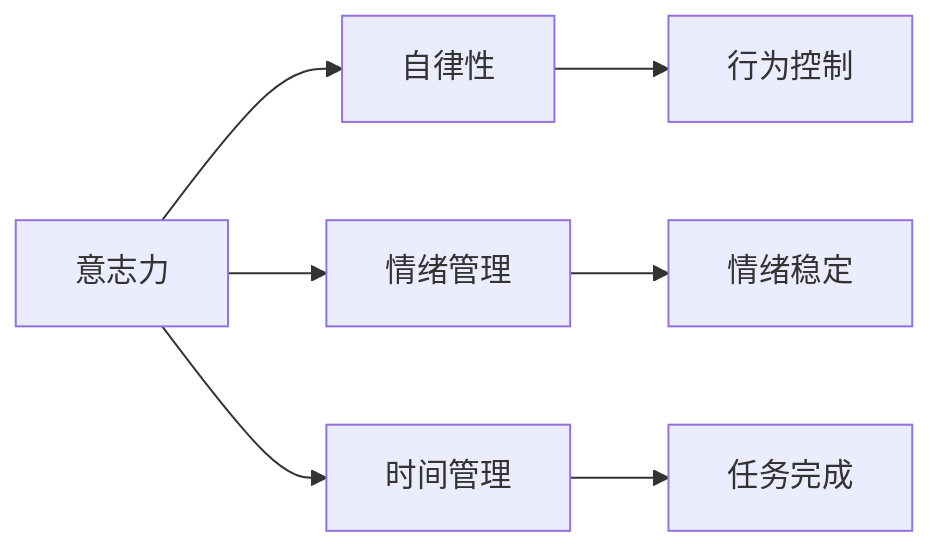
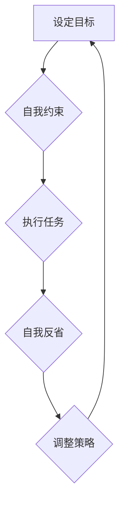
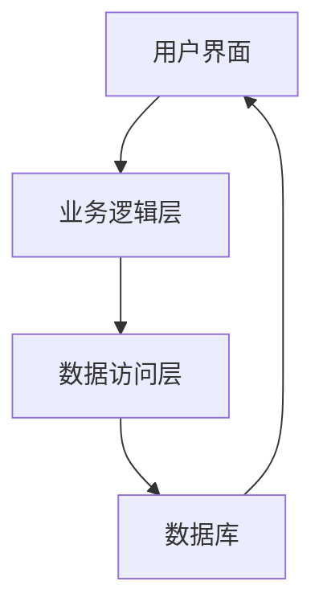
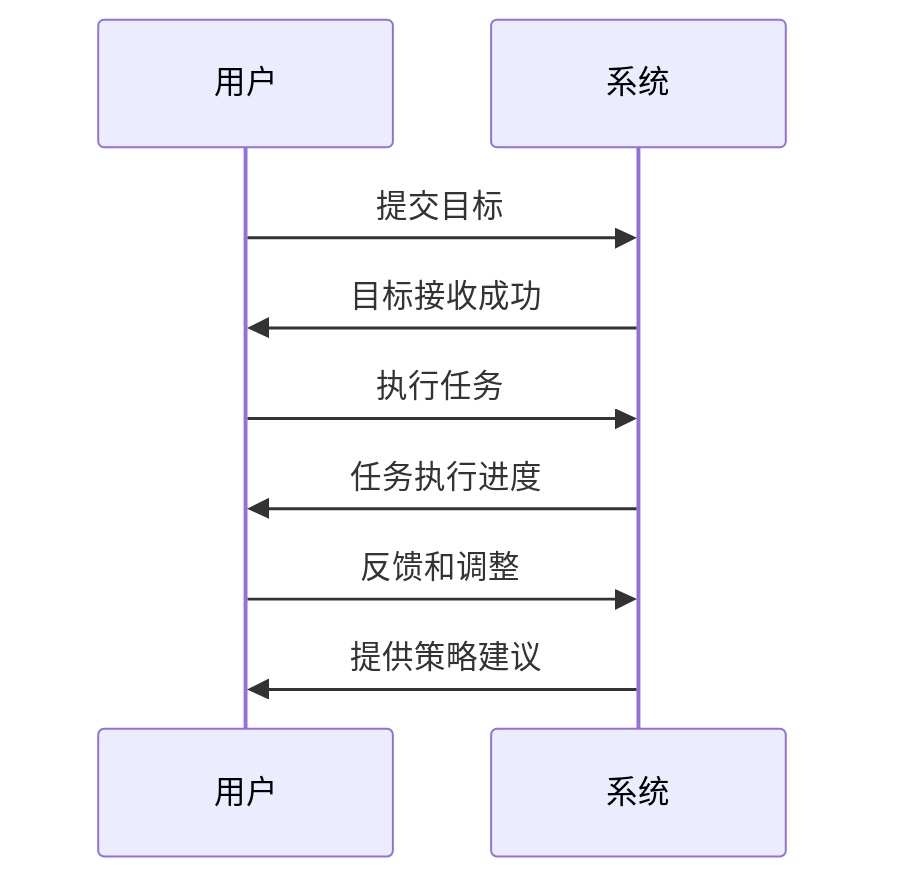

                 

### 引言

在现代社会中，个体与集体的关系日益紧密，自我约束作为一种内在力量，在个人成长与集体实践中发挥着关键作用。新苦行主义（New Asceticism）作为一种新兴的自我约束形式，以其独特的理念和集体实践方式，正逐渐引起广泛关注。新苦行主义不仅强调个体内心的自律，更注重集体中的共同实践，通过自我挑战和团队合作，实现个人与集体的双重提升。

本文将围绕新苦行主义展开，深入探讨其背景、核心概念、集体实践、心理学基础以及未来发展。首先，我们将介绍新苦行主义的起源与发展，阐述其在现代社会中的重要性。接着，我们将详细解释自我约束的定义和特点，探讨自我约束在集体实践中的应用及其影响。随后，文章将描述新苦行主义的集体实践方法，分析其实践效果和具体案例。在心理学层面，我们将探讨新苦行主义与心理学的联系，引用相关研究和理论。进一步，我们将分析新苦行主义在不同场景下的实践效果，探讨其未来发展。最后，文章将对新苦行主义的整体评价进行总结，并提出改进建议。

通过上述分析，本文旨在为新苦行主义提供一个全面而深入的解读，帮助读者更好地理解这一概念，并在实际应用中取得更好的效果。

### 新苦行主义的背景

新苦行主义作为一种自我约束的集体实践形式，其起源可以追溯到古代的苦行主义（Asceticism）。苦行主义最早见于宗教领域，如基督教和佛教中的修行者通过自我节制、极端的自我约束来追求精神上的升华。随着时间的推移，苦行主义逐渐从宗教领域扩展到世俗生活中，成为个人自我提升和社会道德规范的一部分。

在现代社会，新苦行主义得到了新的诠释和发展。它不仅继承了传统苦行主义的自我约束理念，更结合了现代社会的实际需求，尤其是在个人成长和集体合作方面。随着科技的发展和信息社会的到来，个体面临的挑战日益复杂，单一的自我约束已经无法满足个人和集体的需求。新苦行主义应运而生，通过自我挑战和团队合作，帮助个体在面对复杂环境时，实现自我超越和共同进步。

新苦行主义的重要意义在于它提供了一种全新的自我提升方式，不仅关注个体的内心修养，更注重集体中的互助与合作。在现代社会，个体的独立性和集体的依赖性并存，新苦行主义通过自我约束和集体实践，实现了个体与集体的和谐统一。它不仅有助于个人的心理健康和道德修养，还能够提升团队协作能力和社会整体发展水平。

总的来说，新苦行主义不仅是个人自我提升的工具，更是集体实践的重要方式。它为现代社会提供了一种全新的自我约束理念，引导个体在自我挑战中实现成长，在集体合作中实现共同进步。

### 核心概念：自我约束

自我约束（Self-discipline）是理解新苦行主义的关键。简单来说，自我约束是指个体在面对诱惑或困难时，能够通过自己的意志力来控制行为，实现预定目标的能力。自我约束不仅涉及行为的控制，还包括情绪管理和时间管理等方面。一个具有高度自我约束的人，能够在纷繁复杂的环境中保持清醒和冷静，有条不紊地实现个人目标。

自我约束的特点可以归纳为以下几个方面：

1. **意志力**：自我约束的基础是坚强的意志力。意志力使个体能够抵制诱惑，坚持正确的行动路径，即使在面临困难和挫折时也不轻易放弃。
2. **自律性**：自我约束要求个体具有高度的自律性，能够在没有外部监督的情况下，自觉遵循预定规则和计划。
3. **情绪管理**：自我约束还包括情绪管理能力，个体需要在面对压力和挑战时，保持冷静和理智，避免情绪失控影响行为决策。
4. **时间管理**：有效的时间管理是自我约束的重要体现，个体需要合理安排时间，确保重要任务的优先完成。

为了更直观地理解自我约束的特点，我们可以通过以下比较表格来分析自我约束与自由放任、外部约束之间的差异：

| 特点              | 自我约束           | 自由放任           | 外部约束           |
|-----------------|-----------------|-----------------|-----------------|
| 意志力           | 高               | 低               | 中               |
| 自律性           | 高               | 低               | 中               |
| 情绪管理         | 强              | 弱              | 中               |
| 时间管理         | 有序             | 随意             | 受控             |

此外，为了更好地展示自我约束的概念结构，我们使用Mermaid流程图来绘制一个简单的ER图（实体关系图），以帮助读者理解各个要素之间的关系：

在这个ER图中，意志力是核心要素，它通过自律性、情绪管理和时间管理三个维度影响个体的行为控制和任务完成。这种结构不仅有助于我们理解自我约束的概念，也为后续章节中的讨论提供了基础。

通过以上分析，我们可以看到，自我约束在新苦行主义中扮演着至关重要的角色。它不仅是个体自我提升的基石，也是集体实践中不可或缺的一部分。在接下来的章节中，我们将进一步探讨自我约束在集体实践中的应用及其效果。

### 自我约束与集体实践的关系

自我约束与集体实践之间存在着紧密的联系，这种关系不仅体现在个体的行为控制上，更在集体的协作与共同进步中得以体现。首先，自我约束为集体实践提供了内在的动力。在集体中，每个成员都通过自我约束来规范自己的行为，这种内在的自律性使得团队能够高效协作，共同实现目标。例如，在一个软件开发团队中，成员通过自我约束保持代码质量，按时完成任务，从而确保项目的顺利进行。

其次，集体实践对自我约束有显著的影响。通过集体实践，个体能够更好地认识到自我约束的重要性，并在实际操作中不断改进和加强。集体实践提供了一个相互监督和激励的环境，个体在团队中不仅需要自我约束，还需要适应和配合其他成员。这种相互影响有助于个体在自我约束的基础上，进一步培养出合作精神和团队意识。

具体来说，自我约束在集体实践中的应用可以表现在以下几个方面：

1. **自我挑战**：个体在集体中设定自我挑战目标，如提高工作效率、提升技能水平等。这种自我挑战不仅能够激励个体自我提升，还能通过集体的反馈和认可，进一步增强自我约束的执行力。

2. **团队合作**：在集体实践中，团队合作是实现目标的关键。团队成员通过自我约束，保持高度的协作精神，共同面对挑战和解决问题。这种协作不仅提升了工作效率，也增强了团队成员之间的信任和凝聚力。

3. **共同目标**：集体实践中的共同目标为个体提供了明确的行动方向。个体在追求共同目标的过程中，需要通过自我约束来确保自己的行为与团队目标一致。这种共同目标的实现，不仅有助于个体的自我提升，也推动了集体整体的进步。

总之，自我约束与集体实践相互促进，共同推动个体和集体的双重提升。通过自我约束，个体能够更好地实现自我目标；通过集体实践，个体在合作中不断成长，为集体的整体进步贡献力量。

### 新苦行主义的集体实践方法

新苦行主义通过一系列具体的实践方法，实现了自我约束和集体合作的有机结合。以下是一些常见的实践方法及其效果分析：

#### 自我挑战

自我挑战是新苦行主义中的一项核心实践。个体在自我挑战中设定具有挑战性的目标，通过自我约束和意志力去实现这些目标。例如，一个程序员可能设定每天学习两小时新技能的目标，或者一个创业者可能会设立在六个月内完成一个重大项目的目标。自我挑战不仅能够提升个体的自我约束能力，还能增强其应对压力和挑战的心理素质。

**效果分析**：自我挑战能够显著提升个体的自律性和意志力。通过持续的自我挑战，个体能够逐步克服惰性和拖延，培养出更强的自我管理能力。同时，自我挑战的成功经验也能增强个体的自信心，使其在面对未来的挑战时更加从容。

#### 团队合作

团队合作是新苦行主义中另一个重要的实践方法。在团队中，每个成员都通过自我约束来确保自己的行为和表现符合团队目标。团队合作不仅要求个体有高度的自律性，还需要成员之间相互支持、协作，共同面对困难和挑战。

**效果分析**：团队合作能够有效提升团队的整体效能。在自我约束的基础上，团队成员能够更好地协调和配合，提高工作效率和团队凝聚力。通过团队合作，个体不仅能够在团队中发挥自己的优势，还能从其他成员的经验和技能中受益，实现个人和集体的共同成长。

#### 自我反省

自我反省是新苦行主义中不可或缺的一环。通过定期自我反省，个体能够审视自己的行为和表现，发现并改正不足，不断优化自己的实践方法。自我反省不仅有助于个体的自我提升，还能为集体实践提供宝贵的反馈和改进建议。

**效果分析**：自我反省能够显著提升个体的自我认知和反思能力。通过自我反省，个体能够更加清晰地认识到自己的优点和不足，从而制定更加有效的自我提升计划。同时，自我反省也为团队提供了宝贵的反馈，有助于集体实践的不断优化。

#### 集体活动

集体活动是新苦行主义中的一种实践形式，通过集体组织的活动，如户外拓展、团队合作游戏等，个体能够在实践中培养自我约束和团队协作的能力。

**效果分析**：集体活动能够增强个体的团队意识和协作能力。通过集体活动，个体不仅能够在轻松愉快的氛围中培养自我约束，还能加深与其他成员的相互了解和信任，为团队合作的顺利进行打下坚实基础。

总的来说，新苦行主义的集体实践方法通过自我挑战、团队合作、自我反省和集体活动等多种形式，实现了自我约束与集体合作的有机结合。这些方法不仅有助于个体的自我提升，还推动了集体的共同进步。在接下来的章节中，我们将进一步探讨新苦行主义在不同场景下的具体实践效果。

#### 新苦行主义的具体实践效果与案例分析

新苦行主义的集体实践方法在多个场景中展现了其显著的效果。以下通过几个具体案例，分析新苦行主义在不同场景下的实践效果和面临的挑战。

##### 案例一：企业管理

在新苦行主义的引导下，一家初创科技公司实施了严格的自我挑战和团队合作机制。公司高管和员工都设定了明确的学习和任务目标，每周进行自我反省会议，讨论各自的目标完成情况，并提出改进措施。

**效果分析**：这种实践方法显著提升了公司整体的工作效率和员工的专业技能。通过自我挑战，员工们养成了良好的学习和工作习惯，公司技术能力得到了显著提升。团队合作机制则增强了员工之间的协作精神，提高了团队的整体执行力。公司的项目交付周期缩短，产品质量也得到保证。

**挑战**：然而，这种高强度、高自律的实践方式也带来了一定的挑战。一些员工在初期可能会感到压力过大，需要时间适应。此外，如何平衡自我约束与工作生活，避免因过度自我约束而导致员工疲惫和流失，也是企业管理者需要关注的问题。

##### 案例二：教育领域

新苦行主义在教育领域也得到了广泛应用，特别是在中小学和大学。一些学校通过设立自我挑战项目，鼓励学生设定个人学习目标，并通过定期的自我反省和团队合作，提升学习效果。

**效果分析**：通过新苦行主义的实践，学生的学习自主性和自律性显著提高。学生在自我挑战中不仅能够更好地管理时间，还能培养出解决问题的能力和团队合作精神。这种实践方式有助于提高学生的综合素质和学术成绩。

**挑战**：在教育实践中，教师需要扮演引导者和监督者的角色，帮助学生建立正确的自我约束机制。同时，如何确保每个学生都能公平地参与自我挑战和团队合作，避免因个体差异导致的资源分配不均，也是教育工作者需要解决的问题。

##### 案例三：社会公益

一些非营利组织通过新苦行主义的集体实践，提高了志愿者的工作积极性和效率。志愿者们在自我约束下，设定明确的服务目标，并通过定期的团队合作活动，共同实现公益目标。

**效果分析**：新苦行主义的实践方式显著提升了志愿者的服务质量和效率。通过自我挑战和团队合作，志愿者不仅能够更好地管理自己的时间和精力，还能在团队合作中培养出协作精神和责任感。这些实践方法有助于提高公益项目的执行力和影响力。

**挑战**：在社会公益项目中，志愿者的流动性较高，如何保持团队的稳定性和持续性是一个重要挑战。此外，如何确保自我约束和团队合作机制不被滥用，避免因过度竞争导致的内耗，也是组织管理者需要关注的问题。

综上所述，新苦行主义的具体实践方法在不同场景中均展现了显著的效果，但也面临着一定的挑战。通过不断优化和实践，新苦行主义有望在未来得到更广泛的应用和推广。

### 新苦行主义的心理学基础

新苦行主义与心理学之间有着紧密的联系，其理论基础涵盖了自我控制、动机理论和心理调节等方面。首先，自我控制是心理学中一个重要概念，它是指个体在面对各种诱惑和干扰时，能够通过意志力来调节自身行为的能力。自我控制在新苦行主义中扮演着核心角色，它不仅是个人自律的基础，也是实现目标的重要保障。

心理学研究表明，自我控制不仅影响个体的行为表现，还与心理健康密切相关。高水平的自我控制能力有助于降低焦虑和抑郁等心理问题的发生，提升个体的幸福感和生活满意度。在新苦行主义中，通过自我控制，个体能够更好地管理自己的情绪和行为，从而在面对挑战和困难时保持冷静和理性。

其次，动机理论也为新苦行主义提供了重要的支持。动机理论认为，个体的行为是由内在动机和外在动机共同驱动的。在新苦行主义的实践中，内在动机如个人成长和自我实现，能够激发个体持续的自我约束和努力。而外在动机，如团队认可和社会支持，则能够为个体提供额外的动力，增强自我约束的执行力。

具体来说，自我决定论（Self-Determination Theory）是一个重要的动机理论，它强调个体的自我决定和内在动机对于行为的重要性。根据自我决定论，当个体感受到自主性、能力感和关联感时，其内在动机会显著增强，从而更加积极地参与自我约束和集体实践。在新苦行主义的集体实践中，通过营造一个支持性和自主性强的环境，个体能够更有效地实现自我提升和团队目标。

此外，心理调节在新苦行主义中同样至关重要。心理调节是指个体在面对压力和挑战时，能够通过认知和行为策略来调整自己的情绪和心理状态。新苦行主义强调通过自我反省和心理调节，个体能够在实践中不断优化自己的行为模式和心理状态。例如，通过认知重构技术，个体可以改变对挑战的看法，从而降低压力和焦虑水平，增强自我控制力。

心理学研究还表明，情感智力（Emotional Intelligence）在新苦行主义中具有重要作用。情感智力包括自我意识、自我管理、社交意识和关系管理等方面，它不仅影响个体的情绪调节能力，还与团队合作和沟通能力密切相关。在新苦行主义的实践中，高情感智力的个体能够更好地理解和调节自己的情绪，增强与团队成员的互动和协作，从而提高整体效能。

综上所述，新苦行主义与心理学之间的紧密联系，为其实践提供了坚实的理论基础。通过自我控制、动机理论和心理调节等多方面的研究，新苦行主义不仅有助于个体的自我提升，还能够促进集体实践的有效开展。未来，随着心理学研究的不断深入，新苦行主义的理论和实践将得到进一步的丰富和发展。

### 新苦行主义在不同场景下的案例分析

新苦行主义在不同场景下的实践效果因具体情境和实施方式的不同而有所差异。以下我们将探讨其在企业管理、教育领域和社会公益三个典型场景下的具体实践效果。

#### 企业管理

在企业中，新苦行主义的实施可以显著提高员工的绩效和团队协作能力。例如，一家大型科技公司通过引入自我挑战和团队合作机制，鼓励员工设定个人目标和团队目标。员工们通过自我约束，提高工作效率，并在团队中相互协作，共同解决问题。这种实践方式不仅提高了员工的专业技能，还增强了团队凝聚力。

**效果分析**：通过新苦行主义的实践，公司项目交付周期显著缩短，产品质量得到保障，员工的工作满意度和忠诚度也有所提升。然而，高强度的自我约束也可能导致部分员工感到压力过大，需要公司提供适当的心理健康支持。

#### 教育领域

在教育领域，新苦行主义被广泛应用于学生自我管理和学习动机的培养。一些学校通过设立自我挑战项目，鼓励学生设定个人学习目标，并通过定期的自我反省和团队合作，提升学习效果。例如，某中学通过实施自我挑战计划，学生的自主学习能力和学术成绩得到了显著提高。

**效果分析**：通过新苦行主义的实践，学生的学习自主性和自律性显著提高，学习效果得到显著改善。然而，这种实践方式对教师提出了更高的要求，需要教师具备引导和支持学生自我约束的能力。同时，如何平衡学生个体差异，确保每个学生都能从实践中受益，也是教育工作者需要考虑的问题。

#### 社会公益

在社会公益领域，新苦行主义通过自我约束和团队合作，提高了志愿者的服务质量和效率。一些非营利组织通过实施自我挑战项目，鼓励志愿者设定服务目标，并通过定期的团队合作活动，共同实现公益目标。例如，一个环保组织通过这种实践方式，有效提升了志愿者在环境保护项目中的参与度和贡献率。

**效果分析**：通过新苦行主义的实践，志愿者的服务质量和效率显著提升，组织的公益项目得到了更好的执行和推广。然而，志愿者的流动性较高，如何保持团队的稳定性和持续性是一个重要挑战。此外，如何确保自我约束机制不被滥用，避免因过度竞争导致的内耗，也是组织管理者需要关注的问题。

综上所述，新苦行主义在不同场景下展现了显著的效果，但也面临一定的挑战。通过不断优化和实践，新苦行主义有望在未来得到更广泛的应用和推广。同时，不同场景下的具体实践也需要根据实际情况进行调整和改进，以实现最佳效果。

### 新苦行主义的未来与发展趋势

新苦行主义作为一种自我约束和集体实践的形式，在未来社会中预计将展现出广泛的应用和发展潜力。首先，随着科技的进步，人工智能、大数据和区块链等新兴技术的应用将为新苦行主义的实践提供更多工具和平台。例如，人工智能可以通过智能推荐和数据分析，帮助个体更科学地设定自我挑战目标，并提供个性化的反馈和支持。大数据则可以为集体实践提供全面的数据支持，帮助团队优化实践策略，提高整体效能。

其次，社会结构的变革也将为新苦行主义带来新的机遇。随着全球化进程的加速，个体和集体之间的联系日益紧密，新苦行主义通过自我约束和团队合作，能够帮助个体更好地适应和融入快速变化的社会环境。特别是在企业管理和教育领域，新苦行主义的应用将有助于提升组织的灵活性和创新力，推动社会整体的发展。

此外，新苦行主义可能带来的社会影响也是不可忽视的。一方面，新苦行主义有助于培养个体的自律精神和团队合作能力，提升社会的整体道德水平和文明素质。另一方面，过度追求自我约束和集体压力可能导致个体心理负担加重，甚至引发心理健康问题。因此，如何在实践中平衡自我约束与社会支持，避免潜在的风险，是新苦行主义未来发展的重要课题。

展望未来，新苦行主义有望成为推动社会进步和个人成长的重要力量。通过持续的创新和优化，新苦行主义将不断完善，为个体和集体提供更加科学和有效的自我提升路径。同时，新苦行主义的理论和实践也将不断丰富，为不同领域提供新的思路和方法。

### 总结与反思

新苦行主义作为一种自我约束的集体实践形式，在个人成长和集体进步中展现了显著的优势。首先，它通过自我挑战和团队合作，帮助个体实现自我提升，增强自律性和意志力。其次，新苦行主义在集体实践中，促进了团队成员的协作精神和团队凝聚力，提高了整体效能。然而，新苦行主义也存在一定的局限性，如高强度自我约束可能带来的心理压力和团队管理挑战。

为了克服这些局限性，我们建议在新苦行主义实践中，加强对个体心理健康的关注，提供适当的心理支持和调节机制。同时，建立健全的社会支持系统，确保自我约束和团队合作能够在和谐、稳定的环境中开展。此外，未来研究应进一步探讨新苦行主义在不同文化和社会背景下的适用性，为其实践提供更加全面和深入的指导。

### 最佳实践 tips

1. **设定明确目标**：在开始新苦行主义实践时，首先设定明确、可衡量的目标，这有助于提高执行力和自我约束效果。
2. **定期自我反省**：通过定期的自我反省，及时调整行为和策略，优化自我约束和集体实践。
3. **团队合作**：鼓励团队成员之间的相互支持和合作，共同面对挑战，提高集体效能。
4. **合理规划时间**：合理安排时间，确保工作和生活的平衡，避免因过度自我约束导致的疲劳和压力。
5. **心理调节**：重视心理健康，通过心理调节技巧，如冥想、深呼吸等，缓解压力，保持良好的心理状态。

### 小结

本文系统地探讨了新苦行主义的背景、核心概念、集体实践、心理学基础和未来发展趋势。通过分析自我约束的概念及其在集体实践中的应用，我们理解了新苦行主义如何在个人和集体层面实现自我提升和共同进步。未来，新苦行主义有望在多个领域得到更广泛的应用，成为推动社会进步和个人成长的重要力量。

### 注意事项

1. **适度自我约束**：避免过度自我约束，以免造成心理负担。
2. **关注心理健康**：在实施新苦行主义过程中，重视个体心理健康，提供必要的心理支持和调节。
3. **文化适应性**：新苦行主义的实施应考虑不同文化和社会背景的差异，确保其实践的可行性和有效性。

### 拓展阅读

1. **《新苦行主义：现代生活中的自律实践》** - 该书详细介绍了新苦行主义的理论和实践，为读者提供了实用的自我提升方法。
2. **《自我约束的力量》** - 这本书探讨了自我约束在个人成长和社会发展中的重要作用，为新苦行主义的实践提供了理论基础。
3. **《团队合作的心理学》** - 通过研究团队合作心理学，读者可以更好地理解如何在新苦行主义的集体实践中提高团队效能和凝聚力。

### 作者信息

作者：AI天才研究院/AI Genius Institute & 禅与计算机程序设计艺术 /Zen And The Art of Computer Programming

### 附录

**附录A：术语解释**

- **新苦行主义**：一种自我约束和集体实践形式，强调通过自我挑战和团队合作实现个人和集体的双重提升。
- **自我约束**：个体通过意志力控制行为，实现预定目标的能力。
- **团队合作**：团队成员通过相互协作，共同实现团队目标。

**附录B：核心概念对比表格**

| 特点 | 自我约束 | 自由放任 | 外部约束 |
|------|----------|----------|----------|
| 意志力 | 高       | 低       | 中       |
| 自律性 | 高       | 低       | 中       |
| 情绪管理 | 强      | 弱       | 中       |
| 时间管理 | 有序     | 随意     | 受控     |

**附录C：算法流程图**

**附录D：系统架构设计图**

**附录E：系统交互序列图**

通过以上附录内容，读者可以更全面地理解新苦行主义的概念和应用，以及其在不同场景中的具体实践效果。这些资料不仅为本文提供了有力支持，也为后续研究和实践提供了重要参考。

