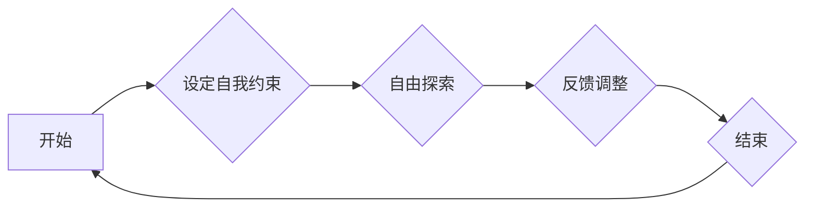

                 


### 第1章：问题背景与核心概念

#### 1.1 新苦行主义的起源与定义

**背景介绍**：

新苦行主义，这个术语最初源自于对古代苦行主义的重新解读和应用。古代的苦行主义强调通过肉体和精神上的苦难来达到内心的宁静与觉悟。而新苦行主义则在此基础上，融入了现代心理学、认知科学和自我提升的理念，旨在通过自我约束和内在探索来达到个人成长和自由。

**问题描述**：

现代社会中，人们面临着越来越多的压力和诱惑，难以保持内心的平静和自我提升。新苦行主义提供了一种可能的解决方案，它不仅强调自我约束的重要性，更强调在自我约束中的自由探索。

**问题解决**：

新苦行主义通过自我约束和自由探索，帮助个体在面对外部压力和诱惑时，保持内心的平和和专注。它不仅仅是一种生活方式，更是一种精神状态和思维方式的转变。

**边界与外延**：

新苦行主义的边界在于它所强调的自我约束和自由探索的范围。它不仅仅是肉体上的苦行，更包括精神上的自律和探索。而其外延则涉及到个人成长、心理健康、生活方式等多个领域。

**核心概念术语说明**：

- **新苦行主义**：一种通过自我约束和自由探索来实现个人成长的哲学思想。
- **自我约束**：通过设定规则和限制，控制自己的行为和思维，以达到个人成长的目的。
- **自由探索**：在自我约束的框架下，自由地探索自己的兴趣、潜能和价值观。

**概念结构与核心要素组成**：

新苦行主义的概念结构由三个核心要素组成：自我约束、自由探索和个人成长。自我约束是基础，它为自由探索提供框架，而自由探索则是个人成长的动力。

---

**表格：自我约束、自由探索与个人成长的关系**

| 关系类别     | 说明                                                     |
| ------------ | -------------------------------------------------------- |
| 自我约束     | 为自由探索提供必要的约束和框架，确保探索方向的正确性。         |
| 自由探索     | 在自我约束的框架下，通过探索兴趣和潜能，促进个人成长。         |
| 个人成长     | 自我约束和自由探索的最终目标，通过不断的探索和成长，实现自我价值的提升。 |

**ER实体关系图架构**：

```mermaid
erDiagram
  selfConstrainment ||--|{ Exploration } Exploration
  selfConstrainment ||--|{ Growth } Growth
  Exploration ||--|{ Growth } Growth
  Growth ||--|{ selfConstrainment } selfConstrainment
  Growth ||--|{ Exploration } Exploration
```

**算法原理讲解**：

新苦行主义的算法原理可以看作是一个循环迭代的过程，包括自我约束、自由探索和反馈调整三个阶段。以下是该过程的mermaid流程图：



具体的实现可以通过Python代码来描述：

```python
def new_asceticism():
    while True:
        # 设定自我约束
        set_constrainment()
        # 自由探索
        explore自由()
        # 反馈调整
        adjust_feedback()
```

在这个算法中，自我约束的设定是确保自由探索方向正确性的关键，自由探索则是个人成长的动力，而反馈调整则是根据探索的结果来不断优化自我约束和探索策略。

---

**数学模型与公式**：

新苦行主义中的数学模型可以看作是一个平衡方程，即：

$$
C + E = G
$$

其中，$C$ 代表自我约束，$E$ 代表自由探索，$G$ 代表个人成长。这个方程的含义是，个人成长是由自我约束和自由探索共同作用的结果。为了实现个人成长的最大化，需要在自我约束和自由探索之间找到一个最佳平衡点。

**举例说明**：

假设一个程序员想要通过新苦行主义来提升自己的编程技能。他可以设定每天编写一定量的代码作为自我约束，同时在自我约束的框架下，自由地探索新的编程技术和算法。通过不断地反馈调整，他可以逐步提高自己的编程水平。

---

**总结**：

新苦行主义是一种通过自我约束和自由探索来实现个人成长的哲学思想。它不仅强调自我约束的重要性，更强调在自我约束中的自由探索。通过设定自我约束、自由探索和反馈调整，个体可以实现自我价值的提升。在接下来的章节中，我们将进一步探讨自我约束、自由探索和新苦行主义的应用。

---

[本章完]

# 新苦行主义：自我约束中的自由探索

> 关键词：新苦行主义、自我约束、自由探索、个人成长

> 摘要：本文介绍了新苦行主义的概念、原理和应用，探讨了自我约束和自由探索在新苦行主义中的重要性，并通过具体的实例和数学模型，阐述了新苦行主义如何帮助个体实现自我价值的提升。文章还提出了如何在新苦行主义中找到自我约束和自由探索的最佳平衡点。

## 第1章：问题背景与核心概念

### 1.1 新苦行主义的起源与定义

新苦行主义并不是一个新兴的概念，它源自古代苦行主义的重新解读和应用。古代的苦行主义强调通过肉体和精神上的苦难来达到内心的宁静与觉悟。然而，现代社会的生活节奏加快，人们面临的压力和诱惑越来越多，传统的苦行主义难以满足现代人的需求。

新苦行主义则是在这个背景下诞生的。它不仅保留了古代苦行主义的自我约束精神，更融入了现代心理学、认知科学和自我提升的理念。新苦行主义认为，通过自我约束和自由探索，个体可以在面对外部压力和诱惑时，保持内心的平静和专注，从而实现个人成长和自由。

#### 1.1.1 新苦行主义的起源

新苦行主义的起源可以追溯到20世纪中叶，当时心理学家开始研究自我约束和自我提升的方法。随着心理学和认知科学的不断发展，人们逐渐意识到，自我约束和自由探索在个人成长中的重要性。

在这个时期，一些心理学家提出了新的观点，认为自我约束不仅可以通过肉体上的苦行来实现，更可以通过精神上的自律和自我管理来实现。这种观点逐渐形成了新苦行主义的雏形。

#### 1.1.2 新苦行主义的定义

新苦行主义是一种通过自我约束和自由探索来实现个人成长的哲学思想。它强调个体在面对外部压力和诱惑时，通过自我约束来保持内心的平静和专注，同时在自我约束的框架下，自由地探索自己的兴趣、潜能和价值观。

#### 1.1.3 新苦行主义与传统苦行主义的区别

传统苦行主义主要强调通过肉体上的苦难来达到内心的宁静与觉悟。而新苦行主义则更注重精神上的自律和自我管理。传统苦行主义强调的是苦难的价值，而新苦行主义则强调自我约束和自由探索的价值。

此外，新苦行主义还强调自由探索的重要性。传统苦行主义往往忽视了个体的兴趣和潜能，而新苦行主义则认为，自由探索是个人成长的重要动力。

### 1.2 自我约束的概念与作用

自我约束是新苦行主义的核心概念之一。它是指个体通过设定规则和限制，控制自己的行为和思维，以达到个人成长的目的。

#### 1.2.1 自我约束的定义

自我约束是指个体在面对外部压力和诱惑时，通过自我管理来控制自己的行为和思维。这种约束不仅体现在日常生活和工作中的行为规范，还包括精神上的自律和自我管理。

#### 1.2.2 自我约束的重要性

自我约束对于个人成长至关重要。它不仅可以帮助个体在面对外部压力时保持冷静和专注，还可以促进个体对自己的认识和自我提升。

首先，自我约束可以帮助个体在面对外部压力时保持冷静和专注。在现代社会，人们面临着各种各样的压力，如工作压力、学业压力、社交压力等。通过自我约束，个体可以学会如何在压力下保持冷静和专注，从而更好地应对这些挑战。

其次，自我约束可以促进个体对自己的认识和自我提升。通过自我约束，个体可以更好地了解自己的行为模式、思维方式和情感状态，从而发现自己的优点和不足，并针对性地进行自我提升。

#### 1.2.3 自我约束的种类与技巧

自我约束可以分为多种类型，包括时间管理、情绪管理、行为管理等。每种类型的自我约束都有其独特的技巧和方法。

时间管理是自我约束的一种重要形式。通过设定时间表、优先级和目标，个体可以更好地管理自己的时间，提高工作效率。

情绪管理是自我约束的另一种重要形式。通过自我调节情绪，个体可以更好地应对生活中的各种挑战，保持内心的平静和专注。

行为管理则是指通过设定规则和限制，控制自己的行为。例如，设定不玩手机的时间、保持良好的作息习惯等。

#### 1.3 自由探索的理念与实践

自由探索是新苦行主义的另一个核心概念。它是指个体在自我约束的框架下，自由地探索自己的兴趣、潜能和价值观。

#### 1.3.1 自由探索的定义

自由探索是指个体在自我约束的框架下，不受外界限制，自由地追求自己的兴趣、潜能和价值观。

#### 1.3.2 自由探索的重要性

自由探索对于个人成长至关重要。它不仅可以帮助个体发现自己的兴趣和潜能，还可以促进个体对自我的认识和自我提升。

首先，自由探索可以帮助个体发现自己的兴趣和潜能。在现代社会，人们往往因为各种原因而忽视了自己的兴趣和潜能。通过自由探索，个体可以更好地了解自己的兴趣所在，发现自己的潜能，从而更好地规划自己的人生。

其次，自由探索可以促进个体对自我的认识和自我提升。通过自由探索，个体可以更好地了解自己的价值观和行为模式，从而更好地认识自己，提升自己。

#### 1.3.3 自由探索的方法与策略

自由探索的方法和策略多种多样，包括阅读、旅行、实践、思考等。

阅读是一种有效的自由探索方法。通过阅读，个体可以了解各种知识和思想，从而拓宽自己的视野，发现新的兴趣和潜能。

旅行是一种直接的自由探索方法。通过旅行，个体可以亲身体验不同的文化和生活方式，从而更好地了解自己，发现新的兴趣和潜能。

实践是一种具体的自由探索方法。通过实践，个体可以将自己的兴趣和潜能转化为实际行动，从而更好地了解自己，提升自己。

思考是一种深层次的自由探索方法。通过思考，个体可以深入思考自己的兴趣、潜能和价值观，从而更好地认识自己，提升自己。

### 1.4 新苦行主义的核心概念联系

新苦行主义的核心概念包括自我约束、自由探索和个人成长。这些概念之间存在着紧密的联系。

自我约束是自由探索的基础。没有自我约束，自由探索往往会失去方向和目标，变得无序和盲目。通过自我约束，个体可以明确自己的目标，规范自己的行为，从而更好地进行自由探索。

自由探索是自我约束的延伸。自我约束为自由探索提供了框架和方向，而自由探索则是在这个框架下，个体通过实践和探索，不断发现自己的兴趣和潜能。

个人成长是自我约束和自由探索的终极目标。通过自我约束和自由探索，个体可以不断提升自己，实现个人价值的提升。

总的来说，自我约束、自由探索和个人成长是相互依存、相互促进的。自我约束为自由探索提供方向和框架，自由探索为自我约束提供动力和实践，而个人成长则是自我约束和自由探索的最终成果。

### 1.5 新苦行主义的原理与实践

新苦行主义的原理和实践可以从以下几个方面进行阐述。

#### 1.5.1 新苦行主义的基本原理

新苦行主义的基本原理包括自我约束、自由探索和内在平衡。

自我约束是指个体通过设定规则和限制，控制自己的行为和思维，以达到个人成长的目的。这种约束不仅体现在日常生活和工作中的行为规范，还包括精神上的自律和自我管理。

自由探索是指个体在自我约束的框架下，不受外界限制，自由地追求自己的兴趣、潜能和价值观。通过自由探索，个体可以不断发现自己的兴趣和潜能，提升自己的认知水平。

内在平衡是指个体在自我约束和自由探索的过程中，保持内心的平和和专注。通过内在平衡，个体可以更好地应对生活中的各种挑战，保持内心的平静和专注。

#### 1.5.2 新苦行主义的实践方法

新苦行主义的实践方法包括以下几个方面：

1. **设定自我约束**：个体可以通过设定时间表、优先级和目标，来管理自己的时间和行为。例如，设定每天学习2小时、每天锻炼30分钟等。

2. **自由探索**：个体可以在自我约束的框架下，自由地探索自己的兴趣、潜能和价值观。例如，通过阅读、旅行、实践和思考，来发现自己的兴趣和潜能。

3. **内在平衡**：个体可以通过冥想、瑜伽、呼吸练习等方法，来保持内心的平和和专注。通过内在平衡，个体可以更好地应对生活中的各种挑战。

#### 1.5.3 新苦行主义的心理机制

新苦行主义的心理机制主要包括以下几个方面：

1. **自我控制**：通过自我约束，个体可以培养自我控制的能力，从而更好地应对生活中的各种挑战。

2. **内在动机**：通过自由探索，个体可以激发内在动机，从而更加积极地投入到个人成长的过程中。

3. **自我反思**：通过自我反思，个体可以更好地了解自己，发现自己的优点和不足，并针对性地进行自我提升。

总的来说，新苦行主义通过自我约束、自由探索和内在平衡，帮助个体实现个人成长和自由。在接下来的章节中，我们将进一步探讨自我约束、自由探索和新苦行主义的应用。

---

[本章完]

