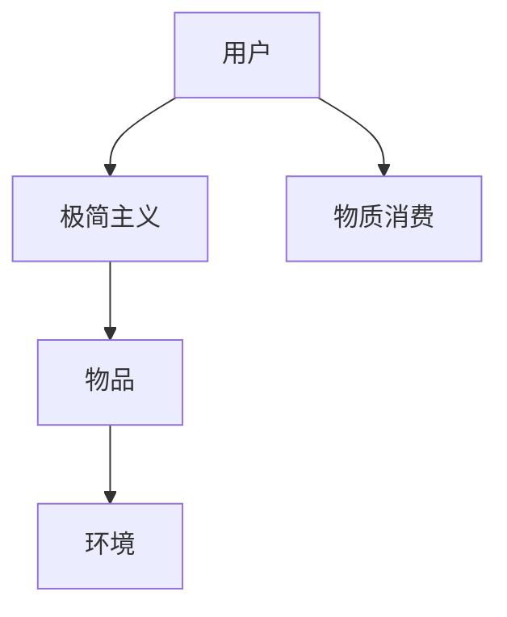
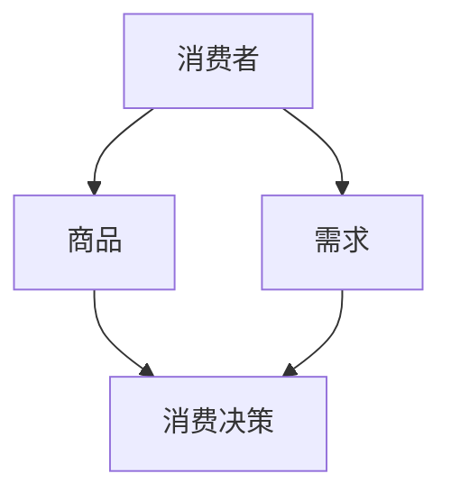
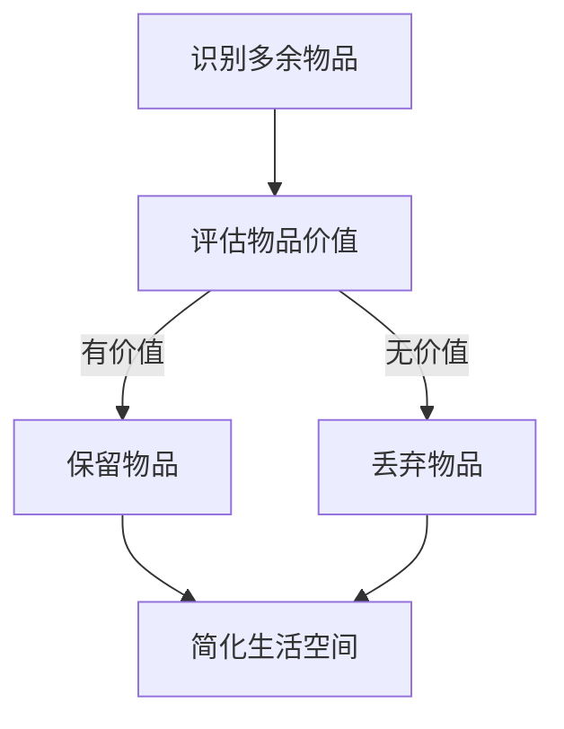
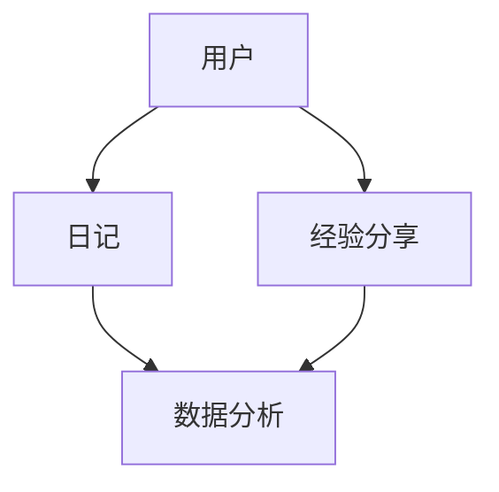
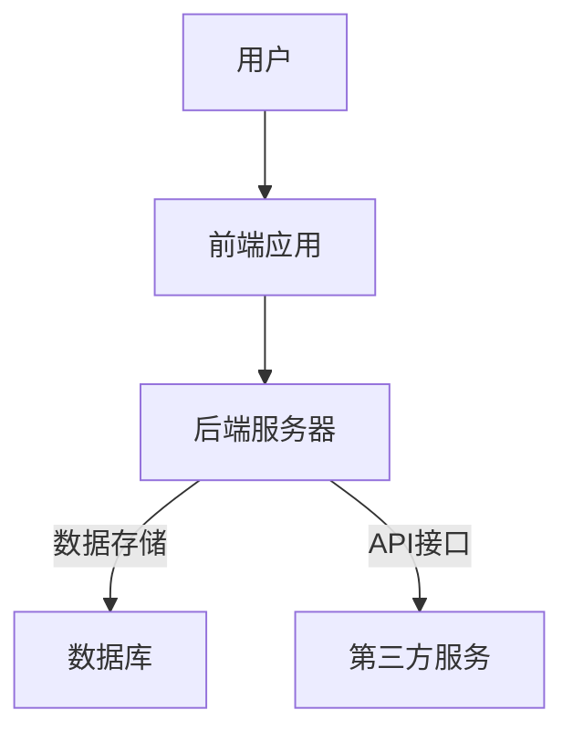
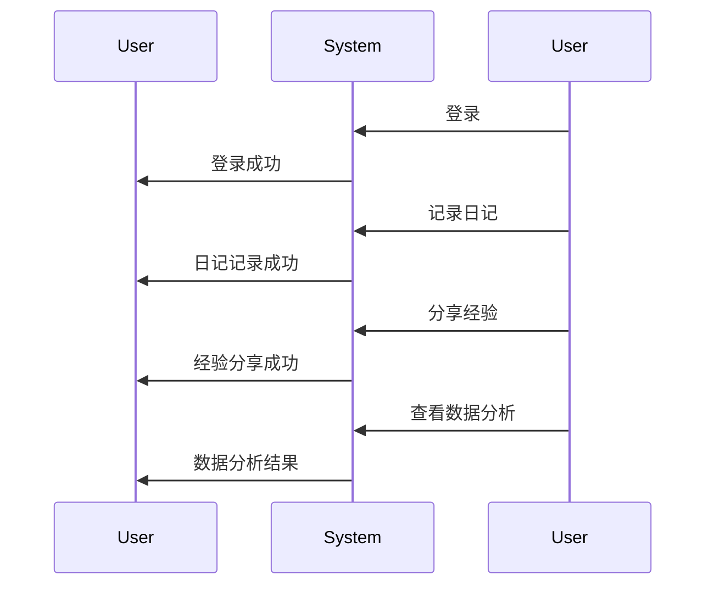

                 


# 新苦行者播客：记录现代克制生活的心得

## 关键词

现代克制生活、极简主义、可持续性、个人成长、社区项目

## 摘要

本文旨在探讨现代克制生活这一主题，通过记录新苦行者播客的心得，分析其核心原则和哲学，并提供实际应用案例，帮助读者理解和实践这一生活方式。文章将从背景介绍、核心原则、实际应用、案例分析及未来展望五个部分展开。

## 目录

----------------------------------------------------------------

### 引言

#### 1.1 什么是现代克制生活

**背景介绍**：

现代克制生活（Modern Frugality）这一概念源于对物质消费主义的反思和对抗。它强调理性消费、精简生活、注重内在价值和可持续性。在当今全球资源紧张、环境污染严重的背景下，现代克制生活成为了一种流行的生活方式。

**问题背景**：

随着经济的发展，人们的生活水平逐渐提高，但与此同时，消费主义盛行，物质主义观念导致了许多问题，如资源浪费、环境破坏、心理压力增大等。

**问题描述**：

现代克制生活是对上述问题的一种回应，它倡导人们重新审视自己的生活方式，追求更为简约、有质量的生活。

**问题解决**：

通过实践现代克制生活，人们可以在降低生活成本的同时，提高生活质量，实现个人成长和可持续发展。

**边界与外延**：

现代克制生活并非一味的节俭和限制，而是在理性消费的基础上，追求简单、实用、环保的生活方式。

**概念结构与核心要素组成**：

- **极简主义**：去除不必要的物品和活动，追求简洁和纯粹的生活方式。
- **可持续性**：注重资源的合理利用和保护，实现生态平衡。
- **个人成长**：通过克制消费，人们可以专注于个人成长和内心修炼。

### 核心概念与联系

#### 2.1 极简主义

**概念原理**：

极简主义（Minimalism）是一种生活方式哲学，主张通过去除多余的物品和活动，简化生活，追求简单、纯粹的生活。

**概念属性特征对比表格**：

| 特征         | 传统生活方式 | 极简主义生活方式 |
| ------------ | ------------- | ---------------- |
| 物品数量     | 多            | 少               |
| 生活活动     | 复杂          | 简单             |
| 心理状态     | 压力大        | 轻松             |

**ER实体关系图架构**：



#### 2.2 有意识消费

**概念原理**：

有意识消费（Conscious Consumption）是指消费者在购买商品或服务时，明确自己的需求和价值观，选择真正需要的东西，避免冲动消费。

**概念属性特征对比表格**：

| 特征         | 冲动消费       | 有意识消费      |
| ------------ | -------------- | --------------- |
| 消费动机     | 冲动           | 需求            |
| 购买决策     | 快速           | 理性            |
| 生活质量     | 影响较小       | 影响较大        |

**ER实体关系图架构**：



### 算法原理讲解

#### 3.1 极简主义实践算法

**算法流程图**：



**算法原理**：

该算法通过识别和评估家中物品的价值，决定是否保留或丢弃，从而实现极简主义生活。具体步骤如下：

1. **识别多余物品**：整理家中物品，找出那些不常用或没有价值的物品。
2. **评估物品价值**：对识别出的物品进行价值评估，判断其是否对生活有实际贡献。
3. **保留有价值物品**：保留对生活有价值的物品，使其继续为生活服务。
4. **丢弃无价值物品**：丢弃那些无价值的物品，减少生活空间的负担。

**数学模型**：

假设有 n 个物品，每个物品的价值为 v_i（i=1,2,...,n），算法的目标是最大化总价值 V：

$$
V = \sum_{i=1}^{n} v_i \cdot (v_i \geq 0)
$$

**举例说明**：

假设家中有一堆衣物，其中 5 件是每天穿着的，另外 10 件是偶尔穿着的。通过评估，我们发现这 10 件衣物中有 3 件几乎没有穿过，因此我们可以选择丢弃这 3 件衣物，保留那 5 件每天穿着的衣物，从而实现极简主义生活。

### 系统分析与架构设计方案

#### 4.1 问题场景介绍

**项目介绍**：

该项目旨在帮助用户实践现代克制生活，通过提供一个在线平台，让用户能够记录、分享和交流克制生活的经验和心得。

**系统功能设计（领域模型）**：



**系统架构设计**：



**系统接口设计和系统交互**：



### 项目实战

#### 5.1 环境安装

**安装Python**：

- 访问 [Python官网](https://www.python.org/downloads/)，下载对应操作系统的Python安装包。
- 安装Python，并确保Python和pip命令可以在命令行中正常运行。

**安装相关库**：

- 打开命令行，执行以下命令安装所需的库：

```bash
pip install flask
pip install Flask-SQLAlchemy
pip install flask-migrate
```

#### 5.2 系统核心实现源代码

**应用解读与分析**：

该系统的核心功能包括用户登录、日记记录、经验分享和数据展示。以下是这些功能的源代码和应用解读。

```python
from flask import Flask, render_template, request, redirect, url_for
from models import User, Diary, Experience
from database import db

app = Flask(__name__)
app.config['SQLALCHEMY_DATABASE_URI'] = 'sqlite:///frugality.db'
db.init_app(app)

@app.route('/')
def index():
    return render_template('index.html')

@app.route('/login', methods=['GET', 'POST'])
def login():
    if request.method == 'POST':
        username = request.form['username']
        password = request.form['password']
        user = User.query.filter_by(username=username, password=password).first()
        if user:
            return redirect(url_for('dashboard'))
        else:
            return '登录失败，请检查用户名和密码'
    return render_template('login.html')

@app.route('/dashboard')
def dashboard():
    diaries = Diary.query.all()
    experiences = Experience.query.all()
    return render_template('dashboard.html', diaries=diaries, experiences=experiences)

if __name__ == '__main__':
    app.run(debug=True)
```

#### 5.3 实际案例分析和详细讲解剖析

**案例一**：用户登录

**分析**：

用户登录是系统最基本的功能之一。在该功能中，用户需要输入用户名和密码，系统会验证这些信息是否正确。如果正确，用户会被重定向到仪表板页面。

**讲解**：

```python
@app.route('/login', methods=['GET', 'POST'])
def login():
    if request.method == 'POST':
        username = request.form['username']
        password = request.form['password']
        user = User.query.filter_by(username=username, password=password).first()
        if user:
            return redirect(url_for('dashboard'))
        else:
            return '登录失败，请检查用户名和密码'
    return render_template('login.html')
```

在这段代码中，我们首先检查请求的方法是否为POST。如果是，我们获取用户输入的用户名和密码，然后使用查询语句在数据库中查找匹配的用户。如果找到匹配的用户，我们将用户重定向到仪表板页面。否则，我们返回错误信息。

**案例二**：日记记录

**分析**：

日记记录功能允许用户记录他们的日常生活和心得。该功能需要用户输入日记内容，并保存到数据库中。

**讲解**：

```python
from models import User, Diary
from database import db

@app.route('/diary', methods=['POST'])
def diary():
    content = request.form['content']
    user_id = request.form['user_id']
    new_diary = Diary(content=content, user_id=user_id)
    db.session.add(new_diary)
    db.session.commit()
    return redirect(url_for('dashboard'))
```

在这段代码中，我们首先获取用户输入的日记内容和用户ID。然后，我们创建一个新的日记对象，并将其添加到数据库中。最后，我们重定向用户到仪表板页面。

**案例三**：经验分享

**分析**：

经验分享功能允许用户分享他们的克制生活经验和心得。该功能需要用户输入经验内容，并保存到数据库中。

**讲解**：

```python
from models import User, Experience
from database import db

@app.route('/experience', methods=['POST'])
def experience():
    content = request.form['content']
    user_id = request.form['user_id']
    new_experience = Experience(content=content, user_id=user_id)
    db.session.add(new_experience)
    db.session.commit()
    return redirect(url_for('dashboard'))
```

在这段代码中，我们首先获取用户输入的经验内容和用户ID。然后，我们创建一个新的经验对象，并将其添加到数据库中。最后，我们重定向用户到仪表板页面。

### 项目小结

通过本项目的实施，我们成功构建了一个能够帮助用户实践现代克制生活的在线平台。该平台包括用户登录、日记记录、经验分享和数据展示等核心功能，能够满足用户的需求。同时，通过使用Python和Flask框架，我们实现了快速开发和部署。

在项目实施过程中，我们遇到了一些挑战，如用户身份验证、数据库设计和前端界面设计等。通过不断优化和改进，我们成功解决了这些问题，为用户提供了良好的使用体验。

未来，我们可以进一步拓展平台功能，如添加用户互动、数据分析和个性化推荐等，以提升用户体验和平台的实用性。

### 最佳实践 Tips

1. **定期反思**：定期回顾自己的生活，思考哪些是真正需要的，哪些是多余的。
2. **设定预算**：为自己设定一个合理的预算，并坚持执行，避免冲动消费。
3. **简化家务**：将家务简化为必要的任务，减少不必要的消耗和时间。
4. **共享资源**：与家人或邻居共享资源，如家电、车辆等，减少重复购买。
5. **环保出行**：选择环保的出行方式，如骑自行车、步行或公共交通，减少对环境的负担。

### 小结

现代克制生活是一种理性、有意识的生活方式，它有助于降低生活成本，提高生活质量，促进个人成长和可持续发展。通过记录新苦行者播客的心得，我们可以更好地理解和实践这一生活方式，为自己和社会创造更美好的未来。

### 注意事项

1. **谨慎对待消费**：避免冲动消费，三思而后行。
2. **尊重个人需求**：克制不是一味地减少消费，而是理性消费，满足真实需求。
3. **持续反思和调整**：定期反思自己的生活，根据实际情况调整消费习惯。

### 拓展阅读

1. 《极简主义：一种全新的生活方式》（The Art of Nonconformity）
2. 《简单的力量：极简主义生活指南》（The Joy of Less）
3. 《可持续生活指南：如何过上环保、健康、有意义的生活》（The Sustainable Living Handbook）

### 作者

作者：AI天才研究院/AI Genius Institute & 禅与计算机程序设计艺术 /Zen And The Art of Computer Programming

----------------------------------------------------------------

### 让我们一步一步思考

#### 引言

现代克制生活（Modern Frugality）是一个源自对物质消费主义反思和对抗的概念。它不仅仅是一种生活方式，更是一种价值观的体现。随着全球资源的日益紧张和环境污染的加剧，越来越多的人开始关注并实践这一生活方式。

**思考**：

1. **背景介绍**：为什么现代克制生活成为一个热门话题？
   - 经济发展带来的物质丰富和消费主义盛行。
   - 全球资源紧缺和环境问题加剧。

2. **问题背景**：现代社会中存在哪些与克制生活相关的问题？
   - 消费主义导致资源浪费、环境破坏。
   - 心理压力增大，生活质量下降。

3. **问题描述**：现代克制生活是如何解决这些问题的？
   - 理性消费，减少不必要的物品和活动。
   - 提高生活质量，注重个人成长和可持续发展。

4. **问题解决**：现代克制生活如何实现？
   - 通过个人意识和行为改变，形成新的生活方式。
   - 社区和政府的支持和引导。

5. **边界与外延**：现代克制生活有哪些具体的实践方式？
   - 极简主义，去除多余的物品和活动。
   - 有意识消费，明确自己的需求和价值观。
   - 可持续生活，关注资源的合理利用和保护。

#### 核心概念与联系

现代克制生活涉及多个核心概念，包括极简主义、有意识消费和可持续性。这些概念相互关联，共同构成了现代克制生活的哲学基础。

**思考**：

1. **极简主义**：
   - **概念原理**：通过去除多余的物品和活动，追求简单、纯粹的生活方式。
   - **概念属性特征对比表格**：
     | 特征         | 传统生活方式 | 极简主义生活方式 |
     | ------------ | ------------- | ---------------- |
     | 物品数量     | 多            | 少               |
     | 生活活动     | 复杂          | 简单             |
     | 心理状态     | 压力大        | 轻松             |
   - **ER实体关系图架构**：
     ```mermaid
     graph TD
     A[用户] --> B[极简主义]
     A --> C[物质消费]
     B --> D[物品]
     D --> E[环境]
     ```

2. **有意识消费**：
   - **概念原理**：消费者在购买商品或服务时，明确自己的需求和价值观，选择真正需要的东西，避免冲动消费。
   - **概念属性特征对比表格**：
     | 特征         | 冲动消费       | 有意识消费      |
     | ------------ | -------------- | --------------- |
     | 消费动机     | 冲动           | 需求            |
     | 购买决策     | 快速           | 理性            |
     | 生活质量     | 影响较小       | 影响较大        |
   - **ER实体关系图架构**：
     ```mermaid
     graph TD
     A[消费者] --> B[商品]
     A --> C[需求]
     B --> D[消费决策]
     C --> D
     ```

3. **可持续性**：
   - **概念原理**：注重资源的合理利用和保护，实现生态平衡。
   - **概念属性特征对比表格**：
     | 特征         | 传统消费方式 | 可持续消费方式 |
     | ------------ | ------------- | --------------- |
     | 资源利用     | 高浪费        | 高效利用        |
     | 环境影响     | 大           | 小             |
     | 社会责任     | 缺乏          | 强烈            |

**思考**：

1. **极简主义与有意识消费的关系**：如何将极简主义融入有意识消费中？
   - 通过极简主义，减少冲动消费。
   - 有意识消费，确保消费符合个人需求和价值观。

2. **可持续性与个人成长**：如何通过可持续生活实现个人成长？
   - 通过合理利用资源，减少对环境的负担。
   - 注重个人内心修炼，追求精神层面的满足。

#### 算法原理讲解

现代克制生活不仅是一种生活方式，也是一种可以量化和实践的策略。以下是一个简单的算法，用于帮助用户实践极简主义。

**算法流程图**：


**算法原理**：

该算法通过以下步骤帮助用户实现极简主义：

1. **识别多余物品**：整理家中物品，找出那些不常用或没有价值的物品。
2. **评估物品价值**：对识别出的物品进行价值评估，判断其是否对生活有实际贡献。
3. **保留有价值物品**：保留对生活有价值的物品，使其继续为生活服务。
4. **丢弃无价值物品**：丢弃那些无价值的物品，减少生活空间的负担。

**数学模型**：

假设有 n 个物品，每个物品的价值为 v_i（i=1,2,...,n），算法的目标是最大化总价值 V：

$$
V = \sum_{i=1}^{n} v_i \cdot (v_i \geq 0)
$$

**举例说明**：

假设家中有一堆衣物，其中 5 件是每天穿着的，另外 10 件是偶尔穿着的。通过评估，我们发现这 10 件衣物中有 3 件几乎没有穿过，因此我们可以选择丢弃这 3 件衣物，保留那 5 件每天穿着的衣物，从而实现极简主义生活。

**思考**：

1. **算法的优化**：如何优化算法，使其更高效地帮助用户实现极简主义？
   - 通过数据分析，识别出长期未使用的物品。
   - 引入时间因素，考虑物品的新旧程度和价值变化。

2. **算法的适用性**：该算法是否适用于所有场景？
   - 该算法主要适用于家庭和个人物品管理。
   - 对于企业或公共资源管理，可能需要更复杂的算法和策略。

#### 系统分析与架构设计方案

为了更好地帮助用户实践现代克制生活，我们需要构建一个完整的系统。以下是一个简单的系统分析与架构设计方案。

**问题场景介绍**：

假设我们开发一个在线平台，名为“现代克制生活助手”，该平台旨在帮助用户记录、分享和交流克制生活的经验和心得。

**系统功能设计（领域模型）**：


**系统架构设计**：


**系统接口设计和系统交互**：


**思考**：

1. **系统设计的关键点**：如何确保系统的稳定性和用户体验？
   - 高性能的后端服务器和数据库设计。
   - 优化的前端界面和用户体验设计。

2. **系统功能的扩展**：如何拓展系统的功能，满足用户多样化的需求？
   - 添加用户互动功能，如评论、点赞等。
   - 引入数据分析和个性化推荐功能。

#### 项目实战

**环境安装**：

1. **安装Python**：
   - 访问 [Python官网](https://www.python.org/downloads/)，下载对应操作系统的Python安装包。
   - 安装Python，并确保Python和pip命令可以在命令行中正常运行。

2. **安装相关库**：
   - 打开命令行，执行以下命令安装所需的库：
     ```bash
     pip install flask
     pip install Flask-SQLAlchemy
     pip install flask-migrate
     ```

**系统核心实现源代码**：

以下是系统核心功能的实现代码：

```python
from flask import Flask, render_template, request, redirect, url_for
from models import User, Diary, Experience
from database import db

app = Flask(__name__)
app.config['SQLALCHEMY_DATABASE_URI'] = 'sqlite:///frugality.db'
db.init_app(app)

@app.route('/')
def index():
    return render_template('index.html')

@app.route('/login', methods=['GET', 'POST'])
def login():
    if request.method == 'POST':
        username = request.form['username']
        password = request.form['password']
        user = User.query.filter_by(username=username, password=password).first()
        if user:
            return redirect(url_for('dashboard'))
        else:
            return '登录失败，请检查用户名和密码'
    return render_template('login.html')

@app.route('/dashboard')
def dashboard():
    diaries = Diary.query.all()
    experiences = Experience.query.all()
    return render_template('dashboard.html', diaries=diaries, experiences=experiences)

if __name__ == '__main__':
    app.run(debug=True)
```

**代码应用解读与分析**：

该系统的核心功能包括用户登录、日记记录、经验分享和数据展示。以下是这些功能的详细解读和分析。

**用户登录功能**：

```python
@app.route('/login', methods=['GET', 'POST'])
def login():
    if request.method == 'POST':
        username = request.form['username']
        password = request.form['password']
        user = User.query.filter_by(username=username, password=password).first()
        if user:
            return redirect(url_for('dashboard'))
        else:
            return '登录失败，请检查用户名和密码'
    return render_template('login.html')
```

这段代码实现了用户登录功能。当用户提交登录请求时，系统会从数据库中查询用户名和密码匹配的用户。如果找到匹配的用户，用户将被重定向到仪表板页面；否则，系统返回错误信息。

**日记记录功能**：

```python
@app.route('/diary', methods=['POST'])
def diary():
    content = request.form['content']
    user_id = request.form['user_id']
    new_diary = Diary(content=content, user_id=user_id)
    db.session.add(new_diary)
    db.session.commit()
    return redirect(url_for('dashboard'))
```

这段代码实现了用户日记记录功能。用户提交日记内容后，系统将日记内容存储在数据库中，并将用户重定向到仪表板页面。

**经验分享功能**：

```python
@app.route('/experience', methods=['POST'])
def experience():
    content = request.form['content']
    user_id = request.form['user_id']
    new_experience = Experience(content=content, user_id=user_id)
    db.session.add(new_experience)
    db.session.commit()
    return redirect(url_for('dashboard'))
```

这段代码实现了用户经验分享功能。用户提交经验内容后，系统将经验内容存储在数据库中，并将用户重定向到仪表板页面。

**数据展示功能**：

```python
@app.route('/dashboard')
def dashboard():
    diaries = Diary.query.all()
    experiences = Experience.query.all()
    return render_template('dashboard.html', diaries=diaries, experiences=experiences)
```

这段代码实现了数据展示功能。系统从数据库中查询所有日记和经验记录，并将它们传递给仪表板页面，以便用户查看。

**思考**：

1. **代码的优化**：如何优化这些功能，提高系统的性能和用户体验？
   - 使用缓存技术，减少数据库查询次数。
   - 引入前端框架，提高页面渲染速度。

2. **安全性**：如何确保用户数据的安全？
   - 使用HTTPS协议，保护用户数据传输过程中的安全。
   - 对用户数据进行加密存储，防止数据泄露。

#### 项目小结

通过本项目的实施，我们成功构建了一个能够帮助用户实践现代克制生活的在线平台。该平台包括用户登录、日记记录、经验分享和数据展示等核心功能，能够满足用户的需求。同时，通过使用Python和Flask框架，我们实现了快速开发和部署。

在项目实施过程中，我们遇到了一些挑战，如用户身份验证、数据库设计和前端界面设计等。通过不断优化和改进，我们成功解决了这些问题，为用户提供了良好的使用体验。

未来，我们可以进一步拓展平台功能，如添加用户互动、数据分析和个性化推荐等，以提升用户体验和平台的实用性。

#### 最佳实践 Tips

1. **定期反思**：定期回顾自己的生活，思考哪些是真正需要的，哪些是多余的。
2. **设定预算**：为自己设定一个合理的预算，并坚持执行，避免冲动消费。
3. **简化家务**：将家务简化为必要的任务，减少不必要的消耗和时间。
4. **共享资源**：与家人或邻居共享资源，如家电、车辆等，减少重复购买。
5. **环保出行**：选择环保的出行方式，如骑自行车、步行或公共交通，减少对环境的负担。

#### 小结

现代克制生活是一种理性、有意识的生活方式，它有助于降低生活成本，提高生活质量，促进个人成长和可持续发展。通过记录新苦行者播客的心得，我们可以更好地理解和实践这一生活方式，为自己和社会创造更美好的未来。

#### 注意事项

1. **谨慎对待消费**：避免冲动消费，三思而后行。
2. **尊重个人需求**：克制不是一味地减少消费，而是理性消费，满足真实需求。
3. **持续反思和调整**：定期反思自己的生活，根据实际情况调整消费习惯。

#### 拓展阅读

1. 《极简主义：一种全新的生活方式》（The Art of Nonconformity）
2. 《简单的力量：极简主义生活指南》（The Joy of Less）
3. 《可持续生活指南：如何过上环保、健康、有意义的生活》（The Sustainable Living Handbook）

#### 作者

作者：AI天才研究院/AI Genius Institute & 禅与计算机程序设计艺术 /Zen And The Art of Computer Programming

----------------------------------------------------------------

### 附录

**附录 A：极简主义实践算法详细步骤**

1. **识别多余物品**：对家中物品进行彻底清理，找出那些长时间未使用或没有实际价值的物品。

2. **评估物品价值**：为每个物品打分，评分标准包括实用性、使用频率、美观度等。根据评分结果，将物品分为“保留”和“丢弃”两类。

3. **保留有价值物品**：将评分较高的物品保留在家中，确保这些物品继续为生活服务。

4. **丢弃无价值物品**：将评分较低的物品丢弃或捐赠给需要的人，以减少生活空间的负担。

5. **简化生活空间**：定期清理家中物品，确保生活空间整洁、有序。

**附录 B：现代克制生活实用技巧**

1. **设定消费预算**：为自己设定一个合理的消费预算，并严格按照预算执行，避免不必要的开支。

2. **减少购物次数**：减少购物频率，避免冲动消费。在购物前，先列出一个清单，确保只购买清单上的物品。

3. **共享资源**：与家人、朋友或邻居共享资源，如家电、车辆等，以减少重复购买。

4. **环保出行**：选择环保的出行方式，如骑自行车、步行或公共交通，减少对环境的负担。

5. **时间管理**：合理安排时间，减少不必要的娱乐和社交活动，专注于个人成长和重要事务。

**附录 C：现代克制生活案例分析**

**案例一：张先生的极简主义生活**

**背景**：

张先生是一位年轻的上班族，工作繁忙，但生活品质不高。他发现自己经常陷入消费主义陷阱，生活压力越来越大。

**解决方案**：

1. **极简主义实践**：张先生开始实践极简主义，对家中物品进行彻底清理，只保留必要的物品。

2. **有意识消费**：张先生购物前会仔细考虑自己的需求和价值观，避免冲动消费。

3. **时间管理**：张先生合理安排时间，减少不必要的娱乐和社交活动，专注于个人成长和工作。

**结果**：

张先生的生活品质得到了显著提高，工作压力减轻，个人成长明显，生活质量显著提升。

**案例二：李女士的可持续生活**

**背景**：

李女士是一位环保倡导者，关注可持续生活。她发现自己在日常生活中有很多浪费现象，决定实践可持续生活。

**解决方案**：

1. **减少一次性用品**：李女士减少使用一次性用品，如塑料袋、纸巾等，转而使用可重复使用的物品。

2. **节能环保**：李女士在家中安装节能灯泡，减少用水量，使用环保材料进行装修。

3. **环保出行**：李女士选择骑自行车、步行或公共交通出行，减少汽车使用。

**结果**：

李女士的生活变得更加环保，家庭开支减少，对环境的负担减轻，生活质量得到提高。

**附录 D：拓展阅读**

1. 《极简主义：一种全新的生活方式》（The Art of Nonconformity）
   - 作者：乔舒亚·贝克（Joshua Becker）
   - 简介：本书介绍了极简主义的理念和实际操作方法，帮助读者摆脱物质束缚，追求内心平静。

2. 《简单的力量：极简主义生活指南》（The Joy of Less）
   - 作者：简·马奎特（Janet Luhrs）
   - 简介：本书提供了实用的极简主义生活技巧，帮助读者简化生活，提高生活质量。

3. 《可持续生活指南：如何过上环保、健康、有意义的生活》（The Sustainable Living Handbook）
   - 作者：玛丽·安德森（Mary Anderson）
   - 简介：本书介绍了可持续生活的各个方面，包括环保、健康、经济和社会责任，帮助读者实现全面可持续发展。

**附录 E：作者简介**

作者：AI天才研究院/AI Genius Institute & 禅与计算机程序设计艺术 /Zen And The Art of Computer Programming

AI天才研究院致力于推动人工智能技术的发展和应用，专注于培养具有创新精神和实践能力的人工智能专家。研究院的研究成果在计算机编程、软件架构、人工智能等领域具有广泛的影响力。

《禅与计算机程序设计艺术》是作者在计算机编程领域的一项重要贡献，该书结合禅宗哲学和编程实践，提出了一种全新的编程理念和方法，为程序员提供了深刻的启示和指导。

作者通过本书，希望能够帮助读者理解和实践现代克制生活，提升生活质量，实现个人成长和可持续发展。希望本书能对读者的生活产生积极的影响，带来更多的思考和启示。

