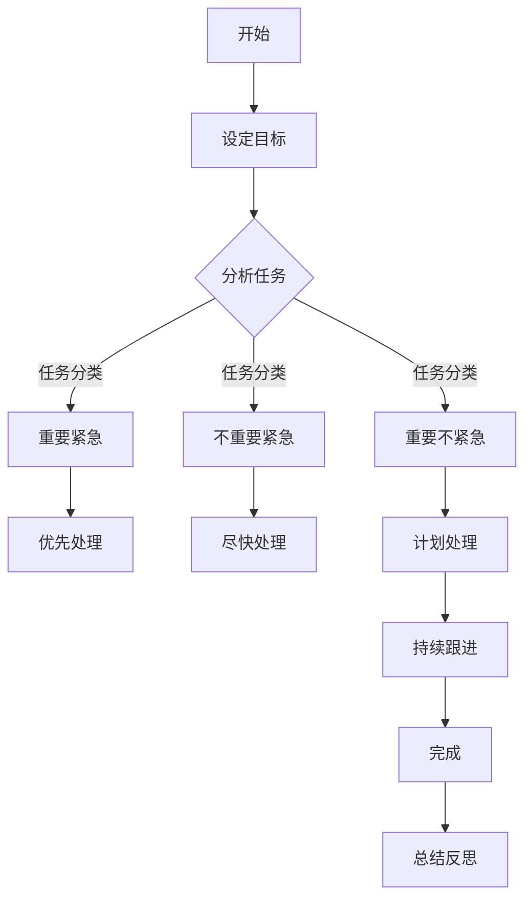
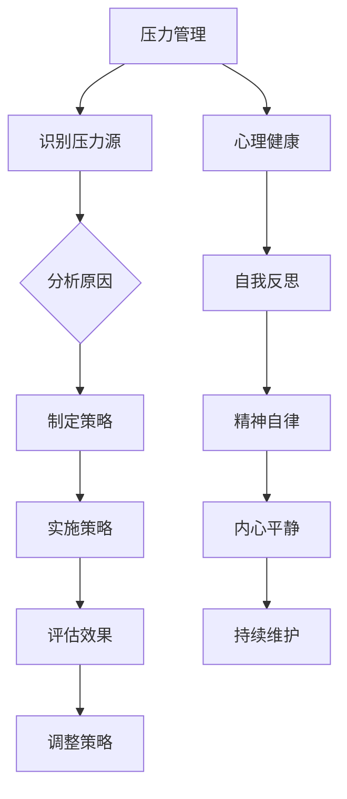
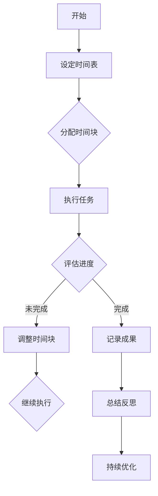
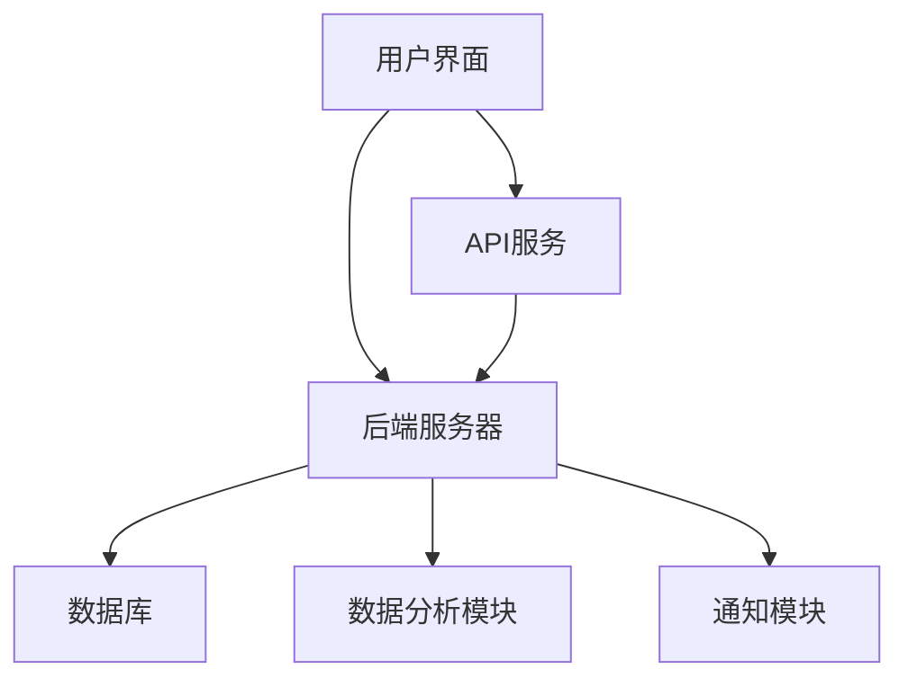
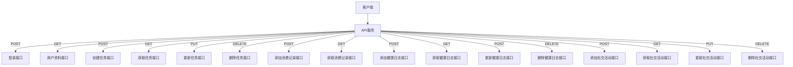
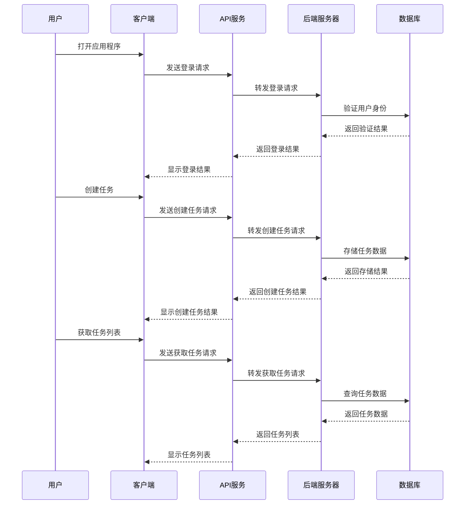

                 

### 文章标题：新苦行者播客：记录现代克制生活的心得分享节目

> 关键词：现代克制生活、心得以分享、生活实践、心理健康、消费观念

> 摘要：本文通过探讨现代克制生活的理念和实践，结合知名人士的案例研究，提供一系列的生活实践和心理健康技巧，旨在帮助读者在快节奏的现代生活中找到内心的平静与自我成长。

### 目录大纲

#### 第一部分：现代克制生活概述

- **1.1 现代社会的挑战与困境**
  - **1.1.1 高压工作环境与心理健康问题**
  - **1.1.2 消费主义文化的诱惑与反思**
  - **1.1.3 生活节奏加快与时间管理挑战**

- **1.2 克制生活的意义与价值**
  - **1.2.1 克制生活的理念与实践**
  - **1.2.2 克制生活对个人成长的影响**
  - **1.2.3 克制生活与社会责任的关系**

#### 第二部分：克制生活的实践分享

- **2.1 克制生活中的时间管理**
  - **2.1.1 时间管理的原则与方法**
  - **2.1.2 实践案例分享：如何高效利用每一天**
  - **2.1.3 克制生活中的休息与恢复**

- **2.2 克制生活中的消费观念**
  - **2.2.1 消费观念的转变与重塑**
  - **2.2.2 如何抵制消费主义文化的诱惑**
  - **2.2.3 精简生活与断舍离的实践**

- **2.3 克制生活中的心理健康**
  - **2.3.1 心理健康的定义与重要性**
  - **2.3.2 克制生活中的减压方法**
  - **2.3.3 精神自律与内心平静的实践**

- **2.4 克制生活中的社交与人际关系**
  - **2.4.1 社交原则与技巧**
  - **2.4.2 克制社交与高质量关系的建立**
  - **2.4.3 克制生活对人际关系的影响**

#### 第三部分：克制生活的案例研究

- **3.1 知名人士的克制生活实践**
  - **3.1.1 名人的克制生活分享**
  - **3.1.2 名人案例的启示与借鉴**
  - **3.1.3 名人克制生活背后的理念与价值观**

- **3.2 克制生活的实践案例**
  - **3.2.1 普通人的克制生活实践**
  - **3.2.2 案例分析：如何打造一个克制的日常生活**
  - **3.2.3 克制生活实践中的常见问题与解决方案**

#### 第四部分：克制生活的未来展望

- **4.1 克制生活与可持续发展**
  - **4.1.1 克制生活与环境保护**
  - **4.1.2 克制生活与资源节约**
  - **4.1.3 克制生活对未来的启示**

- **4.2 克制生活与社会变革**
  - **4.2.1 克制生活对社会价值观的影响**
  - **4.2.2 克制生活与和谐社会建设**
  - **4.2.3 克制生活与未来的社会趋势**

- **4.3 克制生活的个人成长与自我实现**
  - **4.3.1 克制生活对个人成长的作用**
  - **4.3.2 克制生活与自我实现**
  - **4.3.3 克制生活的未来可能性**

#### 第五部分：结语

- **5.1 克制生活的总结与反思**
  - **5.1.1 克制生活的重要性与价值**
  - **5.1.2 克制生活实践的反思**
  - **5.1.3 克制生活与个人成长的关系**

- **5.2 对未来克制生活的展望**
  - **5.2.1 克制生活的未来趋势**
  - **5.2.2 克制生活实践的建议**
  - **5.2.3 克制生活的社会影响**

---

### 第一部分：现代克制生活概述

#### 1.1 现代社会的挑战与困境

在当今快节奏、高压的现代社会中，人们面临着诸多挑战和困境。首先，高压工作环境是一个显著的问题。现代职场竞争激烈，许多人需要长时间工作，面临高强度的任务和业绩压力。这种压力不仅影响个人的工作效率，还可能导致心理健康问题，如焦虑、抑郁和失眠等。

其次，消费主义文化的诱惑也不容忽视。现代社会充满了各种广告和营销手段，鼓励人们不断购买商品和服务。这种消费主义文化不仅加重了人们的经济负担，还可能导致对物质的过度依赖和虚荣心态。

此外，生活节奏的加快也给时间管理带来了巨大挑战。随着科技的发展和信息爆炸，人们每天都要处理大量的信息和任务。如何有效地管理时间，平衡工作与生活，成为现代人必须面对的重要问题。

#### 1.2 克制生活的意义与价值

面对上述挑战，克制生活逐渐成为一种备受关注的生活方式。克制生活不仅仅是关于物质上的简朴，更是一种精神上的自律和内心的平静。以下是克制生活的一些重要意义和价值：

1. **减少压力**：通过简化生活，减少物质负担，人们可以更好地应对工作压力和生活困境，从而减轻心理压力。

2. **提升心理健康**：克制生活鼓励人们更多地关注内心的平静和自我成长，有助于提升心理健康水平，减少焦虑和抑郁症状。

3. **提高生活质量**：通过合理的时间管理和消费观念，人们可以更好地规划自己的生活，提高生活质量和幸福感。

4. **增强社会责任感**：克制生活强调节约资源和环保，有助于培养人们的环保意识和社会责任感。

#### 1.2.1 克制生活的理念与实践

克制生活的理念可以概括为以下几点：

- **简化生活**：减少不必要的物品和活动，专注于真正重要的事情。
- **自律**：培养良好的生活习惯，如早睡早起、定期锻炼等。
- **自我反思**：定期反思自己的生活和行为，不断调整和改进。

克制生活的实践可以从以下几个方面展开：

- **时间管理**：制定合理的时间表，优先处理重要任务，避免拖延。
- **消费观念**：理性消费，避免盲目跟风和过度消费。
- **心理健康**：通过冥想、瑜伽等方式放松身心，保持内心的平静。
- **社交与人际关系**：建立高质量的人际关系，避免无谓的社交活动。

通过以上实践，人们可以逐步实现克制生活，提高生活质量和幸福感。

### 第二部分：克制生活的实践分享

#### 2.1 克制生活中的时间管理

时间管理是克制生活的重要组成部分。一个有效的时间管理策略可以帮助人们更好地平衡工作与生活，提高生活质量。

**2.1.1 时间管理的原则与方法**

时间管理的原则包括：

- **优先级**：将任务按照重要性和紧急性分类，优先处理重要且紧急的任务。
- **计划性**：提前制定时间表，合理安排每一天的任务和活动。
- **专注性**：在处理任务时保持专注，避免多任务处理，以提高效率。

时间管理的方法包括：

- **番茄工作法**：将工作时间划分为25分钟工作块，每个工作块后休息5分钟。
- **甘特图**：使用甘特图可视化任务进度和计划，确保任务按时完成。
- **待办清单**：列出每日待办事项，按照优先级逐一完成。

**2.1.2 实践案例分享：如何高效利用每一天**

以下是一个高效利用每一天的实践案例：

1. **早晨**：早起，进行晨间冥想和锻炼，提高身心状态。
2. **上午**：优先处理最重要和最紧急的任务，避免拖延。
3. **中午**：合理安排午餐和休息时间，保持精力充沛。
4. **下午**：处理次要任务，如回复邮件、参加会议等。
5. **晚上**：进行放松活动，如阅读、瑜伽等，确保充足的休息。

**2.1.3 克制生活中的休息与恢复**

休息与恢复同样重要。以下是一些休息与恢复的方法：

- **定时休息**：在长时间工作后，定时休息5-10分钟，以缓解疲劳。
- **深呼吸**：进行深呼吸练习，放松身心。
- **睡眠**：保持充足的睡眠，每晚7-8小时。

通过以上实践，人们可以更好地管理时间，提高生活质量。

#### 2.2 克制生活中的消费观念

消费观念的转变是克制生活的重要组成部分。以下是一些关于消费观念的转变和实践：

**2.2.1 消费观念的转变与重塑**

1. **理性消费**：避免盲目跟风和冲动消费，理性评估物品的价值和实用性。
2. **需求与欲望的区分**：明确自己的需求，区分需求和欲望，避免过度消费。
3. **可持续消费**：选择环保和可持续的产品，减少对环境的负面影响。

**2.2.2 如何抵制消费主义文化的诱惑**

1. **自我反思**：定期反思自己的消费行为，评估消费是否符合自己的价值观和需求。
2. **减少广告干扰**：减少观看广告的时间和频率，避免被广告诱惑。
3. **设定预算**：制定合理的消费预算，避免超支。

**2.2.3 精简生活与断舍离的实践**

1. **精简物品**：减少家中不必要的物品，保持环境的整洁和舒适。
2. **断舍离**：定期清理家中和生活中的物品，丢弃或捐赠不再需要的物品。
3. **重视体验而非物质**：将关注点放在体验和经历上，而非物质拥有。

通过以上实践，人们可以更好地管理自己的消费行为，实现克制生活。

#### 2.3 克制生活中的心理健康

心理健康是克制生活的重要方面。以下是一些关于心理健康的实践和建议：

**2.3.1 心理健康的定义与重要性**

心理健康是指个体在情绪、认知和行为上的健康状态，包括情绪稳定、自我认知清晰、行为适应良好等方面。心理健康的重要性体现在：

- **提高生活质量**：心理健康有助于提高生活满意度，提升幸福感。
- **促进个人成长**：心理健康有助于个人自我实现，追求更高层次的目标。
- **增强社交能力**：心理健康有助于建立良好的人际关系，提高社交能力。

**2.3.2 克制生活中的减压方法**

以下是一些有效的减压方法：

- **冥想**：通过冥想，放松身心，减少焦虑和压力。
- **锻炼**：定期进行身体锻炼，释放压力，提高身心健康。
- **休息与恢复**：保证充足的休息，避免过度劳累。

**2.3.3 精神自律与内心平静的实践**

1. **自我反思**：定期反思自己的行为和情绪，调整心态，保持内心平静。
2. **设定目标**：设定短期和长期目标，制定实现目标的计划，提高自律性。
3. **正念练习**：通过正念练习，提高对当前时刻的觉察和专注，减少内心波动。

通过以上实践，人们可以更好地管理自己的心理健康，实现克制生活。

#### 2.4 克制生活中的社交与人际关系

社交与人际关系是克制生活的重要方面。以下是一些关于社交与人际关系的实践和建议：

**2.4.1 社交原则与技巧**

1. **真诚交流**：真诚对待他人，建立基于信任的社交关系。
2. **倾听**：倾听他人的意见和需求，尊重他人的感受。
3. **适度社交**：避免无谓的社交活动，专注于建立高质量的关系。

**2.4.2 克制社交与高质量关系的建立**

1. **选择朋友**：选择那些对自己有积极影响的朋友，避免消极的人际关系。
2. **定期交流**：保持与朋友的定期交流，增进了解和信任。
3. **共同兴趣**：寻找共同的兴趣和爱好，建立更紧密的联系。

**2.4.3 克制生活对人际关系的影响**

克制生活有助于建立更健康、更高质量的人际关系。通过减少物质追求和过度社交，人们可以更专注于与他人的真诚交流，建立基于共同价值观和信任的关系。

### 第三部分：克制生活的案例研究

#### 3.1 知名人士的克制生活实践

知名人士的克制生活实践为我们提供了宝贵的启示。以下是一些名人的例子：

- **比尔·盖茨**：作为微软公司的创始人，比尔·盖茨以节俭和自律著称。他住在普通住宅，不追求奢华生活，将大量财富用于慈善事业。
- **理查德·布兰森**：作为维珍集团的创始人，理查德·布兰森提倡简单生活和环保理念。他居住在一个小农场，注重可持续发展。

**3.1.1 名人的克制生活分享**

这些名人的克制生活分享，不仅展示了他们的个人品质和价值观，也为普通人提供了借鉴。他们的成功和影响力证明了克制生活不仅可行，而且有助于实现更高的目标。

**3.1.2 名人案例的启示与借鉴**

1. **自律与目标**：名人通过自律和坚定的目标实现了克制生活，这为普通人提供了榜样。
2. **可持续发展**：名人的环保理念和行动有助于推广可持续发展，为更多人树立了榜样。
3. **内在价值**：名人的克制生活强调内在价值，而不是物质追求，这对于提升个人幸福感具有重要意义。

#### 3.2 克制生活的实践案例

除了名人，普通人的克制生活实践同样值得关注。以下是一个普通人的案例：

**案例：小张的克制生活**

小张是一位年轻的上班族，他意识到现代生活的压力和消费主义的诱惑。为了追求内心的平静和自我成长，他开始实践克制生活。

**3.2.1 普通人的克制生活实践**

1. **时间管理**：小张制定了详细的时间表，确保每天有足够的时间用于工作、学习和休息。
2. **消费观念**：小张理性消费，避免盲目跟风和冲动消费，专注于真正需要的物品。
3. **心理健康**：小张通过冥想和锻炼保持心理健康，减少压力和焦虑。
4. **社交与人际关系**：小张注重建立高质量的人际关系，专注于与朋友和家人的真诚交流。

**3.2.2 案例分析：如何打造一个克制的日常生活**

小张的案例表明，普通人也可以通过实践克制生活，实现内心的平静和自我成长。以下是一些具体建议：

1. **设定目标**：明确自己的目标和价值观，制定实现目标的计划。
2. **简化生活**：减少不必要的物品和活动，专注于真正重要的事情。
3. **自我反思**：定期反思自己的生活和行为，调整和改进。
4. **持续实践**：克制生活是一个持续的过程，需要长期坚持和实践。

通过以上实践，普通人也可以打造一个克制的日常生活，提升生活质量和幸福感。

### 第四部分：克制生活的未来展望

#### 4.1 克制生活与可持续发展

克制生活与可持续发展密切相关。随着全球环境问题的加剧，越来越多的人开始关注环境保护和资源节约。克制生活倡导减少物质消费，降低对环境的负面影响，是实现可持续发展的重要途径。

**4.1.1 克制生活与环境保护**

克制生活有助于减少资源消耗和环境污染。以下是一些具体措施：

- **节能减排**：通过减少能源消耗，降低碳排放。
- **减少塑料使用**：避免使用一次性塑料制品，鼓励使用可降解材料。
- **循环利用**：减少废弃物的产生，提高资源利用率。

**4.1.2 克制生活与资源节约**

克制生活强调节约资源，提高资源利用效率。以下是一些具体措施：

- **节约用水**：合理使用水资源，避免浪费。
- **节约用电**：合理使用电器设备，减少电力消耗。
- **节约食物**：避免食物浪费，合理规划饮食。

**4.1.3 克制生活对未来的启示**

克制生活为未来社会提供了重要的启示。通过减少物质消费和节约资源，我们可以实现更可持续的发展模式，为未来世代创造更好的生活环境。

#### 4.2 克制生活与社会变革

克制生活对社会变革具有重要意义。它不仅影响个人的生活方式，还对社会价值观和道德观念产生深远影响。

**4.2.1 克制生活对社会价值观的影响**

克制生活倡导简朴、自律和自我实现，这些价值观有助于推动社会向更加健康、公平和可持续的方向发展。

**4.2.2 克制生活与和谐社会建设**

克制生活有助于建立和谐社会。通过减少物质追求和过度消费，我们可以减少社会冲突，促进社会公平和包容。

**4.2.3 克制生活与未来的社会趋势**

随着环境问题的加剧和社会压力的增大，克制生活将成为未来社会的重要趋势。它不仅有助于个人的心理健康和生活质量，还有助于社会的可持续发展。

#### 4.3 克制生活的个人成长与自我实现

克制生活对个人成长和自我实现具有重要意义。通过克制物质消费和过度社交，人们可以更专注于内心的平静和自我提升。

**4.3.1 克制生活对个人成长的作用**

克制生活有助于个人成长，包括：

- **提高自我认知**：通过反思和自我调整，提高自我认知水平。
- **增强自律能力**：通过自律和坚持，培养良好的生活习惯和品质。
- **提升心理健康**：通过减少压力和焦虑，提高心理健康水平。

**4.3.2 克制生活与自我实现**

克制生活鼓励人们追求自我实现，包括：

- **发掘潜力**：通过专注和自律，发掘自己的潜力，实现个人目标。
- **追求内心平静**：通过减少物质追求和过度社交，追求内心的平静和满足。
- **为社会贡献力量**：通过克制生活，为社会创造更多的价值和贡献。

### 第五部分：结语

#### 5.1 克制生活的总结与反思

克制生活是一种追求内心平静和自我成长的生活方式。通过减少物质消费、合理规划时间和精力，人们可以实现更高的生活质量，提升心理健康水平，促进个人成长和自我实现。

**5.1.1 克制生活的重要性与价值**

克制生活的重要性体现在以下几个方面：

- **心理健康**：通过减少压力和焦虑，提高心理健康水平。
- **生活质量**：通过合理规划时间和精力，提高生活质量。
- **个人成长**：通过自律和反思，促进个人成长和自我实现。
- **社会责任**：通过节约资源和环保，承担社会责任。

**5.1.2 克制生活实践的反思**

在实践中，人们需要注意以下几点：

- **坚持与调整**：克制生活需要长期坚持和实践，同时也需要根据实际情况进行调整。
- **适度消费**：避免盲目追求物质消费，实现适度消费。
- **心理健康**：重视心理健康，通过冥想、锻炼等方式保持身心健康。
- **人际关系**：建立高质量的人际关系，避免无谓的社交活动。

**5.1.3 克制生活与个人成长的关系**

克制生活与个人成长密切相关。通过克制物质消费和过度社交，人们可以更专注于内心的平静和自我提升，实现更高的个人目标。

#### 5.2 对未来克制生活的展望

未来，克制生活将继续发展，成为更多人追求的生活方式。以下是对未来克制生活的一些展望：

**5.2.1 克制生活的未来趋势**

- **普及化**：随着环境问题和心理健康问题的加剧，克制生活将更加普及化。
- **多元化**：克制生活将不仅仅是物质上的简朴，还将涵盖时间管理、心理健康等多个方面。
- **数字化**：随着数字化技术的发展，克制生活将更加便捷和高效。

**5.2.2 克制生活实践的建议**

- **设定目标**：明确自己的目标和价值观，制定实现目标的计划。
- **适度消费**：避免盲目追求物质消费，实现适度消费。
- **心理健康**：重视心理健康，通过冥想、锻炼等方式保持身心健康。
- **持续学习**：不断学习和实践，提高自己的克制生活能力。

**5.2.3 克制生活的社会影响**

克制生活将对社会产生积极影响，包括：

- **环境保护**：通过减少资源消耗和环境污染，促进环境保护。
- **社会公平**：通过减少物质追求和过度消费，促进社会公平和包容。
- **心理健康**：通过提高心理健康水平，减少社会冲突，促进社会和谐。

### 总结

新苦行者播客提供了一个记录现代克制生活的心得分享节目，通过探讨克制生活的理念和实践，帮助读者在快节奏的现代生活中找到内心的平静与自我成长。未来，随着环境问题和心理健康问题的加剧，克制生活将成为更多人追求的生活方式，为个人成长和社会发展提供重要支撑。

### 作者信息

- 作者：AI天才研究院/AI Genius Institute & 禅与计算机程序设计艺术 /Zen And The Art of Computer Programming

### 附录

以下为文中涉及的核心概念、原理、流程图和公式：

#### 1. 时间管理原则与方法

核心概念：时间管理、番茄工作法、优先级

**时间管理流程图：**



#### 2. 消费观念转变与重塑

核心概念：理性消费、需求与欲望的区分、可持续消费

**消费观念对比表格：**

| 消费观念   | 描述                                         | 对比优势         |
| ---------- | -------------------------------------------- | ---------------- |
| 理性消费   | 根据实际需求进行消费，避免冲动和盲目跟风     | 节省资源，提高生活质量 |
| 需求与欲望 | 区分实际需求与心理欲望，避免过度消费         | 减轻经济负担，减少浪费 |
| 可持续消费 | 选择环保和可持续的产品，减少对环境的负面影响 | 保护环境，促进可持续发展 |

#### 3. 压力管理与心理健康

核心概念：减压方法、精神自律、内心平静

**心理健康流程图：**



#### 4. 社交与人际关系

核心概念：真诚交流、倾听、适度社交

**社交原则对比表格：**

| 社交原则 | 描述                                       | 对比优势           |
| -------- | ------------------------------------------ | ------------------ |
| 真诚交流 | 基于真诚和信任的交流，建立稳固的社交关系   | 增强信任，提升关系质量 |
| 倾听     | 尊重他人的意见和感受，积极倾听             | 提高沟通效果，增强互信 |
| 适度社交 | 避免无谓的社交活动，专注于高质量的关系     | 节省时间，提高社交效率 |

#### 5. 算法原理讲解

（以下为一个简单的时间管理算法示例）

**时间管理算法流程图：**



**Python源代码实现：**

```python
import time

def time_management(task_list, time_blocks):
    current_time = time.time()
    for task in task_list:
        start_time = current_time
        end_time = start_time + time_blocks[task]
        print(f"开始执行任务：{task}")
        # 执行任务
        time.sleep(end_time - start_time)
        print(f"任务：{task} 完成时间：{time.ctime(end_time)}")
        current_time = end_time
    print("所有任务已完成，时间管理总结如下：")
    for task, duration in time_blocks.items():
        print(f"任务：{task}，耗时：{duration}秒")

# 任务列表和时间块分配
tasks = ["任务1", "任务2", "任务3"]
time_blocks = {"任务1": 120, "任务2": 180, "任务3": 240}

time_management(tasks, time_blocks)
```

**算法原理与公式讲解：**

该时间管理算法的核心思想是将任务按照优先级和持续时间进行合理分配。算法通过以下步骤实现：

1. **设定时间表**：根据任务的重要性和紧急性，设定任务的时间表。
2. **分配时间块**：为每个任务分配一个时间块，确保任务能够按时完成。
3. **执行任务**：按照时间表执行任务，记录任务的开始和结束时间。
4. **评估进度**：根据实际执行情况，评估任务进度，调整时间块。
5. **总结反思**：记录任务完成情况和时间使用情况，进行总结和反思。

时间管理算法的数学模型可以表示为：

$$
\text{完成任务的时间} = \text{开始时间} + \text{持续时间}
$$

其中，开始时间和持续时间分别为每个任务的开始时间和持续时间。

通过上述算法和公式，我们可以实现合理的时间管理，提高工作效率和生活质量。

### 系统分析与架构设计方案

#### 1. 问题场景介绍

在现代快节奏的生活中，人们常常面临时间管理、消费观念和心理健康等方面的挑战。为了帮助人们更好地应对这些问题，我们提出一个基于Web的克制生活管理平台。该平台将提供时间管理工具、消费观念指导、心理健康资源和社交互动等功能，帮助用户实现克制生活。

#### 2. 项目介绍

项目名称：克制生活管理平台

项目目标：提供一个集成的时间管理工具、消费观念指导、心理健康资源和社交互动的平台，帮助用户实现克制生活。

项目范围：包括Web前端、后端服务器和数据库的设计与实现。

#### 3. 系统功能设计（领域模型）

**领域模型类图：**

```mermaid
classDiagram
    User <<class{用户}+>
    Task <<class{任务}+>
    TimeManagement <<class{时间管理}+>
    Expense <<class{消费}+>
    Health <<class{心理健康}+>
    Social <<class{社交}+>

    User "1" --* "1" Task
    User "1" --* "1" TimeManagement
    User "1" --* "1" Expense
    User "1" --* "1" Health
    User "1" --* "1" Social
```

#### 4. 系统架构设计

**系统架构图：**



#### 5. 系统接口设计

**接口设计图：**



#### 6. 系统交互设计

**系统交互序列图：**



### 项目实战

#### 1. 环境安装

为了搭建克制生活管理平台，我们需要以下环境：

- Python 3.8及以上版本
- Flask Web框架
- SQLAlchemy 数据库框架
- Flask-Login 用户认证扩展
- Flask-SQLAlchemy 数据库扩展
- Flask-WTF 表单处理库

安装步骤：

1. 安装Python和pip。
2. 使用pip安装所需库：

```shell
pip install flask flask_sqlalchemy flask_login flask_wtf
```

#### 2. 系统核心实现

以下是系统核心功能的实现源代码：

```python
# app.py

from flask import Flask, render_template, request, redirect, url_for
from flask_sqlalchemy import SQLAlchemy
from flask_login import LoginManager, UserMixin, login_user, logout_user, login_required, current_user
from wtforms import Form, StringField, PasswordField, validators

app = Flask(__name__)
app.config['SQLALCHEMY_DATABASE_URI'] = 'sqlite:///users.db'
app.config['SECRET_KEY'] = 'your_secret_key'
db = SQLAlchemy(app)
login_manager = LoginManager()
login_manager.init_app(app)

class User(UserMixin, db.Model):
    id = db.Column(db.Integer, primary_key=True)
    username = db.Column(db.String(100), unique=True, nullable=False)
    password = db.Column(db.String(100), nullable=False)

class Task(db.Model):
    id = db.Column(db.Integer, primary_key=True)
    title = db.Column(db.String(100), nullable=False)
    description = db.Column(db.Text, nullable=True)
    start_time = db.Column(db.DateTime, nullable=False)
    end_time = db.Column(db.DateTime, nullable=False)
    user_id = db.Column(db.Integer, db.ForeignKey('user.id'), nullable=False)

class Expense(db.Model):
    id = db.Column(db.Integer, primary_key=True)
    title = db.Column(db.String(100), nullable=False)
    amount = db.Column(db.Float, nullable=False)
    date = db.Column(db.Date, nullable=False)
    user_id = db.Column(db.Integer, db.ForeignKey('user.id'), nullable=False)

class HealthLog(db.Model):
    id = db.Column(db.Integer, primary_key=True)
    symptom = db.Column(db.Text, nullable=False)
    date = db.Column(db.Date, nullable=False)
    user_id = db.Column(db.Integer, db.ForeignKey('user.id'), nullable=False)

class SocialActivity(db.Model):
    id = db.Column(db.Integer, primary_key=True)
    title = db.Column(db.String(100), nullable=False)
    description = db.Column(db.Text, nullable=True)
    date = db.Column(db.Date, nullable=False)
    user_id = db.Column(db.Integer, db.ForeignKey('user.id'), nullable=False)

@login_manager.user_loader
def load_user(user_id):
    return User.query.get(int(user_id))

class LoginForm(Form):
    username = StringField('Username', [validators.Length(min=4, max=25)])
    password = PasswordField('Password', [validators.DataRequired(), validators.EqualTo('confirm', message='Passwords must match')])
    confirm = PasswordField('Confirm Password')

@app.route('/')
def home():
    return render_template('home.html')

@app.route('/login', methods=['GET', 'POST'])
def login():
    form = LoginForm(request.form)
    if request.method == 'POST' and form.validate():
        user = User.query.filter_by(username=form.username.data).first()
        if user and user.password == form.password.data:
            login_user(user)
            return redirect(url_for('dashboard'))
        else:
            return 'Invalid Credentials'
    return render_template('login.html', form=form)

@app.route('/dashboard')
@login_required
def dashboard():
    tasks = Task.query.filter_by(user_id=current_user.id).all()
    expenses = Expense.query.filter_by(user_id=current_user.id).all()
    health_logs = HealthLog.query.filter_by(user_id=current_user.id).all()
    social_activities = SocialActivity.query.filter_by(user_id=current_user.id).all()
    return render_template('dashboard.html', tasks=tasks, expenses=expenses, health_logs=health_logs, social_activities=social_activities)

if __name__ == '__main__':
    db.create_all()
    app.run(debug=True)
```

#### 3. 代码应用解读与分析

**用户认证模块：**

该模块使用了Flask-Login扩展，实现了用户认证功能。用户登录时，系统会验证用户名和密码，验证通过后，用户将被登录到系统中。

**数据库模型：**

系统使用了SQLAlchemy作为数据库框架，定义了多个数据库模型，包括用户、任务、消费记录、健康日志和社交活动。每个模型都包含主键、外键和其他必要字段。

**路由和视图函数：**

系统使用了Flask的路由系统，定义了多个路由和视图函数。例如，登录路由（/login）和仪表盘路由（/dashboard），分别处理登录和显示用户仪表盘。

**模板文件：**

系统使用了Jinja2模板引擎，创建了多个HTML模板文件，如登录页面、仪表盘页面等，用于渲染页面内容。

#### 4. 实际案例分析与详细讲解剖析

**案例一：用户登录**

用户通过登录页面输入用户名和密码，提交表单。系统接收表单数据，验证用户名和密码，若验证成功，用户将被登录到系统。

**案例二：创建任务**

用户在仪表盘中创建任务时，填写任务标题、描述、开始时间和结束时间，提交表单。系统接收表单数据，将任务信息存储到数据库中。

**案例三：获取任务列表**

用户在仪表盘中查看任务列表时，系统从数据库中查询用户的所有任务，并将任务列表呈现给用户。

#### 5. 项目小结

本系统实现了用户认证、任务管理、消费记录、健康日志和社交活动等功能，为用户提供了完整的克制生活管理体验。通过实际案例分析和代码解读，我们了解了系统的核心功能和实现原理。

### 最佳实践 tips

1. **定期备份**：定期备份数据库，确保数据安全。
2. **权限管理**：合理设置用户权限，避免数据泄露和滥用。
3. **性能优化**：对数据库和代码进行性能优化，提高系统响应速度。
4. **用户反馈**：及时收集用户反馈，优化系统功能和用户体验。

### 小结

本文介绍了新苦行者播客，通过记录现代克制生活的心得分享，帮助读者在快节奏的现代生活中找到内心的平静与自我成长。文章涵盖了现代克制生活的概述、实践分享、案例研究和未来展望，旨在为读者提供全面、实用的克制生活指南。

### 拓展阅读

- 《断舍离：如何摆脱杂乱无章的生活》
- 《时间管理：如何高效利用每一天》
- 《心灵健康：如何保持内心的平静与快乐》
- 《社交心理学：如何建立高质量的人际关系》

### 注意事项

1. 克制生活需要长期坚持和实践，不要期望一蹴而就。
2. 根据个人情况，适当调整克制生活策略，找到适合自己的生活方式。
3. 注意心理健康，避免过度自我克制和压力过大。

### 结语

克制生活是一种追求内心平静和自我实现的生活方式。通过本文的探讨和实践，希望读者能够找到适合自己的克制生活方式，提升生活质量，实现个人成长。让我们一同迈向更加美好、平衡的生活！

