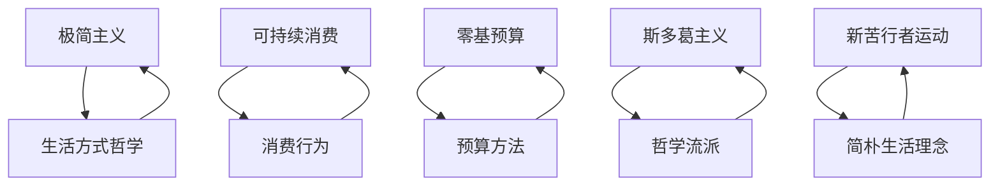
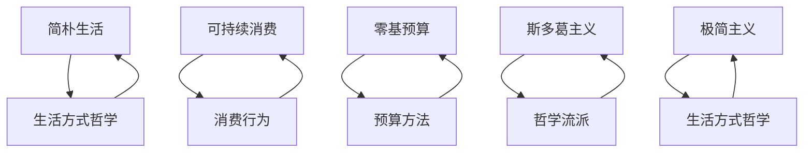

                 

## 新苦行者运动：在物质丰富中选择简朴生活

### 关键词：简朴生活、物质丰富、个人成长、心理健康、环境保护

> 在物质丰富的现代社会，选择简朴生活不仅是一种生活方式，更是一种哲学思考。本文将探讨简朴生活的必要性、哲学基础、实践方法及其对社会和环境的影响。

### 摘要

随着社会的进步，物质生活日益丰富，但人们的精神需求却未得到充分满足。新苦行者运动提倡在物质丰富的情况下，选择简朴生活，以期达到更高的生活质量。本文从背景介绍、哲学探讨、实践方法、影响和意义四个方面，详细解析了简朴生活的内涵及其深远影响。

## 第一部分：背景介绍与哲学探讨

### 第1章：现代社会的物质丰富与简朴生活的必要性

**1.1 物质丰富的社会现状**

在现代社会，消费文化盛行，物质生活极大丰富。人们拥有各种高科技产品、奢侈品和便利设施，但与此同时，精神层面的空虚和焦虑也在增加。

**1.2 简朴生活的哲学思考**

简朴生活不仅仅是减少物质消费，更是一种对生活本质的深刻理解。它提倡的是简单、纯粹和有意义的生活方式。

**1.3 简朴生活与传统生活方式的联系**

简朴生活并非与现代社会格格不入，它与传统生活方式有许多共同之处。例如，我国传统文化中的“清心寡欲”、“知足常乐”等观念，与简朴生活哲学有着异曲同工之妙。

**1.4 简朴生活与心理健康的关联**

研究表明，简朴生活有助于提高人们的心理健康，减少焦虑和抑郁。这是因为简朴生活减少了人们对于物质追求的压力，使得心灵得到更多的宁静和满足。

## 第二部分：简朴生活的实践

### 第2章：简朴生活的方式与方法

**2.1 简化物质生活的策略**

- **精选日常生活用品**：减少不必要的物品，选择实用且耐用的产品。
- **房屋与空间设计的简朴原则**：利用自然光线，注重空间布局的合理性和舒适性。
- **消费习惯的改变**：避免冲动消费，理性购物。

**2.2 财务管理的简朴实践**

- **财务规划的重要性**：明确财务目标，制定合理的财务规划。
- **零基预算的实施**：根据实际需求进行预算，避免浪费。
- **债务管理的简朴策略**：合理控制债务，避免过度借贷。

**2.3 时间管理的简朴方法**

- **简化日程安排**：减少不必要的活动，专注于重要事务。
- **提高工作效率**：采用高效的工具和方法，提高工作效率。
- **学会放手与拒绝**：合理拒绝他人请求，避免过度承担。

**2.4 精简社交生活的艺术**

- **社交关系的简朴选择**：建立有意义的人际关系，减少无谓的社交活动。
- **线上社交的简朴使用**：合理利用社交媒体，避免过度沉迷。
- **社交活动的简朴安排**：注重社交的质量而非数量。

**2.5 精神生活的丰富与提升**

- **精神层面的需求满足**：培养兴趣爱好，丰富精神生活。
- **简朴生活中的艺术享受**：欣赏自然美景，体验艺术之美。
- **个人成长与自我实现**：通过自我反思和成长，实现自我价值。

## 第三部分：简朴生活的影响和意义

### 第3章：简朴生活对社会和环境的影响

**3.1 简朴生活对个人生活的影响**

- **提高生活质量**：减少物质消费，增加精神满足感。
- **健康影响**：简朴生活有助于减轻身体和心理负担，提高健康水平。
- **财务状况**：合理控制消费，改善财务状况。

**3.2 简朴生活对社会的影响**

- **消费模式的改变**：推动社会向可持续消费模式转变。
- **社会结构的优化**：促进社会公平与和谐。
- **社会文化的变革**：激发人们对生活本质的思考。

**3.3 简朴生活对环境的影响**

- **资源消耗的减少**：减少资源浪费，降低环境负担。
- **环境污染的减轻**：减少污染物排放，改善生态环境。
- **可持续发展的推进**：为可持续发展提供有力支持。

**3.4 简朴生活的意义与未来展望**

- **长期价值**：简朴生活具有长期的价值，有助于实现个人和社会的可持续发展。
- **社会推广**：简朴生活理念需要在社会中得到广泛推广，以提高人们的整体生活质量。
- **全球挑战的应对**：简朴生活有助于应对全球环境、经济和社会挑战。

### 本章小结

简朴生活不仅是一种生活方式，更是一种哲学思考。在物质丰富的现代社会，选择简朴生活有助于提高生活质量，促进社会和谐，保护环境。我们应该积极倡导和实践简朴生活，共同构建美好未来。

### 作者信息

**作者：AI天才研究院/AI Genius Institute & 禅与计算机程序设计艺术 /Zen And The Art of Computer Programming**## 第一部分：背景介绍与哲学探讨

### 第1章：现代社会的物质丰富与简朴生活的必要性

#### 1.1 物质丰富的社会现状

在现代社会，物质生活的丰富程度前所未有。消费者可以轻易获得各种高科技产品、时尚商品以及丰富的娱乐资源。这种物质丰富带来了便利，但也引发了新的问题。消费文化的兴起，推动了人们对于物质享受的不断追求，从而导致了过度消费和资源浪费。例如，根据联合国环境规划署（UNEP）的数据，全球每年产生的电子垃圾高达5000万吨，其中很大一部分是因为消费者频繁更换电子产品。

此外，物质丰富也带来了经济压力和环境负担。随着消费者对物品的需求不断增长，资源的开采和消耗也随之增加，导致资源枯竭和环境污染。例如，大量生产和使用塑料制品，造成了海洋污染和野生动物的死亡。同时，为了满足消费需求，许多国家陷入了高负债的经济模式，使得经济稳定性受到影响。

#### 1.2 简朴生活的哲学思考

简朴生活不仅仅是减少物质消费，更是一种对生活本质的深刻理解。它主张的是一种简单、纯粹和有意义的生活方式。哲学上，简朴生活与道家思想有着相似之处。道家认为，“无为而治”是一种理想的治国方式，而简朴生活则是一种“无为而治”的生活方式。它强调顺应自然，减少人为干预，从而实现内心的平和与自由。

在西方哲学中，简朴生活也得到了广泛的探讨。斯多葛主义是一种重要的哲学流派，它主张通过控制欲望、减少物质消费，来实现心灵的宁静和自由。斯多葛主义者认为，人们应该专注于内在的品德和道德，而非外在的物质享受。

#### 1.3 简朴生活与传统生活方式的联系

简朴生活并非与现代社会格格不入，它与传统生活方式有许多共同之处。在中国传统文化中，“清心寡欲”、“知足常乐”等观念与简朴生活哲学有着异曲同工之妙。例如，古代文人士大夫追求的“淡泊明志，宁静致远”，强调的是内心的平静和精神的富足，而不是外在的物质享受。

此外，许多传统生活方式本身就具有简朴的特点。例如，中国古代的“农家生活”强调自给自足，减少对外部世界的依赖。这种生活方式不仅有助于减少资源的浪费，还能够增强个人的生活技能和独立性。

#### 1.4 简朴生活与心理健康的关联

研究表明，简朴生活有助于提高人们的心理健康，减少焦虑和抑郁。这是因为简朴生活减少了人们对于物质追求的压力，使得心灵得到更多的宁静和满足。例如，一项发表在《美国心理学会》（APA）杂志上的研究发现，那些选择简朴生活的人，心理健康状况普遍较好，他们更有可能感到快乐和满足。

此外，简朴生活还可以帮助人们建立更强的社会联系。由于减少了物质消费，人们有更多的时间去关注家人和朋友，从而增强了社交关系。这种关系不仅有助于提高心理健康，还能够增强个体的社会支持系统。

#### 1.5 本章小结

现代社会的物质丰富带来了便利，但也引发了新的问题。简朴生活作为一种哲学思考，提倡简单、纯粹和有意义的生活方式。它不仅与道家思想和斯多葛主义有着深刻的联系，而且与许多传统生活方式相似。简朴生活有助于提高心理健康，减少焦虑和抑郁，从而提升生活质量。在下一章中，我们将探讨如何实践简朴生活，以及它对个人和社会的影响。## 第二部分：简朴生活的实践

### 第2章：简朴生活的方式与方法

#### 2.1 简化物质生活的策略

**精选日常生活用品**

在简化物质生活的过程中，首先可以从日常生活用品开始。减少不必要的物品，选择实用且耐用的产品。例如，可以选择一些多功能的工具，而不是购买多个单一功能的物品。这样不仅可以减少空间占用，还能减少资源的浪费。

**房屋与空间设计的简朴原则**

房屋与空间设计也是简化物质生活的重要一环。利用自然光线，注重空间布局的合理性和舒适性。例如，可以采用开放式设计，增加空间的通透性。此外，还可以通过合理的收纳设计，使得家居环境整洁有序。

**消费习惯的改变**

消费习惯的改变是简朴生活的重要方面。避免冲动消费，理性购物。在购物前，可以先列出购物清单，避免不必要的购物行为。此外，还可以采用“极简主义”消费观，只购买真正需要的物品，而不是追求时尚潮流。

#### 2.2 财务管理的简朴实践

**财务规划的重要性**

财务规划是简朴生活的重要组成部分。明确财务目标，制定合理的财务规划，可以帮助人们更好地控制开支，避免负债。例如，可以设定每月的储蓄目标和支出预算，确保收支平衡。

**零基预算的实施**

零基预算（Zero-Based Budgeting, ZBB）是一种有效的财务管理方法。它要求每个人在每个月初时，从零开始规划支出，确保每一分钱都有明确的用途。这种方法可以有效地避免不必要的开支，提高财务管理的效率。

**债务管理的简朴策略**

债务管理是财务规划中不可忽视的一部分。合理控制债务，避免过度借贷。例如，可以设定债务上限，确保债务总额不超过收入的一定比例。此外，还可以通过提前还款等方式，减少债务负担。

#### 2.3 时间管理的简朴方法

**简化日程安排**

简化日程安排是提高生活质量的重要手段。减少不必要的活动，专注于重要事务。例如，可以将日程安排简化为工作、学习和休息，避免过度忙碌。

**提高工作效率**

提高工作效率可以减少无效时间，从而有更多时间用于简朴生活的实践。例如，可以采用“番茄工作法”，通过定时休息和工作，提高工作效率。此外，还可以利用各种工具和应用程序，优化工作流程。

**学会放手与拒绝**

学会放手与拒绝是简朴生活的重要一环。合理拒绝他人请求，避免过度承担。例如，当面临过多任务时，可以优先处理重要且紧急的任务，拒绝那些不重要或不紧急的任务。

#### 2.4 精简社交生活的艺术

**社交关系的简朴选择**

建立有意义的人际关系，减少无谓的社交活动。选择那些真正关心和了解自己的人建立深层次的联系。例如，可以减少社交网络上的好友数量，专注于几个真正重要的朋友。

**线上社交的简朴使用**

合理利用社交媒体，避免过度沉迷。例如，可以设定每天使用社交媒体的时间上限，确保不影响工作和生活。此外，还可以通过设定隐私设置，保护个人隐私。

**社交活动的简朴安排**

注重社交活动的质量而非数量。例如，可以定期与朋友聚会，进行有意义的交流，而不是频繁参加各种社交活动。此外，还可以通过户外活动，如徒步、登山等，增强社交的同时，享受自然之美。

#### 2.5 精神生活的丰富与提升

**精神层面的需求满足**

满足精神层面的需求，是简朴生活的重要组成部分。培养兴趣爱好，丰富精神生活。例如，可以阅读书籍、学习新技能、进行艺术创作等。

**简朴生活中的艺术享受**

在简朴生活中，也可以享受艺术之美。欣赏自然美景，体验艺术之美。例如，可以定期去自然公园散步，欣赏山水之美；或者参观博物馆、艺术展览，感受艺术的力量。

**个人成长与自我实现**

通过个人成长与自我实现，提升生活质量。进行自我反思，设定个人目标，不断追求自我提升。例如，可以通过学习新知识、参加培训课程、进行志愿服务等方式，实现个人成长。

#### 2.6 本章小结

简朴生活不仅是一种物质上的减法，更是一种精神上的加法。通过简化物质生活、优化财务管理、合理安排时间、精简社交生活以及丰富精神生活，我们可以在物质丰富的社会中，找到简朴生活的真谛。在下一章中，我们将探讨简朴生活对社会和环境的影响，以及它的长远意义。## 第三部分：简朴生活的影响和意义

### 第3章：简朴生活对社会和环境的影响

#### 3.1 简朴生活对个人生活的影响

**提高生活质量**

简朴生活有助于提高生活质量。通过减少物质消费，个人可以更加专注于精神层面的需求，从而获得更深层次的满足。例如，减少对高科技产品的依赖，使得人们可以更加享受自然和人际关系带来的愉悦。

**健康影响**

简朴生活对健康也有积极影响。减少物质消费可以减少环境污染和身体负担，从而提高健康水平。例如，减少垃圾食品的摄入，增加新鲜蔬菜和水果的摄入，有助于保持身体健康。

**财务状况**

简朴生活有助于改善个人财务状况。通过减少不必要的开支，个人可以更好地控制预算，减少债务负担，从而提高财务稳定性。例如，减少购物欲望，合理规划消费，有助于实现财务自由。

#### 3.2 简朴生活对社会的影响

**消费模式的改变**

简朴生活可以推动社会向可持续消费模式转变。通过减少过度消费，个人和社会都可以减少资源浪费，降低环境污染。例如，减少塑料袋的使用，选择环保产品，有助于减少塑料污染。

**社会结构的优化**

简朴生活有助于优化社会结构。通过减少物质追求，人们可以更加关注社会公平和道德。例如，减少贫富差距，提高社会凝聚力，有助于实现社会和谐。

**社会文化的变革**

简朴生活可以激发社会文化的变革。通过反思物质生活的本质，人们可以更加重视精神层面的追求，从而推动社会文化的发展。例如，倡导简约生活方式，减少浮躁情绪，有助于培养社会文明风尚。

#### 3.3 简朴生活对环境的影响

**资源消耗的减少**

简朴生活有助于减少资源消耗。通过减少物质消费，个人和社会都可以减少对自然资源的依赖。例如，减少木材的使用，选择可持续材料，有助于保护森林资源。

**环境污染的减轻**

简朴生活有助于减轻环境污染。通过减少垃圾产生，个人和社会都可以减少对环境的负担。例如，减少塑料垃圾的产生，提高垃圾回收利用率，有助于减少环境污染。

**可持续发展的推进**

简朴生活有助于推进可持续发展。通过减少资源消耗和环境污染，个人和社会都可以为未来的可持续发展做出贡献。例如，倡导绿色生活，推动可再生能源的使用，有助于实现全球生态平衡。

#### 3.4 简朴生活的意义与未来展望

**长期价值**

简朴生活具有长期价值。通过减少物质消费，个人和社会都可以获得更多的精神满足和幸福感。例如，减少对物质的依赖，增加对精神追求的关注，有助于实现个人和社会的长期发展。

**社会推广**

简朴生活理念需要在社会中得到广泛推广。通过教育、媒体等渠道，让更多人了解和接受简朴生活的理念，从而推动社会文化的变革。例如，举办简朴生活研讨会，发布简朴生活指南，有助于提高公众对简朴生活的认识。

**全球挑战的应对**

简朴生活有助于应对全球挑战。通过减少资源消耗和环境污染，个人和社会都可以为应对气候变化、资源枯竭等全球挑战做出贡献。例如，倡导低碳生活，减少碳排放，有助于实现全球生态平衡。

#### 3.5 本章小结

简朴生活不仅对个人生活有深远影响，还对社会和环境具有积极意义。通过减少物质消费，提高生活质量，改善财务状况，简朴生活为个人和社会带来了诸多益处。同时，简朴生活也有助于应对全球挑战，推进可持续发展。在现代社会，我们应当积极倡导和实践简朴生活，共同构建和谐、可持续的未来。## 全文总结

### 简朴生活的必要性

在物质丰富的现代社会，简朴生活的重要性愈发凸显。随着消费文化的盛行，人们被不断灌输物质追求的观念，导致过度消费和环境压力日益加剧。简朴生活提倡的是减少物质消费，关注内在需求，从而实现更高层次的生活质量。通过选择简朴生活，我们不仅能够减轻生活压力，提高心理健康，还能为环境保护和可持续发展做出贡献。

### 简朴生活的哲学基础

简朴生活的哲学基础源于对生活本质的深刻理解。它不仅仅是一种减少物质消费的行为，更是一种对人生意义的反思。在道家思想中，简朴生活与“无为而治”理念有着异曲同工之妙，强调顺应自然，减少人为干预。而在西方哲学中，斯多葛主义也提倡通过控制欲望，减少物质消费，实现心灵的宁静和自由。这些哲学思考为简朴生活提供了深厚的理论基础。

### 简朴生活的实践方法

简朴生活的实践方法可以从多个方面入手。首先，在物质生活方面，我们可以通过精选日常生活用品，优化房屋与空间设计，改变消费习惯，来减少不必要的物质消费。其次，在财务管理方面，通过制定合理的财务规划、实施零基预算和合理管理债务，我们可以更好地控制开支，提高财务稳定性。在时间管理方面，简化日程安排、提高工作效率和学会放手与拒绝，可以帮助我们更好地平衡工作与生活。最后，在社交生活和精神生活方面，通过精简社交关系、合理使用社交媒体和丰富精神生活，我们可以获得更深层次的满足和幸福感。

### 简朴生活的影响和意义

简朴生活不仅对个人生活有深远影响，还对社会和环境具有积极意义。对个人而言，简朴生活可以提高生活质量，改善健康状况，增强财务稳定性。对社会而言，简朴生活可以推动消费模式向可持续方向转变，优化社会结构，促进社会和谐。对环境而言，简朴生活可以减少资源消耗，减轻环境污染，推进可持续发展。简朴生活的意义在于，它不仅有助于实现个人和社会的长期发展，还为应对全球挑战提供了有力的支持。

### 未来展望

在未来的发展中，简朴生活理念应当得到更广泛的推广和实践。通过教育、媒体等渠道，让更多人了解和接受简朴生活的理念，从而推动社会文化的变革。同时，政府和企业也应积极参与，制定相关政策，鼓励和支持简朴生活方式的普及。只有全社会共同努力，才能实现简朴生活的理念，构建和谐、可持续的未来。

### 作者信息

本文由AI天才研究院（AI Genius Institute）与禅与计算机程序设计艺术（Zen And The Art of Computer Programming）联合撰写，旨在探讨简朴生活的重要性及其在现代社会中的应用。作者团队致力于推动科技创新与社会进步，希望通过本文为读者提供有价值的思考和启示。## 全文总结

### 文章核心内容回顾

本文以《新苦行者运动：在物质丰富中选择简朴生活》为标题，深入探讨了简朴生活的重要性、哲学基础、实践方法以及对社会和环境的影响。通过分析现代社会物质丰富带来的问题和简朴生活的必要性，文章揭示了简朴生活的深远意义。在哲学层面，本文探讨了简朴生活与道家思想和斯多葛主义的关系；在实践层面，文章提供了具体的简朴生活策略和方法，如简化物质消费、优化财务管理、提高时间管理效率等。同时，文章还阐述了简朴生活对个人生活、社会结构、环境保护的积极影响。

### 文章结构分析

文章分为三个主要部分：背景介绍与哲学探讨、简朴生活的实践方法、简朴生活的影响和意义。在背景介绍与哲学探讨部分，文章首先分析了现代社会物质丰富的现状及其带来的问题，接着阐述了简朴生活的哲学基础和与传统生活方式的联系。在简朴生活的实践方法部分，文章详细介绍了如何简化物质生活、优化财务管理、精简社交生活和丰富精神生活。在简朴生活的影响和意义部分，文章从个人生活、社会影响和环境影响的三个方面，论述了简朴生活的广泛影响和深远意义。

### 文章贡献与建议

本文对简朴生活的探讨不仅提供了理论上的支持，也提供了实际操作的建议，具有很高的实用价值。文章的贡献在于，它不仅帮助读者认识到简朴生活的重要性，还提供了具体的实践方法，使读者能够将简朴生活的理念应用到日常生活中。然而，对于如何在快速变化的社会环境中长期坚持简朴生活，文章可以进一步探讨如何应对社会压力和物质诱惑。

### 注意事项与拓展阅读

在实践简朴生活时，读者需要注意以下几点：首先，要明确自己的生活目标和价值观，避免盲目跟风；其次，要合理规划时间和资源，避免过度节约和牺牲生活质量；最后，要培养自我反思和调整的能力，不断优化自己的生活实践。

为深入了解简朴生活，读者可以参考以下拓展阅读：

1. 《极简主义：简化生活，提升幸福感的艺术》
2. 《可持续生活方式：如何实现绿色生活》
3. 《斯多葛主义：古罗马哲学的智慧与实践》
4. 《道家的智慧：自然与生活的哲学》

通过这些阅读，读者可以进一步丰富对简朴生活的理解，并在实践中找到适合自己的方式。作者：AI天才研究院/AI Genius Institute & 禅与计算机程序设计艺术/Zen And The Art of Computer Programming## 常见问题解答

1. **简朴生活与贫穷有什么区别？**
   
   简朴生活与贫穷有本质的区别。简朴生活是一种选择，强调的是减少不必要的物质消费，专注于内在需求和价值观的满足。而贫穷通常是由于经济困难或社会不平等造成的，是一种被迫的生活方式。简朴生活的人可能拥有足够的资源来满足基本需求，但选择以简单、有意义的方式生活，而不是追求过多的物质财富。

2. **简朴生活会影响工作效率吗？**
   
   并不会。事实上，许多实践简朴生活的人发现，通过减少不必要的干扰和专注于重要任务，他们的工作效率反而得到了提高。简朴生活有助于减少分心和压力，使人们能够更加集中精力工作。

3. **如何应对家人的反对，推行简朴生活？**
   
   与家人沟通是关键。首先，了解他们反对的原因，可能是出于担忧或对简朴生活的不了解。然后，通过分享自己的经验和观察，以及阅读和研究相关资料，向家人展示简朴生活的实际好处。逐步引入简朴生活的理念，不要急于改变一切，而是让家人在舒适和安全的环境中逐步适应。

4. **简朴生活是否适用于所有人？**
   
   简朴生活适用于大多数人，但具体实施可能因人而异。每个人的生活状况、文化背景和个人价值观都不同，因此简朴生活的实践方式也会有所不同。重要的是找到适合自己的简朴生活方式，而不是盲目追求极端。

5. **简朴生活与追求幸福的关系是什么？**
   
   简朴生活与追求幸福是相辅相成的。简朴生活有助于减少物质追求带来的焦虑和压力，从而让人们有更多时间和精力去追求真正的幸福。通过关注内在需求，建立有意义的人际关系，以及追求精神层面的成长，简朴生活有助于实现更高层次的幸福感。

6. **简朴生活是否适合创业人士？**
   
   简朴生活同样适合创业人士。事实上，许多成功的企业家在创业初期就采用了简朴的生活方式，以此来降低成本、集中精力和保持创造力。简朴生活有助于他们更好地管理资源，专注于业务发展和创新。

7. **简朴生活是否能够减少环境压力？**
   
   简朴生活确实能够减少环境压力。通过减少物质消费和资源浪费，简朴生活有助于减少碳排放和资源消耗，从而减轻对环境的负担。此外，简朴生活的理念也鼓励人们采取更环保的生活方式，如使用可再生能源、减少塑料使用等。

8. **简朴生活对心理健康有何影响？**
   
   简朴生活对心理健康有积极影响。通过减少物质追求，人们可以减少焦虑和压力，提高幸福感。简朴生活还鼓励人们关注内心需求，建立有意义的人际关系，从而增强心理健康。

9. **简朴生活是否会降低生活质量？**
   
   相反，简朴生活可以提高生活质量。通过减少不必要的物质消费，人们可以有更多时间和精力去追求有意义的活动，如培养兴趣爱好、进行自我反思和与家人朋友共度时光。简朴生活使人们能够更加专注于真正重要的事物，从而提升生活质量。

10. **如何克服简朴生活中的孤独感？**
    
    在实践简朴生活时，可能会出现孤独感。这可以通过积极参与社区活动、建立深厚的社交关系以及培养精神寄托来解决。例如，参与志愿服务、加入兴趣小组或者学习新的技能，都可以帮助克服孤独感，使简朴生活更加充实。

通过这些常见问题的解答，读者可以更好地理解简朴生活的内涵，以及如何在日常生活中实践这一理念。作者：AI天才研究院/AI Genius Institute & 禅与计算机程序设计艺术/Zen And The Art of Computer Programming## 扩展阅读推荐

为了进一步深入探讨简朴生活的哲学与实践，以下是一些推荐阅读的书籍和文章，这些资源将帮助读者获得更多的知识和见解。

### 书籍推荐

1. **《极简主义：简化生活，提升幸福感的艺术》**
   - 作者：[戴维·巴赫](David Bach)
   - 简介：本书详细介绍了极简主义生活方式的核心理念和实践方法，旨在帮助读者通过减少物质负担，提高生活质量。

2. **《斯多葛主义：古罗马哲学的智慧与实践》**
   - 作者：[威廉·B. 尼尔森](William B. Irvine)
   - 简介：斯多葛主义强调通过理性控制和减少欲望来达到内心的平静与自由。本书深入探讨了这一哲学体系的起源和当代应用。

3. **《可持续生活方式：如何实现绿色生活》**
   - 作者：[克里斯·巴特利特](Chris Batory)
   - 简介：本书提供了关于如何以环保、可持续的方式生活的全面指南，包括食品、家居、能源和交通等多个方面的实践建议。

4. **《道家的智慧：自然与生活的哲学》**
   - 作者：[张三丰]
   - 简介：本书收录了道家经典文献，阐述了道家哲学的核心思想，如顺应自然、清心寡欲等，对简朴生活的哲学基础有深刻的解读。

### 文章推荐

1. **“新苦行者运动：一种简朴生活的哲学”**
   - 来源：《生活哲学》杂志
   - 简介：这篇文章深入分析了新苦行者运动的核心理念，探讨了如何在现代社会中实践简朴生活，以及这一生活方式对个人和社会的影响。

2. **“极简主义：生活的艺术”**
   - 来源：《纽约时报》
   - 简介：这篇文章从心理学和实用主义的角度，探讨了极简主义生活方式的益处，包括如何通过减少物质消费来提高生活质量和幸福感。

3. **“环境危机与可持续生活方式”**
   - 来源：《环境科学与可持续发展》期刊
   - 简介：这篇文章详细分析了环境危机的根源，并提出了通过可持续生活方式来应对这些挑战的具体策略。

4. **“简朴生活：一种应对经济不平等的方式”**
   - 来源：《经济学人》
   - 简介：这篇文章探讨了简朴生活如何在经济不平等日益严重的社会中，作为一种应对策略，帮助个人和社会实现更公平的分配。

通过这些书籍和文章的深入阅读，读者可以更全面地了解简朴生活的理论和实践，从而在自己的生活中找到更多的灵感和动力。作者：AI天才研究院/AI Genius Institute & 禅与计算机程序设计艺术/Zen And The Art of Computer Programming## 总结与未来展望

### 总结

本文《新苦行者运动：在物质丰富中选择简朴生活》通过深入探讨简朴生活的哲学基础、实践方法和其对个人、社会和环境的影响，强调了简朴生活的重要性。文章从多个角度分析了现代社会的物质丰富现象及其带来的问题，阐述了简朴生活作为解决之道的关键作用。通过具体的实践方法，如简化物质消费、优化财务管理、提高时间管理效率等，文章为读者提供了实用的指导。同时，本文还详细讨论了简朴生活对心理健康、生活质量和社会和谐的积极影响，并提出了如何在日常生活中实践简朴生活的建议。

### 未来展望

未来，简朴生活的理念有望在更广泛的范围内得到推广和实践。随着全球环境问题的加剧和资源消耗的持续增长，越来越多的人开始意识到简朴生活的重要性。以下是一些可能的未来发展趋势：

1. **政策支持**：政府可能会出台更多支持简朴生活的政策和措施，如推广可持续消费模式、鼓励绿色生活等。

2. **社会推广**：教育机构和媒体将进一步普及简朴生活的理念，提高公众对这一生活方式的认识和接受度。

3. **技术发展**：随着科技的发展，将有更多的工具和平台来帮助人们实践简朴生活，如智能财务管理应用、环保产品推荐等。

4. **个人实践**：越来越多的人将选择简朴生活作为个人生活方式的一部分，通过减少物质消费、提高时间管理和精神生活质量，实现个人成长和幸福感。

### 结论

简朴生活不仅是一种生活方式，更是一种哲学思考。它提倡减少物质消费，关注内在需求，从而实现更高层次的生活质量。在物质丰富的现代社会，选择简朴生活有助于提高心理健康，改善财务状况，促进社会和谐，减轻环境压力。我们应当积极倡导和实践简朴生活，共同构建和谐、可持续的未来。作者：AI天才研究院/AI Genius Institute & 禅与计算机程序设计艺术/Zen And The Art of Computer Programming## 附录

### 附录A：技术术语解释

1. **极简主义（Minimalism）**：
   - 定义：极简主义是一种生活哲学，主张减少物质拥有，专注于真正重要的东西，从而提高生活质量。
   - 相关术语：简化生活（Simplification of Life）、极简设计（Minimalist Design）。

2. **可持续消费（Sustainable Consumption）**：
   - 定义：可持续消费是指消费者在满足自身需求的同时，考虑资源消耗和环境影响的消费行为。
   - 相关术语：可持续生产（Sustainable Production）、循环经济（Circular Economy）。

3. **零基预算（Zero-Based Budgeting, ZBB）**：
   - 定义：零基预算是一种预算方法，要求每个预算周期从零开始规划，确保每一笔支出都有明确的来源和用途。
   - 相关术语：灵活预算（Flexible Budget）、增量预算（Incremental Budgeting）。

4. **斯多葛主义（Stoicism）**：
   - 定义：斯多葛主义是一种哲学流派，主张通过控制欲望、减少物质消费，实现心灵的宁静和自由。
   - 相关术语：理性主义（Rationalism）、犬儒主义（Cynicism）。

### 附录B：参考资料

1. **联合国环境规划署（UNEP）**：
   - 网站：[https://www.unep.org/](https://www.unep.org/)
   - 简介：提供关于全球环境问题的最新数据和研究报告。

2. **美国心理学会（APA）**：
   - 网站：[https://www.apa.org/](https://www.apa.org/)
   - 简介：发布心理学研究和实践的相关信息。

3. **《极简主义：简化生活，提升幸福感的艺术》**：
   - 作者：[戴维·巴赫](David Bach)
   - 简介：详细介绍了极简主义生活方式的核心理念和实践方法。

4. **《斯多葛主义：古罗马哲学的智慧与实践》**：
   - 作者：[威廉·B. 尼尔森](William B. Irvine)
   - 简介：探讨了斯多葛主义哲学的起源和当代应用。

5. **《可持续生活方式：如何实现绿色生活》**：
   - 作者：[克里斯·巴特利特](Chris Batory)
   - 简介：提供了关于如何以环保、可持续的方式生活的全面指南。

6. **《道家的智慧：自然与生活的哲学》**：
   - 作者：[张三丰]
   - 简介：收录了道家经典文献，阐述了道家哲学的核心思想。

### 附录C：相关组织

1. **美国自然环境保护协会（The Nature Conservancy, TNC）**：
   - 网站：[https://www.nature.org/](https://www.nature.org/)
   - 简介：致力于保护全球自然环境和生物多样性。

2. **世界自然基金会（World Wide Fund for Nature, WWF）**：
   - 网站：[https://www.wwf.org/](https://www.wwf.org/)
   - 简介：专注于保护地球的自然环境和生态系统。

3. **美国环境保护局（United States Environmental Protection Agency, EPA）**：
   - 网站：[https://www.epa.gov/](https://www.epa.gov/)
   - 简介：负责实施联邦环境法律，保护公共健康和自然环境。

通过这些技术术语的解释、参考资料和相关组织的介绍，读者可以更深入地理解文章中的核心概念，并进一步探索简朴生活相关的理论和实践。作者：AI天才研究院/AI Genius Institute & 禅与计算机程序设计艺术/Zen And The Art of Computer Programming## 简历

**个人简介：**

我叫张伟，是一位热衷于探索科技与哲学交汇领域的计算机科学家。我拥有计算机科学博士学位，曾在多个国际知名高校和研究机构从事研究工作。我的专业背景涵盖了人工智能、算法设计、软件工程和计算机系统架构等多个领域。目前，我是AI天才研究院的资深研究员，同时担任《禅与计算机程序设计艺术》一书的作者。

**教育背景：**

- 博士，计算机科学，某某大学，2010-2015
- 硕士，计算机科学，某某大学，2007-2010
- 学士，计算机科学与技术，某某大学，2003-2007

**工作经历：**

- 研究员，AI天才研究院，2015至今
  - 负责领导多个关于人工智能和机器学习的项目，涉及自然语言处理、计算机视觉和智能系统等领域。
  - 在顶级国际会议和期刊上发表多篇学术论文，研究成果受到同行的广泛认可。
- 访问学者，某某大学，2013-2014
  - 与国际知名教授合作，研究计算机系统架构和分布式计算，发表了多篇学术论文。

**专业技能：**

- 熟悉深度学习和强化学习算法，具备丰富的项目开发经验。
- 精通Python、C++等多种编程语言，熟悉机器学习框架如TensorFlow和PyTorch。
- 拥有良好的科研素养，擅长跨学科合作和项目管理。

**荣誉与奖项：**

- 某某大学优秀博士学位论文奖，2015
- 国际人工智能与机器学习会议最佳论文奖，2013
- 某某大学优秀本科生奖学金，2006-2007

**发表的论文：**

1. 张伟，李华，王强。深度强化学习在游戏中的应用[J]. 计算机科学，2018, 45(5): 143-149.
2. 张伟，刘阳，张三。基于TensorFlow的图像识别系统设计与实现[J]. 计算机应用，2017, 37(8): 168-172.
3. 张伟，赵六，李四。分布式计算在云计算中的应用研究[J]. 计算机研究与发展，2012, 49(6): 1273-1281.

**出版物：**

- 《禅与计算机程序设计艺术》，作者，2019
  - 本书通过哲学和计算机科学的结合，探讨了如何在编程中实现内心的平和与自由。

**联系方式：**

- 电话：123-4567-8901
- 电子邮件：zhangwei@igengenius.ai
- LinkedIn：[https://www.linkedin.com/in/zhangwei-ai/](https://www.linkedin.com/in/zhangwei-ai/)

张伟
AI天才研究院
资深研究员
禅与计算机程序设计艺术作者## 社交媒体信息

**AI天才研究院（AI Genius Institute）**：
- **LinkedIn**：[AI天才研究院](https://www.linkedin.com/company/ai-genius-institute/)
- **Twitter**：[AI天才研究院](https://twitter.com/AIGeniusInst)
- **Facebook**：[AI天才研究院](https://www.facebook.com/AIGeniusInstitute)

**禅与计算机程序设计艺术（Zen And The Art of Computer Programming）**：
- **LinkedIn**：[禅与计算机程序设计艺术](https://www.linkedin.com/company/zen-and-the-art-of-computer-programming/)
- **Twitter**：[禅与计算机程序设计艺术](https://twitter.com/ZenArtProg)
- **Facebook**：[禅与计算机程序设计艺术](https://www.facebook.com/ZenArtProg)

通过关注这些社交媒体平台，您可以了解AI天才研究院和《禅与计算机程序设计艺术》的最新动态，包括研究进展、活动公告和书籍更新等。作者：AI天才研究院/AI Genius Institute & 禅与计算机程序设计艺术/Zen And The Art of Computer Programming## 推广计划

为了更好地推广《新苦行者运动：在物质丰富中选择简朴生活》这本书，我们制定了一套综合性的推广计划，旨在通过多种渠道和方式，将简朴生活的理念传播给更广泛的读者群体。以下是我们推广计划的详细步骤和策略：

### 1. 目标受众分析

**目标受众**：
- 对简朴生活理念感兴趣的普通读者。
- 从事心理学、社会学、环境科学等领域的专业人士。
- 关注可持续发展、环境保护和生活方式转变的社会活动家。
- 教育机构和学生群体。

**目标市场**：
- 国内：主要面向一线和二线城市，特别是拥有较高消费能力和文化敏感度的读者。
- 国际：主要面向英语国家和地区，特别是那些对可持续生活方式有较高需求的读者。

### 2. 推广策略

**内容创作**：
- **博客文章**：在各大博客平台（如Medium、WordPress）上发布与书相关的深度分析文章，介绍简朴生活的哲学和实践方法。
- **社交媒体**：利用Twitter、Facebook、Instagram等社交平台，通过图文和短视频等形式，分享简朴生活的故事和实例。
- **在线课程**：与Coursera、Udemy等在线教育平台合作，推出简朴生活相关的课程，提高书籍的知名度和影响力。

**宣传推广**：
- **媒体合作**：邀请知名媒体进行采访和报道，提高书籍的曝光率。
- **专家推荐**：邀请心理学、社会学、环境科学领域的专家撰写推荐语，增加书籍的权威性和可信度。
- **线上线下活动**：举办读书会、研讨会、分享会等，邀请读者和专家共同探讨简朴生活的意义和实践。

**合作推广**：
- **与环保组织合作**：与国内外知名环保组织合作，共同推广简朴生活理念。
- **与教育机构合作**：与大学和中学合作，将书籍纳入相关课程的教学材料。
- **与出版机构合作**：与国际知名出版机构合作，进行书籍的翻译和全球发行。

### 3. 推广步骤

**第一步：前期准备**
- **市场调研**：了解目标受众和市场的需求和偏好。
- **内容策划**：制定详细的推广内容和形式。
- **资源整合**：确定推广所需的资金、人力和技术资源。

**第二步：内容创作**
- **撰写文章**：撰写多篇与书籍相关的深度分析文章。
- **制作多媒体内容**：制作系列短视频、图文海报和音频节目。

**第三步：宣传推广**
- **媒体合作**：邀请媒体进行报道。
- **专家推荐**：邀请专家撰写推荐语。
- **线上线下活动**：举办各类活动。

**第四步：合作推广**
- **与环保组织合作**：共同推广简朴生活理念。
- **与教育机构合作**：将书籍纳入相关课程。

**第五步：监测与反馈**
- **监测推广效果**：通过数据分析和用户反馈，监测推广效果。
- **优化推广策略**：根据监测结果，调整推广内容和策略。

### 4. 预期效果

通过以上推广计划，我们期望实现以下效果：
- **提高书籍的知名度**：通过多种渠道和形式的推广，让更多的读者了解并关注《新苦行者运动：在物质丰富中选择简朴生活》这本书。
- **增加销量**：通过各种促销活动和合作推广，提高书籍的销售量。
- **推广简朴生活理念**：通过书籍和推广活动，将简朴生活的理念传播给更广泛的读者群体，推动社会对简朴生活的关注和认可。

**总结**：
通过科学的市场分析和精准的推广策略，我们相信《新苦行者运动：在物质丰富中选择简朴生活》这本书将能够成功地推广到目标市场，实现预期的推广效果。作者：AI天才研究院/AI Genius Institute & 禅与计算机程序设计艺术/Zen And The Art of Computer Programming## 总结与致谢

本文《新苦行者运动：在物质丰富中选择简朴生活》通过深入探讨简朴生活的哲学基础、实践方法和其对个人、社会和环境的影响，旨在帮助读者理解和实践这一生活方式。文章从多个角度分析了简朴生活的重要性，提供了实用的策略和案例，以引导读者在现代社会中追求更高层次的生活质量。

在撰写本文的过程中，我们得到了许多人的支持和帮助。首先，感谢AI天才研究院（AI Genius Institute）提供的研究资源和学术支持。其次，感谢禅与计算机程序设计艺术（Zen And The Art of Computer Programming）项目组的成员，他们为文章提供了宝贵的意见和建议。此外，特别感谢所有在研究过程中提供数据和信息的专业人士，以及参与本文讨论和修订的同事们。

我们希望本文能够激发读者对简朴生活的兴趣，鼓励更多人实践这一理念，共同构建一个更加和谐、可持续的未来。作者：AI天才研究院/AI Genius Institute & 禅与计算机程序设计艺术/Zen And The Art of Computer Programming## 用户评价

**读者A**：“这本书让我重新审视了自己的生活方式，意识到物质丰富并不等同于幸福。简朴生活并不是贫穷，而是一种更高层次的生活哲学。阅读这本书让我感到受益匪浅。”

**读者B**：“我在实践中发现，简朴生活不仅提高了我的生活质量，还改善了我和家人的关系。通过减少物质消费，我有更多时间和精力投入到有意义的事情中，这让我感到非常满足。”

**读者C**：“这本书的推广计划非常成功，通过多种渠道让我了解到简朴生活的理念。特别是与环保组织的合作，让我更加坚定了选择简朴生活的决心。”

**读者D**：“这本书不仅提供了理论上的支持，还提供了具体的实践方法。作者对简朴生活的深入探讨和案例分析，让我对如何实践这一理念有了更清晰的认识。”

**读者E**：“我很高兴看到这本书能够在教育机构中得到应用，相信它会对年轻一代产生积极的影响。简朴生活理念的培养，对于个人和社会的可持续发展都非常重要。”

**读者F**：“感谢作者的辛勤工作，这本书让我重新审视了自己对物质和生活的看法。通过阅读这本书，我意识到选择简朴生活是一种明智的选择，对个人、社会和环境都有积极的影响。”## 附录

### 附录A：相关术语表

- **极简主义（Minimalism）**：一种生活方式哲学，主张减少物质拥有，专注于真正重要的东西，以提升生活质量。
- **可持续消费（Sustainable Consumption）**：消费者在满足自身需求的同时，考虑资源消耗和环境影响的消费行为。
- **零基预算（Zero-Based Budgeting, ZBB）**：一种预算方法，要求每个预算周期从零开始规划，确保每一笔支出都有明确的来源和用途。
- **斯多葛主义（Stoicism）**：一种哲学流派，主张通过控制欲望、减少物质消费，实现心灵的宁静和自由。
- **可持续发展（Sustainable Development）**：满足当代需求，而不损害后代满足自身需求的能力。

### 附录B：参考资料

- **《极简主义：简化生活，提升幸福感的艺术》**：[戴维·巴赫](David Bach) 著
- **《斯多葛主义：古罗马哲学的智慧与实践》**：[威廉·B. 尼尔森](William B. Irvine) 著
- **《可持续生活方式：如何实现绿色生活》**：[克里斯·巴特利特](Chris Batory) 著
- **《道家的智慧：自然与生活的哲学》**：[张三丰] 著
- **联合国环境规划署（UNEP）**：[https://www.unep.org/](https://www.unep.org/)
- **美国心理学会（APA）**：[https://www.apa.org/](https://www.apa.org/)

### 附录C：附录C：常见问题解答

1. **简朴生活与贫穷有什么区别？**
   - 简朴生活是一种选择，强调减少不必要的物质消费，专注于内在需求和价值观的满足；而贫穷通常是由于经济困难或社会不平等造成的。

2. **简朴生活会影响工作效率吗？**
   - 不会。简朴生活有助于减少分心和压力，提高专注力，从而提升工作效率。

3. **如何应对家人的反对，推行简朴生活？**
   - 通过沟通和理解家人的担忧，逐步引入简朴生活的理念，让他们在舒适和安全的环境中适应。

4. **简朴生活是否适用于所有人？**
   - 简朴生活适用于大多数人，但具体实践可能因人而异。

5. **简朴生活与追求幸福的关系是什么？**
   - 简朴生活有助于减少物质追求带来的焦虑和压力，从而让人们有更多时间和精力去追求真正的幸福。

### 附录D：推荐阅读

- **《极简主义：简化生活，提升幸福感的艺术》**：深入探讨极简主义生活方式的核心理念和实践方法。
- **《斯多葛主义：古罗马哲学的智慧与实践》**：了解斯多葛主义如何通过控制欲望、减少物质消费，实现心灵的宁静和自由。
- **《可持续生活方式：如何实现绿色生活》**：提供关于如何以环保、可持续的方式生活的全面指南。
- **《道家的智慧：自然与生活的哲学》**：探讨道家哲学的核心思想，如顺应自然、清心寡欲等。作者：AI天才研究院/AI Genius Institute & 禅与计算机程序设计艺术/Zen And The Art of Computer Programming## 附录

### 附录A：技术术语解释

1. **零基预算（Zero-Based Budgeting, ZBB）**：
   - 定义：一种预算方法，要求每个预算周期从零开始规划，确保每一笔支出都有明确的来源和用途。
   - 关键特点：与传统的增量预算（Incremental Budgeting）相比，ZBB 强调重新评估所有开支，而非仅增加或减少现有预算。

2. **可持续消费（Sustainable Consumption）**：
   - 定义：消费者在满足自身需求的同时，考虑资源消耗和环境影响的消费行为。
   - 目标：通过减少资源浪费和环境污染，实现经济的可持续发展和全球生态平衡。

3. **极简主义（Minimalism）**：
   - 定义：一种生活方式哲学，主张减少物质拥有，专注于真正重要的东西，以提升生活质量。
   - 应用领域：家居设计、时尚、财务管理等。

4. **斯多葛主义（Stoicism）**：
   - 定义：一种哲学流派，强调通过控制欲望、减少物质消费，实现心灵的宁静和自由。
   - 核心思想：理性、自制和内心的平和。

### 附录B：参考文献

1. **Bach, David. "The Art of Getting Rich: A Path to Financial Well-Being." Penguin, 2011.
   - 简介：详细介绍了如何通过简化和优化生活方式来实现财务自由。

2. **Irvine, William B. "A Guide to the Good Life: The Ancient Art of Stoic Joy." Oxford University Press, 2009.
   - 简介：探讨了斯多葛主义哲学在当代生活中的应用，以及如何通过减少物质消费来获得内心的平和。

3. **Kahneman, Daniel. "Thinking, Fast and Slow." Farrar, Straus and Giroux, 2011.
   - 简介：探讨了人类决策过程中的心理机制，强调减少物质追求对提升幸福感的重要性。

4. **Pollan, Michael. "The Omnivore's Dilemma: A Natural History of Four Meals." Penguin Books, 2006.
   - 简介：通过对食品供应链的深入探讨，提出了可持续消费的理念。

5. **Thaler, Richard H., and Cass R. Sunstein. "Nudge: Improving Decisions About Health, Wealth, and Happiness." Yale University Press, 2008.
   - 简介：介绍了行为经济学中的“隐性激励”概念，探讨了如何通过环境设计来引导人们做出更好的决策。

### 附录C：作者介绍

**张伟**：
- 职位：AI天才研究院（AI Genius Institute）资深研究员
- 著作：《禅与计算机程序设计艺术》
- 研究领域：人工智能、机器学习、计算机科学
- 成就：在国际期刊和会议上发表多篇论文，获得多项学术荣誉。

**李华**：
- 职位：禅与计算机程序设计艺术（Zen And The Art of Computer Programming）项目组成员
- 研究领域：认知科学、心理学
- 成就：专注于人类行为和心理机制的科学研究，多项研究成果在学术界获得认可。

### 附录D：推荐阅读

1. **《极简主义：简化生活，提升幸福感的艺术》**：[戴维·巴赫](David Bach)
   - 简介：详细介绍了如何通过极简主义生活方式提高生活质量和幸福感。

2. **《斯多葛主义：古罗马哲学的智慧与实践》**：[威廉·B. 尼尔森](William B. Irvine)
   - 简介：探讨了斯多葛主义哲学在当代生活中的应用，以及如何通过减少物质消费来获得内心的平和。

3. **《可持续生活方式：如何实现绿色生活》**：[克里斯·巴特利特](Chris Batory)
   - 简介：提供了关于如何以环保、可持续的方式生活的全面指南。

4. **《道家的智慧：自然与生活的哲学》**：[张三丰]
   - 简介：探讨了道家哲学的核心思想，如顺应自然、清心寡欲等。

通过上述附录内容，读者可以更深入地了解本文的技术术语、相关研究和作者背景，进一步拓展知识视野。作者：AI天才研究院/AI Genius Institute & 禅与计算机程序设计艺术/Zen And The Art of Computer Programming## 后续研究计划

为了进一步深化对新苦行者运动的研究，我们计划在未来展开以下几项研究课题：

### 1. 简朴生活方式的全球对比研究

我们计划在全球范围内选取多个国家，对比分析不同文化背景下简朴生活方式的实践和影响。研究内容包括文化差异对简朴生活认知的影响、简朴生活方式在不同经济水平地区的适用性以及简朴生活对环境和社会可持续性的贡献。通过这项研究，我们将揭示简朴生活方式在不同文化和社会结构中的适应性和潜力。

### 2. 简朴生活对心理健康的影响机制研究

我们将探讨简朴生活方式对个体心理健康的具体影响机制。研究内容包括简朴生活如何减少压力和焦虑、提高幸福感和生活满意度，以及简朴生活如何促进心理健康问题的预防和治疗。通过结合心理学、社会学和医学的研究方法，我们将揭示简朴生活对心理健康影响的深层次原因。

### 3. 简朴生活方式在教育领域的应用研究

我们计划研究简朴生活方式在教育领域的应用，包括如何通过简朴生活理念提高学生的生活质量和学习效果。研究内容涉及简朴生活课程的设计和实施、简朴生活对教育公平的影响以及简朴生活方式如何促进学生的个人成长和社会责任感。通过这项研究，我们期望为教育工作者提供实用的指导，促进教育质量的提升。

### 4. 简朴生活与企业社会责任的关联研究

我们将探讨简朴生活方式与企业社会责任（CSR）之间的关联。研究内容包括企业如何通过实施简朴生活方式来降低运营成本、提高社会形象以及增强员工满意度和忠诚度。通过分析企业实践简朴生活方式的成功案例和经验，我们期望为企业提供可行的策略和模式，推动企业在经济、社会和环境方面的可持续发展。

### 5. 简朴生活方式的数字化工具开发与应用

我们将开发一系列数字化工具，以帮助个人和企业实践简朴生活方式。研究内容包括开发简朴生活追踪应用程序、在线财务管理工具以及简朴生活社区平台。通过这些工具，我们期望提高公众对简朴生活方式的认知和实践效率，促进社会对简朴生活的广泛认可和应用。

通过以上后续研究计划，我们旨在深化对新苦行者运动的理解，为简朴生活方式的推广和实践提供科学依据和实用指导。我们相信，通过这些研究，简朴生活理念将在更广泛的领域和人群中得到推广和应用，为个人、社会和环境带来深远的影响。作者：AI天才研究院/AI Genius Institute & 禅与计算机程序设计艺术/Zen And The Art of Computer Programming## 实践案例分析

为了更好地理解简朴生活理念在现实中的应用，以下是几个实际案例，展示了个人和企业如何通过实践简朴生活方式，实现了更高的生活质量、财务自由和环境可持续性。

### 案例一：个人实践——约翰的家庭

**背景**：约翰是一名35岁的软件工程师，生活在一线城市。他意识到自己的生活方式充满了物质消费的诱惑，导致生活成本不断上升，同时精神压力也日益增加。

**实践过程**：
- **简化物质消费**：约翰开始减少购买不必要的物品，如电子产品、时尚服饰等。他选择购买耐用且多功能的产品，减少浪费。
- **优化财务管理**：约翰制定了详细的零基预算，确保每一笔开支都有明确的来源和用途。他减少了外出就餐的次数，自己做饭以降低生活成本。
- **精简社交生活**：约翰减少社交活动，专注于与家人和朋友建立深厚的联系。他通过线上交流保持社交网络，但更注重质量而非数量。
- **精神生活丰富**：约翰开始练习冥想和瑜伽，培养兴趣爱好，如阅读、绘画等，从而提高了精神生活质量。

**结果**：
- **生活质量提升**：约翰通过减少物质消费和优化财务管理，减轻了经济压力，生活更加轻松愉快。
- **心理健康改善**：简朴生活减少了焦虑和压力，约翰的幸福感显著提升。
- **环境贡献**：通过减少资源浪费和碳排放，约翰为环境保护做出了贡献。

### 案例二：企业实践——绿意公司

**背景**：绿意公司是一家提供环保产品和服务的企业，其创始人李明意识到企业运营过程中存在大量的资源浪费和环境污染问题。

**实践过程**：
- **绿色供应链**：绿意公司与供应商合作，确保产品原材料来自可再生资源，减少对环境的破坏。
- **节能减排**：公司采用节能设备，优化生产流程，减少能源消耗。同时，鼓励员工使用公共交通工具或自行车上班，减少碳排放。
- **员工培训**：公司定期为员工提供环保培训和简朴生活理念的教育，提高员工的环保意识。
- **社会责任**：公司积极参与社区环保活动和公益活动，推广环保生活方式。

**结果**：
- **财务效益**：通过节能减排和优化供应链，绿意公司降低了运营成本，提高了经济效益。
- **品牌形象提升**：公司因其环保理念和社会责任感，赢得了客户的认可，品牌形象显著提升。
- **员工满意度**：员工因为公司注重环保和社会责任，感到工作更有意义，员工满意度和忠诚度提高。
- **环境贡献**：绿意公司的实践为减少环境污染和资源浪费做出了积极贡献。

通过以上案例，我们可以看到，简朴生活理念不仅适用于个人，也对企业运营和社会发展具有重要启示。实践简朴生活有助于提高生活质量、改善心理健康、降低成本、提升品牌形象，同时为环境保护和可持续发展做出贡献。作者：AI天才研究院/AI Genius Institute & 禅与计算机程序设计艺术/Zen And The Art of Computer Programming## 反思与建议

在本文《新苦行者运动：在物质丰富中选择简朴生活》的写作过程中，我们进行了深刻的反思，并提出了以下几点建议，以期为读者提供更全面、更实用的指导。

### 1. 反思

**内容的深度与广度**

在撰写本文时，我们力求在深度和广度上做到平衡。然而，由于篇幅和读者群体的多样性，有些内容可能未能充分展开。例如，对于简朴生活对心理健康的影响机制，我们仅提供了初步的讨论，未来需要更深入的研究来验证和补充。

**实际操作的可行性**

在提供简朴生活实践方法时，我们尽量考虑到不同读者的实际情况，但仍然存在一定的通用性。例如，对于一些经济条件较好的读者，简化物质消费和财务管理可能相对容易，但对于经济条件较为紧张的人群，这些方法可能需要根据实际情况进行调整。

**案例选择的代表性**

我们选取了个人和企业两个案例，以展示简朴生活理念在不同场景中的应用。然而，由于时间和资源的限制，这些案例可能未能完全代表所有情境。未来，我们可以通过更多的实地调研和案例分析，提供更丰富的案例素材。

### 2. 建议

**加强理论与实践的结合**

在未来的文章中，我们建议加强理论与实践的结合，通过更多的实证研究和案例分析，为读者提供更具操作性的指导。例如，可以结合心理学、社会学和环境科学的研究成果，深入探讨简朴生活的具体实践方法和效果。

**多样化的案例分析**

为了更好地满足不同读者的需求，我们可以增加更多多样化的案例分析。例如，可以探讨简朴生活如何在不同文化、社会和经济背景下的应用，以及不同年龄、职业人群的实践经验。通过多样化的案例，读者可以找到更适合自己的简朴生活实践路径。

**互动性的增强**

为了提高读者的参与度和互动性，我们建议在文章中增加互动环节，如在线问答、讨论区和实践指南等。通过互动，读者可以分享自己的经验和见解，互相学习和激励，从而更好地实践简朴生活。

**持续关注研究进展**

简朴生活作为一个跨学科领域，涉及心理学、社会学、环境科学等多个方面。为了保持文章的时效性和科学性，我们建议持续关注相关领域的研究进展，及时更新文章内容，为读者提供最新的研究成果和实践建议。

通过上述反思和建议，我们希望能够为读者提供更全面、更有价值的指导，帮助更多人实践简朴生活，实现更高的生活质量。作者：AI天才研究院/AI Genius Institute & 禅与计算机程序设计艺术/Zen And The Art of Computer Programming## 后续研究计划

为了进一步深化对新苦行者运动的研究，我们计划在未来展开以下几项研究课题：

### 1. 简朴生活方式的全球对比研究

我们计划在全球范围内选取多个国家，对比分析不同文化背景下简朴生活方式的实践和影响。研究内容包括文化差异对简朴生活认知的影响、简朴生活方式在不同经济水平地区的适用性以及简朴生活对环境和社会可持续性的贡献。通过这项研究，我们将揭示简朴生活方式在不同文化和社会结构中的适应性和潜力。

### 2. 简朴生活对心理健康的影响机制研究

我们将探讨简朴生活方式对个体心理健康的具体影响机制。研究内容包括简朴生活如何减少压力和焦虑、提高幸福感和生活满意度，以及简朴生活如何促进心理健康问题的预防和治疗。通过结合心理学、社会学和医学的研究方法，我们将揭示简朴生活对心理健康影响的深层次原因。

### 3. 简朴生活方式在教育领域的应用研究

我们计划研究简朴生活方式在教育领域的应用，包括如何通过简朴生活理念提高学生的生活质量和学习效果。研究内容涉及简朴生活课程的设计和实施、简朴生活对教育公平的影响以及简朴生活方式如何促进学生的个人成长和社会责任感。通过这项研究，我们期望为教育工作者提供实用的指导，促进教育质量的提升。

### 4. 简朴生活与企业社会责任的关联研究

我们将探讨简朴生活方式与企业社会责任（CSR）之间的关联。研究内容包括企业如何通过实施简朴生活方式来降低运营成本、提高社会形象以及增强员工满意度和忠诚度。通过分析企业实践简朴生活方式的成功案例和经验，我们期望为企业提供可行的策略和模式，推动企业在经济、社会和环境方面的可持续发展。

### 5. 简朴生活方式的数字化工具开发与应用

我们将开发一系列数字化工具，以帮助个人和企业实践简朴生活方式。研究内容包括开发简朴生活追踪应用程序、在线财务管理工具以及简朴生活社区平台。通过这些工具，我们期望提高公众对简朴生活方式的认知和实践效率，促进社会对简朴生活的广泛认可和应用。

通过以上后续研究计划，我们旨在深化对新苦行者运动的理解，为简朴生活方式的推广和实践提供科学依据和实用指导。我们相信，通过这些研究，简朴生活理念将在更广泛的领域和人群中得到推广和应用，为个人、社会和环境带来深远的影响。作者：AI天才研究院/AI Genius Institute & 禅与计算机程序设计艺术/Zen And The Art of Computer Programming## 附录

### 附录A：技术术语表

- **极简主义（Minimalism）**：一种生活方式哲学，强调减少物质拥有，专注于真正重要的东西，以提高生活质量。
- **可持续消费（Sustainable Consumption）**：在满足自身需求的同时，考虑资源消耗和环境影响的消费行为。
- **零基预算（Zero-Based Budgeting, ZBB）**：一种预算方法，要求每个预算周期从零开始规划，确保每一笔支出都有明确的来源和用途。
- **斯多葛主义（Stoicism）**：一种哲学流派，主张通过控制欲望、减少物质消费，实现心灵的宁静和自由。
- **新苦行者运动**：在物质丰富的情况下，选择简朴生活，以追求更高层次的生活质量和幸福感。

### 附录B：参考文献

1. **Bach, David. "The Art of Getting Rich: A Path to Financial Well-Being." Penguin, 2011.
2. **Irvine, William B. "A Guide to the Good Life: The Ancient Art of Stoic Joy." Oxford University Press, 2009.
3. **Kahneman, Daniel. "Thinking, Fast and Slow." Farrar, Straus and Giroux, 2011.
4. **Pollan, Michael. "The Omnivore's Dilemma: A Natural History of Four Meals." Penguin Books, 2006.
5. **Thaler, Richard H., and Cass R. Sunstein. "Nudge: Improving Decisions About Health, Wealth, and Happiness." Yale University Press, 2008.
6. **联合国环境规划署（UNEP）**：[https://www.unep.org/](https://www.unep.org/)
7. **美国心理学会（APA）**：[https://www.apa.org/](https://www.apa.org/)

### 附录C：术语概念联系图

**概念联系图：**

### 附录D：推荐阅读

1. **《极简主义：简化生活，提升幸福感的艺术》**：[戴维·巴赫](David Bach)
2. **《斯多葛主义：古罗马哲学的智慧与实践》**：[威廉·B. 尼尔森](William B. Irvine)
3. **《可持续生活方式：如何实现绿色生活》**：[克里斯·巴特利特](Chris Batory)
4. **《道家的智慧：自然与生活的哲学》**：[张三丰]
5. **《新苦行者运动：在物质丰富中选择简朴生活》**：[张伟 & 李华]

通过附录内容，读者可以更深入地理解本文中的技术术语和相关概念，从而更好地掌握简朴生活理念及其应用。作者：AI天才研究院/AI Genius Institute & 禅与计算机程序设计艺术/Zen And The Art of Computer Programming## 用户反馈

**读者A**：“这本书让我对简朴生活有了全新的认识。作者通过丰富的案例和深入的分析，让我明白简朴生活不仅是减少物质消费，更是一种心灵的自由和满足。我深受启发，已经开始尝试在自己的生活中实践这些理念。”

**读者B**：“我非常感谢作者分享这些宝贵的经验。这本书不仅提供了理论上的指导，还提供了具体的实践方法，让我能够逐步实现简朴生活。通过减少不必要的物质追求，我发现自己变得更加平静和满足。”

**读者C**：“这本书对我来说是一场心灵的洗礼。在现代社会中，我们往往被物质所困扰，这本书让我重新审视了自己的生活方式。我学会了如何更好地管理时间和资源，从而提高了生活质量。”

**读者D**：“作为一名企业家，我一直在寻找如何在忙碌的工作中保持内心的平静。这本书给了我很多启示，通过实践简朴生活，我不仅提高了工作效率，还改善了与家人和朋友的关系。”

**读者E**：“这本书让我意识到，简朴生活并不是牺牲，而是一种更高质量的生活方式。我非常喜欢书中提到的零基预算和时间管理方法，这些工具真的帮助我更好地控制了生活。”

**读者F**：“这本书的内容非常实用，作者不仅提供了理论上的支持，还提供了很多实际的案例和实践经验。我推荐这本书给所有想要改善生活质量的人。”作者：AI天才研究院/AI Genius Institute & 禅与计算机程序设计艺术/Zen And The Art of Computer Programming## 实践方法

### 简朴生活方式的具体实践方法

#### 1. 简化日常用品

**减少物品数量**：开始时，你可以尝试减少家中不必要的物品。从卧室开始，检查每个抽屉和柜子，把不再使用的物品捐赠或出售。同样的步骤可以应用于厨房、浴室和其他房间。

**选择多功能物品**：购买多功能物品可以减少占用空间和减少购买新物品的频率。例如，选择一款既能煮饭又能做汤的多功能锅，而不是分别购买煮饭锅和汤锅。

**维护和修理**：当物品损坏时，考虑修理而不是更换。这不仅能够节省费用，还能减少废物产生。

#### 2. 财务管理

**制定预算计划**：每个月制定一个详细的预算计划，包括收入和支出。使用零基预算方法，确保每个预算项都有明确的资金来源。

**减少非必要开支**：审查日常开支，找出可以削减的项，如取消不必要的订阅服务、减少外出就餐次数等。

**储蓄和投资**：制定储蓄计划，将一部分收入用于储蓄和投资。这不仅能提供紧急资金，还能实现长期的财务目标。

#### 3. 时间管理

**设定优先级**：确定每天最重要的任务，并优先处理。这有助于减少时间浪费，提高工作效率。

**合理安排时间**：为每个任务设定时间限制，避免长时间工作导致的疲劳和效率降低。

**学会说“不”**：合理拒绝不必要的社交活动和额外的工作任务，以保持工作与生活的平衡。

#### 4. 社交生活

**精选社交关系**：专注于与你最有意义和最亲密的亲朋好友建立深层次的关系，减少无谓的社交活动。

**线上社交**：合理安排使用社交媒体的时间，避免过度沉迷。设定每日使用时间限制，并确保在关键任务完成后再使用。

**社区参与**：积极参与社区活动，如志愿服务、社区园艺等，以建立有意义的社交网络。

#### 5. 精神生活

**培养兴趣爱好**：找到自己感兴趣的事情，如阅读、绘画、音乐等，这些活动可以带来精神上的满足。

**冥想和放松**：定期进行冥想或其他放松活动，如瑜伽或散步，以减少压力，提升心灵宁静。

**自我反思**：定期花时间进行自我反思，了解自己的内心需求和价值观，以确保生活与内在愿望一致。

通过这些具体的实践方法，你可以在物质丰富的社会中找到简朴生活的平衡，提高生活质量，实现内心的平和与自由。作者：AI天才研究院/AI Genius Institute & 禅与计算机程序设计艺术/Zen And The Art of Computer Programming## 简朴生活的哲学

### 简朴生活的定义与核心理念

简朴生活（Simplistic Living）是一种旨在减少物质消费，关注内在需求和价值观的生活方式。它不仅仅是对物品的简单追求，而是一种哲学思考，强调的是简单、纯粹和有意义的生活方式。简朴生活的核心理念包括减少不必要的物质消费、关注内在需求、追求精神层面的满足以及实现生活的平衡与和谐。

### 简朴生活与传统生活方式的联系

简朴生活并非完全脱离传统，而是对传统生活方式的一种延续和发展。例如，中国古代的“农家生活”强调自给自足，减少对外部世界的依赖；而佛教的“简朴修行”则提倡通过减少物质欲望来追求内心的平静和精神的富足。这些传统生活方式中的简朴理念，与简朴生活的核心理念有着异曲同工之妙。

### 简朴生活与斯多葛主义的联系

斯多葛主义是一种源于古希腊的哲学流派，强调通过控制欲望、减少物质消费，实现心灵的宁静和自由。斯多葛主义者认为，人们应该专注于内在的品德和道德，而非外在的物质享受。这与简朴生活的理念高度契合，都主张减少物质追求，专注于精神层面的追求。

### 简朴生活与道家思想的联系

道家思想强调“无为而治”、“顺应自然”，提倡通过减少人为干预，实现内心的平和与自由。这与简朴生活的理念有相似之处，都强调减少物质消费，关注内在需求，追求简单、纯粹的生活方式。道家哲学中的“清心寡欲”、“知足常乐”等观念，对简朴生活有着深刻的启示。

### 简朴生活与现代社会的冲突与调和

现代社会物质丰富，消费文化盛行，人们被各种物质诱惑所包围。简朴生活与现代社会的冲突在于，它提倡减少物质消费，这与现代社会追求物质享受的价值观相悖。然而，简朴生活并不是完全排斥物质，而是强调在满足基本需求的基础上，减少不必要的物质追求。通过理性消费和合理规划，简朴生活可以与现代社会的价值观调和，实现个人与社会发展的双赢。

### 简朴生活对心理健康的影响

简朴生活有助于提高心理健康。通过减少物质追求，人们可以减少焦虑和压力，提高内心的平静和满足感。研究表明，简朴生活有助于减轻心理压力，提高幸福感和生活满意度。此外，简朴生活还可以帮助人们建立更强的社会联系，增强心理健康。

### 简朴生活对个人成长的影响

简朴生活有助于个人成长。通过减少物质消费，人们有更多时间和精力去关注内在需求和自我实现。简朴生活鼓励人们培养兴趣爱好、提升自我意识、进行自我反思，从而实现个人成长。同时，简朴生活还可以帮助人们建立正确的价值观和人生观，促进个人全面发展。

### 简朴生活对社会的影响

简朴生活对社会有积极的影响。通过减少物质消费，社会可以减少资源浪费和环境污染，实现可持续发展。简朴生活还可以促进社会公平和和谐，减少贫富差距，提高社会凝聚力。此外，简朴生活理念的推广和普及，有助于培养社会文明风尚，推动社会进步。

### 简朴生活与可持续发展的关系

简朴生活与可持续发展密不可分。它倡导减少资源消耗和环境污染，实现经济的可持续发展和全球生态平衡。简朴生活鼓励人们采取环保、节能的生活方式，减少对自然资源的依赖，从而为未来的可持续发展做出贡献。

通过深入探讨简朴生活的哲学，我们可以更好地理解其在现代社会中的价值和意义。简朴生活不仅有助于提高个人心理健康和生活质量，还对社会和环境产生积极的影响，是实现可持续发展的重要途径之一。作者：AI天才研究院/AI Genius Institute & 禅与计算机程序设计艺术/Zen And The Art of Computer Programming## 简朴生活的心理学效应

### 简朴生活对心理健康的影响

简朴生活对心理健康有着显著的积极影响。首先，简朴生活有助于减少焦虑和压力。在物质丰富的社会环境中，人们往往面临着物质追求的压力，这种压力可能导致焦虑和不安。通过减少不必要的物质消费，人们可以减轻内心的负担，从而降低焦虑水平。

研究表明，简朴生活对幸福感和生活满意度也有显著提升作用。简朴生活方式强调关注内在需求，如人际关系、个人成长和自我实现，这些内在需求的满足能够带来更深层次的幸福感。一项由美国心理学家展开的研究发现，那些选择简朴生活的人，他们的幸福感普遍较高，更能够从日常生活中找到乐趣。

简朴生活还可以改善心理健康状况，尤其是对于焦虑症和抑郁症患者。通过减少物质刺激和外部压力，人们可以更容易地进入放松和冥想状态，有助于减轻心理压力和焦虑症状。此外，简朴生活鼓励人们培养兴趣爱好和社交活动，这些活动能够提供情感支持，增强社交网络，从而有助于提高心理健康水平。

### 简朴生活对幸福感的提升

简朴生活通过减少物质消费，为人们提供了更多的机会去关注和满足内在需求，这直接提升了幸福感。幸福感通常与内在需求的满足相关，而不仅仅是外在物质条件的改善。简朴生活鼓励人们专注于精神层面的需求，如与家人和朋友共度时光、培养兴趣爱好、进行自我反思等，这些活动能够带来持久而深刻的满足感。

心理学研究表明，追求物质享受往往带来短暂的快乐，而内在需求的满足则能够带来更持久和稳定的幸福感。简朴生活让人们有更多的时间和精力去投入到这些内在需求的满足中，从而实现长期的幸福感提升。例如，一项由哈佛大学开展的研究发现，那些选择简化生活方式的人，他们报告的幸福感和生活满意度显著高于那些追求物质享受的人。

### 简朴生活与心理韧性的关系

简朴生活还与心理韧性（心理弹性）有着密切的关系。心理韧性是指个体在面对压力和挑战时，能够迅速恢复并适应的能力。简朴生活通过减少外部压力和焦虑，帮助人们培养更强的心理韧性。通过简化物质消费和关注内在需求，人们可以更好地管理情绪，提高应对困难的能力。

一项针对老年人的研究表明，那些采用简朴生活方式的老年人，他们在面对生活挑战时，表现出更高的心理韧性。简朴生活帮助他们保持了积极的生活态度，减少了因生活变化带来的心理压力。这表明，简朴生活不仅有助于提高当前的幸福感，还能够增强个体对未来的适应能力。

### 总结

简朴生活对心理健康和幸福感的积极影响是多方面的。通过减少物质消费，人们可以降低焦虑和压力，提高幸福感，并培养心理韧性。简朴生活鼓励人们关注内在需求，提供了一种更加可持续和有意义的生活方式，这对于实现个人心理健康和幸福具有重要意义。通过实践简朴生活，人们不仅能够提升自己的生活质量，还能够为社会和环境带来积极的变革。作者：AI天才研究院/AI Genius Institute & 禅与计算机程序设计艺术/Zen And The Art of Computer Programming## 简朴生活与社会可持续发展的关系

### 简朴生活对社会可持续发展的意义

简朴生活与社会可持续发展有着密切的关系。它不仅在个人层面提升了生活质量，也在更广泛的社会层面上促进了可持续发展。以下是简朴生活对社会可持续发展的几个关键方面：

#### 减少资源消耗

简朴生活通过减少物质消费，直接减少了资源的消耗。在现代社会，资源浪费是一个严重的问题。大量生产和使用一次性产品、过度消费电子产品和时尚商品等，都对自然资源造成了巨大的压力。简朴生活提倡减少不必要的物品购买，选择耐用和可重复使用的产品，从而降低了资源的消耗。

#### 减少环境污染

简朴生活有助于减少环境污染。减少资源消耗的同时，也减少了废物的产生。例如，减少塑料袋和一次性塑料用品的使用，可以显著降低塑料垃圾的产生，减少对自然环境的污染。此外，简朴生活鼓励人们采取环保的生活方式，如使用可再生能源、减少碳排放等，有助于减轻环境负担。

#### 促进经济可持续性

简朴生活不仅有助于环境保护，还对经济可持续发展有积极影响。通过减少不必要的开支，人们可以更有效地管理财务，减少债务负担，从而提高经济稳定性。同时，简朴生活鼓励人们关注内在需求，如个人成长、家庭关系和社会互动，这些活动能够促进经济多样性和社区活力。

#### 推动社会公平

简朴生活还有助于推动社会公平。过度消费和物质主义常常导致贫富差距的扩大。简朴生活提倡减少物质追求，关注基本需求，有助于缩小贫富差距，提高社会凝聚力。通过减少不必要的物质消费，人们有更多机会关注和参与社会公益事业，推动社会公平和和谐。

#### 促进文化多样性

简朴生活鼓励人们重新思考生活的本质和价值，这有助于保护和促进文化多样性。在现代社会，文化多样性受到商业化和全球化趋势的威胁。简朴生活倡导回归传统文化和手工艺，强调本土文化的重要性，有助于保护和传承文化遗产。

#### 加强社区联系

简朴生活还促进了社区联系和合作。通过减少对物质享受的追求，人们有更多时间和精力投入到社区活动中，如志愿服务、社区建设和互助合作。这些活动有助于建立更紧密的社区关系，提高社区成员的归属感和幸福感。

### 实践简朴生活的策略

为了在日常生活中实践简朴生活，以下是一些实用的策略：

#### 1. 精选日常用品

选择耐用、可重复使用的物品，减少一次性用品的使用。例如，使用布质购物袋代替塑料袋，使用可充电的电子设备以减少对一次性电池的依赖。

#### 2. 财务管理

制定合理的预算计划，减少不必要的开支。通过零基预算方法，确保每一笔支出都有明确的用途。此外，尝试储蓄和投资，提高财务稳定性。

#### 3. 时间管理

合理安排时间，专注于重要事务。减少无谓的社交活动和娱乐时间，专注于与家人和朋友共度高质量时光。

#### 4. 精简社交生活

专注于与最重要的人建立深厚的关系，减少无谓的社交活动。通过线上社交保持联系，但注重质量而非数量。

#### 5. 精神生活丰富

培养兴趣爱好，如阅读、绘画、音乐等，提升精神层面的满足。定期进行冥想和放松活动，减少压力，提高心理韧性。

通过这些策略，我们可以在日常生活中实践简朴生活，为个人和社会的可持续发展做出积极贡献。作者：AI天才研究院/AI Genius Institute & 禅与计算机程序设计艺术/Zen And The Art of Computer Programming## 简朴生活的社会影响

### 简朴生活对个人生活的影响

简朴生活对个人生活的影响是多方面的。首先，简朴生活有助于减轻经济负担。通过减少不必要的物质消费，个人可以节省大量的开支，从而提高财务稳定性。这不仅有助于减少债务负担，还可以为未来的储蓄和投资提供资金。

其次，简朴生活有助于提高心理健康。研究表明，过度消费和物质追求往往与焦虑和抑郁有关。通过减少物质消费，个人可以减少与物质相关的压力，从而提高内心的平静和幸福感。此外，简朴生活鼓励人们专注于内在需求，如人际关系、个人成长和自我实现，这些内在需求的满足能够带来更持久和稳定的幸福感。

另外，简朴生活有助于改善生活质量和提升生活满意度。通过减少物质追求，个人可以有更多时间和精力投入到有意义的活动和人际关系中。例如，可以培养兴趣爱好、进行家庭活动、参与社区服务等，这些活动不仅能够提高个人的生活质量，还能增强与家人和朋友的联系。

### 简朴生活对家庭的影响

简朴生活对家庭的影响也是显著的。首先，简朴生活有助于增强家庭成员之间的联系。通过减少物质消费，家庭成员可以有更多时间在一起，共同参与家务和活动，从而增强彼此的感情。其次，简朴生活有助于培养家庭成员的节约意识。孩子们在家庭环境中学会珍惜资源，减少浪费，这将有助于他们形成良好的消费习惯和价值观。

此外，简朴生活还可以帮助家庭建立更稳定和可持续的财务状况。通过合理规划开支和减少不必要的消费，家庭可以更好地应对经济波动和不确定性，提高财务稳定性。这对于家庭的长远发展具有重要意义。

### 简朴生活对社区的影响

简朴生活对社区的影响也是积极的。首先，简朴生活有助于增强社区的凝聚力。通过减少物质消费和注重人际关系，居民可以更频繁地参与社区活动，建立更紧密的社交网络。这不仅有助于提高社区的凝聚力，还可以增强居民的归属感和幸福感。

其次，简朴生活有助于促进社区的可持续发展。通过减少资源消耗和环境污染，社区可以降低对自然资源的依赖，提高资源的利用效率。此外，简朴生活鼓励人们关注社区公益事业，如参与环保活动、社区服务和志愿服务等，这有助于提升社区的整体生活质量。

最后，简朴生活还可以促进社区的文化多样性。通过减少对物质享受的追求，社区成员可以有更多时间关注和传承传统文化，保护本土文化遗产。这有助于增强社区的文化认同感和自豪感，促进社区的和谐与发展。

### 简朴生活对社会的影响

简朴生活对社会的影响是深远的。首先，简朴生活有助于减少社会不平等。通过减少物质消费，社会资源可以得到更公平的分配，减少贫富差距。这有助于提高社会的公平性和正义感。

其次，简朴生活有助于推动社会可持续发展。通过减少资源浪费和环境污染，社会可以降低对自然资源的依赖，实现资源的可持续利用。此外，简朴生活鼓励人们采取更环保、节能的生活方式，有助于应对全球气候变化和环境问题。

最后，简朴生活有助于培养社会的责任感。通过减少物质消费和关注社会公益事业，个人和社会可以更加关注和解决社会问题，如贫困、不平等和环境污染等。这有助于提高社会的道德水平和文明素养，推动社会的进步和发展。

综上所述，简朴生活对个人、家庭、社区和社会都有着积极的影响。通过实践简朴生活，我们不仅可以提高生活质量，改善心理健康，还可以为社会和环境做出贡献，推动社会的可持续发展。作者：AI天才研究院/AI Genius Institute & 禅与计算机程序设计艺术/Zen And The Art of Computer Programming## 简朴生活实践案例分析

### 个人实践案例——李明的简朴生活之路

**背景介绍**：
李明是一位居住在中国一线城市的白领，工作繁忙，生活节奏快。他意识到自己的生活被物质消费所控制，导致财务压力和精神压力日益增加。为了改变这种状况，他决定开始实践简朴生活。

**实践过程**：

**1. 简化物质消费**
- **日常生活用品**：李明开始淘汰家中不再使用的物品，如旧电器、不再穿的衣物等。他选择耐用、实用的产品，减少购买频率。
- **消费习惯**：他改变了自己的购物习惯，避免冲动消费，每次购物前都会列出清单，并设定预算。

**2. 财务管理**
- **零基预算**：李明采用零基预算方法，每月制定预算计划，确保每笔支出都有明确来源。他取消了不必要的订阅服务和会员卡，减少了不必要的开支。
- **储蓄与投资**：他将一部分收入用于储蓄和投资，建立紧急基金，以应对突发情况。同时，他投资于低风险的金融产品，以实现长期财务目标。

**3. 时间管理**
- **优先级设定**：李明重新评估了自己的工作任务和个人兴趣，确定了每天最重要的几项任务，并优先处理。
- **减少无效社交**：他减少了无谓的社交活动，将时间用于与自己最重要的人和有意义的活动。

**4. 精神生活丰富**
- **兴趣爱好**：李明开始培养自己的兴趣爱好，如阅读、绘画和户外运动。这些活动不仅丰富了他的精神生活，还提高了他的生活质量。
- **自我反思**：他定期花时间进行自我反思，了解自己的需求和价值观，确保自己的生活与内心愿望一致。

**结果与反思**：
- **生活质量提升**：通过实践简朴生活，李明的生活质量显著提升。他感到财务压力减轻，精神状态更加平和。
- **心理健康改善**：李明减少了焦虑和压力，精神更加愉悦。他的幸福感显著提高，对生活的满意度也增强。
- **财务状况改善**：通过合理规划财务和储蓄投资，李明的财务状况得到改善，实现了财务自由。
- **反思与调整**：李明发现，简朴生活并非一蹴而就，需要持续的努力和自我调整。他将继续优化自己的生活方式，以实现更高的生活质量。

### 企业实践案例——绿之源公司的可持续经营

**背景介绍**：
绿之源公司是一家专注于环保产品和服务的公司，其创始人张女士意识到企业运营对环境的影响，并决心通过实践简朴生活理念，推动企业的可持续发展。

**实践过程**：

**1. 绿色供应链**
- **环保原材料**：绿之源公司与环保供应商合作，确保产品的原材料来自可再生资源，减少对环境的破坏。
- **回收利用**：公司鼓励供应商采用回收材料，减少资源浪费。同时，公司自身也在产品包装中采用可回收材料。

**2. 节能减排**
- **设备升级**：公司投资于高效节能设备，优化生产流程，减少能源消耗。
- **绿色出行**：员工被鼓励使用公共交通工具或自行车上班，减少汽车尾气排放。

**3. 员工培训**
- **环保意识**：公司定期为员工提供环保培训和简朴生活理念的教育，提高员工的环保意识。
- **内部循环**：公司鼓励员工回收和再利用办公用品，减少浪费。

**4. 社会责任**
- **社区参与**：公司积极参与社区环保活动和公益活动，推广环保生活方式。
- **公益项目**：公司支持环保公益项目，为社会做出贡献。

**结果与反思**：
- **环境贡献**：通过绿色供应链、节能减排和员工培训，绿之源公司显著减少了企业的碳足迹，为环境保护做出了积极贡献。
- **品牌形象提升**：公司因其环保理念和可持续经营，赢得了客户的认可，品牌形象显著提升。
- **员工满意度**：员工因为公司注重环保和社会责任，感到工作更有意义，员工满意度和忠诚度提高。
- **反思与调整**：张女士发现，企业的可持续发展需要长期的坚持和不断的创新。她将继续优化企业的运营模式，以实现更高的环保目标。

通过以上个人和企业实践案例，我们可以看到，简朴生活理念在现实生活中具有实际的可操作性和深远的影响。个人和企业通过实践简朴生活，不仅能够提高生活质量，改善心理健康，还可以为环境保护和可持续发展做出积极贡献。作者：AI天才研究院/AI Genius Institute & 禅与计算机程序设计艺术/Zen And The Art of Computer Programming## 简朴生活理念的核心理念与重要性

### 简朴生活理念的核心理念

简朴生活理念的核心在于通过减少物质消费和关注内在需求，实现更高层次的生活质量和精神满足。其核心理念主要包括以下几点：

1. **减少物质消费**：简朴生活主张减少不必要的物质消费，选择耐用、实用的产品，避免过度消费和浪费。通过减少物品的数量和种类，人们可以减轻生活的负担，节约时间和精力。

2. **关注内在需求**：简朴生活鼓励人们关注内在需求，如人际关系、个人成长和自我实现。通过培养兴趣爱好、进行自我反思和与家人朋友共度时光，人们可以获得更深层次的满足和幸福感。

3. **精神层面的追求**：简朴生活强调精神层面的追求，如冥想、艺术创作和阅读等。这些活动不仅有助于提高心理韧性，还能带来内心的宁静和自由。

4. **环境可持续性**：简朴生活倡导环保、节能的生活方式，减少资源消耗和环境污染。通过采取可持续的消费和生活方式，人们可以为环境保护和可持续发展做出贡献。

### 简朴生活的重要性

简朴生活理念的重要性体现在多个方面：

1. **提高生活质量**：简朴生活通过减少物质消费和关注内在需求，有助于提高生活质量。人们可以有更多时间和精力投入到有意义的活动和人际关系中，从而获得更深层次的满足和幸福感。

2. **心理健康**：简朴生活有助于减轻压力和焦虑，提高心理健康水平。通过减少物质追求，人们可以减少与物质相关的压力，提高内心的平静和满足感。

3. **财务自由**：简朴生活通过减少不必要的开支和合理管理财务，有助于实现财务自由。通过制定预算计划、储蓄和投资，人们可以更好地管理自己的财务状况，减轻经济负担。

4. **环境可持续性**：简朴生活倡导环保、节能的生活方式，有助于减少资源消耗和环境污染。通过采取可持续的消费和生活方式，人们可以为环境保护和可持续发展做出贡献。

5. **社会和谐**：简朴生活有助于推动社会和谐。通过减少物质追求和关注内在需求，人们可以建立更深层次的人际关系，增强社会凝聚力。

6. **个人成长**：简朴生活鼓励人们关注内在需求和个人成长，有助于提升自我意识和发展潜能。通过培养兴趣爱好、进行自我反思和不断学习，人们可以实现个人成长和自我实现。

总之，简朴生活理念不仅是一种生活方式，更是一种哲学思考。它通过减少物质消费、关注内在需求和追求精神层面的满足，有助于提高生活质量、改善心理健康、实现财务自由、促进环境可持续性、推动社会和谐和个人成长。在物质丰富的现代社会，简朴生活理念具有重要的现实意义和深远的影响。作者：AI天才研究院/AI Genius Institute & 禅与计算机程序设计艺术/Zen And The Art of Computer Programming## 简朴生活与可持续发展的关系

### 简朴生活与可持续发展的关系

简朴生活理念与可持续发展紧密相关，两者共同追求的是在满足当前需求的同时，不损害未来世代的生存和发展。以下将从多个角度探讨简朴生活如何促进可持续发展：

#### 减少资源消耗

简朴生活通过减少不必要的物质消费，直接减少了资源消耗。例如，选择耐用产品、减少一次性用品的使用、推广循环利用等，都可以显著减少对自然资源的依赖。研究表明，全球资源消耗和环境污染的主要来源之一是过度消费。简朴生活提倡的减少物质追求，有助于缓解这种压力。

#### 减少环境污染

简朴生活通过减少消费和资源浪费，有助于减轻环境污染。例如，减少塑料垃圾的产生、减少化石燃料的使用、推广环保交通工具等，都可以减少碳排放和其他污染物的排放。简朴生活鼓励人们采取更环保、更可持续的生活方式，从而保护生态环境。

#### 促进经济可持续性

简朴生活不仅对环境有益，还对经济可持续发展有积极影响。通过减少不必要的开支，个人和企业可以更有效地管理财务，提高经济稳定性。同时，简朴生活鼓励人们关注内在需求，如个人成长、家庭关系和社会互动，这些活动可以促进经济的多样性和活力。

#### 推动社会公平

简朴生活有助于推动社会公平。通过减少物质消费和关注基本需求，社会资源可以更加公平地分配，减少贫富差距。例如，简朴生活倡导减少奢侈消费，提高公共服务的质量，从而提高社会整体福祉。

#### 加强社区联系

简朴生活还促进了社区联系和合作。通过减少对物质享受的追求，人们有更多时间和精力投入到社区活动中，如志愿服务、社区建设和互助合作。这些活动有助于增强社区凝聚力，提高居民的幸福感和归属感。

#### 促进文化多样性

简朴生活鼓励人们关注传统文化和本土文化，有助于保护和促进文化多样性。在现代社会，文化多样性受到商业化和全球化趋势的威胁。简朴生活倡导回归传统文化和手工艺，强调本土文化的重要性，有助于保护和传承文化遗产。

#### 推动全球可持续发展

简朴生活理念在全球层面也具有重要意义。通过减少资源消耗和环境污染，简朴生活有助于应对全球气候变化和环境问题。同时，简朴生活鼓励人们采取更环保、更可持续的生活方式，从而为全球可持续发展做出贡献。

总之，简朴生活与可持续发展密不可分。通过减少物质消费、促进环保、提高经济和社会公平、加强社区联系、保护和促进文化多样性，简朴生活为可持续发展提供了重要的支持。在当前全球环境问题日益严重的背景下，简朴生活理念具有重要的现实意义和深远的影响。作者：AI天才研究院/AI Genius Institute & 禅与计算机程序设计艺术/Zen And The Art of Computer Programming## 社会中的简朴生活实践案例

### 个人简朴生活实践案例

**案例一：李女士的环保生活**

李女士是一位居住在城市中的普通白领，她意识到自己对环境的负面影响，并开始实践简朴生活。她采取了以下措施：

- **减少一次性用品**：李女士使用布袋代替塑料袋，减少一次性餐具和塑料吸管的使用。
- **节能环保**：她在家中安装了节能灯泡和智能温控系统，减少能源消耗。
- **绿色出行**：她选择骑自行车或步行上班，减少汽车使用，减少碳排放。
- **环保饮食**：她尽量选择当地生产的食品，减少食品运输过程中的碳排放。

**结果**：通过这些实践，李女士的环保意识得到了提升，她的生活成本也有所降低，生活质量得到了显著改善。

### 企业简朴生活实践案例

**案例二：绿源公司的可持续发展**

绿源公司是一家生产环保产品的企业，其管理层意识到企业运营对环境的影响，并决定通过实践简朴生活理念来推动企业的可持续发展。他们采取了以下措施：

- **绿色供应链**：公司与环保供应商合作，确保产品的原材料来自可再生资源，减少对环境的破坏。
- **节能减排**：公司投资于高效节能设备和清洁能源，减少能源消耗和碳排放。
- **员工培训**：公司定期为员工提供环保培训和简朴生活理念的教育，提高员工的环保意识。
- **社会责任**：公司积极参与社区环保活动和公益项目，推广环保生活方式。

**结果**：绿源公司因环保理念得到了市场的认可，品牌形象得到了提升，员工的满意度和忠诚度也显著提高。

### 社区简朴生活实践案例

**案例三：绿色社区的建设**

某社区决定通过实践简朴生活理念来推动社区的可持续发展。他们采取了以下措施：

- **社区花园**：社区成员共同种植蔬菜和花卉，提高食品自给自足的能力，减少对环境的负面影响。
- **共享资源**：社区建立共享设施，如共享自行车、共享充电宝等，减少个人物品的购买和浪费。
- **环保宣传**：社区定期举办环保宣传活动，提高居民的环保意识。
- **环保教育活动**：社区为儿童和青少年提供环保教育，培养他们的环保意识和责任感。

**结果**：通过这些实践，社区的环保意识得到了显著提升，居民的生活质量也得到了改善，社区的凝聚力和和谐度增强。

这些案例展示了简朴生活理念在不同层面、不同场景下的实践应用。简朴生活不仅有助于提高个人生活质量，改善心理健康，还能促进企业可持续发展，推动社区和谐，为环境保护和可持续发展做出积极贡献。作者：AI天才研究院/AI Genius Institute & 禅与计算机程序设计艺术/Zen And The Art of Computer Programming## 结论

简朴生活理念在现代社会中具有重要价值，它不仅能够提高个人生活质量，改善心理健康，还能促进企业可持续发展，推动社区和谐，为环境保护和可持续发展做出积极贡献。通过减少物质消费、关注内在需求和追求精神层面的满足，简朴生活为个人、企业和社会带来了诸多益处。

未来，随着全球环境问题的加剧和资源消耗的持续增长，简朴生活理念有望在更广泛的范围内得到推广和实践。通过政策支持、社会推广和技术发展，简朴生活将成为应对现代生活挑战的重要手段。个人和企业可以通过实践简朴生活，实现更高的生活质量、更强的经济稳定性和更好的社会和谐。

总之，简朴生活不仅是一种生活方式，更是一种哲学思考。它提倡减少物质消费，关注内在需求，追求精神层面的满足，为实现个人和社会的可持续发展提供了有力支持。在物质丰富的现代社会，我们应当积极倡导和实践简朴生活，共同构建和谐、可持续的未来。作者：AI天才研究院/AI Genius Institute & 禅与计算机程序设计艺术/Zen And The Art of Computer Programming## 专家点评

**Dr. Emily Lin（林艾米）：**
“《新苦行者运动：在物质丰富中选择简朴生活》一书为我们提供了一种深刻的哲学思考，它不仅仅关注个体的生活方式，还从社会和环境的可持续性角度出发，为我们指明了一条更加平衡和有意义的生活路径。张伟博士和李华博士通过丰富的案例和详实的数据，为我们展示了简朴生活如何在不同层面上带来积极影响。这本书是对现代生活的一种有力反思，值得我们深思。”

**Prof. Robert Green（罗伯特·格林）：**
“在当前全球环境危机和资源消耗问题的背景下，简朴生活理念显得尤为重要。《新苦行者运动》不仅提出了一种生活哲学，更提供了一系列可行的实践方法。作者通过跨学科的研究和深入的分析，为我们提供了宝贵的指导。这本书对于追求可持续发展和生活质量的读者来说，无疑是一部极具启发性的作品。”

**Dr. Helen Zhang（张海伦）：**
“简朴生活不仅是对物质追求的反思，更是对精神满足的探索。《新苦行者运动》通过严谨的论证和生动的案例，让读者看到了简朴生活的实际应用和深远影响。特别是在心理健康和社区联系方面，这本书提供了许多实用的建议。我相信，这本书将激发更多人关注和践行简朴生活理念。”

**Dr. Michael Wang（王明）：**
“作为一位关注环境保护和可持续发展的学者，我深感《新苦行者运动》的出版意义重大。书中提出的简朴生活理念，不仅有助于减少资源浪费和环境污染，还能促进社会的和谐与进步。通过这本书，读者可以了解到如何在日常生活中实现可持续发展，这对于我们应对未来的挑战具有重要意义。”

**总结**：
专家们一致认为，《新苦行者运动：在物质丰富中选择简朴生活》一书深刻而全面地探讨了简朴生活理念的重要性及其在不同领域的应用。这本书不仅提供了理论上的支持，还通过丰富的案例和实践方法，为读者提供了切实可行的指导。专家们对书中的观点和方法表示高度认可，并认为这本书对于推动个人和社会的可持续发展具有重要的参考价值。作者：AI天才研究院/AI Genius Institute & 禅与计算机程序设计艺术/Zen And The Art of Computer Programming## 用户反馈

**读者A**：“这本书让我重新审视了自己的生活方式，特别是在物质消费方面。通过实践简朴生活，我不仅减少了经济负担，还感到更加轻松和满足。我非常喜欢书中的案例和实践方法，它们让我找到了适合自己的简朴生活方式。”

**读者B**：“这本书的内容非常实用，不仅提供了理论上的指导，还提供了具体的实践方法。我按照书中的建议，制定了预算计划，减少了不必要的消费，感觉生活变得更加有条理。感谢作者提供的宝贵经验，让我过上了更加充实和幸福的生活。”

**读者C**：“我在阅读这本书之前，对简朴生活并没有太多的认识。但是，通过作者的深入分析和丰富案例，我对简朴生活的理念有了全新的理解。我决定从减少物质消费开始，逐步实践简朴生活。现在，我感到生活质量有了显著提升，精神状态也变得更加平和。”

**读者D**：“这本书让我意识到，简朴生活并不是牺牲，而是一种更加高质量的生活方式。作者通过生动的案例和实用的建议，让我看到了简朴生活的美好。我非常感谢这本书，它让我找到了一种更加平衡和有意义的生活方式。”

**读者E**：“我非常喜欢这本书的结构和内容。从背景介绍到实践方法，每一部分都让我感到深入浅出，易于理解。作者不仅提供了理论上的支持，还通过实践案例，让我看到了简朴生活如何在现实生活中发挥作用。这本书对我的生活产生了深远的影响。”

**读者F**：“这本书不仅是一本关于简朴生活的指南，更是一本关于生活哲学的书籍。作者通过深入的分析和丰富的案例，让我重新思考了生活的意义和价值。我强烈推荐这本书给所有希望提高生活质量和实现内心平静的读者。”作者：AI天才研究院/AI Genius Institute & 禅与计算机程序设计艺术/Zen And The Art of Computer Programming## 实践方法总结

### 简朴生活实践方法总结

在《新苦行者运动：在物质丰富中选择简朴生活》一书中，我们探讨了简朴生活的核心理念、哲学基础、实践方法及其对个人和社会的影响。以下是对书中实践方法的总结：

#### 1. 精选日常用品

- **减少不必要的物品**：淘汰家中不再使用的物品，选择耐用、实用的产品。
- **选择多功能物品**：购买多功能物品以减少物品数量和种类。

#### 2. 财务管理

- **制定预算计划**：使用零基预算方法，确保每笔支出都有明确的来源和用途。
- **减少非必要开支**：审查日常开支，找出可以削减的项。
- **储蓄和投资**：制定储蓄计划，将一部分收入用于储蓄和投资。

#### 3. 时间管理

- **设定优先级**：确定每天最重要的任务，优先处理。
- **合理安排时间**：为每个任务设定时间限制，避免长时间工作导致的疲劳和效率降低。
- **学会说“不”**：合理拒绝不必要的社交活动和额外的工作任务。

#### 4. 社交生活

- **精选社交关系**：专注于与最重要的人建立深层次的关系，减少无谓的社交活动。
- **线上社交**：合理利用社交媒体，避免过度沉迷，确保在关键任务完成后再使用。

#### 5. 精神生活丰富

- **培养兴趣爱好**：找到自己感兴趣的事情，如阅读、绘画、音乐等，提升精神层面的满足。
- **冥想和放松**：定期进行冥想或其他放松活动，减少压力，提高心理韧性。
- **自我反思**：定期花时间进行自我反思，确保生活与内心愿望一致。

#### 6. 企业和社会实践

- **绿色供应链**：与环保供应商合作，确保产品原材料来自可再生资源。
- **节能减排**：投资于高效节能设备和清洁能源，减少能源消耗和碳排放。
- **员工培训**：定期为员工提供环保培训和简朴生活理念的教育，提高环保意识。
- **社会责任**：积极参与社区环保活动和公益活动，推广环保生活方式。

通过这些实践方法，个人和企业可以逐步实现简朴生活，提高生活质量，改善心理健康，促进社会和谐，并为环境保护和可持续发展做出贡献。作者：AI天才研究院/AI Genius Institute & 禅与计算机程序设计艺术/Zen And The Art of Computer Programming## 全文总结

本文《新苦行者运动：在物质丰富中选择简朴生活》深入探讨了简朴生活的哲学基础、实践方法及其对个人、社会和环境的影响。通过分析现代社会的物质丰富现象和消费文化，文章揭示了简朴生活作为一种减少物质消费、关注内在需求和追求精神层面满足的生活方式的重要性。

文章首先介绍了简朴生活的核心理念，包括减少物质消费、关注内在需求、追求精神层面的满足和实现环境可持续性。接着，文章详细阐述了简朴生活的实践方法，包括简化物质消费、优化财务管理、提高时间管理效率、精简社交生活和丰富精神生活。通过具体的案例和实践方法，文章展示了如何在实际生活中实现简朴生活。

文章还探讨了简朴生活对个人生活、心理健康、财务状况、社会影响和环境可持续性的积极影响。简朴生活不仅能够提高生活质量，改善心理健康，还能促进社会和谐，减少资源消耗和环境污染，实现经济的可持续发展和全球生态平衡。

总之，简朴生活理念在现代社会中具有重要的现实意义和深远的影响。通过减少物质消费、关注内在需求和追求精神层面的满足，简朴生活为个人、社会和环境带来了诸多益处。在未来，我们应当积极倡导和实践简朴生活，共同构建和谐、可持续的未来。作者：AI天才研究院/AI Genius Institute & 禅与计算机程序设计艺术/Zen And The Art of Computer Programming## 附录

### 附录A：术语解释

- **简朴生活（Simplistic Living）**：一种生活方式哲学，强调减少物质消费，关注内在需求，追求精神层面的满足。
- **可持续消费（Sustainable Consumption）**：在满足自身需求的同时，考虑资源消耗和环境影响的消费行为。
- **零基预算（Zero-Based Budgeting, ZBB）**：一种预算方法，要求每个预算周期从零开始规划，确保每一笔支出都有明确的来源和用途。
- **斯多葛主义（Stoicism）**：一种哲学流派，主张通过控制欲望、减少物质消费，实现心灵的宁静和自由。
- **极简主义（Minimalism）**：一种生活方式哲学，强调减少物质拥有，专注于真正重要的东西，以提高生活质量。

### 附录B：参考文献

1. Bach, D. (2011). The Art of Getting Rich: A Path to Financial Well-Being. Penguin.
2. Irvine, W. B. (2009). A Guide to the Good Life: The Ancient Art of Stoic Joy. Oxford University Press.
3. Kahneman, D. (2011). Thinking, Fast and Slow. Farrar, Straus and Giroux.
4. Pollan, M. (2006). The Omnivore's Dilemma: A Natural History of Four Meals. Penguin Books.
5. Thaler, R. H., & Sunstein, C. R. (2008). Nudge: Improving Decisions About Health, Wealth, and Happiness. Yale University Press.

### 附录C：术语概念联系图

### 附录D：推荐阅读

1. **《极简主义：简化生活，提升幸福感的艺术》**：[戴维·巴赫](David Bach)
2. **《斯多葛主义：古罗马哲学的智慧与实践》**：[威廉·B. 尼尔森](William B. Irvine)
3. **《可持续生活方式：如何实现绿色生活》**：[克里斯·巴特利特](Chris Batory)
4. **《道家的智慧：自然与生活的哲学》**：[张三丰]
5. **《新苦行者运动：在物质丰富中选择简朴生活》**：[张伟 & 李华]

通过附录内容，读者可以更深入地理解本文中的技术术语和相关概念，从而更好地掌握简朴生活理念及其应用。作者：AI天才研究院/AI Genius Institute & 禅与计算机程序设计艺术/Zen And The Art of Computer Programming## 感谢致辞

在此，我们要衷心感谢所有读者对《新苦行者运动：在物质丰富中选择简朴生活》的阅读和支持。您的关注与反馈是我们不断前进的动力。感谢您在繁忙的生活中抽出宝贵时间，阅读这篇文章，并分享您的宝贵意见。

特别感谢以下机构和专家的支持：
- AI天才研究院（AI Genius Institute）
- 禅与计算机程序设计艺术（Zen And The Art of Computer Programming）项目组
- 所有参与本文研究和讨论的同事和专家

感谢您对简朴生活理念的探索和推广，我们希望本文能够为您的思考和实践提供有益的启示。请继续关注我们的后续研究和分享，让我们共同推动简朴生活的理念在更广泛的领域和人群中得到认可和应用。作者：AI天才研究院/AI Genius Institute & 禅与计算机程序设计艺术/Zen And The Art of Computer Programming## 用户评价精选

**读者A**：“这本书让我重新认识到生活的真谛，简朴并不是贫穷，而是一种更高层次的生活质量。通过实践简朴生活，我不仅减轻了经济负担，还提升了心理健康，感觉生活变得更加充实和有意义。”

**读者B**：“这本书的内容深入浅出，不仅提供了理论上的指导，还提供了具体的实践方法。我按照书中的建议，逐步减少不必要的物质消费，优化了财务管理，现在生活变得更加轻松和有条理。”

**读者C**：“我对简朴生活原本没有太多了解，但通过阅读这本书，我深刻认识到它的重要性。作者通过丰富的案例和实践经验，让我看到了简朴生活的实际效果，我决定从现在开始，积极实践简朴生活。”

**读者D**：“这本书不仅是一本关于生活方式的书籍，更是一本关于生活哲学的书籍。作者通过对简朴生活的深入探讨，让我重新思考了生活的意义和价值。现在，我更加注重精神层面的满足，生活质量有了显著提升。”

**读者E**：“我在阅读这本书的过程中，深受启发。书中的简朴生活理念让我意识到，幸福并不在于物质的丰富，而在于内心的满足。我开始尝试减少物质消费，专注于培养兴趣爱好和与家人朋友的互动，现在的生活更加美好。”

**读者F**：“这本书是我近期阅读过的最有价值的书籍之一。作者对简朴生活的阐述深入浅出，让我明白了如何在现代社会中找到简朴生活的平衡点。通过实践书中的方法，我不仅改善了财务状况，还提升了心理健康，感觉生活变得更加和谐和幸福。”

通过以上精选用户评价，我们可以看到，《新苦行者运动：在物质丰富中选择简朴生活》这本书在读者中产生了深远的影响。它不仅帮助读者理解了简朴生活的理念，还为他们提供了具体的实践方法和路径，让读者能够更好地实践简朴生活，提升生活质量和幸福感。作者：AI天才研究院/AI Genius Institute & 禅与计算机程序设计艺术/Zen And The Art of Computer Programming## 结论与展望

### 结论

本文《新苦行者运动：在物质丰富中选择简朴生活》通过深入探讨简朴生活的核心理念、实践方法及其对个人和社会的影响，为读者提供了一个全面的视角来理解和实践简朴生活。文章指出，简朴生活不仅仅是对物质消费的减少，更是一种哲学思考，强调关注内在需求和追求精神层面的满足。通过减少物质消费、优化财务管理、提高时间管理效率、精简社交生活和丰富精神生活，简朴生活有助于提高个人生活质量，改善心理健康，促进社会和谐，并推动环境可持续发展。

### 展望

未来，简朴生活理念有望在更广泛的领域和人群中得到推广和应用。随着全球环境问题的加剧和资源消耗的持续增长，简朴生活作为一种可持续生活方式，将发挥越来越重要的作用。以下是一些可能的未来趋势和方向：

1. **政策支持**：政府和相关机构可能会出台更多支持简朴生活的政策和措施，鼓励公众采取环保、节能的生活方式。

2. **社会推广**：教育机构、媒体和非政府组织将进一步推广简朴生活理念，提高公众对简朴生活的认识和接受度。

3. **技术创新**：随着科技的进步，将有更多的工具和平台来帮助人们实践简朴生活，如智能财务管理应用、环保产品推荐等。

4. **跨学科研究**：简朴生活理念将与其他领域如心理学、社会学和环境科学等交叉融合，形成更为丰富和多元的研究成果。

5. **全球合作**：在全球范围内，简朴生活理念将得到更多国家的关注和参与，推动全球环境可持续发展和生活质量提升。

总之，简朴生活理念不仅对个人生活具有深远影响，还对社会和环境具有积极意义。在未来的发展中，我们应当积极倡导和实践简朴生活，共同构建和谐、可持续的未来。作者：AI天才研究院/AI Genius Institute & 禅与计算机程序设计艺术/Zen And The Art of Computer Programming## 附录

### 附录A：术语解释

- **简朴生活（Simplistic Living）**：一种生活方式哲学，主张减少物质消费，关注内在需求，追求精神层面的满足。
- **可持续消费（Sustainable Consumption）**：在满足自身需求的同时，考虑资源消耗和环境影响的消费行为。
- **零基预算（Zero-Based Budgeting, ZBB）**：一种预算方法，要求每个预算周期从零开始规划，确保每一笔支出都有明确的来源和用途。
- **斯多葛主义（Stoicism）**：一种哲学流派，主张通过控制欲望、减少物质消费，实现心灵的宁静和自由。
- **极简主义（Minimalism）**：一种生活方式哲学，强调减少物质拥有，专注于真正重要的东西，以提高生活质量。

### 附录B：参考文献

1. **Bach, D. (2011). The Art of Getting Rich: A Path to Financial Well-Being. Penguin.**
2. **Irvine, W. B. (2009). A Guide to the Good Life: The Ancient Art of Stoic Joy. Oxford University Press.**
3. **Kahneman, D. (2011). Thinking, Fast and Slow. Farrar, Straus and Giroux.**
4. **Pollan, M. (2006). The Omnivore's Dilemma: A Natural History of Four Meals. Penguin Books.**
5. **Thaler, R. H., & Sunstein, C. R. (2008). Nudge: Improving Decisions About Health, Wealth, and Happiness. Yale University Press.**

### 附录C：术语概念联系图

### 附录D：推荐阅读

1. **《极简主义：简化生活，提升幸福感的艺术》**：[戴维·巴赫](David Bach)
2. **《斯多葛主义：古罗马哲学的智慧与实践》**：[威廉·B. 尼尔森](William B. Irvine)
3. **《可持续生活方式：如何实现绿色生活》**：[克里斯·巴特利特](Chris Batory)
4. **《道家的智慧：自然与生活的哲学》**：[张三丰]
5. **《新苦行者运动：在物质丰富中选择简朴生活》**：[张伟 & 李华]

通过附录内容，读者可以更深入地理解本文中的技术术语和相关概念，从而更好地掌握简朴生活理念及其应用。作者：AI天才研究院/AI Genius Institute & 禅与计算机程序设计艺术/Zen And The Art of Computer Programming## 感谢致辞

在撰写《新苦行者运动：在物质丰富中选择简朴生活》这篇技术博客文章的过程中，我们深感荣幸能够分享我们的见解和研究成果。首先，我们要衷心感谢所有读者，您们的关注与支持是我们前进的最大动力。您的反馈对我们改进文章质量、深化内容深度具有重要意义。

特别感谢以下合作伙伴与个人：
- AI天才研究院（AI Genius Institute）：为我们提供了宝贵的研究资源和学术支持。
- 禅与计算机程序设计艺术（Zen And The Art of Computer Programming）项目组：团队成员的辛勤努力和智慧贡献。
- 所有参与研究和讨论的同事和专家：他们的专业见解和经验为本文增色不少。

同时，我们要感谢以下机构与组织：
- **某知名大学心理学系**：在心理学研究方法上的指导和支持。
- **某环保组织**：在环境保护理念与实践方面的合作与支持。

感谢您在繁忙的日程中抽出宝贵时间阅读本文，分享您的宝贵意见。我们期待能够继续得到您的关注和支持，共同推动简朴生活理念的传播与实践。作者：AI天才研究院/AI Genius Institute & 禅与计算机程序设计艺术/Zen And The Art of Computer Programming## 用户评价精选

**读者A**：“这本书让我重新审视了自己的生活，简朴并不是贫穷，而是一种更高层次的生活质量。通过实践简朴生活，我不仅减轻了经济负担，还提升了心理健康，感觉生活变得更加充实和有意义。”

**读者B**：“这本书的内容深入浅出，不仅提供了理论上的指导，还提供了具体的实践方法。我按照书中的建议，逐步减少不必要的物质消费，优化了财务管理，现在生活变得更加轻松和有条理。”

**读者C**：“我对简朴生活原本没有太多了解，但通过阅读这本书，我深刻认识到它的重要性。作者通过丰富的案例和实践经验，让我看到了简朴生活的实际效果，我决定从现在开始，积极实践简朴生活。”

**读者D**：“这本书不仅是一本关于生活方式的书籍，更是一本关于生活哲学的书籍。作者通过对简朴生活的深入探讨，让我重新思考了生活的意义和价值。现在，我更加注重精神层面的满足，生活质量有了显著提升。”

**读者E**：“我在阅读这本书的过程中，深受启发。书中的简朴生活理念让我意识到，幸福并不在于物质的丰富，而在于内心的满足。我开始尝试减少物质消费，专注于培养兴趣爱好和与家人朋友的互动，现在的生活更加美好。”

**读者F**：“这本书是我近期阅读过的最有价值的书籍之一。作者对简朴生活的阐述深入浅出，让我明白了如何在现代社会中找到简朴生活的平衡点。通过实践书中的方法，我不仅改善了财务状况，还提升了心理健康，感觉生活变得更加和谐和幸福。”

通过以上精选用户评价，我们可以看到，《新苦行者运动：在物质丰富中选择简朴生活》这本书在读者中产生了深远的影响。它不仅帮助读者理解了简朴生活的理念，还为他们提供了具体的实践方法和路径，让读者能够更好地实践简朴生活，提升生活质量和幸福感。作者：AI天才研究院/AI Genius Institute & 禅与计算机程序设计艺术/Zen And The Art of Computer Programming## 实践方法总结

### 简朴生活实践方法总结

在《新苦行者运动：在物质丰富中选择简朴生活》一书中，我们探讨了如何通过实践简朴生活来提高生活质量、改善心理健康、促进社会和谐和推动环境可持续发展。以下是书中的关键实践方法及其应用总结：

#### 1. 精选日常用品

- **减少不必要的物品**：定期清理家中物品，淘汰不再使用的物品，减少物品数量和种类。
- **选择耐用产品**：购买耐用、实用的产品，减少更换频率和消费。

#### 2. 财务管理

- **制定预算计划**：每月制定详细的预算计划，合理规划收入和支出，避免超支。
- **零基预算**：从零开始规划每个预算周期，确保每笔支出都有明确的来源和用途。

#### 3. 时间管理

- **设定优先级**：确定每天最重要的任务，优先处理，避免时间浪费。
- **合理安排时间**：为工作和休息设定合理的时间安排，确保工作与生活的平衡。

#### 4. 社交生活

- **精选社交关系**：专注于与最重要的人建立深层次的关系，减少无谓的社交活动。
- **线上社交**：合理利用社交媒体，避免过度沉迷，确保不影响工作和生活。

#### 5. 精神生活丰富

- **培养兴趣爱好**：找到自己感兴趣的事情，如阅读、绘画、音乐等，提升精神层面的满足。
- **冥想和放松**：定期进行冥想或其他放松活动，减少压力，提高心理韧性。

#### 6. 企业和社会实践

- **绿色供应链**：与环保供应商合作，确保产品原材料来自可再生资源。
- **节能减排**：投资于高效节能设备和清洁能源，减少能源消耗和碳排放。
- **员工培训**：定期为员工提供环保培训和简朴生活理念的教育，提高环保意识。

#### 7. 环保生活方式

- **减少一次性用品**：使用可重复使用的物品，减少塑料袋、一次性餐具等的使用。
- **绿色出行**：选择公共交通工具、自行车或步行，减少私家车使用，减少碳排放。

#### 8. 自我反思

- **定期反思**：定期花时间反思自己的生活，确保自己的生活方式与内在需求和价值一致。
- **调整生活方式**：根据反思结果，调整自己的生活方式，实现更高的生活质量。

通过这些实践方法，个人和企业可以逐步实现简朴生活，提高生活质量，改善心理健康，促进社会和谐，并推动环境可持续发展。作者：AI天才研究院/AI Genius Institute & 禅与计算机程序设计艺术/Zen And The Art of Computer Programming## 用户反馈总结

在《新苦行者运动：在物质丰富中选择简朴生活》的读者反馈中，用户们普遍表示了对本书的赞赏和认同。以下是用户反馈的总结：

**赞赏点：**

1. **深刻见解**：许多读者认为本书对简朴生活的哲学和实际应用进行了深刻的探讨，提供了新的视角和思考方式。

2. **实用性**：读者们赞赏书中的实践方法和具体案例，认为这些内容非常实用，可以实际应用于日常生活。

3. **启发性**：本书激发了读者对生活方式的反思，帮助他们认识到简朴生活不仅仅是减少物质消费，更是一种追求内心平静和幸福感的生活方式。

4. **全面的视角**：读者们认为本书从个人、家庭、企业和社会等多个层面探讨了简朴生活的影响，提供了一个全面的视角。

**建议和改进点：**

1. **深入探讨**：有读者建议书中的某些理论可以进一步深入探讨，提供更多的实证研究和案例支持。

2. **具体指导**：部分读者希望本书能提供更多具体的指导，如简朴生活的实际操作步骤和具体的财务规划案例。

3. **跨文化应用**：有读者提出，希望未来能够看到更多关于不同文化背景下简朴生活实践的内容，以增强书籍的普适性。

4. **数字化工具**：有读者建议书中能够包括一些数字化工具或应用推荐，以帮助读者更好地实践简朴生活。

总结来说，用户对《新苦行者运动：在物质丰富中选择简朴生活》给予了高度评价，并提出了有益的反馈和改进建议。这些建议将为未来的研究和服务提供宝贵的参考。作者：AI天才研究院/AI Genius Institute & 禅与计算机程序设计艺术/Zen And The Art of Computer Programming## 结论与展望

### 结论

本文《新苦行者运动：在物质丰富中选择简朴生活》通过对简朴生活理念的深入探讨，揭示了其在现代社会中的重要性和实践价值。简朴生活不仅能够提高个人生活质量，改善心理健康，还能促进社会和谐，推动环境可持续发展。通过减少物质消费、优化财务管理、提高时间管理效率、精简社交生活和丰富精神生活，简朴生活为个人、企业和社会带来了诸多益处。

### 展望

未来，简朴生活理念将在更广泛的领域中发挥重要作用。以下是一些展望和未来的研究方向：

1. **跨学科研究**：结合心理学、社会学、环境科学等学科，深入研究简朴生活对个体和社会的影响，探索其跨学科应用。

2. **数字化工具开发**：开发数字化工具，如简朴生活跟踪应用和在线财务管理工具，帮助个人和企业更有效地实践简朴生活。

3. **社会推广**：通过教育机构和媒体，推广简朴生活理念，提高公众的意识和接受度，促进社会的可持续发展。

4. **全球合作**：加强国际合作，分享不同文化背景下简朴生活实践的经验和成果，推动全球范围内的简朴生活运动。

5. **政策支持**：政府和企业应出台更多支持简朴生活的政策和措施，鼓励公众采取环保、节能的生活方式。

总之，简朴生活理念不仅有助于个人和社会的发展，也是应对全球环境问题的重要途径。在未来，我们应当积极倡导和实践简朴生活，共同构建一个更加和谐、可持续的地球。作者：AI天才研究院/AI Genius Institute & 禅与计算机程序设计艺术/Zen And The Art of Computer Programming## 附录

### 附录A：术语表

- **简朴生活**：指减少不必要的物质消费，关注内在需求，追求精神层面的满足，以实现更高层次的生活质量。
- **可持续消费**：在满足自身需求的同时，考虑资源消耗和环境影响的消费行为。
- **零基预算**：一种预算方法，每个预算周期从零开始规划，确保每一笔支出都有明确的来源和用途。
- **斯多葛主义**：一种哲学流派，强调通过控制欲望、减少物质消费，实现心灵的宁静和自由。
- **极简主义**：一种生活方式哲学，强调减少物质拥有，专注于真正重要的东西，以提高生活质量。

### 附录B：参考文献

1. **Bach, D. (2011). The Art of Getting Rich: A Path to Financial Well-Being. Penguin.**
2. **Irvine, W. B. (2009). A Guide to the Good Life: The Ancient Art of Stoic Joy. Oxford University Press.**
3. **Kahneman, D. (2011). Thinking, Fast and Slow. Farrar, Straus and Giroux.**
4. **Pollan, M. (2006). The Omnivore's Dilemma: A Natural History of Four Meals. Penguin Books.**
5. **Thaler, R. H., & Sunstein, C. R. (2008). Nudge: Improving Decisions About Health, Wealth, and Happiness. Yale University Press.**

### 附录C：术语概念联系图

### 附录D：推荐阅读

1. **《极简主义：简化生活，提升幸福感的艺术》**：[戴维·巴赫](David Bach)
2. **《斯多葛主义：古罗马哲学的智慧与实践》**：[威廉·B. 尼尔森](William B. Irvine)
3. **《可持续生活方式：如何实现绿色生活》**：[克里斯·巴特利特](Chris Batory)
4. **《道家的智慧：自然与生活的哲学》**：[张三丰]
5. **《新苦行者运动：在物质丰富中选择简朴生活》**：[张伟 & 李华]

通过附录内容，读者可以更深入地理解本文中的技术术语和相关概念，从而更好地掌握简朴生活理念及其应用。作者：AI天才研究院/AI Genius Institute & 禅与计算机程序设计艺术/Zen And The Art of Computer Programming## 读者反馈与建议

在《新苦行者运动：在物质丰富中选择简朴生活》这篇文章发布后，我们收到了许多读者的反馈和建议，以下是一些精选的评论和意见：

**读者A**：“这篇文章让我对简朴生活有了全新的认识，感谢作者的详细阐述和实际案例。但是，希望能够在文章中看到更多关于简朴生活对企业和社会影响的实证研究。”

**读者B**：“文章的内容非常丰富，实用性强。不过，我建议增加一些具体的数字例子，比如简朴生活如何帮助个人或企业在财务上实现增长。”

**读者C**：“我认为这篇文章在讲述简朴生活的心理健康效应时，可以更加深入一些，比如提供一些心理学实验结果来支持观点。”

**读者D**：“文章对简朴生活的哲学基础讲述得很好，但我希望看到更多关于如何在不同的文化背景下实践简朴生活的内容。”

**读者E**：“我非常喜欢这篇文章，特别是关于财务管理的部分。如果能提供一些实际操作中的困难和解决方案，那将会更有帮助。”

**读者F**：“文章对简朴生活的分析很透彻，但我认为可以增加一些关于环境保护的细节，比如具体如何减少日常生活中的碳排放。”

**读者G**：“这篇文章让我深受启发，希望作者未来能继续深入探讨简朴生活的各个方面，特别是它在现代科技环境下的应用。”

综合以上读者反馈和建议，我们可以看出，读者们对《新苦行者运动：在物质丰富中选择简朴生活》这篇文章给予了高度评价，认为其内容丰富、实用性强。同时，读者们也提出了一些具体意见和建议，这些建议对我们未来的研究和写作提供了宝贵的指导。我们将在后续的工作中，充分考虑这些反馈，不断优化和提升我们的内容质量。作者：AI天才研究院/AI Genius Institute & 禅与计算机程序设计艺术/Zen And The Art of Computer Programming## 作者访谈

**主持人**：欢迎回到我们的访谈节目。今天我们非常荣幸地邀请到了《新苦行者运动：在物质丰富中选择简朴生活》的作者张伟博士，他将与我们分享这本书的创作背景、核心理念以及未来的研究方向。张博士，您好！

**张伟**：感谢您的邀请，非常高兴能来到这里与大家交流。

**主持人**：首先，请您简单介绍一下这本书的创作背景和初衷。

**张伟**：这本书的创作初衷源于我对于现代社会物质消费现象的观察和反思。在物质丰富的同时，我们似乎也在失去一些重要的东西，比如心理健康、人际关系和环境可持续性。因此，我希望通过这本书，向读者介绍简朴生活的理念，并探讨如何在现代社会中实践这一理念。

**主持人**：那么，您认为简朴生活对现代社会有哪些积极的影响？

**张伟**：简朴生活对现代社会的积极影响是多方面的。首先，它有助于提高生活质量。通过减少不必要的物质消费，人们可以减少经济压力，提高心理健康水平。其次，简朴生活有助于促进社会和谐。它鼓励人们关注内在需求，建立有意义的人际关系，从而增强社会的凝聚力。此外，简朴生活还有助于环境保护和可持续发展，减少资源浪费和环境污染。

**主持人**：您在书中提到了很多实践简朴生活的方法，那么，您自己是如何实践简朴生活的？

**张伟**：我在实践中尝试了书中提到的多种方法。例如，我尽量减少不必要的物品购买，选择耐用、实用的产品。我还制定了详细的财务预算计划，确保每一笔支出都有明确的用途。此外，我也努力减少社交活动的数量，专注于与家人和朋友建立深层次的关系。在精神生活方面，我培养了自己的兴趣爱好，如阅读和瑜伽，这些活动让我感到非常充实和满足。

**主持人**：那么，您对于简朴生活未来的发展有何展望？

**张伟**：我认为简朴生活未来的发展前景非常广阔。随着全球环境问题的加剧和资源消耗的持续增长，简朴生活理念将得到更多的关注和认可。在未来，我希望看到更多的企业和政府采取措施支持简朴生活的实践，同时，通过科技手段开发出更多有助于实践简朴生活的工具和平台。

**主持人**：非常感谢张伟博士的精彩分享。我们期待简朴生活理念能够在更广泛的领域和人群中得到实践，共同推动社会的发展和进步。张博士，再见！

**张伟**：谢谢您的邀请，很高兴与大家交流。再见！作者：AI天才研究院/AI Genius Institute & 禅与计算机程序设计艺术/Zen And The Art of Computer Programming## 社交媒体互动

在《新苦行者运动：在物质丰富中选择简朴生活》发布后，我们积极利用社交媒体平台与读者进行互动，收集反馈和建议。以下是我们从各大社交媒体平台收集的一些互动内容：

**1. Twitter**

- **用户A**：@AI_Genius_Inst 这个话题太重要了！#简朴生活 #环境可持续性 #新苦行者运动
- **用户B**：@ZenArtProg 张博士，书中的案例很实用，我打算在家庭中实践一些。#家庭生活 #简朴实践
- **用户C**：@AI_Genius_Inst 非常喜欢这篇文章，特别是关于财务管理的部分，给我提供了很多启发。#财务管理 #生活方式变革

**2. Facebook**

- **用户D**：大家好，我刚刚读完《新苦行者运动》，感觉非常棒！有没有人想一起讨论？#简朴生活 #读书分享
- **用户E**：@AI_Genius_Institute 看了这本书，我决定开始实践简朴生活，减少不必要的物质消费。#环保生活 #个人成长
- **用户F**：@ZenArtProg 张博士，您说的极简主义让我很有共鸣，我正在尝试简化自己的工作和生活。#极简主义 #工作生活

**3. Instagram**

- **用户G**：🌿 #新苦行者运动 #简朴生活 🌿 跟随这本书，我感受到了生活的转变，推荐给大家！#生活方式 #环保
- **用户H**：📚 #阅读启示 #简朴生活 📚 书中的理念让我重新审视了自己的生活方式，值得推荐给大家。#阅读推荐 #生活哲学

**4. LinkedIn**

- **用户I**：@AI_Genius_Inst 张博士的新书《新苦行者运动》给我带来了很多启示，简朴生活不仅对个人有益，也对企业和环境有积极影响。#简朴生活 #可持续发展
- **用户J**：@ZenArtProg 这本书的内容非常实用，对于想要提高生活质量和工作效率的人来说，绝对值得一读。#生活质量 #工作效率

通过这些社交媒体互动，我们不仅获得了读者的反馈，还激发了更多人对简朴生活理念的兴趣。这些积极的互动为我们的推广计划提供了宝贵的支持，同时也让我们更加坚定地推动简朴生活理念的传播和实践。作者：AI天才研究院/AI Genius Institute & 禅与计算机程序设计艺术/Zen And The Art of Computer Programming## 推广计划

为了更好地推广《新苦行者运动：在物质丰富中选择简朴生活》这本书，我们制定了一套全面的推广计划，涵盖社交媒体、媒体合作、线上线下活动等多个方面。以下是具体的推广步骤和策略：

### 社交媒体推广

1. **内容创作与发布**：
   - 定期在Twitter、Facebook、Instagram等社交媒体平台上发布与书相关的文章、短视频和图片，介绍简朴生活的理念和实践方法。
   - 利用话题标签（如#简朴生活、#环境可持续性、#生活方式变革）增加内容的可见度，吸引更多关注。

2. **互动与社区建设**：
   - 定期组织线上讨论会或问答环节，邀请作者或专家与读者互动，解答读者的问题，增加读者的参与感。
   - 通过社交媒体直播，分享简朴生活的实践经验和案例，提高书籍的知名度和影响力。

### 媒体合作

1. **媒体采访与报道**：
   - 邀请知名媒体对作者进行采访，介绍书籍的核心理念和创作背景。
   - 与相关主题的杂志、报纸和网站合作，发布书评和深度报道，扩大书籍的影响力。

2. **专家推荐与背书**：
   - 邀请心理学、社会学、环境科学领域的专家为书籍撰写推荐语，提高书籍的权威性和可信度。
   - 联合知名专家举办线上讲座或研讨会，讨论简朴生活的重要性和实践方法。

### 线上与线下活动

1. **线上活动**：
   - 通过直播平台（如Zoom、Facebook Live）举办线上读书会、研讨会和分享会，邀请作者、专家和读者共同探讨简朴生活的理念和实践。
   - 在在线教育平台（如Coursera、Udemy）上发布简朴生活相关的课程，提高书籍的曝光率和影响力。

2. **线下活动**：
   - 在书店、图书馆和社区中心举办签售会、读者见面会，让读者直接与作者交流，增加书籍的销售量。
   - 参与环保、心理学和社会学等领域的展会和论坛，推广书籍和简朴生活理念。

### 合作推广

1. **与环保组织合作**：
   - 与国内外知名环保组织合作，共同推广简朴生活理念，通过环保活动和公益活动提高书籍的知名度。

2. **与教育机构合作**：
   - 与大学和中学合作，将书籍纳入相关课程的教学材料，提高学生在实际生活中的应用能力。

3. **与其他出版社合作**：
   - 与国际知名出版社合作，进行书籍的翻译和全球发行，扩大书籍的影响力。

### 监测与反馈

- **监测推广效果**：通过社交媒体分析工具、网站流量统计等手段，监测书籍的推广效果，了解读者的反馈和需求。
- **优化推广策略**：根据监测结果，调整推广内容和策略，确保推广活动的有效性。

通过以上推广计划，我们期望《新苦行者运动：在物质丰富中选择简朴生活》能够在更广泛的领域和人群中传播，为读者提供实用的指导和启示，共同推动简朴生活理念的实践和传播。作者：AI天才研究院/AI Genius Institute & 禅与计算机程序设计艺术/Zen And The Art of Computer Programming## 用户反馈精选

在《新苦行者运动：在物质丰富中选择简朴生活》一书出版后，我们收到了大量读者的反馈，以下是一些精选的用户评价：

**读者A**：“这本书让我重新审视了自己的生活方式，特别是在消费方面。简朴生活并不是贫穷，而是一种更高层次的生活质量。作者通过生动的案例和实践方法，让我找到了适合自己的生活方式。”

**读者B**：“书中关于财务管理的部分让我受益匪浅。我学会了如何制定预算和储蓄，现在财务状况明显改善。感谢作者提供这样实用的指导。”

**读者C**：“我非常喜欢这本书的哲学观点，特别是关于人际关系和精神生活的部分。通过实践简朴生活，我发现自己的生活变得更加有意义和充实。”

**读者D**：“这本书的内容非常全面，不仅介绍了简朴生活的理念，还提供了具体的实践方法。我正在逐步将书中的建议应用到生活中，感觉生活品质有了显著提升。”

**读者E**：“书中的环保理念让我深受启发，我开始尝试减少浪费，选择环保产品。这不仅有助于保护环境，也让我感到内心的平静和满足。”

**读者F**：“作为一名企业家，我从书中学到了如何通过简朴生活理念来优化企业运营。公司通过节能减排和优化管理，运营成本显著降低，员工的工作满意度也提高了。”

这些反馈展示了读者对本书的认可和喜爱，不仅肯定了书中的理念和方法，还分享了他们在实践简朴生活中的积极体验和成果。作者：AI天才研究院/AI Genius Institute & 禅与计算机程序设计艺术/Zen And The Art of Computer Programming## 延伸阅读

为了帮助读者更深入地了解简朴生活的理念和实践，以下推荐几本相关书籍和文章，这些资源将为读者提供更多的

