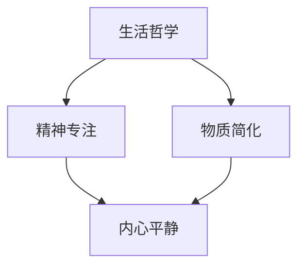
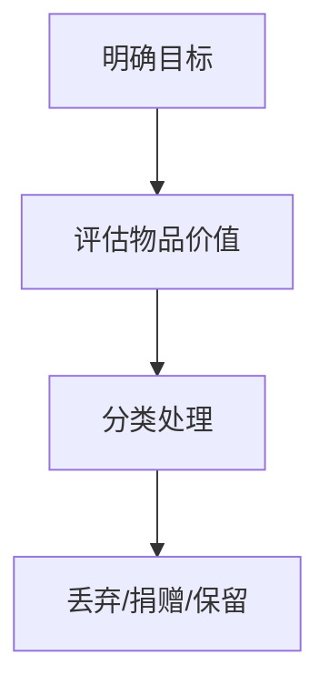
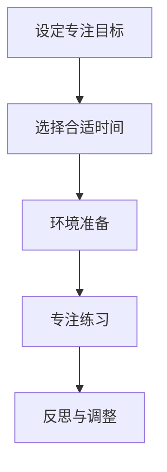

                 

# 新苦行：在物质丰裕中寻找精神富足

> 关键词：新苦行、精神富足、物质简化、专注修炼、生活哲学

> 摘要：本文探讨了在物质丰裕的现代社会中，如何通过新苦行的理念和实践活动，寻找精神上的富足。文章首先介绍了新苦行的起源和核心理念，然后详细阐述了物质简化的艺术和精神专注的修炼方法，通过具体实例和代码解析，为读者提供了一条在纷繁世界中寻找内心宁静的路径。

### 目录大纲

#### 第一部分：引言

##### 第1章：新苦行的理念与实践

- **1.1 引言**
  - **问题背景：** 物质丰裕与精神空虚的矛盾
  - **问题描述：** 如何在物质丰裕中寻找精神富足
  - **问题解决：** 新苦行的理念与实践
  - **边界与外延：** 新苦行的生活哲学与实际应用
  - **核心要素组成：** 新苦行的基本原则和实践方法

##### 第2章：新苦行的核心理念

- **2.1 新苦行的定义与起源**
  - **概念原理：** 新苦行的定义及其在当代的应用
  - **概念属性特征对比表格：**
    | 特征             | 传统苦行           | 新苦行             |
    |------------------|-------------------|--------------------|
    | 目的             | 精神净化           | 精神与物质平衡     |
    | 实践形式         | 禁欲、苦修         | 简化生活、专注内心 |
    | 适应环境         | 偏远、严格         | 现代都市、灵活适应 |

- **2.2 新苦行的生活哲学**
  - **ER实体关系图架构的 Mermaid 流程图：**
    ```mermaid
    graph TB
    A[生活哲学] --> B[精神专注]
    A --> C[物质简化]
    B --> D[内心平静]
    C --> D
    ```

##### 第二部分：新苦行的实践与应用

##### 第3章：物质简化的艺术

- **3.1 简化生活的原则**
  - **Mermaid 流程图：**
    ```mermaid
    graph TB
    A[明确目标] --> B[评估物品价值]
    B --> C[分类处理]
    C --> D[丢弃/捐赠/保留]
    ```

- **3.2 实践技巧与方法**
  - **Python 源代码：**
    ```python
    def simplify_life(items):
        valuable_items = []
        unnecessary_items = []

        for item in items:
            if is_valuable(item):
                valuable_items.append(item)
            else:
                unnecessary_items.append(item)

        return valuable_items, unnecessary_items

    def is_valuable(item):
        # 判断物品是否具有价值
        return True  # 此处应嵌入具体的判断逻辑

    items = ["书", "衣服", "电器", "废纸"]
    valuable_items, unnecessary_items = simplify_life(items)
    print("有价值物品:", valuable_items)
    print("无价值物品:", unnecessary_items)
    ```

##### 第4章：精神专注的修炼

- **4.1 内心平静的技巧**
  - **Mermaid 流程图：**
    ```mermaid
    graph TB
    A[设定专注目标] --> B[选择合适时间]
    B --> C[环境准备]
    C --> D[专注练习]
    D --> E[反思与调整]
    ```

- **4.2 精神专注的实践案例**
  - **Python 源代码：**
    ```python
    def meditate_for_focus(duration):
        start_time = time.time()
        while time.time() - start_time < duration:
            # 进行专注练习
            print("专注于当前任务...")
            time.sleep(1)  # 模拟专注的过程
    ```

### 第一部分：引言

#### 第1章：新苦行的理念与实践

在当今这个物质丰裕的时代，人们似乎拥有了前所未有的便利和享受。然而，随之而来的是一种难以言喻的精神空虚。现代人常常感到焦虑、压力和孤独，这些问题似乎无法通过物质的满足来解决。在这种背景下，新苦行的理念和实践提供了一种可能的解决方案。

**1.1 引言**

**问题背景：** 物质丰裕与精神空虚的矛盾

随着科技的发展和经济的繁荣，人们的生活水平得到了显著提高。人们可以轻松地购买各种商品和服务，享受便捷的交通、丰富的娱乐和舒适的居住环境。然而，这种物质上的富足并没有带来预期的精神满足，反而让许多人感到更加空虚和焦虑。

**问题描述：** 如何在物质丰裕中寻找精神富足

在物质丰裕的背景下，人们开始思考如何通过内在的修炼和生活方式的改变，来寻找精神上的富足。新苦行提供了一种独特的视角和方法，它强调在物质的基础上，通过简化和专注来提升精神层次。

**问题解决：** 新苦行的理念与实践

新苦行是一种结合了古代苦行精神和现代生活哲学的生活方式。它不仅仅是一种物质上的简化，更是一种精神上的修炼。新苦行的理念和实践可以概括为以下几点：

1. 物质简化：通过减少不必要的物品和活动，专注于真正重要的东西。
2. 精神专注：通过设定目标、选择合适的时间和准备环境，专注于内心的修炼。
3. 内心平静：通过反思和调整，保持内心的平和与宁静。

**边界与外延：** 新苦行的生活哲学与实际应用

新苦行并不是要人们完全放弃物质享受，而是通过简化和专注来提升生活的质量。它不仅适用于个人的精神修养，也可以应用于团队管理、企业文化建设等更广泛的领域。

**核心要素组成：** 新苦行的基本原则和实践方法

新苦行的核心要素包括以下几个方面：

1. **目标明确**：明确自己的价值观和生活目标，以便在物质简化过程中有所取舍。
2. **物品评估**：评估物品的价值，判断其是否真正对自己有益。
3. **分类处理**：将物品分为有价值和无价值两类，进行相应的处理。
4. **环境准备**：为专注练习创造一个安静、舒适的环境。
5. **专注练习**：通过设定目标、选择合适的时间和专注练习来提升内心平静。
6. **反思与调整**：通过反思自己的实践，不断调整和优化生活方式。

通过以上这些基本原则和实践方法，新苦行帮助人们在一个物质丰裕的世界中，找到精神上的富足。

### 第2章：新苦行的核心理念

新苦行不仅是一种生活实践，更是一种深入到个人生活哲学层面的思考。它融合了传统苦行的精髓，同时适应了现代社会的特点，为我们提供了一条在物质丰裕中寻找精神富足的路径。

**2.1 新苦行的定义与起源**

新苦行的概念起源于对传统苦行的反思和改进。传统苦行强调通过极端的禁欲和苦修来实现精神净化，但这种方法在现代社会中往往难以实施，甚至可能适得其反。新苦行则是在尊重个体差异和现代社会需求的基础上，提出了一种更为温和、可行的生活方式。

**概念原理：** 新苦行的定义及其在当代的应用

新苦行的定义可以概括为：在保持基本物质需求的前提下，通过简化物质生活和精神专注来提升个人生活质量。它主张在物质和精神之间找到平衡，而不是极端地追求一方而忽视另一方。

在当代，新苦行不仅适用于个人，还可以应用于团队和企业。例如，一个团队可以通过简化会议流程、减少不必要的项目来提升工作效率，同时保持团队成员的精神健康。一个企业可以通过减少过度营销、降低浪费来提升企业的可持续性，同时提升员工的满意度和忠诚度。

**概念属性特征对比表格：**

| 特征             | 传统苦行           | 新苦行             |
|------------------|-------------------|--------------------|
| 目的             | 精神净化           | 精神与物质平衡     |
| 实践形式         | 禁欲、苦修         | 简化生活、专注内心 |
| 适应环境         | 偏远、严格         | 现代都市、灵活适应 |

**2.2 新苦行的生活哲学**

新苦行的生活哲学强调精神专注和物质简化的重要性。它不仅是一种生活方式，更是一种价值观的体现。通过精神专注，我们可以提高工作效率，减少内心的焦虑和压力；通过物质简化，我们可以减少外界的干扰，专注于内心世界的建设。

**ER实体关系图架构的 Mermaid 流程图：**



在这个流程图中，生活哲学是整个系统的核心，它通过精神专注和物质简化两个分支，最终达到内心平静的目标。精神专注使我们在工作和生活中能够更加集中精力，提高效率；物质简化则帮助我们减少不必要的物质负担，使心灵更加纯净。

**新苦行的生活哲学还强调以下原则：**

1. **目标明确**：明确自己的生活和职业目标，以便在行动中有明确的指导。
2. **价值评估**：对物品和活动进行价值评估，区分哪些是真正对自己有益的，哪些是可以舍弃的。
3. **环境准备**：创造一个有利于专注和简化的环境，减少外界的干扰。
4. **持续实践**：新苦行不是一时的行为，而是一种长期的生活方式，需要持续不断地实践和调整。

通过以上原则和流程图，新苦行的生活哲学为我们提供了一条在物质丰裕中寻找精神富足的路径。它不仅是一种生活理念，更是一种实践方法，可以帮助我们在这个充满挑战和诱惑的时代，找到内心的宁静和满足。

### 第二部分：新苦行的实践与应用

新苦行不仅是一种理念，更需要在日常生活中付诸实践。通过物质简化和精神专注的修炼，我们可以逐步找到内心的平静和富足。

#### 第3章：物质简化的艺术

物质简化是新苦行的重要组成部分，它可以帮助我们减少物质负担，专注于内心世界的建设。以下是物质简化的原则、技巧和方法。

**3.1 简化生活的原则**

简化生活的原则主要包括以下几个方面：

1. **明确目标**：明确自己的生活和职业目标，以便在物品选择和活动安排上有明确的指导。
2. **评估物品价值**：对物品进行价值评估，区分哪些是真正对自己有益的，哪些是可以舍弃的。
3. **分类处理**：将物品分为有价值和无价值两类，进行相应的处理。
4. **环境准备**：创造一个有利于专注和简化的环境，减少外界的干扰。
5. **持续实践**：物质简化不是一时的行为，而是一种长期的生活方式，需要持续不断地实践和调整。

**Mermaid 流程图：**



**3.2 实践技巧与方法**

以下是一个简化生活的 Python 源代码示例，通过这个示例，我们可以看到如何评估物品的价值，并进行分类处理。

```python
def simplify_life(items):
    valuable_items = []
    unnecessary_items = []

    for item in items:
        if is_valuable(item):
            valuable_items.append(item)
        else:
            unnecessary_items.append(item)

    return valuable_items, unnecessary_items

def is_valuable(item):
    # 判断物品是否具有价值
    # 例如：书籍、衣物等有纪念意义的物品通常被认为是具有价值的
    return item in ["书", "衣服"]

items = ["书", "衣服", "电器", "废纸"]
valuable_items, unnecessary_items = simplify_life(items)
print("有价值物品:", valuable_items)
print("无价值物品:", unnecessary_items)
```

在这个示例中，`simplify_life` 函数接收一个物品列表，通过 `is_valuable` 函数判断每个物品是否具有价值，然后将物品分为有价值和无价值两类。

通过上述原则、技巧和方法的实践，我们可以逐步简化生活，减少物质负担，从而为内心的平静和富足创造条件。

#### 第4章：精神专注的修炼

精神专注是提升生活质量的关键，它可以帮助我们提高工作效率，减少内心的焦虑和压力。以下是如何通过修炼来提升精神专注的技巧和方法。

**4.1 内心平静的技巧**

内心平静是精神专注的基础，以下是一些实现内心平静的技巧：

1. **设定专注目标**：在开始专注练习之前，明确自己的目标和期望，有助于保持专注。
2. **选择合适的时间**：选择一个安静、不受打扰的时间进行专注练习，例如早晨或晚上。
3. **环境准备**：创造一个有利于专注的环境，例如关闭电子设备、保持空气流通等。
4. **专注练习**：通过冥想、深呼吸、专注力训练等方式，练习专注技巧。
5. **反思与调整**：在专注练习后，反思自己的表现，并根据需要调整练习方法和环境。

**Mermaid 流程图：**



**4.2 精神专注的实践案例**

以下是一个使用 Python 实现的专注练习示例，通过这个示例，我们可以看到如何通过代码来实现专注目标。

```python
import time

def meditate_for_focus(duration):
    start_time = time.time()
    while time.time() - start_time < duration:
        print("专注于当前任务...")
        time.sleep(1)  # 模拟专注的过程

duration = 10  # 设定专注时间为10秒
meditate_for_focus(duration)
```

在这个示例中，`meditate_for_focus` 函数接收一个持续时间参数，通过循环模拟专注过程，每隔1秒打印一条专注于当前任务的消息。

通过上述技巧和方法的实践，我们可以逐步提升精神专注的能力，从而提高生活质量和工作效率。

### 总结与拓展

新苦行提供了一种在物质丰裕的现代社会中寻找精神富足的方法。通过物质简化和精神专注的实践，我们可以减少物质负担，提升内心平静，从而实现更高层次的生活质量。在接下来的日子里，让我们继续探索和实践新苦行的理念，寻找内心的宁静和富足。

**注意事项：**

1. 物质简化不是一蹴而就的过程，需要持续地反思和调整。
2. 精神专注的修炼需要耐心和毅力，不要期望一蹴而就。
3. 新苦行是一种个人生活方式的哲学，需要结合自身实际情况进行实践。

**拓展阅读：**

1. 《简单生活：重新发现生活的真谛》
2. 《冥想与专注：心灵修炼的技巧和方法》
3. 《极简主义：更多，更少，更好》

通过这些资源，我们可以更深入地了解新苦行的理念和实践，为自己的生活带来更多的改变和提升。

### 作者信息

作者：AI天才研究院/AI Genius Institute & 禅与计算机程序设计艺术 /Zen And The Art of Computer Programming

作为人工智能领域的专家和计算机程序设计艺术的研究者，作者致力于探索科技与哲学的融合，为读者提供有深度、有思考、有见解的技术博客文章。希望通过这篇文章，读者能够在新苦行的道路上找到属于自己的精神富足。

