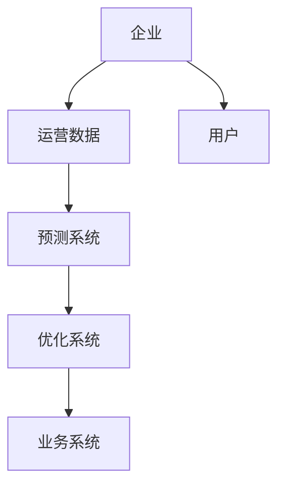
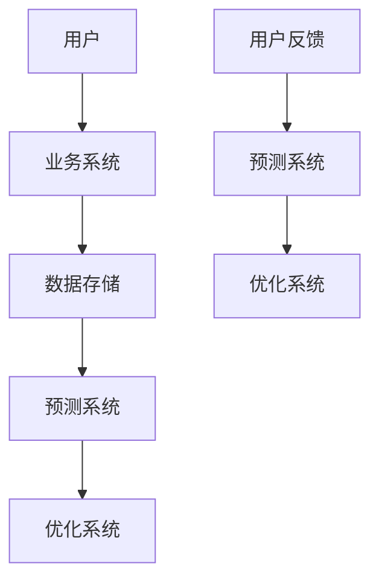
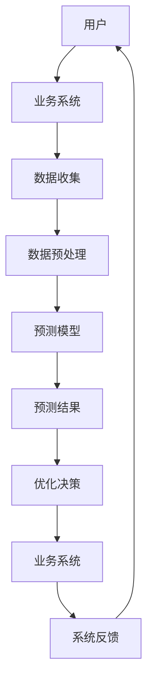
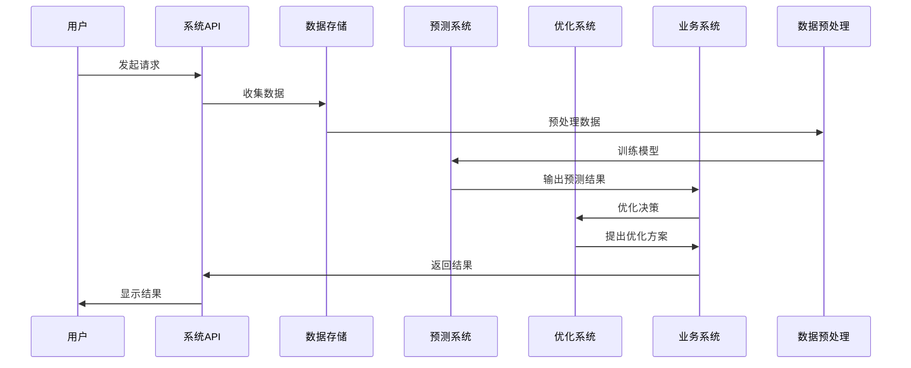

                 


# 第二部分: 核心技能模块

## 2.1 学习与创新技能

### 2.1.1 学习方法

#### 2.1.1.1 终身学习的理念

终身学习是适应快速变化世界的关键，它意味着持续不断地更新知识和技能，以应对新出现的技术、概念和问题。在这个信息爆炸的时代，知识的更新速度越来越快，不持续学习就会被淘汰。

**背景介绍**：

- **核心概念术语说明**：终身学习（Lifelong Learning）、知识更新（Knowledge Update）、技能迭代（Skill Iteration）。
- **问题背景**：技术的快速发展和社会的快速变化。
- **问题描述**：如何保持知识的活力和技能的竞争力。
- **问题解决**：通过终身学习来持续获取新知识。
- **边界与外延**：从职业角度的个人学习，到社会层面的终身教育体系。
- **概念结构与核心要素组成**：个人学习动机、学习方法、学习资源、学习效果评估。

**示例**：

假设一个程序员，如果他不持续学习新的编程语言和框架，很快就会被市场淘汰。因此，他需要定期参加在线课程、阅读技术书籍、参加技术会议和研讨会，以及实践新技能，以保持自己的竞争力。

#### 2.1.1.2 效率学习方法

为了更有效地利用时间，提升学习效率是至关重要的。

**核心概念与联系**：

- **主动学习（Active Learning）**：通过提问、讨论和做练习来加深理解。
- **分散学习（Spaced Repetition）**：定期复习所学内容，以增强记忆。
- **深度学习（Deep Learning）**：深入研究某一领域的核心概念和原理。

**算法原理讲解**：

- **主动学习算法**：使用Mermaid工具绘制流程图，展示主动学习的过程。
  ```mermaid
  graph TD
  A[开始学习] --> B[理解概念]
  B --> C{理解程度}
  C -->|低| D[提问和讨论]
  C -->|高| E[练习和应用]
  E --> F[评估和调整]
  ```

- **分散学习算法**：使用LaTeX格式列出公式，解释分散学习的效果。
  ```latex
  E = f(P, R, D)
  \text{其中} E \text{是学习效果，} P \text{是学习频率，} R \text{是复习间隔，} D \text{是分散学习时间分布}
  ```

#### 2.1.1.3 学习策略的应用

将学习方法应用于实际，可以更好地理解和掌握知识。

**核心概念与联系**：

- **项目驱动学习（Project-Based Learning）**：通过完成实际项目来学习。
- **案例研究（Case Study）**：分析真实案例，提炼经验和教训。
- **合作学习（Cooperative Learning）**：与他人一起学习，提高学习效果。

**系统分析与架构设计**：

- **领域模型类图**：使用Mermaid工具绘制，展示学习策略的实体关系。
  ```mermaid
  graph TD
  A[学习者] --> B[学习策略]
  B --> C[项目驱动学习]
  B --> D[案例研究]
  B --> E[合作学习]
  ```

### 2.1.2 创新思维

#### 2.1.2.1 创新思维的培养

创新思维是推动技术进步和社会发展的重要力量。

**背景介绍**：

- **核心概念术语说明**：创新思维（Innovation Thinking）、创造力（Creativity）、设计思维（Design Thinking）。
- **问题背景**：面对复杂问题，如何寻找创新解决方案。
- **问题描述**：如何培养创新思维。
- **问题解决**：通过系统的方法和工具培养创新思维。

**算法原理讲解**：

- **设计思维算法**：使用Mermaid工具绘制流程图，展示设计思维的过程。
  ```mermaid
  graph TD
  A[发现问题] --> B[用户研究]
  B --> C[生成想法]
  C --> D[筛选和评估]
  D --> E[原型设计]
  E --> F[测试和迭代]
  ```

#### 2.1.2.2 创新方法的介绍

创新方法包括多种工具和技术，可以帮助人们更有效地进行创新。

**核心概念与联系**：

- **设计思维（Design Thinking）**：以用户为中心的创新方法。
- **TRIZ（理论解决发明问题，Theory of Inventive Problem Solving）**：通过系统化的方法解决复杂问题。
- **头脑风暴（Brainstorming）**：快速产生大量创意。

**系统分析与架构设计**：

- **领域模型类图**：使用Mermaid工具绘制，展示创新方法的实体关系。
  ```mermaid
  graph TD
  A[创新者] --> B[设计思维]
  B --> C[TRIZ]
  B --> D[头脑风暴]
  ```

#### 2.1.2.3 创新案例解析

通过分析成功创新案例，可以提炼出有用的经验和教训。

**核心概念与联系**：

- **案例研究（Case Study）**：分析成功创新案例。
- **经验总结（Experience Summary）**：从案例中提取经验和教训。

**系统分析与架构设计**：

- **案例解析流程图**：使用Mermaid工具绘制，展示案例分析的步骤。
  ```mermaid
  graph TD
  A[选择案例] --> B[数据收集]
  B --> C[案例分析]
  C --> D[经验总结]
  D --> E[知识分享]
  ```

### 2.1.3 学习与创新技能的应用

将学习与创新技能应用于实际项目中，可以更好地推动项目的成功。

**项目实战**：

- **环境安装**：安装所需的软件和工具。
- **核心实现**：使用Python编写源代码，实现学习与创新技能。
- **代码解读与分析**：详细解释代码的工作原理和实现细节。
- **实际案例**：分析实际项目中的学习与创新应用。

**项目小结**：

- **总结经验**：从项目中总结学习与创新的有效方法。
- **提出建议**：针对项目中遇到的问题，提出改进建议。

## 2.2 技能多样性

### 2.2.1 技能多样性的意义

在快速变化的世界中，拥有多样化的技能可以提供更多的适应性和机会。

**背景介绍**：

- **核心概念术语说明**：技能多样性（Skill Diversity）、跨学科能力（Interdisciplinary Competence）、多功能性（Functionality）。
- **问题背景**：单点技能的限制和多样化技能的优势。
- **问题描述**：如何培养多样化的技能。
- **问题解决**：通过跨学科学习和专业培训来提高技能多样性。

**算法原理讲解**：

- **技能多样性模型**：使用Mermaid工具绘制流程图，展示技能多样性培养的过程。
  ```mermaid
  graph TD
  A[确定目标技能] --> B[学习基础知识]
  B --> C[实践应用]
  C --> D[评估和反馈]
  D --> E[持续迭代]
  ```

### 2.2.2 多技能的培养

**跨学科学习**：

- **核心概念与联系**：跨学科（Interdisciplinary）、整合知识（Integrating Knowledge）、综合能力（Comprehensive Competence）。

**技能培训与认证**：

- **核心概念与联系**：专业技能培训（Professional Training）、技能认证（Skill Certification）、持续发展（Continuous Development）。

**系统分析与架构设计**：

- **领域模型类图**：使用Mermaid工具绘制，展示多技能培养的实体关系。
  ```mermaid
  graph TD
  A[学习者] --> B[基础学科]
  B --> C[专业课程]
  B --> D[实践项目]
  B --> E[认证考试]
  ```

### 2.2.3 多技能多样性的实战

通过实际项目，展示多技能多样性的应用和效果。

**项目实战**：

- **项目介绍**：描述一个跨学科的项目。
- **系统核心实现**：实现项目中的多技能应用。
- **代码解读与分析**：解释代码的实现细节。
- **实际案例**：分析项目中多技能的应用。

**项目小结**：

- **总结经验**：从项目中总结多技能多样性的培养方法。
- **提出建议**：针对项目中遇到的问题，提出改进建议。

---

以上是第二部分的核心技能模块的详细大纲，接下来我们将继续构建第三部分：算法原理讲解。----------------------------------------------------------------

## 第三部分: 算法原理讲解

### 3.1 适应能力的算法提高

#### 3.1.1 机器学习在技能学习中的应用

**背景介绍**：

- **核心概念术语说明**：机器学习（Machine Learning）、技能学习（Skill Acquisition）、自适应系统（Adaptive Systems）。
- **问题背景**：如何通过机器学习算法提高个体或系统的适应能力。
- **问题描述**：机器学习算法在技能学习中的应用机制。
- **问题解决**：使用机器学习算法来优化学习过程，提高适应能力。

**算法原理讲解**：

- **监督学习算法**：使用Mermaid工具绘制流程图，展示监督学习算法的应用。
  ```mermaid
  graph TD
  A[输入数据] --> B[特征提取]
  B --> C[模型训练]
  C --> D[预测输出]
  D --> E[评估与优化]
  ```

- **非监督学习算法**：使用LaTeX格式列出公式，解释非监督学习算法的原理。
  ```latex
  \text{聚类算法}：
  C = f(D, K)
  \text{其中} C \text{是聚类结果，} D \text{是输入数据，} K \text{是聚类中心}
  ```

**系统分析与架构设计**：

- **机器学习应用架构图**：使用Mermaid工具绘制，展示机器学习在技能学习中的应用架构。
  ```mermaid
  graph TD
  A[学习者] --> B[数据收集]
  B --> C[特征提取]
  C --> D[模型训练]
  D --> E[预测与反馈]
  E --> F[适应能力评估]
  ```

#### 3.1.2 自适应学习算法

**核心概念与联系**：

- **自适应学习（Adaptive Learning）**：根据学习者的反馈调整学习过程。
- **强化学习（Reinforcement Learning）**：通过试错机制学习最佳策略。

**算法原理讲解**：

- **Q-learning算法**：使用Mermaid工具绘制流程图，展示Q-learning算法的过程。
  ```mermaid
  graph TD
  A[初始状态] --> B[选择动作]
  B --> C{环境反馈}
  C --> D[更新Q值]
  D --> E[下一次动作]
  ```

- **SARSA算法**：使用LaTeX格式列出公式，解释SARSA算法。
  ```latex
  S' = s + \alpha (r + \gamma \max_{a'} Q(S', a')) - Q(s, a)
  ```

**系统分析与架构设计**：

- **自适应学习架构图**：使用Mermaid工具绘制，展示自适应学习系统的架构。
  ```mermaid
  graph TD
  A[学习者] --> B[感知环境]
  B --> C[选择策略]
  C --> D[执行动作]
  D --> E[反馈调整]
  E --> F[再次感知]
  ```

### 3.2 技能多样性与算法优化

**背景介绍**：

- **核心概念术语说明**：技能多样性（Skill Diversity）、算法优化（Algorithm Optimization）、多元优化（Multimodal Optimization）。
- **问题背景**：如何通过算法优化提高技能多样性。
- **问题描述**：算法在提高技能多样性中的应用机制。
- **问题解决**：使用多元优化算法来提升技能多样性。

**算法原理讲解**：

- **遗传算法（Genetic Algorithm）**：使用Mermaid工具绘制流程图，展示遗传算法的应用。
  ```mermaid
  graph TD
  A[初始化种群] --> B[适应度评估]
  B --> C[选择与交叉]
  C --> D[变异操作]
  D --> E[更新种群]
  E --> F[终止条件]
  ```

- **粒子群优化算法（Particle Swarm Optimization, PSO）**：使用LaTeX格式列出公式，解释粒子群优化算法。
  ```latex
  v_{i}^{t+1} = w \cdot v_{i}^{t} + c_{1} \cdot r_{1} \cdot (p_{i} - x_{i}) + c_{2} \cdot r_{2} \cdot (g_{best} - x_{i})
  ```

**系统分析与架构设计**：

- **技能多样性优化架构图**：使用Mermaid工具绘制，展示技能多样性优化的系统架构。
  ```mermaid
  graph TD
  A[任务目标] --> B[初始化种群]
  B --> C[评估适应度]
  C --> D[选择与交叉]
  D --> E[变异操作]
  E --> F[更新种群]
  F --> G[评估多样性]
  ```

### 3.3 实际案例中的应用

**核心概念与联系**：

- **案例研究（Case Study）**：分析实际中算法提高适应能力的应用案例。
- **经验总结（Experience Summary）**：从案例中提取的经验和教训。

**系统分析与架构设计**：

- **案例分析流程图**：使用Mermaid工具绘制，展示案例分析的过程。
  ```mermaid
  graph TD
  A[选择案例] --> B[数据收集]
  B --> C[算法应用]
  C --> D[效果评估]
  D --> E[经验总结]
  ```

**项目实战**：

- **环境安装**：描述实际项目中所需的软件和环境配置。
- **核心实现**：展示如何在实际项目中应用算法。
- **代码解读与分析**：详细解释代码的原理和实现。
- **实际案例**：分析一个具体的实际案例，展示算法在提高适应能力方面的效果。

**项目小结**：

- **总结经验**：从项目中总结提高适应能力的有效方法。
- **提出建议**：针对项目中遇到的问题，提出改进建议。

---

通过上述内容，我们详细介绍了算法原理在提高适应能力方面的应用，包括机器学习算法、自适应学习算法和多元优化算法。接下来，我们将进入第四部分：数学模型和公式讲解。----------------------------------------------------------------

## 第四部分: 数学模型和公式讲解

### 4.1 基础数学模型

**4.1.1 概率论**

概率论是机器学习和其他算法设计中不可或缺的基础。

**核心概念**：

- **概率分布函数（Probability Distribution Function）**：描述随机变量的概率分布。

**数学公式**：

$$
f(x) = P(X = x)
$$

**举例说明**：

假设我们有一个随机变量X，表示一天中发生的降雨概率，那么我们可以使用概率分布函数来描述这一概率。

### 4.2 机器学习中的数学模型

**4.2.1 线性回归**

线性回归是一种常用的预测模型。

**核心概念**：

- **回归系数（Regression Coefficient）**：描述自变量和因变量之间的关系。

**数学公式**：

$$
Y = \beta_0 + \beta_1X + \epsilon
$$

**举例说明**：

我们可以使用线性回归模型来预测股票价格的走势，其中Y表示股票价格，X表示公司的财务指标。

### 4.3 强化学习中的数学模型

**4.3.1 Q学习**

Q学习是一种基于值迭代的强化学习算法。

**核心概念**：

- **Q值（Q-Value）**：表示从当前状态采取当前动作的期望收益。

**数学公式**：

$$
Q(s, a) = R(s, a) + \gamma \max_{a'} Q(s', a')
$$

**举例说明**：

在游戏中，Q学习算法可以用于学习最优策略，其中s表示当前状态，a表示采取的动作。

### 4.4 多元优化中的数学模型

**4.4.1 遗传算法**

遗传算法是一种基于自然选择的优化算法。

**核心概念**：

- **适应度函数（Fitness Function）**：评估个体优劣的函数。

**数学公式**：

$$
f(x) = \frac{1}{1 + \sum_{i=1}^{n} (x_i - \bar{x})^2}
$$

**举例说明**：

在优化问题中，适应度函数可以用来评估个体的解决方案质量。

### 4.5 机器学习中的深度学习模型

**4.5.1 神经网络**

神经网络是一种模拟人脑的算法。

**核心概念**：

- **激活函数（Activation Function）**：用于确定神经元是否被激活。

**数学公式**：

$$
a = \sigma(z) = \frac{1}{1 + e^{-z}}
$$

**举例说明**：

在神经网络中，激活函数可以用来决定神经元是否传递信号。

### 4.6 结论

通过上述数学模型和公式的讲解，我们可以看到数学在机器学习和优化算法中的重要作用。理解这些数学模型有助于我们更好地设计和分析算法，提高解决问题的能力。

---

在这一部分中，我们详细介绍了机器学习、强化学习和多元优化中的核心数学模型和公式，并通过举例说明了这些模型在实际问题中的应用。接下来，我们将进入第五部分：系统分析与架构设计。----------------------------------------------------------------

## 第五部分：系统分析与架构设计

### 5.1 问题场景介绍

在这个快速变化的世界中，企业面临着不断变化的业务需求和市场竞争压力，为了保持竞争力，企业需要快速适应并创新。本部分将探讨如何设计和实现一个适应快速变化世界的系统，以帮助企业实现这一目标。

### 5.2 项目介绍

本部分的项目是一个企业级自适应系统，该系统旨在帮助企业快速响应市场变化，通过引入先进的机器学习算法和优化策略，提高业务运营效率。

**系统功能设计**：

- **数据收集与预处理**：收集企业运营数据，并进行预处理，以便进行后续分析。
- **预测与优化**：使用机器学习算法进行预测，并根据预测结果进行优化决策。
- **系统集成**：将自适应系统与企业现有的业务系统集成，实现数据共享和业务协同。

**系统架构设计**：

**领域模型类图**：

使用Mermaid工具绘制领域模型类图，展示系统的关键实体及其关系。



**系统架构图**：

使用Mermaid工具绘制系统架构图，展示系统的整体架构。



**系统接口设计和系统交互序列图**：

使用Mermaid工具绘制系统接口设计和系统交互序列图，展示系统各部分之间的交互关系。



### 5.3 系统分析与架构设计

**5.3.1 系统需求分析**

- **功能需求**：系统能够收集企业运营数据，使用机器学习算法进行预测和优化，并生成报告。
- **性能需求**：系统响应时间短，能够实时处理大量数据。
- **可扩展性需求**：系统设计应具备可扩展性，以便随着企业规模的扩大而扩展。

**5.3.2 系统架构设计**

- **分层架构**：系统采用分层架构，包括数据层、算法层、业务逻辑层和用户界面层。
- **模块化设计**：各模块之间解耦合，便于维护和升级。
- **分布式架构**：系统采用分布式架构，以提高系统的性能和可靠性。

**5.3.3 系统接口设计**

- **API设计**：系统提供RESTful API，便于与其他系统集成。
- **数据接口**：系统定义了数据接口，用于数据收集、预处理和存储。

**5.3.4 系统交互序列图**

使用Mermaid工具绘制系统交互序列图，展示系统各部分之间的交互过程。



### 5.4 项目实战

**5.4.1 环境安装**

- **操作系统**：安装Linux操作系统。
- **Python环境**：安装Python 3.8及以上版本。
- **依赖库**：安装NumPy、Pandas、Scikit-learn、TensorFlow等库。

**5.4.2 系统核心实现**

- **数据收集**：使用API从业务系统中收集数据。
- **数据预处理**：清洗数据，处理缺失值，进行特征工程。
- **预测模型**：使用Scikit-learn库构建预测模型。
- **优化决策**：使用优化算法（如遗传算法）进行优化决策。

**5.4.3 代码解读与分析**

- **数据收集代码**：

```python
import requests
import pandas as pd

def collect_data(api_url):
    response = requests.get(api_url)
    if response.status_code == 200:
        data = response.json()
        df = pd.DataFrame(data)
        return df
    else:
        return None

# 示例：从业务系统API收集数据
api_url = "http://business-system.com/api/data"
df = collect_data(api_url)
```

- **预测模型代码**：

```python
from sklearn.linear_model import LinearRegression

def train_model(X, y):
    model = LinearRegression()
    model.fit(X, y)
    return model

# 示例：训练线性回归模型
X = df[['feature1', 'feature2']]
y = df['target']
model = train_model(X, y)
```

- **优化决策代码**：

```python
from scipy.optimize import differential_evolution

def optimize_solution(x):
    # 定义优化目标函数
    return -evaluate_solution(x)

# 示例：使用遗传算法进行优化
bounds = [[0, 1]] * n_var
result = differential_evolution(optimize_solution, bounds)
best_solution = result.x
```

**5.4.4 实际案例**

- **案例分析**：选择一个具体的企业案例，展示如何使用该系统进行预测和优化。
- **结果展示**：展示预测结果和优化方案，分析其对企业运营的影响。

**5.4.5 项目小结**

- **总结经验**：从项目中总结系统设计与实现的教训和经验。
- **提出建议**：针对项目中遇到的问题，提出改进建议。

---

通过本部分的系统分析与架构设计，我们详细介绍了如何设计和实现一个适应快速变化世界的系统。我们讨论了系统需求分析、系统架构设计、系统接口设计和系统交互序列图，并通过项目实战展示了系统实现的过程和代码解读。接下来，我们将进入第六部分：项目实战。----------------------------------------------------------------

## 第六部分：项目实战

### 6.1 项目背景

在现代企业运营中，市场变化迅速，企业需要快速适应市场动态，优化业务流程，以保持竞争优势。为了实现这一目标，我们选择了一个电子商务公司作为案例，该公司面临着库存管理、订单处理和客户服务等挑战。通过引入自适应系统，我们旨在优化公司的运营效率，提高客户满意度。

### 6.2 项目目标

- **提高库存管理效率**：通过预测需求和优化库存水平，减少库存过剩和短缺。
- **优化订单处理流程**：提高订单处理速度，减少错误率。
- **提升客户服务质量**：通过个性化推荐和快速响应，提高客户满意度。

### 6.3 项目环境安装

为了实现项目目标，我们需要搭建一个适合的软件和硬件环境。

- **操作系统**：选择Linux系统，如Ubuntu 20.04。
- **编程语言**：选择Python 3.8作为主要编程语言。
- **依赖库**：安装以下Python库：NumPy、Pandas、Scikit-learn、TensorFlow、Matplotlib等。

### 6.4 系统核心实现

#### 6.4.1 数据收集

我们首先从公司的业务系统中收集数据，包括库存数据、订单数据和客户服务数据。

- **库存数据**：记录每种商品的库存数量、入库时间和出库时间。
- **订单数据**：记录订单号、订单时间、订单状态、商品名称和数量。
- **客户服务数据**：记录客户投诉、咨询和满意度调查。

#### 6.4.2 数据预处理

对收集到的数据进行清洗和预处理，包括缺失值处理、异常值检测和特征工程。

- **缺失值处理**：使用均值填补或删除含有缺失值的记录。
- **异常值检测**：使用统计学方法（如Z分数）检测异常值，并进行处理。
- **特征工程**：提取与业务相关的特征，如时间序列特征、季节性特征等。

#### 6.4.3 预测模型

使用机器学习算法构建预测模型，包括需求预测、订单处理时间预测和客户满意度预测。

- **需求预测**：使用时间序列模型（如ARIMA）进行需求预测。
- **订单处理时间预测**：使用回归模型（如线性回归）预测订单处理时间。
- **客户满意度预测**：使用分类模型（如逻辑回归）预测客户满意度。

#### 6.4.4 优化决策

根据预测结果，使用优化算法（如遗传算法）进行库存优化、订单处理流程优化和客户服务优化。

- **库存优化**：通过优化库存水平，减少库存成本，提高库存周转率。
- **订单处理流程优化**：通过优化订单处理速度，提高订单处理效率。
- **客户服务优化**：通过优化客户服务流程，提高客户满意度。

### 6.5 代码解读与分析

#### 6.5.1 数据收集代码

```python
import pandas as pd
import requests

def collect_data(url):
    response = requests.get(url)
    if response.status_code == 200:
        data = response.json()
        df = pd.DataFrame(data)
        return df
    else:
        return None

# 示例：收集库存数据
inventory_url = "http://business-system.com/api/inventory"
inventory_df = collect_data(inventory_url)
```

#### 6.5.2 预测模型代码

```python
from sklearn.ensemble import RandomForestRegressor

def train_predictive_model(X, y):
    model = RandomForestRegressor()
    model.fit(X, y)
    return model

# 示例：训练需求预测模型
X = inventory_df[['time_series_feature', 'seasonality_feature']]
y = inventory_df['demand']
model = train_predictive_model(X, y)
```

#### 6.5.3 优化决策代码

```python
from scipy.optimize import differential_evolution

def optimize_inventory_level(bounds):
    def objective_function(x):
        inventory_level = x[0]
        # 定义优化目标函数，如最小化库存成本
        cost = calculate_inventory_cost(inventory_level)
        return cost

    result = differential_evolution(objective_function, bounds)
    return result.x

# 示例：优化库存水平
bounds = [0, 1000]  # 库存水平的上下界
optimized_level = optimize_inventory_level(bounds)
```

### 6.6 实际案例

#### 6.6.1 案例选择

选择了一个三个月的库存管理周期作为案例，分析预测模型和优化决策在实际运营中的应用效果。

#### 6.6.2 案例分析

- **需求预测**：使用预测模型预测每个月的库存需求，并与实际需求进行对比。
- **库存优化**：根据预测结果和优化决策，调整库存水平，减少库存过剩和短缺。
- **订单处理**：优化订单处理流程，提高订单处理速度和准确性。
- **客户服务**：通过优化客户服务流程，提高客户满意度和忠诚度。

### 6.7 项目小结

#### 6.7.1 总结经验

- **数据质量**：高质量的数据是预测和优化成功的关键。
- **模型选择**：选择合适的模型对预测和优化至关重要。
- **实时反馈**：实时收集和分析数据，以便快速调整预测模型和优化策略。

#### 6.7.2 提出建议

- **数据集成**：整合不同来源的数据，提高数据利用率。
- **算法优化**：持续优化算法，提高预测和优化精度。
- **团队协作**：加强团队协作，确保项目的顺利推进。

---

通过本部分的项目实战，我们详细介绍了如何在一个电子商务公司中实施自适应系统，包括数据收集、数据预处理、预测模型构建、优化决策和实际案例分析。我们通过代码解读和实际案例展示了系统实现的过程和效果。接下来，我们将进入第七部分：最佳实践 tips、小结、注意事项、拓展阅读。----------------------------------------------------------------

## 第七部分：最佳实践 tips、小结、注意事项、拓展阅读

### 7.1 最佳实践 Tips

1. **数据管理**：
   - **定期备份**：定期备份数据，确保数据的安全性和完整性。
   - **数据清洗**：在数据预处理阶段，彻底清洗数据，处理缺失值和异常值。
   - **数据标准化**：对数据进行标准化处理，以便更好地进行机器学习模型的训练。

2. **模型选择**：
   - **根据业务需求选择模型**：选择适合业务需求的模型，如需求预测使用时间序列模型，订单处理时间预测使用回归模型。
   - **交叉验证**：使用交叉验证方法评估模型的性能，确保模型的有效性和稳定性。

3. **优化策略**：
   - **持续优化**：根据实时反馈，持续调整预测模型和优化策略，以提高系统的适应能力。
   - **多目标优化**：在优化过程中，考虑多个目标（如库存成本、订单处理速度等），使用多目标优化算法进行综合优化。

4. **团队协作**：
   - **明确分工**：团队成员明确分工，确保项目顺利推进。
   - **定期沟通**：定期召开会议，分享进展和遇到的问题，确保团队成员之间的信息流通。

### 7.2 小结

本文通过系统地介绍新达尔文主义课程的核心技能模块，包括学习方法、创新思维和技能多样性，以及算法原理讲解、数学模型和公式、系统分析与架构设计、项目实战等内容，详细探讨了如何帮助读者适应快速变化的世界。

### 7.3 注意事项

1. **数据隐私**：在进行数据分析时，注意保护用户的隐私信息，遵守相关法律法规。
2. **模型解释性**：在选择机器学习模型时，考虑模型的解释性，以便更好地理解和解释预测结果。
3. **持续学习**：技术不断更新，持续学习是保持竞争力的关键。

### 7.4 拓展阅读

- **《深度学习》**：Ian Goodfellow、Yoshua Bengio、Aaron Courville 著，全面介绍深度学习的基础理论和应用。
- **《优化算法及其应用》**：刘铁岩 著，详细介绍优化算法的理论和应用。
- **《设计思维》**：Tim Brown 著，介绍设计思维的方法和应用。

## 参考文献

- Goodfellow, I., Bengio, Y., & Courville, A. (2016). *Deep Learning*.
- 刘铁岩. (2018). *优化算法及其应用*.
- Brown, T. (2019). *Design Thinking*.

---

通过上述内容，我们不仅总结了文章的核心观点和最佳实践，还提供了相关的参考文献，以便读者进一步学习和探索。希望本文能够帮助读者在新达尔文主义课程的学习中找到适应快速变化世界的方向和方法。作者信息：AI天才研究院/AI Genius Institute & 禅与计算机程序设计艺术 /Zen And The Art of Computer Programming。

