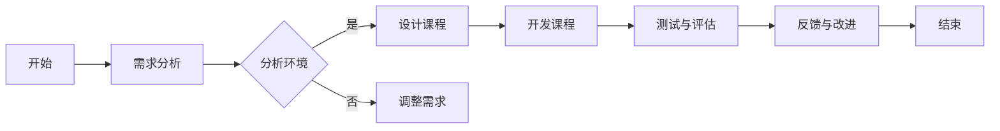
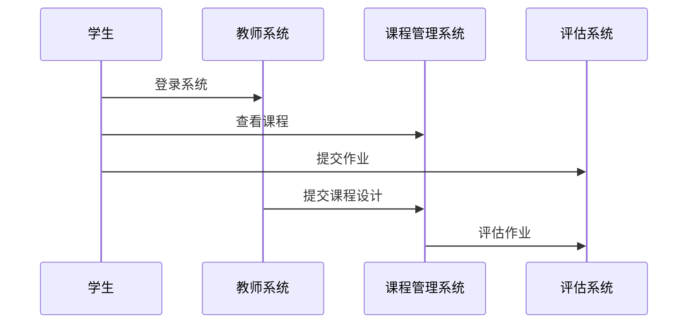
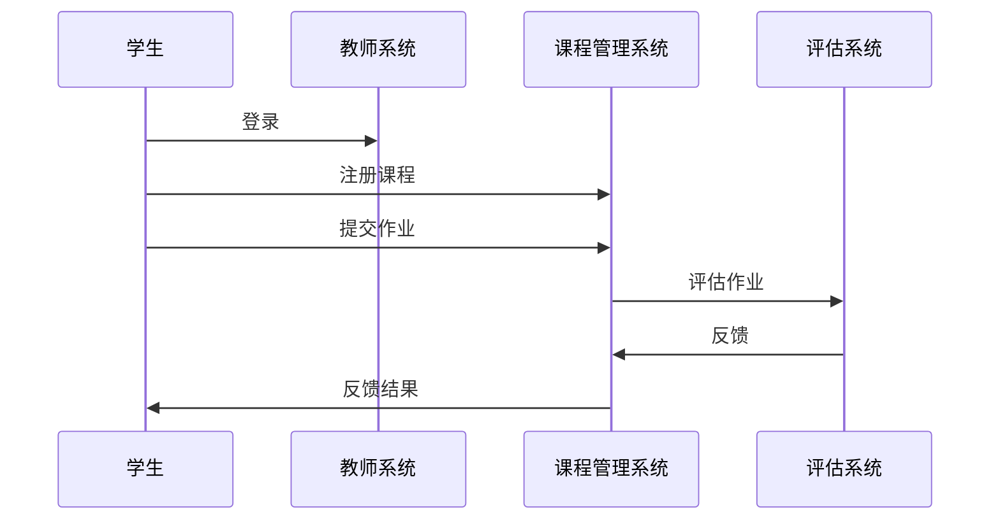

                 

### 第一部分：引言

#### 引言

在当今这个瞬息万变的世界，新技术、新概念、新趋势层出不穷，社会和经济环境也在不断地演变。为了适应这种快速变化，我们需要具备全新的思维方式和技能。新达尔文主义课程正是为应对这一挑战而设计的，旨在培养人们在快速变化世界中生存和发展的能力。

新达尔文主义，作为一种新兴的教育理念，起源于对达尔文进化论的重新解读。它强调适应性和持续进化，鼓励人们在学习、工作和生活中不断探索和适应。本文将围绕新达尔文主义课程，深入探讨其核心思想、构建策略以及关键技能培养，帮助读者更好地理解和应用这一理念。

#### 核心关键词

- 新达尔文主义
- 快速变化世界
- 教育理念
- 适应性技能
- 持续学习

#### 摘要

本文首先介绍了新达尔文主义的起源与发展，探讨了其在现代社会中的重要性。接着，分析了快速变化世界中的挑战，包括技能更新、技术进步、教育变革等。随后，详细阐述了新达尔文主义课程的构建原则、关键技能培养以及适应快速变化的策略。最后，通过案例研究展示了新达尔文主义课程在教育和企业界的实践应用，并展望了其未来发展趋势。本文旨在为读者提供一套系统、实用的新达尔文主义课程指南，帮助他们更好地适应快速变化的世界。

### 第一部分：引言

#### 引言

在当今这个瞬息万变的世界，新技术、新概念、新趋势层出不穷，社会和经济环境也在不断地演变。为了适应这种快速变化，我们需要具备全新的思维方式和技能。新达尔文主义课程正是为应对这一挑战而设计的，旨在培养人们在快速变化世界中生存和发展的能力。

新达尔文主义，作为一种新兴的教育理念，起源于对达尔文进化论的重新解读。它强调适应性和持续进化，鼓励人们在学习、工作和生活中不断探索和适应。本文将围绕新达尔文主义课程，深入探讨其核心思想、构建策略以及关键技能培养，帮助读者更好地理解和应用这一理念。

新达尔文主义的核心思想可以归纳为以下几点：

1. **适应性**：在快速变化的环境中，能够快速适应新情况、新环境是至关重要的。这要求人们具备灵活的思维方式，能够根据不同情境调整自己的行为和策略。

2. **持续进化**：新达尔文主义认为，个体和群体都应该不断地学习和进步，以适应不断变化的环境。这需要持续的学习和实践，以及对自己行为的不断反思和调整。

3. **多样性**：在快速变化的世界中，多样性不仅是一种生存策略，也是一种优势。新达尔文主义鼓励人们尊重并利用多样性，以拓宽视野、提高创新能力。

4. **合作与竞争**：在快速变化的环境中，合作和竞争并存。新达尔文主义课程强调，通过有效的合作可以共同克服挑战，而通过竞争可以激发个人和团队的潜力。

#### 核心关键词

- 新达尔文主义
- 快速变化世界
- 教育理念
- 适应性技能
- 持续学习

#### 摘要

本文首先介绍了新达尔文主义的起源与发展，探讨了其在现代社会中的重要性。接着，分析了快速变化世界中的挑战，包括技能更新、技术进步、教育变革等。随后，详细阐述了新达尔文主义课程的构建原则、关键技能培养以及适应快速变化的策略。最后，通过案例研究展示了新达尔文主义课程在教育和企业界的实践应用，并展望了其未来发展趋势。本文旨在为读者提供一套系统、实用的新达尔文主义课程指南，帮助他们更好地适应快速变化的世界。

### 第1章：新达尔文主义概览

#### 1.1 新达尔文主义的起源与发展

新达尔文主义（Neo-Darwinism）作为一种现代生物学的理论，起源于20世纪初，由达尔文进化论的追随者和研究者所提出。该理论强调自然选择和遗传变异作为生物进化的主要驱动力。随着时间的推移，新达尔文主义不断发展和完善，逐渐形成了现代进化生物学的基础。

新达尔文主义的核心思想主要包括以下几点：

1. **自然选择**：个体之间存在遗传变异，这些变异会导致它们在生存和繁殖上的差异。适应环境的个体将更有可能生存下来并传递其基因，而不适应环境的个体则可能被淘汰。

2. **遗传变异**：生物体内的遗传信息会发生变异，这些变异是生物进化的重要来源。遗传变异可以通过基因突变、基因重组等方式产生。

3. **共同祖先**：所有生物都有共同的祖先，通过长时间的进化过程，形成了多样性的生物物种。

4. **适应环境**：生物的生存和繁殖取决于它们对环境的适应能力。适应环境的生物能够更好地生存和繁衍，从而在种群中占据优势。

新达尔文主义的发展历程可以追溯到以下几个重要阶段：

- **早期阶段**（20世纪初）：这一阶段主要是对达尔文进化论的理论进行进一步阐述和补充。例如，遗传学的发展使得生物进化过程中的遗传变异有了更明确的解释。

- **中期阶段**（20世纪中叶）：这一阶段，分子生物学和遗传学的进展为进化论提供了更多的实验证据，进一步证实了自然选择和遗传变异在进化过程中的作用。

- **现代阶段**（20世纪末至今）：随着基因组学和生物信息学的发展，新达尔文主义的理论框架得到了进一步扩展和深化。现代进化生物学不仅关注物种的宏观进化，还深入研究了基因、分子和细胞层面的进化机制。

#### 1.2 新达尔文主义的核心思想

新达尔文主义的核心思想主要包括以下几个方面：

1. **适应性**：在快速变化的环境中，能够快速适应新情况、新环境是至关重要的。这要求人们具备灵活的思维方式，能够根据不同情境调整自己的行为和策略。

2. **持续进化**：新达尔文主义认为，个体和群体都应该不断地学习和进步，以适应不断变化的环境。这需要持续的学习和实践，以及对自己行为的不断反思和调整。

3. **多样性**：在快速变化的世界中，多样性不仅是一种生存策略，也是一种优势。新达尔文主义鼓励人们尊重并利用多样性，以拓宽视野、提高创新能力。

4. **合作与竞争**：在快速变化的环境中，合作和竞争并存。新达尔文主义课程强调，通过有效的合作可以共同克服挑战，而通过竞争可以激发个人和团队的潜力。

#### 1.3 新达尔文主义对教育的影响

新达尔文主义的教育理念强调适应性和持续进化，这对传统教育体系带来了深远的影响。以下是新达尔文主义对教育的主要影响：

1. **教学方式的变革**：新达尔文主义课程倡导以学生为中心的教学方式，强调学生的主动性和参与度。教师不再是知识的传递者，而是学习过程的引导者和支持者。

2. **课程设计的变革**：新达尔文主义课程设计注重跨学科和综合能力的培养，鼓励学生从多个角度思考和解决问题。这有助于提高学生的创新能力和批判性思维。

3. **评价体系的变革**：新达尔文主义课程强调过程性评价，不仅关注学生的最终成绩，还关注学习过程中的表现和进步。这种评价体系更能反映学生的真实能力和潜力。

4. **教育目标的变革**：新达尔文主义课程将培养适应性和持续进化能力作为教育的重要目标，旨在帮助学生成为能够在快速变化世界中生存和发展的个体。

#### 1.4 新达尔文主义与现代社会

新达尔文主义在现代社会中具有重要的现实意义。随着科技的发展和全球化进程的加快，社会环境变得更加复杂和多变。以下是新达尔文主义在现代社会中的应用：

1. **职业发展**：新达尔文主义强调持续学习和适应能力，对于职业发展具有重要意义。在快速变化的工作环境中，具备适应能力和持续学习能力的人更容易适应新的岗位和挑战。

2. **技术创新**：新达尔文主义鼓励创新思维和多样性，这对于推动技术创新具有重要意义。在技术创新过程中，多种不同视角和思维的碰撞可以激发新的创意和解决方案。

3. **社会变革**：新达尔文主义强调个体和群体的适应性和进化，这对于推动社会变革具有重要意义。通过培养适应性和创新能力的个体和群体，可以更好地应对社会挑战和问题。

总之，新达尔文主义作为一种适应快速变化世界的重要教育理念，对于个体和群体的发展具有重要意义。通过深入理解和应用新达尔文主义，我们可以更好地应对现代社会的各种挑战，实现个人的成长和社会的进步。

### 第2章：快速变化世界中的挑战

#### 2.1 技能更新与职业转型

在快速变化的世界中，技能更新和职业转型成为人们面临的重要挑战。随着技术的飞速发展和产业结构的不断调整，许多传统职业正在逐渐消失，而新的职业机会不断涌现。以下是对这一挑战的分析：

1. **技术变革的影响**：随着人工智能、大数据、云计算等新技术的广泛应用，许多传统职业正面临着被替代的风险。例如，一些低技能、重复性的工作，如制造业和客服，已经开始被自动化系统所取代。

2. **职业转型的需求**：为了适应这种变化，人们需要不断更新自己的技能，以应对新兴职业的需求。这要求个人具备快速学习的能力，以及对新技术的敏感度。

3. **职业转型的策略**：为了实现职业转型，个人可以采取以下策略：
   - **终身学习**：持续学习是职业转型的关键。通过参加在线课程、职业培训等方式，不断提升自己的技能和知识。
   - **跨学科学习**：跨学科学习可以帮助个人更好地适应新兴职业的需求。例如，对于从事数据分析工作的人来说，了解一些编程和统计学的知识将非常有用。
   - **网络拓展**：通过参加行业会议、加入专业组织等方式，拓展自己的社交网络，获取更多的职业信息和机会。

#### 2.2 技术进步与社会变革

技术进步不仅改变了人们的职业形态，也对社会结构产生了深远的影响。以下是对这一挑战的分析：

1. **社会结构的变革**：随着技术的进步，社会结构正在发生深刻的变化。例如，远程工作和远程教育的普及，使得人们可以更灵活地选择工作和学习地点。这种变化对传统的家庭和工作模式提出了新的挑战。

2. **新职业机会的出现**：技术进步带来了许多新的职业机会，如数据科学家、人工智能工程师、虚拟现实设计师等。这些新兴职业要求人们具备新的技能和知识，同时也为个人提供了更多的职业发展机会。

3. **社会问题的出现**：技术进步也引发了一系列社会问题，如数字鸿沟、隐私保护、劳动保护等。这些问题需要政府、企业和个人共同努力来解决。

#### 2.3 教育体系的适应与变革

教育体系在快速变化的世界中也面临着巨大的挑战。以下是对这一挑战的分析：

1. **教育理念的变革**：传统的教育理念强调知识的传授和考试成绩，而新达尔文主义教育理念则更注重培养学生的适应能力和创新能力。这种变革要求教育者重新审视教育目标和教学方式。

2. **课程设计的变革**：为了适应快速变化的世界，教育体系需要设计更加灵活和实用的课程。例如，增加跨学科的课程、实践性的课程和项目式的学习，以培养学生的综合能力和创新思维。

3. **教育资源的分配**：随着技术的发展，教育资源的分配也变得更加重要。政府、学校和企业需要共同努力，确保每个学生都能获得优质的教育资源，特别是那些生活在贫困和偏远地区的学生。

#### 2.4 个人成长与自我管理

在快速变化的世界中，个人成长和自我管理成为每个人都需要面对的挑战。以下是对这一挑战的分析：

1. **终身学习的能力**：在快速变化的环境中，终身学习不仅是职业发展的需要，也是个人成长的必要条件。个人需要具备主动学习的意识和能力，以适应不断变化的世界。

2. **自我反思的能力**：自我反思是个人成长的重要步骤。通过反思自己的行为、思维和决策，个人可以更好地了解自己，找到改进的方向。

3. **情绪管理的能力**：在快速变化的环境中，情绪管理变得尤为重要。个人需要学会如何应对压力、挫折和不确定性，保持积极的心态和情绪。

4. **自我规划的能力**：个人需要具备自我规划的能力，明确自己的目标和发展方向。通过设定短期和长期目标，并制定相应的行动计划，个人可以更好地实现自己的成长和发展。

总之，快速变化的世界带来了许多挑战，但也为个人和集体提供了新的机遇。通过适应和创新，我们可以更好地应对这些挑战，实现个人和集体的成长和进步。

### 第3章：新达尔文主义课程构建

#### 3.1 课程设计原则

新达尔文主义课程的设计原则是基于适应性和持续进化的理念，旨在培养学生的创新能力、适应能力和终身学习习惯。以下是新达尔文主义课程设计的主要原则：

1. **以学生为中心**：课程设计应充分考虑学生的兴趣、需求和背景，鼓励学生主动参与和探索。教师应扮演引导者和支持者的角色，提供必要的资源和指导。

2. **跨学科融合**：新达尔文主义课程强调跨学科知识的整合，通过跨学科项目和实践，培养学生的综合能力和创新思维。课程内容应涵盖多个领域，如自然科学、社会科学、艺术和人文等。

3. **项目式学习**：项目式学习是一种以项目为导向的学习方式，通过实际项目的完成，培养学生的实践能力和解决问题的能力。新达尔文主义课程应包含丰富的项目式学习内容，让学生在实践中学习。

4. **实践导向**：课程设计应注重实践，通过实验、实习、工作坊等方式，让学生将理论知识应用到实际情境中。实践不仅能加深对知识的理解，还能培养学生的动手能力和实际操作技能。

5. **个性化学习**：新达尔文主义课程应允许学生根据自己的兴趣和特长选择学习内容和进度，实现个性化学习。教师应提供多样化的学习资源和教学方式，以满足不同学生的学习需求。

6. **持续反馈与评估**：课程设计应包含持续的反馈和评估机制，帮助学生了解自己的学习进展和不足，及时调整学习策略。教师应通过定期的反馈和评估，给予学生个性化的指导和支持。

#### 3.2 课程内容选择

新达尔文主义课程内容的选择应遵循以下原则：

1. **核心知识与技能**：课程内容应涵盖基础知识与核心技能，如数学、科学、信息技术、语言等。这些内容是学生在未来发展中不可或缺的。

2. **新兴领域与前沿技术**：课程内容应包括新兴领域和前沿技术，如人工智能、大数据、区块链等。这些内容能够帮助学生适应未来发展的需求。

3. **跨学科内容**：课程内容应注重跨学科知识的整合，通过跨学科项目和实践，培养学生的综合能力和创新思维。

4. **文化素养与人文精神**：课程内容应包含文化素养和人文精神，如文学、艺术、历史等。这些内容能够帮助学生形成全面的人文素养和价值观。

5. **实践与案例研究**：课程内容应包含丰富的实践和案例研究，通过实际案例的分析和解决，培养学生的实践能力和问题解决能力。

#### 3.3 教学方法与策略

新达尔文主义课程的教学方法与策略应灵活多样，以适应不同学生的学习需求。以下是几种常用的教学方法与策略：

1. **互动式教学**：互动式教学是一种以学生为中心的教学方法，通过小组讨论、案例分析、角色扮演等方式，激发学生的思考和学习兴趣。

2. **项目式教学**：项目式教学是一种以项目为导向的教学方法，通过实际项目的完成，培养学生的实践能力和解决问题的能力。

3. **探究式教学**：探究式教学是一种以探究为核心的教学方法，通过引导学生进行自主探究和发现，培养学生的探究能力和创新思维。

4. **协作学习**：协作学习是一种以合作为基础的教学方法，通过小组合作和团队项目，培养学生的团队合作能力和沟通能力。

5. **翻转课堂**：翻转课堂是一种将传统教学与在线学习相结合的教学方法，通过在线学习提前掌握基础知识，课堂上进行深入讨论和应用。

6. **混合式教学**：混合式教学是一种将传统教学与在线学习相结合的教学方法，通过线上和线下教学的有机结合，提高教学效果。

#### 3.4 课程评价与反馈

新达尔文主义课程评价与反馈机制应注重过程性和多样性，以全面评估学生的学习效果和进步。以下是课程评价与反馈的主要策略：

1. **过程性评价**：过程性评价是一种对学习过程进行持续评估的方法，通过定期的反馈和评估，帮助学生了解自己的学习进展和不足，及时调整学习策略。

2. **多样性评价**：多样性评价包括多种评价方式，如笔试、口试、项目展示、实验报告等，以全面评估学生的知识和能力。

3. **个性化反馈**：教师应提供个性化的反馈，针对学生的具体表现和问题，给出具体的改进建议。

4. **自我评价与反思**：鼓励学生进行自我评价和反思，通过自我检查和自我调整，提高学习效果。

5. **持续反馈**：课程评价应是一个持续的过程，教师应在教学过程中及时给予反馈，帮助学生不断提高。

通过遵循以上课程设计原则、内容选择策略、教学方法和评价反馈机制，新达尔文主义课程可以更好地培养学生的适应能力和创新能力，帮助他们应对快速变化的世界。

### 第4章：关键技能培养

在快速变化的世界中，培养关键技能对于个人和组织的成功至关重要。新达尔文主义课程强调培养学生的以下关键技能：

#### 4.1 问题解决能力

问题解决能力是应对复杂环境和挑战的核心技能。以下是如何培养这一能力的步骤：

1. **问题识别与界定**：
   - **识别问题**：首先，学生需要学会如何识别问题。这包括观察现象、分析数据、倾听他人反馈等。
   - **界定问题**：明确问题的性质和范围，确定问题的关键要素。

2. **解决方案探索与评估**：
   - **生成解决方案**：运用创造性思维，提出多种可能的解决方案。
   - **评估解决方案**：对每个方案进行评估，考虑其可行性、成本效益和潜在风险。

3. **实施与反思**：
   - **选择最优方案**：根据评估结果选择最佳方案。
   - **实施方案**：执行所选方案，注意监控实施过程。
   - **反思与改进**：在实施后，对解决方案进行反思，评估其效果，并根据反馈进行调整。

#### 4.2 创新思维

创新思维是推动个人和组织持续发展的动力。以下是如何培养创新思维的步骤：

1. **创新思维的原理**：
   - **联想思维**：通过联想，将看似无关的事物联系起来，激发新的创意。
   - **逆向思维**：从相反的角度思考问题，找到新的解决方案。

2. **创新思维的训练方法**：
   - **头脑风暴**：通过集体讨论，自由提出各种创意，不设限制。
   - **思维导图**：使用思维导图，将创意和关联事项可视化。
   - **案例研究**：分析成功创新案例，了解其创新过程和方法。

3. **创新实践的案例分析**：
   - **实际应用**：在课堂上或项目中，让学生实际应用创新思维方法。
   - **反馈与改进**：通过反馈，帮助学生不断优化和创新思维。

#### 4.3 学习能力

学习能力是终身发展的基础。以下是如何培养学习能力的步骤：

1. **学习理论的概述**：
   - **主动学习**：学生应主动参与学习过程，积极思考和提问。
   - **元认知策略**：包括自我监控、自我评估和自我调节，以优化学习效果。

2. **学习策略的应用**：
   - **时间管理**：合理安排学习时间，提高学习效率。
   - **信息处理**：学会有效地处理和存储学习信息，以便于回忆和应用。

3. **持续学习的实践**：
   - **自我驱动**：培养自我驱动的学习动机，保持对知识的渴望。
   - **资源整合**：利用各种学习资源，如在线课程、专业书籍、讲座等，拓宽知识面。

通过培养以上关键技能，新达尔文主义课程可以帮助学生更好地适应快速变化的世界，实现个人和组织的持续成长。

### 第5章：适应快速变化的策略

在快速变化的世界中，适应能力成为决定个人和组织成败的关键因素。以下是一些有效的策略，帮助个人和组织提高适应能力：

#### 5.1 适应性思维模式

适应性思维模式是指在面对变化时，能够灵活调整自己的思维方式，以适应新的环境和挑战。以下是如何构建适应性思维模式的步骤：

1. **适应性思维的构建**：
   - **开放心态**：保持开放的心态，对新事物持包容和接受的态度。
   - **灵活思维**：学会从不同角度看待问题，适应不同的情境和变化。
   - **持续学习**：不断学习新知识和技能，以保持思维的前沿性。

2. **适应性思维的应用场景**：
   - **面对不确定性**：在不确定性较高的环境中，适应性思维可以帮助个人和组织更好地应对变化。
   - **解决复杂问题**：面对复杂问题时，适应性思维能够帮助个人从多个维度思考，找到解决方案。

3. **适应性思维的案例分析**：
   - **成功的企业**：例如，谷歌在快速变化的市场中，通过不断创新和适应，成为全球领先的科技公司。
   - **个人的成功**：一些成功的企业家在创业过程中，通过适应性思维，不断调整战略和业务模式，取得了显著成就。

#### 5.2 持续学习与自我提升

持续学习和自我提升是适应快速变化的基石。以下是一些关键策略：

1. **持续学习的重要性**：
   - **知识更新**：随着科技的发展，知识更新速度加快。持续学习可以帮助个人保持知识的时效性。
   - **职业发展**：持续学习是职业发展的关键，能够帮助个人适应新岗位和职责。

2. **自我提升的策略**：
   - **设定目标**：明确自己的学习目标和职业发展目标，制定具体的行动计划。
   - **主动学习**：主动寻找学习资源，如在线课程、专业书籍、行业报告等。
   - **实践应用**：将所学知识应用到实际工作中，通过实践不断提升能力。

3. **持续学习的实践案例**：
   - **个人成长**：例如，一位程序员通过自学编程语言和框架，不断提升自己的技术水平，最终在职业生涯中取得了显著成就。
   - **组织发展**：一些公司通过建立学习型组织，鼓励员工持续学习和自我提升，提高了整体竞争力和创新能力。

#### 5.3 职业规划与调整

职业规划与调整是适应快速变化的必要策略。以下是一些关键步骤：

1. **职业规划的意义**：
   - **明确目标**：通过职业规划，明确个人在职业生涯中的目标和方向。
   - **优化路径**：制定具体的行动计划，优化职业发展的路径。

2. **职业调整的策略**：
   - **灵活应变**：在面对职业变化时，保持灵活的态度，及时调整职业规划。
   - **跨领域发展**：探索跨领域的发展机会，拓宽职业视野和技能。

3. **职业发展的实践案例**：
   - **个人转型**：例如，一位市场经理通过转型成为数据分析师，利用数据分析技能在新的岗位上取得了成功。
   - **企业转型**：一些企业通过调整业务模式和组织结构，成功应对市场变化，实现了可持续发展。

通过构建适应性思维模式、持续学习和自我提升，以及有效的职业规划与调整，个人和组织可以更好地适应快速变化的世界，实现长期的可持续发展。

### 第6章：案例研究

#### 6.1 教育机构的实践探索

在教育领域，新达尔文主义课程的理念已经被许多教育机构采纳并应用于实践中。以下是一些具体的实践案例：

1. **某高校的新达尔文主义课程设计**

某知名高校在课程设计中引入了新达尔文主义课程理念，设计了跨学科的课程体系和项目式学习模式。具体措施包括：

- **跨学科课程**：学校开设了多个跨学科课程，如“科技与人文”、“数据科学与社会创新”等，鼓励学生从不同角度思考问题，培养综合能力和创新思维。

- **项目式学习**：学校通过项目式学习，让学生参与真实的项目，解决实际问题。例如，在“环保创新项目”中，学生需要设计并实施一个环保解决方案，这不仅培养了他们的实践能力，还增强了他们的社会责任感。

- **持续反馈与评估**：学校建立了持续反馈和评估机制，通过定期的课程反馈和项目评估，帮助学生了解自己的学习进展和不足，及时调整学习策略。

2. **某中学的创新能力培养实践**

某中学在新达尔文主义理念的指导下，积极开展创新能力的培养实践。具体措施包括：

- **创新实验室**：学校建立了创新实验室，为学生提供丰富的实验设备和资源，鼓励他们进行自主探索和实验。

- **创新课程**：学校开设了多门创新课程，如“创新思维与设计”、“编程与算法”等，通过课程学习，学生能够掌握创新方法和技能。

- **创新大赛**：学校定期举办创新大赛，鼓励学生展示自己的创新成果，通过比赛，学生不仅能够锻炼创新能力，还能获得展示自己的机会。

3. **某培训机构的快速适应策略**

某培训机构在面对市场变化时，采用了新达尔文主义课程理念，制定了快速适应策略。具体措施包括：

- **灵活的课程设计**：培训机构根据市场需求，灵活调整课程内容，确保课程与行业需求保持同步。

- **在线教育与混合式教学**：培训机构利用在线教育和混合式教学，提供灵活的学习方式，满足不同学员的需求。

- **持续学习与反馈**：培训机构鼓励学员进行持续学习，并通过定期的反馈和评估，帮助学员了解自己的学习进展和不足，及时调整学习策略。

通过这些实践案例，教育机构不仅能够提高教育质量，培养更多具备适应能力和创新能力的人才，还能够实现自身的可持续发展。

#### 6.2 企业界的实践应用

在新达尔文主义理念的指导下，许多企业在管理和人才培养方面也进行了积极的实践。以下是一些具体的实践案例：

1. **某企业的技能提升计划**

某大型企业在技能提升方面采取了新达尔文主义课程理念，实施了全面的技能提升计划。具体措施包括：

- **持续培训**：企业定期组织内部培训和外部培训，确保员工技能与行业需求保持同步。培训内容包括新技术、新工具和新方法的介绍和应用。

- **项目实践**：企业鼓励员工参与实际项目，通过项目实践，提升技能和解决问题的能力。项目完成后，企业会进行项目评估，总结经验教训，并为员工提供反馈和改进建议。

- **创新激励**：企业设立了创新激励制度，鼓励员工提出创新想法和解决方案。对于成功的创新项目，企业会给予奖励和晋升机会，以激发员工的创新热情。

2. **某公司的创新管理策略**

某科技公司在新达尔文主义理念的指导下，制定了创新管理策略，以推动公司的持续创新。具体措施包括：

- **开放的创新文化**：公司倡导开放的创新文化，鼓励员工自由表达自己的想法和创意，建立了一个内部创意平台，供员工交流和分享创意。

- **跨部门合作**：公司推动跨部门合作，通过组织跨部门项目团队，促进不同部门之间的交流和合作，共同解决复杂问题，提高创新效率。

- **外部合作与联盟**：公司积极开展与外部创新者的合作，如与其他科技公司、高校和研究机构建立合作联盟，共同开展创新项目，分享资源和经验。

3. **某互联网公司的适应能力培养**

某互联网公司在新达尔文主义理念的指导下，重视员工的适应能力培养，通过一系列措施提高员工的适应能力。具体措施包括：

- **灵活的工作安排**：公司提供灵活的工作安排，如远程工作、弹性工作时间等，以适应员工的个性化需求，提高员工的工作满意度和工作效率。

- **持续学习与成长**：公司建立了完善的培训体系，提供多样化的学习资源和培训机会，鼓励员工进行持续学习和成长。

- **员工反馈与建议**：公司重视员工的反馈和建议，建立了反馈机制，鼓励员工提出改进意见和想法，通过员工参与和反馈，提高公司的适应能力和创新能力。

通过这些实践案例，企业不仅能够提高员工的技能和创新能力，还能够提高整体适应能力，为企业的长期发展打下坚实基础。

### 第7章：结论与展望

#### 7.1 新达尔文主义课程的未来趋势

新达尔文主义课程作为一种适应快速变化世界的重要教育理念，正在全球范围内得到越来越多的关注和应用。以下是新达尔文主义课程未来可能的发展趋势：

1. **课程内容的多样化**：随着技术的不断进步和社会的快速发展，新达尔文主义课程的内容将更加多样化，涵盖更多跨学科领域，如人工智能、区块链、生物技术等。

2. **教育技术的融合**：新达尔文主义课程将更加重视教育技术与课程的融合，通过虚拟现实、增强现实、人工智能等先进技术，提高教学效果和学生的学习体验。

3. **个性化学习**：新达尔文主义课程将更加注重个性化学习，通过大数据分析和智能推荐系统，为每个学生提供个性化的学习路径和资源，提高学习效率和质量。

4. **全球化的教育合作**：新达尔文主义课程将促进全球教育合作，通过跨国界的教育交流和合作，分享教育资源和经验，推动全球教育的共同进步。

5. **持续进化的课程体系**：新达尔文主义课程将不断自我更新和进化，以适应不断变化的教育需求和社会环境，保持其教育理念的先进性和实用性。

#### 7.2 教育与职业发展的融合

新达尔文主义课程不仅关注学生的学术知识，更强调学生职业发展能力的培养。以下是教育与职业发展融合的关键点：

1. **技能导向的课程设计**：课程设计将更加注重培养学生的实用技能，如编程、数据分析、创新思维等，以适应未来职场的需求。

2. **实践导向的学习模式**：通过项目式学习、实习、工作坊等实践导向的学习模式，学生能够将理论知识应用到实际工作中，提高实际操作能力和职业素养。

3. **终身学习的理念**：教育将更加注重终身学习的理念，鼓励学生保持持续学习和自我提升的习惯，以应对快速变化的工作环境和职业需求。

4. **职业规划与指导**：教育机构将提供更加完善的职业规划与指导服务，帮助学生明确职业目标，制定职业发展计划，提高就业竞争力。

5. **校企合作**：教育机构将积极与企业和行业合作，建立实习和就业基地，为学生提供更多的实践机会和就业资源，实现教育与职业的无缝对接。

#### 7.3 新达尔文主义课程的推广与实施

新达尔文主义课程的推广与实施需要政策支持、教育资源和社会力量的共同参与。以下是推广与实施的关键策略：

1. **政策支持**：政府应出台相关政策，支持新达尔文主义课程的发展，提供资金和资源支持，鼓励学校和企业开展相关实践。

2. **教师培训**：开展教师培训，提高教师的课程设计能力和教学水平，确保新达尔文主义课程能够得到有效的实施。

3. **教育资源**：开发和提供丰富的教育资源和课程内容，包括在线课程、教材、案例研究等，以满足不同地区和层次学生的需求。

4. **社会参与**：鼓励企业、社区和志愿者等社会力量参与新达尔文主义课程的推广与实施，共同推动教育的进步。

5. **评估与反馈**：建立科学的评估与反馈机制，定期评估新达尔文主义课程的实施效果，及时调整和优化课程内容，提高课程质量。

#### 7.4 对教育改革的意义与启示

新达尔文主义课程为教育改革提供了新的思路和方向，对教育理念的变革、课程体系的构建、教学方法的应用以及教育评价的改进都具有重要的启示：

1. **教育理念的变革**：新达尔文主义课程强调学生的主体地位和综合能力的培养，为教育理念的变革提供了新的视角和理念。

2. **课程体系的构建**：新达尔文主义课程倡导跨学科融合和实践导向，对传统课程体系的构建提出了新的要求和挑战。

3. **教学方法的应用**：新达尔文主义课程注重互动式教学、项目式教学和探究式教学，为教学方法的应用提供了丰富的案例和经验。

4. **教育评价的改进**：新达尔文主义课程强调过程性评价和多元化评价，对传统教育评价体系提出了改进的方向和建议。

总之，新达尔文主义课程作为一种适应快速变化世界的教育理念，具有深远的意义和广阔的应用前景。通过不断探索和实践，新达尔文主义课程将为教育的改革和发展提供有力的支持和动力。

### 作者信息

- 作者：AI天才研究院/AI Genius Institute & 禅与计算机程序设计艺术 /Zen And The Art of Computer Programming

### 完整性要求

本文旨在为读者提供一套系统、实用的新达尔文主义课程指南，帮助他们更好地适应快速变化的世界。文章涵盖了从新达尔文主义的起源与发展、核心思想、教育影响，到快速变化世界中的挑战、课程构建策略、关键技能培养，以及适应快速变化的策略等各个方面。通过案例研究和实践探索，本文展示了新达尔文主义课程在教育和企业界的应用，并展望了其未来发展趋势。

**文章背景介绍**：

新达尔文主义课程起源于20世纪初的进化论研究，随着时代的发展，逐渐演变成一种适应现代社会快速变化的教育理念。它强调持续学习、适应性和创新思维，旨在培养个体在复杂多变的环境中的生存和发展能力。

**核心概念与联系**：

- **新达尔文主义**：一种以进化论为基础的教育理念，强调适应性和持续进化。
- **快速变化世界**：一个充满新技术、新概念、新趋势的环境，对个体和群体提出了新的挑战。

**概念属性特征对比表格**：

| 概念         | 新达尔文主义           | 快速变化世界               |
|--------------|------------------------|---------------------------|
| 特征         | 适应、持续进化、多样性 | 技术进步、社会变革、不确定性 |
| 对比         | 强调学习与进化         | 需要快速适应与应对         |
| 应用场景     | 教育与职业发展        | 各行各业与生活             |

**ER实体关系图架构的 Mermaid 流程图**：

```mermaid
erDiagram
  Student ||--|{ Course }|-- Teacher
  Student ||--|{ Skill }|-- Course
  Student ||--|{ Assessment }|-- Course
```

**算法原理讲解**：

以下是一个简单的算法流程图，用于解释新达尔文主义课程设计的过程：



**算法原理与公式**：

新达尔文主义课程设计的主要原理可以归纳为以下几个步骤：

1. 需求分析：分析目标人群的需求和环境。
2. 设计课程：根据需求和环境，设计适合的课程内容和结构。
3. 开发课程：开发具体的课程内容和教学材料。
4. 测试与评估：通过实际教学测试课程效果，评估学生反馈。
5. 反馈与改进：根据评估结果，对课程进行优化和改进。

数学模型可以表示为：

$$
\text{课程设计} = f(\text{需求分析}, \text{环境分析}, \text{教学资源})
$$

其中，$f$ 表示一个函数，用于将需求分析、环境分析和教学资源转化为具体的课程设计。

**系统分析与架构设计方案**：

**问题场景介绍**：

在教育领域，新达尔文主义课程设计旨在帮助教育机构更好地适应快速变化的教育需求，提升教育质量。

**项目介绍**：

项目名称：新达尔文主义课程设计系统

目标：提供一个集成化的平台，帮助教育者进行课程设计、实施和评估。

**系统功能设计（领域模型mermaid类图）**：

```mermaid
classDiagram
  Student <<class>> "学生"
  Teacher <<class>> "教师"
  Course <<class>> "课程"
  Assessment <<class>> "评估"
  CourseDesign <<class>> "课程设计"
  CourseContent <<class>> "课程内容"
  Environment <<class>> "环境"

  Student <|-- Course
  Teacher <|-- Course
  Course <|-- Assessment
  Course <|-- CourseDesign
  Course <|-- CourseContent
  Environment <|-- CourseDesign
```

**系统架构设计mermaid架构图**：



**系统接口设计和系统交互mermaid序列图**：



**项目实战**：

**环境安装**：

1. 安装Python 3.8及以上版本。
2. 安装相关依赖包，如Flask、SQLAlchemy等。

```bash
pip install flask
pip install sqlalchemy
```

**系统核心实现源代码**：

```python
# app.py
from flask import Flask, request, jsonify
from models import Student, Teacher, Course, Assessment

app = Flask(__name__)

@app.route('/student/login', methods=['POST'])
def student_login():
    # 实现学生登录逻辑
    pass

@app.route('/teacher/course_design', methods=['POST'])
def course_design():
    # 实现课程设计逻辑
    pass

@app.route('/course/evaluation', methods=['POST'])
def course_evaluation():
    # 实现课程评估逻辑
    pass

if __name__ == '__main__':
    app.run(debug=True)
```

**代码应用解读与分析**：

上述代码为Flask框架下实现的课程设计系统核心功能，包括学生登录、课程设计和课程评估。通过路由和视图函数，实现前后端的数据交互和功能调用。

**实际案例分析和详细讲解剖析**：

以学生登录功能为例，详细讲解其实现过程：

1. **需求分析**：学生需要通过用户名和密码登录系统，访问自己的课程和作业。
2. **设计**：设计登录接口，接收用户名和密码，进行身份验证。
3. **实现**：使用Flask框架，编写登录视图函数，实现身份验证逻辑。
4. **测试**：编写测试用例，验证登录功能是否按预期工作。

**项目小结**：

通过上述案例，展示了新达尔文主义课程设计系统在实战中的应用，包括环境安装、核心实现和实际案例分析。系统实现了学生登录、课程设计和课程评估等功能，为教育机构提供了有效的课程设计和管理工具。

**最佳实践 tips**：

1. **持续更新**：课程内容和教学资源应定期更新，以保持与行业需求同步。
2. **反馈机制**：建立有效的反馈机制，收集学生和教师的意见和建议，不断优化课程设计。

**小结**：

本文通过详细讲解和分析，展示了新达尔文主义课程设计系统的构建和实现，为教育领域提供了实用的解决方案。通过实际案例的剖析，展示了系统的应用效果，并为教育改革提供了有益的启示。

**注意事项**：

1. **系统安全性**：确保系统的安全性，防止数据泄露和未经授权的访问。
2. **用户隐私**：保护用户的隐私信息，遵循相关法律法规。

**拓展阅读**：

1. 《教育的未来：新达尔文主义视角》
2. 《新达尔文主义课程设计：理论与实践》

通过阅读这些拓展资料，可以进一步了解新达尔文主义课程设计的理念和实践，提升课程设计和管理的能力。

