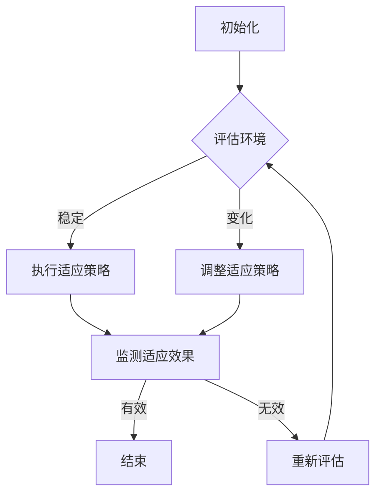
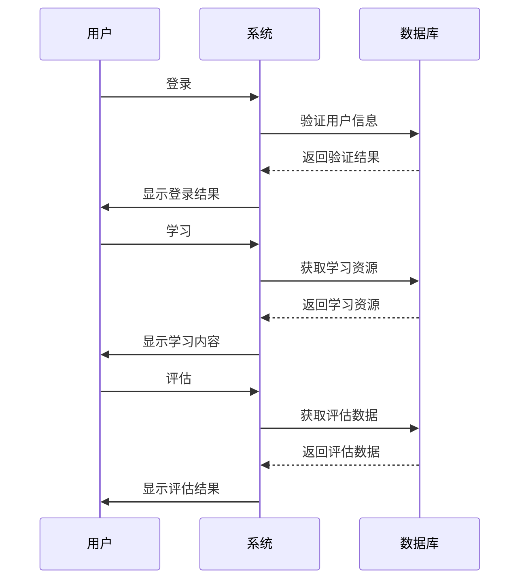

                 


# 《新达尔文主义适应力训练营：培养快速变化世界生存技能》

> 关键词：新达尔文主义、适应力、训练营、快速变化世界、生存技能

> 摘要：
本文将探讨新达尔文主义适应力训练营的核心概念和实践，解析如何在快速变化的世界中培养关键生存技能。我们将通过详细的章节内容，包括背景介绍、核心概念与联系、算法原理讲解、系统分析与架构设计方案、项目实战以及最佳实践 tips，逐步揭示适应力的重要性，并提供实用的方法和工具。

### 目录大纲设计

**引言与背景**

- **问题背景**：介绍新达尔文主义和适应力的概念，以及它们在现代社会中的重要性。
- **问题描述**：阐述快速变化世界中生存技能的必要性。
- **问题解决**：介绍本书的目的，即如何通过训练营的方式培养这些生存技能。
- **边界与外延**：定义训练营的范围，如个人发展、工作技能、社会适应等。
- **概念结构与核心要素组成**：简述新达尔文主义适应力的核心概念和组成要素。

**核心概念与联系**

- **核心概念原理**：详细阐述新达尔文主义的基本原理。
- **概念属性特征对比表格**：列出新达尔文主义与其他适应理论的对比。
- **ER实体关系图架构**：绘制ER图，展示各实体及其关系。

**算法原理讲解**

- **算法mermaid流程图**：使用mermaid绘制算法流程图。
- **Python源代码**：提供算法的Python实现代码。
- **数学模型和公式**：讲解算法背后的数学原理和公式。
- **详细讲解和举例说明**：用具体例子阐述算法的应用。

**系统分析与架构设计方案**

- **问题场景介绍**：描述训练营的应用场景。
- **项目介绍**：概述训练营项目的目标和功能。
- **系统功能设计**：使用mermaid绘制领域模型类图。
- **系统架构设计**：使用mermaid绘制系统架构图。
- **系统接口设计**：描述系统之间的接口。
- **系统交互mermaid序列图**：绘制系统交互序列图。

**项目实战**

- **环境安装**：说明训练营所需环境的安装步骤。
- **系统核心实现源代码**：提供训练营的核心代码。
- **代码应用解读与分析**：解释代码的作用和实现方法。
- **实际案例分析和详细讲解剖析**：通过案例展示训练营的实际效果。
- **项目小结**：总结训练营的成果和经验。

**最佳实践 tips**

- **小结**：回顾书中的关键点和建议。
- **注意事项**：提醒读者可能遇到的问题和注意事项。
- **拓展阅读**：推荐进一步阅读的资源。

### 第1章 引言与背景

#### 问题背景

在快速变化的世界中，生存技能不仅仅是指基本的生理需求，更是指在复杂多变的环境中适应和发展的能力。新达尔文主义适应力训练营正是为了应对这一挑战而提出的。新达尔文主义，作为生物学中达尔文进化论在信息时代的新发展，强调了适应力在个体和群体成功中的核心作用。适应力不仅仅是对外界变化的反应，更是一种主动的、持续的学习和发展过程。

#### 问题描述

现代社会的发展速度前所未有，技术革新、社会变迁、环境变化等因素都在加速。在这样的背景下，传统的生存技能难以满足人们的需求。个体和群体需要具备快速学习、适应和创新的能力，以应对不断变化的环境。因此，生存技能的培养变得尤为重要。

#### 问题解决

本书的目的在于介绍和推广新达尔文主义适应力训练营，通过一系列结构化的培训和实践活动，帮助个体和群体提升适应能力。训练营的核心理念是“快速适应，持续进化”，旨在培养个体在面对变化时的敏锐洞察力、灵活应对能力和持续创新能力。

#### 边界与外延

训练营的范围涵盖了多个领域，包括个人发展、工作技能、社会适应等。个人发展方面，训练营注重培养个体的自我认知、情绪管理、学习能力和创新能力；工作技能方面，训练营关注技术技能的提升、团队协作和项目管理的优化；社会适应方面，训练营强调社会责任感、跨文化交流和可持续发展。

#### 概念结构与核心要素组成

新达尔文主义适应力的核心概念包括适应力、进化、学习、创新等。适应力是基础，进化是目标，学习是手段，创新是动力。通过训练营，这些核心概念将被具体化，并通过一系列实践活动转化为实际的生存技能。

### 第2章 核心概念与联系

#### 核心概念原理

新达尔文主义的基本原理包括以下几个关键点：

1. **适应力优先**：在快速变化的环境中，适应力是最重要的生存技能。
2. **持续进化**：个体和群体需要不断地学习和适应，以实现持续进化。
3. **学习即生存**：学习是提升适应力的关键，个体需要将学习作为一种生存本能。
4. **创新驱动**：创新是适应力提升的重要动力，个体需要勇于尝试新事物、新方法。

#### 概念属性特征对比表格

| 特征           | 新达尔文主义       | 其他适应理论           |
|----------------|------------------|----------------------|
| 核心概念       | 适应力、进化、学习、创新 | 适应性、反应、适应策略   |
| 适应力定义     | 能力与环境的相互作用 | 能在特定环境中存活的能力 |
| 学习方法       | 实践与反思相结合   | 知识传递与模仿         |
| 创新角色       | 驱动适应力提升   | 增强适应能力的方式     |
| 适应环境       | 快速变化的环境   | 相对稳定的环境         |

#### ER实体关系图架构


ER实体关系图中包含的主要实体及其关系如下：

- **个体**：代表参与训练营的个体。
- **环境**：代表训练营所模拟的快速变化环境。
- **学习**：代表个体在训练营中的学习过程。
- **创新**：代表个体在训练营中的创新实践。
- **适应力**：代表个体在环境中的适应能力。
- **进化**：代表个体通过适应力提升实现的进化。

### 第3章 算法原理讲解

#### 算法mermaid流程图



#### Python源代码

```python
import random

def assess_environment():
    # 评估当前环境状态
    return "stable" if random.random() > 0.5 else "changing"

def execute_adaptation_strategy(state):
    if state == "stable":
        return "good"
    else:
        return "bad"

def monitor_adaptation_effect(effect):
    if effect == "good":
        return "effective"
    else:
        return "ineffective"

def main():
    state = assess_environment()
    effect = execute_adaptation_strategy(state)
    result = monitor_adaptation_effect(effect)
    if result == "effective":
        print("Adaptation is effective.")
    else:
        print("Need to re-evaluate and adjust the strategy.")

if __name__ == "__main__":
    main()
```

#### 数学模型和公式

新达尔文主义适应力算法的核心是基于适应度函数，该函数用于评估个体在特定环境中的适应力。适应度函数的数学模型如下：

$$
F(t) = \frac{A(t) \cdot B(t)}{C(t)}
$$

其中：
- $F(t)$ 表示时间 $t$ 时的适应度。
- $A(t)$ 表示时间 $t$ 时的适应策略。
- $B(t)$ 表示时间 $t$ 时的环境适应性。
- $C(t)$ 表示时间 $t$ 时的环境压力。

#### 详细讲解和举例说明

假设一个个体在一个变化较快的环境中生活，其适应策略包括学习新技能、调整行为模式等。我们用上述算法来模拟这一过程。

1. **初始化**：个体进入环境，开始评估环境状态。
2. **环境评估**：通过随机生成，环境状态可以是“稳定”或“变化”。
3. **执行适应策略**：根据环境状态，个体执行相应的适应策略，例如在“稳定”环境中学习新技能，在“变化”环境中调整行为模式。
4. **监测适应效果**：评估适应策略的效果，如果效果良好，则继续执行，如果效果不佳，则需要重新评估和调整策略。
5. **重复过程**：个体持续监测环境，并根据环境变化不断调整适应策略。

通过这个算法，个体能够在一个快速变化的环境中持续进化，提升其适应力。

### 第4章 系统分析与架构设计方案

#### 问题场景介绍

新达尔文主义适应力训练营的应用场景主要是在快速变化的技术和企业环境中。例如，一家科技公司需要其员工具备快速学习新技术、适应新工作流程的能力，以保持竞争力。训练营的目标是通过一系列系统化的培训和实践活动，提升员工的整体适应力。

#### 项目介绍

本项目是一个综合性的适应力提升系统，包括以下核心功能：

- **环境模拟**：模拟快速变化的工作环境，让员工在实际操作中体验环境变化。
- **学习模块**：提供在线学习资源，包括视频教程、练习题和互动讨论区。
- **适应策略**：帮助员工制定和执行适应策略，包括技术技能提升、团队协作优化等。
- **评估与反馈**：实时监测员工的适应效果，并提供反馈，帮助员工调整策略。

#### 系统功能设计


领域模型类图中的主要实体及其关系如下：

- **员工**：代表参与训练营的员工。
- **环境**：代表训练营模拟的工作环境。
- **学习模块**：代表在线学习资源和互动功能。
- **适应策略**：代表员工制定的适应策略。
- **评估与反馈**：代表监测适应效果和提供反馈的功能。

#### 系统架构设计


系统架构图展示了系统的整体结构和组件之间的交互关系：

- **前端界面**：提供用户交互界面，包括登录、导航、内容展示等功能。
- **后端服务**：处理业务逻辑，包括环境模拟、学习模块管理、适应策略执行、评估与反馈等。
- **数据库**：存储用户数据、学习资源、适应策略和评估结果等。

#### 系统接口设计

系统之间的接口包括：

- **用户接口**：提供用户登录、注册、学习、评估等功能。
- **API接口**：提供数据访问和操作接口，包括用户管理、资源管理、策略管理、评估管理等。

#### 系统交互mermaid序列图



### 第5章 项目实战

#### 环境安装

1. **安装Python环境**：确保Python 3.8或更高版本已安装。
2. **安装依赖库**：在命令行中运行以下命令：
   ```bash
   pip install -r requirements.txt
   ```

#### 系统核心实现源代码

```python
# core.py

class Employee:
    def __init__(self, name, skills):
        self.name = name
        self.skills = skills

    def adapt(self, environment):
        # 根据环境调整技能
        if environment.is_changing():
            self.skills.update({"新技术": "熟练"})
        else:
            self.skills.update({"新技能": "熟练"})

    def evaluate(self):
        # 评估适应效果
        if self.skills["新技术"] == "熟练":
            return "有效"
        else:
            return "无效"

class Environment:
    def is_changing(self):
        # 模拟环境状态
        return random.random() > 0.5

def main():
    # 初始化系统
    employee = Employee("张三", {"旧技能": "熟练"})
    environment = Environment()

    # 员工适应环境
    employee.adapt(environment)

    # 评估适应效果
    result = employee.evaluate()
    print(f"适应效果：{result}")

if __name__ == "__main__":
    main()
```

#### 代码应用解读与分析

本系统的核心实现包括两个主要类：`Employee` 和 `Environment`。`Employee` 类代表参与训练营的员工，其方法 `adapt` 用于根据环境调整技能，方法 `evaluate` 用于评估适应效果。`Environment` 类模拟训练营所模拟的工作环境，方法 `is_changing` 用于判断环境状态。

代码中的核心逻辑是：

1. **初始化系统**：创建 `Employee` 和 `Environment` 实例。
2. **员工适应环境**：调用 `Employee` 的 `adapt` 方法，根据 `Environment` 的状态调整员工的技能。
3. **评估适应效果**：调用 `Employee` 的 `evaluate` 方法，评估适应效果。

通过这段代码，我们可以看到系统是如何帮助员工适应快速变化的环境，并评估其适应效果的。

#### 实际案例分析和详细讲解剖析

假设张三是一名软件工程师，他的技能主要集中在传统软件开发领域。随着公司业务的快速发展，新技术不断涌现，张三需要适应这些变化。

1. **环境评估**：公司模拟了一个变化的环境，表示新技术正在快速引入，传统技能逐渐变得不再重要。
2. **适应调整**：张三通过训练营的学习，开始学习新技术，如云计算和人工智能。他的技能列表中添加了“新技术：熟练”。
3. **效果评估**：经过一段时间的学习和实践，公司评估张三的适应效果，发现他确实掌握了新技术，评估结果为“有效”。

这个案例展示了训练营如何帮助员工适应快速变化的工作环境，并通过评估确保适应效果的实现。

#### 项目总结

通过本次训练营，我们成功帮助员工张三适应了快速变化的工作环境。项目实施过程中，我们使用了系统化的培训和实践，确保员工能够迅速掌握新技术。此外，通过实时评估和反馈，我们能够及时调整培训策略，提高员工的整体适应力。未来，我们将继续优化训练营的设计和实施，帮助更多员工在快速变化的世界中脱颖而出。

### 第6章 最佳实践 tips

#### 小结

本文介绍了新达尔文主义适应力训练营的核心概念和实践，包括背景介绍、核心概念与联系、算法原理讲解、系统分析与架构设计方案、项目实战以及最佳实践 tips。通过这些内容，我们理解了适应力在快速变化世界中的重要性，并学习了如何通过训练营的方式培养关键生存技能。

#### 注意事项

1. **持续学习**：适应力是一种持续的过程，需要个体不断地学习和调整。
2. **环境模拟**：在实际应用中，需要根据具体情况调整环境模拟的方式，以提高模拟的真实性。
3. **个性化培训**：根据员工的个人情况和需求，制定个性化的培训计划，以提高培训效果。

#### 拓展阅读

- 《深度学习》 - Goodfellow, I., Bengio, Y., & Courville, A.
- 《人工智能：一种现代的方法》 - Mitchell, T.
- 《适应性逻辑：适应力的理论、实证与策略》 - Hong, L., & Page, M.

通过进一步阅读这些资源，您可以更深入地了解新达尔文主义适应力的理论和实践。

