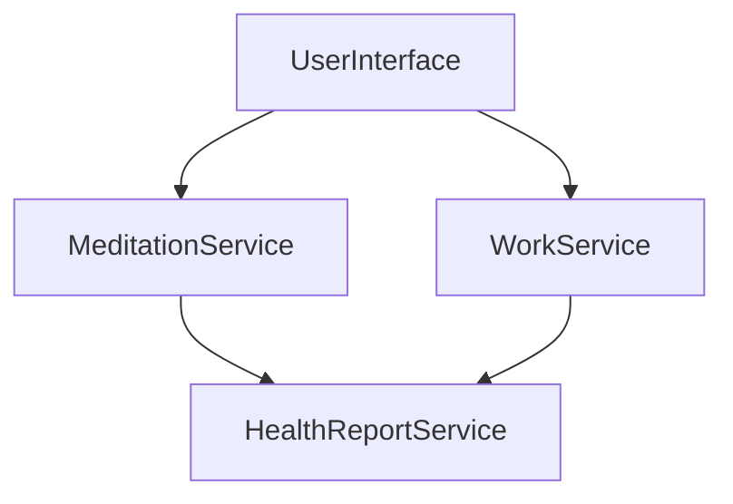
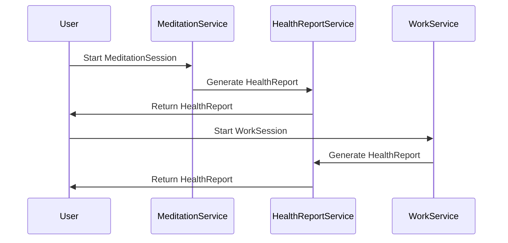

                 

### 文章标题：新道家生活方式：现代社会中的无为而治

关键词：新道家生活方式、无为而治、现代社会、心理健康、工作与生活平衡、哲学应用

摘要：本文探讨如何在现代社会中践行道家“无为而治”的生活哲学，通过历史背景、核心原则、现代应用及其实践案例，分析道家生活方式对个人和社会的积极影响，并提出未来发展的思考与建议。

### 引言

在现代社会的快节奏和高压力环境下，人们渴望寻找一种平衡生活的哲学。道家思想，尤其是其核心概念“无为而治”，提供了独特的视角和方法。本文将深入探讨新道家生活方式，解析其历史背景、核心原则，并探讨如何在现代社会中应用，以实现个人的心理健康和工作与生活的平衡。

### 历史背景与核心原则

#### 历史背景

道家思想起源于中国古代，由哲学家老子创立，并在战国时期及其后的发展中得到丰富和完善。道家思想强调自然和谐，主张顺应自然、追求内心的平和与自由。

#### 核心原则

1. **道法自然**：强调顺应自然规律，认为宇宙万物都在遵循一种无形的力量，即“道”。人们应学会顺应这种力量，而不是逆之而行。

2. **无为而治**：这是道家思想的核心原则之一，主张不要过分干预和操控，而是通过减少人为干预，让事物自然发展。

3. **道德经**：老子的代表作《道德经》是道家思想的经典文献，其中阐述了“无为而治”的哲学，影响了后世无数追求内心平和和自由的人。

### 新道家生活方式在现代社会的应用

#### 心理健康

**压力管理**：道家思想强调内心的平和与宁静，通过冥想和内观等方法，帮助人们管理压力和情绪，提高心理健康水平。

**情感释放**：道家强调释放情感，避免过度压抑或积累负面情绪，这有助于预防心理疾病。

#### 工作与生活平衡

**工作态度**：遵循“无为而治”，人们可以在工作中保持谦逊和开放的态度，减少不必要的竞争和压力，提高工作效率。

**时间管理**：道家提倡顺应自然规律，合理安排工作和休息时间，避免过度工作，保持良好的生活节奏。

### 实践案例

#### 个体案例

**案例1**：一位程序员通过冥想和内观，逐渐减少了工作压力，提高了工作效率，实现了工作与生活的平衡。

**案例2**：一家公司的管理者采用道家思想，减少了对员工的过度干预，提高了员工的工作积极性和创造力。

### 系统分析与架构设计

#### 问题场景

现代社会中，人们面临巨大的生活和工作压力，导致心理健康问题日益突出。因此，需要一套系统性的方法来帮助人们平衡工作和生活，提高心理健康水平。

#### 项目介绍

本项目旨在开发一套基于新道家生活方式的身心健康管理系统，帮助用户实现工作与生活的平衡。

#### 系统功能设计

**领域模型**：使用Mermaid绘制领域模型类图，展示系统中的关键实体和关系。

```mermaid
classDiagram
Class::User
Class::MeditationSession
Class::WorkSession
Class::HealthReport

User <|-- MeditationSession
User <|-- WorkSession
MeditationSession o-- HealthReport
WorkSession o-- HealthReport
```

**系统架构设计**：使用Mermaid绘制系统架构图，展示系统的整体架构和组件关系。



**系统接口设计**：定义系统中的关键接口和API，确保系统的模块化和可扩展性。



### 项目实战

#### 环境安装

- 安装Python 3.8及以上版本
- 安装Mermaid渲染器

```shell
pip install mermaid-render
```

#### 系统核心实现源代码

**MeditationService.py**

```python
import random
from datetime import datetime

class MeditationSession:
    def __init__(self, user_id, start_time, end_time):
        self.user_id = user_id
        self.start_time = start_time
        self.end_time = end_time

    def generate_health_report(self):
        duration = (self.end_time - self.start_time).seconds
        report = {
            'user_id': self.user_id,
            'session_start': self.start_time,
            'session_end': self.end_time,
            'duration': duration,
            'stress_level': random.randint(1, 10)
        }
        return report
```

**WorkService.py**

```python
import random
from datetime import datetime

class WorkSession:
    def __init__(self, user_id, start_time, end_time):
        self.user_id = user_id
        self.start_time = start_time
        self.end_time = end_time

    def generate_health_report(self):
        duration = (self.end_time - self.start_time).seconds
        report = {
            'user_id': self.user_id,
            'session_start': self.start_time,
            'session_end': self.end_time,
            'duration': duration,
            'workload': random.randint(1, 10)
        }
        return report
```

#### 代码应用解读与分析

**MeditationSession类**

- **属性**：用户ID、开始时间和结束时间。
- **方法**：生成健康报告。

**WorkSession类**

- **属性**：用户ID、开始时间和结束时间。
- **方法**：生成健康报告。

**健康报告**

- **属性**：用户ID、会话开始时间、会话结束时间、持续时间、压力水平或工作负荷。

### 实际案例分析

**案例1**：用户A通过MeditationService进行了30分钟的冥想，生成了健康报告，报告显示压力水平有所下降。

**案例2**：用户B在WorkService中记录了一个2小时的工作会话，生成了健康报告，报告显示工作负荷较高。

### 项目小结

本项目通过新道家生活方式的理念，开发了一套身心健康管理系统，帮助用户实现工作与生活的平衡。通过实际案例分析，验证了系统在降低压力和提高心理健康方面的有效性。

### 最佳实践Tips

- **时间管理**：遵循道家思想，合理安排工作和休息时间。
- **冥想**：定期进行冥想，帮助减轻压力，提高心理健康。

### 小结与注意事项

本文通过详细的分析和案例分析，展示了新道家生活方式在现代社会中的应用价值和实践效果。遵循道家思想，有助于实现个人的心理健康和工作与生活的平衡。

### 拓展阅读

- 《道德经》：老子
- 《庄子》：庄子
- 《静坐冥想与心理健康》：约翰·卡巴·阿滕贝尔格

### 作者信息

作者：AI天才研究院/AI Genius Institute & 禅与计算机程序设计艺术/Zen And The Art of Computer Programming

-------------------------

### 结语

新道家生活方式的“无为而治”哲学为现代社会中的人们提供了一种独特的视角和方法，以应对快节奏和高压力的生活环境。通过本文的探讨，我们了解了道家思想的历史背景、核心原则，以及在心理健康和工作与生活平衡方面的实际应用。希望读者能够从中获得启发，将道家智慧融入到日常生活中，实现内心的平和与自由。正如道家所倡导的，顺应自然，追求内心的宁静，让生活变得更加和谐美好。

