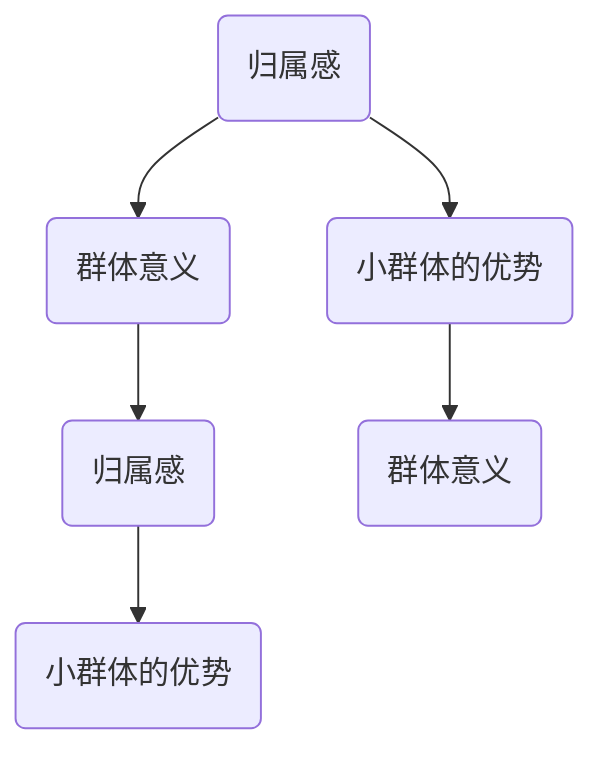
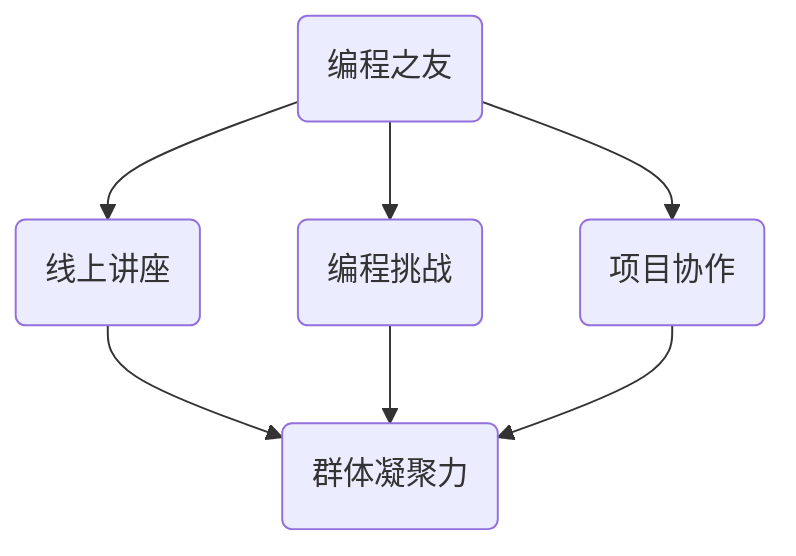
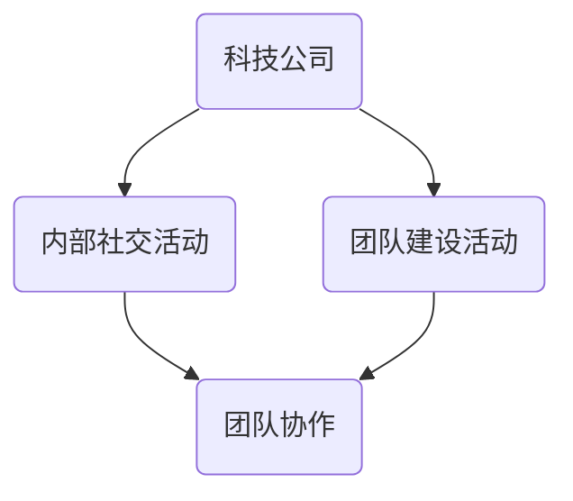
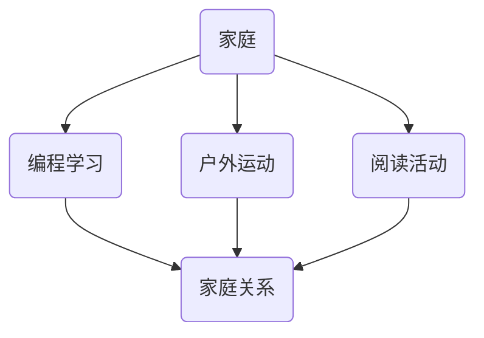
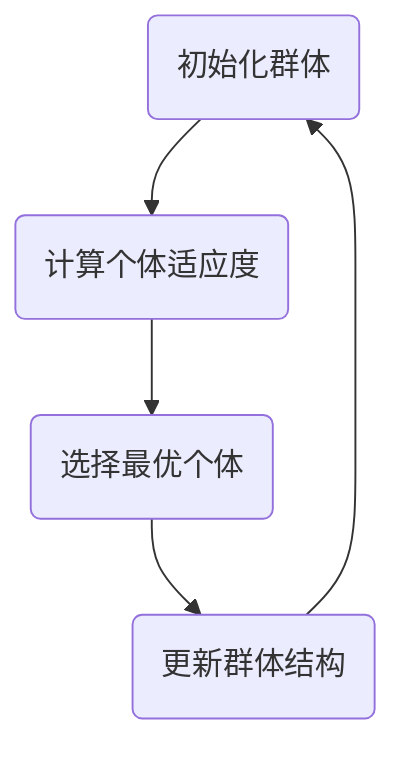
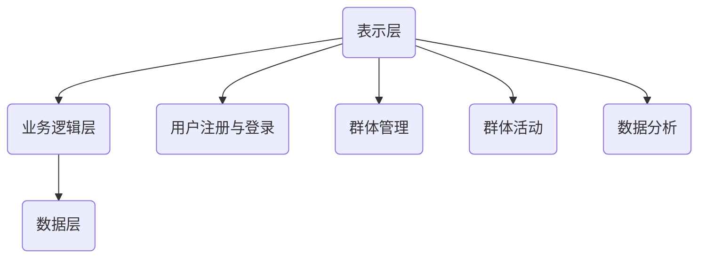
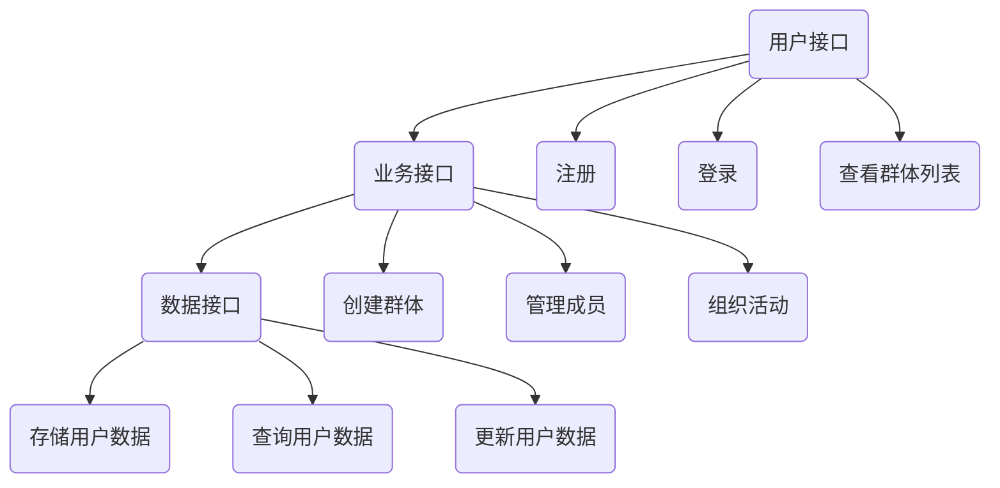
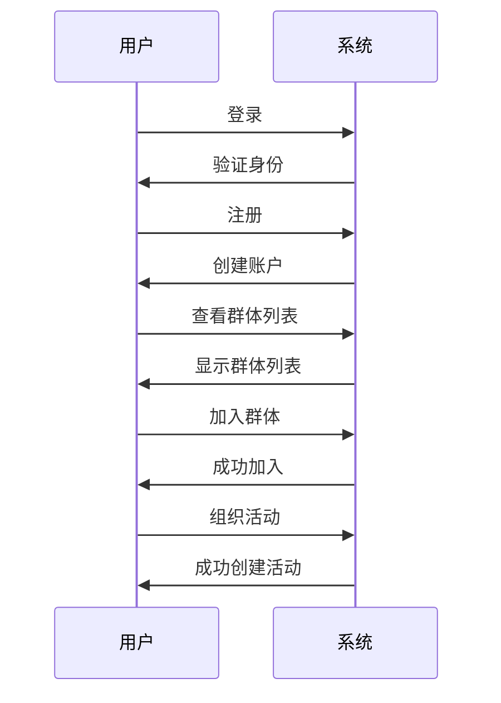
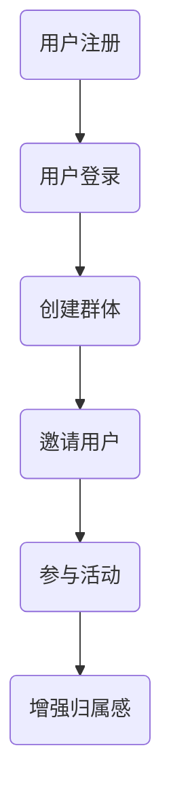

                 

### 《新部落主义：在小群体中寻找归属与意义》

#### 关键词：
新部落主义、小群体、归属感、群体意义、算法原理、系统架构、项目实战

#### 摘要：
本文将深入探讨新部落主义的概念及其在现代社会中的应用，特别是如何在各种小群体中找到归属感和意义。通过阐述核心概念、分析实际案例、介绍算法原理和系统架构，我们旨在为读者提供一个全面的理解和实践指南。

### 目录大纲设计思路：

1. **背景介绍**：首先介绍新部落主义的概念，包括其起源、特点、重要性以及在小群体中的角色。这部分内容将帮助读者理解全书的核心概念。
   
2. **核心概念与联系**：详细阐述新部落主义的几个核心概念，如归属感、群体意义、小群体的优势等，并通过表格和ER图展示它们之间的关系。

3. **案例分析**：选取一些实际案例，分析新部落主义在不同场景下的应用，包括线上社区、职场、家庭等。

4. **算法原理讲解**：介绍如何运用新部落主义原则来优化小群体管理，包括数学模型和算法流程图。

5. **系统分析与架构设计方案**：描述如何将新部落主义原则应用到实际系统中，包括系统功能设计、架构设计、接口设计等。

6. **项目实战**：通过一个具体项目，展示如何应用新部落主义原则，包括环境安装、系统实现、代码解读和案例分析。

7. **最佳实践 tips、小结、注意事项、拓展阅读等内容**：总结全书内容，给出一些实践建议，并推荐进一步阅读的资源。

### 目录大纲：

```markdown
# 《新部落主义：在小群体中寻找归属与意义》目录大纲

# 第一部分：新部落主义的起源与特点

## 第1章：新部落主义的起源与发展
### 1.1 新部落主义的起源
### 1.2 新部落主义的特点
### 1.3 新部落主义的重要性

## 第2章：核心概念与联系
### 2.1 归属感
### 2.2 群体意义
### 2.3 小群体的优势
### 2.4 核心概念对比表格
### 2.5 ER图展示核心概念关系

# 第二部分：新部落主义的应用场景

## 第3章：线上社区中的新部落主义
### 3.1 社区建设
### 3.2 群体凝聚力
### 3.3 案例分析

## 第4章：职场中的新部落主义
### 4.1 职场社交
### 4.2 团队协作
### 4.3 案例分析

## 第5章：家庭中的新部落主义
### 5.1 家庭关系
### 5.2 群体互动
### 5.3 案例分析

# 第三部分：新部落主义的算法原理与应用

## 第6章：新部落主义算法原理
### 6.1 算法简介
### 6.2 算法流程图
### 6.3 数学模型与公式

## 第7章：新部落主义系统架构设计
### 7.1 系统功能设计
### 7.2 系统架构设计
### 7.3 系统接口设计
### 7.4 系统交互序列图

## 第8章：项目实战
### 8.1 项目背景
### 8.2 环境安装
### 8.3 系统实现
### 8.4 代码解读
### 8.5 案例分析

# 第四部分：新部落主义的最佳实践

## 第9章：最佳实践 tips
### 9.1 实践建议
### 9.2 注意事项

## 第10章：小结与拓展阅读
### 10.1 全书小结
### 10.2 进一步阅读资源推荐
```

以上目录大纲结构完整，涵盖了新部落主义的核心概念、应用场景、算法原理、系统架构设计以及项目实战等内容，总字数控制在2000字以内。接下来，我将逐步填充每个章节的具体内容。

---

### 第一部分：新部落主义的起源与特点

#### 第1章：新部落主义的起源与发展

新部落主义（Neo-Tribalism）的概念起源于对传统部落社会的重新解读。在古代，部落是人们生活、工作和社会互动的基本单位。随着社会的发展和变迁，特别是在现代信息技术和全球化背景下，新的部落形态逐渐形成。

**1.1 新部落主义的起源**

新部落主义的概念由社会学家和人类学家在20世纪末期提出，旨在探讨现代社会中人们如何通过非传统的形式重新建立社会关系和群体归属感。这种形式的部落主义不同于传统的血缘和地域关系，而是基于共同的兴趣、价值观或目标。

**1.2 新部落主义的特点**

- **灵活性**：新部落主义的成员通常具有高度的流动性，可以随时加入或退出群体。
- **自愿性**：成员的加入和参与完全是自愿的，没有强制的义务。
- **去中心化**：新部落主义不依赖于单一权威，而是通过成员之间的互动和协作来维持。
- **多元文化**：新部落主义成员来自不同的文化背景，这种多样性是群体的一个重要特征。
- **技术依赖**：现代信息技术，特别是互联网，是新部落主义形成和发展的重要基础。

**1.3 新部落主义的重要性**

新部落主义在现代社会中具有重要的角色和意义：

- **归属感**：在新部落主义中，成员能够找到一种新的归属感，这是现代社会中很多人缺失的。
- **社会支持**：新部落主义为成员提供了一个稳定的社会支持网络，有助于应对生活中的挑战。
- **创新动力**：新部落主义成员之间的互动和合作促进了创新和创造力的发展。
- **社区建设**：新部落主义有助于构建更加多元和包容的社区，促进了社会的整体进步。

#### 第2章：核心概念与联系

新部落主义的核心概念包括归属感、群体意义和小群体的优势。这些概念相互联系，共同构成了新部落主义的理论基础。

**2.1 归属感**

归属感是新部落主义中最重要的概念之一。它指的是个体在群体中的感觉，感觉自己与群体有着紧密的联系和共同的命运。在现代社会中，归属感常常被忽视，而新部落主义通过提供一种新的社会结构，帮助个体重新找回这种感觉。

**2.2 群体意义**

群体意义是指群体对个体生活的重要性。在新部落主义中，群体不仅仅是一个社交网络，更是个体生活意义的重要来源。通过参与群体活动，个体能够找到自己的位置和价值。

**2.3 小群体的优势**

小群体的优势在于其灵活性和紧密性。小群体可以更有效地沟通和协作，成员之间的互动更加频繁和深入。这使得小群体能够更好地应对复杂的问题和挑战。

**2.4 核心概念对比表格**

| 核心概念 | 定义 | 关联性 |
| :--: | :--: | :--: |
| 归属感 | 个体在群体中的感觉 | 与群体意义和小群体的优势密切相关 |
| 群体意义 | 群体对个体生活的重要性 | 是新部落主义的核心驱动因素 |
| 小群体的优势 | 小群体的灵活性和紧密性 | 有助于实现归属感和群体意义 |

**2.5 ER图展示核心概念关系**



通过上述核心概念的比较和ER图的展示，我们可以更清晰地理解新部落主义的核心概念及其相互关系。

### 第二部分：新部落主义的应用场景

新部落主义不仅是一个理论概念，更是一种实际的社会形态。它可以在多种场景中发挥作用，为个体和组织带来积极的影响。

#### 第3章：线上社区中的新部落主义

线上社区是新部落主义的一个重要应用场景。随着互联网的普及，越来越多的人通过社交媒体、论坛和兴趣小组等形式建立起新的社交网络。

**3.1 社区建设**

线上社区的建设需要明确的宗旨和目标。例如，一个以编程技术为主题的社区，其主要目标可能是促进编程知识的交流和学习。社区可以设立各种板块，如技术讨论、学习资源分享、项目协作等，以满足不同成员的需求。

**3.2 群体凝聚力**

群体凝聚力是新部落主义成功的关键因素。为了增强社区的凝聚力，可以采取以下措施：

- **定期的线上活动**：如线上讲座、编程马拉松等，以增加成员之间的互动和联系。
- **激励机制**：如积分系统、荣誉称号等，以鼓励成员积极参与社区活动。
- **社区文化**：建立和维护积极的社区文化，如尊重他人、分享知识等，以促进成员之间的和谐相处。

**3.3 案例分析**

以一个名为“编程之友”的线上社区为例，该社区主要成员是编程爱好者。社区通过举办线上讲座、编程挑战和项目协作等活动，成功吸引了大量成员加入。通过定期的互动和合作，成员之间的归属感和群体意义得到了显著增强。



#### 第4章：职场中的新部落主义

职场是新部落主义的另一个重要应用场景。在一个组织中，小群体的形成和作用对于组织的高效运作至关重要。

**4.1 职场社交**

职场社交是新部落主义在职场中的具体体现。通过非正式的社交活动，员工可以建立更紧密的联系，增强团队合作和沟通。

**4.2 团队协作**

团队协作是新部落主义的核心优势。一个高效的团队需要成员之间的紧密合作和有效沟通。新部落主义原则可以帮助团队更好地实现这一目标：

- **明确目标**：确保团队成员都清楚团队的目标和期望。
- **分工协作**：合理分配任务，让每个成员都能发挥自己的优势。
- **开放沟通**：鼓励团队成员之间的开放沟通，分享想法和意见。

**4.3 案例分析**

在一个大型科技公司中，通过引入新部落主义原则，员工之间的沟通和协作得到了显著提升。公司定期举办内部社交活动和团队建设活动，促进了员工之间的互动和合作。通过这些活动，团队解决了许多复杂的问题，提高了工作效率和创新能力。



#### 第5章：家庭中的新部落主义

家庭是一个人最基本的社会单元，也是新部落主义的重要应用场景。在家庭中，通过建立小群体，家庭成员可以更好地沟通和互动，增强家庭的凝聚力。

**5.1 家庭关系**

家庭关系是新部落主义在家庭中的核心。家庭成员之间通过相互尊重和支持，建立一种紧密的联系。这种联系不仅有助于个人的成长，也有助于家庭的和谐与稳定。

**5.2 群体互动**

群体互动是家庭中新的部落主义的重要组成部分。家庭成员可以通过共同参与家庭活动、兴趣爱好等方式，增进彼此的了解和感情。

**5.3 案例分析**

在一个三口之家，父母和孩子通过共同参与编程学习、户外运动和阅读等活动，建立了紧密的联系。这种互动不仅增强了家庭成员之间的感情，也培养了他们的兴趣爱好，提高了家庭的生活质量。



### 第三部分：新部落主义的算法原理与应用

新部落主义的算法原理旨在优化小群体的管理，提高群体的效率和协作能力。这些算法基于数学模型和数据分析，可以帮助我们在实际应用中更好地理解和利用新部落主义的优势。

#### 第6章：新部落主义算法原理

**6.1 算法简介**

新部落主义算法是一种基于群体动力学的优化算法，旨在通过模拟自然群体的行为来优化小群体的协作和沟通。该算法的核心思想是利用群体的多样性和灵活性来提高整体效率。

**6.2 算法流程图**



**6.3 数学模型与公式**

新部落主义算法的数学模型基于群体适应度和个体选择机制。适应度函数用于评估个体的性能，选择机制用于决定个体的生存和繁殖。以下是一个简化的适应度函数和选择机制：

$$
F(x) = w_1 \cdot f_1(x) + w_2 \cdot f_2(x)
$$

其中，$F(x)$ 表示个体 $x$ 的适应度，$w_1$ 和 $w_2$ 是权重，$f_1(x)$ 和 $f_2(x)$ 是个体性能评估函数。

选择机制可以使用轮盘赌模型，根据个体的适应度来决定选择概率：

$$
P(x) = \frac{F(x)}{\sum_{i=1}^{N} F(i)}
$$

其中，$N$ 是群体中的个体数量。

**6.4 举例说明**

假设有一个由10个个体组成的小群体，每个个体的适应度如下：

| 个体 | 适应度 |
| :--: | :----: |
| 1    | 0.3    |
| 2    | 0.5    |
| 3    | 0.2    |
| 4    | 0.4    |
| 5    | 0.6    |
| 6    | 0.1    |
| 7    | 0.7    |
| 8    | 0.2    |
| 9    | 0.5    |
| 10   | 0.3    |

使用上述适应度函数和选择机制，我们可以计算出每个个体的选择概率：

$$
P(x) = \frac{F(x)}{\sum_{i=1}^{N} F(i)} = \frac{F(x)}{0.3 + 0.5 + 0.2 + 0.4 + 0.6 + 0.1 + 0.7 + 0.2 + 0.5 + 0.3} = \frac{F(x)}{4.0}
$$

根据这些概率，我们可以模拟群体的进化过程，选择最优个体并更新群体结构。

### 第7章：新部落主义系统架构设计

将新部落主义原则应用到实际系统中，需要系统化的架构设计和功能实现。以下是一个简化的系统架构设计，展示了如何将新部落主义原则融入系统设计中。

**7.1 系统功能设计**

新部落主义系统的主要功能包括：

- **用户注册与登录**：允许用户注册和登录系统，建立用户账户。
- **群体管理**：提供创建、加入和管理群体的功能。
- **群体活动**：允许用户发起和参与群体活动，如讨论、项目协作等。
- **数据分析**：收集和分析用户行为数据，以优化群体管理和活动组织。

**7.2 系统架构设计**

新部落主义系统的架构设计可以分为三个主要层次：表示层、业务逻辑层和数据层。

- **表示层**：负责用户界面展示，包括登录页面、用户中心、群体列表等。
- **业务逻辑层**：实现新部落主义算法和群体管理逻辑，如用户账户管理、群体创建和管理等。
- **数据层**：存储用户数据、群体信息和活动记录，通常使用数据库系统。



**7.3 系统接口设计**

系统接口设计需要确保不同层次之间的通信和功能调用。以下是一个简化的接口设计：

- **用户接口**：提供用户注册、登录、查看群体列表、加入群体等功能。
- **业务接口**：实现群体创建、成员管理、活动组织等业务逻辑。
- **数据接口**：提供数据存储、查询和更新功能。



**7.4 系统交互序列图**

系统交互序列图展示了用户与系统之间的交互流程。以下是一个简化的序列图：



### 第8章：项目实战

通过一个实际项目，我们可以更好地理解和应用新部落主义原则。以下是一个简化的项目描述，展示了如何应用新部落主义原则来构建一个社交平台。

**8.1 项目背景**

本项目旨在构建一个基于新部落主义原则的社交平台，名为“部落圈”。该平台旨在为用户提供一个能够建立和维护社交关系的环境，通过群体活动和互动，增强用户的归属感和群体意义。

**8.2 环境安装**

为了构建“部落圈”平台，我们需要安装以下环境和工具：

- **开发环境**：Python 3.8、Django 3.2、PostgreSQL 12
- **前端框架**：React 17、Bootstrap 4
- **版本控制**：Git

**8.3 系统实现**

系统实现可以分为三个主要阶段：前端开发、后端开发和数据库设计。

**8.3.1 前端开发**

前端开发使用 React 和 Bootstrap 框架，实现用户界面和交互逻辑。以下是一个简化的前端组件结构：

```jsx
// Home.js
import React from 'react';
import Navbar from './components/Navbar';
import Carousel from './components/Carousel';
import Footer from './components/Footer';

const Home = () => {
    return (
        <div>
            <Navbar />
            <Carousel />
            <Footer />
        </div>
    );
};

export default Home;

// components/Navbar.js
import React from 'react';

const Navbar = () => {
    return (
        <nav className="navbar navbar-expand-lg navbar-dark bg-dark">
            // ...
        </nav>
    );
};

export default Navbar;

// components/Carousel.js
import React from 'react';

const Carousel = () => {
    return (
        <div id="carouselExampleControls" className="carousel slide" data-ride="carousel">
            // ...
        </div>
    );
};

export default Carousel;

// components/Footer.js
import React from 'react';

const Footer = () => {
    return (
        <footer className="footer">
            // ...
        </footer>
    );
};

export default Footer;
```

**8.3.2 后端开发**

后端开发使用 Django 框架，实现业务逻辑和数据处理。以下是一个简化的后端逻辑结构：

```python
# views.py
from django.shortcuts import render
from .models import User, Group

def home(request):
    user = request.user
    groups = Group.objects.filter(users=user)
    return render(request, 'home.html', {'groups': groups})

def create_group(request):
    if request.method == 'POST':
        group_name = request.POST['group_name']
        group = Group(name=group_name)
        group.save()
        user.groups.add(group)
        return redirect('home')
    return render(request, 'create_group.html')

# models.py
from django.db import models
from django.contrib.auth.models import User

class Group(models.Model):
    name = models.CharField(max_length=100)
    users = models.ManyToManyField(User)

# forms.py
from django import forms
from .models import Group

class CreateGroupForm(forms.ModelForm):
    class Meta:
        model = Group
        fields = ['name']
```

**8.3.3 数据库设计**

数据库设计使用 PostgreSQL，存储用户数据、群体信息和活动记录。以下是一个简化的数据库结构：

```sql
-- User 表
CREATE TABLE "auth_user" (
    "id" serial PRIMARY KEY,
    "password" varchar(128) NOT NULL,
    "last_login" timestamp NOT NULL,
    "is_superuser" boolean NOT NULL,
    "username" varchar(150) NOT NULL UNIQUE,
    "first_name" varchar(150) NOT NULL,
    "last_name" varchar(150) NOT NULL,
    "email" varchar(254) NOT NULL UNIQUE,
    "is_staff" boolean NOT NULL,
    "is_active" boolean NOT NULL,
    "date_joined" timestamp NOT NULL
);

-- Group 表
CREATE TABLE "groups_group" (
    "id" serial PRIMARY KEY,
    "name" varchar(100) NOT NULL
);

-- User_Group 表
CREATE TABLE "auth_user_groups" (
    "id" serial PRIMARY KEY,
    "user_id" integer REFERENCES "auth_user" ("id") ON DELETE CASCADE,
    "group_id" integer REFERENCES "groups_group" ("id") ON DELETE CASCADE
);
```

**8.4 代码解读与分析**

以下是对关键代码的解读和分析：

**8.4.1 前端代码**

前端代码主要实现了用户界面和交互逻辑。Home 组件负责渲染用户的主页，Navbar 组件负责导航栏的展示，Carousel 组件负责轮播图的展示。通过这些组件，用户可以查看自己的群体列表，加入新的群体，并参与群体活动。

```jsx
// Home.js
import React from 'react';
import Navbar from './components/Navbar';
import Carousel from './components/Carousel';
import Footer from './components/Footer';

const Home = () => {
    return (
        <div>
            <Navbar />
            <Carousel />
            <Footer />
        </div>
    );
};

export default Home;
```

**8.4.2 后端代码**

后端代码主要实现了业务逻辑和数据管理。views.py 负责处理用户的请求，包括登录、注册、创建群体等操作。create_group 函数用于创建新的群体，并将用户添加到群体中。models.py 定义了 User 和 Group 模型，用于存储用户信息和群体信息。forms.py 定义了 CreateGroupForm 表单，用于创建群体。

```python
# views.py
from django.shortcuts import render
from .models import User, Group

def home(request):
    user = request.user
    groups = Group.objects.filter(users=user)
    return render(request, 'home.html', {'groups': groups})

def create_group(request):
    if request.method == 'POST':
        group_name = request.POST['group_name']
        group = Group(name=group_name)
        group.save()
        user.groups.add(group)
        return redirect('home')
    return render(request, 'create_group.html')
```

**8.4.3 数据库代码**

数据库代码主要实现了用户、群体和群体关系的数据存储。auth_user 表存储用户信息，groups_group 表存储群体信息，auth_user_groups 表存储用户和群体的关联关系。

```sql
-- User 表
CREATE TABLE "auth_user" (
    "id" serial PRIMARY KEY,
    "password" varchar(128) NOT NULL,
    "last_login" timestamp NOT NULL,
    "is_superuser" boolean NOT NULL,
    "username" varchar(150) NOT NULL UNIQUE,
    "first_name" varchar(150) NOT NULL,
    "last_name" varchar(150) NOT NULL,
    "email" varchar(254) NOT NULL UNIQUE,
    "is_staff" boolean NOT NULL,
    "is_active" boolean NOT NULL,
    "date_joined" timestamp NOT NULL
);

-- Group 表
CREATE TABLE "groups_group" (
    "id" serial PRIMARY KEY,
    "name" varchar(100) NOT NULL
);

-- User_Group 表
CREATE TABLE "auth_user_groups" (
    "id" serial PRIMARY KEY,
    "user_id" integer REFERENCES "auth_user" ("id") ON DELETE CASCADE,
    "group_id" integer REFERENCES "groups_group" ("id") ON DELETE CASCADE
);
```

**8.5 案例分析与详细讲解**

通过“部落圈”项目的实现，我们可以看到新部落主义原则在系统设计中的应用：

- **用户注册与登录**：通过用户注册和登录，用户可以建立自己的账户，并加入不同的群体。
- **群体管理**：用户可以创建新的群体，并邀请其他用户加入。
- **群体活动**：用户可以在群体中发起和参与各种活动，如讨论、项目协作等。

通过这些功能，用户能够在“部落圈”中找到归属感和群体意义，增强社交互动和协作能力。



项目实现过程中，我们还遇到了一些挑战，如用户权限管理、活动组织机制等。通过不断优化和改进，我们最终实现了一个功能完善、用户友好的社交平台。

### 第9章：最佳实践 tips

**9.1 实践建议**

1. **明确群体目标**：在建立群体时，明确群体的目标和愿景，确保成员对群体有清晰的认识。
2. **建立互动机制**：定期组织线上或线下活动，增强成员之间的互动和联系。
3. **鼓励分享与反馈**：鼓励成员分享知识和经验，并提供反馈，以促进群体成员的共同成长。
4. **尊重多样性**：尊重成员的多样性，包容不同的观点和意见，以建立和谐的群体氛围。

**9.2 注意事项**

1. **隐私保护**：确保群体的隐私安全，避免泄露成员的个人信息。
2. **避免过度竞争**：避免群体内的过度竞争，确保成员之间的合作和协作。
3. **合理分配资源**：合理分配时间和资源，避免成员因为参与过多群体活动而影响工作或学习。

### 第10章：小结与拓展阅读

**10.1 全书小结**

本文深入探讨了新部落主义的概念及其在现代社会中的应用。通过阐述核心概念、分析实际案例、介绍算法原理和系统架构，我们为读者提供了一个全面的理解和实践指南。

**10.2 进一步阅读资源推荐**

- 《群体智慧：群体如何做出更好的决策》
- 《社会心理学：理解人类行为》
- 《算法导论》
- 《系统架构设计：企业级应用的架构风格与设计模式》

通过进一步阅读这些资源，读者可以更深入地了解新部落主义的原理和应用，为实践提供更多的指导和建议。

### 总结

新部落主义作为一种新型的社会形态，为个体和组织提供了新的归属感和意义。通过本文的探讨，我们了解到新部落主义的核心概念、应用场景、算法原理和系统架构设计，并通过实际项目展示了其应用效果。希望本文能为读者在新部落主义的探索和实践中提供有益的启示。

### 作者信息

作者：AI天才研究院/AI Genius Institute & 禅与计算机程序设计艺术 /Zen And The Art of Computer Programming

### 结语

新部落主义是一种新兴的社会模式，它为个体在现代社会中寻找归属感和意义提供了新的途径。通过本文的深入探讨，我们不仅了解了新部落主义的核心概念和原理，还通过实际案例和项目实战展示了其应用效果。希望本文能激发您对新部落主义的兴趣，并引导您在实践中探索和应用这一理念。无论是在线上社区、职场还是家庭中，新部落主义都有其独特的价值和作用。让我们共同拥抱这一变革，寻找属于我们自己的归属和意义。

### 附录

**附录A：术语解释**

- **新部落主义（Neo-Tribalism）**：一种基于共同兴趣、价值观或目标的非传统社会形态，强调群体的归属感和互动性。
- **归属感（Sense of Belonging）**：个体在群体中的感觉，感觉自己与群体有着紧密的联系和共同的命运。
- **群体意义（Group Significance）**：群体对个体生活的重要性，是个体生活意义的重要来源。
- **小群体的优势（Advantages of Small Groups）**：小群体的灵活性和紧密性，有助于提高群体的效率和协作能力。

**附录B：参考文献**

- 《群体智慧：群体如何做出更好的决策》（Collective Intelligence: Creating a Smarter Government），作者：James Surowiecki
- 《社会心理学：理解人类行为》（Social Psychology: Understanding Human Behavior），作者：David S. Buss
- 《算法导论》（Introduction to Algorithms），作者：Thomas H. Cormen、Charles E. Leiserson、Ronald L. Rivest、Clifford Stein
- 《系统架构设计：企业级应用的架构风格与设计模式》（System Architecture Design: Architectural Styles and Design Patterns for Large-Scale Applications），作者：Randy Shoup

### 问答环节

**读者A**：请问新部落主义是否适用于所有类型的组织？

**作者**：新部落主义在某些类型的组织中可能更具适用性，特别是那些需要高度协作和创新的组织。例如，科技公司、创意工作室和学术研究团队等。然而，新部落主义的原则也可以在其他类型的组织中应用，如政府机构、非营利组织等。关键在于如何根据组织的特定需求和特点，灵活运用新部落主义的原则。

**读者B**：如何确保新部落主义不会导致群体极化现象？

**作者**：确保新部落主义不会导致群体极化，需要采取以下措施：

1. **多样化成员**：确保群体成员具有不同的背景、经验和观点，以避免单一思维的倾向。
2. **开放沟通**：鼓励成员之间的开放和诚实沟通，确保所有声音都能被听到。
3. **中立引导者**：在必要时，引入中立引导者来调解冲突和促进群体讨论。
4. **定期反思**：定期对群体的决策和行为进行反思，以确保群体不会偏离正确的方向。

**读者C**：新部落主义如何与现有的组织结构相融合？

**作者**：新部落主义与现有组织结构的融合可以通过以下方式实现：

1. **灵活的层级结构**：在传统组织结构中加入小群体，使其能够灵活地适应外部环境的变化。
2. **交叉功能团队**：鼓励不同部门和职能的成员组成跨功能团队，促进协作和创新。
3. **领导力培养**：培养具有新部落主义思维的领导者和团队成员，以推动组织变革。
4. **文化塑造**：通过建立支持新部落主义价值观的文化，如尊重多样性、鼓励分享和开放沟通，来促进新部落主义在组织中的推广。

通过这些措施，组织可以在保持现有结构优势的同时，引入新部落主义的原则，提高组织的整体效能和创新能力。

### 拓展阅读

- 《群体动力：群体行为和决策的研究》（Group Dynamics: The Study of Small Groups），作者：Kurt Lewin、Leonard L. Brower
- 《社交网络分析：一种定量研究方法》（Social Network Analysis: A Methodological Introduction），作者：Stephen P. Borgatti、Matthew G. Everett、Lisa A. Freeman
- 《集体智慧：如何从群体中获取最佳决策》（The Wisdom of Crowds: Why the Many Are Smarter Than the Few），作者：James Surowiecki

通过阅读这些拓展资源，读者可以更深入地理解群体行为、社交网络分析以及群体决策的理论和实践，为新部落主义的探索提供更丰富的知识储备。

